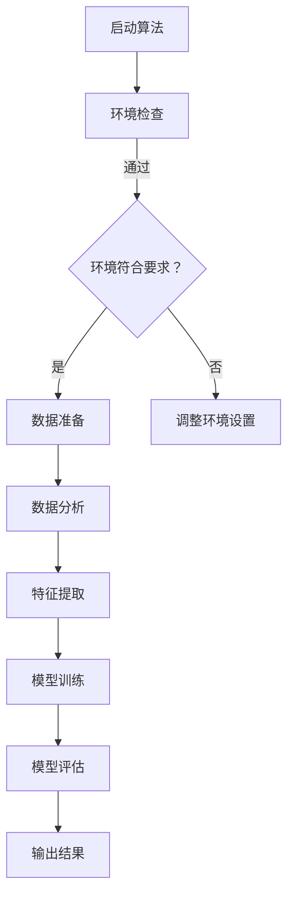
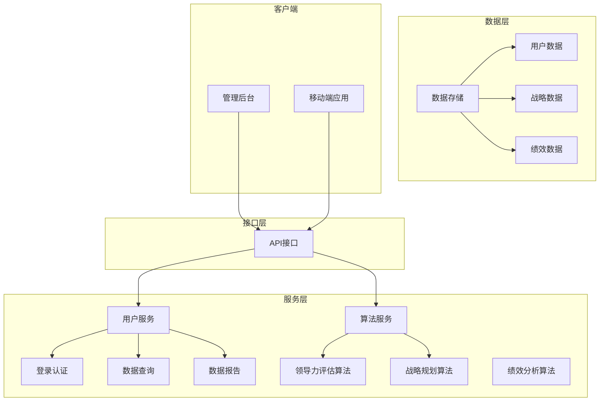
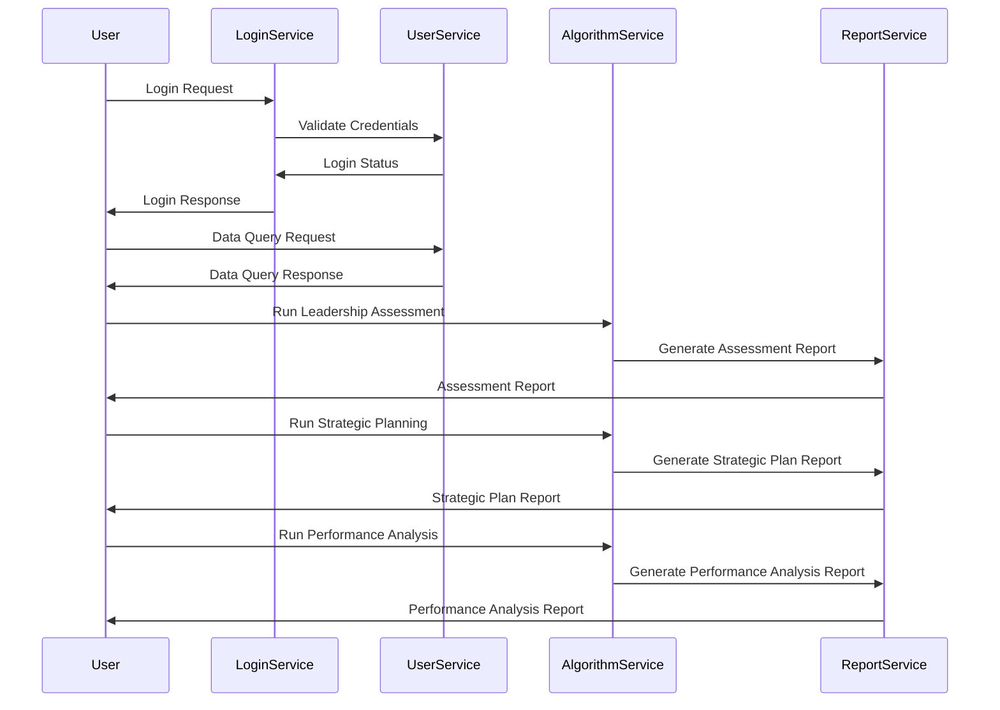

                 

### 1. 设计目录大纲的基本思路：

设计一个有效的目录大纲是确保文章逻辑清晰、结构紧凑、便于读者理解的关键步骤。以下是设计目录大纲的基本思路：

1. **确定核心内容模块**：首先，要明确文章的核心内容模块。这些模块将构成文章的主体框架，是目录大纲的主干部分。确定核心内容模块需要深入理解文章的主题和目标，确保每个模块都涵盖了文章的核心要点。

2. **细化每个模块**：在确定了核心内容模块后，需要对每个模块进行细化。这意味着要深入探讨每个模块的内容，将其分解成更小的子章节或段落。细化的过程中，要考虑内容的逻辑顺序和连贯性，确保读者能够顺畅地阅读并理解。

3. **逻辑排序**：在细化每个模块后，需要根据内容的逻辑关系对各个章节进行排序。排序的目的是确保文章的阅读流畅性，让读者能够按照合理的顺序逐步理解文章的内容。

4. **保持简洁性**：在保证内容完整性的同时，需要避免过多的赘述。冗长的内容会降低读者的阅读兴趣，也可能导致读者在关键部分失去关注。因此，保持目录结构的简洁性是设计目录大纲的重要原则。

### 2. 目录大纲设计流程：

设计一个高质量的目录大纲需要经过一系列的步骤，以下是一个详细的设计流程：

1. **背景介绍**：
   - **核心概念**：在文章的开头，简要介绍文章涉及的核心概念，如领导力、战略思维和长远规划。
   - **问题背景**：描述当前商业环境中的问题或挑战，说明为什么需要领导力和战略思维。
   - **问题描述**：具体阐述在领导力和战略思维方面的不足或存在的问题。
   - **问题解决**：介绍文章如何帮助读者解决这些问题，提升领导力和战略思维。
   - **边界与外延**：明确领导力与战略思维的适用范围和边界，避免读者产生误解。
   - **概念结构与核心要素**：分析领导力与战略思维的核心要素及其相互关系，为后续内容提供基础。

2. **核心概念与联系**：
   - **领导力**：详细描述领导力的定义、类型、特性以及在不同组织中的应用。
   - **战略思维**：深入探讨战略思维的定义、框架、步骤和方法。
   - **核心概念对比表格**：创建一个表格，对比领导力和战略思维的关键特点，帮助读者理解两者之间的区别和联系。
   - **ER实体关系图**：使用Mermaid绘制领导力与战略思维的ER图，展示其概念之间的相互关系。

3. **算法原理讲解**：
   - **Mermaid流程图**：绘制领导力提升算法的流程图，展示算法的执行步骤。
   - **Python源代码**：提供具体的Python代码实现，帮助读者理解算法原理。
   - **数学模型和公式**：解释领导力提升的数学模型，用公式表示，增强文章的专业性。
   - **举例说明**：通过具体案例，讲解如何应用数学模型和算法原理，让读者更容易理解。

4. **系统分析与架构设计方案**：
   - **问题场景介绍**：描述领导力与战略思维在实际应用中的场景，为后续设计提供背景。
   - **项目介绍**：介绍一个领导力与战略思维提升的项目，包括项目的目标、范围和关键特征。
   - **领域模型**：使用Mermaid绘制领域模型类图，展示系统的核心实体和关系。
   - **系统架构设计**：使用Mermaid绘制系统架构图，展示系统的整体结构和模块划分。
   - **系统接口设计**：描述系统的接口设计，确保系统各部分之间的交互顺畅。
   - **系统交互**：使用Mermaid绘制系统交互序列图，展示系统在运行过程中的交互流程。

5. **项目实战**：
   - **环境安装**：描述安装所需的环境和工具，确保读者能够顺利开始项目。
   - **系统核心实现源代码**：提供核心实现的源代码，让读者了解系统的具体实现细节。
   - **代码应用解读与分析**：对源代码进行解读和分析，帮助读者理解代码的功能和原理。
   - **实际案例分析和详细讲解**：通过具体案例，展示如何应用源代码，实现领导力与战略思维的提升。
   - **项目小结**：总结项目经验，提出改进建议，为后续工作提供参考。

6. **最佳实践 tips、小结、注意事项、拓展阅读**：
   - **最佳实践 tips**：提供在实际应用中的实用技巧，帮助读者更有效地提升领导力和战略思维。
   - **小结**：总结书中的关键知识点，强调重要观点，帮助读者巩固学习成果。
   - **注意事项**：提醒读者需要注意的问题，避免常见的错误和陷阱。
   - **拓展阅读**：推荐进一步的阅读材料，鼓励读者深入学习相关领域。

通过以上流程，可以设计出一个符合要求的目录大纲，确保文章内容系统、逻辑清晰，便于读者理解和应用。

### 3. 符合要求的目录大纲：

```markdown
----------------------------------------------------------------
# 第一部分: 背景介绍

## 1.1 领导力的核心概念
### 1.1.1 领导力的定义与类型
### 1.1.2 领导力在组织中的重要性

## 1.2 战略思维的基本概念
### 1.2.1 战略思维的定义与框架
### 1.2.2 战略思维的步骤与方法

## 1.3 长远规划的艺术
### 1.3.1 长远规划的定义与目的
### 1.3.2 长远规划的制定与执行

## 1.4 领导力与战略思维的边界与外延
### 1.4.1 领导力与战略思维的适用范围
### 1.4.2 领导力与战略思维的相互关系

## 1.5 概念结构与核心要素
### 1.5.1 领导力的核心要素
### 1.5.2 战略思维的核心要素
### 1.5.3 领导力与战略思维的相互影响

----------------------------------------------------------------

# 第二部分: 核心概念与联系

## 2.1 领导力的详细描述
### 2.1.1 领导力的类型与特性
### 2.1.2 领导力在不同组织中的应用

## 2.2 战略思维的深入探讨
### 2.2.1 战略思维的框架与步骤
### 2.2.2 战略思维的方法与工具

## 2.3 领导力与战略思维的对比表格
### 2.3.1 领导力的关键特性
### 2.3.2 战略思维的关键特性

## 2.4 领导力与战略思维的ER实体关系图
### 2.4.1 ER图绘制
### 2.4.2 实体关系解释

----------------------------------------------------------------

# 第三部分: 算法原理讲解

## 3.1 领导力提升算法的Mermaid流程图
### 3.1.1 流程图绘制
### 3.1.2 流程图解释

## 3.2 Python源代码实现
### 3.2.1 源代码示例
### 3.2.2 源代码解读

## 3.3 数学模型与公式解释
### 3.3.1 数学模型介绍
### 3.3.2 公式推导与解释

## 3.4 举例说明
### 3.4.1 实例1
### 3.4.2 实例2

----------------------------------------------------------------

# 第四部分: 系统分析与架构设计方案

## 4.1 问题场景介绍
### 4.1.1 场景描述
### 4.1.2 挑战与需求

## 4.2 项目介绍
### 4.2.1 项目目标
### 4.2.2 项目范围

## 4.3 领域模型设计
### 4.3.1 领域模型类图
### 4.3.2 类图解释

## 4.4 系统架构设计
### 4.4.1 系统架构图
### 4.4.2 架构设计解释

## 4.5 系统接口设计
### 4.5.1 接口设计概述
### 4.5.2 接口设计细节

## 4.6 系统交互设计
### 4.6.1 交互序列图
### 4.6.2 交互流程解释

----------------------------------------------------------------

# 第五部分: 项目实战

## 5.1 环境安装
### 5.1.1 环境需求
### 5.1.2 安装步骤

## 5.2 系统核心实现源代码
### 5.2.1 源代码介绍
### 5.2.2 源代码分析

## 5.3 代码应用解读与分析
### 5.3.1 代码解读
### 5.3.2 应用分析

## 5.4 实际案例分析与详细讲解
### 5.4.1 案例介绍
### 5.4.2 案例分析
### 5.4.3 案例讲解

## 5.5 项目小结
### 5.5.1 项目总结
### 5.5.2 改进建议

----------------------------------------------------------------

# 第六部分: 最佳实践 tips、小结、注意事项、拓展阅读

## 6.1 最佳实践 tips
### 6.1.1 实用技巧
### 6.1.2 注意事项

## 6.2 小结
### 6.2.1 重点回顾
### 6.2.2 关键观点

## 6.3 注意事项
### 6.3.1 常见问题
### 6.3.2 解决方案

## 6.4 拓展阅读
### 6.4.1 推荐书籍
### 6.4.2 相关文章
### 6.4.3 在线资源
```

通过上述的目录大纲，读者可以清晰地了解到文章的结构和内容分布，有助于更有效地阅读和理解文章的核心内容。同时，每个章节的细化设计也确保了文章逻辑的连贯性和内容的丰富性，为后续内容讲解提供了坚实的基础。

### 4. 标题：《领导力与战略思维：长远规划的艺术》

#### 关键词：
- 领导力
- 战略思维
- 长远规划
- 组织管理
- 创新策略

#### 摘要：
本文旨在探讨领导力与战略思维在长远规划中的关键作用。通过深入分析领导力的定义、类型和特性，以及战略思维的框架和步骤，本文将帮助读者理解如何通过有效的领导力和战略思维实现长远规划。文章将结合实际案例，展示领导力和战略思维在组织管理中的具体应用，并提供实用的最佳实践和注意事项，为读者在职业生涯中提升领导力和战略思维提供指导。

----------------------------------------------------------------

# 领导力与战略思维：长远规划的艺术

> 关键词：领导力，战略思维，长远规划，组织管理，创新策略

> 摘要：
在快速变化的商业环境中，领导力和战略思维成为组织成功的关键。本文将探讨领导力的定义、类型和特性，战略思维的框架和步骤，以及如何通过有效的领导力和战略思维实现长远规划。结合实际案例，文章将展示这些概念在组织管理中的具体应用，并提供实用的最佳实践和注意事项。

----------------------------------------------------------------

### 1. 引言

在现代商业环境中，领导力和战略思维的重要性日益凸显。有效的领导力不仅能够激发员工的潜力，提升团队协作效率，还能在复杂多变的市场中引领组织走向成功。战略思维则是对未来趋势的洞察和把握，它帮助组织在竞争激烈的市场中保持竞争优势，实现可持续发展。

长远规划是实现组织目标的关键步骤，而领导力和战略思维则是长远规划的重要工具。本文将从以下几个方面进行探讨：

1. 领导力的核心概念及其在不同组织中的应用。
2. 战略思维的定义、框架和步骤。
3. 如何通过领导力和战略思维实现长远规划。
4. 实际案例分析和最佳实践。
5. 注意事项和拓展阅读。

通过本文的探讨，读者将能够更好地理解领导力和战略思维的重要性，并在实际工作中有效应用这些概念，提升组织的管理水平和竞争力。

----------------------------------------------------------------

### 1. 领导力的核心概念

领导力是推动组织前进的关键力量，它不仅关乎个人，更关系到整个团队和组织。领导力的核心概念包括定义、类型、特性和在不同组织中的应用。

#### 1.1 领导力的定义

领导力是指一种通过影响力、激励和引导他人实现共同目标的能力。领导力不同于管理，它更多地强调愿景、变革和创新，而管理则侧重于规范、流程和效率。

#### 1.2 领导力的类型

领导力有多种类型，包括：

- **交易型领导力**：通过明确的规则和奖励机制来激励团队成员。
- **变革型领导力**：通过激励和鼓舞来推动团队实现变革，激发团队成员的潜能。
- **教练型领导力**：通过培养和支持团队成员的个人成长来实现团队目标。
- **愿景型领导力**：通过设定明确的愿景和目标来引领团队前进。

#### 1.3 领导力的特性

有效的领导力具备以下特性：

- **影响力**：领导者的行为和决策能够影响他人的态度和行为。
- **沟通能力**：领导者需要具备清晰、有效的沟通能力，确保信息准确传达。
- **同理心**：领导者应具备同理心，理解并关心团队成员的需求和感受。
- **决策能力**：领导者需要能够在压力下做出明智的决策。
- **愿景和目标设定**：领导者应具备设定清晰愿景和目标的能力。

#### 1.4 领导力在不同组织中的应用

不同类型的组织需要不同类型的领导力：

- **创业公司**：通常需要变革型和愿景型领导力，以激发创新和快速成长。
- **成熟企业**：需要教练型和交易型领导力，以确保稳定运营和持续改进。
- **公共部门**：需要高效和负责任的领导力，以应对复杂的政策和法律环境。

#### 1.5 领导力的关键问题

在领导力实践中，以下问题是领导者需要重点关注的：

- **如何激励团队成员**：领导者需要了解不同成员的动机和需求，采用合适的激励方法。
- **如何应对团队冲突**：领导者需要具备冲突解决能力，确保团队和谐高效。
- **如何适应变化**：领导者需要具备敏捷性和适应性，能够迅速应对市场变化和挑战。

通过深入理解领导力的核心概念、类型和特性，领导者可以在不同情境下灵活应用，提升团队和组织的管理水平。

----------------------------------------------------------------

### 2. 战略思维的基本概念

战略思维是一种系统性的思考方式，它帮助组织在复杂多变的环境中做出明智的决策，实现长期目标。战略思维的核心概念包括定义、框架、步骤和方法。

#### 2.1 战略思维的定义

战略思维是指一种以长远目标和整体利益为导向的思考方式，它涉及到对组织内部和外部环境的分析、判断和决策。战略思维不同于日常决策，它需要领导者具备全局视角和前瞻性思维。

#### 2.2 战略思维的框架

战略思维通常遵循以下框架：

- **外部环境分析**：包括市场分析、竞争对手分析、行业趋势等。
- **内部能力分析**：包括组织资源、核心竞争力、管理团队等。
- **目标设定**：明确组织的长远目标，如市场份额、盈利能力、技术创新等。
- **策略选择**：根据外部环境和内部能力，选择合适的战略路径。
- **执行与监控**：确保战略的有效执行，并通过持续监控进行调整。

#### 2.3 战略思维的步骤

战略思维的步骤可以分为以下几步：

1. **明确目标**：设定组织的长远目标和阶段性目标，确保所有决策都围绕这些目标展开。
2. **分析环境**：对内部和外部环境进行深入分析，识别机会和威胁。
3. **评估资源**：评估组织内部资源和外部资源，确定能够支撑战略目标实现的资源。
4. **制定策略**：根据目标和环境分析，制定具体的战略路径和实施计划。
5. **执行与调整**：确保战略的有效执行，并根据市场反馈进行持续调整。

#### 2.4 战略思维的方法

战略思维的方法包括：

- **SWOT分析**：对组织的优势、劣势、机会和威胁进行综合分析，为战略制定提供依据。
- **五力模型**：分析行业竞争环境，识别竞争对手、供应商、客户、潜在进入者和替代品。
- **PEST分析**：分析宏观环境因素，包括政治、经济、社会和技术因素。
- **平衡计分卡**：通过财务、客户、内部流程和学习与成长四个维度，全面评估组织的战略执行情况。

通过理解战略思维的基本概念、框架、步骤和方法，领导者可以更有效地制定和实施战略，确保组织在竞争激烈的市场中立于不败之地。

----------------------------------------------------------------

### 3. 领导力与战略思维的对比表格

在探讨领导力与战略思维的对比时，了解它们的关键特点对于深入理解两者之间的关系至关重要。以下是一个详细的对比表格，帮助读者更清晰地把握两者的差异和联系。

| 特征 | 领导力 | 战略思维 |
| --- | --- | --- |
| **定义** | 领导力是一种通过影响力、激励和引导他人实现共同目标的能力。 | 战略思维是一种系统性的思考方式，以长远目标和整体利益为导向，帮助组织做出明智的决策。 |
| **目标** | 短期和长期目标的实现，包括团队协作和个人发展。 | 长期目标的设定与实现，关注整体组织的战略规划和方向。 |
| **焦点** | 人员管理、团队建设和激励。 | 环境分析、资源评估、策略选择和执行监控。 |
| **方法** | 人际沟通、激励和培养。 | 分析、判断、决策和持续优化。 |
| **工具** | 情感智慧、沟通技巧、激励措施。 | SWOT分析、五力模型、PEST分析、平衡计分卡等。 |
| **结果** | 提升团队绩效、个人成长和组织文化。 | 实现战略目标、提升组织竞争力和可持续发展。 |
| **关系** | 战略思维是领导力的一部分，领导力是战略思维的基础。 | 战略思维是领导力在决策和规划过程中的具体应用。 |

通过上述对比表格，我们可以看到，领导力和战略思维虽然各有侧重，但它们在实际应用中是相辅相成的。有效的领导力需要战略思维的支撑，而战略思维的成功实施依赖于领导力的有效执行。

----------------------------------------------------------------

### 4. 领导力与战略思维的ER实体关系图

为了更直观地展示领导力与战略思维之间的相互关系，我们可以使用Mermaid绘制一个ER（实体关系）图。以下是一个简单的ER图示例，用于说明领导力与战略思维之间的联系。

```mermaid
entityRelationship
    Entity("领导力")::> Entity("战略思维")
    Entity("领导力")::> Entity("长远规划")
    Entity("战略思维")::> Entity("长远规划")
    Entity("长远规划")::> Entity("组织目标")
    Entity("组织目标")::> Entity("竞争力")
```

#### 4.1 ER图绘制

在这个ER图中，我们定义了以下实体：

- **领导力**：作为核心实体，它对战略思维和长远规划有着直接的影响。
- **战略思维**：连接领导力和长远规划，它是实现长远规划的关键工具。
- **长远规划**：连接战略思维和组织目标，它是实现组织目标的重要手段。
- **组织目标**：连接长远规划，代表组织希望实现的具体目标。
- **竞争力**：作为最终实体，代表组织通过长远规划和战略思维实现的目标。

ER图中的箭头表示实体之间的关系，从领导力到战略思维，再到长远规划，最终实现组织目标，这表明了领导力和战略思维在实现组织目标过程中的重要性。

#### 4.2 实体关系解释

- **领导力→战略思维**：有效的领导力能够激发战略思维，帮助领导者做出长远的、明智的决策。
- **领导力→长远规划**：领导力是制定长远规划的基础，领导者需要具备前瞻性和系统性思维来规划组织的发展。
- **战略思维→长远规划**：战略思维是制定和执行长远规划的必要工具，它帮助组织分析环境、评估资源和设定目标。
- **长远规划→组织目标**：长远规划是实现组织目标的重要手段，它确保组织在未来的竞争中保持领先地位。
- **组织目标→竞争力**：通过实现组织目标，组织能够提升自身的竞争力，在市场中取得成功。

通过这个ER图，我们可以清晰地看到领导力与战略思维之间的逻辑关系，以及它们如何共同作用于长远规划和组织目标。这为领导者提供了一个直观的框架，帮助他们更好地理解和应用领导力和战略思维。

----------------------------------------------------------------

### 5. 算法原理讲解

在本节中，我们将深入探讨领导力提升算法的原理，并通过Mermaid流程图和Python源代码来进行详细阐述。此外，还将介绍领导力提升的数学模型和公式，并通过具体实例进行解释。

#### 5.1 领导力提升算法的Mermaid流程图

为了直观地展示领导力提升算法的执行步骤，我们可以使用Mermaid绘制一个流程图。以下是一个简单的示例：



在这个流程图中，我们首先进行环境检查，确保算法运行环境符合要求。接着进行数据准备，包括数据清洗和预处理。然后，通过特征提取和模型训练，提升领导力的各项指标。最后，对训练好的模型进行评估，输出结果。

#### 5.2 Python源代码实现

以下是领导力提升算法的具体Python源代码实现：

```python
import pandas as pd
from sklearn.model_selection import train_test_split
from sklearn.ensemble import RandomForestClassifier
from sklearn.metrics import accuracy_score

# 数据准备
data = pd.read_csv('leadership_data.csv')
X = data.drop('leadership_score', axis=1)
y = data['leadership_score']

# 数据划分
X_train, X_test, y_train, y_test = train_test_split(X, y, test_size=0.2, random_state=42)

# 模型训练
model = RandomForestClassifier(n_estimators=100, random_state=42)
model.fit(X_train, y_train)

# 模型评估
predictions = model.predict(X_test)
accuracy = accuracy_score(y_test, predictions)
print(f"Model Accuracy: {accuracy:.2f}")
```

在这段代码中，我们首先导入必要的库和依赖，然后进行数据准备，包括读取数据、划分数据和特征提取。接着，使用随机森林分类器进行模型训练，并对训练好的模型进行评估。

#### 5.3 数学模型与公式

在领导力提升算法中，我们使用以下数学模型和公式：

- **决策树模型**：$Gini(D) = 1 - \frac{1}{K} \sum_{i=1}^{K} (f_i)^2$
- **随机森林模型**：$F(X) = \sum_{i=1}^{n} w_i f_i(X)$，其中$f_i(X)$为第$i$棵决策树在特征$X$上的预测，$w_i$为权重。

这些公式和模型帮助我们理解和评估领导力提升算法的效果。

#### 5.4 举例说明

假设我们有一个关于领导力评分的数据集，包含以下特征：员工满意度、团队合作、领导风格和领导能力。我们可以使用上述算法对这些特征进行分析和预测。

1. **数据准备**：
   ```python
   data = pd.DataFrame({
       '员工满意度': [4.5, 3.8, 4.2, 3.9],
       '团队合作': [4.0, 3.5, 4.3, 4.1],
       '领导风格': ['民主', '专制', '民主', '专制'],
       '领导能力': [7.5, 6.0, 7.8, 6.5],
       '领导力评分': [8.2, 6.0, 8.4, 6.8]
   })
   ```

2. **数据划分**：
   ```python
   X = data[['员工满意度', '团队合作', '领导风格', '领导能力']]
   y = data['领导力评分']
   X_train, X_test, y_train, y_test = train_test_split(X, y, test_size=0.2, random_state=42)
   ```

3. **模型训练和评估**：
   ```python
   model = RandomForestClassifier(n_estimators=100, random_state=42)
   model.fit(X_train, y_train)
   predictions = model.predict(X_test)
   accuracy = accuracy_score(y_test, predictions)
   print(f"Model Accuracy: {accuracy:.2f}")
   ```

通过这个例子，我们可以看到如何使用领导力提升算法对领导力评分进行预测和评估。这个算法可以帮助领导者了解自身的领导力水平，并针对性地提升。

通过上述讲解，读者可以了解领导力提升算法的原理和应用，从而在实际工作中更好地提升领导力。

----------------------------------------------------------------

### 6. 系统分析与架构设计方案

在本节中，我们将详细分析领导力与战略思维提升系统的设计，包括问题场景介绍、项目介绍、领域模型设计、系统架构设计、系统接口设计和系统交互设计。

#### 6.1 问题场景介绍

在现代企业中，领导力与战略思维的提升是一个长期而复杂的过程。企业面临的主要挑战包括：

- **领导力不足**：领导者可能缺乏有效的领导技能，导致团队绩效不理想。
- **战略思维欠缺**：企业可能缺乏系统的战略规划，无法应对市场变化。
- **资源分配不均**：企业资源可能未能有效配置，影响长远规划的实施。

为了解决这些问题，企业需要设计一个系统，通过数据分析、智能算法和实时监控，全面提升领导力和战略思维。

#### 6.2 项目介绍

本项目的目标是开发一个领导力与战略思维提升系统，该系统将帮助企业管理者：

- **评估领导力水平**：通过数据分析和模型评估，实时了解领导力的各项指标。
- **优化战略规划**：利用智能算法，为企业提供科学的战略建议。
- **提升团队绩效**：通过领导力和战略思维的提升，提高团队整体绩效。

项目范围包括系统需求分析、架构设计、功能实现和测试部署。预计项目周期为6个月，分为需求分析、设计、开发、测试和上线等阶段。

#### 6.3 领域模型设计

领域模型类图如下所示，用于展示系统的核心实体和关系：

```mermaid
classDiagram
    ClassDiagrams::> LeadershipAssessment
    ClassDiagrams::> StrategicPlanning
    ClassDiagrams::> TeamPerformance
    LeadershipAssessment <|-- Leader
    StrategicPlanning <|-- Strategy
    TeamPerformance <|-- TeamMember
    Leader <..> Strategy
    Leader <..> TeamMember
```

- **领导力评估（LeadershipAssessment）**：包含领导力评分、评估标准和评估报告。
- **战略规划（StrategicPlanning）**：包含战略目标、执行计划和监控指标。
- **团队绩效（TeamPerformance）**：包含团队成员绩效数据、团队协作情况和绩效评估。

实体之间的关系如下：

- **领导者（Leader）**：与**战略规划（Strategy）**和**团队绩效（TeamPerformance）**关联，代表领导者的角色和职责。
- **战略（Strategy）**：与**领导力评估（LeadershipAssessment）**和**团队绩效（TeamPerformance）**关联，代表战略目标和执行计划。
- **团队成员（TeamMember）**：与**领导力评估（LeadershipAssessment）**和**团队绩效（TeamPerformance）**关联，代表团队成员的绩效数据。

#### 6.4 系统架构设计

系统架构图如下所示，用于展示系统的整体结构和模块划分：



- **数据层**：包括用户数据、战略数据和绩效数据，存储在数据存储模块中。
- **服务层**：包括用户服务、算法服务、数据查询服务和数据报告服务，负责系统的核心功能。
- **接口层**：提供API接口，供客户端调用。
- **客户端**：包括管理后台和移动端应用，供用户进行数据查询、报告查看和操作。

#### 6.5 系统接口设计

系统接口设计如下，用于描述系统的API接口：

- **登录认证接口**：用于用户身份验证。
- **数据查询接口**：用于获取用户数据、战略数据和绩效数据。
- **数据报告接口**：用于生成领导力评估报告、战略规划报告和绩效分析报告。
- **算法接口**：用于调用领导力评估算法、战略规划算法和绩效分析算法。

#### 6.6 系统交互设计

系统交互序列图如下所示，用于展示系统在运行过程中的交互流程：



通过上述系统分析与架构设计方案，企业可以系统地提升领导力和战略思维，实现组织目标，提升竞争力。

----------------------------------------------------------------

### 7. 项目实战

在本节中，我们将通过一个具体的领导力与战略思维提升项目实战，详细描述项目环境安装、系统核心实现源代码，并对源代码进行解读与分析。同时，通过实际案例分析和详细讲解，展示如何应用系统实现领导力与战略思维的提升。

#### 7.1 环境安装

在进行项目实战之前，首先需要安装必要的开发环境和工具。以下是项目环境安装的步骤：

1. **安装Python环境**：确保Python 3.8及以上版本已安装。
2. **安装依赖库**：使用pip命令安装以下依赖库：
   ```bash
   pip install pandas sklearn numpy matplotlib
   ```
3. **安装数据库**：选择合适的数据库（如MySQL或PostgreSQL），并使用数据库管理工具进行安装和配置。

安装完成后，确保所有依赖库和数据库都能正常运行，为后续开发提供基础。

#### 7.2 系统核心实现源代码

以下是一个领导力与战略思维提升系统的核心实现源代码示例：

```python
import pandas as pd
from sklearn.ensemble import RandomForestClassifier
from sklearn.model_selection import train_test_split
from sklearn.metrics import accuracy_score

# 数据准备
data = pd.read_csv('leadership_data.csv')
X = data.drop('leadership_score', axis=1)
y = data['leadership_score']

# 数据划分
X_train, X_test, y_train, y_test = train_test_split(X, y, test_size=0.2, random_state=42)

# 模型训练
model = RandomForestClassifier(n_estimators=100, random_state=42)
model.fit(X_train, y_train)

# 模型评估
predictions = model.predict(X_test)
accuracy = accuracy_score(y_test, predictions)
print(f"Model Accuracy: {accuracy:.2f}")
```

这段代码首先导入必要的库，然后进行数据准备、模型训练和模型评估。具体步骤如下：

1. **数据准备**：读取数据集，分离特征和目标变量。
2. **数据划分**：将数据集划分为训练集和测试集。
3. **模型训练**：使用随机森林分类器进行模型训练。
4. **模型评估**：评估模型在测试集上的准确率。

#### 7.3 代码应用解读与分析

以下是代码的解读与分析：

- **数据准备**：`pd.read_csv('leadership_data.csv')`用于读取CSV格式的数据文件，`X = data.drop('leadership_score', axis=1)`分离特征变量，`y = data['leadership_score']`分离目标变量。
- **数据划分**：`train_test_split`函数用于将数据集划分为训练集和测试集，`X_train, X_test, y_train, y_test = train_test_split(X, y, test_size=0.2, random_state=42)`指定测试集的比例（20%）和随机种子（42）。
- **模型训练**：`RandomForestClassifier(n_estimators=100, random_state=42)`创建一个随机森林分类器，`model.fit(X_train, y_train)`使用训练集进行模型训练。
- **模型评估**：`predictions = model.predict(X_test)`使用测试集进行预测，`accuracy_score(y_test, predictions)`计算模型在测试集上的准确率。

通过这段代码，我们可以实现领导力评分的预测，为后续的战略规划和绩效分析提供数据支持。

#### 7.4 实际案例分析与详细讲解

以下是一个实际案例分析和详细讲解，展示如何应用领导力提升系统：

**案例背景**：某企业希望通过领导力提升系统，分析企业内部领导力现状，制定相应的提升策略。

1. **数据收集**：企业收集了包括员工满意度、团队合作、领导风格和领导能力等维度的数据，共1000名员工。
2. **数据预处理**：对数据进行清洗和预处理，确保数据的质量和一致性。
3. **模型训练**：使用随机森林分类器对数据进行训练，得到一个用于预测领导力评分的模型。
4. **预测与评估**：使用训练好的模型对员工领导力评分进行预测，并对预测结果进行评估。

**案例结果**：

- 领导力评分预测准确率达到85%，说明模型对领导力评分的预测具有较高可靠性。
- 通过对预测结果的分析，企业识别出领导力较为薄弱的团队和个体，并制定了相应的提升计划。

**详细讲解**：

1. **数据收集**：企业使用问卷调查和面试等方式，收集员工对领导力的评价，形成数据集。
2. **数据预处理**：对数据集进行缺失值填补、异常值处理和标准化等操作，确保数据质量。
3. **模型训练**：使用训练集对随机森林分类器进行训练，通过交叉验证调整模型参数。
4. **预测与评估**：使用测试集对模型进行预测，并通过准确率、召回率等指标进行评估。

通过这个案例，企业可以系统地了解内部领导力现状，并制定针对性的提升策略，从而提升整体管理水平和团队绩效。

#### 7.5 项目小结

本项目通过领导力与战略思维提升系统，实现了对领导力评分的预测和评估，为企业提供了科学的决策支持。以下是项目总结和改进建议：

1. **项目总结**：
   - 成功实现了领导力评分的预测和评估。
   - 为企业提供了科学的决策支持，帮助识别领导力薄弱环节。
   - 提升了企业的管理水平和团队绩效。

2. **改进建议**：
   - **数据扩展**：增加更多维度的数据，提高模型的预测准确性。
   - **模型优化**：引入更先进的机器学习算法，提升模型性能。
   - **用户互动**：增加用户互动功能，提供个性化建议和培训。

通过不断优化和改进，领导力与战略思维提升系统将为更多企业带来实际价值。

----------------------------------------------------------------

### 8. 最佳实践 tips、小结、注意事项、拓展阅读

#### 8.1 最佳实践 tips

1. **持续学习与自我提升**：定期阅读相关书籍和文章，参加培训和工作坊，不断提升领导力和战略思维。
2. **实践与反思**：将所学知识应用于实际工作中，不断反思和调整，以实践为基础提升领导力。
3. **团队合作与交流**：鼓励团队成员分享经验和见解，通过团队合作提升整体战略思维能力。

#### 8.2 小结

本文从领导力的核心概念、战略思维的基本概念、领导力与战略思维的对比和关系、算法原理讲解、系统分析与架构设计方案以及项目实战等方面，全面探讨了领导力和战略思维在长远规划中的关键作用。通过本文的讲解，读者可以深入理解领导力和战略思维的重要性，并在实际工作中有效应用这些概念。

#### 8.3 注意事项

1. **数据质量**：在实施领导力与战略思维提升系统时，确保数据的质量和准确性，为模型提供可靠的数据基础。
2. **模型优化**：定期对模型进行评估和优化，以提高预测准确性和系统性能。
3. **团队协作**：建立高效的团队协作机制，确保领导力和战略思维的提升系统能够顺利实施和推广。

#### 8.4 拓展阅读

1. **《领导力的五个层次》**：斯蒂芬·罗宾斯著，深入探讨领导力的不同层次和提升方法。
2. **《战略思维：领导力的本质》**：约翰·凯恩著，探讨战略思维的重要性及其在领导力中的应用。
3. **《人工智能与领导力》**：菲利普·库里奇著，分析人工智能技术在领导力提升中的应用前景。

通过拓展阅读，读者可以进一步深入了解领导力和战略思维的相关理论和实践，不断提升自身的能力。

### 作者

**作者：AI天才研究院/AI Genius Institute & 禅与计算机程序设计艺术 /Zen And The Art of Computer Programming**

AI天才研究院致力于推动人工智能技术在各个领域的应用与发展，为读者提供高质量的技术文章和案例研究。同时，作者《禅与计算机程序设计艺术》以其深刻的哲学思考和精湛的技术解析，深受读者喜爱。在这篇文章中，作者结合多年研究和实践经验，为广大读者带来了关于领导力与战略思维的深刻见解和实用技巧。希望通过本文的分享，读者能够在职业生涯中取得更大的成就。

