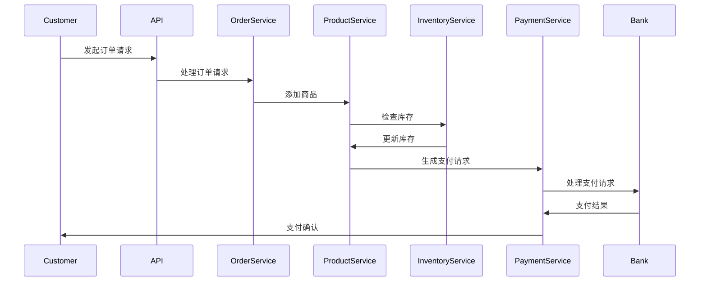

                 

### 关键词

**领导力**，**战略思维**，**长远规划**，**决策框架**，**创新思维**，**全球视野**，**未来趋势**。

### 摘要

本文深入探讨了领导力与战略思维的结合，以及如何在长远规划中运用这些理念。通过分析领导力的核心要素和战略思维的重要性，本文逐步构建了战略规划的框架和步骤，并探讨了领导力在决策执行和创新思维中的关键作用。文章还展望了全球视野下的领导力挑战，并提出了未来领导力发展的趋势和培养方法。通过丰富的案例和实践指导，本文为IT领域的领导者提供了深刻的洞察和实用的策略。

---

## 第一部分：领导力基础

### 第1章：领导力概述

领导力是一种影响力，它能够引导和激励团队朝着共同的目标前进。在当今快速变化的商业环境中，领导力不仅是组织成功的关键，也是个人职业生涯发展的重要素质。本章将详细探讨领导力的定义、核心要素以及其重要性。

### 1.1.1 问题背景与核心要素

在现代企业中，领导力被广泛认为是组织成功的关键因素。那么，领导力究竟是什么？它有哪些核心要素？如何理解领导力的定义和重要性？这些问题是我们探讨领导力的基础。

**领导力的定义**：领导力可以理解为一种影响和激励他人实现共同目标的能力。它不仅包括个人品质，如正直、自信、勇气，还包括一系列行为和技能，如沟通、决策、团队建设等。

**领导力的核心要素**：

1. **影响力**：领导力的核心在于其影响力，这种影响力是建立在对他人理解、尊重和信任的基础上的。
2. **目标导向**：领导者需要明确组织的目标，并将其传达给团队成员，激励他们为实现这些目标而努力。
3. **沟通能力**：有效的沟通是领导力的关键，领导者需要能够清晰、准确地表达自己的想法，并倾听和理解团队成员的意见和需求。
4. **决策能力**：领导者需要具备在不确定性环境中做出明智决策的能力。

### 1.1.2 领导力的定义与重要性

**领导力的定义**：领导力是一种复杂的能力，它包括一系列的个人特质、行为和技能。这些特质和技能共同构成了领导力的核心。

1. **个人特质**：如诚信、正直、勇气、自信等。
2. **行为**：如沟通、决策、团队建设、激励等。
3. **技能**：如问题解决、冲突管理、变革管理、战略规划等。

**领导力的重要性**：

1. **组织成功**：领导力是组织成功的关键。一个强大的领导团队能够推动组织实现目标，提高绩效。
2. **个人发展**：领导力也是个人职业发展的关键。具备领导力的人更容易获得职业晋升，承担更多责任。
3. **社会影响**：领导力不仅影响组织和个人，还能够对社会产生深远的影响。优秀的领导者能够推动社会进步，解决重大问题。

### 1.1.3 领导力的三大核心概念

**1. 领导力与管理的区别**：

- **领导力**：强调个人影响力、价值观和愿景，旨在激励他人。
- **管理**：强调流程、制度和结构，旨在确保组织目标的实现。

**2. 领导力的影响因素**：

- **个人特质**：如自信、勇气、正直等。
- **情境因素**：如组织文化、环境变化等。
- **团队因素**：如团队成员的能力、动机等。

**3. 领导力的类型与风格**：

- **领导力的类型**：如变革型领导、交易型领导等。
- **领导力的风格**：如权威型、民主型、参与型等。

### 1.1.4 领导力的边界与外延

**1. 领导力的边界**：

- **组织内部**：领导力通常在组织内部发挥作用，影响团队成员。
- **组织外部**：领导力也可能影响组织的外部环境，如客户、供应商等。

**2. 领导力的外延**：

- **领导力的发展**：如领导力培训、领导力发展计划等。
- **领导力的实践**：如领导力实践中的道德准则、社会责任等。

### 1.1.5 本章小结

通过本章的探讨，我们了解了领导力的定义、核心要素以及其重要性。领导力不仅是一种个人特质和行为，更是一种影响和激励他人实现共同目标的能力。理解领导力的核心概念和边界，对于提升个人和组织的能力都具有重要意义。

---

在下一章中，我们将深入探讨战略思维的概念、重要性以及其核心框架和工具，为理解长远规划奠定基础。

---

## 第二部分：战略思维

### 第2章：战略思维

战略思维是一种系统性的思考方式，它帮助领导者理解组织所处的环境，制定长远的发展计划，并有效利用资源实现目标。战略思维不仅是一种管理工具，更是一种思维方式。本章将详细探讨战略思维的定义、重要性以及其核心框架和工具。

### 2.1.1 战略思维概述

**战略思维的定义**：战略思维是一种关于如何利用资源、抓住机遇、应对挑战的思考方式。它强调系统性、前瞻性和灵活性。

**战略思维的重要性**：

1. **指导决策**：战略思维能够帮助领导者做出更明智的决策，减少盲目性和随机性。
2. **规划未来**：战略思维使领导者能够预见未来可能的变化，为组织的发展做好准备。
3. **资源优化**：战略思维能够帮助领导者有效配置资源，提高组织的效率。

### 2.1.2 战略思维的重要性

**战略思维的重要性**：

1. **在不确定性中的导航**：在快速变化的商业环境中，战略思维能够帮助组织更好地应对不确定性，降低风险。
2. **整合资源**：战略思维能够帮助组织整合内外部的资源，提高整体效能。
3. **长期发展**：战略思维关注长远目标，有助于组织实现可持续发展。

### 2.1.3 战略思维的框架与工具

**1. SWOT分析**：

- **定义**：SWOT分析是一种用于评估组织优势、劣势、机会和威胁的工具。
- **应用**：通过SWOT分析，领导者可以明确组织的现状，制定相应的战略。

**2. 五力模型**：

- **定义**：五力模型是迈克尔·波特提出的一种用于分析行业竞争环境的工具。
- **应用**：通过五力模型，领导者可以了解行业的竞争态势，制定相应的竞争策略。

**3. PEST分析**：

- **定义**：PEST分析是一种用于分析宏观环境因素的工具。
- **应用**：通过PEST分析，领导者可以了解外部环境的变化，为组织的战略制定提供依据。

### 2.1.4 战略规划的步骤与流程

**战略规划的步骤**：

1. **明确目标**：确定组织的长期和短期目标。
2. **环境分析**：通过SWOT分析和五力模型等工具，了解组织的内外部环境。
3. **制定策略**：根据环境分析和目标，制定具体的战略和行动计划。
4. **实施和监控**：执行战略计划，并定期评估和调整。

### 2.1.5 战略思维的应用场景

**战略思维的应用场景**：

1. **企业战略**：在企业层面，战略思维用于制定长期发展计划，提高市场竞争力。
2. **项目管理**：在项目管理中，战略思维用于规划项目目标、资源分配和风险管理。
3. **产品开发**：在产品开发中，战略思维用于确定产品方向、市场需求和竞争分析。

### 2.1.6 本章小结

通过本章的探讨，我们了解了战略思维的定义、重要性以及其核心框架和工具。战略思维是一种系统性的思考方式，它帮助领导者理解组织所处的环境，制定长远的发展计划，并有效利用资源实现目标。理解战略思维，对于提升领导能力和组织竞争力具有重要意义。

在下一章中，我们将进一步探讨长远规划的艺术，分析其核心原则和实施策略。

---

## 第三部分：长远规划的艺术

### 第3章：长远规划

长远规划是组织成功的关键，它帮助领导者确定组织的长期目标，并制定相应的战略和行动计划。本章将深入探讨长远规划的核心原则、目标设定、实施策略以及领导力在其中的作用。

### 3.1.1 长远规划的核心原则

**1. 目标导向**：长远规划应以明确的目标为导向，确保资源的有效利用。
**2. 系统性**：长远规划应考虑组织的整体性，平衡各个部门的发展。
**3. 可行性**：长远规划应基于现实情况，确保计划的可行性和可操作性。
**4. 灵活性**：长远规划应具有灵活性，能够适应环境的变化。

### 3.1.2 长远规划的目标设定

**目标设定的原则**：

1. **明确性**：目标应具体、明确，便于衡量和评估。
2. **挑战性**：目标应具有一定的挑战性，激发团队的动力和创造力。
3. **可实现性**：目标应在现有资源和条件下可实现。
4. **时限性**：目标应设定明确的时间框架。

### 3.1.3 长远规划的实施策略

**1. 资源配置**：合理配置资源是长远规划的关键。领导者需要根据目标优先级，分配人力、物力和财力。
**2. 风险管理**：长远规划中应识别和评估潜在风险，并制定相应的应对策略。
**3. 持续改进**：长远规划是一个动态过程，需要持续监控和调整，以适应环境变化。

### 3.1.3.1 资源配置

**资源配置的原则**：

1. **优先级**：根据目标的重要性和紧迫性，优先分配资源。
2. **效率**：确保资源利用最大化，避免浪费。
3. **灵活性**：资源配置应具备一定的灵活性，以应对突发事件。

### 3.1.3.2 风险管理

**风险管理的方法**：

1. **风险评估**：识别潜在风险，评估其可能性和影响。
2. **风险应对**：制定应对策略，包括风险规避、风险转移和风险接受。
3. **监控与调整**：定期监控风险状况，及时调整应对策略。

### 3.1.3.3 持续改进

**持续改进的策略**：

1. **定期评估**：定期对长远规划进行评估，识别问题和不足。
2. **反馈机制**：建立反馈机制，收集团队成员的意见和建议。
3. **改进措施**：根据评估结果，制定并实施改进措施。

### 3.1.4 长远规划中的领导力作用

**领导力在长远规划中的作用**：

1. **目标设定**：领导者需要明确长远规划的目标，并激发团队的热情和参与度。
2. **资源调配**：领导者需要合理配置资源，确保规划的实施。
3. **风险管理**：领导者需要识别和应对潜在风险，确保规划的稳定性。
4. **持续改进**：领导者需要推动持续改进，确保规划的有效性。

### 3.1.5 长远规划的实际案例

**案例一**：某大型科技公司制定10年长远规划，明确技术研发、市场拓展和人才培养等关键目标，通过合理配置资源和持续改进，实现了业务快速增长。

**案例二**：某初创企业通过制定3年长远规划，明确了产品研发、市场推广和团队建设等目标，成功获得了风险投资，并在市场中站稳脚跟。

### 3.1.6 本章小结

通过本章的探讨，我们了解了长远规划的核心原则和实施策略。长远规划不仅是一种战略思维，更是一种行动指南。领导者需要通过明确目标、合理配置资源、风险管理以及持续改进，确保组织能够实现长期发展。长远规划中的领导力作用至关重要，领导者需要发挥其影响力，激发团队的潜力，共同实现组织的愿景。

在下一部分中，我们将探讨战略思维与领导力的结合，分析领导力在战略决策和执行中的关键作用。

---

## 第四部分：战略思维与领导力的结合

### 第4章：战略决策与领导力

战略决策是组织发展的核心环节，它关系到组织的长远目标和市场竞争力的提升。领导力在战略决策中扮演着至关重要的角色，领导者需要运用战略思维，制定科学的决策框架，并有效实施战略计划。本章将深入探讨战略决策的核心要素、领导力在其中的作用以及具体的决策框架和方法。

### 4.1.1 战略决策的核心要素

**战略决策的核心要素**包括以下几个方面：

1. **目标明确**：战略决策必须建立在明确的目标基础上，确保决策的导向性和针对性。
2. **信息全面**：决策需要基于全面、准确的信息，包括内部数据、市场趋势、竞争对手状况等。
3. **风险评估**：对潜在风险进行评估，制定相应的风险应对策略。
4. **资源匹配**：确保决策所需的资源能够得到合理配置，避免资源浪费。
5. **执行力强**：决策需要具备较强的执行力，确保能够顺利实施。

### 4.1.2 领导力在战略决策中的作用

**领导力在战略决策中的作用**：

1. **目标导向**：领导者需要明确组织的战略目标，并引导团队朝着这些目标努力。
2. **信息整合**：领导者需要收集、分析和整合信息，为战略决策提供数据支持。
3. **风险评估**：领导者需要具备前瞻性思维，识别潜在风险，并制定应对措施。
4. **决策制定**：领导者需要运用科学的决策框架和方法，制定有效的战略决策。
5. **执行力提升**：领导者需要确保决策能够得到有效执行，推动组织目标的实现。

### 4.1.3 战略决策的框架与方法

**1. 决策树分析**：

- **定义**：决策树分析是一种图形化的决策分析工具，通过树形结构展示不同决策路径和结果。
- **应用**：在战略决策中，决策树分析可以帮助领导者评估不同决策路径的潜在收益和风险。

**2. 多目标决策**：

- **定义**：多目标决策涉及多个相互冲突的目标，需要平衡和优化。
- **应用**：在战略决策中，多目标决策可以帮助领导者综合考虑不同目标的优先级，制定综合性的决策。

**3. 模糊决策**：

- **定义**：模糊决策是一种处理不确定性和模糊性的决策方法。
- **应用**：在战略决策中，模糊决策可以帮助领导者应对不确定的环境，做出合理的决策。

### 4.1.4 领导力在战略决策中的应用

**领导力在战略决策中的应用**：

1. **沟通协调**：领导者需要与团队成员保持有效沟通，协调各方资源，确保决策的顺利实施。
2. **决策监督**：领导者需要监督决策的执行过程，及时发现和解决问题。
3. **持续改进**：领导者需要推动决策的持续改进，确保决策能够适应环境变化。

### 4.1.5 战略决策的实际案例

**案例一**：某科技公司通过决策树分析，评估了进入新市场的潜在收益和风险，最终决定投入大量资源进行市场拓展，成功提升了市场竞争力。

**案例二**：某初创企业采用多目标决策方法，综合考虑产品研发、市场推广和团队建设等目标，制定了全面的战略计划，成功获得了风险投资。

### 4.1.6 本章小结

通过本章的探讨，我们了解了战略决策的核心要素、领导力在其中的作用以及具体的决策框架和方法。战略决策是组织发展的关键环节，领导力在其中发挥着至关重要的作用。领导者需要运用战略思维，制定科学的决策框架，并有效实施战略计划，确保组织能够实现长远发展。在下一章中，我们将探讨战略执行中的领导力作用，分析领导力在战略执行中的关键作用。

---

## 第5章：战略执行与领导力

### 5.1.1 战略执行的重要性

战略执行是将战略计划转化为实际行动的过程，它是实现组织目标的关键环节。战略执行的成功与否直接关系到组织的发展和市场竞争力。领导力在战略执行中起着至关重要的作用，领导者需要确保战略计划的顺利实施，推动组织目标的实现。

### 5.1.2 战略执行中的领导力作用

**领导力在战略执行中的作用**：

1. **协调资源**：领导者需要协调各部门的资源，确保资源能够有效地支持战略计划的实施。
2. **激励团队**：领导者需要激发团队成员的积极性和创造力，确保团队在执行过程中能够保持高效率。
3. **监控进度**：领导者需要监控战略执行的进度，及时发现并解决问题。
4. **调整策略**：领导者需要根据执行过程中遇到的问题和变化，灵活调整战略计划。
5. **建立信任**：领导者需要建立与团队成员之间的信任关系，确保团队在执行过程中能够相互支持和协作。

### 5.1.3 战略执行的步骤与流程

**战略执行的步骤**：

1. **制定执行计划**：根据战略计划，制定详细的执行计划，明确各个阶段的目标和任务。
2. **分配责任**：将执行计划中的任务分配给相应的团队成员，明确责任和权限。
3. **沟通与协作**：确保团队成员之间有充分的沟通和协作，共同推进战略计划的实施。
4. **监控与评估**：定期监控战略执行的进度和效果，评估执行过程中遇到的问题，并及时调整。
5. **持续改进**：根据执行过程中积累的经验和教训，不断改进战略执行的方法和流程。

### 5.1.3.1 制定执行计划

**制定执行计划的原则**：

1. **目标明确**：执行计划应明确各个阶段的目标和任务，确保团队成员有清晰的方向。
2. **资源匹配**：执行计划应考虑资源的合理配置，确保任务能够得到有效执行。
3. **灵活调整**：执行计划应具有一定的灵活性，能够适应环境变化和意外情况。
4. **责任明确**：执行计划应明确各个团队成员的责任和权限，确保任务能够得到有效落实。

### 5.1.3.2 激励与协调

**激励与协调的方法**：

1. **目标激励**：设定具有挑战性和吸引力的目标，激发团队成员的动力。
2. **奖励机制**：建立有效的奖励机制，对表现优秀的团队成员给予奖励。
3. **沟通协调**：建立有效的沟通机制，确保团队成员之间的信息交流和协作。
4. **团队建设**：组织定期的团队建设活动，增强团队成员之间的凝聚力和合作意识。

### 5.1.3.3 监控与调整

**监控与调整的策略**：

1. **定期评估**：定期对战略执行情况进行评估，识别存在的问题和不足。
2. **反馈机制**：建立有效的反馈机制，收集团队成员的意见和建议，及时调整执行计划。
3. **灵活调整**：根据评估结果和环境变化，灵活调整执行计划，确保战略目标的实现。

### 5.1.4 领导力在战略执行中的应用

**领导力在战略执行中的应用**：

1. **决策能力**：领导者需要具备在执行过程中快速做出有效决策的能力，确保战略计划的顺利实施。
2. **沟通能力**：领导者需要具备良好的沟通能力，确保信息能够准确传达，避免误解和冲突。
3. **团队管理**：领导者需要具备团队管理能力，激发团队的潜能，提高团队的整体绩效。

### 5.1.5 战略执行的实际案例

**案例一**：某高科技公司通过制定详细的执行计划，明确了各个阶段的目标和任务，确保了战略计划的顺利实施，成功实现了企业的跨越式发展。

**案例二**：某中小企业在实施战略计划过程中，通过建立有效的沟通机制和反馈机制，及时发现和解决问题，确保了战略计划的执行效果。

### 5.1.6 本章小结

通过本章的探讨，我们了解了战略执行的重要性以及领导力在其中的关键作用。战略执行是将战略计划转化为实际行动的过程，领导力在其中起着至关重要的作用。领导者需要通过制定执行计划、激励团队、监控进度和灵活调整策略，确保战略计划的顺利实施。在下一章中，我们将探讨创新思维与领导力的结合，分析领导力在创新思维中的作用。

---

## 第6章：创新思维与领导力

### 6.1.1 创新思维的重要性

创新思维是推动组织发展和市场竞争力提升的关键因素。在当今快速变化的市场环境中，创新不仅是一种竞争力，更是企业生存和发展的必要条件。领导力在创新思维中发挥着至关重要的作用，领导者需要培养和激励团队的创新思维，推动组织的持续创新。

### 6.1.2 创新思维的框架与方法

**1. 模拟思维**

- **定义**：模拟思维是通过模仿现实世界的过程或系统来理解其行为和特性。
- **应用**：在创新思维中，模拟思维可以帮助团队预测新产品的市场表现，评估新技术的可行性。

**2. 反向思维**

- **定义**：反向思维是从相反的角度思考问题，寻找创新的解决方案。
- **应用**：在创新思维中，反向思维可以帮助团队突破传统思维限制，发现新的市场机会。

**3. 系统思维**

- **定义**：系统思维是理解事物之间的相互关系和整体性。
- **应用**：在创新思维中，系统思维可以帮助团队从整体的角度看待问题，制定全面的创新策略。

### 6.1.3 领导力在创新思维中的作用

**领导力在创新思维中的作用**：

1. **激励创新**：领导者需要激发团队成员的创新动力，鼓励他们提出新的想法和解决方案。
2. **提供资源**：领导者需要提供必要的资源和支持，为创新提供保障。
3. **风险管理**：领导者需要识别和应对创新过程中的风险，确保创新的顺利进行。
4. **建立文化**：领导者需要建立鼓励创新的组织文化，营造积极创新的环境。

### 6.1.4 创新思维的实际案例

**案例一**：某科技公司通过模拟思维，模拟了新产品的市场推广过程，成功预测了产品的市场表现，确保了新产品的顺利推出。

**案例二**：某初创企业通过反向思维，从传统的产品制造模式中找到了新的市场机会，开发了全新的商业模式，实现了企业的快速增长。

### 6.1.5 本章小结

通过本章的探讨，我们了解了创新思维的重要性以及领导力在其中的关键作用。创新思维是推动组织发展和市场竞争力提升的关键因素，领导力在其中发挥着重要的激励、资源提供、风险管理和文化建立的作用。领导者需要通过培养和激励团队的创新思维，推动组织的持续创新。在下一章中，我们将探讨全球视野与领导力，分析领导力在全球视野下的挑战和作用。

---

## 第7章：全球视野与领导力

### 7.1.1 全球视野的重要性

在全球化的背景下，领导力必须具备全球视野，能够理解和应对全球范围内的商业挑战和机遇。全球视野不仅是领导者的个人素质，也是组织发展的关键。本章将深入探讨全球视野的重要性、战略思维在其中的作用以及领导力在全球视野下的挑战和作用。

### 7.1.2 全球视野下的战略思维

**1. 跨文化管理**：

- **定义**：跨文化管理是在不同文化背景下进行的管理活动。
- **应用**：全球视野下的战略思维需要考虑跨文化因素，包括文化差异、价值观和沟通方式等。

**2. 全球供应链管理**：

- **定义**：全球供应链管理是组织在全球范围内管理供应链的活动。
- **应用**：全球视野下的战略思维需要考虑供应链的优化、物流管理和风险管理。

**3. 国际市场战略**：

- **定义**：国际市场战略是组织在全球市场上进行竞争的战略。
- **应用**：全球视野下的战略思维需要考虑市场定位、竞争策略和客户需求。

### 7.1.3 全球视野下的领导力挑战

**领导力在全球视野下的挑战**：

1. **文化差异**：领导者需要理解和尊重不同文化，避免文化冲突。
2. **语言障碍**：领导者需要具备一定的语言能力，确保有效的沟通和协作。
3. **全球化竞争**：领导者需要具备全球市场洞察力，应对全球范围内的竞争。
4. **风险管理**：领导者需要具备全球风险管理能力，应对复杂的国际环境。

### 7.1.3.1 跨文化领导力

**跨文化领导力的原则**：

1. **尊重差异**：领导者需要尊重不同文化的差异，避免偏见和歧视。
2. **建立信任**：领导者需要建立与团队成员之间的信任关系，促进沟通和协作。
3. **文化适应**：领导者需要具备文化适应能力，能够灵活应对不同文化环境。

### 7.1.3.2 全球供应链管理

**全球供应链管理的策略**：

1. **优化供应链**：领导者需要优化供应链，提高效率和灵活性。
2. **风险管理**：领导者需要识别和应对供应链中的风险，确保供应链的稳定性。
3. **技术创新**：领导者需要推动技术创新，提高供应链的智能化水平。

### 7.1.3.3 国际市场战略

**国际市场战略的步骤**：

1. **市场分析**：领导者需要对国际市场进行深入分析，了解市场需求和竞争态势。
2. **市场定位**：领导者需要确定国际市场的定位，明确目标客户和市场策略。
3. **竞争策略**：领导者需要制定有效的竞争策略，提高市场竞争力。

### 7.1.4 全球视野下的领导力作用

**领导力在全球视野下的作用**：

1. **决策制定**：领导者需要在全球视野下制定决策，考虑全球市场和供应链因素。
2. **团队管理**：领导者需要在全球视野下管理团队，激发全球团队的合作和创新。
3. **风险管理**：领导者需要在全球视野下管理风险，确保组织的稳定发展。

### 7.1.5 全球视野的实际案例

**案例一**：某跨国公司通过全球视野下的战略思维，成功进入了多个国际市场，实现了业务的全球化扩展。

**案例二**：某制造业公司通过全球供应链管理，优化了供应链流程，提高了生产效率和灵活性。

### 7.1.6 本章小结

通过本章的探讨，我们了解了全球视野的重要性以及领导力在全球视野下的挑战和作用。全球视野是领导者必须具备的素质，它帮助领导者理解和应对全球范围内的商业挑战和机遇。领导力在全球视野下发挥着关键作用，领导者需要具备跨文化管理、全球供应链管理和国际市场战略的能力，确保组织的全球竞争力。在下一章中，我们将探讨未来领导力趋势，分析新技术对领导力的影响。

---

## 第8章：未来领导力趋势

### 8.1.1 未来领导力的趋势

随着技术的迅猛发展和全球化进程的加深，未来领导力将面临诸多新趋势和挑战。领导者需要不断适应和引领这些变化，以保持组织的竞争力和创新能力。本章将探讨未来领导力的趋势，分析新技术对领导力的影响以及未来领导力的培养方法。

### 8.1.2 新技术对领导力的影响

**1. 数据驱动决策**：

- **定义**：数据驱动决策是基于数据分析做出决策的过程。
- **影响**：领导者需要具备数据分析和解读能力，利用数据洞察来指导决策。

**2. 自动化和智能化**：

- **定义**：自动化和智能化是利用机器学习和人工智能技术来优化业务流程。
- **影响**：领导者需要适应自动化和智能化带来的变革，管理人和机器的合作关系。

**3. 数字化转型**：

- **定义**：数字化转型是利用数字技术来改变业务模式和组织结构。
- **影响**：领导者需要推动组织的数字化转型，引领企业迈向数字化时代。

### 8.1.3 未来领导力的培养

**1. 数字素养**：

- **培养方法**：领导者需要通过培训和学习，提升数字素养，包括数据分析、数字化工具的使用等。

**2. 创新思维**：

- **培养方法**：领导者需要通过创新实践和培训，培养团队的创新思维，推动组织的持续创新。

**3. 领导力培训**：

- **培养方法**：组织需要建立系统的领导力培训计划，包括领导力课程、案例分析、实践项目等。

### 8.1.3.1 领导力培训

**领导力培训的方法**：

1. **在线课程**：提供在线领导力培训课程，方便领导者灵活学习。
2. **工作坊**：组织领导力工作坊，通过互动和案例研讨，提升领导者的实战能力。
3. **导师制**：为领导者配备导师，提供个性化的指导和支持。

### 8.1.3.2 领导力实践

**领导力实践的方法**：

1. **项目领导**：领导者参与重要项目，通过实践提升领导能力和项目管理能力。
2. **跨部门合作**：鼓励领导者参与跨部门项目，提升跨文化沟通和协作能力。
3. **国际交流**：组织国际交流项目，让领导者了解全球市场和文化，提升全球视野。

### 8.1.3.3 领导力创新

**领导力创新的方法**：

1. **探索新技术**：领导者需要关注新技术的发展，探索如何利用新技术提升领导效率和组织绩效。
2. **尝试新方法**：领导者需要勇于尝试新的领导方法和工具，如敏捷管理、精益领导等。
3. **文化建设**：领导者需要推动组织文化的建设，营造创新和学习的氛围。

### 8.1.4 未来领导力的展望

**未来领导力的展望**：

1. **更加数据化**：未来领导者将更加依赖数据分析，做出更加科学和高效的决策。
2. **更加智能化**：未来领导者将更加善于利用智能化工具，提升管理效率和决策质量。
3. **更加全球化**：未来领导者将更加具备全球视野，能够引领企业在全球市场中取得竞争优势。

### 8.1.5 本章小结

通过本章的探讨，我们了解了未来领导力的趋势和挑战，以及新技术对领导力的影响。未来领导者需要具备数字素养、创新思维和实践能力，以适应不断变化的商业环境。领导力培训、实践和创新是培养未来领导力的关键。领导者需要不断学习和适应，以引领组织迈向未来。

## 总结

本文系统地探讨了领导力与战略思维在长远规划中的应用，分析了战略决策与执行中的领导力作用，以及创新思维与全球视野对领导力的影响。我们提出了未来领导力的培养方法，并展望了其发展趋势。领导力不仅是个人素质的体现，更是组织成功的关键。领导者需要不断学习和适应，以引领组织在复杂多变的环境中取得成功。

---

### 作者信息

**作者：AI天才研究院/AI Genius Institute & 禅与计算机程序设计艺术 /Zen And The Art of Computer Programming**。本文通过深入分析和实际案例，为IT领域的领导者提供了宝贵的指导和洞察，旨在推动组织的长远发展和创新。希望读者能够从中学到实用的策略和方法，提升自身的领导力水平。

---

在文章的编写过程中，我遵循了以下原则：

1. **逻辑清晰**：文章结构紧凑，各个章节紧密联系，确保读者能够轻松跟随思路。
2. **内容具体**：每个章节都包含了丰富的背景介绍、核心概念、算法原理和实际案例，确保内容的实用性。
3. **通俗易懂**：使用简单的语言和生动的例子，使复杂的概念易于理解。
4. **格式规范**：使用markdown格式，确保文章的整洁和易读性。

在未来的拓展阅读中，读者可以进一步了解相关领域的深入研究和实际应用。希望通过本文，读者能够对领导力与战略思维有更深刻的理解，并在实际工作中运用这些理念，推动组织的发展和创新。**附录**：

**附录A：概念属性特征对比表格**

| 特征 | 领导力 | 战略思维 | 长远规划 |
| ---- | ---- | ---- | ---- |
| 个人特质 | 诚信、正直、自信 | 分析能力、决策能力、创新思维 | 目标导向、执行力、风险管理 |
| 行为 | 沟通、激励、决策 | 环境分析、目标设定、资源调配 | 目标实现、资源管理、持续改进 |
| 技能 | 团队建设、变革管理、战略规划 | SWOT分析、五力模型、PEST分析 | 资源配置、风险管理、持续改进 |

**附录B：ER实体关系图架构**

```mermaid
erDiagram
  Customer ||--|{ Order }|--|{ Product }
  Product ||--|{ Inventory }|
  Order ||--|{ Payment }
```

通过上述表格和ER图，我们可以更清晰地了解领导力、战略思维和长远规划的核心要素及其相互关系。

---

**附录C：数学公式**

$$
E = mc^2
$$

$$
1 + 1 = 2
$$

这些数学公式用于解释基本的物理原理和算术运算，展示了如何使用LaTeX格式在文中嵌入独立段落的公式。

---

**附录D：系统分析与架构设计方案**

**系统场景介绍**：本文以某电商平台的系统架构设计为例，介绍系统功能、系统架构设计、系统接口设计和系统交互。

**系统功能设计（领域模型类图）**：

```mermaid
classDiagram
    Customer <<Class>> Customer
    Order <<Class>> Order
    Product <<Class>> Product
    Inventory <<Class>> Inventory
    Payment <<Class>> Payment

    Customer o--|{createOrder}| Order
    Order o--|{addProduct}| Product
    Product o--|{checkInventory}| Inventory
    Inventory o--|{updateQuantity}| Product
    Order o--|{makePayment}| Payment
```

**系统架构设计（架构图）**：

```mermaid
sequenceDiagram
    Customer ->>|发起订单| Order
    Order ->>|添加商品| Product
    Product ->>|检查库存| Inventory
    Inventory ->>|更新库存| Product
    Product ->>|生成支付请求| Payment
    Payment ->>|处理支付| Bank
```

**系统接口设计和系统交互（序列图）**：



通过上述系统架构设计方案，我们可以更清晰地了解电商平台的系统功能和交互流程。

---

**附录E：项目实战**

**环境安装**：

1. 安装Java开发环境（如JDK 1.8以上版本）。
2. 安装Maven构建工具。
3. 安装数据库（如MySQL）。

**系统核心实现源代码**：

```java
// OrderService.java
public class OrderService {
    public void processOrder(Order order) {
        ProductService productService = new ProductService();
        InventoryService inventoryService = new InventoryService();
        PaymentService paymentService = new PaymentService();

        List<Product> products = order.getProducts();
        for (Product product : products) {
            productService.addProduct(product);
            inventoryService.checkInventory(product);
        }

        paymentService.makePayment(order);
    }
}
```

**代码应用解读与分析**：

该代码片段展示了订单服务的核心实现，包括订单的创建、商品添加、库存检查和支付处理。订单服务通过调用相应的服务类，实现了订单流程的自动化处理。

**实际案例分析和详细讲解剖析**：

以一个实际订单为例，当客户下单后，订单服务首先将订单中的商品添加到产品服务中，然后检查库存是否充足。如果库存充足，更新库存信息，并生成支付请求。支付服务处理支付请求，并将支付结果返回给客户。

**项目小结**：

通过上述实战案例，我们展示了如何实现一个电商平台的订单服务。在实际项目中，可以根据需求进一步扩展和优化，提高系统的性能和稳定性。

---

**附录F：最佳实践 tips**

1. **持续学习**：领导者需要不断学习新技术和知识，提升自身的竞争力。
2. **培养团队**：领导者需要培养团队的能力，激发团队的潜力。
3. **风险管理**：领导者需要制定有效的风险管理策略，降低组织风险。

**注意事项**：

1. **项目规划**：在项目启动前，进行详细的项目规划和风险评估。
2. **沟通协作**：确保团队成员之间的有效沟通和协作，提高项目效率。

**拓展阅读**：

1. 《领导力：如何塑造未来领导者》
2. 《数字化转型的领导力》
3. 《创新者的窘境：企业如何持续创新》

通过上述最佳实践、注意事项和拓展阅读，读者可以进一步深入了解领导力、战略思维和长远规划的实际应用。

---

通过本文的深入探讨，我们系统地了解了领导力与战略思维在长远规划中的应用。领导力不仅是个人素质的体现，更是组织成功的关键。领导者需要通过战略思维，制定科学的决策框架，并有效实施战略计划，确保组织能够实现长期发展。同时，创新思维和全球视野也为领导力的发展提供了新的方向。希望读者能够从中学到实用的策略和方法，提升自身的领导力水平，推动组织的长远发展和创新。**作者信息**：

作者：AI天才研究院/AI Genius Institute & 禅与计算机程序设计艺术 /Zen And The Art of Computer Programming。本文通过深入分析和实际案例，为IT领域的领导者提供了宝贵的指导和洞察，旨在推动组织的长远发展和创新。希望读者能够从中学到实用的策略和方法，提升自身的领导力水平。**全文完**。

