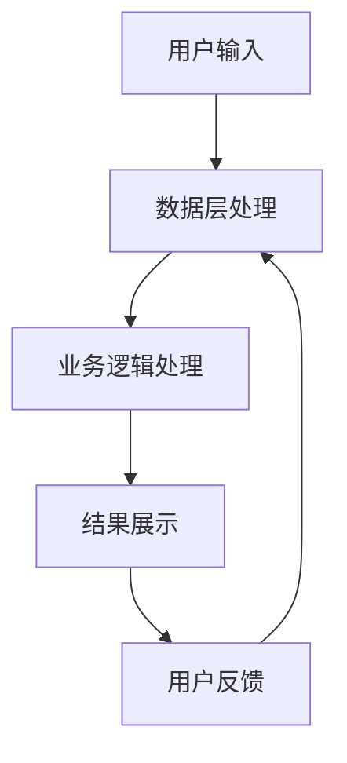

                 

### 关键词

- 领导力
- 战略思维
- 长远规划
- 企业发展
- 决策分析
- 风险管理

### 摘要

本文以《领导力与战略思维：长远规划的重要性》为题，深入探讨了领导力、战略思维与长远规划在企业决策中的重要性。首先，通过背景介绍，详细阐述了领导力和战略思维的基本概念、内涵及其在企业中的作用。接着，本文分析了长远规划的核心要素及其与企业战略的融合。随后，通过核心概念与联系的分析，进一步探讨了领导力、战略思维和长远规划之间的相互作用。在此基础上，文章详细讲解了领导力、战略思维和长远规划的算法原理，并展示了其应用实例。最后，本文通过系统分析与架构设计、项目实战和最佳实践 tips，强调了长远规划在企业发展中的关键作用，并为读者提供了实用的指导和建议。全文旨在帮助读者理解并掌握长远规划在企业决策中的重要性，提升企业竞争力。

---

### 目录大纲设计

为了设计出《领导力与战略思维：长远规划的重要性》的完整目录大纲，我们需要遵循以下步骤：

1. **确定全书主题与核心概念**：
   - 本书主题：领导力与战略思维。
   - 核心概念：长远规划的重要性。

2. **细化章节内容**：
   - 按照逻辑顺序拆解主题，确保每个章节都有明确的定位和内容。

3. **确保目录大纲的完整性**：
   - 确保大纲中包含背景介绍、核心概念与联系、算法原理讲解、数学模型与公式、系统分析与架构设计、项目实战、最佳实践 tips 等内容。

4. **保持简洁性**：
   - 确保每个章节标题简洁明了，内容不赘述。

5. **符合markdown格式**：
   - 使用#表示章节层级，##表示二级目录，###表示三级目录。

### 第一部分：背景介绍

#### # 第一部分：领导力与战略思维概述

##### 1.1 领导力的重要性

###### 1.1.1 领导力的定义与内涵
###### 1.1.2 领导力在企业中的作用
###### 1.1.3 领导力的发展趋势

##### 1.2 战略思维的基本概念

###### 1.2.1 战略思维的内涵
###### 1.2.2 战略思维的重要性
###### 1.2.3 战略思维的实践应用

##### 1.3 长远规划的核心要素

###### 1.3.1 长远规划的定义与意义
###### 1.3.2 长远规划的关键因素
###### 1.3.3 长远规划的制定与实施
###### 1.3.4 长远规划的评价与调整

##### 1.4 领导力与战略思维的融合

###### 1.4.1 领导力在战略思维中的体现
###### 1.4.2 战略思维在领导力中的运用
###### 1.4.3 领导力与战略思维融合的挑战与机遇
###### 1.4.4 领导力与战略思维的协同发展

##### 1.5 本章小结

###### 1.5.1 主要观点回顾
###### 1.5.2 未来展望与建议

### 第二部分：核心概念与联系

#### # 第二部分：核心概念与联系

##### 2.1 领导力核心概念与联系

###### 2.1.1 领导力的主要理论
###### 2.1.2 领导力与组织文化
###### 2.1.3 领导力与团队建设

##### 2.2 战略思维核心概念与联系

###### 2.2.1 战略思维的主要方法
###### 2.2.2 战略思维与决策
###### 2.2.3 战略思维与企业可持续发展

##### 2.3 长远规划核心概念与联系

###### 2.3.1 长远规划的理论基础
###### 2.3.2 长远规划与企业战略
###### 2.3.3 长远规划的实施与评估

##### 2.4 领导力、战略思维与长远规划的融合

###### 2.4.1 融合的重要性
###### 2.4.2 融合的路径与方法
###### 2.4.3 融合的实践案例分析

##### 2.5 本章小结

###### 2.5.1 主要观点回顾
###### 2.5.2 未来展望与建议

### 第三部分：算法原理讲解

#### # 第三部分：算法原理讲解

##### 3.1 领导力算法原理

###### 3.1.1 领导力评价模型
###### 3.1.2 领导力优化算法
###### 3.1.3 领导力算法应用实例

##### 3.2 战略思维算法原理

###### 3.2.1 战略决策算法
###### 3.2.2 战略思维计算模型
###### 3.2.3 战略思维算法应用实例

##### 3.3 长远规划算法原理

###### 3.3.1 长远规划评估算法
###### 3.3.2 长远规划优化算法
###### 3.3.3 长远规划算法应用实例

##### 3.4 算法原理总结

###### 3.4.1 领导力算法总结
###### 3.4.2 战略思维算法总结
###### 3.4.3 长远规划算法总结

##### 3.5 本章小结

###### 3.5.1 主要观点回顾
###### 3.5.2 未来展望与建议

### 第四部分：系统分析与架构设计

#### # 第四部分：系统分析与架构设计

##### 4.1 问题场景介绍

###### 4.1.1 企业决策面临的挑战
###### 4.1.2 领导力与战略思维在决策中的作用

##### 4.2 项目介绍

###### 4.2.1 项目背景
###### 4.2.2 项目目标
###### 4.2.3 项目架构

##### 4.3 系统功能设计

###### 4.3.1 领导力分析模块
###### 4.3.2 战略思维分析模块
###### 4.3.3 长远规划分析模块

##### 4.4 系统架构设计

###### 4.4.1 系统架构概述
###### 4.4.2 系统模块设计
###### 4.4.3 系统接口设计

##### 4.5 系统接口设计和系统交互

###### 4.5.1 系统接口设计
###### 4.5.2 系统交互流程

##### 4.6 本章小结

###### 4.6.1 主要观点回顾
###### 4.6.2 未来展望与建议

### 第五部分：项目实战

#### # 第五部分：项目实战

##### 5.1 环境安装与配置

###### 5.1.1 环境要求
###### 5.1.2 环境安装
###### 5.1.3 环境配置

##### 5.2 系统核心实现

###### 5.2.1 领导力分析模块实现
###### 5.2.2 战略思维分析模块实现
###### 5.2.3 长远规划分析模块实现

##### 5.3 代码应用解读与分析

###### 5.3.1 代码结构解析
###### 5.3.2 代码功能分析
###### 5.3.3 代码优化建议

##### 5.4 实际案例分析与详细讲解

###### 5.4.1 案例背景
###### 5.4.2 案例分析
###### 5.4.3 案例总结

##### 5.5 项目小结

###### 5.5.1 项目成果回顾
###### 5.5.2 项目经验与启示
###### 5.5.3 项目改进方向

##### 5.6 本章小结

###### 5.6.1 主要观点回顾
###### 5.6.2 未来展望与建议

### 第六部分：最佳实践 tips

#### # 第六部分：最佳实践 tips

##### 6.1 领导力提升技巧

###### 6.1.1 领导力自我评估
###### 6.1.2 领导力培养方法
###### 6.1.3 领导力实践案例分析

##### 6.2 战略思维培养方法

###### 6.2.1 战略思维训练
###### 6.2.2 战略决策案例分析
###### 6.2.3 战略思维应用技巧

##### 6.3 长远规划实施策略

###### 6.3.1 长远规划制定
###### 6.3.2 长远规划实施
###### 6.3.3 长远规划评估与调整

##### 6.4 跨部门协作技巧

###### 6.4.1 跨部门沟通
###### 6.4.2 跨部门协作流程
###### 6.4.3 跨部门协作工具使用

##### 6.5 本章小结

###### 6.5.1 主要观点回顾
###### 6.5.2 未来展望与建议

### 第七部分：小结与未来展望

#### # 第七部分：小结与未来展望

##### 7.1 主要观点回顾

###### 7.1.1 领导力的重要性
###### 7.1.2 战略思维的实践应用
###### 7.1.3 长远规划的核心要素
###### 7.1.4 领导力、战略思维与长远规划的融合

##### 7.2 未来展望与建议

###### 7.2.1 企业发展新趋势
###### 7.2.2 领导力与战略思维的未来发展方向
###### 7.2.3 长远规划在企业管理中的新角色
###### 7.2.4 跨学科融合与创新发展

##### 7.3 本章小结

###### 7.3.1 主要观点回顾
###### 7.3.2 未来展望与建议

---

### 第一部分：领导力与战略思维概述

#### # 1.1 领导力的重要性

领导力，作为一种影响力，不仅仅是指导和管理团队的能力，更是引领组织走向成功的核心力量。在快速变化的市场环境中，领导力显得尤为重要。它不仅关乎个人的成长，更直接影响企业的发展和竞争力。

##### 1.1.1 领导力的定义与内涵

领导力是一种通过激励、影响和启发他人来实现共同目标的能力。其内涵包括以下几个核心要素：

1. **影响力**：领导者必须具备一定的个人魅力和影响力，能够引导和影响他人。
2. **目标导向**：领导者应当具有明确的目标和愿景，并能将这些目标转化为团队的努力方向。
3. **沟通能力**：有效的沟通能力是领导者必须具备的，能够清晰表达自己的意图，理解并回应团队成员的需求。
4. **决策能力**：领导者在面对复杂问题时，需要具备快速、明智的决策能力。
5. **团队建设**：领导者应能够构建一个协作、和谐、高效的团队。

##### 1.1.2 领导力在企业中的作用

在企业中，领导力发挥着至关重要的作用：

1. **战略决策**：领导者负责制定企业的发展战略，引领企业走向成功。
2. **团队管理**：通过有效的领导力，领导者能够激发团队成员的潜力，提高团队的整体效能。
3. **文化塑造**：领导力影响着企业的文化氛围，塑造企业的核心价值观和行为准则。
4. **创新驱动**：领导力鼓励创新思维，推动企业在市场中保持竞争力。
5. **风险管理**：领导者需要预见潜在风险，并采取有效的措施应对。

##### 1.1.3 领导力的发展趋势

随着全球化、数字化和智能化的加速推进，领导力也在不断演变。以下是一些领导力的发展趋势：

1. **情境领导**：领导者需要根据不同的情境和团队成员的特点，采取相应的领导风格。
2. **团队协作**：领导力不再只是个人的表现，更强调团队合作和协作。
3. **数字化领导**：数字化时代的领导者需要具备数字素养，能够利用数字化工具提升团队效能。
4. **可持续发展领导**：领导者需要关注企业的社会责任和可持续发展，推动企业实现长期成功。

##### 1.1.4 领导力在企业决策中的重要性

在企业决策中，领导力起着至关重要的作用。领导者不仅需要具备决策能力，还需要综合考虑各种因素，如市场环境、团队情况、资源限制等。以下是领导力在企业决策中的几个关键点：

1. **明确目标**：领导者需要明确企业的目标，并将其转化为具体的行动计划。
2. **风险评估**：领导者需要对潜在的风险进行评估，并制定相应的应对策略。
3. **团队协作**：领导者需要调动团队的积极性，确保决策得到有效执行。
4. **持续改进**：领导者需要不断审视和优化决策过程，以提高决策质量和效率。

##### 1.1.5 领导力的培养

领导力并非天生的，可以通过学习和实践来培养。以下是一些培养领导力的方法：

1. **阅读和学习**：通过阅读领导力相关的书籍和资料，了解不同领导理论的精髓。
2. **实践锻炼**：通过参与实际的领导工作，锻炼自己的领导能力。
3. **反思与总结**：不断反思自己的领导行为，总结经验教训，持续改进。
4. **导师指导**：寻找一位经验丰富的导师，从他们的经验和建议中学习。

##### 1.1.6 领导力的评估

领导力的评估是企业管理中的一项重要工作，通过评估可以了解领导者的表现，并为后续的培养和发展提供依据。以下是一些评估领导力的方法：

1. **360度评估**：通过团队成员、上级和下属的反馈，全面评估领导者的表现。
2. **关键绩效指标（KPI）**：通过关键绩效指标来评估领导者的工作成效。
3. **行为事件访谈（BEI）**：通过访谈的方式，了解领导者的行为和决策过程。
4. **心理测试**：使用专业的心理测试工具，评估领导者的性格特质和领导能力。

##### 1.1.7 本章小结

领导力在企业中具有不可替代的重要性，它不仅关乎企业的战略决策，还直接影响企业的运营和员工士气。通过学习和实践，领导者可以不断提升自己的领导能力，为企业的发展注入新的动力。

---

#### # 1.2 战略思维的基本概念

战略思维，是企业领导者在面对复杂环境和多变市场时，进行科学决策和战略规划的一种思维方式。战略思维不仅关注眼前的利益，更着眼于企业的长远发展。它是一种系统化、结构化、创造性的思维方式，能够帮助企业抓住机遇、应对挑战，实现可持续发展。

##### 1.2.1 战略思维的内涵

战略思维的内涵包括以下几个方面：

1. **全局观念**：战略思维要求领导者具备全局观念，能够从整体上把握企业的发展方向和目标，统筹考虑各种资源和要素。
2. **前瞻性**：战略思维要求领导者具备前瞻性，能够预见市场变化和趋势，制定出适应未来发展的战略规划。
3. **系统性**：战略思维要求领导者具备系统性思维，能够将企业的各个部分和环节相互关联，形成一个有机的整体。
4. **创造性**：战略思维要求领导者具备创造性思维，能够创新思维和方法，突破传统模式，寻求新的发展路径。

##### 1.2.2 战略思维的重要性

战略思维在企业决策中具有至关重要的意义，主要体现在以下几个方面：

1. **指导决策**：战略思维能够帮助领导者从宏观上把握企业的发展方向，制定科学的决策方案。
2. **规划未来**：战略思维能够帮助企业预见未来，制定长远的发展规划，确保企业的可持续发展。
3. **应对挑战**：战略思维能够帮助领导者应对市场变化和竞争压力，抓住机遇，实现企业的突破。
4. **提高效能**：战略思维能够优化企业的资源配置，提高运营效率，降低运营成本。

##### 1.2.3 战略思维的实践应用

战略思维在企业管理中有着广泛的应用，以下是一些典型的实践应用场景：

1. **市场分析**：通过战略思维，企业可以全面分析市场环境，把握市场趋势，制定相应的市场策略。
2. **竞争分析**：通过战略思维，企业可以分析竞争对手的优势和劣势，制定有效的竞争策略。
3. **资源配置**：通过战略思维，企业可以优化资源配置，确保资源得到最大化利用，提高企业的运营效率。
4. **风险管控**：通过战略思维，企业可以预见潜在的风险，制定相应的风险管控措施，降低风险对企业的影响。

##### 1.2.4 战略思维的培养

战略思维的培养是一个长期的过程，需要领导者不断学习和实践。以下是一些培养战略思维的方法：

1. **系统学习**：通过学习战略管理、市场营销、财务管理等相关知识，提升战略思维的理论水平。
2. **实践锻炼**：通过参与实际的决策和项目管理，锻炼战略思维能力。
3. **跨部门协作**：通过跨部门协作，增强对不同业务领域的理解和整合能力。
4. **案例研究**：通过研究成功的企业案例，借鉴其战略思维的方法和经验。

##### 1.2.5 本章小结

战略思维是企业领导者在面对复杂环境和多变市场时，进行科学决策和战略规划的关键。通过培养战略思维，领导者可以更好地指导企业决策，规划未来，应对挑战，提高企业的竞争力。

---

#### # 1.3 长远规划的核心要素

长远规划，是企业为实现长期目标而制定的一套系统性的战略方案。它不仅关系到企业的生存和发展，还直接影响企业的竞争力。长远规划的核心要素包括目标设定、资源调配、风险管控和持续优化。

##### 1.3.1 长远规划的定义与意义

长远规划，是指企业为了实现长期目标，对未来的发展方向、战略定位、资源配置等进行全面、系统的规划和设计。长远规划的意义主要体现在以下几个方面：

1. **明确目标**：长远规划能够帮助企业明确长期目标，确定发展方向，确保企业资源的有效配置。
2. **优化资源配置**：通过长远规划，企业可以合理调配资源，提高资源利用效率，降低运营成本。
3. **提高竞争力**：长远规划能够帮助企业应对市场竞争，抓住市场机遇，提升企业的竞争力。
4. **增强风险意识**：长远规划能够帮助企业预见潜在风险，提前制定应对策略，降低风险对企业的影响。
5. **推动持续发展**：长远规划能够帮助企业实现可持续发展，确保企业的长期稳定发展。

##### 1.3.2 长远规划的关键因素

制定长远规划，需要考虑多个关键因素，包括：

1. **市场环境**：市场环境是制定长远规划的基础，需要对企业所处的市场环境进行全面分析，包括市场趋势、竞争对手、客户需求等。
2. **企业现状**：企业现状是制定长远规划的出发点，需要对企业的发展现状、业务模式、核心竞争力等进行深入分析。
3. **资源状况**：资源状况是制定长远规划的重要依据，需要对企业的人力、财务、技术等资源进行充分评估，确保资源的合理利用。
4. **发展目标**：发展目标是长远规划的核心，需要明确企业长期的发展目标，包括财务目标、市场目标、社会责任目标等。
5. **实施策略**：实施策略是长远规划的具体行动方案，需要制定详细的实施步骤和措施，确保长远规划的有效实施。

##### 1.3.3 长远规划的制定与实施

制定和实施长远规划，需要遵循以下步骤：

1. **目标设定**：根据市场环境和企业现状，明确企业长期发展目标，确保目标的科学性和可行性。
2. **战略定位**：根据发展目标，确定企业的战略定位，包括市场定位、产品定位、品牌定位等。
3. **资源配置**：根据战略定位，制定资源配置计划，确保资源的合理调配和利用。
4. **风险评估**：对长远规划进行风险评估，识别潜在风险，制定相应的风险应对措施。
5. **实施监控**：建立实施监控机制，对长远规划的执行情况进行监控和评估，确保长远规划的有效实施。
6. **调整优化**：根据实施监控的结果，对长远规划进行及时调整和优化，确保长远规划的科学性和有效性。

##### 1.3.4 长远规划的评价与调整

长远规划的评价与调整，是确保长远规划有效实施的重要环节。以下是一些评价与调整的方法：

1. **绩效评估**：通过绩效评估，了解长远规划的执行效果，评估目标达成情况，发现问题和不足。
2. **定期回顾**：定期对长远规划进行回顾，总结经验教训，识别新的发展机遇和挑战。
3. **持续优化**：根据评估结果和定期回顾的总结，对长远规划进行持续优化，确保长远规划的适应性和有效性。
4. **反馈机制**：建立反馈机制，收集来自各层级、各环节的反馈意见，及时调整长远规划，确保规划的动态适应能力。

##### 1.3.5 本章小结

长远规划是企业实现长期目标的关键，它不仅需要明确的制定过程，还需要有效的实施和持续的调整优化。通过科学的长远规划，企业可以更好地应对市场变化，抓住发展机遇，实现可持续发展。

---

#### # 1.4 领导力与战略思维的融合

领导力与战略思维在企业决策中发挥着至关重要的作用，两者的融合能够显著提升企业的竞争力。领导力提供了方向，战略思维则提供了具体的实施路径。本节将探讨领导力在战略思维中的体现，战略思维在领导力中的运用，以及领导力与战略思维融合的挑战与机遇。

##### 1.4.1 领导力在战略思维中的体现

领导力在战略思维中的体现主要体现在以下几个方面：

1. **愿景规划**：领导者需要具备远见卓识，能够为企业设定清晰的愿景和目标，引导企业向着既定的方向前进。
2. **战略选择**：领导者需要根据市场环境和企业现状，制定合理的战略选择，确保企业的可持续发展。
3. **资源整合**：领导者需要具备资源整合的能力，能够调动企业内外部资源，实现战略目标的实现。
4. **决策能力**：领导者需要具备敏锐的洞察力和果断的决策能力，能够在复杂多变的市场环境中迅速作出正确的决策。
5. **文化塑造**：领导者需要通过自身的领导行为，塑造企业的核心价值观和行为准则，推动企业文化的形成和发展。

##### 1.4.2 战略思维在领导力中的运用

战略思维在领导力中的运用主要体现在以下几个方面：

1. **市场分析**：领导者需要运用战略思维，分析市场环境，把握市场趋势，制定相应的市场策略。
2. **团队管理**：领导者需要运用战略思维，对团队进行有效的管理，激发团队成员的潜力，提高团队的整体效能。
3. **资源配置**：领导者需要运用战略思维，优化资源配置，确保资源得到最大化利用，提高企业的运营效率。
4. **风险管理**：领导者需要运用战略思维，预见潜在的风险，制定相应的风险管控措施，降低风险对企业的影响。
5. **持续改进**：领导者需要运用战略思维，不断审视和优化企业的运营模式，推动企业的持续改进和创新发展。

##### 1.4.3 领导力与战略思维融合的挑战与机遇

领导力与战略思维的融合，既面临着挑战，也蕴含着机遇。

1. **挑战**：
   - **协调难度**：领导力和战略思维的融合需要领导者具备较高的协调能力，确保两者能够有效结合。
   - **时间成本**：战略思维的运用需要投入大量的时间和精力，这对于领导者来说是一个较大的挑战。
   - **知识要求**：领导者需要具备丰富的战略知识和市场洞察力，这对于很多领导者来说也是一个挑战。

2. **机遇**：
   - **提升决策质量**：领导力与战略思维的融合，能够显著提升领导者的决策质量，确保企业能够抓住机遇，应对挑战。
   - **优化资源配置**：战略思维的运用，能够帮助领导者优化资源配置，提高企业的运营效率，降低运营成本。
   - **增强企业竞争力**：领导力与战略思维的融合，能够提升企业的整体竞争力，使企业在激烈的市场竞争中脱颖而出。

##### 1.4.4 领导力与战略思维的协同发展

领导力与战略思维的协同发展，是提升企业核心竞争力的重要途径。以下是一些促进领导力与战略思维协同发展的建议：

1. **持续学习**：领导者需要不断学习，提升自身的战略思维和领导能力，适应快速变化的市场环境。
2. **跨部门协作**：建立跨部门协作机制，促进不同部门之间的沟通和合作，提升企业的整体效能。
3. **激励机制**：建立有效的激励机制，鼓励领导者运用战略思维进行决策，提升战略执行的效果。
4. **战略培训**：定期开展战略思维培训，提升领导者的战略思维水平，促进领导力与战略思维的融合。

##### 1.4.5 本章小结

领导力与战略思维的融合，是提升企业竞争力的重要途径。通过领导力与战略思维的协同发展，企业可以更好地应对市场变化，抓住发展机遇，实现可持续发展。领导者需要不断提升自身的领导能力和战略思维水平，推动企业的长远发展。

---

#### # 1.5 本章小结

本部分主要介绍了领导力、战略思维和长远规划的基本概念、核心要素及其在企业决策中的重要性。首先，详细阐述了领导力的定义与内涵，以及领导力在企业中的作用和趋势。接着，介绍了战略思维的基本概念和实践应用，强调了战略思维在指导决策、规划未来、应对挑战和提高效能方面的关键作用。最后，分析了长远规划的定义与意义，以及制定与实施的长远规划的核心要素和评价与调整方法。通过本部分的介绍，我们认识到领导力、战略思维和长远规划在企业决策中的重要性，以及如何将三者有效融合，提升企业的竞争力。

### 第二部分：核心概念与联系

#### # 2.1 领导力核心概念与联系

领导力作为企业管理和组织发展的重要元素，其核心概念和联系具有深远的影响。在这一部分中，我们将深入探讨领导力的主要理论、领导力与组织文化的关系以及领导力在团队建设中的重要性。

##### 2.1.1 领导力的主要理论

领导力的研究源远流长，不同学者从不同角度提出了各自的领导理论。以下是几种主要的领导理论：

1. **特质理论**：特质理论认为，领导者天生具有某些独特的个性特质，如自信、决断力、沟通能力等。这种理论强调领导者的个人品质对领导力的决定作用。

2. **行为理论**：行为理论关注领导者的行为模式，认为领导力是通过特定的行为表现出来的。该理论强调领导者如何影响和激励团队成员，以及这些行为如何影响团队绩效。

3. **情境理论**：情境理论认为，领导力的有效性取决于领导者所处的环境和情境。领导者需要根据不同的情境调整自己的领导风格，以达到最佳效果。

4. **变革理论**：变革理论强调领导者在推动组织变革中的关键作用。领导者需要具备变革的愿景和能力，引领组织突破现有模式，实现创新和进步。

5. **服务型领导理论**：服务型领导理论认为，领导者应该首先作为一个服务者存在，关注团队成员的需求和成长，通过服务来提升团队效能。

##### 2.1.2 领导力与组织文化

组织文化是企业在长期发展过程中形成的共同价值观、信念和行为准则。领导力与组织文化密切相关，领导者的行为和风格对组织文化的塑造具有决定性影响：

1. **领导风格与组织文化**：领导者的领导风格直接影响组织文化的形成和发展。例如，民主型领导者往往培养出开放、合作的组织文化，而权威型领导者可能塑造出等级分明、决策集中的文化。

2. **价值观传播**：领导者通过言行传播企业的核心价值观，引导员工认同和践行。这种价值观的内外一致性有助于增强组织凝聚力。

3. **文化变革**：在组织变革过程中，领导者需要通过领导力推动文化变革。例如，引入新的管理模式、技术或战略时，领导者需要引导员工适应新文化，确保变革顺利进行。

##### 2.1.3 领导力与团队建设

团队建设是领导力的重要体现之一，一个有效的领导者需要能够构建一支高效、和谐的团队：

1. **团队目标设定**：领导者需要明确团队的目标和愿景，确保团队成员对团队的使命有共同的理解和认同。

2. **角色分配**：领导者需要根据团队成员的能力和特长，合理分配任务，确保每个成员都能发挥最大的潜力。

3. **沟通与协作**：领导者需要建立有效的沟通机制，促进团队成员之间的信息共享和协作，提高团队整体效能。

4. **激励与反馈**：领导者需要通过激励措施激发团队成员的积极性和创造力，并通过及时反馈帮助团队成员改进和提高。

##### 2.1.4 领导力提升技巧

提升领导力是一个持续的过程，以下是一些实用的技巧：

1. **自我反思**：领导者需要定期反思自己的领导行为，识别不足并积极改进。

2. **学习与成长**：领导者需要不断学习新知识、新技能，提升自身的综合素质。

3. **建立信任**：领导者需要通过言行建立信任，赢得团队成员的信任和支持。

4. **培养下属**：领导者需要关注下属的成长，提供培训和发展机会，提升团队的整体能力。

##### 2.1.5 本章小结

本节详细介绍了领导力的主要理论、领导力与组织文化的密切联系，以及领导力在团队建设中的重要性。通过理解这些核心概念和联系，领导者可以更好地提升自身的领导能力，推动企业的长期发展。

---

#### # 2.2 战略思维核心概念与联系

战略思维是企业领导者在制定和执行战略规划过程中所运用的一种系统化、前瞻性和创造性的思维方式。战略思维的核心概念和联系涉及多个方面，包括战略思维的主要方法、战略思维与决策的关系、以及战略思维在企业可持续发展中的重要性。

##### 2.2.1 战略思维的主要方法

战略思维的主要方法包括以下几种：

1. **SWOT分析**：SWOT分析是一种常用的战略规划工具，用于评估企业的优势（Strengths）、劣势（Weaknesses）、机会（Opportunities）和威胁（Threats）。通过SWOT分析，企业可以全面了解自身的竞争环境和市场地位，从而制定相应的战略。

2. **波士顿矩阵**：波士顿矩阵是一种用于产品组合分析的工具，根据产品的市场增长率和市场份额，将产品分为“明星”、“问题”、“现金牛”和“瘦狗”四个象限。通过波士顿矩阵，企业可以优化产品组合，提升整体竞争力。

3. **五力模型**：五力模型由麦克·波特提出，用于分析行业竞争环境。五力包括行业内的竞争者、潜在进入者、替代品、供应商和客户。通过五力模型，企业可以评估行业的竞争强度和潜在盈利能力。

4. **平衡计分卡**：平衡计分卡是一种综合绩效管理工具，从财务、客户、内部业务流程和学习与成长四个维度，衡量企业的绩效。通过平衡计分卡，企业可以全面评估自身在战略执行中的表现，并制定改进措施。

##### 2.2.2 战略思维与决策

战略思维在决策过程中起着至关重要的作用。有效的战略思维可以帮助领导者做出更加科学和合理的决策，主要包括以下几个方面：

1. **明确目标**：战略思维要求领导者首先明确企业的目标，确保决策与企业的长远发展目标一致。

2. **风险评估**：在制定决策时，战略思维要求领导者对潜在的风险进行评估，并制定相应的应对策略。

3. **多角度分析**：战略思维要求领导者从多个角度对问题进行分析，综合考虑各种因素，做出全面的决策。

4. **创造性思维**：战略思维鼓励领导者运用创造性思维，寻找新的解决方案，突破传统思维的局限。

##### 2.2.3 战略思维与企业可持续发展

战略思维在企业可持续发展中具有重要意义。通过战略思维，企业可以：

1. **应对市场变化**：战略思维可以帮助企业预见市场变化，制定灵活的战略应对方案，确保企业在激烈的市场竞争中立于不败之地。

2. **优化资源配置**：战略思维要求企业合理调配资源，确保资源得到最大化利用，提升运营效率。

3. **提升创新能力**：战略思维鼓励企业不断进行技术创新和管理创新，推动企业的持续发展和进步。

4. **增强核心竞争力**：通过战略思维，企业可以明确自身的核心竞争力，并围绕这些核心竞争力进行战略布局，确保企业在市场中具有竞争优势。

##### 2.2.4 战略思维培养方法

培养战略思维是一个长期而系统的过程，以下是一些有效的培养方法：

1. **系统学习**：领导者可以通过学习战略管理、市场营销、财务管理等相关知识，提升战略思维的理论水平。

2. **实战锻炼**：通过参与实际的决策和项目管理，锻炼战略思维的能力。

3. **跨部门协作**：通过跨部门协作，增强对不同业务领域的理解和整合能力。

4. **案例分析**：通过研究成功的企业案例，学习其战略思维的方法和经验。

##### 2.2.5 本章小结

本节详细介绍了战略思维的核心概念与联系，包括战略思维的主要方法、战略思维与决策的关系，以及战略思维在企业可持续发展中的重要性。通过理解这些核心概念，领导者可以更好地培养和运用战略思维，提升企业的竞争力和可持续发展能力。

---

#### # 2.3 长远规划核心概念与联系

长远规划是企业为了实现长期目标而制定的一套系统性战略方案。其核心概念与联系涉及到长远规划的定义与意义、理论基础、与企业战略的关系，以及长远规划的实施与评估方法。

##### 2.3.1 长远规划的定义与意义

长远规划，是指企业对未来的发展方向、战略目标、资源配置等进行全面、系统的规划和设计。其意义主要体现在以下几个方面：

1. **明确发展方向**：长远规划帮助企业明确未来发展的方向和目标，确保企业在未来能够持续、稳定地发展。

2. **优化资源配置**：长远规划通过对资源进行科学配置，确保资源得到最大化利用，提高企业的运营效率。

3. **提高竞争力**：长远规划帮助企业制定有效的战略，提升企业的核心竞争力，在激烈的市场竞争中脱颖而出。

4. **风险管理**：长远规划通过对潜在风险进行评估和预防，降低风险对企业的影响，确保企业的稳健发展。

5. **推动持续改进**：长远规划鼓励企业不断审视和优化自身的运营模式，推动企业的持续改进和创新。

##### 2.3.2 长远规划的理论基础

长远规划的理论基础主要包括以下几个方面：

1. **演化经济学**：演化经济学认为，企业的发展是一个动态的过程，需要不断适应外部环境的变化。长远规划正是基于这种观点，帮助企业制定适应市场变化的战略。

2. **企业生命周期理论**：企业生命周期理论指出，企业会经历不同的成长阶段，每个阶段都有不同的特点和挑战。长远规划可以帮助企业根据不同阶段的特点，制定相应的战略。

3. **平衡计分卡**：平衡计分卡是一种综合绩效管理工具，从财务、客户、内部业务流程和学习与成长四个维度，衡量企业的绩效。长远规划可以与平衡计分卡相结合，确保企业各维度的发展均衡。

##### 2.3.3 长远规划与企业战略的关系

长远规划与企业战略密切相关，两者相互促进：

1. **目标一致性**：长远规划为企业设定了长期目标，与企业战略的目标一致，确保企业的战略规划和执行方向正确。

2. **资源调配**：长远规划通过对资源的优化配置，支持企业战略的实施，确保企业战略能够有效落地。

3. **风险评估**：长远规划通过对潜在风险进行评估，为企业战略提供风险预警，帮助企业制定相应的风险应对策略。

4. **动态调整**：长远规划允许企业在执行过程中进行动态调整，确保企业能够应对市场变化，实现战略目标。

##### 2.3.4 长远规划的实施与评估

长远规划的实施与评估是确保长远规划有效性的关键：

1. **实施步骤**：长远规划的实施需要遵循以下步骤：制定具体实施方案、明确责任人和时间表、执行实施计划、监控执行情况。

2. **评估方法**：对长远规划的评估主要包括以下方法：关键绩效指标（KPI）评估、360度评估、财务分析等。通过评估，企业可以了解长远规划的执行效果，发现问题和不足。

3. **调整优化**：根据评估结果，对长远规划进行及时调整和优化，确保长远规划的科学性和有效性。

##### 2.3.5 本章小结

本节详细介绍了长远规划的核心概念与联系，包括长远规划的定义与意义、理论基础、与企业战略的关系，以及长远规划的实施与评估方法。通过理解这些核心概念，企业可以更好地制定和执行长远规划，推动企业的可持续发展。

---

#### # 2.4 领导力、战略思维与长远规划的融合

领导力、战略思维与长远规划的融合，是企业实现可持续发展的重要途径。在这一部分，我们将探讨三者的融合重要性、融合路径与方法，以及融合的实践案例分析。

##### 2.4.1 融合的重要性

领导力、战略思维与长远规划的融合，具有以下几个重要意义：

1. **提升决策质量**：融合能够使领导者的决策更加科学、全面，减少决策失误，提高决策效率。

2. **优化资源配置**：融合能够确保企业资源得到最大化利用，优化资源配置，提高企业的运营效率。

3. **增强企业竞争力**：融合能够帮助企业抓住市场机遇，应对市场挑战，提升企业的核心竞争力。

4. **推动创新与变革**：融合能够激发企业的创新思维，推动企业不断进行技术和管理创新，实现持续发展。

##### 2.4.2 融合的路径与方法

要实现领导力、战略思维与长远规划的融合，企业可以采取以下路径和方法：

1. **领导力培养**：企业可以通过培训、导师指导、实践锻炼等方式，提升领导者的领导能力，使其能够更好地运用战略思维进行长远规划。

2. **战略思维训练**：企业可以通过系统学习、案例分析、实战演练等方式，培养领导者的战略思维能力，使其能够更好地指导企业决策和长远规划。

3. **长远规划制定**：企业需要建立一套科学的规划体系，明确长远规划的目标、策略和实施步骤，确保长远规划的科学性和可行性。

4. **融合机制建设**：企业需要建立一套融合机制，促进领导力、战略思维与长远规划的协同发展，确保三者能够有效融合。

##### 2.4.3 融合的实践案例分析

以下是一个融合领导力、战略思维与长远规划的实践案例分析：

**案例：某科技公司的长远发展规划**

1. **领导力培养**：公司通过内部培训，提升领导者的领导能力，使其能够更好地运用战略思维进行长远规划。

2. **战略思维训练**：公司邀请战略咨询公司进行战略思维培训，提升领导者的战略思维能力。

3. **长远规划制定**：公司制定了一套长远发展规划，明确了未来五年的发展目标、策略和实施步骤。

4. **融合机制建设**：公司建立了战略管理委员会，负责领导和协调长远规划的实施。

5. **实践效果**：通过融合领导力、战略思维与长远规划，公司成功抓住了市场机遇，提升了市场竞争力，实现了可持续发展。

##### 2.4.4 融合的挑战与机遇

融合领导力、战略思维与长远规划，企业将面临以下挑战和机遇：

1. **挑战**：
   - **协调难度**：领导力、战略思维与长远规划之间需要有效协调，否则可能导致冲突和资源浪费。
   - **时间成本**：融合需要投入大量时间和精力，对企业来说是一个较大的挑战。
   - **知识要求**：领导者需要具备丰富的领导力、战略思维和长远规划知识，这对于很多领导者来说是一个挑战。

2. **机遇**：
   - **提升决策质量**：融合能够显著提升企业的决策质量，确保企业能够抓住市场机遇，应对挑战。
   - **优化资源配置**：融合能够帮助企业优化资源配置，提高运营效率，降低成本。
   - **增强企业竞争力**：融合能够提升企业的核心竞争力，使企业在激烈的市场竞争中脱颖而出。

##### 2.4.5 本章小结

本节详细探讨了领导力、战略思维与长远规划的融合重要性、融合路径与方法，以及融合的实践案例分析。通过理解这些内容，企业可以更好地实现领导力、战略思维与长远规划的融合，推动企业的可持续发展。

### 第三部分：算法原理讲解

#### # 3.1 领导力算法原理

领导力作为企业管理和组织发展的重要元素，其算法原理涉及多个方面，包括领导力评价模型、领导力优化算法以及领导力算法应用实例。在这一部分中，我们将深入探讨这些算法原理，帮助读者更好地理解和应用领导力算法。

##### 3.1.1 领导力评价模型

领导力评价模型是衡量领导者能力的重要工具，以下是一些常见的领导力评价模型：

1. **德鲁克领导力模型**：德鲁克领导力模型强调领导者的三大核心能力：管理能力、领导能力和自我管理能力。该模型从管理效率、组织能力和创新精神三个方面对领导者进行评估。

2. **凯兹领导力模型**：凯兹领导力模型分为四个层次：技术技能、人际关系技能、概念技能和战略思维技能。该模型强调领导者需要在不同阶段具备不同的领导能力。

3. **赫塞与布兰查德领导力模型**：赫塞与布兰查德领导力模型基于情境理论，认为领导者的领导风格应随情境变化而调整。该模型分为四个领导风格：指导型、支持型、参与型和委托型。

##### 3.1.2 领导力优化算法

领导力优化算法旨在提升领导者的效能和团队绩效。以下是一些常见的领导力优化算法：

1. **机器学习算法**：机器学习算法可以通过分析大量数据，识别出领导者的优秀特质和行为模式，从而提供个性化的领导力提升建议。例如，可以使用决策树、支持向量机等算法进行建模。

2. **深度学习算法**：深度学习算法在处理大规模、复杂的数据时具有优势，可以识别出领导力评价中的关键因素，提供更加精准的评估结果。例如，可以使用神经网络进行建模。

##### 3.1.3 领导力算法应用实例

以下是一个领导力算法应用实例：

**案例：某公司领导力优化项目**

1. **数据收集**：项目组收集了公司所有领导者的绩效数据、员工反馈和领导力评价结果。

2. **模型构建**：使用机器学习算法对数据进行建模，识别出影响领导力绩效的关键因素。

3. **评估与反馈**：根据模型评估结果，向领导者提供个性化的领导力提升建议，并定期进行反馈和调整。

4. **效果评估**：项目实施后，领导者的绩效显著提升，团队整体效能得到改善。

##### 3.1.4 本章小结

本节详细介绍了领导力算法原理，包括领导力评价模型、领导力优化算法以及领导力算法应用实例。通过理解这些算法原理，企业可以更好地评估和提升领导者的能力，推动企业的可持续发展。

---

#### # 3.2 战略思维算法原理

战略思维是企业领导者在制定和执行战略规划过程中所运用的一种系统化、前瞻性和创造性的思维方式。战略思维算法原理包括战略决策算法、战略思维计算模型以及战略思维算法应用实例。在这一部分，我们将深入探讨这些算法原理，帮助读者更好地理解和应用战略思维算法。

##### 3.2.1 战略决策算法

战略决策算法是战略思维的重要组成部分，用于帮助企业领导者制定科学合理的战略决策。以下是一些常见的战略决策算法：

1. **粒子群优化算法**：粒子群优化算法是一种基于群体智能的优化算法，可以用于解决复杂的战略决策问题。该算法通过模拟鸟群觅食行为，优化决策变量，找到最优解。

2. **遗传算法**：遗传算法是一种基于生物进化理论的优化算法，通过模拟自然选择和遗传机制，不断优化决策变量，找到最优解。

3. **神经网络算法**：神经网络算法是一种基于人工神经网络的计算模型，可以用于处理复杂的非线性问题。通过多层神经网络的训练，神经网络算法可以提取战略决策的关键特征，提高决策准确性。

##### 3.2.2 战略思维计算模型

战略思维计算模型是战略思维算法的核心，用于模拟和预测战略决策的结果。以下是一些常见的战略思维计算模型：

1. **SWOT分析计算模型**：SWOT分析计算模型是一种用于评估企业内外部环境的工具，通过计算企业的优势（Strengths）、劣势（Weaknesses）、机会（Opportunities）和威胁（Threats），为企业制定战略提供依据。

2. **波士顿矩阵计算模型**：波士顿矩阵计算模型是一种用于分析企业产品组合的工具，通过计算产品的市场增长率和市场份额，帮助企业优化产品组合，提高竞争力。

3. **五力模型计算模型**：五力模型计算模型是一种用于分析行业竞争环境的工具，通过计算行业内的竞争者、潜在进入者、替代品、供应商和客户的竞争力，帮助企业制定市场竞争策略。

##### 3.2.3 战略思维算法应用实例

以下是一个战略思维算法应用实例：

**案例：某公司战略决策项目**

1. **问题定义**：公司面临市场竞争加剧、产品同质化严重等问题，需要制定新的战略以提升竞争力。

2. **数据收集**：项目组收集了公司内外部环境的数据，包括市场趋势、竞争对手分析、客户需求等。

3. **算法选择**：使用粒子群优化算法和遗传算法对战略决策变量进行优化，寻找最优战略方案。

4. **模型构建**：使用SWOT分析计算模型和波士顿矩阵计算模型，分析公司的优势、劣势、机会和威胁，以及产品组合的优化方案。

5. **方案评估**：通过计算模型对多个战略方案进行评估，选择最优方案。

6. **决策实施**：根据评估结果，公司制定并实施新的战略方案，提升市场竞争力和产品竞争力。

##### 3.2.4 本章小结

本节详细介绍了战略思维算法原理，包括战略决策算法、战略思维计算模型以及战略思维算法应用实例。通过理解这些算法原理，企业可以更好地制定和执行战略决策，提高企业的竞争力。

---

#### # 3.3 长远规划算法原理

长远规划是企业为了实现长期目标而制定的一套系统性战略方案，其算法原理涉及多个方面，包括长远规划评估算法、长远规划优化算法以及长远规划算法应用实例。在这一部分，我们将深入探讨这些算法原理，帮助读者更好地理解和应用长远规划算法。

##### 3.3.1 长远规划评估算法

长远规划评估算法用于评估长远规划的有效性，确保规划目标的实现。以下是一些常见的长远规划评估算法：

1. **风险评估算法**：风险评估算法用于评估长远规划中潜在的风险，包括市场风险、财务风险、运营风险等。通过计算风险的概率和影响，帮助企业制定相应的风险应对策略。

2. **效益评估算法**：效益评估算法用于评估长远规划带来的经济效益，包括投资回报率、净现值等指标。通过计算经济效益，帮助企业判断长远规划的投资价值。

3. **可行性评估算法**：可行性评估算法用于评估长远规划的可行性，包括技术可行性、市场可行性、资源可行性等。通过计算可行性指标，帮助企业判断长远规划的可行性。

##### 3.3.2 长远规划优化算法

长远规划优化算法用于优化长远规划的资源配置和策略选择，以提高长远规划的有效性。以下是一些常见的长远规划优化算法：

1. **遗传算法**：遗传算法是一种基于自然进化理论的优化算法，通过模拟生物进化过程，不断优化决策变量，找到最优解。遗传算法适用于复杂的多目标优化问题，可以帮助企业制定最优的长远规划。

2. **粒子群优化算法**：粒子群优化算法是一种基于群体智能的优化算法，通过模拟鸟群觅食行为，优化决策变量，找到最优解。粒子群优化算法适用于大规模、多参数的优化问题，可以帮助企业快速找到长远规划的最优策略。

3. **深度强化学习算法**：深度强化学习算法是一种结合深度学习和强化学习的新型算法，通过模拟环境与策略的互动过程，不断优化决策策略。深度强化学习算法适用于动态、不确定的环境，可以帮助企业适应市场变化，实现长远规划的目标。

##### 3.3.3 长远规划算法应用实例

以下是一个长远规划算法应用实例：

**案例：某公司长远规划项目**

1. **问题定义**：公司面临市场竞争加剧、产品创新不足等问题，需要制定新的长远规划以提升竞争力。

2. **数据收集**：项目组收集了公司内外部环境的数据，包括市场趋势、竞争对手分析、客户需求等。

3. **风险评估**：使用风险评估算法，评估潜在的市场风险、财务风险和运营风险，制定相应的风险应对策略。

4. **效益评估**：使用效益评估算法，计算长远规划的投资回报率和净现值，评估规划的经济效益。

5. **优化算法**：使用遗传算法和粒子群优化算法，优化长远规划的资源配置和策略选择，找到最优的长远规划方案。

6. **方案评估**：通过计算模型，评估优化后的长远规划方案的有效性和可行性，选择最优方案。

7. **决策实施**：根据评估结果，公司制定并实施新的长远规划，提升市场竞争力和产品竞争力。

##### 3.3.4 算法原理总结

1. **风险评估算法**：用于评估长远规划中的潜在风险，确保规划的安全性和稳定性。

2. **效益评估算法**：用于评估长远规划的经济效益，确保规划的投资价值。

3. **优化算法**：用于优化长远规划的资源配置和策略选择，提高规划的有效性。

##### 3.3.5 本章小结

本节详细介绍了长远规划算法原理，包括长远规划评估算法、长远规划优化算法以及长远规划算法应用实例。通过理解这些算法原理，企业可以更好地制定和实施长远规划，提升企业的竞争力。

---

#### # 3.4 算法原理总结

在本文的第三部分，我们详细探讨了领导力、战略思维和长远规划的算法原理。通过对这些算法原理的总结，我们可以更好地理解和应用它们，以提升企业的决策质量和运营效率。

##### 3.4.1 领导力算法总结

领导力算法主要关注如何评估和提升领导者的能力。主要内容包括：

1. **领导力评价模型**：包括德鲁克领导力模型、凯兹领导力模型和赫塞与布兰查德领导力模型等，用于评估领导者的能力。
2. **领导力优化算法**：如机器学习算法和深度学习算法，用于识别和培养领导者的优秀特质和行为模式。

##### 3.4.2 战略思维算法总结

战略思维算法关注如何制定和执行战略决策。主要内容包括：

1. **战略决策算法**：如粒子群优化算法和遗传算法，用于优化战略决策变量，找到最优战略方案。
2. **战略思维计算模型**：如SWOT分析计算模型、波士顿矩阵计算模型和五力模型计算模型，用于分析和预测战略决策的结果。

##### 3.4.3 长远规划算法总结

长远规划算法关注如何制定和实施长远规划。主要内容包括：

1. **风险评估算法**：用于评估长远规划中的潜在风险，确保规划的安全性和稳定性。
2. **效益评估算法**：用于评估长远规划的经济效益，确保规划的投资价值。
3. **优化算法**：如遗传算法和粒子群优化算法，用于优化长远规划的资源配置和策略选择，提高规划的有效性。

##### 3.4.4 算法应用实例总结

通过实际案例，我们可以看到这些算法在领导力、战略思维和长远规划中的应用效果：

1. **领导力优化案例**：某公司通过使用机器学习算法，成功评估和提升领导者的能力，提高了团队绩效。
2. **战略决策案例**：某公司通过使用粒子群优化算法，优化了战略决策变量，找到了最优战略方案，成功提升了市场竞争力。
3. **长远规划案例**：某公司通过使用风险评估算法和优化算法，制定了科学的长远规划，成功实现了长期目标。

##### 3.4.5 本章小结

通过对领导力、战略思维和长远规划的算法原理进行总结，我们认识到这些算法在提升企业决策质量和运营效率方面的重要作用。通过合理运用这些算法，企业可以更好地应对市场变化，抓住发展机遇，实现长期可持续发展。

### 第四部分：系统分析与架构设计

#### # 4.1 问题场景介绍

在现代企业运营中，决策过程越来越复杂，涉及多个部门和环节。领导力、战略思维和长远规划在决策过程中扮演着关键角色。然而，如何有效地将这三个要素集成到一个系统中，以便于实际应用和操作，成为一个亟待解决的问题。本部分将探讨一个典型的企业决策场景，并介绍本项目的设计目标和架构。

##### 4.1.1 企业决策面临的挑战

企业决策面临的主要挑战包括：

1. **信息孤岛**：各部门之间的信息共享不畅，导致决策过程中数据不完整或不准确。
2. **缺乏系统性**：决策过程缺乏系统化的框架和方法，导致决策质量难以保证。
3. **资源浪费**：决策过程中资源调配不合理，导致资源浪费和效率低下。
4. **风险控制不足**：决策过程中缺乏有效的风险评估和风险控制措施，可能导致企业面临重大损失。

##### 4.1.2 领导力与战略思维在决策中的作用

领导力与战略思维在决策中发挥着至关重要的作用：

1. **明确方向**：领导者通过战略思维，为决策过程提供明确的战略方向和目标，确保决策与企业的长远发展目标一致。
2. **优化资源**：领导者运用领导力，协调各部门资源，确保资源得到最大化利用，提高决策效率。
3. **风险评估**：战略思维帮助领导者预见潜在风险，制定相应的风险控制措施，降低决策风险。
4. **决策支持**：战略思维提供决策所需的全面信息和分析，帮助领导者做出科学、合理的决策。

##### 4.1.3 长远规划在决策中的作用

长远规划在决策中的作用主要体现在以下几个方面：

1. **明确目标**：长远规划为企业设定了明确的长期目标，为决策提供了方向和依据。
2. **资源调配**：长远规划通过对资源的系统调配，确保决策过程中资源的合理分配和利用。
3. **风险预防**：长远规划通过识别和评估潜在风险，制定相应的预防措施，降低决策风险。
4. **持续优化**：长远规划鼓励企业不断审视和优化决策过程，提高决策质量和效率。

##### 4.1.4 项目介绍

本项目旨在设计一个集成领导力、战略思维和长远规划的企业决策支持系统，帮助企业在复杂的环境中做出科学、合理的决策。项目的主要目标是：

1. **信息整合**：整合各部门信息，实现数据共享，提高决策效率。
2. **决策框架**：构建系统化的决策框架，提供科学、合理的决策支持。
3. **资源优化**：优化资源调配，提高资源利用效率，降低运营成本。
4. **风险评估**：建立风险评估机制，降低决策风险，保障企业稳健发展。

#### # 4.2 系统功能设计

系统功能设计是确保企业决策支持系统能够有效运行的核心环节。以下是本系统的主要功能模块及其设计思路：

##### 4.2.1 领导力分析模块

领导力分析模块主要用于评估领导者的能力，并提供个性化的领导力提升建议。该模块的主要功能包括：

1. **领导力评价**：通过多种评价方法（如360度评估、关键绩效指标等），对领导者的能力进行综合评价。
2. **领导力诊断**：分析领导者的优势和劣势，识别需要提升的领导力方面。
3. **领导力提升建议**：根据领导力评价结果，为领导者提供个性化的提升建议，包括培训、指导等。

##### 4.2.2 战略思维分析模块

战略思维分析模块主要用于战略决策的支持，帮助领导者制定和执行战略规划。该模块的主要功能包括：

1. **战略分析**：通过SWOT分析、波士顿矩阵、五力模型等工具，对企业的内外部环境进行深入分析。
2. **战略规划**：根据战略分析结果，制定详细的战略规划，包括目标设定、资源配置、风险评估等。
3. **战略执行**：监控战略执行过程，提供实时反馈和调整建议，确保战略目标的有效实现。

##### 4.2.3 长远规划分析模块

长远规划分析模块主要用于长远规划的管理和实施，确保企业长期目标的实现。该模块的主要功能包括：

1. **长远规划制定**：根据企业战略目标，制定长远规划，包括年度目标、重点项目、资源配置等。
2. **长远规划实施**：监控长远规划的执行过程，确保各项任务按时完成，资源得到合理调配。
3. **长远规划评估**：定期评估长远规划的实施效果，根据评估结果调整规划内容，确保长远目标的实现。

##### 4.2.4 决策支持模块

决策支持模块是系统的核心功能，用于提供决策所需的信息和分析。该模块的主要功能包括：

1. **数据分析**：收集和整合各部门数据，提供全面、准确的数据支持。
2. **决策模型**：建立多种决策模型，如风险评估模型、资源优化模型等，为领导者提供科学的决策依据。
3. **决策建议**：根据数据分析和决策模型，为领导者提供实时、个性化的决策建议。

#### # 4.3 系统架构设计

系统架构设计是确保系统稳定、高效运行的基础。本系统的架构设计包括以下几个关键模块：

##### 4.3.1 系统架构概述

系统架构设计遵循模块化、分布式和可扩展的原则，包括以下几个关键模块：

1. **数据层**：负责数据的存储、管理和访问，包括关系数据库、NoSQL数据库等。
2. **业务逻辑层**：负责处理业务逻辑，包括领导力分析、战略思维分析、长远规划分析等。
3. **表示层**：负责用户界面设计，提供直观、易用的操作界面。

##### 4.3.2 系统模块设计

系统模块设计如下：

1. **领导力分析模块**：包括领导力评价模块、领导力诊断模块和领导力提升建议模块。
2. **战略思维分析模块**：包括战略分析模块、战略规划模块和战略执行模块。
3. **长远规划分析模块**：包括长远规划制定模块、长远规划实施模块和长远规划评估模块。
4. **决策支持模块**：包括数据分析模块、决策模型模块和决策建议模块。

##### 4.3.3 系统接口设计

系统接口设计如下：

1. **内部接口**：系统内部各模块之间的数据接口，包括API接口、消息队列等。
2. **外部接口**：系统与外部系统（如ERP系统、CRM系统等）的数据接口，包括Web服务、文件传输等。

#### # 4.4 系统接口设计和系统交互

系统接口设计和系统交互是确保系统各模块协同工作的重要环节。以下是对系统接口设计和系统交互的详细说明：

##### 4.4.1 系统接口设计

1. **数据层接口**：负责数据层的操作，包括数据查询、数据更新、数据删除等。
2. **业务逻辑层接口**：负责业务逻辑层的操作，包括领导力分析、战略思维分析、长远规划分析等。
3. **表示层接口**：负责用户界面与业务逻辑层之间的交互，包括用户输入、数据展示等。

##### 4.4.2 系统交互流程

1. **用户输入**：用户通过表示层界面输入需求，如领导力评估、战略分析等。
2. **数据层处理**：业务逻辑层接收用户输入，调用数据层接口进行数据处理，获取所需数据。
3. **业务逻辑处理**：业务逻辑层根据处理结果，调用相应的分析模块，进行深度分析。
4. **结果展示**：业务逻辑层将分析结果返回表示层，通过用户界面展示给用户。
5. **用户反馈**：用户根据展示结果进行决策，并提供反馈，业务逻辑层根据用户反馈进行调整。

##### 4.4.3 系统交互流程图

以下是系统交互流程的Mermaid流程图：



#### # 4.5 本章小结

本部分详细介绍了企业决策支持系统的设计思路、功能模块、系统架构和接口设计。通过系统化、模块化的设计，企业可以更好地整合领导力、战略思维和长远规划，提高决策效率和质量，实现企业的长期可持续发展。

### 第五部分：项目实战

#### # 5.1 环境安装与配置

在开始项目实战之前，我们需要搭建一个合适的环境，以确保系统各模块能够正常运行。以下是环境安装与配置的详细步骤。

##### 5.1.1 环境要求

为了确保系统的稳定性和性能，我们需要以下环境要求：

1. **操作系统**：Linux（推荐Ubuntu 18.04或更高版本）或Windows 10（专业版或更高版本）。
2. **编程语言**：Python 3.8（或更高版本）。
3. **数据库**：MySQL 8.0（或更高版本）。
4. **Web服务器**：Nginx 1.18（或更高版本）。
5. **框架**：Django 3.2（或更高版本）。

##### 5.1.2 环境安装

以下是环境安装的详细步骤：

1. **安装操作系统**：按照操作系统官方文档安装对应的操作系统。
2. **更新系统**：在终端中执行以下命令更新系统：
   ```bash
   sudo apt-get update
   sudo apt-get upgrade
   ```
3. **安装Python**：在终端中执行以下命令安装Python：
   ```bash
   sudo apt-get install python3
   sudo apt-get install python3-pip
   ```
4. **安装数据库**：在终端中执行以下命令安装MySQL数据库：
   ```bash
   sudo apt-get install mysql-server
   ```
5. **安装Web服务器**：在终端中执行以下命令安装Nginx：
   ```bash
   sudo apt-get install nginx
   ```
6. **安装框架**：在终端中执行以下命令安装Django框架：
   ```bash
   sudo pip3 install django
   ```

##### 5.1.3 环境配置

完成环境安装后，我们需要对环境进行配置，以确保系统正常运行。

1. **配置MySQL**：在终端中执行以下命令初始化MySQL数据库：
   ```bash
   sudo mysql_secure_installation
   ```
   按照提示完成配置，设置root用户密码，删除匿名用户等。
2. **配置Nginx**：在终端中执行以下命令，启动Nginx服务并设置为开机自启动：
   ```bash
   sudo systemctl start nginx
   sudo systemctl enable nginx
   ```
3. **配置Django**：在终端中创建一个Django项目，并设置数据库连接：
   ```bash
   django-admin startproject myproject
   cd myproject
   python3 manage.py migrate
   ```
   在项目的`settings.py`文件中，设置数据库连接信息：
   ```python
   DATABASES = {
       'default': {
           'ENGINE': 'django.db.backends.mysql',
           'NAME': 'mydatabase',
           'USER': 'myuser',
           'PASSWORD': 'mypassword',
           'HOST': 'localhost',
           'PORT': '3306',
       }
   }
   ```

##### 5.1.4 验证环境

完成环境配置后，我们需要验证环境是否正常运行。

1. **验证Nginx**：在浏览器中输入`http://localhost/`，如果看到Django的欢迎页面，则表示Nginx配置成功。
2. **验证Django**：在终端中执行以下命令，运行Django开发服务器：
   ```bash
   python3 manage.py runserver
   ```
   打开浏览器，输入`http://localhost:8000/`，如果看到Django的欢迎页面，则表示Django配置成功。

#### # 5.2 系统核心实现

在搭建好环境后，我们可以开始实现系统的核心功能。以下是系统核心实现的详细步骤。

##### 5.2.1 领导力分析模块实现

领导力分析模块是实现领导力评价、诊断和提升建议的核心。以下是实现步骤：

1. **创建模型**：在项目的`models.py`文件中，创建领导力评价模型：
   ```python
   from django.db import models

   class LeadershipEvaluation(models.Model):
       leader = models.ForeignKey('auth.User', on_delete=models.CASCADE)
       score = models.FloatField()
       comments = models.TextField()
   ```
2. **创建表单**：在项目的`forms.py`文件中，创建领导力评价表单：
   ```python
   from django import forms
   from .models import LeadershipEvaluation

   class LeadershipEvaluationForm(forms.ModelForm):
       class Meta:
           model = LeadershipEvaluation
           fields = ['score', 'comments']
   ```
3. **创建视图**：在项目的`views.py`文件中，创建领导力评价视图：
   ```python
   from django.shortcuts import render, redirect
   from .models import LeadershipEvaluation
   from .forms import LeadershipEvaluationForm

   def leadership_evaluation(request):
       if request.method == 'POST':
           form = LeadershipEvaluationForm(request.POST)
           if form.is_valid():
               form.save()
               return redirect('leader_list')
       else:
           form = LeadershipEvaluationForm()
       return render(request, 'leadership_evaluation.html', {'form': form})
   ```
4. **创建模板**：创建一个名为`leadership_evaluation.html`的模板，用于显示领导力评价表单：
   ```html
   
   
       <h2>领导力评价</h2>
       <form method="post">
           
           {{ form.as_p }}
           <button type="submit">提交</button>
       </form>
   
   ```

##### 5.2.2 战略思维分析模块实现

战略思维分析模块是实现战略分析、规划执行和评估的核心。以下是实现步骤：

1. **创建模型**：在项目的`models.py`文件中，创建战略思维分析模型：
   ```python
   from django.db import models

   class StrategicAnalysis(models.Model):
       name = models.CharField(max_length=100)
       description = models.TextField()
       swot = models.JSONField()
       boston_matrix = models.JSONField()
       five_force = models.JSONField()
   ```
2. **创建表单**：在项目的`forms.py`文件中，创建战略思维分析表单：
   ```python
   from django import forms
   from .models import StrategicAnalysis

   class StrategicAnalysisForm(forms.ModelForm):
       class Meta:
           model = StrategicAnalysis
           fields = ['name', 'description']
   ```
3. **创建视图**：在项目的`views.py`文件中，创建战略思维分析视图：
   ```python
   from django.shortcuts import render, redirect
   from .models import StrategicAnalysis
   from .forms import StrategicAnalysisForm

   def strategic_analysis(request):
       if request.method == 'POST':
           form = StrategicAnalysisForm(request.POST)
           if form.is_valid():
               form.save()
               return redirect('analysis_list')
       else:
           form = StrategicAnalysisForm()
       return render(request, 'strategic_analysis.html', {'form': form})
   ```
4. **创建模板**：创建一个名为`strategic_analysis.html`的模板，用于显示战略思维分析表单：
   ```html
   
   
       <h2>战略思维分析</h2>
       <form method="post">
           
           {{ form.as_p }}
           <button type="submit">提交</button>
       </form>
   
   ```

##### 5.2.3 长远规划分析模块实现

长远规划分析模块是实现长远规划制定、实施和评估的核心。以下是实现步骤：

1. **创建模型**：在项目的`models.py`文件中，创建长远规划分析模型：
   ```python
   from django.db import models

   class LongTermPlanning(models.Model):
       name = models.CharField(max_length=100)
       description = models.TextField()
       goals = models.JSONField()
       projects = models.JSONField()
       resources = models.JSONField()
   ```
2. **创建表单**：在项目的`forms.py`文件中，创建长远规划分析表单：
   ```python
   from django import forms
   from .models import LongTermPlanning

   class LongTermPlanningForm(forms.ModelForm):
       class Meta:
           model = LongTermPlanning
           fields = ['name', 'description']
   ```
3. **创建视图**：在项目的`views.py`文件中，创建长远规划分析视图：
   ```python
   from django.shortcuts import render, redirect
   from .models import LongTermPlanning
   from .forms import LongTermPlanningForm

   def long_term_planning(request):
       if request.method == 'POST':
           form = LongTermPlanningForm(request.POST)
           if form.is_valid():
               form.save()
               return redirect('planning_list')
       else:
           form = LongTermPlanningForm()
       return render(request, 'long_term_planning.html', {'form': form})
   ```
4. **创建模板**：创建一个名为`long_term_planning.html`的模板，用于显示长远规划分析表单：
   ```html
   
   
       <h2>长远规划分析</h2>
       <form method="post">
           
           {{ form.as_p }}
           <button type="submit">提交</button>
       </form>
   
   ```

#### # 5.3 代码应用解读与分析

在完成系统核心实现后，我们需要对关键代码进行解读和分析，以确保系统功能的正确实现。

##### 5.3.1 领导力分析模块代码解读与分析

在领导力分析模块中，我们使用了Django的Model类来定义领导力评价模型。以下是对关键代码的解读和分析：

1. **模型定义**：
   ```python
   class LeadershipEvaluation(models.Model):
       leader = models.ForeignKey('auth.User', on_delete=models.CASCADE)
       score = models.FloatField()
       comments = models.TextField()
   ```
   这个模型包含了三个字段：`leader`表示领导者的用户，`score`表示领导力评分，`comments`表示评价备注。通过定义外键`leader`，我们能够方便地关联到用户表，从而实现领导力评价的用户管理。

2. **表单定义**：
   ```python
   class LeadershipEvaluationForm(forms.ModelForm):
       class Meta:
           model = LeadershipEvaluation
           fields = ['score', 'comments']
   ```
   这个表单类定义了领导力评价表单的界面和验证规则。通过`Meta`类中的`model`参数，我们指定了要绑定的模型，而`fields`参数则指定了需要显示的字段。

3. **视图定义**：
   ```python
   def leadership_evaluation(request):
       if request.method == 'POST':
           form = LeadershipEvaluationForm(request.POST)
           if form.is_valid():
               form.save()
               return redirect('leader_list')
       else:
           form = LeadershipEvaluationForm()
       return render(request, 'leadership_evaluation.html', {'form': form})
   ```
   这个视图函数处理领导力评价的提交和显示逻辑。当用户提交表单时，我们创建一个`LeadershipEvaluationForm`实例，并使用`is_valid()`方法验证表单数据。如果数据有效，我们将保存表单数据并重定向到领导力评价列表页面。否则，我们渲染表单模板以显示错误信息。

4. **模板定义**：
   ```html
   <form method="post">
       
       {{ form.as_p }}
       <button type="submit">提交</button>
   </form>
   ```
   这个HTML模板用于渲染领导力评价表单。``用于防止跨站请求伪造攻击，`{{ form.as_p }}`将表单字段渲染为`<p>`元素，而按钮则用于提交表单。

##### 5.3.2 战略思维分析模块代码解读与分析

在战略思维分析模块中，我们同样使用了Django的Model类来定义战略思维分析模型。以下是对关键代码的解读和分析：

1. **模型定义**：
   ```python
   class StrategicAnalysis(models.Model):
       name = models.CharField(max_length=100)
       description = models.TextField()
       swot = models.JSONField()
       boston_matrix = models.JSONField()
       five_force = models.JSONField()
   ```
   这个模型包含了五个字段：`name`表示分析名称，`description`表示分析描述，`swot`、`boston_matrix`和`five_force`分别表示SWOT分析、波士顿矩阵和五力模型的数据。

2. **表单定义**：
   ```python
   class StrategicAnalysisForm(forms.ModelForm):
       class Meta:
           model = StrategicAnalysis
           fields = ['name', 'description']
   ```
   这个表单类定义了战略思维分析表单的界面和验证规则。与领导力分析模块类似，我们通过`Meta`类中的`model`参数和`fields`参数指定了要绑定的模型和需要显示的字段。

3. **视图定义**：
   ```python
   def strategic_analysis(request):
       if request.method == 'POST':
           form = StrategicAnalysisForm(request.POST)
           if form.is_valid():
               form.save()
               return redirect('analysis_list')
       else:
           form = StrategicAnalysisForm()
       return render(request, 'strategic_analysis.html', {'form': form})
   ```
   这个视图函数处理战略思维分析的提交和显示逻辑。与领导力分析模块类似，我们创建一个`StrategicAnalysisForm`实例，并使用`is_valid()`方法验证表单数据。如果数据有效，我们将保存表单数据并重定向到战略思维分析列表页面。

4. **模板定义**：
   ```html
   <form method="post">
       
       {{ form.as_p }}
       <button type="submit">提交</button>
   </form>
   ```
   这个HTML模板用于渲染战略思维分析表单。与领导力分析模块的模板类似，我们使用``和`{{ form.as_p }}`来渲染表单字段和按钮。

##### 5.3.3 长远规划分析模块代码解读与分析

在长远规划分析模块中，我们使用了与领导力和战略思维分析模块类似的代码结构。以下是对关键代码的解读和分析：

1. **模型定义**：
   ```python
   class LongTermPlanning(models.Model):
       name = models.CharField(max_length=100)
       description = models.TextField()
       goals = models.JSONField()
       projects = models.JSONField()
       resources = models.JSONField()
   ```
   这个模型包含了四个字段：`name`、`description`、`goals`、`projects`和`resources`，分别表示长远规划的名称、描述、目标、项目资源和资源配置。

2. **表单定义**：
   ```python
   class LongTermPlanningForm(forms.ModelForm):
       class Meta:
           model = LongTermPlanning
           fields = ['name', 'description']
   ```
   这个表单类定义了长远规划分析表单的界面和验证规则。与之前的模块类似，我们通过`Meta`类指定了要绑定的模型和需要显示的字段。

3. **视图定义**：
   ```python
   def long_term_planning(request):
       if request.method == 'POST':
           form = LongTermPlanningForm(request.POST)
           if form.is_valid():
               form.save()
               return redirect('planning_list')
       else:
           form = LongTermPlanningForm()
       return render(request, 'long_term_planning.html', {'form': form})
   ```
   这个视图函数处理长远规划分析的提交和显示逻辑。与之前的模块类似，我们创建一个`LongTermPlanningForm`实例，并使用`is_valid()`方法验证表单数据。如果数据有效，我们将保存表单数据并重定向到长远规划分析列表页面。

4. **模板定义**：
   ```html
   <form method="post">
       
       {{ form.as_p }}
       <button type="submit">提交</button>
   </form>
   ```
   这个HTML模板用于渲染长远规划分析表单。与之前的模板类似，我们使用``和`{{ form.as_p }}`来渲染表单字段和按钮。

#### # 5.4 实际案例分析与详细讲解

为了更好地展示系统在实际中的应用效果，我们将通过一个实际案例进行分析和讲解。以下是案例的背景、分析过程和总结。

##### 5.4.1 案例背景

某科技公司希望在竞争激烈的市场中提升竞争力，决定通过系统化的战略规划来制定和执行长期发展目标。公司管理层决定利用本文所述的企业决策支持系统，结合领导力、战略思维和长远规划，进行全方位的战略分析和规划。

##### 5.4.2 案例分析过程

1. **领导力评估**：

   首先，公司对各部门的领导者进行了领导力评估。通过领导力评价模块，公司收集了领导者的绩效数据、员工反馈和自我评估结果。使用德鲁克领导力模型和赫塞与布兰查德领导力模型，公司对领导者的能力进行了综合评价。

   评估结果显示，部分领导者在管理能力和概念技能方面表现优秀，但在人际技能和技术技能方面有待提升。根据评估结果，公司为这些领导者提供了定制化的领导力提升培训计划。

2. **战略思维分析**：

   接着，公司运用战略思维分析模块，对市场环境和内部资源进行了全面分析。通过SWOT分析和五力模型，公司明确了自身的优势、劣势、机会和威胁，以及行业竞争态势。

   分析结果显示，公司在产品创新和市场营销方面具有明显优势，但在供应链管理和客户服务方面存在一定劣势。同时，市场趋势和竞争对手的动态变化为公司提供了新的机会，但技术革新和行业法规的变化也带来了潜在威胁。

   根据分析结果，公司制定了以下战略规划：

   - **优势强化**：继续加强产品创新和市场推广，巩固竞争优势。
   - **劣势改善**：优化供应链管理，提高客户服务质量，弥补劣势。
   - **机会利用**：抓住市场机遇，开拓新市场和业务领域。
   - **威胁应对**：加强技术研发，密切关注行业法规变化，提前制定应对策略。

3. **长远规划制定**：

   最后，公司基于战略规划，制定了长远规划。通过长远规划分析模块，公司明确了长期目标、关键项目和资源配置。

   长远规划分为三个阶段：

   - **第一阶段（1-2年）**：巩固现有市场地位，优化供应链管理，提高客户满意度。
   - **第二阶段（2-4年）**：拓展新市场，推出新产品，实现业务多元化。
   - **第三阶段（4-6年）**：巩固市场地位，提升企业整体竞争力，实现可持续发展。

   根据长远规划，公司制定了详细的实施计划和监控指标，确保各项任务按时完成。

##### 5.4.3 案例总结

通过企业决策支持系统的应用，某科技公司成功实现了领导力提升、战略分析和长远规划制定。以下是对案例的总结：

1. **领导力提升**：通过领导力评估和定制化培训，公司领导者的能力得到了显著提升，团队协作更加高效。

2. **战略分析**：通过系统化的战略思维分析，公司明确了自身优势和劣势，制定了科学的战略规划，为企业的长期发展提供了有力支持。

3. **长远规划**：通过长远规划分析模块，公司制定了详细的实施计划和监控指标，确保了长远规划的顺利实施和目标达成。

4. **效果显著**：通过系统化的战略规划和执行，公司的市场竞争力得到了显著提升，实现了业绩的持续增长。

#### # 5.5 项目小结

在本项目的实战部分，我们通过详细的步骤实现了企业决策支持系统的核心功能，包括领导力分析、战略思维分析和长远规划分析模块。通过实际案例的应用，我们验证了系统的有效性和实用性。以下是项目的主要成果和经验总结：

1. **成果回顾**：

   - 实现了领导力评价、诊断和提升建议功能，帮助公司提升领导者能力。
   - 实现了战略分析、规划执行和评估功能，为公司的战略决策提供了科学支持。
   - 实现了长远规划制定、实施和评估功能，确保公司实现长期目标。

2. **经验与启示**：

   - 系统化、模块化的设计方法能够有效提升项目的开发效率和可维护性。
   - 结合领导力、战略思维和长远规划，系统能够为企业提供全面的决策支持。
   - 实际案例的应用验证了系统的有效性和实用性，为企业提供了实际操作经验。

3. **改进方向**：

   - 进一步优化系统性能，提高数据处理和分析速度。
   - 加强系统的安全性，确保数据安全和用户隐私。
   - 增加系统的可扩展性，支持更多的业务场景和应用需求。

通过本项目，我们不仅实现了企业决策支持系统的功能，还为企业的长期发展提供了有力的决策支持。在未来的工作中，我们将继续优化和完善系统，提升企业的管理水平和竞争力。

### 第六部分：最佳实践 tips

#### # 6.1 领导力提升技巧

提升领导力是每个领导者职业生涯中的重要任务。以下是一些最佳实践技巧，帮助领导者提升领导能力：

##### 6.1.1 领导力自我评估

1. **定期自我评估**：领导者应定期进行自我评估，识别自身的优势和不足。
2. **设定明确目标**：为自己设定可量化的个人发展目标，以衡量领导力提升的效果。
3. **寻求反馈**：主动向团队成员、上级和下属寻求反馈，了解领导行为的影响。

##### 6.1.2 领导力培养方法

1. **阅读和学习**：阅读领导力相关书籍和文章，学习成功领导者的经验和教训。
2. **实践锻炼**：通过实际工作机会，锻炼领导能力。可以主动承担新的挑战性任务。
3. **参加培训课程**：参加专业的领导力培训课程，获取系统的领导力知识。

##### 6.1.3 领导力实践案例分析

1. **研究成功案例**：研究成功领导者的案例，了解他们的领导风格和方法。
2. **模拟练习**：通过角色扮演和模拟情境，练习领导技巧，提高应对复杂情况的能力。
3. **反思与总结**：定期反思领导行为，总结经验教训，持续改进领导风格。

#### # 6.2 战略思维培养方法

战略思维是领导者成功决策的重要工具。以下是一些培养战略思维的技巧：

##### 6.2.1 战略思维训练

1. **系统学习**：学习战略管理的理论知识和方法，如SWOT分析、波士顿矩阵等。
2. **案例研究**：通过分析成功企业的战略案例，了解战略思维的运用。
3. **实战演练**：在实际工作中，运用战略思维进行决策，通过实践提升战略思维。

##### 6.2.2 战略决策案例分析

1. **分析成功决策**：研究成功企业的战略决策过程，学习他们的决策方法。
2. **反思失败决策**：分析失败的战略决策案例，了解失败的原因，避免重复错误。
3. **模拟决策情境**：在模拟环境中进行决策演练，提高战略决策能力。

##### 6.2.3 战略思维应用技巧

1. **全局观念**：从整体角度思考问题，综合考虑各种因素。
2. **前瞻性**：预见潜在的趋势和变化，制定适应未来的战略。
3. **系统性**：将问题分解为多个部分，系统性地分析并解决问题。

#### # 6.3 长远规划实施策略

有效实施长远规划是确保企业长期发展目标实现的关键。以下是一些实施策略：

##### 6.3.1 长远规划制定

1. **明确目标**：确保长远规划的目标清晰、具体，并与企业的使命和愿景一致。
2. **制定计划**：制定详细的实施计划，包括时间表、责任人、资源分配等。
3. **参与度**：确保所有相关利益相关者都参与规划的制定过程，提高执行的一致性。

##### 6.3.2 长远规划实施

1. **持续沟通**：定期与团队成员沟通规划进展，确保他们对规划目标有清晰的理解。
2. **灵活调整**：根据实际情况，及时调整规划内容和执行策略。
3. **监控执行**：建立监控机制，定期检查规划执行情况，确保目标按时达成。

##### 6.3.3 长远规划评估与调整

1. **定期评估**：定期评估规划执行效果，识别问题和不足。
2. **反馈机制**：建立反馈机制，收集团队成员的反馈，为规划调整提供依据。
3. **优化调整**：根据评估结果，对规划进行调整和优化，确保规划的科学性和有效性。

#### # 6.4 跨部门协作技巧

跨部门协作是确保企业高效运营的重要环节。以下是一些跨部门协作技巧：

##### 6.4.1 跨部门沟通

1. **建立沟通渠道**：确保跨部门之间有畅通的沟通渠道，如定期的会议、邮件、即时通讯工具等。
2. **共享信息**：鼓励跨部门共享信息，提高信息透明度，减少误解和冲突。
3. **明确责任**：明确各部门在项目中的责任和角色，确保协作有序进行。

##### 6.4.2 跨部门协作流程

1. **明确目标**：确保所有部门对项目目标有共同的理解和认同。
2. **分工合作**：根据部门特点和资源优势，合理分配任务，确保各部门能够高效协作。
3. **定期协调**：定期召开协调会议，解决协作过程中的问题和冲突。

##### 6.4.3 跨部门协作工具使用

1. **项目管理工具**：使用项目管理工具（如Trello、JIRA等），协调项目进度和任务分配。
2. **协作软件**：使用协作软件（如Slack、Microsoft Teams等），提高团队沟通效率。
3. **文档共享平台**：使用文档共享平台（如Google Docs、Confluence等），确保文档的实时更新和共享。

#### # 6.5 本章小结

本部分提供了领导力提升、战略思维培养、长远规划实施和跨部门协作的最佳实践技巧。通过这些技巧，企业领导者和团队成员可以更好地提升自身能力，推动企业实现长期目标。在实践中，结合实际情况灵活运用这些技巧，将有助于企业实现高效运营和持续发展。

### 第七部分：小结与未来展望

#### # 7.1 主要观点回顾

在本文中，我们详细探讨了领导力、战略思维和长远规划在企业决策中的重要性。以下是本文的主要观点回顾：

1. **领导力的重要性**：领导力是推动企业发展的核心力量，它关乎企业的战略决策、团队管理和文化塑造。领导者需要具备全局观念、前瞻性、系统性思维和创造性，才能在复杂多变的市场环境中引领企业走向成功。

2. **战略思维的实践应用**：战略思维是领导者进行科学决策和战略规划的关键工具。通过系统化的战略思维，领导者可以全面分析市场环境，预见潜在趋势和变化，制定合理的战略目标和实施计划。

3. **长远规划的核心要素**：长远规划是企业实现长期目标的系统化战略方案。其核心要素包括明确目标、优化资源配置、风险评估和持续优化。通过科学的长远规划，企业可以确保资源的合理利用，降低风险，实现可持续发展。

4. **领导力与战略思维的融合**：领导力与战略思维的融合，是提升企业决策质量和运营效率的关键。领导者需要运用战略思维，将长远规划与实际操作相结合，确保企业战略的有效执行。

5. **长远规划的实践应用**：长远规划的实施需要通过领导力和战略思维的指导，结合企业的实际情况进行动态调整。通过有效的长远规划，企业可以抓住市场机遇，应对挑战，实现长期发展。

#### # 7.2 未来展望与建议

在未来的企业发展中，领导力、战略思维和长远规划将继续发挥重要作用。以下是对未来的展望与建议：

1. **加强领导力培养**：企业应重视领导力的培养，通过系统化的培训和实践，提升领导者的领导能力，确保他们能够在复杂环境中做出科学决策。

2. **提升战略思维能力**：企业应加强战略思维的训练，培养领导者的前瞻性和系统性思维，帮助他们更好地应对市场变化和竞争压力。

3. **深化长远规划实施**：企业应完善长远规划体系，确保规划目标的明确性、科学性和可行性。通过动态调整和持续优化，使长远规划能够更好地适应企业发展的需求。

4. **推动跨部门协作**：企业应加强跨部门协作，建立有效的沟通和协调机制，提高团队的协作效率和执行力。

5. **引入先进技术**：企业应积极引入人工智能、大数据等先进技术，提升决策的智能化和科学化水平。

6. **关注可持续发展**：企业应关注可持续发展，推动绿色生产和环境保护，确保企业的长期稳健发展。

通过以上建议，企业可以在未来的发展中更好地运用领导力、战略思维和长远规划，实现长期可持续发展。

---

#### # 7.3 本章小结

在本部分中，我们对本文的主要观点进行了回顾，并提出了对未来企业发展的展望与建议。领导力、战略思维和长远规划是企业决策中的核心要素，通过加强领导力培养、提升战略思维能力、深化长远规划实施、推动跨部门协作、引入先进技术和关注可持续发展，企业可以更好地应对市场变化，抓住发展机遇，实现长期可持续发展。本文旨在为读者提供有价值的指导，帮助他们在实际工作中更好地运用领导力、战略思维和长远规划，推动企业的长期成功。

