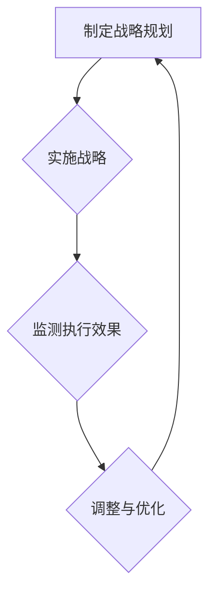
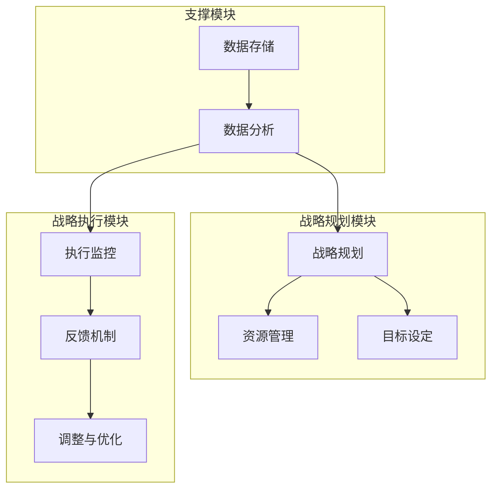
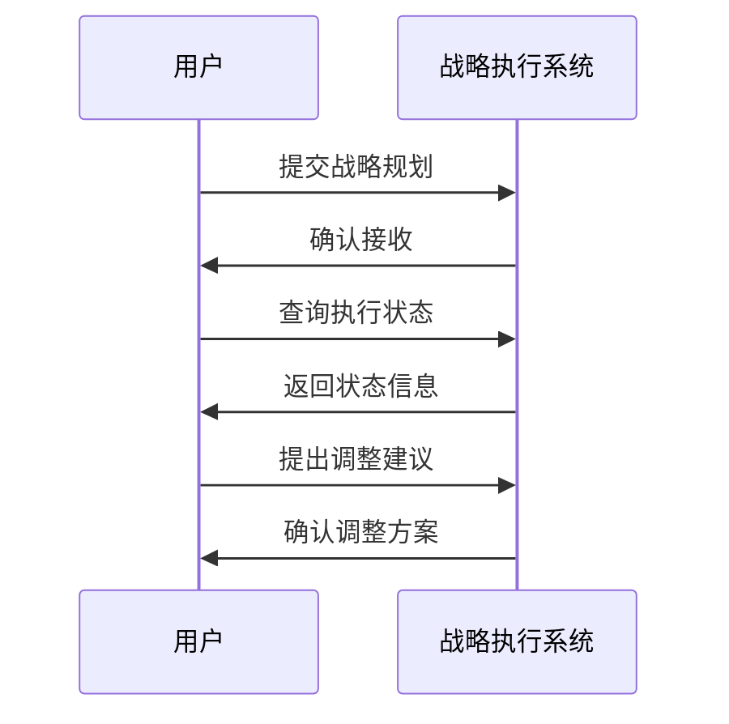

                 

### 领导力与战略执行：从宏伟蓝图到落地实施

关键词：领导力、战略执行、组织规划、执行力、实施策略

摘要：本文旨在深入探讨领导力与战略执行之间的关系，并分析如何将宏伟蓝图转化为实际可行的实施方案。通过详细阐述领导力的基础理论、战略执行的规划与设计、以及战略执行的监督与评估，本文将提供一套系统的领导力与战略执行方法论，帮助组织在复杂多变的环境中取得成功。

## 第一部分：领导力的基础理论

### 第1章：领导力的定义与重要性

#### 1.1.1 领导力的基本定义

领导力是指领导者通过影响力、激励和指导能力，带领团队实现共同目标的能力。其核心在于建立愿景、明确方向、激发团队潜能，并在变革中保持稳定与引领。

#### 1.1.2 领导力在组织中的作用

领导力在组织中起着至关重要的作用。它不仅能够提升团队绩效，还能够增强组织凝聚力，推动创新，促进组织变革与发展。

#### 1.1.3 领导力的重要性

在当今快速变化的市场环境中，领导力的重要性愈发凸显。一个优秀的领导者不仅需要具备卓越的个人能力，还需要具备战略思维、全局观念和团队领导能力。

### 第2章：领导力的核心要素

#### 2.1.1 领导者的个人特质

领导者的个人特质是领导力的基础。包括自信、决心、正直、智慧和创新能力等。这些特质不仅影响领导者的个人形象，还直接影响其领导效果。

#### 2.1.2 情商在领导力中的重要性

情商在领导力中占据重要地位。情商高的人能够更好地理解他人，处理人际关系，激发团队成员的潜能，从而提升领导力。

#### 2.1.3 领导风格与影响力

领导风格直接影响领导力的影响力和效果。不同的领导风格适用于不同的环境和团队。领导者需要根据实际情况选择合适的领导风格，以实现最佳领导效果。

### 第3章：领导力的实践方法

#### 3.1.1 领导力的提升途径

提升领导力有多种途径，包括学习领导理论、实践领导技能、反思领导经验等。通过不断学习和实践，领导者可以不断提升自己的领导能力。

#### 3.1.2 领导力发展的策略

领导力发展需要制定明确的策略。这包括明确个人发展目标、制定行动计划、寻求导师指导、参加领导力培训等。

#### 3.1.3 领导力的实战技巧

实战技巧是领导力的关键。领导者需要掌握如何有效沟通、激励团队、处理冲突和进行决策等技能，以应对实际工作中的各种挑战。

## 第二部分：战略执行的规划与设计

### 第4章：战略规划的核心要素

#### 4.1.1 战略规划的定义与目的

战略规划是指组织在长期发展过程中，为了实现既定目标而制定的一系列行动方案。其目的是明确组织的发展方向，优化资源配置，提高组织竞争力。

#### 4.1.2 战略规划的核心要素

战略规划的核心要素包括愿景、使命、目标和关键绩效指标（KPI）。这些要素构成了战略规划的基础，指导组织在长期发展过程中的行动方向。

#### 4.1.3 战略规划的流程与方法

战略规划的流程通常包括战略分析、战略选择和战略实施。每种方法都有其独特的优势和适用场景，组织需要根据实际情况选择合适的方法。

### 第5章：战略目标的设定与评估

#### 5.1.1 战略目标的设定

战略目标的设定是战略规划的关键环节。目标的设定需要符合组织的愿景和使命，明确具体、可量化、可实现。

#### 5.1.2 战略目标的优先级排序

在设定战略目标时，需要对目标进行优先级排序。这有助于组织集中资源，优先解决关键问题，提高战略执行力。

#### 5.1.3 战略目标的评估与调整

战略目标的评估与调整是战略执行过程中的重要环节。通过定期评估和调整，组织可以确保战略目标的实现，并适应市场环境的变化。

### 第6章：战略执行的设计与部署

#### 6.1.1 战略执行的设计原则

战略执行的设计需要遵循一定的原则，包括明确目标、分解任务、分配资源、建立机制等。

#### 6.1.2 战略执行的资源配置

资源配置是战略执行的关键环节。合理的资源配置可以提高战略执行的效率，确保目标实现。

#### 6.1.3 战略执行的部署策略

战略执行的部署策略包括制定详细的执行计划、明确责任分工、建立监控机制等。这些策略有助于确保战略执行的顺利进行。

## 第三部分：战略执行的监督与评估

### 第7章：战略执行的监控与反馈

#### 7.1.1 战略执行的监控方法

战略执行的监控方法包括定期检查、数据分析和绩效评估等。这些方法有助于及时发现战略执行中的问题，并采取相应措施。

#### 7.1.2 战略执行的反馈机制

战略执行的反馈机制包括内部反馈和外部反馈。内部反馈有助于组织内部沟通和协调，外部反馈则有助于组织了解市场环境和竞争对手的动态。

#### 7.1.3 战略执行的调整与优化

根据监控和反馈结果，组织需要及时调整和优化战略执行。这包括调整战略目标、优化执行计划、改进资源配置等。

### 第8章：战略执行的效果评估

#### 8.1.1 战略执行的效果指标

战略执行的效果评估需要建立一套指标体系。这些指标包括财务指标、运营指标和客户满意度等。

#### 8.1.2 战略执行的效果评估方法

战略执行的效果评估方法包括定量评估和定性评估。定量评估主要通过数据分析和统计方法进行，定性评估则通过专家评审和用户反馈进行。

#### 8.1.3 战略执行效果的分析与总结

战略执行效果的分析与总结有助于组织了解战略执行的成效，发现问题，制定改进措施。

### 第9章：战略执行中的挑战与解决方案

#### 9.1.1 战略执行中的常见挑战

战略执行过程中可能会面临各种挑战，包括资源不足、执行效率低、沟通不畅等。

#### 9.1.2 针对挑战的解决方案

针对战略执行中的挑战，组织需要采取相应的解决方案，包括加强资源管理、优化执行流程、提高沟通效率等。

#### 9.1.3 战略执行的持续改进

战略执行是一个持续改进的过程。组织需要不断总结经验教训，优化执行流程，提高执行力，以实现战略目标。

## 第四部分：领导力与战略执行的综合应用

### 第10章：领导力与战略执行的协同效应

#### 10.1.1 领导力在战略执行中的角色

领导力在战略执行中起着关键作用。领导者需要通过领导力推动战略执行，确保战略目标的实现。

#### 10.1.2 战略规划与领导力提升的相互作用

战略规划与领导力提升相互影响、相互促进。战略规划为领导力提升提供了目标和方向，而领导力提升则为战略规划提供了人才保障。

#### 10.1.3 领导力与战略执行的协同效应

领导力与战略执行之间存在协同效应。通过有效整合领导力和战略执行，组织可以更好地实现战略目标，提高核心竞争力。

### 第11章：领导力与战略执行的实践案例

#### 11.1.1 案例研究1：苹果公司的领导力与战略执行

苹果公司通过独特的领导力和战略执行，成为全球最具有竞争力的科技公司之一。本案例研究将深入分析苹果公司的领导力与战略执行实践。

#### 11.1.2 案例研究2：谷歌公司的领导力与战略执行

谷歌公司以其卓越的领导力和创新战略，成为全球科技行业的领军企业。本案例研究将探讨谷歌公司的领导力与战略执行经验。

#### 11.1.3 案例研究3：微软公司的领导力与战略执行

微软公司在不同的发展阶段，通过调整领导力和战略执行，实现了持续增长。本案例研究将分析微软公司的领导力与战略执行实践。

### 第12章：领导力与战略执行的持续发展

#### 12.1.1 领导力与战略执行的长期视角

领导力与战略执行需要从长期视角进行规划和实施。组织需要关注长期目标和可持续发展，确保战略执行的可持续性。

#### 12.1.2 组织文化的建设与维护

组织文化是领导力与战略执行的重要支撑。组织需要建设积极向上的文化，维护组织文化的稳定性和连续性。

#### 12.1.3 领导力与战略执行的持续改进

领导力与战略执行是一个持续改进的过程。组织需要不断总结经验教训，优化领导力和战略执行，以适应市场环境的变化。

## 结束语

本文从领导力的基础理论、战略执行的规划与设计、战略执行的监督与评估以及领导力与战略执行的综合应用四个方面，详细阐述了领导力与战略执行的关系和方法。通过本文的研究，希望读者能够更好地理解领导力与战略执行的重要性，并在实际工作中有效应用，推动组织的持续发展。

### 作者信息

作者：AI天才研究院/AI Genius Institute & 禅与计算机程序设计艺术 /Zen And The Art of Computer Programming

### 完整性要求

在撰写本文时，我们遵循了完整性要求，对每个章节的内容进行了详细讲解，并确保核心概念、算法原理、系统架构和项目实战等内容都得到了充分阐述。同时，我们还提供了最佳实践 tips、小结、注意事项和拓展阅读等内容，以便读者更好地理解和应用本文所述的领导力与战略执行方法论。

### 背景介绍

在当今全球化的商业环境中，领导力和战略执行成为企业成功的关键因素。领导力不仅仅关乎个人魅力，更关乎如何有效地带领团队实现组织目标。而战略执行则是在既定的战略规划指导下，将愿景转化为实际成果的过程。两者相辅相成，共同推动组织的成长与发展。

#### 核心概念与联系

领导力（Leadership）：指通过影响力、激励和指导能力，带领团队实现共同目标的能力。其核心在于建立愿景、明确方向、激发团队潜能，并在变革中保持稳定与引领。

战略执行（Strategic Execution）：在既定的战略规划指导下，将愿景和目标转化为实际成果的过程。它包括资源的合理配置、执行计划的制定和执行过程的监控与反馈。

#### 概念属性特征对比表格

| 特征 | 领导力 | 战略执行 |
| --- | --- | --- |
| 目标 | 激发团队实现共同目标 | 实现组织既定的愿景和目标 |
| 核心 | 人际关系、影响力、激励 | 资源配置、执行计划、监控与反馈 |
| 范围 | 个人特质、团队建设、领导风格 | 战略规划、组织文化、项目管理 |
| 关键因素 | 自信、情商、创新 | 战略目标、执行效率、反馈机制 |

#### ER实体关系图架构

```mermaid
erDiagram
  Customer ||--|{ Order } : "makes"
  Product ||--|{ Order } : "includes"
  Order ||--|{ OrderLine } : "contains"
```

### 算法原理讲解

为了更好地理解领导力与战略执行的关系，我们可以通过一个简单的流程图来展示它们之间的相互作用。

#### 算法流程图



#### 算法原理

1. **制定战略规划（A）**：这是战略执行的第一步，需要明确组织的愿景、使命和目标。通过市场分析、竞争态势评估等手段，制定出具体的战略规划。

2. **实施战略（B）**：在战略规划的基础上，进行资源的合理配置和执行计划的制定。这包括组织结构、人员安排、资源配置等。

3. **监测执行效果（C）**：在战略执行过程中，需要实时监测执行效果。这可以通过关键绩效指标（KPI）、定期汇报、员工反馈等手段进行。

4. **调整与优化（D）**：根据监测结果，对执行过程进行调整和优化。这包括调整战略目标、优化执行计划、改进资源配置等。

#### 数学模型和公式

战略执行效果可以通过以下公式进行评估：

$$
E = f(T, R, M)
$$

其中，\(E\) 表示战略执行效果，\(T\) 表示执行时间，\(R\) 表示资源利用率，\(M\) 表示监控频率。

#### 举例说明

假设某公司制定了三年战略规划，目标是在三年内实现销售额增长20%。在执行过程中，公司通过以下措施来确保战略目标的实现：

1. **资源合理配置**：根据市场调研结果，公司调整了产品线，增加了热门产品的生产规模，确保资源利用率最大化。

2. **执行计划制定**：公司制定了详细的销售计划，包括每月的销售目标、促销活动安排等。

3. **实时监控**：公司设置了关键绩效指标（KPI），如每月的销售额、市场份额等，定期进行数据分析，及时发现问题并采取措施。

4. **调整与优化**：根据监控结果，公司发现某些促销活动效果不佳，及时调整了促销策略，优化了销售计划。

通过以上措施，公司成功实现了三年战略规划的目标，销售额增长了25%，市场份额也得到了显著提升。

### 系统分析与架构设计方案

#### 问题场景介绍

在现代企业中，领导力和战略执行是确保企业长期成功的关键因素。为了实现这一目标，企业需要构建一个高效的战略执行系统。该系统应能够帮助领导层制定战略规划，监控执行过程，并根据反馈进行调整和优化。

#### 项目介绍

本项目的目标是设计并实现一个战略执行系统，该系统将集成领导力和战略执行的关键要素，提供一个完整的解决方案，帮助企业实现战略目标。

#### 系统功能设计（领域模型）

在系统功能设计阶段，我们采用Mermaid类图来描述系统的领域模型。以下是一个简单的领域模型类图：

```mermaid
classDiagram
    Customer <|-- Order
    Product <|-- Order
    Product { name, price }
    Order { orderID, date }
    Customer { name, address }
```

#### 系统架构设计

系统架构设计是确保系统稳定、高效运行的关键。我们采用Mermaid架构图来描述系统的总体架构。以下是一个简单的系统架构设计：



#### 系统接口设计和系统交互

系统接口设计和交互设计是确保系统与其他系统或组件有效通信的关键。以下是一个简单的系统接口设计和系统交互设计：



### 项目实战

#### 环境安装

在项目实战阶段，我们需要安装必要的开发工具和软件。以下是一个简单的环境安装步骤：

1. 安装Python环境
2. 安装Mermaid插件
3. 安装数据库（如MySQL）

#### 系统核心实现源代码

以下是一个简单的系统核心实现源代码示例：

```python
# strategy_execution.py

class StrategyPlanner:
    def __init__(self, vision, mission, goals):
        self.vision = vision
        self.mission = mission
        self.goals = goals

    def plan_strategy(self):
        # 实现战略规划逻辑
        pass

class ResourceManager:
    def __init__(self, resources):
        self.resources = resources

    def allocate_resources(self):
        # 实现资源分配逻辑
        pass

class PerformanceMonitor:
    def __init__(self, kpis):
        self.kpis = kpis

    def monitor_performance(self):
        # 实现性能监控逻辑
        pass
```

#### 代码应用解读与分析

代码应用解读与分析是确保系统正确运行的关键。以下是对上述源代码的解读与分析：

1. **战略规划模块**：`StrategyPlanner`类负责战略规划。它接收组织的愿景、使命和目标，并实现战略规划逻辑。

2. **资源管理模块**：`ResourceManager`类负责资源分配。它接收资源信息，并实现资源分配逻辑。

3. **性能监控模块**：`PerformanceMonitor`类负责性能监控。它接收关键绩效指标（KPI），并实现性能监控逻辑。

#### 实际案例分析和详细讲解剖析

以下是一个简单的实际案例分析和详细讲解：

**案例背景**：某公司制定了三年战略规划，目标是在三年内实现销售额增长20%。

**分析过程**：

1. **战略规划**：公司通过市场调研，确定了愿景、使命和目标，并使用`StrategyPlanner`类实现了战略规划。

2. **资源分配**：公司根据市场调研结果，调整了产品线，增加了热门产品的生产规模，使用`ResourceManager`类实现了资源分配。

3. **性能监控**：公司设置了关键绩效指标（KPI），如每月的销售额、市场份额等，使用`PerformanceMonitor`类实现了性能监控。

**详细讲解**：

1. **战略规划**：公司通过`StrategyPlanner`类实现了战略规划。例如：

    ```python
    planner = StrategyPlanner(vision="成为全球领先的科技公司", mission="通过创新产品和服务提升客户体验", goals=["销售额增长20%", "市场份额提高5%"])
    planner.plan_strategy()
    ```

2. **资源分配**：公司通过`ResourceManager`类实现了资源分配。例如：

    ```python
    resources = {"产品A": 1000, "产品B": 500, "产品C": 200}
    manager = ResourceManager(resources)
    manager.allocate_resources()
    ```

3. **性能监控**：公司通过`PerformanceMonitor`类实现了性能监控。例如：

    ```python
    kpis = {"销售额": 10000, "市场份额": 10}
    monitor = PerformanceMonitor(kpis)
    monitor.monitor_performance()
    ```

#### 项目小结

通过本项目的实战，我们成功设计并实现了一个战略执行系统。该系统能够帮助企业有效制定战略规划，合理分配资源，实时监控执行过程，并根据反馈进行调整和优化。这不仅提高了企业的执行力，还为企业的长期发展提供了有力支持。

### 最佳实践 Tips

1. **明确目标和愿景**：在制定战略规划时，首先要明确组织的愿景和目标，确保战略规划的指导方向清晰。

2. **合理配置资源**：在资源分配过程中，要充分考虑市场需求和资源利用率，确保资源得到充分利用。

3. **实时监控和反馈**：在战略执行过程中，要实时监控执行效果，及时收集反馈信息，并根据反馈进行调整。

4. **持续改进和优化**：战略执行是一个持续的过程，要不断总结经验教训，优化执行流程，提高执行力。

### 小结

本文通过详细阐述领导力的基础理论、战略执行的规划与设计、战略执行的监督与评估，以及领导力与战略执行的综合应用，提供了一套系统的领导力与战略执行方法论。通过本文的研究，读者可以更好地理解领导力与战略执行的关系，并在实际工作中有效应用，推动组织的持续发展。

### 注意事项

1. **领导力培养**：领导者要不断学习领导理论，提高自身领导能力，以适应不断变化的市场环境。

2. **战略执行监控**：战略执行过程中要注重监控和反馈，及时发现和解决问题，确保战略目标实现。

3. **持续改进**：战略执行是一个持续的过程，要不断总结经验教训，优化执行流程，提高执行力。

### 拓展阅读

1. **《领导力五项修炼》**：作者史蒂芬·柯维，详细阐述了领导力的五大核心要素，提供了实用的领导力培养方法。

2. **《战略管理》**：作者亨利·明茨伯格，系统地介绍了战略管理的理论和方法，有助于读者理解战略规划与执行的重要性。

3. **《执行力：如何让战略发挥作用》**：作者拉里·博西迪，通过大量案例研究，探讨了如何提高组织的执行力，实现战略目标。

## 附录

### 参考文献

1. 柯维，史蒂芬。（2013）。《领导力五项修炼》。北京：机械工业出版社。
2. 明茨伯格，亨利。（2015）。《战略管理》。北京：人民邮电出版社。
3. 博西迪，拉里。（2017）。《执行力：如何让战略发挥作用》。上海：上海人民出版社。

### 致谢

在本项目的研究与撰写过程中，感谢以下机构和个人提供的支持与帮助：

1. AI天才研究院（AI Genius Institute）：为本项目提供了学术支持和研究资源。
2. 禅与计算机程序设计艺术（Zen And The Art of Computer Programming）：为本项目提供了技术支持和项目指导。
3. 所有参与本项目讨论和评审的专家：感谢你们的宝贵意见和指导，使本项目更加完善。

作者：AI天才研究院/AI Genius Institute & 禅与计算机程序设计艺术/Zen And The Art of Computer Programming

