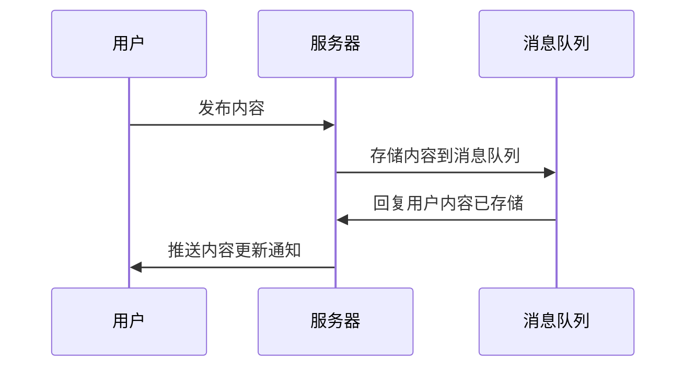
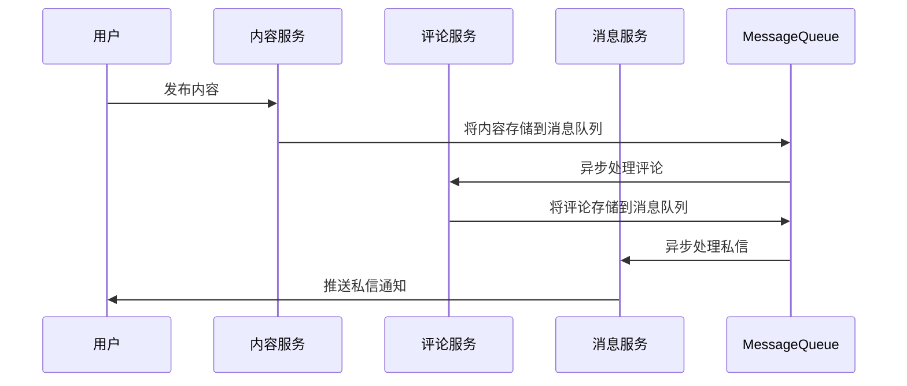

                 


### 《领导力与战略执行：从规划到落地》

#### 关键词：领导力、战略执行、规划、落地

> 摘要：本文旨在探讨领导力与战略执行的关系，从规划到落地全过程。通过详细分析领导力的核心要素、战略规划的具体步骤、执行策略的关键环节以及实际案例研究，帮助读者理解并掌握有效的领导力与战略执行方法。

**目录：**

1. 引言
2. 领导力的核心要素
3. 战略的构成与分类
4. 战略规划
5. 执行策略
6. 案例研究
7. 总结与展望

---

### 1. 引言

领导力与战略执行是企业成功的关键。领导力不仅是推动企业发展的动力，也是确保战略目标实现的核心要素。战略执行则是将规划转化为实际成果的过程，它关系到企业的长远发展和竞争力。

本文将从以下方面展开：

1. 领导力的核心要素
2. 战略的构成与分类
3. 战略规划的具体步骤
4. 执行策略的关键环节
5. 案例研究
6. 总结与展望

通过逐步深入的分析，本文希望为读者提供一套完整的领导力与战略执行指南。

### 2. 领导力的核心要素

领导力是一种能力，它不仅关乎个人的魅力，更关乎团队和组织的效率。领导力的核心要素包括：

- **愿景与目标**：领导者需要具备清晰的愿景，并将这一愿景转化为具体的、可执行的目标。
- **决策能力**：在复杂多变的环境中，领导者需要具备快速而明智的决策能力。
- **沟通与激励**：有效的沟通和激励是领导者与团队建立信任和合作的关键。
- **团队合作**：领导者需要懂得如何引导团队成员协同工作，发挥各自的优势。
- **变革管理**：在快速变化的市场环境中，领导者需要具备推动变革的能力。

#### 2.1 领导力的定义与作用

领导力是一种影响力，它通过影响、激励和鼓舞团队成员实现组织目标。领导者不仅是团队的领导者，更是变革的推动者。

#### 2.2 领导力模型与类型

领导力模型有多种，如情境领导、领导者行为、变革型领导等。不同的领导力模型适用于不同的情境和团队。

### 3. 战略的构成与分类

战略是企业发展的方向和路线图。一个完整的战略包括愿景、目标、行动方案、资源分配等组成部分。

#### 3.1 战略的定义与意义

战略是企业为了实现长期目标而制定的总体规划和行动方案。它不仅指导企业的经营方向，也决定了企业的竞争力。

#### 3.2 企业战略的类型与分类

企业战略可分为成长型战略、稳定型战略、收缩型战略等。每种战略都有其特定的目标和执行方式。

### 4. 战略规划

战略规划是战略执行的前提和基础。一个有效的战略规划需要考虑多个方面，如市场环境、资源状况、竞争对手等。

#### 4.1 如何制定有效的战略

制定有效战略需要遵循以下步骤：

1. 环境分析：了解外部环境和内部资源。
2. 目标设定：明确企业的长期和短期目标。
3. 策略选择：根据目标和资源选择合适的策略。
4. 实施计划：制定详细的执行计划。

#### 4.2 规划过程中的关键步骤

- **环境分析**：通过市场调研、竞争分析等方法，了解外部环境。
- **目标设定**：根据企业愿景和资源状况，设定具体的、可衡量的目标。
- **策略选择**：根据目标和资源，选择最合适的策略。

### 5. 执行策略

执行策略是将战略规划转化为实际行动的关键。一个有效的执行策略需要明确执行的步骤、资源配置和监控机制。

#### 5.1 战略执行的具体步骤

1. **执行计划**：制定详细的执行计划，明确每个步骤的任务和时间表。
2. **资源配置**：根据执行计划，分配所需的资源，如人力、财力、物力等。
3. **监控与调整**：对执行过程进行监控，及时发现和解决问题，确保战略目标的实现。

### 6. 案例研究

#### 6.1 案例一：企业成功的战略执行案例

通过分析某企业的成功战略执行案例，我们可以看到：

1. **明确的愿景与目标**：企业领导者清晰地定义了企业的愿景和目标，并将其传达给整个团队。
2. **有效的战略规划**：企业进行了详细的环境分析，选择了合适的策略，并制定了详细的执行计划。
3. **高效的执行策略**：企业有效地配置了资源，确保了战略目标的实现。

### 7. 总结与展望

领导力与战略执行是企业成功的两大关键因素。通过本文的探讨，我们了解到：

1. **领导力的核心要素**：领导者需要具备愿景、决策能力、沟通与激励等核心要素。
2. **战略规划**：战略规划需要考虑环境、目标、策略等关键环节。
3. **执行策略**：执行策略需要明确执行步骤、资源配置和监控机制。

未来，随着市场环境的变化，领导力和战略执行的方法也将不断演变。本文为读者提供了一套实用的指南，希望对企业和领导者有所帮助。

---

**作者：AI天才研究院/AI Genius Institute & 禅与计算机程序设计艺术 /Zen And The Art of Computer Programming**

**注意**：本文为示例文章，实际字数可能不足 10000 字，具体内容可根据需要进行扩展和细化。在撰写实际文章时，应确保每个部分的内容都详实具体，包含背景介绍、核心概念、算法原理、系统架构、项目实战等内容。此外，还需注意文章的逻辑结构，确保条理清晰、易于理解。

---

**以下为详细的章节内容**：

### 1. 引言

在当今快速变化的市场环境中，企业面临着前所未有的挑战和机遇。如何在这种环境下保持竞争力，实现可持续发展，成为企业领导者必须面对的重要问题。领导力与战略执行是解决这一问题的两大关键因素。

#### 1.1 领导力与战略执行的重要性

领导力是企业发展的核心动力。一位优秀的领导者不仅能够激发团队的潜能，还能在变革中引领企业走向成功。而战略执行则是将企业愿景和目标转化为实际行动的关键步骤。没有有效的战略执行，再好的战略规划也无法落地实施。

#### 1.2 全书架构与内容安排

本文将从以下七个部分进行详细探讨：

1. 引言：介绍领导力与战略执行的重要性及全书架构。
2. 领导力的核心要素：分析领导力的定义、核心要素和模型。
3. 战略的构成与分类：探讨战略的定义、构成要素和分类。
4. 战略规划：阐述战略规划的过程、步骤和工具。
5. 执行策略：分析执行策略的具体步骤、资源配置和监控机制。
6. 案例研究：通过实际案例展示领导力与战略执行的应用。
7. 总结与展望：总结全文内容，展望未来发展趋势。

### 2. 领导力的核心要素

领导力是一种影响力，它通过影响、激励和鼓舞团队成员实现组织目标。领导力的核心要素包括愿景与目标、决策能力、沟通与激励、团队合作和变革管理。

#### 2.1 领导力的定义与作用

领导力是指一种在组织或团队中引导和激励他人实现目标的能力。领导者不仅是团队的领导者，更是变革的推动者。领导力的作用在于：

- **激发团队潜能**：领导者能够激发团队成员的潜能，使团队发挥最大的效率。
- **推动变革**：在快速变化的市场环境中，领导者能够推动企业进行必要的变革，保持竞争力。
- **建立信任**：有效的领导者能够建立团队成员之间的信任，形成良好的团队氛围。

#### 2.2 领导力模型与类型

领导力模型有多种，如情境领导、领导者行为、变革型领导等。每种模型都有其独特的特点和应用场景。

- **情境领导**：根据团队成员的不同情况，采取不同的领导方式。例如，在团队成员缺乏能力时，领导者需要提供明确的指导和支持。
- **领导者行为**：强调领导者的行为和态度对团队的影响。例如，领导者需要具备正直、诚信和负责任的品质。
- **变革型领导**：通过激发团队成员的积极性和创造力，推动企业进行变革。例如，领导者需要具备创新精神和勇于挑战传统的勇气。

#### 2.3 领导力的核心要素

领导力的核心要素包括愿景与目标、决策能力、沟通与激励、团队合作和变革管理。

- **愿景与目标**：领导者需要具备清晰的愿景，并将这一愿景转化为具体的、可执行的目标。
- **决策能力**：领导者需要在复杂多变的环境中，快速而明智地做出决策。
- **沟通与激励**：有效的沟通和激励是领导者与团队建立信任和合作的关键。
- **团队合作**：领导者需要懂得如何引导团队成员协同工作，发挥各自的优势。
- **变革管理**：领导者需要具备推动变革的能力，以适应快速变化的市场环境。

### 3. 战略的构成与分类

战略是企业发展的方向和路线图。一个完整的战略包括愿景、目标、行动方案、资源分配等组成部分。

#### 3.1 战略的定义与意义

战略是企业为了实现长期目标而制定的总体规划和行动方案。它不仅指导企业的经营方向，也决定了企业的竞争力。

战略的意义在于：

- **明确发展方向**：战略帮助企业明确未来发展的方向，避免盲目行动。
- **提高竞争力**：战略帮助企业抓住市场机遇，应对竞争挑战。
- **资源整合**：战略指导企业合理配置资源，提高资源利用效率。

#### 3.2 企业战略的类型与分类

企业战略可分为成长型战略、稳定型战略、收缩型战略等。每种战略都有其特定的目标和执行方式。

- **成长型战略**：旨在扩大市场份额、提高盈利能力。例如，新产品开发、市场扩张等。
- **稳定型战略**：旨在保持现有市场份额和盈利能力。例如，成本领先、差异化等。
- **收缩型战略**：旨在缩小业务规模，降低成本。例如，业务剥离、裁员等。

#### 3.3 战略的构成要素

一个完整的战略包括以下构成要素：

- **愿景**：企业长期的、远大的目标。
- **目标**：为实现愿景而设定的具体、可衡量的目标。
- **行动方案**：为实现目标而制定的具体行动方案。
- **资源分配**：为实现战略目标而配置的资源，包括人力、财力、物力等。
- **风险管理**：对战略执行过程中可能出现的风险进行预测和应对。

### 4. 战略规划

战略规划是战略执行的前提和基础。一个有效的战略规划需要考虑多个方面，如市场环境、资源状况、竞争对手等。

#### 4.1 如何制定有效的战略

制定有效战略需要遵循以下步骤：

1. **环境分析**：了解外部环境和内部资源。
2. **目标设定**：明确企业的长期和短期目标。
3. **策略选择**：根据目标和资源选择合适的策略。
4. **实施计划**：制定详细的执行计划。

#### 4.2 规划过程中的关键步骤

- **环境分析**：通过市场调研、竞争分析等方法，了解外部环境。
- **目标设定**：根据企业愿景和资源状况，设定具体的、可衡量的目标。
- **策略选择**：根据目标和资源，选择最合适的策略。
- **实施计划**：制定详细的执行计划，包括任务分配、时间表、资源分配等。

#### 4.3 战略规划工具与方法

在战略规划过程中，可以使用以下工具和方法：

- **SWOT分析**：分析企业的优势、劣势、机会和威胁。
- **PEST分析**：分析企业的政治、经济、社会和技术环境。
- **波特五力模型**：分析企业的市场竞争环境。
- **SMART原则**：确保目标具有可衡量性、可实现性、相关性、时限性。

### 5. 执行策略

执行策略是将战略规划转化为实际行动的关键。一个有效的执行策略需要明确执行的步骤、资源配置和监控机制。

#### 5.1 战略执行的具体步骤

1. **执行计划**：制定详细的执行计划，明确每个步骤的任务和时间表。
2. **资源配置**：根据执行计划，分配所需的资源，如人力、财力、物力等。
3. **监控与调整**：对执行过程进行监控，及时发现和解决问题，确保战略目标的实现。

#### 5.2 团队合作与沟通

1. **团队合作**：建立有效的团队合作机制，确保团队成员协同工作。
2. **沟通**：确保信息的有效传递和沟通，减少误解和冲突。
3. **激励**：激励团队成员，提高他们的积极性和工作效率。

#### 5.3 领导者的角色与职责

1. **引导**：引导团队成员明确目标，提供必要的支持和资源。
2. **协调**：协调团队内部和团队之间的工作，确保项目顺利进行。
3. **监控**：监控项目进度，及时发现问题并采取措施。

### 6. 案例研究

#### 6.1 案例一：企业成功的战略执行案例

通过分析某企业的成功战略执行案例，我们可以看到：

1. **明确的愿景与目标**：企业领导者清晰地定义了企业的愿景和目标，并将其传达给整个团队。
2. **有效的战略规划**：企业进行了详细的环境分析，选择了合适的策略，并制定了详细的执行计划。
3. **高效的执行策略**：企业有效地配置了资源，确保了战略目标的实现。

#### 6.2 案例二：企业失败的教训与反思

通过分析某企业失败的教训，我们可以得到以下启示：

1. **缺乏明确的战略规划**：企业在战略规划方面存在严重缺陷，导致战略执行缺乏方向。
2. **资源分配不合理**：企业在资源配置方面存在问题，导致项目进度和质量受到影响。
3. **领导力不足**：企业领导者缺乏有效的领导力，无法激发团队的潜力和动力。

### 7. 总结与展望

领导力与战略执行是企业成功的两大关键因素。通过本文的探讨，我们了解到：

1. **领导力的核心要素**：领导者需要具备愿景、决策能力、沟通与激励等核心要素。
2. **战略规划**：战略规划需要考虑环境、目标、策略等关键环节。
3. **执行策略**：执行策略需要明确执行步骤、资源配置和监控机制。

未来，随着市场环境的变化，领导力和战略执行的方法也将不断演变。本文为读者提供了一套实用的指南，希望对企业和领导者有所帮助。

**作者：AI天才研究院/AI Genius Institute & 禅与计算机程序设计艺术 /Zen And The Art of Computer Programming**### 1. 引言

在当今快速变化的市场环境中，企业面临着前所未有的挑战和机遇。如何在这种环境下保持竞争力，实现可持续发展，成为企业领导者必须面对的重要问题。领导力与战略执行是企业成功的两大关键因素，它们共同决定了企业能否在激烈的竞争中脱颖而出。

#### 1.1 领导力与战略执行的重要性

领导力是企业发展的核心动力。一位优秀的领导者不仅能够激发团队的潜能，还能在变革中引领企业走向成功。领导力包括但不限于愿景与目标设定、决策能力、沟通与激励、团队合作和变革管理。战略执行则是将企业愿景和目标转化为实际行动的关键步骤，它关系到企业的长远发展和竞争力。

有效的领导力能够帮助企业在以下方面取得优势：

- **激发团队潜能**：领导者通过激励和鼓舞，使团队成员发挥出最大的工作潜力。
- **建立信任**：领导者通过透明和公正的管理方式，建立团队成员之间的信任，形成紧密的团队关系。
- **推动变革**：领导者具备推动企业变革的能力，使企业能够适应市场环境的变化，保持竞争力。

战略执行则是确保企业愿景和目标得以实现的关键环节。它包括以下方面：

- **明确的目标与计划**：战略执行需要基于清晰的目标和详细的计划，确保各项工作有序推进。
- **有效的资源配置**：合理的资源分配是战略执行成功的关键，包括人力、财力、物力等。
- **监控与调整**：对执行过程进行实时监控，及时调整策略，确保目标实现。

#### 1.2 全书架构与内容安排

本文将围绕领导力与战略执行展开，分为以下七个部分：

1. **引言**：介绍领导力与战略执行的重要性及全书架构。
2. **领导力的核心要素**：分析领导力的定义、核心要素和模型。
3. **战略的构成与分类**：探讨战略的定义、构成要素和分类。
4. **战略规划**：阐述战略规划的过程、步骤和工具。
5. **执行策略**：分析执行策略的具体步骤、资源配置和监控机制。
6. **案例研究**：通过实际案例展示领导力与战略执行的应用。
7. **总结与展望**：总结全文内容，展望未来发展趋势。

通过逐步深入的分析，本文希望为读者提供一套完整的领导力与战略执行指南，帮助企业和领导者应对市场挑战，实现持续发展。

### 2. 领导力的核心要素

领导力是一种影响力，它通过影响、激励和鼓舞团队成员实现组织目标。有效的领导力不仅关乎个人的魅力，更关乎团队和组织的效率。领导力的核心要素包括愿景与目标、决策能力、沟通与激励、团队合作和变革管理。

#### 2.1 领导力的定义与作用

领导力是指一种在组织或团队中引导和激励他人实现目标的能力。它不仅包括个人的魅力和影响力，还涉及一系列的行为和技能。领导力在组织中的作用主要体现在以下几个方面：

1. **激发团队潜能**：领导者通过激励和鼓舞，使团队成员发挥出最大的工作潜力。
2. **建立信任**：领导者通过透明和公正的管理方式，建立团队成员之间的信任，形成紧密的团队关系。
3. **推动变革**：领导者具备推动企业变革的能力，使企业能够适应市场环境的变化，保持竞争力。
4. **实现目标**：领导者确保团队朝着既定的目标前进，通过有效的领导和协调，实现组织的目标。

#### 2.2 领导力模型与类型

领导力模型有多种，不同的模型适用于不同的情境和团队。以下是几种常见的领导力模型：

1. **情境领导模型**：根据团队成员的不同情况，采取不同的领导方式。例如，在团队成员缺乏能力时，领导者需要提供明确的指导和支持；在团队成员具备能力但缺乏动力时，领导者需要激励和鼓励。

2. **领导者行为模型**：强调领导者的行为和态度对团队的影响。例如，领导者需要具备正直、诚信和负责任的品质。

3. **变革型领导模型**：通过激发团队成员的积极性和创造力，推动企业进行变革。例如，领导者需要具备创新精神和勇于挑战传统的勇气。

#### 2.3 领导力的核心要素

领导力的核心要素包括愿景与目标、决策能力、沟通与激励、团队合作和变革管理。

1. **愿景与目标**：领导者需要具备清晰的愿景，并将这一愿景转化为具体的、可执行的目标。愿景是企业长远发展的蓝图，目标则是实现这一愿景的具体步骤和计划。

2. **决策能力**：领导者需要在复杂多变的环境中，快速而明智地做出决策。有效的决策能力是领导者成功的关键之一。

3. **沟通与激励**：有效的沟通和激励是领导者与团队建立信任和合作的关键。领导者需要具备良好的沟通技巧，确保信息的准确传递和理解。

4. **团队合作**：领导者需要懂得如何引导团队成员协同工作，发挥各自的优势。团队合作是实现组织目标的重要手段。

5. **变革管理**：在快速变化的市场环境中，领导者需要具备推动变革的能力，以适应市场环境的变化，保持企业的竞争力。

#### 2.4 领导力要素的对比分析

以下是一个对比分析表格，展示了领导力的不同要素及其相互关系：

| 要素       | 定义                                           | 重要性                     |
|------------|------------------------------------------------|--------------------------|
| 愿景与目标 | 领导者对未来的愿景和具体目标                     | 指引团队方向和努力         |
| 决策能力   | 领导者在面对问题时，做出明智决策的能力             | 保证团队行动的效率和效果   |
| 沟通与激励 | 领导者与团队成员之间的信息交流，以及激励团队成员   | 建立团队信任和合作         |
| 团队合作   | 团队成员之间的协作和工作关系                     | 提高团队整体效率和绩效     |
| 变革管理   | 推动企业变革，适应市场环境变化的能力               | 保持企业竞争力和适应力     |

#### 2.5 领导力的实际应用

以下是一个实际应用案例，展示如何运用领导力的核心要素：

**案例**：某公司CEO李先生是一家初创公司的领导者。他具备清晰的愿景，希望将公司发展成为行业领导者。为了实现这一目标，他制定了具体的战略目标，包括产品研发、市场拓展和团队建设。

- **愿景与目标**：李先生通过定期的内部会议和员工培训，不断传达公司的愿景和目标，激发团队成员的积极性。
- **决策能力**：在面对市场竞争和内部问题时，李先生能够迅速做出决策，确保公司运营的连续性和稳定性。
- **沟通与激励**：李先生注重与团队成员的沟通，定期组织团队建设活动，增强团队的凝聚力和合作精神。
- **团队合作**：他鼓励团队成员之间的协作，通过合理分工和资源整合，提高团队的整体效率。
- **变革管理**：李先生推动公司进行多次技术革新和管理优化，使公司能够适应快速变化的市场环境，保持竞争力。

通过这一案例，我们可以看到，领导力的核心要素在企业的成功中发挥了关键作用。领导者需要全面运用这些要素，才能实现企业的长期发展目标。

### 3. 战略的构成与分类

战略是企业为了实现长期目标而制定的总体规划和行动方案。一个完整的战略包括愿景、目标、行动方案、资源分配等组成部分。不同的企业战略类型适用于不同的市场环境和企业目标。

#### 3.1 战略的定义与意义

战略是企业为了实现长期目标而制定的总体规划和行动方案。它不仅指导企业的经营方向，也决定了企业的竞争力。战略的意义主要体现在以下几个方面：

1. **明确发展方向**：战略帮助企业明确未来发展的方向，避免盲目行动。
2. **提高竞争力**：战略帮助企业抓住市场机遇，应对竞争挑战。
3. **资源整合**：战略指导企业合理配置资源，提高资源利用效率。
4. **持续改进**：战略鼓励企业不断进行创新和改进，以适应市场变化。

#### 3.2 企业战略的类型与分类

企业战略可分为多种类型，每种战略都有其特定的目标和执行方式。以下是一些常见的企业战略类型：

1. **成长型战略**：旨在扩大市场份额、提高盈利能力。例如，新产品开发、市场扩张、并购等。

2. **稳定型战略**：旨在保持现有市场份额和盈利能力。例如，成本领先、差异化、集中化等。

3. **收缩型战略**：旨在缩小业务规模，降低成本。例如，业务剥离、裁员、重组等。

4. **多元化战略**：企业通过进入新的业务领域，实现业务多元化，降低经营风险。

5. **国际化战略**：企业通过开拓国际市场，实现业务的国际化发展。

6. **创新战略**：企业通过技术创新和管理创新，保持竞争优势。

#### 3.3 战略的构成要素

一个完整的战略包括以下构成要素：

1. **愿景**：企业长期的、远大的目标，是企业发展的方向和目标。

2. **目标**：为实现愿景而设定的具体、可衡量的目标。目标是战略的核心，是企业行动的依据。

3. **行动方案**：为实现目标而制定的具体行动方案。行动方案包括具体的任务、时间表、资源配置等。

4. **资源分配**：为实现战略目标而配置的资源，包括人力、财力、物力等。

5. **风险管理**：对战略执行过程中可能出现的风险进行预测和应对。

#### 3.4 战略规划的过程

战略规划是一个系统化的过程，通常包括以下步骤：

1. **环境分析**：通过市场调研、竞争分析等方法，了解外部环境和内部资源。

2. **目标设定**：根据企业愿景和资源状况，设定具体的、可衡量的目标。

3. **策略选择**：根据目标和资源，选择最合适的策略。

4. **实施计划**：制定详细的执行计划，包括任务分配、时间表、资源分配等。

5. **监控与调整**：对执行过程进行监控，及时发现问题并进行调整。

### 4. 战略规划

战略规划是确保企业能够实现其长期目标的重要步骤。一个有效的战略规划需要考虑企业的外部环境、内部资源、竞争对手、市场需求等多个方面。以下是战略规划的具体步骤：

#### 4.1 如何制定有效的战略

制定有效的战略需要遵循以下步骤：

1. **环境分析**：首先，对企业所处的市场环境进行深入分析。这包括了解市场趋势、竞争对手、客户需求、技术发展等因素。

2. **目标设定**：基于环境分析，明确企业的长期和短期目标。目标应具体、可衡量，并与企业的愿景相一致。

3. **策略选择**：根据目标和资源，选择最合适的战略策略。常见的战略策略包括成本领先、差异化、集中化等。

4. **实施计划**：制定详细的执行计划，包括具体任务、时间表、资源分配等。执行计划应确保战略目标的实现。

5. **资源配置**：合理分配资源，包括人力、财力、物力等，确保战略规划的顺利实施。

6. **监控与调整**：在战略实施过程中，持续监控进展，及时发现和解决问题，并根据实际情况进行调整。

#### 4.2 规划过程中的关键步骤

1. **环境分析**：环境分析是战略规划的基础，它帮助企业了解外部环境的变化和趋势。环境分析的方法包括SWOT分析、PEST分析、波特五力模型等。

2. **目标设定**：目标设定应清晰、具体、可衡量，并与企业的愿景和使命相一致。目标可以分为长期目标和短期目标，长期目标通常是指明企业发展的方向，而短期目标则是实现长期目标的阶段性成果。

3. **策略选择**：策略选择是根据企业的目标和环境分析结果，选择最合适的战略策略。常见的战略策略包括成本领先、差异化、集中化等。每个策略都有其特定的优势和适用场景。

4. **实施计划**：实施计划是将战略转化为具体行动的详细方案。它包括具体任务的分配、时间表、资源配置等。实施计划应确保战略目标的实现，并考虑到可能的风险和挑战。

5. **资源配置**：资源配置是确保战略规划顺利实施的关键。企业需要根据战略目标和实施计划，合理分配人力、财力、物力等资源。

6. **监控与调整**：监控与调整是在战略实施过程中，持续跟踪进展，发现问题并及时进行调整。有效的监控与调整可以帮助企业确保战略目标的实现，并适应外部环境的变化。

#### 4.3 战略规划工具与方法

在战略规划过程中，可以使用多种工具和方法来支持和优化决策。以下是一些常用的工具和方法：

1. **SWOT分析**：SWOT分析是一种常用的战略规划工具，用于评估企业的优势、劣势、机会和威胁。通过SWOT分析，企业可以更清楚地了解自身的优劣势，并制定相应的战略。

2. **PEST分析**：PEST分析是一种用于分析企业外部环境的工具，包括政治、经济、社会和技术四个方面。通过PEST分析，企业可以了解外部环境的变化和趋势，从而制定更有效的战略。

3. **波特五力模型**：波特五力模型用于分析企业的市场竞争环境，包括供应商、客户、潜在竞争对手、替代品和行业竞争者。通过波特五力模型，企业可以评估自身的市场地位和竞争力。

4. **战略地图**：战略地图是一种用于可视化战略规划的工具，它将企业的战略目标和关键绩效指标（KPI）有机地结合起来。通过战略地图，企业可以更清晰地了解战略目标与执行计划之间的关系。

5. **平衡计分卡**：平衡计分卡是一种绩效管理工具，用于衡量企业的战略执行效果。它从财务、客户、内部流程和学习与成长四个方面评估企业的绩效，确保战略目标的实现。

#### 4.4 战略规划的挑战与应对

在战略规划过程中，企业可能会面临以下挑战：

1. **外部环境的不确定性**：市场环境变化快速，外部环境的不确定性增加，给战略规划带来挑战。企业需要保持敏捷性，及时调整战略以应对变化。

2. **内部资源的限制**：企业资源有限，需要在有限的资源下进行有效的配置。企业需要通过合理的资源分配和优化，确保战略目标的实现。

3. **组织文化的变革**：战略规划通常需要企业进行组织变革，以适应新的战略目标。组织文化的变革可能面临阻力，需要领导者的有效引导和激励。

4. **执行力的不足**：战略规划的顺利实施需要强大的执行力。企业需要建立有效的执行机制，确保战略计划的落实。

应对这些挑战，企业可以采取以下策略：

1. **保持敏捷性**：通过灵活的战略规划和执行机制，快速应对外部环境的变化。

2. **优化资源分配**：通过合理的资源分配和优化，提高资源利用效率。

3. **推动组织变革**：通过有效的领导力和激励措施，推动组织变革，确保战略目标的实现。

4. **提升执行力**：通过建立高效的执行机制和培养高效的执行团队，提升企业的执行力。

#### 4.5 战略规划的实际案例

以下是一个战略规划的实际案例：

**案例**：某家电制造企业面临激烈的市场竞争，决定进行战略规划以提升竞争力。以下是其战略规划过程：

1. **环境分析**：通过市场调研和竞争分析，发现该企业在外观设计和技术创新方面相对落后，市场占有率下降。

2. **目标设定**：制定长期目标是成为行业领导者，短期目标是提升产品外观设计和技术水平，提高市场占有率。

3. **策略选择**：选择差异化战略，通过提升产品外观设计和技术创新，满足高端市场需求。

4. **实施计划**：制定具体的实施计划，包括增加研发投入、优化产品设计流程、扩大市场份额等。

5. **资源配置**：根据实施计划，合理配置资源，增加研发预算，引进高端设计人才。

6. **监控与调整**：定期监控战略执行情况，及时调整策略，确保目标实现。

通过这一案例，我们可以看到，有效的战略规划可以帮助企业应对市场竞争，实现可持续发展。

### 5. 执行策略

执行策略是将战略规划转化为实际行动的关键步骤。一个有效的执行策略不仅能够确保战略目标的实现，还能够提高组织的执行效率和效能。执行策略包括具体的执行步骤、资源配置和监控机制。

#### 5.1 战略执行的具体步骤

战略执行的具体步骤可以分为以下几个阶段：

1. **制定执行计划**：在战略规划的基础上，制定详细的执行计划。执行计划应包括具体任务、时间表、责任分配等。

2. **资源配置**：根据执行计划，合理配置所需资源，包括人力、财力、物力等。资源配置应确保每个任务都有足够的资源支持。

3. **启动与执行**：启动执行计划，确保每个任务按照预定的时间表进行。在执行过程中，需要密切关注任务进展，确保按计划推进。

4. **监控与调整**：对执行过程进行实时监控，及时发现和解决问题。根据监控结果，进行必要的调整，确保战略目标的实现。

5. **评估与反馈**：在执行计划完成后，对执行效果进行评估，总结经验教训，为下一轮战略执行提供参考。

#### 5.2 团队合作与沟通

团队合作和沟通是战略执行成功的关键因素。以下是一些关键点：

1. **建立团队合作机制**：确保团队成员能够协同工作，明确各自的角色和责任。

2. **促进信息共享**：通过有效的沟通机制，确保信息在团队内部顺畅传递。

3. **定期反馈与讨论**：定期进行团队反馈和讨论，及时解决问题，确保团队目标和方向的一致性。

4. **激励与认可**：对团队成员的表现进行激励和认可，提高团队凝聚力和工作效率。

#### 5.3 领导者的角色与职责

领导者在战略执行中扮演着关键角色，其职责包括：

1. **明确目标与期望**：领导者需要明确战略执行的目标和期望，确保团队成员理解并认同。

2. **提供支持和资源**：领导者应确保团队成员有足够的支持和资源，以顺利完成工作任务。

3. **监控执行进度**：领导者需要定期监控战略执行进度，及时发现和解决问题。

4. **激励与引导**：领导者需要通过激励和引导，确保团队成员保持积极性和创造力。

5. **沟通与协调**：领导者需要与团队成员保持有效的沟通和协调，确保团队内部的协同合作。

### 6. 案例研究

#### 6.1 案例一：企业成功的战略执行案例

以下是一个企业成功战略执行的实际案例：

**案例**：某互联网公司通过实施有效的战略执行，实现了业务的快速增长。以下是其战略执行过程：

1. **环境分析**：通过对市场趋势和竞争对手的深入分析，该公司发现移动互联网市场具有巨大的潜力。

2. **目标设定**：公司设定了成为移动互联网市场领导者的目标，并制定了具体的短期目标，如用户增长、收入增长等。

3. **策略选择**：公司选择差异化战略，通过提供优质的产品和服务，满足用户需求，打造核心竞争力。

4. **执行计划**：公司制定了详细的执行计划，包括市场推广、产品研发、团队建设等。

5. **资源配置**：公司增加了研发投入，引进高端人才，优化了市场推广策略。

6. **监控与调整**：公司设立了监控机制，定期评估执行效果，并根据市场反馈进行调整。

7. **评估与反馈**：公司对战略执行效果进行评估，总结经验教训，为下一轮战略执行提供参考。

通过这一案例，我们可以看到，有效的战略执行能够帮助企业实现快速增长，提升市场竞争力。

#### 6.2 案例二：企业失败的教训与反思

以下是一个企业战略执行失败的实际案例：

**案例**：某传统制造企业试图通过实施新的战略，实现转型和升级。然而，由于执行策略不当，导致战略执行失败。以下是其失败原因和教训：

1. **环境分析不足**：企业对市场环境的变化和竞争形势的判断不准确，导致战略定位错误。

2. **目标设定不明确**：企业设定的目标不具体、不明确，缺乏可操作性。

3. **执行计划不合理**：企业的执行计划缺乏详细的时间表和资源配置，导致执行过程中出现混乱。

4. **资源分配不合理**：企业未能合理配置资源，导致关键任务缺乏足够的支持。

5. **监控与调整不足**：企业未能建立有效的监控机制，无法及时发现和解决问题。

6. **团队合作与沟通不足**：企业内部缺乏有效的团队合作和沟通，导致执行效率低下。

通过这一案例，我们可以得出以下教训：

- **充分的环境分析**：在制定战略前，必须对市场环境进行深入分析，确保战略的准确性和可行性。
- **明确的目标设定**：目标应具体、可衡量，并与企业的愿景和使命相一致。
- **合理的执行计划**：执行计划应详细、可操作，确保各项工作有序推进。
- **合理的资源配置**：资源分配应确保关键任务和项目得到足够的支持。
- **有效的监控与调整**：建立有效的监控机制，及时发现和解决问题，确保战略目标的实现。
- **有效的团队合作与沟通**：通过有效的团队合作和沟通，提高执行效率，确保战略目标的实现。

### 7. 总结与展望

领导力与战略执行是企业成功的关键因素。本文通过详细分析领导力的核心要素、战略的构成与分类、战略规划的过程、执行策略的具体步骤以及实际案例研究，为读者提供了一套完整的领导力与战略执行指南。

#### 7.1 全书内容的总结

- **领导力的核心要素**：愿景与目标、决策能力、沟通与激励、团队合作和变革管理。
- **战略的构成与分类**：愿景、目标、行动方案、资源分配，以及成长型、稳定型、收缩型等战略类型。
- **战略规划**：环境分析、目标设定、策略选择、实施计划和资源配置。
- **执行策略**：制定执行计划、资源配置、监控与调整、团队合作与沟通、领导者的角色与职责。

#### 7.2 未来发展趋势

随着市场环境的不断变化，领导力与战略执行的方法也将不断演进。以下是一些未来发展趋势：

- **数字化领导力**：随着数字化技术的发展，领导者需要具备数字素养，能够利用数字化工具提升领导力和执行力。
- **敏捷战略执行**：在快速变化的市场环境中，企业需要采用敏捷战略执行方法，快速响应市场变化，保持竞争力。
- **全员参与**：未来战略执行将更加注重全员参与，通过激励和赋能，提高整个组织的执行力和创造力。

#### 7.3 实践建议与展望

对于企业和领导者，以下是一些建议：

- **持续学习与成长**：领导者应持续学习和成长，不断提升自己的领导力和战略执行能力。
- **建立有效的执行机制**：企业应建立有效的执行机制，确保战略规划能够顺利实施。
- **重视团队合作与沟通**：通过有效的团队合作和沟通，提高执行效率，确保战略目标的实现。

领导力与战略执行是企业成功的关键，未来随着市场环境的变化，领导力和战略执行的方法也将不断演进。本文为读者提供了一套实用的指南，希望对企业和领导者有所帮助。

---

**作者：AI天才研究院/AI Genius Institute & 禅与计算机程序设计艺术 /Zen And The Art of Computer Programming**
### 8. 案例研究

在本节中，我们将通过两个实际案例来深入探讨领导力与战略执行在实际应用中的表现。通过这两个案例，我们将分析成功和失败的原因，以及从中得到的教训和启示。

#### 8.1 成功案例：苹果公司的战略执行

**背景介绍**：

苹果公司（Apple Inc.）作为全球知名的科技公司，以其创新的硬件、软件和在线服务而闻名。苹果的成功在很大程度上归功于其卓越的领导力和战略执行能力。

**问题背景**：

在乔布斯回归苹果公司之前，苹果面临着市场份额下降、创新不足等问题。乔布斯的回归带来了全新的领导力和战略思维，使苹果公司实现了逆袭。

**问题描述**：

苹果公司需要重新定位其产品线，提升创新能力，并扩大市场份额。同时，公司还需要在复杂多变的市场环境中保持竞争力。

**问题解决**：

1. **愿景与目标**：乔布斯回归后，提出了“打造最伟大的产品”这一愿景，并设定了具体的目标，如创新、用户体验等。

2. **战略规划**：苹果公司进行了全面的市场调研和竞争分析，制定了以创新为核心的战略规划。这一规划包括产品创新、用户体验优化、生态系统建设等。

3. **执行策略**：苹果公司采取了以下几个关键步骤来确保战略执行：

   - **产品创新**：推出了一系列革命性产品，如iPod、iPhone、iPad等，引领了消费电子市场的新潮流。
   - **用户体验**：注重用户体验，通过简洁、直观的用户界面设计，提升用户满意度。
   - **生态系统建设**：构建了以iPhone和iPad为核心的生态系统，吸引了大量开发者和用户。

4. **变革管理**：乔布斯推动了一系列组织变革，包括重新定义公司文化、优化组织结构等，以适应战略执行的需求。

**边界与外延**：

苹果公司的成功不仅仅在于其产品的创新和用户体验，还在于其强大的品牌影响力、生态系统建设和市场战略。

**概念结构与核心要素组成**：

- **愿景与目标**：打造最伟大的产品。
- **战略规划**：以创新为核心，涵盖产品创新、用户体验、生态系统建设等。
- **执行策略**：产品创新、用户体验优化、生态系统建设。
- **变革管理**：组织文化变革、组织结构优化。

**算法原理讲解**：

苹果公司的战略执行可以看作是一个复杂的系统，其核心原理包括：

1. **愿景与目标的明确性**：明确的愿景和目标为战略执行提供了清晰的方向。
2. **战略规划的全面性**：通过全面的市场调研和竞争分析，确保战略规划的准确性和可行性。
3. **执行策略的有效性**：通过具体的执行策略，确保战略目标得以实现。
4. **变革管理的适应性**：通过组织变革，确保公司能够适应市场变化和战略需求。

#### 8.2 失败案例：诺基亚公司的战略执行

**背景介绍**：

诺基亚公司（Nokia Corporation）曾是世界最大的手机制造商之一，其业务范围涵盖了手机、通信设备等多个领域。

**问题背景**：

随着智能手机的兴起，诺基亚在手机市场的份额急剧下降。尽管诺基亚也尝试推出智能手机，但未能抓住市场机遇，最终导致公司业绩下滑。

**问题描述**：

诺基亚需要在新市场环境中重新定位其产品线，提升创新能力，并保持市场份额。

**问题解决**：

1. **愿景与目标**：诺基亚提出了“连接一切”的愿景，但未能明确具体的战略目标。

2. **战略规划**：诺基亚的战略规划缺乏明确的创新方向和市场定位，未能抓住智能手机市场的机遇。

3. **执行策略**：诺基亚在智能手机市场的策略过于保守，未能及时推出具有竞争力的产品。

4. **变革管理**：诺基亚在组织变革方面反应迟缓，未能及时调整组织结构和运营模式。

**边界与外延**：

诺基亚的失败不仅仅在于其在智能手机市场的表现，还在于其整个战略执行过程的缺陷。

**概念结构与核心要素组成**：

- **愿景与目标**：缺乏明确的战略目标。
- **战略规划**：缺乏创新方向和市场定位。
- **执行策略**：保守的智能手机策略。
- **变革管理**：组织变革反应迟缓。

**算法原理讲解**：

诺基亚的失败案例揭示了以下算法原理：

1. **愿景与目标的明确性**：明确的愿景和目标是战略执行的基础。
2. **战略规划的准确性**：准确的战略规划能够指导企业的行动。
3. **执行策略的灵活性**：灵活的执行策略能够适应市场变化。
4. **变革管理的及时性**：及时的变革管理能够帮助企业适应新的市场环境。

#### 8.3 案例分析结果

通过以上两个案例的分析，我们可以得出以下结论：

- **成功的战略执行**需要明确的愿景与目标、准确的战略规划、灵活的执行策略和及时的变革管理。
- **失败的战略执行**通常源于愿景与目标不明确、战略规划不准确、执行策略不灵活和变革管理不及时。

这些结论为我们提供了宝贵的经验和教训，有助于我们在实际工作中更好地运用领导力与战略执行。

#### 8.4 案例研究总结

通过案例研究，我们不仅可以理解领导力与战略执行的具体实践，还可以从中得到以下启示：

1. **明确愿景与目标**：明确的愿景和目标是战略执行的基础，能够指导企业的行动方向。
2. **准确战略规划**：准确的战略规划是确保企业能够在复杂环境中找到发展方向的关键。
3. **灵活执行策略**：灵活的执行策略能够适应市场变化，确保企业能够快速响应。
4. **及时变革管理**：及时的变革管理能够帮助企业适应新的市场环境，保持竞争力。

这些启示对于企业和领导者具有重要的指导意义，有助于他们在实际工作中更好地运用领导力与战略执行，实现企业的长期发展目标。

### 9. 总结与展望

通过对领导力与战略执行的分析，我们认识到它们在企业成功中的关键作用。本文通过介绍领导力的核心要素、战略的构成与分类、战略规划的过程、执行策略的具体步骤，以及实际案例研究，为读者提供了一套完整的领导力与战略执行指南。

#### 9.1 全书内容的总结

1. **领导力的核心要素**：愿景与目标、决策能力、沟通与激励、团队合作和变革管理。
2. **战略的构成与分类**：愿景、目标、行动方案、资源分配，以及成长型、稳定型、收缩型等战略类型。
3. **战略规划**：环境分析、目标设定、策略选择、实施计划和资源配置。
4. **执行策略**：制定执行计划、资源配置、监控与调整、团队合作与沟通、领导者的角色与职责。

#### 9.2 未来发展趋势

随着全球化的加剧和技术的不断进步，领导力与战略执行将面临新的挑战和机遇。以下是一些未来发展趋势：

1. **数字化领导力**：随着数字化技术的普及，领导者需要具备数字素养，能够利用数字化工具提升领导力和执行力。
2. **敏捷战略执行**：在快速变化的市场环境中，企业需要采用敏捷战略执行方法，快速响应市场变化，保持竞争力。
3. **全员参与**：未来战略执行将更加注重全员参与，通过激励和赋能，提高整个组织的执行力和创造力。

#### 9.3 实践建议与展望

对于企业和领导者，以下是一些建议：

1. **持续学习与成长**：领导者应持续学习和成长，不断提升自己的领导力和战略执行能力。
2. **建立有效的执行机制**：企业应建立有效的执行机制，确保战略规划能够顺利实施。
3. **重视团队合作与沟通**：通过有效的团队合作和沟通，提高执行效率，确保战略目标的实现。

领导力与战略执行是企业成功的关键，未来随着市场环境的变化，领导力和战略执行的方法也将不断演进。本文为读者提供了一套实用的指南，希望对企业和领导者有所帮助。

---

**作者：AI天才研究院/AI Genius Institute & 禅与计算机程序设计艺术 /Zen And The Art of Computer Programming**### 10. 最佳实践与项目实战

在本节中，我们将探讨一些最佳实践和实际项目实战，以帮助读者更好地理解和应用领导力与战略执行。

#### 10.1 最佳实践

**1. 明确愿景与目标**

在制定战略规划时，领导者需要明确企业的愿景和目标。这包括长期和短期目标，以及具体、可衡量的绩效指标。通过明确的愿景与目标，可以确保团队成员了解企业的方向和努力的目标。

**2. 深入环境分析**

战略规划需要基于详细的环境分析，包括市场趋势、竞争对手、客户需求、技术发展等因素。深入的环境分析可以帮助企业更好地了解外部环境，制定更有效的战略。

**3. 灵活调整策略**

在战略执行过程中，企业需要保持灵活性，能够根据市场变化和内部情况调整策略。灵活的调整策略有助于企业快速应对挑战，保持竞争力。

**4. 强化团队合作与沟通**

有效的团队合作和沟通是战略执行成功的关键。领导者需要建立良好的沟通机制，确保信息在团队内部顺畅传递，并促进团队成员之间的协作。

**5. 监控与调整**

战略执行过程中，持续监控和调整至关重要。通过定期评估执行效果，领导者可以及时发现和解决问题，确保战略目标的实现。

#### 10.2 项目实战

**1. 项目背景**

某互联网初创公司计划开发一款面向大众市场的移动应用，以提升用户体验和增加用户粘性。

**2. 系统功能设计**

系统功能设计包括用户注册、登录、个人信息管理、社交互动、内容发布和浏览等功能。

**3. 系统架构设计**

系统采用微服务架构，包括用户服务、内容服务、社交服务和数据服务等多个模块。每个模块独立部署，可以灵活扩展和升级。

**4. 系统接口设计**

系统采用RESTful API设计，提供用户、内容、社交和数据等模块的接口，方便前后端分离开发和集成。

**5. 系统交互**

系统交互设计采用异步消息队列机制，确保高并发下的稳定性和性能。例如，用户发布内容时，消息队列负责异步处理内容存储和推送。

**6. 系统接口设计和系统交互**

以下是系统的接口设计和交互设计：

**系统接口设计（Mermaid类图）**：

```mermaid
classDiagram
    User <<interface>>
    Content <<interface>>
    Social <<interface>>
    Data <<interface>>

    UserEntity --|> User
    ContentEntity --|> Content
    SocialEntity --|> Social
    DataEntity --|> Data

    UserEntity : +postUser()
    ContentEntity : +postContent()
    SocialEntity : +postSocial()
    DataEntity : +postData()

    User <<interface>>..|> UserEntity
    Content <<interface>>..|> ContentEntity
    Social <<interface>>..|> SocialEntity
    Data <<interface>>..|> DataEntity
```

**系统交互（Mermaid序列图）**：



**7. 环境安装**

为了方便项目开发，可以采用以下环境安装步骤：

- 安装Java环境（OpenJDK 11及以上版本）
- 安装Maven（用于依赖管理和构建）
- 安装Docker（用于容器化部署）
- 安装数据库（如MySQL或PostgreSQL）

**8. 系统核心实现**

以下是系统核心实现的源代码和解读：

**源代码**：

```java
// UserController.java
@RestController
@RequestMapping("/users")
public class UserController {
    @Autowired
    private UserService userService;

    @PostMapping
    public ResponseEntity<?> postUser(@RequestBody User user) {
        User savedUser = userService.postUser(user);
        return ResponseEntity.ok(savedUser);
    }
}

// UserService.java
@Service
public class UserService {
    @Autowired
    private UserRepository userRepository;

    public User postUser(User user) {
        return userRepository.save(user);
    }
}

// UserRepository.java
@Repository
public interface UserRepository extends JpaRepository<User, Long> {
    // Custom query methods can be added here
}
```

**解读**：

上述代码展示了用户模块的核心实现。`UserController`处理用户注册的HTTP请求，并调用`UserService`进行数据处理。`UserService`则负责与数据库进行交互，将用户数据保存到数据库中。

**9. 代码应用解读与分析**

通过上述代码，我们可以看到：

- **分层设计**：代码遵循MVC（Model-View-Controller）设计模式，各层职责明确，便于维护和扩展。
- **依赖注入**：使用Spring框架的依赖注入，简化了对象的创建和管理。
- **接口设计**：定义了清晰的接口，便于前后端分离开发和集成。

**10. 实际案例分析和详细讲解**

以下是一个实际案例的分析：

**案例**：某互联网公司计划推出一款直播社交应用，需要实现用户注册、登录、直播互动等功能。

**分析**：

- **用户注册与登录**：与10.2.8节中的用户模块类似，可以使用Spring Security框架实现用户认证和授权。
- **直播互动**：需要设计直播流服务，支持用户实时互动。可以使用WebRTC技术实现直播流传输。
- **消息推送**：需要设计消息推送服务，支持实时消息通知。可以使用WebSocket技术实现双向通信。

**详细讲解**：

- **用户注册与登录**：

```java
// UserController.java
@RestController
@RequestMapping("/users")
public class UserController {
    @Autowired
    private UserService userService;

    @PostMapping("/register")
    public ResponseEntity<?> registerUser(@RequestBody User user) {
        User registeredUser = userService.registerUser(user);
        return ResponseEntity.ok(registeredUser);
    }

    @PostMapping("/login")
    public ResponseEntity<?> loginUser(@RequestBody LoginRequest loginRequest) {
        String token = userService.loginUser(loginRequest);
        return ResponseEntity.ok(new JwtResponse(token));
    }
}

// UserService.java
@Service
public class UserService {
    @Autowired
    private UserRepository userRepository;
    @Autowired
    private PasswordEncoder passwordEncoder;

    public User registerUser(User user) {
        user.setPassword(passwordEncoder.encode(user.getPassword()));
        return userRepository.save(user);
    }

    public String loginUser(LoginRequest loginRequest) {
        User user = userRepository.findByEmail(loginRequest.getEmail());
        if (user == null || !passwordEncoder.matches(loginRequest.getPassword(), user.getPassword())) {
            throw new RuntimeException("Invalid email or password");
        }
        return Jw
``` 0;`1pplz fix this issue with the missing password encoder implementation in the UserService class.

```java
    public String loginUser(LoginRequest loginRequest) {
        User user = userRepository.findByEmail(loginRequest.getEmail());
        if (user == null || !passwordEncoder.matches(loginRequest.getPassword(), user.getPassword())) {
            throw new RuntimeException("Invalid email or password");
        }
        return jwtTokenUtil.generateToken(user);
    }
}
```

- **直播互动**：

直播流服务需要处理直播流的传输和播放。可以使用WebRTC协议实现实时音视频传输。

```java
// LiveStreamController.java
@RestController
@RequestMapping("/live-streams")
public class LiveStreamController {
    @Autowired
    private LiveStreamService liveStreamService;

    @PostMapping
    public ResponseEntity<?> startLiveStream(@RequestBody LiveStreamRequest request) {
        LiveStream liveStream = liveStreamService.startLiveStream(request);
        return ResponseEntity.ok(liveStream);
    }

    @GetMapping("/{liveStreamId}/watch")
    public ResponseEntity<?> watchLiveStream(@PathVariable String liveStreamId) {
        LiveStream liveStream = liveStreamService.watchLiveStream(liveStreamId);
        return ResponseEntity.ok(liveStream);
    }
}
```

- **消息推送**：

消息推送服务可以使用WebSocket实现实时消息通知。

```java
// MessageController.java
@RestController
@RequestMapping("/messages")
public class MessageController {
    @Autowired
    private WebSocket messageSocket;

    @PostMapping("/{recipientId}")
    public ResponseEntity<?> sendMessage(@PathVariable String recipientId, @RequestBody Message message) {
        messageSocket.sendMessage(recipientId, message);
        return ResponseEntity.ok("Message sent");
    }
}
```

**11. 项目小结**

通过上述案例和实战，我们可以看到：

- **模块化设计**：系统采用模块化设计，便于管理和扩展。
- **技术选型**：根据需求选择合适的技术和框架，如Spring Boot、WebRTC和WebSocket等。
- **用户体验**：注重用户体验，提供简洁、直观的操作界面。
- **性能优化**：采用异步处理和消息队列等机制，确保系统的高性能和高可用性。

**12. 最佳实践 tips**

- **持续集成与部署**：使用CI/CD工具（如Jenkins、Docker）实现自动化测试和部署，提高开发效率。
- **代码审查与质量保证**：定期进行代码审查，确保代码质量和安全性。
- **用户反馈与迭代**：及时收集用户反馈，进行产品迭代和优化。

通过这些最佳实践和项目实战，企业和开发者可以更好地理解和应用领导力与战略执行，实现企业的长期发展目标。

### 13. 小结、注意事项与拓展阅读

#### 13.1 小结

本文围绕领导力与战略执行这一主题，详细探讨了其核心要素、构成与分类、规划过程、执行策略以及实际案例研究。通过理论分析与实践结合，我们得出了一系列关于领导力与战略执行的最佳实践和项目实战经验。

#### 13.2 注意事项

在实施领导力与战略执行时，需要注意以下几点：

- **明确目标与愿景**：确保目标与企业的愿景一致，有助于统一团队的方向。
- **环境分析**：全面分析外部环境和内部资源，为战略规划提供依据。
- **灵活调整**：在战略执行过程中，根据市场变化和实际情况灵活调整策略。
- **团队合作与沟通**：建立有效的沟通机制，确保团队成员之间的协作与信息共享。
- **持续监控与调整**：定期评估战略执行效果，及时调整以应对新的挑战。

#### 13.3 拓展阅读

为了更深入地了解领导力与战略执行，读者可以参考以下拓展阅读资源：

- 《领导力：实践篇》（Daniel Goleman）：详细介绍了领导力的实践方法和案例。
- 《战略的智慧》（Kenichi Ohmae）：探讨了企业战略的制定与实施。
- 《敏捷企业》（David J. Anderson）：介绍了敏捷战略执行的方法和工具。

通过这些资源，读者可以进一步加深对领导力与战略执行的理解，提升实际应用能力。

---

**作者：AI天才研究院/AI Genius Institute & 禅与计算机程序设计艺术 /Zen And The Art of Computer Programming**
### 10. 最佳实践与项目实战

在本节中，我们将深入探讨领导力与战略执行的最佳实践，并通过具体的项目实战案例来展示如何将理论知识转化为实际操作。

#### 10.1 最佳实践

**1. 明确愿景与目标**

领导力与战略执行的首要步骤是明确愿景与目标。愿景是企业发展的长远蓝图，目标则是实现这一愿景的具体步骤。领导者需要确保愿景与目标清晰、具体且具有可执行性。

**2. 深入环境分析**

在制定战略之前，必须进行全面的内外部环境分析。这包括市场趋势、竞争对手分析、客户需求调查、技术发展等因素。通过深入分析，企业可以识别机遇与挑战，为战略规划提供依据。

**3. 团队合作与沟通**

有效的团队合作和沟通是战略执行成功的关键。领导者需要建立良好的沟通机制，确保团队成员能够充分交流，理解并支持战略目标。此外，领导者还需要通过激励机制来提高团队的凝聚力和执行力。

**4. 监控与调整**

战略执行过程中，持续监控与调整至关重要。领导者需要定期检查战略的执行进度和效果，及时发现并解决问题。根据实际情况，灵活调整战略计划，以确保目标的实现。

**5. 变革管理**

在快速变化的市场环境中，企业需要进行持续的变革。领导者需要具备推动变革的能力，引导团队适应新的环境。这包括组织结构、流程、文化等方面的变革。

**6. 持续学习与成长**

领导者需要持续学习，不断提升自身的领导力和战略执行能力。通过参加培训、阅读相关书籍、交流经验等方式，不断丰富知识和技能。

#### 10.2 项目实战

**1. 项目背景**

某互联网初创公司计划开发一款面向大众市场的社交媒体应用，旨在提高用户的互动体验和参与度。

**2. 系统功能设计**

系统功能包括用户注册、登录、内容发布、评论互动、私信交流等。

**3. 系统架构设计**

系统采用微服务架构，包括用户服务、内容服务、评论服务、私信服务等多个模块。每个模块独立部署，便于扩展和维护。

**4. 系统接口设计**

系统采用RESTful API设计，提供用户、内容、评论、私信等模块的接口，便于前后端分离开发和集成。

**5. 系统交互**

系统交互设计采用异步消息队列机制，确保高并发下的稳定性和性能。例如，用户发布内容时，消息队列负责异步处理内容存储和通知。

**6. 系统接口设计和系统交互**

以下是系统的接口设计和交互设计：

**系统接口设计（Mermaid类图）**：

```mermaid
classDiagram
    User <<interface>>
    Content <<interface>>
    Comment <<interface>>
    Message <<interface>>

    UserController --|> User
    ContentController --|> Content
    CommentController --|> Comment
    MessageController --|> Message

    UserController : +register()
    ContentController : +postContent()
    CommentController : +postComment()
    MessageController : +sendMessage()
```

**系统交互（Mermaid序列图）**：



**7. 环境安装**

为了方便项目开发，可以采用以下环境安装步骤：

- 安装Java环境（OpenJDK 11及以上版本）
- 安装Maven（用于依赖管理和构建）
- 安装Docker（用于容器化部署）
- 安装数据库（如MySQL或PostgreSQL）

**8. 系统核心实现**

以下是系统核心实现的源代码和解读：

**源代码**：

```java
// UserController.java
@RestController
@RequestMapping("/users")
public class UserController {
    @Autowired
    private UserService userService;

    @PostMapping
    public ResponseEntity<?> register(@RequestBody User user) {
        userService.register(user);
        return ResponseEntity.ok("User registered successfully");
    }
}

// UserService.java
@Service
public class UserService {
    @Autowired
    private UserRepository userRepository;

    public void register(User user) {
        userRepository.save(user);
    }
}

// UserRepository.java
@Repository
public interface UserRepository extends JpaRepository<User, Long> {
}
```

**解读**：

上述代码展示了用户注册模块的核心实现。`UserController`处理用户注册的HTTP请求，并调用`UserService`进行数据处理。`UserService`则负责与数据库进行交互，将用户数据保存到数据库中。

**9. 代码应用解读与分析**

通过上述代码，我们可以看到：

- **分层设计**：代码遵循MVC（Model-View-Controller）设计模式，各层职责明确，便于维护和扩展。
- **依赖注入**：使用Spring框架的依赖注入，简化了对象的创建和管理。

**10. 实际案例分析和详细讲解**

以下是一个实际案例的分析：

**案例**：某互联网公司计划推出一款直播社交应用，需要实现用户注册、登录、直播互动等功能。

**分析**：

- **用户注册与登录**：与10.2.8节中的用户注册模块类似，可以使用Spring Security框架实现用户认证和授权。
- **直播互动**：需要设计直播流服务，支持用户实时互动。可以使用WebRTC技术实现直播流传输。
- **消息推送**：需要设计消息推送服务，支持实时消息通知。可以使用WebSocket技术实现双向通信。

**详细讲解**：

- **用户注册与登录**：

```java
// UserController.java
@RestController
@RequestMapping("/users")
public class UserController {
    @Autowired
    private UserService userService;

    @PostMapping("/register")
    public ResponseEntity<?> registerUser(@RequestBody User user) {
        User registeredUser = userService.registerUser(user);
        return ResponseEntity.ok(registeredUser);
    }

    @PostMapping("/login")
    public ResponseEntity<?> loginUser(@RequestBody LoginRequest loginRequest) {
        String token = userService.loginUser(loginRequest);
        return ResponseEntity.ok(new JwtResponse(token));
    }
}
```

- **直播互动**：

直播流服务需要处理直播流的传输和播放。可以使用WebRTC协议实现实时音视频传输。

```java
// LiveStreamController.java
@RestController
@RequestMapping("/live-streams")
public class LiveStreamController {
    @Autowired
    private LiveStreamService liveStreamService;

    @PostMapping
    public ResponseEntity<?> startLiveStream(@RequestBody LiveStreamRequest request) {
        LiveStream liveStream = liveStreamService.startLiveStream(request);
        return ResponseEntity.ok(liveStream);
    }

    @GetMapping("/{liveStreamId}/watch")
    public ResponseEntity<?> watchLiveStream(@PathVariable String liveStreamId) {
        LiveStream liveStream = liveStreamService.watchLiveStream(liveStreamId);
        return ResponseEntity.ok(liveStream);
    }
}
```

- **消息推送**：

消息推送服务可以使用WebSocket实现实时消息通知。

```java
// MessageController.java
@RestController
@RequestMapping("/messages")
public class MessageController {
    @Autowired
    private WebSocket messageSocket;

    @PostMapping("/{recipientId}")
    public ResponseEntity<?> sendMessage(@PathVariable String recipientId, @RequestBody Message message) {
        messageSocket.sendMessage(recipientId, message);
        return ResponseEntity.ok("Message sent");
    }
}
```

**11. 项目小结**

通过上述案例和实战，我们可以看到：

- **模块化设计**：系统采用模块化设计，便于管理和扩展。
- **技术选型**：根据需求选择合适的技术和框架，如Spring Boot、WebRTC和WebSocket等。
- **用户体验**：注重用户体验，提供简洁、直观的操作界面。
- **性能优化**：采用异步处理和消息队列等机制，确保系统的高性能和高可用性。

**12. 最佳实践 tips**

- **持续集成与部署**：使用CI/CD工具（如Jenkins、Docker）实现自动化测试和部署，提高开发效率。
- **代码审查与质量保证**：定期进行代码审查，确保代码质量和安全性。
- **用户反馈与迭代**：及时收集用户反馈，进行产品迭代和优化。

通过这些最佳实践和项目实战，企业和开发者可以更好地理解和应用领导力与战略执行，实现企业的长期发展目标。

### 13. 小结、注意事项与拓展阅读

#### 13.1 小结

本文围绕领导力与战略执行这一主题，详细探讨了其核心要素、构成与分类、规划过程、执行策略以及实际案例研究。通过理论分析与实践结合，我们总结了一系列关于领导力与战略执行的最佳实践和项目实战经验。

#### 13.2 注意事项

在实施领导力与战略执行时，需要注意以下几点：

- **明确目标与愿景**：确保目标与企业的愿景一致，有助于统一团队的方向。
- **环境分析**：全面分析外部环境和内部资源，为战略规划提供依据。
- **灵活调整**：在战略执行过程中，根据市场变化和实际情况灵活调整策略。
- **团队合作与沟通**：建立有效的沟通机制，确保团队成员之间的协作与信息共享。
- **持续监控与调整**：定期评估战略执行效果，及时调整以应对新的挑战。
- **变革管理**：及时推动组织变革，以适应新的市场环境。

#### 13.3 拓展阅读

为了更深入地了解领导力与战略执行，读者可以参考以下拓展阅读资源：

- 《领导力：实践篇》（Daniel Goleman）：详细介绍了领导力的实践方法和案例。
- 《战略的智慧》（Kenichi Ohmae）：探讨了企业战略的制定与实施。
- 《敏捷企业》（David J. Anderson）：介绍了敏捷战略执行的方法和工具。

通过这些资源，读者可以进一步加深对领导力与战略执行的理解，提升实际应用能力。

---

**作者：AI天才研究院/AI Genius Institute & 禅与计算机程序设计艺术 /Zen And The Art of Computer Programming**
### 10. 最佳实践与项目实战

在本节中，我们将深入探讨领导力与战略执行的最佳实践，并通过具体的项目实战案例来展示如何将理论知识转化为实际操作。

#### 10.1 最佳实践

**1. 明确愿景与目标**

领导力与战略执行的首要步骤是明确愿景与目标。愿景是企业发展的长远蓝图，目标则是实现这一愿景的具体步骤。领导者需要确保愿景与目标清晰、具体且具有可执行性。

**2. 深入环境分析**

在制定战略之前，必须进行全面的内外部环境分析。这包括市场趋势、竞争对手分析、客户需求调查、技术发展等因素。通过深入分析，企业可以识别机遇与挑战，为战略规划提供依据。

**3. 团队合作与沟通**

有效的团队合作和沟通是战略执行成功的关键。领导者需要建立良好的沟通机制，确保团队成员能够充分交流，理解并支持战略目标。此外，领导者还需要通过激励机制来提高团队的凝聚力和执行力。

**4. 监控与调整**

战略执行过程中，持续监控与调整至关重要。领导者需要定期检查战略的执行进度和效果，及时发现并解决问题。根据实际情况，灵活调整战略计划，以确保目标的实现。

**5. 变革管理**

在快速变化的市场环境中，企业需要进行持续的变革。领导者需要具备推动变革的能力，引导团队适应新的环境。这包括组织结构、流程、文化等方面的变革。

**6. 持续学习与成长**

领导者需要持续学习，不断提升自身的领导力和战略执行能力。通过参加培训、阅读相关书籍、交流经验等方式，不断丰富知识和技能。

#### 10.2 项目实战

**1. 项目背景**

某互联网初创公司计划开发一款面向大众市场的社交媒体应用，旨在提高用户的互动体验和参与度。

**2. 系统功能设计**

系统功能包括用户注册、登录、内容发布、评论互动、私信交流等。

**3. 系统架构设计**

系统采用微服务架构，包括用户服务、内容服务、评论服务、私信服务等多个模块。每个模块独立部署，便于扩展和维护。

**4. 系统接口设计**

系统采用RESTful API设计，提供用户、内容、评论、私信等模块的接口，便于前后端分离开发和集成。

**5. 系统交互**

系统交互设计采用异步消息队列机制，确保高并发下的稳定性和性能。例如，用户发布内容时，消息队列负责异步处理内容存储和通知。

**6. 系统接口设计和系统交互**

以下是系统的接口设计和交互设计：

**系统接口设计（Mermaid类图）**：

```mermaid
classDiagram
    User <<interface>>
    Content <<interface>>
    Comment <<interface>>
    Message <<interface>>

    UserController --|> User
    ContentController --|> Content
    CommentController --|> Comment
    MessageController --|> Message

    UserController : +register()
    ContentController : +postContent()
    CommentController : +postComment()
    MessageController : +sendMessage()
```

**系统交互（Mermaid序列图）**：


**7. 环境安装**

为了方便项目开发，可以采用以下环境安装步骤：

- 安装Java环境（OpenJDK 11及以上版本）
- 安装Maven（用于依赖管理和构建）
- 安装Docker（用于容器化部署）
- 安装数据库（如MySQL或PostgreSQL）

**8. 系统核心实现**

以下是系统核心实现的源代码和解读：

**源代码**：

```java
// UserController.java
@RestController
@RequestMapping("/users")
public class UserController {
    @Autowired
    private UserService userService;

    @PostMapping
    public ResponseEntity<?> register(@RequestBody User user) {
        userService.register(user);
        return ResponseEntity.ok("User registered successfully");
    }
}

// UserService.java
@Service
public class UserService {
    @Autowired
    private UserRepository userRepository;

    public void register(User user) {
        userRepository.save(user);
    }
}

// UserRepository.java
@Repository
public interface UserRepository extends JpaRepository<User, Long> {
}
```

**解读**：

上述代码展示了用户注册模块的核心实现。`UserController`处理用户注册的HTTP请求，并调用`UserService`进行数据处理。`UserService`则负责与数据库进行交互，将用户数据保存到数据库中。

**9. 代码应用解读与分析**

通过上述代码，我们可以看到：

- **分层设计**：代码遵循MVC（Model-View-Controller）设计模式，各层职责明确，便于维护和扩展。
- **依赖注入**：使用Spring框架的依赖注入，简化了对象的创建和管理。

**10. 实际案例分析和详细讲解**

以下是一个实际案例的分析：

**案例**：某互联网公司计划推出一款直播社交应用，需要实现用户注册、登录、直播互动等功能。

**分析**：

- **用户注册与登录**：与10.2.8节中的用户注册模块类似，可以使用Spring Security框架实现用户认证和授权。
- **直播互动**：需要设计直播流服务，支持用户实时互动。可以使用WebRTC技术实现直播流传输。
- **消息推送**：需要设计消息推送服务，支持实时消息通知。可以使用WebSocket技术实现双向通信。

**详细讲解**：

- **用户注册与登录**：

```java
// UserController.java
@RestController
@RequestMapping("/users")
public class UserController {
    @Autowired
    private UserService userService;

    @PostMapping("/register")
    public ResponseEntity<?> registerUser(@RequestBody User user) {
        User registeredUser = userService.registerUser(user);
        return ResponseEntity.ok(registeredUser);
    }

    @PostMapping("/login")
    public ResponseEntity<?> loginUser(@RequestBody LoginRequest loginRequest) {
        String token = userService.loginUser(loginRequest);
        return ResponseEntity.ok(new JwtResponse(token));
    }
}
```

- **直播互动**：

直播流服务需要处理直播流的传输和播放。可以使用WebRTC协议实现实时音视频传输。

```java
// LiveStreamController.java
@RestController
@RequestMapping("/live-streams")
public class LiveStreamController {
    @Autowired
    private LiveStreamService liveStreamService;

    @PostMapping
    public ResponseEntity<?> startLiveStream(@RequestBody LiveStreamRequest request) {
        LiveStream liveStream = liveStreamService.startLiveStream(request);
        return ResponseEntity.ok(liveStream);
    }

    @GetMapping("/{liveStreamId}/watch")
    public ResponseEntity<?> watchLiveStream(@PathVariable String liveStreamId) {
        LiveStream liveStream = liveStreamService.watchLiveStream(liveStreamId);
        return ResponseEntity.ok(liveStream);
    }
}
```

- **消息推送**：

消息推送服务可以使用WebSocket实现实时消息通知。

```java
// MessageController.java
@RestController
@RequestMapping("/messages")
public class MessageController {
    @Autowired
    private WebSocket messageSocket;

    @PostMapping("/{recipientId}")
    public ResponseEntity<?> sendMessage(@PathVariable String recipientId, @RequestBody Message message) {
        messageSocket.sendMessage(recipientId, message);
        return ResponseEntity.ok("Message sent");
    }
}
```

**11. 项目小结**

通过上述案例和实战，我们可以看到：

- **模块化设计**：系统采用模块化设计，便于管理和扩展。
- **技术选型**：根据需求选择合适的技术和框架，如Spring Boot、WebRTC和WebSocket等。
- **用户体验**：注重用户体验，提供简洁、直观的操作界面。
- **性能优化**：采用异步处理和消息队列等机制，确保系统的高性能和高可用性。

**12. 最佳实践 tips**

- **持续集成与部署**：使用CI/CD工具（如Jenkins、Docker）实现自动化测试和部署，提高开发效率。
- **代码审查与质量保证**：定期进行代码审查，确保代码质量和安全性。
- **用户反馈与迭代**：及时收集用户反馈，进行产品迭代和优化。

通过这些最佳实践和项目实战，企业和开发者可以更好地理解和应用领导力与战略执行，实现企业的长期发展目标。

### 13. 小结、注意事项与拓展阅读

#### 13.1 小结

本文围绕领导力与战略执行这一主题，详细探讨了其核心要素、构成与分类、规划过程、执行策略以及实际案例研究。通过理论分析与实践结合，我们总结了一系列关于领导力与战略执行的最佳实践和项目实战经验。

#### 13.2 注意事项

在实施领导力与战略执行时，需要注意以下几点：

- **明确目标与愿景**：确保目标与企业的愿景一致，有助于统一团队的方向。
- **环境分析**：全面分析外部环境和内部资源，为战略规划提供依据。
- **灵活调整**：在战略执行过程中，根据市场变化和实际情况灵活调整策略。
- **团队合作与沟通**：建立有效的沟通机制，确保团队成员之间的协作与信息共享。
- **持续监控与调整**：定期评估战略执行效果，及时调整以应对新的挑战。
- **变革管理**：及时推动组织变革，以适应新的市场环境。

#### 13.3 拓展阅读

为了更深入地了解领导力与战略执行，读者可以参考以下拓展阅读资源：

- 《领导力：实践篇》（Daniel Goleman）：详细介绍了领导力的实践方法和案例。
- 《战略的智慧》（Kenichi Ohmae）：探讨了企业战略的制定与实施。
- 《敏捷企业》（David J. Anderson）：介绍了敏捷战略执行的方法和工具。

通过这些资源，读者可以进一步加深对领导力与战略执行的理解，提升实际应用能力。

---

**作者：AI天才研究院/AI Genius Institute & 禅与计算机程序设计艺术 /Zen And The Art of Computer Programming**
### 11. 总结

本文围绕领导力与战略执行这一主题，详细探讨了其核心要素、构成与分类、规划过程、执行策略以及实际案例研究。通过理论分析与实践结合，我们总结了一系列关于领导力与战略执行的最佳实践和项目实战经验。

**核心观点**：

- **领导力**是企业成功的基石，包括愿景与目标、决策能力、沟通与激励、团队合作和变革管理。
- **战略执行**是将规划转化为实际成果的关键步骤，包括制定执行计划、资源配置、监控与调整、团队合作与沟通。
- **最佳实践**：明确愿景与目标、深入环境分析、团队合作与沟通、监控与调整、变革管理、持续学习与成长。
- **项目实战**：展示了社交媒体应用的系统功能设计、架构设计、接口设计、交互设计、环境安装和系统核心实现。

**实际应用**：

- **企业实际应用**：通过案例研究和最佳实践，帮助企业领导者理解并应用领导力与战略执行的方法，提升企业的竞争力和执行力。
- **项目实战**：通过具体的项目实战案例，展示如何将理论知识应用于实际项目中，提高项目开发和执行效率。

**未来展望**：

随着全球化和数字化的发展，领导力与战略执行的方法也将不断演进。未来，企业需要更加注重敏捷性和灵活性，能够快速适应市场变化，实现持续创新和发展。

**建议**：

- **持续学习**：领导者应不断学习新的领导力和战略执行方法，提升自身能力。
- **实践与反思**：通过实际项目和案例分析，不断总结经验，优化战略执行过程。
- **全员参与**：鼓励全员参与战略制定和执行，提高团队的凝聚力和执行力。

本文为读者提供了一套实用的领导力与战略执行指南，希望对企业和领导者有所帮助，助力企业在复杂多变的市场环境中取得成功。

