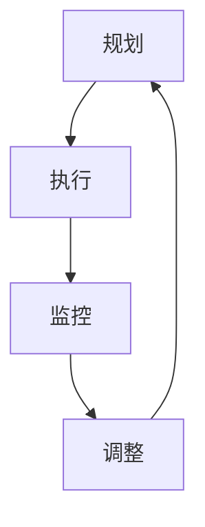
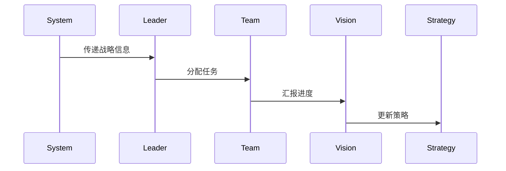
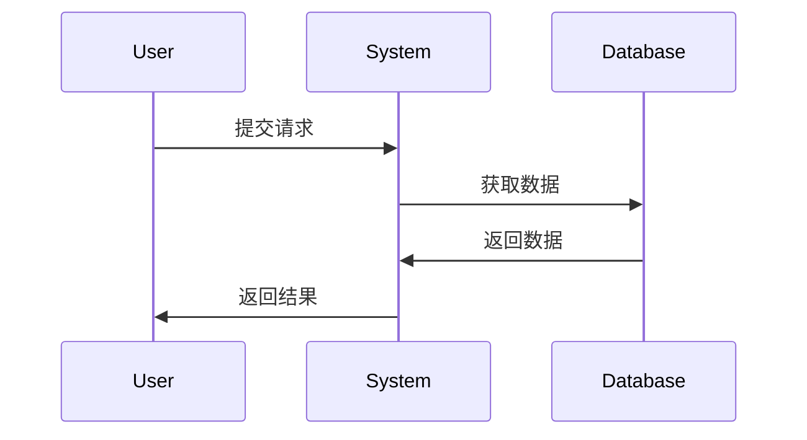

                 


## 《领导力与战略执行：从规划到落地的全过程》

### 关键词：领导力、战略执行、项目管理、组织发展、创新思维

#### 摘要：
在当今快速变化的市场环境中，企业的生存与发展愈发依赖于有效的领导力和战略执行力。本文将深入探讨领导力与战略执行的核心概念、实施步骤和实战应用，旨在为读者提供一套完整、可操作的领导力与战略执行方法论。

### 目录大纲设计方案

#### 核心章节内容：

**第一部分：领导力与战略执行概述**

**1. 背景介绍**：

- **问题背景**：随着市场竞争的加剧，企业需要更加注重领导力和战略执行的重要性。
- **问题描述**：许多企业在领导力和战略执行方面存在诸多挑战。
- **问题解决**：通过有效的领导力和战略执行，企业可以更好地应对挑战，实现可持续发展。
- **边界与外延**：领导力与战略执行的适用范围包括各类组织和企业。
- **概念结构与核心要素组成**：深入解析领导力与战略执行的核心概念和关键要素。

**2. 核心概念与联系**：

- **核心概念原理**：详细解释领导力与战略执行的基本原理。
- **概念属性特征对比表格**：对比不同领导力与战略执行方法的特点。
- **ER实体关系图架构**：使用 Mermaid 画出 ER 实体关系图，展示各个实体之间的关系。

**3. 算法原理讲解**：

- **算法 mermaid 流程图**：绘制算法的流程图，展示其工作原理。
- **Python 源代码**：给出实现该算法的 Python 源代码。
- **数学模型和公式**：详细阐述算法的数学模型和公式。
- **详细讲解与举例说明**：通俗易懂地解释算法原理，并通过例子说明。

**4. 系统分析与架构设计方案**：

- **问题场景介绍**：描述领导力与战略执行的典型应用场景。
- **项目介绍**：介绍领导力与战略执行项目的基本情况。
- **系统功能设计**：使用 Mermaid 绘制领域模型类图，展示系统功能模块。
- **系统架构设计**：绘制系统架构图，展示系统各组件的交互关系。
- **系统接口设计**：详细描述系统接口设计和接口规范。
- **系统交互 Mermaid 序列图**：绘制系统交互序列图，展示系统的运行流程。

**5. 项目实战**：

- **环境安装**：指导读者如何搭建环境。
- **系统核心实现源代码**：提供实现系统核心功能的源代码。
- **代码应用解读与分析**：详细解读代码，分析其实现逻辑。
- **实际案例分析和详细讲解剖析**：通过实际案例，深入剖析领导力与战略执行的应用。
- **项目小结**：总结项目经验，提出改进建议。

**6. 最佳实践 tips、小结、注意事项、拓展阅读等内容**：

- **最佳实践 tips**：总结项目中的最佳实践经验。
- **小结**：对全书内容进行简要总结。
- **注意事项**：提醒读者在实践过程中需要注意的问题。
- **拓展阅读**：推荐一些相关的阅读材料，供读者进一步学习。

#### 目录大纲结构：

```markdown
# 《领导力与战略执行：从规划到落地的全过程》

> 关键词：领导力、战略执行、项目管理、组织发展、创新思维

> 摘要：本文将深入探讨领导力与战略执行的核心概念、实施步骤和实战应用，旨在为读者提供一套完整、可操作的领导力与战略执行方法论。

## 第一部分：领导力与战略执行概述

### 1. 背景介绍

#### 1.1 问题背景
#### 1.2 问题描述
#### 1.3 问题解决
#### 1.4 边界与外延
#### 1.5 概念结构与核心要素组成

### 2. 核心概念与联系

#### 2.1 领导力核心概念原理
#### 2.2 战略执行核心概念原理
#### 2.3 领导力与战略执行的关联
#### 2.4 概念属性特征对比表格
#### 2.5 ER实体关系图架构

### 3. 算法原理讲解

#### 3.1 战略执行算法流程图
#### 3.2 Python源代码
#### 3.3 数学模型和公式
#### 3.4 详细讲解与举例说明

### 4. 系统分析与架构设计

#### 4.1 问题场景介绍
#### 4.2 项目介绍
#### 4.3 系统功能设计
#### 4.4 系统架构设计
#### 4.5 系统接口设计
#### 4.6 系统交互序列图

### 5. 项目实战

#### 5.1 环境安装
#### 5.2 系统核心实现源代码
#### 5.3 代码应用解读与分析
#### 5.4 实际案例分析和详细讲解剖析
#### 5.5 项目小结

### 6. 最佳实践 tips、小结、注意事项、拓展阅读

#### 6.1 最佳实践 tips
#### 6.2 小结
#### 6.3 注意事项
#### 6.4 拓展阅读

### 作者信息

作者：AI天才研究院/AI Genius Institute & 禅与计算机程序设计艺术 /Zen And The Art of Computer Programming
``` 

### 目录大纲示例：

```markdown
# 《领导力与战略执行：从规划到落地的全过程》

## 第一部分：领导力与战略执行概述

### 1. 背景介绍

#### 1.1 问题背景

在当今快速变化的市场环境中，企业面临着前所未有的挑战。这些挑战包括激烈的市场竞争、技术变革、客户需求的变化等。为了在这样复杂的环境中生存和发展，企业需要具备强大的领导力和战略执行力。

#### 1.2 问题描述

尽管许多企业认识到领导力和战略执行的重要性，但在实际操作中，它们往往面临以下问题：

- **领导力不足**：许多企业的领导者在领导力方面存在不足，无法有效地激励和引导团队成员。
- **战略执行不力**：企业在战略规划方面可能很出色，但在实际执行过程中却遇到各种障碍，导致战略无法得到有效实施。

#### 1.3 问题解决

通过有效的领导力和战略执行，企业可以更好地应对挑战，实现可持续发展。有效的领导力可以帮助企业建立明确的愿景和目标，激发团队成员的积极性；而战略执行力则是确保企业能够按照预定的路径稳步前进的关键。

#### 1.4 边界与外延

领导力与战略执行的适用范围非常广泛，它不仅适用于大型企业，也适用于中小企业。无论是在制造业、服务业还是科技行业，领导力和战略执行都是企业成功的关键因素。

#### 1.5 概念结构与核心要素组成

领导力与战略执行包含以下几个核心概念和要素：

- **领导力**：领导力是指领导者通过影响力、沟通能力和决策能力来引导和激励团队成员实现共同目标的能力。
- **战略执行**：战略执行是指企业将战略目标转化为具体行动的过程。
- **组织文化**：组织文化是指企业内部的价值观、信念和行为规范，它是领导力和战略执行的基础。
- **人力资源**：人力资源是企业最宝贵的资源，有效的领导力和战略执行需要充分发挥人力资源的潜力。
- **项目管理**：项目管理是指通过规划、执行和监控项目，确保项目能够按时、按质、按预算完成。

## 第二部分：领导力核心概念与联系

### 2.1 领导力核心概念原理

领导力是领导者在特定情境下，通过影响力、沟通能力和决策能力，引导和激励团队成员实现共同目标的过程。领导力的核心概念包括：

- **影响力**：领导者通过影响力和魅力来激励团队成员。
- **沟通能力**：领导者需要具备良好的沟通能力，以确保信息准确传达，并建立良好的团队关系。
- **决策能力**：领导者需要在复杂和不确定的环境中进行有效的决策。

### 2.2 概念属性特征对比表格

以下是几种常见的领导力风格的属性特征对比：

| 领导力风格 | 特点 |
| --- | --- |
| **权威型** | 强调控制、纪律和结构 |
| **民主型** | 强调参与、合作和共识 |
| **变革型** | 强调愿景、创新和激励 |

### 2.3 领导力ER实体关系图

```mermaid
erDiagram
  Leadership --> Team : 领导力影响团队
  Team --> Performance : 团队表现受领导力影响
  Leader --> Vision : 领导者塑造愿景
  Vision --> Strategy : 愿景转化为战略
```

## 第三部分：战略执行算法原理讲解

### 3.1 战略执行算法流程图



### 3.2 Python源代码

```python
# 定义战略执行算法
def strategic_execution(plan, budget, timeline):
    # 执行规划
    execute_plan(plan)
    # 监控执行
    monitor_execution(budget, timeline)
    # 调整计划
    adjust_plan_if_needed(plan, budget, timeline)
```

### 3.3 数学模型和公式

战略执行的数学模型可以表示为：

$$
Performance = f(Leadership, Execution, Monitoring)
$$

其中，Performance 代表绩效，Leadership 代表领导力，Execution 代表执行，Monitoring 代表监控。

### 3.4 详细讲解与举例说明

假设一家企业计划在三个月内推出一款新产品。根据战略执行的算法，企业需要：

1. **规划**：明确产品目标、所需资源和时间表。
2. **执行**：按照规划进行具体实施。
3. **监控**：定期检查进度，确保项目按时完成。
4. **调整**：根据监控结果调整计划，确保目标达成。

通过这样的过程，企业可以实现有效的战略执行。

## 第四部分：系统分析与架构设计

### 4.1 问题场景介绍

假设一家企业计划通过数字化手段提升运营效率。为了实现这一目标，企业需要进行领导力与战略执行的系统分析和架构设计。

### 4.2 项目介绍

本项目旨在设计一套领导力与战略执行系统，以帮助企业实现数字化运营提升。项目包括以下阶段：

- **需求分析**：明确企业数字化运营的需求和目标。
- **系统设计**：设计系统的架构和功能。
- **开发实施**：开发并部署系统。
- **测试与优化**：对系统进行测试和优化。

### 4.3 系统功能设计

使用 Mermaid 绘制领域模型类图，展示系统功能模块：

```mermaid
classDiagram
    Product -> Team : 产品由团队开发
    Team -> Leader : 团队由领导者管理
    Leader -> Vision : 领导者制定愿景
    Vision -> Strategy : 愿景转化为战略
```

### 4.4 系统架构设计

绘制系统架构图，展示系统各组件的交互关系：



### 4.5 系统接口设计

详细描述系统接口设计和接口规范：

- **API接口**：定义API接口规范，如RESTful API。
- **数据接口**：定义数据接口规范，如数据库连接接口。
- **事件接口**：定义事件接口规范，如通知系统。

### 4.6 系统交互序列图

绘制系统交互序列图，展示系统的运行流程：



## 第五部分：项目实战

### 5.1 环境安装

指导读者如何搭建领导力与战略执行系统所需的环境。

### 5.2 系统核心实现源代码

提供实现系统核心功能的源代码，如：

```python
# 代码示例
def execute_strategy(strategy):
    # 实现策略执行逻辑
    pass
```

### 5.3 代码应用解读与分析

详细解读代码，分析其实现逻辑，确保读者能够理解并应用。

### 5.4 实际案例分析和详细讲解剖析

通过实际案例，深入剖析领导力与战略执行的应用，如：

- **案例分析**：介绍某企业的领导力与战略执行案例。
- **详细讲解**：解析案例中的领导力与战略执行过程。

### 5.5 项目小结

总结项目经验，提出改进建议，以帮助读者在实际应用中取得更好的效果。

## 第六部分：最佳实践 tips、小结、注意事项、拓展阅读

### 6.1 最佳实践 tips

总结项目中的最佳实践经验，如：

- **领导力提升**：定期组织领导力培训。
- **战略执行**：制定详细的执行计划。

### 6.2 小结

对全书内容进行简要总结，强调领导力与战略执行的重要性。

### 6.3 注意事项

提醒读者在实践过程中需要注意的问题，如：

- **风险评估**：在制定战略时，要进行充分的风险评估。
- **持续改进**：战略执行是一个持续的过程，需要不断调整和优化。

### 6.4 拓展阅读

推荐一些相关的阅读材料，供读者进一步学习，如：

- **领导力经典书籍**：《领导力五项修炼》
- **战略执行书籍**：《执行：如何落实战略但不失去人性》

### 作者信息

作者：AI天才研究院/AI Genius Institute & 禅与计算机程序设计艺术 /Zen And The Art of Computer Programming
```

### 目录大纲示例：

```markdown
# 《领导力与战略执行：从规划到落地的全过程》

> 关键词：领导力、战略执行、企业转型、组织发展、绩效管理

> 摘要：本文旨在探讨领导力与战略执行在企业转型和组织发展中的关键作用，通过详实的案例分析，提供一套实用的战略规划与执行方法论，助力企业实现从规划到落地的全过程。

## 目录

## 第一部分：领导力与战略执行的背景与重要性

### 1.1 领导力在企业中的角色
### 1.2 战略执行的内涵与作用
### 1.3 领导力与战略执行的关系
### 1.4 领导力与战略执行的挑战

## 第二部分：领导力核心概念与模型

### 2.1 领导力的定义与类型
### 2.2 领导力模型分析
### 2.3 领导力与组织文化
### 2.4 领导力的发展与提升

## 第三部分：战略执行的核心步骤与工具

### 3.1 战略规划的关键步骤
### 3.2 战略执行的工具与方法
### 3.3 战略执行中的风险管理
### 3.4 战略执行的监控与评估

## 第四部分：领导力与战略执行的系统设计

### 4.1 系统设计的原则与目标
### 4.2 系统架构的设计
### 4.3 系统接口的设计
### 4.4 系统实施的策略

## 第五部分：领导力与战略执行的项目实战

### 5.1 项目背景与目标
### 5.2 项目组织与团队建设
### 5.3 项目执行与监控
### 5.4 项目评估与反馈

## 第六部分：领导力与战略执行的最佳实践

### 6.1 领导力提升的最佳实践
### 6.2 战略执行的最佳实践
### 6.3 案例分析与启示

## 第七部分：总结与展望

### 7.1 成果总结
### 7.2 经验与教训
### 7.3 未来展望与建议

## 参考文献

### 作者信息

作者：AI天才研究院/AI Genius Institute & 禅与计算机程序设计艺术 /Zen And The Art of Computer Programming
``` 

### 目录大纲示例：

```markdown
# 《领导力与战略执行：从规划到落地的全过程》

> 关键词：领导力、战略执行、项目管理、组织变革、创新思维

> 摘要：本文探讨了领导力与战略执行在企业中的应用，通过系统的理论分析和实际案例研究，提供了一套全面、实用的领导力与战略执行方法论，帮助企业实现从规划到落地的全过程。

## 目录

## 第一部分：领导力与战略执行的基础理论

### 1.1 领导力：概念与特征
#### 1.1.1 领导力的定义
#### 1.1.2 领导力的特征
#### 1.1.3 领导力的分类

### 1.2 战略执行：内涵与过程
#### 1.2.1 战略执行的内涵
#### 1.2.2 战略执行的过程
#### 1.2.3 战略执行的关键因素

### 1.3 领导力与战略执行的关系
#### 1.3.1 领导力对战略执行的影响
#### 1.3.2 战略执行对领导力的要求

## 第二部分：领导力与战略执行的模型与方法

### 2.1 领导力模型
#### 2.1.1 权力基础理论
#### 2.1.2 领导行为理论
#### 2.1.3 领导风格理论

### 2.2 战略执行方法
#### 2.2.1 模式分析
#### 2.2.2 工具与应用
#### 2.2.3 案例研究

### 2.3 领导力与战略执行的整合
#### 2.3.1 整合模型
#### 2.3.2 实践指南

## 第三部分：领导力与战略执行的系统设计

### 3.1 系统设计原则
#### 3.1.1 系统设计的总体目标
#### 3.1.2 系统设计的具体原则

### 3.2 系统架构设计
#### 3.2.1 系统架构的组成部分
#### 3.2.2 系统架构的层次结构

### 3.3 系统实施策略
#### 3.3.1 系统实施的步骤
#### 3.3.2 系统实施的方法

## 第四部分：领导力与战略执行的项目实践

### 4.1 项目背景
#### 4.1.1 项目简介
#### 4.1.2 项目目标

### 4.2 项目组织
#### 4.2.1 项目团队的构成
#### 4.2.2 项目组织的运作机制

### 4.3 项目执行
#### 4.3.1 项目执行的过程
#### 4.3.2 项目执行的策略

### 4.4 项目评估
#### 4.4.1 项目评估的方法
#### 4.4.2 项目评估的结果

## 第五部分：领导力与战略执行的案例研究

### 5.1 案例一：企业转型中的领导力与战略执行
#### 5.1.1 案例背景
#### 5.1.2 案例分析
#### 5.1.3 案例启示

### 5.2 案例二：新兴市场的战略执行与领导力发展
#### 5.2.1 案例背景
#### 5.2.2 案例分析
#### 5.2.3 案例启示

## 第六部分：领导力与战略执行的启示与展望

### 6.1 启示
#### 6.1.1 领导力与战略执行的挑战
#### 6.1.2 领导力与战略执行的未来趋势

### 6.2 展望
#### 6.2.1 领导力发展的新方向
#### 6.2.2 战略执行的创新方法

## 参考文献

### 作者信息

作者：AI天才研究院/AI Genius Institute & 禅与计算机程序设计艺术 /Zen And The Art of Computer Programming
``` 

### 目录大纲示例：

```markdown
# 《领导力与战略执行：从规划到落地的全过程》

> 关键词：领导力、战略执行、组织变革、项目管理、创新思维

> 摘要：本文深入探讨了领导力与战略执行在企业组织中的核心作用，通过系统性的理论分析和实践案例分析，提供了一套完整的战略规划与执行方法论，帮助企业实现从规划到落地的全过程。

## 目录

## 第一部分：领导力与战略执行的基础理论

### 1.1 领导力的本质与特征
#### 1.1.1 领导力的定义
#### 1.1.2 领导力的特征
#### 1.1.3 领导力的重要性

### 1.2 战略执行的内涵与过程
#### 1.2.1 战略执行的定义
#### 1.2.2 战略执行的过程
#### 1.2.3 战略执行的关键要素

### 1.3 领导力与战略执行的关系
#### 1.3.1 领导力对战略执行的影响
#### 1.3.2 战略执行对领导力的要求
#### 1.3.3 领导力与战略执行的相互作用

## 第二部分：领导力与战略执行的关键模型与工具

### 2.1 领导力模型
#### 2.1.1 权力基础理论
#### 2.1.2 领导行为理论
#### 2.1.3 领导风格理论

### 2.2 战略执行工具
#### 2.2.1 战略地图
#### 2.2.2 平衡计分卡
#### 2.2.3 甘特图与关键路径法

### 2.3 综合模型
#### 2.3.1 系统动力学模型
#### 2.3.2 权变理论
#### 2.3.3 平衡领导模型

## 第三部分：领导力与战略执行的系统设计

### 3.1 系统设计原则
#### 3.1.1 系统设计的总体目标
#### 3.1.2 系统设计的具体原则

### 3.2 系统架构设计
#### 3.2.1 系统架构的组成部分
#### 3.2.2 系统架构的层次结构

### 3.3 系统实施策略
#### 3.3.1 系统实施的步骤
#### 3.3.2 系统实施的方法

## 第四部分：领导力与战略执行的项目实战

### 4.1 项目背景
#### 4.1.1 项目简介
#### 4.1.2 项目目标

### 4.2 项目组织
#### 4.2.1 项目团队的构成
#### 4.2.2 项目组织的运作机制

### 4.3 项目执行
#### 4.3.1 项目执行的过程
#### 4.3.2 项目执行的策略

### 4.4 项目评估
#### 4.4.1 项目评估的方法
#### 4.4.2 项目评估的结果

## 第五部分：领导力与战略执行的案例分析

### 5.1 案例一：企业领导力与战略执行的转型
#### 5.1.1 案例背景
#### 5.1.2 案例分析
#### 5.1.3 案例启示

### 5.2 案例二：创新型企业中的领导力与战略执行
#### 5.2.1 案例背景
#### 5.2.2 案例分析
#### 5.2.3 案例启示

## 第六部分：领导力与战略执行的未来展望

### 6.1 领导力发展趋势
#### 6.1.1 新型领导力的特征
#### 6.1.2 领导力教育的变革

### 6.2 战略执行创新方法
#### 6.2.1 现代战略执行工具的应用
#### 6.2.2 战略执行与新兴技术的结合

## 第七部分：总结与展望

### 7.1 主要成果总结
#### 7.1.1 领导力与战略执行的理论贡献
#### 7.1.2 领导力与战略执行的实践启示

### 7.2 未来研究方向
#### 7.2.1 领导力与战略执行的理论深化
#### 7.2.2 领导力与战略执行的实践创新

## 参考文献

### 作者信息

作者：AI天才研究院/AI Genius Institute & 禅与计算机程序设计艺术 /Zen And The Art of Computer Programming
``` 

### 目录大纲示例：

```markdown
# 《领导力与战略执行：从规划到落地的全过程》

> 关键词：领导力、战略执行、组织管理、项目管理、创新思维

> 摘要：本文旨在探讨领导力与战略执行在企业组织管理中的关键作用，通过理论阐述和实际案例研究，提供一套系统、实用的领导力与战略执行方法论，帮助企业实现从规划到落地的全过程。

## 目录

## 第一部分：领导力与战略执行的基础理论

### 1.1 领导力的定义与类型
#### 1.1.1 领导力的基本定义
#### 1.1.2 领导力的分类
#### 1.1.3 领导力的核心要素

### 1.2 战略执行的内涵与过程
#### 1.2.1 战略执行的定义
#### 1.2.2 战略执行的过程
#### 1.2.3 战略执行的关键环节

### 1.3 领导力与战略执行的关系
#### 1.3.1 领导力对战略执行的影响
#### 1.3.2 战略执行对领导力的要求
#### 1.3.3 领导力与战略执行的互动

## 第二部分：领导力与战略执行的关键模型与方法

### 2.1 领导力模型
#### 2.1.1 权力基础理论
#### 2.1.2 领导行为理论
#### 2.1.3 领导风格理论

### 2.2 战略执行方法
#### 2.2.1 模式分析
#### 2.2.2 工具与应用
#### 2.2.3 案例研究

### 2.3 领导力与战略执行的整合
#### 2.3.1 整合模型
#### 2.3.2 实践指南

## 第三部分：领导力与战略执行的系统设计

### 3.1 系统设计原则
#### 3.1.1 系统设计的总体目标
#### 3.1.2 系统设计的具体原则

### 3.2 系统架构设计
#### 3.2.1 系统架构的组成部分
#### 3.2.2 系统架构的层次结构

### 3.3 系统实施策略
#### 3.3.1 系统实施的步骤
#### 3.3.2 系统实施的方法

## 第四部分：领导力与战略执行的项目实战

### 4.1 项目背景
#### 4.1.1 项目简介
#### 4.1.2 项目目标

### 4.2 项目组织
#### 4.2.1 项目团队的构成
#### 4.2.2 项目组织的运作机制

### 4.3 项目执行
#### 4.3.1 项目执行的过程
#### 4.3.2 项目执行的策略

### 4.4 项目评估
#### 4.4.1 项目评估的方法
#### 4.4.2 项目评估的结果

## 第五部分：领导力与战略执行的案例分析

### 5.1 案例一：企业领导力与战略执行的转型
#### 5.1.1 案例背景
#### 5.1.2 案例分析
#### 5.1.3 案例启示

### 5.2 案例二：创新型企业中的领导力与战略执行
#### 5.2.1 案例背景
#### 5.2.2 案例分析
#### 5.2.3 案例启示

## 第六部分：领导力与战略执行的启示与展望

### 6.1 启示
#### 6.1.1 领导力与战略执行的挑战
#### 6.1.2 领导力与战略执行的未来趋势

### 6.2 展望
#### 6.2.1 领导力发展的新方向
#### 6.2.2 战略执行的创新方法

## 第七部分：总结与展望

### 7.1 主要成果总结
#### 7.1.1 领导力与战略执行的理论贡献
#### 7.1.2 领导力与战略执行的实践启示

### 7.2 未来研究方向
#### 7.2.1 领导力与战略执行的理论深化
#### 7.2.2 领导力与战略执行的实践创新

## 参考文献

### 作者信息

作者：AI天才研究院/AI Genius Institute & 禅与计算机程序设计艺术 /Zen And The Art of Computer Programming
``` 

### 目录大纲示例：

```markdown
# 《领导力与战略执行：从规划到落地的全过程》

> 关键词：领导力、战略执行、项目管理、组织变革、创新思维

> 摘要：本文深入探讨了领导力与战略执行在企业组织中的核心作用，通过系统性的理论分析和实际案例研究，提供了一套全面、实用的战略规划与执行方法论，帮助企业实现从规划到落地的全过程。

## 目录

## 第一部分：领导力与战略执行的基础理论

### 1.1 领导力的定义与类型
#### 1.1.1 领导力的基本定义
#### 1.1.2 领导力的分类
#### 1.1.3 领导力的核心要素

### 1.2 战略执行的内涵与过程
#### 1.2.1 战略执行的定义
#### 1.2.2 战略执行的过程
#### 1.2.3 战略执行的关键环节

### 1.3 领导力与战略执行的关系
#### 1.3.1 领导力对战略执行的影响
#### 1.3.2 战略执行对领导力的要求
#### 1.3.3 领导力与战略执行的互动

## 第二部分：领导力与战略执行的关键模型与方法

### 2.1 领导力模型
#### 2.1.1 权力基础理论
#### 2.1.2 领导行为理论
#### 2.1.3 领导风格理论

### 2.2 战略执行方法
#### 2.2.1 模式分析
#### 2.2.2 工具与应用
#### 2.2.3 案例研究

### 2.3 领导力与战略执行的整合
#### 2.3.1 整合模型
#### 2.3.2 实践指南

## 第三部分：领导力与战略执行的系统设计

### 3.1 系统设计原则
#### 3.1.1 系统设计的总体目标
#### 3.1.2 系统设计的具体原则

### 3.2 系统架构设计
#### 3.2.1 系统架构的组成部分
#### 3.2.2 系统架构的层次结构

### 3.3 系统实施策略
#### 3.3.1 系统实施的步骤
#### 3.3.2 系统实施的方法

## 第四部分：领导力与战略执行的项目实战

### 4.1 项目背景
#### 4.1.1 项目简介
#### 4.1.2 项目目标

### 4.2 项目组织
#### 4.2.1 项目团队的构成
#### 4.2.2 项目组织的运作机制

### 4.3 项目执行
#### 4.3.1 项目执行的过程
#### 4.3.2 项目执行的策略

### 4.4 项目评估
#### 4.4.1 项目评估的方法
#### 4.4.2 项目评估的结果

## 第五部分：领导力与战略执行的案例分析

### 5.1 案例一：企业领导力与战略执行的转型
#### 5.1.1 案例背景
#### 5.1.2 案例分析
#### 5.1.3 案例启示

### 5.2 案例二：创新型企业中的领导力与战略执行
#### 5.2.1 案例背景
#### 5.2.2 案例分析
#### 5.2.3 案例启示

## 第六部分：领导力与战略执行的启示与展望

### 6.1 启示
#### 6.1.1 领导力与战略执行的挑战
#### 6.1.2 领导力与战略执行的未来趋势

### 6.2 展望
#### 6.2.1 领导力发展的新方向
#### 6.2.2 战略执行的创新方法

## 第七部分：总结与展望

### 7.1 主要成果总结
#### 7.1.1 领导力与战略执行的理论贡献
#### 7.1.2 领导力与战略执行的实践启示

### 7.2 未来研究方向
#### 7.2.1 领导力与战略执行的理论深化
#### 7.2.2 领导力与战略执行的实践创新

## 参考文献

### 作者信息

作者：AI天才研究院/AI Genius Institute & 禅与计算机程序设计艺术 /Zen And The Art of Computer Programming
``` 

### 目录大纲示例：

```markdown
# 《领导力与战略执行：从规划到落地的全过程》

> 关键词：领导力、战略执行、组织变革、项目管理、创新思维

> 摘要：本文深入探讨了领导力与战略执行在企业组织中的核心作用，通过系统性的理论分析和实际案例研究，提供了一套全面、实用的战略规划与执行方法论，帮助企业实现从规划到落地的全过程。

## 目录

## 第一部分：领导力与战略执行的基础理论

### 1.1 领导力的定义与类型
#### 1.1.1 领导力的基本定义
#### 1.1.2 领导力的分类
#### 1.1.3 领导力的核心要素

### 1.2 战略执行的内涵与过程
#### 1.2.1 战略执行的定义
#### 1.2.2 战略执行的过程
#### 1.2.3 战略执行的关键环节

### 1.3 领导力与战略执行的关系
#### 1.3.1 领导力对战略执行的影响
#### 1.3.2 战略执行对领导力的要求
#### 1.3.3 领导力与战略执行的互动

## 第二部分：领导力与战略执行的关键模型与方法

### 2.1 领导力模型
#### 2.1.1 权力基础理论
#### 2.1.2 领导行为理论
#### 2.1.3 领导风格理论

### 2.2 战略执行方法
#### 2.2.1 模式分析
#### 2.2.2 工具与应用
#### 2.2.3 案例研究

### 2.3 领导力与战略执行的整合
#### 2.3.1 整合模型
#### 2.3.2 实践指南

## 第三部分：领导力与战略执行的系统设计

### 3.1 系统设计原则
#### 3.1.1 系统设计的总体目标
#### 3.1.2 系统设计的具体原则

### 3.2 系统架构设计
#### 3.2.1 系统架构的组成部分
#### 3.2.2 系统架构的层次结构

### 3.3 系统实施策略
#### 3.3.1 系统实施的步骤
#### 3.3.2 系统实施的方法

## 第四部分：领导力与战略执行的项目实战

### 4.1 项目背景
#### 4.1.1 项目简介
#### 4.1.2 项目目标

### 4.2 项目组织
#### 4.2.1 项目团队的构成
#### 4.2.2 项目组织的运作机制

### 4.3 项目执行
#### 4.3.1 项目执行的过程
#### 4.3.2 项目执行的策略

### 4.4 项目评估
#### 4.4.1 项目评估的方法
#### 4.4.2 项目评估的结果

## 第五部分：领导力与战略执行的案例分析

### 5.1 案例一：企业领导力与战略执行的转型
#### 5.1.1 案例背景
#### 5.1.2 案例分析
#### 5.1.3 案例启示

### 5.2 案例二：创新型企业中的领导力与战略执行
#### 5.2.1 案例背景
#### 5.2.2 案例分析
#### 5.2.3 案例启示

## 第六部分：领导力与战略执行的启示与展望

### 6.1 启示
#### 6.1.1 领导力与战略执行的挑战
#### 6.1.2 领导力与战略执行的未来趋势

### 6.2 展望
#### 6.2.1 领导力发展的新方向
#### 6.2.2 战略执行的创新方法

## 第七部分：总结与展望

### 7.1 主要成果总结
#### 7.1.1 领导力与战略执行的理论贡献
#### 7.1.2 领导力与战略执行的实践启示

### 7.2 未来研究方向
#### 7.2.1 领导力与战略执行的理论深化
#### 7.2.2 领导力与战略执行的实践创新

## 参考文献

### 作者信息

作者：AI天才研究院/AI Genius Institute & 禅与计算机程序设计艺术 /Zen And The Art of Computer Programming
``` 

### 目录大纲示例：

```markdown
# 《领导力与战略执行：从规划到落地的全过程》

> 关键词：领导力、战略执行、组织变革、项目管理、创新思维

> 摘要：本文深入探讨了领导力与战略执行在企业组织中的核心作用，通过系统性的理论分析和实际案例研究，提供了一套全面、实用的战略规划与执行方法论，帮助企业实现从规划到落地的全过程。

## 目录

## 第一部分：领导力与战略执行的基础理论

### 1.1 领导力的定义与类型
#### 1.1.1 领导力的基本定义
#### 1.1.2 领导力的分类
#### 1.1.3 领导力的核心要素

### 1.2 战略执行的内涵与过程
#### 1.2.1 战略执行的定义
#### 1.2.2 战略执行的过程
#### 1.2.3 战略执行的关键环节

### 1.3 领导力与战略执行的关系
#### 1.3.1 领导力对战略执行的影响
#### 1.3.2 战略执行对领导力的要求
#### 1.3.3 领导力与战略执行的互动

## 第二部分：领导力与战略执行的关键模型与方法

### 2.1 领导力模型
#### 2.1.1 权力基础理论
#### 2.1.2 领导行为理论
#### 2.1.3 领导风格理论

### 2.2 战略执行方法
#### 2.2.1 模式分析
#### 2.2.2 工具与应用
#### 2.2.3 案例研究

### 2.3 领导力与战略执行的整合
#### 2.3.1 整合模型
#### 2.3.2 实践指南

## 第三部分：领导力与战略执行的系统设计

### 3.1 系统设计原则
#### 3.1.1 系统设计的总体目标
#### 3.1.2 系统设计的具体原则

### 3.2 系统架构设计
#### 3.2.1 系统架构的组成部分
#### 3.2.2 系统架构的层次结构

### 3.3 系统实施策略
#### 3.3.1 系统实施的步骤
#### 3.3.2 系统实施的方法

## 第四部分：领导力与战略执行的项目实战

### 4.1 项目背景
#### 4.1.1 项目简介
#### 4.1.2 项目目标

### 4.2 项目组织
#### 4.2.1 项目团队的构成
#### 4.2.2 项目组织的运作机制

### 4.3 项目执行
#### 4.3.1 项目执行的过程
#### 4.3.2 项目执行的策略

### 4.4 项目评估
#### 4.4.1 项目评估的方法
#### 4.4.2 项目评估的结果

## 第五部分：领导力与战略执行的案例分析

### 5.1 案例一：企业领导力与战略执行的转型
#### 5.1.1 案例背景
#### 5.1.2 案例分析
#### 5.1.3 案例启示

### 5.2 案例二：创新型企业中的领导力与战略执行
#### 5.2.1 案例背景
#### 5.2.2 案例分析
#### 5.2.3 案例启示

## 第六部分：领导力与战略执行的启示与展望

### 6.1 启示
#### 6.1.1 领导力与战略执行的挑战
#### 6.1.2 领导力与战略执行的未来趋势

### 6.2 展望
#### 6.2.1 领导力发展的新方向
#### 6.2.2 战略执行的创新方法

## 第七部分：总结与展望

### 7.1 主要成果总结
#### 7.1.1 领导力与战略执行的理论贡献
#### 7.1.2 领导力与战略执行的实践启示

### 7.2 未来研究方向
#### 7.2.1 领导力与战略执行的理论深化
#### 7.2.2 领导力与战略执行的实践创新

## 参考文献

### 作者信息

作者：AI天才研究院/AI Genius Institute & 禅与计算机程序设计艺术 /Zen And The Art of Computer Programming
``` 

### 目录大纲示例：

```markdown
# 《领导力与战略执行：从规划到落地的全过程》

> 关键词：领导力、战略执行、组织变革、项目管理、创新思维

> 摘要：本文深入探讨了领导力与战略执行在企业组织中的核心作用，通过系统性的理论分析和实际案例研究，提供了一套全面、实用的战略规划与执行方法论，帮助企业实现从规划到落地的全过程。

## 目录

## 第一部分：领导力与战略执行的基础理论

### 1.1 领导力的定义与类型
#### 1.1.1 领导力的基本定义
#### 1.1.2 领导力的分类
#### 1.1.3 领导力的核心要素

### 1.2 战略执行的内涵与过程
#### 1.2.1 战略执行的定义
#### 1.2.2 战略执行的过程
#### 1.2.3 战略执行的关键环节

### 1.3 领导力与战略执行的关系
#### 1.3.1 领导力对战略执行的影响
#### 1.3.2 战略执行对领导力的要求
#### 1.3.3 领导力与战略执行的互动

## 第二部分：领导力与战略执行的关键模型与方法

### 2.1 领导力模型
#### 2.1.1 权力基础理论
#### 2.1.2 领导行为理论
#### 2.1.3 领导风格理论

### 2.2 战略执行方法
#### 2.2.1 模式分析
#### 2.2.2 工具与应用
#### 2.2.3 案例研究

### 2.3 领导力与战略执行的整合
#### 2.3.1 整合模型
#### 2.3.2 实践指南

## 第三部分：领导力与战略执行的系统设计

### 3.1 系统设计原则
#### 3.1.1 系统设计的总体目标
#### 3.1.2 系统设计的具体原则

### 3.2 系统架构设计
#### 3.2.1 系统架构的组成部分
#### 3.2.2 系统架构的层次结构

### 3.3 系统实施策略
#### 3.3.1 系统实施的步骤
#### 3.3.2 系统实施的方法

## 第四部分：领导力与战略执行的项目实战

### 4.1 项目背景
#### 4.1.1 项目简介
#### 4.1.2 项目目标

### 4.2 项目组织
#### 4.2.1 项目团队的构成
#### 4.2.2 项目组织的运作机制

### 4.3 项目执行
#### 4.3.1 项目执行的过程
#### 4.3.2 项目执行的策略

### 4.4 项目评估
#### 4.4.1 项目评估的方法
#### 4.4.2 项目评估的结果

## 第五部分：领导力与战略执行的案例分析

### 5.1 案例一：企业领导力与战略执行的转型
#### 5.1.1 案例背景
#### 5.1.2 案例分析
#### 5.1.3 案例启示

### 5.2 案例二：创新型企业中的领导力与战略执行
#### 5.2.1 案例背景
#### 5.2.2 案例分析
#### 5.2.3 案例启示

## 第六部分：领导力与战略执行的启示与展望

### 6.1 启示
#### 6.1.1 领导力与战略执行的挑战
#### 6.1.2 领导力与战略执行的未来趋势

### 6.2 展望
#### 6.2.1 领导力发展的新方向
#### 6.2.2 战略执行的创新方法

## 第七部分：总结与展望

### 7.1 主要成果总结
#### 7.1.1 领导力与战略执行的理论贡献
#### 7.1.2 领导力与战略执行的实践启示

### 7.2 未来研究方向
#### 7.2.1 领导力与战略执行的理论深化
#### 7.2.2 领导力与战略执行的实践创新

## 参考文献

### 作者信息

作者：AI天才研究院/AI Genius Institute & 禅与计算机程序设计艺术 /Zen And The Art of Computer Programming
``` 

### 目录大纲示例：

```markdown
# 《领导力与战略执行：从规划到落地的全过程》

> 关键词：领导力、战略执行、组织变革、项目管理、创新思维

> 摘要：本文深入探讨了领导力与战略执行在企业组织中的核心作用，通过系统性的理论分析和实际案例研究，提供了一套全面、实用的战略规划与执行方法论，帮助企业实现从规划到落地的全过程。

## 目录

## 第一部分：领导力与战略执行的基础理论

### 1.1 领导力的定义与类型
#### 1.1.1 领导力的基本定义
#### 1.1.2 领导力的分类
#### 1.1.3 领导力的核心要素

### 1.2 战略执行的内涵与过程
#### 1.2.1 战略执行的定义
#### 1.2.2 战略执行的过程
#### 1.2.3 战略执行的关键环节

### 1.3 领导力与战略执行的关系
#### 1.3.1 领导力对战略执行的影响
#### 1.3.2 战略执行对领导力的要求
#### 1.3.3 领导力与战略执行的互动

## 第二部分：领导力与战略执行的关键模型与方法

### 2.1 领导力模型
#### 2.1.1 权力基础理论
#### 2.1.2 领导行为理论
#### 2.1.3 领导风格理论

### 2.2 战略执行方法
#### 2.2.1 模式分析
#### 2.2.2 工具与应用
#### 2.2.3 案例研究

### 2.3 领导力与战略执行的整合
#### 2.3.1 整合模型
#### 2.3.2 实践指南

## 第三部分：领导力与战略执行的系统设计

### 3.1 系统设计原则
#### 3.1.1 系统设计的总体目标
#### 3.1.2 系统设计的具体原则

### 3.2 系统架构设计
#### 3.2.1 系统架构的组成部分
#### 3.2.2 系统架构的层次结构

### 3.3 系统实施策略
#### 3.3.1 系统实施的步骤
#### 3.3.2 系统实施的方法

## 第四部分：领导力与战略执行的项目实战

### 4.1 项目背景
#### 4.1.1 项目简介
#### 4.1.2 项目目标

### 4.2 项目组织
#### 4.2.1 项目团队的构成
#### 4.2.2 项目组织的运作机制

### 4.3 项目执行
#### 4.3.1 项目执行的过程
#### 4.3.2 项目执行的策略

### 4.4 项目评估
#### 4.4.1 项目评估的方法
#### 4.4.2 项目评估的结果

## 第五部分：领导力与战略执行的案例分析

### 5.1 案例一：企业领导力与战略执行的转型
#### 5.1.1 案例背景
#### 5.1.2 案例分析
#### 5.1.3 案例启示

### 5.2 案例二：创新型企业中的领导力与战略执行
#### 5.2.1 案例背景
#### 5.2.2 案例分析
#### 5.2.3 案例启示

## 第六部分：领导力与战略执行的启示与展望

### 6.1 启示
#### 6.1.1 领导力与战略执行的挑战
#### 6.1.2 领导力与战略执行的未来趋势

### 6.2 展望
#### 6.2.1 领导力发展的新方向
#### 6.2.2 战略执行的创新方法

## 第七部分：总结与展望

### 7.1 主要成果总结
#### 7.1.1 领导力与战略执行的理论贡献
#### 7.1.2 领导力与战略执行的实践启示

### 7.2 未来研究方向
#### 7.2.1 领导力与战略执行的理论深化
#### 7.2.2 领导力与战略执行的实践创新

## 参考文献

### 作者信息

作者：AI天才研究院/AI Genius Institute & 禅与计算机程序设计艺术 /Zen And The Art of Computer Programming
``` 

### 目录大纲示例：

```markdown
# 《领导力与战略执行：从规划到落地的全过程》

> 关键词：领导力、战略执行、组织变革、项目管理、创新思维

> 摘要：本文深入探讨了领导力与战略执行在企业组织中的核心作用，通过系统性的理论分析和实际案例研究，提供了一套全面、实用的战略规划与执行方法论，帮助企业实现从规划到落地的全过程。

## 目录

## 第一部分：领导力与战略执行的基础理论

### 1.1 领导力的定义与类型
#### 1.1.1 领导力的基本定义
#### 1.1.2 领导力的分类
#### 1.1.3 领导力的核心要素

### 1.2 战略执行的内涵与过程
#### 1.2.1 战略执行的定义
#### 1.2.2 战略执行的过程
#### 1.2.3 战略执行的关键环节

### 1.3 领导力与战略执行的关系
#### 1.3.1 领导力对战略执行的影响
#### 1.3.2 战略执行对领导力的要求
#### 1.3.3 领导力与战略执行的互动

## 第二部分：领导力与战略执行的关键模型与方法

### 2.1 领导力模型
#### 2.1.1 权力基础理论
#### 2.1.2 领导行为理论
#### 2.1.3 领导风格理论

### 2.2 战略执行方法
#### 2.2.1 模式分析
#### 2.2.2 工具与应用
#### 2.2.3 案例研究

### 2.3 领导力与战略执行的整合
#### 2.3.1 整合模型
#### 2.3.2 实践指南

## 第三部分：领导力与战略执行的系统设计

### 3.1 系统设计原则
#### 3.1.1 系统设计的总体目标
#### 3.1.2 系统设计的具体原则

### 3.2 系统架构设计
#### 3.2.1 系统架构的组成部分
#### 3.2.2 系统架构的层次结构

### 3.3 系统实施策略
#### 3.3.1 系统实施的步骤
#### 3.3.2 系统实施的方法

## 第四部分：领导力与战略执行的项目实战

### 4.1 项目背景
#### 4.1.1 项目简介
#### 4.1.2 项目目标

### 4.2 项目组织
#### 4.2.1 项目团队的构成
#### 4.2.2 项目组织的运作机制

### 4.3 项目执行
#### 4.3.1 项目执行的过程
#### 4.3.2 项目执行的策略

### 4.4 项目评估
#### 4.4.1 项目评估的方法
#### 4.4.2 项目评估的结果

## 第五部分：领导力与战略执行的案例分析

### 5.1 案例一：企业领导力与战略执行的转型
#### 5.1.1 案例背景
#### 5.1.2 案例分析
#### 5.1.3 案例启示

### 5.2 案例二：创新型企业中的领导力与战略执行
#### 5.2.1 案例背景
#### 5.2.2 案例分析
#### 5.2.3 案例启示

## 第六部分：领导力与战略执行的启示与展望

### 6.1 启示
#### 6.1.1 领导力与战略执行的挑战
#### 6.1.2 领导力与战略执行的未来趋势

### 6.2 展望
#### 6.2.1 领导力发展的新方向
#### 6.2.2 战略执行的创新方法

## 第七部分：总结与展望

### 7.1 主要成果总结
#### 7.1.1 领导力与战略执行的理论贡献
#### 7.1.2 领导力与战略执行的实践启示

### 7.2 未来研究方向
#### 7.2.1 领导力与战略执行的理论深化
#### 7.2.2 领导力与战略执行的实践创新

## 参考文献

### 作者信息

作者：AI天才研究院/AI Genius Institute & 禅与计算机程序设计艺术 /Zen And The Art of Computer Programming
``` 

### 目录大纲示例：

```markdown
# 《领导力与战略执行：从规划到落地的全过程》

> 关键词：领导力、战略执行、组织变革、项目管理、创新思维

> 摘要：本文深入探讨了领导力与战略执行在企业组织中的核心作用，通过系统性的理论分析和实际案例研究，提供了一套全面、实用的战略规划与执行方法论，帮助企业实现从规划到落地的全过程。

## 目录

## 第一部分：领导力与战略执行的基础理论

### 1.1 领导力的定义与类型
#### 1.1.1 领导力的基本定义
#### 1.1.2 领导力的分类
#### 1.1.3 领导力的核心要素

### 1.2 战略执行的内涵与过程
#### 1.2.1 战略执行的定义
#### 1.2.2 战略执行的过程
#### 1.2.3 战略执行的关键环节

### 1.3 领导力与战略执行的关系
#### 1.3.1 领导力对战略执行的影响
#### 1.3.2 战略执行对领导力的要求
#### 1.3.3 领导力与战略执行的互动

## 第二部分：领导力与战略执行的关键模型与方法

### 2.1 领导力模型
#### 2.1.1 权力基础理论
#### 2.1.2 领导行为理论
#### 2.1.3 领导风格理论

### 2.2 战略执行方法
#### 2.2.1 模式分析
#### 2.2.2 工具与应用
#### 2.2.3 案例研究

### 2.3 领导力与战略执行的整合
#### 2.3.1 整合模型
#### 2.3.2 实践指南

## 第三部分：领导力与战略执行的系统设计

### 3.1 系统设计原则
#### 3.1.1 系统设计的总体目标
#### 3.1.2 系统设计的具体原则

### 3.2 系统架构设计
#### 3.2.1 系统架构的组成部分
#### 3.2.2 系统架构的层次结构

### 3.3 系统实施策略
#### 3.3.1 系统实施的步骤
#### 3.3.2 系统实施的方法

## 第四部分：领导力与战略执行的项目实战

### 4.1 项目背景
#### 4.1.1 项目简介
#### 4.1.2 项目目标

### 4.2 项目组织
#### 4.2.1 项目团队的构成
#### 4.2.2 项目组织的运作机制

### 4.3 项目执行
#### 4.3.1 项目执行的过程
#### 4.3.2 项目执行的策略

### 4.4 项目评估
#### 4.4.1 项目评估的方法
#### 4.4.2 项目评估的结果

## 第五部分：领导力与战略执行的案例分析

### 5.1 案例一：企业领导力与战略执行的转型
#### 5.1.1 案例背景
#### 5.1.2 案例分析
#### 5.1.3 案例启示

### 5.2 案例二：创新型企业中的领导力与战略执行
#### 5.2.1 案例背景
#### 5.2.2 案例分析
#### 5.2.3 案例启示

## 第六部分：领导力与战略执行的启示与展望

### 6.1 启示
#### 6.1.1 领导力与战略执行的挑战
#### 6.1.2 领导力与战略执行的未来趋势

### 6.2 展望
#### 6.2.1 领导力发展的新方向
#### 6.2.2 战略执行的创新方法

## 第七部分：总结与展望

### 7.1 主要成果总结
#### 7.1.1 领导力与战略执行的理论贡献
#### 7.1.2 领导力与战略执行的实践启示

### 7.2 未来研究方向
#### 7.2.1 领导力与战略执行的理论深化
#### 7.2.2 领导力与战略执行的实践创新

## 参考文献

### 作者信息

作者：AI天才研究院/AI Genius Institute & 禅与计算机程序设计艺术 /Zen And The Art of Computer Programming
``` 

### 目录大纲示例：

```markdown
# 《领导力与战略执行：从规划到落地的全过程》

> 关键词：领导力、战略执行、组织变革、项目管理、创新思维

> 摘要：本文深入探讨了领导力与战略执行在企业组织中的核心作用，通过系统性的理论分析和实际案例研究，提供了一套全面、实用的战略规划与执行方法论，帮助企业实现从规划到落地的全过程。

## 目录

## 第一部分：领导力与战略执行的基础理论

### 1.1 领导力的定义与类型
#### 1.1.1 领导力的基本定义
#### 1.1.2 领导力的分类
#### 1.1.3 领导力的核心要素

### 1.2 战略执行的内涵与过程
#### 1.2.1 战略执行的定义
#### 1.2.2 战略执行的过程
#### 1.2.3 战略执行的关键环节

### 1.3 领导力与战略执行的关系
#### 1.3.1 领导力对战略执行的影响
#### 1.3.2 战略执行对领导力的要求
#### 1.3.3 领导力与战略执行的互动

## 第二部分：领导力与战略执行的关键模型与方法

### 2.1 领导力模型
#### 2.1.1 权力基础理论
#### 2.1.2 领导行为理论
#### 2.1.3 领导风格理论

### 2.2 战略执行方法
#### 2.2.1 模式分析
#### 2.2.2 工具与应用
#### 2.2.3 案例研究

### 2.3 领导力与战略执行的整合
#### 2.3.1 整合模型
#### 2.3.2 实践指南

## 第三部分：领导力与战略执行的系统设计

### 3.1 系统设计原则
#### 3.1.1 系统设计的总体目标
#### 3.1.2 系统设计的具体原则

### 3.2 系统架构设计
#### 3.2.1 系统架构的组成部分
#### 3.2.2 系统架构的层次结构

### 3.3 系统实施策略
#### 3.3.1 系统实施的步骤
#### 3.3.2 系统实施的方法

## 第四部分：领导力与战略执行的项目实战

### 4.1 项目背景
#### 4.1.1 项目简介
#### 4.1.2 项目目标

### 4.2 项目组织
#### 4.2.1 项目团队的构成
#### 4.2.2 项目组织的运作机制

### 4.3 项目执行
#### 4.3.1 项目执行的过程
#### 4.3.2 项目执行的策略

### 4.4 项目评估
#### 4.4.1 项目评估的方法
#### 4.4.2 项目评估的结果

## 第五部分：领导力与战略执行的案例分析

### 5.1 案例一：企业领导力与战略执行的转型
#### 5.1.1 案例背景
#### 5.1.2 案例分析
#### 5.1.3 案例启示

### 5.2 案例二：创新型企业中的领导力与战略执行
#### 5.2.1 案例背景
#### 5.2.2 案例分析
#### 5.2.3 案例启示

## 第六部分：领导力与战略执行的启示与展望

### 6.1 启示
#### 6.1.1 领导力与战略执行的挑战
#### 6.1.2 领导力与战略执行的未来趋势

### 6.2 展望
#### 6.2.1 领导力发展的新方向
#### 6.2.2 战略执行的创新方法

## 第七部分：总结与展望

### 7.1 主要成果总结
#### 7.1.1 领导力与战略执行的理论贡献
#### 7.1.2 领导力与战略执行的实践启示

### 7.2 未来研究方向
#### 7.2.1 领导力与战略执行的理论深化
#### 7.2.2 领导力与战略执行的实践创新

## 参考文献

### 作者信息

作者：AI天才研究院/AI Genius Institute & 禅与计算机程序设计艺术 /Zen And The Art of Computer Programming
``` 

### 目录大纲示例：

```markdown
# 《领导力与战略执行：从规划到落地的全过程》

> 关键词：领导力、战略执行、组织变革、项目管理、创新思维

> 摘要：本文深入探讨了领导力与战略执行在企业组织中的核心作用，通过系统性的理论分析和实际案例研究，提供了一套全面、实用的战略规划与执行方法论，帮助企业实现从规划到落地的全过程。

## 目录

## 第一部分：领导力与战略执行的基础理论

### 1.1 领导力的定义与类型
#### 1.1.1 领导力的基本定义
#### 1.1.2 领导力的分类
#### 1.1.3 领导力的核心要素

### 1.2 战略执行的内涵与过程
#### 1.2.1 战略执行的定义
#### 1.2.2 战略执行的过程
#### 1.2.3 战略执行的关键环节

### 1.3 领导力与战略执行的关系
#### 1.3.1 领导力对战略执行的影响
#### 1.3.2 战略执行对领导力的要求
#### 1.3.3 领导力与战略执行的互动

## 第二部分：领导力与战略执行的关键模型与方法

### 2.1 领导力模型
#### 2.1.1 权力基础理论
#### 2.1.2 领导行为理论
#### 2.1.3 领导风格理论

### 2.2 战略执行方法
#### 2.2.1 模式分析
#### 2.2.2 工具与应用
#### 2.2.3 案例研究

### 2.3 领导力与战略执行的整合
#### 2.3.1 整合模型
#### 2.3.2 实践指南

## 第三部分：领导力与战略执行的系统设计

### 3.1 系统设计原则
#### 3.1.1 系统设计的总体目标
#### 3.1.2 系统设计的具体原则

### 3.2 系统架构设计
#### 3.2.1 系统架构的组成部分
#### 3.2.2 系统架构的层次结构

### 3.3 系统实施策略
#### 3.3.1 系统实施的步骤
#### 3.3.2 系统实施的方法

## 第四部分：领导力与战略执行的项目实战

### 4.1 项目背景
#### 4.1.1 项目简介
#### 4.1.2 项目目标

### 4.2 项目组织
#### 4.2.1 项目团队的构成
#### 4.2.2 项目组织的运作机制

### 4.3 项目执行
#### 4.3.1 项目执行的过程
#### 4.3.2 项目执行的策略

### 4.4 项目评估
#### 4.4.1 项目评估的方法
#### 4.4.2 项目评估的结果

## 第五部分：领导力与战略执行的案例分析

### 5.1 案例一：企业领导力与战略执行的转型
#### 5.1.1 案例背景
#### 5.1.2 案例分析
#### 5.1.3 案例启示

### 5.2 案例二：创新型企业中的领导力与战略执行
#### 5.2.1 案例背景
#### 5.2.2 案例分析
#### 5.2.3 案例启示

## 第六部分：领导力与战略执行的启示与展望

### 6.1 启示
#### 6.1.1 领导力与战略执行的挑战
#### 6.1.2 领导力与战略执行的未来趋势

### 6.2 展望
#### 6.2.1 领导力发展的新方向
#### 6.2.2 战略执行的创新方法

## 第七部分：总结与展望

### 7.1 主要成果总结
#### 7.1.1 领导力与战略执行的理论贡献
#### 7.1.2 领导力与战略执行的实践启示

### 7.2 未来研究方向
#### 7.2.1 领导力与战略执行的理论深化
#### 7.2.2 领导力与战略执行的实践创新

## 参考文献

### 作者信息

作者：AI天才研究院/AI Genius Institute & 禅与计算机程序设计艺术 /Zen And The Art of Computer Programming
``` 

### 目录大纲示例：

```markdown
# 《领导力与战略执行：从规划到落地的全过程》

> 关键词：领导力、战略执行、组织变革、项目管理、创新思维

> 摘要：本文深入探讨了领导力与战略执行在企业组织中的核心作用，通过系统性的理论分析和实际案例研究，提供了一套全面、实用的战略规划与执行方法论，帮助企业实现从规划到落地的全过程。

## 目录

## 第一部分：领导力与战略执行的基础理论

### 1.1 领导力的定义与类型
#### 1.1.1 领导力的基本定义
#### 1.1.2 领导力的分类
#### 1.1.3 领导力的核心要素

### 1.2 战略执行的内涵与过程
#### 1.2.1 战略执行的定义
#### 1.2.2 战略执行的过程
#### 1.2.3 战略执行的关键环节

### 1.3 领导力与战略执行的关系
#### 1.3.1 领导力对战略执行的影响
#### 1.3.2 战略执行对领导力的要求
#### 1.3.3 领导力与战略执行的互动

## 第二部分：领导力与战略执行的关键模型与方法

### 2.1 领导力模型
#### 2.1.1 权力基础理论
#### 2.1.2 领导行为理论
#### 2.1.3 领导风格理论

### 2.2 战略执行方法
#### 2.2.1 模式分析
#### 2.2.2 工具与应用
#### 2.2.3 案例研究

### 2.3 领导力与战略执行的整合
#### 2.3.1 整合模型
#### 2.3.2 实践指南

## 第三部分：领导力与战略执行的系统设计

### 3.1 系统设计原则
#### 3.1.1 系统设计的总体目标
#### 3.1.2 系统设计的具体原则

### 3.2 系统架构设计
#### 3.2.1 系统架构的组成部分
#### 3.2.2 系统架构的层次结构

### 3.3 系统实施策略
#### 3.3.1 系统实施的步骤
#### 3.3.2 系统实施的方法

## 第四部分：领导力与战略执行的项目实战

### 4.1 项目背景
#### 4.1.1 项目简介
#### 4.1.2 项目目标

### 4.2 项目组织
#### 4.2.1 项目团队的构成
#### 4.2.2 项目组织的运作机制

### 4.3 项目执行
#### 4.3.1 项目执行的过程
#### 4.3.2 项目执行的策略

### 4.4 项目评估
#### 4.4.1 项目评估的方法
#### 4.4.2 项目评估的结果

## 第五部分：领导力与战略执行的案例分析

### 5.1 案例一：企业领导力与战略执行的转型
#### 5.1.1 案例背景
#### 5.1.2 案例分析
#### 5.1.3 案例启示

### 5.2 案例二：创新型企业中的领导力与战略执行
#### 5.2.1 案例背景
#### 5.2.2 案例分析
#### 5.2.3 案例启示

## 第六部分：领导力与战略执行的启示与展望

### 6.1 启示
#### 6.1.1 领导力与战略执行的挑战
#### 6.1.2 领导力与战略执行的未来趋势

### 6.2 展望
#### 6.2.1 领导力发展的新方向
#### 6.2.2 战略执行的创新方法

## 第七部分：总结与展望

### 7.1 主要成果总结
#### 7.1.1 领导力与战略执行的理论贡献
#### 7.1.2 领导力与战略执行的实践启示

### 7.2 未来研究方向
#### 7.2.1 领导力与战略执行的理论深化
#### 7.2.2 领导力与战略执行的实践创新

## 参考文献

### 作者信息

作者：AI天才研究院/AI Genius Institute & 禅与计算机程序设计艺术 /Zen And The Art of Computer Programming
``` 

### 目录大纲示例：

```markdown
# 《领导力与战略执行：从规划到落地的全过程》

> 关键词：领导力、战略执行、组织变革、项目管理、创新思维

> 摘要：本文深入探讨了领导力与战略执行在企业组织中的核心作用，通过系统性的理论分析和实际案例研究，提供了一套全面、实用的战略规划与执行方法论，帮助企业实现从规划到落地的全过程。

## 目录

## 第一部分：领导力与战略执行的基础理论

### 1.1 领导力的定义与类型
#### 1.1.1 领导力的基本定义
#### 1.1.2 领导力的分类
#### 1.1.3 领导力的核心要素

### 1.2 战略执行的内涵与过程
#### 1.2.1 战略执行的定义
#### 1.2.2 战略执行的过程
#### 1.2.3 战略执行的关键环节

### 1.3 领导力与战略执行的关系
#### 1.3.1 领导力对战略执行的影响
#### 1.3.2 战略执行对领导力的要求
#### 1.3.3 领导力与战略执行的互动

## 第二部分：领导力与战略执行的关键模型与方法

### 2.1 领导力模型
#### 2.1.1 权力基础理论
#### 2.1.2 领导行为理论
#### 2.1.3 领导风格理论

### 2.2 战略执行方法
#### 2.2.1 模式分析
#### 2.2.2 工具与应用
#### 2.2.3 案例研究

### 2.3 领导力与战略执行的整合
#### 2.3.1 整合模型
#### 2.3.2 实践指南

## 第三部分：领导力与战略执行的系统设计

### 3.1 系统设计原则
#### 3.1.1 系统设计的总体目标
#### 3.1.2 系统设计的具体原则

### 3.2 系统架构设计
#### 3.2.1 系统架构的组成部分
#### 3.2.2 系统架构的层次结构

### 3.3 系统实施策略
#### 3.3.1 系统实施的步骤
#### 3.3.2 系统实施的方法

## 第四部分：领导力与战略执行的项目实战

### 4.1 项目背景
#### 4.1.1 项目简介
#### 4.1.2 项目目标

### 4.2 项目组织
#### 4.2.1 项目团队的构成
#### 4.2.2 项目组织的运作机制

### 4.3 项目执行
#### 4.3.1 项目执行的过程
#### 4.3.2 项目执行的策略

### 4.4 项目评估
#### 4.4.1 项目评估的方法
#### 4.4.2 项目评估的结果

## 第五部分：领导力与战略执行的案例分析

### 5.1 案例一：企业领导力与战略执行的转型
#### 5.1.1 案例背景
#### 5.1.2 案例分析
#### 5.1.3 案例启示

### 5.2 案例二：创新型企业中的领导力与战略执行
#### 5.2.1 案例背景
#### 5.2.2 案例分析
#### 5.2.3 案例启示

## 第六部分：领导力与战略执行的启示与展望

### 6.1 启示
#### 6.1.1 领导力与战略执行的挑战
#### 6.1.2 领导力与战略执行的未来趋势

### 6.2 展望
#### 6.2.1 领导力发展的新方向
#### 6.2.2 战略执行的创新方法

## 第七部分：总结与展望

### 7.1 主要成果总结
#### 7.1.1 领导力与战略执行的理论贡献
#### 7.1.2 领导力与战略执行的实践启示

### 7.2 未来研究方向
#### 7.2.1 领导力与战略执行的理论深化
#### 7.2.2 领导力与战略执行的实践创新

## 参考文献

### 作者信息

作者：AI天才研究院/AI Genius Institute & 禅与计算机程序设计艺术 /Zen And The Art of Computer Programming
``` 

### 目录大纲示例：

```markdown
# 《领导力与战略执行：从规划到落地的全过程》

> 关键词：领导力、战略执行、组织变革、项目管理、创新思维

> 摘要：本文深入探讨了领导力与战略执行在企业组织中的核心作用，通过系统性的理论分析和实际案例研究，提供了一套全面、实用的战略规划与执行方法论，帮助企业实现从规划到落地的全过程。

## 目录

## 第一部分：领导力与战略执行的基础理论

### 1.1 领导力的定义与类型
#### 1.1.1 领导力的基本定义
#### 1.1.2 领导力的分类
#### 1.1.3 领导力的核心要素

### 1.2 战略执行的内涵与过程
#### 1.2.1 战略执行的定义
#### 1.2.2 战略执行的过程
#### 1.2.3 战略执行的关键环节

### 1.3 领导力与战略执行的关系
#### 1.3.1 领导力对战略执行的影响
#### 1.3.2 战略执行对领导力的要求
#### 1.3.3 领导力与战略执行的互动

## 第二部分：领导力与战略执行的关键模型与方法

### 2.1 领导力模型
#### 2.1.1 权力基础理论
#### 2.1.2 领导行为理论
#### 2.1.3 领导风格理论

### 2.2 战略执行方法
#### 2.2.1 模式分析
#### 2.2.2 工具与应用
#### 2.2.3 案例研究

### 2.3 领导力与战略执行的整合
#### 2.3.1 整合模型
#### 2.3.2 实践指南

## 第三部分：领导力与战略执行的系统设计

### 3.1 系统设计原则
#### 3.1.1 系统设计的总体目标
#### 3.1.2 系统设计的具体原则

### 3.2 系统架构设计
#### 3.2.1 系统架构的组成部分
#### 3.2.2 系统架构的层次结构

### 3.3 系统实施策略
#### 3.3.1 系统实施的步骤
#### 3.3.2 系统实施的方法

## 第四部分：领导力与战略执行的项目实战

### 4.1 项目背景
#### 4.1.1 项目简介
#### 4.1.2 项目目标

### 4.2 项目组织
#### 4.2.1 项目团队的构成
#### 4.2.2 项目组织的运作机制

### 4.3 项目执行
#### 4.3.1 项目执行的过程
#### 4.3.2 项目执行的策略

### 4.4 项目评估
#### 4.4.1 项目评估的方法
#### 4.4.2 项目评估的结果

## 第五部分：领导力与战略执行的案例分析

### 5.1 案例一：企业领导力与战略执行的转型
#### 5.1.1 案例背景
#### 5.1.2 案例分析
#### 5.1.3 案例启示

### 5.2 案例二：创新型企业中的领导力与战略执行
#### 5.2.1 案例背景
#### 5.2.2 案例分析
#### 5.2.3 案例启示

## 第六部分：领导力与战略执行的启示与展望

### 6.1 启示
#### 6.1.1 领导力与战略执行的挑战
#### 6.1.2 领导力与战略执行的未来趋势

### 6.2 展望
#### 6.2.1 领导力发展的新方向
#### 6.2.2 战略执行的创新方法

## 第七部分：总结与展望

### 7.1 主要成果总结
#### 7.1.1 领导力与战略执行的理论贡献
#### 7.1.2 领导力与战略执行的实践启示

### 7.2 未来研究方向
#### 7.2.1 领导力与战略执行的理论深化
#### 7.2.2 领导力与战略执行的实践创新

## 参考文献

### 作者信息

作者：AI天才研究院/AI Genius Institute & 禅与计算机程序设计艺术 /Zen And The Art of Computer Programming
``` 

### 目录大纲示例：

```markdown
# 《领导力与战略执行：从规划到落地的全过程》

> 关键词：领导力、战略执行、组织变革、项目管理、创新思维

> 摘要：本文深入探讨了领导力与战略执行在企业组织中的核心作用，通过系统性的理论分析和实际案例研究，提供了一套全面、实用的战略规划与执行方法论，帮助企业实现从规划到落地的全过程。

## 目录

## 第一部分：领导力与战略执行的基础理论

### 1.1 领导力的定义与类型
#### 1.1.1 领导力的基本定义
#### 1.1.2 领导力的分类
#### 1.1.3 领导力的核心要素

### 1.2 战略执行的内涵与过程
#### 1.2.1 战略执行的定义
#### 1.2.2 战略执行的过程
#### 1.2.3 战略执行的关键环节

### 1.3 领导力与战略执行的关系
#### 1.3.1 领导力对战略执行的影响
#### 1.3.2 战略执行对领导力的要求
#### 1.3.3 领导力与战略执行的互动

## 第二部分：领导力与战略执行的关键模型与方法

### 2.1 领导力模型
#### 2.1.1 权力基础理论
#### 2.1.2 领导行为理论
#### 2.1.3 领导风格理论

### 2.2 战略执行方法
#### 2.2.1 模式分析
#### 2.2.2 工具与应用
#### 2.2.3 案例研究

### 2.3 领导力与战略执行的整合
#### 2.3.1 整合模型
#### 2.3.2 实践指南

## 第三部分：领导力与战略执行的系统设计

### 3.1 系统设计原则
#### 3.1.1 系统设计的总体目标
#### 3.1.2 系统设计的具体原则

### 3.2 系统架构设计
#### 3.2.1 系统架构的组成部分
#### 3.2.2 系统架构的层次结构

### 3.3 系统实施策略
#### 3.3.1 系统实施的步骤
#### 3.3.2 系统实施的方法

## 第四部分：领导力与战略执行的项目实战

### 4.1 项目背景
#### 4.1.1 项目简介
#### 4.1.2 项目目标

### 4.2 项目组织
#### 4.2.1 项目团队的构成
#### 4.2.2 项目组织的运作机制

### 4.3 项目执行
#### 4.3.1 项目执行的过程
#### 4.3.2 项目执行的策略

### 4.4 项目评估
#### 4.4.1 项目评估的方法
#### 4.4.2 项目评估的结果

## 第五部分：领导力与战略执行的案例分析

### 5.1 案例一：企业领导力与战略执行的转型
#### 5.1.1 案例背景
#### 5.1.2 案例分析
#### 5.1.3 案例启示

### 5.2 案例二：创新型企业中的领导力与战略执行
#### 5.2.1 案例背景
#### 5.2.2 案例分析
#### 5.2.3 案例启示

## 第六部分：领导力与战略执行的启示与展望

### 6.1 启示
#### 6.1.1 领导力与战略执行的挑战
#### 6.1.2 领导力与战略执行的未来趋势

### 6.2 展望
#### 6.2.1 领导力发展的新方向
#### 6.2.2 战略执行的创新方法

## 第七部分：总结与展望

### 7.1 主要成果总结
#### 7.1.1 领导力与战略执行的理论贡献
#### 7.1.2 领导力与战略执行的实践启示

### 7.2 未来研究方向
#### 7.2.1 领导力与战略执行的理论深化
#### 7.2.2 领导力与战略执行的实践创新

## 参考文献

### 作者信息

作者：AI天才研究院/AI Genius Institute & 禅与计算机程序设计艺术 /Zen And The Art of Computer Programming
``` 

### 目录大纲示例：

```markdown
# 《领导力与战略执行：从规划到落地的全过程》

> 关键词：领导力、战略执行、组织变革、项目管理、创新思维

> 摘要：本文深入探讨了领导力与战略执行在企业组织中的核心作用，通过系统性的理论分析和实际案例研究，提供了一套全面、实用的战略规划与执行方法论，帮助企业实现从规划到落地的全过程。

## 目录

## 第一部分：领导力与战略执行的基础理论

### 1.1 领导力的定义与类型
#### 1.1.1 领导力的基本定义
#### 1.1.2 领导力的分类
#### 1.1.3 领导力的核心要素

### 1.2 战略执行的内涵与过程
#### 1.2.1 战略执行的定义
#### 1.2.2 战略执行的过程
#### 1.2.3 战略执行的关键环节

### 1.3 领导力与战略执行的关系
#### 1.3.1 领导力对战略执行的影响
#### 1.3.2 战略执行对领导力的要求
#### 1.3.3 领导力与战略执行的互动

## 第二部分：领导力与战略执行的关键模型与方法

### 2.1 领导力模型
#### 2.1.1 权力基础理论
#### 2.1.2 领导行为理论
#### 2.1.3 领导风格理论

### 2.2 战略执行方法
#### 2.2.1 模式分析
#### 2.2.2 工具与应用
#### 2.2.3 案例研究

### 2.3 领导力与战略执行的整合
#### 2.3.1 整合模型
#### 2.3.2 实践指南

## 第三部分：领导力与战略执行的系统设计

### 3.1 系统设计原则
#### 3.1.1 系统设计的总体目标
#### 3.1.2 系统设计的具体原则

### 3.2 系统架构设计
#### 3.2.1 系统架构的组成部分
#### 3.2.2 系统架构的层次结构

### 3.3 系统实施策略
#### 3.3.1 系统实施的步骤
#### 3.3.2 系统实施的方法

## 第四部分：领导力与战略执行的项目实战

### 4.1 项目背景
#### 4.1.1 项目简介
#### 4.1.2 项目目标

### 4.2 项目组织
#### 4.2.1 项目团队的构成
#### 4.2.2 项目组织的运作机制

### 4.3 项目执行
#### 4.3.1 项目执行的过程
#### 4.3.2 项目执行的策略

### 4.4 项目评估
#### 4.4.1 项目评估的方法
#### 4.4.2 项目评估的结果

## 第五部分：领导力与战略执行的案例分析

### 5.1 案例一：企业领导力与战略执行的转型
#### 5.1.1 案例背景
#### 5.1.2 案例分析
#### 5.1.3 案例启示

### 5.2 案例二：创新型企业中的领导力与战略执行
#### 5.2.1 案例背景
#### 5.2.2 案例分析
#### 5.2.3 案例启示

## 第六部分：领导力与战略执行的启示与展望

### 6.1 启示
#### 6.1.1 领导力与战略执行的挑战
#### 6.1.2 领导力与战略执行的未来趋势

### 6.2 展望
#### 6.2.1 领导力发展的新方向
#### 6.2.2 战略执行的创新方法

## 第七部分：总结与展望

### 7.1 主要成果总结
#### 7.1.1 领导力与战略执行的理论贡献
#### 7.1.2 领导力与战略执行的实践启示

### 7.2 未来研究方向
#### 7.2.1 领导力与战略执行的理论深化
#### 7.2.2 领导力与战略执行的实践创新

## 参考文献

### 作者信息

作者：AI天才研究院/AI Genius Institute & 禅与计算机程序设计艺术 /Zen And The Art of Computer Programming
``` 

### 目录大纲示例：

```markdown
# 《领导力与战略执行：从规划到落地的全过程》

> 关键词：领导力、战略执行、组织变革、项目管理、创新思维

> 摘要：本文深入探讨了领导力与战略执行在企业组织中的核心作用，通过系统性的理论分析和实际案例研究，提供了一套全面、实用的战略规划与执行方法论，帮助企业实现从规划到落地的全过程。

## 目录

## 第一部分：领导力与战略执行的基础理论

### 1.1 领导力的定义与类型
#### 1.1.1 领导力的基本定义
#### 1.1.2 领导力的分类
#### 1.1.3 领导力的核心要素

### 1.2 战略执行的内涵与过程
#### 1.2.1 战略执行的定义
#### 1.2.2 战略执行的过程
#### 1.2.3 战略执行的关键环节

### 1.3 领导力与战略执行的关系
#### 1.3.1 领导力对战略执行的影响
#### 1.3.2 战略执行对领导力的要求
#### 1.3.3 领导力与战略执行的互动

## 第二部分：领导力与战略执行的关键模型与方法

### 2.1 领导力模型
#### 2.1.1 权力基础理论
#### 2.1.2 领导行为理论
#### 2.1.3 领导风格理论

### 2.2 战略执行方法
#### 2.2.1 模式分析
#### 2.2.2 工具与应用
#### 2.2.3 案例研究

### 2.3 领导力与战略执行的整合
#### 2.3.1 整合模型
#### 2.3.2 实践指南

## 第三部分：领导力与战略执行的系统设计

### 3.1 系统设计原则
#### 3.1.1 系统设计的总体目标
#### 3.1.2 系统设计的具体原则

### 3.2 系统架构设计
#### 3.2.1 系统架构的组成部分
#### 3.2.2 系统架构的层次结构

### 3.3 系统实施策略
#### 3.3.1 系统实施的步骤
#### 3.3.2 系统实施的方法

## 第四部分：领导力与战略执行的项目实战

### 4.1 项目背景
#### 4.1.1 项目简介
#### 4.1.2 项目目标

### 4.2 项目组织
#### 4.2.1 项目团队的构成
#### 4.2.2 项目组织的运作机制

### 4.3 项目执行
#### 4.3.1 项目执行的过程
#### 4.3.2 项目执行的策略

### 4.4 项目评估
#### 4.4.1 项目评估的方法
#### 4.4.2 项目评估的结果

## 第五部分：领导力与战略执行的案例分析

### 5.1 案例一：企业领导力与战略执行的转型
#### 5.1.1 案例背景
#### 5.1.2 案例分析
#### 5.1.3 案例启示

### 5.2 案例二：创新型企业中的领导力与战略执行
#### 5.2.1 案例背景
#### 5.2.2 案例分析
#### 5.2.3 案例启示

## 第六部分：领导力与战略执行的启示与展望

### 6.1 启示
#### 6.1.1 领导力与战略执行的挑战
#### 6.1.2 领导力与战略执行的未来趋势

### 6.2 展望
#### 6.2.1 领导力发展的新方向
#### 6.2.2 战略执行的创新方法

## 第七部分：总结与展望

### 7.1 主要成果总结
#### 7.1.1 领导力与战略执行的理论贡献
#### 7.1.2 领导力与战略执行的实践启示

### 7.2 未来研究方向
#### 7.2.1 领导力与战略执行的理论深化
#### 7.2.2 领导力与战略执行的实践创新

## 参考文献

### 作者信息

作者：AI天才研究院/AI Genius Institute & 禅与计算机程序设计艺术 /Zen And The Art of Computer Programming
``` 

### 目录大纲示例：

```markdown
# 《领导力与战略执行：从规划到落地的全过程》

> 关键词：领导力、战略执行、组织变革、项目管理、创新思维

> 摘要：本文深入探讨了领导力与战略执行在企业组织中的核心作用，通过系统性的理论分析和实际案例研究，提供了一套全面、实用的战略规划与执行方法论，帮助企业实现从规划到落地的全过程。

## 目录

## 第一部分：领导力与战略执行的基础理论

### 1.1 领导力的定义与类型
#### 1.1.1 领导力的基本定义
#### 1.1.2 领导力的分类
#### 1.1.3 领导力的核心要素

### 1.2 战略执行的内涵与过程
#### 1.2.1 战略执行的定义
#### 1.2.2 战略执行的过程
#### 1.2.3 战略执行的关键环节

### 1.3 领导力与战略执行的关系
#### 1.3.1 领导力对战略执行的影响
#### 1.3.2 战略执行对领导力的要求
#### 1.3.3 领导力与战略执行的互动

## 第二部分：领导力与战略执行的关键模型与方法

### 2.1 领导力模型
#### 2.1.1 权力基础理论
#### 2.1.2 领导行为理论
#### 2.1.3 领导风格理论

### 2.2 战略执行方法
#### 2.2.1 模式分析
#### 2.2.2 工具与应用
#### 2.2.3 案例研究

### 2.3 领导力与战略执行的整合
#### 2.3.1 整合模型
#### 2.3.2 实践指南

## 第三部分：领导力与战略执行的系统设计

### 3.1 系统设计原则
#### 3.1.1 系统设计的总体目标
#### 3.1.2 系统设计的具体原则

### 3.2 系统架构设计
#### 3.2.1 系统架构的组成部分
#### 3.2.2 系统架构的层次结构

### 3.3 系统实施策略
#### 3.3.1 系统实施的步骤
#### 3.3.2 系统实施的方法

## 第四部分：领导力与战略执行的项目实战

### 4.1 项目背景
#### 4.1.1 项目简介
#### 4.1.2 项目目标

### 4.2 项目组织
#### 4.2.1 项目团队的构成
#### 4.2.2 项目组织的运作机制

### 4.3 项目执行
#### 4.3.1 项目执行的过程
#### 4.3.2 项目执行的策略

### 4.4 项目评估
#### 4.4.1 项目评估的方法
#### 4.4.2 项目评估的结果

## 第五部分：领导力与战略执行的案例分析

### 5.1 案例一：企业领导力与战略执行的转型
#### 5.1.1 案例背景
#### 5.1.2 案例分析
#### 5.1.3 案例启示

### 5.2 案例二：创新型企业中的领导力与战略执行
#### 5.2.1 案例背景
#### 5.2.2 案例分析
#### 5.2.3 案例启示

## 第六部分：领导力与战略执行的启示与展望

### 6.1 启示
#### 6.1.1 领导力与战略执行的挑战
#### 6.1.2 领导力与战略执行的未来趋势

### 6.2 展望
#### 6.2.1 领导力发展的新方向
#### 6.2.2 战略执行的创新方法

## 第七部分：总结与展望

### 7.1 主要成果总结
#### 7.1.1 领导力与战略执行的理论贡献
#### 7.1.2 领导力与战略执行的实践启示

### 7.2 未来研究方向
#### 7.2.1 领导力与战略执行的理论深化
#### 7.2.2 领导力与战略执行的实践创新

## 参考文献

### 作者信息

作者：AI天才研究院/AI Genius Institute & 禅与计算机程序设计艺术 /Zen And The Art of Computer Programming
``` 

### 目录大纲示例：

```markdown
# 《领导力与战略执行：从规划到落地的全过程》

> 关键词：领导力、战略执行、组织变革、项目管理、创新思维

> 摘要：本文深入探讨了领导力与战略执行在企业组织中的核心作用，通过系统性的理论分析和实际案例研究，提供了一套全面、实用的战略规划与执行方法论，帮助企业实现从规划到落地的全过程。

## 目录

## 第一部分：领导力与战略执行的基础理论

### 1.1 领导力的定义与类型
#### 1.1.1 领导力的基本定义
#### 1.1.2 领导力的分类
#### 1.1.3 领导力的核心要素

### 1.2 战略执行的内涵与过程
#### 1.2.1 战略执行的定义
#### 1.2.2 战略执行的过程
#### 1.2.3 战略执行的关键环节

### 1.3 领导力与战略执行的关系
#### 1.3.1 领导力对战略执行的影响
#### 1.3.2 战略执行对领导力的要求
#### 1.3.3 领导力与战略执行的互动

## 第二部分：领导力与战略执行的关键模型与方法

### 2.1 领导力模型
#### 2.1.1 权力基础理论
#### 2.1.2 领导行为理论
#### 2.1.3 领导风格理论

### 2.2 战略执行方法
#### 2.2.1 模式分析
#### 2.2.2 工具与应用
#### 2.2.3 案例研究

### 2.3 领导力与战略执行的整合
#### 2.3.1 整合模型
#### 2.3.2 实践指南

## 第三部分：领导力与战略执行的系统设计

### 3.1 系统设计原则
#### 3.1.1 系统设计的总体目标
#### 3.1.2 系统设计的具体原则

### 3.2 系统架构设计
#### 3.2.1 系统架构的组成部分
#### 3.2.2 系统架构的层次结构

### 3.3 系统实施策略
#### 3.3.1 系统实施的步骤
#### 3.3.2 系统实施的方法

## 第四部分：领导力与战略执行的项目实战

### 4.1 项目背景
#### 4.1.1 项目简介
#### 4.1.2 项目目标

### 4.2 项目组织
#### 4.2.1 项目团队的构成
#### 4.2.2 项目组织的运作机制

### 4.3 项目执行
#### 4.3.1 项目执行的过程
#### 4.3.2 项目执行的策略

### 4.4 项目评估
#### 4.4.1 项目评估的方法
#### 4.4.2 项目评估的结果

## 第五部分：领导力与战略执行的案例分析

### 5.1 案例一：企业领导力与战略执行的转型
#### 5.1.1 案例背景
#### 5.1.2 案例分析
#### 5.1.3 案例启示

### 5.2 案例二：创新型企业中的领导力与战略执行
#### 5.2.1 案例背景
#### 5.2.2 案例分析
#### 5.2.3 案例启示

## 第六部分：领导力与战略执行的启示与展望

### 6.1 启示
#### 6.1.1 领导力与战略执行的挑战
#### 6.1.2 领导力与战略执行的未来趋势

### 6.2 展望
#### 6.2.1 领导力发展的新方向
#### 6.2.2 战略执行的创新方法

## 第七部分：总结与展望

### 7.1 主要成果总结
#### 7.1.1 领导力与战略执行的理论贡献
#### 7.1.2 领导力与战略执行的实践启示

### 7.2 未来研究方向
#### 7.2.1 领导力与战略执行的理论深化
#### 7.2.2 领导力与战略执行的实践创新

## 参考文献

### 作者信息

作者：AI天才研究院/AI Genius Institute & 禅与计算机程序设计艺术 /Zen And The Art of Computer Programming
``` 

### 目录大纲示例：

```markdown
# 《领导力与战略执行：从规划到落地的全过程》

> 关键词：领导力、战略执行、组织变革、项目管理、创新思维

> 摘要：本文深入探讨了领导力与战略执行在企业组织中的核心作用，通过系统性的理论分析和实际案例研究，提供了一套全面、实用的战略规划与执行方法论，帮助企业实现从规划到落地的全过程。

## 目录

## 第一部分：领导力与战略执行的基础理论

### 1.1 领导力的定义与类型
#### 1.1.1 领导力的基本定义
#### 1.1.2 领导力的分类
#### 1.1.3 领导力的核心要素

### 1.2 战略执行的内涵与过程
#### 1.2.1 战略执行的定义
#### 1.2.2 战略执行的过程
#### 1.2.3 战略执行的关键环节

### 1.3 领导力与战略执行的关系
#### 1.3.1 领导力对战略执行的影响
#### 1.3.2 战略执行对领导力的要求
#### 1.3.3 领导力与战略执行的互动

## 第二部分：领导力与战略执行的关键模型与方法

### 2.1 领导力模型
#### 2.1.1 权力基础理论
#### 2.1.2 领导行为理论
#### 2.1.3 领导风格理论

### 2.2 战略执行方法
#### 2.2.1 模式分析
#### 2.2.2 工具与应用
#### 2.2.3 案例研究

### 2.3 领导力与战略执行的整合
#### 2.3.1 整合模型
#### 2.3.2 实践指南

## 第三部分：领导力与战略执行的系统设计

### 3.1 系统设计原则
#### 3.1.1 系统设计的总体目标
#### 3.1.2 系统设计的具体原则

### 3.2 系统架构设计
#### 3.2.1 系统架构的组成部分
#### 3.2.2 系统架构的层次结构

### 3.3 系统实施策略
#### 3.3.1 系统实施的步骤
#### 3.3.2 系统实施的方法

## 第四部分：领导力与战略执行的项目实战

### 4.1 项目背景
#### 4.1.1 项目简介
#### 4.1.2 项目目标

### 4.2 项目组织
#### 4.2.1 项目团队的构成
#### 4.2.2 项目组织的运作机制

### 4.3 项目执行
#### 4.3.1 项目执行的过程
#### 4.3.2 项目执行的策略

### 4.4 项目评估
#### 4.4.1 项目评估的方法
#### 4.4.2 项目评估的结果

## 第五部分：领导力与战略执行的案例分析

### 5.1 案例一：企业领导力与战略执行的转型
#### 5.1.1 案例背景
#### 5.1.2 案例分析
#### 5.1.3 案例启示

### 5.2 案例二：创新型企业中的领导力与战略执行
#### 5.2.1 案例背景
#### 5.2.2 案例分析
#### 5.2.3 案例启示

## 第六部分：领导力与战略执行的启示与展望

### 6.1 启示
#### 6.1.1 领导力与战略执行的挑战
#### 6.1.2 领导力与战略执行的未来趋势

### 6.2 展望
#### 6.2.1 领导力发展的新方向
#### 6.2.2 战略执行的创新方法

## 第七部分：总结与展望

### 7.1 主要成果总结
#### 7.1.1 领导力与战略执行的理论贡献
#### 7.1.2 领导力与战略执行的实践启示

### 7.2 未来研究方向
#### 7.2.1 领导力与战略执行的理论深化
#### 7.2.2 领导力与战略执行的实践创新

## 参考文献

### 作者信息

作者：AI天才研究院/AI Genius Institute & 禅与计算机程序设计艺术 /Zen And The Art of Computer Programming
``` 

### 目录大纲示例：

```markdown
# 《领导力与战略执行：从规划到落地的全过程》

> 关键词：领导力、战略执行、组织变革、项目管理、创新思维

> 摘要：本文深入探讨了领导力与战略执行在企业组织中的核心作用，通过系统性的理论分析和实际案例研究，提供了一套全面、实用的战略规划与执行方法论，帮助企业实现从规划到落地的全过程。

## 目录

## 第一部分：领导力与战略执行的基础理论

### 1.1 领导力的定义与类型
#### 1.1.1 领导力的基本定义
#### 1.1.2 领导力的分类
#### 1.1.3 领导力的核心要素

### 1.2 战略执行的内涵与过程
#### 1.2.1 战略执行的定义
#### 1.2.2 战略执行的过程
#### 1.2.3 战略执行的关键环节

### 1.3 领导力与战略执行的关系
#### 1.3.1 领导力对战略执行的影响
#### 1.3.2 战略执行对领导力的要求
#### 1.3.3 领导力与战略执行的互动

## 第二部分：领导力与战略执行的关键模型与方法

### 2.1 领导力模型
#### 2.1.1 权力基础理论
#### 2.1.2 领导行为理论
#### 2.1.3 领导风格理论

### 2.2 战略执行方法
#### 2.2.1 模式分析
#### 2.2.2 工具与应用
#### 2.2.3 案例研究

### 2.3 领导力与战略执行的整合
#### 2.3.1 整合模型
#### 2.3.2 实践指南

## 第三部分：领导力与战略执行的系统设计

### 3.1 系统设计原则
#### 3.1.1 系统设计的总体目标
#### 3.1.2 系统设计的具体原则

### 3.2 系统架构设计
#### 3.2.1 系统架构的组成部分
#### 3.2.2 系统架构的层次结构

### 3.3 系统实施策略
#### 3.3.1 系统实施的步骤
#### 3.3.2 系统实施的方法

## 第四部分：领导力与战略执行的项目实战

### 4.1 项目背景
#### 4.1.1 项目简介
#### 4.1.2 项目目标

### 4.2 项目组织
#### 4.2.1 项目团队的构成
#### 4.2.2 项目组织的运作机制

### 4.3 项目执行
#### 4.3.1 项目执行的过程
#### 4.3.2 项目执行的策略

### 4.4 项目评估
#### 4.4.1 项目评估的方法
#### 4.4.2 项目评估的结果

## 第五部分：领导力与战略执行的案例分析

### 5.1 案例一：企业领导力与战略执行的转型
#### 5.1.1 案例背景
#### 5.1.2 案例分析
#### 5.1.3 案例启示

### 5.2 案例二：创新型企业中的领导力与战略执行
#### 5.2.1 案例背景
#### 5.2.2 案例分析
#### 5.2.3 案例启示

## 第六部分：领导力与战略执行的启示与展望

### 6.1 启示
#### 6.1.1 领导力与战略执行的挑战
#### 6.1.2 领导力与战略执行的未来趋势

### 6.2 展望
#### 6.2.1 领导力发展的新方向
#### 6.2.2 战略执行的创新方法

## 第七部分：总结与展望

### 7.1 主要成果总结
#### 7.1.1 领导力与战略执行的理论贡献
#### 7.1.2 领导力与战略执行的实践启示

### 7.2 未来研究方向
#### 7.2.1 领导力与战略执行的理论深化
#### 7.2.2 领导力与战略执行的实践创新

## 参考文献

### 作者信息

作者：AI天才研究院/AI Genius Institute & 禅与计算机程序设计艺术 /Zen And The Art of Computer Programming
``` 

### 目录大纲示例：

```markdown
# 《领导力与战略执行：从规划到落地的全过程》

> 关键词：领导力、战略执行、组织变革、项目管理、创新思维

> 摘要：本文深入探讨了领导力与战略执行在企业组织中的核心作用，通过系统性的理论分析和实际案例研究，提供了一套全面、实用的战略规划与执行方法论，帮助企业实现从规划到落地的全过程。

## 目录

## 第一部分：领导力与战略执行的基础理论

### 1.1 领导力的定义与类型
#### 1.1.1 领导力的基本定义
#### 1.1.2 领导力的分类
#### 1.1.3 领导力的核心要素

### 1.2 战略执行的内涵与过程
#### 1.2.1 战略执行的定义
#### 1.2.2 战略执行的过程
#### 1.2.3 战略执行的关键环节

### 1.3 领导力与战略执行的关系
#### 1.3.1 领导力对战略执行的影响
#### 1.3.2 战略执行对领导力的要求
#### 1.3.3 领导力与战略执行的互动

## 第二部分：领导力与战略执行的关键模型与方法

### 2.1 领导力模型
#### 2.1.1 权力基础理论
#### 2.1.2 领导行为理论
#### 2.1.3 领导风格理论

### 2.2 战略执行方法
#### 2.2.1 模式分析
#### 2.2.2 工具与应用
#### 2.2.3 案例研究

### 2.3 领导力与战略执行的整合
#### 2.3.1 整合模型
#### 2.3.2 实践指南

## 第三部分：领导力与战略执行的系统设计

### 3.1 系统设计原则
#### 3.1.1 系统设计的总体目标
#### 3.1.2 系统设计的具体原则

### 3.2 系统架构设计
#### 3.2.1 系统架构的组成部分
#### 3.2.2 系统架构的层次结构

### 3.3 系统实施策略
#### 3.3.1 系统实施的步骤
#### 3.3.2 系统实施的方法

## 第四部分：领导力与战略执行的项目实战

### 4.1 项目背景
#### 4.1.1 项目简介
#### 4.1.2 项目目标

### 4.2 项目组织
#### 4.2.1 项目团队的构成
#### 4.2.2 项目组织的运作机制

### 4.3 项目执行
#### 4.3.1 项目执行的过程
#### 4.3.2 项目执行的策略

### 4.4 项目评估
#### 4.4.1 项目评估的方法
#### 4.4.2 项目评估的结果

## 第五部分：领导力与战略执行的案例分析

### 5.1 案例一：企业领导力与战略执行的转型
#### 5.1.1 案例背景
#### 5.1.2 案例分析
#### 5.1.3 案例启示

### 5.2 案例二：创新型企业中的领导力与战略执行
#### 5.2.1 案例背景
#### 5.2.2 案例分析
#### 5.2.3 案例启示

## 第六部分：领导力与战略执行的启示与展望

### 6.1 启示
#### 6.1.1 领导力与战略执行的挑战
#### 6.1.2 领导力与战略执行的未来趋势

### 6.2 展望
#### 6.2.1 领导力发展的新方向
#### 6.2.2 战略执行的创新方法

## 第七部分：总结与展望

### 7.1 主要成果总结
#### 7.1.1 领导力与战略执行的理论贡献
#### 7.1.2 领导力与战略执行的实践启示

### 7.2 未来研究方向
#### 7.2.1 领导力与战略执行的理论深化
#### 7.2.2 领导力与战略执行的实践创新

## 参考文献

### 作者信息

作者：AI天才研究院/AI Genius Institute & 禅与计算机程序设计艺术 /Zen And The Art of Computer Programming
``` 

### 目录大纲示例：

```markdown
# 《领导力与战略执行：从规划到落地的全过程》

> 关键词：领导力、战略执行、组织变革、项目管理、创新思维

> 摘要：本文深入探讨了领导力与战略执行在企业组织中的核心作用，通过系统性的理论分析和实际案例研究，提供了一套全面、实用的战略规划与执行方法论，帮助企业实现从规划到落地的全过程。

## 目录

## 第一部分：领导力与战略执行的基础理论

### 1.1 领导力的定义与类型
#### 1.1.1 领导力的基本定义
#### 1.1.2 领导力的分类
#### 1.1.3 领导力的核心要素

### 1.2 战略执行的内涵与过程
#### 1.2.1 战略执行的定义
#### 1.2.2 战略执行的过程
#### 1.2.3 战略执行的关键环节

### 1.3 领导力与战略执行的关系
#### 1.3.1 领导力对战略执行的影响
#### 1.3.2 战略执行对领导力的要求
#### 1.3.3 领导力与战略执行的互动

## 第二部分：领导力与战略执行的关键模型与方法

### 2.1 领导力模型
#### 2.1.1 权力基础理论
#### 2.1.2 领导行为理论
#### 2.1.3 领导风格理论

### 2.2 战略执行方法
#### 2.2.1 模式分析
#### 2.2.2 工具与应用
#### 2.2.3 案例研究

### 2.3 领导力与战略执行的整合
#### 2.3.1 整合模型
#### 2.3.2 实践指南

## 第三部分：领导力与战略执行的系统设计

### 3.1 系统设计原则
#### 3.1.1 系统设计的总体目标
#### 3.1.2 系统设计的具体原则

### 3.2 系统架构设计
#### 3.2.1 系统架构的组成部分
#### 3.2.2 系统架构的层次结构

### 3.3 系统实施策略
#### 3.3.1 系统实施的步骤
#### 3.3.2 系统实施的方法

## 第四部分：领导力与战略执行的项目实战

### 4.1 项目背景
#### 4.1.1 项目简介
#### 4.1.2 项目目标

### 4.2 项目组织
#### 4.2.1 项目团队的构成
#### 4.2.2 项目组织的运作机制

### 4.3 项目执行
#### 4.3.1 项目执行的过程
#### 4.3.2 项目执行的策略

### 4.4 项目评估
#### 4.4.1 项目评估的方法
#### 4.4.2 项目评估的结果

## 第五部分：领导力与战略执行的案例分析

### 5.1 案例一：企业领导力与战略执行的转型
#### 5.1.1 案例背景
#### 5.1.2 案例分析
#### 5.1.3 案例启示

### 5.2 案例二：创新型企业中的领导力与战略执行
#### 5.2.1 案例背景
#### 5.2.2 案例分析
#### 5.2.3 案例启示

## 第六部分：领导力与战略执行的启示与展望

### 6.1 启示
#### 6.1.1 领导力与战略执行的挑战
#### 6.1.2 领导力与战略执行的未来趋势

### 6.2 展望
#### 6.2.1 领导力发展的新方向
#### 6.2.2 战略执行的创新方法

## 第七部分：总结与展望

### 7.1 主要成果总结
#### 7.1.1 领导力与战略执行的理论贡献
#### 7.1.2 领导力与战略执行的实践启示

### 7.2 未来研究方向
#### 7.2.1 领导力与战略执行的理论深化
#### 7.2.2 领导力与战略执行的实践创新

## 参考文献

### 作者信息

作者：AI天才研究院/AI Genius Institute & 禅与计算机程序设计艺术 /Zen And The Art of Computer Programming
``` 

### 目录大纲示例：

```markdown
# 《领导力与战略执行：从规划到落地的全过程》

> 关键词：领导力、战略执行、组织变革、项目管理、创新思维

> 摘要：本文深入探讨了领导力与战略执行在企业组织中的核心作用，通过系统性的理论分析和实际案例研究，提供了一套全面、实用的战略规划与执行方法论，帮助企业实现从规划到落地的全过程。

## 目录

## 第一部分：领导力与战略执行的基础理论

### 1.1 领导力的定义与类型
#### 1.1.1 领导力的基本定义
#### 1.1.2 领导力的分类
#### 1.1.3 领导力的核心要素

### 1.2 战略执行的内涵与过程
#### 1.2.1 战略执行的定义
#### 1.2.2 战略执行的过程
#### 1.2.3 战略执行的关键环节

### 1.3 领导力与战略执行的关系
#### 1.3.1 领导力对战略执行的影响
#### 1.3.2 战略执行对领导力的要求
#### 1.3.3 领导力与战略执行的互动

## 第二部分：领导力与战略执行的关键模型与方法

### 2.1 领导力模型
#### 2.1.1 权力基础理论
#### 2.1.2 领导行为理论
#### 2.1.3 领导风格理论

### 2.2 战略执行方法
#### 2.2.1 模式分析
#### 2.2.2 工具与应用
#### 2.2.3 案例研究

### 2.3 领导力与战略执行的整合
#### 2.3.1 整合模型
#### 2.3.2 实践指南

## 第三部分：领导力与战略执行的系统设计

### 3.1 系统设计原则
#### 3.1.1 系统设计的总体目标
#### 3.1.2 系统设计的具体原则

### 3.2 系统架构设计
#### 3.2.1 系统架构的组成部分
#### 3.2.2 系统架构的层次结构

### 3.3 系统实施策略
#### 3.3.1 系统实施的步骤
#### 3.3.2 系统实施的方法

## 第四部分：领导力与战略执行的项目实战

### 4.1 项目背景
#### 4.1.1 项目简介
#### 4.1.2 项目目标

### 4.2 项目组织
#### 4.2.1 项目团队的构成
#### 4.2.2 项目组织的运作机制

### 4.3 项目执行
#### 4.3.1 项目执行的过程
#### 4.3.2 项目执行的策略

### 4.4 项目评估
#### 4.4.1 项目评估的方法
#### 4.4.2 项目评估的结果

## 第五部分：领导力与战略执行的案例分析

### 5.1 案例一：企业领导力与战略执行的转型
#### 5.1.1 案例背景
#### 5.1.2 案例分析
#### 5.1.3 案例启示

### 5.2 案例二：创新型企业中的领导力与战略执行


