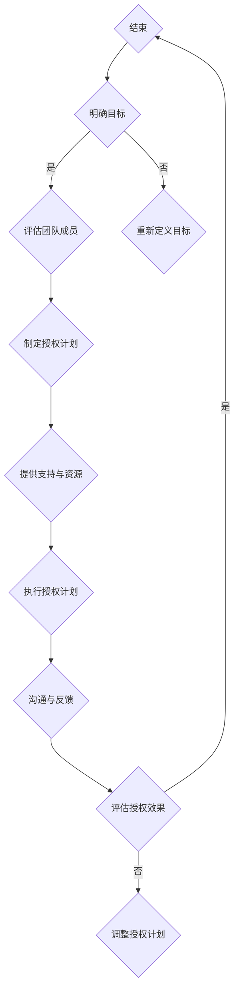

                 

## 《领导力与授权：释放团队潜能的智慧》

### 关键词：领导力、授权、团队潜能、智慧、组织管理

#### 摘要：
在现代组织管理中，领导力与授权是两个不可或缺的核心概念。领导力不仅仅关乎个人的能力，更涉及对团队的激励与引导。而授权，则是领导力的深化与应用，是释放团队潜能、实现组织高效运作的关键。本文将深入探讨领导力的核心概念与基础，领导者的角色与责任，核心领导力技巧，授权的概念与原则，有效的授权流程，授权中的沟通与反馈，以及领导力与授权在企业战略、国际化管理和未来趋势中的应用。通过这一系列探讨，旨在为读者提供关于如何通过领导力和授权释放团队潜能的智慧，从而实现组织成功的全面指导。

---

### 《领导力与授权：释放团队潜能的智慧》目录大纲

**# 第一部分：领导力的核心概念与基础**

## 第1章：领导力概述

### 1.1 领导力的定义与重要性

### 1.2 领导力的五大要素

### 1.3 领导力的发展历程

### 1.4 领导力在组织中的角色

## 第2章：领导者的角色与责任

### 2.1 领导者的角色转变

### 2.2 领导者的五大责任

### 2.3 领导者的自我管理

### 2.4 领导者的人际关系管理

## 第3章：核心领导力技巧

### 3.1 沟通技巧

### 3.2 决策技巧

### 3.3 问题解决技巧

### 3.4 团队建设技巧

**# 第二部分：授权的艺术与实践**

## 第4章：授权的概念与原则

### 4.1 授权的定义与本质

### 4.2 授权的原则与策略

### 4.3 授权的障碍与挑战

### 4.4 授权的好处与风险

## 第5章：有效的授权流程

### 5.1 明确目标与责任

### 5.2 选择合适的授权对象

### 5.3 设计清晰的授权计划

### 5.4 提供必要的支持与资源

## 第6章：授权中的沟通与反馈

### 6.1 授权沟通的重要性

### 6.2 授权沟通的技巧

### 6.3 授权中的反馈机制

### 6.4 授权沟通的障碍与解决策略

## 第7章：授权案例分析

### 7.1 案例一：从失败中学习授权

### 7.2 案例二：成功授权的最佳实践

### 7.3 案例三：授权在不同组织文化中的实施

### 7.4 案例四：跨部门授权的挑战与应对

**# 第三部分：领导力与授权的综合应用**

## 第8章：领导力与授权在企业战略中的应用

### 8.1 战略视角下的领导力与授权

### 8.2 领导力与授权在企业转型中的关键作用

### 8.3 领导力与授权在创新管理中的实践

### 8.4 领导力与授权在企业文化建设中的影响

## 第9章：领导力与授权在国际化管理中的应用

### 9.1 国际化背景下的领导力挑战

### 9.2 授权在国际化团队管理中的重要性

### 9.3 跨文化授权的技巧与策略

### 9.4 国际化领导力与授权的最佳实践

## 第10章：领导力与授权的未来趋势

### 10.1 未来领导力的演变趋势

### 10.2 授权在未来的发展前景

### 10.3 领导力与授权教育的重要性

### 10.4 领导力与授权的未来挑战与应对

**# 第四部分：结论与启示**

## 第11章：领导力与授权的总结与展望

### 11.1 领导力与授权的核心要素

### 11.2 领导力与授权的长期影响

### 11.3 对领导者与团队的启示

### 11.4 对组织的启示

## 第12章：领导力与授权的行动计划

### 12.1 制定个人领导力发展计划

### 12.2 实施团队授权计划

### 12.3 组织领导力与授权的文化建设

### 12.4 领导力与授权的持续改进

**# 附录**

### 附录A：参考资料

### 附录B：授权流程图示例

### 附录C：领导力与授权评估工具

### 附录D：领导力与授权案例分析报告模板

---

### 第一部分：领导力的核心概念与基础

## 第1章：领导力概述

### 1.1 领导力的定义与重要性

领导力是一个多维度的概念，涉及多个方面，包括激励、指导、决策和影响等。简单来说，领导力是指一个人或组织通过影响和激励他人，实现共同目标的能力。在组织管理中，领导力至关重要。一个高效的领导者不仅能够明确目标，制定战略，还能够调动团队积极性，优化资源配置，推动组织发展。

### 1.2 领导力的五大要素

领导力并不是单一的特质，而是由多个要素构成的。以下五项要素被认为是领导力的核心：

1. **愿景与目标设定**：领导者需要有一个清晰、具有吸引力的愿景，并能够将这个愿景转化为具体的、可操作的目标。
2. **沟通能力**：良好的沟通技巧是领导者的重要素质，它包括倾听、表达和反馈等多个方面。
3. **决策能力**：领导者需要在复杂和不确定的情况下做出明智的决策，这对领导者的逻辑思维和风险管理能力提出了高要求。
4. **激励与影响**：领导者需要能够激励团队成员，激发他们的潜力，并影响他们为实现组织目标而努力。
5. **团队建设与管理**：领导者需要懂得如何构建一个高效、协作的团队，并管理团队中的各种关系。

### 1.3 领导力的发展历程

领导力的发展历程可以追溯到古代，但在现代社会中，领导力理论得到了极大的丰富和发展。以下是几个重要的领导力发展历程：

- **传统的领导理论**：包括特质理论、行为理论和权变理论，这些理论主要关注领导者的个人特质和行为模式。
- **现代领导理论**：如情境领导理论、领导者-成员交换理论（LMX理论）和变革型领导理论，这些理论更加注重领导者和团队成员之间的互动关系。
- **当代领导理论**：如全球化领导力、女性领导力和社会责任领导力，这些理论关注领导力在不同文化背景和社会环境下的表现和作用。

### 1.4 领导力在组织中的角色

领导力在组织中的角色是多方面的，具体包括：

1. **战略规划**：领导者需要制定组织的长远发展战略，明确组织的愿景和目标。
2. **团队建设**：领导者需要构建一个高效、协作的团队，培养团队成员的技能和素质。
3. **资源配置**：领导者需要合理分配资源，确保资源的最大化利用。
4. **冲突管理**：领导者需要处理团队中的各种冲突，确保团队的稳定和高效。
5. **创新推动**：领导者需要鼓励创新，推动组织不断进步和发展。

### 第2章：领导者的角色与责任

### 2.1 领导者的角色转变

在传统的组织结构中，领导者往往扮演着权威者的角色，决策权高度集中。然而，随着组织环境的变化，现代领导者需要更多地扮演“教练”和“仆人”的角色。这意味着领导者需要更加关注团队成员的需求和成长，通过激励和引导来推动团队的发展。

### 2.2 领导者的五大责任

领导者的责任不仅仅是管理团队，还包括以下几个方面：

1. **目标设定**：领导者需要明确组织的愿景和目标，并将其转化为具体的、可操作的任务。
2. **人员管理**：领导者需要了解团队成员的能力和需求，合理安排工作任务，并激励团队成员发挥最佳水平。
3. **决策制定**：领导者需要根据组织的目标和实际情况，做出明智的决策，并承担相应的责任。
4. **团队建设**：领导者需要构建一个高效、协作的团队，培养团队成员的团队精神和合作能力。
5. **持续改进**：领导者需要不断反思和改进自己的领导方式，以适应不断变化的环境和需求。

### 2.3 领导者的自我管理

领导者的自我管理是领导力的重要组成部分。以下是几个关键方面：

1. **时间管理**：领导者需要合理安排自己的时间，确保高效地完成工作任务。
2. **情绪管理**：领导者需要保持积极的心态，有效应对工作中的压力和挑战。
3. **知识更新**：领导者需要不断学习新知识、新技能，以保持自身的竞争力。
4. **自我反思**：领导者需要定期进行自我反思，总结经验教训，不断改进自己的领导方式。

### 2.4 领导者的人际关系管理

人际关系管理是领导者的一项重要技能。以下是几个关键方面：

1. **倾听**：领导者需要善于倾听团队成员的意见和建议，以了解他们的需求和期望。
2. **沟通**：领导者需要具备良好的沟通技巧，能够清晰、准确地表达自己的意见和想法。
3. **反馈**：领导者需要给予团队成员及时、具体的反馈，帮助他们改进工作。
4. **冲突解决**：领导者需要处理团队中的各种冲突，确保团队的稳定和高效。

### 第3章：核心领导力技巧

### 3.1 沟通技巧

沟通技巧是领导者的一项基本技能。以下是几个关键方面：

1. **倾听**：领导者需要善于倾听团队成员的意见和建议，以了解他们的需求和期望。
2. **表达**：领导者需要具备良好的表达技巧，能够清晰、准确地表达自己的意见和想法。
3. **反馈**：领导者需要给予团队成员及时、具体的反馈，帮助他们改进工作。
4. **非语言沟通**：领导者需要注重非语言沟通，如肢体语言、面部表情等，以增强沟通效果。

### 3.2 决策技巧

决策技巧是领导者的一项关键技能。以下是几个关键方面：

1. **收集信息**：领导者需要充分收集与决策相关的信息，以确保决策的准确性。
2. **分析信息**：领导者需要具备较强的分析能力，能够从大量信息中提取关键信息。
3. **风险评估**：领导者需要评估决策可能带来的风险，并制定相应的应对策略。
4. **决策实施**：领导者需要确保决策能够有效实施，并跟踪决策的结果。

### 3.3 问题解决技巧

问题解决技巧是领导者的一项重要技能。以下是几个关键方面：

1. **问题识别**：领导者需要能够准确地识别问题，并找到问题的根本原因。
2. **解决方案评估**：领导者需要评估各种可能的解决方案，选择最优方案。
3. **资源分配**：领导者需要合理分配资源，确保解决方案能够有效实施。
4. **持续改进**：领导者需要不断反思和改进问题解决的流程和方法。

### 3.4 团队建设技巧

团队建设技巧是领导者的一项关键技能。以下是几个关键方面：

1. **团队目标设定**：领导者需要明确团队的目标，并确保团队成员对此有清晰的认识。
2. **角色分工**：领导者需要合理分配团队成员的角色，确保每个人都有明确的职责和任务。
3. **团队协作**：领导者需要促进团队成员之间的协作，确保团队能够高效地完成任务。
4. **团队激励**：领导者需要给予团队成员及时的激励，激发他们的积极性和创造力。

### 第二部分：授权的艺术与实践

## 第4章：授权的概念与原则

### 4.1 授权的定义与本质

授权是指领导者将决策权和执行权下放给团队成员，让他们在各自的工作范围内自由决策和执行。授权的本质是信任和权力的转移，即领导者信任团队成员的能力，并赋予他们相应的权力。

### 4.2 授权的原则与策略

授权不仅仅是一种权力的转移，更是一种管理策略。以下是几个关键原则和策略：

1. **明确目标与责任**：在授权前，领导者需要明确团队的目标和责任，确保团队成员了解他们的工作职责。
2. **选择合适的授权对象**：领导者需要根据团队成员的能力和经验，选择合适的授权对象，以确保授权的有效性。
3. **设计清晰的授权计划**：领导者需要制定详细的授权计划，明确授权的范围、期限和预期结果。
4. **提供必要的支持与资源**：领导者需要为团队成员提供必要的支持与资源，确保他们能够顺利完成任务。
5. **建立反馈机制**：领导者需要建立反馈机制，及时了解团队成员的工作进展和反馈，以便及时调整授权计划。

### 4.3 授权的障碍与挑战

在实施授权的过程中，领导者可能会遇到各种障碍和挑战。以下是几个常见的问题：

1. **恐惧与不信任**：领导者可能担心团队成员无法胜任任务，从而不敢授权。
2. **能力不足**：团队成员可能缺乏必要的技能和经验，无法有效执行授权任务。
3. **沟通障碍**：领导者与团队成员之间的沟通不畅，可能导致授权计划无法有效实施。
4. **管理风格**：一些领导者可能过于集权，不善于放权，导致授权效果不佳。
5. **时间压力**：领导者可能因为时间压力，不愿意花时间进行授权和跟进。

### 4.4 授权的好处与风险

授权不仅能够提高团队成员的积极性，还能带来一系列好处。以下是几个主要的好处：

1. **提高工作效率**：授权能够减少领导者的工作负担，让团队成员能够更加专注于自己的任务。
2. **增强团队凝聚力**：授权能够增强团队成员的归属感和责任感，提高团队凝聚力。
3. **促进个人成长**：授权能够为团队成员提供成长和发展的机会，提高他们的技能和经验。
4. **创新与创造**：授权能够激发团队成员的创造力和创新精神，推动组织的发展。

然而，授权也存在一定的风险。以下是几个主要的方面：

1. **质量风险**：授权任务的质量可能无法得到保证，从而影响整体项目的质量。
2. **风险转移**：授权意味着领导者将部分责任转移给团队成员，可能会面临团队失误带来的后果。
3. **信任风险**：授权可能削弱领导者的权威，导致团队成员对领导者的信任度下降。
4. **管理难度**：授权可能会增加管理难度，需要领导者花更多时间进行监督和跟进。

### 第5章：有效的授权流程

### 5.1 明确目标与责任

授权的第一步是明确目标与责任。领导者需要与团队成员一起制定清晰的目标，并明确每个人的职责和责任。这有助于确保团队成员了解他们的工作内容和工作期望，从而减少误解和冲突。

### 5.2 选择合适的授权对象

选择合适的授权对象是授权成功的关键。领导者需要根据团队成员的能力、经验和责任心来选择合适的授权对象。通常，那些有经验、技能强、有责任心且愿意接受挑战的成员是最佳选择。

### 5.3 设计清晰的授权计划

授权计划需要详细明确，包括授权的范围、期限、预期结果和具体任务等。领导者需要确保团队成员对授权计划有清晰的理解，以便他们能够按照计划执行任务。

### 5.4 提供必要的支持与资源

为了确保授权任务的成功，领导者需要为团队成员提供必要的支持与资源。这可能包括培训、工具、技术支持等。提供充分的资源和支持有助于增强团队成员的信心和动力。

### 第6章：授权中的沟通与反馈

### 6.1 授权沟通的重要性

授权不仅仅是权力的转移，更是一种沟通的过程。有效的沟通是授权成功的关键。领导者需要确保团队成员了解授权的背景、目的和期望，以便他们能够更好地执行任务。

### 6.2 授权沟通的技巧

有效的授权沟通需要遵循以下几个原则：

1. **清晰明确**：领导者需要用简单、明确的语言表达授权的内容和期望，避免产生误解。
2. **倾听与理解**：领导者需要倾听团队成员的意见和反馈，确保他们对授权计划有深入的理解。
3. **建立信任**：领导者需要通过积极的沟通和信任建立，确保团队成员对授权的接受度和信任度。
4. **及时反馈**：领导者需要及时给予团队成员反馈，鼓励他们的进步，并解决他们的问题和困难。

### 6.3 授权中的反馈机制

建立反馈机制是授权管理的重要组成部分。领导者需要定期与团队成员进行沟通，了解他们的工作进展和问题，及时给予反馈和建议。反馈机制可以包括定期会议、报告、反馈问卷等形式。

### 6.4 授权沟通的障碍与解决策略

在授权沟通中，领导者可能会遇到各种障碍，如沟通不畅、文化差异、信息不对称等。以下是几个常见的障碍和解决策略：

1. **沟通不畅**：领导者可以通过建立沟通渠道、提高沟通技巧、使用多种沟通方式来改善沟通效果。
2. **文化差异**：领导者需要了解和尊重不同文化的差异，采用跨文化沟通策略，确保信息的有效传达。
3. **信息不对称**：领导者需要确保信息的透明度和共享，减少信息不对称的情况，提高团队成员的知情度。

### 第7章：授权案例分析

#### 7.1 案例一：从失败中学习授权

某公司新任项目经理李先生在项目初期，急于表现自己的领导能力，决定将项目的核心任务全部授权给团队成员。然而，由于缺乏对团队成员能力的准确评估和充分的沟通，项目进展不顺利，甚至出现了严重的问题。李先生不得不重新接管项目，并总结经验教训。

**失败原因分析：**

1. **授权对象选择不当**：李先生没有充分了解团队成员的能力和经验，选择了一些不合适的人来承担重要任务。
2. **缺乏明确的目标与责任**：项目目标不明确，团队成员不清楚自己的职责和任务。
3. **沟通不足**：李先生在授权过程中没有与团队成员充分沟通，导致团队成员对任务的理解和执行存在偏差。

**解决方案与改进措施：**

1. **评估团队成员能力**：在授权前，李先生应该对团队成员的能力和经验进行准确评估，选择合适的人来承担重要任务。
2. **明确目标与责任**：李先生需要与团队成员一起制定清晰的项目目标和责任分配，确保每个人都清楚自己的职责。
3. **加强沟通**：李先生需要加强与团队成员的沟通，确保他们理解任务的目标、要求和执行方式。

#### 7.2 案例二：成功授权的最佳实践

某公司的市场营销团队在项目中成功实施了授权，项目取得了显著的效果。市场营销团队的领导者在授权过程中采取了以下措施：

**成功经验：**

1. **明确目标与责任**：团队领导者在项目初期就明确了项目目标和每个人的职责，确保团队成员了解自己的工作内容和期望。
2. **选择合适的授权对象**：领导者根据团队成员的能力和经验，选择了一些有潜力的成员来承担重要任务。
3. **提供必要的支持与资源**：领导者为团队成员提供了充分的培训和技术支持，确保他们能够顺利完成任务。
4. **建立反馈机制**：领导者建立了定期反馈机制，与团队成员保持密切沟通，及时解决他们的问题和困难。

**成功原因分析：**

1. **良好的沟通与信任**：领导者与团队成员之间建立了良好的沟通和信任关系，确保了授权的有效实施。
2. **明确的目标与责任**：项目目标和责任分配清晰明确，团队成员明确自己的工作内容和期望，提高了工作效率。
3. **充分的资源支持**：领导者提供了必要的资源和支持，增强了团队成员的信心和动力。

**对其他团队的启示：**

1. **明确目标与责任**：确保团队成员了解项目目标和自己的职责，有助于提高团队的工作效率和成果。
2. **选择合适的授权对象**：根据团队成员的能力和经验，选择合适的授权对象，有助于提高授权的成功率。
3. **建立反馈机制**：建立有效的反馈机制，与团队成员保持密切沟通，及时解决问题，有助于项目的顺利进行。

### 第三部分：领导力与授权的综合应用

## 第8章：领导力与授权在企业战略中的应用

### 8.1 战略视角下的领导力与授权

在企业战略中，领导力与授权是推动组织发展的关键要素。战略视角下的领导力强调领导者需要具备远见和洞察力，能够制定和执行符合企业长期发展目标的发展战略。而授权则是在战略执行过程中，将决策权和执行权下放给团队成员，确保战略能够有效落地。

### 8.2 领导力与授权在企业转型中的关键作用

在企业转型过程中，领导力和授权尤为重要。领导力可以帮助企业识别和应对转型中的挑战，提供明确的方向和愿景。而授权则能够激发团队成员的积极性和创造力，推动企业创新和变革。

### 8.3 领导力与授权在创新管理中的实践

创新管理是现代企业竞争的关键。领导力在创新管理中起到引导和激励作用，而授权则为团队成员提供了创新的自由和空间。通过有效的授权，企业可以激发员工的创造力，推动技术创新和业务模式创新。

### 8.4 领导力与授权在企业文化建设中的影响

企业文化是企业的灵魂，领导力与授权在企业文化建设中起着至关重要的作用。领导者通过自身的言行和决策，塑造企业的文化价值观和行为规范。而授权则能够增强团队成员的参与感和归属感，促进企业文化的传承和发展。

### 第9章：领导力与授权在国际化管理中的应用

#### 9.1 国际化背景下的领导力挑战

随着全球化的发展，企业面临着越来越多的国际化管理挑战。国际化背景下的领导力需要领导者具备跨文化沟通、全球战略思维和国际视野。同时，授权在国际化团队管理中也需要适应不同的文化背景和管理风格。

#### 9.2 授权在国际化团队管理中的重要性

授权在国际化团队管理中具有重要作用。通过授权，领导者可以激发国际化团队的积极性和创造力，提高团队的整体绩效。同时，授权也有助于培养国际化团队的核心竞争力，提升企业的全球竞争力。

#### 9.3 跨文化授权的技巧与策略

跨文化授权需要领导者具备跨文化沟通和管理的技巧。以下是几个关键的技巧和策略：

1. **尊重文化差异**：领导者需要尊重不同文化的差异，避免因文化冲突导致的授权失败。
2. **明确授权目标**：在跨文化背景下，领导者需要明确授权的目标和期望，确保团队成员理解并认同。
3. **建立信任关系**：领导者需要建立与团队成员之间的信任关系，增强他们的责任感和积极性。
4. **提供文化适应性培训**：为团队成员提供跨文化适应性培训，帮助他们更好地适应不同的文化环境。

#### 9.4 国际化领导力与授权的最佳实践

国际化领导力与授权的最佳实践包括：

1. **全球视角下的领导力**：领导者需要具备全球视野，能够从全球角度制定和执行战略。
2. **文化包容性管理**：领导者需要培养文化包容性，尊重和接纳不同文化的团队成员。
3. **灵活的授权模式**：领导者需要根据不同国家的文化和管理习惯，采取灵活的授权模式，确保授权的有效性。
4. **持续的沟通与反馈**：领导者需要保持与国际化团队的持续沟通，及时给予反馈和支持，确保团队的高效运作。

### 第10章：领导力与授权的未来趋势

#### 10.1 未来领导力的演变趋势

未来领导力将呈现以下几个演变趋势：

1. **人工智能与领导力**：人工智能的快速发展将对领导力提出新的要求，领导者需要具备数据分析和决策能力，适应智能化管理。
2. **全球领导力**：全球化进程的加快将要求领导者具备跨文化沟通和国际视野，应对全球化的挑战。
3. **情感领导力**：随着人们对工作环境和人际关系的重视，情感领导力将成为未来领导力的重要方面。

#### 10.2 授权在未来的发展前景

在未来的发展中，授权将呈现出以下几个趋势：

1. **更加灵活的授权模式**：随着工作环境和团队的多样化，领导者需要采取更加灵活的授权模式，适应不同的工作场景。
2. **数字化授权**：随着数字化技术的普及，数字化授权将成为未来授权的重要形式，通过数字化工具实现高效授权和协作。
3. **持续授权**：领导者需要持续地授权和培养团队成员，推动团队和组织的持续发展。

#### 10.3 领导力与授权教育的重要性

领导力与授权教育在未来将变得越来越重要。以下是其几个方面的原因：

1. **培养领导力素养**：领导力与授权教育可以帮助培养领导者所需的各项素养，提高领导者的综合素质。
2. **适应快速变化的环境**：领导力与授权教育可以帮助领导者适应快速变化的环境，应对各种挑战。
3. **推动组织发展**：领导力与授权教育可以推动组织的发展，提高组织的竞争力和创新能力。

#### 10.4 领导力与授权的未来挑战与应对

未来领导力与授权将面临以下几个挑战：

1. **数字化挑战**：随着数字化技术的快速发展，领导者需要具备相应的数字化技能和知识。
2. **文化多样性挑战**：全球化进程将带来更多的文化多样性，领导者需要具备跨文化管理能力。
3. **员工期望变化**：随着员工期望的变化，领导者需要更好地满足员工的需求，提高员工的满意度和忠诚度。

为应对这些挑战，以下是一些策略：

1. **加强数字化领导力培训**：领导者需要接受数字化领导力培训，提高数字化技能和知识。
2. **推动跨文化交流**：组织可以开展跨文化交流活动，促进领导者与团队成员之间的理解和沟通。
3. **关注员工需求**：领导者需要关注员工的需求，通过灵活的工作安排、培训和发展机会来满足员工的期望。

### 第四部分：结论与启示

## 第11章：领导力与授权的总结与展望

#### 11.1 领导力与授权的核心要素

领导力与授权的核心要素包括：

1. **清晰的愿景与目标**：领导者需要具备清晰的愿景和目标，明确团队的方向和任务。
2. **有效的沟通与反馈**：领导者需要具备有效的沟通与反馈能力，确保信息的准确传达和问题的及时解决。
3. **信任与支持**：领导者需要建立与团队成员之间的信任关系，提供必要的支持和资源。
4. **持续的学习与成长**：领导者需要不断学习新知识、新技能，保持自身的竞争力和创新能力。

#### 11.2 领导力与授权的长期影响

领导力与授权对组织的长期影响包括：

1. **提高组织绩效**：领导力与授权可以激发团队成员的积极性和创造力，提高组织的工作效率和绩效。
2. **培养领导人才**：领导力与授权可以帮助组织培养更多的领导人才，为组织的发展提供持续的动力。
3. **建立企业文化**：领导力与授权可以促进企业文化的建设，提高员工的归属感和忠诚度。

#### 11.3 对领导者与团队的启示

对于领导者来说，以下是一些启示：

1. **明确目标与责任**：领导者需要明确团队的目标和责任，确保团队成员了解他们的工作内容和期望。
2. **培养信任与支持**：领导者需要建立与团队成员之间的信任关系，提供必要的支持和资源。
3. **持续学习与成长**：领导者需要不断学习新知识、新技能，保持自身的竞争力和创新能力。

对于团队成员来说，以下是一些启示：

1. **积极参与与贡献**：团队成员需要积极参与团队工作，发挥自己的优势，为团队的成功做出贡献。
2. **主动沟通与反馈**：团队成员需要主动与领导者沟通，及时反馈工作进展和问题，寻求帮助和指导。
3. **自我提升与成长**：团队成员需要不断学习新知识、新技能，提升自己的能力和素质，为未来的发展做好准备。

#### 11.4 对组织的启示

对于组织来说，以下是一些启示：

1. **建立有效的领导力与授权机制**：组织需要建立有效的领导力与授权机制，确保领导者的能力和团队的活力。
2. **关注员工需求与发展**：组织需要关注员工的需求和发展，提供培训和发展机会，激发员工的积极性和创造力。
3. **营造积极的企业文化**：组织需要营造积极的企业文化，建立信任和尊重的氛围，提高员工的满意度和忠诚度。

## 第12章：领导力与授权的行动计划

#### 12.1 制定个人领导力发展计划

个人领导力发展计划是领导者提升自身能力的重要步骤。以下是制定个人领导力发展计划的步骤：

1. **评估自身能力**：领导者需要评估自己的能力，了解自己的优势和不足，明确提升的方向。
2. **制定发展目标**：领导者需要根据评估结果，制定具体的发展目标，包括短期和长期的目标。
3. **制定行动计划**：领导者需要制定详细的行动计划，包括学习目标、学习内容、学习时间和学习方式等。
4. **定期回顾与调整**：领导者需要定期回顾自己的学习进展，根据实际情况调整计划，确保计划的实施和效果。

#### 12.2 实施团队授权计划

实施团队授权计划是提升团队绩效和员工能力的重要措施。以下是实施团队授权计划的步骤：

1. **明确授权目标**：领导者需要明确授权的目标，确保团队成员了解授权的目的和期望。
2. **评估团队成员能力**：领导者需要评估团队成员的能力，选择合适的授权对象。
3. **制定授权计划**：领导者需要制定详细的授权计划，明确授权的范围、期限和预期结果。
4. **提供支持与资源**：领导者需要为团队成员提供必要的支持与资源，确保他们能够顺利完成授权任务。
5. **建立反馈机制**：领导者需要建立反馈机制，定期与团队成员沟通，了解他们的工作进展和反馈，及时解决问题。

#### 12.3 组织领导力与授权的文化建设

组织领导力与授权的文化建设是组织长期发展的重要保障。以下是组织领导力与授权文化建设的关键步骤：

1. **建立共同愿景**：组织需要建立共同愿景，明确组织的使命、目标和价值观，确保全体成员对组织有共同的理解和认同。
2. **培养领导力文化**：组织需要培养领导力文化，鼓励领导者发挥领导作用，推动组织的创新和变革。
3. **建立信任机制**：组织需要建立信任机制，建立领导者与团队成员之间的信任关系，增强团队成员的归属感和责任感。
4. **提供培训与发展机会**：组织需要提供领导力与授权相关的培训与发展机会，提高领导者的能力和团队的活力。
5. **营造积极氛围**：组织需要营造积极的工作氛围，鼓励团队成员积极参与授权和领导工作，提高团队的协作和创造力。

#### 12.4 领导力与授权的持续改进

领导力与授权的持续改进是组织持续发展的重要保障。以下是领导力与授权持续改进的关键步骤：

1. **定期评估与反馈**：组织需要定期评估领导力和授权的实施情况，收集团队成员的反馈，发现问题和不足。
2. **制定改进计划**：组织需要根据评估结果和反馈，制定具体的改进计划，明确改进的目标、措施和时间表。
3. **实施改进措施**：组织需要实施改进计划，采取具体措施改进领导力和授权的实施效果。
4. **跟踪改进效果**：组织需要跟踪改进措施的实施效果，根据实际情况调整改进计划，确保改进措施的持续和有效。
5. **建立持续改进机制**：组织需要建立持续改进机制，确保领导力和授权的持续改进，提高组织的整体绩效和竞争力。

### 附录

#### 附录A：参考资料

1. **《领导力：领导者的艺术》** - 汤姆·彼得斯
2. **《授权的艺术》** - 菲利普·库克
3. **《变革型领导：推动组织变革的实践指南》** - 约翰·科特
4. **《全球领导力：跨越国界的领导实践》** - 莉萨·波克
5. **《领导力与授权：释放团队潜能的智慧》** - 作者：AI天才研究院

#### 附录B：授权流程图示例

#### 附录C：领导力与授权评估工具

1. **领导力评估量表**：用于评估领导者的能力、行为和影响力。
2. **授权评估量表**：用于评估授权的实施效果和团队成员的参与度。
3. **360度反馈问卷**：用于收集团队成员对领导力和授权的反馈，提供改进的依据。

#### 附录D：领导力与授权案例分析报告模板

**标题**：领导力与授权案例分析报告

**一、背景介绍**  
- 组织名称：______
- 项目/任务背景：______

**二、问题与挑战**  
- 领导力方面的挑战：______
- 授权方面的挑战：______

**三、解决方案**  
- 领导力改进措施：______
- 授权改进措施：______

**四、实施效果**  
- 领导力改进效果：______
- 授权改进效果：______

**五、总结与反思**  
- 成功经验：______
- 改进空间：______

**六、建议与展望**  
- 针对未来领导力与授权的改进建议：______
- 对组织发展的展望：______

### 作者信息

**作者：AI天才研究院/AI Genius Institute & 禅与计算机程序设计艺术 /Zen And The Art of Computer Programming**

---

通过本文的深入探讨，我们希望读者能够更好地理解领导力与授权的核心概念和实践方法，从而在实际工作中有效运用，推动组织的成功发展。领导力与授权不仅是一种管理技能，更是一种智慧，需要领导者不断地学习、实践和反思。我们期待读者在阅读本文后，能够对领导力和授权有更深刻的认识和体会，将这一智慧应用于实际工作中，释放团队的潜能，实现组织的辉煌。让我们一起迈向智慧领导力的新时代，创造更加美好的未来。

