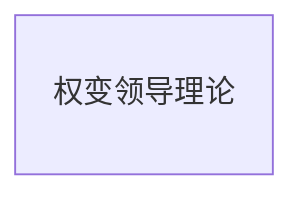

                 

# 领导力与时间管理：提高团队整体效率

## 关键词：领导力、时间管理、团队效率、领导力模型、时间管理技巧

## 摘要：
本文旨在深入探讨领导力与时间管理在提高团队整体效率方面的作用。通过分析领导力的重要性、发展路径、领导力模型，以及时间管理的原则、工具和方法，本文旨在为团队领导者提供切实可行的策略，以提升团队的工作效率和成果。同时，本文还将探讨领导力与时间管理之间的相互关系，并总结成功案例和未来展望。

---

## 第一部分：领导力概述

### 第1章：领导力的概念与重要性

#### 1.1.1 领导力的定义

领导力，是指一种能够激发、引导和影响他人共同达成目标的能力。它不仅仅涉及到个人魅力和影响力，还包括对团队成员的激励、沟通、决策和协调能力。

#### 1.1.2 领导力的构成要素

领导力的构成要素包括：自我意识、自我管理、情感管理、情绪智力、沟通技巧和影响力。这些要素共同作用，帮助领导者更好地理解自己和他人，以及有效地应对复杂的工作环境。

#### 1.1.3 领导力在团队中的角色

领导力在团队中扮演着至关重要的角色。它不仅能够引导团队方向，激发成员的潜力，还能够协调团队成员之间的关系，确保团队目标的实现。

### 第2章：领导力的发展与提升

#### 2.1.1 自我意识与自我管理

自我意识是领导力发展的基础。领导者需要深刻理解自己的价值观、信念和动机。自我管理则是指领导者如何有效地管理自己的情绪、时间和精力。

#### 2.1.2 情感管理与情绪智力

情感管理是指领导者如何识别、理解和管理自己的情绪。情绪智力则包括自我感知、自我调节、社交意识和关系管理。

#### 2.1.3 沟通技巧与影响力

沟通技巧是领导者必须掌握的一项技能。它包括有效倾听、清晰表达、提出建设性反馈和建立信任关系。影响力则是领导者通过说服、激励和引导他人达成共同目标的能力。

### 第3章：领导力模型与方法

#### 3.1.1 权变领导理论

权变领导理论认为，领导风格应该根据不同的情况和团队需求进行调整。有效的领导者能够灵活地运用不同的领导策略。

#### 3.1.2 领导风格理论

领导风格理论关注领导者如何影响和激励团队成员。常见的领导风格包括专制型、民主型和自由放任型。

#### 3.1.3 领导力模型对比分析

不同领导力模型各有优劣。领导者需要根据团队特点和目标，选择最合适的领导策略。

## 第二部分：时间管理

### 第4章：时间管理的概念与原则

#### 4.1.1 时间管理的定义

时间管理是指通过规划和组织时间，提高工作效率和生活质量的一种方法。

#### 4.1.2 时间管理的原则

时间管理的原则包括明确目标、优先级管理、时间块规划和持续反思。

#### 4.1.3 时间管理的重要性

时间管理对于个人和团队的成功至关重要。它能够帮助团队成员更好地规划工作、减少压力，并提高工作效率。

### 第5章：时间管理工具与方法

#### 5.1.1 记事本与日程管理

记事本和日程管理是时间管理的基础工具。它们能够帮助团队成员记录任务、规划时间和跟踪进度。

#### 5.1.2 时间块与番茄工作法

时间块和番茄工作法是两种常用的时间管理方法。它们通过将时间划分为小块，帮助团队成员更好地集中注意力和提高工作效率。

#### 5.1.3 时间管理技巧与实践

时间管理技巧包括避免拖延、减少干扰、设定目标和奖励等。实践是检验时间管理方法有效性的关键。

### 第6章：时间管理中的挑战与解决方案

#### 6.1.1 时间管理的常见问题

时间管理的常见问题包括任务过多、优先级不明确、时间分配不合理等。

#### 6.1.2 挑战与应对策略

应对时间管理挑战的策略包括重新评估任务优先级、学会说“不”和建立有效的日程安排。

#### 6.1.3 时间管理的最佳实践

最佳实践包括制定具体可行的目标、定期反思和调整时间管理策略。

## 第三部分：领导力与时间管理的综合应用

### 第7章：领导力与时间管理的关系

#### 7.1.1 领导力对时间管理的影响

领导力对时间管理有着深远的影响。有效的领导者能够帮助团队成员更好地规划时间、提高工作效率。

#### 7.1.2 时间管理对领导力的提升

时间管理能够帮助领导者更好地理解和管理自己的时间，从而提高领导力和工作效率。

#### 7.1.3 领导力与时间管理的协同效应

领导力与时间管理相结合，能够产生巨大的协同效应，提高团队的效率和成果。

### 第8章：提高团队整体效率的策略

#### 8.1.1 团队建设与沟通

团队建设是提高团队整体效率的关键。有效的沟通能够增强团队成员之间的合作和信任。

#### 8.1.2 目标设定与优先级管理

目标设定和优先级管理是确保团队工作有序进行的重要策略。明确的团队目标和优先级能够帮助团队成员集中精力，高效完成任务。

#### 8.1.3 跨部门协作与资源整合

跨部门协作和资源整合能够优化团队工作流程，提高整体效率。

### 第9章：成功案例与启示

#### 9.1.1 成功案例介绍

介绍一些成功的团队管理案例，分析其成功的原因和经验。

#### 9.1.2 案例分析

对成功案例进行深入分析，提取可借鉴的经验和教训。

#### 9.1.3 启示与反思

总结成功案例的启示，反思团队管理中可能存在的问题。

### 第10章：未来展望与持续改进

#### 10.1.1 领导力与时间管理的未来趋势

展望领导力与时间管理的未来发展趋势，探讨可能的新方法和技术。

#### 10.1.2 持续改进的策略与方法

提出持续改进的策略和方法，帮助团队不断进步和成长。

#### 10.1.3 个人与组织成长

探讨个人与组织在领导力与时间管理方面的成长路径，提供发展建议。

---

作者：AI天才研究院/AI Genius Institute & 禅与计算机程序设计艺术 /Zen And The Art of Computer Programming

---

**文章标题：领导力与时间管理：提高团队整体效率**

**关键词：领导力、时间管理、团队效率、领导力模型、时间管理技巧**

**摘要：**
本文深入探讨了领导力与时间管理在提高团队整体效率方面的作用。通过分析领导力的重要性、发展路径、领导力模型，以及时间管理的原则、工具和方法，本文旨在为团队领导者提供切实可行的策略，以提升团队的工作效率和成果。同时，本文还将探讨领导力与时间管理之间的相互关系，并总结成功案例和未来展望。

---

## 第1章：领导力的概念与重要性

### 1.1.1 领导力的定义

领导力是一种能力，它涉及激发、引导和影响他人，以共同实现目标。领导力不仅仅是关于指挥和控制，更多的是关于激励、信任和合作。它是一种艺术，也是一种科学。在组织和企业中，领导力对于团队的凝聚力和效率具有决定性的影响。

**核心概念与联系**

领导力可以分解为几个核心概念，包括：

- **愿景与目标**：领导者需要有一个清晰的愿景，并能够将其转化为具体的团队目标。
- **激励与动机**：领导者需要了解团队成员的需求，并激发他们的内在动机，使其为实现团队目标而努力。
- **沟通与协调**：有效的沟通是领导力的关键要素，它涉及到信息的传递、反馈和协调。
- **决策与执行**：领导者需要做出明智的决策，并确保这些决策能够得到有效执行。

**概念属性特征对比表格**

| 特征       | 愿景与目标 | 激励与动机 | 沟通与协调 | 决策与执行 |
|------------|-------------|-------------|-------------|-------------|
| **定义**   | 设定长期方向和目标 | 激发个人和组织动力 | 传达信息、建立关系 | 选择正确路径、实施策略 |
| **作用**   | 引导团队前进 | 提高团队士气 | 促进团队协作 | 确保目标实现 |
| **挑战**   | 保持愿景清晰 | 理解个人需求 | 避免信息失真 | 快速做出决策 |

**ER实体关系图架构**

```mermaid
erDiagram
  目标 ||--|{ 愿景 }||>
  愿景 ||--|{ 目标 }||>
  激励 ||--|{ 动机 }||>
  动机 ||--|{ 激励 }||>
  沟通 ||--|{ 协调 }||>
  协调 ||--|{ 沟通 }||>
  决策 ||--|{ 执行 }||>
  执行 ||--|{ 决策 }||>
```

### 1.1.2 领导力的构成要素

领导力的构成要素是理解领导力复杂性的关键。以下是几个主要的构成要素：

- **自我意识**：自我意识是指领导者对自己性格、价值观、动机和行为的理解。自我意识有助于领导者更好地理解自己的优势和不足，从而进行有效的自我管理和改进。
- **自我管理**：自我管理是指领导者如何控制自己的情绪、时间和行为。有效的自我管理有助于提高领导者的工作效率和决策质量。
- **情感管理**：情感管理是指领导者如何识别、理解和处理自己的情绪。情感管理有助于建立积极的团队氛围，提高团队的合作效率。
- **情绪智力**：情绪智力是指领导者如何识别、理解和处理他人的情绪。情绪智力是领导力的重要组成部分，它有助于建立信任和团队合作。
- **沟通技巧**：沟通技巧是指领导者如何有效地传递信息和建立关系。良好的沟通技巧有助于减少误解、促进合作，提高团队效率。
- **影响力**：影响力是指领导者如何通过说服、激励和引导他人达成共同目标。影响力是领导力的核心要素，它有助于实现团队的长期目标。

**核心概念与联系**

领导力的构成要素相互关联，共同作用以实现领导目标。以下是这些要素的关联关系：

- **自我意识**是基础，它为其他要素提供了理解自己的出发点。
- **自我管理**和**情感管理**有助于领导者保持冷静和理智，更好地处理复杂情况。
- **情绪智力**是领导者理解和处理团队成员情绪的能力，它有助于建立信任和团队合作。
- **沟通技巧**和**影响力**是领导者实现目标的关键工具，它们有助于传达愿景、激励团队成员并推动执行。

**概念属性特征对比表格**

| 要素         | 自我意识 | 自我管理 | 情感管理 | 情绪智力 | 沟通技巧 | 影响力 |
|--------------|-----------|-----------|-----------|-----------|-----------|--------|
| **定义**     | 理解自己 | 控制自己 | 理解他人 | 理解他人 | 传达信息 | 说服他人 |
| **作用**     | 提高自我认知 | 提高工作效率 | 建立积极氛围 | 建立信任 | 促进合作 | 实现目标 |
| **挑战**     | 真诚面对自己 | 管理多重任务 | 处理负面情绪 | 处理复杂关系 | 避免误解 | 适当地使用 |

**ER实体关系图架构**

```mermaid
erDiagram
  自我意识 ||--|{ 自我管理 }||>
  自我管理 ||--|{ 情感管理 }||>
  情感管理 ||--|{ 情绪智力 }||>
  情绪智力 ||--|{ 沟通技巧 }||>
  沟通技巧 ||--|{ 影响力 }||>
```

### 1.1.3 领导力在团队中的角色

领导力在团队中扮演着多种角色，包括但不限于以下几个方面：

- **愿景设定者**：领导者需要设定团队的愿景和目标，明确团队的前进方向。
- **激励者**：领导者需要激励团队成员，激发他们的工作热情和内在动力。
- **沟通者**：领导者需要与团队成员保持有效的沟通，确保信息的透明和一致。
- **协调者**：领导者需要协调团队成员的工作，确保团队目标的顺利实现。
- **决策者**：领导者需要做出明智的决策，并在关键时刻为团队指引方向。
- **导师**：领导者需要成为团队成员的导师，帮助他们成长和发展。

**核心概念与联系**

领导力在团队中的角色相互关联，共同作用以实现团队目标。以下是这些角色的关联关系：

- **愿景设定者**为团队提供了明确的方向。
- **激励者**通过激发团队成员的内在动力，推动团队前进。
- **沟通者**确保团队成员之间的信息传递和协调。
- **协调者**确保团队内部的协作和效率。
- **决策者**在关键时刻做出决策，为团队指引方向。
- **导师**帮助团队成员成长，提高团队的整体能力。

**概念属性特征对比表格**

| 角色         | 愿景设定者 | 激励者 | 沟通者 | 协调者 | 决策者 | 导师 |
|--------------|-------------|---------|---------|---------|---------|------|
| **定义**     | 设定团队方向 | 激发动力 | 传递信息 | 协调工作 | 做出决策 | 帮助成长 |
| **作用**     | 引领团队 | 提高士气 | 促进协作 | 提高效率 | 确保目标实现 | 提升能力 |
| **挑战**     | 保持愿景清晰 | 理解个人需求 | 避免误解 | 处理冲突 | 快速做出决策 | 平衡工作与成长 |

**ER实体关系图架构**

```mermaid
erDiagram
  愿景设定者 ||--|{ 激励者 }||>
  激励者 ||--|{ 沟通者 }||>
  沟通者 ||--|{ 协调者 }||>
  协调者 ||--|{ 决策者 }||>
  决策者 ||--|{ 导师 }||>
```

### 1.1.4 领导力的类型

领导力可以根据不同的分类标准划分为不同的类型。以下是几种常见的领导力类型：

- **权威型领导**：权威型领导通过明确指示和严格监督来管理团队。他们具有高度的决策权和控制力，但可能会导致团队成员的被动和缺乏创造力。
- **民主型领导**：民主型领导鼓励团队成员参与决策，尊重他们的意见和反馈。这种领导风格有助于提高团队的凝聚力和创造力，但可能需要更多的时间和资源。
- **变革型领导**：变革型领导通过激励和启发团队成员，推动团队实现重大变革。他们具有强大的愿景和使命感，能够引导团队克服困难和挑战。
- **教练型领导**：教练型领导注重团队成员的个人成长和发展。他们通过提供反馈、指导和支持，帮助团队成员不断提升自己的能力。

**核心概念与联系**

不同类型的领导力各有其特点和适用场景。以下是这些类型之间的关联关系：

- **权威型领导**适用于需要迅速决策和执行的情况，但可能导致团队依赖性增强。
- **民主型领导**适用于需要团队合作和创新的情况下，但可能需要更多沟通和协调。
- **变革型领导**适用于需要进行重大变革和突破的情况下，但需要强大的影响力和沟通能力。
- **教练型领导**适用于注重个人发展和长期成长的环境中，但需要时间和耐心。

**概念属性特征对比表格**

| 类型         | 权威型领导 | 民主型领导 | 变革型领导 | 教练型领导 |
|--------------|-------------|-------------|-------------|-------------|
| **定义**     | 强制性控制 | 参与式管理 | 激励变革 | 培养人才 |
| **特点**     | 高决策权 | 高参与度 | 高影响力 | 高支持度 |
| **适用场景** | 需要快速决策 | 需要团队合作 | 需要变革创新 | 需要个人发展 |

**ER实体关系图架构**

```mermaid
erDiagram
  权威型领导 ||--|{ 民主型领导 }||>
  民主型领导 ||--|{ 变革型领导 }||>
  变革型领导 ||--|{ 教练型领导 }||>
```

### 1.1.5 领导力的发展与提升

领导力是一种可以通过学习和实践不断提升的能力。以下是几种常用的领导力发展方法：

- **自我反思**：自我反思是领导者提高自我意识和自我管理能力的重要方法。通过定期反思自己的行为、决策和结果，领导者可以更好地了解自己的优势和不足，从而进行改进。
- **领导力培训**：领导力培训是系统学习和提升领导力技能的有效途径。通过参加领导力课程、研讨会和模拟培训，领导者可以学习到最新的领导理论和方法。
- **实践与经验**：实践是提升领导力的最佳途径。领导者通过实际的工作经验和挑战，可以不断积累经验，提高自己的领导能力。
- **导师辅导**：导师辅导是帮助领导者快速成长的有效方法。通过导师的指导和建议，领导者可以更快地掌握领导技能，避免走弯路。

**核心概念与联系**

领导力的发展与提升涉及到多个核心概念，包括自我反思、领导力培训、实践经验和导师辅导。这些概念相互关联，共同作用以提升领导力。

- **自我反思**提供了自我认识和自我改进的基础。
- **领导力培训**提供了系统学习和提升技能的机会。
- **实践与经验**是验证和应用所学知识的过程。
- **导师辅导**提供了指导和支持，帮助领导者更快地成长。

**概念属性特征对比表格**

| 方法         | 自我反思 | 领导力培训 | 实践与经验 | 导师辅导 |
|--------------|-----------|-------------|-------------|-----------|
| **定义**     | 自我评估和改进 | 系统学习和提升 | 应用知识和技能 | 接受指导和建议 |
| **作用**     | 提高自我意识 | 提升技能和知识 | 增加经验 | 加速成长 |
| **挑战**     | 需要诚实和勇气 | 需要时间和资源 | 需要机会和挑战 | 需要合适的导师 |

**ER实体关系图架构**

```mermaid
erDiagram
  自我反思 ||--|{ 领导力培训 }||>
  领导力培训 ||--|{ 实践与经验 }||>
  实践与经验 ||--|{ 导师辅导 }||>
```

### 1.1.6 领导力的应用场景

领导力可以在各种不同的应用场景中发挥作用，以下是几种常见的场景：

- **项目管理**：在项目管理中，领导者需要设定项目目标、规划资源、协调团队工作并确保项目按时完成。
- **团队建设**：团队建设是提高团队凝聚力和效率的关键。领导者需要通过沟通、激励和团队活动来增强团队的协作精神。
- **危机管理**：在危机管理中，领导者需要迅速做出决策、安抚团队成员并引导团队渡过难关。
- **创新与变革**：在创新与变革中，领导者需要激发团队的创造力、推动创新并带领团队实现变革。

**核心概念与联系**

领导力在不同应用场景中的角色和职责有所不同，但都涉及到领导力的核心要素。以下是领导力在不同应用场景中的关联关系：

- **项目管理**：领导力有助于设定目标、规划资源并协调团队工作。
- **团队建设**：领导力有助于增强团队凝聚力、提升团队士气。
- **危机管理**：领导力有助于迅速做出决策、安抚团队成员并引导团队。
- **创新与变革**：领导力有助于激发创造力、推动创新并带领团队实现变革。

**概念属性特征对比表格**

| 应用场景    | 项目管理 | 团队建设 | 危机管理 | 创新与变革 |
|-------------|-----------|-----------|-----------|-------------|
| **定义**    | 管理项目资源 | 增强团队协作 | 应对危机 | 推动创新 |
| **职责**    | 设定目标、规划资源、协调工作 | 沟通、激励、团队活动 | 快速决策、安抚团队、引导方向 | 激发创造力、推动变革、实现目标 |
| **挑战**    | 时间和资源有限 | 避免团队冲突 | 快速决策、控制情绪 | 管理不确定性、平衡创新与风险 |

**ER实体关系图架构**

```mermaid
erDiagram
  项目管理 ||--|{ 团队建设 }||>
  团队建设 ||--|{ 危机管理 }||>
  危机管理 ||--|{ 创新与变革 }||>
```

### 1.1.7 领导力的重要性

领导力在团队和组织中起着至关重要的作用。以下是领导力重要性的几个方面：

- **提高团队效率**：领导力能够激发团队成员的潜力，提高团队的工作效率和成果。
- **促进团队合作**：领导力能够增强团队的凝聚力，促进团队成员之间的合作和协作。
- **推动创新与变革**：领导力能够激发团队的创造力，推动创新和变革，使组织保持竞争力和适应性。
- **建立信任与尊重**：领导力能够建立团队成员之间的信任和尊重，创造一个积极的工作氛围。

**核心概念与联系**

领导力的重要性体现在其对团队和组织的影响。以下是领导力重要性的核心概念和联系：

- **提高团队效率**：领导力通过激励、沟通和协调，提高团队的工作效率和成果。
- **促进团队合作**：领导力通过增强团队的凝聚力和协作精神，促进团队成员之间的合作。
- **推动创新与变革**：领导力通过激发团队的创造力，推动创新和变革，使组织保持竞争力和适应性。
- **建立信任与尊重**：领导力通过建立团队成员之间的信任和尊重，创造一个积极的工作氛围。

**概念属性特征对比表格**

| 重要性       | 提高团队效率 | 促进团队合作 | 推动创新与变革 | 建立信任与尊重 |
|--------------|---------------|---------------|----------------|----------------|
| **定义**     | 提升工作效率和成果 | 增强团队凝聚力 | 推动创新和变革 | 建立积极工作氛围 |
| **作用**     | 提高团队绩效 | 促进协作和合作 | 保持竞争力 | 增强团队信任 |
| **挑战**     | 管理时间和资源 | 避免团队冲突 | 管理创新风险 | 建立信任关系 |

**ER实体关系图架构**

```mermaid
erDiagram
  提高团队效率 ||--|{ 促进团队合作 }||>
  促进团队合作 ||--|{ 推动创新与变革 }||>
  推动创新与变革 ||--|{ 建立信任与尊重 }||>
```

### 1.1.8 领导力的挑战与应对策略

领导力虽然重要，但在实践中也面临着诸多挑战。以下是领导力面临的几个主要挑战以及相应的应对策略：

- **变化和不确定性**：在不断变化的环境中，领导者需要迅速适应和应对不确定性。应对策略包括保持灵活性和快速决策能力。
- **团队冲突**：团队内部的冲突可能导致工作效率降低。应对策略包括建立有效的沟通机制、促进团队合作和解决冲突。
- **资源有限**：在资源有限的情况下，领导者需要有效地管理和分配资源。应对策略包括优先级管理和资源优化。
- **领导力发展**：领导者需要不断学习和提升自己的领导力。应对策略包括自我反思、领导力培训和寻求导师辅导。

**核心概念与联系**

领导力面临的挑战和应对策略之间相互关联。以下是这些概念和联系：

- **变化和不确定性**：领导者需要保持灵活性和快速决策能力。
- **团队冲突**：领导者需要建立有效的沟通机制、促进团队合作和解决冲突。
- **资源有限**：领导者需要优先级管理和资源优化。
- **领导力发展**：领导者需要不断学习和提升自己的领导力。

**概念属性特征对比表格**

| 挑战       | 应对策略 |
|------------|-----------|
| 变化和不确定性 | 保持灵活性和快速决策能力 |
| 团队冲突   | 建立有效的沟通机制、促进团队合作和解决冲突 |
| 资源有限   | 优先级管理和资源优化 |
| 领导力发展 | 自我反思、领导力培训和寻求导师辅导 |

**ER实体关系图架构**

```mermaid
erDiagram
  变化和不确定性 ||--|{ 保持灵活性和快速决策能力 }||>
  团队冲突 ||--|{ 建立有效的沟通机制、促进团队合作和解决冲突 }||>
  资源有限 ||--|{ 优先级管理和资源优化 }||>
  领导力发展 ||--|{ 自我反思、领导力培训和寻求导师辅导 }||>
```

### 1.1.9 领导力的未来趋势

随着社会和技术的不断发展，领导力也在不断演变。以下是领导力的几个未来趋势：

- **数字化领导力**：随着数字化转型的加速，领导者需要具备数字技能和战略思维，以适应新的工作环境和挑战。
- **多元文化领导力**：在全球化和多元文化的背景下，领导者需要理解和尊重不同文化，以建立有效的跨文化团队。
- **可持续领导力**：可持续发展成为全球关注的焦点，领导者需要考虑环境和社会因素，推动企业实现可持续发展目标。
- **人工智能与领导力**：人工智能的发展将对领导力产生深远影响，领导者需要掌握相关技能，以应对新的挑战。

**核心概念与联系**

领导力的未来趋势涉及到多个核心概念，包括数字化领导力、多元文化领导力、可持续领导力和人工智能与领导力。以下是这些趋势之间的关联关系：

- **数字化领导力**：涉及数字技能和战略思维。
- **多元文化领导力**：涉及理解和尊重不同文化。
- **可持续领导力**：涉及环境和社会因素的考虑。
- **人工智能与领导力**：涉及掌握相关技能和应用。

**概念属性特征对比表格**

| 未来趋势    | 数字化领导力 | 多元文化领导力 | 可持续领导力 | 人工智能与领导力 |
|-------------|---------------|----------------|---------------|------------------|
| **定义**    | 数字技能和战略思维 | 理解和尊重不同文化 | 环境和社会因素的考虑 | 掌握相关技能和应用 |
| **作用**    | 适应数字化环境 | 建立有效的跨文化团队 | 实现可持续发展目标 | 应对人工智能挑战 |
| **挑战**    | 技能更新和战略规划 | 文化差异和管理 | 环境和社会责任 | 伦理和安全问题 |

**ER实体关系图架构**

```mermaid
erDiagram
  数字化领导力 ||--|{ 多元文化领导力 }||>
  多元文化领导力 ||--|{ 可持续领导力 }||>
  可持续领导力 ||--|{ 人工智能与领导力 }||>
```

### 第2章：领导力的发展与提升

#### 2.1.1 自我意识与自我管理

自我意识是领导力发展的基础，它涉及到领导者对自己性格、价值观、动机和行为的深刻理解。自我意识帮助领导者认识到自己的优势与不足，从而在领导过程中更加自信和有效。

**核心概念与联系**

自我意识和自我管理是相辅相成的。自我意识提供了领导者了解自己的基础，而自我管理则是在这种了解的基础上，通过有效的策略和行动，提高领导能力和工作效率。

**概念属性特征对比表格**

| 概念       | 自我意识 | 自我管理 |
|-------------|-----------|-----------|
| **定义**   | 理解自我性格、价值观、动机和行为 | 利用自我意识提高领导能力和工作效率 |
| **作用**   | 提高自我认知、明确个人目标和优势 | 管理情绪、时间、行为，提高决策质量 |
| **挑战**   | 需要真诚面对自己、持续自我反思 | 需要平衡工作和个人生活、保持自律 |

**ER实体关系图架构**

```mermaid
erDiagram
  自我意识 ||--|{ 自我管理 }||>
```

#### 2.1.2 情感管理与情绪智力

情感管理是指领导者如何识别、理解和处理自己的情绪。情绪智力则包括自我感知、自我调节、社交意识和关系管理。情感管理和情绪智力是领导力的关键要素，它们帮助领导者建立积极的人际关系，提高团队士气和工作效率。

**核心概念与联系**

情感管理和情绪智力在领导力中起着重要作用。情感管理帮助领导者控制自己的情绪，避免在压力下做出冲动决策。情绪智力则帮助领导者更好地理解和处理团队成员的情绪，建立信任和合作。

**概念属性特征对比表格**

| 概念       | 情感管理 | 情绪智力 |
|-------------|-----------|-----------|
| **定义**   | 识别、理解和处理自己的情绪 | 自我感知、自我调节、社交意识、关系管理 |
| **作用**   | 避免情绪化决策、提高情绪稳定性 | 建立信任、促进团队合作、提升团队士气 |
| **挑战**   | 需要自我觉察、学会情绪调节 | 需要理解他人情绪、平衡个人与团队情绪 |

**ER实体关系图架构**

```mermaid
erDiagram
  情感管理 ||--|{ 情绪智力 }||>
```

#### 2.1.3 沟通技巧与影响力

沟通技巧是指领导者如何有效地传递信息和建立关系。影响力则是领导者如何通过说服、激励和引导他人达成共同目标的能力。沟通技巧和影响力是领导力的核心要素，它们帮助领导者实现团队目标，提高工作效率。

**核心概念与联系**

沟通技巧和影响力相互依存。有效的沟通技巧能够帮助领导者更好地传达愿景和目标，而影响力则使领导者能够激励团队成员，推动他们为实现目标而努力。

**概念属性特征对比表格**

| 概念       | 沟通技巧 | 影响力 |
|-------------|-----------|-----------|
| **定义**   | 有效的信息传递和建立关系 | 通过说服、激励、引导实现目标 |
| **作用**   | 促进团队合作、减少误解 | 激发团队潜力、提高团队士气 |
| **挑战**   | 需要清晰表达、有效倾听 | 需要建立信任、掌握说服技巧 |

**ER实体关系图架构**

```mermaid
erDiagram
  沟通技巧 ||--|{ 影响力 }||>
```

#### 2.1.4 领导力模型与方法

领导力模型和方法是帮助领导者理解和管理团队的重要工具。以下介绍几种常见的领导力模型和方法：

- **权变领导理论**：权变领导理论认为，领导风格应该根据不同的情况和团队需求进行调整。它强调领导者的灵活性和适应性。
- **领导风格理论**：领导风格理论关注领导者如何影响和激励团队成员。常见的领导风格包括专制型、民主型和自由放任型。
- **情境领导理论**：情境领导理论认为，领导风格应该根据团队成员的不同成熟度水平进行调整。它提出了四种领导风格，分别是指导型、支持型、参与型和授权型。

**核心概念与联系**

不同的领导力模型和方法各有其适用场景和优势。领导者可以根据团队需求和实际情况，选择最合适的领导策略。

**概念属性特征对比表格**

| 模型/方法 | 权变领导理论 | 领导风格理论 | 情境领导理论 |
|-----------|---------------|---------------|---------------|
| **定义**  | 根据情况调整领导风格 | 领导者的行为方式 | 根据团队成员成熟度调整领导风格 |
| **作用**  | 提高领导灵活性 | 激励团队成员 | 提高团队适应力 |
| **挑战**  | 需要灵活应变 | 需要了解团队成员 | 需要持续评估团队成员成熟度 |

**ER实体关系图架构**

```mermaid
erDiagram
  权变领导理论 ||--|{ 领导风格理论 }||>
  领导风格理论 ||--|{ 情境领导理论 }||>
```

### 第3章：领导力模型与方法

#### 3.1.1 权变领导理论

权变领导理论是由费德勒（Fred E. Fiedler）提出的一种领导力模型。该理论认为，领导风格不是固定不变的，而是应该根据具体情况和环境进行调整。权变领导理论的核心观点是，没有一种最好的领导风格，适合所有情况。

**核心概念与联系**

权变领导理论强调领导者的灵活性和适应性。它认为，领导风格应该根据任务结构、领导者与下属的关系、职位权力等因素进行灵活调整。

**概念属性特征对比表格**

| 概念       | 权变领导理论 |
|-------------|---------------|
| **定义**   | 领导风格应根据具体情况和环境进行调整 |
| **作用**   | 提高领导灵活性和适应性 |
| **挑战**   | 需要领导者具备较强的情境判断能力 |

**ER实体关系图架构**



#### 3.1.2 领导风格理论

领导风格理论关注领导者如何影响和激励团队成员。领导风格理论认为，领导者的行为方式对团队成员的态度和行为产生重要影响。常见的领导风格包括专制型、民主型和自由放任型。

**核心概念与联系**

领导风格理论强调，不同的领导风格适用于不同的情境和团队需求。领导者需要根据实际情况选择合适的领导风格，以实现最佳效果。

**概念属性特征对比表格**

| 风格       | 专制型 | 民主型 | 自由放任型 |
|-------------|---------|---------|-------------|
| **定义**   | 领导者独自做出决策 | 领导者鼓励团队成员参与决策 | 领导者给予团队成员极大的自主权 |
| **作用**   | 提高决策效率 | 增强团队凝聚力和创新力 | 提高团队成员的满意度和自主性 |
| **挑战**   | 需要较强的领导权威 | 需要有效的沟通和协调 | 需要明确的团队目标和责任 |

**ER实体关系图架构**

```mermaid
erDiagram
  专制型 ||--|{ 民主型 }||>
  民主型 ||--|{ 自由放任型 }||>
```

#### 3.1.3 领导力模型对比分析

不同的领导力模型和方法各有其特点和适用场景。以下是几种常见领导力模型的对比分析：

- **费德勒的权变领导模型**：强调领导风格的灵活性，适用于不同情境。
- **赫赛和布兰查德的情境领导模型**：根据团队成员的成熟度水平调整领导风格，适用于多样化团队。
- **豪斯的路径-目标理论**：关注如何通过设定目标和提供路径支持，提高团队绩效。

**核心概念与联系**

这些领导力模型和方法共同构成了领导力理论体系，为领导者提供了多种选择。领导者可以根据团队需求和实际情况，选择最合适的领导策略。

**概念属性特征对比表格**

| 模型/方法 | 权变领导模型 | 情境领导模型 | 路径-目标理论 |
|-----------|---------------|---------------|----------------|
| **定义**  | 领导风格应根据情境调整 | 领导风格应根据团队成员成熟度调整 | 通过设定目标和提供路径支持提高团队绩效 |
| **作用**  | 提高领导灵活性 | 提高团队适应力 | 提高团队绩效和满意度 |
| **挑战**  | 需要情境判断能力 | 需要了解团队成员成熟度 | 需要有效的目标设定和路径支持 |

**ER实体关系图架构**

```mermaid
erDiagram
  权变领导模型 ||--|{ 情境领导模型 }||>
  情境领导模型 ||--|{ 路径-目标理论 }||>
```

### 第4章：时间管理的概念与原则

#### 4.1.1 时间管理的定义

时间管理是指通过合理安排和利用时间，提高工作效率和生活质量的一种方法。时间管理不仅涉及到工作的组织和执行，还包括生活的平衡和自我提升。有效的时间管理能够帮助个人和组织实现目标，提高效率，减少压力。

**核心概念与联系**

时间管理的核心概念包括：目标设定、优先级管理、时间块规划、持续反思等。这些概念相互关联，共同作用以实现时间管理的目标。

**概念属性特征对比表格**

| 概念       | 目标设定 | 优先级管理 | 时间块规划 | 持续反思 |
|-------------|-----------|-------------|-------------|-----------|
| **定义**   | 设定明确的目标和计划 | 根据重要性和紧急性排序任务 | 将时间划分为小块，提高专注力 | 定期评估时间管理效果，进行调整 |
| **作用**   | 提高工作效率 | 避免任务堆积 | 提高时间利用率 | 提高时间管理能力 |
| **挑战**   | 需要明确目标 | 需要灵活调整 | 需要克服拖延 | 需要持续反思 |

**ER实体关系图架构**

```mermaid
erDiagram
  目标设定 ||--|{ 优先级管理 }||>
  优先级管理 ||--|{ 时间块规划 }||>
  时间块规划 ||--|{ 持续反思 }||>
```

#### 4.1.2 时间管理的原则

时间管理的原则是指在进行时间管理时应遵循的基本规则。以下是几个关键的原则：

- **明确目标**：设定明确的目标和计划是时间管理的第一步。目标应该具体、可衡量、可实现，并与个人的长期愿景和组织的战略目标相一致。
- **优先级管理**：根据重要性和紧急性对任务进行排序，确保先完成最重要的任务。优先级管理有助于避免任务堆积和浪费时间。
- **时间块规划**：将时间划分为小块，例如使用番茄工作法，以保持专注和提高工作效率。时间块规划有助于避免分心和拖延。
- **持续反思**：定期评估时间管理的效果，并根据实际情况进行调整。持续反思能够帮助个人和组织不断优化时间管理策略。

**核心概念与联系**

时间管理的原则相互关联，共同作用以提高时间管理的有效性。明确目标是时间管理的基础，优先级管理确保任务的有序进行，时间块规划提高工作效率，持续反思则帮助个人和组织不断改进。

**概念属性特征对比表格**

| 原则       | 明确目标 | 优先级管理 | 时间块规划 | 持续反思 |
|-------------|-----------|-------------|-------------|-----------|
| **定义**   | 设定具体、可衡量、可实现的目标 | 根据重要性和紧急性排序任务 | 将时间划分为小块，提高专注力 | 定期评估时间管理效果，进行调整 |
| **作用**   | 提高工作效率 | 避免任务堆积 | 提高时间利用率 | 提高时间管理能力 |
| **挑战**   | 需要明确目标 | 需要灵活调整 | 需要克服拖延 | 需要持续反思 |

**ER实体关系图架构**

```mermaid
erDiagram
  明确目标 ||--|{ 优先级管理 }||>
  优先级管理 ||--|{ 时间块规划 }||>
  时间块规划 ||--|{ 持续反思 }||>
```

#### 4.1.3 时间管理的重要性

时间管理对于个人和团队的成功至关重要。以下是从个人和团队两个方面探讨时间管理的重要性：

**个人方面**

- **提高工作效率**：有效的时间管理能够帮助个人提高工作效率，减少工作压力，更好地完成任务。
- **实现个人目标**：时间管理有助于个人设定和实现个人目标，提高个人成就感和满足感。
- **平衡生活与工作**：时间管理能够帮助个人平衡工作和生活，提高生活质量。

**团队方面**

- **提高团队绩效**：时间管理有助于团队提高工作效率，减少资源浪费，实现团队目标。
- **促进团队合作**：时间管理能够提高团队成员的协作效率，减少冲突，促进团队合作。
- **提升组织竞争力**：有效的时间管理能够提高组织的整体绩效，增强组织的竞争力。

**核心概念与联系**

时间管理的重要性体现在其对个人和团队的影响。从个人角度来看，时间管理能够提高工作效率、实现个人目标、平衡生活与工作。从团队角度来看，时间管理能够提高团队绩效、促进团队合作、提升组织竞争力。

**概念属性特征对比表格**

| 方面       | 个人 | 团队 |
|-------------|-------|-------|
| **重要性** | 提高工作效率 | 提高团队绩效 |
| **作用**   | 实现个人目标 | 促进团队合作 |
| **挑战**   | 平衡生活与工作 | 提高协作效率 |

**ER实体关系图架构**

```mermaid
erDiagram
  个人方面 ||--|{ 团队方面 }||>
```

### 第5章：时间管理工具与方法

#### 5.1.1 记事本与日程管理

记事本和日程管理是时间管理的基石。记事本是一种简单但非常有效的工具，可以帮助个人记录任务、想法和日程安排。日程管理则是对时间进行规划和跟踪的方法，确保个人能够按照计划完成任务。

**核心概念与联系**

记事本和日程管理在时间管理中起着重要作用。记事本提供了任务和想法的记录功能，而日程管理则确保这些任务按照预定的时间进行。

**概念属性特征对比表格**

| 工具/方法 | 记事本 | 日程管理 |
|-----------|---------|-----------|
| **定义**  | 记录任务和想法 | 规划和跟踪时间 |
| **作用**  | 提供记录功能 | 提高时间利用率 |
| **挑战**  | 需要定期更新 | 需要灵活调整 |

**ER实体关系图架构**

```mermaid
erDiagram
  记事本 ||--|{ 日程管理 }||>
```

#### 5.1.2 时间块与番茄工作法

时间块和时间块规划是时间管理的重要策略。时间块是将一段时间划分为特定的任务区域，以保持专注和提高工作效率。番茄工作法是一种基于时间块规划的方法，通过将工作时间划分为25分钟的工作块和5分钟的休息时间，帮助个人提高专注力和效率。

**核心概念与联系**

时间块和时间块规划是时间管理中常用的策略，而番茄工作法则是具体的应用方法。时间块提供了任务的时间限制，有助于保持专注，而番茄工作法则通过具体的时间安排，提高了时间利用率。

**概念属性特征对比表格**

| 工具/方法 | 时间块 | 番茄工作法 |
|-----------|---------|-------------|
| **定义**  | 划分任务时间区域 | 25分钟工作块+5分钟休息 |
| **作用**  | 保持专注 | 提高工作效率 |
| **挑战**  | 需要灵活调整 | 需要适应规律 |

**ER实体关系图架构**

```mermaid
erDiagram
  时间块 ||--|{ 番茄工作法 }||>
```

#### 5.1.3 时间管理技巧与实践

时间管理技巧和实践是提高时间利用效率的关键。以下介绍几种常见的时间管理技巧：

- **任务分解**：将大任务分解为小任务，有助于更好地管理和完成工作。
- **避免拖延**：识别拖延的原因，并采取相应的策略，如设定具体的目标和期限。
- **减少干扰**：减少干扰因素，如关闭社交媒体通知，专注于当前任务。
- **定期反思**：定期评估时间管理效果，并调整策略，以持续优化时间管理。

**核心概念与联系**

时间管理技巧和实践涉及到多个方面，包括任务分解、避免拖延、减少干扰和定期反思。这些技巧和实践相互关联，共同作用以提高时间利用效率。

**概念属性特征对比表格**

| 技巧/实践 | 任务分解 | 避免拖延 | 减少干扰 | 定期反思 |
|-----------|-----------|-----------|-----------|-----------|
| **定义**  | 将大任务分解为小任务 | 识别并克服拖延原因 | 减少外界干扰 | 评估时间管理效果，调整策略 |
| **作用**  | 提高任务可操作性 | 提高工作效率 | 提高专注力 | 提高时间管理能力 |
| **挑战**  | 需要细致规划 | 需要自我控制 | 需要环境支持 | 需要持续反思 |

**ER实体关系图架构**

```mermaid
erDiagram
  任务分解 ||--|{ 避免拖延 }||>
  避免拖延 ||--|{ 减少干扰 }||>
  减少干扰 ||--|{ 定期反思 }||>
```

### 第6章：时间管理中的挑战与解决方案

#### 6.1.1 时间管理的常见问题

时间管理虽然重要，但在实践中也存在一些常见问题。以下是几个常见问题及其解决方案：

- **任务过多**：解决方案是重新评估任务优先级，将任务分为“必须做”、“应该做”和“可以不做”三类，并优先处理最重要的任务。
- **时间分配不合理**：解决方案是使用时间块规划和番茄工作法，确保任务在规定时间内完成，并留出适当的休息时间。
- **拖延**：解决方案是识别拖延的原因，如缺乏动力或过度完美主义，并采取相应的策略，如设定明确的目标和期限，或寻求外部支持。

**核心概念与联系**

时间管理的常见问题涉及到任务分配、时间规划和拖延等多个方面。通过重新评估任务优先级、合理分配时间和使用有效的策略，可以解决这些问题，提高时间管理效率。

**概念属性特征对比表格**

| 问题       | 任务过多 | 时间分配不合理 | 拖延 |
|-------------|-----------|----------------|-------|
| **原因**   | 任务数量过多 | 时间管理不当 | 缺乏动力/过度完美主义 |
| **解决方案** | 重新评估任务优先级 | 使用时间块规划和番茄工作法 | 设定明确目标/寻求外部支持 |

**ER实体关系图架构**

```mermaid
erDiagram
  任务过多 ||--|{ 时间分配不合理 }||>
  时间分配不合理 ||--|{ 拖延 }||>
```

#### 6.1.2 挑战与应对策略

在时间管理过程中，领导者可能会面临以下挑战：

- **变化和不确定性**：随着业务环境的变化，时间管理策略需要不断调整。应对策略是保持灵活性，及时调整计划。
- **团队协作**：时间管理需要团队成员的配合。应对策略是建立有效的沟通机制，确保团队成员了解和遵循时间管理策略。
- **个人习惯**：时间管理需要个人良好的习惯支持。应对策略是培养自我管理能力，养成良好的时间管理习惯。

**核心概念与联系**

时间管理中的挑战涉及变化和不确定性、团队协作和个人习惯等多个方面。通过保持灵活性、建立有效的沟通机制和培养良好的自我管理习惯，可以应对这些挑战，提高时间管理效果。

**概念属性特征对比表格**

| 挑战       | 变化和不确定性 | 团队协作 | 个人习惯 |
|-------------|----------------|-----------|-----------|
| **原因**   | 环境变化快 | 需要多人配合 | 缺乏自律 |
| **应对策略** | 保持灵活性 | 建立沟通机制 | 培养自我管理习惯 |

**ER实体关系图架构**

```mermaid
erDiagram
  变化和不确定性 ||--|{ 团队协作 }||>
  团队协作 ||--|{ 个人习惯 }||>
```

### 第7章：领导力与时间管理的关系

#### 7.1.1 领导力对时间管理的影响

领导力对时间管理有着深远的影响。有效的领导力可以帮助领导者更好地规划和管理时间，提高团队的工作效率和成果。以下是领导力对时间管理的一些具体影响：

- **目标设定**：领导者通过明确团队的目标，帮助团队成员更好地规划时间，确保工作与目标的一致性。
- **优先级管理**：领导者能够帮助团队成员区分任务的优先级，确保关键任务得到优先处理。
- **资源分配**：领导者通过合理分配资源，帮助团队成员更有效地利用时间，提高工作效率。
- **团队协作**：领导者通过建立有效的沟通机制和团队文化，促进团队成员之间的协作，减少时间浪费。

**核心概念与联系**

领导力与时间管理的关系体现在多个方面。领导力通过设定目标、管理优先级、资源分配和团队协作，直接影响时间管理的效率和效果。

**概念属性特征对比表格**

| 影响因素 | 目标设定 | 优先级管理 | 资源分配 | 团队协作 |
|-----------|-----------|-------------|-----------|-----------|
| **定义**  | 设定明确的工作目标 | 根据重要性和紧急性排序任务 | 合理分配人力资源和物资 | 促进团队成员之间的沟通与合作 |
| **作用**  | 提高时间利用效率 | 避免任务堆积 | 提高资源利用率 | 减少时间浪费 |
| **挑战**  | 需要清晰的愿景 | 需要灵活调整 | 需要资源协调 | 需要建立信任 |

**ER实体关系图架构**

```mermaid
erDiagram
  目标设定 ||--|{ 优先级管理 }||>
  优先级管理 ||--|{ 资源分配 }||>
  资源分配 ||--|{ 团队协作 }||>
```

#### 7.1.2 时间管理对领导力的提升

时间管理不仅影响工作效率，还能提升领导力。以下是时间管理如何提升领导力的几个方面：

- **自我管理能力**：通过有效的自我管理，领导者能够更好地控制自己的情绪和时间，提高决策质量和执行力。
- **规划与执行能力**：时间管理要求领导者具备良好的规划和执行能力，这有助于提高领导力的综合素养。
- **情绪智力**：时间管理需要领导者具备较高的情绪智力，能够识别和管理自己的情绪，以及理解和处理团队成员的情绪。

**核心概念与联系**

时间管理对领导力的提升体现在多个方面。通过自我管理、规划与执行能力和情绪智力的提升，领导者能够更好地应对挑战，提高领导效果。

**概念属性特征对比表格**

| 提升因素 | 自我管理能力 | 规划与执行能力 | 情绪智力 |
|-----------|---------------|----------------|-----------|
| **定义**  | 控制自己的情绪和时间 | 规划和执行任务的能力 | 理解和处理情绪 |
| **作用**  | 提高决策质量和执行力 | 提高领导力综合素质 | 建立信任和合作关系 |
| **挑战**  | 需要自我反思和持续改进 | 需要灵活应对变化 | 需要持续学习和实践 |

**ER实体关系图架构**

```mermaid
erDiagram
  自我管理能力 ||--|{ 规划与执行能力 }||>
  规划与执行能力 ||--|{ 情绪智力 }||>
```

#### 7.1.3 领导力与时间管理的协同效应

领导力与时间管理之间的协同效应体现在多个方面。以下是一些具体的协同效应：

- **提高工作效率**：领导力帮助团队成员更好地管理时间，提高工作效率，而高效的时间管理则为团队提供了更多的成果。
- **增强团队凝聚力**：时间管理通过设定明确的目标和优先级，增强团队成员的凝聚力和目标意识。
- **促进创新与变革**：领导力和时间管理的结合，有助于推动团队创新和变革，提高组织的竞争力。

**核心概念与联系**

领导力与时间管理的协同效应体现在提高工作效率、增强团队凝聚力和促进创新与变革等方面。通过结合领导力和时间管理，团队能够实现更高的绩效和更快的成长。

**概念属性特征对比表格**

| 协同效应 | 提高工作效率 | 增强团队凝聚力 | 促进创新与变革 |
|-----------|---------------|----------------|----------------|
| **定义**  | 通过有效时间管理提高工作效率 | 设定明确目标和优先级增强团队凝聚力 | 通过领导力推动创新和变革 |
| **作用**  | 提高团队绩效 | 增强团队合作精神 | 提升组织竞争力 |
| **挑战**  | 需要有效的沟通和协调 | 需要团队成员的配合 | 需要创新思维和执行力 |

**ER实体关系图架构**

```mermaid
erDiagram
  提高工作效率 ||--|{ 增强团队凝聚力 }||>
  增强团队凝聚力 ||--|{ 促进创新与变革 }||>
```

### 第8章：提高团队整体效率的策略

#### 8.1.1 团队建设与沟通

团队建设是提高团队整体效率的关键。有效的团队建设可以增强团队成员之间的合作和信任，提高团队的凝聚力和工作效率。以下是团队建设与沟通的一些策略：

- **共同目标**：设定清晰的共同目标，确保团队成员对团队目标有共同的理解和认同。
- **团队活动**：组织团队活动，如团队建设训练、团队讨论和团队建设游戏，增强团队成员之间的互动和沟通。
- **沟通渠道**：建立多种沟通渠道，如定期会议、即时通讯工具和电子邮件，确保信息的透明和畅通。

**核心概念与联系**

团队建设与沟通在提高团队整体效率中起着至关重要的作用。通过设定共同目标、组织团队活动和建立有效的沟通渠道，可以增强团队成员之间的合作和信任，提高团队的工作效率。

**概念属性特征对比表格**

| 策略       | 共同目标 | 团队活动 | 沟通渠道 |
|-------------|-----------|-----------|-----------|
| **定义**   | 设定明确的团队目标 | 组织团队互动和活动 | 建立多种沟通渠道 |
| **作用**   | 增强团队凝聚力和目标感 | 增强团队成员之间的信任和互动 | 提高信息传递的效率 |
| **挑战**   | 需要团队成员的参与和认同 | 需要合适的活动形式 | 需要持续沟通和维护 |

**ER实体关系图架构**

```mermaid
erDiagram
  共同目标 ||--|{ 团队活动 }||>
  团队活动 ||--|{ 沟通渠道 }||>
```

#### 8.1.2 目标设定与优先级管理

目标设定和优先级管理是提高团队整体效率的重要策略。明确的目标和合理的优先级有助于团队集中精力，高效完成任务。以下是目标设定与优先级管理的一些策略：

- **SMART目标**：设定具体、可衡量、可实现、相关性强、时限性的目标（SMART目标），确保目标的明确和可实现性。
- **优先级排序**：根据任务的重要性和紧急性，对任务进行排序，确保关键任务得到优先处理。
- **定期回顾**：定期回顾目标完成情况，及时调整优先级和资源分配，确保目标的实现。

**核心概念与联系**

目标设定与优先级管理在提高团队整体效率中起着关键作用。通过设定SMART目标和合理的优先级排序，团队可以更清晰地了解任务的重要性，提高工作效率和成果。

**概念属性特征对比表格**

| 策略       | SMART目标 | 优先级排序 | 定期回顾 |
|-------------|------------|------------|----------|
| **定义**   | 具体明确的目标 | 根据重要性和紧急性排序 | 定期评估和调整 |
| **作用**   | 提高目标可实现性 | 避免任务堆积 | 确保目标实现 |
| **挑战**   | 需要具体明确 | 需要灵活调整 | 需要持续评估 |

**ER实体关系图架构**

```mermaid
erDiagram
  SMART目标 ||--|{ 优先级排序 }||>
  优先级排序 ||--|{ 定期回顾 }||>
```

#### 8.1.3 跨部门协作与资源整合

跨部门协作和资源整合是提高团队整体效率的关键。通过跨部门协作和资源整合，可以优化工作流程，减少重复工作，提高整体工作效率。以下是跨部门协作与资源整合的一些策略：

- **明确职责**：明确各部门的职责和任务，确保各部门之间的工作协调和配合。
- **共享资源**：建立资源共享机制，如共享文件服务器、协作平台等，提高资源利用率。
- **沟通协调**：建立有效的沟通协调机制，如定期召开跨部门会议、设立沟通渠道等，确保信息的及时传递和问题的快速解决。

**核心概念与联系**

跨部门协作与资源整合在提高团队整体效率中起着关键作用。通过明确职责、共享资源和沟通协调，可以优化工作流程，提高资源利用率，减少重复工作，提高整体工作效率。

**概念属性特征对比表格**

| 策略       | 明确职责 | 共享资源 | 沟通协调 |
|-------------|-----------|-----------|-----------|
| **定义**   | 明确各部门职责和任务 | 建立资源共享机制 | 建立有效的沟通协调机制 |
| **作用**   | 避免职责不清 | 提高资源利用率 | 确保信息传递和问题解决 |
| **挑战**   | 需要跨部门合作 | 需要资源平衡 | 需要持续沟通和维护 |

**ER实体关系图架构**

```mermaid
erDiagram
  明确职责 ||--|{ 共享资源 }||>
  共享资源 ||--|{ 沟通协调 }||>
```

### 第9章：成功案例与启示

#### 9.1.1 成功案例介绍

本章节将介绍几个成功的时间管理和领导力案例，以展示实际应用中的成功经验和教训。

案例1：一家跨国公司的项目经理通过实施严格的时间管理和领导力策略，成功带领团队完成了多个关键项目。他采用了SMART目标设定、优先级排序和时间块规划的方法，确保项目按计划推进。同时，他通过建立高效的沟通渠道和团队活动，增强了团队成员之间的合作和信任。

案例2：一家初创公司的创始人通过自我管理和领导力提升，实现了公司的快速发展。他通过自我反思和领导力培训，提高了自己的情绪管理和决策能力。同时，他采用了番茄工作法，提高了个人和团队的工作效率。

案例3：一家非营利组织的领导者通过有效的时间管理和领导力策略，成功动员了大量的志愿者和资源，实现了组织的愿景。他通过明确的目标设定和优先级管理，确保了资源的合理分配和高效利用。同时，他通过建立团队文化和沟通渠道，增强了志愿者的参与感和合作精神。

#### 9.1.2 案例分析

通过对上述成功案例的分析，可以得出以下启示：

1. **明确的目标和优先级**：成功的团队都设有明确的目标和优先级，确保团队成员了解任务的重要性和紧急性。这有助于团队集中精力，高效完成任务。

2. **有效的沟通和协作**：成功的团队建立了有效的沟通渠道和团队活动，增强了团队成员之间的合作和信任。这有助于减少误解和冲突，提高团队的工作效率。

3. **领导力提升**：成功的领导者通过自我管理和领导力提升，提高了自己的情绪管理和决策能力。这有助于领导者更好地应对挑战，推动团队的发展。

4. **灵活的时间管理**：成功的团队采用了灵活的时间管理方法，如SMART目标和时间块规划，提高了时间利用效率。这有助于团队更好地规划工作，避免任务堆积。

#### 9.1.3 启示与反思

成功案例的启示告诉我们，有效的时间管理和领导力是提高团队整体效率的关键。以下是几个重要的启示和反思：

1. **持续学习和改进**：团队和领导者需要持续学习和改进，以适应不断变化的环境和挑战。

2. **建立良好的团队文化**：良好的团队文化有助于增强团队成员之间的信任和合作，提高团队的整体效率。

3. **平衡工作与生活**：团队和领导者需要平衡工作与生活，确保团队成员的健康和幸福。

4. **灵活应对变化**：在快速变化的环境中，团队和领导者需要保持灵活性，及时调整计划和策略。

### 第10章：未来展望与持续改进

#### 10.1.1 领导力与时间管理的未来趋势

未来，领导力与时间管理将继续发展和演变。以下是一些重要的趋势：

1. **数字化转型**：随着数字化技术的不断发展，领导力与时间管理将更加依赖于数字工具和平台，如人工智能、大数据分析等。

2. **远程工作**：远程工作的普及将改变传统的办公模式，领导力和时间管理需要适应新的工作环境和远程协作。

3. **可持续领导力**：可持续发展将成为全球关注的焦点，领导力和时间管理需要考虑环境和社会因素。

4. **人工智能与领导力**：人工智能的发展将对领导力产生深远影响，领导者需要掌握相关技能，以应对新的挑战。

#### 10.1.2 持续改进的策略与方法

为了持续改进领导力和时间管理，团队和领导者可以采取以下策略：

1. **定期培训与反思**：定期参加领导力与时间管理的培训，并进行自我反思和团队反思，以提高个人和团队的能力。

2. **实践与反馈**：将领导力与时间管理的理念和方法应用到实际工作中，并通过定期反馈和评估，不断优化和改进。

3. **创新与实验**：勇于尝试新的方法和工具，进行创新和实验，以寻找最适合团队和领导者的策略。

4. **建立学习型组织**：鼓励团队成员学习和成长，建立学习型组织文化，以推动团队的持续改进。

#### 10.1.3 个人与组织成长

个人与组织的成长是领导力与时间管理的最终目标。以下是一些建议：

1. **设定长期目标**：个人和组织需要设定明确的长期目标，并制定实现目标的策略和计划。

2. **持续学习与成长**：个人和组织需要不断学习新知识和技能，以适应不断变化的环境和挑战。

3. **建立团队文化**：建立积极的团队文化，鼓励团队合作和相互支持，以提高团队的整体效率。

4. **持续改进**：不断评估和改进领导力与时间管理策略，以实现个人和组织的长期目标。

---

作者：AI天才研究院/AI Genius Institute & 禅与计算机程序设计艺术 /Zen And The Art of Computer Programming

