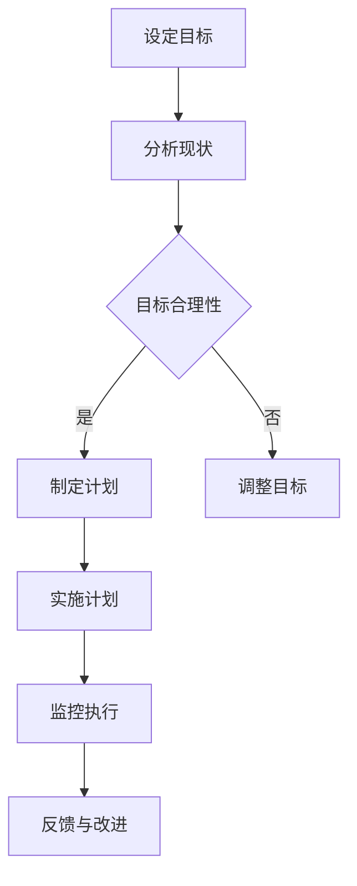
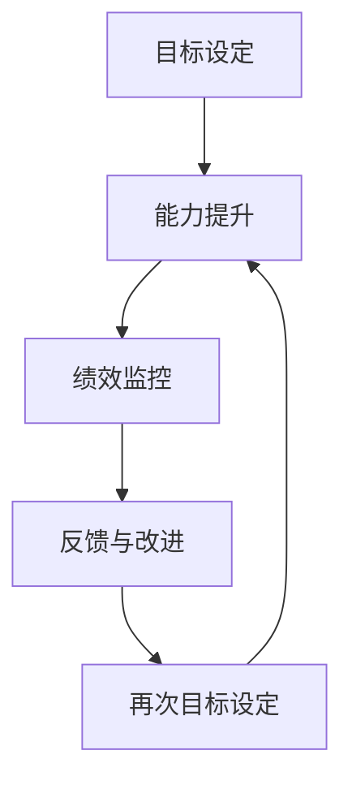
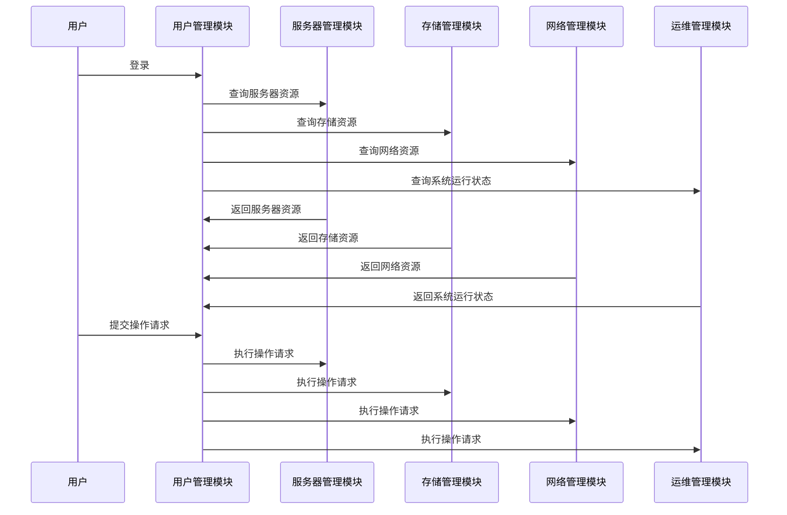

                 

# 领导力与绩效改进：持续提升团队表现的技巧

> 关键词：领导力、绩效改进、团队协作、激励机制、目标设定

> 摘要：本文将探讨如何通过领导力提升团队绩效，并通过实际案例和算法原理讲解，阐述绩效改进的方法和技巧。本文旨在为IT领域从业者提供一套实用的指导方案，帮助团队实现持续提升。

## 第一部分：背景介绍

在当今的快节奏工作环境中，团队的表现和领导力已经成为影响企业绩效的重要因素。然而，许多领导者和团队成员往往面临着如何提高团队绩效的挑战。团队成员之间的沟通不畅、目标不明确、缺乏团队合作精神等问题，常常导致团队绩效低下。同时，领导者在提升团队表现时也面临着激励员工、培养团队协作等方面的难题。

为了解决上述问题，我们需要引入领导力与绩效改进的理论和实践技巧，通过有效的领导力提升团队绩效，同时提高团队成员的工作满意度和团队凝聚力。本文将主要关注在组织内部如何通过领导力提升团队表现，以及绩效改进的相关方法和工具，适用于各类组织和企业。

### 第一部分：核心概念与联系

#### 1.2 领导力定义与特点

领导力是指个人或群体在组织内通过影响力引导他人达成目标的能力。领导力具有以下特点：

1. **导向性**：领导者通过设定目标，为团队成员指引方向，确保团队朝着共同的目标前进。
2. **激励性**：领导者通过激发团队成员的内在动机，提高其工作积极性和创造力。
3. **影响力**：领导者通过影响团队成员的行为和态度，推动团队实现目标。
4. **合作性**：领导者鼓励团队成员之间的合作，共同解决问题，实现团队目标。
5. **变革性**：领导者具备推动组织变革的能力，使组织能够适应外部环境的变化。

#### 1.3 绩效改进概念与模型

绩效改进是指通过系统化的方法提高个体、团队和组织绩效的过程。绩效改进模型包括以下四个关键环节：

1. **目标设定**：明确团队的目标和期望，确保团队成员对目标的共同理解。
2. **能力提升**：通过培训和发展，提高团队成员的技能和能力，以满足绩效目标的要求。
3. **绩效监控**：定期跟踪团队成员的工作表现，及时发现问题并进行调整。
4. **反馈与改进**：通过反馈机制，及时向团队成员传达绩效结果，并提供改进建议。

#### 1.4 概念属性特征对比表格

| 概念       | 定义                                                         | 关键特点                       |
|------------|------------------------------------------------------------|-------------------------------|
| 领导力     | 通过影响力引导他人达成目标的能力                             | 导向性、激励性、影响力         |
| 绩效改进   | 通过系统化的方法提高个体、团队和组织绩效的过程               | 目标设定、能力提升、绩效监控   |
| 团队协作   | 团队成员在共同目标下相互支持、协同工作                       | 合作性、共同目标、相互信任     |
| 激励机制   | 通过奖励和认可来激发员工的工作积极性和创造力                  | 激励性、公平性、个性化         |

#### 1.5 ER实体关系图架构

```mermaid
erDiagram
  User ||--|{ Team }|-- Member
  Team ||--|{ Project }|-- Project
  Project ||--|{ Task }|-- Task
  Task ||--|{ User }|-- Assignee
```

## 第二部分：算法原理讲解

### 第二部分：算法原理讲解

#### 2.1 领导力提升算法原理

##### 2.1.1 Mermaid流程图



##### 2.1.2 Python源代码

```python
def lead_improvement(target, current_state):
    if is_reasonable(target):
        plan = create_plan(target, current_state)
        execute_plan(plan)
        monitor_execution()
        feedback_and_improvement()
    else:
        target = adjust_target(target, current_state)
        lead_improvement(target, current_state)

def is_reasonable(target):
    # 判断目标是否合理
    pass

def create_plan(target, current_state):
    # 制定计划
    pass

def execute_plan(plan):
    # 实施计划
    pass

def monitor_execution():
    # 监控执行
    pass

def feedback_and_improvement():
    # 反馈与改进
    pass
```

##### 2.1.3 算法原理详细讲解

领导力提升算法的核心目标是通过对团队目标、计划、执行和反馈的不断迭代，实现团队绩效的持续提升。以下是算法原理的详细讲解：

1. **设定目标**：首先，领导者需要与团队成员共同设定明确、具体和可衡量的目标。目标应具有挑战性，同时也要符合团队成员的能力和资源。

   $$ 目标 = f(团队成员能力，资源，挑战性) $$

2. **分析现状**：在设定目标后，领导者需要分析当前团队的工作现状，包括团队成员的能力、工作环境、资源分配等方面。

   $$ 当前状态 = f(团队成员能力，工作环境，资源分配) $$

3. **目标合理性判断**：通过分析当前状态，领导者需要判断设定的目标是否合理。如果目标不合理，需要调整目标，使其更符合团队实际情况。

   $$ 目标合理性 = is_reasonable(目标，当前状态) $$

4. **制定计划**：在目标合理的情况下，领导者需要制定详细的实施计划，包括具体的行动步骤、时间安排和责任人。

   $$ 计划 = create_plan(目标，当前状态) $$

5. **实施计划**：按照制定好的计划，团队成员需要分工合作，共同实施计划。

   $$ 实施计划 = execute_plan(计划) $$

6. **监控执行**：在实施计划的过程中，领导者需要实时监控执行情况，确保计划按计划进行。

   $$ 监控执行 = monitor_execution() $$

7. **反馈与改进**：在计划执行结束后，领导者需要收集团队成员的反馈，并根据反馈对计划进行改进。

   $$ 反馈与改进 = feedback_and_improvement() $$

通过以上步骤，领导力提升算法可以帮助团队实现目标的持续迭代和优化，从而不断提升团队绩效。

#### 2.2 绩效改进算法原理

##### 2.2.1 Mermaid流程图



##### 2.2.2 Python源代码

```python
def performance_improvement():
    target = set_target()
    capability = enhance_capability(target)
    monitor_performance(capability)
    feedback = collect_feedback()
    improvement = improve_performance(feedback)
    set_target(improvement)

def set_target():
    # 设定目标
    pass

def enhance_capability(target):
    # 提升能力
    pass

def monitor_performance(capability):
    # 绩效监控
    pass

def collect_feedback():
    # 收集反馈
    pass

def improve_performance(feedback):
    # 提升绩效
    pass
```

##### 2.2.3 算法原理详细讲解

绩效改进算法的核心目标是通过对目标设定、能力提升、绩效监控和反馈改进的不断迭代，实现个体和团队绩效的持续提升。以下是算法原理的详细讲解：

1. **目标设定**：首先，个体或团队需要设定明确、具体和可衡量的目标。

   $$ 目标 = f(个体或团队能力，资源，挑战性) $$

2. **能力提升**：在目标设定后，个体或团队需要通过培训和发展，提升自身的能力，以满足目标的要求。

   $$ 能力提升 = enhance_capability(目标) $$

3. **绩效监控**：在能力提升过程中，个体或团队需要定期对绩效进行监控，以确保绩效目标的实现。

   $$ 绩效监控 = monitor_performance(能力提升) $$

4. **反馈与改进**：在绩效监控结束后，个体或团队需要收集绩效反馈，并根据反馈对绩效进行改进。

   $$ 反馈与改进 = improve_performance(反馈) $$

5. **再次目标设定**：在绩效改进后，个体或团队需要重新设定目标，继续进行下一轮的能力提升和绩效监控。

   $$ 再次目标设定 = set_target(反馈与改进) $$

通过以上步骤，绩效改进算法可以帮助个体和团队实现绩效的持续迭代和优化，从而不断提升绩效。

### 第三部分：系统分析与架构设计方案

#### 3.1 问题场景介绍

假设我们是一家IT公司的团队，负责开发一款高性能的云计算平台。为了确保项目的成功，我们需要提高团队的表现和绩效。因此，我们决定引入领导力和绩效改进的理论和方法，以提升团队的整体能力。

#### 3.2 项目介绍

项目名称：高性能云计算平台开发

项目目标：开发一款具有高性能、高可用性和高安全性的云计算平台，满足客户的需求。

项目范围：包括服务器架构、存储架构、网络架构和运维管理等。

项目周期：预计12个月。

#### 3.3 系统功能设计

系统功能设计包括以下关键模块：

1. **用户管理模块**：负责管理用户信息、权限和角色。
2. **服务器管理模块**：负责管理服务器资源，包括监控、调度和故障处理。
3. **存储管理模块**：负责管理存储资源，包括数据备份、恢复和数据迁移。
4. **网络管理模块**：负责管理网络资源，包括带宽调整、防火墙配置和安全监控。
5. **运维管理模块**：负责监控和管理系统的运行状态，包括日志分析、故障排查和性能优化。

#### 3.4 系统架构设计

系统架构设计采用分层架构，包括以下层次：

1. **表示层**：负责与用户交互，提供Web界面和API接口。
2. **业务逻辑层**：负责处理业务逻辑，包括用户管理、服务器管理、存储管理和网络管理。
3. **数据访问层**：负责与数据库交互，实现数据的持久化存储。
4. **基础设施层**：负责提供系统运行所需的基础设施，包括服务器、存储和网络设备。

#### 3.5 系统接口设计

系统接口设计包括以下关键接口：

1. **用户接口**：提供Web界面和API接口，供用户访问和使用系统功能。
2. **服务接口**：提供内部服务接口，供业务逻辑层和基础设施层之间的通信。
3. **数据库接口**：提供与数据库交互的接口，实现数据的持久化存储。
4. **消息队列接口**：提供与消息队列交互的接口，实现异步消息传递。

#### 3.6 系统交互

系统交互设计采用序列图，描述系统各组件之间的交互过程。



### 第四部分：项目实战

#### 4.1 环境安装

1. **操作系统**：安装Ubuntu 20.04 LTS操作系统。
2. **Python**：安装Python 3.8版本。
3. **虚拟环境**：使用virtualenv创建Python虚拟环境。

   ```bash
   pip install virtualenv
   virtualenv venv
   source venv/bin/activate
   ```

4. **依赖包**：安装项目所需的依赖包。

   ```bash
   pip install -r requirements.txt
   ```

#### 4.2 系统核心实现

1. **用户管理模块**：实现用户注册、登录和权限管理功能。

   ```python
   # user_management.py
   def register(username, password):
       # 注册用户
       pass

   def login(username, password):
       # 登录用户
       pass

   def authenticate(username, password):
       # 验证用户身份
       pass
   ```

2. **服务器管理模块**：实现服务器资源监控、调度和故障处理功能。

   ```python
   # server_management.py
   def monitor_servers():
       # 监控服务器资源
       pass

   def schedule_servers():
       # 调度服务器资源
       pass

   def handle_server_failures():
       # 处理服务器故障
       pass
   ```

3. **存储管理模块**：实现存储资源监控、备份和恢复功能。

   ```python
   # storage_management.py
   def monitor_storage():
       # 监控存储资源
       pass

   def backup_storage():
       # 备份存储资源
       pass

   def restore_storage():
       # 恢复存储资源
       pass
   ```

4. **网络管理模块**：实现网络资源监控、调整和安全监控功能。

   ```python
   # network_management.py
   def monitor_network():
       # 监控网络资源
       pass

   def adjust_bandwidth():
       # 调整带宽
       pass

   def monitor_security():
       # 监控网络安全
       pass
   ```

5. **运维管理模块**：实现系统运行状态监控、故障排查和性能优化功能。

   ```python
   # operations_management.py
   def monitor_system():
       # 监控系统运行状态
       pass

   def handle_f

