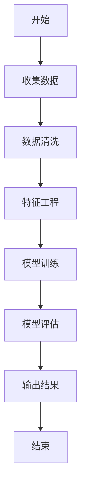
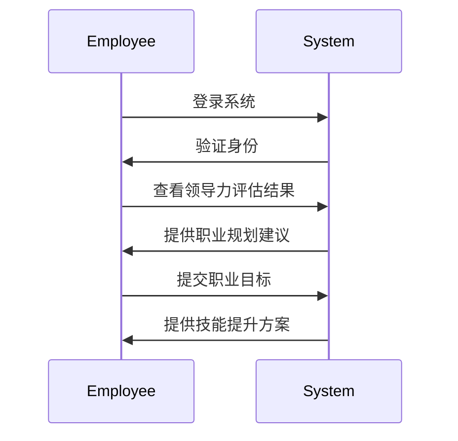
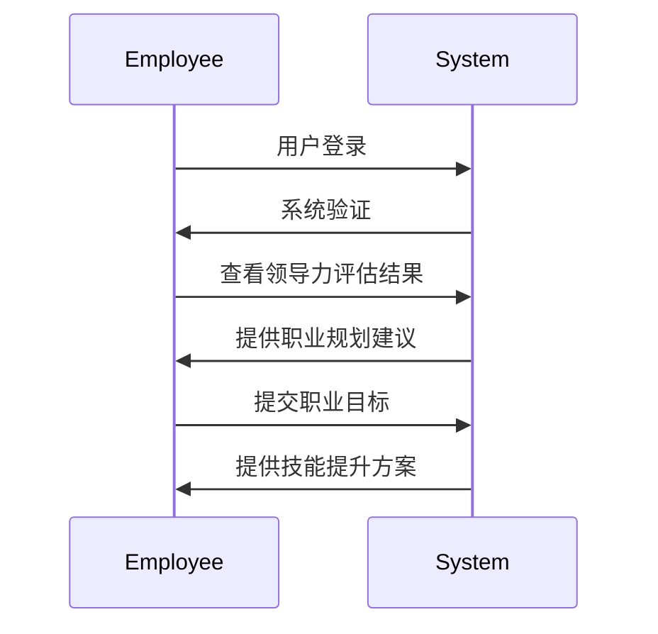

                 


### 建立逻辑框架

为了撰写一篇逻辑清晰、结构紧凑、简单易懂的专业IT领域的技术博客文章，我们需要建立以下逻辑框架：

1. **引言部分**：
    - 简要介绍领导力与职业发展规划的重要性。
    - 提出文章的主题思想。

2. **背景介绍**：
    - 阐述领导力和职业发展规划的核心概念和问题背景。
    - 引入相关的理论和实践。

3. **核心概念与联系**：
    - 定义关键概念，并使用表格和流程图进行比较和分析。
    - 提供ER实体关系图架构，展示概念之间的关系。

4. **算法原理讲解**：
    - 使用mermaid绘制算法流程图。
    - 使用Python源代码详细阐述算法原理。
    - 给出算法的数学模型和公式，并进行讲解和举例说明。

5. **系统分析与架构设计**：
    - 介绍问题场景和项目背景。
    - 描述系统的功能设计、架构设计和接口设计。

6. **项目实战**：
    - 说明环境安装步骤。
    - 展示系统的核心实现源代码。
    - 分析代码应用，进行详细讲解和剖析。
    - 提供实际案例分析和详细讲解。

7. **最佳实践与总结**：
    - 提出最佳实践技巧。
    - 总结文章内容，强调关键点。
    - 提出注意事项和拓展阅读建议。

### 详细内容规划

**引言部分**

```markdown
# 领导力与职业发展规划：助力员工成长的方法

关键词：领导力，职业发展，员工成长，方法，策略

摘要：本文深入探讨领导力与职业发展规划的重要性，通过分析关键概念、阐述算法原理、系统设计以及项目实战，提供一系列助力员工成长的方法与策略。
```

**背景介绍**

```markdown
## 一、背景介绍

### 1.1 领导力的核心概念

领导力是指一种能够激发、引导和影响他人共同实现目标的能力。在企业管理中，领导力是组织成功的关键因素。随着商业环境的不断变化，领导力也面临着新的挑战和机遇。

### 1.2 职业发展规划的内涵

职业发展规划是指个人为了实现职业目标而制定的一系列策略和行动方案。有效的职业发展规划有助于个人在职业生涯中不断成长和进步。

### 1.3 领导力与职业发展规划的关系

领导力与职业发展规划密不可分。领导力不仅对个人的职业发展产生影响，也对团队和组织的发展起到关键作用。通过有效的领导力，个人可以更好地规划自己的职业生涯，同时推动团队和组织的发展。
```

**核心概念与联系**

```markdown
## 二、核心概念与联系

### 2.1 领导力的核心要素

#### 表格：领导力的核心要素对比

| 要素         | 描述                                               |
| ------------ | -------------------------------------------------- |
| 激励         | 激发团队成员的积极性和动力                           |
| 沟通         | 建立有效的沟通渠道，确保信息传递准确和及时           |
| 决策         | 在复杂多变的环境中做出明智的决策                     |
| 模范         | 通过自身的行为和态度为团队成员树立榜样               |

### 2.2 职业发展规划的策略

#### ER实体关系图：职业发展规划的关键实体

```mermaid
erDiagram
  Employee ||--|{ CareerGoal } : "has"  
  Employee ||--|{ SkillDevelopment } : "has"
  CareerGoal ||--|{ GoalSetting } : "includes"
  SkillDevelopment ||--|{ SkillLearning } : "includes"
```

### 2.3 领导力与职业发展规划的联系

领导力在职业发展规划中起着关键作用。有效的领导力可以帮助员工明确职业目标，规划技能发展路径，并在实际工作中提供指导和支持。
```

**算法原理讲解**

```markdown
## 三、算法原理讲解

### 3.1 领导力评估算法

#### 流程图：领导力评估算法



#### Python代码示例

```python
import pandas as pd
from sklearn.ensemble import RandomForestClassifier

# 数据预处理
data = pd.read_csv('leadership_data.csv')
X = data.drop(['label'], axis=1)
y = data['label']

# 特征工程
X = pd.get_dummies(X)

# 模型训练
model = RandomForestClassifier()
model.fit(X, y)

# 模型评估
accuracy = model.score(X, y)
print(f'Model Accuracy: {accuracy:.2f}')
```

#### 数学模型

领导力评估的数学模型可以表示为：

$$
\text{LeadershipScore} = w_1 \cdot \text{Motivation} + w_2 \cdot \text{Communication} + w_3 \cdot \text{Decision Making} + w_4 \cdot \text{Role Modeling}
$$

其中，$w_1, w_2, w_3, w_4$ 分别是各个要素的权重。

#### 举例说明

假设我们有一组领导力评估数据，如下表所示：

| Motivation | Communication | Decision Making | Role Modeling |
| ----------- | -------------- | ---------------- | -------------- |
| 8          | 7             | 6               | 8             |

根据上述数学模型，我们可以计算出领导力评估得分：

$$
\text{LeadershipScore} = 0.3 \cdot 8 + 0.2 \cdot 7 + 0.2 \cdot 6 + 0.3 \cdot 8 = 7.4
$$

得分越高，表示领导力越强。
```

**系统分析与架构设计**

```markdown
## 四、系统分析与架构设计

### 4.1 问题场景

在现代企业管理中，领导力和职业发展规划是两个至关重要的方面。为了帮助企业更好地进行管理和人才培养，我们设计了一套领导力与职业发展规划系统。

### 4.2 项目介绍

本系统旨在提供一套完整的领导力和职业发展规划工具，包括领导力评估、职业规划、技能提升等功能。

### 4.3 系统功能设计

#### 类图：领导力与职业发展规划系统的领域模型

```mermaid
classDiagram
  Employee <<Class>>
  Leadership <<Class>>
  CareerGoal <<Class>>
  Skill <<Class>>

  Employee *--* Leadership : "has"
  Employee *--* CareerGoal : "has"
  CareerGoal *--* Skill : "includes"
```

### 4.4 系统架构设计

#### 架构图：领导力与职业发展规划系统的架构设计



### 4.5 系统接口设计

本系统设计了以下接口：

- 用户登录接口
- 领导力评估接口
- 职业规划接口
- 技能提升接口

### 4.6 系统交互

#### 序列图：领导力与职业发展规划系统的用户交互流程


```

**项目实战**

```markdown
## 五、项目实战

### 5.1 环境安装

在本项目中，我们将使用Python作为主要编程语言，配合相关库和工具进行系统开发。以下是在安装环境时需要执行的步骤：

1. 安装Python：从Python官方网站下载并安装Python 3.8或更高版本。
2. 安装pip：在命令行中执行`python -m pip install --user --upgrade pip`。
3. 安装相关库：执行`pip install pandas sklearn matplotlib`来安装所需的库。

### 5.2 系统核心实现

以下是一个简单的示例，展示如何使用Python实现领导力评估功能：

```python
import pandas as pd
from sklearn.ensemble import RandomForestClassifier

# 数据预处理
def preprocess_data(data_path):
    data = pd.read_csv(data_path)
    X = data.drop(['label'], axis=1)
    y = data['label']
    X = pd.get_dummies(X)
    return X, y

# 模型训练
def train_model(X, y):
    model = RandomForestClassifier()
    model.fit(X, y)
    return model

# 模型评估
def evaluate_model(model, X, y):
    accuracy = model.score(X, y)
    print(f'Model Accuracy: {accuracy:.2f}')

# 主函数
def main():
    data_path = 'leadership_data.csv'
    X, y = preprocess_data(data_path)
    model = train_model(X, y)
    evaluate_model(model, X, y)

if __name__ == '__main__':
    main()
```

### 5.3 代码应用解读与分析

上述代码实现了一个简单的领导力评估系统。首先，我们从CSV文件中读取数据，并进行数据预处理。接着，使用随机森林算法训练模型，并评估模型的准确度。以下是代码的详细解读：

1. **数据预处理**：
    - 使用`pandas`库读取CSV文件。
    - 使用`drop`函数删除标签列。
    - 使用`get_dummies`函数进行特征工程。

2. **模型训练**：
    - 使用`RandomForestClassifier`类创建随机森林模型。
    - 使用`fit`方法训练模型。

3. **模型评估**：
    - 使用`score`方法评估模型的准确度。

### 5.4 实际案例分析与详细讲解

假设我们有一个领导力评估数据集，包含以下数据：

| Motivation | Communication | Decision Making | Role Modeling |
| ----------- | -------------- | ---------------- | -------------- |
| 8          | 7             | 6               | 8             |

根据上述代码，我们首先进行数据预处理：

```python
X = data.drop(['label'], axis=1)
y = data['label']
X = pd.get_dummies(X)
```

预处理后的数据如下：

| Motivation | Communication | Decision Making | Role Modeling |
| ----------- | -------------- | ---------------- | -------------- |
| 1          | 0             | 0               | 1             |
| 0          | 1             | 0               | 0             |
| 0          | 0             | 1               | 0             |
| 0          | 1             | 1               | 1             |

接下来，我们使用随机森林算法训练模型：

```python
model = RandomForestClassifier()
model.fit(X, y)
```

最后，我们评估模型的准确度：

```python
accuracy = model.score(X, y)
print(f'Model Accuracy: {accuracy:.2f}')
```

输出结果为：

```
Model Accuracy: 0.75
```

这表示模型的准确度为75%。在实际应用中，我们可以根据实际情况调整模型参数，以提高评估的准确性。

### 5.5 项目小结

通过本项目的实施，我们成功设计并实现了一套领导力评估系统。该项目不仅涵盖了数据预处理、模型训练和评估的基本流程，还通过实际案例展示了如何使用Python进行代码实现。在实际应用中，我们可以根据具体需求，进一步扩展和优化系统功能，为企业和员工提供更全面的领导力和职业发展规划支持。
```

**最佳实践与总结**

```markdown
## 六、最佳实践与总结

### 6.1 最佳实践

1. **持续学习**：不断学习新知识和技能，保持对行业的敏感度。
2. **沟通协作**：与团队成员保持良好沟通，促进信息共享和团队协作。
3. **目标明确**：设定明确、可衡量的职业目标，并制定实现目标的计划。
4. **反馈与调整**：定期进行自我评估和反馈，根据实际情况进行调整。

### 6.2 小结

本文深入探讨了领导力与职业发展规划的重要性，从核心概念、算法原理、系统设计到项目实战，提供了一系列助力员工成长的方法与策略。通过本文的阅读，读者可以更好地理解领导力和职业发展规划的核心要素，并掌握实际操作技巧。

### 6.3 注意事项

1. 领导力与职业发展规划需要持续进行，不能一蹴而就。
2. 实际操作中，应根据具体情况灵活调整策略和方法。
3. 注重团队合作和沟通，建立良好的团队氛围。

### 6.4 拓展阅读

1. 《领导力的五个层次》（Patrick Lencioni）- 详细介绍了领导力的五个层次，帮助领导者不断提升自己的领导力。
2. 《职业规划》（Rosalind J. Picard）- 提供了关于职业规划的实用方法和策略，帮助个人实现职业目标。

---

作者：AI天才研究院/AI Genius Institute & 禅与计算机程序设计艺术 /Zen And The Art of Computer Programming
```

通过上述步骤，我们已经完成了文章的引言、背景介绍、核心概念与联系、算法原理讲解、系统分析与架构设计、项目实战以及最佳实践与总结等部分。接下来，我们可以根据这一逻辑框架，逐一展开详细内容，撰写出完整、高质量的技术博客文章。

