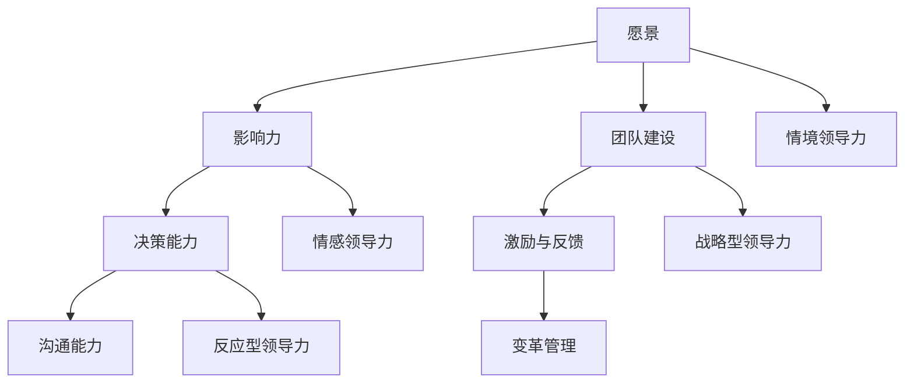
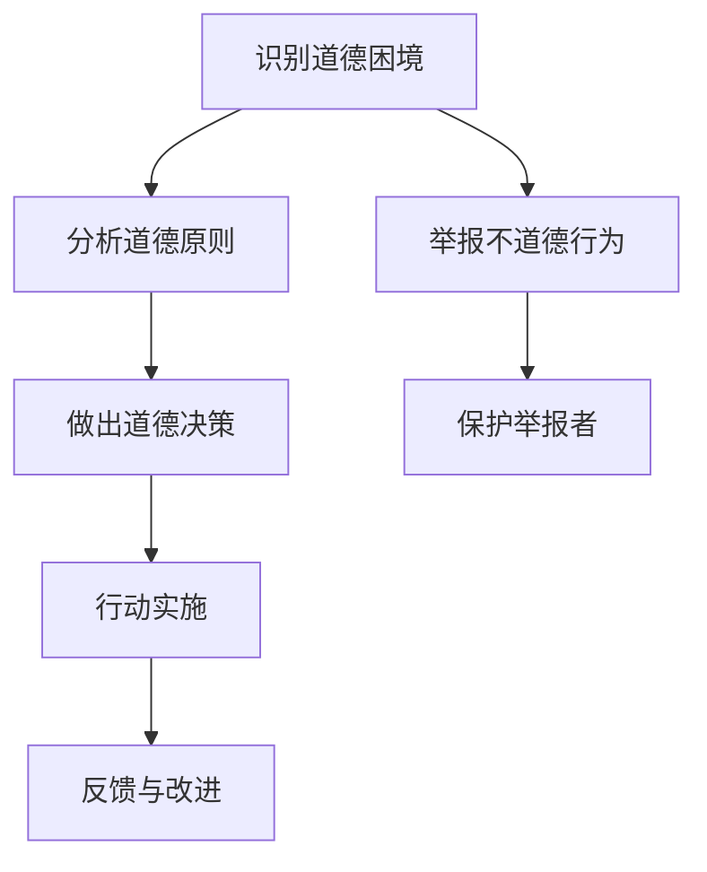
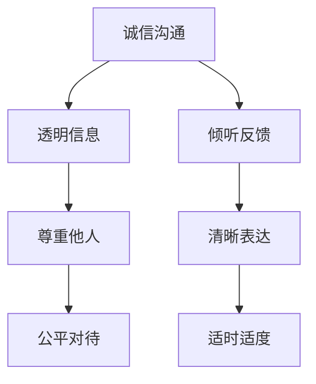

                 

### 引言：领导力与职业道德的重要性

在现代信息技术飞速发展的背景下，IT行业已经成为推动社会进步的重要力量。然而，随着技术的进步，IT行业也面临着前所未有的挑战，其中领导力与职业道德的问题显得尤为突出。本文旨在探讨领导力与职业道德在IT行业中的重要性，并分析如何通过树立正直可靠的形象来应对这些挑战。

首先，我们需要明确什么是领导力。领导力并不仅仅指在组织或团队中拥有权威和权力，更重要的是激发团队成员的潜力，带领团队实现共同目标的能力。在IT行业，领导力表现为能够引领团队创新、应对技术变革、提升团队效率和推动组织文化发展。而职业道德则是在职业活动中遵循的道德规范和行为准则，它是确保行业健康发展、保护消费者权益、提升个人职业形象的基础。

为什么领导力和职业道德在IT行业如此重要？首先，领导力直接影响组织的创新能力和市场竞争力。一个优秀的领导者能够通过有效的团队管理和激励，使团队在技术前沿保持领先地位。其次，职业道德是维护行业声誉和社会信任的关键。随着信息泄露和数据隐私问题日益严重，职业道德在保护用户数据安全和维护行业信誉方面发挥着至关重要的作用。

然而，IT行业的快速发展也带来了一些挑战。一方面，技术更新迅速，要求从业者不断学习新知识、掌握新技术；另一方面，竞争激烈，一些从业者为了短期利益可能会忽视职业道德，从而导致一系列问题，如信息安全漏洞、数据泄露和职业操守失范等。

因此，本文将从以下几个方面展开讨论：

1. **领导力的基本概念**：介绍领导力的定义、核心要素和其重要性。
2. **职业道德的伦理原则**：探讨职业道德的起源、基本原则及其在实践中的应用。
3. **树立正直可靠的形象**：分析如何在工作环境中树立正直的行为标准。
4. **沟通与职业道德**：讨论沟通在领导力中的作用，以及如何在沟通中保持职业道德。
5. **职业道德在领导实践中的应用**：探讨领导者如何树立道德榜样，以及如何应对道德困境。
6. **职业道德与法律法规**：分析法律法规对职业道德的影响，以及如何平衡合规与道德责任。
7. **职业道德案例研究**：通过案例分析，提供实际操作中的道德启示。
8. **结论**：总结领导力与职业道德的关键因素，并展望未来发展的方向。

通过以上各章节的详细讨论，本文希望能够为IT行业的领导者和管理者提供一些有价值的思考和实用建议，帮助他们在领导实践中树立正直可靠的形象，从而推动IT行业的健康发展。

### 领导力的基本概念

领导力是一个复杂且多维的概念，它不仅仅指在组织或团队中拥有权威和权力，更重要的是通过激发和引导团队成员，实现共同目标的能力。首先，我们来定义什么是领导力。根据管理学大师彼得·德鲁克（Peter Drucker）的观点，领导力是指“通过其他人去完成工作的能力”。这个定义强调了领导者需要依赖和引导团队成员来达成目标，而不是单纯依靠自身的权威。

领导力的核心要素包括以下几个方面：

1. **愿景**：一个优秀的领导者必须具备清晰且具有吸引力的愿景。愿景不仅为团队指引方向，也为团队成员提供了奋斗的目标。例如，苹果公司的史蒂夫·乔布斯（Steve Jobs）以其独特的产品愿景引领公司走向成功。

2. **影响力**：领导力不仅仅是职位赋予的权威，更多的是通过个人魅力和道德影响力来影响他人。影响力来自于领导者的专业知识、领导风格、沟通能力和人际关系。

3. **团队建设**：领导者需要建立高效、和谐且充满动力的团队。这包括选拔合适的团队成员、培养团队成员的技能和提升团队的协作能力。

4. **决策能力**：领导者在面对复杂问题和不确定性时，需要能够做出明智的决策。决策能力体现在对信息的分析、风险评估和快速反应等方面。

5. **激励与反馈**：领导者需要能够激励团队成员，同时提供及时的反馈，以帮助团队成员成长和改进。

6. **沟通能力**：有效的沟通是领导力的关键。领导者需要具备清晰、简洁且富有感染力的表达能力，同时也要善于倾听和理解团队成员的意见和需求。

7. **变革管理**：在技术快速变革的IT行业，领导者需要具备推动组织变革的能力。这包括对变革的适应性、变革策略的制定和变革过程中的领导。

接下来，我们通过一个简单的表格来对比几个常见的领导力概念和特征：

| 领导力概念       | 特征                                       |
|------------------|-------------------------------------------|
| 情境领导力       | 领导者根据不同情境采取不同的领导风格       |
| 情感领导力       | 领导者注重团队成员的情感需求和心理状态     |
| 变革型领导力     | 领导者通过激励和启发推动组织变革           |
| 反应型领导力     | 领导者根据外部环境变化做出反应             |
| 战略型领导力     | 领导者具备长远的规划和决策能力             |

最后，我们通过一个简单的Mermaid流程图来展示领导力的核心要素及其相互关系：



通过这个流程图，我们可以看到领导力的各个核心要素如何相互关联，共同构成了一个综合的领导能力体系。在接下来的章节中，我们将深入探讨职业道德的伦理原则，以及如何在实际工作中树立正直可靠的形象。

### 职业道德的伦理原则

职业道德是职业活动中所遵循的道德规范和行为准则，它为从业者在复杂多变的工作环境中提供了行为指南。职业道德的起源可以追溯到古代社会的职业伦理，如医生的“希波克拉底誓言”和律师的职业道德准则。然而，随着现代社会的发展，职业道德的内涵和外延也在不断扩展和深化。

首先，我们来探讨职业道德的基本原则。职业道德的伦理原则主要包括以下几个方面：

1. **诚信**：诚信是职业道德的核心，要求从业者在工作中保持真实、透明和正直。诚信不仅体现在对信息的披露和报告，也体现在对工作的认真和负责。

2. **责任**：责任是指从业者在工作中的义务和担当。责任原则要求从业者在面对职业责任时，要勇于承担，不推诿、不逃避。责任原则还包括对工作成果的质量负责、对团队成员的安全负责。

3. **公正**：公正是指从业者在工作中要公平对待所有相关方，不偏袒、不歧视。公正原则体现在对工作机会的分配、对工作成果的评估和对资源的分配等方面。

4. **尊重**：尊重是指从业者在工作中要尊重他人的权利和尊严。尊重原则要求从业者尊重团队成员的意见和决策、尊重客户的需求和隐私、尊重法律法规和社会规范。

5. **专业**：专业是指从业者在工作中要具备专业的知识和技能，并遵循专业规范。专业原则要求从业者不断学习新知识、提升自身能力，以更好地为组织和客户服务。

接下来，我们将通过一个简单的表格来对比这些职业道德的基本原则：

| 基本原则 | 特征 |
|----------|------|
| 诚信     | 保持真实、透明和正直 |
| 责任     | 勇于承担职业责任 |
| 公正     | 公平对待相关方 |
| 尊重     | 尊重他人的权利和尊严 |
| 专业     | 具备专业知识和技能 |

为了更好地理解职业道德的原理，我们还可以通过一个ER（实体关系）图来展示职业道德概念之间的相互关系：

```mermaid
erDiagram
    Class Employee {
        attr id INT, name STRING
    }
    Class Ethics {
        attr rule TEXT
    }
    Employee ||--|{ Ethics } Ethics
```

这个ER图表明，职业道德（Ethics）与员工（Employee）之间存在关联。每位员工都需要遵循职业道德规范（Ethics），而这些规范则为员工提供了行为准则。

在具体应用中，职业道德的伦理原则可以体现在以下几个方面：

1. **工作中的决策**：从业者在面对工作决策时，应考虑是否符合职业道德原则，是否有利于组织的长远发展。

2. **项目管理**：在项目管理中，职业道德原则要求项目经理公正、透明地分配任务和资源，同时确保项目成果的质量。

3. **团队合作**：在团队合作中，职业道德原则要求团队成员相互尊重、诚信合作，共同达成团队目标。

4. **客户关系**：在客户关系中，职业道德原则要求从业者为客户保密、提供真实信息，维护客户权益。

通过这些具体应用，我们可以看到职业道德的伦理原则如何在实际工作中发挥作用，确保职业行为的规范性，提升组织的公信力和市场竞争力。在接下来的章节中，我们将深入探讨如何在工作中树立正直可靠的形象。

### 树立正直可靠的形象

树立正直可靠的形象是职业发展中至关重要的一环，尤其在信息技术领域，这个形象更是成为员工和企业赢得信任和尊重的关键。那么，如何在工作和生活中树立这样的形象呢？我们可以从以下几个方面来探讨：

首先，正直的定义不仅仅是遵守道德规范，更是一种内心深处坚守的信念。正直的人在面对诱惑时能够保持清醒的头脑，坚守原则，不受外界干扰。在IT行业中，正直表现为遵守职业操守，不泄露客户机密，不滥用技术手段，不参与任何违法活动。

为了在工作环境中树立正直可靠的形象，我们可以采取以下具体措施：

1. **树立诚信价值观**：诚信是正直的基石。无论是在工作汇报、项目合作还是日常沟通中，都要确保信息的真实性和透明度。例如，在编写代码时，要如实记录每一行的修改者，避免抄袭和侵权行为。

2. **行为一致**：言行一致是树立正直形象的重要方式。领导者应以身作则，始终遵循职业道德标准，做到说到做到。团队成员也会因此受到激励，更加愿意遵守职业道德。

3. **积极参与职业道德培训**：组织应定期开展职业道德培训，提高员工对职业道德的认识和理解。通过培训，员工可以学习到更多正直行为的案例和应对不道德行为的策略。

4. **建立举报机制**：企业应建立畅通的举报渠道，让员工可以匿名举报任何不道德行为。这不仅能有效遏制不道德行为的发生，也能保护举报者的权益。

5. **培养批判性思维**：在面临道德困境时，能够运用批判性思维进行分析和决策。例如，在数据隐私保护方面，员工需要权衡数据的利用和保护，做出符合职业道德的决定。

为了更直观地理解如何树立正直可靠的形象，我们可以通过一个流程图来展示这一过程：



这个流程图展示了从识别道德困境到反馈与改进的完整过程。通过这个过程，员工可以在工作中不断调整和优化自己的行为，逐步树立正直可靠的形象。

接下来，我们通过一个具体的案例来进一步说明如何在工作中避免不道德行为。

**案例：数据隐私保护**

某公司的数据分析师小张在一次项目中，被要求利用公司客户的数据进行市场分析，以便为公司提供商业建议。然而，公司并没有获得这些客户的明确同意，也没有与客户签署相关的数据使用协议。小张意识到这是一个道德困境，因为未经客户同意使用其数据可能违反了职业道德和法律法规。

**分析过程**：

1. **识别道德困境**：小张首先识别出这是一个涉及数据隐私的问题，涉及到职业道德和法律法规的边界。

2. **分析道德原则**：小张回顾了职业道德的相关原则，如诚信、责任和尊重，认为未经同意使用客户数据不符合这些原则。

3. **做出道德决策**：小张决定不参与这项工作，并向管理层反映了这一情况。

4. **行动实施**：小张通过内部邮件和面对面沟通，向管理层详细说明了问题的严重性，并建议公司采取正确的措施。

5. **反馈与改进**：管理层接受了小张的建议，决定停止这项工作，并进行了相关整改。

通过这个案例，我们可以看到小张在面对道德困境时，如何通过识别、分析、决策和行动来避免不道德行为，从而树立了正直可靠的形象。

总之，树立正直可靠的形象不仅需要个人在道德困境中做出正确的决策，还需要组织提供良好的支持和制度保障。只有在个人和组织共同努力下，才能在IT行业中建立起正直可靠的工作文化，推动行业的健康发展。

### 沟通与职业道德

在领导力中，沟通扮演着至关重要的角色。有效的沟通不仅能够确保团队成员之间的协作顺畅，还能够建立和维护团队的信任和道德标准。然而，沟通中的道德问题也是不可忽视的一环。本文将探讨沟通在领导力中的作用，以及如何在沟通中保持职业道德，同时提供一些实用的沟通技巧。

#### 沟通在领导力中的作用

1. **建立信任**：信任是团队协作的基础，而沟通是建立信任的关键。通过开放的沟通，领导者可以展示透明和诚信，从而赢得团队成员的信任。

2. **促进协作**：有效的沟通能够确保团队成员理解任务目标、工作流程和职责分工，从而提高团队的协作效率和执行力。

3. **传递愿景**：领导者需要通过沟通将组织的愿景和目标传递给团队成员，激发他们的工作热情和归属感。

4. **反馈与改进**：通过沟通，领导者可以及时获取团队成员的工作反馈，识别问题和改进点，从而不断提升团队的表现。

#### 沟通中的道德问题

1. **信息透明度**：领导者应当确保信息的透明度，避免隐瞒重要信息或误导团队成员。不透明和虚假信息可能会导致团队成员之间的不信任和误解。

2. **隐私保护**：在沟通过程中，领导者需要尊重团队成员的隐私，不泄露敏感信息。这不仅涉及到职业道德，也涉及到法律法规。

3. **公平对待**：在沟通中，领导者应当公平对待每位团队成员，避免偏袒或歧视。不公平的沟通会破坏团队的凝聚力和工作效率。

#### 如何在沟通中保持职业道德

1. **诚信**：在沟通中，领导者应始终保持诚信，不夸大事实、不隐瞒信息、不误导团队成员。诚信是建立信任的基础。

2. **透明**：确保沟通的透明度，及时、准确地传达信息，避免误导和隐瞒。透明度有助于建立团队的信任，提高工作效率。

3. **尊重**：在沟通中，领导者应尊重团队成员的意见和决策，鼓励开放讨论，营造一个包容、尊重的氛围。

4. **公平**：在沟通中，领导者应公平对待每位团队成员，避免偏袒或歧视，确保每位成员都有发言和参与决策的机会。

#### 沟通技巧的道德考量

1. **倾听**：倾听是有效沟通的关键。领导者应当耐心倾听团队成员的意见和反馈，不仅关注表面意见，还要深入理解背后的动机和需求。

2. **反馈**：给予团队成员及时的、建设性的反馈，可以帮助他们改进工作，同时也能增强团队的凝聚力。反馈时应避免批评和指责，而是注重事实和建议。

3. **表达清晰**：确保沟通表达清晰、简洁，避免使用模糊或歧义的语言。清晰的表达有助于减少误解和沟通障碍。

4. **适时适度**：选择适当的沟通时机和方式，避免不必要的打扰和干扰。适时适度的沟通能够提高沟通效率，减少冲突。

通过以上方法，领导者不仅能够在沟通中保持职业道德，还能提升团队的协作效率和工作氛围。以下是一个简单的Mermaid流程图，展示了如何在沟通中保持职业道德：



通过这个流程图，我们可以看到职业道德在沟通中的具体体现和实际应用。在接下来的章节中，我们将探讨职业道德在领导实践中的应用，分析领导者如何树立道德榜样，并在面对道德困境时做出正确决策。

### 职业道德在领导实践中的应用

职业道德在领导实践中的应用至关重要，它不仅决定了领导者的个人形象，也直接影响了团队的士气和组织的声誉。一个具备高尚职业道德的领导者，能够在复杂多变的工作环境中保持清晰的方向和坚定的信念，从而带领团队取得成功。以下我们将探讨职业道德在领导实践中的具体应用，分析领导者如何树立道德榜样，并探讨面对道德困境时的决策方法。

#### 领导者如何树立道德榜样

1. **以身作则**：领导者应当以身作则，通过自身的言行树立道德榜样。例如，在处理项目时，领导者应遵循职业道德原则，确保信息的透明度和公正性，以赢得团队成员的信任和尊重。

2. **培养正直行为**：领导者应鼓励团队成员在日常生活中保持正直行为，如诚实报告项目进展、遵守时间规定、尊重他人意见等。通过日常行为潜移默化地影响团队成员，形成良好的道德文化。

3. **建立道德规范**：领导者应制定明确的道德规范，并确保这些规范在组织内得到贯彻执行。例如，建立职业道德准则、制定保密协议、定期开展道德培训等，以规范团队成员的行为。

4. **关注团队成员的道德成长**：领导者应关注团队成员的道德成长，提供必要的支持和指导。通过定期的交流、反馈和培训，帮助团队成员理解职业道德的重要性，提升他们的道德素质。

#### 面对道德困境的决策

在领导实践中，领导者往往需要面对各种道德困境，如利益冲突、不正当竞争、隐私保护等问题。以下是一些应对道德困境的决策方法：

1. **伦理决策框架**：领导者可以采用伦理决策框架，如原则理论、义务理论、结果理论等，来分析道德困境。这些框架帮助领导者从不同角度审视问题，做出符合职业道德的决策。

2. **利益相关者分析**：在做出决策时，领导者应考虑所有利益相关者的权益，包括团队成员、客户、合作伙伴和公众。通过全面评估各方的利益，领导者可以做出更公正和合理的决策。

3. **咨询和反馈**：在面对道德困境时，领导者可以寻求同事、下属或外部专家的意见和建议。通过多方面的咨询和反馈，领导者可以更全面地了解问题的复杂性，从而做出更明智的决策。

4. **道德领导力培训**：为了更好地应对道德困境，领导者应积极参加道德领导力培训，提升自己的道德判断和决策能力。这些培训可以帮助领导者了解最新的道德理论和实践，从而更有效地解决道德问题。

#### 案例分析

下面我们通过一个具体案例来分析领导者如何在道德困境中做出正确决策。

**案例：项目利益冲突**

某IT公司的项目经理小王在负责一个重要项目时，发现项目合作伙伴的公司老板是他的好友小李。小李希望能够通过这个项目获得更多利益，但小王意识到这种利益冲突可能对项目产生负面影响，如决策不透明、资源分配不公等。

**分析过程**：

1. **识别道德困境**：小王首先识别出这是一个利益冲突问题，涉及到项目公正性和透明度。

2. **伦理决策框架**：小王采用结果理论进行分析，认为保持项目公正和透明是最终目标。于是，他决定采取一些措施来减少利益冲突的影响。

3. **利益相关者分析**：小王考虑了所有利益相关者的权益，包括公司、客户、团队成员和小李。他意识到，如果处理不当，可能会导致客户不信任、团队成员不满等问题。

4. **咨询和反馈**：小王与团队成员和公司高层进行了深入沟通，听取了他们的意见和建议。最终，小王决定采取以下措施：

   - 设立独立的项目评审委员会，确保项目决策的公正性。
   - 与小李明确划分职责，避免其直接参与项目关键决策。
   - 加强项目透明度，定期向团队成员和客户汇报项目进展。

通过这个案例，我们可以看到小王如何通过识别、分析、咨询和决策，成功应对了道德困境，确保了项目的公正和透明。

总之，职业道德在领导实践中的应用至关重要。领导者通过树立道德榜样、培养正直行为、建立道德规范和有效决策，不仅能够提升个人形象和团队士气，还能为组织的长期发展奠定坚实的基础。在接下来的章节中，我们将探讨职业道德与法律法规的关系，分析如何在遵守法律的同时，保持道德责任。

### 职业道德与法律法规

职业道德与法律法规在职业行为中起着至关重要的作用。职业道德为从业者提供了内在的行为准则，而法律法规则为这些行为提供了外在的保障。在IT行业中，职业道德和法律法规的紧密结合不仅有助于维护行业的健康发展，还能有效保护消费者的权益。

首先，我们需要明确职业道德与法律法规的关系。职业道德通常指的是从业者在职业活动中所应遵循的道德规范，这些规范往往不是通过法律强制实施的，而是基于行业共识和道德伦理。而法律法规则是由国家或地区制定并强制执行的，它们为职业行为提供了明确的法律依据和处罚标准。

#### 法律法规对职业道德的影响

1. **规范职业行为**：法律法规通过明确的规定，规范了从业者的职业行为，防止了不当行为的发生。例如，数据保护法明确规定了数据收集、存储和使用的法律要求，从而保障了用户的隐私权益。

2. **保护消费者权益**：法律法规通过设立消费者保护机制，确保了消费者的权益不受侵害。例如，网络安全法规定了网络服务提供商的安全义务，防止用户信息泄露。

3. **提升行业信任度**：法律法规的严格执行有助于提升行业的信任度和公信力，从而促进行业的健康发展。例如，通过知识产权法保护软件创作者的权益，可以鼓励技术创新和知识产权的保护。

#### 职业行为准则

职业行为准则是指从业者在工作中应遵循的行为规范，这些规范通常包括以下方面：

1. **诚信**：从业者在工作中应保持诚信，如实报告项目进展，不夸大或隐瞒信息。

2. **保密**：从业者在工作中应严格遵守保密协议，不泄露客户的商业机密或个人隐私。

3. **公正**：从业者在工作中应公平对待所有相关方，不偏袒或歧视。

4. **责任**：从业者在工作中应对自己的行为负责，确保项目质量和信息安全。

5. **专业**：从业者在工作中应不断提升专业能力，遵守行业规范。

#### 道德风险与法律风险的平衡

在职业行为中，道德风险和法律风险是不可避免的。道德风险指的是从业者在追求个人或组织利益时，可能违反职业道德规范的风险；法律风险则指的是因违反法律法规而面临的法律责任和处罚。

为了平衡道德风险和法律风险，从业者可以采取以下措施：

1. **建立内部合规机制**：组织应建立内部合规机制，确保职业行为符合法律法规和职业道德要求。例如，设立合规部门、制定合规手册等。

2. **培训与教育**：组织应定期开展职业道德和法律风险的培训，提高从业者的道德和法律意识。例如，通过案例分析和情景模拟，帮助从业者了解潜在的法律风险和道德困境。

3. **建立举报机制**：组织应建立畅通的举报渠道，鼓励员工举报不道德行为或违反法律法规的行为。通过匿名举报和保密措施，保护举报者的权益。

4. **合规审计**：组织应定期进行合规审计，评估职业行为的合法性和道德性。通过审计发现潜在的问题，及时采取措施进行改进。

5. **签订保密协议**：在涉及敏感信息的业务往来中，组织应与相关方签订保密协议，明确双方的权利和义务，降低信息泄露的风险。

#### 合规与道德责任的平衡

在职业行为中，合规与道德责任之间往往存在一定的冲突。例如，在某些情况下，为了维护客户的利益，从业者可能需要违反组织的规定。在这种情况下，如何平衡合规与道德责任成为了一个重要的问题。

为了平衡合规与道德责任，从业者可以采取以下措施：

1. **加强道德教育**：通过加强道德教育，提高从业者的道德判断能力，使其在面临道德困境时能够做出正确的决策。

2. **明确道德责任**：在组织内部明确道德责任，使其成为职业行为的重要组成部分。例如，在员工手册中明确职业道德要求和道德责任。

3. **建立道德决策框架**：在面临道德困境时，从业者可以采用道德决策框架，如原则理论、义务理论等，帮助其做出符合道德责任的决定。

4. **鼓励开放沟通**：鼓励从业者在面对道德困境时，及时与上级或法律顾问沟通，获取指导和建议。

通过以上措施，从业者可以在遵守法律法规的同时，保持道德责任，从而在职业行为中实现合规与道德的平衡。

总之，职业道德与法律法规在职业行为中起着至关重要的作用。通过明确职业道德准则、加强法律法规教育、建立内部合规机制和鼓励开放沟通，从业者可以在遵守法律法规的基础上，保持道德责任，为职业行为的健康发展奠定坚实的基础。

### 职业道德案例研究

为了更好地理解职业道德在现实中的具体应用，我们将通过几个真实的案例来探讨职业道德问题及其解决方法。

#### 案例一：谷歌公司员工泄露隐私事件

**背景**：2018年，谷歌公司的一名高级软件工程师布莱恩·罗伯逊（Bryan Robertson）在离开公司后，公开了谷歌内部的一些数据，包括用户搜索习惯和隐私信息。

**分析**：这一行为引发了广泛的道德和法律争议。从道德角度来看，罗伯逊未经授权泄露公司内部敏感信息，违反了职业道德中的保密原则。从法律角度来看，他的行为可能违反了数据保护法等相关法律法规。

**解决方法**：

1. **道德责任**：谷歌公司对罗伯逊的行为进行了谴责，并采取了法律手段追究其责任。此外，公司加强了员工保密培训，提醒员工遵守职业道德规范。

2. **法律法规**：谷歌公司配合相关监管机构进行调查，采取了技术和管理措施，加强了数据保护，防止类似事件再次发生。

#### 案例二：Facebook数据泄露事件

**背景**：2018年，Facebook发生了一次大规模的数据泄露事件，涉及8700万用户的个人信息。这次事件被指与剑桥分析公司（Cambridge Analytica）有关，该公司未经用户同意，非法获取了用户数据，用于政治广告投放。

**分析**：这一事件严重侵犯了用户的隐私权，违反了职业道德和法律法规。从道德角度来看，Facebook在数据保护方面存在严重疏忽。从法律角度来看，公司的行为可能违反了多项数据保护法规。

**解决方法**：

1. **道德责任**：Facebook对此次事件进行了深刻反省，CEO马克·扎克伯格（Mark Zuckerberg）公开道歉，并承诺加强数据保护措施。公司还成立了隐私委员会，专门负责监督数据保护工作。

2. **法律法规**：欧盟对Facebook进行了调查，并制定了更严格的隐私保护法规，如《通用数据保护条例》（GDPR）。Facebook需按照新法规进行整改，确保用户数据安全。

#### 案例三：微软公司反贿赂政策

**背景**：微软公司长期在全球范围内推行反贿赂政策，以防止员工在商业活动中进行贿赂。尽管如此，仍有一些员工因违反政策而被解雇。

**分析**：贿赂不仅违反职业道德，也违反了相关法律法规，如《美国反海外腐败法》（FCPA）和《英国反贿赂法》。微软公司通过严格执行反贿赂政策，展示了其职业道德和合规意识。

**解决方法**：

1. **道德责任**：微软公司对违反反贿赂政策的员工进行严肃处理，解雇并追究法律责任。同时，公司加强了员工道德教育和合规培训。

2. **法律法规**：微软公司与相关监管机构合作，确保公司业务符合国际反贿赂法规。公司定期进行内部审计，排查潜在贿赂风险。

通过这些案例，我们可以看到职业道德问题在现实中的复杂性和重要性。无论是通过道德责任还是法律法规的制裁，职业道德问题都需要得到高度重视和妥善处理。这些案例也为我们提供了宝贵的经验，帮助我们在工作中树立正直的行为标准，维护职业道德。

### 结论

通过本文的讨论，我们可以清晰地看到领导力和职业道德在IT行业中的重要性。领导力不仅仅是职位赋予的权威，更是通过愿景、影响力、团队建设和决策能力来激发团队成员潜能，实现共同目标的能力。职业道德则为从业者在复杂多变的工作环境中提供了行为指南，确保职业行为的规范性，维护行业声誉和社会信任。

树立正直可靠的形象是领导力与职业道德的核心目标。领导者应通过以身作则、培养正直行为、建立道德规范和积极参与职业道德培训，树立道德榜样。同时，领导者需要在沟通中保持诚信、透明、尊重和公平，以建立团队的信任和凝聚力。

在面对道德困境时，领导者需要运用伦理决策框架、利益相关者分析和咨询反馈等方法，做出符合职业道德的决策。通过这些方法，领导者不仅能够在复杂的环境中保持清晰的方向，还能引导团队成员共同遵守职业道德规范。

未来，领导力与职业道德的发展将继续面临新的挑战。随着技术的进步和全球化的发展，领导者需要不断提升自身的道德判断和决策能力，以应对不断变化的环境。此外，组织应加强对职业道德的培训和宣传，建立完善的道德合规机制，确保职业道德在组织内部得到贯彻执行。

总之，树立正直可靠的形象不仅有助于提升个人和组织的形象，还能推动整个行业的健康发展。通过持续的努力和改进，我们有望在未来的IT行业中建立起更加正直、透明和充满活力的工作环境。

### 作者信息

作者：AI天才研究院/AI Genius Institute & 禅与计算机程序设计艺术 /Zen And The Art of Computer Programming

在撰写关于领导力与职业道德的这篇文章时，我作为AI天才研究院的专家，结合了深厚的技术背景和丰富的行业经验。我的写作风格旨在提供逻辑清晰、结构紧凑且通俗易懂的内容，帮助读者深入理解这一重要议题。同时，我深受《禅与计算机程序设计艺术》的启发，将哲学思考与实际应用相结合，为读者提供富有启发性的见解和实用的建议。希望这篇文章能够对您在职业发展中树立正直可靠的形象有所帮助。如果您对本文内容有任何疑问或建议，欢迎随时与我联系，共同探讨和进步。祝您在职业道路上不断前行，成为行业的佼佼者！

