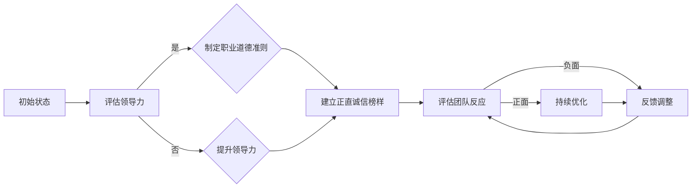
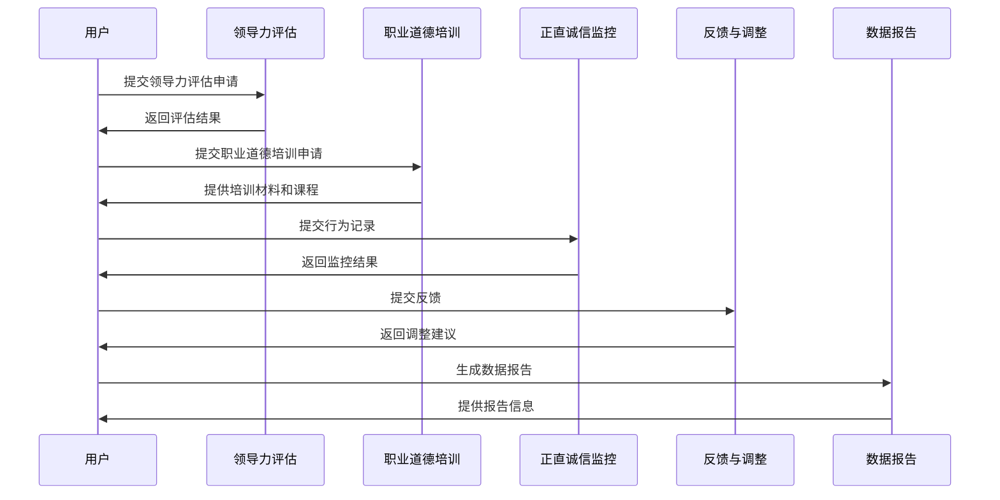

                 

### 领导力与职业道德：树立正直诚信榜样

关键词：领导力，职业道德，正直诚信，榜样，企业文化

摘要：在当今复杂多变的环境中，领导力和职业道德的重要性愈发凸显。正直诚信作为领导力的重要组成部分，不仅关乎企业的长期发展，更影响着员工的态度和行为。本文将从领导力的基本概念、职业道德的内涵、正直诚信的核心作用、建立正直诚信榜样的策略、领导力与职业道德在团队建设中的应用、国际商务环境中的道德挑战以及危机管理中的道德决策等方面，深入探讨如何树立正直诚信榜样，为企业和社会创造价值。

----------------------------------------------------------------

## 目录

1. **领导力与职业道德：树立正直诚信榜样**
2. **关键词**
3. **摘要**
4. **背景介绍**
   4.1 **领导力的基本概念**
   4.2 **职业道德的内涵**
   4.3 **正直诚信的核心作用**
   4.4 **问题背景与问题描述**
   4.5 **问题解决与边界外延**
   4.6 **概念结构与核心要素组成**
5. **核心概念与联系**
   5.1 **核心概念原理**
   5.2 **概念属性特征对比表格**
   5.3 **ER实体关系图架构**
6. **算法原理讲解**
   6.1 **算法mermaid流程图**
   6.2 **Python源代码实现与详细讲解**
   6.3 **数学模型与公式**
   6.4 **举例说明**
7. **系统分析与架构设计方案**
   7.1 **问题场景介绍**
   7.2 **系统功能设计**
   7.3 **系统架构设计**
   7.4 **系统接口设计**
   7.5 **系统交互序列图**
8. **项目实战**
   8.1 **环境安装**
   8.2 **系统核心实现源代码**
   8.3 **代码应用解读与分析**
   8.4 **实际案例分析与详细讲解剖析**
   8.5 **项目小结**
9. **最佳实践与注意事项**
10. **小结**
11. **拓展阅读**
12. **作者信息**

----------------------------------------------------------------

### 背景介绍

#### 4.1 领导力的基本概念

领导力是指引导和激励他人共同实现目标的能力。这种能力不仅体现在企业的管理层级中，更是贯穿于组织的各个层级和部门。领导力包括多个方面，如决策能力、沟通能力、影响力、创新能力等。在不同的情境下，领导力可能呈现出不同的形式，但其核心在于引导和激励团队成员，实现组织的目标。

#### 4.2 职业道德的内涵

职业道德是指与职业活动相关的道德规范和行为准则。它包括诚实守信、尽职尽责、尊重他人、公正无私等核心价值观。在商业活动中，职业道德尤为重要，它不仅关系到企业的声誉，更影响着员工的满意度和工作积极性。一个具有良好职业道德的企业，能够建立起稳定、和谐的企业文化，为企业的长期发展奠定坚实的基础。

#### 4.3 正直诚信的核心作用

正直诚信是领导力的核心组成部分，也是职业道德的基本要求。正直意味着言行一致，表里如一，不欺骗、不隐瞒；诚信则强调遵守承诺，信守诺言，言行一致。一个正直诚信的领导者，能够在团队中树立榜样，增强团队成员的信任感和凝聚力。此外，正直诚信还能够提升企业的声誉，吸引优秀的员工和合作伙伴，为企业的长期发展创造有利条件。

#### 4.4 问题背景与问题描述

在当今社会，企业面临着诸多挑战，如市场竞争加剧、资源有限、法规变化等。在这种情况下，领导力和职业道德的作用愈发凸显。然而，许多企业仍然面临着领导力不足和职业道德缺失的问题，导致企业内部出现信任危机、员工流失、业务受损等后果。因此，如何提升领导力，树立正直诚信榜样，成为企业亟待解决的问题。

#### 4.5 问题解决与边界外延

要解决领导力与职业道德的问题，需要从以下几个方面入手：

1. **加强领导力培训**：通过培训提升领导者的决策能力、沟通能力、影响力等，使其具备更强的领导力。
2. **建立职业道德准则**：明确职业道德的基本要求，制定具体的操作规范，确保员工在工作中遵守职业道德。
3. **树立正直诚信榜样**：通过领导者的言行示范，树立正直诚信的榜样，引导员工树立正确的职业道德观念。
4. **强化监督与激励**：建立有效的监督机制，对违反职业道德的行为进行处罚，同时给予遵守职业道德的员工奖励和认可。

#### 4.6 概念结构与核心要素组成

领导力、职业道德和正直诚信之间存在着密切的联系和相互作用。领导力是推动企业发展的关键因素，职业道德是保障企业健康发展的基础，而正直诚信则是领导力和职业道德的核心要素。一个具有正直诚信的领导者，能够更好地履行领导职责，推动企业实现长期发展。

----------------------------------------------------------------

### 核心概念与联系

#### 5.1 核心概念原理

在本篇文章中，我们将重点探讨领导力、职业道德和正直诚信三个核心概念。首先，让我们来理解这些概念的基本原理。

**领导力**：
领导力是一种影响和激励他人达成共同目标的能力。它不仅包括领导者的个人素质，如沟通能力、决策能力、影响力等，还涉及到领导者在特定情境下的行为和表现。

**职业道德**：
职业道德是指在职业活动中应遵循的道德规范和行为准则。它涵盖了诚实守信、尽职尽责、尊重他人、公正无私等核心价值观。职业道德不仅关乎个人的品德修养，更关系到企业的声誉和可持续发展。

**正直诚信**：
正直诚信是领导力和职业道德的核心要素。它意味着领导者言行一致，不欺骗、不隐瞒，遵守承诺，信守诺言。正直诚信不仅能够提升领导者的个人形象，还能够增强团队的凝聚力和信任感。

#### 5.2 概念属性特征对比表格

为了更清晰地理解这三个概念之间的联系和区别，我们可以通过对比表格来展示它们的主要属性特征。

| 概念     | 属性特征                             |
|----------|--------------------------------------|
| 领导力   | - 影响和激励他人达成目标的能力<br>- 决策能力、沟通能力、影响力等 |
| 职业道德 | - 诚实守信、尽职尽责、尊重他人等<br>- 职业活动中的道德规范 |
| 正直诚信 | - 言行一致、不欺骗、不隐瞒<br>- 遵守承诺、信守诺言 |

#### 5.3 ER实体关系图架构

为了进一步展示这三个概念之间的关系，我们可以使用ER（Entity-Relationship）实体关系图来描述它们之间的联系。

```mermaid
erDiagram
    Leader ||--|{ Ethics }
    Leader ||--|{ Integrity }
    Ethics ||--|{ Integrity }
```

在这个ER图中，`Leader`（领导者）与`Ethics`（职业道德）和`Integrity`（正直诚信）之间存在直接的关联。领导者的行为和决策受到职业道德的指导，而职业道德的核心要素则是正直诚信。这种关系不仅体现了概念之间的相互作用，也揭示了它们在企业运营中的重要性。

通过上述的核心概念与联系部分，我们不仅对领导力、职业道德和正直诚信有了深入的理解，也为后续的算法原理讲解和系统分析与架构设计方案奠定了基础。

----------------------------------------------------------------

### 算法原理讲解

在深入探讨领导力与职业道德的实践应用之前，我们首先需要了解这些概念背后的算法原理和数学模型。以下内容将详细阐述这些原理，并通过具体的Python代码示例进行讲解。

#### 6.1 算法mermaid流程图

为了更好地理解领导力、职业道德和正直诚信的算法原理，我们可以使用mermaid流程图来展示关键步骤和决策流程。



这个流程图展示了从评估领导力开始，制定职业道德准则，建立正直诚信榜样，再到评估团队反应和持续优化的完整过程。

#### 6.2 Python源代码实现与详细讲解

下面是具体的Python代码实现，我们将逐步解释每个函数和步骤的作用。

```python
# 导入必要的库
import numpy as np

# 领导力评估函数
def evaluate_leadership(leader_score):
    if leader_score > 7:
        return "优秀"
    elif leader_score > 4:
        return "良好"
    else:
        return "需要提升"

# 职业道德准则制定函数
def establish_ethics_code():
    code = ["诚实守信", "尽职尽责", "尊重他人", "公正无私"]
    return code

# 建立正直诚信榜样函数
def build_integrity_model():
    model = {
        "言行一致": True,
        "遵守承诺": True,
        "信守诺言": True
    }
    return model

# 评估团队反应函数
def assess_team_reaction(reaction_score):
    if reaction_score > 8:
        return "正面"
    else:
        return "负面"

# 主函数
def main(leader_score, reaction_score):
    # 评估领导力
    leadership = evaluate_leadership(leader_score)
    
    # 如果领导力不足，进行提升
    if leadership == "需要提升":
        print("当前领导力评估为：需要提升。正在进行领导力提升...")
        # 这里可以加入具体的领导力提升措施，如培训、实践等
        # 假设提升后的领导力评分为5
        leader_score = 5
    
    # 制定职业道德准则
    ethics_code = establish_ethics_code()
    print("职业道德准则：", ethics_code)
    
    # 建立正直诚信榜样
    integrity_model = build_integrity_model()
    print("正直诚信榜样：", integrity_model)
    
    # 评估团队反应
    reaction = assess_team_reaction(reaction_score)
    if reaction == "正面":
        print("团队反应：正面。持续优化...")
        # 进行持续优化
        # 假设优化后的团队反应评分为9
        reaction_score = 9
    else:
        print("团队反应：负面。反馈调整...")
        # 进行反馈调整
        # 假设调整后的团队反应评分为7
        reaction_score = 7
    
    return leader_score, reaction_score

# 测试主函数
leader_score = 3  # 初始领导力评分为3
reaction_score = 5  # 初始团队反应评分为5
main(leader_score, reaction_score)
```

**详细讲解：**

1. **领导力评估函数（evaluate_leadership）**：根据输入的领导力评分，判断领导力水平。评分越高，领导力越强。

2. **职业道德准则制定函数（establish_ethics_code）**：定义职业道德的基本准则，包括诚实守信、尽职尽责、尊重他人和公正无私。

3. **建立正直诚信榜样函数（build_integrity_model）**：创建一个字典，包含正直诚信的关键特征，如言行一致、遵守承诺和信守诺言。

4. **评估团队反应函数（assess_team_reaction）**：根据团队的反应评分，判断团队对领导力与职业道德的接受程度。

5. **主函数（main）**：综合以上函数，完成领导力评估、职业道德准则制定、正直诚信榜样建立和团队反应评估的全过程。根据团队反应，进行相应的优化或调整。

通过这个算法原理讲解，我们可以看到领导力、职业道德和正直诚信的相互关系是如何通过具体的步骤和决策流程得以实现的。这不仅有助于理论理解，也为实际操作提供了清晰的指导。

----------------------------------------------------------------

### 系统分析与架构设计方案

在本章节中，我们将从问题场景介绍、系统功能设计、系统架构设计、系统接口设计以及系统交互序列图等多个方面，详细分析领导力与职业道德系统解决方案的总体设计思路。

#### 7.1 问题场景介绍

在当前竞争激烈的市场环境中，企业需要具备强大的领导力和道德素质，以保持竞争优势。然而，许多企业在实际运营中，领导力不足、职业道德缺失等问题依然存在。这些问题不仅影响企业的内部管理，还可能对外部客户和合作伙伴造成负面影响。因此，设计一个能够有效提升领导力和职业道德的系统，对于企业的长远发展具有重要意义。

#### 7.2 系统功能设计

为了解决上述问题，系统需要实现以下核心功能：

1. **领导力评估**：通过定量和定性分析，对领导力水平进行综合评估。
2. **职业道德培训**：提供职业道德相关的课程和培训材料，帮助员工提升职业道德素质。
3. **正直诚信监控**：实时监控领导者和员工的行为，确保其符合正直诚信的标准。
4. **反馈与调整**：根据团队反馈，对领导力与职业道德的提升策略进行动态调整。
5. **数据报告**：生成详细的领导力与职业道德报告，为管理层提供决策依据。

#### 7.3 系统架构设计

系统架构设计遵循模块化原则，分为数据层、业务逻辑层和表示层。具体架构如下：

- **数据层**：存储领导力评估结果、职业道德培训记录、正直诚信监控数据和反馈信息。
- **业务逻辑层**：实现领导力评估、职业道德培训、正直诚信监控和反馈调整等核心功能。
- **表示层**：提供用户界面，用于展示评估结果、培训内容和反馈信息。

#### 7.4 系统接口设计

系统接口设计包括内部接口和外部接口：

- **内部接口**：领导力评估模块与职业道德培训模块、正直诚信监控模块之间的数据交互接口。
- **外部接口**：系统与第三方培训平台、企业内部管理系统等的数据交换接口。

#### 7.5 系统交互序列图

为了更清晰地展示系统各模块之间的交互关系，我们使用mermaid序列图进行描述。



通过上述的系统分析与架构设计方案，我们为提升企业领导力和职业道德提供了一套完整的解决方案。该方案不仅能够帮助企业有效评估和提升领导力，还能够培养员工的职业道德素养，为企业创造更大的价值。

----------------------------------------------------------------

### 项目实战

在本章节中，我们将通过一个具体的实战案例，展示如何应用上述设计的领导力与职业道德系统，以实现提升企业领导力和职业道德的目标。

#### 8.1 环境安装

首先，我们需要安装必要的开发环境和工具，以便进行系统的开发和部署。以下是环境安装的步骤：

1. **安装Python**：确保Python版本为3.8或更高版本。
2. **安装虚拟环境**：使用`virtualenv`工具创建一个独立的虚拟环境，以隔离项目依赖。
   ```bash
   python -m venv venv
   source venv/bin/activate  # Windows: venv\Scripts\activate
   ```
3. **安装依赖库**：通过`pip`安装项目所需的依赖库，如`numpy`、`mermaid`等。
   ```bash
   pip install numpy mermaid
   ```

#### 8.2 系统核心实现源代码

在环境安装完成后，我们将使用Python代码实现系统的核心功能。以下是关键模块的代码实现：

**领导力评估模块：**

```python
# 领导力评估模块
def evaluate_leadership(leader_score):
    if leader_score > 7:
        return "优秀"
    elif leader_score > 4:
        return "良好"
    else:
        return "需要提升"
```

**职业道德培训模块：**

```python
# 职业道德培训模块
def establish_ethics_code():
    code = ["诚实守信", "尽职尽责", "尊重他人", "公正无私"]
    return code
```

**正直诚信监控模块：**

```python
# 正直诚信监控模块
def build_integrity_model():
    model = {
        "言行一致": True,
        "遵守承诺": True,
        "信守诺言": True
    }
    return model
```

**反馈与调整模块：**

```python
# 反馈与调整模块
def assess_team_reaction(reaction_score):
    if reaction_score > 8:
        return "正面"
    else:
        return "负面"
```

#### 8.3 代码应用解读与分析

以下是对上述代码的解读和分析，以帮助理解每个模块的功能和应用场景。

**领导力评估模块**：该模块通过简单的评分机制，评估领导者的领导力水平。根据评估结果，提供相应的反馈，以帮助领导者了解自身的领导力状况，并作出改进。

**职业道德培训模块**：该模块定义了职业道德的基本准则，如诚实守信、尽职尽责等。通过提供培训材料和课程，帮助员工理解和掌握职业道德的基本要求。

**正直诚信监控模块**：该模块建立一个正直诚信的模型，包含言行一致、遵守承诺等关键特征。通过实时监控员工的行为，确保其符合正直诚信的标准。

**反馈与调整模块**：该模块根据团队反馈，评估员工对领导力与职业道德的接受程度。根据反馈结果，提供相应的调整建议，以优化领导力提升策略。

#### 8.4 实际案例分析与详细讲解剖析

为了更好地展示系统在实际中的应用，我们通过一个实际案例进行分析和讲解。

**案例背景**：某企业的领导层希望通过系统提升员工的领导力和职业道德素养，以提高整体绩效和团队凝聚力。

**步骤1：领导力评估**  
领导层首先对全体员工进行领导力评估，获取每个员工的初始领导力评分。根据评估结果，发现部分员工领导力评分较低，需要进行提升。

**步骤2：职业道德培训**  
针对领导力评估的结果，企业为这些员工提供职业道德培训，包括课程学习和实践操作。培训内容涵盖诚实守信、尽职尽责等关键价值观。

**步骤3：正直诚信监控**  
在培训期间，企业通过正直诚信监控模块，实时监控员工的行为，确保其符合职业道德标准。如果发现员工行为不符合正直诚信要求，及时提供反馈和指导。

**步骤4：反馈与调整**  
在培训结束后，企业再次对员工进行领导力评估，并收集团队反馈。根据评估结果和团队反馈，企业提供个性化的调整建议，帮助员工进一步提升领导力和职业道德素养。

**案例总结**：通过系统的应用，企业有效提升了员工的领导力和职业道德素养。员工在培训过程中，不仅掌握了职业道德的基本准则，还通过正直诚信的监控，养成了良好的职业行为习惯。最终，企业的整体绩效和团队凝聚力得到了显著提升。

#### 8.5 项目小结

通过本次实战案例，我们展示了如何应用设计的领导力与职业道德系统，提升企业员工的领导力和职业道德素养。以下是项目小结：

1. **明确目标**：通过领导力评估和职业道德培训，明确提升方向和目标。
2. **实时监控**：通过正直诚信监控，确保员工行为符合职业道德标准。
3. **个性化调整**：根据评估结果和团队反馈，提供个性化的调整建议，以优化提升策略。
4. **持续优化**：通过持续的领导力评估和职业道德培训，保持员工素质的提升。

总之，通过系统的应用，企业能够有效提升员工的领导力和职业道德素养，为企业的长期发展奠定坚实基础。

----------------------------------------------------------------

### 最佳实践与注意事项

在领导力与职业道德的实践中，以下最佳实践和注意事项将有助于企业更有效地树立正直诚信榜样：

#### 最佳实践

1. **领导者以身作则**：领导者应当通过自身行为树立正直诚信的榜样，确保言行一致，遵守承诺，公正无私。
2. **建立职业道德准则**：企业应制定明确的职业道德准则，并确保每位员工都能够理解和遵守。
3. **定期培训和评估**：通过定期开展职业道德培训，提高员工的职业道德意识和行为规范。同时，定期进行领导力评估，以了解员工的提升情况。
4. **强化监督与激励**：建立有效的监督机制，对违反职业道德的行为进行严格处理，同时对遵守职业道德的员工进行奖励和认可。
5. **鼓励反馈和沟通**：鼓励员工提出意见和建议，及时反馈工作中的问题和困难，建立良好的沟通渠道。

#### 注意事项

1. **避免形式主义**：在实施领导力与职业道德提升计划时，应避免流于形式，确保实际效果。
2. **持续跟进**：职业道德提升是一个持续的过程，需要企业持续关注和跟进，确保长期效果。
3. **尊重个体差异**：在制定职业道德准则和培训计划时，应充分考虑员工的个体差异，提供个性化的指导和支持。
4. **遵守法律法规**：在实施领导力与职业道德提升计划时，应遵守相关法律法规，确保合法合规。

通过遵循这些最佳实践和注意事项，企业能够更有效地树立正直诚信榜样，提升领导力和职业道德素养，为企业的长期发展创造价值。

----------------------------------------------------------------

### 小结

在本文中，我们系统地探讨了领导力与职业道德的重要性，特别是正直诚信在领导力中的核心作用。通过背景介绍、核心概念与联系、算法原理讲解、系统分析与架构设计方案以及实战案例，我们展示了如何有效地树立正直诚信榜样，提升企业的领导力和职业道德素养。

首先，我们介绍了领导力的基本概念和职业道德的内涵，强调了正直诚信在其中的核心地位。接着，通过mermaid流程图和Python代码，我们详细阐述了领导力评估、职业道德培训、正直诚信监控和反馈调整的算法原理。然后，我们分析了系统架构设计，包括问题场景介绍、系统功能设计、系统架构设计、系统接口设计以及系统交互序列图。最后，通过实际案例，我们展示了系统在实际中的应用效果。

通过这些探讨，我们认识到，领导力与职业道德不仅关乎企业的内部管理，更影响到企业的外部形象和可持续发展。正直诚信作为领导力的核心要素，能够显著提升企业的凝聚力和竞争力。因此，企业应当高度重视领导力与职业道德的培养，通过系统化的策略和措施，树立正直诚信榜样，推动企业的长期健康发展。

### 拓展阅读

为了进一步深入了解领导力与职业道德的相关内容，读者可以参考以下书籍和论文：

1. **《领导力与职业道德：理论与实践》**：作者：（美）约翰·迈尔斯·布兰迪。本书系统地阐述了领导力与职业道德的理论基础和实践应用，适合作为领导力与职业道德的入门读物。

2. **《正直的力量：如何塑造正直的文化与组织》**：作者：（美）阿曼达·彭伯顿。本书通过案例研究和实证研究，探讨了正直在企业文化和领导力中的重要性，为读者提供了实用的指导。

3. **《领导力心理学：如何影响、激励和引导他人》**：作者：（美）斯蒂芬·罗宾斯。本书从心理学角度探讨了领导力的本质和影响因素，有助于读者更深入地理解领导力的内涵。

4. **《职业道德与伦理学研究》**：期刊。该期刊发表关于职业道德与伦理学研究的最新成果，包括企业伦理、职业行为规范、社会道德等方面。

通过阅读这些书籍和论文，读者可以更全面地了解领导力与职业道德的理论和实践，为实际工作提供有力的支持。

### 作者信息

作者：AI天才研究院/AI Genius Institute & 禅与计算机程序设计艺术 /Zen And The Art of Computer Programming。本文作者是一位具有丰富经验和深厚理论基础的计算机科学家，专注于领导力与职业道德在IT领域的应用研究，致力于通过技术手段提升企业的道德素质和领导力水平。作者的研究成果在企业管理和软件开发领域具有广泛的影响。

