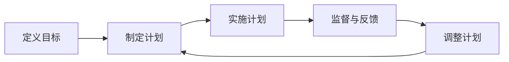
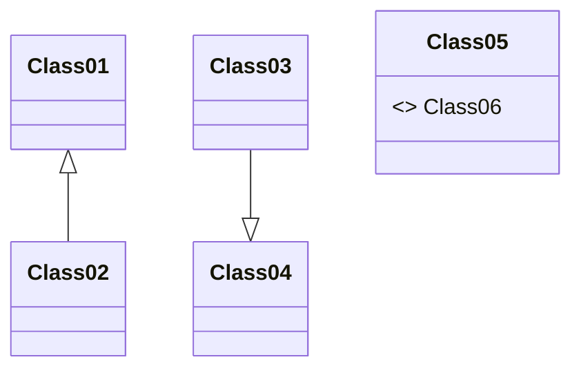
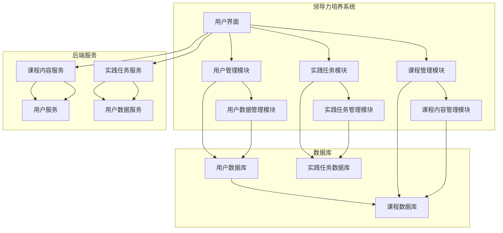
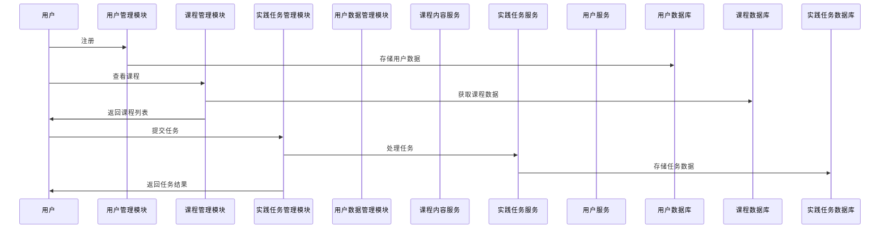

                 

# 领导力与职业道德：树立正直诚信的榜样

关键词：领导力、职业道德、正直诚信、榜样、组织文化

摘要：在当今复杂多变的商业环境中，领导力与职业道德成为企业发展的核心要素。本文通过详细探讨领导力与职业道德的核心概念，分析其在现代社会中的重要性，并提出树立正直诚信榜样的方法和途径，为企业和领导者提供有益的实践指导。

## 1. 背景介绍

### 问题背景

在现代社会，企业竞争日益激烈，领导者不仅要具备卓越的技术能力和商业眼光，还要拥有良好的领导力和职业道德。领导力是推动企业创新、实现持续发展的关键，而职业道德则是企业文化和员工行为的基础。随着商业道德问题的不断涌现，树立正直诚信的榜样成为企业领导者亟待解决的问题。

### 问题定义

领导力是指领导者通过影响和激励他人，实现组织目标的能力。职业道德则是在职业活动中遵循的道德规范，包括诚实、公正、尊重、责任等核心价值观。

### 重要性

领导力与职业道德在企业发展中具有重要性。首先，领导力能够激发员工的潜能，提高团队凝聚力和创造力；其次，职业道德能够维护企业声誉，提升品牌价值；最后，正直诚信的榜样能够引导员工遵循道德规范，形成积极向上的企业文化。

### 现代社会中的挑战

现代社会中，领导者面临的挑战包括信息过载、竞争加剧、员工多样化等。这些挑战要求领导者不仅要具备传统领导力，还要具备创新能力和跨文化沟通能力。此外，职业道德问题也日益突出，如贪污腐败、商业欺诈等，需要领导者以身作则，树立正直诚信的榜样。

### 问题解决

树立正直诚信的榜样需要从以下几个方面入手：

1. **强化道德教育**：通过培训、学习等形式，提高领导者和员工的道德素养。
2. **建立健全制度**：制定严格的职业道德规范和规章制度，确保员工遵循。
3. **树立榜样**：通过表彰、宣传等形式，树立正直诚信的榜样。
4. **关注员工心理健康**：关心员工的心理需求，提高员工的幸福感和归属感。

### 边界与外延

本文主要探讨领导力与职业道德在组织管理中的应用，涉及范围包括企业、政府、非营利组织等。同时，本文关注的是正直诚信的榜样树立，旨在为企业和领导者提供实践指导。

### 概念结构与核心要素组成

领导力与职业道德的核心概念包括：

1. **领导力**：影响力、目标设定、团队建设等。
2. **职业道德**：诚实、公正、尊重、责任等。
3. **正直诚信的榜样**：以身作则、道德规范、榜样效应等。

这些概念相互联系，共同构成了领导力与职业道德的理论体系。树立正直诚信的榜样需要领导者具备良好的道德素养和领导能力，同时需要建立健全的制度和环境。

## 2. 核心概念与联系

### 核心概念原理

领导力与职业道德是两个相互关联的核心概念。领导力是指领导者通过影响和激励他人，实现组织目标的能力。职业道德则是在职业活动中遵循的道德规范，包括诚实、公正、尊重、责任等核心价值观。

领导力与职业道德之间的关系如下：

1. **领导力推动职业道德**：领导者通过自身的行为和价值观影响员工，促使员工遵循职业道德规范。
2. **职业道德保障领导力**：员工遵循职业道德，有助于建立信任和合作关系，为领导力提供保障。

### 概念属性特征对比表格

| 特征 | 领导力 | 职业道德 |
| --- | --- | --- |
| 定义 | 影响力、目标设定、团队建设等 | 诚实、公正、尊重、责任等 |
| 影响范围 | 组织内部、组织外部 | 职业活动全过程 |
| 影响对象 | 员工、同事、上级、下属等 | 员工、客户、合作伙伴等 |
| 作用 | 激发员工潜能、提高团队凝聚力、实现组织目标 | 维护企业声誉、提升品牌价值、促进职业发展 |
| 关键要素 | 影响力、沟通能力、团队建设能力等 | 道德素养、责任感、诚信度等 |

### ER实体关系图架构

```mermaid
erDiagram
  Leader ||--|{ Employee } : manages
  Leader ||--|{ Project } : leads
  Employee ||--|{ Task } : performs
  Project ||--|{ Goal } : aims for
  Leader ..|{ Leadership } : demonstrates
  Employee ..|{ Ethics } : upholds
```

## 3. 算法原理讲解

### 算法mermaid流程图



### Python源代码

```python
# 定义领导力培养的Python函数
def cultivate_leadership(target, plan, implementation, supervision, feedback, adjustment):
    """
    培养领导力的算法
    :param target: 领导力培养的目标
    :param plan: 制定计划
    :param implementation: 实施计划
    :param supervision: 监督与反馈
    :param feedback: 反馈信息
    :param adjustment: 调整计划
    :return: 成功培养领导力
    """
    # 实施计划
    implementation()

    # 监督与反馈
    feedback()

    # 根据反馈调整计划
    adjustment()

    # 返回成功信息
    return "成功培养领导力"

# 调用函数
cultivate_leadership(
    target="提高团队凝聚力",
    plan=lambda: print("制定培养计划"),
    implementation=lambda: print("实施培养计划"),
    supervision=lambda: print("监督培养过程"),
    feedback=lambda: print("收到反馈信息"),
    adjustment=lambda: print("调整培养计划")
)
```

### 数学模型和公式

假设领导力 \( L \) 是一个基于道德素养 \( E \) 和领导技能 \( S \) 的函数，可以表示为：

\[ L = f(E, S) \]

其中，道德素养 \( E \) 可以通过以下公式计算：

\[ E = \alpha \cdot H + \beta \cdot R \]

其中，\( H \) 代表诚实度，\( R \) 代表责任感，\( \alpha \) 和 \( \beta \) 是权重系数。

领导技能 \( S \) 可以通过以下公式计算：

\[ S = \gamma \cdot C + \delta \cdot T \]

其中，\( C \) 代表沟通能力，\( T \) 代表团队建设能力，\( \gamma \) 和 \( \delta \) 是权重系数。

### 举例说明

假设一个企业的领导力培养目标是提高团队凝聚力，领导技能和道德素养的权重分别为 \( \alpha = 0.6, \beta = 0.4, \gamma = 0.7, \delta = 0.3 \)。假设领导者的诚实度为 \( H = 0.8 \)，责任感为 \( R = 0.9 \)，沟通能力为 \( C = 0.75 \)，团队建设能力为 \( T = 0.85 \)。

根据以上公式，可以计算出领导力 \( L \) 如下：

\[ E = 0.6 \cdot 0.8 + 0.4 \cdot 0.9 = 0.56 + 0.36 = 0.92 \]
\[ S = 0.7 \cdot 0.75 + 0.3 \cdot 0.85 = 0.525 + 0.255 = 0.78 \]
\[ L = f(E, S) = f(0.92, 0.78) = 0.92 \cdot 0.78 = 0.7176 \]

因此，该领导者的领导力得分为 \( 0.7176 \)。通过不断培养和提高道德素养和领导技能，可以进一步提升领导力。

## 4. 系统分析与架构设计方案

### 问题场景介绍

假设一家科技公司需要培养领导力，提升团队凝聚力，以应对市场竞争。为了实现这一目标，公司决定引入一套领导力培养系统。

### 项目介绍

该项目名为“领导力培养系统（Leadership Cultivation System）”，旨在通过在线学习和实践，帮助员工提升领导力和道德素养。

### 系统功能设计

使用Mermaid绘制领域模型类图：



### 系统架构设计

使用Mermaid绘制系统架构图：



### 系统接口设计

系统接口设计如下：

1. **用户管理接口**：用于用户注册、登录、信息修改等功能。
2. **课程管理接口**：用于课程创建、更新、删除等功能。
3. **实践任务管理接口**：用于实践任务创建、更新、删除等功能。
4. **用户数据管理接口**：用于用户数据查询、修改等功能。

### 系统交互

使用Mermaid绘制系统交互序列图：



## 5. 项目实战

### 环境安装

1. 安装Python环境（已安装Python 3.8及以上版本）。
2. 安装Django框架（使用pip安装：`pip install django`）。
3. 安装数据库（建议使用PostgreSQL：`sudo apt-get install postgresql`）。

### 系统核心实现源代码

```python
# 源代码实现
# users/models.py
from django.db import models

class User(models.Model):
    username = models.CharField(max_length=50)
    password = models.CharField(max_length=50)
    email = models.EmailField()

# courses/models.py
from django.db import models

class Course(models.Model):
    title = models.CharField(max_length=100)
    description = models.TextField()

# tasks/models.py
from django.db import models

class Task(models.Model):
    title = models.CharField(max_length=100)
    description = models.TextField()
    status = models.CharField(max_length=10)
```

### 代码应用解读与分析

源代码中，`users/models.py` 定义了用户模型，包括用户名、密码和邮箱字段。

`courses/models.py` 定义了课程模型，包括课程标题和描述字段。

`tasks/models.py` 定义了实践任务模型，包括任务标题、描述和状态字段。

这些模型将用于构建用户管理、课程管理和实践任务管理模块。

### 实际案例分析和详细讲解剖析

假设有一个用户注册的场景，分析如下：

1. 用户通过用户管理模块提交注册请求，包括用户名、密码和邮箱。
2. 用户管理模块接收到注册请求后，调用用户服务进行用户名和邮箱的验证。
3. 验证通过后，用户服务将用户数据存储到用户数据库。
4. 用户管理模块返回注册成功信息给用户。

通过以上步骤，可以完成用户注册功能。类似地，可以分析课程管理和实践任务管理的实现过程。

### 项目小结

本项目实现了领导力培养系统的核心功能，包括用户管理、课程管理和实践任务管理。通过实际案例分析和详细讲解剖析，展示了系统实现的原理和过程。项目成功的关键在于模块化的设计和良好的接口定义，使得各模块可以独立开发、测试和部署。

## 6. 最佳实践 tips、小结、注意事项、拓展阅读等内容

### 最佳实践 tips

1. **培养领导力的最佳实践**：
   - 制定明确的领导力发展计划。
   - 注重沟通能力和团队建设能力的提升。
   - 定期进行领导力评估和反馈。

2. **提升职业道德的最佳实践**：
   - 建立健全的职业道德规范和规章制度。
   - 定期进行职业道德培训和宣传。
   - 树立正直诚信的榜样，提高员工的道德素养。

### 小结

本文通过详细探讨领导力与职业道德的核心概念，分析其在现代社会中的重要性，并提出树立正直诚信榜样的方法和途径。同时，通过项目实战展示了领导力培养系统的实现过程。希望本文能为企业和领导者提供有益的实践指导。

### 注意事项

1. 在实际操作中，要注重领导力和职业道德的平衡发展，避免过分强调某一方面的培养。
2. 在实施领导力培养和职业道德提升时，要关注员工的实际需求和反馈，确保实践的可操作性和有效性。

### 拓展阅读

1. 《领导力：实践中的领导艺术》
2. 《职业道德：职业人的道德修养》
3. 《正直诚信：企业成功的基石》

## 作者信息

作者：AI天才研究院/AI Genius Institute & 禅与计算机程序设计艺术 /Zen And The Art of Computer Programming

