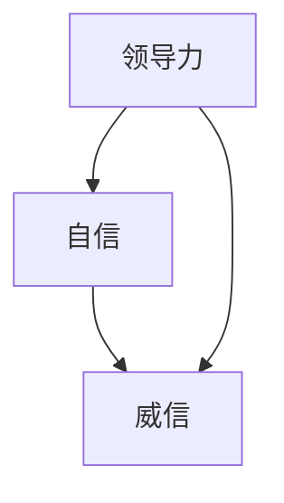
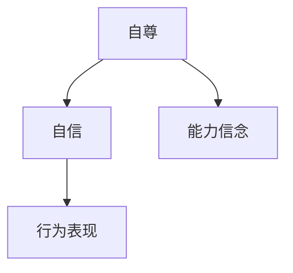
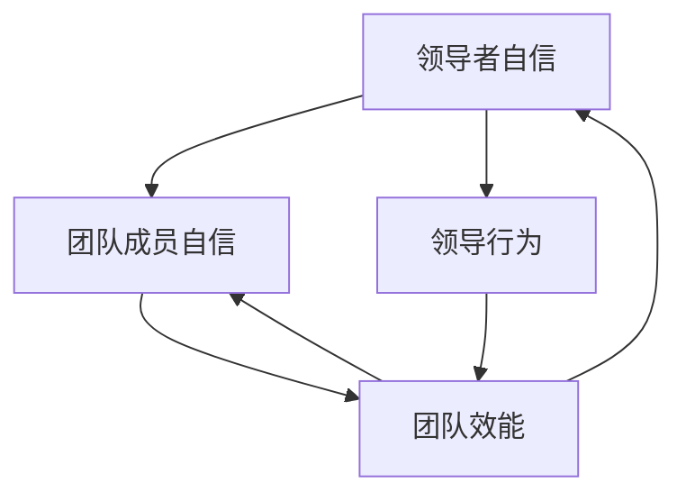

                 

### 《领导力与自信：树立威信的基础》

---

#### 关键词：领导力、自信、威信、心理学、实践指南

#### 摘要：本文将深入探讨领导力、自信和威信之间的关系，阐述如何通过提升领导力和自信来树立个人或团队的威信。我们将从理论基础、实践方法以及案例分析三个方面进行详细分析，帮助读者理解这一核心主题，并在实际工作中应用所学内容。

---

#### 目录大纲

1. **领导力概述**
   - 领导力的定义与历史演变
   - 领导力的类型与风格
   - 领导力的重要性

2. **自信的心理学基础**
   - 自信的定义与作用
   - 自信心理学研究
   - 自信与自尊的关系

3. **领导力与自信的互动**
   - 领导力如何影响自信
   - 自信如何增强领导力
   - 领导力与自信的互动模型

4. **树立威信的方法**
   - 威信的定义与构成要素
   - 利用领导力树立威信
   - 利用自信增强威信
   - 领导力与自信在树立威信中的综合应用

5. **实践指南**
   - 提升领导力和自信的实践方法
   - 加强沟通与团队建设

6. **案例分析**
   - 真实案例介绍
   - 案例分析
   - 成功策略提炼

7. **总结与拓展**
   - 持续提升领导力与自信
   - 拓展阅读建议

---

### 背景介绍

在当今快速变化和高度竞争的商业环境中，领导力、自信和威信已成为组织和个人成功的关键因素。领导力不仅仅是一种职位赋予的能力，它更是一种影响力，能够激励和引导他人共同实现目标。而自信则是个体在面对挑战和不确定性时，保持积极心态和行动力的重要心理特质。威信则是领导者在团队中建立的一种权威和信任，使他们的决策和建议得到广泛认同和执行。

领导力、自信和威信之间存在着紧密的联系。一方面，领导力可以提升个体的自信，使其在面对压力和挑战时更加坚定和有信心。另一方面，自信的领导者能够树立起威信，赢得团队成员的信任和支持。威信的建立不仅依赖于领导者的个人魅力和专业能力，还需要其在实际工作中展现出的自信和领导力。

本文将从理论、实践和案例分析三个方面，系统地探讨领导力、自信和威信的关系，为读者提供实用的指导和方法。

### 核心概念与联系

为了更好地理解领导力、自信和威信之间的关系，我们需要首先明确这些核心概念的定义及其相互之间的联系。

#### 领导力的定义与联系

领导力是指一个人在组织或团队中，通过影响力、沟通、激励和示范等手段，引导和影响他人实现共同目标的能力。领导力可以分为多个维度，如技术领导力、情感领导力和变革型领导力等。这些维度共同构成了领导力的多面性。

领导力与自信之间的联系主要体现在以下几个方面：

- **自信提升领导力**：一个自信的领导者能够更加自信地面对挑战，敢于承担责任，从而在团队中树立榜样，激发团队成员的积极性和创造力。
- **领导力增强自信**：当领导者成功地领导团队实现目标时，这种成就感会进一步增强其自信心，使其在未来的领导活动中更加自信和坚定。

#### 自信的定义与联系

自信是指个体对自己能力的信任和确信，表现为在面临任务和挑战时，个体能够保持积极的态度和行为，勇于尝试和接受挑战。

自信与自尊之间的关系非常密切。自尊是指个体对自己的整体价值和尊重，而自信则是自尊的体现之一。高自尊的个体往往更加自信，因为他们对自己的能力有积极的看法，并且愿意接受挑战。

#### 威信的定义与联系

威信是指一个领导者在团队中建立起来的权威和信任，使其决策和建议能够得到广泛认同和执行。威信的建立不仅依赖于领导者的个人魅力和专业能力，还需要其在实际工作中展现出的自信和领导力。

领导力、自信和威信之间的关系可以用以下图表来展示：

在这个图表中，领导力是核心，它通过提升自信和威信来增强个人的领导效能。而自信和威信则相互促进，共同构成一个有效的领导力循环。

### 领导力原理讲解

#### 领导力的本质

领导力是一种影响力，它不仅涉及领导者个人的能力和特质，还涉及到领导者与团队成员之间的互动和影响。领导力的本质在于激发和引导他人的潜力，共同实现组织或团队的目标。

领导力可以划分为多个类型，每种类型都有其独特的特点和适用场景。以下是几种常见的领导力类型：

1. **权威型领导**：领导者通过职位赋予的权力来指导和影响团队成员。
2. **民主型领导**：领导者鼓励团队成员参与决策过程，实现集思广益。
3. **变革型领导**：领导者通过激发团队成员的内在动机和潜力，推动组织或团队实现变革和成长。
4. **情感型领导**：领导者关注团队成员的情感需求，建立信任和合作关系。

#### 领导力的特征

领导力具有以下几大特征：

1. **影响力**：领导者通过言行和决策影响他人的思想和行为。
2. **责任感**：领导者对团队和组织的目标负有责任，勇于承担后果。
3. **愿景**：领导者具有清晰的目标和愿景，能够激励团队成员为之努力。
4. **沟通**：领导者具备良好的沟通技巧，能够有效传达信息和情感。
5. **适应力**：领导者能够适应不断变化的环境和挑战，调整领导策略。

#### 领导力的发展

领导力并非一成不变，而是可以通过持续的学习和实践不断提升。以下是几种提升领导力的方法：

1. **自我反思**：领导者定期进行自我反思，识别自身的优势和不足，制定改进计划。
2. **学习与培训**：领导者通过参加培训课程、阅读书籍和与同行交流，不断更新知识和技能。
3. **实践**：领导者通过实际工作场景的锻炼，积累经验，提高领导能力。
4. **反馈与评估**：领导者接受团队成员和上级的反馈，进行定期评估，调整领导行为。

#### 领导力与团队效能

领导力对团队效能有着直接的影响。一个优秀的领导者能够激发团队成员的潜力，提高团队协作效率，实现更高的组织目标。以下是领导力提升团队效能的几个方面：

1. **明确目标**：领导者为团队设定清晰的目标，使团队成员明确方向和任务。
2. **激励与支持**：领导者通过激励和提供支持，帮助团队成员克服困难，保持积极心态。
3. **沟通与协调**：领导者建立有效的沟通机制，协调团队成员之间的合作，确保团队目标的实现。
4. **培养人才**：领导者关注团队成员的成长，提供培训和发展机会，提升团队整体素质。

通过以上对领导力原理的讲解，我们可以看到领导力在组织和管理中的重要性。一个有效的领导者不仅能够提升个人的自信，还能够建立威信，推动团队和组织的发展。接下来，我们将进一步探讨自信的心理学基础。

### 自信的心理学基础

#### 自信的定义与作用

自信是指个体对自己能力的信任和确信，表现为在面对任务和挑战时，个体能够保持积极的态度和行为，勇于尝试和接受挑战。自信不仅是一种心理状态，也是一种行为倾向，它对个体的心理和行为有着重要的影响。

自信在以下几个方面发挥着关键作用：

1. **减少焦虑**：自信的个体在面对压力和挑战时，能够更好地控制情绪，减少焦虑和紧张感。
2. **增强行动力**：自信的个体更倾向于采取行动，克服困难，实现目标。
3. **提高决策质量**：自信的个体在决策过程中能够更加果断和准确，减少犹豫和不确定性。

#### 自信心理学研究

心理学界对自信的研究已有多年的历史，通过大量实证研究，学者们发现自信的影响因素和机制复杂多样。以下是一些重要的心理学研究成果：

1. **能力信念**：能力信念是指个体对自己能力的信心。研究表明，高能力信念的个体更倾向于设定高目标，并在面对挑战时保持积极态度。
2. **任务难度**：任务难度对自信有着显著影响。个体在面对难度适中的任务时，更容易产生自信，而在面对过于简单或过于复杂的任务时，自信水平可能会下降。
3. **反馈与评价**：积极的反馈和评价能够增强个体的自信，而消极的反馈和评价则可能削弱自信。因此，领导者和管理者应该注意如何给予反馈和评价，以激发和维持团队成员的自信。

#### 自信与自尊的关系

自尊是指个体对自己的整体价值和尊重，它与自信有着密切的关系。高自尊的个体往往更加自信，因为他们对自己的能力和价值有积极的认知。而低自尊的个体则可能在面对挑战时缺乏自信，甚至产生自卑感。

自尊与自信的关系可以用以下模型来解释：

在这个模型中，自尊通过影响能力信念，进而影响自信和行为表现。一个高自尊的个体，不仅对自己的能力有信心，还能够在行为中表现出自信，从而实现更好的成果。

#### 提升自信的方法

了解自信的心理学基础后，我们可以采取以下方法来提升个人的自信：

1. **设定合理目标**：设定具体、可行且具有挑战性的目标，有助于个体在实现目标的过程中建立自信。
2. **积极反馈**：通过积极的自我暗示和他人反馈，增强自信心。
3. **练习与准备**：在面临任务和挑战前，通过充分的练习和准备，提高应对能力，减少不确定感。
4. **正视失败**：将失败视为学习和成长的机会，而不是打击自信的障碍。

通过以上方法，个体可以逐步提升自己的自信水平，从而在面对挑战时更加从容和自信。

### 领导力与自信的互动

领导力与自信之间存在着密切的互动关系，二者相互影响、相互促进，共同塑造了一个领导者的整体效能。在这个部分，我们将详细探讨领导力如何影响自信，以及自信如何增强领导力，并构建一个领导力与自信的互动模型。

#### 领导力如何影响自信

领导力对自信的影响主要表现在以下几个方面：

1. **榜样作用**：领导者通过自身的言行和决策，为团队成员树立榜样，激发他们的自信心。一个自信的领导者能够通过积极的行动和态度，传递出积极的信息，从而影响团队成员对自己的信任和信心。

2. **支持与鼓励**：领导者为团队成员提供支持和鼓励，帮助他们克服困难和挑战。这种支持不仅能够减轻团队成员的心理压力，还能增强他们的自信心，使他们更有信心面对未来的挑战。

3. **反馈与认可**：领导者通过及时的反馈和认可，帮助团队成员了解自己的优势和不足，并在不断改进中提升自信。积极的反馈和认可能够增强团队成员的自我价值感，从而提升自信心。

4. **共同目标**：领导者与团队成员共同设定目标，并鼓励他们在实现目标的过程中不断进步。共同目标的设定不仅能够激发团队成员的积极性和主动性，还能通过共同的努力和成就，增强他们的自信心。

#### 自信如何增强领导力

自信对领导力的影响同样重要，一个自信的领导者能够在多个方面提升其领导效能：

1. **决策力**：自信的领导者更倾向于做出果断的决策，因为他们对自己的判断和决策能力有信心。这种果断的决策能够提高团队行动的效率，确保目标的实现。

2. **影响力**：自信的领导者具有更强的影响力，因为他们能够更好地传达自己的愿景和目标，激发团队成员的认同和追随。自信的领导者往往能够建立更高的信任和尊重，从而增强其领导力。

3. **适应力**：自信的领导者能够更好地适应变化和不确定性，因为他们对自己的能力和应变能力有信心。这种适应力使他们在面对复杂和挑战性的环境时，能够保持冷静和自信，从而有效应对各种情况。

4. **激励作用**：自信的领导者能够更好地激励团队成员，通过自己的积极态度和行动，传递出正能量，从而激发团队成员的积极性和创造力。

#### 领导力与自信的互动模型

为了更好地理解领导力与自信之间的互动关系，我们可以构建一个领导力与自信的互动模型。这个模型包括以下几个方面：

1. **领导者自信**：领导者的自信水平是其领导力的基础。一个自信的领导者能够更好地激发和影响团队成员。

2. **团队成员自信**：团队成员的自信水平是领导者自信的重要反馈。团队成员的自信增强，能够进一步促进领导者的自信。

3. **领导行为**：领导者的行为对团队成员的自信有着直接的影响。通过榜样作用、支持与鼓励、反馈与认可等领导行为，领导者能够提升团队成员的自信。

4. **团队效能**：团队效能是领导力和团队成员自信的综合体现。一个高效的团队不仅依赖于领导者的有效领导，还需要团队成员的积极协作和自信。

5. **反馈循环**：领导力与自信之间的互动形成了一个反馈循环。领导者的自信和领导行为能够影响团队成员的自信，而团队成员的自信反馈又能进一步促进领导者的自信。

在这个模型中，领导力和团队成员自信相互影响，共同推动团队效能的提升。领导者的自信和有效的领导行为能够提升团队成员的自信，而团队成员的自信增强又能进一步促进领导者的自信，形成了一个良性的互动循环。

通过理解领导力与自信的互动模型，我们可以更深入地认识到二者之间的紧密联系，并在实际工作中灵活应用这些原理，提升个人和团队的效能。

### 树立威信的方法

#### 威信的定义与构成要素

威信是指一个人在团队或组织中所建立的权威和信任，使其决策和建议能够得到广泛认同和执行。威信不仅仅依赖于领导者的职位和权力，更重要的是依赖于其个人魅力、专业能力和实际表现。

威信的构成要素主要包括以下几个方面：

1. **专业能力**：领导者必须具备专业知识和技能，能够在团队中提供有价值的见解和指导。专业能力是建立威信的基础。

2. **诚信**：领导者必须具备诚信和正直的品质，言行一致，遵守承诺。诚信是建立信任的关键。

3. **沟通能力**：领导者必须具备良好的沟通能力，能够清晰、有效地传达信息，建立有效的沟通机制。

4. **情感智慧**：领导者需要具备情感智慧，能够理解和管理自己的情绪，同时也能够理解和同情团队成员的情绪。

5. **团队合作**：领导者需要能够促进团队合作，建立积极、和谐的团队氛围。

6. **公正**：领导者需要公正无私，对待团队成员一视同仁，避免偏袒和偏见。

#### 利用领导力树立威信

要利用领导力树立威信，领导者可以从以下几个方面着手：

1. **明确目标**：领导者需要设定清晰的目标，并确保团队成员理解并认同这些目标。通过明确的目标，领导者能够统一团队的方向和努力。

2. **树立榜样**：领导者需要通过自身的言行和决策，树立榜样，展示专业能力和诚信。领导者的一言一行都会对团队成员产生影响，因此领导者需要以身作则。

3. **有效沟通**：领导者需要具备良好的沟通能力，能够与团队成员保持开放的沟通，倾听他们的意见和建议。有效的沟通能够增强领导者与团队成员之间的信任和合作。

4. **激励与支持**：领导者需要激励团队成员，并提供必要的支持，帮助他们克服困难，实现目标。通过激励和支持，领导者能够增强团队成员的自信和动力。

5. **培养团队精神**：领导者需要促进团队合作，建立积极、和谐的团队氛围。通过团队精神，领导者能够增强团队成员之间的信任和合作，从而提升团队的效能。

6. **公正无私**：领导者需要公正无私，对待团队成员一视同仁，避免偏袒和偏见。公正无私能够赢得团队成员的尊重和信任，从而提升领导者的威信。

#### 利用自信增强威信

自信是领导者树立威信的重要特质。要利用自信增强威信，领导者可以从以下几个方面着手：

1. **保持积极心态**：领导者需要保持积极的心态，面对挑战和不确定性时，保持冷静和自信。积极的心态能够增强领导者的自信心，从而提升其威信。

2. **自我提升**：领导者需要不断学习和提升自己的能力，增强自身的专业知识和技能。通过自我提升，领导者能够更好地应对各种挑战，从而增强其威信。

3. **克服恐惧**：领导者需要勇于面对恐惧和困难，不回避挑战。通过克服恐惧，领导者能够展示其勇敢和决心，从而增强其威信。

4. **自信表达**：领导者需要自信地表达自己的观点和决策，不畏惧质疑和反对。通过自信表达，领导者能够赢得团队成员的信任和尊重。

5. **积极反馈**：领导者需要积极接受团队成员的反馈，并将其视为提升自己的机会。通过积极反馈，领导者能够不断完善自己，增强其威信。

#### 领导力与自信在树立威信中的综合应用

在实际工作中，领导力和自信的综合应用对于树立威信至关重要。以下是几种有效的策略：

1. **树立愿景**：领导者需要明确团队的愿景和目标，并通过自信和坚定的表达，使团队成员认同并为之努力。通过树立愿景，领导者能够增强团队的凝聚力和向心力。

2. **建立信任**：领导者需要通过实际行动建立信任，展示专业能力和诚信。通过建立信任，领导者能够赢得团队成员的信任和尊重。

3. **积极沟通**：领导者需要积极与团队成员沟通，了解他们的需求和意见，并给予及时的反馈。通过积极沟通，领导者能够增强团队成员的参与感和归属感。

4. **激励与支持**：领导者需要不断激励团队成员，提供必要的支持，帮助他们克服困难，实现目标。通过激励与支持，领导者能够增强团队成员的自信和动力。

5. **培养团队精神**：领导者需要促进团队合作，建立积极、和谐的团队氛围。通过团队精神，领导者能够增强团队成员之间的信任和合作。

通过以上方法，领导者可以综合应用领导力和自信，树立起强大的威信，从而有效推动团队和组织的发展。

### 提升领导力和自信的实践指南

要提升领导力和自信，不仅需要理解其理论，更需要将其付诸实践。以下是一些具体的实践指南，帮助读者在实际工作中提升领导力和自信。

#### 自我评估与目标设定

1. **自我评估**：首先，进行自我评估，了解自己的优势和不足。可以使用360度反馈工具，收集来自上级、同事和下属的反馈。通过这些反馈，你可以识别出自己的盲点，并确定需要提升的领域。

2. **目标设定**：基于自我评估的结果，设定明确、具体且具有挑战性的目标。目标应包括短期和长期目标，并确保这些目标是可衡量和可达成的。

#### 培养积极心态

1. **正面思考**：培养正面思考的习惯，专注于解决问题，而不是问题本身。在面对挑战时，积极思考可能的解决方案，而不是陷入消极情绪。

2. **感恩**：保持感恩的心态，对于生活中的小确幸和成就表示感谢。这种心态有助于提升自信和幸福感。

#### 加强沟通与团队建设

1. **有效沟通**：提升沟通技巧，包括倾听、表达和反馈。倾听是建立信任和有效沟通的关键。表达清晰，确保信息准确传达。反馈要具体、建设性和及时。

2. **团队建设**：定期组织团队活动，增强团队凝聚力。通过团队合作项目，鼓励团队成员相互支持，共同解决问题。

#### 持续学习和实践

1. **阅读和培训**：定期阅读相关书籍和文章，参加培训课程，更新知识和技能。了解最新的领导力和管理趋势，并将其应用到实际工作中。

2. **实践**：通过实际工作中的项目和挑战，不断实践和提升领导力和自信。每次成功和失败都是学习和成长的机会。

通过以上实践指南，你可以逐步提升领导力和自信，从而在工作和生活中更加从容和自信。

### 案例分析

为了更好地理解领导力与自信在树立威信中的应用，我们将分析以下几个真实案例。

#### 案例一：谷歌的CEO拉里·佩奇

拉里·佩奇是一位技术天才，以其创新的思维和远见卓识闻名。在他的领导下，谷歌从一个小型搜索引擎公司成长为全球科技巨头。佩奇的成功很大程度上得益于他强大的领导力和自信。

**领导力应用：**
- **愿景领导**：佩奇通过设定清晰的愿景，激励谷歌的员工共同追求创新和卓越。
- **决策力**：佩奇在重大决策中表现出极大的果断和自信，如收购YouTube等战略决策。

**自信表现：**
- **持续学习**：佩奇始终保持对新技术的好奇心，通过不断学习提升自己的专业能力。
- **勇于创新**：佩奇不畏惧风险，敢于尝试新的想法和方案，这种自信使谷歌能够在竞争激烈的市场中保持领先。

#### 案例二：苹果公司的CEO蒂姆·库克

蒂姆·库克接替史蒂夫·乔布斯成为苹果公司的CEO，他在管理公司方面表现出色，成功保持了苹果的品牌价值和市场份额。

**领导力应用：**
- **团队建设**：库克注重团队建设，通过培养和管理一支高效、多元化的团队，确保公司持续创新。
- **稳健管理**：库克在公司管理中表现出稳健的领导风格，确保公司的稳定运营和增长。

**自信表现：**
- **积极沟通**：库克在公开场合和员工之间保持良好的沟通，增强团队的信任和协作。
- **持续改进**：库克不断寻求改进和优化，通过不断的自我提升，增强其自信和领导力。

#### 案例三：亚马逊的CEO杰夫·贝佐斯

杰夫·贝佐斯以其卓越的领导力和创新精神，将亚马逊打造成全球最大的电子商务平台。

**领导力应用：**
- **愿景领导**：贝佐斯通过清晰的愿景和目标，激励员工追求卓越和进步。
- **创新驱动**：贝佐斯鼓励创新和试验，通过不断的创新推动公司发展。

**自信表现：**
- **勇于冒险**：贝佐斯不畏惧冒险，敢于尝试新的业务和领域，如扩张到云计算、智能家居等。
- **持续学习**：贝佐斯始终保持对新技术和知识的追求，通过不断学习提升自己的能力。

通过以上案例分析，我们可以看到领导力与自信在树立威信中的重要作用。这些成功的领导者通过明确的愿景、果断的决策、有效的沟通和持续的学习，树立了强大的威信，并带领公司取得了巨大的成功。

### 总结与拓展

通过本文的探讨，我们深入分析了领导力、自信和威信之间的关系，并提供了实用的实践指南。总结如下：

1. **领导力与自信**：领导力与自信相互促进，一个自信的领导者能够更好地激发团队成员的潜力，实现更高的团队效能。领导者通过设定清晰的目标、树立榜样、有效沟通和持续学习，不断提升自己的自信。

2. **树立威信的方法**：威信是领导者在团队中建立的一种权威和信任。领导者通过明确目标、树立榜样、有效沟通和公正无私的行为，增强团队成员的信任和尊重，从而树立起威信。

3. **实践指南**：提升领导力和自信需要从自我评估、目标设定、积极心态、沟通和团队建设等方面入手。持续学习和实践是提升领导力和自信的关键。

展望未来，领导力和自信将继续在组织和管理中发挥重要作用。随着技术的不断进步和商业环境的快速变化，领导者需要具备更高的适应力和创新能力。以下是一些建议：

1. **不断学习**：保持对新知识和技术的好奇心，通过阅读、培训和实践不断更新自己的知识和技能。

2. **注重团队建设**：建立积极的团队氛围，促进团队合作，提升团队的整体效能。

3. **勇于创新**：鼓励创新思维，敢于尝试新方法和方案，推动组织发展。

4. **关注员工发展**：关注团队成员的个人成长，提供培训和发展机会，激发他们的潜力和创造力。

通过以上拓展阅读，读者可以进一步深入了解领导力、自信和威信的深层次理论和实践，提升自身的领导能力和自信水平。

### 附录

#### 附录A：术语表

- **领导力**：指一个人在组织或团队中，通过影响力、沟通、激励和示范等手段，引导和影响他人实现共同目标的能力。
- **自信**：指个体对自己能力的信任和确信，表现为在面临任务和挑战时，个体能够保持积极的态度和行为，勇于尝试和接受挑战。
- **威信**：指一个领导者在团队中建立起来的权威和信任，使其决策和建议能够得到广泛认同和执行。

#### 附录B：参考文献

1. 领导力研究：Mendenhall, M., & Osland, G. S. (2015). Global leadership: Strategy, structure, and style. Sage Publications.
2. 自信心理学：Bandura, A. (1997). Self-efficacy: The exercise of control. W. H. Freeman and Company.
3. 威信与影响力：Rosenberg, M. J. (2001). Social psychology: A cognitive approach. McGraw-Hill Education.

### 作者信息

**作者：AI天才研究院/AI Genius Institute & 禅与计算机程序设计艺术 /Zen And The Art of Computer Programming**

