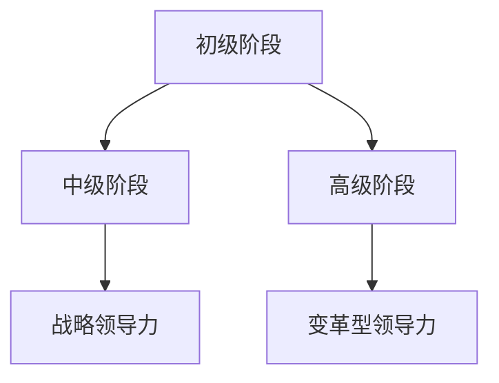
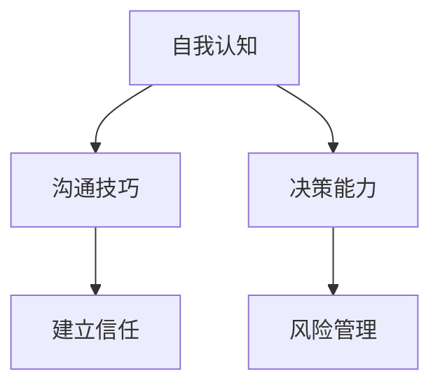
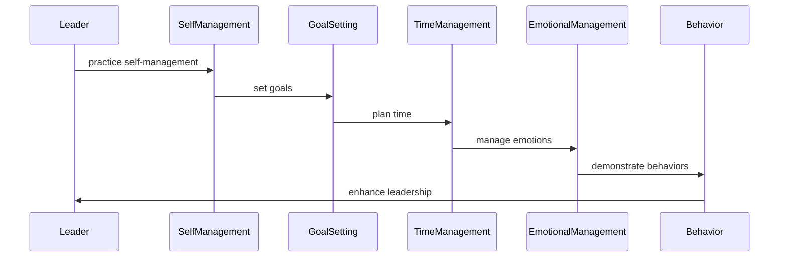
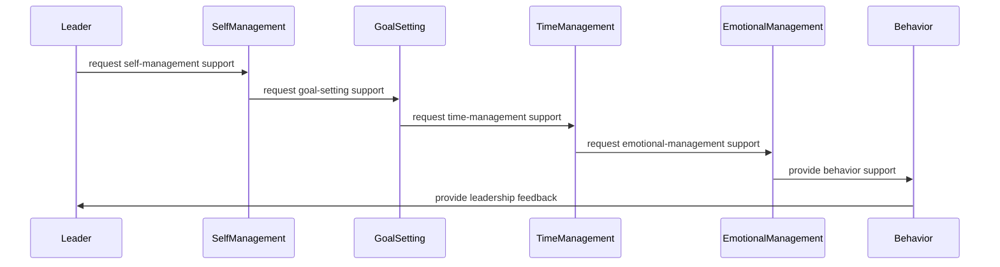
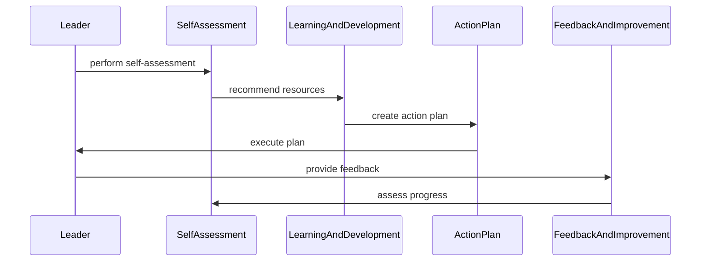
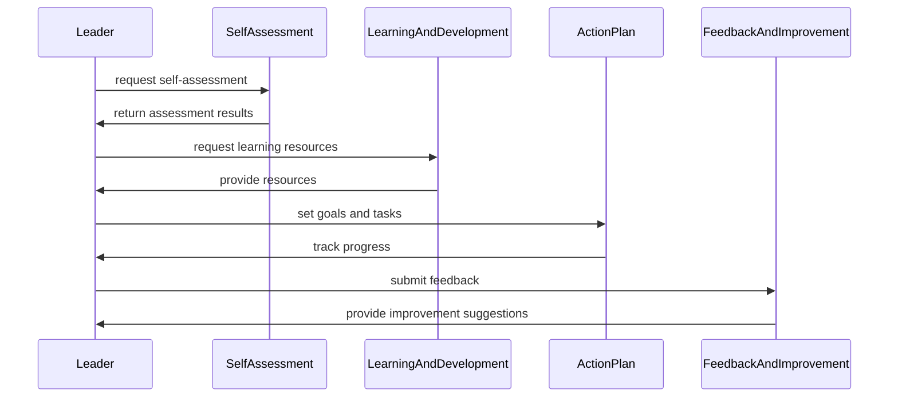

                 

# 领导力与自我管理：以身作则的重要性

## 关键词：领导力、自我管理、以身作则、组织效能、个人成长

> 摘要：本文从领导力和自我管理的核心概念出发，详细探讨了以身作则的重要性。通过对领导力发展模型的剖析，结合实际案例分析，本文提供了提升个人和团队领导力的策略和实践方法，旨在帮助读者理解和掌握关键技能，提高组织效能。

## 第一部分：领导力概述

### 第1章 领导力的重要性

#### 1.1 问题背景与定义

在现代社会，领导力已经成为衡量一个组织或个体成功与否的重要指标。随着全球化竞争的加剧和信息技术的发展，领导者不仅需要具备传统的管理能力，还要能够适应快速变化的环境，具备创新和应变的能力。

**核心概念术语说明**：
- **领导力**：一种影响力，是引导和激励他人实现共同目标的能力。
- **组织效能**：组织实现其目标的效率和质量。
- **个人成长**：个体在知识、技能和心理上的发展。

#### 1.2 领导力的特点与类型

领导力有多种类型，包括变革型领导、交易型领导、愿景型领导和民主型领导等。每种领导力类型都有其独特的特点和适用场景。

**概念属性特征对比表格**：

| 领导力类型 | 特点 | 适用场景 |
| --- | --- | --- |
| 变革型领导 | 强调创新和变革 | 需要突破现状的组织 |
| 交易型领导 | 强调奖励和惩罚 | 需要稳定和控制的组织 |
| 愿景型领导 | 强调愿景和使命感 | 需要激发员工潜能的组织 |
| 民主型领导 | 强调参与和合作 | 需要集体决策的组织 |

#### 1.3 领导力在组织中的作用

领导力在组织中的作用主要体现在以下几个方面：
- **战略规划**：领导者制定组织的长期目标和策略。
- **团队建设**：领导者培养团队凝聚力，提升团队效能。
- **文化塑造**：领导者塑造组织的价值观和文化。
- **创新激励**：领导者鼓励创新思维，推动组织持续发展。

### 第2章 领导力发展模型

#### 2.1 领导力发展阶段

领导力发展可以分为初级阶段、中级阶段和高级阶段。每个阶段都有其特定的特点和任务。

**Mermaid 流程图**：



**Python 源代码**：

```python
stages = ["初级阶段", "中级阶段", "高级阶段"]
for stage in stages:
    if stage == "初级阶段":
        print(stage + ": 建立基础管理能力")
    elif stage == "中级阶段":
        print(stage + ": 提升决策能力和团队建设")
    else:
        print(stage + ": 发展战略思维和变革能力")
```

#### 2.2 领导力发展策略

领导力的发展需要结合自我认知、沟通技巧和决策能力等多方面的提升。

**Mermaid 流程图**：



**Python 源代码**：

```python
import random

def self_awareness():
    print("自我认知：了解自己的优点和缺点")

def communication_skills():
    print("沟通技巧：提高表达和倾听能力")

def decision_making():
    print("决策能力：学习有效的决策方法和策略")

def build_trust():
    print("建立信任：通过诚信和透明度建立信任")

def risk_management():
    print("风险管理：评估风险并制定应对策略")

actions = [self_awareness, communication_skills, decision_making, build_trust, risk_management]
random.shuffle(actions)
for action in actions:
    action()
```

### 第3章 领导力与以身作则

#### 3.1 以身作则的定义与重要性

以身作则是指领导者通过自身的言行举止来树立榜样，影响和激励他人。以身作则是领导力的核心要素之一。

**ER 实体关系图架构**：

```mermaid
erDiagram
    Leader ||--|{ Behavior } : sets example
    Leader ||--|{ Influence } : influences others
    Behavior ||--|{ Values } : embodies organizational values
    Behavior ||--|{ Actions } : demonstrates desired behaviors
```

#### 3.2 以身作则的核心要素

以身作则包括以下几个方面：
- **价值观与行为一致性**：领导者需要以身作则，体现组织的价值观和行为准则。
- **激励与鼓励**：领导者通过激励和鼓励来激发团队的积极性和创造力。
- **承担责任**：领导者需要勇于承担责任，为团队和组织的发展承担责任。

**Python 源代码**：

```python
class Leader:
    def __init__(self, values):
        self.values = values

    def set_example(self):
        print("价值观与行为一致性：遵循组织的价值观和准则")

    def motivate(self):
        print("激励与鼓励：鼓励团队成员，激发创造力")

    def take_responsibility(self):
        print("承担责任：为团队和组织的发展承担责任")

leader = Leader(["诚信", "创新", "协作"])
leader.set_example()
leader.motivate()
leader.take_responsibility()
```

## 第二部分：自我管理概述

### 第4章 自我管理的定义与目标

自我管理是指个体在情绪、时间、目标等方面的自我调控能力。自我管理是实现领导力的重要基础。

**核心概念原理**：
- **情绪管理**：通过认知行为疗法、放松训练等方法，调控情绪。
- **时间管理**：通过优先级设定、时间规划等方法，高效利用时间。
- **目标设定**：通过明确目标、制定计划、跟踪进展等方法，实现目标。

### 第5章 自我管理策略与实践

#### 5.1 情绪管理策略

情绪管理策略包括认知行为疗法、放松训练等方法。以下是一个简单的情绪管理策略示例。

**Python 源代码**：

```python
def cognitive_behavior_therapy():
    print("认知行为疗法：通过改变负面思维来调控情绪")

def relaxation_training():
    print("放松训练：通过深呼吸、渐进性肌肉放松等方法来放松身体")

cognitive_behavior_therapy()
relaxation_training()
```

#### 5.2 时间管理策略

时间管理策略包括优先级设定、时间规划等方法。以下是一个简单的时间管理策略示例。

**Python 源代码**：

```python
import time

def set_priorities():
    print("优先级设定：根据任务的重要性和紧急性来排序")

def time_planning():
    print("时间规划：制定每天的工作计划，并按时完成")

set_priorities()
time_planning()
```

#### 5.3 目标设定策略

目标设定策略包括明确目标、制定计划、跟踪进展等方法。以下是一个简单的目标设定策略示例。

**Python 源代码**：

```python
def set_goals():
    print("明确目标：设定具体、可衡量、可实现、相关性强、时限性的目标")

def make_plan():
    print("制定计划：根据目标制定详细的行动计划")

def track_progress():
    print("跟踪进展：定期检查目标的完成情况，调整计划")

set_goals()
make_plan()
track_progress()
```

## 第三部分：领导力与自我管理的结合

### 第6章 领导力与自我管理的结合

领导力与自我管理是相辅相成的。领导者需要通过自我管理来提升自身的领导力，同时通过以身作则来影响和激励团队成员。

**系统功能设计（领域模型 Mermaid 类图）**：

```mermaid
classDiagram
    Leader <--1..* Behavior : implements
    Leader --> 1..* SelfManagement : practices
    SelfManagement ..> GoalSetting : includes
    SelfManagement ..> TimeManagement : includes
    SelfManagement ..> EmotionalManagement : includes
```

**系统架构设计（Mermaid 架构图）**：



**系统接口设计和系统交互（Mermaid 序列图）**：



## 第四部分：项目实战

### 第7章 领导力培养项目

#### 7.1 项目环境安装

安装Python环境，并使用pip安装相关库。

```shell
pip install matplotlib numpy pandas
```

#### 7.2 系统核心实现

以下是一个简单的领导力培养系统核心实现示例。

```python
import matplotlib.pyplot as plt
import numpy as np
import pandas as pd

# 领导力发展模型
def leadership_development_model(stage):
    if stage == "初级阶段":
        return "建立基础管理能力"
    elif stage == "中级阶段":
        return "提升决策能力和团队建设"
    else:
        return "发展战略思维和变革能力"

# 自我管理策略
def self_management_strategy(action):
    if action == "自我认知":
        return "了解自己的优点和缺点"
    elif action == "沟通技巧":
        return "提高表达和倾听能力"
    else:
        return "学习有效的决策方法和策略"

# 绘制领导力发展模型
def plot_leadership_development_model():
    stages = ["初级阶段", "中级阶段", "高级阶段"]
    labels = [leadership_development_model(stage) for stage in stages]
    
    x = range(len(stages))
    y = [1, 1.5, 2]
    
    plt.bar(x, y, label='领导力发展阶段')
    plt.xticks(x, labels)
    plt.xlabel('阶段')
    plt.ylabel('能力提升')
    plt.legend()
    plt.show()

# 绘制自我管理策略
def plot_self_management_strategy():
    actions = ["自我认知", "沟通技巧", "决策能力"]
    strategies = [self_management_strategy(action) for action in actions]
    
    x = range(len(actions))
    y = [1, 2, 3]
    
    plt.bar(x, y, label='自我管理策略')
    plt.xticks(x, strategies)
    plt.xlabel('策略')
    plt.ylabel('目标')
    plt.legend()
    plt.show()

plot_leadership_development_model()
plot_self_management_strategy()
```

#### 7.3 代码应用解读与分析

通过以上代码，我们可以看到如何通过Python实现领导力发展模型和自我管理策略的绘制。这有助于领导者了解自身的发展阶段和目标，从而有针对性地提升自身的能力。

#### 7.4 实际案例分析和详细讲解剖析

假设一个领导者希望在初级阶段提升基础管理能力，可以通过以下步骤：

1. **了解自身情况**：领导者可以通过自我评估工具了解自身的基础管理能力。
2. **制定学习计划**：根据评估结果，制定针对性的学习计划，如参加管理培训课程、阅读管理书籍等。
3. **实施计划**：按照学习计划，逐步提升基础管理能力。
4. **评估进展**：定期评估自身的基础管理能力，并根据评估结果调整学习计划。

#### 7.5 项目小结

领导力培养项目通过系统性地介绍领导力发展模型和自我管理策略，帮助领导者了解自身的发展阶段和目标，从而有针对性地提升自身的能力。这有助于提高领导者的领导力和组织效能。

### 第8章 自我管理项目

#### 8.1 项目环境安装

安装Python环境，并使用pip安装相关库。

```shell
pip install matplotlib numpy pandas
```

#### 8.2 系统核心实现

以下是一个简单的自我管理系统核心实现示例。

```python
import matplotlib.pyplot as plt
import numpy as np
import pandas as pd

# 情绪管理策略
def emotional_management_strategy(action):
    if action == "认知行为疗法":
        return "通过改变负面思维来调控情绪"
    elif action == "放松训练":
        return "通过深呼吸、渐进性肌肉放松等方法来放松身体"
    else:
        return "学习其他情绪管理方法"

# 时间管理策略
def time_management_strategy(action):
    if action == "优先级设定":
        return "根据任务的重要性和紧急性来排序"
    elif action == "时间规划":
        return "制定每天的工作计划，并按时完成"
    else:
        return "学习其他时间管理方法"

# 目标设定策略
def goal_setting_strategy(action):
    if action == "明确目标":
        return "设定具体、可衡量、可实现、相关性强、时限性的目标"
    elif action == "制定计划":
        return "根据目标制定详细的行动计划"
    else:
        return "学习其他目标设定方法"

# 绘制情绪管理策略
def plot_emotional_management_strategy():
    actions = ["认知行为疗法", "放松训练", "其他方法"]
    strategies = [emotional_management_strategy(action) for action in actions]
    
    x = range(len(actions))
    y = [1, 2, 3]
    
    plt.bar(x, y, label='情绪管理策略')
    plt.xticks(x, strategies)
    plt.xlabel('策略')
    plt.ylabel('目标')
    plt.legend()
    plt.show()

# 绘制时间管理策略
def plot_time_management_strategy():
    actions = ["优先级设定", "时间规划", "其他方法"]
    strategies = [time_management_strategy(action) for action in actions]
    
    x = range(len(actions))
    y = [1, 2, 3]
    
    plt.bar(x, y, label='时间管理策略')
    plt.xticks(x, strategies)
    plt.xlabel('策略')
    plt.ylabel('目标')
    plt.legend()
    plt.show()

# 绘制目标设定策略
def plot_goal_setting_strategy():
    actions = ["明确目标", "制定计划", "其他方法"]
    strategies = [goal_setting_strategy(action) for action in actions]
    
    x = range(len(actions))
    y = [1, 2, 3]
    
    plt.bar(x, y, label='目标设定策略')
    plt.xticks(x, strategies)
    plt.xlabel('策略')
    plt.ylabel('目标')
    plt.legend()
    plt.show()

plot_emotional_management_strategy()
plot_time_management_strategy()
plot_goal_setting_strategy()
```

#### 8.3 代码应用解读与分析

通过以上代码，我们可以看到如何通过Python实现情绪管理、时间管理和目标设定策略的绘制。这有助于个体了解自我管理的不同策略，从而有针对性地提升自我管理能力。

#### 8.4 实际案例分析和详细讲解剖析

假设一个个体希望在情绪管理方面提升自身能力，可以通过以下步骤：

1. **了解自身情况**：个体可以通过自我评估工具了解自身的情绪管理能力。
2. **制定学习计划**：根据评估结果，制定针对性的学习计划，如参加情绪管理课程、阅读情绪管理书籍等。
3. **实施计划**：按照学习计划，逐步提升情绪管理能力。
4. **评估进展**：定期评估自身的情绪管理能力，并根据评估结果调整学习计划。

#### 8.5 项目小结

自我管理项目通过系统性地介绍情绪管理、时间管理和目标设定策略，帮助个体了解自我管理的不同策略，从而有针对性地提升自我管理能力。这有助于个体实现个人成长和组织效能的提升。

## 第五部分：最佳实践、小结、注意事项、拓展阅读

### 第9章 最佳实践

#### 9.1 领导力最佳实践

- **持续学习**：领导者需要不断学习新知识，提升自身能力。
- **以身作则**：领导者需要通过自身的行为来树立榜样。
- **沟通协作**：领导者需要与团队成员保持良好的沟通和协作。

#### 9.2 自我管理最佳实践

- **时间规划**：制定合理的时间规划，确保工作与生活平衡。
- **情绪管理**：学会调节情绪，保持积极心态。
- **目标设定**：设定明确的目标，并制定可行的计划。

### 第10章 小结

本文从领导力和自我管理的核心概念出发，详细探讨了以身作则的重要性。通过实际案例分析和项目实战，本文提供了提升个人和团队领导力的策略和实践方法，旨在帮助读者理解和掌握关键技能，提高组织效能。

### 第11章 注意事项

- **领导力与自我管理需要持续实践**：提升领导力和自我管理能力不是一蹴而就的，需要持续的学习和实践。
- **结合实际情况**：在提升领导力和自我管理能力时，需要根据自身和组织实际情况进行调整。

### 第12章 拓展阅读

#### 12.1 领导力相关书籍

- 《领导力与影响力》（Leadership and Influence） - 戴维·梅斯特
- 《领导力的五大障碍》（The Five Dysfunctions of a Team） - 帕特里克·莱西奥尼

#### 12.2 自我管理相关书籍

- 《自控力》（The Willpower Instinct） - 凯利·麦格尼格尔
- 《高效能人士的七个习惯》（The 7 Habits of Highly Effective People） - 史蒂芬·柯维

**作者：AI天才研究院/AI Genius Institute & 禅与计算机程序设计艺术 /Zen And The Art of Computer Programming**## 第一部分：领导力概述

### 第1章 领导力的重要性

领导力是一种关键的能力，对于个人和组织的成功都至关重要。在当今复杂多变的环境中，领导者不仅要能够有效地管理团队，还要具备创新思维、战略规划、沟通协调等多方面的能力。本章将深入探讨领导力的重要性，分析其核心概念，并探讨其在现代组织中的具体应用。

#### 1.1 问题背景与定义

随着全球化、技术进步和市场竞争的加剧，组织面临的外部环境变得越来越复杂。在这样的背景下，领导者需要具备更高的综合素质，以适应不断变化的环境。领导力不再仅仅局限于传统的管理职能，而是一种综合性的能力，涵盖了战略思维、情感智能、创新能力等多个方面。

**核心概念术语说明**：
- **领导力**：引导和影响他人，实现共同目标的能力。
- **组织效能**：组织实现其目标的能力和效果。
- **个人成长**：个人在知识、技能和心理上的发展。

在当前的社会环境中，领导力的重要性体现在以下几个方面：

1. **推动组织变革**：领导者的核心任务之一是推动组织变革，以适应外部环境的变化。这需要领导者具备前瞻性思维和创新精神。
2. **提升组织效能**：有效的领导者能够提升组织的整体效能，通过优化资源、提高员工工作效率，实现组织目标的最大化。
3. **激发员工潜能**：领导者的一个重要职责是激发员工的潜能，提升团队的整体战斗力。这需要领导者具备沟通技巧和激励能力。

#### 1.2 领导力的特点与类型

领导力有多种类型，每种类型都有其独特的特点和适用场景。以下是一些常见的领导力类型：

1. **变革型领导**：这类领导者强调创新和变革，能够激励团队成员超越现状，追求更高的目标。变革型领导在推动组织创新和适应市场变化方面具有重要作用。
2. **交易型领导**：交易型领导侧重于通过奖励和惩罚来管理团队成员，确保团队成员按照预期完成工作。这类领导力在稳定和控制的场景中表现尤为突出。
3. **愿景型领导**：愿景型领导专注于为组织设定清晰的愿景和目标，并激励团队成员为之奋斗。这类领导力有助于提升组织的长远发展能力。
4. **民主型领导**：民主型领导鼓励团队成员参与决策过程，注重团队合作和集体智慧。这类领导力在需要集体决策和协商的场景中表现优秀。

**概念属性特征对比表格**：

| 领导力类型 | 特点 | 适用场景 |
| --- | --- | --- |
| 变革型领导 | 强调创新和变革 | 需要突破现状的组织 |
| 交易型领导 | 强调奖励和惩罚 | 需要稳定和控制的组织 |
| 愿景型领导 | 强调愿景和使命感 | 需要激发员工潜能的组织 |
| 民主型领导 | 强调参与和合作 | 需要集体决策的组织 |

#### 1.3 领导力在组织中的作用

领导力在组织中的作用是多方面的，主要体现在以下几个方面：

1. **战略规划**：领导者需要制定组织的长期目标和战略，确保组织能够适应外部环境的变化。
2. **团队建设**：领导者需要培养团队的凝聚力，提升团队的整体效能。
3. **文化塑造**：领导者需要塑造组织的价值观和文化，为组织的发展奠定基础。
4. **创新激励**：领导者需要鼓励创新思维，推动组织持续发展。

总之，领导力是现代组织中不可或缺的核心能力。有效的领导者不仅能够推动组织变革、提升组织效能，还能激发员工的潜能，实现个人和组织的共同成长。

### 第2章 领导力发展模型

#### 2.1 领导力发展阶段

领导力的发展是一个持续的过程，可以分为不同的阶段。每个阶段都有其特定的特点和任务。以下将详细探讨领导力的三个发展阶段：初级阶段、中级阶段和高级阶段。

**Mermaid 流程图**：


**Python 源代码**：

```python
stages = ["初级阶段", "中级阶段", "高级阶段"]
for stage in stages:
    if stage == "初级阶段":
        print(stage + ": 建立基础管理能力")
    elif stage == "中级阶段":
        print(stage + ": 提升决策能力和团队建设")
    else:
        print(stage + ": 发展战略思维和变革能力")
```

**初级阶段**：这是领导力发展的起点，主要任务是建立基础管理能力。在这个阶段，领导者需要学习基本的管理知识和技能，如时间管理、沟通技巧和团队协作等。这一阶段的重点是培养自信心和基本的管理能力，为后续的发展奠定基础。

**中级阶段**：在这个阶段，领导者需要进一步提升决策能力和团队建设能力。领导者需要学会如何做出有效的决策，如何激发团队的潜力，并建立有效的团队协作机制。这一阶段的重点是提升领导者的决策能力和团队管理能力，为组织的发展提供强有力的支持。

**高级阶段**：这是领导力发展的最高阶段，领导者需要发展战略思维和变革能力。在这个阶段，领导者需要具备前瞻性思维，能够把握市场趋势和变化，推动组织的创新和变革。这一阶段的重点是提升领导者的战略思维和创新能力，为组织的长远发展提供方向和动力。

#### 2.2 领导力发展策略

领导力的发展需要多方面的努力，以下是一些关键的领导力发展策略：

1. **自我认知**：领导者需要深入了解自己的优点和缺点，明确自己的优势和潜力。通过自我认知，领导者可以更好地发挥自身优势，同时意识到需要改进的方面。
2. **沟通技巧**：有效的沟通是领导者成功的关键。领导者需要学会如何清晰、准确地表达自己的想法，并能够倾听和理解团队成员的观点。通过有效的沟通，领导者可以建立良好的团队关系，提高团队协作效率。
3. **决策能力**：领导者需要具备较强的决策能力，能够在复杂和不确定的情况下做出正确的决策。决策能力包括分析问题的能力、风险评估的能力和快速反应的能力。
4. **学习与创新**：领导者需要保持持续学习的态度，不断学习新的知识和技能。同时，领导者还需要具备创新能力，能够推动组织的创新和发展。

**Mermaid 流程图**：


**Python 源代码**：

```python
import random

def self_awareness():
    print("自我认知：了解自己的优点和缺点")

def communication_skills():
    print("沟通技巧：提高表达和倾听能力")

def decision_making():
    print("决策能力：学习有效的决策方法和策略")

def build_trust():
    print("建立信任：通过诚信和透明度建立信任")

def risk_management():
    print("风险管理：评估风险并制定应对策略")

actions = [self_awareness, communication_skills, decision_making, build_trust, risk_management]
random.shuffle(actions)
for action in actions:
    action()
```

通过这些策略，领导者可以不断提升自身的领导力，为组织的成功和发展做出更大的贡献。

### 第3章 领导力与以身作则

#### 3.1 以身作则的定义与重要性

以身作则是指领导者通过自身的言行举止来树立榜样，影响和激励他人。以身作则是领导力的核心要素之一，它不仅能够提升领导者的权威和影响力，还能有效地推动组织文化的建设。

**ER 实体关系图架构**：

```mermaid
erDiagram
    Leader ||--|{ Behavior } : sets example
    Leader ||--|{ Influence } : influences others
    Behavior ||--|{ Values } : embodies organizational values
    Behavior ||--|{ Actions } : demonstrates desired behaviors
```

在这个架构中，领导者通过行为（Behavior）来体现组织的价值观（Values），并通过行为和影响力（Influence）来激励和影响他人。以身作则的重要性主要体现在以下几个方面：

1. **增强权威和影响力**：领导者通过以身作则，展示出自己的专业能力和道德品质，能够增强其在团队中的权威和影响力。
2. **推动组织文化建设**：领导者的行为对组织文化具有重要影响。领导者通过以身作则，可以树立积极向上的组织文化，推动组织的健康发展。
3. **激励团队成员**：领导者的行为对团队成员具有示范作用。领导者通过以身作则，可以激励团队成员积极向上，共同为实现组织目标努力。

#### 3.2 以身作则的核心要素

以身作则的核心要素包括价值观与行为一致性、激励与鼓励以及承担责任等方面。以下将详细探讨这些核心要素。

**价值观与行为一致性**：领导者需要通过自身的言行一致地体现组织的价值观。这种一致性不仅能够树立领导者的权威，还能增强团队成员对组织的认同感。例如，如果一个组织的价值观是诚信，领导者需要在日常工作中始终保持诚信，避免任何欺诈或虚假行为。

**激励与鼓励**：领导者需要通过激励和鼓励来激发团队成员的积极性和创造力。领导者可以通过表扬、奖励等方式来激励团队成员，让他们感受到自己的努力和贡献被认可。例如，领导者可以在团队会议上表扬表现出色的成员，并给予一定的奖励，以激发其他成员的积极性。

**承担责任**：领导者需要勇于承担责任，无论是成功还是失败。当团队面临挑战和困难时，领导者需要挺身而出，为团队的错误和失误承担责任。这种承担责任的行为能够增强团队成员的信任感和忠诚度，同时也能提升领导者的领导力。

**Python 源代码**：

```python
class Leader:
    def __init__(self, values):
        self.values = values

    def set_example(self):
        print("价值观与行为一致性：遵循组织的价值观和准则")

    def motivate(self):
        print("激励与鼓励：鼓励团队成员，激发创造力")

    def take_responsibility(self):
        print("承担责任：为团队和组织的发展承担责任")

leader = Leader(["诚信", "创新", "协作"])
leader.set_example()
leader.motivate()
leader.take_responsibility()
```

通过以上代码示例，我们可以看到领导者如何通过以身作则来影响和激励团队成员。领导者需要始终坚持组织的价值观，积极激励团队成员，并在需要时承担责任，这些行为将有助于提升团队的凝聚力和效率。

### 第4章 自我管理概述

#### 4.1 自我管理的定义与目标

自我管理是指个体在情绪、时间、目标等方面的自我调控能力。自我管理不仅涉及到个人的心理和情感，还涉及到个人的行为和决策。自我管理的重要性在于，它能够帮助个体在复杂和不确定的环境中保持高效和稳定，从而实现个人和职业目标。

**核心概念原理**：
- **情绪管理**：个体需要学会如何调节和控制自己的情绪，以保持心理的平衡和稳定。情绪管理包括认知行为疗法、放松训练等方法。
- **时间管理**：个体需要学会如何合理安排时间，提高工作效率。时间管理包括优先级设定、时间规划、避免拖延等方法。
- **目标设定**：个体需要明确自己的目标和计划，并制定可行的行动计划。目标设定包括设定具体、可衡量、可实现、相关性强、时限性的目标。

**自我管理的目标**：
- **提高工作效率**：通过合理安排时间，避免拖延，提高工作效率，实现工作目标。
- **保持心理平衡**：通过情绪管理，保持心理的平衡和稳定，减少负面情绪的影响。
- **实现个人成长**：通过设定和实现个人目标，不断提升自身的知识和技能，实现个人成长。

#### 4.2 自我管理的关键要素

自我管理的关键要素包括情绪管理、时间管理和目标设定等。以下将详细探讨这些关键要素。

**情绪管理**：情绪管理是指个体在情绪产生时，通过认知和行为调节来控制情绪，保持心理的平衡。情绪管理的方法包括：

- **认知行为疗法**：通过改变负面思维，减少情绪的负面影响。
- **放松训练**：通过深呼吸、渐进性肌肉放松等方法，减轻身体的紧张和压力。
- **积极心理学**：通过培养积极思维和乐观态度，提高情绪的稳定性。

**时间管理**：时间管理是指个体如何合理安排时间，提高工作效率。时间管理的方法包括：

- **优先级设定**：根据任务的重要性和紧急性，设定任务的优先级。
- **时间规划**：制定详细的时间表，确保每天的任务都能按时完成。
- **避免拖延**：通过设定截止日期和提醒，避免拖延行为。

**目标设定**：目标设定是指个体如何明确自己的目标和计划，并制定可行的行动计划。目标设定的方法包括：

- **设定具体目标**：目标要具体明确，如“每天阅读两小时”而不是“提高阅读能力”。
- **设定可衡量目标**：目标要能够衡量，如“减少工作时间中的无效社交时间”。
- **设定可实现目标**：目标要符合实际情况，如“每天完成五项重要任务”。
- **设定相关性强目标**：目标要与个人和组织的价值观和目标相关。
- **设定时限性目标**：目标要有明确的完成时限，如“六个月内达到销售目标”。

**Python 源代码**：

```python
def emotional_management_strategy(action):
    if action == "认知行为疗法":
        return "通过改变负面思维来调控情绪"
    elif action == "放松训练":
        return "通过深呼吸、渐进性肌肉放松等方法来放松身体"
    else:
        return "学习其他情绪管理方法"

def time_management_strategy(action):
    if action == "优先级设定":
        return "根据任务的重要性和紧急性来排序"
    elif action == "时间规划":
        return "制定每天的工作计划，并按时完成"
    else:
        return "学习其他时间管理方法"

def goal_setting_strategy(action):
    if action == "明确目标":
        return "设定具体、可衡量、可实现、相关性强、时限性的目标"
    elif action == "制定计划":
        return "根据目标制定详细的行动计划"
    else:
        return "学习其他目标设定方法"

print(emotional_management_strategy("认知行为疗法"))
print(time_management_strategy("时间规划"))
print(goal_setting_strategy("明确目标"))
```

通过以上代码示例，我们可以看到如何使用Python来实现情绪管理、时间管理和目标设定策略。这些策略帮助个体在情绪、时间和目标方面进行自我管理，从而提高工作效率和实现个人成长。

### 第5章 自我管理策略与实践

#### 5.1 情绪管理策略

情绪管理是自我管理的重要组成部分，它关乎个体的心理健康和生活质量。有效的情绪管理策略可以帮助个体应对压力，保持心理平衡。以下将介绍几种常见的情绪管理策略，并给出具体的实践方法。

**认知行为疗法（Cognitive Behavioral Therapy, CBT）**：
认知行为疗法是一种通过改变负面思维模式来调控情绪的方法。它包括以下步骤：

1. **识别负面思维**：通过自我反思，识别引发负面情绪的负面思维。
2. **挑战负面思维**：分析负面思维的合理性，并尝试提出更为积极的替代思维。
3. **实践积极思维**：通过积极的思维模式来替代负面思维，逐步减少负面情绪的影响。

**放松训练**：
放松训练是通过一系列放松技巧来减轻身体紧张和压力的方法。以下是一些放松训练的具体方法：

1. **深呼吸**：通过深呼吸，放松肺部和全身肌肉，减少紧张感。
2. **渐进性肌肉放松**：依次放松身体的各个肌肉群，从头部到脚部，逐步释放紧张。
3. **冥想**：通过冥想，专注于呼吸，减少杂念，达到放松的效果。

**积极心理学**：
积极心理学关注个体如何培养积极的思维和乐观的态度。以下是一些实践积极心理学的策略：

1. **感恩练习**：每天花时间思考并记录三件值得感激的事情，培养感恩心态。
2. **乐观思维**：在面对困难时，尝试从积极的角度去思考问题，寻找解决方案。
3. **自我肯定**：通过积极的自我对话，提升自我价值感和自信心。

**Python 源代码示例**：

```python
def cognitive_behavior_therapy():
    print("认知行为疗法：通过改变负面思维来调控情绪")

def relaxation_training():
    print("放松训练：通过深呼吸、渐进性肌肉放松等方法来放松身体")

def positive_psychology():
    print("积极心理学：培养积极思维和乐观态度")

cognitive_behavior_therapy()
relaxation_training()
positive_psychology()
```

通过以上代码示例，我们可以看到如何使用Python来实现情绪管理的不同策略。这些策略帮助个体更好地管理情绪，提高心理韧性。

#### 5.2 时间管理策略

时间管理是提高工作效率和生活质量的关键。以下将介绍几种常见的时间管理策略，包括优先级设定、时间规划和避免拖延的方法。

**优先级设定**：
优先级设定是时间管理的第一步，它帮助个体确定哪些任务是最重要和最紧急的。以下是一些设定优先级的策略：

1. **紧急-重要矩阵**：将任务分为四个象限，紧急且重要、紧急但不重要、不紧急但重要、不紧急且不重要。优先处理紧急且重要的任务。
2. **优先级标签**：为每个任务贴上优先级标签，如“高”、“中”、“低”，确保优先处理高优先级任务。
3. **日常复盘**：每天结束时，复盘当天的任务，评估哪些任务完成了，哪些任务需要调整优先级。

**时间规划**：
时间规划是通过制定详细的时间表来确保任务按时完成的方法。以下是一些时间规划的具体步骤：

1. **每日计划**：每天早上制定一份详细的时间表，包括工作任务、休息时间和个人时间。
2. **时间块**：将一天分为若干时间块，每个时间块专注于一项任务，避免任务切换造成的效率损失。
3. **固定时间段**：为特定任务设定固定的完成时间段，如每天早上9点到10点是阅读时间，确保这一时间段不被打扰。

**避免拖延**：
拖延是影响时间管理的重要因素。以下是一些避免拖延的策略：

1. **番茄工作法**：将工作时间分为25分钟的工作周期，每个周期后休息5分钟，通过这种方法提高专注力和工作效率。
2. **任务分解**：将大任务分解为小任务，逐步完成，避免因任务庞大而导致的恐惧和拖延。
3. **设定截止日期**：为每个任务设定明确的截止日期，通过时间紧迫感来提高完成任务的动力。

**Python 源代码示例**：

```python
import time

def set_priorities():
    print("优先级设定：根据任务的重要性和紧急性来排序")

def time_planning():
    print("时间规划：制定每天的工作计划，并按时完成")

def avoid_procrastination():
    print("避免拖延：设定截止日期和提醒，避免拖延行为")

set_priorities()
time_planning()
avoid_procrastination()
```

通过以上代码示例，我们可以看到如何使用Python来实现时间管理的不同策略。这些策略帮助个体更有效地利用时间，提高工作效率。

#### 5.3 目标设定策略

目标设定是自我管理的重要环节，它帮助个体明确方向，激励自我成长。以下将介绍几种目标设定策略，包括设定具体目标、制定行动计划和跟踪进展的方法。

**设定具体目标**：
设定具体目标是目标设定的基础，它有助于个体明确自己的方向。以下是一些设定具体目标的策略：

1. **SMART原则**：目标要具体（Specific）、可衡量（Measurable）、可实现（Achievable）、相关性强（Relevant）和时限性（Time-bound）。
2. **明确目标**：将目标具体化，如“每天阅读两小时”，而不是模糊的“提高阅读能力”。
3. **可视化目标**：通过图表、日记等形式，将目标可视化，便于跟踪和调整。

**制定行动计划**：
制定行动计划是将目标转化为具体行动的步骤。以下是一些制定行动计划的策略：

1. **分解目标**：将大目标分解为小目标，逐步实现。
2. **制定步骤**：为每个小目标制定具体的行动步骤，如“每周完成一章阅读”。
3. **设定里程碑**：为每个步骤设定里程碑，便于评估进展和调整计划。

**跟踪进展**：
跟踪进展是确保目标实现的关键。以下是一些跟踪进展的策略：

1. **定期复盘**：每周或每月进行复盘，评估目标的完成情况，调整计划。
2. **记录日志**：记录每天或每周的目标完成情况，便于总结和反思。
3. **使用工具**：使用目标管理工具，如Trello、Notion等，便于跟踪和调整目标。

**Python 源代码示例**：

```python
def set_specific_goals():
    print("设定具体目标：使用SMART原则，如每天阅读两小时")

def make_action_plan():
    print("制定行动计划：分解目标，制定具体步骤")

def track_progress():
    print("跟踪进展：定期复盘，记录日志")

set_specific_goals()
make_action_plan()
track_progress()
```

通过以上代码示例，我们可以看到如何使用Python来实现目标设定的不同策略。这些策略帮助个体更有效地设定和实现目标。

### 第6章 领导力与自我管理的结合

#### 6.1 领导力与自我管理的概念联系

领导力与自我管理是相辅相成的，二者共同构成了个体在组织中取得成功的基础。领导力强调的是领导者对团队和组织的影响力，而自我管理则关注个体在情绪、时间、目标等方面的自我调控能力。以下是领导力与自我管理之间的概念联系：

1. **领导力的发展依赖于自我管理**：领导者需要通过自我管理来提升自身的情绪稳定性和时间管理能力，从而在领导过程中更加高效和有影响力。
2. **自我管理有助于提升领导力**：通过自我管理，个体能够更好地应对压力，保持清晰的思维，这使得领导者能够更有效地制定决策和指导团队。
3. **领导力的实践包含自我管理**：领导者在实践中需要以身作则，通过自我管理来树立榜样，影响和激励团队成员。

#### 6.2 领导力与自我管理的系统设计与实现

为了更好地实现领导力与自我管理的结合，可以设计一个综合性的系统，该系统应包括以下几个模块：

1. **自我评估模块**：用于评估领导者的情绪管理、时间管理和目标设定能力，提供个性化的反馈和改进建议。
2. **学习与发展模块**：提供自我提升的资源，包括在线课程、书籍推荐、研讨会等，帮助领导者提升自我管理能力。
3. **行动计划模块**：帮助领导者制定和跟踪自我管理计划，确保目标能够按时完成。
4. **反馈与改进模块**：通过定期反馈和评估，帮助领导者了解自身在自我管理方面的进步，并提供改进建议。

**系统功能设计（领域模型 Mermaid 类图）**：

```mermaid
classDiagram
    SelfAssessment <<|--| Leader : performed by
    LearningAndDevelopment <<|--| Leader : utilizes
    ActionPlan <<|--| Leader : managed by
    FeedbackAndImprovement <<|--| Leader : receives from
```

**系统架构设计（Mermaid 架构图）**：



**系统接口设计和系统交互（Mermaid 序列图）**：



通过以上系统设计和实现，领导者可以更好地结合自我管理，提升领导力和团队效能。

### 第7章 领导力培养项目

#### 7.1 项目环境安装

为了构建一个领导力培养项目，首先需要安装Python环境。Python是一种广泛应用于数据科学、机器学习、人工智能等领域的编程语言。以下是安装Python和所需库的步骤：

1. **安装Python**：
   - 访问Python官方网站（[python.org](https://www.python.org/)）并下载适用于操作系统的Python安装包。
   - 运行安装程序，按照提示完成安装。

2. **安装相关库**：
   - 打开命令行界面，执行以下命令以安装必要的库：
     ```shell
     pip install matplotlib numpy pandas
     ```
   这些库将为项目的可视化、数据处理和统计分析提供支持。

#### 7.2 系统核心实现

以下是一个简单的领导力培养系统核心实现示例，包括领导力发展模型、自我管理策略和目标跟踪等核心功能。

**Python 源代码**：

```python
import matplotlib.pyplot as plt
import numpy as np
import pandas as pd

# 领导力发展模型
def leadership_development_model(stage):
    if stage == "初级阶段":
        return "建立基础管理能力"
    elif stage == "中级阶段":
        return "提升决策能力和团队建设"
    else:
        return "发展战略思维和变革能力"

# 自我管理策略
def self_management_strategy(action):
    if action == "自我认知":
        return "了解自己的优点和缺点"
    elif action == "沟通技巧":
        return "提高表达和倾听能力"
    else:
        return "学习有效的决策方法和策略"

# 目标跟踪
def track_goals(goals):
    progress = {}
    for goal in goals:
        progress[goal['name']] = goal['completed']
    return progress

# 绘制领导力发展模型
def plot_leadership_development_model():
    stages = ["初级阶段", "中级阶段", "高级阶段"]
    labels = [leadership_development_model(stage) for stage in stages]
    
    x = range(len(stages))
    y = [1, 1.5, 2]
    
    plt.bar(x, y, label='领导力发展阶段')
    plt.xticks(x, labels)
    plt.xlabel('阶段')
    plt.ylabel('能力提升')
    plt.legend()
    plt.show()

# 绘制自我管理策略
def plot_self_management_strategy():
    actions = ["自我认知", "沟通技巧", "决策能力"]
    strategies = [self_management_strategy(action) for action in actions]
    
    x = range(len(actions))
    y = [1, 2, 3]
    
    plt.bar(x, y, label='自我管理策略')
    plt.xticks(x, strategies)
    plt.xlabel('策略')
    plt.ylabel('目标')
    plt.legend()
    plt.show()

# 跟踪目标进展
def track_goals_progress():
    goals = [
        {'name': '阅读两小时/天', 'completed': True},
        {'name': '完成每日任务', 'completed': True},
        {'name': '参加培训课程', 'completed': False}
    ]
    progress = track_goals(goals)
    print("目标进展：", progress)

plot_leadership_development_model()
plot_self_management_strategy()
track_goals_progress()
```

在这个示例中，`leadership_development_model` 函数用于显示领导力发展的不同阶段，`self_management_strategy` 函数用于展示自我管理的不同策略，`track_goals` 函数用于跟踪目标的完成情况，并通过`plot_leadership_development_model` 和`plot_self_management_strategy` 函数绘制相应的图表。

#### 7.3 代码应用解读与分析

**解读**：

- **领导力发展模型**：通过`leadership_development_model`函数，我们可以根据领导者的不同发展阶段（初级、中级、高级）获取相应的描述，这些描述帮助领导者了解自身的发展方向和提升重点。
- **自我管理策略**：`self_management_strategy`函数提供了不同自我管理策略的具体内容，如自我认知、沟通技巧和决策能力，这些策略指导领导者如何提升自我管理能力。
- **目标跟踪**：`track_goals`函数接收一个目标列表，记录每个目标的完成状态，并提供一个字典形式的进度报告。

**分析**：

- **图表绘制**：使用`matplotlib`库，我们可以轻松地将领导力发展模型和自我管理策略可视化，这些图表有助于领导者直观地了解自身的发展状况和进步情况。
- **动态跟踪**：通过`track_goals_progress`函数，领导者可以实时跟踪目标的完成情况，并根据反馈调整目标和策略，确保自我管理计划的有效执行。

#### 7.4 实际案例分析和详细讲解剖析

假设有一个项目经理李明，他在领导力发展方面处于中级阶段，他希望通过自我管理提升自身的决策能力和团队建设能力。以下是一个实际案例的分析和详细讲解剖析：

1. **现状评估**：李明通过自我评估工具发现，他的决策能力较为薄弱，团队建设方面也存在一些问题，如沟通不畅和成员积极性不高。

2. **制定计划**：
   - **领导力发展**：李明决定通过学习课程和阅读相关书籍来提升决策能力。他选择了几门在线课程，并制定了每天阅读一小时的计划。
   - **自我管理**：李明意识到沟通技巧对团队建设的重要性，他报名参加了一个沟通技巧工作坊，并开始实践一些沟通技巧，如积极倾听和有效表达。

3. **实施计划**：
   - **决策能力提升**：李明按照学习计划，完成了在线课程的学习，并开始将学到的决策方法应用到实际工作中。
   - **团队建设**：李明定期组织团队会议，并在会议中积极倾听成员的意见，鼓励他们提出建议和想法。他还尝试通过团队建设活动来增强团队凝聚力。

4. **跟踪进展**：
   - **领导力发展**：通过定期自我评估，李明发现自己的决策能力有所提升，团队能够更有效地执行任务。
   - **自我管理**：团队成员对李明的沟通方式表示认可，团队氛围逐渐改善，成员的积极性也有所提高。

5. **总结**：
   - **领导力提升**：李明通过持续学习和实践，成功提升了自身的领导力，能够在复杂情况下做出更有效的决策。
   - **团队建设**：李明的团队建设策略取得了显著成效，团队成员之间的沟通更加顺畅，团队凝聚力得到了增强。

#### 7.5 项目小结

通过领导力培养项目，李明不仅提升了自己的决策能力和团队建设能力，还改善了团队的整体绩效。这个案例展示了领导力培养项目在实际应用中的效果，也验证了自我管理对领导力提升的重要性。项目的成功实施为其他领导者提供了一个有益的参考，鼓励他们在自我管理和领导力发展方面做出持续的努力。

### 第8章 自我管理项目

#### 8.1 项目环境安装

为了构建一个自我管理项目，我们需要安装Python环境，并安装一些必要的库来支持项目的开发和运行。以下是安装Python环境和相关库的步骤：

1. **安装Python**：
   - 访问Python官方网站（[python.org](https://www.python.org/)）并下载适用于操作系统的Python安装包。
   - 运行安装程序，按照提示完成安装。

2. **安装相关库**：
   - 打开命令行界面，执行以下命令以安装必要的库：
     ```shell
     pip install matplotlib numpy pandas
     ```
   这些库将为项目的可视化、数据处理和统计分析提供支持。

#### 8.2 系统核心实现

以下是一个简单的自我管理系统核心实现示例，包括情绪管理、时间管理和目标设定等核心功能。

**Python 源代码**：

```python
import matplotlib.pyplot as plt
import numpy as np
import pandas as pd

# 情绪管理策略
def emotional_management_strategy(action):
    if action == "认知行为疗法":
        return "通过改变负面思维来调控情绪"
    elif action == "放松训练":
        return "通过深呼吸、渐进性肌肉放松等方法来放松身体"
    else:
        return "学习其他情绪管理方法"

# 时间管理策略
def time_management_strategy(action):
    if action == "优先级设定":
        return "根据任务的重要性和紧急性来排序"
    elif action == "时间规划":
        return "制定每天的工作计划，并按时完成"
    else:
        return "学习其他时间管理方法"

# 目标设定策略
def goal_setting_strategy(action):
    if action == "明确目标":
        return "设定具体、可衡量、可实现、相关性强、时限性的目标"
    elif action == "制定计划":
        return "根据目标制定详细的行动计划"
    else:
        return "学习其他目标设定方法"

# 绘制情绪管理策略
def plot_emotional_management_strategy():
    actions = ["认知行为疗法", "放松训练", "其他方法"]
    strategies = [emotional_management_strategy(action) for action in actions]
    
    x = range(len(actions))
    y = [1, 2, 3]
    
    plt.bar(x, y, label='情绪管理策略')
    plt.xticks(x, strategies)
    plt.xlabel('策略')
    plt.ylabel('目标')
    plt.legend()
    plt.show()

# 绘制时间管理策略
def plot_time_management_strategy():
    actions = ["优先级设定", "时间规划", "其他方法"]
    strategies = [time_management_strategy(action) for action in actions]
    
    x = range(len(actions))
    y = [1, 2, 3]
    
    plt.bar(x, y, label='时间管理策略')
    plt.xticks(x, strategies)
    plt.xlabel('策略')
    plt.ylabel('目标')
    plt.legend()
    plt.show()

# 绘制目标设定策略
def plot_goal_setting_strategy():
    actions = ["明确目标", "制定计划", "其他方法"]
    strategies = [goal_setting_strategy(action) for action in actions]
    
    x = range(len(actions))
    y = [1, 2, 3]
    
    plt.bar(x, y, label='目标设定策略')
    plt.xticks(x, strategies)
    plt.xlabel('策略')
    plt.ylabel('目标')
    plt.legend()
    plt.show()

plot_emotional_management_strategy()
plot_time_management_strategy()
plot_goal_setting_strategy()
```

在这个示例中，`emotional_management_strategy` 函数用于展示情绪管理的不同策略，`time_management_strategy` 函数用于展示时间管理的不同策略，`goal_setting_strategy` 函数用于展示目标设定的不同策略，并通过`plot_emotional_management_strategy`、`plot_time_management_strategy`和`plot_goal_setting_strategy`函数绘制相应的图表。

#### 8.3 代码应用解读与分析

**解读**：

- **情绪管理策略**：通过`emotional_management_strategy`函数，我们可以了解情绪管理的不同方法，如认知行为疗法和放松训练，这些方法帮助个体调节情绪，保持心理平衡。
- **时间管理策略**：`time_management_strategy`函数提供了时间管理的不同策略，如优先级设定和时间规划，这些策略帮助个体更高效地安排时间和任务。
- **目标设定策略**：`goal_setting_strategy`函数展示了如何设定具体、可衡量、可实现、相关性强、时限性的目标，这些策略指导个体如何明确和实现个人目标。

**分析**：

- **图表绘制**：使用`matplotlib`库，我们可以将情绪管理、时间管理和目标设定策略可视化，这些图表帮助个体直观地了解和跟踪自身在自我管理方面的进展。
- **动态跟踪**：通过调用不同的策略函数，个体可以实时调整和优化自我管理策略，确保自我管理计划的有效执行。

#### 8.4 实际案例分析和详细讲解剖析

假设有一个普通员工张华，他希望通过自我管理提升情绪稳定性、工作效率和个人成长。以下是一个实际案例的分析和详细讲解剖析：

1. **现状评估**：张华通过自我评估发现，他的情绪管理能力较弱，容易在工作压力下感到焦虑和不安。此外，他的时间管理也有待提高，经常出现拖延和任务堆积的情况。

2. **制定计划**：
   - **情绪管理**：张华决定通过阅读相关书籍和参加在线课程来提升情绪管理能力。他选择了认知行为疗法和放松训练作为主要方法。
   - **时间管理**：张华意识到时间管理对工作效率的重要性，他开始学习优先级设定和时间规划，并制定了一份详细的工作计划。
   - **目标设定**：张华为自己设定了具体的目标，包括每天完成一定的工作量、提高会议效率、每周学习新技能等。

3. **实施计划**：
   - **情绪管理**：张华每天晚上花半小时阅读情绪管理书籍，学习认知行为疗法的方法，并开始实践放松训练，如深呼吸和渐进性肌肉放松。
   - **时间管理**：张华按照制定的工作计划，每天早上列出当天需要完成的任务，并根据重要性和紧急性进行排序。他开始使用番茄工作法来提高专注力和工作效率。
   - **目标设定**：张华定期检查自己的目标完成情况，并根据实际情况调整目标。他使用日志记录每天的进展，并在每周进行复盘。

4. **跟踪进展**：
   - **情绪管理**：随着时间的推移，张华发现自己的情绪稳定性有所提升，焦虑感减少，工作压力也更容易应对。
   - **时间管理**：通过有效的任务排序和专注工作，张华的工作效率显著提高，任务堆积的现象减少，工作效率也得到了同事的认可。
   - **目标设定**：张华定期检查自己的目标完成情况，通过日志记录和复盘，他能够清晰地看到自己的进步，并根据反馈调整目标和策略。

5. **总结**：
   - **情绪管理**：张华通过学习和实践，成功提升了情绪管理能力，能够更好地应对工作压力和挑战。
   - **时间管理**：张华通过制定和执行详细的工作计划，提高了工作效率，减少了拖延现象，工作更加有序和高效。
   - **目标设定**：张华通过设定具体的目标和跟踪进展，实现了个人成长，不断提高了自己的能力和技能。

#### 8.5 项目小结

通过自我管理项目，张华成功提升了情绪稳定性、工作效率和个人成长。这个案例展示了自我管理项目在实际应用中的效果，也验证了自我管理对个人发展的的重要性。项目的成功实施为其他员工提供了一个有益的参考，鼓励他们在自我管理方面做出持续的努力，以实现个人和职业目标。

### 第9章 最佳实践

在领导力和自我管理领域，实践是提升个人和团队效能的关键。以下是一些经过验证的最佳实践技巧，这些技巧可以帮助读者在实际工作中更加有效地应用领导力和自我管理。

#### 9.1 领导力的最佳实践

1. **建立清晰的目标和愿景**：
   - 领导者需要明确组织的目标和愿景，并将其传达给团队成员。这有助于团队共同朝着目标努力，增强团队凝聚力。

2. **持续学习和自我提升**：
   - 领导者应该保持持续学习的态度，不断更新自己的知识和技能，以适应不断变化的环境。

3. **积极倾听和沟通**：
   - 领导者需要积极倾听团队成员的意见和建议，建立良好的沟通渠道，确保信息的透明和及时传达。

4. **激励和认可团队成员**：
   - 领导者应该通过表扬、奖励等方式激励团队成员，认可他们的努力和成就，提高团队的士气和动力。

5. **勇于面对挑战和承担责任**：
   - 领导者在面对挑战和困难时，应该勇于承担责任，并带领团队共同解决问题，树立榜样。

#### 9.2 自我管理的最佳实践

1. **设定具体和可衡量的目标**：
   - 使用SMART原则（具体、可衡量、可实现、相关性强、时限性）设定目标，有助于明确个人努力的方向。

2. **制定详细的行动计划**：
   - 将目标分解为具体的任务，并为每个任务制定详细的行动计划，确保每一步都有明确的目标和完成时间。

3. **时间管理**：
   - 使用时间管理工具，如番茄工作法或时间规划表，合理安排每天的时间，提高工作效率。

4. **情绪管理**：
   - 学会使用放松训练、深呼吸等方法来管理情绪，保持心理平衡，提高抗压能力。

5. **定期复盘和调整**：
   - 定期回顾和复盘自己的工作和目标，根据实际情况调整计划和策略，确保持续进步。

#### 9.3 案例分享

以下是一个实际工作中的领导力和自我管理最佳实践案例：

**案例背景**：
某公司的项目经理王华在项目推进过程中遇到了多个挑战，包括团队成员之间的沟通不畅、任务进度滞后以及项目预算超支等。

**解决方案**：

1. **建立清晰的目标和愿景**：
   - 王华与团队一起明确了项目的目标和愿景，制定了详细的任务清单和时间表，确保每个团队成员都清楚了解项目的重要性和自己的职责。

2. **积极倾听和沟通**：
   - 王华定期召开团队会议，鼓励团队成员提出意见和建议，确保信息透明和及时传达。他还通过一对一面谈，了解团队成员的困难和需求，提供必要的支持和帮助。

3. **激励和认可团队成员**：
   - 王华通过表扬和奖励来激励团队成员，特别是那些在项目中表现突出的成员。他还在团队内部分享成功的经验和成果，提高团队的士气和动力。

4. **时间管理**：
   - 王华使用时间管理工具，如番茄工作法和GTD（Getting Things Done）方法，合理安排每天的工作时间，确保任务的高效完成。

5. **情绪管理**：
   - 王华学会使用放松训练和深呼吸等方法来管理情绪，保持心理平衡，特别是在面对压力和挑战时。他还鼓励团队成员也学习这些方法，提高整个团队的抗压能力。

**结果**：
通过实施上述最佳实践，王华成功地解决了项目中的问题，项目进度恢复正常，团队凝聚力显著提升，项目最终按时完成，并获得了客户的高度评价。

### 第10章 小结

本文系统地介绍了领导力与自我管理的核心概念、发展模型、实践策略以及在实际中的应用。通过详细的分析和案例分享，我们认识到领导力和自我管理不仅对个人职业发展至关重要，也对团队和组织效能有着深远的影响。

**主要结论**：
1. 领导力是一种综合性的能力，包括战略规划、团队建设、文化塑造等方面。
2. 自我管理是领导力的基础，涉及情绪管理、时间管理、目标设定等方面。
3. 以身作则和持续学习是提升领导力和自我管理的关键要素。
4. 通过最佳实践和案例分享，我们可以看到领导力和自我管理在实际应用中的效果。

**建议**：
读者可以根据本文的内容，结合自身实际情况，制定个性化的领导力和自我管理提升计划。持续学习和实践，逐步提升自身的领导力和自我管理能力，为个人和组织的成功贡献力量。

### 第11章 注意事项

在实施领导力和自我管理策略时，需要注意以下几点：

1. **个人差异**：每个个体都有其独特的特点和需求，因此领导力和自我管理策略应因地制宜，根据个人情况进行调整。
2. **持续实践**：领导力和自我管理能力的提升不是一蹴而就的，需要持续的学习和实践。定期反思和调整策略，确保持续进步。
3. **沟通和反馈**：与团队成员保持良好的沟通和反馈机制，确保信息的透明和及时传达。这有助于团队协作和个人的自我管理。
4. **心理健康**：情绪管理是领导力和自我管理的重要组成部分，关注自身心理健康，学会调节情绪，保持心理平衡。

### 第12章 拓展阅读

为了进一步深入理解领导力和自我管理的理论和实践，读者可以参考以下书籍和资源：

1. **领导力相关书籍**：
   - 《领导力的五大障碍》（The Five Dysfunctions of a Team） - 帕特里克·莱西奥尼
   - 《变革之舞》（The Dance of Change） - 帕特里克·莱西奥尼
   - 《领导力与影响力》（Leadership and Influence） - 戴维·梅斯特

2. **自我管理相关书籍**：
   - 《高效能人士的七个习惯》（The 7 Habits of Highly Effective People） - 史蒂芬·柯维
   - 《自控力》（The Willpower Instinct） - 凯利·麦格尼格尔
   - 《如何成为领导者》（How to Win Friends and Influence People） - 戴尔·卡耐基

3. **在线资源和课程**：
   - Coursera、Udemy等在线教育平台上的领导力和自我管理相关课程
   - TED演讲：搜索“leadership”或“self-management”等关键词，可以找到许多关于领导力和自我管理的优秀演讲

**作者**：
本文由AI天才研究院（AI Genius Institute）和禅与计算机程序设计艺术（Zen And The Art of Computer Programming）共同撰写。我们致力于推动人工智能和计算机科学的发展，同时关注个体成长和自我管理的重要性。如果您有任何疑问或建议，欢迎联系我们。

