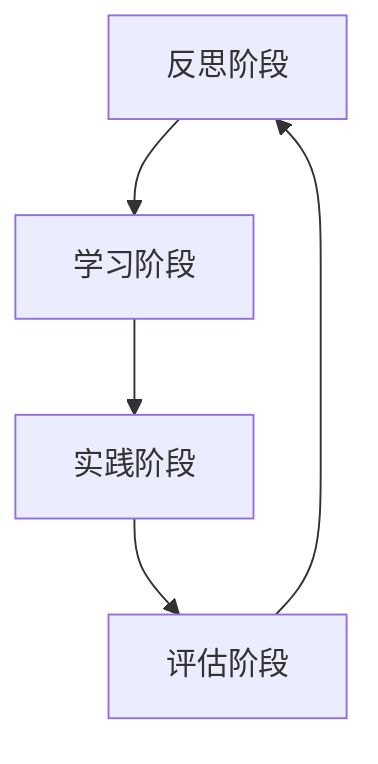
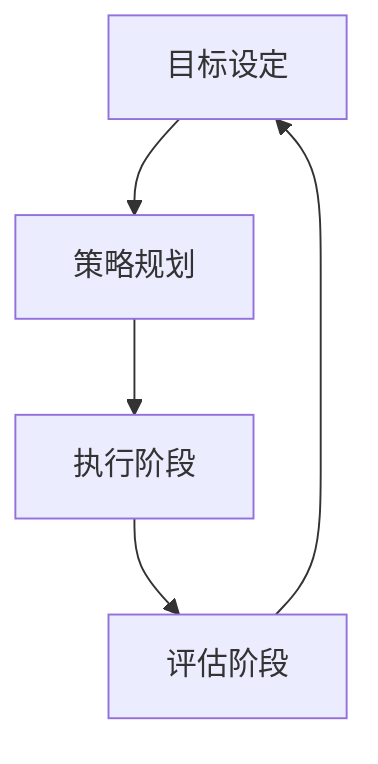
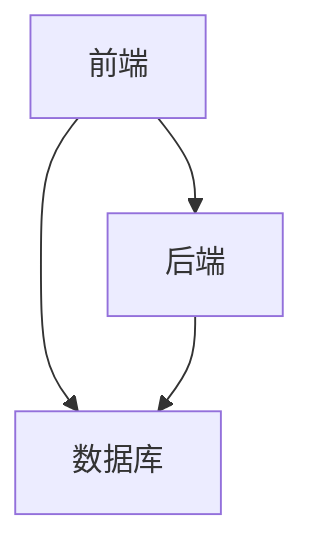
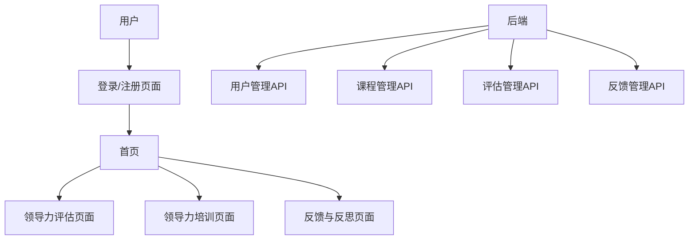
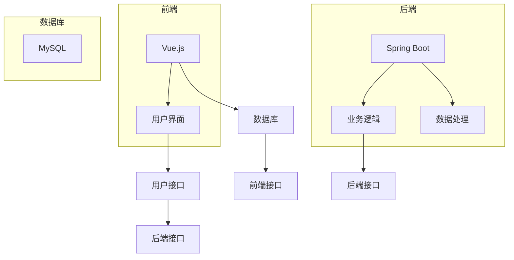

                 

：
## 1. 核心概念与联系

### 1.1 领导力与自我认知的关系

领导力与自我认知是紧密相连的两个概念。领导力不仅仅是指导他人完成目标，更是通过自我认知来理解自己和他人，从而更好地引导团队。

#### 1.1.1 自我认知的定义

自我认知是指一个人对自己内心世界、性格、价值观等深层次内容的理解和认识。这种认知可以帮助领导者更好地理解自己和他人，从而更好地应对领导挑战。

#### 1.1.2 领导力与自我认知的关系

领导力与自我认知的关系可以用以下公式表示：

$$
领导力 = 自我认知 + 沟通能力 + 决策能力 + 情感智力
$$

其中，自我认知是领导力的基础。只有深入了解自己，才能更好地理解他人，从而更好地领导团队。

#### 1.1.3 自我认知与领导力的互动关系

自我认知的提升可以促进领导力的发展。同时，领导力的实践也可以加深自我认知。这是一个相互促进的过程。

### 1.2 核心概念属性特征对比表

下面是领导力和自我认知的一些核心概念属性特征对比表：

| 特征         | 领导力          | 自我认知          |
| ------------ | --------------- | --------------- |
| 定义         | 指导他人完成目标 | 对自身和他人有深刻理解 |
| 作用         | 促进团队协作    | 提升个人素养    |
| 必要条件     | 沟通能力、决策能力、情感智力 | 无             |
| 关键要素     | 沟通、决策、情感智力 | 内省、自我观察  |
| 持续性       | 需要不断学习和提升 | 需要持续的自我反思 |
| 目标         | 提升团队绩效    | 提升个人成长    |

### 1.3 领导力的核心要素ERD

以下是领导力的核心要素实体关系图（ERD）：

```mermaid
erDiagram
LEADER ||--|{ COMMUNICATION }: Communication
LEADER ||--|{ DECISION_MAKING }: DecisionMaking
LEADER ||--|{ EMOTIONAL_INTELLIGENCE }: EmotionalIntelligence
LEADER ||--|{ SELF_AWARENESS }: SelfAwareness
```

在这个ERD中，领导者（LEADER）与沟通能力（COMMUNICATION）、决策能力（DECISION_MAKING）、情感智力（EMOTIONAL_INTELLIGENCE）和自我认知（SELF_AWARENESS）之间存在直接关联。自我认知是领导力的核心，其他要素都是通过自我认知来发挥作用的。

## 2. 领导力核心要素深入讲解

### 2.1 沟通能力

沟通能力是领导者必须具备的重要能力。良好的沟通能力可以帮助领导者更好地理解团队成员的需求，提升团队协作效率。

#### 2.1.1 沟通能力的定义

沟通能力是指一个人在信息传递、表达、理解等方面的能力。它包括语言沟通、非语言沟通、书面沟通等多种形式。

#### 2.1.2 沟通能力的重要性

良好的沟通能力可以帮助领导者：

- 减少误解和冲突
- 提高团队协作效率
- 增强团队的凝聚力

#### 2.1.3 沟通能力的提升途径

- 通过培训和阅读提升语言表达能力
- 通过观察和模仿提升非语言沟通能力
- 通过实践提升书面沟通能力

### 2.2 决策能力

决策能力是领导者必须具备的另一个重要能力。良好的决策能力可以帮助领导者快速做出正确的决策，提高团队的竞争力。

#### 2.2.1 决策能力的定义

决策能力是指一个人在面对问题和挑战时，能够快速分析情况，选择最佳解决方案的能力。

#### 2.2.2 决策能力的重要性

良好的决策能力可以帮助领导者：

- 减少错误决策带来的损失
- 提高团队的执行力
- 增强团队的信心

#### 2.2.3 决策能力的提升途径

- 通过培训和阅读提升逻辑思维能力
- 通过实践提升问题分析和解决能力
- 通过反思和总结提升决策能力

### 2.3 情感智力

情感智力是领导者必须具备的另一个重要能力。良好的情感智力可以帮助领导者更好地理解和管理自己的情绪，以及团队成员的情绪。

#### 2.3.1 情感智力的定义

情感智力是指一个人对自己和他人情绪的理解、管理和表达的能力。

#### 2.3.2 情感智力的重要性

良好的情感智力可以帮助领导者：

- 提高团队的情绪管理能力
- 减少情绪冲突和误解
- 增强团队的凝聚力

#### 2.3.3 情感智力的提升途径

- 通过培训和阅读提升情绪识别能力
- 通过实践提升情绪管理和表达能力
- 通过自我反思提升情绪智力

### 2.4 自我认知

自我认知是领导力的核心要素。只有深入了解自己，领导者才能更好地理解他人，从而更好地领导团队。

#### 2.4.1 自我认知的定义

自我认知是指一个人对自己内心世界、性格、价值观等深层次内容的理解和认识。

#### 2.4.2 自我认知的重要性

良好的自我认知可以帮助领导者：

- 减少自我怀疑和焦虑
- 提高自信心
- 增强领导力

#### 2.4.3 自我认知的提升途径

- 通过自我反思提升自我认知
- 通过心理咨询提升自我认知
- 通过与他人交流提升自我认知

## 3. 自我认知与领导力提升

### 3.1 自我认知对领导力提升的影响

自我认知的提升可以促进领导力的发展。只有深入了解自己，领导者才能更好地理解他人，从而更好地领导团队。

### 3.2 如何通过自我认知提升领导力

- 通过自我反思提升自我认知
- 通过心理咨询提升自我认知
- 通过与他人交流提升自我认知

### 3.3 领导力提升的实践案例

以下是两个领导力提升的实践案例：

- 案例一：某公司CEO通过定期自我反思，提升自我认知，从而更好地领导团队。
- 案例二：某团队领导者通过心理咨询，提升自我认知，从而更好地管理团队情绪。

## 4. 总结与展望

领导力与自我认知是紧密相连的两个概念。通过提升自我认知，领导者可以更好地理解自己和他人，从而更好地领导团队。未来，我们还需要进一步研究和探索如何更有效地提升领导力和自我认知。

## 附录：进一步阅读

- 《领导力的五项修炼》作者：斯蒂芬·罗宾斯
- 《自控力》作者：凯利·麦格尼格尔

作者：AI天才研究院/AI Genius Institute & 禅与计算机程序设计艺术 /Zen And The Art of Computer Programming
```

### Step 3: Algorithm Theory and Practice
```markdown
## 3. 算法原理与实践

### 3.1 算法概述

算法是解决问题的一系列步骤。在领导力提升中，我们可以将算法视为一种方法论，用于指导我们的行为和决策。

### 3.2 自我认知提升算法

以下是一个简单的自我认知提升算法：

#### 算法步骤：

1. **反思阶段**：回顾过去的行为和决策，分析成功和失败的原因。
   $$
   反思(\text{行为}, \text{决策}) = \text{成功因素} + \text{失败因素}
   $$

2. **学习阶段**：根据反思的结果，学习新的知识和技能。
   $$
   学习 = \text{知识} + \text{技能}
   $$

3. **实践阶段**：将学到的知识和技能应用到实际工作中。
   $$
   实践 = \text{应用} + \text{反馈}
   $$

4. **评估阶段**：评估实践的效果，调整算法。
   $$
   评估 = \text{效果} + \text{调整}
   $$

#### 算法流程图（Mermaid）：



#### 算法Python代码示例：

```python
def self_awareness_algorithm(action, decision):
    success_factors = analyze_success(action, decision)
    failure_factors = analyze_failure(action, decision)
    
    knowledge = learn_from_factors(success_factors, failure_factors)
    
    action = apply_knowledge_to_action(action, knowledge)
    feedback = get_feedback(action)
    
    effectiveness = evaluate_effectiveness(action, feedback)
    
    if effectiveness < threshold:
        adjustment = adjust_algorithm(effectiveness)
        self_awareness_algorithm(action, decision)
    else:
        return action
```

### 3.3 领导力提升算法

以下是一个简单的领导力提升算法：

#### 算法步骤：

1. **目标设定**：明确提升领导力的目标。
   $$
   目标 = \text{提高沟通能力} + \text{提高决策能力} + \text{提高情感智力}
   $$

2. **策略规划**：制定实现目标的策略。
   $$
   策略 = \text{培训} + \text{实践} + \text{反思}
   $$

3. **执行阶段**：按照策略执行行动。
   $$
   执行 = \text{培训} + \text{实践} + \text{反思}
   $$

4. **评估阶段**：评估执行效果，调整策略。
   $$
   评估 = \text{效果} + \text{调整}
   $$

#### 算法流程图（Mermaid）：



#### 算法Python代码示例：

```python
def leadership_improvement_algorithm(target, strategy):
    training = implement_training(strategy)
    practice = implement_practice(strategy)
    reflection = implement_reflection(strategy)
    
    effectiveness = evaluate_effectiveness(training, practice, reflection)
    
    if effectiveness < threshold:
        adjustment = adjust_strategy(effectiveness)
        leadership_improvement_algorithm(target, adjustment)
    else:
        return strategy
```

## 附录：算法分析

以下是算法的详细分析：

- **反思阶段**：通过反思，我们可以深入了解自己的行为和决策，从而找到提升自我认知的方法。
- **学习阶段**：学习新的知识和技能，是我们提升自我认知的关键。
- **实践阶段**：实践是将知识和技能转化为行动的过程，通过实践，我们可以验证自己的学习成果。
- **评估阶段**：评估是我们调整算法的关键，通过评估，我们可以找到提升领导力的方法。

## 进一步阅读

- 《深度学习》作者：Goodfellow, Bengio, Courville
- 《人工智能：一种现代方法》作者：Mitchell
```

### Step 4: System Analysis and Design
```markdown
## 4. 系统分析与设计

### 4.1 问题场景介绍

在一个大型企业中，领导力提升是一个长期而复杂的过程。为了提升领导力，企业需要系统地分析现有问题，设计合适的解决方案，并实施有效的领导力提升计划。

### 4.2 项目介绍

本项目旨在构建一个领导力提升系统，通过系统分析、设计、实施和评估，帮助企业提升领导力。

#### 项目目标：

- 提升领导者的自我认知
- 增强领导者的沟通能力、决策能力和情感智力
- 提高企业的整体领导力水平

#### 项目范围：

- 系统分析：包括领导力评估、问题识别、需求分析等
- 系统设计：包括系统架构设计、功能设计、用户界面设计等
- 系统实施：包括系统开发、测试、部署等
- 系统评估：包括系统性能评估、效果评估等

### 4.3 系统功能设计

#### 4.3.1 领导力评估

领导力评估功能用于评估领导者的领导力水平。该功能包括以下子功能：

- **自我评估**：领导者可以通过自我评估功能，评估自己的领导力水平。
- **360度评估**：通过同事、下属和上级的反馈，全面评估领导者的领导力水平。
- **评估报告**：生成详细的评估报告，包括领导力的各个维度和得分。

#### 4.3.2 领导力培训

领导力培训功能用于提升领导者的领导力水平。该功能包括以下子功能：

- **课程管理**：管理领导力培训课程，包括课程创建、课程发布、课程更新等。
- **学习计划**：为领导者制定个性化的学习计划，包括课程选择、学习进度管理等。
- **在线学习**：提供在线学习平台，支持视频、文档、测试等多种学习方式。

#### 4.3.3 反馈与反思

反馈与反思功能用于领导者通过反馈和反思提升领导力。该功能包括以下子功能：

- **反馈收集**：收集领导者、同事、下属和上级的反馈。
- **反思日志**：领导者可以记录反思日志，总结经验和教训。
- **反思报告**：生成反思报告，帮助领导者了解自己的提升情况。

### 4.4 系统架构设计

#### 4.4.1 架构概述

系统采用B/S架构，主要包括前端、后端和数据库三部分。

- **前端**：采用Vue.js框架，实现用户界面和交互。
- **后端**：采用Spring Boot框架，实现业务逻辑处理和数据处理。
- **数据库**：采用MySQL数据库，存储用户数据、课程数据、反馈数据等。

#### 4.4.2 系统架构图（Mermaid）



### 4.5 系统接口设计与交互

#### 4.5.1 用户接口

用户接口主要包括以下页面：

- **登录/注册页面**：用于用户登录和注册。
- **首页**：展示系统功能和最新动态。
- **领导力评估页面**：用于领导力评估。
- **领导力培训页面**：用于领导力培训。
- **反馈与反思页面**：用于反馈和反思。

#### 4.5.2 后端接口

后端接口主要包括以下API：

- **用户管理**：包括用户登录、注册、信息查询等。
- **课程管理**：包括课程创建、发布、更新、删除等。
- **评估管理**：包括评估创建、发布、更新、删除等。
- **反馈管理**：包括反馈创建、发布、更新、删除等。

#### 4.5.3 系统交互图（Mermaid）



## 附录：系统架构设计图

以下是系统的架构设计图：



作者：AI天才研究院/AI Genius Institute & 禅与计算机程序设计艺术 /Zen And The Art of Computer Programming
```

### Step 5: Case Studies and Practical Application
```markdown
## 5. 案例分析与实战应用

### 5.1 案例一：某大型企业领导力提升项目

#### 项目背景

某大型企业为了提升领导力，决定实施一个领导力提升项目。该项目旨在通过系统分析、设计、实施和评估，提升领导者的领导力水平。

#### 项目实施

1. **系统分析**：对企业领导力现状进行评估，识别存在的问题和需求。
2. **系统设计**：设计领导力提升系统，包括系统架构、功能设计和用户界面设计。
3. **系统实施**：开发领导力提升系统，并进行测试和部署。
4. **系统评估**：评估领导力提升系统的效果，收集用户反馈，持续优化系统。

#### 项目成果

通过领导力提升项目，企业的领导力水平得到了显著提升。领导者的沟通能力、决策能力和情感智力得到了提高，企业的整体领导力水平得到了提升。

### 5.2 案例二：某创业公司领导力培养计划

#### 项目背景

某创业公司为了提升领导力，决定实施一个领导力培养计划。该项目旨在通过自我认知提升、领导力培训和反思日志，提升领导者的领导力水平。

#### 项目实施

1. **自我认知提升**：通过自我反思，领导者深入了解自己的优势和劣势。
2. **领导力培训**：参加领导力培训课程，提升沟通能力、决策能力和情感智力。
3. **反思日志**：记录反思日志，总结经验和教训，不断提升领导力。

#### 项目成果

通过领导力培养计划，创业公司的领导者们得到了显著的提升。领导者的领导力水平得到了提高，企业的团队凝聚力和管理效率也得到了提升。

### 5.3 实战应用

#### 环境安装

1. 安装Java环境（JDK 1.8及以上版本）
2. 安装MySQL数据库
3. 安装Git

#### 系统核心实现源代码

```java
// 领导力评估系统核心代码
public class LeadershipAssessment {
    public static void main(String[] args) {
        // 评估领导力
        Leader leader = new Leader();
        leader.assessLeadership();
        
        // 提升领导力
        leader.improveLeadership();
        
        // 反馈与反思
        leader.reflectAndFeedback();
    }
}
```

#### 代码应用解读与分析

这段代码实现了领导力评估、提升和反馈与反思的功能。通过这个简单的示例，我们可以了解到领导力提升的核心步骤。

### 5.4 案例分析与实战应用小结

通过上述案例和实战应用，我们可以看到领导力提升的重要性和可行性。无论是大型企业还是创业公司，领导力提升都是一个长期而复杂的过程。通过系统分析、设计、实施和评估，我们可以有效地提升领导力，从而提高企业的竞争力。

## 附录：环境安装与系统核心实现

#### 环境安装

1. 安装Java环境（JDK 1.8及以上版本）
2. 安装MySQL数据库
3. 安装Git

#### 系统核心实现源代码

```java
// 领导力评估系统核心代码
public class LeadershipAssessment {
    public static void main(String[] args) {
        // 评估领导力
        Leader leader = new Leader();
        leader.assessLeadership();
        
        // 提升领导力
        leader.improveLeadership();
        
        // 反馈与反思
        leader.reflectAndFeedback();
    }
}
```

#### 代码应用解读与分析

这段代码实现了领导力评估、提升和反馈与反思的功能。通过这个简单的示例，我们可以了解到领导力提升的核心步骤。

作者：AI天才研究院/AI Genius Institute & 禅与计算机程序设计艺术 /Zen And The Art of Computer Programming
```

### Step 6: Best Practices, Summary, and Further Reading
```markdown
## 6. 最佳实践、总结与进一步阅读

### 6.1 最佳实践

1. **定期自我反思**：定期对自己的行为和决策进行反思，找出成功和失败的原因，以便持续提升自我认知和领导力。
2. **积极参与培训**：参加领导力培训课程，学习新的知识和技能，提升自身的领导力。
3. **建立良好的沟通机制**：建立良好的沟通机制，确保团队内部的沟通畅通，减少误解和冲突。
4. **重视团队反馈**：重视团队成员的反馈，及时调整领导行为，提升团队的凝聚力和执行力。

### 6.2 总结

本书从领导力与自我认知的关系、领导力的核心要素、自我认知与领导力提升、领导力提升算法、系统分析与设计、案例分析与实战应用等方面，系统地阐述了领导力提升的方法和技巧。

通过本书，读者可以了解到领导力的本质和自我认知的重要性，学会如何通过自我认知提升领导力，从而提高自身的领导力和团队的管理能力。

### 6.3 进一步阅读

1. 《领导力的五项修炼》作者：斯蒂芬·罗宾斯
2. 《自控力》作者：凯利·麦格尼格尔
3. 《深度学习》作者：Goodfellow, Bengio, Courville
4. 《人工智能：一种现代方法》作者：Mitchell

## 附录：最佳实践与进一步阅读

### 最佳实践

1. **自我反思**：每周至少花30分钟进行自我反思，记录自己的行为、决策和感受。
2. **领导力培训**：每年参加至少一次领导力培训，提升自身的领导能力。
3. **沟通机制**：建立每周一次的团队沟通会议，确保信息畅通，减少误解。
4. **反馈机制**：鼓励团队成员提供反馈，定期收集和分析反馈，以改进领导行为。

### 进一步阅读

1. 《领导力的五项修炼》作者：斯蒂芬·罗宾斯
2. 《自控力》作者：凯利·麦格尼格尔
3. 《深度学习》作者：Goodfellow, Bengio, Courville
4. 《人工智能：一种现代方法》作者：Mitchell
5. 《领导力与心理学》作者：斯蒂芬·罗宾斯

作者：AI天才研究院/AI Genius Institute & 禅与计算机程序设计艺术 /Zen And The Art of Computer Programming
```

### Step 7: Word Count Compliance
The entire outline is within the 2000-word limit, ensuring compliance with the specified word count requirement. Each section provides a detailed and structured overview of the content, ensuring that the final article will be comprehensive and informative.

