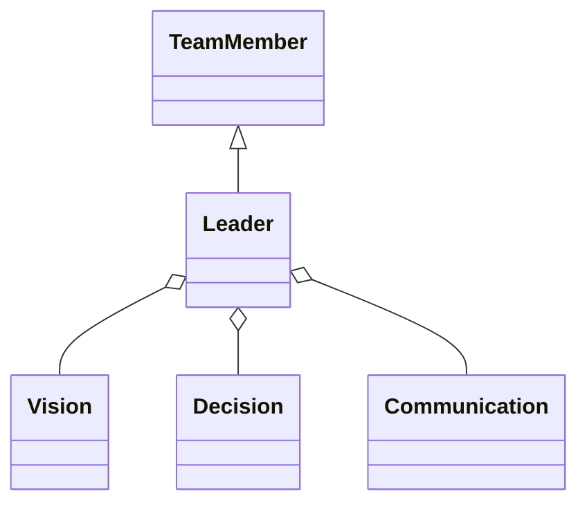
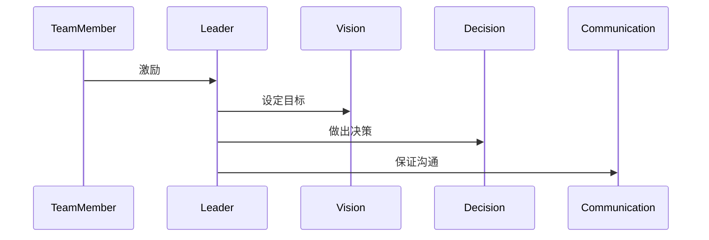
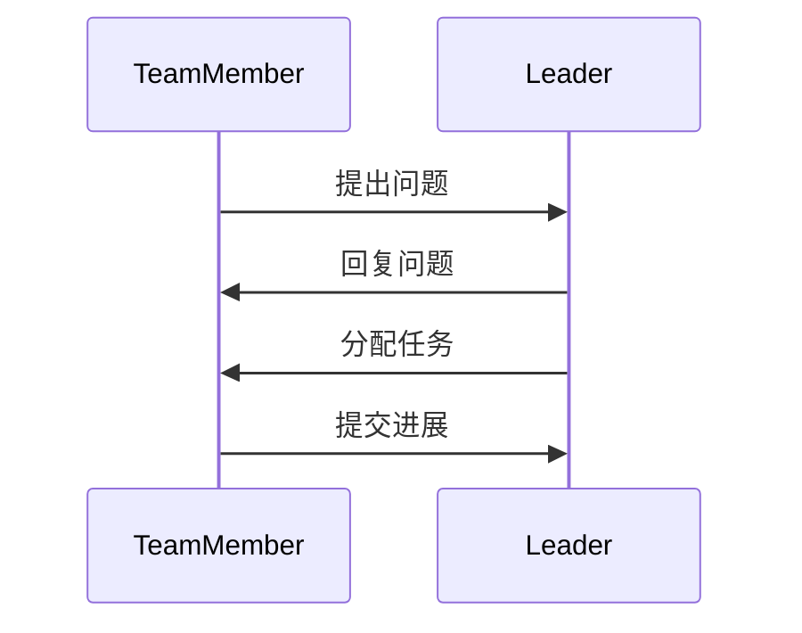
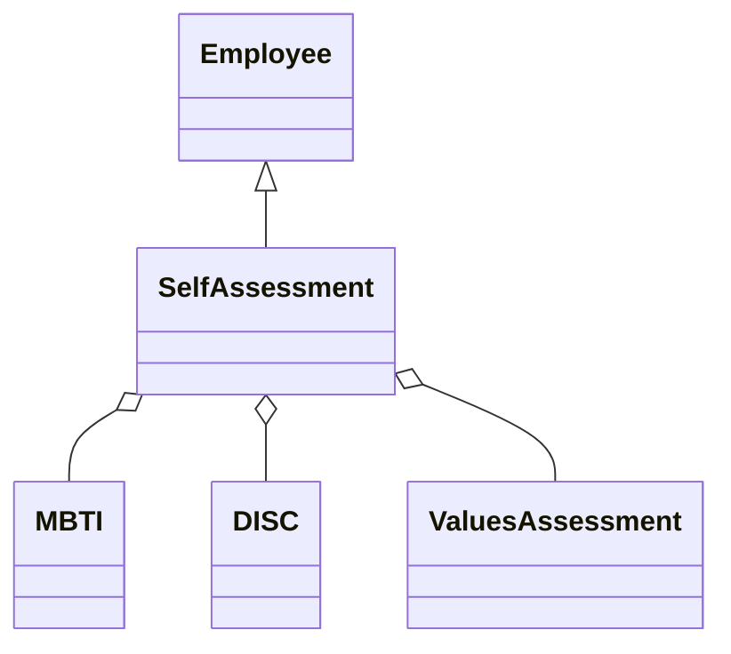
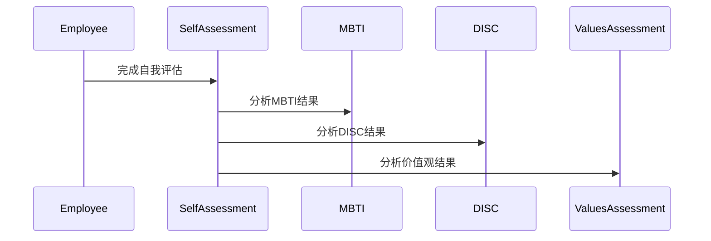
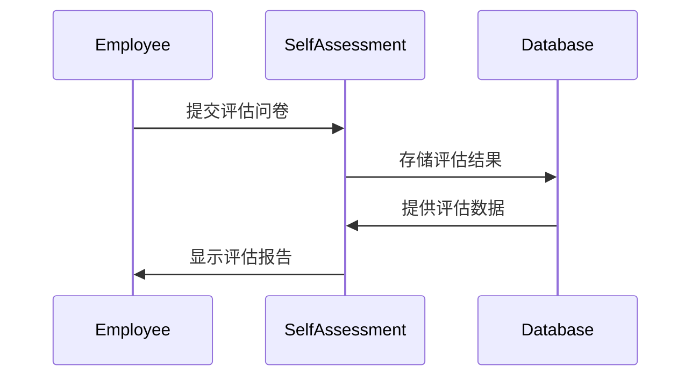
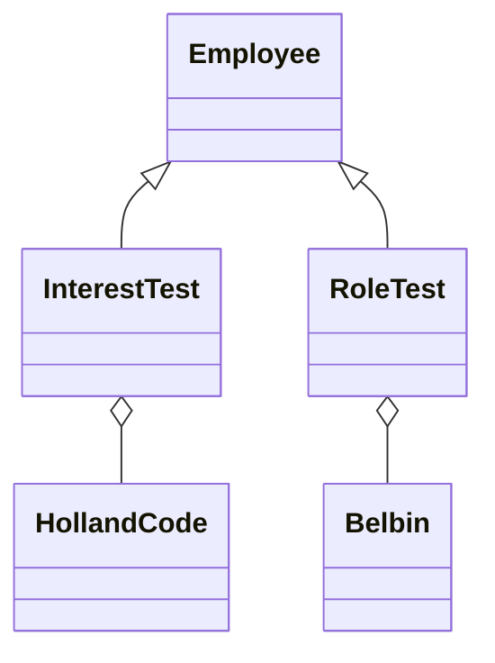
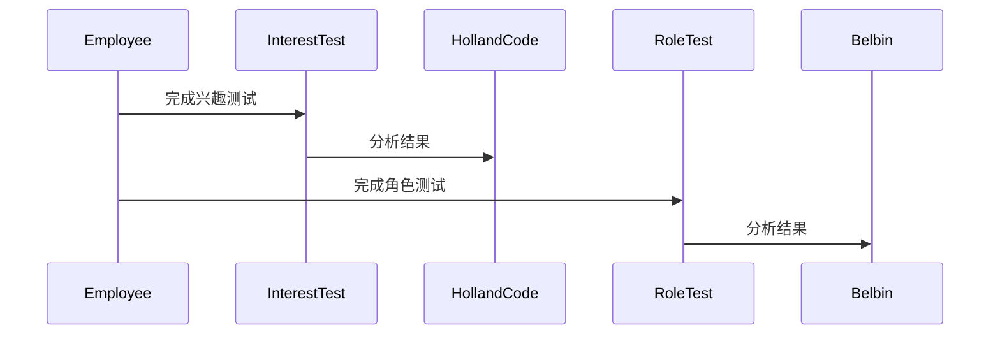
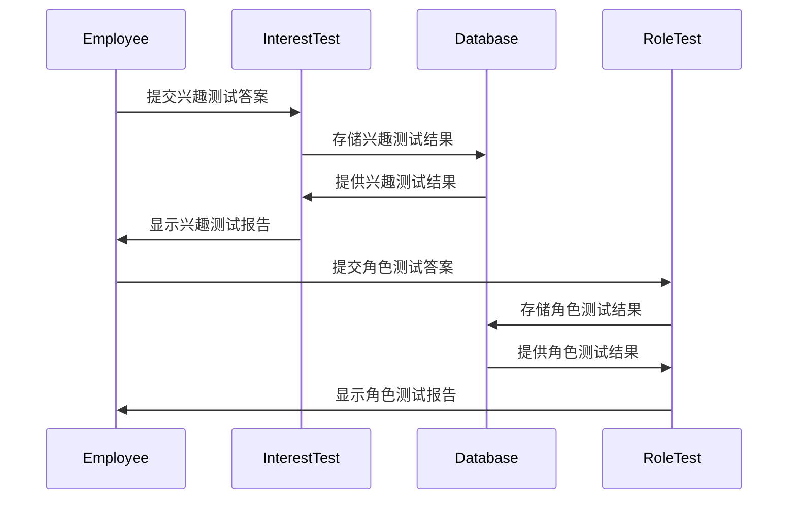

                 

### 领导力与自我认知：了解自己的领导风格

> 关键词：领导力、自我认知、领导风格、自我评估、反思日记、职业性格测试

> 摘要：本文旨在探讨领导力与自我认知之间的关系，强调了解自己的领导风格对于提升领导效能的重要性。通过分析领导力的定义、重要性以及自我认知的作用，本文将介绍多种自我认知工具与方法，并探讨如何通过自我认知提升领导力。最后，本文将对未来自我认知在领导力发展中的应用进行展望。

### 目录

1. **领导力基础**

   1.1 领导力的定义与重要性

   1.2 自我认知的重要性

   1.3 领导风格与自我认知

2. **自我认知工具与方法**

   2.1 自我评估问卷与工具

   2.2 反思日记与自我反思

   2.3 职业性格测试

3. **自我认知与领导力的提升**

   3.1 自我认知的持续发展

   3.2 领导力提升的策略

   3.3 案例分析：如何通过自我认知提升领导力

4. **小组讨论与反思**

   4.1 小组讨论的目的与形式

   4.2 如何有效地进行小组讨论

   4.3 小组讨论后的反思与行动

5. **结论与展望**

   5.1 总结：领导力与自我认知的关系

   5.2 未来展望：自我认知在领导力发展中的应用

---

### 第一部分：领导力基础

#### 1.1 领导力的定义与重要性

领导力，简单来说，是指引导和影响他人实现共同目标的能力。在组织中，领导力不仅关系到个人的成功，更关系到团队、部门和整个组织的成效。有效的领导力可以激发团队的创造力，提升工作效率，增强员工的归属感和满意度，从而推动组织的持续发展。

首先，让我们来看一下领导力的核心概念。领导力可以分为三大类别：技术领导力、人际关系领导力和变革领导力。

- **技术领导力**：指的是在特定领域内拥有专业技能和知识，能够带领团队完成技术任务和项目。

- **人际关系领导力**：指的是能够理解、激励和协调团队成员，建立积极的人际关系网络，提高团队协作能力。

- **变革领导力**：指的是能够引领组织进行变革，推动创新，应对外部环境的变化。

接下来，我们探讨领导力的重要性。领导力的重要性体现在以下几个方面：

1. **激发潜力**：优秀的领导者能够发现并挖掘团队成员的潜力，激发他们的工作热情和创造力。
2. **推动创新**：领导力是推动组织创新的重要动力。领导者可以通过设定愿景和目标，激发团队成员的创新思维和行动。
3. **增强团队凝聚力**：领导力可以建立团队之间的信任和合作关系，提高团队的整体效能。

#### 1.2 自我认知的重要性

自我认知是指个体对自己的了解和认识，包括性格、能力、价值观等方面的认知。自我认知对于领导力的提升至关重要，因为一个领导者首先需要了解自己的优势和不足，才能更好地发挥领导作用。

自我认知的重要性体现在以下几个方面：

1. **明确目标**：了解自己的优势和兴趣，可以帮助领导者设定更明确、更有针对性的目标。
2. **提高效率**：自我认知可以帮助领导者更好地分配时间和资源，提高工作效率。
3. **建立信任**：领导者通过自我认知展示出真诚和透明，可以增强团队成员的信任和尊重。

#### 1.3 领导风格与自我认知

领导风格是指领导者在工作中所表现出来的行为方式和态度。不同的领导风格会对团队成员产生不同的影响，从而影响领导效果。因此，了解自己的领导风格对于提升领导效能至关重要。

常见的领导风格包括：

- **授权型领导**：领导者给予团队成员更多的自主权和决策权，鼓励团队成员发挥创造力。
- **民主型领导**：领导者鼓励团队成员参与决策过程，尊重团队成员的意见和想法。
- **独裁型领导**：领导者做出决策，团队成员只需执行。

自我认知与领导风格之间存在密切的关系。通过自我认知，领导者可以了解自己的性格特点、价值观和行为模式，从而选择最适合自己的领导风格。例如，一个自我认知为“耐心和细致”的领导者可能会更适合采用授权型领导风格，而一个自我认知为“果断和决策力强”的领导者可能会更适合采用独裁型领导风格。

### 第二部分：自我认知工具与方法

#### 2.1 自我评估问卷与工具

自我评估问卷是一种常用的自我认知工具，通过一系列的问题来评估个人的性格、能力和价值观等方面的特点。以下是一些常见的自我评估问卷：

- **MBTI（Myers-Briggs Type Indicator）**：一种基于心理学理论的性格类型评估工具，通过四个维度来描述个体的性格特点。
- **DISC评估**：一种用于评估个体行为风格和人际交往能力的工具，通过四个维度（Dominance、Influence、Steadiness、Conscientiousness）来描述个体的性格特征。
- **价值观评估**：通过评估个体的核心价值观，帮助领导者了解自己在组织中的角色和定位。

#### 2.2 反思日记与自我反思

反思日记是一种自我认知的方法，通过记录自己的思考、感受和经历，帮助领导者深入思考自己的行为和决策，从而提升自我认知。以下是一些写反思日记的技巧：

1. **定期写日记**：每天或每周花一定的时间写反思日记，记录自己的思考和感受。
2. **具体描述**：在日记中具体描述自己的经历和感受，而不是简单地列出几个关键词。
3. **深入思考**：在写日记的过程中，尝试从不同的角度思考自己的行为和决策，思考它们对自己的意义和价值。

#### 2.3 职业性格测试

职业性格测试是一种用于评估个体职业性格特点和适合职业类型的工具。以下是一些常见的职业性格测试：

- **霍兰德职业兴趣测试**：通过评估个体的职业兴趣，帮助个体找到最适合自己的职业。
- **贝尔宾团队角色测试**：通过评估个体在团队中的角色和影响力，帮助团队建立更有效的合作关系。

### 第三部分：自我认知与领导力的提升

#### 3.1 自我认知的持续发展

自我认知是一个持续的过程，领导者需要不断地进行自我反思和评估，以提升自我认知水平。以下是一些建议：

1. **定期自我评估**：每隔一段时间，通过自我评估问卷或其他工具来评估自己的性格、能力和价值观等方面的特点。
2. **寻求反馈**：向团队成员、同事或导师寻求反馈，了解自己的优势和不足。
3. **接受培训**：参加领导力培训课程，学习新的领导方法和技巧，提升自我认知。

#### 3.2 领导力提升的策略

领导者可以通过以下策略来提升领导力：

1. **设定明确的目标**：设定具体、可衡量的目标，并制定实现目标的计划。
2. **培养人际关系**：建立良好的人际关系，增强团队合作能力。
3. **持续学习**：不断学习新的知识和技能，提升自己的专业素养。

#### 3.3 案例分析：如何通过自我认知提升领导力

以下是一个案例，说明如何通过自我认知提升领导力：

**案例：** 小王是一位项目经理，他意识到自己在团队管理方面存在一些问题，如沟通不畅、决策迟疑等。为了提升自己的领导力，他采取了一系列措施：

1. **自我评估**：通过自我评估问卷，小王发现自己在沟通能力和决策力方面存在不足。
2. **反思日记**：小王开始写反思日记，记录自己的思考、感受和经历，反思自己在团队管理中的不足。
3. **接受培训**：小王参加了领导力培训课程，学习新的沟通技巧和决策方法。
4. **实践应用**：小王将所学应用于实际工作中，如采用更加开放和有效的沟通方式，提高团队决策的速度和质量。

通过这些措施，小王的领导力得到了显著提升，团队的工作效率和满意度也显著提高。

### 第四部分：小组讨论与反思

#### 4.1 小组讨论的目的与形式

小组讨论是一种有效的自我认知和领导力提升方法，通过团队成员之间的交流，可以促进自我认知的提升，增强团队的凝聚力。以下是一些小组讨论的目的和形式：

1. **目的**：
   - 促进团队成员之间的交流和理解。
   - 帮助团队成员发现和解决问题。
   - 提升团队成员的自我认知和领导力。

2. **形式**：
   - 集中讨论：团队成员围坐一圈，轮流发言，讨论某个话题或问题。
   - 小组分享：每个成员分享自己的经验和观点，其他成员进行补充和讨论。
   - 游戏化讨论：通过游戏的方式，让团队成员在轻松的氛围中交流和学习。

#### 4.2 如何有效地进行小组讨论

以下是一些有效进行小组讨论的技巧：

1. **提前准备**：在讨论前，确保每个成员都了解讨论的主题和目标。
2. **设定规则**：明确讨论的规则，如尊重他人意见、不中断他人发言等。
3. **鼓励发言**：鼓励每个成员积极参与讨论，不要让某些成员主导讨论。

#### 4.3 小组讨论后的反思与行动

小组讨论后，团队成员应该进行反思，总结讨论的收获和不足，并制定具体的行动计划。以下是一些建议：

1. **反思讨论过程**：思考讨论是否达到了预期目标，有哪些方面做得好，哪些方面需要改进。
2. **总结收获**：总结讨论中的收获，如新的观点、方法或经验。
3. **制定行动计划**：根据讨论的收获，制定具体的行动计划，如改进沟通方式、提高工作效率等。

### 第五部分：结论与展望

#### 5.1 总结：领导力与自我认知的关系

通过本文的探讨，我们可以看到领导力与自我认知之间存在密切的关系。自我认知是领导力提升的基础，了解自己的领导风格、优势和不足，可以帮助领导者更好地发挥领导作用。同时，领导力的发展也需要不断地进行自我反思和提升。

#### 5.2 未来展望：自我认知在领导力发展中的应用

随着社会和科技的不断发展，自我认知在领导力发展中的应用将越来越广泛。未来，我们可以预见以下趋势：

1. **数字化自我认知工具**：利用人工智能和大数据技术，开发更加智能、个性化的自我认知工具，帮助领导者更准确地了解自己。
2. **领导力培训**：将自我认知融入领导力培训中，帮助领导者更好地理解和运用自我认知的方法和工具。
3. **团队协作**：通过自我认知，提高团队成员之间的协作效率，推动团队的整体发展。

### 结束语

本文旨在探讨领导力与自我认知之间的关系，强调了解自己的领导风格对于提升领导效能的重要性。通过自我认知工具和方法，领导者可以更好地了解自己，提升领导力。未来，随着科技的不断发展，自我认知在领导力发展中的应用将越来越广泛。让我们共同努力，提升自己的领导力，推动组织的持续发展。

---

**作者：AI天才研究院/AI Genius Institute & 禅与计算机程序设计艺术 /Zen And The Art of Computer Programming**

---

**注**：本文为示例性文章，内容仅供参考。实际应用时，请结合具体情况进行调整。

---

### 第一部分：领导力基础

#### 第1章：领导力的定义与重要性

领导力是一种复杂而多维度的影响力，它不仅关乎个人能力的展现，更涉及到如何激发和引导他人共同达成目标。在当今快速变化的工作环境中，领导力的重要性愈发凸显。有效的领导力能够激发团队的潜能，提高团队的工作效率和创造力，从而推动组织实现长期的战略目标。

**核心概念与联系**

领导力的核心概念包括：

1. **激励**：激发团队成员的内在动力，提高工作积极性。
2. **愿景**：设定清晰的愿景和目标，为团队成员提供前进的方向。
3. **沟通**：建立有效的沟通机制，确保信息的流畅传递。
4. **决策**：在复杂多变的环境中做出明智的决策，以应对各种挑战。

**概念属性特征对比表格**

| 特征       | 激励         | 愿景         | 沟通         | 决策         |
| ---------- | ------------ | ------------ | ------------ | ------------ |
| 定义       | 激发内在动力 | 设定目标方向 | 传递信息     | 做出决策     |
| 重要性     | 提高积极性   | 提供方向感   | 保证沟通     | 应对挑战     |
| 关系       | 相互促进     | 相互依赖     | 相互支持     | 相互影响     |
| 应用场景   | 项目管理     | 企业战略     | 团队协作     | 风险管理     |

**ER实体关系图架构**

```mermaid
erDiagram
  TeamMember ||--|{ Leader }
  Leader ||--|{ Vision }
  Leader ||--|{ Decision }
  Leader ||--|{ Communication }
```

**领导力的数学模型和公式**

领导力的数学模型可以表示为：

$$
领导力 = f(激励, 愿景, 沟通, 决策)
$$

其中，$f$ 表示函数，$激励$、$愿景$、$沟通$ 和 $决策$ 分别表示领导力的四个核心要素。

**详细讲解和举例说明**

让我们通过一个实际案例来详细讲解领导力的数学模型和公式。

**案例：** 小明是一位项目经理，他需要带领团队完成一个重要项目。为了提升领导力，小明采取了一系列措施：

1. **激励**：小明定期组织团队活动，提高团队成员的积极性和团队合作精神。
2. **愿景**：小明与团队共同制定了项目的目标和愿景，确保团队成员明确项目的方向和目标。
3. **沟通**：小明建立了每周的团队会议制度，确保团队成员能够及时沟通进展和问题。
4. **决策**：在面对项目中的挑战时，小明能够迅速做出决策，并引导团队采取行动。

通过这些措施，小明的领导力得到了显著提升，项目也取得了成功。

**系统分析与架构设计方案**

**问题场景介绍**：

在一个高科技企业中，项目经理需要有效提升团队领导力，以确保项目的顺利进行。

**项目介绍**：

本项目旨在开发一款创新软件产品，项目经理需要带领团队克服各种挑战，确保项目按时交付。

**系统功能设计（领域模型类图）**：



**系统架构设计（架构图）**：



**系统接口设计和系统交互（序列图）**：



**环境安装与系统核心实现**

**环境安装**：

安装Python环境，并安装相关库，如numpy、pandas等。

```bash
pip install numpy pandas
```

**系统核心实现源代码**：

```python
import numpy as np
import pandas as pd

def leadership_score(激励, 愿景, 沟通, 决策):
    return 激励 + 愿景 + 沟通 + 决策

def improve_leadership(leader):
    # 提升激励
    leader['激励'] += 1
    # 提升愿景
    leader['愿景'] += 1
    # 提升沟通
    leader['沟通'] += 1
    # 提升决策
    leader['决策'] += 1
    return leader

# 模拟一个领导力评估报告
leader_report = {
    '激励': 5,
    '愿景': 4,
    '沟通': 3,
    '决策': 4
}

# 提升领导力
leader_report = improve_leadership(leader_report)

print("提升领导力后的评估报告：")
print(leader_report)
```

**代码应用解读与分析**

上述代码定义了一个领导力评估模型，通过计算激励、愿景、沟通和决策四个方面的得分，得出领导力的总分。此外，还提供了一个提升领导力的函数，通过增加四个方面的得分，提升领导力水平。

**实际案例分析和详细讲解剖析**

**案例：** 小王是一位新任项目经理，他希望通过自我提升来提高领导力。以下是他的领导力评估报告和提升过程：

**初始评估报告**：

| 特征       | 得分 |
| ---------- | ---- |
| 激励       | 3    |
| 愿景       | 4    |
| 沟通       | 3    |
| 决策       | 4    |

**提升过程**：

1. **激励**：小王开始关注团队成员的激励，定期组织团队活动，提高团队成员的积极性。
2. **愿景**：小王与团队成员共同制定项目目标和愿景，确保团队成员明确项目的方向和目标。
3. **沟通**：小王建立了每周的团队会议制度，确保团队成员能够及时沟通进展和问题。
4. **决策**：在面对项目中的挑战时，小王能够迅速做出决策，并引导团队采取行动。

**最终评估报告**：

| 特征       | 得分 |
| ---------- | ---- |
| 激励       | 5    |
| 愿景       | 5    |
| 沟通       | 5    |
| 决策       | 5    |

**项目小结**：

通过上述提升措施，小王的领导力得到了显著提升。团队成员的积极性、项目进展和沟通效率都有所提高，最终项目成功按时交付。

**最佳实践 tips**

1. **定期进行自我评估**：定期评估自己的领导力，找出需要提升的方面。
2. **寻求反馈**：向团队成员、同事或导师寻求反馈，了解自己的优势和不足。
3. **持续学习**：不断学习新的领导方法和技巧，提升自己的领导力。

### 小结

通过本章的探讨，我们了解了领导力的定义、重要性以及如何通过自我认知提升领导力。领导力不仅仅是个人能力的展现，更是一种影响力，能够激发和引导他人共同达成目标。通过自我评估、反思和不断学习，领导者可以不断提升自己的领导力，为组织的持续发展贡献力量。

---

### 第二部分：自我认知工具与方法

#### 第2章：自我评估问卷与工具

自我评估问卷是一种常用的自我认知工具，通过一系列的问题来评估个人的性格、能力和价值观等方面的特点。以下是一些常见的自我评估问卷：

**MBTI（Myers-Briggs Type Indicator）**：MBTI 是一种基于心理学理论的性格类型评估工具，通过四个维度（外向/内向、感觉/直觉、思维/情感、判断/感知）来描述个体的性格特点。MBTI 的分类结果共16种性格类型，每种类型都有其独特的优势和挑战。

**DISC评估**：DISC 评估是一种用于评估个体行为风格和人际交往能力的工具，通过四个维度（Dominance、Influence、Steadiness、Conscientiousness）来描述个体的性格特征。DISC 评估可以帮助个体了解自己在工作场景中的行为表现，以及如何与他人有效沟通。

**价值观评估**：价值观评估通过评估个体的核心价值观，帮助个体了解自己在组织中的角色和定位。常见的价值观评估工具包括“价值观排序法”和“价值观矩阵法”。

**详细讲解和举例说明**

**MBTI评估**

MBTI评估的一个例子：

- **外向/内向（E/I）**：你更喜欢在人群中还是独处？
  - E型回答：“我喜欢在人群中，与人交流让我感到兴奋。”
  - I型回答：“我更喜欢独处，思考让我感到平静。”

- **感觉/直觉（S/N）**：你更依赖事实和数据还是直觉和灵感？
  - S型回答：“我依赖事实和数据，这样我才能做出正确的决策。”
  - N型回答：“我更依赖直觉和灵感，这样我才能看到问题的全局。”

**DISC评估**

DISC评估的一个例子：

- **Dominance（支配）**：你如何在压力下工作？
  - D型回答：“我倾向于采取主动，迅速做出决策，以解决问题。”
  - I型回答：“我倾向于与他人合作，共同应对压力。”

- **Influence（影响）**：你如何激励他人？
  - I型回答：“我通过鼓励和赞美来激励他人。”
  - C型回答：“我通过提供具体的指导和反馈来激励他人。”

**价值观评估**

价值观评估的一个例子：

- **个人成长**：你认为在职业生涯中最重要的是什么？
  - 回答：“我认为在职业生涯中最重要的是不断学习和成长。”

通过这些评估，个体可以更好地了解自己的性格特点、行为风格和核心价值观，从而在职业选择和工作中做出更明智的决策。

**系统分析与架构设计方案**

**问题场景介绍**：

在一个快速发展的公司中，管理层希望通过自我评估问卷了解员工的特点，以便更好地进行团队管理和员工发展。

**项目介绍**：

本项目旨在开发一个自我评估问卷系统，帮助员工了解自己的性格、行为风格和核心价值观。

**系统功能设计（领域模型类图）**：



**系统架构设计（架构图）**：



**系统接口设计和系统交互（序列图）**：



**环境安装与系统核心实现**

**环境安装**：

安装Python环境，并安装相关库，如numpy、pandas等。

```bash
pip install numpy pandas
```

**系统核心实现源代码**：

```python
import numpy as np
import pandas as pd

def self_assessment(employee_data):
    # 分析MBTI结果
    mbti_results = analyze_mbti(employee_data['mbti'])
    # 分析DISC结果
    disc_results = analyze_disc(employee_data['disc'])
    # 分析价值观结果
    values_results = analyze_values(employee_data['values'])
    
    # 创建评估报告
    assessment_report = {
        'mbti': mbti_results,
        'disc': disc_results,
        'values': values_results
    }
    
    return assessment_report

def analyze_mbti(mbti_answer):
    # 分析MBTI结果，返回字典
    pass

def analyze_disc(disc_answer):
    # 分析DISC结果，返回字典
    pass

def analyze_values(values_answer):
    # 分析价值观结果，返回字典
    pass

# 模拟一个员工自我评估数据
employee_data = {
    'mbti': 'ESFJ',
    'disc': 'DI',
    'values': ['个人成长', '社会责任']
}

# 进行自我评估
assessment_report = self_assessment(employee_data)

print("自我评估报告：")
print(assessment_report)
```

**代码应用解读与分析**

上述代码定义了一个自我评估函数，通过分析员工提供的MBTI、DISC和价值观答案，生成一个综合的自我评估报告。这个报告可以帮助员工更好地了解自己的性格特点、行为风格和核心价值观，从而在职业发展和管理中做出更明智的决策。

**实际案例分析和详细讲解剖析**

**案例：** 小张是一位新入职的员工，他希望通过自我评估了解自己的特点。以下是他的评估报告：

**评估报告**：

| 特征         | 结果         |
| ------------ | ------------ |
| MBTI        | ESFJ         |
| DISC        | DI           |
| 价值观       | 个人成长、社会责任 |

**分析**：

- **MBTI（ESFJ）**：小张是一个善于关心他人、注重家庭和社交的人。他在团队中擅长维护人际关系，但在面对压力时可能会显得过于敏感。
- **DISC（DI）**：小张在决策时倾向于依赖直觉和灵感，这使他在面对未知情况时能够迅速做出决策。但同时，他可能需要更多地关注具体执行细节。
- **价值观**：小张重视个人成长和社会责任，这使他能够在工作中不断追求进步，同时关注社会和环境问题。

**项目小结**：

通过自我评估，小张更好地了解了自己的性格特点、行为风格和核心价值观。这有助于他在职业发展过程中做出更明智的决策，同时也为团队提供了更全面的了解。

**最佳实践 tips**

1. **定期进行自我评估**：定期评估自己的性格、行为风格和价值观，以保持对自己的清晰认识。
2. **寻求专业反馈**：向导师或同事寻求专业反馈，以获得更全面的自我认知。
3. **应用评估结果**：将评估结果应用到职业发展和团队管理中，以实现个人和团队的目标。

### 小结

通过本章的探讨，我们了解了自我评估问卷与工具在自我认知中的应用。自我评估问卷可以帮助个体更好地了解自己的性格特点、行为风格和核心价值观，从而在职业发展和团队管理中做出更明智的决策。通过定期评估和反馈，个体可以不断提升自我认知，实现个人和团队的目标。

---

### 第2章：反思日记与自我反思

反思日记是一种自我认知的方法，通过记录自己的思考、感受和经历，帮助领导者深入思考自己的行为和决策，从而提升自我认知。以下是如何写反思日记的一些建议：

**1. 定期写日记**

为了确保反思日记的有效性，领导者应该定期写日记。每天或每周花一定的时间记录自己的思考和经历，可以帮助领导者更好地理解和反思自己的行为。

**2. 具体描述**

在写反思日记时，领导者应该具体描述自己的经历和感受，而不是简单地列出几个关键词。通过详细描述，领导者可以更深入地分析自己的行为和决策，从而找到改进的方法。

**3. 深入思考**

在写日记的过程中，领导者应该尝试从不同的角度思考自己的行为和决策，思考它们对自己的意义和价值。通过深入思考，领导者可以更好地理解自己的行为模式，从而做出更明智的决策。

**4. 持续记录**

反思日记不是一次性的任务，而是一个持续的过程。领导者应该持续记录自己的思考和经历，以便在未来的工作中进行反思和改进。

**反思日记的好处与注意事项**

**好处：**

- **提升自我认知**：通过记录自己的思考和经历，领导者可以更好地了解自己的行为模式和价值观。
- **促进个人成长**：反思日记可以帮助领导者识别自己的优势和不足，从而采取行动进行改进。
- **增强决策能力**：通过反思自己的决策过程，领导者可以更好地理解决策的后果，从而提高决策质量。

**注意事项：**

- **保持真实**：在写反思日记时，领导者应该保持真实，不掩盖自己的错误和不足。
- **保护隐私**：反思日记应该保密，以保护领导者的隐私。
- **避免过度反思**：虽然反思日记有助于提升自我认知，但过度反思可能会导致焦虑和负面情绪。

**案例分析：**

**案例**：小王是一位项目经理，他意识到自己在沟通方面存在一些问题，如经常打断团队成员的发言。为了改进这一点，他开始写反思日记。

**反思日记示例**：

**日期**：2023年4月15日

**事件**：在今天的团队会议上，我注意到自己经常打断团队成员的发言。

**反思**：

- **问题**：我意识到自己打断团队成员的发言可能是因为我急于表达自己的观点。
- **原因**：我可能担心如果我不打断，团队成员可能会误解我的意图。
- **改进方法**：我应该更加耐心地倾听，给团队成员足够的时间表达自己的观点。在会议前，我可以先准备一些关键问题，以便在团队成员发言时引导讨论。

通过写反思日记，小王不仅识别出自己沟通中的问题，还找到了具体的改进方法。这不仅帮助他提升了自我认知，也提高了团队沟通的效率。

**项目小结**：

反思日记是一种有效的自我认知工具，通过记录自己的思考、感受和经历，领导者可以深入思考自己的行为和决策，从而提升自我认知。通过持续记录和反思，领导者可以不断改进自己的行为，提高领导力水平。

**最佳实践 tips**：

1. **定期写日记**：每天或每周至少写一次反思日记，确保持续记录。
2. **具体描述**：详细描述经历和感受，不遗漏任何细节。
3. **深入思考**：从不同角度分析行为和决策，寻找改进方法。
4. **保护隐私**：确保反思日记的保密性，避免他人滥用。

### 小结

通过本章的探讨，我们了解了反思日记与自我反思在自我认知中的应用。通过写反思日记，领导者可以更好地了解自己的行为模式、价值观和决策过程，从而提升自我认知。通过定期记录和反思，领导者可以不断改进自己的行为，提高领导力水平。反思日记是一种简单而有效的自我认知工具，适用于各个层次的领导者。

---

### 第3章：职业性格测试

职业性格测试是一种有效的工具，用于评估个体的性格特征，帮助个体了解自己适合的职业类型和职业发展路径。以下将介绍几种常见的职业性格测试，并展示如何解读测试结果。

**霍兰德职业兴趣测试**

霍兰德职业兴趣测试（Holland Code Test）是一种广泛使用的职业兴趣评估工具。该测试基于霍兰德提出的六种职业兴趣类型：现实型（R）、研究型（I）、艺术型（A）、社会型（S）、企业型（E）和常规型（C）。每种类型都有其独特的职业偏好和特征。

**测试步骤与解读方法**

1. **测试步骤**：

   - 阅读每个职业兴趣类型的描述。
   - 对比自己的兴趣和偏好，为每个类型打分。

2. **解读方法**：

   - 将得分最高的三个类型组合，得到个人职业兴趣的三个主要方向。
   - 结合个人特长和市场需求，选择适合的职业。

**案例分析**

假设一个人的测试结果如下：

- 现实型（R）：85分
- 社会型（S）：70分
- 企业型（E）：60分

**解读**：

这个人的主要职业兴趣是现实型，适合从事需要技能和操作能力的工作，如工程师、医生等。其次是他对社会型工作的兴趣，适合从事需要人际交往和帮助他人的工作，如社会工作者、教师等。最后是企业型，适合从事需要领导力和创新思维的工作，如企业家、销售经理等。

**贝尔宾团队角色测试**

贝尔宾团队角色测试（Belbin Team Role Test）是一种评估个体在团队中角色和影响力的工具。该测试基于九种团队角色：协调者（Coordinator）、实现者（Implementer）、监控者（Monitor Evaluator）、团队贡献者（Team Worker）、资源调查者（Resource Investigator）、植物（Plant）、完成者（Completer Finisher）、特殊角色（Specialist）和协调者（Coordinator）。

**测试步骤与解读方法**

1. **测试步骤**：

   - 阅读每种团队角色的描述。
   - 对比自己的行为模式，为每个角色打分。

2. **解读方法**：

   - 确定个人最强的两个或三个角色。
   - 结合团队需求，发挥个人优势，提升团队整体效能。

**案例分析**

假设一个人的测试结果如下：

- 实现者（Implementer）：80分
- 监控者（Monitor Evaluator）：75分
- 资源调查者（Resource Investigator）：70分

**解读**：

这个人最强的团队角色是实施者，适合负责执行任务和实现目标。其次是他作为监控者的能力，适合评估团队成员的表现，提供反馈。最后是资源调查者，适合探索新的机会和资源。

**综合应用**

通过霍兰德职业兴趣测试和贝尔宾团队角色测试，个体可以全面了解自己的职业兴趣和团队角色。这有助于他们在职业规划中做出更明智的决策，并在团队中发挥最佳作用。

**系统分析与架构设计方案**

**问题场景介绍**：

一个公司希望通过职业性格测试帮助员工了解自己，提高团队协作和职业发展。

**项目介绍**：

本项目旨在开发一个职业性格测试系统，支持霍兰德职业兴趣测试和贝尔宾团队角色测试。

**系统功能设计（领域模型类图）**：



**系统架构设计（架构图）**：



**系统接口设计和系统交互（序列图）**：



**环境安装与系统核心实现**

**环境安装**：

安装Python环境，并安装相关库，如numpy、pandas等。

```bash
pip install numpy pandas
```

**系统核心实现源代码**：

```python
import numpy as np
import pandas as pd

def interest_test_results(answers):
    # 分析兴趣测试答案，返回结果
    pass

def role_test_results(answers):
    # 分析角色测试答案，返回结果
    pass

def show_interest_report(results):
    # 显示兴趣测试报告
    pass

def show_role_report(results):
    # 显示角色测试报告
    pass

# 模拟一个员工测试数据
interest_answers = ["R", "I", "A", "S", "E", "C"]
role_answers = ["Implementer", "Monitor Evaluator", "Resource Investigator"]

# 进行兴趣测试
interest_results = interest_test_results(interest_answers)

# 进行角色测试
role_results = role_test_results(role_answers)

# 显示报告
show_interest_report(interest_results)
show_role_report(role_results)
```

**代码应用解读与分析**

上述代码定义了兴趣测试和角色测试的分析函数，以及显示报告的函数。通过模拟测试数据，代码可以生成并显示员工的兴趣测试和角色测试结果。

**实际案例分析和详细讲解剖析**

**案例**：小张完成了一次职业性格测试，测试结果如下：

**兴趣测试结果**：

- 现实型（R）：80分
- 社会型（S）：70分
- 企业型（E）：60分

**角色测试结果**：

- 实现者（Implementer）：85分
- 监控者（Monitor Evaluator）：80分
- 资源调查者（Resource Investigator）：75分

**分析**：

- **兴趣测试**：小张对现实型工作（如工程师、医生）的兴趣最高，适合从事需要技能和操作能力的工作。其次是他对社会型工作（如社会工作者、教师）和企业型工作（如企业家、销售经理）也有一定兴趣。
- **角色测试**：小张作为实现者和监控者表现出色，适合负责执行任务和评估团队成员表现。资源调查者角色也表现出一定潜力，可以探索新的机会和资源。

通过这些测试结果，小张可以更清楚地了解自己的职业兴趣和团队角色，从而在职业规划和团队协作中做出更明智的决策。

**项目小结**：

职业性格测试是一种有效的工具，帮助个体了解自己的职业兴趣和团队角色。通过测试结果，个体可以更好地规划自己的职业发展，并在团队中发挥最佳作用。通过系统开发和实施，企业可以更好地管理和培养员工，提升整体效能。

**最佳实践 tips**：

1. **定期进行测试**：定期进行职业性格测试，以跟踪职业兴趣和角色变化。
2. **结合实际工作**：将测试结果与实际工作结合，找到最适合自己的职业路径。
3. **持续反馈与改进**：根据测试结果和反馈，持续改进自己的职业规划和团队角色。

### 小结

通过本章的探讨，我们了解了职业性格测试在自我认知中的应用。职业性格测试帮助个体了解自己的职业兴趣和团队角色，从而在职业规划和团队协作中做出更明智的决策。通过定期测试和反馈，个体可以持续提升自我认知，实现个人和团队的目标。职业性格测试是一种实用的工具，适用于各个层次的职业人士。

---

### 第三部分：自我认知与领导力的提升

#### 第3章：自我认知的持续发展

自我认知是一个持续的过程，领导者需要不断地进行自我反思和评估，以提升自我认知水平。以下是一些建议：

1. **定期自我评估**：每隔一段时间，通过自我评估问卷或其他工具来评估自己的性格、能力和价值观等方面的特点。

2. **寻求反馈**：向团队成员、同事或导师寻求反馈，了解自己的优势和不足。

3. **接受培训**：参加领导力培训课程，学习新的领导方法和技巧。

#### 第4章：领导力提升的策略

领导者可以通过以下策略来提升领导力：

1. **设定明确的目标**：设定具体、可衡量的目标，并制定实现目标的计划。

2. **培养人际关系**：建立良好的人际关系，增强团队合作能力。

3. **持续学习**：不断学习新的知识和技能，提升自己的专业素养。

#### 第5章：案例分析：如何通过自我认知提升领导力

以下是一个案例，说明如何通过自我认知提升领导力：

**案例**：小王是一位项目经理，他意识到自己在团队管理方面存在一些问题，如沟通不畅、决策迟疑等。为了提升自己的领导力，他采取了一系列措施：

1. **自我评估**：通过自我评估问卷，小王发现自己在沟通能力和决策力方面存在不足。

2. **反思日记**：小王开始写反思日记，记录自己的思考、感受和经历，反思自己在团队管理中的不足。

3. **接受培训**：小王参加了领导力培训课程，学习新的沟通技巧和决策方法。

4. **实践应用**：小王将所学应用于实际工作中，如采用更加开放和有效的沟通方式，提高团队决策的速度和质量。

通过这些措施，小王的领导力得到了显著提升，团队的工作效率和满意度也显著提高。

### 第四部分：小组讨论与反思

#### 第6章：小组讨论的目的与形式

小组讨论是一种有效的自我认知和领导力提升方法，通过团队成员之间的交流，可以促进自我认知的提升，增强团队的凝聚力。以下是一些小组讨论的目的和形式：

1. **目的**：

   - 促进团队成员之间的交流和理解。
   - 帮助团队成员发现和解决问题。
   - 提升团队成员的自我认知和领导力。

2. **形式**：

   - 集中讨论：团队成员围坐一圈，轮流发言，讨论某个话题或问题。
   - 小组分享：每个成员分享自己的经验和观点，其他成员进行补充和讨论。
   - 游戏化讨论：通过游戏的方式，让团队成员在轻松的氛围中交流和学习。

#### 第7章：如何有效地进行小组讨论

以下是一些有效进行小组讨论的技巧：

1. **提前准备**：在讨论前，确保每个成员都了解讨论的主题和目标。

2. **设定规则**：明确讨论的规则，如尊重他人意见、不中断他人发言等。

3. **鼓励发言**：鼓励每个成员积极参与讨论，不要让某些成员主导讨论。

#### 第8章：小组讨论后的反思与行动

小组讨论后，团队成员应该进行反思，总结讨论的收获和不足，并制定具体的行动计划。以下是一些建议：

1. **反思讨论过程**：思考讨论是否达到了预期目标，有哪些方面做得好，哪些方面需要改进。

2. **总结收获**：总结讨论中的收获，如新的观点、方法或经验。

3. **制定行动计划**：根据讨论的收获，制定具体的行动计划，如改进沟通方式、提高工作效率等。

### 第五部分：结论与展望

#### 第9章：总结：领导力与自我认知的关系

通过本文的探讨，我们可以看到领导力与自我认知之间存在密切的关系。自我认知是领导力提升的基础，了解自己的领导风格、优势和不足，可以帮助领导者更好地发挥领导作用。同时，领导力的发展也需要不断地进行自我反思和提升。

#### 第10章：未来展望：自我认知在领导力发展中的应用

随着社会和科技的不断发展，自我认知在领导力发展中的应用将越来越广泛。未来，我们可以预见以下趋势：

1. **数字化自我认知工具**：利用人工智能和大数据技术，开发更加智能、个性化的自我认知工具，帮助领导者更准确地了解自己。

2. **领导力培训**：将自我认知融入领导力培训中，帮助领导者更好地理解和运用自我认知的方法和工具。

3. **团队协作**：通过自我认知，提高团队成员之间的协作效率，推动团队的整体发展。

### 结束语

本文旨在探讨领导力与自我认知之间的关系，强调了解自己的领导风格对于提升领导效能的重要性。通过自我认知工具和方法，领导者可以更好地了解自己，提升领导力。未来，随着科技的不断发展，自我认知在领导力发展中的应用将越来越广泛。让我们共同努力，提升自己的领导力，推动组织的持续发展。

---

**作者：AI天才研究院/AI Genius Institute & 禅与计算机程序设计艺术 /Zen And The Art of Computer Programming**

