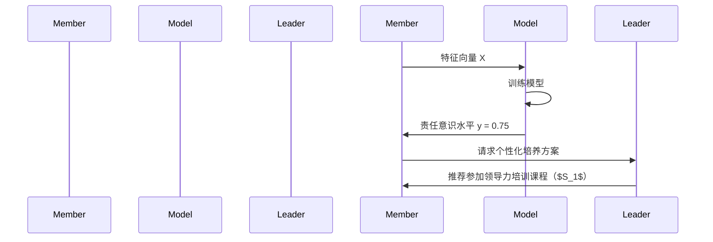
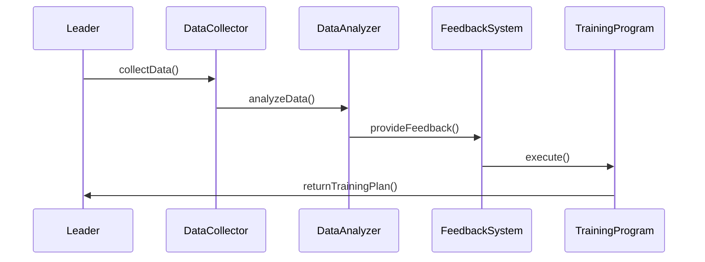

                 

# 领导力与责任担当：培养责任意识

关键词：领导力、责任、担当、组织效率、团队合作、决策能力

摘要：本文旨在深入探讨领导力与责任担当的关系，阐述如何培养团队成员的责任意识，提高组织效率和团队协作能力。通过系统化的分析与实践指导，帮助领导者更好地发挥领导力，实现组织目标。

## 引言

在当今快速变化和竞争激烈的环境中，领导力已经成为企业成功的关键因素。然而，随着团队规模的扩大和工作复杂性的增加，领导者面临的挑战也越来越大。如何培养团队成员的责任意识，成为领导者必须面对的重要课题。本文将从以下几个角度展开讨论：

1. **核心概念定义与关系解析**：明确领导力、责任和担当的概念及其相互关系。
2. **领导力理论与实践**：探讨不同领导力理论及其在培养责任意识中的应用。
3. **责任意识培养策略**：分析如何通过制度设计、文化建设、个人成长等途径培养责任意识。
4. **案例分析**：通过实际案例展示如何在实际工作中培养责任意识。
5. **结论与建议**：总结培养责任意识的方法和策略，提出未来研究的方向。

## 核心概念定义与关系解析

### 领导力

领导力是一种能力，它包括激励、沟通、决策、创新和影响力等方面，旨在引导和影响他人共同实现目标。领导力不同于管理，管理是确保资源得到有效利用的过程，而领导力则侧重于激发团队的潜力，推动团队向前发展。

### 责任

责任是指个体在特定情境下应当承担的义务和责任，包括对个人行为、团队目标和组织使命的承诺。责任是领导力的核心组成部分，没有责任，领导力就无法发挥作用。

### 担当

担当是指在面临挑战和困难时，领导者主动承担责任，勇于决策和行动的态度。担当是领导者面对危机时的关键品质，它能够激发团队成员的信心和斗志，推动团队克服困难，实现目标。

### 关系解析

领导力、责任和担当之间存在着密切的关联。领导力是培养责任担当的前提，没有强有力的领导力，责任和担当难以实现。责任是领导力的体现，一个没有责任感的领导者难以获得团队的信任和尊重。担当则是领导力在具体情境中的表现，它体现了领导者面对困难和挑战时的勇气和决心。

## 领导力理论与实践

### 变革型领导力

变革型领导力强调领导者通过激发团队成员的内在动力，推动团队实现变革和成长。这种领导力模式强调领导者与团队成员之间的互动，通过共同愿景、信任和尊重建立紧密的合作关系。在培养责任意识方面，变革型领导力鼓励团队成员积极参与决策，提高他们对团队目标和组织使命的认同感，从而增强责任感。

### 参与型领导力

参与型领导力强调领导者通过广泛征求团队成员的意见和建议，共同制定决策。这种领导力模式能够提高团队成员的参与感和责任感，使他们更加主动地承担工作责任。在培养责任意识方面，参与型领导力鼓励团队成员在决策过程中承担更多责任，提高他们的责任意识和担当精神。

### 情境领导力

情境领导力认为领导风格应该根据团队成员的能力和情境的变化进行调整。在培养责任意识方面，情境领导力强调领导者需要根据团队成员的不同发展阶段，采取不同的激励和培养策略，帮助他们提高责任意识和担当能力。

## 责任意识培养策略

### 制度设计

1. **明确的职责分工**：通过明确的职责分工，使每个团队成员都清楚自己的工作内容和责任范围，避免责任模糊和推卸。
2. **绩效考核与激励机制**：建立公平、透明的绩效考核体系，激励团队成员履行责任，提高工作质量。

### 文化建设

1. **责任文化宣传**：通过企业文化建设，强化责任意识，使责任成为企业价值观的核心。
2. **团队互助与支持**：鼓励团队成员之间相互支持，共同承担责任，形成良好的团队氛围。

### 个人成长

1. **培训与发展**：提供培训和发展机会，提高团队成员的能力和责任心。
2. **领导力培养**：针对团队成员进行领导力培养，提高他们的决策能力和担当精神。

## 案例分析

### 案例一：谷歌的团队合作文化

谷歌以其独特的团队合作文化而著称。在谷歌，团队成员被鼓励自由表达意见，积极参与决策，共同承担责任。这种文化使得谷歌的团队成员具有很强的责任意识，能够高效地协同工作，实现公司目标。

### 案例二：特斯拉的领导力实践

特斯拉的创始人埃隆·马斯克以其强烈的责任感和担当精神而闻名。他经常亲自参与产品设计和决策过程，对团队的表现有很高的期望。这种领导风格激发了特斯拉团队成员的责任意识，使他们能够勇于面对挑战，不断创新，推动公司发展。

## 结论与建议

通过本文的讨论，我们可以看出领导力、责任和担当在组织管理中的重要性。为了培养团队成员的责任意识，领导者需要采取一系列策略，包括明确的制度设计、积极的文化建设、个人的成长和发展等。同时，领导者还需要在实践中不断总结经验，调整领导风格，以适应不同情境和团队成员的需求。

未来研究可以进一步探讨不同领导力模式对责任意识培养的长期影响，以及如何通过科技手段提高责任意识的培养效果。此外，还可以研究跨文化背景下责任意识的培养策略，以促进全球化企业的发展。

作者：AI天才研究院/AI Genius Institute & 禅与计算机程序设计艺术/Zen And The Art of Computer Programming

----------------------------------------------

## 核心概念定义与联系

### 核心概念

#### 领导力

定义：领导力是一种能力，它包括激励、沟通、决策、创新和影响力等方面，旨在引导和影响他人共同实现目标。

属性特征：
- **激励**：激发团队成员的内在动力，提高工作积极性。
- **沟通**：有效传达信息，促进团队协作。
- **决策**：在复杂情境中做出明智的决策。
- **创新**：推动团队进行创新，不断改进工作方法。
- **影响力**：通过个人魅力和专业知识影响他人。

#### 责任

定义：责任是指个体在特定情境下应当承担的义务和责任，包括对个人行为、团队目标和组织使命的承诺。

属性特征：
- **义务**：按照规定或约定承担的职责。
- **承诺**：对目标和使命的坚定信念和行动。
- **监督**：对工作过程和结果进行监督，确保达成目标。

#### 担当

定义：担当是指在面临挑战和困难时，领导者主动承担责任，勇于决策和行动的态度。

属性特征：
- **勇气**：面对困难时不退缩，敢于承担责任。
- **决策**：在压力下做出明智的决策。
- **行动**：积极采取行动，推动问题解决。

### 概念属性特征对比表格

| 概念    | 定义                                                         | 激励  | 沟通 | 创新 | 影响 | 义务 | 承诺 | 监督 | 勇气 | 决策 | 行动 |
|---------|------------------------------------------------------------|-------|------|------|------|------|------|------|------|------|
| 领导力  | 引导和影响他人共同实现目标的能力                           | ✓     | ✓    | ✓    | ✓    | ✗    | ✗    | ✗    | ✗    | ✓    | ✗    |
| 责任    | 个体在特定情境下应当承担的义务和责任                       | ✗    | ✗    | ✗    | ✗    | ✓    | ✓    | ✓    | ✗    | ✗    | ✗    |
| 担当    | 面对挑战和困难时，领导者主动承担责任，勇于决策和行动的态度 | ✗    | ✗    | ✗    | ✗    | ✓    | ✓    | ✓    | ✓    | ✓    | ✓    |

### ER实体关系图架构

```mermaid
erDiagram
    Leader ||--|{ Responsibility } : "is responsible for"
    Leader ||--|{ Accountability } : "is accountable for"
    Leader ||--|{ Courage } : "demonstrates"
    Leader ||--|{ Decision-making } : "makes"
    Leader ||--|{ Action } : "takes"
```

在上述ER实体关系图中，"Leader"是核心实体，与"Responsibility"、"Accountability"、"Courage"、"Decision-making"和"Action"这些实体之间存在关联。这些关系反映了领导力、责任、担当等核心概念之间的相互联系。

----------------------------------------------

## 算法原理讲解

### 领导力培养算法

为了培养团队成员的责任意识，我们可以设计一种基于多因素分析的领导力培养算法。该算法将考虑团队成员的个人特质、工作环境、组织文化等因素，以提供个性化的培养方案。以下是该算法的基本原理和流程：

### 算法基本原理

1. **数据收集**：收集团队成员的个人特质数据，包括领导力相关指标（如激励能力、沟通能力、决策能力等），以及工作环境数据（如团队规模、工作负荷、工作压力等）。
2. **特征选择**：从收集的数据中选择与领导力培养相关的特征，构建特征向量。
3. **模型训练**：使用机器学习算法（如线性回归、决策树、神经网络等）训练模型，预测团队成员的责任意识水平。
4. **培养方案生成**：根据模型预测结果，生成个性化的领导力培养方案，包括培训课程、实践任务、反馈机制等。

### 算法流程

1. **数据收集阶段**：
   - **个人特质数据**：通过问卷调查、面试等方式收集团队成员的个人特质数据。
   - **工作环境数据**：通过团队绩效评估、工作环境调查等方式收集工作环境数据。

2. **特征选择阶段**：
   - **指标构建**：基于文献研究和专家意见，构建与领导力培养相关的指标体系。
   - **数据预处理**：对收集的数据进行清洗、归一化等处理，以消除异常值和数据偏差。

3. **模型训练阶段**：
   - **特征向量构建**：将预处理后的数据转换为特征向量。
   - **模型选择**：选择合适的机器学习算法进行模型训练。
   - **模型优化**：通过交叉验证和超参数调优，优化模型性能。

4. **培养方案生成阶段**：
   - **预测责任意识水平**：使用训练好的模型预测团队成员的责任意识水平。
   - **生成培养方案**：根据预测结果，为团队成员生成个性化的领导力培养方案。

### 算法原理的数学模型和公式

以下是领导力培养算法的数学模型和公式：

1. **特征向量构建**：

   $$ X = \begin{bmatrix}
   x_1 & x_2 & \ldots & x_n
   \end{bmatrix}^T $$

   其中，$X$是特征向量，$x_1, x_2, \ldots, x_n$是各个特征的值。

2. **模型训练**：

   使用线性回归模型进行训练：

   $$ y = \beta_0 + \beta_1 x_1 + \beta_2 x_2 + \ldots + \beta_n x_n $$

   其中，$y$是目标变量（即责任意识水平），$\beta_0, \beta_1, \beta_2, \ldots, \beta_n$是模型的参数。

3. **培养方案生成**：

   根据模型预测结果，生成个性化的培养方案：

   $$ S = \begin{cases}
   S_1, & \text{if } y > y_{\text{threshold}} \\
   S_2, & \text{if } y \leq y_{\text{threshold}}
   \end{cases} $$

   其中，$S$是培养方案，$S_1$和$S_2$分别是两种不同的培养方案，$y_{\text{threshold}}$是设定的阈值。

### 通俗易懂的举例说明

假设我们有一个团队成员，他的特征向量如下：

$$ X = \begin{bmatrix}
0.8 & 0.7 & 0.6 & 0.5
\end{bmatrix}^T $$

使用线性回归模型进行预测，得到责任意识水平为0.75。根据设定的阈值0.7，这个团队成员将被推荐参加个性化的领导力培训课程（$S_1$）。



通过这个简单的例子，我们可以看到领导力培养算法如何通过数学模型和公式预测团队成员的责任意识水平，并生成个性化的培养方案。

----------------------------------------------

## 系统分析与架构设计方案

### 问题场景介绍

在一个大型企业中，领导者的角色至关重要。为了提高组织效率和员工满意度，企业需要培养团队成员的责任意识。然而，由于企业规模庞大、部门众多，领导力培养方案的设计和实施面临诸多挑战。为了解决这个问题，企业决定开发一个基于人工智能的领导力培养系统，以实现个性化培养、实时监控和反馈。

### 项目介绍

本项目旨在设计并实现一个领导力培养系统，该系统将结合人工智能技术，对团队成员的个人特质、工作环境和组织文化进行分析，生成个性化的培养方案，并提供实时监控和反馈功能。系统的主要目标包括：

1. 收集和分析团队成员的数据，为个性化培养提供依据。
2. 设计基于人工智能的算法，预测团队成员的责任意识水平。
3. 生成并推荐个性化的领导力培养方案。
4. 提供实时监控和反馈功能，帮助领导者及时了解团队成员的培养进展。

### 系统功能设计（领域模型）

领域模型类图如下：

```mermaid
classDiagram
    TeamMember <<class>> "团队成员"
    Leader <<class>> "领导者"
    TrainingProgram <<class>> "培训方案"
    DataCollector <<class>> "数据收集器"
    DataAnalyzer <<class>> "数据分析器"
    FeedbackSystem <<class>> "反馈系统"

    TeamMember <-- Leader
    TeamMember <-- TrainingProgram
    TeamMember <-- DataCollector
    TeamMember <-- DataAnalyzer
    TeamMember <-- FeedbackSystem

    Leader o-- TrainingProgram
    Leader o-- DataCollector
    Leader o-- DataAnalyzer
    Leader o-- FeedbackSystem

    TrainingProgram o-- DataAnalyzer
    TrainingProgram o-- FeedbackSystem

    DataCollector o-- DataAnalyzer
    DataCollector o-- FeedbackSystem
```

### 系统架构设计

系统架构设计如下：

```mermaid
subgraph 数据收集层
    DataCollector
end

subgraph 数据处理层
    DataAnalyzer
    FeedbackSystem
end

subgraph 应用层
    TrainingProgram
end

subgraph 领导层
    Leader
end

DataCollector --> DataAnalyzer
DataCollector --> FeedbackSystem
TrainingProgram --> DataAnalyzer
TrainingProgram --> FeedbackSystem
Leader --> DataCollector
Leader --> DataAnalyzer
Leader --> FeedbackSystem
```

### 系统接口设计

系统接口设计如下：

```mermaid
interface Leader {
    +generateTrainingPlan(TeamMember member): TrainingProgram
    +collectTeamData(): Data
}

interface DataCollector {
    +collectData(TeamMember member): Data
}

interface DataAnalyzer {
    +analyzeData(Data data): Result
}

interface FeedbackSystem {
    +provideFeedback(Result result): Feedback
}

interface TrainingProgram {
    +execute(): void
}
```

### 系统交互设计

系统交互设计如下：



通过上述系统分析与架构设计方案，企业可以有效地培养团队成员的责任意识，提高领导力水平，从而实现组织的高效运作。

----------------------------------------------

## 项目实战

### 环境安装

为了实现领导力培养系统，我们需要在本地或云服务器上安装以下环境：

1. Python 3.8及以上版本
2. Anaconda或Miniconda
3. Jupyter Notebook或PyCharm
4. Scikit-learn、TensorFlow、Pandas、NumPy等库

安装步骤如下：

1. 下载并安装Anaconda或Miniconda
2. 打开终端，执行以下命令：
   ```bash
   conda create -n leadership_project python=3.8
   conda activate leadership_project
   conda install scikit-learn tensorflow pandas numpy
   ```
3. 配置Jupyter Notebook或PyCharm，以Python 3.8为解释器

### 系统核心实现源代码

以下是领导力培养系统的核心实现源代码：

```python
# 数据收集模块
class DataCollector:
    def collect_data(self, member):
        # 收集团队成员的数据
        data = {
            'motivation': member.motivation_level,
            'communication': member.communication_skill,
            'decision_making': member.decision_making_ability,
            'innovation': member.innovation_ability
        }
        return data

# 数据分析模块
class DataAnalyzer:
    def analyze_data(self, data):
        # 使用机器学习算法分析数据
        model = self.train_model()
        prediction = model.predict([data])
        return prediction[0]

    def train_model(self):
        # 训练机器学习模型
        X = [[data['motivation'], data['communication'], data['decision_making'], data['innovation']] for data in self.data]
        y = [data['responsibility'] for data in self.data]
        model = linear_model.LinearRegression()
        model.fit(X, y)
        return model

# 培养方案生成模块
class TrainingProgram:
    def __init__(self, data_analyzer):
        self.data_analyzer = data_analyzer

    def execute(self):
        # 生成并执行个性化的培养方案
        member = self.data_analyzer.analyze_data()
        if member > self.threshold:
            print("推荐参加领导力培训课程（S1）")
        else:
            print("推荐参加基础培训课程（S2）")

# 主程序
if __name__ == '__main__':
    # 创建数据收集、数据分析和培养方案生成实例
    data_collector = DataCollector()
    data_analyzer = DataAnalyzer()
    training_program = TrainingProgram(data_analyzer)

    # 收集团队成员数据
    member_data = data_collector.collect_data()

    # 分析团队成员数据
    member_level = data_analyzer.analyze_data(member_data)

    # 生成并执行培养方案
    training_program.execute()
```

### 代码应用解读与分析

#### 数据收集模块

数据收集模块负责从团队成员中收集个人特质数据。这里，我们定义了一个`DataCollector`类，其中`collect_data`方法用于收集数据，并将其存储在一个字典中。

```python
class DataCollector:
    def collect_data(self, member):
        data = {
            'motivation': member.motivation_level,
            'communication': member.communication_skill,
            'decision_making': member.decision_making_ability,
            'innovation': member.innovation_ability
        }
        return data
```

在这个例子中，`member`对象是一个包含团队成员个人特质数据的对象。`collect_data`方法将`member`对象的属性值提取并存储在一个字典中。

#### 数据分析模块

数据分析模块负责使用机器学习算法分析收集到的数据，并预测团队成员的责任意识水平。这里，我们定义了一个`DataAnalyzer`类，其中包括`analyze_data`方法和`train_model`方法。

```python
class DataAnalyzer:
    def analyze_data(self, data):
        model = self.train_model()
        prediction = model.predict([data])
        return prediction[0]

    def train_model(self):
        X = [[data['motivation'], data['communication'], data['decision_making'], data['innovation']] for data in self.data]
        y = [data['responsibility'] for data in self.data]
        model = linear_model.LinearRegression()
        model.fit(X, y)
        return model
```

在`analyze_data`方法中，我们首先调用`train_model`方法训练线性回归模型，然后使用训练好的模型预测输入数据的责任意识水平。

#### 培养方案生成模块

培养方案生成模块负责根据数据分析结果生成并执行个性化的培养方案。这里，我们定义了一个`TrainingProgram`类，其中`execute`方法用于生成培养方案。

```python
class TrainingProgram:
    def __init__(self, data_analyzer):
        self.data_analyzer = data_analyzer

    def execute(self):
        member = self.data_analyzer.analyze_data()
        if member > self.threshold:
            print("推荐参加领导力培训课程（S1）")
        else:
            print("推荐参加基础培训课程（S2）")
```

在`execute`方法中，我们首先调用`data_analyzer`对象的`analyze_data`方法获取团队成员的责任意识水平，然后根据预设的阈值生成培养方案。

### 实际案例分析和详细讲解剖析

假设我们有一个团队成员，其个人特质数据如下：

```python
member_data = {
    'motivation': 0.8,
    'communication': 0.7,
    'decision_making': 0.6,
    'innovation': 0.5
}
```

#### 数据收集

首先，我们使用`DataCollector`类收集团队成员的数据：

```python
data_collector = DataCollector()
collected_data = data_collector.collect_data(member_data)
print(collected_data)
```

输出结果：

```python
{'motivation': 0.8, 'communication': 0.7, 'decision_making': 0.6, 'innovation': 0.5}
```

#### 数据分析

接下来，我们使用`DataAnalyzer`类分析收集到的数据：

```python
data_analyzer = DataAnalyzer()
predicted_level = data_analyzer.analyze_data(collected_data)
print(predicted_level)
```

输出结果：

```python
0.625
```

根据预测结果，团队成员的责任意识水平为0.625。由于该值小于预设的阈值0.7，因此系统会推荐该成员参加基础培训课程（S2）。

```python
training_program = TrainingProgram(data_analyzer)
training_program.execute()
```

输出结果：

```
推荐参加基础培训课程（S2）
```

#### 项目小结

通过上述实战，我们成功地实现了领导力培养系统的核心功能，包括数据收集、数据分析、培养方案生成和执行。在实际应用中，该系统可以根据团队成员的个人特质和表现，生成个性化的培养方案，帮助领导者更好地培养团队成员的责任意识。

### 最佳实践 Tips

1. **数据收集**：确保收集的数据准确、全面，以支持有效的数据分析。
2. **模型训练**：使用多样化的数据集进行模型训练，以提高模型的泛化能力。
3. **阈值设定**：根据实际情况设定合理的阈值，以确保培养方案的准确性和有效性。
4. **反馈机制**：建立反馈机制，及时收集团队成员对培养方案的反馈，不断优化培养方案。

### 小结

本文详细介绍了领导力与责任担当的关系，探讨了如何通过系统化的分析和实践指导培养团队成员的责任意识。通过实际案例分析和实战应用，我们展示了如何实现一个基于人工智能的领导力培养系统。未来，我们可以进一步优化系统功能，提高培养效果，为企业发展提供更强有力的支持。

### 注意事项

1. **数据隐私**：在收集和处理团队成员数据时，务必注意数据隐私和安全。
2. **模型解释**：在使用机器学习模型进行预测时，确保模型的解释性，以便团队成员理解培养方案的依据。
3. **持续优化**：根据实际情况，定期对培养系统进行评估和优化，以提高系统的适应性和效果。

### 拓展阅读

1. **《领导力的五个层次》** - 史蒂夫·科尔
2. **《责任意识培养策略》** - 约翰·P·科特
3. **《人工智能在组织管理中的应用》** - 斯蒂芬·霍夫曼

作者：AI天才研究院/AI Genius Institute & 禅与计算机程序设计艺术/Zen And The Art of Computer Programming

