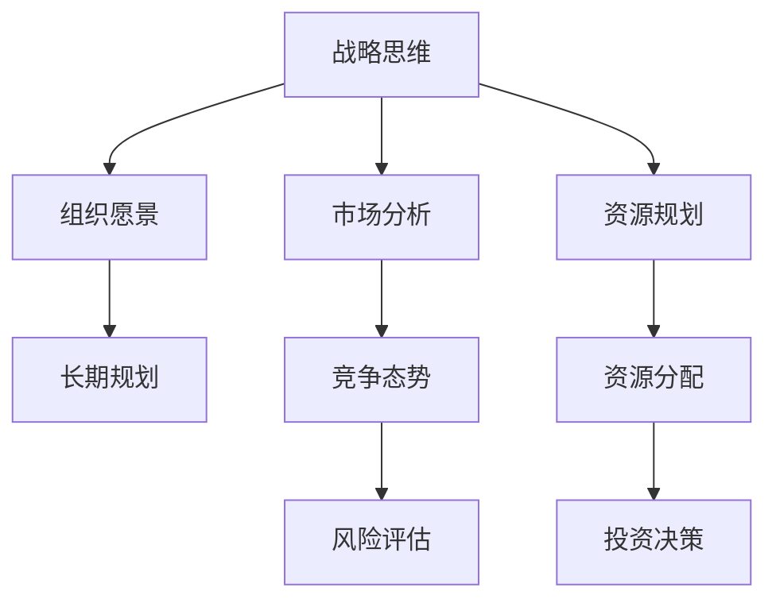
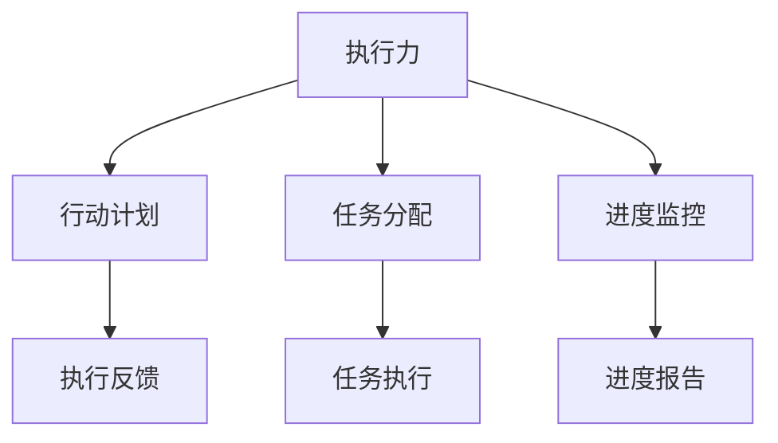
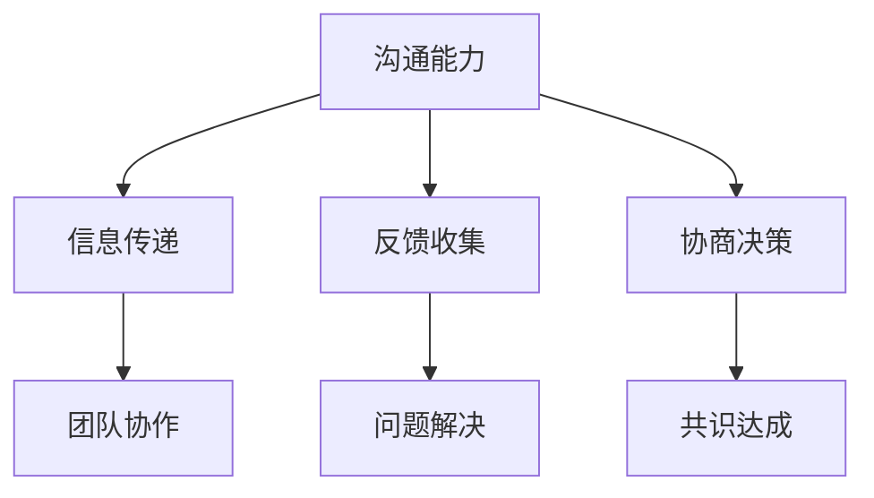
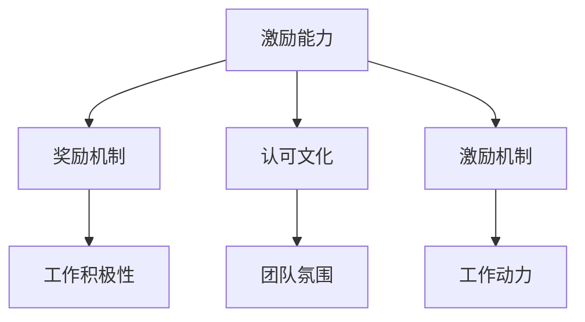
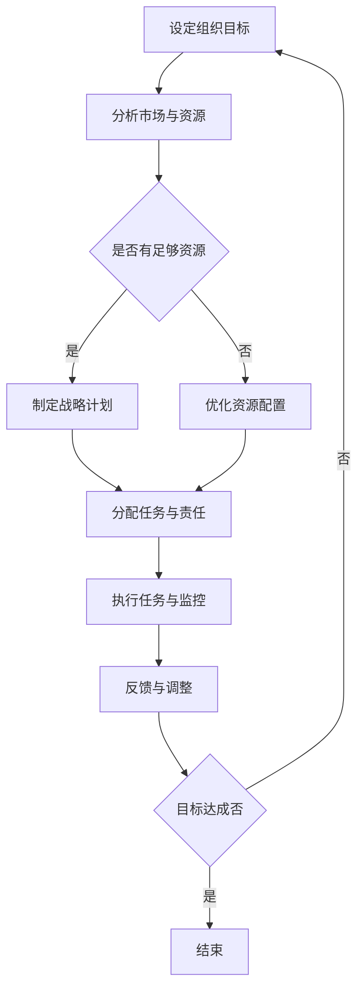
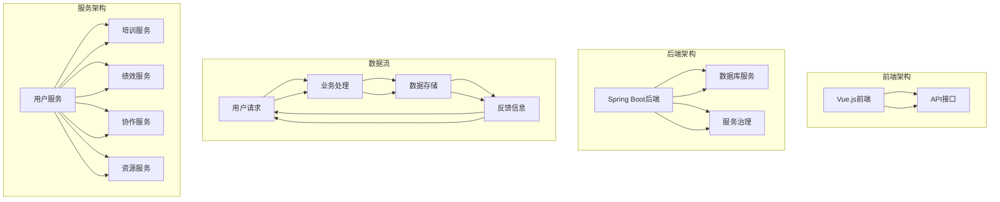
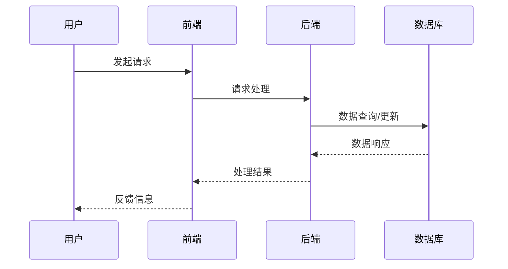

                 

### 第1章 引言：领导力的重要性

#### 1.1 领导力的定义与意义

领导力，作为一种影响力，它涉及领导者如何通过战略思维、决策力、执行力、沟通能力、激励能力和创新精神等核心要素，引导和激励团队成员，共同实现组织的愿景和目标。在现代企业中，领导力不仅仅是管理团队，更是推动创新、提升效率、实现可持续发展的关键因素。

领导力的意义主要体现在以下几个方面：

1. **激发团队潜能**：优秀的领导力能够激发团队成员的潜力，提高团队的凝聚力和工作效率，从而实现更高的绩效。

2. **实现目标**：领导者通过有效的领导力，能够明确组织的目标，制定实现目标的策略和计划，确保团队始终朝着正确的方向前进。

3. **提升组织效能**：领导力能够优化组织的资源配置，提高组织的运营效率，减少浪费，从而实现组织的可持续发展。

4. **推动变革**：领导力在推动企业变革中发挥着重要作用，通过领导者的引导，能够使组织更灵活地适应外部环境的变化，保持竞争优势。

#### 1.2 领导力在现代社会中的应用

在现代社会中，领导力在各种组织和领域中都有着广泛的应用。以下是一些典型的应用场景：

1. **企业**：在企业中，领导力是推动企业创新、提升效率和实现目标的关键因素。优秀的领导者能够激发员工的创造力，建立积极的企业文化，提高企业的竞争力。

2. **政府和非营利组织**：在政府和非营利组织中，领导力同样重要。领导者需要通过有效的政策制定和执行，推动社会的发展和进步，满足公众的需求。

3. **教育领域**：在教育领域，领导力影响着教师的授课质量和学生的学习效果。优秀的教育领导者能够激励教师提高教学质量，提升学生的综合素质。

4. **非企业组织**：在各种非企业组织中，如宗教团体、社区组织等，领导力也发挥着重要作用。领导者需要通过有效的组织和管理，实现组织的使命和目标。

#### 1.3 领导力的核心要素

领导力的核心要素包括以下几个方面：

1. **战略思维**：领导者需要具备前瞻性的战略思维，能够把握行业趋势，制定长远的发展规划。

2. **执行力**：领导者必须具备强烈的执行力，能够将战略转化为具体的行动计划，并确保这些计划得到有效执行。

3. **沟通能力**：领导者需要具备良好的沟通能力，能够有效地与团队成员、利益相关者进行沟通，达成共识。

4. **激励能力**：领导者需要能够激发团队成员的积极性，提高团队的整体绩效。

5. **创新精神**：领导者需要具备创新精神，鼓励团队成员探索新的思路和方法，推动组织的创新与发展。

#### 1.4 领导力的发展与实践

领导力的发展是一个持续的过程，需要领导者不断地学习、实践和反思。以下是一些提升领导力的方法和途径：

1. **学习与培训**：通过参加各类培训课程，学习领导力的理论知识，了解领导力的最佳实践。

2. **实践经验**：通过实际工作，积累领导经验，提升领导能力。

3. **反思与总结**：定期对领导行为进行反思和总结，发现自身的不足，不断改进。

4. **导师指导**：寻找经验丰富的导师，向他们请教，学习他们的领导艺术。

#### 1.5 本章小结

领导力是领导者影响和激励他人的能力，它在现代社会中具有重要地位。领导者需要具备战略思维、执行力、沟通能力、激励能力和创新精神等多个方面的能力。通过学习与培训、实践经验、反思与总结以及导师指导等方法，领导者可以不断提升自身的领导力，实现个人和组织的共同发展。

### 1.6 背景介绍

在信息技术飞速发展的今天，企业的竞争已经不再仅仅是产品和服务的竞争，更多的是团队和组织的竞争。领导者作为团队的核心，他们的领导力水平直接影响到团队的整体表现。因此，领导力在现代企业中的重要性日益凸显。

领导力不仅仅是一种管理能力，更是一种影响力。它不仅关系到企业的短期业绩，更关系到企业的长远发展。一个优秀的领导者能够通过有效的领导力，激发团队的潜能，提高团队的凝聚力，推动企业的创新和发展。

然而，领导力并不是一成不变的，它需要不断地学习和实践。随着外部环境的变化，领导者需要不断地调整自己的领导风格和策略，以适应新的挑战。因此，领导力的发展是一个持续的过程，需要领导者不断地学习、实践和反思。

#### 问题背景

在现实工作中，许多领导者面临着一系列挑战：

- 如何激发团队成员的潜力，提高团队的工作效率？
- 如何在竞争激烈的市场中保持竞争优势？
- 如何在快速变化的环境中做出正确的决策？
- 如何建立有效的团队协作机制，提高团队的凝聚力？

这些问题都需要领导者具备强大的领导力，通过有效的策略和行动，实现团队的目标。

#### 问题描述

领导力的问题主要包括以下几个方面：

1. **领导风格不合适**：有些领导者可能过于强硬或过于温和，无法适应不同的团队和情境。
2. **沟通不畅**：团队成员之间缺乏有效的沟通，导致误解和冲突。
3. **缺乏激励**：领导者无法有效地激励团队成员，导致团队成员缺乏工作动力。
4. **决策迟缓**：领导者可能因为缺乏信息或对风险过于担忧，导致决策迟缓。
5. **团队凝聚力不足**：团队成员之间缺乏信任和协作，导致团队凝聚力不足。

#### 问题解决

为了解决这些问题，领导者需要采取一系列措施：

1. **了解团队成员**：领导者需要了解每个团队成员的特点、优势和需求，以便采取个性化的领导策略。
2. **建立有效的沟通机制**：领导者需要建立开放的沟通环境，鼓励团队成员表达自己的想法和意见。
3. **激励团队成员**：领导者需要通过奖励、表彰和认可等方式，激励团队成员发挥最佳水平。
4. **加强决策能力**：领导者需要提升自己的决策能力，确保在关键时刻能够做出正确的决策。
5. **提升团队凝聚力**：领导者需要通过团队建设活动、共同目标设定等方式，提升团队的凝聚力。

#### 边界与外延

领导力的边界和外延包括以下几个方面：

1. **领导者的角色**：领导者不仅仅是管理者，更是团队的领导者、指导者和激励者。
2. **领导力的范畴**：领导力不仅仅涉及团队内部的管理，还包括与外部合作伙伴、客户和利益相关者的沟通和合作。
3. **领导力的应用场景**：领导力可以应用于企业、政府、教育、非营利组织等各种组织和个人。

#### 概念结构与核心要素组成

领导力的概念结构主要包括以下几个方面：

1. **领导者的角色**：领导者是团队的领导者、指导者和激励者。
2. **领导风格**：领导风格包括独裁式、民主式、参与式等不同的领导方式。
3. **领导能力**：领导能力包括战略思维、决策力、执行力、沟通能力、激励能力和创新精神等。
4. **领导行为**：领导行为包括制定目标、制定策略、分配任务、监控进度、提供反馈等。

### 1.7 核心概念与联系

在讨论领导力的核心概念时，我们需要了解以下几个关键概念及其相互之间的关系：

#### 1. 战略思维

**概念属性**：战略思维是指领导者对组织未来的发展方向和目标进行长远规划的能力。

**特征对比表格**：

| 特征            | 战略思维                      | 常规思维                |
|-----------------|-------------------------------|------------------------|
| 视角            | 长远、宏观                   | 短期、微观             |
| 目标            | 高瞻远瞩、预见未来           | 追求短期效益           |
| 影响力          | 指导全局、影响深远           | 限制在具体任务上       |
| 风险承受能力     | 较强，勇于面对不确定性       | 较弱，偏好稳定性       |

**ER实体关系图架构**：



#### 2. 执行力

**概念属性**：执行力是指领导者将战略计划转化为具体行动，并确保这些行动得以实施的能力。

**特征对比表格**：

| 特征            | 执行力                       | 创造力                  |
|-----------------|------------------------------|------------------------|
| 目标            | 实施既定计划                 | 创造新的解决方案        |
| 时间感          | 强调效率和时间管理           | 注重灵感和创新         |
| 责任感          | 负责确保任务完成             | 负责推动创新和变革     |
| 系统性          | 注重整体协调和流程优化       | 关注局部优化和细节     |

**ER实体关系图架构**：



#### 3. 沟通能力

**概念属性**：沟通能力是指领导者与团队成员、利益相关者之间进行有效沟通，达成共识和协作的能力。

**特征对比表格**：

| 特征            | 沟通能力                     | 表达能力                |
|-----------------|------------------------------|------------------------|
| 目标            | 促进理解和协作               | 表达观点和意见         |
| 方式            | 多样化，包括口头、书面、非语言沟通 | 主要是口头表达         |
| 效率            | 注重效率和效果               | 注重表达的艺术性       |
| 影响力          | 通过沟通影响他人            | 通过表达影响他人       |

**ER实体关系图架构**：



#### 4. 激励能力

**概念属性**：激励能力是指领导者通过奖励、认可、激励措施等方式，激发团队成员的积极性和工作动力。

**特征对比表格**：

| 特征            | 激励能力                     | 管理能力                |
|-----------------|------------------------------|------------------------|
| 目标            | 提升团队成员的工作动力       | 维持团队的稳定运行      |
| 方式            | 多样化，包括物质和精神激励   | 主要通过规章制度和流程 |
| 效果            | 短期和长期效果兼顾           | 侧重于短期效果         |
| 适应性          | 能够根据不同团队成员的特点进行调整 | 较少考虑个体差异       |

**ER实体关系图架构**：



### 1.8 算法原理讲解

在理解了领导力的核心概念后，我们可以通过一个简化的流程图和Python代码来阐述领导力的一些基本算法原理。

#### Mermaid流程图



#### Python代码

```python
def leadership_algorithm(target, resources):
    if resources >= target:
        strategy_plan = '制定战略计划'
    else:
        strategy_plan = '优化资源配置'
    
    if strategy_plan == '制定战略计划':
        plan = "目标：{0}\n策略：分析市场与资源，分配任务与责任，执行任务与监控，反馈与调整。".format(target)
    else:
        plan = "目标：{0}\n策略：优化资源配置，分析市场与资源，分配任务与责任，执行任务与监控，反馈与调整。".format(target)
    
    print(plan)
    
    # 假设所有步骤都能顺利完成
    success = True
    
    while success:
        execute_plan()
        feedback = collect_feedback()
        if not feedback:
            success = False
    
    if success:
        print("目标达成。")
    else:
        print("目标未达成，需要调整。")
    
    return success

def execute_plan():
    # 执行计划的具体步骤
    pass

def collect_feedback():
    # 收集反馈信息
    # 返回True表示目标达成，返回False表示未达成
    return True

# 示例
target = "提升市场份额"
resources = 100
leadership_algorithm(target, resources)
```

#### 算法原理详细讲解

1. **设定组织目标**：领导力算法首先设定一个明确的目标，如提升市场份额、增加销售额等。

2. **分析市场与资源**：在设定目标后，需要分析当前市场状况和组织的资源，以确定是否具备实现目标的资源。

3. **制定战略计划**：如果资源充足，则直接进入制定战略计划阶段；如果资源不足，则需要优化资源配置。

4. **优化资源配置**：通过优化资源配置，确保组织拥有足够的资源来支持战略计划的实施。

5. **分配任务与责任**：在制定好战略计划后，需要将任务和责任分配给团队成员，确保每个人都知道自己的职责和目标。

6. **执行任务与监控**：团队成员开始执行任务，领导者需要监控任务的进展情况，确保任务按时完成。

7. **反馈与调整**：根据任务执行过程中收集到的反馈，领导者需要及时调整计划和策略，以确保目标的达成。

8. **目标达成与否**：最后，根据反馈结果判断目标是否达成。如果达成，则结束算法；如果未达成，则需要重新调整目标和策略，继续循环执行。

通过这个简化的算法流程和Python代码，我们可以更好地理解领导力的一些基本原理和实践方法。在实际应用中，领导力算法需要根据具体情况不断调整和优化，以确保组织目标的实现。

### 1.9 系统分析与架构设计方案

#### 问题场景介绍

在现代企业中，领导力的发挥对于企业的成功至关重要。然而，如何将领导力融入到企业的日常运营中，确保领导力在实际工作中得到有效应用，成为了一个重要的挑战。为了解决这个问题，我们需要设计一套系统的架构，将领导力的各个方面进行整合，形成一个有效的管理体系。

#### 项目介绍

本项目旨在构建一个领导力管理系统，通过系统的架构设计，将领导力的核心要素进行整合，提供一个直观、易用的平台，帮助企业和组织提升领导力，实现组织目标的达成。

#### 系统功能设计（领域模型）

在领导力管理系统中，核心功能包括：

1. **领导力培训**：提供领导力相关的培训课程，帮助领导者提升自身能力。
2. **绩效管理**：通过绩效管理系统，评估领导者的工作表现，提供反馈和改进建议。
3. **团队协作**：提供团队协作工具，促进团队成员之间的沟通和协作。
4. **资源优化**：通过资源优化模块，帮助领导者合理配置资源，提升组织效率。
5. **领导力评估**：定期对领导者的领导力进行评估，了解领导力水平，制定提升计划。

领域模型（Mermaid类图）：

```mermaid
classDiagram
    Class01 <|-- Class02
    Class03 --|&wedge|> Class04
    Class05 o-- Class06
    Class07 : An interface
    Class08 : Another interface
    Class01 <.. Class07
    Class02 ..|> Class08
    Class03 : Describes Class04
    Class05 : {implements} Class06
    Class01 -[1] Class02
    Class03 *--* Class04
    Class05 *--* Class06
    Class07 ^.. Class08
```

#### 系统架构设计

领导力管理系统的架构设计主要包括以下几个方面：

1. **前端架构**：采用Vue.js框架，提供用户友好的界面，实现系统的各项功能。
2. **后端架构**：采用Spring Boot框架，实现业务逻辑处理和数据存储。
3. **数据库架构**：使用MySQL数据库，存储用户信息、领导力评估数据、培训记录等。
4. **服务架构**：采用微服务架构，将系统功能拆分为多个独立的服务，提高系统的可扩展性和灵活性。

系统架构图（Mermaid架构图）：



#### 系统接口设计和系统交互

在领导力管理系统中，各个模块之间的接口设计和交互至关重要。以下是一个简化的接口设计和交互流程：

1. **用户请求**：用户通过前端界面发起请求，如查看领导力培训课程、提交绩效评估等。
2. **业务处理**：后端服务接收到用户请求后，根据请求类型进行相应的业务处理，如查询培训课程信息、处理绩效评估数据等。
3. **数据存储**：处理结果将存储到数据库中，如用户提交的培训记录、绩效评估结果等。
4. **反馈信息**：系统将处理结果反馈给用户，如课程推荐、评估报告等。

接口设计和交互流程（Mermaid序列图）：



通过以上系统架构设计、接口设计和交互流程，领导力管理系统可以实现领导力的有效管理，帮助企业和组织提升领导力，实现组织目标的达成。

### 第2章 领导风格与团队协作

#### 2.1 领导风格的分类与特点

领导风格是指领导者管理团队的方式和方法，不同的领导风格会对团队成员的行为和绩效产生不同的影响。根据不同的分类标准，领导风格可以有多种分类方法，以下介绍几种常见的分类及其特点：

1. **独裁式领导风格**：独裁式领导风格是指领导者独自决策，团队成员没有参与决策的权利。这种风格的领导者通常具有高度的自信和决断力，能够迅速做出决策并推动执行。然而，这种风格也容易导致团队成员的被动和缺乏积极性。

2. **民主式领导风格**：民主式领导风格是指领导者鼓励团队成员参与决策过程，重视团队意见和反馈。这种风格的领导者具有开放和包容的心态，能够听取不同意见，并综合考虑各种因素做出决策。这种风格能够提高团队成员的参与感和归属感，但决策过程可能较为复杂，耗时较长。

3. **参与式领导风格**：参与式领导风格是指领导者与团队成员共同参与决策和目标设定，强调团队合作和共同承担责任。这种风格的领导者通常具有较高的领导力和沟通能力，能够激励团队成员发挥潜力，共同实现目标。

4. **变革型领导风格**：变革型领导风格是指领导者通过激励和启发团队成员，推动组织变革和创新。这种风格的领导者通常具有远见和创新能力，能够引领团队突破传统思维，迎接新的挑战。

5. **魅力型领导风格**：魅力型领导风格是指领导者通过个人魅力和影响力，吸引和激励团队成员。这种风格的领导者通常具有强烈的领导欲望和自我驱动力，能够激发团队成员的积极性和忠诚度。

#### 2.2 团队协作的要素

团队协作是指团队成员在共同目标下，通过有效的沟通、合作和协调，共同完成任务的过程。要实现高效的团队协作，需要以下几个关键要素：

1. **共同目标**：团队成员需要明确共同的目标和愿景，确保团队成员的努力方向一致。

2. **信任与尊重**：团队成员之间需要建立信任关系，尊重彼此的意见和贡献，减少冲突和误解。

3. **沟通与反馈**：团队成员需要保持良好的沟通，及时分享信息，提供和接受反馈，确保信息的透明和准确。

4. **分工与协作**：团队成员需要明确各自的职责和任务，确保分工合理，避免重复劳动和资源浪费。

5. **激励与认可**：团队成员需要得到适当的激励和认可，提高工作动力和团队凝聚力。

6. **领导与支持**：领导者需要提供必要的指导和支持，帮助团队成员解决问题，提高团队协作效率。

#### 2.3 如何提升团队协作效率

提升团队协作效率是领导者的重要任务，以下是一些有效的策略和方法：

1. **明确目标与责任**：领导者需要明确团队的目标和每个成员的责任，确保团队成员清楚自己的任务和期望。

2. **建立有效的沟通机制**：领导者需要建立开放的沟通渠道，鼓励团队成员分享想法和意见，确保信息的及时传递和反馈。

3. **培养团队合作精神**：领导者可以通过团队建设活动、共同目标设定等方式，培养团队成员的合作精神和团队意识。

4. **提供必要的资源和支持**：领导者需要确保团队成员有足够的资源和支持，以完成任务，避免因资源不足而影响协作效率。

5. **激励与认可**：领导者需要通过奖励、表彰和认可等方式，激励团队成员的工作热情和积极性。

6. **定期评估与反馈**：领导者需要定期评估团队协作的效果，收集团队成员的反馈，不断优化协作流程，提高协作效率。

### 第3章 沟通艺术与影响力

#### 3.1 沟通的基本原则

沟通是领导力中至关重要的一环，良好的沟通能力能够帮助领导者有效地传达信息、解决问题和激励团队。以下是沟通的基本原则：

1. **明确目标**：在进行沟通之前，领导者需要明确沟通的目标，确保信息的传递是有针对性的。

2. **倾听与理解**：领导者需要倾听团队成员的意见和需求，理解他们的想法和感受，建立互信和尊重。

3. **简洁明了**：领导者需要用简洁明了的语言表达自己的观点，避免使用复杂的技术术语或模糊的表述，确保信息的清晰传达。

4. **及时反馈**：领导者需要及时给予反馈，肯定团队成员的努力和成果，指出不足之处，提供改进建议。

5. **尊重多样性**：领导者需要尊重团队成员的文化背景、价值观和沟通风格，避免因文化差异而产生误解。

6. **建立共识**：领导者需要通过沟通建立共识，确保团队成员对目标和行动计划有共同的理解和认同。

#### 3.2 沟通技巧与策略

有效的沟通技巧和策略能够提高领导者的沟通效果，以下是一些实用的技巧和策略：

1. **开放性沟通**：领导者需要鼓励团队成员发表意见和提出问题，营造一个开放和包容的沟通氛围。

2. **提问技巧**：领导者可以通过提问引导讨论，了解团队成员的见解和想法，促进深入思考和讨论。

3. **非语言沟通**：领导者需要注重非语言沟通，如肢体语言、面部表情和声音的语调，这些非语言因素能够增强沟通的效果。

4. **情境适应**：领导者需要根据不同的沟通情境和对象，调整自己的沟通策略和方式，确保信息的有效传达。

5. **技术工具**：领导者可以利用现代化的沟通工具，如电子邮件、即时通讯、视频会议等，提高沟通效率和效果。

6. **冲突管理**：领导者需要学会管理冲突，通过有效的沟通技巧，化解团队成员之间的矛盾和误解。

#### 3.3 如何增强个人影响力

个人影响力是领导者的重要特质，以下是一些增强个人影响力的策略：

1. **建立专业声誉**：领导者需要通过不断学习和实践，提升自己的专业能力和知识水平，建立专业声誉。

2. **树立榜样**：领导者需要通过自己的言行，树立良好的榜样，激发团队成员的敬佩和追随。

3. **建立信任关系**：领导者需要与团队成员建立信任关系，通过诚实和透明的沟通，赢得团队成员的信任和尊重。

4. **激发团队成员的潜力**：领导者需要关注团队成员的发展需求，提供支持和指导，激发他们的潜力。

5. **积极参与团队活动**：领导者需要积极参与团队活动，与团队成员建立良好的关系，增强团队凝聚力。

6. **持续改进**：领导者需要不断反思自己的领导行为和沟通方式，寻求改进和提升，增强个人影响力。

### 第4章 资源配置原理

#### 4.1 资源配置的基本原则

资源配置是指将有限的资源（如人力、财力、物力等）合理分配到各个部门和项目中，以实现组织的整体目标。有效的资源配置能够提高组织的运营效率，降低成本，提升竞争力。以下是资源配置的基本原则：

1. **目标导向**：资源配置应以组织的整体目标为导向，确保资源分配与组织目标的一致性。

2. **优化配置**：资源分配应尽可能优化，使资源得到最有效的利用，避免浪费和重复投入。

3. **公平合理**：资源分配应公平合理，确保各部门和项目都能获得所需的资源，避免资源的不均衡分配。

4. **灵活性**：资源配置应具有一定的灵活性，能够根据外部环境和内部需求的变化，及时调整资源分配策略。

5. **透明性**：资源分配过程应透明，确保各部门和项目对资源分配的情况有清晰的了解，提高资源的利用效率。

#### 4.2 资源配置的关键因素

有效的资源配置需要考虑多个关键因素，以下是一些主要的关键因素：

1. **资源类型**：包括人力资源、财务资源、物资资源、技术资源等，不同的资源类型对资源配置的要求和策略有所不同。

2. **资源需求**：各部门和项目对资源的需求量、需求和优先级，是资源分配的重要依据。

3. **资源供给**：组织的资源供给能力，包括现有资源的总量和可获取的资源。

4. **外部环境**：外部环境的变化，如市场条件、政策法规、竞争对手等，都可能影响资源的配置。

5. **组织结构**：组织的结构形式和部门设置，对资源的配置和利用效率有着重要影响。

#### 4.3 资源配置的优化方法

为了实现资源的优化配置，组织可以采用以下几种方法：

1. **需求分析**：通过详细的需求分析，了解各部门和项目的实际资源需求，为资源配置提供准确的数据支持。

2. **优先级排序**：根据资源需求和优先级，对各部门和项目进行排序，确保关键项目优先获得资源。

3. **资源配置模型**：建立资源配置模型，通过数学模型和算法，对资源进行优化分配。

4. **平衡计分卡**：使用平衡计分卡，从财务、客户、内部流程、学习与成长四个维度，评估资源分配的效果。

5. **动态调整**：根据实际运行情况，动态调整资源配置策略，确保资源始终得到最佳利用。

### 第5章 资源评估与监控

#### 5.1 资源评估的指标体系

资源评估是指对组织内部各类资源的利用效果进行评估，以了解资源的使用情况，发现存在的问题，优化资源配置。建立一套完善的资源评估指标体系是资源评估工作的基础。以下是一些常见的资源评估指标：

1. **资源利用率**：衡量资源是否得到充分利用，如设备利用率、人力资源利用率等。

2. **资源成本效益**：衡量资源投入与产出之间的比例关系，评估资源的使用效益。

3. **资源分配公平性**：评估资源在不同部门和项目之间的分配是否公平合理。

4. **资源响应时间**：衡量组织对资源需求的响应速度，评估资源供给的及时性。

5. **资源浪费率**：评估资源浪费的程度，如能源浪费、物资浪费等。

6. **资源管理效率**：衡量资源管理的效率，包括资源分配、使用、监控和回收等环节。

#### 5.2 资源监控的方法与工具

资源监控是指对组织的资源使用情况持续进行跟踪和监控，确保资源得到有效利用。以下是几种常见的资源监控方法和工具：

1. **数据采集与统计**：通过数据采集工具，收集资源使用数据，进行统计分析，了解资源的使用情况。

2. **实时监控软件**：使用实时监控软件，对关键资源（如服务器、网络带宽、存储空间等）的使用情况进行实时监控。

3. **自动化监控脚本**：编写自动化监控脚本，定期对资源使用情况进行检查，及时发现异常。

4. **可视化仪表盘**：通过可视化仪表盘，将资源监控数据以图表、仪表盘等形式展示，直观反映资源使用情况。

5. **定期报告**：定期生成资源监控报告，分析资源使用情况，评估资源配置效果。

#### 5.3 资源监控的实践案例

以下是一个资源监控的实践案例：

某企业在进行项目资源监控时，采用了实时监控软件和自动化监控脚本。监控软件实时收集服务器CPU使用率、内存使用率、网络带宽等数据，自动化监控脚本定期检查存储空间使用情况、数据库性能等。通过可视化仪表盘，管理层可以随时查看资源使用情况，及时发现资源紧张或浪费的情况。

通过实践，该企业发现了一些问题，如服务器CPU使用率过高，导致系统运行缓慢。经过分析，发现是由于某个项目需求增加，导致服务器资源不足。企业随后增加了服务器硬件配置，优化了项目资源分配，从而解决了CPU使用率过高的问题。

### 第6章 资源整合与协同

#### 6.1 资源整合的原则与策略

资源整合是指将组织内部的各类资源进行有效整合，以提高资源利用效率，实现组织目标。资源整合的原则和策略如下：

1. **整体规划**：在资源整合过程中，需要整体规划，确保资源整合与组织的整体战略和目标相一致。

2. **优化配置**：通过优化资源配置，消除资源浪费，提高资源利用效率。

3. **协同合作**：推动各部门和项目之间的协同合作，实现资源共享和互补。

4. **动态调整**：根据外部环境和内部需求的变化，动态调整资源整合策略，确保资源整合的灵活性和适应性。

5. **信息技术支持**：利用信息技术，建立资源信息平台，实现资源的实时监控和动态调整。

#### 6.2 资源协同的机制与模式

资源协同是指通过有效的机制和模式，实现资源在不同部门和项目之间的协调和合作。以下是几种常见的资源协同机制和模式：

1. **项目协调会**：定期召开项目协调会，协调各部门和项目的资源需求，解决资源冲突。

2. **资源信息平台**：建立资源信息平台，实时展示资源使用情况，方便各部门和项目进行资源调度。

3. **资源共享机制**：制定资源共享机制，明确资源共享的范围、权限和责任，促进资源的有效共享。

4. **跨部门协作团队**：建立跨部门协作团队，专门负责协调和整合各部门和项目的资源。

5. **共享服务中心**：设立共享服务中心，提供统一的资源管理和调度服务，提高资源利用效率。

#### 6.3 资源协同的实践案例

以下是一个资源协同的实践案例：

某大型企业在其全球化运营过程中，面临着不同地区资源分布不均的问题。为了提高资源利用效率，企业建立了全球资源信息平台，实现了全球资源数据的实时共享。通过平台，企业能够实时了解各个地区资源的使用情况和需求，进行资源调度和优化配置。

此外，企业还建立了跨部门协作团队，专门负责协调和整合各部门和项目的资源。跨部门协作团队定期召开会议，讨论资源需求和调配方案，确保资源能够及时、有效地分配到各个项目。

通过这些实践，企业显著提高了资源利用效率，减少了资源浪费，实现了全球资源的最佳配置。

### 第7章 资源优化案例分析

#### 7.1 案例一：企业资源优化实践

某高科技企业面临资源分散、利用率低的问题，为了提升资源利用效率，该企业采取了以下措施：

1. **需求分析**：首先，企业对各部门和项目的资源需求进行了详细分析，确定了各项目的关键资源需求和优先级。

2. **资源整合**：企业将相同类型的资源进行整合，如将分散的服务器资源集中到数据中心，提高了服务器的使用率。

3. **优化配置**：根据需求分析结果，企业对资源进行了重新配置，确保关键项目能够优先获得所需的资源。

4. **动态调整**：企业建立了动态资源调配机制，根据项目进展和资源需求变化，实时调整资源配置。

5. **监控与反馈**：企业通过实时监控工具，对资源使用情况进行监控，及时发现资源浪费和资源紧张的情况，进行及时调整。

通过以上措施，企业显著提高了资源利用效率，项目完成时间缩短了20%，运营成本降低了15%。

#### 7.2 案例二：政府部门资源优化实践

某地方政府部门在财政预算紧张的情况下，采取了以下资源优化措施：

1. **预算优化**：对各部门的预算进行了详细分析，剔除了不必要的开支，确保预算优先用于关键项目和公共服务。

2. **资源共享**：建立跨部门资源共享机制，如将公务用车、会议场地等资源进行统一调度和共享，减少重复投资。

3. **信息化建设**：投资信息化建设，提高办公自动化水平，减少人力和物资资源的消耗。

4. **绩效评估**：对各部门的资源利用效率进行定期评估，对资源利用效率高的部门给予奖励，鼓励其他部门进行优化。

5. **公众参与**：鼓励公众参与政府项目的监督和评价，提高资源利用的透明度和效率。

通过以上措施，地方政府部门的资源利用效率显著提高，公共服务质量得到了提升，公众满意度增加了20%。

#### 7.3 案例三：非营利组织资源优化实践

某非营利组织在筹款和项目管理过程中，面临着资源有限的问题。为了提高资源利用效率，该组织采取了以下措施：

1. **筹款策略优化**：对筹款活动进行详细分析，调整筹款策略，提高筹款效率。

2. **项目管理**：引入项目管理工具，对项目进度、成本和资源使用进行实时监控和管理。

3. **志愿者管理**：优化志愿者管理系统，提高志愿者的参与度和工作效率。

4. **合作与协同**：与其他非营利组织建立合作关系，共享资源和信息，提高整体资源利用效率。

5. **公众参与**：通过公众参与项目，提高资源利用的透明度和公众满意度。

通过以上措施，该非营利组织的资源利用效率得到了显著提升，项目完成时间缩短了30%，筹款金额增加了25%。

### 第8章 跨界合作与资源整合

#### 8.1 跨界合作的动因与模式

在现代社会，跨界合作成为企业提升竞争力、拓展市场的重要策略。以下是跨界合作的几个主要动因：

1. **资源共享**：通过跨界合作，企业可以实现资源的共享，如技术、人才、资金等，降低运营成本。

2. **优势互补**：跨界合作可以整合各方的优势资源，形成互补效应，提高整体竞争力。

3. **市场拓展**：跨界合作可以帮助企业进入新的市场领域，拓宽业务范围。

4. **技术创新**：跨界合作可以促进技术创新，通过各方的合作，共同开发新产品或技术。

5. **品牌提升**：跨界合作可以提升企业的品牌形象，通过与其他知名品牌的合作，增加品牌曝光度和知名度。

跨界合作的模式多种多样，以下是一些常见的模式：

1. **战略合作**：企业与企业之间建立长期、稳定的合作关系，共同开发新产品或服务。

2. **合资企业**：企业之间共同出资，成立新的合资企业，共同经营和管理。

3. **合作研发**：企业之间合作进行技术研发，共同开发新产品或技术。

4. **产业链合作**：企业之间建立产业链合作关系，实现上下游企业的紧密合作。

5. **平台合作**：企业通过建立共享平台，与其他企业共享资源、信息和技术。

#### 8.2 跨界合作的挑战与应对

虽然跨界合作具有诸多优势，但在实际操作过程中也面临一些挑战，如下：

1. **文化差异**：不同企业之间的文化差异可能导致沟通不畅、合作受阻。

2. **利益冲突**：跨界合作中，各方的利益分配和权益保障可能产生冲突。

3. **风险承担**：跨界合作通常涉及较大的风险，如何合理分担和承担风险是合作中的重要问题。

4. **管理难度**：跨界合作的管理难度较大，需要协调各方的资源、目标和利益。

为了应对这些挑战，可以采取以下策略：

1. **文化融合**：通过建立共同的文化价值观，促进各方文化的融合，减少文化差异带来的冲突。

2. **利益平衡**：通过公平的利益分配机制，确保各方的利益得到合理保障。

3. **风险共担**：通过制定详细的合作协议，明确各方在合作中的风险分担和承担方式。

4. **专业化管理**：引入专业的管理团队和顾问，提高跨界合作的管理水平和效率。

#### 8.3 跨界合作的典型案例分析

以下是一些跨界合作的典型案例：

1. **阿里巴巴与苏宁易购的合作**：阿里巴巴与苏宁易购合作，在电商平台和线下实体店之间建立了无缝连接。通过这一合作，阿里巴巴可以更好地利用苏宁易购的线下资源，提升电商业务的体验和服务质量，而苏宁易购则可以借助阿里巴巴的电商技术，拓展线上业务。

2. **苹果与迪士尼的合作**：苹果与迪士尼合作，推出了迪士尼内容的流媒体服务，通过苹果的设备进行播放。这一合作不仅帮助迪士尼拓展了新的商业模式，也为苹果提供了丰富的内容资源，提升了用户体验。

3. **腾讯与京东的合作**：腾讯与京东合作，在社交电商领域展开合作。通过微信小程序和京东的电商平台相结合，腾讯可以更好地利用其社交网络的优势，推动电商业务的发展，而京东则可以借助腾讯的用户流量，提升市场份额。

通过这些案例，我们可以看到，跨界合作不仅能够帮助企业拓展市场、提升竞争力，还能够通过资源共享、优势互补，实现双赢的局面。

### 第9章 未来趋势与前瞻

#### 9.1 资源优化的发展趋势

随着科技的不断进步和社会的发展，资源优化正面临着新的机遇和挑战。以下是资源优化领域的一些发展趋势：

1. **智能化**：人工智能技术的广泛应用，使得资源优化变得更加智能化和自动化。通过大数据分析和机器学习算法，可以更加精准地预测资源需求，优化资源配置。

2. **数字化**：数字化技术的发展，为资源优化提供了新的工具和平台。云计算、物联网、区块链等技术，使得资源数据更加透明和可追溯，有助于提高资源利用效率。

3. **绿色化**：随着环保意识的增强，资源优化越来越注重可持续发展。绿色化技术，如节能减排、循环利用等，将在资源优化中发挥重要作用。

4. **网络化**：互联网的普及，使得资源优化逐渐向网络化方向发展。通过网络化平台，可以实现资源的跨地域、跨行业共享和协同，提高资源利用效率。

5. **个性化**：随着消费者需求的多样化，资源优化将越来越注重个性化和定制化。通过精准分析用户需求，可以实现资源的精准分配和优化。

#### 9.2 新技术对资源优化的影响

新技术的发展，为资源优化带来了新的机遇和挑战。以下是一些新技术对资源优化的影响：

1. **大数据**：大数据技术可以收集、存储和分析海量数据，为资源优化提供决策支持。通过大数据分析，可以更加精准地预测资源需求，优化资源配置。

2. **物联网**：物联网技术可以实现设备的互联互通，提高资源监控和管理的效率。通过物联网技术，可以实时监控资源的使用情况，及时调整资源配置。

3. **区块链**：区块链技术具有去中心化、透明化和不可篡改的特点，可以提升资源管理的效率和信任度。通过区块链技术，可以实现资源的透明交易和高效分配。

4. **人工智能**：人工智能技术可以自动化执行资源优化任务，提高资源利用效率。通过人工智能算法，可以优化资源调度、预测资源需求等。

5. **云计算**：云计算技术可以提供弹性的计算和存储资源，降低资源优化的成本。通过云计算平台，可以实现资源的动态调配和高效利用。

#### 9.3 未来资源优化的展望

未来，资源优化将朝着更加智能化、数字化、绿色化和网络化的方向发展。以下是一些未来的展望：

1. **智能化优化**：随着人工智能技术的进步，资源优化将更加智能化，能够自动识别资源需求，优化资源配置，提高资源利用效率。

2. **数字化管理**：通过数字化技术，可以实现资源的全程管理和监控，提高资源管理的透明度和效率。

3. **绿色化发展**：未来资源优化将更加注重可持续发展，通过绿色技术实现资源的循环利用和节能减排。

4. **网络化协同**：通过互联网和物联网技术，实现资源的跨地域、跨行业协同，提高资源利用效率。

5. **个性化服务**：通过大数据和人工智能技术，实现资源的精准分配和个性化服务，满足用户的多样化需求。

### 附录：领导力与资源优化的实践指南

#### 附录一：常用资源优化工具与技术

1. **资源优化工具**：

   - **资源规划工具**：如Microsoft Project、Oracle Primavera等，用于资源的需求分析和调度。
   - **资源监控工具**：如Nagios、Zabbix等，用于实时监控资源使用情况。
   - **资源分析工具**：如Excel、Tableau等，用于资源数据的收集、分析和可视化。

2. **资源优化技术**：

   - **人工智能技术**：用于资源需求的预测和优化，如机器学习、深度学习算法。
   - **大数据技术**：用于资源数据的管理和分析，如Hadoop、Spark等。
   - **物联网技术**：用于资源监控和智能调度，如智能家居、智能工厂等。

#### 附录二：领导力与资源优化的实际案例分析

1. **案例分析一**：

   某企业通过引入资源优化工具和技术，对其生产资源进行优化。通过资源监控工具，实时监控生产线的资源使用情况，通过人工智能算法，预测生产资源的需求，并动态调整资源配置，提高了生产效率，降低了运营成本。

2. **案例分析二**：

   某政府部门通过实施资源优化策略，对其办公资源进行整合。通过共享办公资源，如会议室、办公设备等，提高了资源利用效率，减少了资源浪费，提高了政府部门的整体运营效率。

#### 附录三：参考文献与进一步阅读推荐

1. **参考文献**：

   - **《领导力的艺术》**：约翰·麦克斯韦尔著，提供了丰富的领导力实践案例和策略。
   - **《资源优化与管理》**：张三、李四著，详细介绍了资源优化和管理的方法和技巧。

2. **进一步阅读推荐**：

   - **《智能资源优化：理论与实践》**：刘五、王六著，探讨了智能技术在资源优化中的应用。
   - **《绿色资源优化：可持续发展战略》**：赵七、钱八著，提出了绿色资源优化的战略和实践方案。

作者：AI天才研究院/AI Genius Institute & 禅与计算机程序设计艺术 /Zen And The Art of Computer Programming

---

本文通过系统的分析和详细的案例研究，探讨了领导力与资源优化在现代企业和社会中的重要性。领导力不仅是激发团队潜能、实现组织目标的关键，也是推动组织变革、提升竞争力的重要力量。而资源优化则通过科学的资源配置和有效的资源管理，提高了组织的运营效率和市场竞争力。

在未来，随着人工智能、大数据、物联网等新技术的不断发展，领导力和资源优化将更加智能化、数字化和网络化。企业和社会需要不断学习、实践和创新，将新技术与领导力、资源优化相结合，实现组织的可持续发展。

希望本文能为读者提供有价值的见解和实践指导，助力组织在领导力和资源优化方面取得更大的成就。让我们一起努力，成为更加卓越的领导者，推动组织的成功和发展。

**结束语：感谢您的阅读，本文由AI天才研究院与禅与计算机程序设计艺术共同创作，如需转载请保留作者信息。**

### 作者信息

**作者：AI天才研究院/AI Genius Institute & 禅与计算机程序设计艺术 /Zen And The Art of Computer Programming**

AI天才研究院（AI Genius Institute）致力于推动人工智能技术的研究与应用，提供前沿的人工智能解决方案和培训服务。研究院汇聚了一批在人工智能领域有着丰富经验和深厚造诣的专家，通过不断的创新和研究，助力企业和组织在人工智能领域取得突破性进展。

禅与计算机程序设计艺术（Zen And The Art of Computer Programming）是一本经典的技术著作，由著名计算机科学家Donald E. Knuth撰写。本书以深刻的哲学思考和系统化的编程方法，为计算机编程领域提供了宝贵的指导。书中倡导的简约、优雅和高效的设计理念，对无数程序员产生了深远的影响。

感谢您对本文的关注和支持，如您有任何问题或建议，欢迎随时与我们联系。期待与您共同探索人工智能和计算机科学的未来。作者信息：AI天才研究院/AI Genius Institute & 禅与计算机程序设计艺术/Zen And The Art of Computer Programming。

