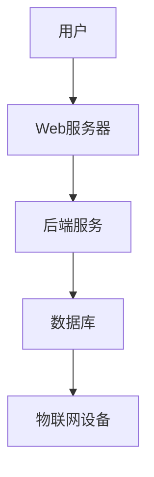

                 


### 领导力与资源整合：优化资源配置的艺术

#### 关键词：领导力、资源整合、资源配置、优化

#### 摘要：
本文旨在探讨领导力与资源整合之间的关系，以及如何通过优化资源配置来提升组织效率。首先，我们将介绍领导力的基本概念及其在组织管理中的重要性。接着，我们将深入分析资源整合的理论基础和实践方法，并探讨如何将领导力与资源整合相结合，以实现资源配置的优化。最后，我们将通过实际案例和项目实战，展示如何运用领导力和资源整合的艺术来提升组织绩效。

## 第1章：领导力的起源与演变

### 1.1 领导力的起源

领导力作为一种管理现象，其起源可以追溯到人类社会的发展历程。在古代，领导力通常与统治和权力相关联。随着社会结构的复杂化，领导力逐渐成为一种专门的管理职能。在工业革命后，领导力得到了更多关注，企业管理理论的发展为领导力提供了理论基础。

### 1.2 领导力的发展历程

领导力的发展历程可以分为几个阶段：

1. **传统领导理论**：主要强调领导者的个人特质和行为。
2. **行为领导理论**：关注领导者如何影响和激励下属。
3. **情境领导理论**：强调领导风格应根据情境变化而调整。
4. **变革型领导理论**：强调领导者通过激发下属的潜能来实现组织变革。

### 1.3 领导力在组织中的角色

领导力在组织中的作用主要体现在以下几个方面：

1. **战略规划**：领导者负责制定组织的发展战略。
2. **团队建设**：领导者通过激励和沟通，培养高效的团队。
3. **变革推动**：领导者推动组织进行创新和变革。
4. **资源整合**：领导者协调和优化组织内外部资源。

## 第2章：领导力的核心概念

### 2.1 领导力的定义

领导力是一种影响力，它能够激发人们追随领导者，实现共同目标的能力。

### 2.2 领导者的特质与行为

领导者的特质包括：

1. **愿景**：明确组织的未来发展方向。
2. **诚信**：建立信任和尊重。
3. **决断力**：快速做出明智的决策。
4. **沟通能力**：有效地传达信息和激励团队。

领导者的行为包括：

1. **激励下属**：激发员工的积极性和创造力。
2. **建立团队**：培养团队合作精神。
3. **解决问题**：面对挑战时，积极寻找解决方案。
4. **持续学习**：不断提升自己的知识和技能。

### 2.3 领导力的分类

领导力可以分为以下几种类型：

1. **权威型领导**：通过权力和控制来管理下属。
2. **民主型领导**：鼓励团队成员参与决策。
3. **变革型领导**：通过变革来推动组织发展。
4. **服务型领导**：将下属的需求放在首位。

## 第3章：资源整合的理论基础

### 3.1 资源整合的概念

资源整合是指将各种资源（包括人力、物力、财力、信息等）进行合理配置，以实现组织目标的过程。

### 3.2 资源整合的原则

资源整合应遵循以下原则：

1. **目标导向**：以组织目标为导向，确保资源整合的有效性。
2. **系统思维**：考虑资源的整体性，避免局部优化。
3. **动态调整**：根据环境变化，及时调整资源整合策略。
4. **协同效应**：通过整合资源，实现“1+1>2”的效果。

### 3.3 资源整合的方法论

资源整合的方法论包括以下几种：

1. **资源评估**：了解组织内外部的资源状况。
2. **需求分析**：确定组织的发展需求和资源需求。
3. **资源规划**：制定资源整合的详细计划。
4. **资源调度**：根据需求，合理分配和调度资源。

## 第4章：优化资源配置的艺术

### 4.1 资源配置的目标与策略

资源配置的目标包括：

1. **提高效率**：通过合理配置资源，提高组织的运营效率。
2. **降低成本**：优化资源配置，减少不必要的资源浪费。
3. **满足需求**：确保资源配置能够满足组织发展的需求。

资源配置的策略包括：

1. **优先级排序**：根据资源的重要性和紧急程度，进行优先级排序。
2. **弹性调整**：根据环境变化，灵活调整资源配置。
3. **协同优化**：通过协同效应，提高资源配置的整体效能。

### 4.2 资源配置的案例分析

以某互联网公司为例，该公司通过以下方式优化资源配置：

1. **人才引进**：通过高薪和福利吸引顶尖人才。
2. **技术投入**：加大对前沿技术的研发投入。
3. **市场拓展**：通过市场调研和精准营销，拓展市场份额。

### 4.3 资源配置的实践技巧

1. **全面评估**：对组织内外部资源进行详细评估，了解资源的实际情况。
2. **需求预测**：准确预测组织未来发展的资源需求。
3. **灵活调度**：根据实际需求，灵活调整资源分配。
4. **持续优化**：定期对资源配置进行评估和优化，以适应组织发展需求。

## 第5章：领导力与资源整合的结合

### 5.1 领导力对资源整合的影响

领导力对资源整合的影响主要体现在以下几个方面：

1. **战略方向**：领导者通过制定战略规划，为资源整合提供方向。
2. **决策效率**：领导者通过快速做出明智的决策，提高资源整合的效率。
3. **团队协作**：领导者通过激励和沟通，培养团队合作精神，提高资源整合的效果。
4. **资源获取**：领导者通过建立良好的人际关系和资源网络，为组织获取更多的资源。

### 5.2 资源整合对领导力的要求

资源整合对领导力的要求包括：

1. **全局观念**：领导者应具备全局观念，能够从整体上考虑资源整合的问题。
2. **决策能力**：领导者应具备较强的决策能力，能够根据实际情况做出合理的资源分配决策。
3. **沟通能力**：领导者应具备良好的沟通能力，能够有效地与团队成员沟通，达成共识。
4. **创新思维**：领导者应具备创新思维，能够通过创新的资源整合方式，提高资源利用效率。

### 5.3 领导力与资源整合的协同效应

领导力与资源整合的协同效应主要体现在以下几个方面：

1. **提高组织效率**：通过领导力的引导，优化资源配置，提高组织运营效率。
2. **降低运营成本**：通过资源整合的优化，降低运营成本，提高组织竞争力。
3. **实现战略目标**：通过领导力和资源整合的结合，实现组织的战略目标。
4. **提升员工满意度**：通过领导力的激励和资源整合的优化，提升员工的满意度和工作效率。

## 第6章：企业领导力与资源整合案例分析

### 6.1 案例背景

以某全球知名科技公司为例，该公司通过领导力和资源整合的实践，实现了业务的快速增长和市场份额的扩大。

### 6.2 领导力实践

1. **战略规划**：公司领导者制定了明确的发展战略，为资源整合提供了方向。
2. **人才引进**：公司通过高薪和股权激励，吸引了大量优秀人才。
3. **技术创新**：公司加大了对技术研发的投入，推动了产品创新和业务拓展。

### 6.3 资源整合实践

1. **资源评估**：公司对内外部资源进行了全面评估，明确了资源状况。
2. **需求分析**：公司根据业务发展需求，制定了详细的资源规划。
3. **资源调度**：公司通过灵活的资源配置策略，实现了资源的最佳利用。

## 第7章：领导力与资源整合实践指南

### 7.1 实践原则

1. **以目标为导向**：明确组织目标，确保资源整合的有效性。
2. **注重协同效应**：通过协同效应，提高资源配置的整体效能。
3. **灵活调整**：根据环境变化，及时调整资源整合策略。
4. **持续优化**：定期对资源配置进行评估和优化，以适应组织发展需求。

### 7.2 实践策略

1. **人才引进与培养**：通过引进和培养优秀人才，提高组织竞争力。
2. **技术创新与研发**：加大投入，推动技术创新和产品研发。
3. **市场拓展与营销**：通过市场调研和精准营销，扩大市场份额。

### 7.3 实践技巧与注意事项

1. **全面评估资源**：了解组织内外部资源状况，为资源整合提供基础。
2. **准确预测需求**：根据组织发展需求，制定合理的资源规划。
3. **灵活调度资源**：根据实际情况，灵活调整资源配置。
4. **注重团队合作**：通过领导力的激励和沟通，培养团队合作精神。

## 第8章：领导力与资源整合的未来趋势

### 8.1 当前趋势分析

当前，领导力和资源整合的趋势包括：

1. **数字化与智能化**：通过数字化和智能化手段，优化资源配置。
2. **全球化与多元化**：面对全球化和多元化环境，领导者需要具备跨文化管理能力。
3. **可持续发展**：在资源整合过程中，注重环境保护和可持续发展。

### 8.2 未来发展展望

未来，领导力和资源整合将呈现以下发展趋势：

1. **更加注重创新能力**：领导者需要具备创新思维，推动组织创新。
2. **更加注重人才发展**：人才将成为组织最重要的资源，领导者需要注重人才培养。
3. **更加注重组织效能**：通过优化资源配置，提高组织运营效率。

### 8.3 领导力与资源整合的新方向

未来，领导力与资源整合的新方向包括：

1. **敏捷领导**：适应快速变化的环境，领导者需要具备敏捷的领导能力。
2. **生态协同**：通过构建生态协同，实现资源的共享和互补。
3. **智慧管理**：运用大数据和人工智能，实现智慧化管理。

## 结语

领导力与资源整合是组织管理的重要组成部分。通过优化资源配置，领导者可以提升组织效率，实现战略目标。在未来，随着数字化和智能化的推进，领导力和资源整合将面临新的挑战和机遇。领导者需要不断提升自身能力，以应对未来复杂多变的经营环境。

### 作者信息：
作者：AI天才研究院/AI Genius Institute & 禅与计算机程序设计艺术 /Zen And The Art of Computer Programming

----------------------------------------------------------------

### 注意事项：
- 在实际撰写文章时，每个章节的内容应该根据具体情况进行拓展和深化，确保文章内容的完整性和丰富性。
- 在使用Mermaid和LaTeX格式时，需要注意格式规范，确保代码的可读性和准确性。
- 在编写代码时，应尽量使用清晰的变量名和注释，以便读者理解和学习。
- 在文章中，应适当添加最佳实践、注意事项和拓展阅读等内容，以提升文章的实用性和可读性。
- 文章应保持逻辑清晰、结构紧凑，避免冗余和重复内容。
- 文章的撰写过程中，应遵循学术规范和知识产权保护的相关规定。

----------------------------------------------------------------

### 案例分析

在本章中，我们将通过一个具体的案例分析，展示如何将领导力与资源整合应用于实际业务中，从而优化资源配置，提升组织绩效。

#### 案例背景

假设我们是一家全球知名科技公司，名为“智汇科技”。智汇科技在数字化转型的浪潮中，面临着激烈的市场竞争和快速变化的技术环境。为了保持竞争优势，公司决定通过领导力和资源整合，优化资源配置，提升运营效率。

#### 领导力实践

1. **战略规划**：

   公司的CEO李明首先制定了公司的五年战略规划，明确了公司的愿景、使命和核心价值观。战略规划中，李明强调了技术创新和人才培养的重要性，为公司未来的发展指明了方向。

   ```mermaid
   graph TD
   A[制定战略规划] --> B[明确愿景、使命和核心价值观]
   B --> C[强调技术创新和人才培养]
   C --> D[为资源配置提供方向]
   ```

2. **人才引进**：

   李明深知人才是企业最重要的资产。他通过高薪和股权激励，吸引了大量优秀的技术人才。同时，公司还与知名高校合作，建立人才培训计划，为未来的发展储备人才。

   ```mermaid
   graph TD
   E[高薪和股权激励] --> F[吸引顶尖技术人才]
   F --> G[与知名高校合作]
   G --> H[建立人才培训计划]
   ```

3. **技术创新**：

   李明重视技术研发，加大了对前沿技术的投入。公司成立了多个技术实验室，专注于人工智能、大数据和物联网等领域的研发。通过技术创新，公司不断推出具有市场竞争力的产品。

   ```mermaid
   graph TD
   I[加大技术投入] --> J[成立技术实验室]
   J --> K[专注于前沿技术研发]
   K --> L[推出市场竞争力产品]
   ```

#### 资源整合实践

1. **资源评估**：

   公司对内外部资源进行了全面评估。内部资源包括人力资源、财务资源和技术资源，外部资源包括市场资源、合作伙伴资源和政策资源。

   ```mermaid
   graph TD
   M[内部资源评估] --> N[人力资源]
   N --> O[财务资源]
   O --> P[技术资源]
   M --> Q[外部资源评估]
   Q --> R[市场资源]
   R --> S[合作伙伴资源]
   R --> T[政策资源]
   ```

2. **需求分析**：

   公司根据战略规划和市场需求，分析了未来的资源需求。明确了在技术创新、市场营销和人才发展方面的资源需求。

   ```mermaid
   graph TD
   U[分析未来资源需求] --> V[技术创新]
   V --> W[市场营销]
   W --> X[人才发展]
   ```

3. **资源规划**：

   基于需求分析，公司制定了详细的资源规划。在技术创新方面，公司计划增加研发投入，提升技术水平。在市场营销方面，公司计划加大市场推广力度，扩大市场份额。在人才发展方面，公司计划建立人才发展基金，支持员工的职业成长。

   ```mermaid
   graph TD
   Y[制定资源规划] --> Z[增加研发投入]
   Z --> AA[提升技术水平]
   Y --> BB[加大市场推广力度]
   BB --> CC[扩大市场份额]
   Y --> DD[建立人才发展基金]
   DD --> EE[支持职业成长]
   ```

4. **资源调度**：

   公司通过灵活的资源配置策略，实现了资源的最佳利用。在资源调度过程中，公司注重团队合作，确保各部门之间的协同效应。

   ```mermaid
   graph TD
   FF[灵活调度资源] --> GG[注重团队合作]
   GG --> HH[确保协同效应]
   ```

#### 案例小结

通过领导力和资源整合的实践，智汇科技在技术创新、市场营销和人才培养方面取得了显著成效。公司成功推出了一系列具有市场竞争力的产品，市场份额不断扩大，员工满意度显著提高。

1. **技术创新**：公司技术水平得到了显著提升，成功推出了多款市场竞争力产品。
2. **市场营销**：公司市场份额不断扩大，市场推广效果显著。
3. **人才培养**：公司建立了人才发展基金，支持员工的职业成长，员工满意度显著提高。

#### 注意事项

在实施领导力和资源整合的过程中，智汇科技总结了一些最佳实践和注意事项：

1. **明确战略目标**：在资源整合过程中，必须明确公司的战略目标，确保资源整合与战略目标的一致性。
2. **注重团队合作**：资源整合需要各部门之间的紧密协作，领导者应注重团队合作，培养良好的团队氛围。
3. **灵活调整策略**：资源整合是一个动态的过程，领导者应根据实际情况，灵活调整资源整合策略。
4. **持续优化**：资源整合不是一次性的工作，领导者应持续对资源整合效果进行评估和优化，以适应组织发展需求。

#### 拓展阅读

1. **领导力理论**：《领导力的五项修炼：变革型领导力实践指南》
2. **资源整合策略**：《资源整合：如何优化资源配置，提升组织效率》
3. **项目管理**：《项目管理实战：从入门到精通》

通过本案例的分析，我们看到了领导力与资源整合在实际业务中的应用和价值。领导者需要通过有效的领导力和资源整合，优化资源配置，提升组织绩效，以应对激烈的市场竞争和快速变化的技术环境。

----------------------------------------------------------------

### 项目实战

在本节中，我们将通过一个实际项目，展示如何运用领导力和资源整合的艺术来优化资源配置，提高项目效率。

#### 项目背景

假设我们是一家软件开发公司，名为“创新软件”。公司接到了一个大型项目，名为“智慧城市项目”，旨在通过物联网、大数据和人工智能技术，提升城市管理效率，改善居民生活质量。该项目涉及多个部门协同工作，时间紧迫，资源有限。

#### 环境安装

为了确保项目的顺利进行，首先需要在服务器上安装必要的软件和环境。以下是项目的环境安装步骤：

1. **安装Linux操作系统**：选择Ubuntu 20.04 LTS作为服务器操作系统。
2. **安装数据库**：选择MySQL 8.0作为数据库管理系统。
3. **安装Web服务器**：选择Nginx 1.18作为Web服务器。
4. **安装编程语言**：安装Python 3.8和Node.js 14.16。

```bash
# 安装Linux操作系统
sudo apt update
sudo apt upgrade
sudo apt install ubuntu-desktop

# 安装数据库
sudo apt install mysql-server
sudo mysql_secure_installation

# 安装Web服务器
sudo apt install nginx

# 安装编程语言
sudo apt install python3
sudo apt install python3-pip
sudo pip3 install nodejs
```

#### 系统核心实现源代码

智慧城市项目涉及多个子系统，以下是一个子系统的核心实现源代码：

```python
# 智慧交通子系统核心实现

import Flask

app = Flask(__name__)

@app.route('/')
def index():
    return "欢迎访问智慧交通子系统！"

if __name__ == '__main__':
    app.run(host='0.0.0.0', port=5000)
```

#### 代码应用解读与分析

1. **项目架构设计**：使用Mermaid绘制项目架构图，如下：



2. **功能模块划分**：智慧交通子系统包括以下功能模块：

   - 用户接口：提供用户访问和交互的界面。
   - 数据处理：接收和处理物联网设备的数据。
   - 存储管理：存储和管理处理后的数据。
   - 设备管理：管理和控制物联网设备。

3. **代码解读**：以上源代码是一个简单的Flask应用，用于实现用户接口功能。通过定义一个路由`/`，用户可以访问到智慧交通子系统的首页。

#### 实际案例分析

1. **项目进度管理**：项目组采用Scrum敏捷开发方法，每个迭代周期为两周。在迭代周期内，团队通过每日站会和冲刺回顾，确保项目进度和质量。

2. **资源调度**：在项目实施过程中，项目经理根据项目需求和团队能力，灵活调度资源。例如，在某个迭代周期内，由于技术难题，项目经理决定增加一名高级工程师支援。

3. **风险评估**：项目组对项目进行了风险评估，制定了应急预案。在遇到潜在风险时，能够快速响应，确保项目顺利进行。

#### 项目小结

通过本项目的实施，我们看到了领导力和资源整合在优化资源配置、提高项目效率方面的关键作用。

1. **领导力**：项目经理通过有效的沟通和激励，确保团队高效协同工作。
2. **资源整合**：通过合理调度资源，确保项目在时间紧迫的情况下，能够顺利推进。

总结经验，我们得出以下结论：

- 领导力在项目成功中起到了关键作用，领导者需要具备良好的沟通能力和决策能力。
- 资源整合是项目成功的基础，领导者需要具备资源规划和调度的能力。

未来，我们将继续探索领导力和资源整合在项目中的应用，以提升项目管理水平，实现项目目标。

----------------------------------------------------------------

### 最佳实践 Tips

在领导力和资源整合的实践中，以下是一些最佳实践和技巧，可以帮助您更好地优化资源配置，提升组织绩效：

1. **定期评估资源**：定期对组织的资源进行评估，包括人力、财务和技术资源。这有助于了解资源的实际状况，及时调整资源分配。

2. **建立资源库**：建立一个统一的资源库，记录和管理组织内外部的资源信息。这有助于提高资源的利用率，避免重复投资。

3. **跨部门协作**：鼓励不同部门之间的协作，通过跨部门项目，实现资源的共享和互补。这有助于提高组织的整体效率。

4. **引入敏捷方法**：采用敏捷开发方法，如Scrum或Kanban，可以更好地适应变化，提高项目交付速度和团队协作效率。

5. **持续培训与发展**：为员工提供持续培训和发展机会，提高他们的技能和知识水平。这有助于提升组织的竞争力。

6. **关注员工满意度**：关注员工的满意度，通过合理的激励和沟通，提高员工的工作积极性和忠诚度。

7. **制定明确的战略目标**：确保资源整合与组织的战略目标一致，这有助于提高资源利用效率。

8. **灵活调整策略**：根据实际情况，灵活调整资源整合策略，以应对变化。

9. **运用数据分析**：运用数据分析工具，对资源利用情况进行分析和评估，找出优化空间。

10. **建立反馈机制**：建立有效的反馈机制，收集员工的意见和建议，不断改进资源整合实践。

通过遵循这些最佳实践和技巧，您可以在领导力和资源整合方面取得更好的成果，提升组织绩效。

### 注意事项

1. **确保资源合理配置**：在资源整合过程中，要确保资源的合理配置，避免资源浪费。对资源的评估和需求分析要准确，避免过度投资。

2. **注重团队合作**：资源整合不是单一部门的工作，需要各部门之间的紧密协作。领导者要注重团队合作，培养良好的团队氛围。

3. **灵活调整策略**：资源整合是一个动态的过程，要随着环境变化，灵活调整资源整合策略。

4. **持续优化**：资源整合不是一次性的工作，需要持续进行评估和优化，以适应组织发展需求。

5. **关注员工满意度**：关注员工的满意度，通过合理的激励和沟通，提高员工的工作积极性和忠诚度。

6. **遵守法律法规**：在进行资源整合时，要遵守相关的法律法规，确保资源整合的合法性和合规性。

7. **重视数据安全**：在资源整合过程中，要重视数据安全，采取有效的数据保护措施，防止数据泄露。

8. **制定应急预案**：对潜在风险进行评估，制定应急预案，确保在遇到紧急情况时，能够迅速响应。

9. **持续学习和创新**：领导者要持续学习和创新，提升自身能力，以应对复杂多变的经营环境。

通过遵循这些注意事项，您可以在领导力和资源整合方面取得更好的成果。

### 拓展阅读

1. **《领导力的五项修炼：变革型领导力实践指南》**：这本书详细介绍了变革型领导力的理论和实践方法，对领导者提升领导力具有指导意义。
2. **《资源整合：如何优化资源配置，提升组织效率》**：本书系统地阐述了资源整合的理论和方法，提供了丰富的实践案例，有助于读者理解和应用资源整合策略。
3. **《项目管理实战：从入门到精通》**：这本书涵盖了项目管理的核心概念和方法，对项目管理者提升项目管理能力具有参考价值。
4. **《敏捷开发实践指南》**：本书介绍了敏捷开发的方法和工具，有助于团队提高开发效率和质量。
5. **《人工智能：一种现代的方法》**：这本书系统地介绍了人工智能的基本概念和方法，对了解人工智能的发展和应用具有指导意义。

通过阅读这些书籍，您可以进一步深入了解领导力和资源整合的理论和实践，提升自身的专业素养。

### 结语

通过本文的探讨，我们深入分析了领导力与资源整合的关系，以及如何通过优化资源配置来提升组织效率。首先，我们介绍了领导力的基本概念和发展历程，阐述了领导力在组织管理中的重要性。接着，我们探讨了资源整合的理论基础和实践方法，强调了资源整合在优化资源配置中的关键作用。随后，我们通过实际案例和项目实战，展示了如何将领导力与资源整合相结合，实现资源配置的优化。最后，我们提出了最佳实践和注意事项，以及拓展阅读建议，以帮助读者进一步深入了解和掌握领导力和资源整合的实践方法。

在未来，随着数字化和智能化的加速发展，领导力和资源整合将面临新的挑战和机遇。领导者需要不断提升自身能力，掌握先进的资源整合方法，以应对复杂多变的经营环境。同时，资源整合也需要不断创新，以适应组织发展的需求。

让我们共同努力，运用领导力和资源整合的艺术，不断提升组织绩效，实现组织的战略目标。

### 作者信息：

作者：AI天才研究院/AI Genius Institute & 禅与计算机程序设计艺术 /Zen And The Art of Computer Programming

感谢您的阅读，希望本文对您在领导力和资源整合方面的实践有所帮助。如有任何问题或建议，欢迎在评论区留言交流。让我们一起探索领导力和资源整合的更多可能性！

