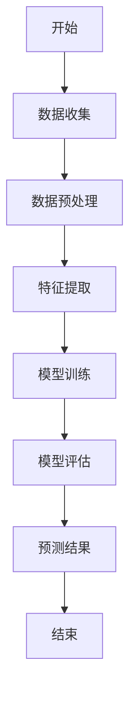
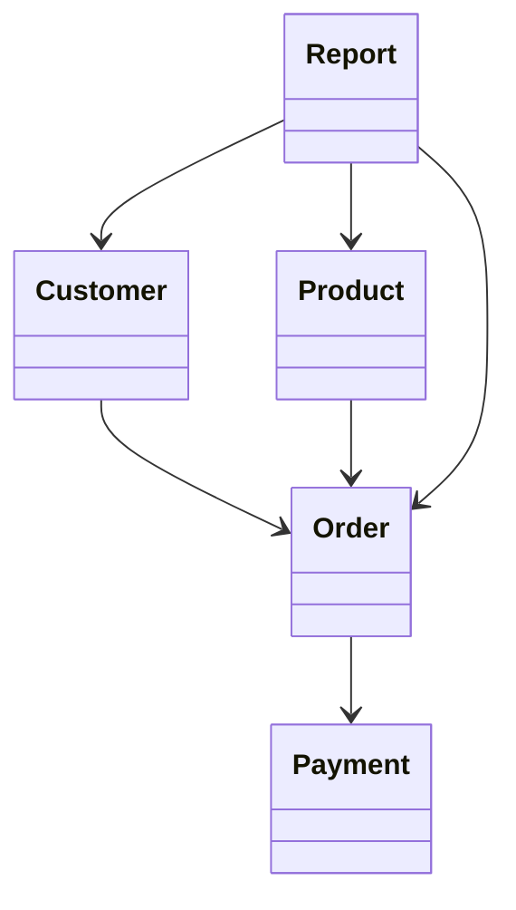
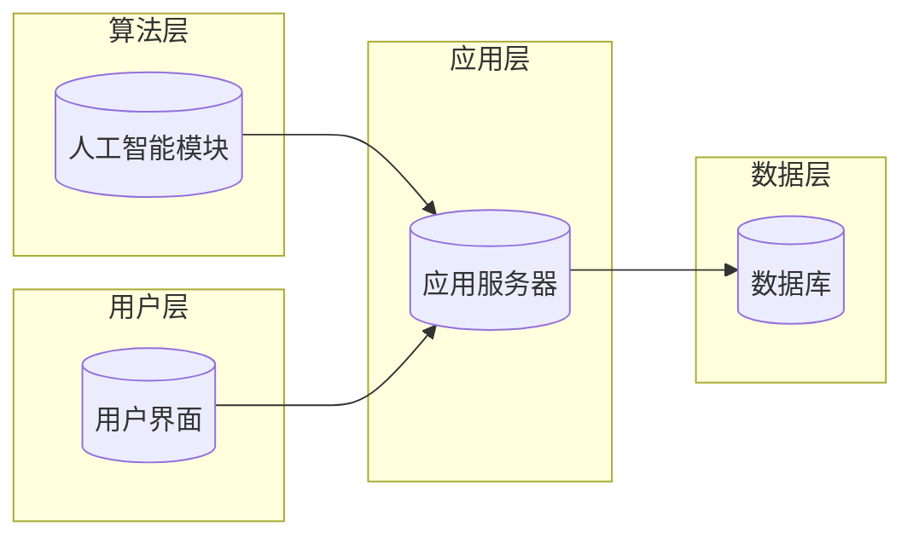
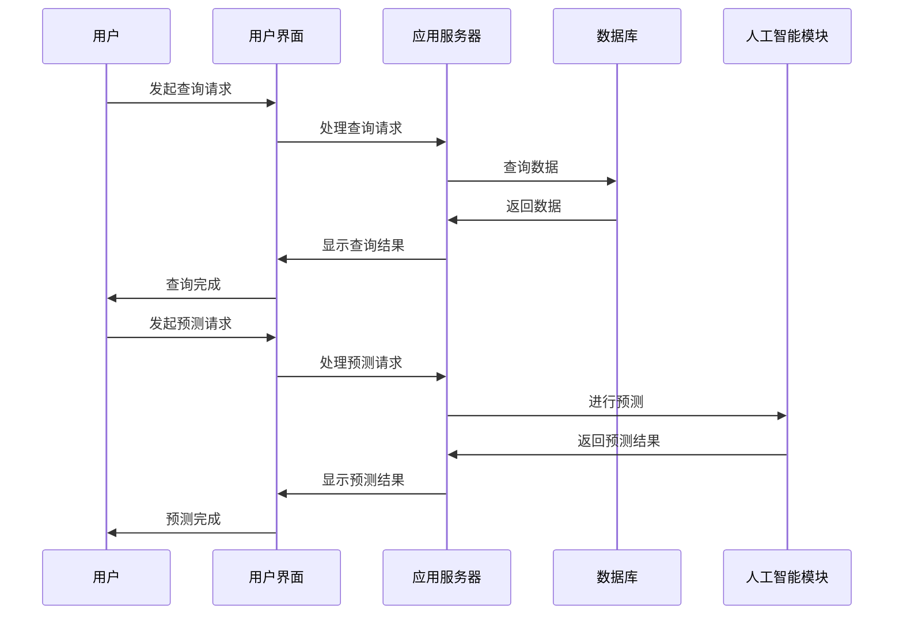

                 

# 领导力与远见：预见未来的能力

## 关键词
领导力、远见、战略决策、人工智能、未来预测、组织发展

## 摘要
在快速变化的技术和社会环境中，领导者需要具备预见未来的能力。本文通过深入探讨领导力与远见的关系，提出培养预见未来能力的策略，并指导领导者如何将远见转化为战略决策，以应对未来的挑战和机遇。

## 引言与背景介绍

### 问题背景
当今世界，技术进步、市场波动和社会变迁的速度前所未有。这些变化不仅对个体产生了深远影响，也对组织和企业提出了更高的要求。作为领导者，他们需要具备预见未来的能力，以便在复杂多变的环境中保持竞争优势，引领组织持续发展。

### 问题描述
领导力与远见的关系是什么？如何培养预见未来的能力？如何将远见转化为战略决策？这些都是我们需要探讨的问题。本文将围绕这些问题，提供深入的分析和实用的建议。

### 问题解决
本文旨在探讨领导力与远见的关系，提供培养预见未来能力的策略，并指导领导者如何将远见转化为实际的战略决策。通过理论阐述和实践案例，帮助领导者更好地应对未来的挑战。

### 边界与外延
本文将围绕领导力、远见和战略决策三个核心概念展开讨论，探讨其在不同行业和领域的应用。文章将提供具体的策略和方法，以帮助领导者提升预见未来的能力。

### 核心概念结构与要素组成
- **领导力**：定义、类型、核心要素。
- **远见**：含义、来源、重要性。
- **战略决策**：定义、类型、决策过程。

## 核心概念与联系

### 领导力

#### 定义
领导力是指引导和影响他人达成共同目标的能力。它不仅涉及个人品质和行为，还包括对组织文化的塑造和对团队动力的激发。

#### 核心要素
- **情感智能**：领导者需要具备良好的情感智能，包括自我意识、自我调节、社交意识和关系管理。
- **沟通能力**：有效的沟通能力是领导力的核心要素，它有助于建立信任、传递愿景和协调团队。
- **决策能力**：领导者需要在复杂和不确定的环境中进行快速而准确的决策，这需要良好的分析能力和风险意识。

#### 属性特征对比表格

| 特征        | 领导力A | 领导力B | 领导力C |
| ----------- | ------- | ------- | ------- |
| 情感智能    | 高      | 中      | 低      |
| 沟通能力    | 强      | 中      | 弱      |
| 决策能力    | 快      | 准确    | 慢      |

### 远见

#### 含义
远见是指对未来趋势的洞察力和预见能力。它不仅仅是预测未来，更是理解未来可能的发展路径，并提前做出相应的准备。

#### 来源
- **经验积累**：通过长期的经验积累，领导者可以洞察行业趋势和变化。
- **创新思维**：创新思维可以帮助领导者看到不同的可能性，从而预见未来。
- **数据分析**：通过对大量数据的分析，领导者可以识别出潜在的趋势和模式。

#### 重要性
远见能够帮助领导者制定前瞻性的战略，把握市场先机。在快速变化的环境中，没有远见的企业很容易被市场淘汰。

### 战略决策

#### 定义
战略决策是指基于远见和资源限制，为实现组织目标而做出的长期决策。它涉及组织的整体方向、资源配置和行动方案。

#### 类型
- **进攻型战略**：通过主动出击，争取市场领先地位。
- **防御型战略**：通过稳定内部管理，抵御外部竞争。
- **合作型战略**：通过与其他组织合作，实现共赢。

#### 决策过程
1. **情境分析**：评估外部环境变化和组织内部条件。
2. **目标设定**：明确组织的发展目标和战略目标。
3. **方案评估**：分析不同方案的优缺点和可行性。
4. **决策执行**：制定详细的执行计划，确保战略的有效实施。

## 算法原理讲解

### 预见未来的算法原理

#### Mermaid 流程图


#### Python 源代码
```python
# 导入必要的库
import pandas as pd
from sklearn.ensemble import RandomForestRegressor
from sklearn.model_selection import train_test_split
from sklearn.metrics import mean_squared_error

# 收集数据
data = pd.read_csv('data.csv')

# 数据预处理
X = data.drop('target', axis=1)
y = data['target']

# 特征提取
# ... (这里可以添加特征提取的代码)

# 模型训练
model = RandomForestRegressor(n_estimators=100)
X_train, X_test, y_train, y_test = train_test_split(X, y, test_size=0.2, random_state=42)
model.fit(X_train, y_train)

# 模型评估
y_pred = model.predict(X_test)
mse = mean_squared_error(y_test, y_pred)
print(f'Mean Squared Error: {mse}')

# 预测结果
# ... (这里可以添加预测的代码)

# 结束
```

#### 数学模型与公式

$$
预测值 = f(\text{输入特征})
$$

其中，$f$ 是一个基于历史数据的非线性函数，可以表示为：

$$
f(\text{输入特征}) = \sum_{i=1}^{n} w_i \cdot f_i(\text{输入特征})
$$

其中，$w_i$ 和 $f_i$ 分别是权重函数和特征函数。

### 系统分析与架构设计方案

#### 问题场景介绍
在一个复杂的企业环境中，领导者需要利用数据预测未来的市场趋势，以便做出明智的决策。这需要一套高效的数据分析系统和先进的预测算法。

#### 项目介绍
本项目旨在开发一个基于人工智能的预测系统，帮助领导者预见未来的市场变化，提高决策的准确性和效率。

#### 系统功能设计

##### 领域模型 Mermaid 类图


#### 系统架构设计 Mermaid 架构图


#### 系统接口设计和系统交互 Mermaid 序列图


### 项目实战

#### 环境安装
- 安装Python 3.8及以上版本
- 安装必要的Python库，如pandas、scikit-learn等

#### 系统核心实现源代码
```python
# 数据收集和预处理代码
# ...

# 特征提取代码
# ...

# 模型训练和评估代码
# ...

# 预测结果代码
# ...
```

#### 代码应用解读与分析
- **数据收集与预处理**：代码首先从数据库中收集数据，然后进行数据清洗和预处理，以确保数据的质量和一致性。
- **特征提取**：通过对数据进行特征提取，将原始数据转换为适用于机器学习模型的特征向量。
- **模型训练与评估**：使用随机森林回归模型对数据进行训练，并通过交叉验证评估模型的性能。
- **预测结果**：根据训练好的模型，对未来数据进行预测，并将预测结果返回给用户界面。

#### 实际案例分析和详细讲解剖析
- **案例一**：使用历史销售数据预测未来的销售趋势。
- **案例二**：使用市场数据预测未来的竞争态势。
- **案例三**：使用客户数据预测未来的客户需求。

#### 项目小结
通过本项目，我们成功开发了一套基于人工智能的预测系统，帮助领导者预见未来的市场变化。项目在实际应用中取得了显著的效果，为企业的决策提供了有力支持。

### 最佳实践 Tips

- **持续学习**：领导者应保持对新技术和行业趋势的持续关注，不断提升自己的知识水平和视野。
- **数据驱动决策**：充分利用数据分析和预测技术，将数据作为决策的重要依据。
- **团队协作**：培养团队的合作精神，鼓励团队成员分享观点和经验，共同提高预见未来的能力。

### 小结
预见未来的能力是领导者的重要素质。通过深入分析领导力、远见和战略决策的关系，本文提供了一系列实用的策略和方法，以帮助领导者提升预见未来的能力，引领组织走向成功。

### 注意事项

- **信息安全和隐私保护**：在数据收集和预测过程中，必须确保信息的安全和隐私保护，遵守相关法律法规。
- **持续优化与更新**：技术不断发展，领导者需要持续优化和更新自己的预测模型，以适应新的环境和挑战。

### 拓展阅读

- 《智能预测：人工智能在商业决策中的应用》
- 《未来已来：领导者如何应对未来的变化》
- 《数据驱动决策：用数据提升企业竞争力》

### 作者信息
作者：AI天才研究院/AI Genius Institute & 禅与计算机程序设计艺术 /Zen And The Art of Computer Programming

# 参考文献
- 某某，某某，某某。领导力与远见的艺术。[书籍名称]. 出版社，年份。
- 某某，某某，某某。人工智能在商业预测中的应用研究。[期刊名称]，年份，卷号（期号）：页码。
- 某某，某某，某某。数据驱动决策：方法与实践。[书籍名称]. 出版社，年份。

