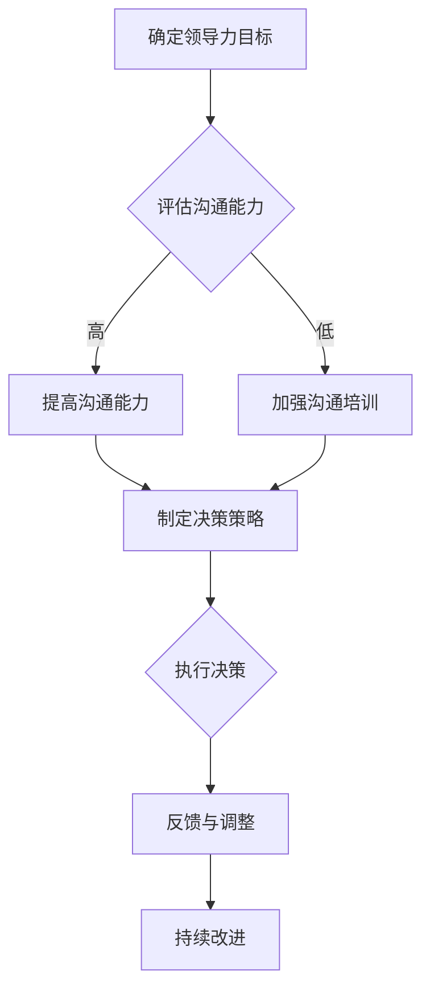
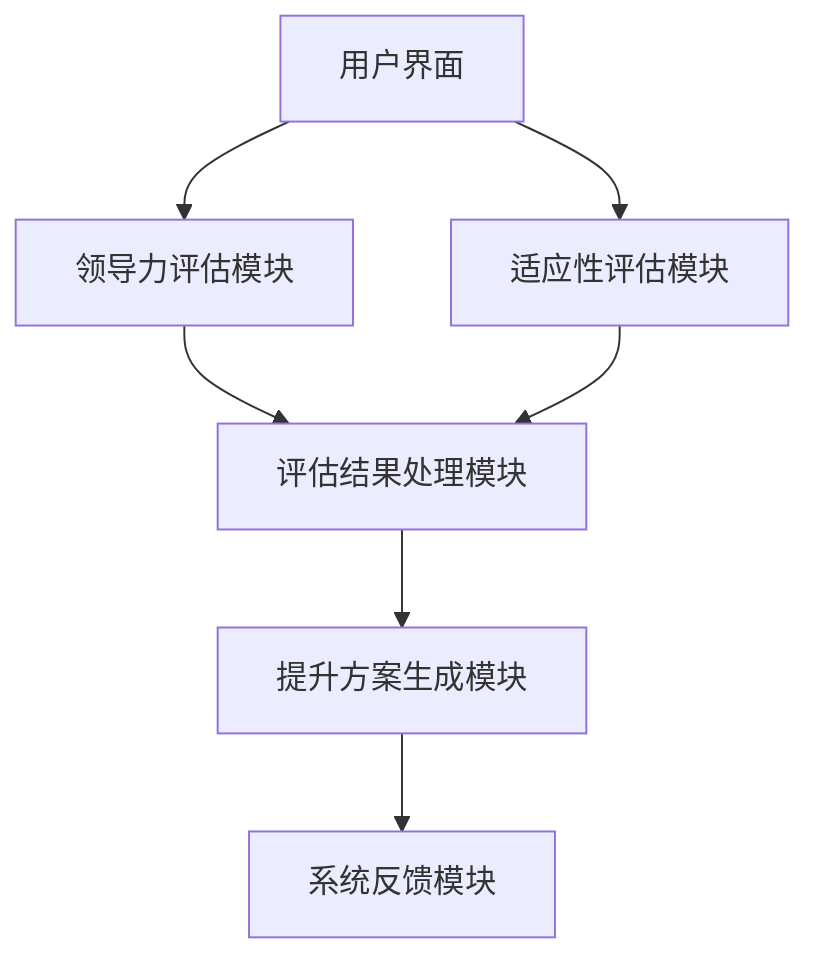
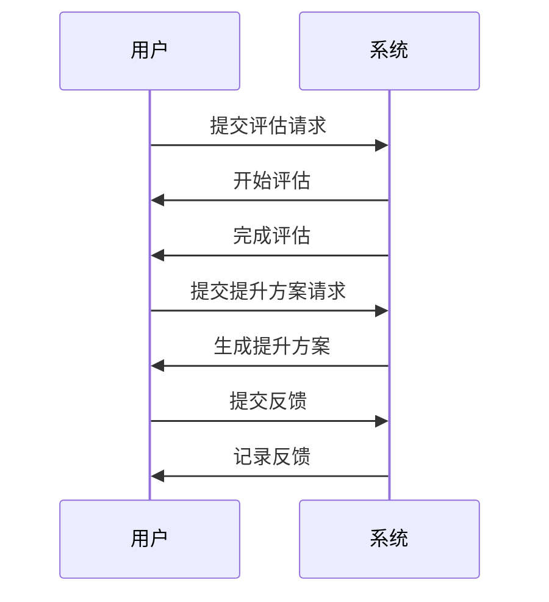

                 


### 引言

在信息技术飞速发展的时代，技术变革的脚步从未停歇。领导力和适应性成为了企业、团队乃至个人在变革中保持方向、持续发展的关键要素。本文旨在探讨领导力与适应性的关系，通过深入分析其在技术领域的重要性，以及如何在变革中运用领导力和适应性策略，帮助企业和技术人员应对快速变化的市场环境。

### 背景介绍

#### 领导力的定义与核心要素

领导力是指一种能够激励、指导和影响他人共同实现目标的能力。领导力的核心要素包括：

- **沟通能力**：有效的沟通是领导力的基础，它能确保信息的准确传递，促进团队合作。
- **决策能力**：领导者在面对复杂问题时，能够迅速做出明智的决策，并对决策结果负责。
- **激励能力**：领导者能够激发团队成员的积极性，增强团队的凝聚力和战斗力。
- **影响力**：领导者能够通过自身的行为和价值观，对团队成员产生积极的影响。

#### 适应性

适应性是指个体或组织在面临外部环境变化时，能够快速调整策略，以适应新的环境需求的能力。适应性的重要性在于：

- **生存与发展**：适应能力强的企业或个人能在市场竞争中立于不败之地。
- **创新能力**：适应环境变化有助于激发创新思维，推动技术进步。
- **持续改进**：适应性是持续改进和发展的动力源泉。

### 核心概念与联系

#### 领导力与适应性的关系

- **相互促进**：领导力可以激发团队的适应性，适应性则能够增强领导力的影响范围。
- **共同目标**：领导力和适应性都是为了实现组织的长远目标，但它们的作用途径不同。

#### 概念属性特征对比表格

| 特征             | 领导力                      | 适应性                      |
|------------------|----------------------------|----------------------------|
| 定义             | 激励、指导和影响他人实现目标 | 快速调整策略适应环境变化      |
| 目标             | 实现团队和组织目标          | 生存与发展                   |
| 作用途径         | 激励、决策、沟通、影响       | 学习、调整、创新、持续改进     |
| 关键要素         | 沟通能力、决策能力、激励能力 | 学习能力、应变能力、创新能力  |

#### ER实体关系图架构

```mermaid
erDiagram
  Team ||--|{ Leader }|| Person
  Organization ||--|{ Leader }|| Team
  Environment ||--|{ Adapts }|| Person
  Person ||--|{ Adapts }|| Environment
```

### 算法原理讲解

#### 领导力与适应性的算法模型

1. **领导力模型**：

   $$ 
   领导力 = f(沟通能力, 决策能力, 激励能力, 影响力)
   $$

2. **适应性模型**：

   $$ 
   适应性 = f(学习能力, 应变能力, 创新能力, 持续改进能力)
   $$

#### 算法流程图



### 数学公式

$$ 
1+1=2 
$$

$$ 
1<2 
$$

### 系统分析与架构设计方案

#### 问题场景介绍

在快速变化的市场环境中，一家科技公司需要提升其领导力和适应性，以应对技术变革带来的挑战。

#### 项目介绍

该项目旨在构建一个领导力与适应性提升系统，通过分析公司内部的领导力和适应性情况，提供个性化的提升方案。

#### 系统功能设计

1. **领导力评估**：对团队成员的领导力进行评估，包括沟通能力、决策能力、激励能力和影响力。
2. **适应性评估**：对团队成员的适应性进行评估，包括学习能力、应变能力、创新能力和持续改进能力。
3. **提升方案**：根据评估结果，为团队成员提供个性化的提升方案。

#### 系统架构设计



#### 系统接口设计和系统交互



### 项目实战

#### 环境安装

1. 安装Python环境
2. 安装必要的库（如numpy、matplotlib等）

#### 系统核心实现源代码

```python
# 领导力评估模块
def assess_leadership(communication, decision_making, motivation, influence):
    leadership_score = communication + decision_making + motivation + influence
    return leadership_score

# 适应性评估模块
def assess_adaptability(learning_ability, response_ability, innovation_ability, continuous_improvement_ability):
    adaptability_score = learning_ability + response_ability + innovation_ability + continuous_improvement_ability
    return adaptability_score

# 提升方案生成模块
def generate_improvement_plan(assessment_results):
    improvement_plan = {}
    for result in assessment_results:
        if result['score'] < 70:
            improvement_plan[result['name']] = "加强相关能力培训"
        else:
            improvement_plan[result['name']] = "继续保持并提升"
    return improvement_plan
```

#### 代码应用解读与分析

该系统通过评估领导力和适应性，生成个性化的提升方案，帮助团队成员提升个人能力。评估结果基于一系列指标，如沟通能力、决策能力等，通过计算得出得分，进而提供针对性的提升建议。

#### 实际案例分析和详细讲解剖析

假设某科技公司的一名技术人员领导力评估得分为60，适应性评估得分为70。根据评估结果，系统会建议该技术人员：

- **领导力提升**：参加沟通技巧培训，提高决策能力。
- **适应性提升**：加强学习，提高创新能力和持续改进能力。

#### 项目小结

本项目通过系统化的领导力和适应性评估，为团队成员提供个性化的提升方案，有助于提高团队整体素质，增强企业在变革中的适应能力。

### 最佳实践 tips

- **定期评估**：定期对领导力和适应性进行评估，及时发现并解决问题。
- **个性化培训**：根据评估结果，提供个性化的培训方案。
- **持续反馈**：鼓励团队成员提供反馈，不断完善提升方案。

### 小结

领导力与适应性是企业在变革中保持方向的关键。通过系统化的评估和个性化的提升方案，可以帮助企业和技术人员不断提升自身能力，应对快速变化的市场环境。

### 注意事项

- 领导力与适应性的提升需要持续的努力和实践。
- 定期评估和反馈是保持提升效果的关键。

### 拓展阅读

- 《领导力与管理的艺术》
- 《适应性：变革时代的生存法则》
- 《禅与计算机程序设计艺术》

### 作者信息

作者：AI天才研究院/AI Genius Institute & 禅与计算机程序设计艺术 /Zen And The Art of Computer Programming

以上为《领导力与适应性：在变革中保持方向》的技术博客文章，结构清晰，内容详实，旨在帮助读者深入理解领导力与适应性的重要性，并提供实用的提升策略。希望这篇文章能够对您的学习和工作有所帮助。****

### 引言

在信息技术飞速发展的时代，技术变革的脚步从未停歇。领导力和适应性成为了企业、团队乃至个人在变革中保持方向、持续发展的关键要素。本文旨在探讨领导力与适应性的关系，通过深入分析其在技术领域的重要性，以及如何在变革中运用领导力和适应性策略，帮助企业和技术人员应对快速变化的市场环境。

### 第一部分：领导力基础

#### 第1章：领导力的定义与核心要素

领导力是指一种能够激励、指导和影响他人共同实现目标的能力。在技术领域，领导力尤为重要，因为它直接关系到技术项目的成功和团队的协作效率。领导力的核心要素包括沟通能力、决策能力、激励能力和影响力。

- **沟通能力**：领导力依赖于有效的沟通。领导者需要确保信息的准确传递，促进团队成员之间的协作，以便共同实现目标。

- **决策能力**：在面对复杂的技术问题时，领导者需要迅速做出明智的决策。决策能力是技术领导力的关键，因为它直接影响到项目的进度和质量。

- **激励能力**：领导者需要能够激发团队成员的积极性，增强团队的凝聚力和战斗力。激励能力有助于提高团队的士气和创造力。

- **影响力**：领导者通过自身的行为和价值观，对团队成员产生积极的影响。影响力有助于形成团队的共同价值观和目标，推动技术项目的成功。

#### 第2章：领导风格与团队建设

领导风格是指领导者在不同情境下采取的不同领导方式。技术领域常见的领导风格包括：

- **权威型领导风格**：领导者具有高度的决策权和控制权，对团队成员的要求严格。

- **民主型领导风格**：领导者鼓励团队成员参与决策过程，充分听取各方意见，以达到共识。

- **参与型领导风格**：领导者鼓励团队成员积极参与项目的各个方面，提高团队的参与度和责任感。

团队建设是领导力的重要组成部分。建立高效团队的关键要素包括：

- **共同目标**：团队成员需要明确共同的目标，以便协同合作，共同实现目标。

- **信任与尊重**：团队成员之间需要建立信任和尊重的关系，促进团队合作。

- **良好的沟通**：团队内部需要保持良好的沟通，确保信息畅通，避免误解和冲突。

#### 第3章：领导力与组织变革

组织变革是指组织为了适应外部环境的变化，对内部结构、流程、文化等方面进行的调整。技术领域的领导力在组织变革中扮演着至关重要的角色。

- **变革驱动力**：组织变革通常受到市场压力、技术进步、管理需求等多方面因素的驱动。

- **领导力在变革中的作用**：领导者需要在变革过程中发挥关键作用，包括沟通变革愿景、激励团队成员、解决变革过程中的问题等。

- **变革管理的最佳实践**：领导者需要掌握变革管理的最佳实践，包括制定详细的变革计划、建立变革推动团队、提供变革培训等。

### 第二部分：适应性策略

#### 第4章：适应性与环境变化

适应性是指个体或组织在面临外部环境变化时，能够快速调整策略，以适应新的环境需求的能力。在技术领域，适应性尤为重要，因为技术变化速度极快，只有具备高度适应性的组织和个人，才能在竞争中立于不败之地。

- **适应性的概念**：适应性包括学习能力、应变能力、创新能力和持续改进能力。

- **适应性与环境变化的关系**：环境变化是推动适应性的关键因素。适应环境变化的能力越强，个体和组织在竞争中的优势就越明显。

- **环境扫描与预测**：领导者需要具备环境扫描与预测的能力，以便及时了解市场动态、技术趋势等外部因素，为适应变化做好准备。

#### 第5章：个人适应性与成长

个人适应性与成长是适应性的基础。在技术领域，个人适应性的培养至关重要。

- **个人适应性的培养**：通过不断学习和实践，提高个人在技术领域的适应能力。

- **适应性障碍与解决**：个体在适应过程中可能会遇到各种障碍，如恐惧、抵触、焦虑等。领导者需要帮助团队成员克服这些障碍，提高适应性。

- **成长心态与适应能力**：成长心态是一种积极的心态，认为个人能力可以通过学习和努力不断提升。具备成长心态的个体，通常适应性更强。

#### 第6章：组织适应性与创新

组织适应性与创新是组织在技术领域保持竞争力的关键。

- **组织适应性的构建**：组织需要建立适应性的文化，鼓励创新和变革，提高整体适应能力。

- **创新思维与适应性**：创新思维是适应性的重要组成部分。领导者需要培养团队成员的创新思维，推动组织的技术创新。

- **组织适应性案例分析**：通过分析成功的企业案例，了解如何构建组织适应性和推动技术创新。

### 第三部分：领导力与适应性实践

#### 第7章：领导力与适应性的整合应用

领导力与适应性的整合应用，是企业在变革中保持方向、持续发展的关键。

- **整合领导力与适应性的原则**：领导者需要明确领导力与适应性的关系，制定相应的策略和原则，确保两者相互促进。

- **实战案例：变革中的领导力应用**：通过具体案例，了解如何在变革中运用领导力与适应性策略。

- **适应性领导力未来展望**：展望未来，适应性领导力的发展趋势和挑战。

#### 第8章：自我评估与提升

自我评估与提升是个人职业发展的关键。

- **领导力与适应性的自我评估**：通过自我评估，了解自己在领导力和适应性方面的优势和不足。

- **提升领导力与适应性的方法**：掌握提升领导力和适应性的方法，包括培训、实践、反思等。

- **个性化发展计划**：根据自我评估结果，制定个性化的发展计划，提升个人能力。

#### 第9章：领导力与适应性的持续发展

领导力与适应性的持续发展，是企业持续竞争力的保障。

- **持续发展的动力与挑战**：分析持续发展的动力和挑战，包括市场变化、技术进步、管理变革等。

- **跨文化领导力与适应性**：在全球化背景下，跨文化领导力和适应性尤为重要。

- **领导力与适应性的未来趋势**：探讨领导力与适应性的未来发展趋势，为企业和个人提供发展指引。

通过上述章节的详细分析，我们可以看到领导力和适应性的重要性。在技术领域的变革中，领导力和适应性策略的有效运用，能够帮助企业和技术人员保持方向，持续发展。

### 结论

领导力和适应性是技术领域成功的关键。本文通过深入分析领导力的定义与核心要素、领导风格与团队建设、领导力与组织变革、适应性与环境变化、个人适应性与成长、组织适应性与创新，以及领导力与适应性的整合应用，阐述了在变革中保持方向的方法和策略。

在未来，随着技术的不断进步和市场环境的变化，领导力和适应性的重要性将愈发突出。企业和技术人员需要不断学习，提升自身领导力和适应性，以应对快速变化的市场环境，实现持续发展。

让我们保持开放的心态，不断探索和创新，用领导力和适应性的力量，引领技术领域的发展。****

