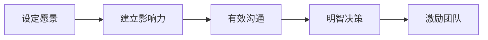
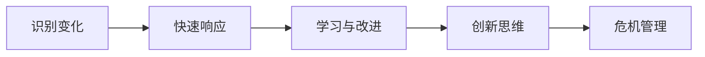

                 

# 领导力与适应性：在变革中保持灵活

关键词：领导力、适应性、变革、灵活、挑战、创新

摘要：在快速变化的时代，领导力和适应性成为了组织和个人成功的关键。本文通过深入探讨领导力的原理和适应性的特征，结合理论和实际案例，阐述如何在变革中保持灵活，提供实用的指导策略和最佳实践。

## 引言：领导力与适应性的重要性

### 1.1 问题背景

在当今全球化、信息化的时代，市场环境和技术发展瞬息万变。企业、团队和个人都在不断面临新的挑战和机遇。为了在这种动态环境中保持竞争力，领导力和适应性变得尤为重要。

领导力是一种通过影响和激励他人来实现共同目标的能力。它不仅关乎个人魅力的展示，更涉及到战略决策、团队协作和变革管理。而适应性则是指在面对不确定性时，能够迅速调整自身行为和策略的能力。它关乎组织的生存和发展，是应对变化的关键。

### 1.2 问题描述

在变革过程中，领导者面临着如何保持团队稳定、激发创新思维、应对内外部挑战等多重问题。同时，组织也需要在技术革新、市场需求变化等方面保持灵活性。因此，领导力和适应性的问题不仅关乎个人能力，更关乎组织整体的生存和发展。

### 1.3 问题解决

解决这一问题的关键在于：

1. 深入理解领导力的不同方面，包括愿景、影响力、沟通、决策和激励等。
2. 了解适应性的特征，如学习能力、灵活性、创新性、危机管理和敏捷性等。
3. 通过理论与实践相结合，提高领导者的技能和团队的整体适应性。
4. 探索领导力和适应性的边界与外延，将其应用到各种组织和情境中。

### 1.4 边界与外延

领导力与适应性不仅适用于企业，还适用于政府、教育、医疗等各种组织。它们不仅影响个体的职业发展，还影响整个社会的进步。在全球化背景下，领导力和适应性成为了国际竞争中的重要因素。

### 1.5 概念结构与核心要素组成

- **领导力**：包括愿景、影响力、沟通、决策和激励等核心要素。
- **适应性**：包括学习能力、灵活性、创新性、危机管理和敏捷性等核心特征。

## 第1章 核心概念与联系

### 2.1 领导力原理

领导力是一种能够激发和引导团队成员实现共同目标的能力。有效的领导者具备以下核心要素：

#### 愿景

愿景是指领导者对团队未来方向和目标的清晰描述。一个明确的愿景能够为团队提供方向感和动力。

#### 影响力

影响力是指领导者通过行为和沟通赢得团队成员的信任和尊重的能力。影响力是领导力的核心，它决定了领导者能否成功引导团队。

#### 沟通

沟通是领导者与团队成员之间传递信息和建立联系的关键。有效的沟通能够确保团队成员理解目标和策略，从而更好地执行任务。

#### 决策

决策是领导者面临不确定性和压力时做出的明智选择。决策能力决定了领导者在变革过程中的应对能力和团队的整体表现。

#### 激励

激励是领导者激发团队成员潜力和热情的关键。通过激励，领导者能够激发团队的创造力和创新能力，推动组织的发展。

### 2.2 适应性特征对比表格

| 特征 | 描述 |
| --- | --- |
| 学习能力 | 快速掌握新知识和技能 |
| 灵活性 | 能够迅速调整策略 |
| 创新性 | 勇于尝试新方法和想法 |
| 危机管理 | 有效应对突发事件 |
| 敏捷性 | 快速适应变化 |

### 2.3 ER实体关系图架构

```mermaid
erDiagram
  Team ||--|{ Leader } Leader
  Project ||--|{ Team } Team
  Challenge ||--|{ Team } Team
  Solution ||--|{ Team } Team
```

## 第2章 领导力原理讲解

### 2.1 领导力模型Mermaid流程图



### 2.2 算法原理讲解

领导力是一种多阶段的过程，每个阶段都有其独特的目标和挑战：

$$
\text{领导力} = f(\text{愿景设定}, \text{影响力建立}, \text{沟通}, \text{决策}, \text{激励})
$$

- **愿景设定**：明确团队目标和方向。领导者需要具备远见和洞察力，能够设定具有挑战性的愿景，为团队提供明确的目标和方向。
- **影响力建立**：通过行为和沟通赢得团队成员的信任和尊重。领导者需要展示出专业能力和领导魅力，以赢得团队成员的支持和信任。
- **沟通**：确保团队成员理解目标和策略。领导者需要具备良好的沟通能力，能够清晰地传达愿景和目标，确保团队成员了解自己的职责和任务。
- **决策**：在不确定性和压力下做出明智选择。领导者需要具备决策能力，能够在面对复杂情况时迅速做出正确的决策，引导团队前进。
- **激励**：激发团队成员的潜力和热情。领导者需要通过激励手段，激发团队成员的创造力和创新能力，推动团队的发展。

### 2.3 举例说明

以一家初创公司为例，领导者需要首先设定愿景，明确公司的目标市场和技术方向。接着，通过建立影响力，赢得团队成员的信任和支持。然后，进行有效沟通，确保每个人都了解公司的战略和目标。在决策过程中，领导者需要考虑市场变化和技术进步，做出灵活调整。最后，通过激励，保持团队的活力和创造力。

## 第3章 适应性原理讲解

### 3.1 适应性模型Mermaid流程图



### 3.2 算法原理讲解

适应性是一种动态调整能力，涉及以下几个方面：

$$
\text{适应性} = f(\text{学习能力}, \text{灵活性}, \text{创新性}, \text{危机管理}, \text{敏捷性})
$$

- **学习能力**：快速掌握新知识和技能。适应性强的组织和个人能够不断学习，适应新的环境和技术。
- **灵活性**：迅速调整策略，应对变化。灵活性是适应性的核心，它决定了组织和个人在面临变化时能否迅速做出反应。
- **创新性**：勇于尝试新方法和想法。创新性是推动组织发展的重要动力，它能够帮助组织在变革中找到新的机遇。
- **危机管理**：有效应对突发事件。危机管理能力决定了组织在面临突发事件时能否保持稳定，迅速应对。
- **敏捷性**：快速适应变化。敏捷性是适应性的外在表现，它体现了组织和个人在面临变化时的快速反应能力和适应能力。

### 3.3 举例说明

以一家制造企业为例，市场变化可能导致产品需求下降。企业需要快速识别这一变化，并及时调整生产计划和营销策略。同时，企业还需要加强员工培训，提高他们的技能和知识水平，以应对新的市场需求。通过这些措施，企业能够快速适应市场变化，保持竞争力。

## 第4章 领导力与适应性在IT领域的应用

### 4.1 领导力在IT领域的应用

在IT领域，领导力尤为重要。IT行业变化迅速，新技术不断涌现，对领导者的要求也越来越高。以下是领导力在IT领域的几个关键应用：

- **技术创新**：领导者需要具备前瞻性，能够预测行业趋势，推动技术创新和研发。
- **团队管理**：领导者需要具备良好的沟通和协调能力，能够激发团队的创造力和创新能力。
- **项目管理**：领导者需要具备项目管理和风险控制的能力，确保项目按时交付，质量合格。
- **人才培养**：领导者需要关注员工成长，提供培训和指导，培养具备创新能力和技术能力的人才。

### 4.2 适应性在IT领域的应用

在IT领域，适应性同样至关重要。以下是适应性在IT领域的几个关键应用：

- **技术适应**：IT行业技术更新迅速，企业需要具备快速适应新技术的能力，以保持竞争力。
- **市场适应**：IT行业市场需求变化快，企业需要根据市场变化及时调整产品和服务策略。
- **团队适应**：团队成员需要具备快速学习新技术和适应新环境的能力，以应对不断变化的工作需求。

### 4.3 案例分析

以某互联网公司为例，该公司在技术创新和市场适应方面都取得了显著成绩。领导者通过设定明确的愿景，推动技术创新，保持公司在行业中的领先地位。同时，领导者还注重团队管理和人才培养，提升团队的综合素质，增强团队适应能力。在市场变化时，公司能够迅速调整策略，推出适应市场需求的新产品，实现了业务的持续增长。

## 第5章 实战策略与最佳实践

### 5.1 提高领导力和适应性的实战策略

1. **持续学习**：领导者需要不断学习新的知识和技能，提高自身素质。
2. **建立团队文化**：领导者需要建立积极向上的团队文化，激发团队的创造力和创新精神。
3. **加强沟通与协作**：领导者需要加强与团队成员的沟通，确保信息的畅通，促进团队的协作。
4. **灵活应变**：领导者需要具备快速应变的能力，根据市场变化和技术进步，及时调整策略。
5. **培养创新思维**：领导者需要鼓励团队成员勇于尝试新方法，推动组织的创新。

### 5.2 最佳实践案例分析

以某知名互联网公司为例，该公司在领导力和适应性方面都有着优秀的实践。领导者通过不断学习新的技术和管理知识，提升自身素质。公司内部建立了开放、包容的团队文化，鼓励员工提出新的想法和解决方案。领导者还注重沟通与协作，确保团队成员之间的信息畅通。在市场变化时，公司能够迅速调整策略，推出适应市场需求的新产品，实现了业务的快速增长。

## 第6章 小结与展望

### 6.1 小结

本文通过深入探讨领导力和适应性的核心概念、原理和应用，阐述了在变革中保持灵活的重要性。领导力和适应性是组织和个人在快速变化的环境中保持竞争力的重要因素。通过提高领导力和适应性，组织和个人能够更好地应对挑战，实现持续发展。

### 6.2 展望

未来，随着技术的不断进步和市场环境的变化，领导力和适应性将面临新的挑战和机遇。领导者需要具备更强的创新能力和危机管理能力，以应对不确定性和复杂多变的环境。同时，组织也需要培养更多具备领导力和适应性的员工，以适应未来的发展。

## 参考文献

1. 彼得·德鲁克，《领导力：实践与原则》
2. 约翰·P·科特，《变革领导力》
3. 彼得·圣吉，《第五项修炼：学习型组织的艺术与实务》
4. 菲利普·库克，《适应性思维：如何在快速变化的世界中成功》
5. 亨利·明茨伯格，《领导力：实践视角》

## 作者信息

作者：AI天才研究院/AI Genius Institute & 禅与计算机程序设计艺术 /Zen And The Art of Computer Programming

AI天才研究院致力于推动人工智能技术的发展和应用，研究内容包括机器学习、深度学习、自然语言处理等。禅与计算机程序设计艺术则强调在编程中融入禅的智慧，追求程序设计的简洁和高效。两位作者在计算机编程和人工智能领域拥有丰富的研究和实践经验，共同探索科技与人文的融合。

