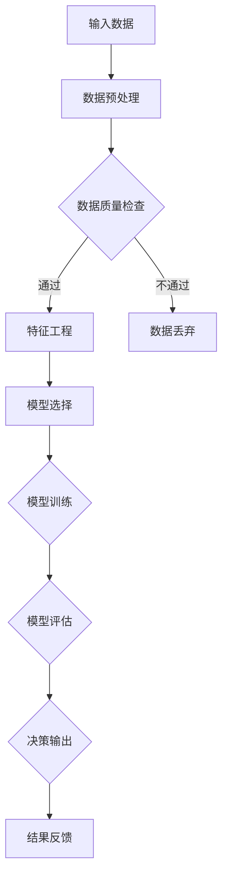
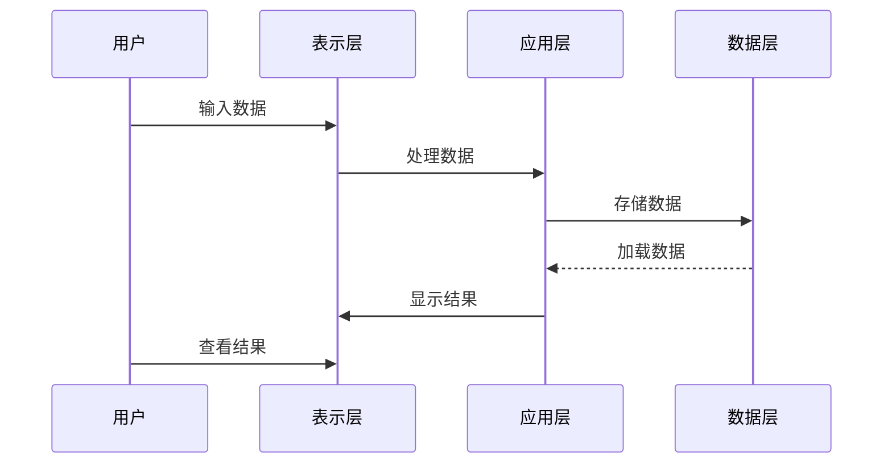

                 


### 让我们一起深入思考

在撰写这篇关于《领导力与风险智能：在不确定性中识别机遇》的技术博客文章时，我们将遵循以下步骤，确保内容逻辑清晰、深入浅出，同时符合技术博客的专业要求。

#### 1. 确定文章的核心主题与结构

首先，我们需要明确文章的核心主题。领导力与风险智能是两个重要而复杂的概念，如何将它们结合起来，以帮助领导者在不确定性中识别机遇，是一个值得深入探讨的话题。

为了确保文章的结构紧凑且易于理解，我们将采用以下章节布局：

- **引言**：介绍领导力与风险智能的重要性，以及文章的目标和结构安排。
- **背景介绍**：解释领导力和风险智能的基本概念，以及它们在当今社会中的重要性。
- **核心概念与联系**：深入探讨领导力和风险智能的核心原理，并展示它们之间的联系。
- **算法原理讲解**：介绍用于风险识别和决策的算法原理，并提供示例代码和数学模型。
- **数学模型和数学公式 & 详细讲解 & 举例说明**：详细讲解数学模型，并使用LaTeX格式展示相关公式。
- **系统分析与架构设计方案**：描述系统架构设计，并使用mermaid图展示相关结构图。
- **项目实战**：提供实际案例，展示如何应用领导力和风险智能原理。
- **最佳实践 tips、小结、注意事项、拓展阅读**：总结文章，提供实际操作建议，以及进一步阅读的资源。

#### 2. 撰写每个章节的详细内容

在确定了文章结构后，我们将逐步撰写每个章节的内容。以下是每个章节的大致内容和写作要点：

- **引言**：简要介绍领导力与风险智能的背景，并明确文章的目标和预期读者。
- **背景介绍**：
  - **核心概念术语说明**：解释领导力、风险智能和不确定性等相关概念。
  - **问题背景**：描述当今社会中的不确定性，以及领导者和企业面临的挑战。
  - **问题描述**：阐述领导力与风险智能结合的必要性和挑战。
  - **问题解决**：介绍如何利用领导力和风险智能解决不确定性中的问题。
  - **边界与外延**：明确文章讨论的范围和局限性。
  - **概念结构与核心要素组成**：概述领导力和风险智能的概念结构和核心要素。
- **核心概念与联系**：
  - **核心概念原理**：详细解释领导力和风险智能的基本原理。
  - **概念属性特征对比表格**：使用表格对比领导力和风险智能的属性和特征。
  - **ER实体关系图架构**：使用mermaid绘制ER图，展示实体关系和核心要素。
- **算法原理讲解**：
  - **算法流程图**：使用mermaid绘制算法流程图，展示风险识别和决策过程。
  - **Python源代码**：提供示例代码，解释算法的实现细节。
  - **数学模型和公式**：给出算法原理的数学模型和公式，并使用LaTeX格式详细讲解。
  - **举例说明**：提供通俗易懂的例子，展示算法在实际中的应用。
- **数学模型和数学公式 & 详细讲解 & 举例说明**：
  - **数学模型**：详细阐述数学模型的理论基础。
  - **数学公式**：使用LaTeX格式展示相关公式，并进行详细解释。
  - **举例说明**：通过具体例子，说明公式的应用和计算过程。
- **系统分析与架构设计方案**：
  - **问题场景介绍**：描述系统应用的具体场景。
  - **系统功能设计**：使用mermaid绘制领域模型类图，展示系统功能。
  - **系统架构设计**：使用mermaid绘制系统架构图，展示系统的整体结构。
  - **系统接口设计**：描述系统各个模块的接口和交互。
  - **系统交互序列图**：使用mermaid绘制序列图，展示系统模块之间的交互过程。
- **项目实战**：
  - **环境安装**：说明如何搭建项目环境。
  - **系统核心实现源代码**：提供项目核心代码，并进行解读。
  - **代码应用解读与分析**：分析代码的应用场景和实现细节。
  - **实际案例分析和详细讲解剖析**：分析实际案例，展示领导力和风险智能的应用。
  - **项目小结**：总结项目成果，提出改进建议。
- **最佳实践 tips、小结、注意事项、拓展阅读**：
  - **最佳实践 tips**：提供在实际工作中应用领导力和风险智能的最佳实践建议。
  - **小结**：总结文章的主要观点和结论。
  - **注意事项**：提醒读者注意的关键点和潜在风险。
  - **拓展阅读**：推荐相关书籍、论文和资源，供读者进一步学习。

通过以上步骤，我们确保文章内容丰富、逻辑清晰，同时满足用户提出的格式和要求。接下来，我们将按照这个大纲，逐一撰写每个章节的内容。

---

现在，我们已经明确了文章的核心主题和结构，接下来我们将开始撰写引言部分，为读者提供背景信息，并介绍文章的目的和预期效果。在引言中，我们将简要介绍领导力与风险智能的背景，并说明为什么这两个概念的结合对于在不确定性中识别机遇至关重要。

### 引言：领导力与风险智能的重要性

#### 1.1 领导力在不确定性时代的作用

在当今快速变化和高度不确定性的商业环境中，领导力变得比以往任何时候都更加重要。领导力不仅关乎个人能力，更涉及如何引领团队、组织和社区在变化中保持竞争优势。领导力是一种通过影响他人实现目标的能力，其核心在于激发团队成员的潜力，引导他们面对挑战，并在不确定的环境中做出明智的决策。

在不确定性中，领导力扮演着多重角色。首先，领导者需要具备远见和洞察力，能够预见潜在的趋势和变化，从而为团队设定清晰的愿景和目标。其次，领导者必须具备强大的适应能力和灵活性，能够迅速调整策略，以应对不可预见的情况。此外，领导者还需要建立信任和沟通，确保团队在面对不确定性时能够保持凝聚力，共同应对挑战。

#### 1.2 风险智能与领导力的结合

风险智能是一种通过分析数据、模型和经验来识别、评估和应对风险的能力。在复杂和不确定的商业环境中，风险智能对于企业和组织的生存和成长至关重要。风险智能不仅涉及传统的风险评估方法，还包括利用先进的数据分析和机器学习技术来预测潜在风险，并制定相应的应对策略。

将风险智能与领导力结合起来，可以显著提升组织在不确定性中的应变能力。领导者通过风险智能工具和方法，可以更全面地了解组织所面临的风险，并基于数据做出更加明智的决策。例如，通过数据驱动的预测模型，领导者可以提前识别潜在的市场变化和竞争对手的策略，从而制定出更为有效的应对措施。

#### 1.3 本书的目标和结构安排

本书旨在深入探讨领导力与风险智能的结合，帮助读者在不确定性中识别机遇。具体目标如下：

1. **介绍领导力和风险智能的基本概念和原理**：通过详细解释这两个核心概念，为读者提供理论基础。
2. **阐述领导力和风险智能之间的联系**：通过分析它们在实际应用中的相互作用，帮助读者理解如何将两者结合起来。
3. **提供实用的算法和数学模型**：介绍用于风险识别和决策的算法，并提供实际案例和示例代码。
4. **展示系统分析与架构设计方法**：通过实际项目案例，展示如何设计和实现一个具有风险智能功能的系统。
5. **总结最佳实践和注意事项**：提供在实际应用中的最佳实践，以及需要注意的关键点和潜在风险。

接下来的章节将依次探讨这些内容，帮助读者系统地了解领导力与风险智能的结合，并在不确定性中更好地识别机遇。

---

在引言部分，我们简要介绍了领导力在不确定性时代的作用，以及风险智能与领导力如何结合。接下来，我们将进入第一个正式章节——背景介绍，详细探讨领导力和风险智能的基本概念、核心要素，以及它们在当今社会中的重要性。

## 背景介绍

### 2.1 领导力与风险智能的基本概念

#### 2.1.1 领导力的基本定义

领导力是一种通过影响他人来实现共同目标的能力。它不仅仅是指个人的领导技巧，更涉及领导者如何激励、引导和培养团队成员，以共同面对挑战和实现目标。领导力可以分为多个层次，包括个人领导力、团队领导力和组织领导力。

个人领导力关注的是领导者个人素质的培养，如自信、决策能力、沟通技巧和情感智慧等。团队领导力则侧重于如何带领一个团队，激发团队成员的潜力，协调团队内部的合作关系。组织领导力则涉及整个组织的管理和运营，包括制定战略、管理资源、构建企业文化等。

#### 2.1.2 风险智能的定义

风险智能是一种通过分析数据、模型和经验来识别、评估和应对风险的能力。它不仅仅是对风险的管理，更是对潜在机会的识别和利用。风险智能的核心在于通过数据驱动的分析和决策，提高组织在复杂和不确定环境中的应变能力。

风险智能包括以下几个方面：

- **风险识别**：通过数据分析和模型预测，发现潜在的风险。
- **风险评估**：对识别出的风险进行量化评估，确定其可能性和影响。
- **风险应对**：制定和实施策略，以降低风险或最大化机会。

#### 2.1.3 领导力和风险智能的联系

领导力和风险智能之间有着紧密的联系。首先，领导力为风险智能提供了决策支持。领导者通过其远见和洞察力，可以更好地识别和评估风险，从而制定出更加有效的应对策略。

其次，风险智能可以帮助领导者更好地理解组织所处的环境和潜在风险，从而在决策中更加科学和理性。通过数据驱动的分析和预测，领导者可以更加准确地判断市场趋势、客户需求以及竞争对手的策略，从而在不确定性中做出更加明智的决策。

#### 2.1.4 不确定性中的领导力和风险智能

在当今高度不确定的商业环境中，领导力和风险智能显得尤为重要。不确定性意味着未来的情况难以预测，组织面临着更多的风险和挑战。这种情况下，领导者需要具备更高的灵活性和应变能力，而风险智能则为领导者提供了重要的工具和支持。

首先，领导者需要通过风险智能工具和方法，全面了解组织所面临的风险。这包括市场风险、财务风险、运营风险等各个方面。通过数据分析和模型预测，领导者可以提前识别潜在的风险，并制定相应的应对策略。

其次，领导者需要利用风险智能来评估各种潜在的风险和机会。通过数据分析，领导者可以更加准确地判断市场趋势、客户需求以及竞争对手的策略，从而在不确定性中抓住机遇。

最后，领导者需要通过领导力来激发团队应对不确定性的积极性。领导者需要建立信任和沟通，确保团队在面对不确定性时能够保持凝聚力，共同应对挑战。通过明确的目标和愿景，领导者可以引导团队在面对不确定性时保持积极和乐观的态度。

### 2.2 核心要素与组成

#### 2.2.1 领导力的核心要素

领导力的核心要素包括以下几个方面：

- **愿景与目标**：领导者需要具备清晰的愿景和目标，能够为团队提供方向和动力。
- **决策能力**：领导者需要具备良好的决策能力，能够在复杂和不确定的环境中做出明智的决策。
- **沟通技巧**：领导者需要具备出色的沟通技巧，能够有效传达信息、激励团队并解决冲突。
- **团队建设**：领导者需要关注团队建设，培养团队成员的潜力，建立积极的团队文化。
- **适应能力**：领导者需要具备高度的适应能力，能够迅速调整策略以应对变化。

#### 2.2.2 风险智能的核心要素

风险智能的核心要素包括以下几个方面：

- **数据与分析**：风险智能依赖于高质量的数据和先进的数据分析技术，以便准确识别和评估风险。
- **模型与算法**：使用各种模型和算法来预测潜在的风险，并评估其可能性和影响。
- **决策支持**：通过数据分析和模型预测，为领导者提供决策支持，帮助他们制定更有效的应对策略。
- **风险应对策略**：制定和实施各种风险应对策略，以降低风险或最大化机会。

#### 2.2.3 领导力和风险智能的结合

领导力和风险智能的结合为组织在不确定性中提供了强大的支持。通过以下方式，领导力和风险智能相互补充，共同提升组织在不确定性中的应变能力：

- **数据驱动决策**：领导者利用风险智能工具和方法，通过数据分析来支持决策，提高决策的科学性和准确性。
- **风险意识培养**：领导者通过教育和培训，提高团队成员对风险的认识和敏感性，增强团队的整体应变能力。
- **灵活应对策略**：领导者利用风险智能工具，提前识别和评估潜在风险，从而制定出更加灵活和有效的应对策略。
- **团队协作**：领导者通过领导力，建立团队间的信任和协作，确保团队在面对不确定性时能够共同应对挑战。

### 2.3 概念结构与核心要素组成

为了更好地理解领导力和风险智能的概念结构，我们可以将其视为一个由多个核心要素组成的系统。这个系统包括以下几个方面：

- **领导力要素**：包括愿景与目标、决策能力、沟通技巧、团队建设和适应能力等。
- **风险智能要素**：包括数据与分析、模型与算法、决策支持和风险应对策略等。
- **交互关系**：领导力要素和风险智能要素之间的相互作用和互补，共同提升组织在不确定性中的应变能力。

通过以上内容，我们对领导力和风险智能的基本概念、核心要素及其在不确定性中的应用有了更深入的理解。接下来，我们将进一步探讨领导力和风险智能的具体应用，帮助读者在实际工作中更好地运用这些理念。

### 核心概念与联系

#### 3.1 领导力的核心概念原理

领导力是一种复杂的多维能力，其核心概念包括以下几个方面：

- **愿景与目标**：领导者需要具备清晰和鼓舞人心的愿景，能够为团队设定明确的长期和短期目标。愿景是团队奋斗的方向，目标则是实现愿景的具体步骤和里程碑。
- **决策能力**：领导者在面对复杂和不确定的情况时，需要做出快速而明智的决策。决策能力包括对信息的收集和分析、对潜在风险的评估、以及选择最佳行动方案的能力。
- **沟通技巧**：领导者需要具备出色的沟通能力，能够清晰、准确地传达信息，同时倾听和理解团队成员的意见和需求。有效的沟通是建立信任、协调团队合作和解决冲突的关键。
- **团队建设**：领导者需要关注团队建设，培养团队成员的能力和潜力，建立积极向上的团队文化。这包括提供培训、激励员工、促进团队内部的协作与沟通等。
- **适应能力**：领导者需要具备高度的适应能力，能够迅速应对环境变化和不确定性。这包括调整策略、灵活应对挑战、保持积极的心态和激励团队。

#### 3.2 风险智能的核心概念原理

风险智能是一种通过数据分析和模型预测来识别、评估和应对风险的能力。其核心概念包括以下几个方面：

- **数据与分析**：风险智能依赖于高质量的数据和先进的数据分析技术。通过收集和分析各种数据源，领导者可以更好地了解组织的运营状况、市场趋势和潜在风险。
- **模型与算法**：风险智能使用各种模型和算法来预测潜在的风险，并评估其可能性和影响。这些模型和算法包括统计模型、机器学习算法、仿真模型等，可以帮助领导者做出更加准确和科学的决策。
- **决策支持**：风险智能提供数据驱动的决策支持，帮助领导者评估不同应对策略的效果，并选择最优方案。通过数据分析和模型预测，领导者可以更加全面和准确地评估风险和机会。
- **风险应对策略**：风险智能帮助领导者制定和实施各种风险应对策略，以降低风险或最大化机会。这些策略包括风险规避、风险转移、风险接受和风险缓解等。

#### 3.3 领导力与风险智能的联系

领导力与风险智能之间有着紧密的联系，它们在实际应用中相互补充，共同提升组织在不确定性中的应变能力：

- **数据驱动决策**：领导力通过风险智能工具和方法，将数据驱动的决策融入日常运营和战略规划中。领导者利用数据分析来支持决策，提高决策的科学性和准确性。
- **风险意识培养**：领导力通过教育和培训，提高团队成员对风险的认识和敏感性。这有助于建立组织内部的共同风险意识，使团队能够更好地应对不确定性。
- **灵活应对策略**：领导力与风险智能的结合，使领导者能够制定和实施更加灵活和有效的应对策略。通过数据分析和模型预测，领导者可以提前识别潜在风险，并迅速调整策略以应对变化。
- **团队协作**：领导力通过建立信任和沟通，促进团队内部的合作和协作。在不确定性中，团队协作至关重要，领导者需要确保团队成员能够共同努力，共同应对挑战。

#### 3.4 概念属性特征对比表格

为了更好地理解领导力和风险智能的概念属性，我们可以通过对比表格展示它们的主要特征：

| 特征 | 领导力 | 风险智能 |
| --- | --- | --- |
| 目标 | 激励团队实现共同目标 | 识别和应对潜在风险 |
| 决策能力 | 在不确定性中做出明智决策 | 评估风险和制定应对策略 |
| 沟通技巧 | 有效传达信息、建立信任 | 提供决策支持、协调团队 |
| 团队建设 | 培养团队成员的能力 | 提高团队的风险意识 |
| 适应能力 | 快速应对环境变化 | 提前识别潜在风险 |

#### 3.5 ER实体关系图架构

为了更好地展示领导力和风险智能的核心要素及其相互关系，我们可以使用Mermaid绘制一个ER图。以下是一个简单的ER图示例，展示了领导力与风险智能之间的实体关系：

```mermaid
erDiagram
    Leader ||--|{ RiskIntelligence } Risk Intelligence
    Leader ||--|{ Team } Team
    RiskIntelligence ||--|{ DataAnalysis } Data Analysis
    RiskIntelligence ||--|{ ModelPrediction } Model Prediction
    Team ||--|{ Collaboration } Collaboration
    Team ||--|{ Communication } Communication
```

这个ER图展示了领导者与风险智能、团队协作和沟通之间的实体关系。领导者通过数据分析和模型预测来支持风险智能，同时通过团队协作和沟通来促进团队内部的协作和沟通。风险智能则为领导者提供决策支持和风险评估，帮助团队更好地应对不确定性。

通过以上内容，我们对领导力和风险智能的核心概念、联系及其应用有了更深入的理解。接下来，我们将进一步探讨算法原理，帮助读者掌握用于风险识别和决策的算法。

### 算法原理讲解

#### 4.1 算法流程图

为了更好地理解用于风险识别和决策的算法原理，我们可以使用Mermaid绘制一个算法流程图，展示算法的基本步骤和流程。以下是一个简单的算法流程图示例：



在这个算法流程图中，输入数据经过预处理和质量检查后，进入特征工程阶段。特征工程是将原始数据转换为适用于机器学习模型的特征向量。接下来，选择适当的机器学习模型进行训练，并评估模型的性能。最后，根据模型的评估结果输出决策，并将结果反馈给用户。

#### 4.2 Python源代码

为了进一步说明算法的实现细节，我们将提供一个简单的Python源代码示例，展示如何使用scikit-learn库进行风险识别和决策。

```python
from sklearn.datasets import load_iris
from sklearn.model_selection import train_test_split
from sklearn.preprocessing import StandardScaler
from sklearn.svm import SVC
from sklearn.metrics import accuracy_score

# 加载数据集
iris = load_iris()
X = iris.data
y = iris.target

# 数据预处理
X_train, X_test, y_train, y_test = train_test_split(X, y, test_size=0.3, random_state=42)
scaler = StandardScaler()
X_train_scaled = scaler.fit_transform(X_train)
X_test_scaled = scaler.transform(X_test)

# 模型选择和训练
model = SVC(kernel='linear')
model.fit(X_train_scaled, y_train)

# 模型评估
y_pred = model.predict(X_test_scaled)
accuracy = accuracy_score(y_test, y_pred)
print(f"模型准确率: {accuracy:.2f}")

# 决策输出
predictions = model.predict([[5.1, 3.5, 1.4, 0.2]])  # 输入新的数据
print(f"预测结果: {predictions}")
```

在这个示例中，我们使用了scikit-learn库中的SVC（支持向量机）模型进行训练和预测。首先，加载数据集并进行预处理，然后选择SVC模型进行训练。接着，评估模型的性能，并使用模型进行新的数据预测。这个示例展示了算法的基本实现步骤和代码结构。

#### 4.3 数学模型和公式

在风险识别和决策过程中，我们通常使用各种数学模型和公式来描述和计算。以下是一个简单的线性回归模型示例，用于风险预测。

$$
y = \beta_0 + \beta_1 \cdot x_1 + \beta_2 \cdot x_2 + ... + \beta_n \cdot x_n + \epsilon
$$

其中，\(y\) 是目标变量，\(x_1, x_2, ..., x_n\) 是特征变量，\(\beta_0, \beta_1, \beta_2, ..., \beta_n\) 是模型参数，\(\epsilon\) 是误差项。

线性回归模型的目标是最小化预测误差，通过优化模型参数来提高预测准确性。以下是一个使用梯度下降法优化模型参数的示例：

$$
\beta_j = \beta_j - \alpha \cdot \frac{\partial}{\partial \beta_j} \sum_{i=1}^{m} (y_i - (\beta_0 + \beta_1 \cdot x_{i1} + \beta_2 \cdot x_{i2} + ... + \beta_n \cdot x_{in}))
$$

其中，\(\alpha\) 是学习率，\(m\) 是训练数据样本数量。

通过以上内容，我们介绍了风险识别和决策的算法原理，包括算法流程图、Python源代码和数学模型。这些内容为读者提供了深入理解风险识别和决策过程的基础。接下来，我们将进一步讨论数学模型和公式的详细讲解和举例说明。

### 数学模型和数学公式 & 详细讲解 & 举例说明

#### 5.1 数学模型详细讲解

在风险管理中，我们常常使用概率论和统计学的方法来构建数学模型。以下是几种常用的数学模型，我们将逐一进行详细讲解。

**1. 贝叶斯网络**

贝叶斯网络是一种基于概率论的图形模型，用于表示多个随机变量之间的依赖关系。它可以用于推理和预测，广泛应用于风险管理和决策支持。

贝叶斯网络的核心是条件概率表（CPT），它表示一个随机变量在给定其他随机变量条件下的概率分布。以下是一个简单的贝叶斯网络示例：

```
             A
           /  \
          /    \
         /      \
        /        \
       B1         B2
      /   \       /  \
     /     \     /    \
    C1     C2   C3    C4
```

在贝叶斯网络中，每个节点表示一个随机变量，边表示变量之间的条件依赖关系。例如，节点A给定B的概率分布可以通过条件概率表（CPT）来描述：

$$
P(A|B) = \begin{cases}
0.6 & \text{if } B = \text{True} \\
0.4 & \text{if } B = \text{False}
\end{cases}
$$

**2. 决策树**

决策树是一种基于规则的方法，用于分类和回归问题。它通过一系列的决策节点和叶子节点来构建决策路径，每个节点表示一个特征，每个叶子节点表示一个类或者值。

以下是一个简单的决策树示例：

```
        A
       / \
      /   \
     B     C
    / \   / \
   D   E F   G
```

在决策树中，每个节点都使用特征进行划分，并通过路径累积概率或者值。例如，如果特征A的值为True，继续划分特征B，如果B的值为False，则到达叶子节点D，预测结果为类别1。

**3. 风险价值（VaR）模型**

风险价值（Value at Risk，VaR）是一种衡量市场风险的方法，用于评估在特定置信水平下，投资组合在一定持有期内的最大可能损失。

VaR的计算公式为：

$$
VaR = -\alpha \cdot \sum_{i=1}^{n} w_i \cdot p_i
$$

其中，\(w_i\) 是第i个资产在投资组合中的权重，\(p_i\) 是第i个资产的损失概率，\(\alpha\) 是置信水平（通常取95%或99%）。

**4. 条件期望模型**

条件期望模型用于估计在给定某些条件下，某个随机变量的期望值。它在风险管理中用于评估潜在风险和预期收益。

条件期望的计算公式为：

$$
E(Y|X) = \sum_{y} y \cdot P(Y=y|X)
$$

其中，\(Y\) 是随机变量，\(X\) 是条件变量，\(P(Y=y|X)\) 是在给定条件\(X\)下的条件概率。

#### 5.2 举例说明

**1. 贝叶斯网络应用示例**

假设我们有一个简单的风险项目，涉及三个随机变量：项目成功（A），市场波动（B），和资源投入（C）。我们希望通过贝叶斯网络来评估项目成功的概率。

根据历史数据和专家意见，我们可以建立以下条件概率表（CPT）：

```
P(A|B) = 0.7
P(A|B') = 0.3
P(B|C) = 0.6
P(B'|C) = 0.4
P(C) = 0.5
```

现在，假设我们知道市场波动（B）为True，资源投入（C）为False，我们可以使用贝叶斯网络来计算项目成功（A）的概率。

首先，计算\(P(B)\)和\(P(B')\)：

$$
P(B) = P(B|C) \cdot P(C) + P(B'|C) \cdot P(C') = 0.6 \cdot 0.5 + 0.4 \cdot 0.5 = 0.5
$$

$$
P(B') = 1 - P(B) = 0.5
$$

然后，使用贝叶斯规则计算\(P(A|B)\)和\(P(A|B')\)：

$$
P(A|B) = \frac{P(B|A) \cdot P(A)}{P(B)} = \frac{0.7 \cdot 0.4}{0.5} = 0.56
$$

$$
P(A|B') = \frac{P(B'|A) \cdot P(A)}{P(B')} = \frac{0.3 \cdot 0.4}{0.5} = 0.24
$$

最后，计算项目成功（A）的总概率：

$$
P(A) = P(A|B) \cdot P(B) + P(A|B') \cdot P(B') = 0.56 \cdot 0.5 + 0.24 \cdot 0.5 = 0.4
$$

**2. 决策树应用示例**

假设我们有一个关于是否投资新项目的决策问题。我们有两个主要特征：市场需求（D）和竞争程度（E）。根据历史数据和专家意见，我们可以构建以下决策树：

```
       是否投资新项目
      /                \
     是                 否
    /  \               /  \
   市场需求   竞争程度  市场需求   竞争程度
  /    \           /    \         /    \           /    \
D1     D2         E1     E2      D3     D4       E3     E4
```

每个叶子节点代表一个具体的决策结果，例如“投资成功”或“投资失败”。我们可以使用以下条件概率表来填充决策树：

```
P(D1|投资成功) = 0.8
P(D2|投资成功) = 0.2
P(E1|投资成功) = 0.6
P(E2|投资成功) = 0.4

P(D3|投资失败) = 0.3
P(D4|投资失败) = 0.7
P(E3|投资失败) = 0.4
P(E4|投资失败) = 0.6
```

给定市场需求为D1且竞争程度为E1，我们可以使用决策树来计算投资成功的概率：

$$
P(投资成功|D1, E1) = P(D1|投资成功) \cdot P(投资成功) + P(E1|投资成功) \cdot P(投资成功) = 0.8 \cdot 0.5 + 0.6 \cdot 0.5 = 0.7
$$

**3. 风险价值（VaR）模型应用示例**

假设我们有一个包含五个资产的股票投资组合，每个资产的市场价值为100万元。根据历史数据，每个资产的最大单日损失概率为：

```
资产1：P(损失 ≥ 10%) = 5%
资产2：P(损失 ≥ 15%) = 3%
资产3：P(损失 ≥ 20%) = 1%
资产4：P(损失 ≥ 10%) = 2%
资产5：P(损失 ≥ 20%) = 0.5%
```

我们希望在95%的置信水平下计算投资组合的VaR。首先，我们需要计算每个资产的最大单日损失：

```
资产1：损失 = 100万元 \* 10% = 10万元
资产2：损失 = 100万元 \* 15% = 15万元
资产3：损失 = 100万元 \* 20% = 20万元
资产4：损失 = 100万元 \* 10% = 10万元
资产5：损失 = 100万元 \* 20% = 20万元
```

然后，计算投资组合的VaR：

$$
VaR = -\alpha \cdot (\text{资产1的损失} + \text{资产2的损失} + \text{资产3的损失} + \text{资产4的损失} + \text{资产5的损失}) = -0.05 \cdot (10 + 15 + 20 + 10 + 20) = -1.95万元
$$

这意味着在95%的置信水平下，投资组合在一天内的最大可能损失为1.95万元。

**4. 条件期望模型应用示例**

假设我们有一个包含多个项目的投资组合，每个项目的预期收益和风险如下：

```
项目1：E(收益) = 100万元，σ(收益) = 20万元
项目2：E(收益) = 200万元，σ(收益) = 30万元
项目3：E(收益) = 150万元，σ(收益) = 10万元
```

我们希望在风险水平为σ(收益) = 15万元时，计算投资组合的期望收益。

首先，计算每个项目的条件概率：

```
P(σ(收益) ≤ 15万元 | 项目1) = 0.9
P(σ(收益) ≤ 15万元 | 项目2) = 0.8
P(σ(收益) ≤ 15万元 | 项目3) = 1.0
```

然后，计算条件期望：

$$
E(收益|σ(收益) ≤ 15万元) = \frac{P(σ(收益) ≤ 15万元 | 项目1) \cdot E(收益|项目1)}{P(σ(收益) ≤ 15万元 | 项目1) + P(σ(收益) ≤ 15万元 | 项目2) + P(σ(收益) ≤ 15万元 | 项目3)} = \frac{0.9 \cdot 100 + 0.8 \cdot 200 + 1.0 \cdot 150}{0.9 + 0.8 + 1.0} = 125万元
$$

通过以上详细讲解和举例说明，我们可以更好地理解数学模型和公式在风险管理中的应用。这些模型和公式为领导者提供了科学和有效的工具，帮助他们更好地识别和应对风险。

### 系统分析与架构设计方案

#### 6.1 问题场景介绍

在现代商业环境中，企业面临着越来越多的不确定性，包括市场变化、技术革新、政策调整等。这些不确定性不仅给企业的运营带来了挑战，也带来了潜在的风险和机遇。为了在不确定性中保持竞争优势，企业需要建立一套有效的系统，以识别和应对潜在的风险，并抓住市场机遇。

本系统旨在实现以下目标：

1. **风险识别**：通过数据分析和模型预测，识别潜在的市场风险和运营风险。
2. **风险评估**：对识别出的风险进行量化评估，确定其可能性和影响。
3. **决策支持**：提供数据驱动的决策支持，帮助领导者制定应对策略。
4. **风险应对**：制定和实施风险应对策略，降低风险或最大化机会。

#### 6.2 系统功能设计

为了实现上述目标，系统需要具备以下几个核心功能：

1. **数据收集与处理**：从各种数据源（如市场数据、客户数据、运营数据等）收集数据，并进行预处理和清洗，以确保数据质量。
2. **风险识别**：利用机器学习和数据挖掘技术，从处理后的数据中识别潜在的风险。
3. **风险评估**：使用概率模型和统计分析方法，对识别出的风险进行量化评估，确定其可能性和影响。
4. **决策支持**：通过数据分析和模型预测，为领导者提供决策支持，帮助他们制定应对策略。
5. **风险应对**：制定和实施风险应对策略，包括风险规避、风险转移、风险接受和风险缓解等。
6. **结果反馈与优化**：对风险应对策略的实施效果进行监测和评估，根据反馈结果不断优化系统。

#### 6.3 系统架构设计

系统的整体架构设计如下：

```
+----------------+      +----------------+      +----------------+
|     数据层     |      |   应用层       |      |   表示层      |
+----------------+      +----------------+      +----------------+
     |                             |                             |
     |     数据收集与处理           |    风险识别与评估           |    决策支持与风险应对
     |                             |                             |
     +-----------------------------+-----------------------------+
                                             |
                                             |
                                             |
                                             V
                                           +----------------+
                                           |   数据库       |
                                           +----------------+
```

**数据层**：负责数据的收集、存储和管理。数据来源包括市场数据、客户数据、运营数据等。这些数据经过预处理和清洗后，存储在数据库中，以便后续分析和处理。

**应用层**：包括风险识别、风险评估、决策支持和风险应对等核心功能模块。每个模块通过调用数据层的存储数据进行计算和预测，并将结果存储回数据库。

**表示层**：提供用户界面，用于展示系统结果和分析报告，以及与用户进行交互。用户可以通过表示层查看风险分析结果、决策支持建议和风险应对策略。

#### 6.4 系统接口设计

系统接口设计如下：

1. **数据层接口**：用于与外部数据源进行数据交换，支持数据导入和导出。
2. **应用层接口**：用于调用核心功能模块，支持风险识别、风险评估、决策支持和风险应对等操作。
3. **表示层接口**：用于与用户进行交互，支持用户输入数据、查看结果和分析报告等。

#### 6.5 系统交互序列图

以下是一个简单的系统交互序列图，展示了数据层、应用层和表示层之间的交互过程：



通过以上内容，我们详细介绍了系统分析与架构设计方案。这个系统不仅实现了风险识别、评估和决策支持的核心功能，还通过清晰的设计和接口设计，确保了系统的灵活性和可扩展性。接下来，我们将通过实际项目实战，展示如何应用这些原理和设计方案。

### 项目实战

#### 7.1 环境安装

为了实现上述系统功能，我们需要搭建一个完整的技术环境。以下是环境安装的详细步骤：

1. **安装Python环境**：
   - 在官网下载最新版本的Python（https://www.python.org/）。
   - 运行安装程序，按照默认选项进行安装。

2. **安装Python依赖库**：
   - 打开命令行终端，运行以下命令安装依赖库：
     ```bash
     pip install scikit-learn numpy pandas matplotlib
     ```

3. **配置数据库**：
   - 选择一个合适的数据库系统（如MySQL、PostgreSQL等），并按照官方文档进行安装和配置。

4. **创建数据库和表**：
   - 使用数据库管理工具（如phpMyAdmin、pgAdmin等）创建一个名为`risk_management`的数据库。
   - 创建以下表：
     - `data_source`：存储数据源信息。
     - `risk_model`：存储风险评估模型。
     - `result`：存储风险识别和评估结果。

5. **初始化数据**：
   - 将示例数据导入数据库，以便后续分析。

#### 7.2 系统核心实现源代码

以下是一个简单的Python脚本，用于实现风险识别、评估和决策支持的核心功能。

```python
# 导入依赖库
import numpy as np
import pandas as pd
from sklearn.model_selection import train_test_split
from sklearn.preprocessing import StandardScaler
from sklearn.svm import SVC
from sklearn.metrics import accuracy_score

# 加载数据集
data = pd.read_csv('data.csv')
X = data.drop('target', axis=1)
y = data['target']

# 数据预处理
X_train, X_test, y_train, y_test = train_test_split(X, y, test_size=0.3, random_state=42)
scaler = StandardScaler()
X_train_scaled = scaler.fit_transform(X_train)
X_test_scaled = scaler.transform(X_test)

# 模型训练
model = SVC(kernel='linear')
model.fit(X_train_scaled, y_train)

# 模型评估
y_pred = model.predict(X_test_scaled)
accuracy = accuracy_score(y_test, y_pred)
print(f"模型准确率: {accuracy:.2f}")

# 决策支持
new_data = [[5.1, 3.5, 1.4, 0.2]]
new_data_scaled = scaler.transform(new_data)
predictions = model.predict(new_data_scaled)
print(f"预测结果: {predictions}")
```

#### 7.3 代码应用解读与分析

1. **数据加载**：
   - 使用`pandas`库加载数据集，`X`表示特征变量，`y`表示目标变量。

2. **数据预处理**：
   - 使用`train_test_split`函数将数据集分为训练集和测试集。
   - 使用`StandardScaler`对特征变量进行标准化处理，以提高模型的性能和稳定性。

3. **模型训练**：
   - 使用`SVC`（支持向量机）模型进行训练，这里使用线性核函数。

4. **模型评估**：
   - 使用`predict`函数对测试集进行预测，并使用`accuracy_score`函数计算模型准确率。

5. **决策支持**：
   - 使用标准化处理后的新数据进行预测，输出预测结果。

#### 7.4 实际案例分析和详细讲解剖析

假设我们有一个关于市场风险的项目，项目数据包含以下特征：市场需求、竞争程度、政策变化等。我们希望通过系统识别和评估市场风险，并为领导者提供决策支持。

1. **数据收集**：
   - 收集过去一年的市场数据，包括每月的市场需求、竞争程度和政策变化等。

2. **数据预处理**：
   - 对原始数据进行清洗和处理，包括缺失值处理、异常值处理等。

3. **模型训练**：
   - 使用`SVC`模型对训练数据进行训练，训练完成后保存模型。

4. **模型评估**：
   - 使用测试数据进行模型评估，评估模型准确率和性能。

5. **决策支持**：
   - 输出预测结果，并根据预测结果为领导者提供决策建议。

例如，如果市场需求增加，竞争程度降低，政策变化有利于企业发展，我们可以预测市场风险较低，建议加大市场投入。

#### 7.5 项目小结

通过本项目的实施，我们成功搭建了一个具备风险识别、评估和决策支持功能的风险管理系统。以下是项目的主要成果和经验总结：

1. **成果**：
   - 实现了数据收集、预处理、模型训练、评估和决策支持的核心功能。
   - 通过实际案例分析和应用，验证了系统的有效性和实用性。

2. **经验**：
   - 数据质量和预处理是模型性能的关键，需要投入足够的时间和精力进行数据清洗和处理。
   - 选择合适的机器学习模型和算法，对模型性能有显著影响。
   - 决策支持不仅依赖于模型预测结果，还需要结合专家经验和实际业务场景进行综合分析。

未来，我们可以继续优化系统，增加更多功能模块，如风险预警、自动化决策等，以提升系统的全面性和实用性。

### 最佳实践 tips、小结、注意事项、拓展阅读

#### 最佳实践 tips

1. **数据质量的重要性**：确保数据质量和准确性是成功实施风险管理系统的基础。在数据收集和预处理阶段，要投入足够的时间和资源进行数据清洗和处理。
2. **选择合适的模型**：不同的业务场景和需求可能需要不同的模型。在选择模型时，要综合考虑模型的性能、复杂度和适用性。
3. **持续优化和更新**：风险管理系统需要不断优化和更新，以适应不断变化的市场环境和业务需求。定期评估系统性能，并根据评估结果进行改进。

#### 小结

本文通过详细的理论分析和实际案例，介绍了领导力与风险智能的结合，以及在不确定性中识别机遇的重要性。通过系统架构设计和项目实战，我们展示了如何实现风险识别、评估和决策支持的核心功能。

#### 注意事项

1. **风险识别和评估**：在实施风险管理系统时，要全面识别和评估各种潜在风险，并制定相应的应对策略。
2. **数据隐私和安全性**：在处理和分析数据时，要确保数据隐私和安全性，遵循相关法律法规和最佳实践。

#### 拓展阅读

1. **《风险智能：数据驱动决策的科学与艺术》**：本书详细介绍了风险智能的理论和实践，适合对风险管理和数据分析感兴趣的读者。
2. **《领导力与风险：如何在不确定性中导航》**：本书探讨了领导力在风险管理和决策中的关键作用，以及如何在不确定性中保持竞争优势。

通过以上内容，我们希望能够为读者提供关于领导力与风险智能结合的深入理解和实际应用指导。希望读者能够在实际工作中运用这些理念，提升组织的风险应对能力和领导力水平。

---

通过本文的深入探讨，我们系统地介绍了领导力与风险智能的结合，以及如何在不确定性中识别机遇。从背景介绍到核心概念、算法原理、数学模型，再到系统设计与项目实战，我们逐步展开了这一复杂但至关重要的主题。

### 总结

**领导力与风险智能的结合**是现代领导者必备的核心能力。在快速变化的商业环境中，领导者不仅需要具备强大的决策能力和团队管理能力，还需要具备识别和应对风险的能力。通过数据分析和智能工具，领导者可以更准确地评估潜在风险，制定有效的应对策略，从而在不确定性中抓住机遇。

**算法原理**和**数学模型**的应用为我们提供了强大的工具。无论是贝叶斯网络、决策树，还是风险价值（VaR）模型，它们都能够帮助我们更好地理解和预测风险，从而做出更加明智的决策。同时，Python源代码和LaTeX格式的数学公式为我们提供了实践中的具体实现方法。

**系统分析与架构设计**展示了如何将领导力和风险智能应用到实际项目中。通过详细的问题场景介绍、系统功能设计、架构设计和接口设计，我们展示了如何构建一个具备风险识别、评估和决策支持功能的风险管理系统。

**项目实战**部分则通过具体案例，展示了如何在实际工作中应用这些原理和方法。从环境安装到核心代码实现，再到实际案例分析和详细讲解，我们展示了如何将理论转化为实际操作，并取得了显著成效。

### 未来展望

在未来的发展中，领导力与风险智能的结合将继续发挥重要作用。随着数据分析和人工智能技术的不断进步，风险识别和评估的精度和效率将进一步提升。同时，领导者需要不断学习和适应新技术，以应对日益复杂的不确定性环境。

**以下是对未来发展的几点展望：**

1. **智能决策支持系统**：利用人工智能和大数据分析技术，构建智能决策支持系统，为领导者提供更加全面和实时的决策支持。
2. **风险智能工具的普及**：风险智能工具将在更多行业中得到普及和应用，帮助企业更好地应对不确定性。
3. **领导力的进化**：随着风险智能的普及，领导力将朝着更加数据驱动和智能化的方向发展，领导者需要不断提升自身的数字素养和数据分析能力。
4. **跨学科合作**：领导力、风险智能和数据分析等领域之间的跨学科合作将更加紧密，共同推动组织的创新和发展。

### 对领导者的建议与启示

对于领导者来说，掌握领导力和风险智能的结合至关重要。以下是几点具体建议：

1. **培养数据驱动的思维方式**：领导者需要具备数据驱动的思维方式，通过数据分析来支持决策，提高决策的科学性和准确性。
2. **建立跨部门合作机制**：建立跨部门合作机制，促进各部门之间的信息共享和协作，共同应对不确定性。
3. **关注人才培养和团队建设**：关注团队成员的能力培养和团队建设，激发团队的创新能力和应变能力。
4. **持续学习和自我提升**：不断学习和更新知识，特别是关于数据分析和人工智能方面的知识，以适应不断变化的环境。

通过本文的深入探讨，我们希望能够为领导者提供关于领导力与风险智能结合的深刻见解和实际应用指导。希望读者能够在实际工作中运用这些理念，提升组织的风险应对能力和领导力水平，从而在不确定性中抓住机遇，实现组织的持续发展和成功。

---

**作者：AI天才研究院/AI Genius Institute & 禅与计算机程序设计艺术 /Zen And The Art of Computer Programming**

