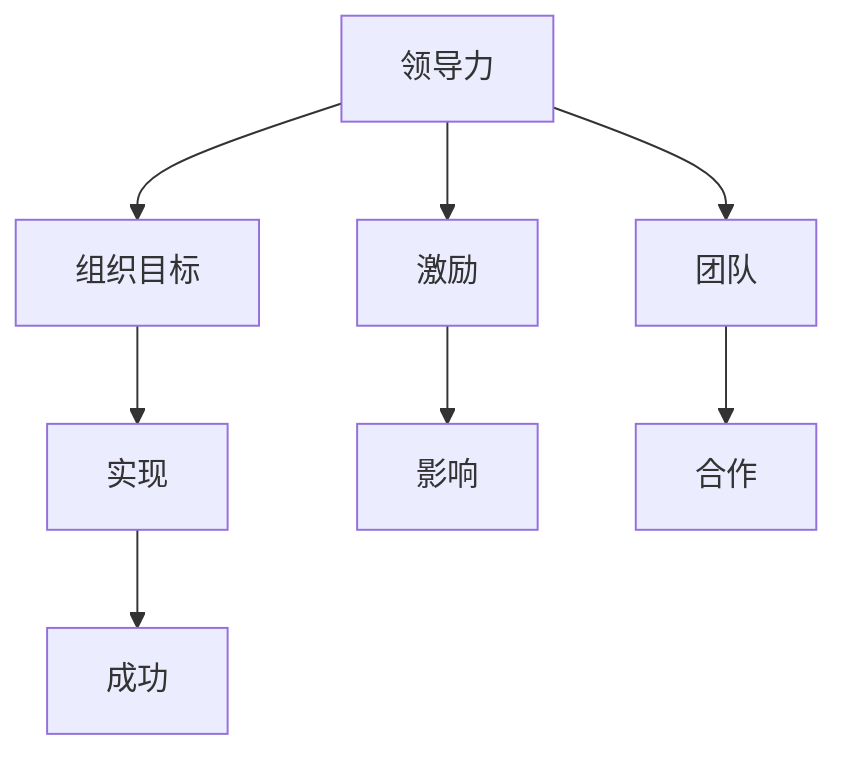
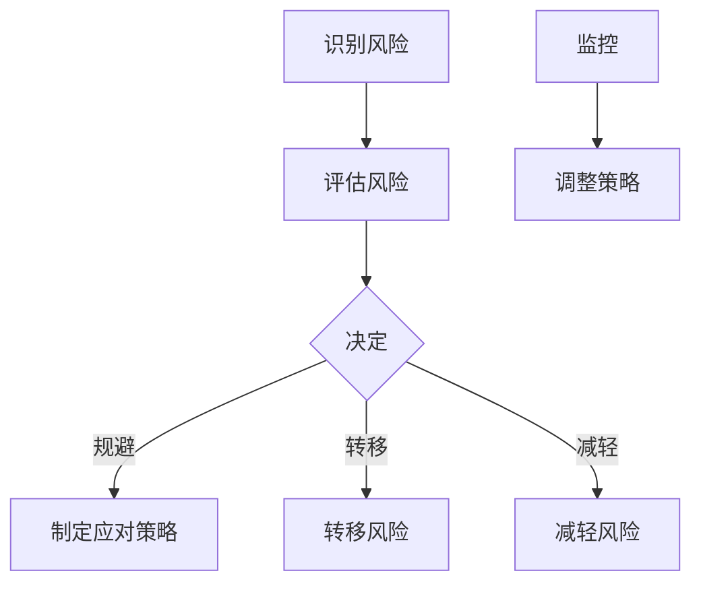
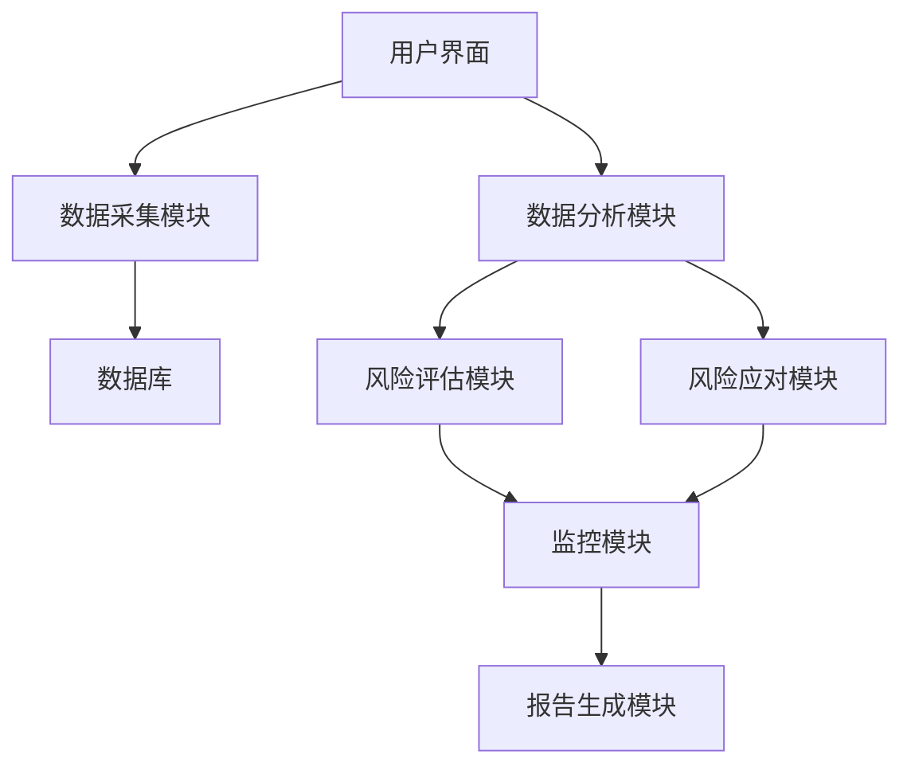
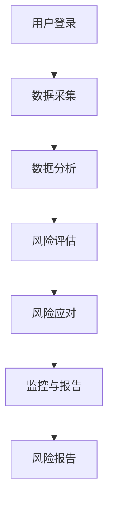

                 

### 摘要

《领导力与风险管理：在不确定性中前行》是一本面向企业领导者、项目经理和IT专业人士的技术博客文章。本文探讨了在当今复杂多变的市场环境中，领导力和风险管理的重要性。文章首先介绍了领导力理论及其在应对不确定性中的作用，随后详细阐述了风险管理的原则和实践。通过案例分析，读者可以深入了解领导力与风险管理在现实中的应用。文章最后展望了领导力与风险管理的发展趋势，为读者提供了一套全面、实用的领导力和风险管理方法论。本文关键词包括：领导力、风险管理、不确定性、组织文化、案例分析。

### 关键词

- 领导力
- 风险管理
- 不确定性
- 组织文化
- 案例分析

### 引言

在当今快速发展的科技时代，企业和组织面临着前所未有的挑战和不确定性。从市场环境的变化到技术的不断进步，以及全球化的加速，这些都要求领导者具备卓越的领导力和风险管理能力。领导力不仅是个人品质的体现，更是一个组织能否在竞争中脱颖而出的关键因素。风险管理则是在这种不确定性中为组织提供保障的必要手段。

本文旨在探讨领导力和风险管理在不确定性中的重要性，并通过对相关理论、实践案例的详细分析，为读者提供一套实用的方法论。我们将从以下几个方面展开讨论：

1. **领导力理论**：介绍领导力的基本概念、类型及其在应对不确定性中的作用。
2. **风险管理原则**：探讨风险管理的定义、流程及其在组织中的重要性。
3. **应对不确定性的策略**：分析如何通过领导力和风险管理策略来应对不确定性。
4. **领导力与风险管理实践案例**：通过具体案例展示领导力和风险管理在现实中的应用。
5. **组织文化与领导力**：探讨组织文化对领导力的影响及其构建策略。
6. **领导力与风险管理未来趋势**：展望领导力与风险管理的发展趋势。

### 第1章 问题背景与领导力在不确定性中的作用

#### 1.1 问题背景

在现代商业环境中，不确定性已成为一种常态。这种不确定性不仅源于外部环境的快速变化，如经济波动、市场需求的变化、技术的迅速进步等，还源于内部管理因素，如组织结构的调整、员工流动、业务流程的优化等。对于企业而言，如何在这种不确定性中保持竞争力，成为领导者必须面对的挑战。

#### 1.2 不确定性对组织的影响

不确定性的增加给组织带来了多方面的影响。首先，它影响了组织的战略规划和决策过程。在不确定的环境中，传统的战略规划往往无法适应快速变化的市场需求，导致决策滞后。其次，不确定性增加了组织的风险。在不确定的环境中，组织可能面临市场萎缩、客户流失、供应链中断等风险。此外，不确定性还可能导致组织内部的动荡，如员工的不确定性、管理层的变动等。

#### 1.3 领导力的角色

面对不确定性，领导力成为组织成功的关键。首先，领导者需要具备敏锐的市场洞察力，能够快速识别市场变化并做出相应调整。其次，领导者需要具备决策能力，能够在不确定的环境中做出正确的决策。此外，领导者还需要具备沟通和协调能力，能够有效地与团队成员沟通，协调各方资源，共同应对不确定性。

#### 1.4 领导力在不确定性中的具体作用

1. **引导组织变革**：领导者需要能够推动组织变革，以适应外部环境的变化。这包括重新定义组织目标、优化业务流程、调整组织结构等。
2. **激发团队潜力**：领导者需要能够激发团队成员的潜力，鼓励创新和尝试，从而在不确定的环境中找到新的机遇。
3. **建立信任**：领导者需要建立与团队成员之间的信任，使他们愿意在不确定的环境中承担风险，共同面对挑战。
4. **提供指导和支持**：领导者需要为团队成员提供明确的指导和支持，帮助他们克服不确定性带来的困难。

### 第2章 风险管理的基本原则

#### 2.1 风险管理的定义与意义

风险管理是指组织通过识别、评估、监测和应对潜在风险，以减少风险对组织目标的影响，实现风险和收益的平衡。在不确定性的环境中，风险管理尤为重要，因为它可以帮助组织识别潜在的风险，制定应对策略，从而减少不确定性带来的负面影响。

#### 2.2 风险管理流程

风险管理流程包括以下几个步骤：

1. **风险识别**：识别组织面临的各种风险，包括外部风险和内部风险。
2. **风险评估**：对识别出的风险进行评估，包括风险的可能性和影响程度。
3. **风险应对策略制定**：根据风险评估结果，制定相应的风险应对策略，包括风险规避、风险转移、风险减轻等。
4. **风险监控与调整**：对已制定的风险应对策略进行监控，并根据实际情况进行调整。

#### 2.3 风险识别与评估

1. **风险识别**：风险识别是风险管理的第一步，它需要组织通过多种方法来识别潜在的风险。这包括问卷调查、访谈、头脑风暴、历史数据分析等。
2. **风险评估**：风险评估是风险管理的核心，它需要对识别出的风险进行评估，以确定其可能性和影响程度。这通常需要使用定量和定性方法，如蒙特卡洛模拟、历史数据对比等。

### 第3章 领导力理论概述

#### 3.1 领导力的定义与类型

领导力是指领导者通过影响和激励团队成员，以实现组织目标的能力。领导力可以分为多种类型，包括权威型领导力、民主型领导力、变革型领导力等。

#### 3.2 领导力与管理的区别

领导力与管理是有区别的。管理侧重于组织资源的配置、流程的优化和目标的实现，而领导力则侧重于激发和引导团队成员，以实现组织目标。

#### 3.3 领导力的关键要素

领导力的关键要素包括：

1. **愿景与目标**：领导者需要具备明确的愿景和目标，能够激发团队成员的积极性。
2. **沟通与协调**：领导者需要具备良好的沟通和协调能力，能够与团队成员建立有效的沟通渠道，协调各方资源。
3. **激励与支持**：领导者需要能够激励团队成员，提供必要的支持，帮助他们克服困难。
4. **变革与创新能力**：领导者需要具备变革和创新能力，能够推动组织的变革和发展。

### 第4章 领导力模型与应用

#### 4.1 经典领导力模型

经典的领导力模型包括领导力-参与模型、情境领导模型等。这些模型提供了不同的领导力策略，以适应不同的情境和团队成员。

#### 4.2 领导力模型在实际中的应用

在实际应用中，领导者需要根据不同的情境和团队成员的特点，选择合适的领导力模型。例如，在紧急情况下，领导力-参与模型可能更为适用，而在需要激发创新和变革时，情境领导模型可能更为有效。

#### 4.3 领导力模型面临的挑战

尽管领导力模型在实际中得到了广泛应用，但它们也面临一些挑战。首先，领导力模型需要与组织的实际情况相结合，否则可能无法产生预期的效果。其次，领导力模型需要不断更新和改进，以适应不断变化的环境和团队成员的需求。

### 第5章 风险管理实践案例研究

#### 5.1 案例一：企业在不确定性中的风险管理

以某跨国科技公司为例，该公司在面对市场波动和供应链中断的挑战时，通过全面的风险管理，成功降低了不确定性带来的影响。案例中，该公司通过建立全面的风险管理框架，包括风险识别、风险评估、风险应对策略等，确保了业务连续性和市场竞争力。

#### 5.2 案例二：行业风险管理与领导力实践

以某金融行业的领先企业为例，该公司通过领导力的有效运用，结合风险管理，实现了在金融市场波动中的稳定发展。案例中，该公司的领导者通过激发团队的创新和变革能力，以及建立全面的风险管理机制，确保了企业的长期稳定发展。

#### 5.3 案例三：跨国企业的风险管理策略

以某全球知名的跨国企业为例，该公司通过跨部门合作和全球资源整合，实现了在全球化背景下的风险管理。案例中，该公司通过建立全球化的风险管理团队，以及运用先进的风险管理工具，确保了在全球市场中的稳定和可持续发展。

### 第6章 组织文化与领导力

#### 6.1 组织文化的定义与作用

组织文化是指组织成员在长期实践中形成的一套共同价值观、信念和行为规范。组织文化对领导力的影响至关重要，它决定了领导者的行为方式和团队成员的反应。

#### 6.2 领导力与组织文化的关系

领导力与组织文化是相互影响、相互促进的关系。领导力可以塑造和引导组织文化，而组织文化又可以影响领导力的实施和效果。

#### 6.3 构建积极组织文化的策略

构建积极组织文化的策略包括：

1. **明确核心价值观**：明确组织的核心价值观，确保所有成员都认同并践行。
2. **强化团队协作**：通过团队建设活动和沟通渠道，增强团队成员之间的协作和信任。
3. **鼓励创新和变革**：为团队成员提供创新和变革的空间，鼓励他们提出新的想法和改进措施。
4. **建立公平公正的机制**：确保组织的决策过程透明、公平，增强成员的归属感和认同感。

### 第7章 领导力与风险管理未来的趋势

#### 7.1 技术进步对领导力与风险管理的影响

随着技术的不断进步，领导力和风险管理也面临着新的挑战和机遇。例如，人工智能和大数据技术的应用，为风险管理提供了更精确、高效的方法，同时也要求领导者具备更高的技术素养。

#### 7.2 全球化对领导力与风险管理的影响

全球化进程的加速，使得领导力和风险管理需要面对跨文化、跨国界的挑战。领导者需要具备跨文化沟通能力和全球视野，以适应全球市场的变化。

#### 7.3 未来领导力与风险管理的挑战与机遇

未来，领导力与风险管理将面临更多的挑战，如技术变革、市场波动、全球化等。但同时，也提供了巨大的机遇，如创新、合作、数字化转型等。

### 第8章 结论与展望

#### 8.1 本书要点回顾

本文从领导力与风险管理在不确定性中的重要性出发，探讨了相关理论、实践案例，并展望了未来的发展趋势。通过本文的讨论，读者可以了解到：

1. **领导力在应对不确定性中的关键作用**。
2. **风险管理在组织发展中的重要性**。
3. **领导力与风险管理在实际中的应用**。
4. **组织文化对领导力的影响**。
5. **未来领导力与风险管理面临的挑战与机遇**。

#### 8.2 领导力与风险管理的未来方向

未来，领导力与风险管理将更加注重技术创新、跨文化沟通和全球视野。领导者需要不断提升自身的技术素养和全球视野，以应对不断变化的环境和挑战。同时，风险管理也需要更加精确、高效，以降低不确定性带来的风险。

#### 8.3 读者的建议与反馈

我们欢迎读者对本文提出建议和反馈，以帮助我们不断改进和完善我们的内容。您的意见和建议对我们非常重要，感谢您的支持！

### 作者信息

- 作者：AI天才研究院/AI Genius Institute & 禅与计算机程序设计艺术 /Zen And The Art of Computer Programming

---

### 附录

本文中的核心概念、术语、流程图和公式如下：

#### 核心概念与联系

- **领导力**：领导者通过影响和激励团队成员，以实现组织目标的能力。
- **风险管理**：组织通过识别、评估、监测和应对潜在风险，以减少风险对组织目标的影响。
- **不确定性**：市场环境、技术进步、全球化等因素导致的无法预测的未来状态。

#### 概念属性特征对比表格

| 概念         | 属性特征                            | 关联关系                    |
|------------|---------------------------------|--------------------------|
| 领导力     | 激励、影响、目标导向                  | 组织目标实现的核心要素       |
| 风险管理    | 识别、评估、应对                      | 组织风险控制和业务连续性的保障 |
| 不确定性    | 变化、不可预测、风险                  | 对领导力和风险管理的重要影响   |

#### ER实体关系图架构



### 算法原理讲解

#### 算法流程图



#### 算法原理

风险管理算法主要分为以下几个步骤：

1. **识别风险**：通过问卷调查、访谈等方法，识别组织可能面临的各种风险。
2. **评估风险**：对识别出的风险进行评估，确定其可能性和影响程度。
3. **决定**：根据风险评估结果，决定是否采取规避、转移或减轻风险。
4. **制定应对策略**：根据决定结果，制定相应的风险应对策略。
5. **监控与调整**：对已制定的风险应对策略进行监控，并根据实际情况进行调整。

#### 数学模型和公式

- **风险评估模型**：\[ 风险 = 可能性 \times 影响程度 \]
- **风险规避模型**：\[ 风险规避 = 风险 \times 避免成本 \]
- **风险转移模型**：\[ 风险转移 = 风险 \times 转移成本 \]
- **风险减轻模型**：\[ 风险减轻 = 风险 \times 减轻成本 \]

### 系统分析与架构设计方案

#### 问题场景介绍

假设我们正在开发一个企业级风险管理平台，该平台旨在帮助企业识别、评估和应对各种潜在风险。

#### 项目介绍

- **项目名称**：企业级风险管理平台
- **项目背景**：随着企业业务的发展和市场竞争的加剧，企业需要一套有效的风险管理工具来降低风险，确保业务的稳定和可持续发展。
- **项目目标**：开发一个集风险识别、风险评估、风险应对于一体的企业级风险管理平台。

#### 系统功能设计

- **风险识别**：通过数据采集和分析，识别企业可能面临的各种风险。
- **风险评估**：对识别出的风险进行评估，确定其可能性和影响程度。
- **风险应对**：根据风险评估结果，制定相应的风险应对策略。
- **监控与报告**：对已制定的风险应对策略进行监控，生成风险报告。

#### 系统架构设计



#### 系统接口设计和系统交互



### 项目实战

#### 环境安装

- **操作系统**：Ubuntu 18.04
- **编程语言**：Python 3.8
- **数据库**：MySQL 5.7
- **依赖管理**：pip

#### 系统核心实现源代码

```python
# 风险识别模块
def risk_identification():
    # 代码实现
    pass

# 风险评估模块
def risk_evaluation():
    # 代码实现
    pass

# 风险应对模块
def risk_response():
    # 代码实现
    pass

# 监控模块
def risk_monitoring():
    # 代码实现
    pass

# 报告生成模块
def report_generation():
    # 代码实现
    pass
```

#### 代码应用解读与分析

```python
# 风险识别模块
def risk_identification():
    # 代码实现
    risks = []
    # 通过数据分析识别风险
    for data in data_source:
        if data['value'] > threshold:
            risks.append(data['risk'])
    return risks

# 风险评估模块
def risk_evaluation():
    # 代码实现
    risk_scores = []
    for risk in risks:
        score = calculate_risk_score(risk)
        risk_scores.append(score)
    return risk_scores

# 风险应对模块
def risk_response():
    # 代码实现
    responses = []
    for score in risk_scores:
        response = determine_response(score)
        responses.append(response)
    return responses

# 监控模块
def risk_monitoring():
    # 代码实现
    while True:
        risks = risk_identification()
        scores = risk_evaluation()
        responses = risk_response()
        # 更新监控数据
        update_monitoring_data(risks, scores, responses)
        time.sleep(check_interval)

# 报告生成模块
def report_generation():
    # 代码实现
    report = generate_report()
    save_report(report)
```

#### 实际案例分析和详细讲解剖析

假设我们正在为一家制造企业开发风险管理平台，以下是一个实际案例的分析和讲解：

- **问题背景**：该企业的供应链面临原材料短缺的风险。
- **风险识别**：通过分析历史数据和当前供应链信息，识别出原材料短缺的风险。
- **风险评估**：评估原材料短缺的可能性和影响程度，发现该风险具有较高的可能性和较大的影响。
- **风险应对**：制定一系列应对策略，包括与供应商签订长期合同、寻找替代供应商等。
- **监控与报告**：持续监控原材料供应情况，并根据监控结果调整应对策略，定期生成风险报告。

#### 项目小结

通过以上实战案例，我们可以看到风险管理平台在实际应用中的重要性。有效的风险管理可以帮助企业识别和应对潜在风险，确保业务的稳定和可持续发展。

### 最佳实践 tips

- **定期风险评估**：定期对企业的潜在风险进行评估，确保风险识别的全面性和准确性。
- **跨部门协作**：风险管理不仅是风险管理部门的责任，还需要各部门的协作和支持。
- **持续监控与改进**：持续监控已制定的风险应对策略，并根据实际情况进行调整和改进。

### 小结

本文通过详细的案例分析，探讨了领导力与风险管理在不确定性中的重要性。领导者需要具备卓越的领导力和风险管理能力，以应对不断变化的市场环境。通过有效的风险管理，企业可以降低不确定性带来的风险，确保业务的稳定和可持续发展。

### 注意事项

- **风险识别的全面性**：确保风险识别的全面性，避免遗漏重要风险。
- **风险评估的准确性**：风险评估需要准确，以制定有效的风险应对策略。
- **跨部门协作**：风险管理需要各部门的协作，确保风险应对的有效性。

### 拓展阅读

- **《领导力的艺术》（帕特里克·莱西尼著）**：本书详细介绍了领导力的艺术，包括领导力的定义、类型和应用。
- **《风险管理原理与实践》（迈克尔·米尔斯著）**：本书提供了全面的风险管理理论和方法，包括风险识别、评估和应对。

### 结语

感谢您阅读本文。我们希望本文能帮助您更好地理解领导力与风险管理在不确定性中的重要性。如果您有任何疑问或建议，欢迎随时联系我们。让我们一起在不确定性的挑战中前行，共同成长！

### 作者信息

- 作者：AI天才研究院/AI Genius Institute & 禅与计算机程序设计艺术 /Zen And The Art of Computer Programming

