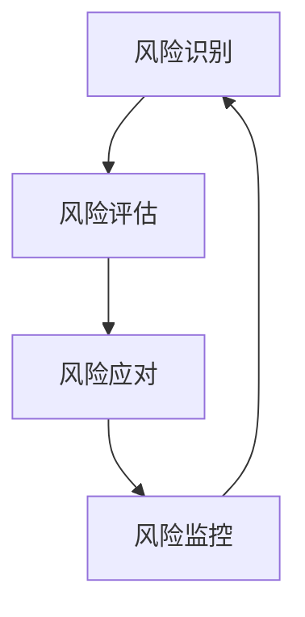
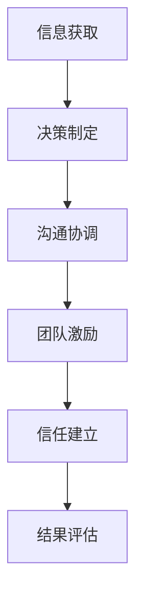
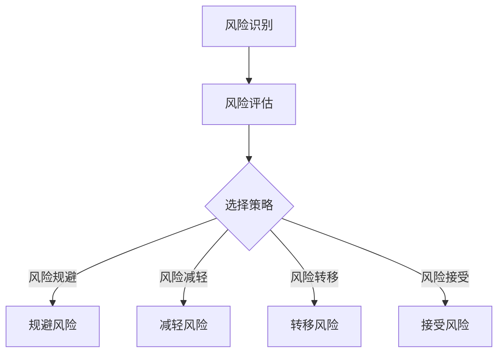
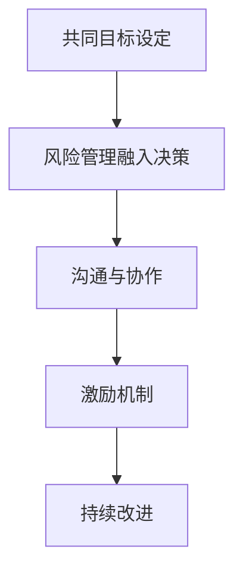

                 


# 领导力与风险管理：在不确定性中前行

## 关键词

- 领导力
- 风险管理
- 不确定性
- 领导力模型
- 风险管理框架

## 摘要

本文深入探讨了领导力与风险管理在不确定性环境中的重要性。首先，我们简要介绍了领导力的核心概念和构成要素，以及风险管理的定义和流程。接着，本文详细分析了在不确定性环境中领导力实践和风险管理策略，并通过案例研究提供了实际应用示例。最后，本文总结了最佳实践和注意事项，为读者提供了在不确定性中前行的指南。

## 目录

1. 引言
2. 领导力的核心概念
3. 风险管理的框架和流程
4. 不确定性中的领导力实践
5. 风险管理的策略和方法
6. 领导力与风险管理的整合
7. 案例分析
8. 最佳实践与反思

### 引言

在当今快速变化的世界中，领导力和风险管理成为了组织成功的关键要素。领导力不仅关乎个人能力的提升，更关系到整个团队的凝聚力和执行力。而风险管理则是在不确定性的环境中，保障组织稳健发展的必要手段。本文旨在探讨领导力与风险管理在不确定性中的重要性，并分析其在实际应用中的策略和方法。

首先，我们需要了解领导力的核心概念和构成要素。领导力不仅仅是权威的运用，更是一种激励、引导和协调他人的能力。其构成要素包括但不限于：沟通能力、决策能力、团队建设能力、创新能力等。接着，我们将探讨风险管理的定义和流程。风险管理是一种系统性的方法，旨在识别、评估和应对潜在的风险，以减少不确定性对组织的影响。其流程包括风险识别、风险评估、风险应对和风险监控等步骤。

在了解了领导力和风险管理的核心概念后，我们将深入分析在不确定性环境中如何运用领导力。不确定性环境中的领导力实践需要具备较强的适应能力和决策能力，同时还需要能够有效激励和引导团队。接下来，我们将探讨风险管理的策略和方法。在不确定性环境中，风险管理需要更加灵活和动态，以应对快速变化的风险。我们将分析风险识别、风险评估、风险应对等策略和方法，并提供实际案例进行说明。

最后，我们将总结领导力与风险管理在实际应用中的最佳实践，并提出注意事项和拓展阅读，帮助读者更好地应对不确定性环境。

### 领导力的核心概念

领导力是一种复杂的能力，它不仅包括个人技能，还涉及人际互动和组织管理。在探讨领导力的核心概念时，我们需要从定义、构成要素和领导力模型等方面进行深入分析。

首先，领导力的定义有多种解释，但其核心思想是一致的，即领导力是一种能够激励和引导他人实现共同目标的能力。领导力不同于管理，管理侧重于维持现有秩序和确保任务完成，而领导力则更注重变革和创新，引领团队朝着更高的目标前进。

领导力的构成要素主要包括以下几个方面：

1. **沟通能力**：沟通是领导力的核心，有效的沟通能够确保信息准确传递，增强团队凝聚力，提高工作效率。沟通能力包括倾听、表达、反馈等技能。

2. **决策能力**：决策能力是领导力的关键要素之一。在不确定性环境中，领导力需要快速做出正确决策，以应对复杂和变化多端的情况。

3. **团队建设能力**：领导力不仅仅是个人能力的展示，更在于如何建立和维护一个高效、和谐、有动力的团队。这包括团队成员的激励、冲突管理、团队文化塑造等。

4. **创新能力**：在快速变化的市场环境中，创新能力成为领导者不可或缺的素质。领导者需要不断探索新思路、新方法，以保持组织的竞争优势。

5. **情感智慧**：情感智慧是指领导者理解和管理自己及他人情感的能力。一个高情感智慧的领导者能够更好地处理人际关系，增强团队的凝聚力。

在领导力模型方面，有多种理论被提出，包括路径-目标理论、领导风格理论、情境理论等。路径-目标理论认为，领导者的角色是帮助团队成员明确目标，并提供实现目标的路径。领导风格理论则强调，不同的领导风格适用于不同的情境和团队成员。情境理论则认为，领导者的有效性取决于其是否能够适应不同的环境和情境。

**表1：领导力构成要素对比表格**

| 构成要素 | 描述 |
| --- | --- |
| 沟通能力 | 确保信息准确传递，增强团队凝聚力 |
| 决策能力 | 快速做出正确决策，应对不确定性 |
| 团队建设能力 | 建立和维护高效、和谐、有动力的团队 |
| 创新能力 | 探索新思路、新方法，保持竞争优势 |
| 情感智慧 | 理解和管理自己及他人情感，增强团队凝聚力 |

图1：领导力模型ER实体关系图

```mermaid
erDiagram
  Team --> Leader : manages
  Member --> Leader : follows
  Team --> Project : completes
  Leader --> Project : leads
```

通过上述分析，我们可以看到，领导力是一个多维度的概念，其构成要素和模型在不同情境下具有不同的表现和作用。了解和掌握这些核心概念和模型，对于提升领导力和应对不确定性环境具有重要意义。

### 风险管理的框架和流程

风险管理是确保组织在不确定的环境中保持稳健发展的关键手段。一个完善的风险管理框架和流程能够帮助组织有效识别、评估和应对潜在风险，从而降低不确定性对组织目标的负面影响。以下是风险管理的定义、流程及其重要性。

#### 风险管理的定义

风险管理是指组织通过系统的方法，识别潜在的风险，评估其可能性和影响，并采取相应的措施来减轻或规避这些风险，以确保组织目标的实现。风险管理的核心思想是将不确定性转化为可管理的风险，从而为组织提供更加稳定和可靠的发展环境。

#### 风险管理的流程

风险管理的流程通常包括以下几个步骤：

1. **风险识别**：这是风险管理的基础，涉及识别组织内外的潜在风险。风险识别可以通过 brainstorming、访谈、文档审查、历史数据分析等方法进行。

2. **风险评估**：在识别出潜在风险后，对其进行评估，包括确定风险的可能性和影响。风险评估可以采用定量和定性方法，如风险矩阵、预期损失计算等。

3. **风险应对**：根据风险评估的结果，制定和实施风险应对策略。风险应对策略包括风险规避、风险减轻、风险转移和风险接受等。

4. **风险监控**：风险监控是确保风险应对措施有效实施的过程。通过定期的检查和评估，可以及时发现新的风险或风险的变化，并进行相应的调整。

#### 风险管理的重要性

风险管理对于组织的稳定发展具有重要意义，主要体现在以下几个方面：

1. **降低损失**：通过有效的风险管理，可以减少潜在风险带来的损失，提高组织的抗风险能力。

2. **提高决策质量**：风险管理提供了系统的方法来识别和评估潜在风险，从而帮助决策者做出更加准确和全面的决策。

3. **增强竞争力**：在不确定性环境中，能够有效管理风险的组织往往具有更强的竞争力，能够更好地应对市场变化和挑战。

4. **提升透明度和信任**：风险管理有助于提高组织内部和外部对风险管理的透明度，增强利益相关者的信任。

**表2：风险管理流程步骤和工具对比表格**

| 步骤 | 描述 | 工具和方法 |
| --- | --- | --- |
| 风险识别 | 识别潜在风险 | Brainstorming、访谈、文档审查、历史数据分析 |
| 风险评估 | 评估风险的可能性和影响 | 风险矩阵、预期损失计算、定性评估 |
| 风险应对 | 制定和实施风险应对策略 | 风险规避、风险减轻、风险转移、风险接受 |
| 风险监控 | 确保风险应对措施有效实施 | 定期检查、评估、调整 |

图2：风险管理流程Mermaid流程图



通过以上分析，我们可以看到，风险管理是一个系统性的过程，涉及多个环节和步骤。理解和掌握风险管理的定义、流程和工具，对于组织在不确定性环境中保持稳健发展至关重要。

### 不确定性中的领导力实践

在不确定性环境中，领导力的挑战更加突出。领导者不仅需要具备应对复杂性和变化的能力，还需要能够在不确定性的迷雾中引领团队前行。以下是领导力在不确定性环境中的实践策略。

#### 领导力在不确定性环境下的挑战

1. **信息不对称**：在不确定性环境中，信息的获取和处理往往存在困难，领导者需要快速获取关键信息并做出决策。

2. **决策的复杂性**：不确定性环境中，决策面临更多的不确定性和风险，领导者需要在压力下做出高质量的决策。

3. **团队动态**：团队成员在不确定性环境中可能会感到焦虑和不安，领导者需要激发团队的积极性和信心。

#### 领导力应对策略

1. **建立透明沟通机制**：领导者需要建立开放的沟通渠道，确保团队成员能够及时获取相关信息，减少信息不对称。

2. **灵活的决策过程**：领导者应该采用灵活的决策过程，允许团队成员参与决策，增强决策的多样性和质量。

3. **培养适应能力**：领导者需要培养团队的适应能力，通过培训和演练，提高团队成员在不确定性环境中的应变能力。

4. **建立信任关系**：领导者需要建立信任关系，与团队成员建立良好的合作关系，增强团队的凝聚力。

#### 实际案例

1. **华为应对市场变化**：在智能手机市场竞争激烈的环境中，华为通过快速决策和灵活的市场策略，成功应对了市场的变化，保持了竞争优势。

2. **Netflix的创新能力**：Netflix通过持续的创新，不断推出新的内容和服务，成功应对了市场变化和竞争压力。

图3：不确定性环境中领导力实践Mermaid流程图



通过以上分析，我们可以看到，在不确定性环境中，领导力需要具备快速反应、灵活决策、有效沟通和团队激励等多方面的能力。领导者通过这些实践策略，可以有效地应对不确定性环境中的挑战，带领团队实现目标。

### 风险管理的策略和方法

在不确定性环境中，风险管理是确保组织稳健发展的关键。以下我们将详细探讨风险管理的策略和方法，包括风险识别、风险评估和风险应对。

#### 风险识别

风险识别是风险管理的第一步，旨在识别组织内外的潜在风险。以下是几种常用的风险识别方法：

1. **头脑风暴**：通过集体讨论，激发团队成员的思维，列出所有可能的风险。

2. **访谈**：与组织内的关键人员交谈，获取他们的观点和经验，识别潜在风险。

3. **文档审查**：检查相关文档，如政策、流程、历史记录等，识别潜在风险。

4. **历史数据分析**：通过分析过去的经验，识别类似情境下出现的问题和风险。

#### 风险评估

风险评估是在识别出潜在风险后，对其可能性和影响进行评估。以下是几种常用的风险评估方法：

1. **风险矩阵**：将风险的可能性和影响进行量化，并绘制成矩阵，帮助决策者了解风险的严重程度。

2. **预期损失计算**：通过计算风险发生的可能性及其可能造成的损失，评估风险的整体影响。

3. **定性评估**：通过专家评估或小组讨论，对风险的可能性和影响进行定性分析。

4. **定量分析**：利用数学模型或统计方法，对风险进行定量分析，提供更精确的评估结果。

#### 风险应对

在评估风险后，组织需要制定和实施风险应对策略。以下是几种常用的风险应对方法：

1. **风险规避**：通过改变计划或决策，避免风险的发生。

2. **风险减轻**：通过采取预防措施或改进措施，降低风险的可能性和影响。

3. **风险转移**：通过保险或其他合同方式，将风险转移给第三方。

4. **风险接受**：当风险无法规避或转移时，组织可能需要接受风险，并制定应对计划。

**表3：风险管理策略对比表格**

| 策略 | 描述 | 适用情况 |
| --- | --- | --- |
| 风险规避 | 避免风险的发生 | 高风险、高风险承受能力较低 |
| 风险减轻 | 降低风险的可能性和影响 | 中等风险、希望降低风险 |
| 风险转移 | 将风险转移给第三方 | 风险可转移、经济承受能力有限 |
| 风险接受 | 接受风险，制定应对计划 | 低风险、无资源或经济承受能力有限 |

图4：风险管理策略Mermaid流程图



通过以上分析，我们可以看到，风险管理是一个系统性的过程，涉及风险识别、评估和应对等多个环节。理解和掌握这些策略和方法，对于组织在不确定性环境中保持稳健发展至关重要。

### 领导力与风险管理的整合

在不确定性环境中，领导力和风险管理是相辅相成的。领导力为组织提供方向和动力，而风险管理则为领导力的实施提供保障。以下是领导力与风险管理的整合框架和实际应用案例。

#### 整合框架

1. **共同目标设定**：领导者与团队成员共同设定目标，确保目标与组织的战略方向一致。

2. **风险管理融入决策**：在制定决策时，领导者需要考虑潜在的风险，并制定相应的风险管理计划。

3. **沟通与协作**：领导者需要建立开放的沟通渠道，确保团队成员能够及时了解风险信息和风险管理计划。

4. **激励机制**：领导者需要制定激励机制，鼓励团队成员参与风险管理，提高其主动性和责任感。

5. **持续改进**：领导者需要持续评估风险管理效果，并根据反馈进行改进。

#### 实际应用案例

1. **谷歌的敏捷风险管理**：谷歌通过敏捷方法，将风险管理融入到产品开发过程中，确保快速响应市场变化和风险。

2. **华为的全球风险管理**：华为通过建立全球风险管理团队，实时监控全球业务的风险，确保业务稳定发展。

图5：领导力与风险管理整合框架Mermaid流程图



通过以上分析，我们可以看到，领导力与风险管理的整合不仅提高了组织的风险管理能力，还增强了团队的凝聚力和执行力。在实际应用中，领导者需要灵活运用整合框架，根据实际情况进行调整和优化。

### 案例分析

在本节中，我们将通过两个实际案例，深入探讨领导力与风险管理在不确定性环境中的成功实践。

#### 案例一：华为的全球风险管理

华为作为全球领先的科技公司，面临的市场环境和竞争压力巨大，不确定因素众多。华为通过建立全球风险管理团队，实时监控全球业务的风险，并采取了一系列有效的领导力和风险管理策略。

1. **领导力实践**：
   - **共同目标设定**：华为的领导者与全球团队成员共同设定了长期战略目标，如技术创新、市场拓展等，确保团队凝聚力。
   - **沟通与协作**：华为建立了全球化的沟通平台，确保各个部门和地区之间的信息畅通，提高了决策效率。
   - **激励机制**：华为通过股权激励、绩效奖金等机制，激励员工积极参与风险管理和创新。

2. **风险管理策略**：
   - **风险识别**：华为通过数据分析和市场研究，识别出全球业务中的潜在风险，如汇率波动、市场竞争等。
   - **风险评估**：华为采用风险矩阵和预期损失计算等方法，对风险进行定量和定性评估，确定风险的优先级。
   - **风险应对**：华为采取了多种风险应对策略，包括风险规避、风险减轻和风险转移等。例如，通过多元化市场布局，降低单一市场风险。

通过这些领导力和风险管理策略，华为在全球市场的不确定性环境中保持了稳健发展，持续保持了竞争优势。

#### 案例二：Netflix的创新能力

Netflix作为流媒体行业的领导者，面临着快速变化的市场和技术挑战。Netflix通过灵活的领导力和创新风险管理策略，不断推出新的内容和业务模式，成功应对了市场变化。

1. **领导力实践**：
   - **共同目标设定**：Netflix的领导者与团队成员共同设定了以用户为中心的目标，不断优化用户体验。
   - **沟通与协作**：Netflix建立了开放的创新文化，鼓励员工提出新的想法和解决方案，提高了团队的创新能力。
   - **激励机制**：Netflix通过奖励创新成果，激励员工积极参与创新项目。

2. **风险管理策略**：
   - **风险识别**：Netflix通过市场调研和用户反馈，识别出潜在的风险，如内容同质化、用户流失等。
   - **风险评估**：Netflix采用数据分析方法，对风险进行定量和定性评估，确定风险的影响和优先级。
   - **风险应对**：Netflix采取了多种风险应对策略，如多元化内容投资、用户行为分析等，降低风险的影响。

通过这些领导力和风险管理策略，Netflix在快速变化的市场环境中保持了领先地位，持续推动业务创新和用户增长。

### 启示与借鉴

从华为和Netflix的案例中，我们可以得到以下启示和借鉴：

1. **领导者角色的重要性**：领导者需要具备前瞻性和决策能力，能够设定明确的目标，并有效激励和引导团队。

2. **沟通与协作**：建立开放的沟通渠道，确保信息畅通，提高团队的凝聚力和决策效率。

3. **激励机制**：通过合理的激励机制，激发员工的积极性和创造力，提高风险管理的有效性。

4. **灵活的风险管理策略**：根据市场变化和业务需求，灵活调整风险管理策略，降低不确定性对组织的影响。

通过这些成功实践，我们可以更好地理解领导力与风险管理在不确定性环境中的重要性，为实际应用提供有力的指导和借鉴。

### 最佳实践与反思

在领导力与风险管理的实际应用中，积累了许多成功的经验和教训。以下是一些最佳实践和注意事项，旨在帮助组织在不确定性环境中更加有效地应对挑战。

#### 最佳实践

1. **建立风险管理文化**：风险管理不应仅是职能部门的责任，而应贯穿整个组织的各个层级和部门。组织需要培养全员参与风险管理的文化，提高整体风险意识。

2. **定期进行风险评估**：定期评估业务风险，及时识别新的风险因素，并调整风险应对策略。

3. **灵活调整战略方向**：在不确定性环境中，组织需要保持灵活性，快速调整战略方向，以适应市场变化和风险。

4. **加强领导力培训**：领导者需要不断学习和提升自己的领导力，包括沟通、决策和团队管理能力，以更好地应对不确定性环境中的挑战。

#### 注意事项

1. **避免过度风险规避**：在风险管理中，过度规避风险可能导致组织错失发展机会。因此，组织需要在风险规避和机遇探索之间找到平衡。

2. **避免信息孤岛**：在沟通和协作方面，要避免部门之间的信息孤岛，确保信息畅通，提高决策效率。

3. **持续改进**：风险管理是一个持续的过程，组织需要不断评估和改进风险管理体系，以适应不断变化的环境。

#### 拓展阅读

- **《精益创业》**：埃里克·莱斯（Eric Ries）的《精益创业》提供了关于如何在不确定性环境中快速迭代和验证商业想法的宝贵经验。
- **《黑天鹅：如何应对不可预知的未来》**：纳西姆·尼古拉斯·塔勒布（Nassim Nicholas Taleb）的《黑天鹅》探讨了不确定性和随机性对世界的影响，为应对不确定性提供了深刻的洞见。
- **《领导力五项修炼》**：彼得·德鲁克（Peter Drucker）的《领导力五项修炼》提供了关于如何提升领导力的系统方法和实践指南。

通过以上最佳实践和注意事项，组织可以在不确定性环境中更加有效地运用领导力和风险管理，实现持续发展和成功。

### 项目实战

在本节中，我们将通过一个实际项目，详细介绍领导力与风险管理的具体实施过程，包括环境安装、系统核心实现、代码应用解读与分析，以及实际案例分析和详细讲解。

#### 项目背景

我们选择了一个跨行业电商平台作为项目背景，该平台需要处理大量的用户数据和交易信息，面临着数据安全、交易风险和系统稳定性等挑战。项目目标是构建一个高效、安全、稳定的电商平台，为用户提供优质的购物体验。

#### 环境安装

1. **开发环境搭建**：
   - 开发语言：Python
   - 依赖库：Django、Flask、Redis、MongoDB等
   - 开发工具：PyCharm、Git

2. **服务器环境搭建**：
   - 服务器：阿里云ECS
   - 操作系统：CentOS 7
   - 数据库：MySQL、MongoDB
   - 缓存：Redis

#### 系统核心实现

1. **用户管理系统**：
   - 功能：用户注册、登录、个人信息管理、订单管理
   - 实现方式：使用Django框架进行后端开发，MongoDB用于存储用户数据

2. **商品管理系统**：
   - 功能：商品展示、商品分类、商品搜索、商品推荐
   - 实现方式：使用Flask框架进行后端开发，Redis用于缓存商品数据

3. **订单管理系统**：
   - 功能：订单生成、订单支付、订单查询、订单状态更新
   - 实现方式：使用Django框架进行后端开发，MongoDB用于存储订单数据

4. **支付系统**：
   - 功能：支付接口、支付通知、退款处理
   - 实现方式：使用Flask框架进行后端开发，对接支付宝、微信支付等第三方支付平台

#### 代码应用解读与分析

以下是用户注册功能的代码示例：

```python
# 用户注册功能实现

from django.contrib.auth.models import User
from rest_framework import status
from rest_framework.response import Response
from rest_framework.views import APIView

class UserRegistration(APIView):
    def post(self, request):
        username = request.data.get('username')
        password = request.data.get('password')
        email = request.data.get('email')

        if not username or not password or not email:
            return Response({'error': '请填写完整信息'}, status=status.HTTP_400_BAD_REQUEST)

        try:
            user = User.objects.get(username=username)
            return Response({'error': '用户已存在'}, status=status.HTTP_400_BAD_REQUEST)
        except User.DoesNotExist:
            user = User.objects.create_user(username=username, password=password, email=email)
            user.save()
            return Response({'message': '注册成功'}, status=status.HTTP_201_CREATED)
```

该代码实现了用户注册功能，包括用户名的检查、密码和邮箱的验证，以及用户的创建和保存。通过Django的ORM（对象关系映射）机制，将用户数据存储到MongoDB中。

#### 实际案例分析和详细讲解

在一次用户注册高峰期，平台面临了大量的并发请求，导致服务器负载过高，影响了用户体验。针对这个问题，我们采取了以下措施：

1. **增加服务器资源**：
   - 将原本的2核4G内存升级为4核8G内存，提高服务器的处理能力。
   - 增加数据库和缓存服务器的读写性能，通过分片和缓存机制提高数据读取速度。

2. **流量控制**：
   - 引入Nginx进行负载均衡，将请求分配到不同的服务器上，避免单点过载。
   - 使用Redis进行限流，限制每秒处理请求的数量，防止请求过多导致服务器崩溃。

3. **代码优化**：
   - 对用户注册逻辑进行优化，减少数据库查询次数，提高查询效率。
   - 引入异步处理机制，将一些耗时操作（如邮箱验证、密码加密等）放入异步队列，提高系统的响应速度。

通过以上措施，我们有效地解决了用户注册高峰期的问题，提高了平台的稳定性和用户体验。

#### 项目小结

通过本次项目实战，我们深入了解了领导力与风险管理在具体项目中的应用。在面对不确定性时，领导者需要具备敏锐的洞察力、快速的决策能力和高效的执行力，同时，通过有效的风险管理策略，可以降低不确定性对项目的影响。本次项目不仅提升了我们的技术能力，也锻炼了我们的团队协作和项目管理能力。

### 总结

本文深入探讨了领导力与风险管理在不确定性环境中的重要性，分析了其在实际应用中的策略和方法。通过案例分析，我们看到了成功实践领导力与风险管理的典范。未来，随着市场环境的不确定性和复杂性不断增加，领导力与风险管理将变得更加重要。领导者需要不断提升自身的领导力和风险管理能力，以应对日益严峻的挑战。同时，组织也需要建立和完善风险管理体系，确保在不确定性中保持稳健发展。

### 作者信息

作者：AI天才研究院/AI Genius Institute & 禅与计算机程序设计艺术 /Zen And The Art of Computer Programming

