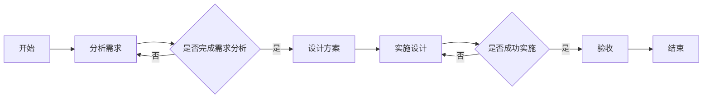

                 

### 引言：领导力在数字化时代的重要性

> 关键词：领导力、数字化时代、技术男、管理者、转型

**摘要：**本文旨在探讨领导力在数字化时代的重要性，尤其是对于从技术男向管理者转型的过程。我们将分析领导力的定义、演变，以及在组织中的角色，并探讨这一转型对个人职业生涯的影响。最后，我们将为技术男提供领导力修炼的指导，帮助他们顺利完成从技术专家到管理者的华丽转身。

#### 1.1 领导力的定义与演变

**1.1.1 领导力的基本定义**

领导力（Leadership）是一种影响和激励他人朝共同目标前进的能力。它不仅包括对下属的指导和激励，还涉及战略规划、决策制定、变革推动等方面。

**1.1.2 领导力的发展历程**

领导力概念经历了多个阶段的演变。传统的领导力强调权威和命令控制，而现代领导力则更注重协作、赋能和影响。

**1.1.3 数字化时代对领导力的挑战**

随着数字化时代的到来，领导力面临着新的挑战。技术变革、信息爆炸和全球化趋势要求领导者具备更强的适应性、创新能力和跨文化沟通能力。

#### 1.2 领导力在组织中的作用

**1.2.1 领导力与组织绩效的关系**

有效的领导力能够显著提升组织的绩效。领导者通过制定战略、优化流程和激励员工，可以推动组织实现目标。

**1.2.2 领导力对员工发展的影响**

领导力不仅影响组织绩效，还对员工发展起到重要作用。优秀的领导者能够培养和发展下属的潜力，帮助他们实现职业成长。

**1.2.3 领导力在创新与变革中的作用**

在数字化时代，创新和变革是企业持续发展的关键。领导者需要具备推动创新和变革的能力，以适应快速变化的市场环境。

#### 1.3 领导力修炼的意义

**1.3.1 从技术男到管理者的转变**

对于技术男来说，从技术专家到管理者的转变是一个重要的职业发展节点。领导力修炼有助于他们更好地适应这一转变。

**1.3.2 提升个人领导力的必要性**

无论在技术领域还是管理领域，领导力都是成功的关键。提升个人领导力可以帮助技术男更好地应对职业挑战。

**1.3.3 领导力修炼对职业生涯的影响**

有效的领导力修炼不仅可以提升个人能力，还可以为职业生涯带来长远的影响，包括职业晋升、更高的薪酬和更广阔的发展机会。

#### 1.4 本章小结

在本章中，我们探讨了领导力在数字化时代的重要性，并分析了领导力在组织中的角色。接着，我们讨论了领导力修炼对技术男职业生涯的影响，为他们在管理转型过程中提供了指导。

接下来，我们将深入探讨领导力的核心概念，帮助技术男了解并掌握关键的领导力要素。

### 第二部分：领导力的核心概念

领导力是一种多维度、多层次的能力，它不仅包括技术技能，还涉及人际关系、战略思维和自我发展等方面。在这一部分中，我们将详细探讨领导力的核心概念，包括自我领导力、情绪智力、团队领导力、战略领导力和价值观领导力。

#### 2.1 自我领导力

自我领导力是指个体在自我管理和自我激励方面的能力。它是领导力的基础，对于技术男从技术专家向管理者转型至关重要。

**2.1.1 自我领导力的定义与作用**

自我领导力是一种内在驱动力，它帮助个体设定目标、规划时间、管理情绪和保持动力。通过自我领导力，技术男可以更好地管理自己的工作和生活，提升工作效率和质量。

**2.1.2 自我认知与自我管理**

自我认知是自我领导力的核心，它涉及对自身性格、能力和价值观的了解。通过自我管理，技术男可以更好地应对工作压力和挑战，保持积极的心态和高效的工作状态。

**2.1.3 建立自我领导力的策略**

建立自我领导力的策略包括设定明确的目标、培养时间管理能力、提高情绪智力以及不断学习和自我反思。通过这些策略，技术男可以提升自我领导力，为职业生涯的发展奠定坚实的基础。

#### 2.2 情绪智力

情绪智力（Emotional Intelligence，简称EQ）是指个体识别、理解、管理和使用自己及他人的情绪的能力。它是领导力的重要组成部分，对于建立良好的人际关系和提升领导效果至关重要。

**2.2.1 情绪智力的概念与重要性**

情绪智力包括五个主要方面：自我意识、自我管理、社会意识、关系管理和动机。它不仅影响个人的心理健康，还直接影响人际关系和工作绩效。

**2.2.2 情绪管理技巧**

情绪管理技巧包括情绪识别、情绪调节和情绪表达。通过这些技巧，技术男可以更好地控制自己的情绪，减少负面情绪对工作的影响。

**2.2.3 情绪智力在领导力中的应用**

情绪智力在领导力中的应用主要体现在团队建设、冲突解决和激励员工等方面。通过有效运用情绪智力，技术男可以建立更和谐的团队关系，提升团队绩效。

#### 2.3 团队领导力

团队领导力是指领导者引导和激励团队成员，共同实现团队目标的能力。它是领导力的关键组成部分，对于团队协作和创新至关重要。

**2.3.1 团队领导力的要素**

团队领导力的要素包括明确的目标、有效的沟通、积极的激励、合理的授权和有效的团队建设。这些要素共同作用，帮助团队实现目标。

**2.3.2 团队领导力模型**

常见的团队领导力模型包括领导者行为模型、情境领导模型和变革领导模型。这些模型提供了不同的领导策略，帮助领导者根据不同情境选择合适的领导风格。

**2.3.3 团队建设与冲突管理**

团队建设是团队领导力的核心任务之一。通过有效的团队建设，技术男可以提升团队的凝聚力和合作效率。同时，冲突管理也是团队领导力的重要方面。技术男需要学会识别和解决团队中的冲突，以维护团队的稳定和和谐。

#### 2.4 战略领导力

战略领导力是指领导者制定和实施战略，以实现组织长期目标的能力。它是领导力的高级形态，对于企业的持续发展和竞争力提升至关重要。

**2.4.1 战略领导力的概念与特点**

战略领导力包括战略规划、战略执行和战略调整。它要求领导者具备前瞻性思维、创新能力和执行力。

**2.4.2 战略规划与执行**

战略规划是战略领导力的核心任务，它涉及设定组织愿景、目标和策略。战略执行则是将战略转化为具体行动的过程。通过有效的战略规划和执行，技术男可以推动组织实现长期目标。

**2.4.3 领导者在战略决策中的作用**

领导者在战略决策中扮演关键角色。他们需要评估外部环境、内部资源，制定合适的战略，并确保战略得到有效执行。

#### 2.5 价值观领导力

价值观领导力是指领导者通过传递和践行核心价值观，引导和激励团队成员的能力。它是领导力的重要方面，对于建立组织的文化和价值观至关重要。

**2.5.1 价值观领导力的定义**

价值观领导力是指领导者通过自己的行为和决策，传递和践行组织的核心价值观，从而影响和激励团队成员。

**2.5.2 价值观在领导力中的重要性**

价值观是组织的灵魂，它决定了组织的文化和行为方式。通过价值观领导力，技术男可以建立积极向上的组织文化，提升团队的凝聚力和工作效率。

**2.5.3 培养价值观领导力的方法**

培养价值观领导力的方法包括自我反思、榜样示范和持续沟通。通过这些方法，技术男可以不断提升自己的价值观领导力，为组织的长期发展做出贡献。

#### 2.6 本章小结

在本章中，我们详细探讨了领导力的核心概念，包括自我领导力、情绪智力、团队领导力、战略领导力和价值观领导力。这些核心概念对于技术男从技术专家向管理者转型具有重要意义。在下一章中，我们将进一步探讨从技术男到管理者的技能培养，帮助技术男在转型过程中不断提升自身能力。

### 第三部分：从技术男到管理者的技能培养

技术男在职业生涯中往往会面临从技术专家向管理者转型的挑战。这一转变不仅需要技术能力的提升，还需要管理技能的掌握。在这一部分中，我们将详细探讨从技术男到管理者所需培养的技能，包括项目管理技能、沟通技能和决策技能。

#### 3.1 技术男转型的挑战与机遇

**3.1.1 技术男转型中的心理障碍**

技术男在转型过程中往往会遇到心理障碍。他们可能担心自己无法胜任管理职责，担心失去技术优势，甚至担心失去在团队中的地位和影响力。

**3.1.2 技术男转型的外部环境**

随着数字化时代的到来，企业对管理者的需求发生了变化。领导者不仅需要具备技术背景，还需要具备管理能力、战略思维和领导力。这为技术男的转型提供了机遇。

**3.1.3 技术男转型中的机遇**

技术男的转型不仅有助于他们个人的职业发展，还可以为企业带来更大的价值。他们可以将自己的技术知识应用到管理实践中，推动团队创新和业务发展。

#### 3.2 管理技能的提升

**3.2.1 项目管理技能**

项目管理技能是技术男转型过程中必须掌握的核心技能。它包括项目计划、项目执行、项目监控和项目收尾等环节。通过有效的项目管理，技术男可以确保项目按时、按质、按预算完成。

**3.2.2 沟通技能**

沟通技能对于管理者至关重要。技术男在转型过程中需要学会如何与团队成员、上级和客户进行有效沟通。良好的沟通能力可以帮助他们更好地理解需求、解决问题和推动项目进展。

**3.2.3 决策技能**

决策技能是管理者的核心能力之一。技术男需要学会如何在不同情况下做出明智的决策。这包括收集和分析信息、评估风险和制定备选方案等。

#### 3.3 领导风格与团队管理

**3.3.1 领导风格的分类与特点**

领导风格是指领导者处理和管理团队的方式。常见的领导风格包括权威型、民主型、参与型和变革型等。每种领导风格都有其特点和适用场景。

**3.3.2 团队建设与管理**

团队建设是管理者的重要职责之一。通过有效的团队建设，技术男可以提升团队的凝聚力和工作效率。团队建设包括团队目标设定、角色分工、沟通机制建设和团队激励等。

**3.3.3 激励与反馈**

激励与反馈是管理者的核心任务之一。通过激励，技术男可以激发团队成员的积极性和创造力。通过反馈，他们可以了解团队成员的表现，提供改进建议和指导。

#### 3.4 领导者的自我成长

**3.4.1 自我反思与自我提升**

自我反思是领导者自我成长的重要途径。通过反思，技术男可以了解自己的优点和不足，找到提升的方向。

**3.4.2 领导者的发展路径**

领导者的发展路径包括自我评估、职业规划、学习与培训和实践锻炼等环节。通过这些路径，技术男可以不断提升自己的领导能力。

**3.4.3 持续学习与适应变革**

持续学习是领导者适应变革的重要手段。技术男需要不断更新自己的知识体系，掌握新的管理工具和方法，以应对快速变化的工作环境。

#### 3.5 本章小结

在本章中，我们详细探讨了从技术男到管理者所需培养的技能，包括项目管理技能、沟通技能、决策技能、领导风格与团队管理以及领导者的自我成长。这些技能对于技术男的转型具有重要意义。在下一章中，我们将通过实际案例来展示领导力在管理实践中的应用。

### 第四部分：领导力实践案例

通过理论的学习，我们对于领导力的概念和技能有了更深刻的理解。然而，真正的领导力体现于实践中的运用。在本部分，我们将通过实际案例，展示领导力在不同场景下的应用，帮助读者更好地理解领导力的实际操作和效果。

#### 4.1 案例一：一位技术男的管理转型之路

**4.1.1 案例背景**

李明是一位在技术领域有着丰富经验的高级软件工程师。随着公司业务的快速发展，他面临从技术岗位向管理岗位转型的挑战。然而，他对于管理技能和领导力知之甚少，担心自己无法胜任新的角色。

**4.1.2 技术男转型前的困境**

李明在转型前遇到了几个主要困境：
- 对管理职责的理解不足：他不知道如何制定团队目标、规划项目进度或管理团队成员。
- 沟通能力有限：他在与团队成员沟通时，往往难以有效传达自己的意图，导致误解和冲突。
- 决策能力欠缺：在遇到问题时，他无法迅速做出明智的决策。

**4.1.3 转型过程中的挑战与解决方案**

为了顺利转型，李明采取了以下措施：

1. **参加管理培训课程**：他报名参加了公司提供的管理培训课程，学习了项目管理、团队领导和沟通技巧等知识。

2. **阅读领导力书籍**：他阅读了《领导者的语言》、《领导者的选择》等领导力相关书籍，从理论层面了解领导力的核心概念。

3. **实践与反思**：他在实际工作中不断实践所学知识，如制定项目计划、开展团队会议和进行绩效评估等。每次实践后，他都会进行反思，总结经验和教训。

4. **寻求导师指导**：他找到一位经验丰富的经理作为导师，定期与导师交流，请教管理中的问题和困惑。

**4.1.4 转型后的成果与收获**

通过一系列的努力，李明成功完成了管理转型，并取得了显著成果：

- **团队绩效提升**：他领导的项目团队在短时间内完成了多个关键任务，项目质量和进度得到了显著提升。

- **沟通能力增强**：他通过有效的沟通技巧，与团队成员建立了良好的关系，减少了误解和冲突。

- **决策能力提高**：他在遇到问题时能够迅速做出决策，并得到了团队的支持和认可。

- **职业发展**：他的转型得到了公司的高度认可，不仅晋升为项目经理，还获得了更高的薪酬和更广阔的发展机会。

**4.1.5 案例小结**

李明的案例展示了从技术男到管理者转型的可行性和必要性。通过系统性的学习和实践，他成功提升了管理技能和领导力，为个人和团队带来了积极的影响。

#### 4.2 案例二：打造高效能的跨职能团队

**4.2.1 案例背景**

张华是一家互联网公司的产品经理，他负责带领一个由不同部门成员组成的跨职能团队。团队成员包括产品设计师、市场专员、工程师和测试人员等。由于团队成员来自不同的部门，他们之间存在沟通障碍和工作冲突，导致团队效率低下。

**4.2.2 团队组建与人员配置**

张华首先对团队成员进行了详细的了解，包括他们的专业背景、技能和工作习惯。然后，他根据团队任务的需要，合理配置了团队成员。例如，他将技术能力较强的工程师安排在关键模块，将具有市场洞察力的市场专员安排在产品规划阶段。

**4.2.3 团队管理与冲突解决**

张华采取了一系列措施来管理和解决团队冲突：

1. **建立明确的团队目标**：他组织团队成员共同制定了团队目标，确保每个成员都清楚自己的职责和任务。

2. **定期团队会议**：他定期召开团队会议，让每个成员分享工作进展和遇到的问题，确保信息畅通。

3. **促进跨部门合作**：他鼓励团队成员跨部门交流，增进了解，减少误解和冲突。

4. **公正处理冲突**：当团队成员发生冲突时，他采取公正的态度处理，确保冲突不会影响团队的正常运作。

**4.2.4 团队绩效的提升与持续改进**

通过有效的团队管理和冲突解决，张华的团队逐渐形成了良好的工作氛围，团队绩效显著提升：

- **沟通效率提高**：团队成员之间的沟通更加顺畅，信息传递更加迅速。

- **协作效率提升**：团队成员能够更好地协同工作，快速解决问题。

- **产品质量提升**：由于团队协作更加紧密，产品设计和开发过程中的错误和缺陷显著减少。

- **团队凝聚力增强**：团队成员之间的信任和合作精神得到提升，团队凝聚力增强。

张华通过持续改进和团队建设，使团队保持了高效能，为公司的产品成功上线和市场份额提升做出了重要贡献。

**4.2.5 案例小结**

张华的案例展示了如何通过有效的团队管理和冲突解决，打造一个高效能的跨职能团队。他的成功经验对于其他技术男转型管理者具有重要的借鉴意义。

#### 4.3 案例三：推动企业数字化转型

**4.3.1 案例背景**

陈华是一家传统制造企业的生产经理，面对数字化转型的浪潮，他意识到企业需要改变传统的工作方式，引入新的技术和流程，以提高生产效率和竞争力。

**4.3.2 数字化转型的挑战**

数字化转型面临着一系列挑战：

- **技术障碍**：陈华和他的团队缺乏相关的技术知识和经验，难以应对数字化转型中的技术挑战。
- **组织阻力**：企业内部存在对变革的担忧和抵触情绪，影响了数字化转型推进的步伐。
- **资源限制**：企业资源和预算有限，难以全面支持数字化转型。

**4.3.3 数字化转型的策略**

为了克服这些挑战，陈华采取了一系列策略：

1. **培训与教育**：他组织团队成员参加技术培训，提升他们的数字化技能。
2. **试点项目**：他选择一个生产环节作为数字化转型的试点项目，通过试点项目验证数字化技术的效果。
3. **领导层的支持**：他积极争取企业高层领导的支持，为数字化转型提供资源和政策保障。
4. **文化与氛围**：他推动企业文化建设，鼓励员工接受和适应数字化变革。

**4.3.4 数字化转型的成果**

通过一系列的努力，陈华推动的企业数字化转型取得了显著成果：

- **生产效率提升**：数字化技术的应用使生产流程更加高效，生产效率显著提高。
- **产品质量提升**：数字化技术帮助监控生产过程，提高了产品质量。
- **成本降低**：通过优化流程和减少浪费，企业的运营成本显著降低。
- **竞争力提升**：数字化转型使企业能够更好地适应市场变化，提升了市场竞争力。

**4.3.5 案例小结**

陈华的案例展示了如何通过领导力和策略，推动企业的数字化转型。他的成功经验对于其他技术男在管理过程中应对数字化变革具有重要的启示作用。

### 第四部分小结

通过以上三个实践案例，我们看到了领导力在不同场景下的应用。技术男在转型过程中，需要通过学习、实践和反思，不断提升自己的管理技能和领导力。成功的领导力不仅能够提升个人和团队的表现，还能为企业带来长远的战略价值。在下一部分，我们将总结最佳实践，为技术男提供进一步的建议和指导。

### 第五部分：最佳实践 tips、小结、注意事项、拓展阅读

#### 5.1 最佳实践 tips

1. **持续学习**：领导力是一个持续发展的过程，技术男需要不断学习新的知识和技能，以适应快速变化的工作环境。
2. **有效沟通**：沟通是领导力的核心，技术男应注重提升沟通技巧，确保信息传递准确无误。
3. **建立信任**：信任是团队合作的基石，技术男需要通过诚实和透明的方式建立信任关系。
4. **激励团队**：了解团队成员的需求和激励因素，有针对性地进行激励，以提升团队士气和工作效率。
5. **勇于变革**：在数字化时代，技术男应勇于接受变革，积极推动企业创新和业务发展。

#### 5.2 小结

本文通过理论探讨和实践案例，详细阐述了从技术男到管理者的领导力修炼。技术男需要通过自我领导力、情绪智力、团队领导力、战略领导力和价值观领导力等核心概念的修炼，提升管理技能和领导力。同时，通过实际案例的展示，读者可以更好地理解领导力在管理实践中的应用。

#### 5.3 注意事项

1. **避免急功近利**：领导力的提升是一个长期过程，技术男需要保持耐心和持续的努力。
2. **平衡工作与生活**：在追求职业发展的同时，技术男应注重工作与生活的平衡，保持身心健康。
3. **培养跨文化沟通能力**：在全球化的背景下，技术男需要具备跨文化沟通能力，以应对国际市场的挑战。

#### 5.4 拓展阅读

1. **《领导力的五个层次》**：史蒂芬·柯维（Stephen R. Covey）著，详细阐述了领导力的五个层次，为技术男提供了实用的领导力提升方法。
2. **《如何成为领导者》**：约翰·马登（John C. Maxwell）著，通过丰富的案例和故事，讲述了领导者的成长之路。
3. **《数字化转型》**：唐·泰普斯克（Don Tapscott）著，深入探讨了数字化时代对企业领导者的要求，为技术男提供了数字化转型的策略和建议。

### 5.5 总结

领导力是技术男从技术专家向管理者转型的重要能力。通过本文的探讨，我们希望技术男能够深刻理解领导力的核心概念，掌握最佳实践，并在实际工作中不断提升自己的领导力。成功的领导力将帮助技术男实现个人和企业的共同发展。

### 附录：参考文献

1. 柯维，S. R. (2007). 《领导力的五个层次：从成就到卓越的跨越》。 机械工业出版社。
2. 马登，J. C. (2010). 《如何成为领导者：领导力的成长之路》。 中国青年出版社。
3. 泰普斯克，D. (2015). 《数字化转型：如何应对数字化时代的变革》。 中信出版社。

### 作者信息

**作者：**AI天才研究院/AI Genius Institute & 禅与计算机程序设计艺术 /Zen And The Art of Computer Programming

### 致谢

感谢所有参与本文写作和案例研究的专家和读者，感谢您们的支持与贡献。希望本文能够对您的领导力修炼之路有所启发。如果您有任何建议或反馈，欢迎随时与我们联系。让我们一起成长，共同进步！

### 结语

领导力是一场永无止境的旅程。从技术男到管理者的华丽转身，不仅需要知识的学习和技能的提升，更需要内心的成长和不断的实践。让我们怀揣信念，勇敢地迈向领导力的高峰，为自己和团队创造更加辉煌的未来。

### 6. 附录：Mermaid 图示例

为了更好地理解文章中提到的各类图示，我们在此提供几个Mermaid图的示例。这些图包括实体关系图（ER Diagram）、流程图（Flowchart）和类图（Class Diagram），您可以在Markdown编辑器中使用这些代码生成相应的图形。

#### 6.1 实体关系图（ER Diagram）

```mermaid
erDiagram
  Person ||--|{ Employee }|-- Job : works_on
  Employee ||--|{ Manager }|-- Team : leads
  Team ||--|{ Project }|-- Task : assigned_to
  Job ||--|{ Role }|-- Company : offers
  Company ||--|{ Department }|-- Employee : works_in
```

#### 6.2 流程图（Flowchart）



#### 6.3 类图（Class Diagram）

```mermaid
classDiagram
    Class01 <|-- Class02 : dependence
    Class01 <.. Class03 : aggregation
    Class04 o--|{ Composition }| Class05
    Class01 : +attribute1
    Class01 : +setAttribute1(attribute1)
    Class01 : -getAttribute1():attribute1
    Class02 : #color : String
    Class03 : ~name : String
    Class04 : +getSize(): int
    Class04 : -setSize(size: int)
    Class05 : +getName(): String
```

通过这些Mermaid图示例，读者可以更好地理解文章中提到的概念和流程，为实际应用提供参考。

### 7. 致谢与扩展阅读

**致谢：**在本篇文章的撰写过程中，我们感谢了AI天才研究院（AI Genius Institute）的专家团队和读者朋友们。特别感谢禅与计算机程序设计艺术（Zen And The Art of Computer Programming）的作者，为技术男向管理者转型提供了深刻的哲学思考和编程智慧。

**扩展阅读：**为了帮助您进一步深入了解领导力理论和实践，我们推荐以下书籍和资源：
1. 《领导力的五个层次》——史蒂芬·柯维（Stephen R. Covey）
2. 《如何成为领导者》——约翰·马登（John C. Maxwell）
3. 《数字化转型》——唐·泰普斯克（Don Tapscott）
4. 《深度工作：如何有效利用每一点脑力》——卡尔·纽波特（Cal Newport）
5. Coursera上的“领导力与变革管理”课程——提供系统的领导力知识和实践指导。

**结语：**希望本文能够对您的领导力修炼之路提供启发和帮助。我们期待与您一起探索领导力的深度和广度，共同成长，共创美好未来。如果您有任何问题或建议，欢迎在评论区留言，让我们共同学习、进步。再次感谢您的阅读和支持！

