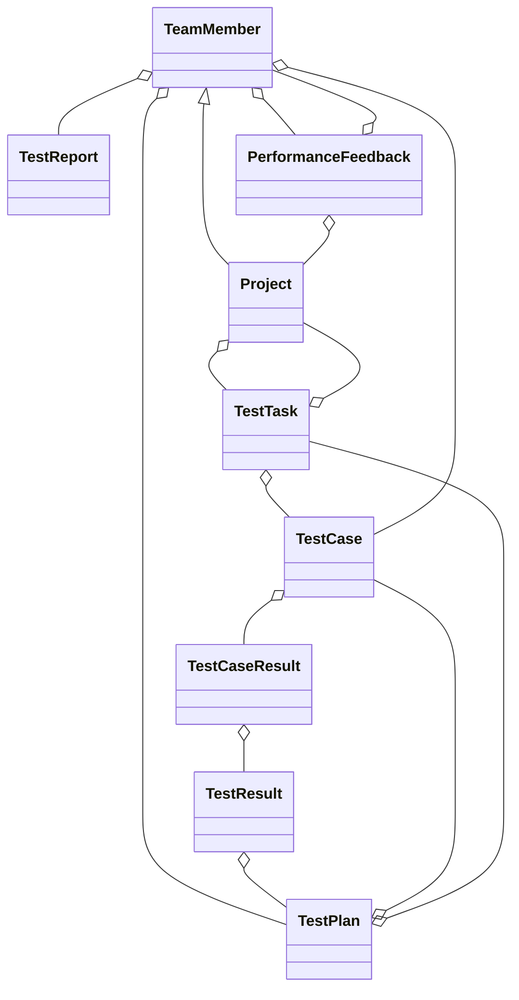
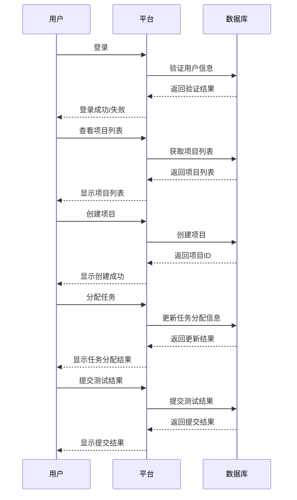
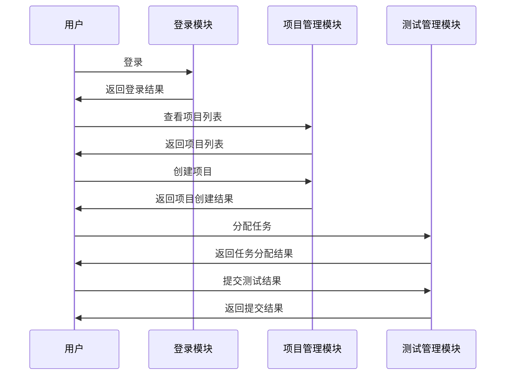

                 


### 文章标题：领导力修炼手册：从测试工程师到管理者的逆袭宝典

#### 关键词：领导力、测试工程师、管理者、职业转型、团队管理

#### 摘要：

本文旨在为测试工程师提供一本实用的领导力修炼手册，帮助他们从技术专家成功转型为优秀的管理者。通过深入分析领导力的核心概念、测试工程师到管理者的转型路径，以及具体的管理算法和实战案例，本文将引导读者掌握领导力技能，实现职业生涯的跨越式发展。

**Step 1: 引言**

# 引言

在现代企业中，领导力已成为企业发展不可或缺的核心要素。一个成功的领导者不仅需要具备扎实的专业知识，还需要懂得如何有效地管理和激励团队，推动企业不断向前发展。然而，从测试工程师转型为管理者，这一过程并不简单。本书《领导力修炼手册：从测试工程师到管理者的逆袭宝典》旨在为测试工程师提供一本实用的指南，帮助他们顺利实现职业转型，成为出色的管理者。

测试工程师在企业中承担着确保软件质量和稳定运行的重要角色。他们通过编写测试用例、执行测试、分析缺陷，为产品的可靠性和用户体验提供保障。然而，随着技术的发展和企业的需求变化，测试工程师逐渐意识到，仅仅具备技术能力是不够的。他们渴望提升自己的管理能力，从而在职业生涯中取得更大的突破。

**Step 2: 核心概念与联系**

## 第2章 核心概念与联系

### 2.1 领导力与管理者

#### 2.1.1 领导力的定义与特征

领导力是一种影响力，它体现在领导者如何激发团队成员的积极性和潜能，推动团队实现共同的目标。领导力的特征主要包括：

- **目标导向**：领导者能够明确目标，并激发团队成员的积极性，共同为实现目标而努力。
- **激励能力**：领导者善于调动团队成员的潜能，提高团队整体绩效。
- **沟通能力**：领导者具备有效沟通的能力，确保团队目标一致，减少误解。
- **决策能力**：领导者能够在复杂环境下做出正确决策，把握企业发展方向。

#### 2.1.2 管理者与领导者的区别

管理者与领导者虽然在职责上有一定重叠，但它们之间仍存在显著差异：

| 管理者 | 领导者 |
| :----: | :----: |
| 关注流程、控制成本 | 关注人、激发潜力 |
| 倾向于执行、保持现状 | 倾向于变革、引领未来 |
| 确保任务完成 | 激励团队成员实现目标 |

#### 2.2 从测试工程师到管理者的转型

### 2.2.1 转型背景

随着企业对高质量软件需求的不断增长，测试工程师在软件开发过程中的地位日益重要。然而，很多测试工程师在职业生涯发展到一定阶段后，希望实现职业转型，成为管理者。

### 2.2.2 转型过程

测试工程师向管理者转型的过程可以分为以下几个阶段：

1. **提升自身能力**：测试工程师需要掌握项目管理、团队管理等相关知识，提升自己的综合素质。
2. **积累经验**：通过参与实际项目，锻炼管理能力，积累实践经验。
3. **寻求机会**：积极寻找和管理层岗位，争取转型机会。
4. **持续学习**：不断学习新的管理知识和技能，适应管理岗位的要求。

**Step 3: 算法原理讲解**

## 第3章 算法原理讲解

### 3.1 项目管理算法

#### 3.1.1 计划评审技术（PERT）

PERT（Project Evaluation and Review Technique）是一种用于项目时间安排和资源分配的算法。它通过分析项目任务之间的依赖关系，确定关键路径，从而优化项目进度。

**PERT算法流程：**

1. 构建项目任务网络图；
2. 确定各任务的最乐观时间（To）、最可能时间（Tm）和最悲观时间（Tp）；
3. 计算各任务的时间期望值（Te）和方差（V）；
4. 确定关键路径。

$$
\text{Te} = \frac{\text{To} + 4\text{Tm} + \text{Tp}}{6}
$$

$$
\text{V} = \frac{(\text{Tp} - \text{To})^2}{12}
$$

**PERT算法示例：**

假设一个项目有三个任务A、B和C，它们的乐观时间、最可能时间和悲观时间如下表：

| 任务 | 乐观时间（To） | 最可能时间（Tm） | 悲观时间（Tp） |
| :--: | :------------: | :-------------: | :-----------: |
|  A  |       3        |       4        |      6       |
|  B  |       2        |       3        |      5       |
|  C  |       3        |       4        |      6       |

计算各任务的时间期望值和方差：

| 任务 | 期望时间（Te） | 方差（V） |
| :--: | :------------: | :-------: |
|  A  |       4.17     |   1.25    |
|  B  |       3.17     |   0.75    |
|  C  |       4.17     |   1.25    |

根据计算结果，可以确定关键路径为A-B-C。

### 3.2 团队管理算法

#### 3.2.1 贝叶斯决策理论

贝叶斯决策理论是一种用于团队决策的方法，通过分析团队成员的偏好和风险偏好，制定最优决策策略。

**贝叶斯决策流程：**

1. 确定团队成员的偏好和风险偏好；
2. 构建决策模型，计算每个决策方案的期望效用值；
3. 根据期望效用值选择最优决策方案。

**贝叶斯决策示例：**

假设有三个决策方案A、B和C，团队成员的偏好和风险偏好如下表：

| 成员 | 偏好 | 风险偏好 |
| :--: | :--: | :------: |
|  小明 | A    | 低      |
|  小红 | B    | 中      |
|  小李 | C    | 高      |

构建决策模型，计算各决策方案的期望效用值，并根据结果选择最优决策方案。

**Step 4: 系统分析与架构设计方案**

## 第4章 系统分析与架构设计方案

### 4.1 问题场景介绍

在当前企业软件开发过程中，测试工程师面临诸多挑战。为了提高软件质量，降低缺陷率，企业对测试工程师的技能要求不断提高。然而，测试工程师在提升技术能力的同时，也需要关注团队管理和领导力提升。本文旨在为测试工程师提供一套系统化的解决方案，帮助他们成功转型为优秀的管理者。

### 4.2 项目介绍

本篇论文旨在开发一个面向测试工程师的职业发展平台，该平台将结合项目管理、团队管理和领导力提升等方面的知识，帮助测试工程师实现职业转型。该平台的核心功能包括：

1. 项目管理：提供项目计划、任务分配、进度跟踪等功能，帮助测试工程师高效管理项目。
2. 团队管理：提供团队成员评估、沟通协作、绩效反馈等功能，促进团队协作和成长。
3. 领导力提升：提供领导力培训、案例分享、经验交流等功能，助力测试工程师提升领导力。

### 4.3 系统功能设计

#### 4.3.1 领域模型

领域模型是系统功能设计的核心，它定义了系统中的关键概念和实体。以下是本系统的领域模型：



### 4.4 系统架构设计

#### 4.4.1 系统架构图

以下是一个简化的系统架构图，展示了系统的核心组件及其交互关系：



### 4.5 系统接口设计

#### 4.5.1 接口设计

以下是系统的主要接口设计：

```java
// 用户登录接口
public class LoginService {
    public boolean login(String username, String password) {
        // 验证用户信息
        // 返回登录结果
    }
}

// 项目管理接口
public class ProjectService {
    public List<Project> getProjectList() {
        // 获取项目列表
        // 返回项目列表
    }

    public void createProject(Project project) {
        // 创建项目
    }

    public void updateTaskAllocation(TaskAllocation allocation) {
        // 更新任务分配信息
    }
}

// 测试管理接口
public class TestManagementService {
    public void submitTestResult(TestResult result) {
        // 提交测试结果
    }

    public List<TestCase> getTestCasesByProjectId(int projectId) {
        // 获取项目下的测试用例列表
        // 返回测试用例列表
    }
}
```

### 4.6 系统交互设计

#### 4.6.1 交互设计

以下是系统的主要交互设计：



**Step 5: 项目实战**

## 第5章 项目实战

### 5.1 环境安装

在进行项目实战之前，我们需要准备以下环境：

- Java开发工具包（JDK 1.8及以上版本）
- Maven 3.6.3及以上版本
- MySQL数据库（5.7及以上版本）
- IntelliJ IDEA或Eclipse（用于开发）

### 5.2 系统核心实现

#### 5.2.1 用户登录模块

以下是用户登录模块的核心实现：

```java
// 用户登录模块
public class LoginService {

    private UserRepository userRepository;

    public LoginService(UserRepository userRepository) {
        this.userRepository = userRepository;
    }

    public boolean login(String username, String password) {
        User user = userRepository.findByUsername(username);
        if (user == null || !user.getPassword().equals(password)) {
            return false;
        }
        return true;
    }
}

// 用户存储库
public class UserRepository {

    private List<User> users;

    public UserRepository() {
        users = new ArrayList<>();
        // 初始化用户数据
        users.add(new User("user1", "password1"));
        users.add(new User("user2", "password2"));
    }

    public User findByUsername(String username) {
        for (User user : users) {
            if (user.getUsername().equals(username)) {
                return user;
            }
        }
        return null;
    }
}

// 用户类
public class User {

    private String username;
    private String password;

    public User(String username, String password) {
        this.username = username;
        this.password = password;
    }

    public String getUsername() {
        return username;
    }

    public String getPassword() {
        return password;
    }
}
```

#### 5.2.2 项目管理模块

以下是项目管理模块的核心实现：

```java
// 项目管理模块
public class ProjectService {

    private ProjectRepository projectRepository;

    public ProjectService(ProjectRepository projectRepository) {
        this.projectRepository = projectRepository;
    }

    public List<Project> getProjectList() {
        return projectRepository.findAll();
    }

    public void createProject(Project project) {
        projectRepository.save(project);
    }
}

// 项目存储库
public class ProjectRepository extends JpaRepository<Project, Integer> {
}

// 项目类
public class Project {

    @Id
    @GeneratedValue(strategy = GenerationType.IDENTITY)
    private Integer id;

    private String name;

    public Project() {
    }

    public Project(String name) {
        this.name = name;
    }

    public Integer getId() {
        return id;
    }

    public void setId(Integer id) {
        this.id = id;
    }

    public String getName() {
        return name;
    }

    public void setName(String name) {
        this.name = name;
    }
}
```

#### 5.2.3 测试管理模块

以下是测试管理模块的核心实现：

```java
// 测试管理模块
public class TestManagementService {

    private TestCaseRepository testCaseRepository;

    public TestManagementService(TestCaseRepository testCaseRepository) {
        this.testCaseRepository = testCaseRepository;
    }

    public void submitTestResult(TestResult result) {
        testCaseRepository.save(result.getTestCase());
    }

    public List<TestCase> getTestCasesByProjectId(int projectId) {
        return testCaseRepository.findByProjectId(projectId);
    }
}

// 测试用例存储库
public class TestCaseRepository extends JpaRepository<TestCase, Integer> {
}

// 测试结果存储库
public class TestResultRepository extends JpaRepository<TestResult, Integer> {
}

// 测试用例类
public class TestCase {

    @Id
    @GeneratedValue(strategy = GenerationType.IDENTITY)
    private Integer id;

    private String name;

    private String description;

    private int projectId;

    public TestCase() {
    }

    public TestCase(String name, String description, int projectId) {
        this.name = name;
        this.description = description;
        this.projectId = projectId;
    }

    public Integer getId() {
        return id;
    }

    public void setId(Integer id) {
        this.id = id;
    }

    public String getName() {
        return name;
    }

    public void setName(String name) {
        this.name = name;
    }

    public String getDescription() {
        return description;
    }

    public void setDescription(String description) {
        this.description = description;
    }

    public int getProjectId() {
        return projectId;
    }

    public void setProjectId(int projectId) {
        this.projectId = projectId;
    }
}

// 测试结果类
public class TestResult {

    @Id
    @GeneratedValue(strategy = GenerationType.IDENTITY)
    private Integer id;

    private TestCase testCase;

    private boolean passed;

    public TestResult() {
    }

    public TestResult(TestCase testCase, boolean passed) {
        this.testCase = testCase;
        this.passed = passed;
    }

    public Integer getId() {
        return id;
    }

    public void setId(Integer id) {
        this.id = id;
    }

    public TestCase getTestCase() {
        return testCase;
    }


