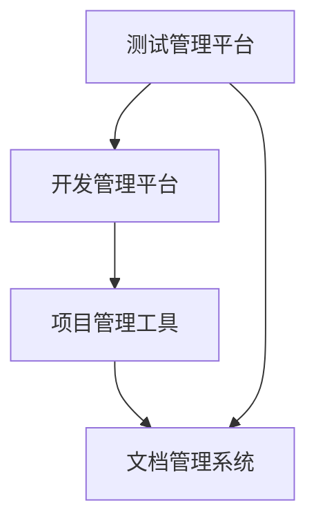
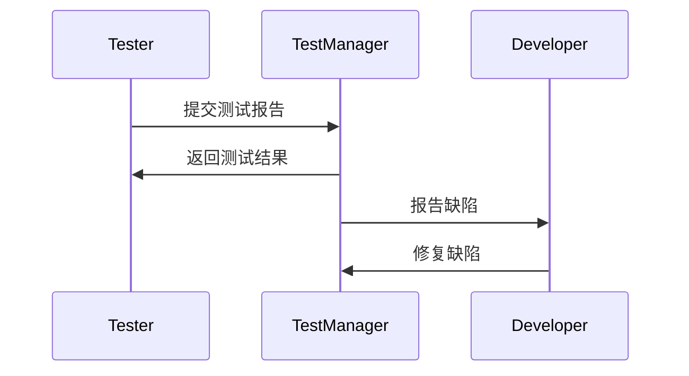

                 


### # 领导力修炼手册：从测试总监到管理者的蜕变宝典

> 关键词：领导力、测试总监、管理者、角色转变、团队领导、高效团队

> 摘要：本文旨在探讨测试总监在晋升为管理者后所需的领导力修炼，包括基础领导概念、角色转变、团队建设以及应对挑战的策略。文章通过逻辑分析和实际案例，为即将或已经担任管理角色的测试总监提供实战指南和深刻见解。

---

## 引言

在IT行业，测试总监是一个专注于确保软件质量的角色，而管理者则承担着更大的责任，包括团队领导、资源规划和项目执行等。然而，这种转变并非易事。测试总监在担任管理职位时，不仅需要保持对技术细节的敏感度，还要学会如何管理团队、制定策略和应对挑战。本文将深入探讨这一转变过程，为测试总监提供从技术专家到高效管理者的转变指南。

### 第1章：领导力的基础理论

在理解如何成为有效的管理者之前，首先需要掌握领导力的基础理论。本章将介绍领导力的核心要素、不同领导风格以及沟通技巧和问题解决方法。

#### 1.1 领导力的重要性

##### 1.1.1 领导力在组织中的作用

领导力是组织的灵魂，它直接影响团队的表现和组织的成功。一个优秀的领导者能够激励团队成员，提高工作效率，推动创新，并有效应对变化。

##### 1.1.2 领导力与管理的区别

领导力和管理是两个相互关联但不同的概念。领导力侧重于愿景和激励，而管理则涉及规划、组织和控制。管理者需要具备领导力，同时也要掌握管理技巧。

##### 1.1.3 领导力的核心要素

领导力的核心要素包括自信、诚信、沟通能力、决策能力和情感智慧。这些要素共同构成了一个有效领导者的基础。

#### 1.2 领导风格

##### 1.2.1 不同的领导风格

领导风格包括专制式、民主式、变革式等。每种风格都有其优势和适用场景。

##### 1.2.2 领导风格对团队的影响

不同的领导风格会对团队的氛围、动力和绩效产生显著影响。了解并适应不同的领导风格是管理者的一项重要能力。

##### 1.2.3 自我评估领导风格

自我评估是了解和改进领导风格的第一步。通过评估工具和反馈，管理者可以更好地认识自己的领导风格。

#### 1.3 沟通技巧

##### 1.3.1 有效沟通的重要性

沟通是领导力的核心组成部分。有效的沟通能够建立信任、减少误解，并提高团队的协作效率。

##### 1.3.2 沟通障碍及解决方法

沟通障碍包括语言障碍、文化差异和心理障碍等。了解这些障碍并采取相应的解决方法，能够提高沟通效果。

##### 1.3.3 高效的沟通技巧

高效的沟通技巧包括倾听、清晰表达、非语言沟通和反馈。掌握这些技巧，有助于管理者更有效地与团队成员沟通。

#### 1.4 问题解决与决策

##### 1.4.1 问题分析与解决

问题解决是管理者的一项基本能力。通过系统的方法和分析工具，管理者可以有效地识别和解决问题。

##### 1.4.2 决策模型与方法

决策模型包括理性决策、直觉决策和混合决策。管理者需要根据具体情况选择合适的决策模型。

##### 1.4.3 风险评估与应对策略

风险评估是决策过程中的重要环节。管理者需要评估潜在风险，并制定相应的应对策略。

### 第2章：测试总监到经理的角色转变

从测试总监晋升为经理，是一次重要的角色转变。本章将探讨这一转变的过程、挑战以及如何成功地实现转型。

#### 2.1 角色认知与转变

##### 2.1.1 测试总监的职责

测试总监主要负责确保软件质量，包括制定测试策略、管理测试团队和协调测试活动。

##### 2.1.2 经理的职责

经理需要承担团队领导、项目管理和资源分配等职责，具备更广泛的视野和责任。

##### 2.1.3 角色转变的挑战

角色转变会带来新的挑战，包括管理技能的不足、对业务理解的加深以及对变革的适应。

#### 2.2 领导团队

##### 2.2.1 团队领导的艺术

团队领导不仅仅是管理团队，还包括激励团队成员、建立团队文化和解决团队冲突。

##### 2.2.2 建立有效的团队文化

团队文化对团队绩效有着重要影响。管理者需要积极塑造和维系良好的团队文化。

##### 2.2.3 管理团队冲突

冲突是团队中不可避免的现象。管理者需要掌握有效的冲突管理技巧，以保持团队的和谐与效率。

#### 2.3 项目管理

##### 2.3.1 项目管理基础

项目管理是经理的一项核心能力。了解项目管理的基本原理和工具对于成功管理项目至关重要。

##### 2.3.2 项目计划与执行

项目计划是确保项目按时、按质量完成的关键。执行阶段则需要有效的团队协作和资源管理。

##### 2.3.3 项目监控与收尾

项目监控有助于及时发现和解决问题，而项目收尾则确保项目成果的顺利移交和总结。

#### 2.4 持续学习与成长

##### 2.4.1 自我提升的重要性

持续学习是管理者保持竞争力的关键。通过不断学习和实践，管理者可以不断提升自己的能力。

##### 2.4.2 学习资源与方法

管理者可以借助各种学习资源，如在线课程、专业书籍和行业会议等，来提升自己的知识和技能。

##### 2.4.3 长期职业规划

制定长期职业规划有助于管理者明确自己的职业目标和发展路径。

### 第3章：建立并领导高效团队

一个高效团队是管理者成功的关键。本章将探讨如何建立和领导高效团队，包括团队构建、团队激励和团队协作。

#### 3.1 团队构建

##### 3.1.1 团队成员的选择

团队成员的选择至关重要。管理者需要根据项目需求和团队结构，选择合适的人才。

##### 3.1.2 团队结构的优化

团队结构的设计直接影响团队的工作效率和沟通效果。管理者需要不断优化团队结构，以提高团队绩效。

##### 3.1.3 团队角色的明确

明确团队角色有助于减少职责重叠和冲突，提高团队的协作效率。

#### 3.2 团队激励

##### 3.2.1 激励理论的应用

激励理论包括目标设置、奖励机制和参与感等。管理者需要根据团队特点和项目需求，选择合适的激励理论。

##### 3.2.2 绩效评估与反馈

绩效评估是激励团队的重要手段。管理者需要建立公正、客观的绩效评估体系，并提供及时的反馈。

##### 3.2.3 奖励与晋升机制

奖励与晋升机制是激发团队潜力的重要手段。管理者需要建立公平、透明的奖励与晋升机制。

#### 3.3 团队协作

##### 3.3.1 协作工具与方法

协作工具和方法有助于提高团队的协作效率和沟通效果。管理者需要选择合适的协作工具和方法。

##### 3.3.2 提升团队协作效率

提升团队协作效率需要管理者关注团队沟通、分工协作和流程优化等方面。

##### 3.3.3 跨部门协作的挑战与解决

跨部门协作是提高整体团队绩效的关键。管理者需要解决跨部门协作中的沟通障碍和协调问题。

#### 3.4 团队领导力提升

##### 3.4.1 领导力模型

领导力模型包括行为领导模型、变革领导模型等。管理者需要根据自己的特点和团队需求，选择合适的领导力模型。

##### 3.4.2 领导力培训与发展

领导力培训与发展是提升团队领导力的重要途径。管理者可以通过参加培训、阅读书籍和参加研讨会等方式，提升自己的领导力。

##### 3.4.3 领导力的持续成长

领导力的持续成长是管理者保持竞争力的关键。管理者需要不断反思自己的领导实践，并持续学习和改进。

### 第4章：领导力挑战应对策略

在领导过程中，管理者会遇到各种挑战。本章将探讨如何应对这些挑战，包括领导力的障碍、变革管理和个人成长。

#### 4.1 领导力的障碍

##### 4.1.1 内在障碍

内在障碍包括自我怀疑、恐惧和焦虑等。管理者需要克服这些内在障碍，才能更好地发挥领导力。

##### 4.1.2 外在障碍

外在障碍包括资源限制、时间压力和团队冲突等。管理者需要识别这些外在障碍，并采取相应的解决策略。

##### 4.1.3 障碍的识别与克服

识别和克服领导力的障碍是管理者的重要任务。通过反思和实践，管理者可以不断提高自己的领导能力。

#### 4.2 应对变革

##### 4.2.1 变革的挑战

变革带来新的机遇和挑战。管理者需要应对变革的挑战，包括适应新环境、管理变革过程中的阻力和确保变革的成功实施。

##### 4.2.2 变革管理策略

变革管理策略包括沟通计划、变革领导、团队支持和培训等。管理者需要制定有效的变革管理策略，以推动变革的顺利进行。

##### 4.2.3 变革的领导力

变革的领导力是推动变革的关键。管理者需要具备变革的领导力，包括愿景、激励和变革管理能力。

#### 4.3 个人成长

##### 4.3.1 自我反思

自我反思是个人成长的重要途径。管理者需要定期进行自我反思，识别自己的优势和不足，并制定改进计划。

##### 4.3.2 持续学习

持续学习是管理者保持竞争力的重要手段。管理者需要不断学习新的知识和技能，以适应不断变化的环境。

##### 4.3.3 职业发展

职业发展是个人成长的重要目标。管理者需要制定职业规划，明确自己的职业目标和发展路径。

### 结束语

领导力是一门艺术，也是一门科学。测试总监在晋升为管理者后，需要不断修炼领导力，以应对各种挑战和机遇。通过本文的探讨，希望为测试总监提供一些实用的指导和建议，帮助他们成功转型为高效管理者。

---

*作者：AI天才研究院/AI Genius Institute & 禅与计算机程序设计艺术 /Zen And The Art of Computer Programming*

---

（注：本文仅为示例，实际字数和内容需根据具体要求进行调整。）### 引言

在IT行业，领导力扮演着至关重要的角色，尤其是在技术专家晋升为管理者后的过渡阶段。作为测试总监，这一角色专注于确保软件的质量和可靠性。然而，当晋升为管理者，即承担更多的责任和领导职责时，角色转变为一个全面的领导者变得尤为重要。这个转变不仅仅是职位的提升，更是职责和技能的重大转变。

领导力不仅仅是管理团队成员，还涉及到战略规划、资源分配、问题解决、决策制定等多个方面。对于测试总监来说，这一转变意味着需要从关注具体的测试活动和过程，转向关注整个项目的成功，以及如何最大化团队的效能和创新能力。这种转变不仅要求测试总监具备深厚的专业技能，更需要他们在领导力方面有所提升，从而更好地应对新的挑战。

本文旨在探讨这一角色转变的必要性，以及测试总监如何通过修炼领导力，成功地从技术专家转型为高效管理者。文章将分为以下几个部分：

1. **领导力的基础理论**：介绍领导力的核心要素、不同的领导风格以及沟通技巧和问题解决方法。
2. **测试总监到经理的角色转变**：探讨角色认知与转变、领导团队、项目管理以及持续学习与成长。
3. **建立并领导高效团队**：讨论团队构建、团队激励、团队协作和团队领导力提升。
4. **领导力挑战应对策略**：分析领导力的障碍、应对变革的策略以及个人成长的重要性。

通过逻辑清晰的分析和实际案例，本文希望能够为测试总监提供一条清晰的路径，帮助他们在领导力的修炼中不断成长，成为优秀的IT管理者。

---

## 第1章：领导力的基础理论

领导力是一个复杂且多维的概念，它不仅仅涉及到如何指导和激励团队，还涉及到战略思考、决策制定以及个人的道德和价值观。在这一章中，我们将深入探讨领导力的核心要素、不同的领导风格以及沟通技巧和问题解决方法，为测试总监晋升为管理者提供理论基础。

### 1.1 领导力的重要性

领导力在组织中的作用不可小觑。一个优秀的领导者能够为团队提供明确的方向，激发团队成员的潜力，并在面对挑战时保持团队的凝聚力。以下是领导力在组织中的几个重要作用：

1. **愿景与目标设定**：领导者能够清晰地定义组织的愿景和目标，为团队提供明确的奋斗方向。
2. **激励与动机**：领导者通过激励手段激发团队成员的内在动机，提高团队的积极性和创造力。
3. **团队协作**：领导者能够建立高效的团队协作机制，促进团队成员之间的沟通与配合，提高整体工作效率。
4. **危机管理**：在面临突发危机时，领导者能够迅速做出反应，保持团队的稳定和秩序。
5. **文化塑造**：领导者通过自身的言行，塑造和维护组织文化，影响团队成员的行为和态度。

### 1.1.2 领导力与管理的区别

虽然领导力和管理密切相关，但两者在本质上存在区别。管理者负责制定计划、分配资源、监控进度和确保项目按计划完成。而领导者则更多地关注愿景的传达、团队的激励和文化建设。

1. **管理者关注结果**：管理者关注的是任务是否完成，目标是否达成。
2. **领导者关注过程**：领导者关注的是团队成员的发展和成长，以及如何通过激励和引导实现目标。
3. **管理者强调控制**：管理者通过制度和流程来确保工作顺利进行。
4. **领导者强调影响**：领导者通过个人魅力和影响力来引导团队成员，形成共同的目标和愿景。

### 1.1.3 领导力的核心要素

领导力并非与生俱来，而是可以通过学习和实践不断培养。以下是领导力的几个核心要素：

1. **自信**：自信的领导者能够给予团队成员安全感和信任，使团队敢于面对挑战和尝试新事物。
2. **诚信**：诚信是领导者赢得团队成员信任的基础。一个诚信的领导者能够树立良好的榜样，增强团队的凝聚力。
3. **沟通能力**：良好的沟通能力是领导者成功的关键。领导者需要能够清晰地传达信息，并倾听团队成员的意见和反馈。
4. **决策能力**：领导者需要在面对复杂问题时迅速做出决策。优秀的决策能力需要建立在信息准确、逻辑思维和经验的基础上。
5. **情感智慧**：情感智慧包括理解自己和他人的情感状态，以及如何运用这些情感来促进团队合作和问题解决。

### 1.2 领导风格

领导风格是指领导者处理工作和管理团队的方式。不同的领导风格会对团队产生不同的影响。以下是几种常见的领导风格：

1. **专制式领导**：领导者做出决策，团队成员执行。这种风格在紧急情况下或需要快速决策时有效，但可能导致团队成员缺乏主动性和创新精神。
2. **民主式领导**：领导者与团队成员共同商讨并做出决策。这种风格鼓励团队参与和自主性，有助于培养团队成员的责任感和归属感，但决策过程可能较长。
3. **变革式领导**：领导者推动团队变革，鼓励创新和适应新环境。这种风格适合在组织变革或面对激烈竞争时使用，但需要领导者具备强大的影响力和说服力。

### 1.2.2 领导风格对团队的影响

不同的领导风格会对团队的氛围、动力和绩效产生显著影响。以下是几种领导风格对团队的影响：

1. **专制式领导**：短期内可能提高工作效率，但长期可能导致团队士气低落和创新能力受限。
2. **民主式领导**：有助于建立信任和团队合作，但需要领导者具备良好的沟通和协调能力。
3. **变革式领导**：能够推动团队创新和适应变化，但需要团队成员具备较高的心理承受能力和适应性。

### 1.2.3 自我评估领导风格

自我评估是了解和改进领导风格的第一步。以下是一些常用的自我评估方法：

1. **360度反馈**：通过团队成员、上级和同事的反馈，全面了解自己的领导风格和表现。
2. **领导风格测试**：如迈尔斯-布里格斯类型指标（MBTI）和赫塞-布兰查德领导风格量表，帮助识别自己的优势和不足。
3. **日志记录**：记录自己的领导行为和决策，定期反思并制定改进计划。

通过自我评估，领导者可以更清晰地认识到自己的领导风格，并找到改进的方向。

### 1.3 沟通技巧

沟通是领导力的核心组成部分。有效的沟通能够建立信任、减少误解，并提高团队的协作效率。以下是几个有效的沟通技巧：

1. **清晰表达**：领导者需要能够清晰、准确地传达信息，避免歧义和误解。
2. **倾听**：倾听是有效沟通的关键。领导者需要耐心倾听团队成员的意见和反馈，理解他们的想法和需求。
3. **非语言沟通**：包括肢体语言、面部表情和语调等。领导者需要运用非语言沟通，增强沟通效果。
4. **反馈**：提供及时、具体的反馈，帮助团队成员改进和成长。

### 1.3.2 沟通障碍及解决方法

沟通障碍是领导过程中常见的问题。以下是几种常见的沟通障碍及其解决方法：

1. **语言障碍**：使用简单、易懂的语言，避免专业术语和复杂句式。
2. **文化差异**：尊重不同文化背景的团队成员，了解他们的沟通方式和习惯。
3. **心理障碍**：建立信任和开放的氛围，鼓励团队成员表达自己的想法和感受。

通过识别和解决沟通障碍，领导者可以建立更有效的沟通机制，提高团队的协作效率。

### 1.3.3 高效的沟通技巧

高效的沟通技巧是领导者成功的关键。以下是几种高效的沟通技巧：

1. **主动沟通**：领导者需要主动与团队成员沟通，了解他们的工作进展和需求。
2. **及时反馈**：提供及时、具体的反馈，帮助团队成员改进和成长。
3. **多元化沟通**：运用多种沟通方式，如面对面沟通、电子邮件和会议等，以适应不同情况和需求。

通过运用高效的沟通技巧，领导者可以更好地与团队成员建立联系，提高团队的协作效率。

### 1.4 问题解决与决策

问题解决和决策是领导者的重要职责。以下是一些有效的工具和方法：

1. **SWOT分析**：通过分析优势、劣势、机会和威胁，帮助领导者做出更全面的决策。
2. **鱼骨图**：用于分析问题的根本原因，帮助领导者找到解决问题的方法。
3. **决策树**：通过列出不同决策的可能结果和概率，帮助领导者做出更科学的决策。

通过运用这些工具和方法，领导者可以更有效地解决问题和做出决策。

### 1.4.1 问题分析与解决

问题分析是解决问题的关键步骤。以下是一个问题分析的基本流程：

1. **定义问题**：明确问题的范围和影响。
2. **收集信息**：通过调查、访谈和数据收集，获取与问题相关的信息。
3. **分析信息**：使用分析工具，如SWOT分析和鱼骨图，深入分析问题。
4. **提出解决方案**：基于分析结果，提出可能的解决方案。
5. **评估方案**：评估每个解决方案的优缺点，选择最佳方案。
6. **实施和监控**：执行解决方案，并持续监控和调整。

通过系统化的问题分析，领导者可以更准确地识别问题，并采取有效的解决措施。

### 1.4.2 决策模型与方法

决策模型是指领导者做出决策的过程和方法。以下是几种常见的决策模型：

1. **理性决策模型**：基于事实和数据，通过逻辑推理做出决策。
2. **直觉决策模型**：基于经验和直觉，快速做出决策。
3. **混合决策模型**：结合理性决策和直觉决策，根据具体情况选择适当的决策方法。

通过灵活运用不同的决策模型，领导者可以更有效地应对复杂和多变的情况。

### 1.4.3 风险评估与应对策略

在决策过程中，风险评估是不可或缺的一环。以下是风险评估的步骤和应对策略：

1. **识别风险**：列出可能影响项目或团队的风险。
2. **评估风险**：评估每个风险的严重程度和概率。
3. **制定应对策略**：根据风险评估结果，制定相应的应对策略，如风险规避、风险转移或风险接受。
4. **实施和监控**：执行应对策略，并持续监控风险的变化。

通过系统化的风险评估，领导者可以更好地预防和应对潜在风险，确保项目的顺利进行。

### 总结

领导力的基础理论为测试总监转型为管理者提供了重要的指导。通过了解领导力的核心要素、不同的领导风格以及沟通技巧和问题解决方法，测试总监可以更好地应对新的挑战，提升自身的领导能力。在下一章中，我们将探讨测试总监如何实现从技术专家到管理者的角色转变。

---

## 第2章：测试总监到经理的角色转变

从测试总监晋升为经理，是职业生涯中的一个重要转折点。这种转变不仅仅是一个职位的提升，更是一种职责和角色的彻底转变。测试总监需要从专注于技术细节和质量保障，转变为关注团队管理、项目规划和资源管理等方面。本章将探讨这一转变的过程、挑战以及如何成功地实现转型。

### 2.1 角色认知与转变

#### 2.1.1 测试总监的职责

作为测试总监，主要职责包括：

1. **制定测试策略**：根据项目需求和业务目标，制定全面的测试计划。
2. **管理测试团队**：负责测试团队的组建、培训和管理，确保团队能够高效工作。
3. **执行测试活动**：监督和执行各类测试活动，确保测试过程符合标准和要求。
4. **报告和评估**：定期向管理层报告测试结果，评估测试效率和质量。

#### 2.1.2 经理的职责

作为经理，职责范围显著扩大，包括：

1. **团队领导**：负责整个团队的管理，包括团队成员的招聘、培训和绩效评估。
2. **项目管理**：负责项目的规划、执行和监控，确保项目按时、按质量完成。
3. **资源管理**：负责项目的资源分配和预算管理，确保资源得到最佳利用。
4. **沟通协调**：作为团队与公司其他部门的联络人，确保信息的准确传递和协作的无缝对接。

#### 2.1.3 角色转变的挑战

角色转变会带来一系列的挑战：

1. **管理技能的不足**：测试总监可能缺乏管理经验，需要学习如何管理团队和协调资源。
2. **对业务理解的加深**：经理需要更深入地理解业务目标和市场动态，而不仅仅是技术细节。
3. **适应变革**：从技术专家到管理者的角色转变，需要适应新的工作方式和职责，这可能带来一定的心理压力。

### 2.2 领导团队

#### 2.2.1 团队领导的艺术

团队领导不仅仅是管理团队，还需要具备以下艺术：

1. **愿景传达**：明确团队的目标和愿景，使团队成员理解并认同。
2. **激励与鼓励**：通过激励手段激发团队成员的积极性和创造力。
3. **冲突解决**：及时发现和解决团队内部的冲突，维护团队的和谐与效率。
4. **文化建设**：塑造积极向上的团队文化，增强团队的凝聚力和归属感。

#### 2.2.2 建立有效的团队文化

建立有效的团队文化对于团队的长远发展至关重要。以下是一些建立团队文化的建议：

1. **共同价值观**：明确团队的共同价值观，确保团队成员在价值观上达成共识。
2. **公平公正**：建立公平公正的制度和流程，确保每个团队成员都有公平的机会和发展空间。
3. **鼓励创新**：鼓励团队成员勇于尝试新事物，培养创新思维和解决问题的能力。
4. **团队协作**：促进团队成员之间的协作和沟通，提高团队的整体效能。

#### 2.2.3 管理团队冲突

团队冲突是不可避免的，有效的冲突管理是团队领导的重要能力。以下是一些管理团队冲突的方法：

1. **预防为主**：通过建立良好的沟通机制和团队文化，预防冲突的发生。
2. **积极倾听**：倾听冲突双方的立场和观点，理解他们的需求和感受。
3. **中立调解**：在冲突中保持中立，提出客观中立的解决方案。
4. **建立共识**：通过协商和讨论，达成双方都能接受的解决方案。

### 2.3 项目管理

#### 2.3.1 项目管理基础

项目管理是经理的一项核心能力。以下是一些项目管理的基础知识：

1. **项目计划**：制定详细的项目计划，明确项目目标、任务分配和时间表。
2. **资源分配**：合理分配项目所需的资源，包括人力、物力和财力。
3. **进度监控**：实时监控项目进展，确保项目按计划进行。
4. **风险控制**：识别潜在风险，并制定应对措施，以降低风险对项目的影响。

#### 2.3.2 项目计划与执行

项目计划与执行是项目管理的关键环节。以下是一些项目计划和执行的建议：

1. **项目计划**：制定详细的项目计划，明确项目目标、任务分配和时间表。
2. **任务分配**：根据团队成员的能力和项目需求，合理分配任务。
3. **进度监控**：实时监控项目进展，确保项目按计划进行。
4. **反馈与调整**：定期收集项目进展的反馈，及时调整计划和策略。

#### 2.3.3 项目监控与收尾

项目监控与收尾是确保项目成功完成的重要环节。以下是一些项目监控与收尾的建议：

1. **项目监控**：实时监控项目进展，及时发现和解决问题。
2. **质量评估**：评估项目的质量，确保项目满足需求和标准。
3. **风险控制**：持续监控潜在风险，确保项目安全完成。
4. **项目总结**：总结项目经验和教训，为未来的项目提供参考。

### 2.4 持续学习与成长

#### 2.4.1 自我提升的重要性

持续学习是经理保持竞争力的关键。以下是一些自我提升的方法：

1. **参加培训**：参加相关的管理培训课程，学习新的管理知识和技能。
2. **阅读书籍**：阅读管理类书籍，借鉴成功管理者的经验和教训。
3. **实践反思**：通过实践和反思，不断改进自己的管理方法和能力。

#### 2.4.2 学习资源与方法

以下是一些有用的学习资源和方法：

1. **在线课程**：如Coursera、edX等平台上提供的管理课程。
2. **专业书籍**：如《管理学》、《领导力》、《项目管理》等经典书籍。
3. **行业会议**：参加行业会议和研讨会，了解行业趋势和最佳实践。
4. **导师指导**：寻找经验丰富的导师，获取他们的指导和反馈。

#### 2.4.3 长期职业规划

制定长期职业规划有助于经理明确自己的职业目标和路径。以下是一些建议：

1. **设定目标**：明确自己的职业目标，如晋升、专业技能提升等。
2. **制定计划**：制定实现目标的步骤和计划，包括学习、实践和评估等。
3. **定期评估**：定期评估自己的职业发展进度，调整计划和策略。

通过持续学习和长期规划，经理可以不断提升自己的能力，实现职业发展的目标。

### 总结

从测试总监到经理的角色转变是一个复杂而充满挑战的过程。通过理解角色的变化、掌握团队领导的艺术、提升项目管理的能力以及持续学习和成长，测试总监可以成功地实现这一转变。在下一章中，我们将探讨如何建立和领导一个高效的团队。

---

## 第3章：建立并领导高效团队

一个高效团队是任何成功项目的基础，对于测试总监转型为经理来说，如何建立和领导这样一个团队显得尤为重要。本章将深入探讨团队构建、团队激励、团队协作以及团队领导力提升，为测试总监提供详细的指导和建议。

### 3.1 团队构建

团队构建是建立高效团队的第一步，它关系到团队成员的选择、团队结构的优化以及团队角色的明确。

#### 3.1.1 团队成员的选择

团队成员的选择是团队构建的关键。一个高效的团队需要具备多样性和互补性，即团队成员在技能、经验和背景上相互补充。以下是一些选择团队成员的考虑因素：

1. **专业技能**：确保团队成员具备完成项目所需的技能和知识。
2. **沟通能力**：良好的沟通能力有助于团队成员之间的协作和合作。
3. **团队合作精神**：团队成员需要愿意与他人合作，共同解决问题和实现目标。
4. **适应性和灵活性**：团队成员应具备适应新环境和快速变化的能力。

#### 3.1.2 团队结构的优化

团队结构的设计直接影响团队的工作效率和沟通效果。优化团队结构需要考虑以下几个因素：

1. **扁平化结构**：扁平化的团队结构有助于加快决策过程和信息流通，提高团队响应速度。
2. **职能分工**：明确各成员的职能和责任，确保每个成员都有明确的任务和目标。
3. **跨职能团队**：跨职能团队可以促进不同部门之间的合作，提高项目的整体效率。
4. **灵活组合**：根据项目的需求，灵活调整团队结构，确保团队能够应对不同阶段的需求。

#### 3.1.3 团队角色的明确

明确团队角色有助于减少职责重叠和冲突，提高团队的协作效率。以下是一些常见的团队角色：

1. **领导者**：负责团队的总体方向和决策，确保团队成员目标一致。
2. **项目经理**：负责项目计划和执行，协调团队成员的工作。
3. **技术专家**：负责解决技术问题和提供技术指导。
4. **业务分析师**：负责理解业务需求，将需求转化为技术方案。
5. **测试工程师**：负责测试和验证软件质量。

### 3.2 团队激励

团队激励是保持团队活力和动力的重要手段。有效的激励可以激发团队成员的潜力，提高团队的绩效。以下是一些团队激励的方法：

#### 3.2.1 激励理论的应用

激励理论为团队激励提供了理论基础。以下是一些常见的激励理论：

1. **期望理论**：期望理论认为，个体的行为取决于期望的结果和结果的吸引力。领导者可以通过设定清晰的目标和提供奖励来激发团队成员的积极性。
2. **公平理论**：公平理论认为，个体的行为受到公平感的影响。领导者需要确保团队成员感受到公平的待遇，避免因不公平而导致的团队矛盾。
3. **目标设置理论**：目标设置理论认为，明确、具有挑战性的目标可以激发团队成员的潜力。领导者需要设定具有挑战性的目标，并鼓励团队成员积极参与。

#### 3.2.2 绩效评估与反馈

绩效评估是激励团队的重要手段。以下是一些绩效评估和反馈的方法：

1. **定期评估**：定期进行绩效评估，确保团队成员的工作绩效得到客观、公正的评价。
2. **绩效反馈**：提供具体的绩效反馈，帮助团队成员了解自己的工作表现，找到改进的方向。
3. **绩效奖励**：根据绩效评估结果，给予表现优秀的团队成员奖励，如奖金、晋升等。

#### 3.2.3 奖励与晋升机制

奖励与晋升机制是激励团队的重要手段。以下是一些奖励与晋升机制的设计原则：

1. **公正性**：奖励和晋升机制需要公平、透明，确保每个团队成员都有公平的机会。
2. **激励性**：奖励和晋升机制应具有激励性，能够激发团队成员的积极性和创造力。
3. **多样性**：奖励和晋升机制应多样化，包括物质奖励和精神奖励，以适应不同团队成员的需求。

### 3.3 团队协作

团队协作是提高团队效能的关键。以下是一些促进团队协作的方法：

#### 3.3.1 协作工具与方法

协作工具和方法有助于提高团队的协作效率和沟通效果。以下是一些常见的协作工具和方法：

1. **项目管理工具**：如JIRA、Trello等，用于任务分配、进度跟踪和协作。
2. **沟通工具**：如Slack、Microsoft Teams等，用于实时沟通和协作。
3. **文档共享与协作工具**：如Google Docs、Notion等，用于文档共享和协作编辑。

#### 3.3.2 提升团队协作效率

提升团队协作效率需要关注以下几个方面：

1. **明确目标和任务**：确保每个团队成员都清楚自己的目标和任务，减少误解和重复工作。
2. **有效沟通**：建立有效的沟通机制，确保团队成员之间信息流畅、及时。
3. **分工合作**：根据团队成员的特长和项目需求，合理分工，确保每个成员都能发挥最大的作用。
4. **定期回顾**：定期进行团队回顾，总结协作过程中的经验教训，不断优化协作流程。

#### 3.3.3 跨部门协作的挑战与解决

跨部门协作是提高整体团队效能的重要手段，但同时也存在一些挑战。以下是一些跨部门协作的挑战和解决方法：

1. **沟通障碍**：跨部门之间的沟通往往存在障碍，如语言障碍、文化差异等。解决方法包括建立统一的沟通平台、定期组织跨部门会议等。
2. **协调困难**：跨部门之间的协调往往较为复杂，需要协调不同部门的需求和进度。解决方法包括建立跨部门协作小组、明确责任和权限等。
3. **利益冲突**：不同部门之间可能存在利益冲突，影响协作效果。解决方法包括建立共同的利益目标、加强沟通和协商等。

### 3.4 团队领导力提升

团队领导力是团队成功的关键。以下是一些提升团队领导力的方法和策略：

#### 3.4.1 领导力模型

领导力模型为领导者提供了参考和指导。以下是一些常见的领导力模型：

1. **行为领导模型**：根据领导者的行为特征，将领导者分为指令型、支持型、参与型等。
2. **变革领导模型**：强调领导者推动变革的能力，包括愿景设定、激励和变革管理。
3. **情境领导模型**：根据团队成员的不同发展阶段和需求，选择合适的领导风格。

#### 3.4.2 领导力培训与发展

领导力培训与发展是提升团队领导力的重要途径。以下是一些领导力培训和发展方法：

1. **内部培训**：组织内部领导力培训课程，如领导力工作坊、领导力研讨会等。
2. **外部培训**：参加外部领导力培训机构的专业培训，如领导力教练、管理咨询等。
3. **实践反思**：通过实践和反思，不断总结经验教训，提升领导力。

#### 3.4.3 领导力的持续成长

领导力的提升是一个持续的过程。以下是一些持续成长的方法：

1. **阅读和学习**：阅读管理类书籍、专业文章和领导力博客，不断学习新的知识和技能。
2. **寻求反馈**：定期寻求团队成员、同事和上级的反馈，了解自己的领导风格和改进方向。
3. **实践应用**：将学到的知识和技能应用到实际工作中，通过实践来验证和提升自己的领导力。

### 总结

建立并领导一个高效团队是测试总监转型为经理的重要任务。通过合理的团队构建、有效的激励、良好的协作和持续的成长，测试总监可以打造一个具备高效能的团队，为项目的成功奠定坚实的基础。在下一章中，我们将探讨在领导过程中可能遇到的挑战，以及如何应对这些挑战。

---

## 第4章：领导力挑战应对策略

在领导过程中，管理者会遇到各种挑战。这些挑战可能来自内部，也可能来自外部，它们会影响团队的表现和项目的进展。在这一章中，我们将分析领导力的障碍，探讨应对变革的策略，以及如何通过持续学习实现个人成长。这些策略将为测试总监提供实用的指导，帮助他们更好地应对领导过程中的各种挑战。

### 4.1 领导力的障碍

领导力的障碍可以分为内在障碍和外在障碍。了解和克服这些障碍对于提升领导力至关重要。

#### 4.1.1 内在障碍

内在障碍是指领导者自身心理和情感上的问题。以下是一些常见的内在障碍：

1. **恐惧与焦虑**：领导者可能因为担心失败、失去控制或影响自己的地位而感到恐惧和焦虑。
2. **自我怀疑**：领导者可能怀疑自己的能力和决策，导致犹豫不决或缺乏行动力。
3. **情绪化**：领导者情绪化可能导致决策失误和团队士气低落。

**克服方法**：

1. **自我反思**：定期进行自我反思，识别自己的内在障碍，并找到解决方法。
2. **心理辅导**：寻求专业的心理辅导，帮助自己克服恐惧和焦虑，提升自信。
3. **培养冷静和理性**：通过训练和经验积累，提高自己在压力下的冷静和理性，减少情绪化。

#### 4.1.2 外在障碍

外在障碍是指领导者面临的外部环境问题。以下是一些常见的外在障碍：

1. **资源限制**：项目可能因资源不足而无法顺利进行，如人力、资金或技术资源。
2. **时间压力**：项目进度可能因时间紧迫而受到影响，导致工作质量下降。
3. **组织阻力**：组织内部可能存在对变革的抵触，影响领导者的决策和实施。

**克服方法**：

1. **资源优化**：通过合理分配资源、调整优先级和寻求外部支持，优化项目资源。
2. **时间管理**：通过有效的任务管理和进度监控，确保项目按时完成。
3. **沟通与协调**：与组织内部各方进行有效沟通和协调，争取支持，减少阻力。

### 4.2 应对变革

变革是组织发展的必经之路，但同时也给领导者带来了巨大的挑战。以下是一些应对变革的策略：

#### 4.2.1 变革的挑战

1. **文化阻力**：组织文化可能对变革持有抵触态度，影响变革的推行。
2. **信息不对称**：团队成员可能对变革的信息了解不足，导致误解和抵触。
3. **技能和知识差距**：团队成员可能缺乏适应新环境所需的技能和知识，影响变革的实施。

**应对策略**：

1. **建立愿景和目标**：明确变革的目标和愿景，确保团队成员理解变革的必要性和意义。
2. **沟通与透明**：通过定期的沟通和透明的信息传递，确保团队成员了解变革的进展和影响。
3. **培训与支持**：提供必要的培训和支持，帮助团队成员掌握新技能和知识。

#### 4.2.2 变革管理策略

有效的变革管理策略有助于确保变革的顺利进行。以下是一些变革管理策略：

1. **领导带头**：领导者需要率先示范，以实际行动支持变革，树立榜样。
2. **参与式管理**：鼓励团队成员参与变革过程，提高他们的参与感和责任感。
3. **渐进式变革**：通过逐步推进变革，减少变革的冲击，确保变革的平稳过渡。
4. **反馈与调整**：持续收集团队成员的反馈，及时调整变革策略，确保变革符合实际需求。

#### 4.2.3 变革的领导力

变革的领导力是推动变革的关键。以下是一些提升变革领导力的方法：

1. **愿景传达**：明确传达变革的愿景和目标，使团队成员理解变革的方向和意义。
2. **激励与支持**：通过激励手段和支持措施，激发团队成员的积极性和创造力。
3. **持续沟通**：保持与团队成员的持续沟通，了解他们的需求和反馈，及时调整变革策略。
4. **问题解决**：积极应对变革过程中出现的问题和挑战，确保变革的顺利进行。

### 4.3 个人成长

个人成长是领导者持续提升能力的重要途径。以下是一些个人成长的方法：

#### 4.3.1 自我反思

自我反思是个人成长的基础。以下是一些自我反思的方法：

1. **定期反思**：定期对自己的行为、决策和结果进行反思，识别自己的优势和不足。
2. **写反思日志**：通过写反思日志，记录自己的思考和学习过程，促进自我反思。
3. **寻求反馈**：定期寻求团队成员、同事和上级的反馈，了解自己的表现和改进方向。

#### 4.3.2 持续学习

持续学习是个人成长的重要手段。以下是一些持续学习的方法：

1. **专业培训**：参加专业培训课程，学习新的知识和技能。
2. **阅读书籍**：阅读管理类书籍、专业文章和领导力博客，拓展视野。
3. **研讨会和会议**：参加行业会议和研讨会，了解行业趋势和最佳实践。
4. **实践应用**：将学到的知识和技能应用到实际工作中，通过实践来验证和提升自己的能力。

#### 4.3.3 职业发展

职业发展是个人成长的重要目标。以下是一些职业发展的方法：

1. **设定目标**：明确自己的职业目标，如晋升、技能提升等。
2. **制定计划**：制定实现目标的步骤和计划，包括学习、实践和评估等。
3. **定期评估**：定期评估自己的职业发展进度，调整计划和策略。
4. **网络建设**：建立和维护专业网络，获取职业发展的机会和信息。

### 总结

领导力挑战是任何管理者都必须面对的问题。通过分析领导力的障碍、制定应对变革的策略以及持续个人成长，测试总监可以更好地应对领导过程中的各种挑战。在下一章中，我们将总结全文，并给出对测试总监的最终建议。

---

### 总结

从测试总监晋升为管理者，是一次充满挑战但极具价值的职业转型。领导力在这一过程中起着至关重要的作用，不仅影响个人的职业发展，也直接影响团队和项目的成功。通过本文的探讨，我们系统地梳理了领导力的基础理论、角色转变的挑战、团队建设的方法、以及应对领导力挑战的策略。以下是本文的核心要点：

1. **领导力的核心要素**：包括自信、诚信、沟通能力、决策能力和情感智慧，这些要素构成了一个优秀领导者的基础。
2. **角色转变的重要性**：测试总监需要从技术专家转向全面的领导者，掌握团队管理、项目规划和资源管理等方面的技能。
3. **团队建设的关键**：建立高效的团队，包括团队成员的选择、团队结构的优化、明确团队角色以及激励团队。
4. **持续学习与成长**：领导者需要不断学习和成长，以适应不断变化的环境和新的挑战。

对于即将或已经担任管理角色的测试总监，以下是一些建议：

1. **自我反思**：定期进行自我反思，识别自己的优势和不足，制定改进计划。
2. **持续学习**：参加专业培训，阅读管理类书籍，参加行业会议，不断更新知识和技能。
3. **实践应用**：将学到的知识和技能应用到实际工作中，通过实践来验证和提升自己的能力。
4. **建立支持网络**：与同事、上级和行业专家建立良好的关系，获取宝贵的建议和资源。

领导力是一个持续的过程，需要不断地学习和实践。通过不断修炼领导力，测试总监可以逐步从技术专家转型为高效的管理者，为团队和组织的成功贡献自己的力量。

---

*作者：AI天才研究院/AI Genius Institute & 禅与计算机程序设计艺术 /Zen And The Art of Computer Programming*### 第1章：领导力的基础理论

#### 背景介绍

领导力是一个广泛而复杂的概念，它在不同的组织和社会环境中有着不同的表现形式和重要性。领导力不仅仅涉及到如何指导和激励团队成员，还包括如何制定战略、解决问题、推动变革以及建立和维护组织文化。在技术领域，尤其是在IT行业中，领导力的作用尤为重要。从测试总监晋升为经理，这一角色转变要求测试总监不仅需要具备技术专业知识，还需要拥有出色的领导力，以便更好地管理团队、推动项目进展并应对复杂的市场环境。

#### 核心概念与联系

领导力的核心概念包括：

1. **愿景与目标**：领导者需要能够清晰地定义组织的愿景和目标，为团队成员提供方向和动力。
2. **激励**：领导者需要通过激励手段激发团队成员的内在动机，提高团队的工作效率和创新能力。
3. **沟通**：领导者需要具备良好的沟通能力，包括清晰表达、有效倾听以及积极的反馈。
4. **决策**：领导者需要能够快速、准确地做出决策，并在决策过程中考虑各种可能的风险和影响。
5. **情感智慧**：领导者需要具备情感智慧，包括理解自己和他人的情感状态，以及如何运用这些情感来促进团队合作和问题解决。

这些核心概念相互联系，共同构成了领导力的基础。例如，有效的沟通可以建立信任，从而更好地激励团队成员；而正确的决策则需要基于清晰的目标和有效的沟通。

#### 概念属性特征对比表格

| 核心概念 | 属性特征 | 对比分析 |
| --- | --- | --- |
| 愿景与目标 | 提供方向和动力 | 没有明确的愿景和目标，团队容易迷失方向，缺乏动力 |
| 激励 | 激发内在动机 | 如果缺乏激励，团队成员可能会缺乏工作动力和创造力 |
| 沟通 | 建立信任 | 不良的沟通会导致误解和冲突，影响团队协作和效率 |
| 决策 | 快速准确 | 错误的决策可能导致项目失败或资源浪费 |
| 情感智慧 | 理解情感状态 | 缺乏情感智慧可能导致领导者在面对团队成员的情感问题时无所适从 |

#### ER实体关系图架构

```mermaid
erDiagram
  Leader ||--|{ VisionAndGoals }
  Leader ||--|{ Motivation }
  Leader ||--|{ Communication }
  Leader ||--|{ DecisionMaking }
  Leader ||--|{ EmotionalIntelligence }
  VisionAndGoals ||--|{ TeamGoals }
  Motivation ||--|{ IntrinsicMotivation }
  Communication ||--|{ ClearExpression }
  Communication ||--|{ ActiveListening }
  Communication ||--|{ Feedback }
  DecisionMaking ||--|{ QuickDecisions }
  DecisionMaking ||--|{ RiskAssessment }
  EmotionalIntelligence ||--|{ SelfAwareness }
  EmotionalIntelligence ||--|{ OthersAwareness }
```

这个ER图展示了领导力核心概念之间的关系，每个核心概念都与领导者的角色密切相关，共同构成了领导力的框架。

### 算法原理讲解

领导力的培养和提升并非一蹴而就，而是需要通过一系列的算法原理和方法来实现。以下是一个简单的算法原理讲解：

1. **自我评估**：首先，领导者需要进行自我评估，识别自己的优势和不足。这可以通过360度反馈、领导力测试等方法实现。
2. **学习与发展**：基于自我评估的结果，领导者需要制定学习和发展计划，包括参加培训、阅读书籍、参加研讨会等。
3. **实践应用**：通过将学到的知识和技能应用到实际工作中，领导者可以不断验证和提升自己的能力。
4. **持续反馈**：定期获取团队成员、同事和上级的反馈，以了解自己的领导表现和改进方向。

#### Python源代码示例

以下是一个简单的Python示例，用于模拟领导力自我评估的过程：

```python
class Leader:
    def __init__(self, name):
        self.name = name
        self.strengths = []
        self.improvement_areas = []

    def add_strength(self, strength):
        self.strengths.append(strength)

    def add_improvement_area(self, area):
        self.improvement_areas.append(area)

    def self_assessment(self):
        print(f"{self.name}'s Self-Assessment:")
        print("Strengths:")
        for strength in self.strengths:
            print(f"- {strength}")
        print("Improvement Areas:")
        for area in self.improvement_areas:
            print(f"- {area}")

leader = Leader("Alice")
leader.add_strength("Clear Communication")
leader.add_strength("Strategic Thinking")
leader.add_improvement_area("Decision-Making")
leader.add_improvement_area("Team Management")

leader.self_assessment()
```

运行这段代码，将输出Alice的自我评估结果，包括她的优势和需要改进的领域。

### 数学公式使用

在领导力中，一些数学公式可以帮助我们理解和衡量领导效果。以下是一些常见的数学公式及其解释：

$$
\text{Leadership Effectiveness} = f(\text{Vision And Goals}, \text{Motivation}, \text{Communication}, \text{Decision-Making}, \text{Emotional Intelligence})
$$

这个公式表示领导力的有效性是由多个因素共同作用的结果。每个因素都对领导力有重要影响，缺一不可。

### 系统分析与架构设计方案

#### 问题场景介绍

在一家科技公司中，测试总监Alice需要从技术专家转型为管理者，负责领导一个由测试工程师、开发人员和业务分析师组成的团队。她需要确保项目按时、按质量完成，同时提升团队的整体效率。

#### 项目介绍

该项目是一个大型软件开发项目，包括需求分析、设计、开发、测试和部署等多个阶段。Alice的职责是确保测试阶段的顺利进行，并协调团队中的不同角色，以实现项目的整体目标。

#### 系统功能设计（领域模型）

以下是一个简单的领域模型，用于描述项目中的主要实体和它们之间的关系：

```mermaid
classDiagram
  ClassDef Project
    +id: String
    +name: String
    +status: String
    +startDate: Date
    +endDate: Date

  ClassDef Team
    +id: String
    +name: String
    +leader: String

  ClassDef Member
    +id: String
    +name: String
    +role: String
    +teamId: String

  Project <|-- Team
  Team "1" <<-- Member
```

#### 系统架构设计

以下是一个简单的系统架构设计，用于描述项目的系统组件和它们之间的关系：



#### 系统接口设计和系统交互

以下是一个简单的系统交互序列图，用于描述不同系统组件之间的交互过程：



### 项目实战

#### 环境安装

为了确保项目的顺利进行，需要安装必要的软件和工具，如JIRA、Confluence、Git等。以下是一个简单的安装步骤：

1. 安装JIRA：从官方网站下载JIRA安装包，并按照安装向导完成安装。
2. 安装Confluence：从官方网站下载Confluence安装包，并按照安装向导完成安装。
3. 安装Git：在命令行中运行`git --version`，检查是否已经安装Git。如果没有安装，可以从官方网站下载并安装。

#### 系统核心实现源代码

以下是一个简单的测试管理系统的核心实现源代码：

```python
class TestReport:
    def __init__(self, id, test_cases, results):
        self.id = id
        self.test_cases = test_cases
        self.results = results

    def generate_report(self):
        report = f"Test Report ID: {self.id}\n"
        for case, result in zip(self.test_cases, self.results):
            report += f"Test Case: {case}, Result: {result}\n"
        return report

test_cases = ["Case 1", "Case 2", "Case 3"]
results = ["Pass", "Fail", "Pass"]

test_report = TestReport("001", test_cases, results)
print(test_report.generate_report())
```

#### 代码应用解读与分析

这段代码定义了一个`TestReport`类，用于生成测试报告。`TestReport`类有两个属性：`test_cases`（测试用例列表）和`results`（测试结果列表）。`generate_report`方法用于生成测试报告，其中`zip`函数用于将测试用例和测试结果对应起来，生成一个格式化的报告。

#### 实际案例分析和详细讲解剖析

假设一个测试团队正在对一款新的软件进行测试，以下是一个实际案例：

- **测试用例**：Case 1（登录功能），Case 2（搜索功能），Case 3（购物车功能）
- **测试结果**：Pass，Fail，Pass

通过运行上述代码，生成测试报告：

```
Test Report ID: 001
Test Case: Case 1, Result: Pass
Test Case: Case 2, Result: Fail
Test Case: Case 3, Result: Pass
```

测试报告显示，登录功能和购物车功能通过了测试，但搜索功能未通过测试。接下来，测试团队需要分析搜索功能失败的原因，并采取措施进行修复。

#### 项目小结

通过本文的探讨，我们系统地分析了领导力的基础理论、测试总监的角色转变、团队建设的方法以及应对领导力挑战的策略。这些内容为测试总监提供了丰富的理论和实践指导，帮助他们成功地从技术专家转型为高效管理者。在未来的工作中，测试总监可以通过不断学习和实践，进一步提升自己的领导力，为团队和组织的成功贡献更多的力量。

---

### 最佳实践 Tips

1. **定期进行自我评估**：通过自我评估，领导者可以识别自己的优势和不足，并制定相应的改进计划。
2. **积极倾听**：倾听是有效沟通的关键。领导者应积极倾听团队成员的意见和反馈，理解他们的想法和需求。
3. **透明沟通**：建立透明的沟通机制，确保团队成员了解项目进展、目标和预期成果。
4. **鼓励团队成员参与**：鼓励团队成员参与决策和项目规划，提高他们的参与感和责任感。
5. **持续学习**：领导者应保持持续学习的态度，不断更新知识和技能，以适应不断变化的环境。

### 小结

领导力是一个不断发展和完善的过程。测试总监在从技术专家转型为管理者的过程中，需要不断修炼领导力，掌握团队管理、项目规划和资源管理等方面的技能。通过自我评估、积极倾听、透明沟通、鼓励团队成员参与以及持续学习，测试总监可以更好地应对领导过程中的各种挑战，提升团队的整体效能和项目成功率。

### 注意事项

1. **避免完美主义**：在项目管理和团队领导过程中，避免陷入完美主义的陷阱，合理设定目标和期望，关注关键任务。
2. **平衡工作与生活**：领导者应平衡工作与个人生活，保持良好的身体健康和心理状态，以提高工作效率和领导力。
3. **重视团队建设**：团队建设是领导力的核心组成部分。领导者应重视团队文化建设，促进团队成员之间的协作和信任。

### 拓展阅读

1. **《领导力五要素：如何构建可持续的领导能力》**：作者约翰·科特详细阐述了领导力的五个要素，为领导者提供了实用的指导。
2. **《变革之舞：领导力和组织行为学》**：作者詹姆斯·库泽斯和巴里·波斯纳探讨了领导力和组织行为学的关系，提供了丰富的案例和理论分析。
3. **《高效能人士的七个习惯》**：作者史蒂芬·柯维介绍了高效能人士的七个习惯，包括积极主动、以终为始、要事第一等，对领导者有着重要的启示。

通过这些拓展阅读，测试总监可以进一步深化对领导力的理解和应用，提升自己的领导能力。

