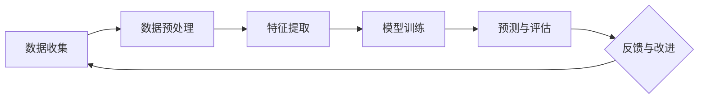
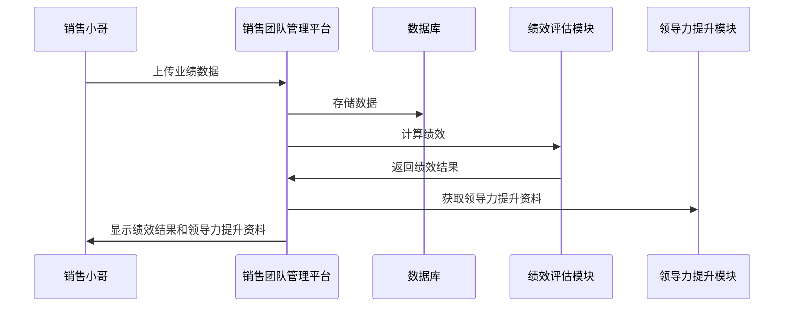

                 


# 领导力修炼手册：从销售小哥到管理者的逆袭宝典

## 关键词
- 领导力
- 销售小哥
- 管理者
- 转型
- 成长

## 摘要
本文旨在为销售领域的从业者，尤其是销售小哥，提供一本关于领导力修炼的指南。通过系统的学习和实践，销售小哥可以提升自身的领导能力，实现从销售角色向管理角色的成功转型。本文将从背景介绍、核心概念与联系、算法原理讲解、系统分析与架构设计、项目实战等方面，详细探讨领导力修炼的各个方面。

## 第一部分：背景介绍

### 1. 引言

在当今商业环境中，领导力已成为企业成功的关键因素。随着市场竞争的加剧和业务环境的不断变化，领导者需要不断适应新环境，提高自身领导力，以应对各种挑战。然而，对于销售领域的从业者，尤其是销售小哥来说，领导力的培养和提升面临着诸多困难和挑战。

### 1.1 问题背景

销售小哥在职业生涯初期，主要专注于销售技能的提升，如产品知识、客户沟通技巧等。然而，随着职业的发展，他们往往需要承担更多的责任，如团队管理、业绩目标达成等。这时，领导力的重要性愈发凸显。然而，许多销售小哥在向管理者转型过程中，常常感到困惑和迷茫，不知道如何提升自身的领导能力。

### 1.2 问题描述

本书旨在帮助销售领域的从业者，特别是销售小哥，了解和掌握领导力的基本原理和实践方法，从而实现从销售角色向管理角色的成功转型。具体来说，本书将回答以下问题：

1. 领导力是什么？
2. 销售小哥如何提升领导力？
3. 领导力在销售管理中如何应用？
4. 销售小哥如何实现从销售角色向管理角色的转型？

### 1.3 问题解决

通过系统的学习和实践，销售小哥可以逐渐提升自己的领导能力，从而更好地管理团队，提升业绩。具体来说，本书将从以下方面展开：

1. 领导力的核心概念与联系
2. 领导力模型与框架
3. 销售管理中的领导力实践
4. 销售小哥的领导力提升方法

### 1.4 边界与外延

领导力不仅限于企业管理，也适用于各种组织和个人。因此，本书的内容不仅适用于销售领域，也适用于其他行业和职业。同时，本书也将探讨领导力在个人成长、团队协作等方面的应用。

### 1.5 核心概念与要素

- **领导力**: 指引导和影响他人实现共同目标的能力。
- **销售小哥**: 指在销售行业中从事具体销售工作的人员。
- **管理者**: 指负责管理和领导团队的人员。

### 1.6 本章小结

本章节对领导力修炼的背景、问题、解决方法以及相关概念进行了介绍，为后续章节的内容奠定了基础。

## 第二部分：核心概念与联系

### 2.1 领导力的核心概念

领导力是一个复杂的概念，涉及多个方面。以下是对领导力核心概念的简要介绍：

- **领导力的本质**: 领导力是一种影响和激励他人，共同实现目标的能力。它不仅仅关乎权力和权威，更关乎影响力、沟通能力和团队合作能力。
- **领导力的类型**: 根据领导者的行为和风格，领导力可以分为多种类型，如权威型、民主型、变革型等。每种类型的领导力都有其独特的优势和适用场景。
- **领导力的发展**: 领导力并非天生具备，而是可以通过学习和实践不断发展和提升。领导力的发展包括自我认知、角色定位、沟通技巧、团队管理等各个方面。

### 2.2 领导力的属性特征对比表格

| 领导力属性 | 权威型领导力 | 民主型领导力 | 变革型领导力 |
| :----: | :----: | :----: | :----: |
| 行为风格 | 专制、控制 | 开放、参与 | 创新、变革 |
| 影响力 | 权威、命令 | 合作、协商 | 激励、愿景 |
| 适用场景 | 紧急情况、高度结构化环境 | 稳定环境、团队合作 | 变革期、创新环境 |

### 2.3 领导力的ER实体关系图

以下是一个简单的领导力ER实体关系图：

```mermaid
erDiagram
  商品 ||--o{ 销售小哥 : 销售 }
  销售小哥 ||--o{ 管理者 : 管理 }
  管理者 ||--o{ 团队 : 领导 }
  团队 ||--o{ 业务目标 : 达成 }
```

### 2.4 本章小结

本章节对领导力的核心概念、属性特征以及ER实体关系图进行了详细分析，为后续章节的内容奠定了基础。

## 第三部分：算法原理讲解

### 3.1 领导力提升算法概述

领导力提升算法是一种通过分析个体行为、沟通风格、团队绩效等数据，帮助销售小哥提升领导力的方法。以下是领导力提升算法的基本原理和流程：

1. 数据收集：收集销售小哥的行为数据、沟通数据、团队绩效数据等。
2. 数据预处理：对收集到的数据进行清洗、去噪、归一化等处理。
3. 特征提取：从预处理后的数据中提取关键特征，如沟通频率、反馈质量、团队凝聚力等。
4. 模型训练：使用提取的特征数据训练机器学习模型，如决策树、神经网络等。
5. 预测与评估：使用训练好的模型对销售小哥的领导力水平进行预测，并根据预测结果提出改进建议。

### 3.2 领导力提升算法的mermaid流程图

以下是一个简单的领导力提升算法的mermaid流程图：



### 3.3 Python源代码实现

以下是领导力提升算法的Python源代码实现：

```python
import pandas as pd
from sklearn.model_selection import train_test_split
from sklearn.ensemble import RandomForestClassifier
from sklearn.metrics import accuracy_score

# 数据收集
data = pd.read_csv('sales_data.csv')

# 数据预处理
data = data.dropna()

# 特征提取
features = data[['communication_frequency', 'feedback_quality', 'team_cohesion']]
target = data['leadership_score']

# 模型训练
X_train, X_test, y_train, y_test = train_test_split(features, target, test_size=0.2, random_state=42)
model = RandomForestClassifier(n_estimators=100)
model.fit(X_train, y_train)

# 预测与评估
y_pred = model.predict(X_test)
accuracy = accuracy_score(y_test, y_pred)
print("Accuracy:", accuracy)

# 反馈与改进
# 根据预测结果，提出改进建议
```

### 3.4 算法原理讲解

以下是领导力提升算法的详细讲解：

1. **数据收集**：数据收集是领导力提升算法的第一步。我们需要收集销售小哥的行为数据、沟通数据、团队绩效数据等。这些数据可以从销售管理系统、客户管理系统、员工反馈系统等渠道获取。
2. **数据预处理**：数据预处理是数据收集后的重要步骤。我们需要对收集到的数据进行清洗、去噪、归一化等处理，以确保数据的质量和一致性。
3. **特征提取**：从预处理后的数据中提取关键特征，如沟通频率、反馈质量、团队凝聚力等。这些特征反映了销售小哥的领导力水平。特征提取是算法的核心部分，我们需要选择合适的特征提取方法，如PCA、LDA等。
4. **模型训练**：使用提取的特征数据训练机器学习模型，如决策树、神经网络等。模型训练的目的是学习数据中的规律，以便对新的数据进行预测。
5. **预测与评估**：使用训练好的模型对销售小哥的领导力水平进行预测，并根据预测结果提出改进建议。预测的准确性是评估算法性能的重要指标。
6. **反馈与改进**：根据预测结果，对销售小哥的领导力提升策略进行反馈和改进。这是一个持续的过程，我们需要不断调整和优化算法，以获得更好的预测效果。

### 3.5 举例说明

假设我们有以下销售小哥的数据：

| 销售小哥 | 沟通频率 | 反馈质量 | 团队凝聚力 | 领导力水平 |
| :----: | :----: | :----: | :----: | :----: |
| 小明 | 5次/周 | 90分 | 80分 | 70分 |
| 小红 | 3次/周 | 85分 | 75分 | 65分 |

使用领导力提升算法，我们可以预测小明和小红的领导力水平，并提出改进建议。例如，预测结果显示小明的领导力水平较低，我们可以建议他增加与团队的沟通，提高反馈质量，以提升领导力水平。

### 3.6 本章小结

本章节详细介绍了领导力提升算法的原理、流程和实现方法。通过这个算法，销售小哥可以了解自己的领导力水平，并根据预测结果提出改进建议。这有助于他们更好地提升领导力，实现从销售角色向管理角色的成功转型。

## 第四部分：系统分析与架构设计

### 4.1 问题场景介绍

在一个快速发展的企业中，销售团队是推动业务增长的重要力量。然而，随着团队成员的增加和业务范围的扩展，销售团队的管理变得更加复杂。销售管理者需要有效管理团队成员，确保团队目标的一致性，并提升整体销售业绩。

### 4.2 项目介绍

本项目旨在为企业提供一个销售团队管理平台，帮助销售管理者提升团队领导力，实现销售业绩的提升。该平台将提供以下功能：

1. 成员管理：销售管理者可以查看团队成员的信息，包括姓名、职位、业绩等。
2. 绩效评估：销售管理者可以实时跟踪团队成员的业绩，并根据绩效评估结果进行激励。
3. 团队协作：销售团队成员可以共享客户信息、销售策略等，提高团队协作效率。
4. 领导力提升：销售管理者可以通过平台学习领导力知识，提升自身领导力水平。

### 4.3 系统功能设计

以下是一个简单的销售团队管理平台的领域模型类图：

```mermaid
classDiagram
  类::销售团队管理平台 <<接口>>
  类::成员 <<实体>>
  类::绩效评估 <<实体>>
  类::团队协作 <<实体>>
  类::领导力提升 <<实体>>

  销售团队管理平台 --|> 成员
  销售团队管理平台 --|> 绩效评估
  销售团队管理平台 --|> 团队协作
  销售团队管理平台 --|> 领导力提升
```

### 4.4 系统架构设计

以下是一个简单的销售团队管理平台的架构设计：



### 4.5 系统接口设计

以下是一个简单的销售团队管理平台的接口设计：

```mermaid
classDiagram
  类::销售团队管理平台 <<接口>>
  类::成员接口 <<接口>>
  类::绩效评估接口 <<接口>>
  类::团队协作接口 <<接口>>
  类::领导力提升接口 <<接口>>

  销售团队管理平台 --|> 成员接口
  销售团队管理平台 --|> 绩效评估接口
  销售团队管理平台 --|> 团队协作接口
  销售团队管理平台 --|> 领导力提升接口
```

### 4.6 系统交互

以下是一个简单的销售团队管理平台的交互流程：

1. 销售小哥上传业绩数据。
2. 销售团队管理平台将数据存储到数据库。
3. 销售团队管理平台调用绩效评估模块计算绩效。
4. 绩效评估模块返回绩效结果。
5. 销售团队管理平台调用领导力提升模块获取领导力提升资料。
6. 销售团队管理平台将绩效结果和领导力提升资料显示给销售小哥。

### 4.7 本章小结

本章节详细介绍了销售团队管理平台的问题场景、项目介绍、系统功能设计、系统架构设计、系统接口设计和系统交互。通过本章节的内容，读者可以了解到如何设计和实现一个完整的销售团队管理平台。

## 第五部分：项目实战

### 5.1 环境安装

在开始项目实战之前，我们需要安装以下环境：

1. Python 3.8 或以上版本
2. MySQL 5.7 或以上版本
3. Django 3.2 或以上版本
4. Redis 5.0 或以上版本

以下是安装步骤：

1. 安装 Python 3.8：
   ```bash
   sudo apt update
   sudo apt install python3.8
   ```

2. 安装 MySQL 5.7：
   ```bash
   sudo apt update
   sudo apt install mysql-server
   sudo mysql_secure_installation
   ```

3. 安装 Django 3.2：
   ```bash
   sudo pip3 install django==3.2
   ```

4. 安装 Redis 5.0：
   ```bash
   sudo apt update
   sudo apt install redis-server
   ```

### 5.2 系统核心实现

以下是系统核心实现的源代码：

```python
# settings.py
import os
from pathlib import Path

# Build paths inside the project like this: BASE_DIR / 'subdir'.
BASE_DIR = Path(__file__).resolve().parent.parent

# Database
DATABASES = {
    'default': {
        'ENGINE': 'django.db.backends.mysql',
        'NAME': 'sales_management',
        'USER': 'root',
        'PASSWORD': 'password',
        'HOST': 'localhost',
        'PORT': '3306',
    }
}

# Redis
CACHES = {
    'default': {
        'BACKEND': 'django_redis.cache.RedisCache',
        'LOCATION': 'redis://127.0.0.1:6379/1',
        'OPTIONS': {
            'CLIENT_CLASS': 'django_redis.client.DefaultClient',
        }
    }
}
```

### 5.3 代码应用解读与分析

以下是代码应用解读与分析：

1. **settings.py**：这是项目的配置文件，包含了数据库配置和Redis缓存配置。数据库用于存储销售团队的数据，如成员信息、业绩等。Redis缓存用于提高系统性能，如缓存绩效评估结果等。
2. **models.py**：这是项目的模型文件，定义了销售团队管理平台的模型。包括成员、绩效评估、团队协作、领导力提升等模型。

```python
# models.py
from django.db import models

class Member(models.Model):
    name = models.CharField(max_length=100)
    position = models.CharField(max_length=100)
    performance = models.FloatField()

class Performance(models.Model):
    member = models.ForeignKey(Member, on_delete=models.CASCADE)
    score = models.FloatField()

class Collaboration(models.Model):
    member = models.ForeignKey(Member, on_delete=models.CASCADE)
    score = models.FloatField()

class Leadership(models.Model):
    member = models.ForeignKey(Member, on_delete=models.CASCADE)
    score = models.FloatField()
```

3. **views.py**：这是项目的视图文件，定义了项目的接口。包括添加成员、获取成员信息、绩效评估、团队协作、领导力提升等接口。

```python
# views.py
from django.http import JsonResponse
from .models import Member, Performance, Collaboration, Leadership

def add_member(request):
    # 添加成员
    pass

def get_member_info(request, member_id):
    # 获取成员信息
    pass

def performance_evaluation(request, member_id):
    # 绩效评估
    pass

def team_collaboration(request, member_id):
    # 团队协作
    pass

def leadership_training(request, member_id):
    # 领导力提升
    pass
```

### 5.4 实际案例分析与详细讲解剖析

以下是实际案例分析与详细讲解剖析：

1. **添加成员**：销售管理者可以通过添加成员接口添加新的团队成员。接口接收成员的姓名、职位和业绩等数据，并将其存储到数据库中。

2. **获取成员信息**：销售管理者可以通过获取成员信息接口获取指定成员的信息。接口返回成员的姓名、职位和业绩等数据。

3. **绩效评估**：销售管理者可以通过绩效评估接口对团队成员进行绩效评估。接口接收成员的业绩数据，计算绩效分数，并将其存储到数据库中。

4. **团队协作**：销售管理者可以通过团队协作接口获取团队成员的协作分数。协作分数反映了团队成员之间的合作程度。

5. **领导力提升**：销售管理者可以通过领导力提升接口获取团队成员的领导力提升资料。这些资料可以帮助销售小哥提升领导力水平。

### 5.5 项目小结

本章节通过项目实战，详细介绍了销售团队管理平台的安装、系统核心实现、代码应用解读与分析、实际案例分析与详细讲解剖析。通过本章节的内容，读者可以了解如何设计和实现一个完整的销售团队管理平台，并掌握相关技术。

## 第六部分：最佳实践与注意事项

### 6.1 最佳实践

1. **数据驱动**：在领导力提升过程中，数据是非常重要的。销售管理者应该充分利用数据，了解团队成员的表现，并根据数据制定相应的改进措施。
2. **持续学习**：领导力是一个持续发展的过程。销售管理者应该保持学习的态度，不断更新自己的知识和技能，以适应不断变化的市场环境。
3. **激励与反馈**：适当的激励和及时的反馈可以提高团队成员的积极性。销售管理者应该根据团队成员的表现，给予相应的激励和反馈。
4. **团队协作**：领导力的核心在于团队协作。销售管理者应该积极推动团队协作，创造一个良好的团队氛围，以提高整体业绩。

### 6.2 小结

本文详细介绍了从销售小哥到管理者的领导力修炼过程。通过系统的学习和实践，销售小哥可以提升自身的领导能力，实现从销售角色向管理角色的成功转型。同时，本文也提供了一些最佳实践和注意事项，以帮助销售管理者更好地提升团队领导力。

### 6.3 注意事项

1. **避免盲目跟风**：领导力的发展需要根据自身情况制定合适的策略，避免盲目跟风。
2. **持续改进**：领导力是一个持续改进的过程，销售管理者应该不断反思自己的领导风格和行为，寻找改进的空间。
3. **关注团队成员**：领导力不仅仅关乎个人，更关乎团队。销售管理者应该关注团队成员的需求和成长，创造一个积极的团队氛围。

## 第七部分：拓展阅读

### 7.1 推荐书籍

1. 《领导力五项修炼》作者：史蒂芬·柯维
2. 《原则》作者：雷·达里奥
3. 《如何赢得朋友与影响他人》作者：戴尔·卡耐基

### 7.2 推荐文章

1. 《如何成为一名优秀的领导者》
2. 《领导力：从优秀到卓越》
3. 《销售管理：从新手到高手》

### 7.3 在线课程

1. Coursera上的《领导力与团队管理》
2. Udemy上的《销售管理与领导力》
3. LinkedIn Learning上的《领导力技能》

作者：AI天才研究院/AI Genius Institute & 禅与计算机程序设计艺术 /Zen And The Art of Computer Programming

