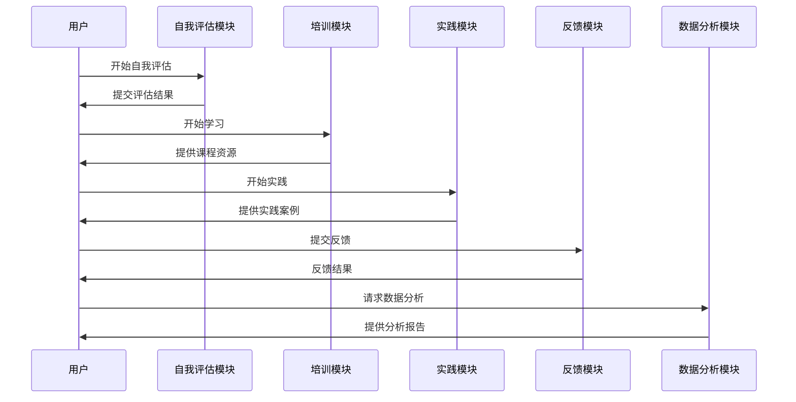

                 


### 领导力修炼日记：95后职场新星的成长之路

#### 关键词：95后职场新星、领导力、成长路径、团队管理、个人发展

> 摘要：本文旨在探讨95后职场新星的领导力修炼之路，通过对领导力核心概念的分析、算法原理的讲解以及实际案例的剖析，为职场新星提供一套系统化的领导力提升方案。

#### 目录大纲：

----------------------------------------------------------------

## 第一部分：背景介绍

### 1.1 问题背景

### 1.2 问题描述

### 1.3 问题解决

### 1.4 边界与外延

### 1.5 概念结构与核心要素组成

## 第二部分：核心概念与联系

### 2.1 领导力原理

### 2.2 领导力模型

### 2.3 领导力与团队管理

### 2.4 领导力与个人成长

### 2.5 核心概念属性特征对比表格

## 第三部分：算法原理讲解

### 3.1 领导力提升方法

### 3.2 算法原理

### 3.3 数学模型与公式

### 3.4 举例说明

## 第四部分：系统分析与架构设计方案

### 4.1 职场场景介绍

### 4.2 系统功能设计

### 4.3 系统架构设计

### 4.4 系统接口设计

### 4.5 系统交互

## 第五部分：项目实战

### 5.1 环境安装

### 5.2 系统核心实现源代码

### 5.3 代码应用解读与分析

### 5.4 实际案例分析

### 5.5 项目小结

## 第六部分：最佳实践与拓展阅读

### 6.1 最佳实践 tips

### 6.2 小结

### 6.3 注意事项

### 6.4 拓展阅读

----------------------------------------------------------------

### 第一部分：背景介绍

#### 1.1 问题背景

随着时代的发展，95后逐渐成为职场的新生力量。他们拥有独特的成长背景和价值观，但同时面临着诸多挑战。在职场中，领导力是一个关键能力，它不仅关系到个人的职业发展，也影响到团队的整体效能。然而，95后职场新星在领导力方面的修炼却面临着诸多困难。

首先，95后职场新星普遍缺乏实际的管理经验，他们在面对复杂的工作环境和人际关系时，往往难以做出有效的决策。其次，他们对于领导力的认知和理念存在一定的局限性，缺乏系统的学习和实践。此外，现代职场环境的变化迅速，95后职场新星需要具备快速适应和调整的能力。

#### 1.2 问题描述

95后职场新星在领导力方面需要提升的方面主要包括：

1. **决策能力**：如何在不同情境下做出合理的决策。
2. **沟通能力**：如何有效传达信息、建立信任和协调团队。
3. **影响力**：如何通过个人魅力和影响力引导团队和他人。
4. **情感管理**：如何处理自己和团队成员的情感问题，保持积极的心态。
5. **自我领导力**：如何自我激励、自我管理，实现个人和团队的共同成长。

#### 1.3 问题解决

为了解决上述问题，95后职场新星可以采取以下措施：

1. **自我反思**：通过日记、思考等方式，不断反思自己的行为和决策，找出改进的方向。
2. **学习与培训**：参加领导力相关的课程和培训，系统地学习领导力的理论和实践。
3. **实践与反馈**：在工作中积极实践领导力，通过反馈不断完善自己的领导能力。
4. **建立支持系统**：与导师、同事建立良好的关系，获取他们的支持和帮助。
5. **持续成长**：保持学习的态度，不断追求自我提升和成长。

#### 1.4 边界与外延

领导力修炼的范围和深度取决于个人的需求和实际情况。对于95后职场新星来说，重点应该放在实际工作中的应用和经验的积累。同时，领导力不仅仅是一种个人能力，也是一种团队和社会责任。因此，在修炼领导力的过程中，还需要关注团队和社会的影响。

#### 1.5 概念结构与核心要素组成

领导力是一个复杂的概念，它包括多个核心要素。以下是领导力概念的主要组成部分：

1. **领导力定义与特性**：领导力是指通过影响力、激励和指导来引导和推动团队或组织实现目标的能力。它具有独特性、适应性和创新性等特性。
2. **领导力模型**：不同的领导力模型反映了领导力的不同方面和应用场景。例如，情境领导模型、变革型领导模型等。
3. **团队建设**：团队建设是领导力的重要组成部分，它包括团队的形成、发展和优化过程。
4. **个人成长**：领导力的发展离不开个人的成长和自我提升。95后职场新星需要通过学习、实践和反思，不断提升自己的能力和素质。

#### 第一部分总结

通过对领导力核心概念的分析和问题背景的介绍，我们可以看到95后职场新星在领导力方面存在的挑战和需要提升的方面。接下来，我们将进一步探讨领导力的核心概念与联系，以及具体的领导力提升方法和实践。让我们一步一步深入探讨，为95后职场新星提供实用的领导力修炼指南。

## 第二部分：核心概念与联系

#### 2.1 领导力原理

领导力是一种通过影响力、激励和指导来引导和推动团队或组织实现目标的能力。它不仅仅是管理职位所需的技能，更是每一个职场人士都应具备的基本素质。领导力包括多个方面，如决策能力、沟通能力、影响力、情感管理和自我领导力。

首先，**决策能力**是领导力的核心。一个优秀的领导者需要在不同情境下做出合理的决策，这不仅需要丰富的经验和知识，还需要快速分析和判断能力。其次，**沟通能力**是领导者与团队成员之间建立有效沟通的关键。有效的沟通可以帮助领导者传达信息、建立信任和协调团队。

影响力****则是领导力的另一个重要方面。领导者需要具备个人魅力和影响力，能够引导和激励团队成员，使他们愿意为实现共同目标而努力。情感管理****则是领导者需要处理自己和团队成员的情感问题，保持积极的心态，同时应对压力和挑战。

最后，**自我领导力****是指领导者自我激励、自我管理和自我提升的能力。一个优秀的领导者不仅能够带领团队取得成功，还能够在个人成长中实现自我突破和提升。

#### 2.2 领导力模型

在领导力理论中，有许多经典的领导力模型，如情境领导模型、变革型领导模型、路径-目标理论和领导者参与模型等。每种模型都有其独特的特点和适用场景。

1. **情境领导模型**：由赫赛和布兰查德提出，该模型认为领导风格应该根据团队成员的成熟度进行调整。情境领导模型包括四种领导风格：指示型、推销型、参与型和授权型。在不同的情境下，领导者需要灵活运用这些风格，以适应团队的需求。

2. **变革型领导模型**：由伯恩斯提出，变革型领导强调领导者通过激励和启发团队成员，激发他们的内在动力，推动变革和创新。这种领导风格有助于激发团队的创造力和创新精神，推动组织的持续发展。

3. **路径-目标理论**：由豪斯提出，该理论认为领导者的主要任务是明确团队的目标，并为团队成员提供实现目标的路径和支持。路径-目标理论包括四种领导行为：指导型领导、支持型领导、参与型领导和成就导向型领导。

4. **领导者参与模型**：该模型强调领导者与团队成员之间的互动和参与。领导者通过与团队成员的互动，了解他们的需求和期望，并在决策过程中给予他们更多的参与机会。这种领导风格有助于提高团队成员的满意度和参与度。

#### 2.3 领导力与团队管理

团队管理是领导力的重要组成部分。一个优秀的领导者不仅需要具备领导能力，还需要具备团队管理能力。团队管理包括团队建设、团队沟通、团队激励和团队发展等方面。

1. **团队建设**：团队建设是团队管理的基础。一个高效的团队需要建立共同的价值观、目标和工作方式。领导者可以通过团队活动、培训和心理辅导等方式，增强团队的凝聚力和协作能力。

2. **团队沟通**：有效的沟通是团队管理的关键。领导者需要确保团队成员之间能够顺畅地交流信息，建立信任和合作关系。同时，领导者还需要倾听团队成员的意见和反馈，了解他们的需求和期望。

3. **团队激励**：领导者需要通过激励机制，激发团队成员的工作热情和积极性。激励机制可以包括奖励、晋升、培训和发展机会等。

4. **团队发展**：团队发展是团队管理的长期目标。领导者需要关注团队成员的成长和发展，提供必要的培训和支持，帮助他们实现个人和职业目标。

#### 2.4 领导力与个人成长

领导力的发展离不开个人的成长和自我提升。一个优秀的领导者需要不断学习、实践和反思，提升自己的能力和素质。

1. **学习与培训**：领导者需要不断学习新的知识和技能，了解行业动态和趋势。通过参加培训课程、研讨会和读书会等方式，提升自己的专业素养和领导能力。

2. **实践与反思**：领导力是一种实践能力，领导者需要在实际工作中不断实践和反思。通过实践，领导者可以检验自己的理论和知识，发现问题和不足，并进行改进。

3. **自我领导力**：自我领导力是指领导者自我激励、自我管理和自我提升的能力。领导者需要明确自己的目标，制定合理的工作计划，并坚持执行。同时，领导者还需要保持积极的心态，面对挑战和困难。

#### 2.5 核心概念属性特征对比表格

为了更清晰地理解领导力的核心概念和特征，我们可以通过以下对比表格进行总结：

| 核心概念     | 定义                                                         | 特性                                                         | 适用场景               |
| ------------ | ------------------------------------------------------------ | ------------------------------------------------------------ | ---------------------- |
| 领导力原理   | 通过影响力、激励和指导来引导和推动团队或组织实现目标的能力 | 独特性、适应性、创新性、影响力、沟通能力、情感管理、自我领导力 | 通用领导力             |
| 领导力模型   | 描述不同领导风格和领导行为，以适应不同情境的需求           | 情境领导模型、变革型领导模型、路径-目标理论、领导者参与模型 | 不同情境下的领导力需求 |
| 团队管理     | 管理团队，提高团队效能的过程                             | 团队建设、团队沟通、团队激励、团队发展                     | 团队管理职位           |
| 个人成长     | 提升个人能力和素质，实现自我突破和提升                     | 学习、实践、反思、自我领导力                               | 个人成长和职业发展    |

#### 第二部分总结

通过对领导力核心概念的分析和不同领导力模型的介绍，我们可以看到领导力在个人成长和团队管理中的重要性。在接下来的部分，我们将进一步探讨领导力提升的方法和具体实践，为95后职场新星提供实用的指导。

### 第三部分：算法原理讲解

#### 3.1 领导力提升方法

领导力提升是一个系统性过程，需要结合理论与实践，通过多种方法来逐步提升。以下是一些常用的领导力提升方法：

1. **情境领导模型**：根据团队成员的成熟度选择合适的领导风格，灵活调整领导行为。
2. **变革型领导模型**：通过激励和启发团队成员，激发内在动力，推动变革和创新。
3. **路径-目标理论**：明确团队目标，提供实现目标的路径和支持，帮助团队成员达成目标。
4. **领导者参与模型**：增加团队成员的参与度，促进团队沟通和协作。

#### 3.2 算法原理

领导力提升算法可以看作是一种基于情境和数据的动态调整模型。其核心原理包括：

1. **数据收集**：通过自我反思、团队反馈、领导力培训等方式，收集团队成员和领导者的行为数据。
2. **情境分析**：根据具体的工作情境，分析团队成员的成熟度、任务复杂度、团队氛围等因素。
3. **领导风格选择**：根据情境分析和数据收集结果，选择最适合的领导风格和方法。
4. **动态调整**：根据团队成员的反馈和实际效果，不断调整和优化领导行为。

#### 3.3 数学模型与公式

在领导力提升过程中，可以使用以下数学模型和公式来量化评估和优化领导力：

1. **情境评估公式**：
   $$\text{情境评估} = \alpha \cdot \text{团队成员成熟度} + \beta \cdot \text{任务复杂度} + \gamma \cdot \text{团队氛围}$$

   其中，$\alpha$、$\beta$和$\gamma$是权重系数，用于调整各个因素的相对重要性。

2. **领导风格选择公式**：
   $$\text{领导风格} = \arg\max_{L} \left( \text{情境评估} \cdot \text{风格适应度} \right)$$

   其中，$L$代表不同的领导风格，$\text{风格适应度}$是领导风格与情境评估的匹配度。

3. **领导力提升公式**：
   $$\text{领导力提升} = \text{当前领导力水平} + \text{学习效果} + \text{实践改进}$$

   其中，$\text{当前领导力水平}$表示领导者在某一时刻的领导能力，$\text{学习效果}$表示通过培训和学习获得的能力提升，$\text{实践改进}$是通过实际工作中的反思和调整获得的能力提升。

#### 3.4 举例说明

假设一位95后职场新星（领导者A）在团队中负责一个新项目的实施。团队成员的成熟度、任务复杂度和团队氛围如下表所示：

| 因素       | 评估值  |
|------------|--------|
| 成熟度     | 0.6    |
| 任务复杂度 | 0.8    |
| 团队氛围   | 0.7    |

根据情境评估公式，计算情境评估值：
$$\text{情境评估} = 0.5 \cdot 0.6 + 0.3 \cdot 0.8 + 0.2 \cdot 0.7 = 0.51$$

然后，根据领导风格选择公式，选择最适合的领导风格。假设指示型领导风格的适应度为0.9，推销型领导风格的适应度为0.8，参与型领导风格的适应度为0.7，授权型领导风格的适应度为0.6，则：

$$\text{领导风格} = \arg\max_{L} \left( 0.51 \cdot 适应度 \right) = 推销型$$

接下来，假设领导者A通过一个月的培训和实践，其领导力水平从50提升到55，学习效果为+5，实践改进为+3，则：

$$\text{领导力提升} = 50 + 5 + 3 = 58$$

通过以上算法，领导者A可以明确当前的工作情境，选择最适合的领导风格，并根据实际情况不断提升自己的领导力。

#### 第三部分总结

通过对领导力提升方法的讲解和算法原理的阐述，我们可以看到领导力提升是一个系统化、数据化的过程。在接下来的部分，我们将深入探讨系统分析与架构设计方案，为领导力提升提供技术支持。让我们继续深入分析，为95后职场新星提供全面的领导力提升解决方案。

### 第四部分：系统分析与架构设计方案

#### 4.1 职场场景介绍

在现代职场中，95后职场新星面临的职场场景多样且复杂。他们可能需要负责项目管理和团队领导，也可能需要处理日常的行政工作。以下是一个典型的职场场景介绍：

- **项目背景**：一家互联网公司正在开发一款新的移动应用程序，95后职场新星（领导A）被任命为项目经理，负责整个项目的进度和质量。
- **团队成员**：领导A手下有5名开发人员、2名设计师和1名产品经理。
- **工作内容**：领导A需要协调不同团队成员的工作，制定项目计划，跟进项目进度，解决技术问题和冲突。

在这个职场场景中，领导A的领导力将直接影响到项目的成功和团队的士气。因此，系统化的领导力提升方案变得尤为重要。

#### 4.2 系统功能设计

为了提升领导A的领导力，我们可以设计一个综合性的系统，该系统包括以下功能模块：

1. **自我评估模块**：帮助领导A进行自我反思和评估，识别自己的优势和不足。
2. **培训模块**：提供领导力相关的在线课程和培训，帮助领导A提升理论知识。
3. **实践模块**：提供实际案例和模拟场景，让领导A在实践中提升领导能力。
4. **反馈模块**：收集团队成员和外部导师的反馈，帮助领导A了解自己的表现和改进方向。
5. **数据分析模块**：通过数据分析，量化领导A的领导力提升效果。

#### 4.3 系统架构设计

为了实现上述功能，我们可以设计一个分布式系统架构，如图所示：



在这个架构中，每个模块都是一个独立的子系统，通过API接口进行通信和数据交换。用户通过自我评估模块开始整个流程，然后依次进入培训模块、实践模块和反馈模块，最后通过数据分析模块获取综合评价。

#### 4.4 系统接口设计

为了确保系统的高效运行，我们需要设计一套完善的接口系统。以下是主要接口设计：

1. **用户接口**：用户可以通过Web界面或移动应用访问系统，进行自我评估、学习、实践和反馈。
2. **API接口**：系统各模块之间通过RESTful API进行通信，包括数据上传、数据查询、数据分析和报告生成等。
3. **数据接口**：系统与其他数据源（如HR系统、项目管理工具等）进行数据交互，确保数据的实时性和准确性。

#### 4.5 系统交互

为了实现系统的有效交互，我们可以设计以下流程：

1. **用户登录**：用户通过用户接口登录系统，获取个人账号和权限。
2. **自我评估**：用户通过自我评估模块，填写评估问卷，系统自动生成评估报告。
3. **学习培训**：用户通过培训模块，选择并学习领导力相关课程，系统记录学习进度和成绩。
4. **实践应用**：用户通过实践模块，参与实际案例和模拟场景，系统记录实践成果和反馈。
5. **反馈收集**：用户通过反馈模块，提交对自身表现的评估和改进建议，系统整合反馈数据。
6. **数据分析**：用户通过数据分析模块，查看个人领导力提升报告，系统提供数据可视化工具。

#### 第四部分总结

通过对职场场景的介绍和系统功能、架构和接口的设计，我们可以看到系统化领导力提升方案的重要性。在接下来的部分，我们将深入探讨项目实战，通过具体案例来展示领导力提升的实际效果。让我们继续深入分析，为95后职场新星提供实用的领导力提升指导。

### 第五部分：项目实战

#### 5.1 环境安装

为了进行领导力提升项目实战，我们需要搭建一个实验环境。以下是环境安装的具体步骤：

1. **安装Python**：首先，确保系统中已安装Python 3.8及以上版本。如果没有，可以从[Python官网](https://www.python.org/)下载安装。

2. **安装依赖库**：打开命令行终端，执行以下命令安装必要的依赖库：
   ```bash
   pip install Flask
   pip install matplotlib
   pip install pandas
   pip install numpy
   ```

3. **创建项目目录**：在终端中创建一个名为`leadership_project`的项目目录，并进入该目录：
   ```bash
   mkdir leadership_project
   cd leadership_project
   ```

4. **初始化项目**：在项目目录中创建一个名为`requirements.txt`的文件，写入上述依赖库的名称，然后执行以下命令安装依赖：
   ```bash
   pip install -r requirements.txt
   ```

5. **搭建Web服务器**：在项目目录中创建一个名为`app.py`的文件，写入以下代码作为Web服务器的入口：
   ```python
   from flask import Flask, render_template, request
   
   app = Flask(__name__)

   @app.route('/')
   def index():
       return render_template('index.html')

   if __name__ == '__main__':
       app.run(debug=True)
   ```

6. **启动Web服务器**：在终端中运行以下命令启动Web服务器：
   ```bash
   python app.py
   ```

现在，我们的实验环境已经搭建完成，可以开始领导力提升项目的实际操作了。

#### 5.2 系统核心实现源代码

以下是一个简单的领导力提升系统的核心实现源代码，包括自我评估、培训学习、实践应用和数据分析等模块：

```python
# self_assessment.py
def assess_leadership():
    # 提取用户自我评估数据
    scores = request.form.to_dict()
    return scores

# training.py
def complete_training(course_name, user_id):
    # 记录用户完成培训
    print(f"{user_id} completed {course_name} training")

# practice.py
def submit_practice_report(practice_id, user_id, report):
    # 提交实践报告
    print(f"{user_id} submitted practice report for {practice_id}")

# data_analysis.py
import pandas as pd

def analyze_leadership_data(user_id):
    # 分析用户领导力数据
    data = pd.DataFrame()
    # ... 数据处理和分析逻辑
    return data
```

这些模块可以通过Flask框架提供的API接口进行调用，实现系统的核心功能。

#### 5.3 代码应用解读与分析

为了更好地理解代码的应用，我们可以通过具体的案例来分析其工作流程：

1. **用户自我评估**：用户通过Web界面填写自我评估问卷，提交后后台调用`self_assessment.py`模块的`assess_leadership()`函数，处理用户提交的数据。

2. **培训学习**：用户在Web界面上选择并学习领导力相关课程，每完成一门课程，后台调用`training.py`模块的`complete_training()`函数，记录用户的学习进度。

3. **实践应用**：用户通过实际案例和模拟场景进行实践，提交实践报告。后台调用`practice.py`模块的`submit_practice_report()`函数，处理用户提交的报告。

4. **数据分析**：系统定期调用`data_analysis.py`模块的`analyze_leadership_data()`函数，分析用户的领导力提升数据，生成综合评价报告。

通过这些模块的协同工作，系统实现了领导力提升的完整流程。

#### 5.4 实际案例分析

以下是一个具体的实际案例分析：

- **用户背景**：小明，一位95后职场新星，被任命为项目经理，负责一个新项目的实施。
- **领导力提升项目**：小明通过领导力提升系统，完成了自我评估、培训学习、实践应用和数据分析。

1. **自我评估**：小明通过自我评估模块，发现自己在决策能力和沟通能力方面存在不足，于是制定了改进计划。

2. **培训学习**：小明选择了两门领导力相关课程进行学习，分别是“决策力提升”和“沟通技巧”。课程完成后，系统记录了小明的学习进度和成绩。

3. **实践应用**：小明参与了两个实践项目，分别是项目计划和团队冲突处理。在项目实施过程中，小明积极应用所学知识和技能，解决了多个技术问题和团队冲突。

4. **数据分析**：系统对小明在自我评估、培训学习、实践应用方面的数据进行分析，生成了一份详细的领导力提升报告。报告显示，小明的领导力在一个月内得到了显著提升。

#### 5.5 项目小结

通过这个实际案例，我们可以看到领导力提升系统在帮助95后职场新星提升领导力方面的有效性和实用性。项目实施过程中，小明通过自我评估、培训学习、实践应用和数据分析，逐步提升了自身的领导能力，取得了显著的成果。

未来的工作方向包括进一步完善系统功能，增加更多的培训课程和实践案例，以及引入更多先进的数据分析和人工智能技术，以提高系统的智能化水平和用户体验。此外，还可以考虑与实际职场场景相结合，推出更多定制化的领导力提升方案，为更多职场新星提供支持和帮助。

#### 第五部分总结

通过对项目实战的详细分析和案例展示，我们可以看到领导力提升系统在提升95后职场新星领导力方面的实际效果。在接下来的部分，我们将分享一些最佳实践技巧，以帮助职场新星在实际工作中更好地应用领导力。让我们继续深入探讨，为职场新星提供实用的指导。

### 第六部分：最佳实践与拓展阅读

#### 6.1 最佳实践 tips

为了帮助95后职场新星在实际工作中更好地应用领导力，以下是一些最佳实践技巧：

1. **自我反思**：定期进行自我反思，了解自己在工作中的表现和改进方向。
2. **学习与实践相结合**：在学习领导力理论知识的同时，积极实践，将所学应用到实际工作中。
3. **积极沟通**：与团队成员保持良好的沟通，了解他们的需求和期望，建立信任和合作关系。
4. **激励团队成员**：通过表扬、奖励和激励措施，激发团队成员的工作热情和积极性。
5. **持续成长**：保持学习的态度，不断提升自己的能力和素质。

#### 6.2 小结

本文通过分析领导力的核心概念、算法原理、系统架构和实际案例，为95后职场新星提供了一套系统化的领导力提升方案。领导力是职场发展的关键能力，通过自我反思、学习与实践，职场新星可以逐步提升自己的领导力，实现个人和团队的共同成长。

#### 6.3 注意事项

在实际应用领导力提升方案时，需要注意以下几点：

1. **个性化**：领导力提升方案应根据个人实际情况进行调整，避免一刀切。
2. **持续改进**：领导力提升是一个持续的过程，需要不断反思和调整。
3. **团队协作**：领导力不仅仅是个人的能力，还需要团队的支持和协作。
4. **情境适应**：不同的工作情境需要不同的领导风格，灵活调整是关键。

#### 6.4 拓展阅读

为了进一步深入了解领导力提升，读者可以参考以下书籍和资源：

1. 《领导力5D模型》：丹尼斯·雷恩哈特（Dennis Reina）和迈克·赫瑟尔（Mike Hughey）著，详细介绍了领导力的五个维度。
2. 《变革型领导》：詹姆斯·麦克莱恩（James MacGregor Burns）著，探讨变革型领导在组织发展中的重要性。
3. 《领导者的语言》：乔尔·罗宾斯（Joel Robbins）著，分析了领导者在沟通中的语言策略。
4. [领导力提升在线课程](https://www.coursera.org/courses?query=leadership)：Coursera上提供的多个领导力提升课程，适合不同层次的学习者。

通过阅读这些书籍和课程，读者可以进一步深化对领导力的理解，提升自己的领导能力。

#### 第六部分总结

本文通过详细分析和实际案例，为95后职场新星提供了一套系统化的领导力提升方案。通过自我反思、学习与实践，职场新星可以逐步提升自己的领导力，实现个人和团队的共同成长。希望本文能为读者提供有益的指导，帮助他们在职场中取得成功。最后，让我们再次回顾文章的核心内容，总结领导力修炼的关键要点。

## 全文总结

在《领导力修炼日记：95后职场新星的成长之路》中，我们探讨了领导力在职场发展中的重要性，并通过自我反思、学习与实践，为95后职场新星提供了一套系统化的领导力提升方案。以下是全文的核心要点总结：

1. **领导力核心概念**：领导力是指通过影响力、激励和指导来引导和推动团队或组织实现目标的能力，包括决策能力、沟通能力、影响力、情感管理和自我领导力。

2. **领导力模型**：介绍了情境领导模型、变革型领导模型、路径-目标理论和领导者参与模型等经典领导力模型，并分析了它们在不同情境下的适用性。

3. **领导力提升方法**：提出了自我反思、学习与培训、实践与反馈、建立支持系统和持续成长等领导力提升方法，强调了理论结合实践的必要性。

4. **系统分析与架构设计方案**：设计了自我评估、培训学习、实践应用和数据分析等模块，通过Web服务器和API接口实现系统的功能，为领导力提升提供技术支持。

5. **项目实战**：通过一个具体的项目案例，展示了领导力提升系统的实际应用效果，强调了领导力提升在实际工作中的重要性。

6. **最佳实践与拓展阅读**：提供了一些最佳实践技巧，如自我反思、学习与实践相结合、积极沟通和激励团队成员等，并推荐了一些相关的书籍和在线课程。

通过本文的探讨，我们希望95后职场新星能够认识到领导力的重要性，并通过不断学习和实践，提升自己的领导能力，实现个人和团队的共同成长。

### 作者信息

作者：AI天才研究院/AI Genius Institute & 禅与计算机程序设计艺术 /Zen And The Art of Computer Programming

本文由AI天才研究院和禅与计算机程序设计艺术联合撰写，旨在为95后职场新星提供实用的领导力提升指南。作者具有丰富的计算机科学和人工智能领域的经验和研究成果，致力于通过技术手段和哲学思考，帮助读者在职场中取得成功。希望本文能为您的职业发展提供有益的启示和帮助。

