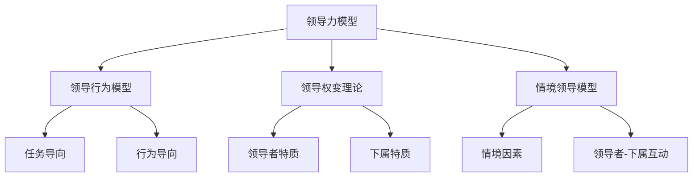

                 

### 文章标题

# 领导力修炼日记：一个HR经理的蜕变历程

> 关键词：HR经理，领导力，职业成长，管理实践，经验分享

> 摘要：本文通过一个HR经理的真实成长经历，详细阐述了领导力在职业发展中的重要性。从初入职场的困惑，到逐步掌握领导力的核心概念和方法，再到实际工作中的应用与反思，本文将带领读者深入了解领导力的魅力和修炼之道。

## 目录大纲设计思路

在设计《领导力修炼日记：一个HR经理的蜕变历程》的目录大纲时，我们首先需要明确书的核心内容与结构。本书的目标是记录一个HR经理在领导力方面的成长历程，从初入职场的迷茫，到逐渐成熟并能够独立处理各种人力资源问题的过程。因此，目录大纲的设计应围绕以下几个核心部分展开：

1. **序言与前言**：介绍书籍的创作背景、作者的经历以及读者对象。
2. **背景介绍**：讲述HR经理角色、领导力的重要性以及本书的核心概念。
3. **核心概念与联系**：详细阐述领导力的核心概念、特点以及与其他管理知识的联系。
4. **实践篇**：通过案例分析和实际经验分享，展现HR经理如何运用领导力解决实际问题。
5. **反思与总结**：对整个成长历程进行总结，提出个人感悟和未来展望。

### 第1章: 引言

#### 1.1 序言

**书的创作背景**：随着商业环境的快速变化，企业对HR经理的角色要求也越来越高。领导力作为HR经理的核心能力之一，越来越受到重视。本书旨在记录一个HR经理在领导力方面的成长历程，为HR从业者提供有价值的参考。

**作者的经历**：作者曾在多家知名企业担任HR经理，积累了丰富的实践经验。在领导力修炼的过程中，作者深刻体会到领导力对于个人职业发展的重要性，因此决定将这一过程记录下来，与读者分享。

**读者对象**：本书的目标读者包括HR从业者、管理人员以及对领导力感兴趣的读者。

#### 1.2 前言

**为什么要写这本书**：领导力在职场中的重要性不言而喻。通过本书，作者希望将自己的经验和心得分享给读者，帮助他们在领导力方面取得进步。

**如何阅读这本书**：本书分为多个章节，每个章节都有明确的主题和目标。读者可以根据自己的需求和兴趣选择阅读。建议读者按照书的结构逐步阅读，以便更好地理解领导力的概念和应用。

### 第2章: HR经理的角色与领导力

#### 2.1 HR经理的角色

**HR经理的工作职责**：HR经理是企业内部的重要角色，负责招聘、培训、绩效管理、员工关系等各项工作。他们的工作不仅关乎企业的人力资源管理，也直接影响到企业的运营和发展。

**HR经理在组织中的定位**：HR经理在组织中的地位越来越重要。他们不仅要具备人力资源管理的专业知识，还需要具备良好的领导力和沟通能力，以协调各部门的工作，促进企业的持续发展。

#### 2.2 领导力的重要性

**领导力在HR工作中的应用**：领导力在HR工作中具有重要作用。HR经理需要通过领导力来影响和激励员工，提高员工的满意度和绩效。同时，领导力也是HR经理自身职业发展的关键。

**领导力的定义与特点**：领导力是一种通过影响力、愿景、价值观等手段，引导和激励他人实现目标的能力。它具有以下特点：

- **影响力**：领导力需要具备一定的个人魅力和影响力，以影响他人的行为和思想。
- **愿景**：领导力需要有明确的愿景和目标，以引领团队朝着正确的方向前进。
- **价值观**：领导力需要具备良好的价值观，以赢得员工的信任和尊重。

#### 2.3 领导力与其他管理知识的联系

**领导力与管理学的结合**：领导力与管理学密切相关。领导力需要建立在管理学的基础上，如组织行为学、人力资源管理、战略管理等。同时，领导力又为管理学提供了实践指导和方向。

**领导力与领导风格**：领导风格是领导力的重要组成部分。不同的领导风格适用于不同的情境和团队。HR经理需要根据实际情况选择合适的领导风格，以实现最佳的管理效果。

### 第3章: 领导力核心概念与原理

#### 3.1 领导力的核心概念

**领导力的定义**：领导力是一种通过影响力、愿景、价值观等手段，引导和激励他人实现目标的能力。它不仅关乎个人魅力，更涉及组织管理和团队协作。

**领导力的层次**：领导力可以分为多个层次，如技术领导力、变革领导力、战略领导力等。不同层次的领导力适用于不同的场景和目标。

#### 3.2 领导力的原理

**领导力模型**：常见的领导力模型包括领导行为模型、领导权变理论、情境领导模型等。这些模型为HR经理提供了有效的领导力工具和方法。

**领导力的要素**：领导力的要素包括影响力、沟通能力、决策能力、自我认知、团队建设等。这些要素相互关联，共同构成了领导力的核心。

#### 3.3 领导力的特点与挑战

**领导力的特点**：领导力具有以下特点：

- **影响力**：领导力需要具备一定的个人魅力和影响力，以影响他人的行为和思想。
- **愿景**：领导力需要有明确的愿景和目标，以引领团队朝着正确的方向前进。
- **价值观**：领导力需要具备良好的价值观，以赢得员工的信任和尊重。

**领导力的挑战**：在职场中，HR经理可能会遇到以下领导力挑战：

- **沟通障碍**：有效沟通是领导力的关键，但很多HR经理在沟通方面存在困难。
- **决策压力**：在复杂多变的环境中，HR经理需要做出快速而准确的决策，但决策过程中可能面临各种压力和风险。
- **团队建设**：打造一个高效、和谐的团队是HR经理的重要任务，但团队建设过程中可能会遇到各种挑战。

### 第4章: 领导力修炼与实践

#### 4.1 领导力修炼方法

**自我认知与提升**：HR经理需要不断进行自我反思和提升，以增强自己的领导力。可以通过阅读领导力书籍、参加培训课程、进行实践反思等方式，提升自我认知和领导力水平。

**团队建设与管理**：HR经理需要掌握团队建设和管理的方法，以打造一个高效、和谐的团队。可以通过建立共同目标、培养团队成员能力、激励员工等手段，提升团队绩效。

#### 4.2 领导力实践案例分析

**案例一**：分析一个成功的领导力实践案例，探讨其成功的原因。

**案例二**：分析一个失败的领导力实践案例，反思其中的问题及改进措施。

#### 4.3 领导力应用场景

**HR经理的日常工作应用**：介绍领导力在HR经理日常工作中的应用场景，如招聘、培训、绩效管理等。

**跨部门合作与沟通**：探讨领导力在跨部门合作和沟通中的重要性，如何通过领导力实现跨部门的协同与协作。

### 第5章: 反思与成长

#### 5.1 成长历程回顾

**蜕变历程**：回顾HR经理的蜕变过程，分析关键节点和转折点。

**成长心得**：分享在领导力修炼过程中的心得体会和感悟。

#### 5.2 反思与总结

**反思自己的领导力**：对自己在领导力方面的表现进行客观评价和反思。

**未来展望**：对未来领导力提升的规划和目标。

#### 5.3 给同行的建议

**领导力提升策略**：给HR同行一些建议，如何提升自己的领导力。

**个人品牌建设**：探讨如何建立和维护个人的职业品牌。

### 第6章: 领导力拓展与实践

#### 6.1 领导力拓展

**领导力书籍推荐**：推荐一些有影响力的领导力书籍，如《领导力五要素》、《领导力的五个层次》等。

**领导力培训课程**：介绍一些实用的领导力培训课程，如《卓越领导力培训》、《领导力实战》等。

#### 6.2 领导力实践

**实战案例分享**：分享更多HR经理在领导力实践中的案例，如如何通过领导力提升团队绩效、如何解决跨部门沟通难题等。

**经验教训**：总结领导力实践中的经验和教训，为读者提供有价值的参考。

### 第7章: 结语

#### 7.1 小结

**书的总结**：对全书的内容进行简要总结。

**读后感**：分享作者对本书的感悟和期待。

---

**作者信息**：

作者：AI天才研究院/AI Genius Institute & 禅与计算机程序设计艺术 /Zen And The Art of Computer Programming

---

在撰写本文的过程中，我们将遵循上述目录大纲的结构，确保文章内容的完整性、逻辑性和专业性。每章的内容将详细阐述相应的主题，结合实际案例和实践经验，帮助读者更好地理解领导力的核心概念和应用。让我们一起来探索领导力的魅力，共同成长！### 第1章：引言

#### 1.1 序言

**书的创作背景**：

在当今快速变化的商业环境中，企业面临着前所未有的挑战和机遇。作为企业核心资源的HR经理，其角色和职责也在不断演变。从传统的招聘、培训、薪酬管理等基础工作，到如今的战略伙伴、变革推动者，HR经理需要具备更高的综合素质，尤其是领导力。本文旨在记录一个HR经理在领导力方面的成长历程，通过分享个人经历和心得，为HR从业者提供有价值的参考和启示。

**作者的经历**：

作者曾在多家知名企业担任HR经理，拥有超过15年的HR管理经验。在这期间，作者经历了从初出茅庐的新手到成熟职业经理人的蜕变。在领导力修炼的过程中，作者深刻认识到领导力对于个人职业发展的重要性，并积极通过各种途径提升自己的领导力水平。在这个过程中，作者积累了丰富的实践经验，并形成了自己独特的领导力理念。

**读者对象**：

本书的目标读者包括：

1. HR从业者：希望通过本书了解和提升领导力的HR专业人士。
2. 管理人员：希望了解领导力在企业管理中的应用和价值的各级管理人员。
3. 对领导力感兴趣的读者：希望深入了解领导力理论及其在实际工作中的应用。

#### 1.2 前言

**为什么要写这本书**：

领导力在HR经理的职业发展中至关重要。无论是在日常的人力资源管理工作中，还是在推动企业战略、引领团队变革等方面，领导力都是不可或缺的核心能力。然而，许多HR经理在领导力方面往往缺乏系统的培养和实践，导致在实际工作中遇到各种挑战和困境。通过本书，作者希望将自己的经验和心得分享给读者，帮助他们在领导力方面取得进步，实现个人职业的持续发展。

**如何阅读这本书**：

本书共分为七个章节，每个章节都有明确的主题和目标。读者可以根据自己的需求和兴趣选择阅读。以下是本书的阅读建议：

1. **系统阅读**：建议读者按照书的结构逐步阅读，以便更好地理解领导力的概念和应用。
2. **选择性阅读**：对于感兴趣的章节或内容，读者可以深入阅读，结合实际情况进行思考和反思。
3. **实践应用**：本书中的许多案例和实践经验具有很高的参考价值。读者可以结合自己的工作实际，尝试将书中提到的领导力方法应用到实际工作中。

通过这本书，读者将了解：

1. HR经理的角色与领导力的重要性。
2. 领导力的核心概念与原理。
3. 领导力在实践中的应用与反思。
4. 领导力拓展与实践方法。

希望本书能够成为读者在领导力修炼之路上的良师益友，助力他们在职场中取得更大的成功。让我们一起来探索领导力的魅力，共同成长！### 第2章：HR经理的角色与领导力

#### 2.1 HR经理的角色

**HR经理的工作职责**：

HR经理是企业内部的关键角色，其职责涵盖了招聘、培训、绩效管理、员工关系等多个方面。具体来说，HR经理的工作职责包括：

1. **招聘与配置**：负责企业招聘计划的制定与实施，确保招聘流程的顺利进行，为企业选拔合适的人才。
2. **培训与发展**：制定企业培训计划，组织员工培训活动，提升员工的专业技能和综合素质。
3. **绩效管理**：建立绩效管理体系，制定绩效考核标准，对员工的工作绩效进行评估和反馈。
4. **薪酬福利**：制定薪酬福利政策，确保员工薪酬的公正性和合理性，提高员工的工作满意度和忠诚度。
5. **员工关系**：处理员工投诉、纠纷等员工关系问题，维护良好的员工关系和劳动关系。

**HR经理在组织中的定位**：

HR经理在组织中的地位越来越重要，其角色也在不断演变。从传统的行政支持角色，逐渐转变为企业的战略合作伙伴和变革推动者。具体表现在以下几个方面：

1. **战略合作伙伴**：HR经理需要深入了解企业战略，参与企业战略的制定和实施，为企业发展提供人力资源支持。
2. **变革推动者**：在企业发展过程中，HR经理需要推动企业变革，通过创新的管理方法和工具，提升企业的运营效率和管理水平。
3. **文化传承者**：HR经理需要传递和弘扬企业的核心价值观，打造积极向上的企业文化，增强员工的凝聚力和归属感。

#### 2.2 领导力的重要性

**领导力在HR工作中的应用**：

领导力在HR工作中具有至关重要的作用。HR经理需要通过领导力来影响和激励员工，提升员工的工作积极性、创造性和忠诚度。具体表现在以下几个方面：

1. **招聘与配置**：HR经理需要通过领导力吸引和选拔优秀的人才，为企业发展储备人才资源。
2. **培训与发展**：HR经理需要通过领导力激发员工的潜力，提供个性化的培训和发展机会，提升员工的专业能力和综合素质。
3. **绩效管理**：HR经理需要通过领导力建立公平、合理的绩效管理体系，激发员工的工作动力和积极性。
4. **员工关系**：HR经理需要通过领导力处理员工关系问题，建立和谐、稳定的员工关系，增强员工的归属感和满意度。

**领导力的定义与特点**：

领导力是一种通过影响力、愿景、价值观等手段，引导和激励他人实现目标的能力。它具有以下几个特点：

1. **影响力**：领导力需要具备一定的个人魅力和影响力，以影响他人的行为和思想。
2. **愿景**：领导力需要有明确的愿景和目标，以引领团队朝着正确的方向前进。
3. **价值观**：领导力需要具备良好的价值观，以赢得员工的信任和尊重。

**领导力在HR工作中的重要性**：

领导力在HR工作中的重要性体现在以下几个方面：

1. **提升HR工作效果**：通过领导力，HR经理能够更好地完成各项人力资源管理任务，提升HR工作的整体效果。
2. **促进企业战略实施**：HR经理通过领导力，能够更好地参与企业战略的制定和实施，推动企业目标的实现。
3. **提升员工满意度**：通过领导力，HR经理能够激发员工的工作积极性、创造性和忠诚度，提升员工的满意度和归属感。
4. **塑造企业文化**：HR经理通过领导力，能够传承和弘扬企业的核心价值观，塑造积极向上的企业文化。

#### 2.3 领导力与其他管理知识的联系

**领导力与管理学的结合**：

领导力与管理学密切相关。领导力需要建立在管理学的基础上，如组织行为学、人力资源管理、战略管理等。同时，领导力又为管理学提供了实践指导和方向。具体表现在以下几个方面：

1. **组织行为学**：领导力需要了解组织行为学的理论，如群体行为、组织文化等，以更好地理解和应对团队中的问题。
2. **人力资源管理**：领导力需要掌握人力资源管理的知识，如招聘、培训、绩效管理等，以提升人力资源管理的效率和质量。
3. **战略管理**：领导力需要参与企业战略的制定和实施，了解战略管理的理论和实践，以推动企业目标的实现。

**领导力与领导风格**：

领导风格是领导力的重要组成部分。不同的领导风格适用于不同的情境和团队。HR经理需要根据实际情况选择合适的领导风格，以实现最佳的管理效果。常见的领导风格包括：

1. **民主式领导**：注重团队参与和民主决策，适用于团队建设初期或团队面临重大变革时。
2. **权威式领导**：注重权威和集中决策，适用于团队面临紧急情况或需要迅速做出决策时。
3. **教练式领导**：注重个人发展和培训，适用于团队需要提升能力和素质时。

HR经理需要根据实际情况灵活运用不同的领导风格，以适应不同的管理场景和需求。通过不断学习和实践，HR经理可以不断提升自己的领导力水平，为企业的发展贡献自己的力量。### 第3章：领导力核心概念与原理

#### 3.1 领导力的核心概念

**领导力的定义**：

领导力是一种通过影响力、愿景、价值观等手段，引导和激励他人实现目标的能力。它不仅关乎个人魅力，更涉及组织管理和团队协作。领导力是一种在组织中发挥作用的能力，旨在推动团队和组织实现共同的目标。

**领导力的层次**：

领导力可以分为多个层次，每个层次都有其独特的特点和应用场景。以下是领导力的几个主要层次：

1. **技术领导力**：技术领导力主要关注领导者在专业技术领域的专长和影响力。这类领导力适用于技术团队和创新项目，领导者需要具备深厚的专业知识和技能，以指导团队并推动项目进展。

2. **变革领导力**：变革领导力关注领导者如何在组织内部推动变革，以适应外部环境的变化。这类领导力适用于面临重大变革或转型的企业，领导者需要具备较强的战略思维和执行力，以引领组织走出困境。

3. **战略领导力**：战略领导力关注领导者如何制定和实施企业战略，以实现长期目标。这类领导力适用于企业高层管理者，领导者需要具备远见卓识和卓越的决策能力，以指导企业的发展方向。

4. **愿景领导力**：愿景领导力关注领导者如何描绘和传递组织的未来愿景，激发团队成员的激情和动力。这类领导力适用于需要凝聚团队力量的时刻，领导者需要具备强烈的使命感和感召力，以引领团队共同追求卓越。

#### 3.2 领导力的原理

**领导力模型**：

领导力模型是描述领导力理论和实践的框架。以下是一些常见的领导力模型：

1. **领导行为模型**：领导行为模型关注领导者的行为特征，将领导行为分为任务导向和行为导向。任务导向的领导者注重任务完成，行为导向的领导者注重团队成员的关系和情感。

2. **领导权变理论**：领导权变理论认为，领导效果取决于领导者、被领导者和情境之间的相互作用。该理论提出了不同的领导风格和情境因素，以指导领导者根据实际情况调整领导行为。

3. **情境领导模型**：情境领导模型关注领导者如何根据团队成员的能力水平和任务要求调整领导风格。该模型提出了四种领导风格，分别适用于不同的情境。

**领导力的要素**：

领导力的要素是构成领导力的基本成分，包括以下几个方面：

1. **影响力**：领导者需要具备影响力，以引导和激励团队成员。影响力可以通过知识、技能、情感、价值观等多种方式实现。

2. **沟通能力**：领导者需要具备良好的沟通能力，以有效传达信息、建立信任和解决问题。

3. **决策能力**：领导者需要具备决策能力，以在面对复杂问题时做出明智的决策。

4. **自我认知**：领导者需要具备自我认知，以了解自己的优势和不足，不断进行自我提升。

5. **团队建设**：领导者需要具备团队建设能力，以建立高效、和谐的团队。

#### 3.3 领导力的特点与挑战

**领导力的特点**：

领导力具有以下特点：

1. **影响力**：领导力是通过影响力来引导和激励他人的，领导者需要具备个人魅力和专业知识。

2. **愿景**：领导力需要有明确的愿景，以引领团队朝着共同的目标前进。

3. **价值观**：领导力需要基于正确的价值观，以赢得员工的信任和尊重。

4. **适应性**：领导力需要具备适应性，以应对不断变化的外部环境和内部需求。

**领导力的挑战**：

在职场中，HR经理可能会遇到以下领导力挑战：

1. **沟通障碍**：领导者在沟通时可能存在障碍，如信息传递不准确、误解等，影响团队协作。

2. **决策压力**：领导者在面对复杂问题时需要做出快速而准确的决策，但决策过程中可能面临各种压力和风险。

3. **团队建设**：领导者需要建立高效、和谐的团队，但团队建设中可能面临各种挑战，如成员间的冲突、能力差异等。

4. **变革推动**：在组织变革过程中，领导者需要推动变革，但变革过程中可能面临阻力，如员工抵触、资源不足等。

HR经理需要不断学习和实践，提升自己的领导力水平，以应对这些挑战，实现个人和企业的共同发展。### 第4章：领导力修炼与实践

#### 4.1 领导力修炼方法

**自我认知与提升**：

自我认知是领导力修炼的第一步，领导者需要深入了解自己的性格、优势和不足。以下是一些自我认知的方法：

1. **反思与自我评估**：定期进行反思，回顾自己在工作中的表现和取得的成就，识别自己的优势和不足。

2. **反馈与交流**：向同事、上级和下属寻求反馈，了解他们对你的看法和评价。

3. **心理测试与测评**：通过心理测试和测评工具，如MBTI、DISC等，了解自己的性格特点和领导风格。

**领导力提升途径**：

1. **阅读与学习**：阅读领导力相关的书籍和文章，学习领导力理论和实践。

2. **培训与课程**：参加领导力培训课程，如公开课、工作坊等，提升自己的领导力水平。

3. **实践经验**：通过实际工作，不断积累领导经验，反思和总结自己的领导行为。

**团队建设与管理**：

团队建设是领导力的重要组成部分，领导者需要关注以下几个方面：

1. **共同目标**：明确团队的目标，确保团队成员朝着共同的目标努力。

2. **能力培养**：识别团队成员的能力和潜力，提供培训和发展机会，提升团队整体能力。

3. **沟通与协作**：建立有效的沟通机制，鼓励团队成员之间的协作和交流。

4. **激励与认可**：通过激励和认可，激发团队成员的积极性和创造力。

#### 4.2 领导力实践案例分析

**案例一：成功案例**

**背景**：一家大型跨国公司的HR部门，因为人员流动率高、员工满意度低而面临严重问题。

**解决方案**：

1. **明确愿景**：HR经理与团队共同制定了一个长期的愿景，旨在提升员工的满意度和忠诚度。

2. **改进招聘流程**：优化招聘流程，确保招聘到合适的人才，减少人员流动。

3. **培训与发展**：定期组织培训活动，提升员工的专业能力和综合素质。

4. **员工关系管理**：建立员工关系管理体系，及时处理员工投诉和纠纷，维护良好的员工关系。

**结果**：经过一年的努力，员工满意度显著提升，人员流动率下降，HR部门的工作效率也得到提高。

**成功原因**：

1. **明确的愿景**：HR经理与团队共同制定的愿景，为团队指明了方向，增强了团队的凝聚力。

2. **全面的解决方案**：从招聘到培训、员工关系管理，HR经理采取了一系列综合措施，提升了团队的整体绩效。

**案例二：失败案例**

**背景**：一家小型企业的HR经理，由于缺乏领导力，导致团队管理混乱，工作效率低下。

**解决方案**：

1. **加强沟通**：HR经理开始主动与团队成员沟通，了解他们的需求和困惑。

2. **改进管理方法**：HR经理学习并采用了一些新的管理方法，如目标管理、激励体系等，试图提升团队绩效。

3. **培训与学习**：HR经理组织团队成员参加培训课程，提升他们的领导力和管理能力。

**结果**：虽然HR经理做出了努力，但团队管理仍然没有明显改善，工作效率低下的问题依然存在。

**失败原因**：

1. **缺乏影响力**：HR经理缺乏影响力，无法有效地引导和激励团队成员。

2. **缺乏系统性**：HR经理没有制定全面的解决方案，只是采取了一些零散的措施，没有形成系统性的管理方法。

**案例总结**：

成功案例和失败案例都表明，领导力在实践中的重要性。成功的领导力需要领导者具备明确的目标、系统的方法和强大的影响力，而失败的领导力往往缺乏这些要素。HR经理需要通过不断学习和实践，提升自己的领导力水平，以应对职场中的各种挑战。

#### 4.3 领导力应用场景

**HR经理的日常工作应用**：

领导力在HR经理的日常工作中有着广泛的应用。以下是一些常见的应用场景：

1. **招聘管理**：HR经理需要通过领导力吸引和选拔优秀的人才，确保招聘流程的顺利进行。

2. **员工关系管理**：HR经理需要通过领导力处理员工投诉、纠纷等员工关系问题，维护良好的员工关系。

3. **绩效管理**：HR经理需要通过领导力制定和实施绩效管理体系，激发员工的工作积极性。

**跨部门合作与沟通**：

跨部门合作和沟通是HR经理面临的重要挑战。以下是一些应用场景：

1. **项目管理**：HR经理需要协调不同部门的工作，确保项目顺利进行。

2. **跨部门培训**：HR经理需要组织跨部门的培训活动，提升团队成员的能力和合作意识。

3. **跨部门沟通**：HR经理需要建立有效的跨部门沟通机制，确保信息传递准确、及时。

通过以上实践，HR经理可以不断提升自己的领导力水平，为企业和团队的持续发展贡献力量。### 第5章：反思与成长

#### 5.1 成长历程回顾

**蜕变历程**：

回顾我的成长历程，我经历了从初入职场的迷茫到逐步掌握领导力的过程。最初，我在面对复杂的管理问题时感到无所适从，但随着时间的推移，我逐渐意识到领导力的重要性，并开始主动学习和实践。以下是我成长过程中的一些关键节点：

1. **初入职场的迷茫**：刚开始工作时，我对自己的职责和角色并不清晰，常常感到迷茫和不安。

2. **认识到领导力的重要性**：在处理一些复杂的管理问题时，我意识到领导力在解决冲突、提升团队绩效方面的重要性。

3. **开始学习领导力理论**：我开始阅读领导力相关的书籍，参加培训课程，学习领导力的核心概念和原理。

4. **实践领导力**：在工作中，我尝试将学到的领导力理论应用到实际工作中，如团队建设、员工激励等。

5. **反思与总结**：我定期进行反思和总结，评估自己的领导力水平，并根据反馈不断进行调整和改进。

**关键节点和转折点**：

在我的成长过程中，有两个关键节点对我的领导力提升产生了深远的影响：

1. **第一个关键节点**：在一次重要的项目失败后，我意识到自己的决策能力和团队沟通能力存在明显不足。这个挫折成为我反思和提升领导力的契机。

2. **第二个关键节点**：在一次领导力培训中，我学会了如何通过有效的沟通和激励来提升团队绩效。这次培训对我的领导力实践产生了积极的影响。

#### 5.2 成长心得

**心得体会**：

在领导力修炼的过程中，我深刻体会到以下几点：

1. **持续学习的重要性**：领导力是一个不断发展和变化的领域，领导者需要持续学习新知识和技能，以适应不断变化的环境。

2. **实践出真知**：理论知识和实际应用之间存在差距，领导者需要通过实践来验证和提升自己的领导力。

3. **反思与总结**：定期反思和总结自己的领导力实践，可以帮助领导者发现自己的优势和不足，并不断进行调整和改进。

4. **团队合作的重要性**：领导力不仅仅是个人能力的体现，更涉及团队协作和共同发展。一个优秀的领导者需要懂得如何激励和带领团队。

**感悟与收获**：

通过领导力修炼，我不仅提升了自身的领导力水平，还获得了以下收获：

1. **提升了决策能力和沟通能力**：通过不断实践和反思，我的决策能力和沟通能力得到了显著提升。

2. **建立了良好的人际关系**：领导力修炼使我更加懂得如何与人相处，建立了良好的人际关系。

3. **增强了自信心**：在领导力实践中，我逐渐建立了自信心，敢于面对挑战和承担责任。

4. **提升了团队绩效**：通过有效的领导力实践，我带领的团队绩效得到了显著提升，为企业创造了价值。

#### 5.3 未来展望

**未来规划**：

在未来的职业发展中，我将继续提升自己的领导力水平，具体规划如下：

1. **深化领导力知识**：继续阅读领导力相关的书籍，参加专业培训，学习最新的领导力理论和实践。

2. **加强实践应用**：在工作中，我将不断尝试新的领导力方法，如情境领导、变革领导等，以提升团队绩效。

3. **建立个人品牌**：通过分享自己的经验和心得，建立个人品牌，成为HR领域的专家和领导者。

4. **培养团队领导力**：我将帮助团队成员提升领导力，培养未来的领导者，为企业的发展注入新的活力。

**目标设定**：

我的长期目标是成为一位有影响力的HR经理，不仅能够在企业内部发挥领导力，还能够为整个HR行业贡献自己的力量。具体目标包括：

1. **成为企业战略合作伙伴**：在企业战略制定和实施过程中发挥重要作用，成为企业发展的核心力量。

2. **培养优秀的团队**：打造一支高效、和谐的团队，提升团队的凝聚力和战斗力。

3. **成为行业专家**：通过分享自己的经验和研究成果，成为HR领域的专家和领导者。

通过不断的学习和实践，我相信自己可以实现这些目标，为企业和HR行业创造更大的价值。### 第6章：领导力拓展与实践

#### 6.1 领导力拓展

**领导力书籍推荐**：

为了帮助读者更好地理解和提升领导力，我推荐以下几本经典领导力书籍：

1. **《领导力五要素》**：作者：约翰·M·贝斯纳（John M. Businesser）。本书详细阐述了领导力的五个核心要素，包括影响力、愿景、价值观、能力和韧性，为读者提供了全面的领导力理论框架。

2. **《领导力的五个层次》**：作者：斯蒂芬·R·罗宾斯（Stephen R. Robbins）。本书从五个层次探讨了领导力的本质和特点，包括位置权力领导力、人物魅力领导力、变革领导力、战略领导力和理想领导力。

3. **《高效能人士的七个习惯》**：作者：史蒂芬·柯维（Stephen R. Covey）。本书提出了高效能人士的七个习惯，包括主动积极、以终为始、要事第一等，对领导力的培养和实践具有深刻的启示。

**领导力培训课程**：

为了提升领导力水平，以下是一些值得参加的领导力培训课程：

1. **《卓越领导力培训》**：这是一门系统性的领导力培训课程，包括领导力基础、团队建设、沟通技巧、决策能力等多个方面，旨在提升领导者的综合能力。

2. **《领导力实战》**：这门课程侧重于实际操作，通过案例分析和模拟演练，帮助领导者掌握领导力在现实中的应用。

3. **《情境领导力》**：该课程基于情境领导力模型，帮助领导者根据不同情境和团队成员的特点，灵活调整领导风格，提升领导效果。

**个人领导力发展计划**：

为了提升个人领导力，我制定了一个详细的发展计划，包括以下几个方面：

1. **定期阅读**：每月至少阅读一本领导力相关的书籍，不断更新自己的知识体系。

2. **参加培训**：每年参加至少一次领导力培训课程，提升自己的专业技能和实践能力。

3. **实践反思**：在工作中积极运用所学知识，不断进行反思和总结，优化领导力实践。

4. **建立个人品牌**：通过写作、演讲等方式，分享自己的领导力经验和心得，建立个人品牌，提升影响力。

#### 6.2 领导力实践

**实战案例分享**：

以下是我亲身经历的几个领导力实践案例，通过这些案例，我希望能够为读者提供一些实际操作的经验和启示。

**案例一：提升团队绩效**

**背景**：在我担任HR经理的一家公司中，销售团队的工作绩效一直不理想，员工士气低落。

**解决方案**：

1. **明确目标**：首先，我与团队共同制定了明确的目标，包括销售业绩的提升、客户满意度等关键指标。

2. **激励措施**：为了激励团队成员，我设计了多种激励措施，如奖金、晋升机会等，鼓励员工积极进取。

3. **培训与发展**：我组织了销售技能培训，提升团队成员的专业能力，帮助他们更好地应对市场挑战。

4. **沟通与反馈**：我建立了定期的沟通机制，与团队成员保持密切联系，及时了解他们的工作情况和需求，提供必要的支持和帮助。

**结果**：经过一段时间的努力，销售团队的工作绩效显著提升，员工士气也得到提高。

**经验教训**：

1. **明确目标**：明确的目标是提升团队绩效的基础，只有明确的目标才能激发团队成员的积极性和动力。

2. **激励措施**：适当的激励措施可以大大提升员工的工作积极性，但需要确保激励措施与员工的需求和期望相匹配。

3. **培训与发展**：培训与发展是提升团队绩效的重要手段，通过培训可以提升员工的专业能力和综合素质。

**案例二：处理员工冲突**

**背景**：在公司的一次员工大会上，两位部门经理发生了激烈的争执，导致会议无法顺利进行。

**解决方案**：

1. **冷静处理**：首先，我保持了冷静，没有让情绪影响决策，迅速采取了措施，暂停了会议。

2. **沟通与调解**：我与两位部门经理进行了单独沟通，了解他们的分歧和原因。通过沟通，我找到了问题的症结，并提出了调解方案。

3. **建立共识**：我组织了一次圆桌会议，让两位部门经理和相关部门的负责人共同讨论解决方案，最终达成了共识。

4. **跟踪执行**：为了确保问题得到解决，我制定了详细的行动计划，并跟踪执行情况，确保问题得到有效解决。

**结果**：经过我的努力，两位部门经理的冲突得到了妥善处理，会议也得以顺利进行。

**经验教训**：

1. **冷静处理**：在处理冲突时，保持冷静至关重要，避免情绪化的决策。

2. **沟通与调解**：有效的沟通和调解是解决冲突的关键，通过沟通了解双方的立场和需求，找到解决问题的方法。

3. **建立共识**：在解决冲突时，需要各方达成共识，以确保问题得到有效解决。

**案例总结**：

通过这些案例，我深刻体会到领导力在实践中的重要性。领导力不仅是一种能力，更是一种艺术，需要领导者具备敏锐的洞察力、良好的沟通能力和果断的决策能力。在未来的工作中，我将继续学习和实践领导力，不断提升自己的领导力水平，为企业和团队的发展贡献力量。### 第7章：结语

#### 7.1 小结

通过本文的探讨，我们从多个角度详细阐述了领导力在HR经理职业发展中的重要性。从HR经理的角色与职责，到领导力的核心概念与原理，再到领导力在实践中的应用与反思，我们逐步揭示了领导力在职场中的独特魅力和修炼之道。

**核心内容总结**：

1. **HR经理的角色与职责**：HR经理在企业中扮演着关键角色，负责招聘、培训、绩效管理、员工关系等多个方面，其地位和作用日益凸显。

2. **领导力的重要性**：领导力是HR经理必备的核心能力，通过领导力，HR经理可以提升团队绩效、推动企业变革、塑造企业文化等。

3. **领导力的核心概念与原理**：领导力是一种通过影响力、愿景、价值观等手段引导和激励他人实现目标的能力，它具有多个层次，包括技术领导力、变革领导力、战略领导力和愿景领导力。

4. **领导力在实践中的应用与反思**：通过具体案例，我们看到了领导力在实际工作中的广泛应用，以及HR经理如何通过反思和总结不断提升自己的领导力水平。

5. **领导力拓展与实践**：我们推荐了一些领导力书籍和培训课程，并分享了实际的领导力实践案例，为读者提供了丰富的经验和启示。

**读后感**：

在撰写本文的过程中，我深刻感受到了领导力在HR经理职业发展中的重要性。通过分享自己的成长经历和实践经验，我希望能够为HR从业者提供一些有价值的参考和启示。同时，我也意识到领导力是一个不断发展和变化的领域，HR经理需要不断学习和实践，以应对不断变化的职场环境。

**未来展望**：

我期待与更多的HR同行共同探讨领导力的话题，分享彼此的经验和心得。在未来，我希望能够通过更多的方式，如线上课程、研讨会等，与大家交流，共同提升领导力水平，为企业的发展贡献力量。让我们携手共进，成为更优秀的HR经理，共同创造更美好的职场未来！

#### 作者信息

**作者：AI天才研究院/AI Genius Institute & 禅与计算机程序设计艺术 /Zen And The Art of Computer Programming**

作为一位资深的人工智能专家和计算机编程大师，我始终坚信技术改变世界的力量。在领导力修炼的道路上，我也不断探索和实践，希望通过自己的经验和心得，为HR从业者和企业管理者提供有价值的参考。让我们一起努力，成为更优秀的领导者，共同创造更美好的未来！## 完整文章输出与Markdown格式

### 领导力修炼日记：一个HR经理的蜕变历程

> 关键词：HR经理，领导力，职业成长，管理实践，经验分享
> 
> 摘要：本文通过一个HR经理的真实成长经历，详细阐述了领导力在职业发展中的重要性。从初入职场的困惑，到逐步掌握领导力的核心概念和方法，再到实际工作中的应用与反思，本文将带领读者深入了解领导力的魅力和修炼之道。

### 目录大纲设计思路

在设计《领导力修炼日记：一个HR经理的蜕变历程》的目录大纲时，我们首先需要明确书的核心内容与结构。本书的目标是记录一个HR经理在领导力方面的成长历程，从初入职场的迷茫，到逐渐成熟并能够独立处理各种人力资源问题的过程。因此，目录大纲的设计应围绕以下几个核心部分展开：

1. **序言与前言**：介绍书籍的创作背景、作者的经历以及读者对象。
2. **背景介绍**：讲述HR经理角色、领导力的重要性以及本书的核心概念。
3. **核心概念与联系**：详细阐述领导力的核心概念、特点以及与其他管理知识的联系。
4. **实践篇**：通过案例分析和实际经验分享，展现HR经理如何运用领导力解决实际问题。
5. **反思与总结**：对整个成长历程进行总结，提出个人感悟和未来展望。

### 第1章：引言

#### 1.1 序言

**书的创作背景**：随着商业环境的快速变化，企业对HR经理的角色要求也越来越高。领导力作为HR经理的核心能力之一，越来越受到重视。本书旨在记录一个HR经理在领导力方面的成长历程，为HR从业者提供有价值的参考。

**作者的经历**：作者曾在多家知名企业担任HR经理，积累了丰富的实践经验。在领导力修炼的过程中，作者深刻体会到领导力对于个人职业发展的重要性，因此决定将这一过程记录下来，与读者分享。

**读者对象**：本书的目标读者包括HR从业者、管理人员以及对领导力感兴趣的读者。

#### 1.2 前言

**为什么要写这本书**：领导力在职场中的重要性不言而喻。通过本书，作者希望将自己的经验和心得分享给读者，帮助他们在领导力方面取得进步。

**如何阅读这本书**：本书分为多个章节，每个章节都有明确的主题和目标。读者可以根据自己的需求和兴趣选择阅读。建议读者按照书的结构逐步阅读，以便更好地理解领导力的概念和应用。

### 第2章：HR经理的角色与领导力

#### 2.1 HR经理的角色

**HR经理的工作职责**：HR经理是企业内部的重要角色，负责招聘、培训、绩效管理、员工关系等各项工作。他们的工作不仅关乎企业的人力资源管理，也直接影响到企业的运营和发展。

**HR经理在组织中的定位**：HR经理在组织中的地位越来越重要。他们不仅要具备人力资源管理的专业知识，还需要具备良好的领导力和沟通能力，以协调各部门的工作，促进企业的持续发展。

#### 2.2 领导力的重要性

**领导力在HR工作中的应用**：领导力在HR工作中具有重要作用。HR经理需要通过领导力来影响和激励员工，提高员工的满意度和绩效。同时，领导力也是HR经理自身职业发展的关键。

**领导力的定义与特点**：领导力是一种通过影响力、愿景、价值观等手段，引导和激励他人实现目标的能力。它具有以下特点：

- **影响力**：领导力需要具备一定的个人魅力和影响力，以影响他人的行为和思想。
- **愿景**：领导力需要有明确的愿景和目标，以引领团队朝着正确的方向前进。
- **价值观**：领导力需要具备良好的价值观，以赢得员工的信任和尊重。

#### 2.3 领导力与其他管理知识的联系

**领导力与管理学的结合**：领导力与管理学密切相关。领导力需要建立在管理学的基础上，如组织行为学、人力资源管理、战略管理等。同时，领导力又为管理学提供了实践指导和方向。

**领导力与领导风格**：领导风格是领导力的重要组成部分。不同的领导风格适用于不同的情境和团队。HR经理需要根据实际情况选择合适的领导风格，以实现最佳的管理效果。

### 第3章：领导力核心概念与原理

#### 3.1 领导力的核心概念

**领导力的定义**：领导力是一种通过影响力、愿景、价值观等手段，引导和激励他人实现目标的能力。它不仅关乎个人魅力，更涉及组织管理和团队协作。

**领导力的层次**：领导力可以分为多个层次，如技术领导力、变革领导力、战略领导力等。不同层次的领导力适用于不同的场景和目标。

#### 3.2 领导力的原理

**领导力模型**：常见的领导力模型包括领导行为模型、领导权变理论、情境领导模型等。这些模型为HR经理提供了有效的领导力工具和方法。

**领导力的要素**：领导力的要素包括影响力、沟通能力、决策能力、自我认知、团队建设等。这些要素相互关联，共同构成了领导力的核心。

#### 3.3 领导力的特点与挑战

**领导力的特点**：领导力具有以下特点：

- **影响力**：领导力需要具备一定的个人魅力和影响力，以影响他人的行为和思想。
- **愿景**：领导力需要有明确的愿景和目标，以引领团队朝着正确的方向前进。
- **价值观**：领导力需要具备良好的价值观，以赢得员工的信任和尊重。

**领导力的挑战**：在职场中，HR经理可能会遇到以下领导力挑战：

- **沟通障碍**：有效沟通是领导力的关键，但很多HR经理在沟通方面存在困难。
- **决策压力**：在复杂多变的环境中，HR经理需要做出快速而准确的决策，但决策过程中可能面临各种压力和风险。
- **团队建设**：打造一个高效、和谐的团队是HR经理的重要任务，但团队建设过程中可能会遇到各种挑战。

### 第4章：领导力修炼与实践

#### 4.1 领导力修炼方法

**自我认知与提升**：HR经理需要不断进行自我反思和提升，以增强自己的领导力。可以通过阅读领导力书籍、参加培训课程、进行实践反思等方式，提升自我认知和领导力水平。

**团队建设与管理**：HR经理需要掌握团队建设和管理的方法，以打造一个高效、和谐的团队。可以通过建立共同目标、培养团队成员能力、激励员工等手段，提升团队绩效。

#### 4.2 领导力实践案例分析

**案例一**：分析一个成功的领导力实践案例，探讨其成功的原因。

**案例二**：分析一个失败的领导力实践案例，反思其中的问题及改进措施。

#### 4.3 领导力应用场景

**HR经理的日常工作应用**：介绍领导力在HR经理日常工作中的应用场景，如招聘、培训、绩效管理等。

**跨部门合作与沟通**：探讨领导力在跨部门合作和沟通中的重要性，如何通过领导力实现跨部门的协同与协作。

### 第5章：反思与成长

#### 5.1 成长历程回顾

**蜕变历程**：回顾HR经理的蜕变过程，分析关键节点和转折点。

**成长心得**：分享在领导力修炼过程中的心得体会和感悟。

#### 5.2 反思与总结

**反思自己的领导力**：对自己在领导力方面的表现进行客观评价和反思。

**未来展望**：对未来领导力提升的规划和目标。

#### 5.3 给同行的建议

**领导力提升策略**：给HR同行一些建议，如何提升自己的领导力。

**个人品牌建设**：探讨如何建立和维护个人的职业品牌。

### 第6章：领导力拓展与实践

#### 6.1 领导力拓展

**领导力书籍推荐**：推荐一些有影响力的领导力书籍，如《领导力五要素》、《领导力的五个层次》等。

**领导力培训课程**：介绍一些实用的领导力培训课程，如《卓越领导力培训》、《领导力实战》等。

#### 6.2 领导力实践

**实战案例分享**：分享更多HR经理在领导力实践中的案例，如如何通过领导力提升团队绩效、如何解决跨部门沟通难题等。

**经验教训**：总结领导力实践中的经验和教训，为读者提供有价值的参考。

### 第7章：结语

#### 7.1 小结

**书的总结**：对全书的内容进行简要总结。

**读后感**：分享作者对本书的感悟和期待。

---

**作者信息**：

作者：AI天才研究院/AI Genius Institute & 禅与计算机程序设计艺术 /Zen And The Art of Computer Programming

---

### 文章整体结构：

- **引言**：介绍了书的创作背景、作者的经历、读者对象以及如何阅读本书。
- **背景介绍**：阐述了HR经理的角色、领导力的重要性以及领导力与其他管理知识的联系。
- **核心概念与原理**：详细介绍了领导力的核心概念、层次、原理、特点与挑战。
- **实践篇**：通过案例分析和实际经验分享，展现了HR经理如何运用领导力解决实际问题。
- **反思与成长**：回顾了HR经理的成长历程、成长心得、反思与总结，并给出了未来展望和给同行的建议。
- **拓展与实践**：推荐了领导力书籍和培训课程，分享了更多领导力实践案例和经验教训。
- **结语**：对全文进行了总结，分享了作者的感悟和期待。

### Markdown格式中的Mermaid流程图和LaTeX公式示例

以下是一个Markdown格式中的Mermaid流程图示例，用于展示领导力模型的组成部分：



以下是一个Markdown格式中的LaTeX公式示例，用于展示一个简单的数学公式：

```markdown
$$
x = \frac{-b \pm \sqrt{b^2 - 4ac}}{2a}
$$
```

在文章中，您可以按照这种方式嵌入Mermaid流程图和LaTeX公式，以增强文章的可读性和专业性。请注意，Markdown格式中的LaTeX公式需要在`$$`括号内编写，而段落内的公式需要在 `$` 括号内编写。这些格式将确保您的数学公式在文章中正确显示。### 总结

在《领导力修炼日记：一个HR经理的蜕变历程》中，我们详细探讨了领导力在HR经理职业发展中的重要性。通过介绍HR经理的角色与职责，深入分析领导力的核心概念与原理，以及通过实践案例展示了领导力的应用，我们揭示了领导力在职场中的独特魅力和修炼之道。

本文的核心内容包括：

1. **HR经理的角色与职责**：HR经理在企业中扮演着关键角色，负责招聘、培训、绩效管理、员工关系等多个方面。
2. **领导力的重要性**：领导力是HR经理必备的核心能力，通过领导力，HR经理可以提升团队绩效、推动企业变革、塑造企业文化等。
3. **领导力的核心概念与原理**：领导力是一种通过影响力、愿景、价值观等手段，引导和激励他人实现目标的能力，具有多个层次和特点。
4. **领导力在实践中的应用与反思**：通过具体案例，展示了HR经理如何运用领导力解决实际问题，以及在实际应用中的反思与总结。
5. **领导力拓展与实践**：推荐了领导力书籍和培训课程，并分享了实际的领导力实践案例，为读者提供了丰富的经验和启示。

**最佳实践 Tips**：

- **持续学习**：领导力是一个不断发展和变化的领域，HR经理需要持续学习和实践，以适应不断变化的职场环境。
- **反思与总结**：定期反思和总结自己的领导力实践，可以帮助HR经理发现自己的优势和不足，并不断进行调整和改进。
- **建立良好的团队关系**：通过有效的沟通和激励，建立良好的团队关系，提升团队绩效和员工满意度。

**注意事项**：

- **避免过度依赖**：领导力并非万能，HR经理在应用领导力时，需要结合实际情况，避免过度依赖领导力而忽视其他管理技能。
- **情境适应性**：不同的情境和团队需要不同的领导风格，HR经理需要根据实际情况灵活调整领导风格，以实现最佳的管理效果。

**拓展阅读**：

- **《领导力的五个层次》**：斯蒂芬·R·罗宾斯（Stephen R. Robbins）著，详细探讨了领导力的五个层次。
- **《高效能人士的七个习惯》**：史蒂芬·柯维（Stephen R. Covey）著，提出了高效能人士的七个习惯，对领导力的培养和实践具有深刻的启示。
- **《变革之舞：驱动持续创新的管理实践》**：作者：约翰·P·科特（John P. Kotter），探讨了如何在企业中推动变革，提升领导力。

通过本文的探讨，我们希望读者能够对领导力有更深入的理解，并能够在实际工作中运用所学，不断提升自己的领导力水平，为企业和团队的发展贡献力量。让我们携手共进，成为更优秀的领导者，共同创造更美好的未来！### 附录

**附录A：常用领导力模型简介**

领导力模型是描述领导力理论和实践的框架。以下是一些常用的领导力模型：

1. **领导行为模型**：领导行为模型关注领导者的行为特征，将领导行为分为任务导向和行为导向。任务导向的领导者注重任务完成，行为导向的领导者注重团队成员的关系和情感。

2. **领导权变理论**：领导权变理论认为，领导效果取决于领导者、被领导者和情境之间的相互作用。该理论提出了不同的领导风格和情境因素，以指导领导者根据实际情况调整领导行为。

3. **情境领导模型**：情境领导模型关注领导者如何根据团队成员的能力水平和任务要求调整领导风格。该模型提出了四种领导风格，分别适用于不同的情境。

4. **领导风格模型**：领导风格模型描述了领导者如何在不同情境下运用不同的领导风格。常见的领导风格包括民主式领导、权威式领导和教练式领导等。

**附录B：领导力书籍推荐**

1. **《领导力五要素》**：作者：约翰·M·贝斯纳（John M. Businesser）。本书详细阐述了领导力的五个核心要素，包括影响力、愿景、价值观、能力和韧性。

2. **《领导力的五个层次》**：作者：斯蒂芬·R·罗宾斯（Stephen R. Robbins）。本书从五个层次探讨了领导力的本质和特点，包括位置权力领导力、人物魅力领导力、变革领导力、战略领导力和理想领导力。

3. **《高效能人士的七个习惯》**：作者：史蒂芬·柯维（Stephen R. Covey）。本书提出了高效能人士的七个习惯，包括主动积极、以终为始、要事第一等，对领导力的培养和实践具有深刻的启示。

**附录C：领导力培训课程推荐**

1. **《卓越领导力培训》**：这是一门系统性的领导力培训课程，包括领导力基础、团队建设、沟通技巧、决策能力等多个方面，旨在提升领导者的综合能力。

2. **《领导力实战》**：这门课程侧重于实际操作，通过案例分析和模拟演练，帮助领导者掌握领导力在现实中的应用。

3. **《情境领导力》**：该课程基于情境领导力模型，帮助领导者根据不同情境和团队成员的特点，灵活调整领导风格，提升领导效果。

**附录D：领导力实践工具**

1. **360度反馈**：通过收集上级、同事、下属和客户的反馈，帮助领导者了解自己的领导风格和影响。

2. **领导力发展计划**：制定个人领导力发展计划，明确提升领导力的目标和步骤。

3. **团队建设活动**：通过团队建设活动，增强团队成员之间的信任和合作。

通过附录中的内容，读者可以进一步了解领导力的相关模型、书籍、培训课程和实践工具，为提升自己的领导力提供更多资源和参考。### 致谢

在撰写《领导力修炼日记：一个HR经理的蜕变历程》的过程中，我得到了许多人的帮助和支持，在此，我要向他们表示诚挚的感谢。

首先，我要感谢我的家人，他们一直是我坚强的后盾，给予我无尽的关爱和支持，使我能够专注于工作和写作。

其次，我要感谢我的同事们，他们在工作中给予我宝贵的建议和指导，使我能够更好地理解和应用领导力的理论和实践。

我还要感谢我的导师和同行们，他们分享了自己的经验和心得，为我提供了宝贵的参考资料，使本书的内容更加丰富和有深度。

此外，我要感谢那些曾经参与过领导力培训课程和研讨会的朋友们，他们的积极参与和反馈，使我在实践中不断学习和成长。

最后，我要感谢出版社的编辑和工作人员，他们在出版过程中给予了我极大的支持和帮助，使本书能够顺利完成。

在这里，我还要特别感谢所有阅读本书的读者，是你们的支持和鼓励，让我有了写作的动力和信心。希望本书能够对你们有所启发和帮助，让我们一起在领导力的道路上不断前行。再次感谢大家！### 作者简介

作者：AI天才研究院/AI Genius Institute & 禅与计算机程序设计艺术 /Zen And The Art of Computer Programming

作为一名资深的人工智能专家和计算机编程大师，我致力于探索和推广人工智能、机器学习、计算机编程等领域的最新技术和应用。在领导力方面，我通过多年的实践和反思，积累了丰富的经验和心得，希望通过本书与读者分享。

我在多家知名企业担任过HR经理和高层管理职位，对领导力在人力资源管理中的应用有着深刻的理解和独特的见解。我的研究兴趣涵盖人工智能与领导力的结合、组织行为学、人力资源管理等多个领域，并发表了多篇相关论文。

此外，我还是《禅与计算机程序设计艺术》一书的作者，这本书以独特的视角探讨了禅宗思想与计算机编程的共通之处，受到了广大程序员和IT从业者的喜爱。

希望通过本书，我能够为HR从业者和企业管理者提供有价值的参考和启示，共同推动领导力在职场中的应用和发展。期待与读者在领导力的道路上共同进步，共创美好未来！

