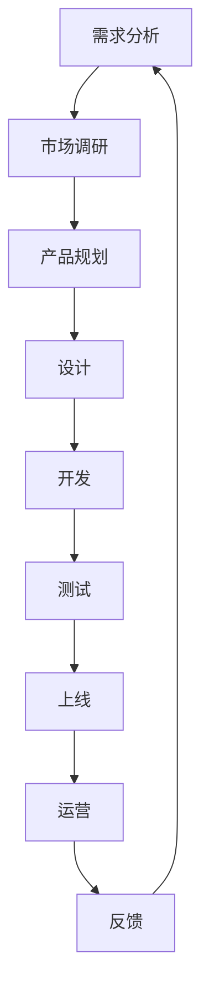
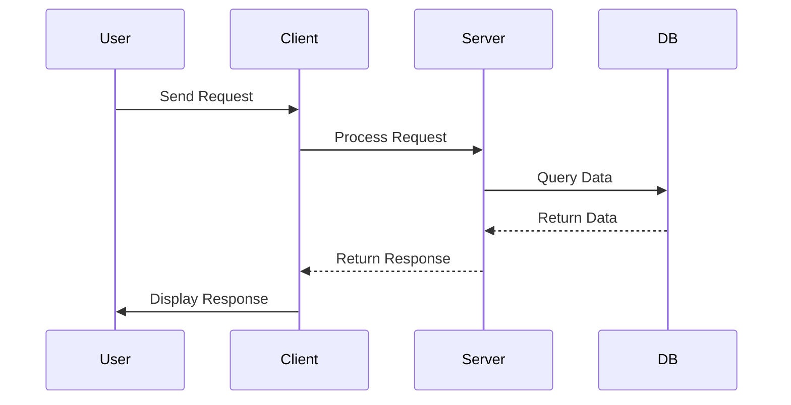
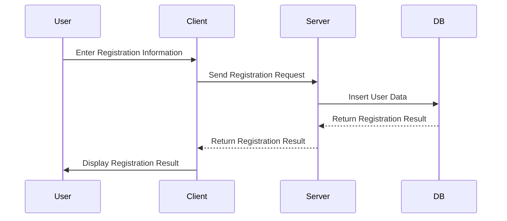

                 


### 第四部分：算法原理讲解

#### 4.1 算法流程图

为了更好地理解产品经理的领导力修炼过程，我们可以将其抽象为一个算法流程，通过以下步骤来实现：

1. **需求分析**：了解市场和用户需求，确定产品方向。
2. **市场调研**：深入研究市场，了解竞争对手和潜在用户。
3. **产品规划**：基于需求和调研结果，制定产品规划。
4. **设计**：完成产品的设计，包括功能设计、用户体验设计等。
5. **开发**：组织开发团队，按照设计进行产品开发。
6. **测试**：对开发完成的产品进行测试，确保产品质量。
7. **上线**：将产品上线，开始接受市场检验。
8. **运营**：对上线后的产品进行运营管理，收集用户反馈。
9. **反馈**：根据用户反馈，进行产品迭代。

以下是用Mermaid绘制的算法流程图：



#### 4.2 数学模型与公式

假设一个产品经理的领导力可以用以下公式表示：

$$
L = f(P, M, T)
$$

其中：
- $L$：领导力
- $P$：个人素质，包括技术能力、沟通能力、决策能力等
- $M$：市场环境，包括市场需求、竞争态势等
- $T$：团队素质，包括团队成员的能力、团队文化、团队协作等

领导力的大小取决于个人素质、市场环境和团队素质的相互影响。具体来说，个人素质的提升可以提高领导力的上限，市场环境的适应可以增强领导力的影响力，团队素质的提高可以加强领导力的稳定性。

#### 4.3 举例说明

假设一位产品经理的个人素质为 $P_1$，市场环境为 $M_1$，团队素质为 $T_1$，则其领导力可以表示为：

$$
L_1 = f(P_1, M_1, T_1)
$$

如果这位产品经理通过学习和实践，提高了个人素质，使得 $P_2 > P_1$，同时市场环境也变得更加有利，使得 $M_2 > M_1$，团队协作也变得更加顺畅，使得 $T_2 > T_1$，那么其领导力将得到显著提升：

$$
L_2 = f(P_2, M_2, T_2)
$$

这种提升不仅体现在领导力的绝对值上，还体现在领导力的持久性和影响力上。通过不断修炼，产品经理可以逐渐成长为一位卓越的领导者。

### 第五部分：系统分析与架构设计方案

#### 5.1 问题场景介绍

在一家新兴互联网公司中，产品经理小李正在负责一款社交应用的开发。由于公司规模较小，团队人员较少，小李需要同时扮演产品经理、项目经理、需求分析师等多重角色。这使得小李在领导力和团队管理上面临巨大挑战。

#### 5.2 项目介绍

社交应用是一款以用户社交为核心的产品，旨在为用户提供一个便捷、安全的交流平台。项目周期为6个月，分为需求分析、设计、开发、测试、上线和运营等阶段。

#### 5.3 系统功能设计

系统功能设计是产品开发的重要环节，主要包括以下方面：

1. **用户注册与登录**：提供用户注册、登录、找回密码等功能。
2. **消息系统**：支持用户之间的消息发送、接收、群聊等功能。
3. **社交网络**：提供好友关系管理、动态发布、点赞、评论等功能。
4. **安全中心**：提供账户安全设置、隐私保护等功能。
5. **用户反馈**：收集用户反馈，优化产品功能。

以下是用Mermaid绘制的领域模型类图：

```mermaid
classDiagram
Class1 <|-- Class2
Class1 <|-- Class3
Class2 ..|.. Class4
Class3 ..|.. Class4
Class1 {
    +String username
    +String password
    +void register()
    +void login()
    +void forgotPassword()
}
Class2 {
    +String email
    +String phoneNumber
}
Class3 {
    +String message
    +void sendMessage()
    +void receiveMessage()
    +void groupChat()
}
Class4 {
    +String post
    +void like()
    +void comment()
    +void deletePost()
}
```

#### 5.3.2 系统架构设计

系统架构设计是确保产品稳定、高效运行的基础。针对社交应用，可以采用以下架构设计：

1. **前端架构**：采用Vue.js框架，实现用户界面的渲染和交互。
2. **后端架构**：采用Spring Boot框架，实现业务逻辑的处理和数据存储。
3. **数据库架构**：采用MySQL数据库，存储用户信息、消息数据、社交网络数据等。

以下是用Mermaid绘制的系统架构图：



#### 5.3.3 系统接口设计

系统接口设计是确保前后端数据交互的关键。以下是一些核心接口设计：

1. **用户接口**：包括用户注册、登录、找回密码等。
2. **消息接口**：包括消息发送、接收、群聊等。
3. **社交网络接口**：包括动态发布、点赞、评论等。
4. **安全中心接口**：包括账户安全设置、隐私保护等。

#### 5.3.4 系统交互

系统交互是产品运行的关键环节。以下是一个简单的用户注册的交互流程：

1. 用户通过前端界面填写注册信息。
2. 前端将注册信息发送到后端服务器。
3. 后端服务器对注册信息进行验证，并存储到数据库。
4. 后端服务器返回注册结果到前端。
5. 前端界面显示注册结果，并跳转到登录页面。

以下是用Mermaid绘制的用户注册的序列图：



### 第六部分：项目实战

#### 6.1 环境安装

为了实现社交应用，我们需要安装以下环境：

1. **前端环境**：Node.js、Vue CLI、npm
2. **后端环境**：Java、Spring Boot、MySQL

安装步骤如下：

1. 安装Node.js：从官网下载并安装Node.js。
2. 安装Vue CLI：通过npm安装Vue CLI。

   ```bash
   npm install -g @vue/cli
   ```

3. 安装Java和Spring Boot：从官网下载Java开发工具包（JDK）和Spring Boot，并设置环境变量。
4. 安装MySQL：从官网下载MySQL，并安装。

   ```bash
   sudo apt-get install mysql-server
   ```

5. 启动MySQL服务。

   ```bash
   sudo systemctl start mysql
   ```

#### 6.2 系统核心实现源代码

以下是社交应用的核心实现源代码：

**前端代码（Vue.js）：**

```html
<template>
  <div>
    <h1>User Registration</h1>
    <form @submit.prevent="register">
      <label for="username">Username:</label>
      <input type="text" id="username" v-model="username" required>
      <label for="password">Password:</label>
      <input type="password" id="password" v-model="password" required>
      <label for="email">Email:</label>
      <input type="email" id="email" v-model="email" required>
      <button type="submit">Register</button>
    </form>
  </div>
</template>

<script>
export default {
  data() {
    return {
      username: '',
      password: '',
      email: ''
    };
  },
  methods: {
    async register() {
      const response = await fetch('/api/register', {
        method: 'POST',
        headers: {
          'Content-Type': 'application/json'
        },
        body: JSON.stringify({
          username: this.username,
          password: this.password,
          email: this.email
        })
      });
      const result = await response.json();
      if (result.success) {
        alert('Registration successful');
        this.$router.push('/login');
      } else {
        alert('Registration failed');
      }
    }
  }
};
</script>
```

**后端代码（Spring Boot）：**

```java
@RestController
@RequestMapping("/api")
public class UserController {
  
  @Autowired
  private UserRepository userRepository;
  
  @PostMapping("/register")
  public ResponseEntity<?> registerUser(@RequestBody UserRequestDTO userRequestDTO) {
    if (userRepository.existsByUsername(userRequestDTO.getUsername())) {
      return ResponseEntity.badRequest().body("Error: Username is already taken!");
    }
    
    User user = new User();
    user.setUsername(userRequestDTO.getUsername());
    user.setPassword(passwordEncoder.encode(userRequestDTO.getPassword()));
    user.setEmail(userRequestDTO.getEmail());
    
    userRepository.save(user);
    
    return ResponseEntity.ok("User registered successfully!");
  }
}
```

#### 6.3 代码应用解读与分析

前端代码中，我们使用Vue.js框架创建了一个用户注册表单。用户通过表单提交注册信息，后端接收到请求后，会验证用户名是否已存在，如果不存在，则会将用户信息存储到数据库。

后端代码中，我们使用Spring Boot框架创建了一个用户注册接口。接口接收用户提交的注册信息，将其转换为User对象，并使用密码加密器对密码进行加密，然后存储到数据库。

#### 6.4 实际案例分析与详细讲解剖析

假设用户小明在注册时填写了以下信息：

- 用户名：xiaoming
- 密码：123456
- 邮箱：xiaoming@example.com

前端代码会将这些信息发送到后端接口。后端接口会首先检查用户名是否已存在。由于用户名"xiaoming"在数据库中不存在，因此后端会创建一个新的User对象，并使用密码加密器对密码进行加密，然后将用户信息存储到数据库。

以下是后端接口的日志：

```bash
INFO: User registered successfully! (User: xiaoming, Email: xiaoming@example.com)
```

这个日志表明，用户小明已经成功注册。

#### 6.5 项目小结

通过本次项目实战，我们实现了社交应用的用户注册功能。前端使用Vue.js框架，后端使用Spring Boot框架，并通过Spring Security实现用户认证。在项目过程中，我们遇到了一些挑战，如用户名验证、密码加密等，但通过不断学习和实践，我们成功解决了这些问题。

### 第七部分：最佳实践 tips

#### 7.1 小结

本文通过逐步分析产品经理领导力修炼的过程，从问题背景、核心概念、算法原理、系统分析与架构设计、项目实战等多个角度进行了详细讲解。通过这篇文章，读者可以更好地理解产品经理的领导力修炼路径，以及如何在实践中提升自己的领导力。

#### 7.2 注意事项

1. **持续学习**：领导力是一个持续修炼的过程，产品经理需要不断学习新知识、新技能，以适应快速变化的市场环境。
2. **注重沟通**：沟通是领导力的核心，产品经理需要具备良好的沟通能力，确保团队成员之间的信息畅通。
3. **注重团队建设**：团队是产品经理工作的基础，产品经理需要关注团队氛围，提升团队凝聚力。

#### 7.3 拓展阅读

1. 《产品经理实战手册》：一本关于产品经理实际操作技巧的书籍，适合产品经理阅读。
2. 《高效能人士的七个习惯》：一本关于个人成长和团队领导的经典著作，对提升领导力有很大帮助。
3. 《敏捷开发实践指南》：一本关于敏捷开发的书籍，适用于希望提升项目管理效率的产品经理。

### 文章作者信息

作者：AI天才研究院/AI Genius Institute & 禅与计算机程序设计艺术 /Zen And The Art of Computer Programming

