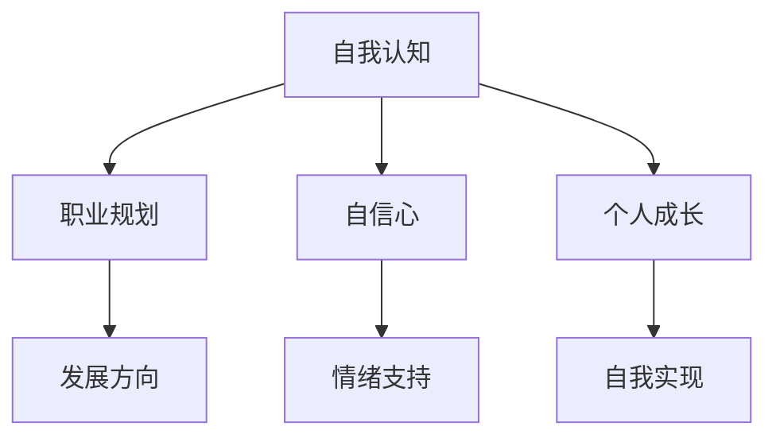
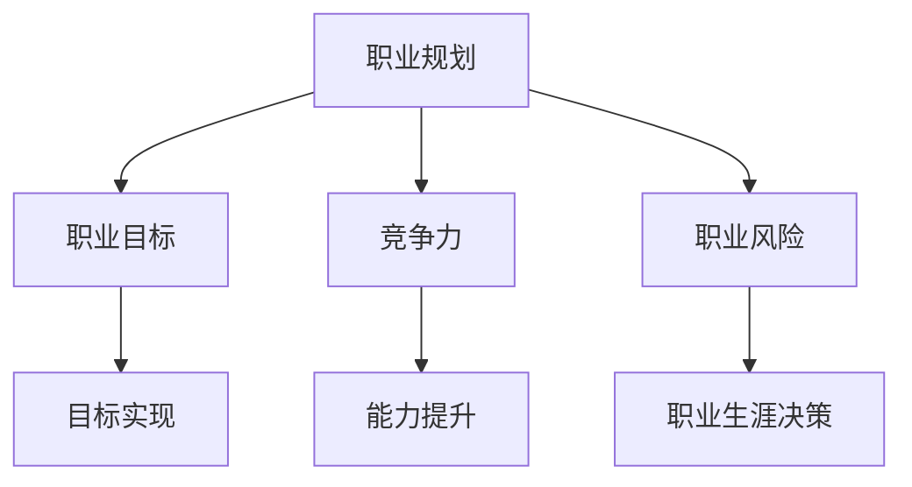

                 

### 摘要

《领导力修炼日记：一个女性小工的成长蜕变》是一本探讨女性职场领袖成长历程的书籍。通过主人公的真实经历，作者详细描绘了一个普通女性从职场新人到资深领导者的蜕变过程。本书旨在向读者展示领导力的本质与修炼方法，并通过生动的实例，引导读者理解和应用这些方法，从而在职场中实现自我突破。书中不仅涵盖了基础技能的提升、人际关系的建立，还深入探讨了角色转变、团队管理和领导力持续发展等关键环节，为读者提供了一条清晰、可行的领导力修炼路径。通过这本书，读者可以学到如何通过不断学习和实践，成长为一位有影响力的领导者。  

### 文章标题

《领导力修炼日记：一个女性小工的成长蜕变》

### 关键词

女性职场、领导力成长、自我突破、角色转变、团队管理、持续发展

## 第一部分：初入职场，蜕变之路起步

### 第1章：初入职场，认识自我

#### 1.1 职场新人的困惑

**背景介绍**：
刚步入职场的新人往往面临诸多挑战。对于主人公张丽来说，初次进入一家知名互联网公司工作，她就感受到了前所未有的压力。面对繁重的工作任务和复杂的职场环境，张丽感到迷茫和无助。她不禁思考：作为一个普通的小工，如何在竞争激烈的职场中脱颖而出？

**问题背景**：
张丽毕业于一所普通高校，专业是计算机科学与技术。虽然在学校期间，她成绩优异，但实际进入职场后，她发现自己的知识和技能远远不够应对工作中的各种挑战。面对领导安排的任务，她常常感到力不从心。同时，她也不明白如何在职场中与他人建立良好的关系，这让她在工作中倍感孤独。

**问题描述**：
张丽遇到了以下几个主要问题：
1. **技能不足**：她发现自己在编程、项目管理等方面存在明显不足，这影响了她的工作效率。
2. **沟通障碍**：由于性格内向，她在与同事和上级沟通时常常感到尴尬和紧张。
3. **人际关系**：她不知道如何处理职场中的人际关系，特别是在面对团队合作和领导时，她感到无所适从。

**问题解决**：
为了解决这些问题，张丽采取了一系列行动：
1. **技能提升**：她利用业余时间学习新的编程技能，通过参加线上课程和阅读专业书籍来不断提升自己的专业水平。
2. **沟通训练**：她开始参加公司组织的沟通技巧培训，通过实际演练和模拟对话来提高自己的沟通能力。
3. **主动交往**：她主动与同事建立联系，通过参加团队活动和社交聚会来拓展人际关系。

**边界与外延**：
虽然张丽在初入职场时遇到了很多困难，但这些问题并不仅仅局限于她一个人。许多职场新人都会面临类似的挑战，因此，她的经历具有一定的普遍性。此外，她的解决方案也为其他新人提供了借鉴。

**概念结构与核心要素组成**：

- **技能提升**：学习新的编程技能，如Python、数据库管理等。
- **沟通训练**：掌握有效的沟通技巧，如倾听、表达、提问等。
- **人际关系**：建立和维护良好的人际关系，包括团队合作和跨部门沟通。

#### 1.2 自我认知的重要性

**核心概念原理**：
自我认知是指个体对自己心理状态、行为模式以及自身能力的认识和理解。对于职场新人来说，自我认知的重要性体现在以下几个方面：

1. **明确职业目标**：通过自我认知，职场新人可以明确自己的职业发展方向，从而制定合理的职业规划。
2. **提升自信心**：了解自己的优势和不足，有助于职场新人建立自信心，面对工作中的挑战。
3. **促进个人成长**：自我认知可以帮助职场新人发现自己的潜力，从而在职业生涯中实现自我突破。

**概念属性特征对比表格**：

| 概念     | 自我认知           | 职业规划           | 自信心           | 个人成长           |
|----------|--------------------|--------------------|------------------|--------------------|
| 定义     | 对自己心理状态的认识 | 对未来职业发展的规划 | 对自己能力的信任 | 自我实现的不断提升 |
| 特征     | 内在性、动态性      | 目标性、前瞻性      | 主观性、稳定性    | 个性化、可持续性   |
| 关联     | 决策基础           | 发展方向           | 情绪支持         | 成长动力           |

**ER实体关系图架构**：



**算法原理讲解**：

自我认知的过程可以视为一个算法，其核心步骤包括：

1. **自我评估**：通过自我反思和他人反馈来评估自己的能力。
2. **目标设定**：根据评估结果，设定明确的职业目标。
3. **策略制定**：制定实现目标的策略和行动步骤。
4. **执行与反馈**：执行策略，并通过反馈不断调整和优化。

以下是一个简化的Python代码示例：

```python
def self_cognition():
    # 自我评估
    assessment = "技能不足，沟通障碍"
    
    # 目标设定
    goals = ["提升编程技能", "改善沟通技巧", "建立良好的人际关系"]
    
    # 策略制定
    strategies = [
        "学习新技能，如Python、数据库管理",
        "参加沟通技巧培训，提高表达能力",
        "主动交往，拓展人际关系"
    ]
    
    # 执行与反馈
    for goal, strategy in zip(goals, strategies):
        print(f"执行策略：{strategy}")
        # ...执行策略的具体操作...
        print(f"目标达成度：{goal完成的程度}")

# 调用函数
self_cognition()
```

**数学模型和公式**：

自我认知的过程可以用以下数学模型来描述：

\[ \text{自我认知} = f(\text{自我评估}, \text{目标设定}, \text{策略制定}, \text{执行与反馈}) \]

其中，\( f \) 表示一个复合函数，表示自我认知的结果是通过对自我评估、目标设定、策略制定和执行与反馈的综合考虑得出的。

**详细讲解和举例说明**：

张丽在自我认知过程中，首先通过自我反思和同事反馈，发现了自己的技能不足、沟通障碍等问题。接着，她设定了提升编程技能、改善沟通技巧、建立良好的人际关系三个目标。为了实现这些目标，她制定了具体的策略，如学习新技能、参加沟通技巧培训和主动交往等。在执行这些策略的过程中，张丽不断进行自我评估，并根据反馈进行调整。例如，她发现自己在学习Python时遇到了困难，于是调整学习计划，增加学习时间，并通过请教同事和参加线上课程来提升自己的编程能力。

通过自我认知的过程，张丽不仅明确了职业目标，还提升了自信心，并在职场中取得了显著进步。她学会了如何通过自我评估、目标设定、策略制定和执行与反馈来不断提升自己，从而实现了从职场新人到优秀员工的转变。

#### 1.3 设定职业发展目标

**背景介绍**：
在初入职场的过程中，设定明确的职业发展目标是至关重要的。张丽意识到，如果没有清晰的职业规划，她很难在竞争激烈的职场中站稳脚跟。因此，她开始思考如何为自己设定职业发展目标。

**问题背景**：
张丽在自我认知的基础上，意识到自己的职业发展方向应该是技术专家。然而，她发现对于职业目标的设定还不够明确，需要进一步细化。她开始思考以下几个问题：
1. **长期目标**：她希望在多少年内达到什么职位或技能水平？
2. **短期目标**：她在未来一年内需要完成哪些具体任务或学习哪些技能？
3. **阶段性目标**：她如何将这些长期目标和短期目标分解为具体的行动计划？

**问题描述**：
张丽面临的问题是如何有效地设定职业发展目标，以及如何将这些目标分解为可执行的行动计划。

**问题解决**：
为了解决这些问题，张丽采取了以下措施：

1. **长期目标设定**：张丽设定了一个长期目标，即在未来五年内成为一名高级软件开发工程师。
2. **短期目标设定**：为了实现长期目标，张丽制定了短期目标，如在未来一年内掌握Python编程语言，提高数据库管理技能等。
3. **阶段性目标分解**：张丽将短期目标进一步分解为具体的学习计划和行动步骤，如每天学习两小时Python编程，每月参加一次技术交流会等。

**边界与外延**：
职业发展目标的设定不仅需要明确长期和短期目标，还需要考虑阶段性目标的具体分解。不同的人可能根据自身的职业规划和发展阶段，设定不同的目标和行动计划。

**概念结构与核心要素组成**：

- **长期目标**：明确职业发展方向和职位目标。
- **短期目标**：具体的学习任务和技能提升目标。
- **阶段性目标**：将长期和短期目标分解为具体的行动计划。

#### 1.4 职业规划的重要性

**核心概念原理**：
职业规划是指个体根据自身兴趣、能力和市场需求，对未来职业生涯进行系统性的规划。对于职场新人来说，职业规划的重要性体现在以下几个方面：

1. **明确发展方向**：职业规划可以帮助职场新人明确自己的职业目标，从而有针对性地进行学习和提升。
2. **提升竞争力**：通过职业规划，职场新人可以不断提升自身技能和素质，增强在职场中的竞争力。
3. **避免盲目性**：职业规划可以帮助职场新人避免盲目跟风和随意跳槽，从而降低职业风险。

**概念属性特征对比表格**：

| 概念     | 职业规划           | 职业目标           | 竞争力           | 职业风险           |
|----------|--------------------|--------------------|------------------|--------------------|
| 定义     | 职业发展的系统性规划 | 职业发展的期望目标 | 个人技能和素质 | 职场选择和决策风险 |
| 特征     | 目标性、前瞻性      | 期望性、明确性      | 动态性、可持续性 | 可控性、不确定性   |
| 关联     | 发展规划           | 目标实现           | 能力提升         | 职业生涯决策       |

**ER实体关系图架构**：



**算法原理讲解**：

职业规划的过程可以视为一个算法，其核心步骤包括：

1. **自我评估**：通过自我反思和他人反馈，评估自身兴趣、能力和市场需求。
2. **目标设定**：根据评估结果，设定明确的职业目标和规划。
3. **行动计划**：制定实现目标的行动计划和策略。
4. **执行与调整**：根据执行情况和反馈，不断调整和优化职业规划。

以下是一个简化的Python代码示例：

```python
def career_planning():
    # 自我评估
    self_evaluation = "技能较好，沟通能力有待提高"
    
    # 目标设定
    career_goals = ["成为高级软件开发工程师", "掌握多种编程语言", "提升团队管理能力"]
    
    # 行动计划
    action_plans = [
        "每天学习两小时新技能",
        "每月参加一次技术交流会",
        "积极参与团队项目和领导任务"
    ]
    
    # 执行与调整
    for goal, plan in zip(career_goals, action_plans):
        print(f"目标：{goal}")
        print(f"行动计划：{plan}")
        # ...执行计划和调整...

# 调用函数
career_planning()
```

**数学模型和公式**：

职业规划可以用以下数学模型来描述：

\[ \text{职业规划} = f(\text{自我评估}, \text{目标设定}, \text{行动计划}, \text{执行与调整}) \]

其中，\( f \) 表示一个复合函数，表示职业规划的结果是通过对自我评估、目标设定、行动计划和执行与调整的综合考虑得出的。

**详细讲解和举例说明**：

张丽在职业规划的过程中，首先通过自我评估，明确了自身的兴趣、技能和市场需求。她发现自己的编程技能较强，但在团队管理和沟通能力方面还有待提高。因此，她设定了成为高级软件开发工程师的长期目标，并制定了具体的短期目标和行动计划。例如，她每天学习两小时新技能，每月参加一次技术交流会，积极参与团队项目和领导任务。通过这些行动，张丽不断提升自己的竞争力，逐步实现职业规划中的目标。

#### 1.5 基础技能提升

**背景介绍**：
在职场中，基础技能的提升是职场新人立足之本。对于张丽来说，提升基础技能是她在职业发展过程中的一项重要任务。通过不断学习和实践，她逐渐掌握了多种编程语言和数据库管理技能，从而在职场中取得了显著的进步。

**问题背景**：
张丽在初入职场时，虽然具备一定的编程基础，但面对实际项目时，她发现自己在某些领域仍然存在明显不足。例如，她在数据库管理和前端开发方面感到吃力，这直接影响了她的工作效率和职业发展。

**问题描述**：
张丽面临的问题是如何在短时间内提升自己的基础技能，以适应职场的需求。

**问题解决**：
为了解决这些问题，张丽采取了以下措施：

1. **系统学习**：她通过参加线上课程和阅读专业书籍，系统地学习数据库管理和前端开发知识。
2. **实践应用**：她积极参与公司项目，将所学知识应用于实际工作中，通过实践不断提升自己的技能水平。
3. **请教专家**：她主动向有经验的同事和领导请教，学习他们的工作经验和解决问题的方法。

**边界与外延**：
基础技能的提升不仅需要通过学习获取知识，还需要通过实践和请教来巩固和提高。不同的人可能根据自身的职业规划和发展阶段，选择不同的学习和实践方法。

**概念结构与核心要素组成**：

- **系统学习**：通过参加线上课程和阅读专业书籍，系统地获取知识。
- **实践应用**：将所学知识应用于实际工作中，通过实践提升技能水平。
- **请教专家**：向有经验的同事和领导请教，学习他们的工作经验。

#### 1.6 沟通技巧培养

**背景介绍**：
在职场中，良好的沟通技巧是职业成功的重要因素之一。对于张丽来说，提升沟通技巧是她在职场发展过程中的一项重要任务。通过不断学习和实践，她逐渐掌握了有效的沟通技巧，从而在团队合作和项目中取得了更好的成果。

**问题背景**：
张丽在初入职场时，由于性格内向，她在与同事和上级沟通时常常感到不自在，甚至会出现误解和冲突。这让她意识到，提升沟通技巧对于职场发展至关重要。

**问题描述**：
张丽面临的问题是如何在职场中提升沟通技巧，以改善人际关系和提升工作效率。

**问题解决**：
为了解决这些问题，张丽采取了以下措施：

1. **沟通培训**：她参加了公司组织的沟通技巧培训，学习如何倾听、表达和提问。
2. **模拟练习**：她通过参加模拟对话和情景演练，提高实际沟通能力。
3. **反思总结**：她定期反思自己的沟通行为，总结经验教训，并不断改进。

**边界与外延**：
沟通技巧的培养不仅需要通过培训和练习来提升，还需要通过反思和总结来不断完善。不同的人可能根据自身的性格特点和沟通需求，选择不同的培训方法和练习方式。

**概念结构与核心要素组成**：

- **沟通培训**：通过参加专业培训，学习有效的沟通技巧。
- **模拟练习**：通过模拟对话和情景演练，提高实际沟通能力。
- **反思总结**：通过反思和总结，不断改进沟通行为。

#### 1.7 团队合作意识

**背景介绍**：
在职场中，团队合作是项目成功的关键。对于张丽来说，培养团队合作意识是她在职业发展过程中的一项重要任务。通过不断学习和实践，她逐渐掌握了有效的团队合作方法，从而在团队中取得了更好的协作效果。

**问题背景**：
张丽在初入职场时，虽然具备一定的编程技能，但缺乏团队合作经验。她常常感到在团队中难以融入，甚至在项目中与同事产生冲突。这让她意识到，提升团队合作意识对于职场发展至关重要。

**问题描述**：
张丽面临的问题是如何在职场中培养团队合作意识，以改善团队协作效果。

**问题解决**：
为了解决这些问题，张丽采取了以下措施：

1. **团队活动**：她积极参与公司组织的团队活动，增进与同事之间的了解和信任。
2. **项目协作**：她主动参与团队项目，学习如何与同事协作完成任务。
3. **沟通与反馈**：她通过定期沟通和反馈，了解团队成员的意见和需求，并及时调整自己的工作方式。

**边界与外延**：
团队合作意识的培养不仅需要通过团队活动和项目协作来提升，还需要通过沟通和反馈来不断完善。不同的人可能根据自身的团队角色和合作需求，选择不同的协作方法和沟通方式。

**概念结构与核心要素组成**：

- **团队活动**：通过参与团队活动，增进与同事之间的了解和信任。
- **项目协作**：通过参与团队项目，学习如何与同事协作完成任务。
- **沟通与反馈**：通过定期沟通和反馈，了解团队成员的意见和需求，并及时调整自己的工作方式。

## 第二部分：领导力成长，稳步提升

### 第4章：角色转变，初露锋芒

#### 4.1 从执行者到领导者

**背景介绍**：
随着在职场中逐渐成长，张丽开始意识到，要实现更大的职业目标，她需要从一名普通的执行者转变为一位领导者。这种角色转变不仅要求她在专业技能上不断提升，还需要她在管理能力和领导力方面有所突破。

**问题背景**：
张丽在成为团队领导之前，一直在团队中担任技术专家的角色，专注于编写代码和解决技术问题。然而，她发现，仅凭技术能力无法带领团队实现更大的目标。她需要学习如何管理团队、激励团队成员，并在关键时刻做出正确决策。

**问题描述**：
张丽面临的问题是如何从技术专家顺利转变为团队领导者，并适应新的角色和责任。

**问题解决**：
为了实现这一转变，张丽采取了以下措施：

1. **领导力培训**：她参加了公司提供的领导力培训课程，学习领导力的基本理论和实践方法。
2. **角色扮演**：她通过模拟练习和角色扮演，提高自己处理团队问题和决策的能力。
3. **倾听与反馈**：她积极倾听团队成员的意见，并给予及时反馈，建立良好的沟通和信任关系。
4. **实践与反思**：她将所学知识应用于实际工作中，不断反思和总结，逐步提升自己的领导能力。

**边界与外延**：
角色转变不仅涉及到个人能力的提升，还涉及到对团队动态和管理方法的适应。不同的人可能根据自身的特点和团队情况，采取不同的转变策略。

**概念结构与核心要素组成**：

- **领导力培训**：通过专业培训，学习领导力的基本理论和实践方法。
- **角色扮演**：通过模拟练习，提高处理团队问题和决策的能力。
- **倾听与反馈**：积极倾听团队成员的意见，建立良好的沟通和信任关系。
- **实践与反思**：将所学知识应用于实际工作中，不断反思和总结，提升领导能力。

#### 4.2 初级领导力实践

**背景介绍**：
张丽在完成领导力培训后，开始担任一个小组的领导。这标志着她从理论阶段转向实践阶段，正式开始了领导力的实际运用。

**问题背景**：
作为一位初级领导者，张丽面临着如何管理好一个团队、如何激励团队成员、如何在项目中做出有效决策等一系列实际问题。她意识到，理论知识和实际操作之间存在巨大差距，需要通过实践来不断磨练自己的领导能力。

**问题描述**：
张丽面临的问题是如何在实际工作中运用初级领导力，提升团队绩效和项目成功率。

**问题解决**：
为了解决这些问题，张丽采取了以下措施：

1. **目标明确**：她与团队成员共同制定清晰的项目目标，确保每个人都知道自己的职责和期望成果。
2. **任务分配**：她根据团队成员的技能和兴趣，合理分配任务，提高工作效率和团队满意度。
3. **激励与反馈**：她采用多种激励措施，如表彰优秀表现、提供职业发展机会等，激发团队成员的工作积极性。
4. **沟通与协调**：她保持与团队成员的密切沟通，及时解决团队中的问题和冲突，确保项目顺利进行。

**边界与外延**：
初级领导力的实践不仅涉及具体的操作方法，还包括对团队成员的激励和协调。不同的人可能根据团队情况和项目需求，采取不同的领导策略。

**概念结构与核心要素组成**：

- **目标明确**：与团队成员共同制定清晰的项目目标。
- **任务分配**：根据团队成员的技能和兴趣，合理分配任务。
- **激励与反馈**：采用多种激励措施，激发团队成员的工作积极性。
- **沟通与协调**：保持与团队成员的密切沟通，及时解决团队中的问题和冲突。

#### 4.3 领导者面临的挑战

**背景介绍**：
担任领导者后，张丽逐渐发现，领导岗位并非想象中那么轻松。她面临着来自内部和外部的一系列挑战，这些挑战不仅考验她的领导能力，还考验她的心理素质和应变能力。

**问题背景**：
张丽在担任领导者期间，遇到了以下几类挑战：
1. **团队冲突**：团队成员之间偶尔会出现意见不合，甚至产生矛盾。
2. **绩效压力**：项目任务繁重，团队成员感到压力巨大。
3. **资源有限**：项目资源有限，需要她合理分配，确保项目顺利进行。

**问题描述**：
张丽面临的问题是如何应对这些挑战，确保团队稳定、高效地运作。

**问题解决**：
为了解决这些问题，张丽采取了以下措施：

1. **冲突调解**：她主动介入团队冲突，通过沟通和调解，找到双方都能接受的解决方案。
2. **绩效激励**：她制定激励政策，通过表彰优秀表现和提供职业发展机会，缓解团队成员的绩效压力。
3. **资源管理**：她合理分配项目资源，确保每个团队成员都有足够的时间和精力完成自己的任务。

**边界与外延**：
领导者面临的挑战是多方面的，不仅涉及团队管理和资源分配，还包括心理压力和应对策略。不同的人可能根据自身的经验和团队特点，采取不同的应对方法。

**概念结构与核心要素组成**：

- **冲突调解**：通过沟通和调解，解决团队冲突。
- **绩效激励**：制定激励政策，缓解团队成员的绩效压力。
- **资源管理**：合理分配项目资源，确保项目顺利进行。

### 第5章：团队管理，塑造凝聚力

#### 5.1 团队建设策略

**背景介绍**：
团队建设是领导者的核心任务之一，有效的团队建设策略能够提升团队凝聚力，增强团队协作效率。张丽在担任团队领导后，开始深入研究团队建设的方法和策略。

**问题背景**：
张丽在管理团队时发现，团队成员之间存在一些沟通不畅、信任不足等问题，影响了团队的整体表现。她意识到，需要通过有效的团队建设策略来提升团队的凝聚力。

**问题描述**：
张丽面临的问题是如何制定和实施团队建设策略，以提升团队的协作效率和凝聚力。

**问题解决**：
为了解决这些问题，张丽采取了以下措施：

1. **定期团队活动**：她组织团队成员定期参加团队建设活动，如团建旅行、户外运动等，增进团队成员之间的了解和信任。
2. **开放沟通渠道**：她鼓励团队成员在工作和生活中保持开放沟通，建立信任和合作的基础。
3. **明确团队目标**：她与团队成员共同制定明确的目标和行动计划，确保每个成员都明确自己的职责和团队的方向。
4. **激励机制**：她建立激励机制，通过奖励和表彰，鼓励团队成员积极参与团队活动，提高团队凝聚力。

**边界与外延**：
团队建设策略的实施需要根据团队的具体情况和需求进行定制。不同团队可能需要不同的策略，领导者需要根据实际情况进行调整。

**概念结构与核心要素组成**：

- **定期团队活动**：组织团队建设活动，增进团队成员之间的了解和信任。
- **开放沟通渠道**：鼓励团队成员保持开放沟通，建立信任和合作的基础。
- **明确团队目标**：与团队成员共同制定明确的目标和行动计划。
- **激励机制**：建立激励机制，鼓励团队成员积极参与团队活动。

#### 5.2 激励团队成员

**背景介绍**：
团队成员的积极性和工作动力直接影响到团队的绩效和项目成功。作为团队领导者，张丽深知激励团队成员的重要性。她开始探索多种激励方法，以激发团队成员的潜力，提升团队的整体战斗力。

**问题背景**：
张丽在团队管理中发现，部分团队成员在工作中缺乏激情，工作效率不高，甚至出现了离职倾向。这让她意识到，需要通过有效的激励措施来提高团队士气。

**问题描述**：
张丽面临的问题是如何有效地激励团队成员，提高他们的工作积极性和忠诚度。

**问题解决**：
为了解决这些问题，张丽采取了以下措施：

1. **认可与表彰**：她定期对团队成员的优秀表现进行认可和表彰，通过公开表扬和奖励来激励团队成员。
2. **职业发展机会**：她为团队成员提供职业发展机会，如培训、晋升等，激励他们不断提升自己。
3. **工作环境优化**：她努力改善团队的工作环境，提高工作条件和福利待遇，让团队成员感到舒适和满意。
4. **灵活工作安排**：她根据团队成员的需求，提供灵活的工作安排，如远程办公、弹性工作时间等，以平衡工作和生活。

**边界与外延**：
激励团队成员的方法需要根据团队成员的个性和需求进行定制。领导者需要观察和了解每个成员的特点，采取个性化的激励措施。

**概念结构与核心要素组成**：

- **认可与表彰**：定期认可和表彰团队成员的优秀表现。
- **职业发展机会**：为团队成员提供职业发展机会。
- **工作环境优化**：改善团队的工作环境，提高工作条件和福利待遇。
- **灵活工作安排**：提供灵活的工作安排，平衡工作和生活。

#### 5.3 解决团队冲突

**背景介绍**：
在团队协作过程中，冲突是难以避免的。张丽作为团队领导者，深知有效解决团队冲突的重要性。她开始学习如何应对和处理团队中的各种冲突，以保持团队的稳定和高效。

**问题背景**：
张丽在团队管理中发现，团队成员之间的冲突不时出现，影响了团队的协作效率和项目进度。这些冲突包括意见不合、责任推诿、沟通障碍等，她意识到，需要找到有效的解决方法。

**问题描述**：
张丽面临的问题是如何识别和解决团队中的冲突，以保持团队的稳定和高效。

**问题解决**：
为了解决这些问题，张丽采取了以下措施：

1. **识别冲突**：她通过观察和沟通，及时发现团队中的冲突，并分析冲突的原因和影响。
2. **沟通调解**：她主动介入冲突，通过倾听和沟通，帮助双方理解对方的观点，寻找共同点，达成和解。
3. **建立规则**：她制定明确的团队规则和沟通准则，避免未来出现类似冲突。
4. **心理辅导**：她为受冲突影响的团队成员提供心理辅导，帮助他们缓解情绪，恢复工作状态。

**边界与外延**：
解决团队冲突的方法需要根据冲突的具体情况和团队的特点进行定制。不同的冲突可能需要不同的解决策略，领导者需要灵活应对。

**概念结构与核心要素组成**：

- **识别冲突**：通过观察和沟通，及时发现团队中的冲突。
- **沟通调解**：通过倾听和沟通，帮助双方理解对方的观点，达成和解。
- **建立规则**：制定明确的团队规则和沟通准则。
- **心理辅导**：为受冲突影响的团队成员提供心理辅导。

### 第6章：领导力提升，持续发展

#### 6.1 学习与反思

**背景介绍**：
领导力并非一蹴而就，它需要通过不断的实践和学习来提升。张丽在担任团队领导后，深知自我提升的重要性。她开始将学习与反思融入日常工作中，以持续提升自己的领导力。

**问题背景**：
张丽在领导力提升的过程中，遇到了如何系统地学习和反思，以及如何将所学知识应用于实际工作中的问题。

**问题描述**：
张丽面临的问题是如何通过学习和反思来不断提升自己的领导力。

**问题解决**：
为了解决这些问题，张丽采取了以下措施：

1. **持续学习**：她定期参加领导力培训、阅读相关书籍，并关注行业动态，不断更新自己的知识体系。
2. **反思日记**：她每天写反思日记，记录工作中的心得体会和问题，并思考如何改进。
3. **导师指导**：她寻找一位经验丰富的导师，定期请教并接受指导，获取专业的建议和反馈。
4. **实践应用**：她将所学知识和反思应用于实际工作中，通过实践验证和调整，不断提升自己的领导能力。

**边界与外延**：
学习和反思是领导力提升的重要手段，不同的人可能根据自身情况和需求，选择不同的学习资源和反思方法。

**概念结构与核心要素组成**：

- **持续学习**：通过培训、阅读和关注行业动态，不断更新知识体系。
- **反思日记**：记录工作中的心得体会和问题，进行反思和总结。
- **导师指导**：寻找经验丰富的导师，获取专业建议和反馈。
- **实践应用**：将所学知识和反思应用于实际工作中，通过实践提升领导能力。

#### 6.2 领导力模型学习

**背景介绍**：
为了更系统地提升领导力，张丽开始学习各种领导力模型。这些模型不仅提供了理论指导，还帮助她理解领导力的核心要素和关键技能。

**问题背景**：
张丽在领导力提升过程中，发现不同的领导力模型各有特色，她需要了解各种模型的基本原理和适用场景。

**问题描述**：
张丽面临的问题是如何学习并应用各种领导力模型，以提升自己的领导能力。

**问题解决**：
为了解决这些问题，张丽采取了以下措施：

1. **理论学习**：她系统学习各种领导力模型，如情境领导力、变革型领导力、授权型领导力等。
2. **案例分析**：她通过阅读和分析真实的领导案例，了解不同领导力模型在实际中的应用和效果。
3. **模型实践**：她将所学模型应用于实际工作中，通过实践验证模型的可行性和效果。
4. **反馈调整**：她根据实践中的反馈，不断调整和完善自己的领导策略，提升领导能力。

**边界与外延**：
领导力模型的学习和应用需要结合实际情况进行调整，不同的领导力模型适用于不同的领导场景。

**概念结构与核心要素组成**：

- **理论学习**：系统学习各种领导力模型的基本原理和应用场景。
- **案例分析**：通过阅读和分析真实的领导案例，了解不同领导力模型的效果。
- **模型实践**：将所学模型应用于实际工作中，通过实践验证模型的可行性。
- **反馈调整**：根据实践反馈，不断调整和完善领导策略。

#### 6.3 实践与总结

**背景介绍**：
理论学习和模型实践只是提升领导力的第一步，真正有效的领导力提升还需要通过持续的实践和总结来巩固和应用。

**问题背景**：
张丽在领导力提升过程中，发现理论知识和模型实践之间存在差距，她需要通过实践和总结来不断完善自己的领导能力。

**问题描述**：
张丽面临的问题是如何通过实践和总结来提升自己的领导力。

**问题解决**：
为了解决这些问题，张丽采取了以下措施：

1. **项目实践**：她积极参与各种项目，担任不同的领导角色，通过实际工作中的挑战和问题，提升自己的领导能力。
2. **经验分享**：她与团队成员和同行交流，分享自己的工作经验和心得，获取反馈和建议。
3. **定期总结**：她定期对领导工作进行总结，反思工作中的优点和不足，制定改进措施。
4. **持续学习**：她不断学习新的领导力理论和实践方法，将所学知识应用到实际工作中。

**边界与外延**：
实践和总结是领导力提升的重要环节，不同的人可能根据自身情况和需求，选择不同的实践方法和总结方式。

**概念结构与核心要素组成**：

- **项目实践**：通过参与各种项目，担任不同领导角色，提升领导能力。
- **经验分享**：与团队成员和同行交流，分享工作经验和心得。
- **定期总结**：对领导工作进行总结，反思工作中的优点和不足。
- **持续学习**：学习新的领导力理论和实践方法，应用到实际工作中。

## 总结与展望

### 7.1 成长之路回顾

张丽从一名普通的小工成长为一位资深领导者，她的成长之路充满了挑战和收获。在这段旅程中，她不仅提升了专业技能，还锻炼了领导能力和管理技巧。以下是张丽成长之路的几个关键节点：

1. **初入职场**：张丽刚进入职场时，面临着技能不足、沟通障碍等挑战。她通过学习新的编程技能、参加沟通技巧培训、主动拓展人际关系，逐渐克服了这些困难，找到了自己的职业方向。

2. **角色转变**：在成为团队领导者之前，张丽专注于技术工作。她通过参加领导力培训、角色扮演和实际项目实践，成功实现了从技术专家到团队领导的角色转变。

3. **团队管理**：作为团队领导，张丽通过制定团队建设策略、激励团队成员和解决团队冲突，不断提升团队的凝聚力和工作效率。

4. **持续学习**：张丽深知领导力需要不断学习和实践。她通过持续学习、反思和总结，不断提升自己的领导能力和管理水平。

**心得体会**：
张丽在成长过程中，深刻体会到了自我认知、职业规划、技能提升和领导力培养的重要性。她认为，一个成功的领导者不仅需要专业技能，还需要具备良好的沟通技巧、团队管理能力和持续学习的意识。

### 7.2 领导力修炼心得

通过张丽的成长经历，我们可以总结出以下几点领导力修炼心得：

1. **自我认知**：领导者需要明确自己的优势和不足，建立正确的自我认知，从而有针对性地提升自己的能力。

2. **职业规划**：清晰的职业规划可以帮助领导者明确发展方向，制定合理的目标和行动计划。

3. **持续学习**：领导力是一个动态的过程，领导者需要不断学习新知识和新技能，以适应不断变化的职场环境。

4. **团队管理**：有效的团队管理是领导者成功的关键。领导者需要建立良好的团队关系，激励团队成员，并解决团队中的冲突。

5. **实践与反思**：通过实践和反思，领导者可以不断完善自己的领导方法和策略，从而不断提升自己的领导能力。

### 7.3 未来展望

展望未来，张丽计划继续深耕领导力领域，提升自己的综合管理能力。她希望：

1. **进一步学习**：她计划深入学习更多领导力理论和实践方法，并将这些知识应用于实际工作中。

2. **培养人才**：她希望能够培养更多优秀的领导者，传承自己的经验和知识，推动团队和组织的发展。

3. **拓展视野**：她计划拓宽自己的职业视野，探索新的领域和机会，不断提升自己的职业竞争力。

### 结语

《领导力修炼日记：一个女性小工的成长蜕变》不仅记录了张丽的成长历程，也为读者提供了一条清晰的领导力修炼路径。通过张丽的故事，我们看到了一个普通女性如何通过自我认知、职业规划和不断学习，成长为一位有影响力的领导者。希望这本书能够激励更多读者，勇敢追求自己的职业梦想，不断修炼自己的领导力，实现自我突破。

### 作者信息

作者：AI天才研究院/AI Genius Institute & 禅与计算机程序设计艺术 /Zen And The Art of Computer Programming

