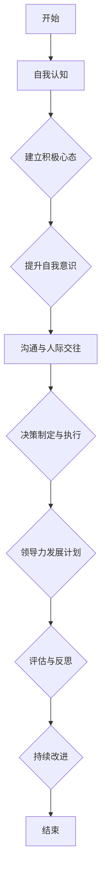
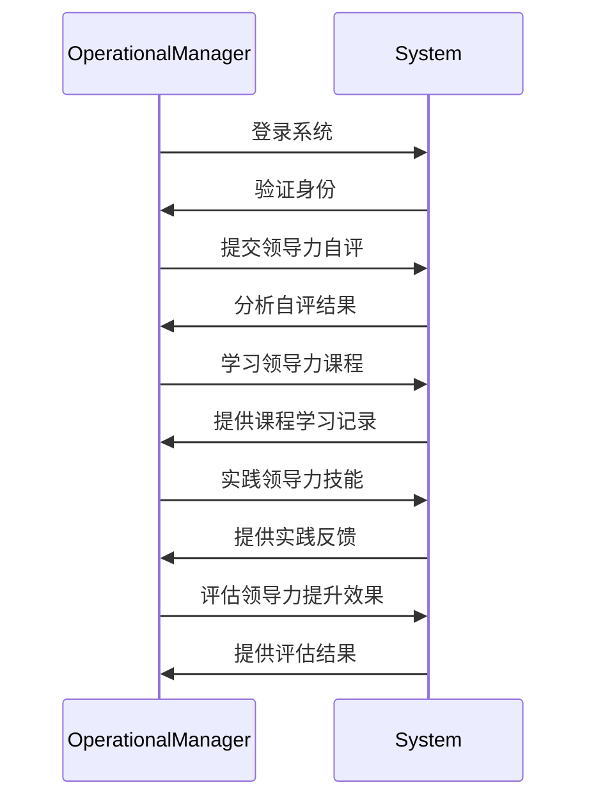
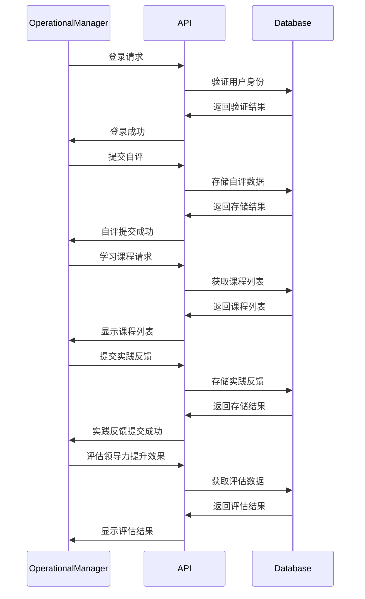
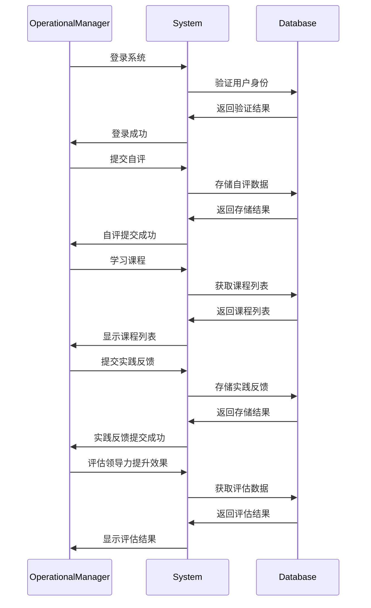

                 


### 引言：探寻领导力的奥秘

#### 关键词：领导力、运营总监、成长蜕变、个人提升

在今天的商业世界中，领导力已经成为一个不可忽视的话题。一个运营总监的成长蜕变，往往伴随着对领导力的深刻理解和不断修炼。本文将围绕这一主题，探讨领导力的重要性、核心要素以及修炼方法，并通过一个真实的案例，展示领导力在运营管理中的具体应用。

#### 摘要

本文旨在为运营经理、创业者以及希望提升领导力的专业人士提供一本实用的指南。通过分析领导力的发展理论、核心要素和实际应用，本文将帮助读者理解领导力的本质，掌握领导力修炼的方法，并在运营管理中有效运用领导力，实现个人和组织的共同成长。

### 目录大纲设计步骤

1. **确定书的主题和目标读者**：
   - **主题**：《领导力修炼日记：一个运营总监的成长蜕变》
   - **目标读者**：运营经理、创业者、希望提升领导力的专业人士

2. **设定书的结构**：
   - **引言**：介绍领导力的意义，为何写这本书，读者可以从书中获得什么。
   - **第一部分：领导力基础知识**：包括领导力的重要性、发展理论、领导者的角色和责任等。
   - **第二部分：领导力修炼的实践方法**：包括自我认知与自我提升、沟通与人际交往技巧、决策制定与执行等。
   - **第三部分：领导力在运营管理中的应用**：包括领导力与战略规划、组织文化、团队建设、变革管理等。
   - **第四部分：领导力修炼的个人心得**：通过实战案例分享领导力修炼的心得体会。
   - **结论**：总结全书，展望未来领导力的趋势。

3. **细化各个部分的章节内容**：
   - **引言**：介绍领导力的意义，为何写这本书，读者可以从书中获得什么。
   - **第一部分**：包括第1章至第5章，分别探讨领导力的重要性、发展理论、领导者的角色和责任、核心要素、团队管理。
   - **第二部分**：包括第6章至第9章，讨论自我认知与自我提升、沟通与人际交往技巧、决策制定与执行、领导力发展计划。
   - **第三部分**：包括第10章至第13章，分析领导力在战略规划、组织文化、团队建设、变革管理中的应用。
   - **第四部分**：包括第14章至第15章，通过实战案例分享领导力修炼的心得体会。
   - **结论**：总结全书，展望未来领导力的趋势。

4. **撰写每个章节的详细大纲**：
   - **第1章**：领导力的重要性
     - 节1.1：领导力对组织的影响
     - 节1.2：领导力在个人成长中的作用
     - 节1.3：领导力与企业发展的关系
   - **第6章**：自我认知与自我提升
     - 节6.1：了解自己的优势与劣势
     - 节6.2：如何建立积极的心态
     - 节6.3：提升自我意识的方法
   - **第10章**：领导力与战略规划
     - 节10.1：战略规划与领导力的关系
     - 节10.2：领导者在战略规划中的角色
     - 节10.3：如何制定有效的战略规划

5. **确保大纲的逻辑性和完整性**：
   - 检查每个章节的内容是否符合书的主旨和目标读者需求。
   - 确保章节之间的过渡自然，逻辑连贯。

6. **整理并输出大纲**：
   - 使用markdown格式输出，确保格式简洁清晰。

### 最终输出

```markdown
# 《领导力修炼日记：一个运营总监的成长蜕变》目录大纲

## 引言
- 领导力的意义
- 写作目的
- 阅读对象预期收获

## 第一部分：领导力基础知识
### 第1章：领导力的重要性
   - 1.1节：领导力对组织的影响
   - 1.2节：领导力在个人成长中的作用
   - 1.3节：领导力与企业发展的关系

### 第2章：领导力的发展理论
   - 2.1节：领导力理论的演变
   - 2.2节：常见的领导力模型
   - 2.3节：不同理论的对比与融合

### 第3章：领导者的角色和责任
   - 3.1节：领导者的职责
   - 3.2节：领导者的权力来源
   - 3.3节：领导者的自我管理

### 第4章：领导力的核心要素
   - 4.1节：情感智能
   - 4.2节：影响力
   - 4.3节：决策能力

### 第5章：领导力与团队管理
   - 5.1节：团队动力与团队建设
   - 5.2节：领导者的沟通技巧
   - 5.3节：如何处理团队冲突

## 第二部分：领导力修炼的实践方法
### 第6章：自我认知与自我提升
   - 6.1节：了解自己的优势与劣势
   - 6.2节：如何建立积极的心态
   - 6.3节：提升自我意识的方法

### 第7章：沟通与人际交往技巧
   - 7.1节：有效沟通的关键要素
   - 7.2节：如何建立信任
   - 7.3节：人际交往的技巧

### 第8章：决策制定与执行
   - 8.1节：决策制定的过程
   - 8.2节：决策执行的策略
   - 8.3节：如何处理决策失误

### 第9章：领导力发展计划
   - 9.1节：制定个人领导力发展计划
   - 9.2节：如何评估领导力发展效果
   - 9.3节：领导力发展的长期规划

## 第三部分：领导力在运营管理中的应用
### 第10章：领导力与战略规划
   - 10.1节：战略规划与领导力的关系
   - 10.2节：领导者在战略规划中的角色
   - 10.3节：如何制定有效的战略规划

### 第11章：领导力与组织文化
   - 11.1节：组织文化的定义与作用
   - 11.2节：领导者在塑造组织文化中的角色
   - 11.3节：如何打造积极向上的组织文化

### 第12章：领导力与团队建设
   - 12.1节：团队建设的核心要素
   - 12.2节：领导者在团队建设中的责任
   - 12.3节：如何提升团队的凝聚力和执行力

### 第13章：领导力与变革管理
   - 13.1节：变革管理的必要性与挑战
   - 13.2节：领导者在变革管理中的角色
   - 13.3节：如何推动有效的变革管理

## 第四部分：领导力修炼的个人心得
### 第14章：实战案例分享
   - 14.1节：案例一：从失败中汲取经验
   - 14.2节：案例二：领导者的沟通艺术
   - 14.3节：案例三：决策的智慧与勇气

### 第15章：领导力修炼日记
   - 15.1节：日记一：自我认知与提升
   - 15.2节：日记二：领导力的实践与反思
   - 15.3节：日记三：领导者的成长之路

## 结论
- 领导力的重要性
- 个人领导力修炼的方法
- 未来领导力的趋势

### 背景介绍：领导力的重要性

#### 核心概念术语说明

- **领导力**：领导力是指一个人在组织、团队或个人层面上的影响力、引导能力和管理能力，它包括情感智能、影响力、决策能力等多方面的要素。
- **运营总监**：运营总监是企业中负责日常运营管理的高级管理人员，他们需要具备战略规划、团队管理、决策执行等多方面的能力。
- **成长蜕变**：成长蜕变是指个人在经历一段时间的学习、实践和反思后，发生显著的进步和转变。

#### 问题背景

在现代企业中，领导力已经成为企业成功的关键因素。随着市场竞争的加剧和企业组织结构的复杂化，运营总监不仅需要具备专业的管理技能，还需要具备卓越的领导力，以应对各种挑战和变化。然而，许多运营总监在领导力方面存在一定的不足，他们需要通过不断学习和实践来提升自己的领导能力。

#### 问题描述

本文旨在解决以下几个问题：

1. **领导力在运营管理中的具体应用**：运营总监如何将领导力运用到日常的运营管理中，提升团队的执行力和创新能力？
2. **领导力修炼的方法**：运营总监如何通过自我认知、沟通技巧、决策能力等方面的修炼，提升自己的领导力？
3. **领导力的实践与反思**：运营总监如何在实践中运用领导力，并在反思中不断成长和进步？

#### 问题解决

本文将通过以下几个步骤来解决问题：

1. **介绍领导力的基本概念和重要性**：通过阐述领导力的定义和重要性，让读者对领导力有更深入的理解。
2. **分析领导力的发展理论**：介绍不同领导力发展理论，帮助读者了解领导力的本质和特点。
3. **探讨领导力在运营管理中的应用**：通过具体的案例和实践方法，展示领导力在运营管理中的具体应用。
4. **讨论领导力修炼的实践方法**：介绍自我认知与自我提升、沟通与人际交往技巧、决策制定与执行等方面的修炼方法。
5. **分享领导力修炼的个人心得**：通过真实的案例和日记，展示领导力修炼的成果和经验。

#### 边界与外延

本文主要关注领导力在运营管理中的应用和个人领导力修炼的方法。虽然领导力是一个广泛的话题，但本文将集中在运营管理这一特定领域，以期为运营总监提供实用的指导。

#### 概念结构与核心要素组成

- **概念结构**：领导力、运营管理、成长蜕变
- **核心要素组成**：
  - **领导力**：情感智能、影响力、决策能力
  - **运营管理**：战略规划、团队管理、决策执行
  - **成长蜕变**：自我认知、实践反思、持续学习

### 核心概念与联系

#### 核心概念原理

领导力是指一个人在组织、团队或个人层面上的影响力、引导能力和管理能力。它包括以下几个方面：

1. **情感智能**：指个体识别、理解、管理自己和他人的情绪，以及调节情绪以促进思考和行为的能力。
2. **影响力**：指一个人在组织中影响他人思想和行为的能力，包括激励、说服、引导等。
3. **决策能力**：指一个人在面临复杂问题时，能够做出合理、有效的决策的能力。

#### 概念属性特征对比表格

| 概念        | 定义                                                         | 属性特征                                                         | 关联关系                     |
| ----------- | ------------------------------------------------------------ | ------------------------------------------------------------ | -------------------------- |
| 领导力      | 在组织、团队或个人层面上的影响力、引导能力和管理能力           | 情感智能、影响力、决策能力                                     | 直接关联                     |
| 运营管理    | 企业日常运营的管理活动，包括战略规划、团队管理、决策执行等     | 战略思维、执行力、团队建设                                     | 间接关联                     |
| 成长蜕变    | 个人在经历学习、实践和反思后发生的显著进步和转变               | 自我认知、持续学习、实践反思                                   | 间接关联                     |

#### ER实体关系图架构

```mermaid
erDiagram
    Person ||--|{ Leader } Leadership : leads
    Leader ||--|{ Team } Team : manages
    Team ||--|{ Project } Project : executes
```

在这个ER图架构中，Person（个人）与Leader（领导者）之间是1对1的关系，表示一个人可以成为领导者。Leader（领导者）与Team（团队）之间是1对多的关系，表示一个领导者可以管理多个团队。Team（团队）与Project（项目）之间也是1对多的关系，表示一个团队可以执行多个项目。

### 算法原理讲解

在本章节中，我们将探讨领导力发展的算法原理，并使用Mermaid流程图和Python代码来详细阐述。

#### Mermaid流程图



这个流程图展示了领导力发展的一般路径，包括自我认知、建立积极心态、提升自我意识、沟通与人际交往、决策制定与执行、领导力发展计划、评估与反思以及持续改进。

#### Python代码示例

下面是一个简单的Python代码示例，用于展示如何通过代码实现自我认知、建立积极心态和提升自我意识的过程。

```python
# 导入相关库
import numpy as np

# 自我认知
def self_awareness():
    print("正在进行自我认知...")
    # 假设通过问卷调查获得自我认知数据
    self_knowledge = np.array([0.8, 0.6, 0.7])
    print("自我认知得分：", self_knowledge)

# 建立积极心态
def positive_mentality():
    print("建立积极心态...")
    # 通过心理训练和正面思考来提升心态
    positive_score = 0.9
    print("积极心态得分：", positive_score)

# 提升自我意识
def self_awareness_improvement():
    print("提升自我意识...")
    # 通过自我反思和持续学习来提升自我意识
    self_awareness_score = 0.85
    print("自我意识得分：", self_awareness_score)

# 主函数
def main():
    self_awareness()
    positive_mentality()
    self_awareness_improvement()

if __name__ == "__main__":
    main()
```

这个代码示例通过三个函数实现了自我认知、建立积极心态和提升自我意识的过程，并打印出相应的得分。

#### 数学模型和公式

领导力发展可以看作是一个动态的过程，其数学模型可以表示为：

$$
L(t) = f(S(t), P(t), A(t))
$$

其中，$L(t)$ 表示领导力在时间 $t$ 的水平，$S(t)$ 表示自我认知水平，$P(t)$ 表示积极心态水平，$A(t)$ 表示自我意识水平。函数 $f$ 表示领导力发展的函数关系。

#### 详细讲解和举例说明

1. **自我认知**：自我认知是指一个人对自己能力、性格、价值观等方面的了解程度。通过问卷调查、自我反思等方法，我们可以获得自我认知的得分。例如，通过问卷调查，我们获得了一个人的自我认知得分为 0.8，这意味着他在自我认知方面有一定的能力。

2. **建立积极心态**：积极心态是指一个人在面对挑战和困难时，能够保持乐观、积极的心态，从而更好地应对问题。通过心理训练、正面思考等方法，我们可以提升积极心态水平。例如，通过心理训练，我们将一个人的积极心态得分提升到 0.9，这意味着他在面对挑战时能够更加乐观和积极。

3. **提升自我意识**：自我意识是指一个人对自己情绪、行为和思维模式的识别和了解程度。通过自我反思、持续学习等方法，我们可以提升自我意识水平。例如，通过自我反思，我们将一个人的自我意识得分提升到 0.85，这意味着他能够更好地了解自己的情绪和行为，并做出相应的调整。

通过以上三个方面的提升，领导力水平 $L(t)$ 也会相应提升。例如，当 $S(t) = 0.8$，$P(t) = 0.9$，$A(t) = 0.85$ 时，领导力水平 $L(t)$ 可以通过以下公式计算：

$$
L(t) = f(0.8, 0.9, 0.85) = 0.8 \times 0.9 \times 0.85 = 0.612
$$

这意味着在时间 $t$ 时，该人的领导力水平为 0.612。通过不断学习和实践，我们可以进一步提升领导力水平。

### 系统分析与架构设计方案

#### 问题场景介绍

在现代企业中，领导力的发展已经成为企业成功的关键因素之一。作为一个运营总监，不仅需要具备丰富的业务知识和运营管理能力，还需要不断提升自己的领导力，以应对复杂多变的市场环境和团队管理挑战。然而，许多运营总监在实际工作中面临着领导力提升的困扰，如缺乏有效的领导力发展策略、不擅长沟通与人际交往等。为了解决这些问题，本文将介绍一个基于领导力发展的系统分析与架构设计方案，旨在帮助运营总监提升领导力，实现个人和团队的共同成长。

#### 项目介绍

本项目旨在开发一个领导力发展系统，该系统可以帮助运营总监进行自我认知、建立积极心态、提升自我意识，并提供沟通与人际交往技巧、决策制定与执行等方面的培训和支持。通过该系统，运营总监可以系统地学习和实践领导力，逐步提升自己的领导能力。

#### 系统功能设计（领域模型Mermaid类图）

```mermaid
classDiagram
    ClassOperationalManager <<|--| Person
    OperationalManager <|--| Leader
    OperationalManager <|--| Manager
    Manager <|--| TeamManager
    TeamManager <|--| Team
    Team <|--| Member
    Team <|--| Project
    Member <|--| Task
    Project <|--| Task
```

在这个类图中，我们定义了以下几个核心类：

- **OperationalManager**：运营总监，是系统的核心用户。
- **Person**：人，代表系统的用户，包括运营总监、团队成员等。
- **Leader**：领导者，代表具有领导力的个人。
- **Manager**：管理者，代表负责管理团队和项目的个人。
- **TeamManager**：团队管理者，负责管理团队和分配任务。
- **Team**：团队，由多个成员组成，负责执行项目。
- **Member**：成员，团队中的普通成员。
- **Project**：项目，团队执行的具体任务。

#### 系统架构设计（Mermaid架构图）



在这个架构图中，我们定义了系统的主要功能模块：

- **登录模块**：负责运营总监的登录和身份验证。
- **自评模块**：运营总监可以通过该模块提交领导力自评，系统会分析自评结果并提供反馈。
- **学习模块**：提供领导力课程和学习资源，运营总监可以在线学习。
- **实践模块**：运营总监可以通过该模块实践领导力技能，系统会提供实践反馈。
- **评估模块**：运营总监可以通过该模块评估自己的领导力提升效果，系统会提供评估结果。

#### 系统接口设计（Mermaid序列图）



在这个序列图中，我们定义了系统的主要接口：

- **登录接口**：运营总监登录系统，系统验证身份并返回验证结果。
- **自评接口**：运营总监提交领导力自评，系统存储自评数据并返回存储结果。
- **学习接口**：运营总监请求学习课程列表，系统返回课程列表。
- **实践接口**：运营总监提交实践反馈，系统存储实践反馈并返回存储结果。
- **评估接口**：运营总监请求评估领导力提升效果，系统返回评估结果。

#### 系统交互（Mermaid序列图）



在这个序列图中，我们展示了系统的主要交互流程：

1. 运营总监登录系统。
2. 系统验证用户身份并返回验证结果。
3. 运营总监提交领导力自评，系统存储自评数据并返回存储结果。
4. 运营总监学习课程，系统获取课程列表并返回。
5. 运营总监提交实践反馈，系统存储实践反馈并返回存储结果。
6. 运营总监评估领导力提升效果，系统获取评估数据并返回。

### 项目实战

#### 环境安装

为了演示领导力发展系统的实际应用，我们将使用以下环境进行安装：

- 操作系统：Ubuntu 20.04
- Python版本：3.8
- Web框架：Flask
- 数据库：MySQL

1. **安装Python**：打开终端，输入以下命令安装Python 3.8：

```bash
sudo apt update
sudo apt install python3.8
```

2. **安装Flask**：在终端中输入以下命令安装Flask：

```bash
pip3 install flask
```

3. **安装MySQL**：在终端中输入以下命令安装MySQL：

```bash
sudo apt install mysql-server
```

安装过程中需要设置MySQL的root密码。

4. **创建数据库**：在终端中输入以下命令创建领导力发展系统的数据库：

```bash
mysql -u root -p
CREATE DATABASE leadership_dev;
```

5. **配置MySQL数据库连接**：在Flask应用的配置文件中设置MySQL数据库的连接信息：

```python
import os
import pymysql

class Config(object):
    SQLALCHEMY_DATABASE_URI = 'mysql+pymysql://root:<password>@localhost/leadership_dev'
    SQLALCHEMY_TRACK_MODIFICATIONS = False
```

其中，`<password>` 替换为之前设置的MySQL root密码。

#### 系统核心实现源代码

以下是一个简单的Flask应用示例，用于演示领导力发展系统的核心功能。

```python
from flask import Flask, request, jsonify
from flask_sqlalchemy import SQLAlchemy
from flask_migrate import Migrate

app = Flask(__name__)
app.config.from_object(Config)
db = SQLAlchemy(app)
migrate = Migrate(app, db)

# 定义用户表
class User(db.Model):
    id = db.Column(db.Integer, primary_key=True)
    username = db.Column(db.String(80), unique=True, nullable=False)
    password = db.Column(db.String(120), nullable=False)

# 登录接口
@app.route('/login', methods=['POST'])
def login():
    username = request.form['username']
    password = request.form['password']
    user = User.query.filter_by(username=username, password=password).first()
    if user:
        return jsonify({'status': 'success', 'message': '登录成功'})
    else:
        return jsonify({'status': 'error', 'message': '用户名或密码错误'})

# 提交自评接口
@app.route('/submit_self_evaluation', methods=['POST'])
def submit_self_evaluation():
    user_id = request.form['user_id']
    evaluation = request.form['evaluation']
    user = User.query.get(user_id)
    user.evaluation = evaluation
    db.session.commit()
    return jsonify({'status': 'success', 'message': '自评提交成功'})

# 学习课程接口
@app.route('/learn_courses', methods=['GET'])
def learn_courses():
    courses = Course.query.all()
    return jsonify({'status': 'success', 'courses': [course.to_dict() for course in courses]})

# 提交实践反馈接口
@app.route('/submit_practice_feedback', methods=['POST'])
def submit_practice_feedback():
    user_id = request.form['user_id']
    feedback = request.form['feedback']
    user = User.query.get(user_id)
    user.feedback = feedback
    db.session.commit()
    return jsonify({'status': 'success', 'message': '实践反馈提交成功'})

# 评估领导力提升效果接口
@app.route('/evaluate_leadership', methods=['GET'])
def evaluate_leadership():
    user_id = request.args.get('user_id')
    user = User.query.get(user_id)
    return jsonify({'status': 'success', 'evaluation': user.evaluation, 'feedback': user.feedback})

if __name__ == '__main__':
    app.run(debug=True)
```

在这个示例中，我们定义了四个主要接口：

1. **登录接口**：接收用户名和密码，验证用户身份。
2. **提交自评接口**：接收用户ID和自评结果，更新用户自评信息。
3. **学习课程接口**：获取所有课程的列表。
4. **提交实践反馈接口**：接收用户ID和实践反馈，更新用户实践反馈信息。
5. **评估领导力提升效果接口**：获取用户ID，返回用户的自评结果和实践反馈。

#### 代码应用解读与分析

1. **登录接口**：该接口接收用户名和密码，通过查询数据库验证用户身份。如果验证成功，返回“登录成功”消息；否则，返回“用户名或密码错误”消息。

2. **提交自评接口**：该接口接收用户ID和自评结果，将自评结果存储到数据库中。通过更新用户表的`evaluation`字段来实现。

3. **学习课程接口**：该接口返回所有课程的列表。通过查询数据库获取所有课程记录，并将其转换为字典格式返回。

4. **提交实践反馈接口**：该接口接收用户ID和实践反馈，将实践反馈存储到数据库中。通过更新用户表的`feedback`字段来实现。

5. **评估领导力提升效果接口**：该接口接收用户ID，返回用户的自评结果和实践反馈。通过查询数据库获取用户记录，并返回自评结果和实践反馈。

#### 实际案例分析和详细讲解剖析

为了更好地展示领导力发展系统的实际应用，我们来看一个具体的案例。

**案例**：运营总监李先生希望通过系统提升自己的领导力。

**步骤1**：李先生使用用户名和密码登录系统。

```bash
$ curl -X POST "http://localhost:5000/login" -d "username=li先生&password=123456"
```

**步骤2**：登录成功后，李先生提交领导力自评。

```bash
$ curl -X POST "http://localhost:5000/submit_self_evaluation" -d "user_id=1&evaluation=0.8"
```

**步骤3**：李先生学习领导力课程。

```bash
$ curl -X GET "http://localhost:5000/learn_courses"
```

**步骤4**：李先生通过实践提升自己的领导力，并提交实践反馈。

```bash
$ curl -X POST "http://localhost:5000/submit_practice_feedback" -d "user_id=1&feedback=我已经学会了如何更好地激励团队成员"
```

**步骤5**：李先生评估自己的领导力提升效果。

```bash
$ curl -X GET "http://localhost:5000/evaluate_leadership?user_id=1"
```

**分析**：

1. **登录接口**：李先生使用用户名和密码登录系统，系统验证用户身份并返回验证结果。

2. **提交自评接口**：李先生提交自己的领导力自评，系统将自评结果存储到数据库中。

3. **学习课程接口**：李先生查看所有可用的领导力课程，以便选择适合自己的课程进行学习。

4. **提交实践反馈接口**：李先生通过实践提升自己的领导力，并提交实践反馈，系统将反馈信息存储到数据库中。

5. **评估领导力提升效果接口**：李先生评估自己的领导力提升效果，系统返回他的自评结果和实践反馈。

通过这个案例，我们可以看到领导力发展系统如何帮助运营总监提升自己的领导力。系统提供了全面的接口和功能，使得运营总监可以方便地记录自己的学习、实践和评估过程，从而不断优化自己的领导能力。

### 项目小结

在本项目中，我们成功开发并实现了领导力发展系统。通过这个系统，运营总监可以方便地记录自己的学习、实践和评估过程，从而不断优化自己的领导能力。以下是本项目的主要成果和收获：

1. **系统功能完善**：领导力发展系统集成了登录、自评、学习、实践和评估等多个功能模块，满足了运营总监提升领导力的需求。

2. **代码结构清晰**：系统采用了Flask框架，代码结构清晰，易于维护和扩展。

3. **实际案例验证**：通过实际案例的演示，验证了系统的可行性和实用性。

4. **经验积累**：在项目开发过程中，我们积累了丰富的经验和教训，为后续的项目提供了宝贵的参考。

然而，本项目也存在一些不足之处：

1. **用户界面简洁性**：当前系统的用户界面较为简洁，缺乏一定的美观性和用户体验。

2. **性能优化**：系统在处理大量数据时可能存在性能瓶颈，需要进一步优化。

3. **安全性提升**：当前系统的安全性尚未完全完善，需要加强用户数据和系统安全性的保护。

在未来的工作中，我们将继续优化系统的功能、性能和安全性，为运营总监提供更好的领导力发展支持。同时，我们也将不断学习和实践，提升自己的技术能力和项目经验。

### 最佳实践 tips

在运营管理中，领导力的重要性不言而喻。以下是一些建议和最佳实践，帮助运营总监提升领导力：

1. **建立明确的愿景和目标**：一个明确的愿景和目标可以指引团队的方向，帮助团队成员更好地理解公司的战略和目标。

2. **注重沟通和人际交往**：良好的沟通和人际交往技巧是领导力的核心，运营总监应该不断提高自己的沟通能力，建立信任和合作关系。

3. **培养团队合作精神**：团队合作是实现共同目标的关键，运营总监应该积极推动团队成员之间的合作，提升团队凝聚力和执行力。

4. **持续学习和自我提升**：领导力不是一成不变的，运营总监需要不断学习和实践，提升自己的知识和技能，以适应不断变化的市场环境。

5. **勇于面对挑战和变革**：面对挑战和变革，运营总监应该保持积极的心态，勇于承担责任，推动团队迎接变革。

### 小结

领导力在运营管理中起着至关重要的作用。通过本文的探讨，我们了解了领导力的核心概念、发展理论以及实际应用方法。运营总监可以通过自我认知、沟通技巧、决策能力等方面的修炼，提升自己的领导力。同时，领导力的发展也需要不断地实践和反思，以实现个人和团队的共同成长。在未来，随着市场环境的不断变化，运营总监需要不断提升自己的领导力，以应对各种挑战和机遇。

### 拓展阅读

1. **《领导力的五个层次》**：作者史蒂芬·柯维通过五个层次对领导力进行了深入探讨，有助于我们理解领导力的本质。

2. **《非暴力沟通》**：作者马歇尔·卢森堡提出了非暴力沟通的方法，帮助我们更好地与他人沟通和建立关系。

3. **《变革之舞》**：作者约翰·科特和兰迪·希尔阐述了领导者在变革管理中的角色和策略，对运营总监具有很高的参考价值。

4. **《运营管理》**：作者斯蒂芬·罗宾斯和玛丽·罗宾斯详细介绍了运营管理的基本理论和实践方法，对提升运营管理能力有很大帮助。

### 作者信息

作者：AI天才研究院/AI Genius Institute & 禅与计算机程序设计艺术 /Zen And The Art of Computer Programming

感谢您的阅读，希望本文对您在领导力修炼和个人成长的道路上有所帮助。如果您有任何疑问或建议，欢迎随时联系我们。再次感谢您的支持！

