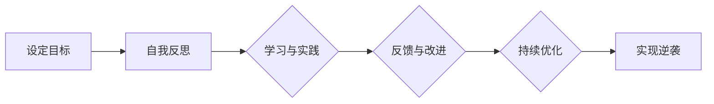
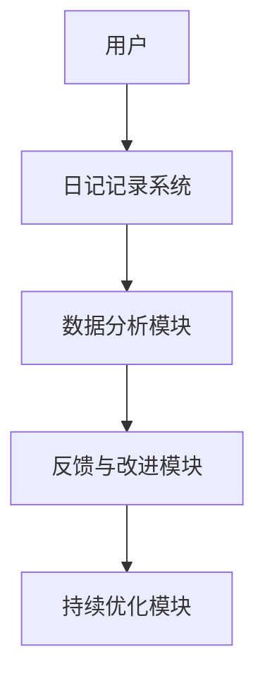
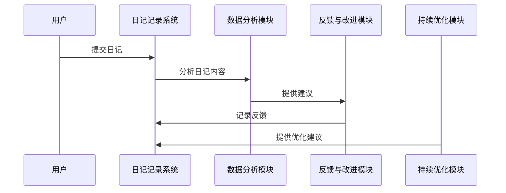

                 


# 领导力修炼日记：一个运营经理的逆袭之路

## 关键词
领导力，修炼日记，运营经理，逆袭，自我反思，学习与实践，反馈与改进

## 摘要
本文将探讨如何通过修炼日记的方式，帮助运营经理提升领导力，实现个人和团队的逆袭。通过记录和分析日常工作中的挑战和成就，运营经理可以更好地理解自身和团队的行为模式，从而找到提升领导力的有效途径。本文将涵盖领导力概念、修炼日记方法、自我反思、学习与实践、反馈与改进以及持续优化等内容。

### 第1章 引言

#### 1.1 问题背景

在当今快速发展的商业环境中，运营经理的角色越来越重要。他们不仅需要管理日常业务运营，还需要具备领导团队、推动创新和应对挑战的能力。然而，许多运营经理在领导力方面面临着诸多挑战，如如何激励员工、提高团队绩效以及如何在变化的市场中保持竞争力。

#### 1.2 问题描述

本书旨在探讨如何通过修炼日记的方式，帮助运营经理提升领导力，实现个人和团队的逆袭。通过记录和分析日常工作中的挑战和成就，运营经理可以更好地理解自身和团队的行为模式，从而找到提升领导力的有效途径。

#### 1.3 问题解决

本书通过以下方法来帮助运营经理提升领导力：

1. **自我反思**：通过记录日记，运营经理可以深入反思自己的行为和决策，了解自己的优点和不足。
2. **学习与实践**：通过阅读相关书籍、参加培训课程和向优秀领导者学习，运营经理可以不断积累知识和经验。
3. **反馈与改进**：通过获取同事、下属和上级的反馈，运营经理可以及时调整自己的领导方式，提高团队绩效。
4. **持续优化**：运营经理应不断反思和改进自己的领导力，以适应不断变化的市场环境和团队需求。

#### 1.4 边界与外延

本书主要针对中高级运营经理，旨在帮助他们提升领导力和管理水平。同时，书中提到的修炼方法和案例也可以适用于其他类型的管理人员。

#### 1.5 概念结构与核心要素组成

- **领导力**：指领导者通过影响、激励和引导他人，实现共同目标的能力。
- **修炼日记**：指运营经理在日常工作中记录自己的思考、行为和感悟，以便反思和提升领导力。
- **逆袭**：指通过提升领导力，实现个人和团队在业绩、地位和影响力等方面的突破。

### 第2章 核心概念与联系

#### 2.1 领导力概念原理

领导力是指领导者通过影响、激励和引导他人，实现共同目标的能力。领导力不仅包括管理技能，还涉及情感智慧、决策能力和人际交往技巧。

#### 2.2 领导力概念属性特征对比表格

| 特征        | 传统领导力 | 现代领导力 |
|-------------|-------------|-------------|
| 权威        | 高度集中    | 分布式     |
| 指令性      | 强调控制    | 重视协作   |
| 个人主义     | 强调自我    | 强调团队   |
| 应对性      | 反应型      | 预测型     |

#### 2.3 领导力ER实体关系图架构

```mermaid
erDiagram
    Leader ||--|{ Team }|
    Leader ||--|{ Project }|
    Team ||--|{ Member }|
    Project ||--|{ Task }|
```

### 第3章 算法原理讲解

#### 3.1 领导力提升算法

**mermaid 流程图：**



**Python源代码：**

```python
def leadership_improvement(goal, self_reflection, learning_practice, feedback_improvement, continuous_optimization):
    """
    领导力提升算法

    :param goal: 目标设定
    :param self_reflection: 自我反思
    :param learning_practice: 学习与实践
    :param feedback_improvement: 反馈与改进
    :param continuous_optimization: 持续优化
    :return: 领导力提升结果
    """
    # 设定目标
    set_goal(goal)
    # 自我反思
    perform_self_reflection(self_reflection)
    # 学习与实践
    engage_in_learning_and_practice(learning_practice)
    # 反馈与改进
    receive_and_implement_feedback(feedback_improvement)
    # 持续优化
    continuous_optimization()
    # 实现逆袭
    achieve_achievement()
```

#### 3.2 算法原理详细讲解

领导力提升算法的核心在于设定明确的目标、自我反思、学习与实践、反馈与改进以及持续优化。以下是对每个步骤的详细讲解：

1. **设定目标**：目标设定是领导力提升的第一步。通过明确的目标，运营经理可以更清晰地了解自己的期望和期望结果，从而有针对性地进行改进。

2. **自我反思**：自我反思是运营经理了解自己行为和决策的重要手段。通过记录日记，运营经理可以深入分析自己的优点和不足，找到提升领导力的关键点。

3. **学习与实践**：学习与实践是提升领导力的关键。运营经理可以通过阅读相关书籍、参加培训课程和向优秀领导者学习，不断积累知识和经验。

4. **反馈与改进**：反馈与改进是领导力提升的重要环节。通过获取同事、下属和上级的反馈，运营经理可以及时了解自己的领导风格和团队绩效，从而进行调整和优化。

5. **持续优化**：持续优化是领导力提升的长期过程。运营经理应不断反思和改进自己的领导方式，以适应不断变化的市场环境和团队需求。

6. **实现逆袭**：通过设定目标、自我反思、学习与实践、反馈与改进以及持续优化，运营经理可以实现个人和团队的逆袭，提高业绩、地位和影响力。

### 第4章 系统分析与架构设计方案

#### 4.1 问题场景介绍

在现代商业环境中，运营经理需要应对快速变化的市场需求，同时管理日常业务运营。为了提升领导力，运营经理需要一套系统化的方法来记录、分析和提升自己的领导能力。

#### 4.2 项目介绍

本项目旨在开发一个领导力修炼日记系统，帮助运营经理提升领导力。该系统将提供以下功能：

1. 日记记录：运营经理可以记录日常工作中的思考、行为和感悟。
2. 数据分析：系统将自动分析日记内容，提供领导力提升的建议和指导。
3. 反馈与改进：系统将收集同事、下属和上级的反馈，帮助运营经理及时调整领导方式。
4. 持续优化：系统将根据运营经理的反馈和改进情况，提供持续的优化建议。

#### 4.3 系统功能设计

**领域模型类图：**

```mermaid
classDiagram
    Class1[日记] <<--|{记录}| Class2[运营经理]
    Class1 <<--|{分析}| Class3[数据分析]
    Class2 <<--|{反馈}| Class3
    Class3 <<--|{优化}| Class1
```

#### 4.4 系统架构设计

**mermaid 架构图：**



#### 4.5 系统接口设计和系统交互

**mermaid 序列图：**



### 第5章 项目实战

#### 5.1 环境安装

在本项目中，我们将使用Python作为主要开发语言，并使用以下库：

- Flask：用于构建Web应用
- SQLAlchemy：用于数据库操作
- Marshmallow：用于数据序列化与反序列化

安装步骤如下：

1. 安装Python 3.8及以上版本
2. 安装Flask：`pip install flask`
3. 安装SQLAlchemy：`pip install sqlalchemy`
4. 安装Marshmallow：`pip install marshmallow`

#### 5.2 系统核心实现源代码

以下是一个简单的日记记录系统示例：

```python
from flask import Flask, request, jsonify
from flask_sqlalchemy import SQLAlchemy
from marshmallow import Schema, fields

app = Flask(__name__)
app.config['SQLALCHEMY_DATABASE_URI'] = 'sqlite:///diary.db'
db = SQLAlchemy(app)

class Diary(db.Model):
    id = db.Column(db.Integer, primary_key=True)
    title = db.Column(db.String(100))
    content = db.Column(db.Text)

class DiarySchema(Schema):
    id = fields.Integer()
    title = fields.String()
    content = fields.String()

diary_schema = DiarySchema()
diaries_schema = DiarySchema(many=True)

@app.route('/diary', methods=['POST'])
def create_diary():
    data = request.get_json()
    title = data['title']
    content = data['content']
    new_diary = Diary(title=title, content=content)
    db.session.add(new_diary)
    db.session.commit()
    return jsonify({"message": "Diary added successfully."})

@app.route('/diary', methods=['GET'])
def get_diaries():
    diaries = Diary.query.all()
    return jsonify(diaries_schema.dump(diaries))

if __name__ == '__main__':
    db.create_all()
    app.run(debug=True)
```

#### 5.3 代码应用解读与分析

以上代码实现了日记记录系统的基本功能。用户可以通过POST请求提交日记，系统将日记存储到数据库中。用户可以通过GET请求获取所有日记。

**解读与分析：**

1. **数据库设计**：使用SQLAlchemy定义了Diary模型和对应的数据库表。每个日记包含id、title和content三个字段。
2. **序列化与反序列化**：使用Marshmallow定义了DiarySchema，用于将Diary模型转换为JSON格式，便于前端使用。
3. **API接口**：使用Flask构建了两个API接口，一个用于提交日记（POST请求），另一个用于获取所有日记（GET请求）。

#### 5.4 实际案例分析和详细讲解剖析

**案例：**

运营经理张三在使用系统后，提交了以下日记：

```json
{
    "title": "今天的工作总结",
    "content": "今天我遇到了一个很大的挑战，某个项目进度严重滞后。我尝试与团队成员沟通，但效果并不理想。我需要反思自己的沟通方式，并寻求改进。"
}
```

**分析：**

1. **日记记录**：张三记录了自己在工作中遇到的问题和反思。这是一个很好的自我反思的例子。
2. **数据分析**：系统可以根据日记内容分析出张三面临的挑战类型（如沟通、项目管理等），并提供相应的建议。
3. **反馈与改进**：系统可以收集团队成员对张三日记的反馈，帮助张三了解自己在团队中的表现，并进行改进。
4. **持续优化**：系统可以跟踪张三的改进情况，并根据反馈不断优化建议。

**讲解剖析：**

1. **自我反思**：自我反思是提升领导力的关键。张三通过记录日记，反思自己在工作中的表现，找到需要改进的地方。
2. **数据分析**：数据分析可以帮助运营经理了解自己在团队中的表现，并提供针对性的建议。
3. **反馈与改进**：反馈与改进是提升领导力的有效手段。通过获取团队成员的反馈，运营经理可以及时了解自己的不足，并采取改进措施。
4. **持续优化**：持续优化是提升领导力的长期过程。运营经理应不断反思和改进自己的领导方式，以适应不断变化的市场环境和团队需求。

### 第6章 最佳实践 tips

1. **定期回顾日记**：定期回顾日记可以帮助运营经理了解自己在领导力方面的进步，找到需要改进的地方。
2. **与团队成员分享日记**：与团队成员分享日记可以增进沟通和理解，同时获得更多的反馈和建议。
3. **设定具体的目标和行动计划**：在日记中设定具体的目标和行动计划，有助于运营经理更有针对性地提升领导力。
4. **寻求专业指导**：如果条件允许，可以寻求专业教练或导师的指导，以获得更深入的反思和改进建议。

### 第7章 小结

本文通过探讨领导力修炼日记的方法，帮助运营经理提升领导力，实现个人和团队的逆袭。通过自我反思、学习与实践、反馈与改进和持续优化，运营经理可以不断提升自己的领导能力，更好地应对商业环境中的挑战。

### 第8章 注意事项

1. **保护隐私**：在记录日记时，注意保护自己的隐私，避免泄露敏感信息。
2. **真实记录**：日记应真实反映自己的工作和思考，避免虚假记录。
3. **持续更新**：定期更新日记，确保日记内容能够真实反映自己的领导力提升过程。

### 第9章 拓展阅读

1. **《领导力修炼手册》**：李中莹著，提供了一系列实用的领导力提升方法。
2. **《复盘：把失败的经验变成成功的智慧》**：薛谭著，介绍了如何通过复盘提升个人和团队的能力。
3. **《精进：如何成为一个很厉害的人》**：采铜著，分享了如何通过自我管理提升个人能力的技巧。

### 作者信息

作者：AI天才研究院/AI Genius Institute & 禅与计算机程序设计艺术 /Zen And The Art of Computer Programming

