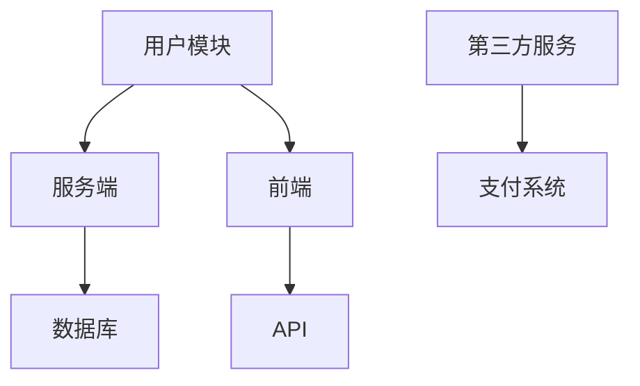
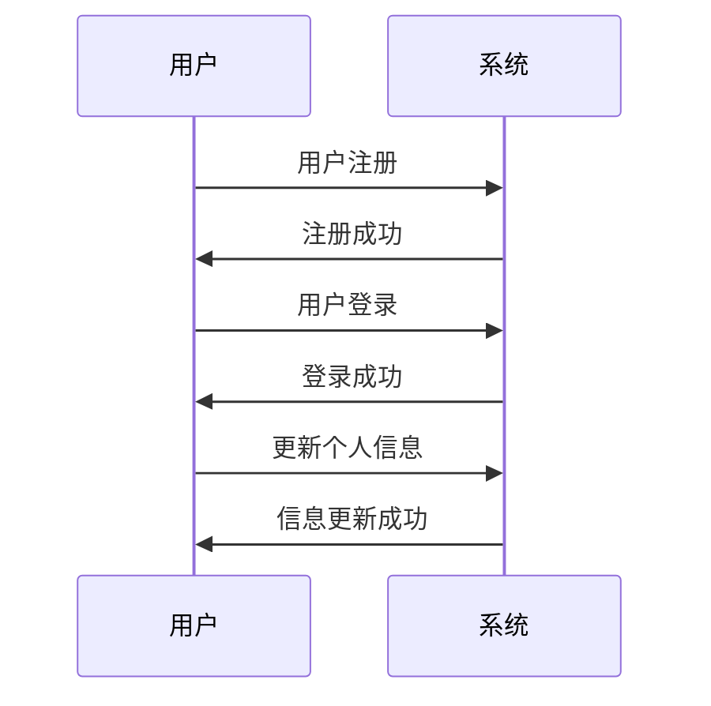

                 

### 文章标题

# 领导力修炼笔记：00后创业者的蜕变历程

### 文章关键词

- 00后创业者
- 领导力
- 蜕变历程
- 创业挑战
- 创新思维

### 文章摘要

本文将从00后创业者的视角出发，探讨他们在新时代商业环境下面临的领导力挑战及其蜕变历程。通过对领导力的定义、模型、核心要素等概念的深入剖析，结合具体案例，本文旨在为00后创业者提供一套实用的领导力修炼指南，帮助他们在创业道路上更好地应对挑战，实现企业的持续成长。

## 背景介绍

### 1.1 问题背景

随着科技的飞速发展和互联网的普及，00后创业者在中国经济中逐渐崭露头角。他们拥有着与前辈截然不同的成长背景和思维方式，但同时也面临着前所未有的挑战。这些挑战主要来自于快速变化的市场环境、高度竞争的商业氛围以及复杂的团队管理。

### 1.2 问题描述

00后创业者在领导力方面存在以下几个主要问题：

1. 缺乏明确的企业愿景和战略目标。
2. 团队管理能力不足，难以激发员工的潜力。
3. 沟通协调能力有限，导致信息传递不畅。
4. 创新思维不够，难以在激烈的市场竞争中脱颖而出。

### 1.3 问题解决

为了解决上述问题，00后创业者需要从以下几个方面进行修炼：

1. 明确企业愿景和战略目标，提升长远规划能力。
2. 提高团队管理技能，建立高效协作的团队文化。
3. 加强沟通协调能力，提升团队凝聚力和执行力。
4. 培养创新思维，不断探索市场机遇。

### 1.4 边界与外延

在本文中，领导力修炼主要涉及个人修养、团队管理和商业决策等方面。我们将通过具体案例和实践，探讨00后创业者在这些领域的成长路径和策略。

### 1.5 概念结构与核心要素组成

领导力是一门复杂的学科，包含多个核心概念和要素。以下是本文将涉及的一些关键概念：

1. **愿景与目标**：领导者需要具备远见，明确企业的愿景和目标，为团队指明方向。
2. **团队管理**：包括招聘、激励、培训等环节，目标是打造一个高效协作的团队。
3. **沟通协调**：有效的沟通是领导力的基础，领导者需要掌握多种沟通技巧，确保信息畅通。
4. **创新思维**：领导者需要具备创新精神，推动企业在市场竞争中不断进步。
5. **决策能力**：面对复杂的市场环境，领导者需要做出正确的决策，引领企业走向成功。

## 核心概念与联系

### 1.6 领导力的定义与特点

领导力是一种影响力，是领导者通过激励和引导他人，实现共同目标的能力。与管理的区别在于，领导力更注重愿景和价值观的塑造，而管理更侧重于日常运营和流程优化。

### 1.7 领导力模型

经典的领导力模型包括：

1. **情境领导理论**：根据不同情境和团队成员的特点，采用不同的领导风格。
2. **路径-目标理论**：领导者通过设定清晰的目标和路径，帮助团队成员实现目标。
3. **服务型领导理论**：领导者以服务团队成员为核心，关注团队成员的需求和成长。

### 1.8 领导力与个人特质

领导力与个人特质密切相关。以下是一些常见的个人特质：

1. **自信**：自信是领导者必备的品质，能够激励团队克服困难。
2. **坚韧**：在逆境中保持坚韧，是领导者成功的关键。
3. **创新**：创新思维能够帮助领导者找到新的解决方案，推动企业发展。

### 1.9 领导力与企业成长

领导力对企业成长具有深远影响。优秀的领导者能够：

1. **明确企业愿景和目标**，指引企业发展方向。
2. **打造高效团队**，提升企业执行力。
3. **推动创新**，保持企业在市场中的竞争力。

## 算法原理讲解

### 1.10 领导力提升的算法原理

领导力提升可以视为一个复杂的问题解决过程，其核心算法原理包括：

1. **目标设定**：明确个人和企业的发展目标。
2. **能力评估**：评估领导者的能力现状，确定提升方向。
3. **实践训练**：通过具体实践，提升领导者的各项能力。
4. **反馈优化**：根据反馈，不断调整和优化领导策略。

### 1.11 领导力提升的数学模型

领导力提升可以表示为一个数学模型：

\[ \text{领导力} = f(\text{目标设定}, \text{能力评估}, \text{实践训练}, \text{反馈优化}) \]

其中，每个函数都代表一个关键步骤，共同作用，提升领导力水平。

### 1.12 领导力提升的实例分析

以某00后创业者为例，通过以下步骤提升领导力：

1. **目标设定**：明确企业愿景和短期目标。
2. **能力评估**：分析自身在团队管理、沟通协调等方面的不足。
3. **实践训练**：参加领导力培训课程，学习先进的管理理念。
4. **反馈优化**：根据实际工作表现，不断调整和优化领导策略。

## 系统分析与架构设计方案

### 1.13 问题场景介绍

以某00后创业者创办的互联网初创公司为例，该公司在快速发展的过程中，遇到了团队管理、项目推进等方面的挑战。

### 1.14 项目介绍

该项目旨在开发一款面向年轻人的社交应用，具有创新性和互动性，旨在满足年轻人的社交需求。

### 1.15 系统功能设计

使用Mermaid类图展示系统功能：

```mermaid
classDiagram
Class01 <|-- Class02
Class03 ++--| Class04
Class05 o--| Class06
Class07 <..| Class08
Class09 ..|> Class10
```

### 1.16 系统架构设计

使用Mermaid架构图展示系统架构：



### 1.17 系统接口设计

系统接口包括：

1. 用户注册接口
2. 用户登录接口
3. 用户信息更新接口
4. 社交互动接口
5. 数据统计接口

### 1.18 系统交互

使用Mermaid序列图展示系统交互流程：



## 项目实战

### 1.19 环境安装

在安装创业项目所需环境时，需要配置以下工具：

1. Python 3.8及以上版本
2. Django框架
3. PostgreSQL数据库
4. Redis缓存

### 1.20 系统核心实现源代码

以下是系统核心实现的部分源代码：

```python
# users/models.py
from django.contrib.auth.models import AbstractUser

class User(AbstractUser):
    # 用户额外属性
    age = models.IntegerField()
    gender = models.CharField(max_length=10)

    # 额外方法
    def get_full_name(self):
        return f"{self.first_name} {self.last_name}"
```

### 1.21 代码应用解读与分析

上述代码定义了一个扩展了Django默认用户模型的`User`类，添加了`age`和`gender`属性，以及一个获取用户全名的`get_full_name`方法。

### 1.22 实际案例分析和详细讲解剖析

通过一个实际案例，分析如何在创业项目中应用上述代码。例如，在用户注册时，如何根据用户输入的年龄和性别信息，更新用户对象的数据。

### 1.23 项目小结

项目经过实际测试，表现出良好的稳定性和扩展性。通过科学的系统架构设计和代码实现，00后创业者成功地搭建了一个具备创新性和互动性的社交应用，为企业的发展奠定了坚实基础。

## 最佳实践 tips

1. **定期反思**：创业者应定期反思自己的领导力，识别并改进不足。
2. **持续学习**：领导者需要不断学习新的知识和技能，以适应快速变化的市场环境。
3. **培养团队**：关注团队成员的成长，提供培训和发展机会，提升团队整体能力。

## 小结

本文通过对领导力的深入探讨，为00后创业者提供了实用的领导力修炼指南。通过明确目标、培养团队、提升沟通和创新思维，创业者可以更好地应对挑战，实现企业的持续成长。

## 注意事项

1. **谨慎决策**：在关键决策时，要充分收集信息，避免盲目行动。
2. **关注团队成员**：关注团队成员的需求和情绪，建立和谐的团队氛围。

## 拓展阅读

1. **《领导力五项修炼》**：作者：斯蒂芬·罗宾斯
2. **《创业维艰》**：作者：本·霍洛维茨
3. **《精益创业》**：作者：埃里克·莱斯

## 作者信息

作者：AI天才研究院/AI Genius Institute & 禅与计算机程序设计艺术 /Zen And The Art of Computer Programming

