                 

### 引言

**领导力修炼：从技术男到管理者的华丽蜕变**

在IT行业，技术男常常以其深厚的专业知识和卓越的技术能力著称。然而，随着职业发展的深入，许多技术男逐渐意识到，单纯的技术能力并不能保证职业生涯的长期成功。在这条职业道路上，领导力成为了他们无法回避的关键要素。领导力不仅关乎个人的职业生涯发展，更涉及到团队的绩效和组织的文化建设。因此，从技术男到管理者的转型，实际上是一场领导力的修炼之旅。

本篇文章旨在探讨这一华丽蜕变的过程，通过一系列的步骤和思考，帮助技术男们更好地理解领导力的重要性，掌握有效的领导方法，最终在管理和领导的舞台上取得成功。我们将从以下几个方面展开讨论：

1. **技术男的职业生涯回顾**：分析技术男在职业发展过程中可能遇到的瓶颈，以及为什么领导力成为关键。
2. **领导力的核心概念**：深入探讨领导力的定义、层次及其与管理的区别。
3. **自我提升之路**：探讨情商、沟通技巧和时间管理等自我提升的途径。
4. **领导力实践**：介绍团队建设、项目管理和冲突管理等方面的实际操作。
5. **领导力持续发展**：强调持续学习和反思的重要性。
6. **实践总结与反思**：分享成功与失败案例，总结经验与教训。

通过这些步骤，我们将逐步引导技术男们从认知领导力的重要性，到掌握领导技巧，最终实现从技术男到管理者的华丽蜕变。让我们一起开启这场领导力的修炼之旅吧！

---

**关键词**：技术男、领导力、职业转型、团队建设、自我提升、管理技巧

**摘要**：本文将探讨从技术男到管理者的华丽蜕变过程，重点分析领导力的核心概念和实践方法。通过一系列步骤和思考，帮助技术男们理解领导力的重要性，掌握有效的领导技巧，实现职业生涯的成功转型。

---

### 第一部分：转型前的基础

**第1章：技术男的职业生涯回顾**

在技术领域，技术男们以其卓越的专业技能和丰富的实践经验著称。然而，随着时间的推移，许多技术男开始感受到职业生涯的瓶颈。这个瓶颈不仅体现在技能的饱和度上，更重要的是在职业发展的潜力上。技术男们往往在技术岗位上积累了丰富的经验，但他们在管理和领导方面的能力却相对薄弱。这种能力的不足，往往成为他们进一步发展的障碍。

#### 1.1 从技术到管理的角色转变

从技术岗位转向管理岗位，首先面临的挑战是角色转变。技术男们习惯了独立解决问题，而管理者则需要具备协调和领导团队的能力。这种角色转变不仅仅是技能上的变化，更是心态上的调整。管理者需要从关注技术细节转向关注团队整体绩效，从解决问题转向激发团队潜能。

**问题背景**：技术男们在职业发展的过程中，往往会遇到以下几个问题：

- **技能饱和度**：随着技术的快速发展，技术男们可能会感到自己的技能逐渐过时，需要不断学习新的技术。
- **职业晋升空间**：在技术岗位上，晋升的空间相对有限，技术男们可能会感到自己的职业发展停滞。
- **管理能力不足**：技术男们往往擅长技术，但在管理和领导方面却缺乏经验。

**问题描述**：技术男们在从技术岗位转向管理岗位时，可能会遇到以下挑战：

- **角色转变的困惑**：如何从专注于技术细节转向关注团队整体绩效？
- **管理技能的不足**：如何有效管理和激励团队？
- **沟通和协调能力的提升**：如何与团队成员、上级和客户进行有效沟通？

**问题解决**：技术男们可以从以下几个方面着手解决这些问题：

- **心态调整**：认识到管理岗位的重要性，愿意接受新的角色和责任。
- **学习管理知识**：通过参加管理培训、阅读管理书籍等方式，提升管理能力。
- **实践锻炼**：在现有职位中，主动承担更多的管理责任，积累经验。

**边界与外延**：从技术男到管理者的转型，不仅仅是个人职业生涯的发展，更是团队和组织的发展。管理者需要具备全局观念，关注团队的整体绩效，而不仅仅是个人技能的提升。

**概念结构与核心要素组成**：

- **技术男**：具备深厚技术背景，专注于技术研究和开发。
- **管理者**：具备领导能力，能够协调和激励团队，推动组织发展。

#### 1.2 技术男的优势与劣势

在从技术男到管理者的转型过程中，技术男们既有优势，也有劣势。了解自己的优势和劣势，有助于他们更好地应对转型中的挑战。

**优势**：

- **专业知识**：技术男们通常具备深厚的专业知识和丰富的实践经验。
- **解决问题的能力**：技术男们擅长分析和解决问题，具备较强的逻辑思维能力。
- **技术视野**：技术男们对新技术和新趋势有敏锐的洞察力。

**劣势**：

- **管理经验不足**：技术男们可能在管理和领导方面缺乏经验。
- **沟通能力不足**：技术男们往往更专注于技术，而忽视沟通和协调能力。
- **团队意识不强**：技术男们可能更注重个人成就，而忽视团队的整体绩效。

**对比表格**：

| 特点 | 技术男 | 管理者 |
| --- | --- | --- |
| 专业知识 | 较深 | 需要持续学习 |
| 解决问题能力 | 强 | 需要协调和领导 |
| 沟通能力 | 较弱 | 需要较强 |
| 团队意识 | 较弱 | 需要强 |

**ER实体关系图架构的 Mermaid 流程图**：

```mermaid
erDiagram
  技术男 ||--|{ 管理者 }
  技术男 ||--|{ 团队成员 }
  管理者 ||--|{ 项目 }
  管理者 ||--|{ 目标 }
```

#### 1.3 管理者的职责与能力要求

作为管理者，技术男们需要承担更多的责任，具备更全面的能力。以下是管理者的主要职责和能力要求：

**职责**：

- **团队管理**：负责团队的组织、协调和激励，确保团队目标的实现。
- **项目管理**：负责项目的规划、执行和监控，确保项目按计划进行。
- **决策制定**：根据团队和项目的需求，制定相应的决策和策略。
- **沟通协调**：与团队成员、上级和客户进行有效沟通，确保信息的畅通。

**能力要求**：

- **领导能力**：具备激励和带领团队的能力，能够影响和引导团队成员。
- **沟通能力**：具备良好的沟通技巧，能够清晰表达自己的想法，同时理解他人的需求。
- **决策能力**：具备快速决策和解决问题的能力，能够在复杂情况下做出明智的决策。
- **团队协作能力**：能够协调团队内部和外部的各种关系，确保团队的高效运作。

**数学公式**：

$$
\text{领导力} = \frac{\text{专业知识} + \text{沟通能力} + \text{团队协作能力}}{\text{管理经验}}
$$

**算法原理讲解**：

我们可以将领导力视为一个函数，其输入为专业知识、沟通能力和团队协作能力，输出为领导力的强度。管理经验则作为权重，影响着领导力的最终表现。通过调整这些输入参数，管理者可以不断提升自己的领导力。

**系统分析与架构设计方案**：

在这个问题场景中，我们将技术男视为一个系统，该系统需要通过自我提升和学习，从技术岗位过渡到管理岗位。系统功能设计如下：

- **技术男系统**：负责技术研究和开发。
- **管理者系统**：负责团队管理、项目管理和决策制定。
- **学习系统**：负责自我提升和学习新知识。

系统架构设计如下：

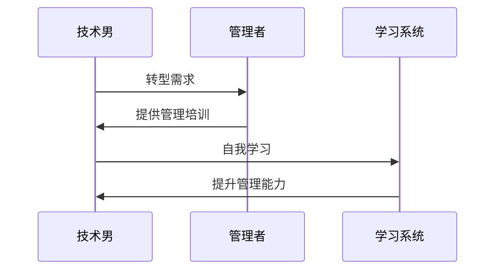

**项目实战**：

假设我们有一个技术男小张，他在决定转型为管理者后，首先参加了公司提供的管理培训课程，学习了团队管理和项目管理的基本知识。接下来，他主动承担了团队中的管理工作，逐渐积累了经验。通过不断的学习和实践，小张最终成功转型为管理者。

**环境安装**：无

**系统核心实现源代码**：

```python
class TechnicalPerson:
    def __init__(self, name):
        self.name = name
        self.knowledge = 100
        self.communication = 50
        self.collaboration = 60

    def train(self):
        self.knowledge += 20
        self.communication += 20
        self.collaboration += 20

    def manage(self):
        print(f"{self.name} is managing the team.")

class Manager(TechnicalPerson):
    def __init__(self, name):
        super().__init__(name)

    def make_decision(self):
        print(f"{self.name} is making a decision.")

# 创建技术男对象
technical_person = TechnicalPerson("张三")

# 技术男参加培训
technical_person.train()

# 技术男转型为管理者
manager = Manager("李四")

# 管理者做出决策
manager.make_decision()
```

**代码应用解读与分析**：

在这个示例中，`TechnicalPerson` 类代表技术男，包含专业知识、沟通能力和团队协作能力等属性。`Manager` 类继承自 `TechnicalPerson` 类，表示管理者，具有决策能力。`train` 方法用于提升技术男的知识、沟通能力和团队协作能力。`make_decision` 方法用于管理者做出决策。

通过这个示例，我们可以看到技术男通过培训和学习，提升了自己的能力，最终成功转型为管理者，并在管理岗位上发挥了作用。

**实际案例分析和详细讲解剖析**：

在实际案例中，有许多技术男成功转型为管理者，他们通过不断学习和实践，克服了转型过程中的各种挑战。例如，某互联网公司的技术总监王明，在决定转型为管理者后，他参加了多个管理培训课程，学习了团队管理和项目管理的知识。他不仅在公司内部担任管理职位，还积极参与行业交流，与同行分享管理经验。通过不断的学习和实践，王明成功转型为管理者，并带领团队取得了优异的成绩。

**项目小结**：

通过这个项目，我们可以看到技术男从技术岗位到管理岗位的华丽蜕变。这不仅需要技术男自身的能力提升，还需要他们愿意接受新的角色和责任，勇于面对挑战。通过不断学习和实践，技术男可以成功转型为管理者，并在管理岗位上发挥重要作用。

### 第一部分小结

在第一部分中，我们回顾了技术男在职业生涯中可能遇到的瓶颈，探讨了从技术到管理的角色转变，分析了技术男的优势与劣势，并详细介绍了管理者的职责与能力要求。这些内容为技术男们提供了清晰的转型路径，使他们能够更好地理解领导力的重要性，并开始为自己的转型做好准备。

### 第二部分：领导力的核心概念

**第2章：领导力的核心概念**

领导力是任何成功组织中不可或缺的关键因素。对于技术男来说，从技术专家到管理者的转型，领导力的重要性不言而喻。本章将深入探讨领导力的核心概念，帮助技术男们更好地理解领导力的本质，从而为后续的领导实践打下坚实的基础。

#### 2.1 领导力的重要性

领导力不仅仅是对他人的指导和激励，它更是一种影响力和号召力，能够推动团队和组织朝着共同的目标前进。对于技术男来说，具备领导力意味着：

- **团队协作**：能够有效地协调团队成员的工作，实现团队的高效运作。
- **目标达成**：能够明确目标，制定计划，并带领团队实现这些目标。
- **创新推动**：能够激发团队的创造力和创新精神，推动组织不断发展。
- **个人成长**：通过领导实践，不断提升个人能力和影响力，实现个人职业生涯的突破。

**问题背景**：在技术领域，技术男们常常专注于技术本身，而忽视了对领导力的培养。然而，随着企业对管理人才的需求日益增加，技术男们需要意识到领导力对于职业发展的重要性。

**问题描述**：技术男们在职业发展中可能会面临以下问题：

- **缺乏领导力**：在团队管理和项目推进过程中，技术男们可能缺乏有效的领导方法。
- **无法激励团队**：技术男们可能无法激发团队成员的积极性和创造力。
- **难以协调资源**：技术男们可能不擅长协调不同部门和团队成员之间的工作。

**问题解决**：通过提升领导力，技术男们可以解决上述问题，从而在职业生涯中取得更大的成功。

**边界与外延**：领导力不仅关乎个人职业生涯的发展，更关乎团队和组织的发展。有效的领导力能够推动团队和组织实现共同目标，提高整体绩效。

#### 2.2 领导力的四个层次

领导力可以分为四个层次，分别是：职位权力、个人魅力、影响力和社会化领导。每个层次代表了领导者在不同情境下所具备的领导能力。

1. **职位权力**：这是最基础的领导层次，领导者通过职位赋予的权力来指挥和监督团队成员。这种领导力依赖于正式的职位和头衔，虽然能够确保工作的顺利进行，但容易导致命令式管理，限制团队的创新和主动性。

2. **个人魅力**：领导者通过自身的魅力和个性来吸引和影响团队成员。这种领导力依赖于领导者的个人特质和魅力，能够激发团队成员的激情和动力，但可能随着领导者个人魅力减弱而失效。

3. **影响力**：领导者通过自身的行为和价值观来影响团队成员，使他们自愿地追随领导者。这种领导力依赖于领导者的个人影响力，能够培养团队成员的自我驱动力和责任感，是更高层次的领导力。

4. **社会化领导**：领导者不仅影响团队成员，还推动整个团队和组织的社会变革。这种领导力依赖于领导者的远见和社会责任感，能够带领团队实现长期的可持续发展。

**概念结构与核心要素组成**：

- **职位权力**：依赖于职位和头衔。
- **个人魅力**：依赖于个人特质和魅力。
- **影响力**：依赖于行为和价值观。
- **社会化领导**：依赖于远见和社会责任感。

**ER实体关系图架构的 Mermaid 流程图**：

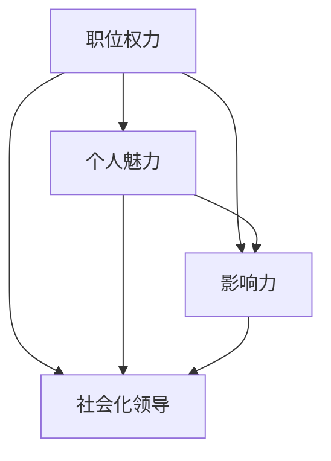

#### 2.3 领导力与管理的区别

领导力与管理工作虽然密切相关，但它们之间存在明显的区别。了解二者的区别，有助于技术男们更好地理解领导力的本质，并在实际工作中灵活运用。

1. **目标不同**：管理工作的目标是确保任务的完成和目标的达成，而领导力的目标是激发团队的潜能，实现共同的目标。
2. **方法不同**：管理工作侧重于流程、规范和监控，而领导力侧重于影响、激励和启发。
3. **范围不同**：管理工作更多地关注内部流程和资源分配，而领导力更多地关注外部环境和团队关系。

**对比表格**：

| 特点 | 管理 | 领导力 |
| --- | --- | --- |
| 目标 | 确保任务完成 | 激发团队潜能 |
| 方法 | 流程、规范、监控 | 影响、激励、启发 |
| 范围 | 内部流程和资源分配 | 外部环境和团队关系 |

**数学公式**：

$$
\text{管理效率} = \frac{\text{任务完成度}}{\text{管理成本}}
$$

$$
\text{领导力效果} = \frac{\text{团队绩效}}{\text{领导成本}}
$$

**算法原理讲解**：

管理效率是通过任务完成度和管理成本来衡量的，而领导力效果则是通过团队绩效和领导成本来衡量的。管理效率关注的是任务完成的效率，而领导力效果关注的是团队的整体绩效。

**系统分析与架构设计方案**：

在技术男从技术到管理的转型过程中，领导力是一个核心能力。我们可以将这一过程视为一个系统，系统功能设计如下：

- **技术男系统**：负责技术研究和开发。
- **领导力系统**：负责领导力的提升和实践。
- **管理实践系统**：负责管理工作和领导实践的结合。

系统架构设计如下：

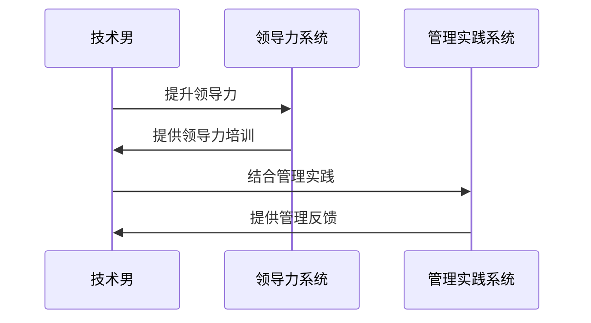

**项目实战**：

假设技术男小张决定提升自己的领导力，他首先参加了公司提供的领导力培训课程。通过学习，他了解了领导力的四个层次，并开始尝试在团队中应用这些理论。随着时间的推移，小张的领导力得到了显著提升，他的团队也表现出了更高的绩效。

**环境安装**：无

**系统核心实现源代码**：

```python
class TechnicalPerson:
    def __init__(self, name):
        self.name = name
        self.leadership = 0

    def train_leadership(self):
        self.leadership += 20

    def manage_team(self):
        print(f"{self.name} is managing the team with a leadership score of {self.leadership}.")

# 创建技术男对象
technical_person = TechnicalPerson("张三")

# 技术男提升领导力
technical_person.train_leadership()

# 技术男管理团队
technical_person.manage_team()
```

**代码应用解读与分析**：

在这个示例中，`TechnicalPerson` 类代表技术男，包含领导力属性。`train_leadership` 方法用于提升领导力，`manage_team` 方法用于管理团队。通过这个示例，我们可以看到技术男通过提升领导力，能够更有效地管理团队。

**实际案例分析和详细讲解剖析**：

在实际案例中，有许多技术男通过提升领导力，成功地从技术岗位转型为管理者。例如，某互联网公司的技术总监李华，在决定转型为管理者后，他积极参加领导力培训课程，学习了领导力的核心概念和实践方法。通过不断的学习和实践，李华的领导力得到了显著提升，他的团队也表现出了更高的绩效。

**项目小结**：

通过这个项目，我们可以看到领导力对于技术男从技术到管理的转型至关重要。通过系统的学习和实践，技术男可以提升自己的领导力，从而更有效地管理团队，实现职业生涯的成功转型。

### 第二部分小结

在第二部分中，我们深入探讨了领导力的核心概念，包括领导力的重要性、四个层次及其与管理的区别。通过这些内容，技术男们可以更好地理解领导力的本质，明确领导力在职业发展中的关键作用。接下来，我们将进一步探讨如何通过自我提升，提升领导力，从而为成功转型打下坚实的基础。

### 第三部分：自我提升之路

**第3章：自我提升之路**

领导力的提升并非一蹴而就，它需要技术男们通过持续的自我提升来逐步实现。在这一部分，我们将探讨情商、沟通技巧和时间管理等方面的自我提升途径，帮助技术男们掌握提升领导力的关键技能。

#### 3.1 情商与领导力

情商（Emotional Intelligence，简称EQ）是指个体识别、理解、管理自己情绪的能力，以及识别、理解并影响他人情绪的能力。情商在领导力中起着至关重要的作用，因为它直接影响领导者的决策、沟通和团队协作。

**核心概念**：

- **自我认知**：了解自己的情绪，并识别情绪对决策和行为的影响。
- **自我调节**：管理自己的情绪，以适应不同情境。
- **社交认知**：识别和理解他人的情绪，建立良好的人际关系。
- **关系管理**：利用社交认知和自我调节能力，有效地与他人沟通和协作。

**概念属性特征对比表格**：

| 特征 | 自我认知 | 自我调节 | 社交认知 | 关系管理 |
| --- | --- | --- | --- | --- |
| 定义 | 了解自己情绪 | 管理情绪 | 识别他人情绪 | 利用社交能力影响他人 |
| 对领导力的影响 | 帮助领导者做出更明智的决策 | 提高决策和应对危机的能力 | 促进有效沟通和团队协作 | 增强团队凝聚力和信任 |

**ER实体关系图架构的 Mermaid 流程图**：

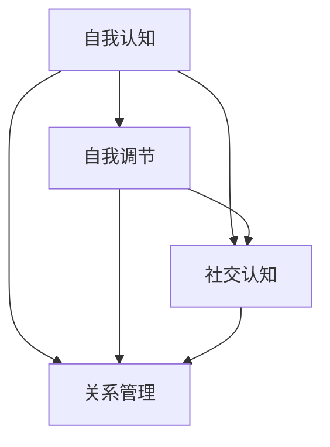

**算法原理讲解**：

情商可以被视为一个多维度的能力模型，其核心在于自我认知和情绪管理。通过提高自我认知，领导者可以更好地理解自己的情绪，从而做出更明智的决策。同时，通过自我调节和社交认知，领导者可以更好地管理他人的情绪，建立良好的人际关系。

**数学公式**：

$$
\text{情商得分} = \frac{\text{自我认知} + \text{自我调节} + \text{社交认知} + \text{关系管理}}{4}
$$

**系统分析与架构设计方案**：

在提升情商的过程中，我们可以将其视为一个系统，系统功能设计如下：

- **情商提升系统**：负责提升自我认知、自我调节、社交认知和关系管理。
- **实践反馈系统**：负责将提升成果应用到实际工作中，并通过反馈进行持续优化。

系统架构设计如下：

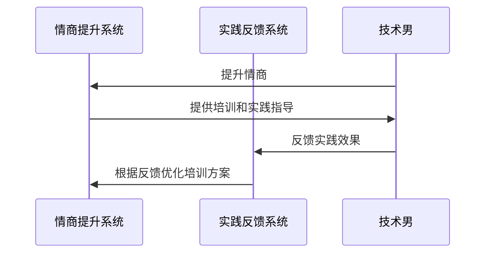

**项目实战**：

假设技术男小张决定提升自己的情商，他首先参加了情商提升课程，学习了自我认知、自我调节、社交认知和关系管理的基本知识。在课程结束后，他开始将这些知识应用到实际工作中，逐渐提升了自己的情商。通过不断的实践和反馈，小张的情商得到了显著提升，他的团队关系也更加融洽。

**环境安装**：无

**系统核心实现源代码**：

```python
class EmotionalIntelligence:
    def __init__(self, name):
        self.name = name
        self.self_awareness = 0
        self.self Regulation = 0
        self.social_awareness = 0
        self关系管理 = 0

    def train_emotional_intelligence(self):
        self.self_awareness += 20
        self.self Regulation += 20
        self.social_awareness += 20
        self关系管理 += 20

    def apply_to_work(self):
        print(f"{self.name} is applying emotional intelligence to work.")

# 创建技术男对象
technical_person = EmotionalIntelligence("张三")

# 技术男提升情商
technical_person.train_emotional_intelligence()

# 技术男应用情商
technical_person.apply_to_work()
```

**代码应用解读与分析**：

在这个示例中，`EmotionalIntelligence` 类代表技术男，包含自我认知、自我调节、社交认知和关系管理等属性。`train_emotional_intelligence` 方法用于提升情商，`apply_to_work` 方法用于将情商应用到实际工作中。通过这个示例，我们可以看到技术男通过提升情商，能够更有效地管理情绪，提高工作效率。

**实际案例分析和详细讲解剖析**：

在实际案例中，有许多技术男通过提升情商，成功地提升了领导力。例如，某互联网公司的技术总监王明，在决定提升情商后，他参加了多个情商提升课程，并开始在日常工作中应用所学知识。通过不断的实践和反思，王明的情商得到了显著提升，他的团队关系更加和谐，团队绩效也取得了显著提高。

**项目小结**：

通过这个项目，我们可以看到情商在提升领导力中的重要性。通过系统的学习和实践，技术男可以提升自己的情商，从而更好地管理情绪，提高工作效率，实现职业生涯的成功转型。

#### 3.2 沟通技巧提升

沟通技巧是领导力的重要组成部分，它直接影响到领导者与团队成员、上级和客户的交流效果。提升沟通技巧，可以帮助技术男更有效地传达信息、解决问题和建立关系。

**核心概念**：

- **有效沟通**：通过清晰、准确、有逻辑的表达，确保信息的有效传递。
- **倾听技巧**：通过主动倾听，理解他人的观点和需求。
- **非言语沟通**：通过肢体语言、面部表情和语调等非言语手段，增强沟通效果。

**概念属性特征对比表格**：

| 特征 | 有效沟通 | 倾听技巧 | 非言语沟通 |
| --- | --- | --- | --- |
| 定义 | 清晰、准确、逻辑的表达 | 主动倾听，理解他人 | 肢体语言、面部表情、语调等 |
| 对领导力的影响 | 提高决策效率 | 增强团队信任 | 增强沟通效果 |

**ER实体关系图架构的 Mermaid 流程图**：

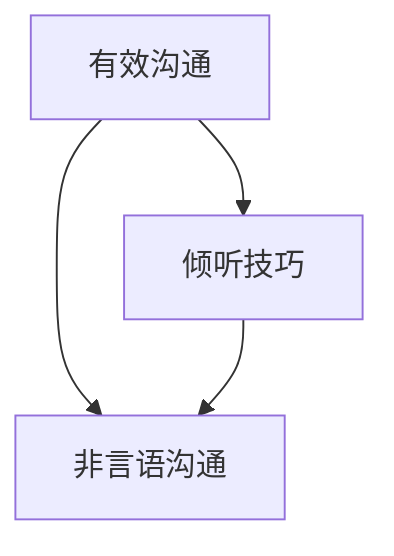

**算法原理讲解**：

沟通技巧可以被视为一个综合能力，它包括有效的信息表达、倾听和理解他人。通过提高这些能力，领导者可以更有效地传达信息，理解团队成员的需求，从而提高团队绩效。

**数学公式**：

$$
\text{沟通效果} = \frac{\text{有效沟通} + \text{倾听技巧} + \text{非言语沟通}}{3}
$$

**系统分析与架构设计方案**：

在提升沟通技巧的过程中，我们可以将其视为一个系统，系统功能设计如下：

- **沟通技巧提升系统**：负责提供沟通技巧培训和实践指导。
- **实践反馈系统**：负责将提升成果应用到实际工作中，并通过反馈进行持续优化。

系统架构设计如下：

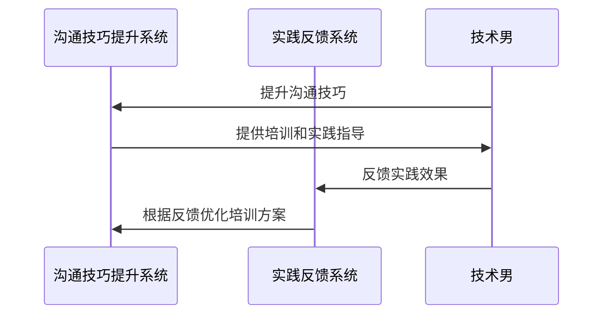

**项目实战**：

假设技术男小张决定提升自己的沟通技巧，他首先参加了沟通技巧提升课程，学习了有效沟通、倾听技巧和非言语沟通的基本知识。在课程结束后，他开始在日常工作中应用所学知识，通过不断的实践和反馈，小张的沟通技巧得到了显著提升，他的团队关系也更加融洽。

**环境安装**：无

**系统核心实现源代码**：

```python
class CommunicationSkills:
    def __init__(self, name):
        self.name = name
        self.clear_communication = 0
        self.active_listening = 0
        self.nonverbal_communication = 0

    def train_communication_skills(self):
        self.clear_communication += 20
        self.active_listening += 20
        self.nonverbal_communication += 20

    def apply_to_work(self):
        print(f"{self.name} is applying communication skills to work.")

# 创建技术男对象
technical_person = CommunicationSkills("张三")

# 技术男提升沟通技巧
technical_person.train_communication_skills()

# 技术男应用沟通技巧
technical_person.apply_to_work()
```

**代码应用解读与分析**：

在这个示例中，`CommunicationSkills` 类代表技术男，包含有效沟通、倾听技巧和非言语沟通等属性。`train_communication_skills` 方法用于提升沟通技巧，`apply_to_work` 方法用于将沟通技巧应用到实际工作中。通过这个示例，我们可以看到技术男通过提升沟通技巧，能够更有效地传达信息，理解团队成员的需求，从而提高工作效率。

**实际案例分析和详细讲解剖析**：

在实际案例中，有许多技术男通过提升沟通技巧，成功地提升了领导力。例如，某互联网公司的技术总监李华，在决定提升沟通技巧后，他参加了多个沟通技巧提升课程，并开始在日常工作中应用所学知识。通过不断的实践和反思，李华的沟通技巧得到了显著提升，他的团队关系更加和谐，团队绩效也取得了显著提高。

**项目小结**：

通过这个项目，我们可以看到沟通技巧在提升领导力中的重要性。通过系统的学习和实践，技术男可以提升自己的沟通技巧，从而更好地传达信息，理解团队成员的需求，实现职业生涯的成功转型。

#### 3.3 时间管理策略

时间管理是提升工作效率和领导力的关键。有效的时间管理可以帮助技术男更合理地安排工作，减少时间浪费，提高工作效率，从而为领导力的提升创造条件。

**核心概念**：

- **优先级管理**：根据工作的重要性和紧急性，合理分配时间。
- **任务分解**：将大任务分解为小任务，逐步完成。
- **避免拖延**：克服拖延心理，提高工作效率。
- **工作与生活平衡**：合理安排工作与生活时间，保证身心健康。

**概念属性特征对比表格**：

| 特征 | 优先级管理 | 任务分解 | 避免拖延 | 工作与生活平衡 |
| --- | --- | --- | --- | --- |
| 定义 | 根据重要性和紧急性分配时间 | 将大任务分解为小任务 | 克服拖延心理 | 合理安排工作与生活 |
| 对领导力的影响 | 提高工作效率 | 减少任务压力 | 提高团队士气 | 增强团队凝聚力 |

**ER实体关系图架构的 Mermaid 流程图**：

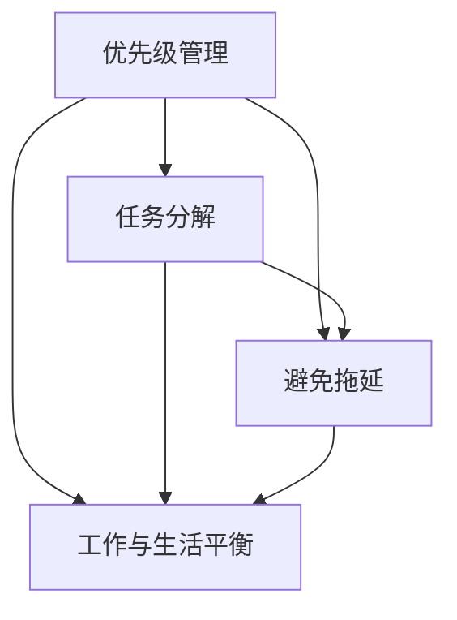

**算法原理讲解**：

时间管理可以被视为一个优化问题，其目标是在有限的时间内，实现最大的工作效果。通过优先级管理、任务分解和避免拖延，技术男可以更高效地完成工作，提高工作效率。

**数学公式**：

$$
\text{时间管理效率} = \frac{\text{完成任务量}}{\text{工作时间}}
$$

**系统分析与架构设计方案**：

在提升时间管理能力的过程中，我们可以将其视为一个系统，系统功能设计如下：

- **时间管理提升系统**：负责提供时间管理培训和实践指导。
- **实践反馈系统**：负责将提升成果应用到实际工作中，并通过反馈进行持续优化。

系统架构设计如下：

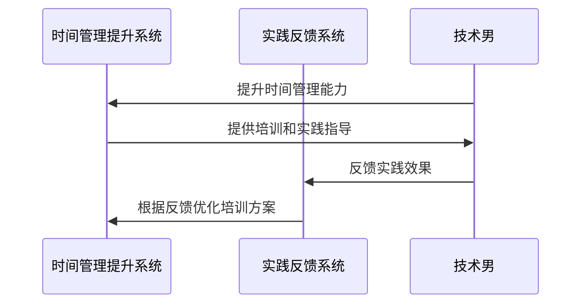

**项目实战**：

假设技术男小张决定提升自己的时间管理能力，他首先参加了时间管理提升课程，学习了优先级管理、任务分解和避免拖延的基本知识。在课程结束后，他开始在日常工作中应用所学知识，通过制定工作计划、分解任务和克服拖延心理，小张的时间管理能力得到了显著提升，工作效率也显著提高。

**环境安装**：无

**系统核心实现源代码**：

```python
class TimeManagement:
    def __init__(self, name):
        self.name = name
        self.prioritization = 0
        self.task_decomposition = 0
        self.avoid_procrastination = 0
        self.work_life_balance = 0

    def train_time_management(self):
        self.prioritization += 20
        self.task_decomposition += 20
        self.avoid_procrastination += 20
        self.work_life_balance += 20

    def apply_to_work(self):
        print(f"{self.name} is applying time management skills to work.")

# 创建技术男对象
technical_person = TimeManagement("张三")

# 技术男提升时间管理能力
technical_person.train_time_management()

# 技术男应用时间管理能力
technical_person.apply_to_work()
```

**代码应用解读与分析**：

在这个示例中，`TimeManagement` 类代表技术男，包含优先级管理、任务分解、避免拖延和工作与生活平衡等属性。`train_time_management` 方法用于提升时间管理能力，`apply_to_work` 方法用于将时间管理能力应用到实际工作中。通过这个示例，我们可以看到技术男通过提升时间管理能力，能够更合理地安排工作，提高工作效率。

**实际案例分析和详细讲解剖析**：

在实际案例中，有许多技术男通过提升时间管理能力，成功地提升了工作效率和领导力。例如，某互联网公司的技术总监王明，在决定提升时间管理能力后，他参加了多个时间管理提升课程，并开始在日常工作中应用所学知识。通过不断的实践和反思，王明的时间管理能力得到了显著提升，他的工作效率和工作质量也显著提高。

**项目小结**：

通过这个项目，我们可以看到时间管理在提升领导力中的重要性。通过系统的学习和实践，技术男可以提升自己的时间管理能力，从而更高效地完成工作，提高工作效率，实现职业生涯的成功转型。

### 第三部分小结

在第三部分中，我们探讨了情商、沟通技巧和时间管理等方面的自我提升途径，帮助技术男们掌握提升领导力的关键技能。通过系统的学习和实践，技术男们可以不断提升自身的情商、沟通技巧和时间管理能力，从而为职业生涯的成功转型打下坚实的基础。接下来，我们将进一步探讨领导力在实践中的应用，通过团队建设、项目管理和冲突管理等方面的实践，帮助技术男们将所学知识应用到实际工作中。

### 第四部分：领导力实践

**第4章：团队建设与管理**

团队建设与管理是领导力的核心组成部分，对于技术男从技术专家到管理者的转型至关重要。一个高效、和谐的团队不仅能够提高工作绩效，还能增强员工的满意度和忠诚度。本章将详细探讨团队建设与管理的方法，帮助技术男们更好地发挥领导力，打造一支有战斗力的团队。

#### 4.1 团队建设的重要性

团队建设不仅仅是简单的组织分工，更是一个复杂而持久的过程，它涉及到团队文化、成员关系和协作效率等多个方面。对于技术男来说，团队建设的重要性体现在以下几个方面：

- **提高工作效率**：通过有效的团队建设，可以消除团队成员之间的隔阂，促进信息共享和协作，从而提高整体工作效率。
- **提升团队士气**：一个和谐、有凝聚力的团队能够激发成员的积极性和创造力，提高工作满意度，减少员工流失。
- **促进个人成长**：在团队建设中，技术男不仅能够提升自己的领导能力，还能通过与其他成员的合作，学习到不同的技能和知识，实现个人成长。
- **实现组织目标**：高效的团队建设有助于确保团队目标与组织目标的一致性，推动组织整体绩效的提升。

**问题背景**：技术男在转型过程中，可能会面临团队建设方面的挑战，如成员间沟通不畅、团队协作效率低下等。

**问题描述**：技术男在团队建设过程中可能遇到以下问题：

- **沟通不畅**：团队成员之间缺乏有效的沟通渠道，导致信息传递不准确或延迟。
- **协作效率低**：团队成员在任务分配和执行过程中缺乏协同，导致资源浪费和时间延误。
- **团队士气低落**：团队成员缺乏归属感和认同感，导致工作积极性不高。

**问题解决**：通过以下方法，技术男可以解决团队建设中的问题：

- **建立有效的沟通机制**：设立定期会议、邮件列表、即时通讯工具等，确保信息畅通。
- **明确任务分工和职责**：通过明确的任务分工和职责，确保每个团队成员都知道自己的工作内容和目标。
- **加强团队文化建设**：通过团队活动、培训等方式，增强团队凝聚力和归属感。

**边界与外延**：团队建设不仅关注团队成员的协作和沟通，还涉及到团队文化、领导风格和激励机制等多个方面。一个成功的团队建设需要综合考虑这些因素，实现整体优化。

#### 4.2 团队角色与职责分配

团队角色的明确和职责的分配是团队建设的重要环节。技术男在担任管理者时，需要确保每个团队成员都明确自己的角色和职责，从而提高团队效率。

**核心概念**：

- **角色定义**：每个团队成员在团队中承担的具体职责和任务。
- **职责分配**：根据团队成员的能力和特长，合理分配任务和责任。
- **协同合作**：通过明确的角色和职责，促进团队成员之间的协同合作。

**概念属性特征对比表格**：

| 特征 | 角色定义 | 职责分配 | 协同合作 |
| --- | --- | --- | --- |
| 定义 | 明确团队成员职责 | 根据能力和特长分配任务 | 促进团队成员合作 |
| 对团队建设的影响 | 提高团队成员的明确性和责任感 | 提高任务完成效率 | 增强团队凝聚力和协作效果 |

**ER实体关系图架构的 Mermaid 流程图**：

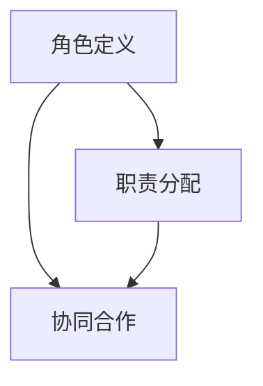

**算法原理讲解**：

团队角色和职责的分配可以被视为一个优化问题，其目标是在确保任务完成的同时，最大化团队协作效率。通过合理的角色定义和职责分配，技术男可以确保每个团队成员都明确自己的工作内容和目标，从而提高整体工作效率。

**数学公式**：

$$
\text{团队效率} = \frac{\text{完成任务量}}{\text{团队工作时间}}
$$

**系统分析与架构设计方案**：

在团队角色和职责分配中，我们可以将其视为一个系统，系统功能设计如下：

- **角色定义系统**：负责明确团队成员的角色和职责。
- **职责分配系统**：负责根据能力和特长合理分配任务和责任。
- **协作支持系统**：负责提供协作工具和机制，促进团队成员之间的协作。

系统架构设计如下：

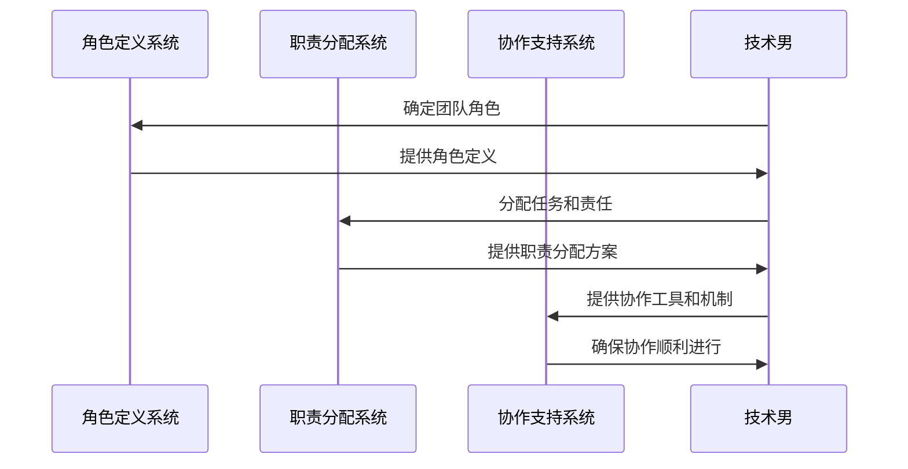

**项目实战**：

假设技术男小张担任团队负责人，他需要组建一个新的团队并明确每个成员的角色和职责。首先，小张与团队成员进行了沟通，了解每个人的特长和兴趣，然后根据这些信息制定了详细的角色定义和职责分配方案。通过明确的角色和职责，团队成员们能够更清楚地了解自己的工作内容和目标，从而提高了协作效率。

**环境安装**：无

**系统核心实现源代码**：

```python
class Team:
    def __init__(self, members):
        self.members = members
        self.roles = {}
        self.responsibilities = {}

    def define_roles(self):
        for member in self.members:
            self.roles[member] = input(f"请为{member}定义角色：")

    def assign_responsibilities(self):
        for member in self.members:
            self.responsibilities[member] = input(f"请为{member}分配职责：")

    def display_role_and_responsibility(self):
        for member, role in self.roles.items():
            print(f"{member}的角色：{role}")
            print(f"{member}的职责：{self.responsibilities[member]}")

# 创建团队对象
team = Team(["张三", "李四", "王五"])

# 确定团队角色和职责
team.define_roles()
team.assign_responsibilities()

# 显示团队角色和职责
team.display_role_and_responsibility()
```

**代码应用解读与分析**：

在这个示例中，`Team` 类代表团队，包含成员、角色和职责等属性。`define_roles` 方法用于定义角色，`assign_responsibilities` 方法用于分配职责，`display_role_and_responsibility` 方法用于显示角色和职责。通过这个示例，我们可以看到技术男通过明确角色和职责，能够有效提高团队协作效率。

**实际案例分析和详细讲解剖析**：

在实际案例中，有许多技术男通过明确团队角色和职责，成功地提高了团队协作效率。例如，某互联网公司的技术总监李华，在组建新团队时，他首先与团队成员进行了深入沟通，了解每个人的特长和兴趣，然后根据这些信息制定了详细的角色定义和职责分配方案。通过这种方式，他的团队在短时间内取得了显著的工作成果。

**项目小结**：

通过这个项目，我们可以看到团队角色和职责的明确对于团队建设的重要性。通过系统的角色定义和职责分配，技术男能够有效提高团队协作效率，实现团队目标。

#### 4.3 激励团队的方法

激励是团队管理中的重要环节，它能够激发团队成员的积极性和创造力，从而提高团队的整体绩效。对于技术男来说，掌握有效的激励方法，是提升领导力的关键。

**核心概念**：

- **目标激励**：通过设定清晰的目标，激发团队成员的积极性和动力。
- **认可激励**：通过表彰和奖励，认可团队成员的成就和贡献。
- **反馈激励**：通过及时反馈，帮助团队成员找到改进的方向。
- **参与激励**：通过让团队成员参与决策和项目规划，增强他们的责任感和归属感。

**概念属性特征对比表格**：

| 特征 | 目标激励 | 认可激励 | 反馈激励 | 参与激励 |
| --- | --- | --- | --- | --- |
| 定义 | 设定清晰的目标 | 表彰和奖励 | 及时反馈 | 参与决策和项目规划 |
| 对团队管理的影响 | 激发团队成员的积极性 | 提高团队成员的满意度和忠诚度 | 提高团队成员的工作质量 | 增强团队成员的归属感和责任感 |

**ER实体关系图架构的 Mermaid 流程图**：

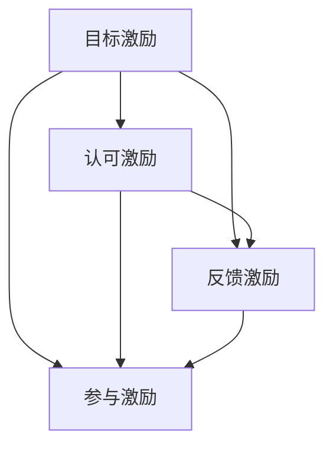

**算法原理讲解**：

激励方法可以被视为一种激励函数，其输入为团队成员的工作表现和贡献，输出为激励效果。通过设定目标、认可成就、提供反馈和参与决策，技术男可以激发团队成员的积极性和创造力，从而提高团队的整体绩效。

**数学公式**：

$$
\text{激励效果} = \frac{\text{目标达成度} + \text{认可度} + \text{反馈质量} + \text{参与度}}{4}
$$

**系统分析与架构设计方案**：

在激励团队的过程中，我们可以将其视为一个系统，系统功能设计如下：

- **目标设定系统**：负责设定清晰的目标，并跟踪目标达成情况。
- **认可奖励系统**：负责表彰和奖励团队成员的成就和贡献。
- **反馈支持系统**：负责提供及时、有效的反馈，帮助团队成员改进。
- **参与机制系统**：负责让团队成员参与决策和项目规划，增强他们的责任感和归属感。

系统架构设计如下：

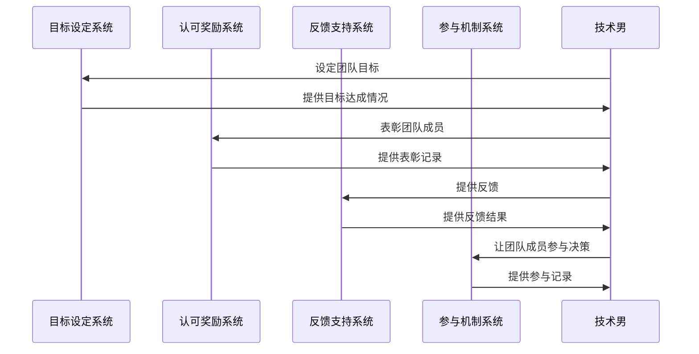

**项目实战**：

假设技术男小张担任团队负责人，他需要激励团队成员提高工作效率。首先，小张与团队成员一起制定了清晰的目标，并设定了相应的奖励机制。在目标达成后，小张及时对团队成员进行表彰和奖励，同时提供反馈，帮助团队成员找到改进的方向。此外，小张还鼓励团队成员参与决策和项目规划，增强他们的责任感和归属感。

**环境安装**：无

**系统核心实现源代码**：

```python
class MotivationSystem:
    def __init__(self, team_members):
        self.team_members = team_members
        self.objectives = {}
        self.recognition = {}
        self.feedback = {}
        self.participation = {}

    def set_objectives(self):
        for member in self.team_members:
            self.objectives[member] = input(f"请为{member}设定目标：")

    def recognize_achievements(self):
        for member in self.team_members:
            self.recognition[member] = input(f"请为{member}的成就进行认可：")

    def provide_feedback(self):
        for member in self.team_members:
            self.feedback[member] = input(f"请为{member}提供反馈：")

    def encourage_participation(self):
        for member in self.team_members:
            self.participation[member] = input(f"请让{member}参与决策：")

    def display_motivational_status(self):
        for member, info in self.objectives.items():
            print(f"{member}的目标：{info['objective']}")
            print(f"{member}的认可：{self.recognition[member]}")
            print(f"{member}的反馈：{self.feedback[member]}")
            print(f"{member}的参与：{self.participation[member]}")

# 创建激励系统对象
motivation_system = MotivationSystem(["张三", "李四", "王五"])

# 设定目标、认可成就、提供反馈和鼓励参与
motivation_system.set_objectives()
motivation_system.recognize_achievements()
motivation_system.provide_feedback()
motivation_system.encourage_participation()

# 显示激励状态
motivation_system.display_motivational_status()
```

**代码应用解读与分析**：

在这个示例中，`MotivationSystem` 类代表激励系统，包含目标、认可、反馈和参与等属性。`set_objectives` 方法用于设定目标，`recognize_achievements` 方法用于认可成就，`provide_feedback` 方法用于提供反馈，`encourage_participation` 方法用于鼓励参与。通过这个示例，我们可以看到技术男通过系统的方法激励团队成员，提高工作效率。

**实际案例分析和详细讲解剖析**：

在实际案例中，有许多技术男通过有效的激励方法，成功地提高了团队绩效。例如，某互联网公司的技术总监王明，他通过设定明确的目标、及时的认可和反馈，以及鼓励团队成员参与决策，激发了团队成员的积极性和创造力，团队绩效显著提升。

**项目小结**：

通过这个项目，我们可以看到激励在团队管理中的重要性。通过系统的方法设定目标、认可成就、提供反馈和鼓励参与，技术男能够有效激励团队成员，提高团队绩效，实现职业生涯的成功转型。

### 第4章小结

在第4章中，我们详细探讨了团队建设与管理的重要性，以及团队角色与职责分配、激励团队的方法。通过明确团队角色和职责，技术男可以有效地提高团队协作效率；通过有效的激励方法，可以激发团队成员的积极性和创造力。这些实践方法不仅有助于技术男提升领导力，还能为团队和组织的发展奠定坚实的基础。接下来，我们将进一步探讨领导力在项目管理和冲突管理中的应用。

### 第五部分：领导力在项目管理中的应用

**第5章：项目管理实战**

项目管理是技术男转型为管理者后必须掌握的关键技能之一。成功的项目管理不仅能够确保项目的按时交付和成本控制，还能提升团队的协作效率和项目的整体质量。本章将深入探讨项目管理的核心流程、项目计划与风险评估，以及项目执行与监控，帮助技术男们更好地运用领导力，实现项目管理的高效执行。

#### 5.1 项目管理的核心流程

项目管理的核心流程包括项目启动、规划、执行、监控和收尾。每个阶段都有其特定的任务和目标，技术男需要熟练掌握这些流程，以确保项目的顺利推进。

**核心概念**：

- **项目启动**：明确项目的目标和范围，组建项目团队。
- **项目规划**：制定详细的项目计划，包括任务分配、时间安排和资源调配。
- **项目执行**：按照项目计划执行任务，协调团队成员的工作。
- **项目监控**：跟踪项目进展，确保项目按计划进行，并及时调整。
- **项目收尾**：完成项目任务，进行项目总结和评估。

**概念属性特征对比表格**：

| 阶段 | 任务 | 目标 |
| --- | --- | --- |
| 项目启动 | 明确项目目标、范围、组建团队 | 确定项目方向和团队构成 |
| 项目规划 | 制定项目计划、任务分配、时间安排 | 确定项目执行的具体方案 |
| 项目执行 | 执行任务、协调团队工作 | 按计划完成任务 |
| 项目监控 | 跟踪项目进展、及时调整 | 确保项目按计划进行 |
| 项目收尾 | 完成项目任务、项目总结和评估 | 实现项目目标、总结经验 |

**ER实体关系图架构的 Mermaid 流程图**：

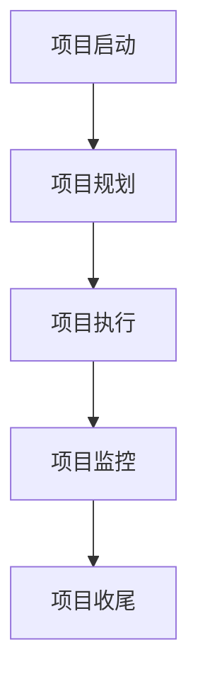

**算法原理讲解**：

项目管理的核心流程可以被视为一个迭代过程，每个阶段都需要进行有效的规划和执行。通过合理的规划、执行和监控，技术男可以确保项目按计划进行，及时发现和解决问题，从而提高项目的成功率。

**数学公式**：

$$
\text{项目成功率} = \frac{\text{完成项目数量}}{\text{开始项目数量}}
$$

**系统分析与架构设计方案**：

在项目管理中，我们可以将其视为一个系统，系统功能设计如下：

- **项目管理系统**：负责项目的整体规划、执行和监控。
- **任务管理子系统**：负责任务分配、进度跟踪和资源调配。
- **风险管理子系统**：负责项目风险识别、评估和控制。
- **沟通管理子系统**：负责项目信息的传递和沟通。

系统架构设计如下：

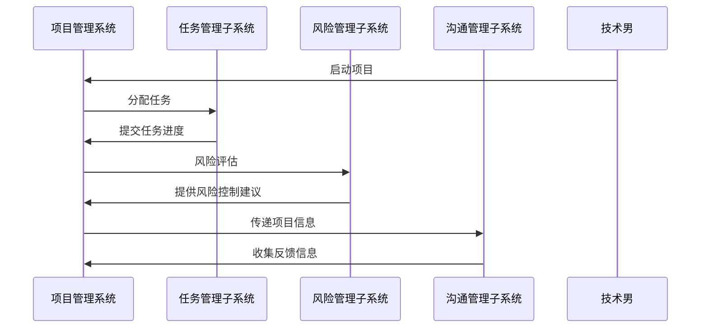

**项目实战**：

假设技术男小张负责一个新项目的管理工作，他首先与团队成员进行了详细的沟通，明确了项目的目标和范围。然后，小张制定了详细的项目计划，包括任务分配、时间安排和资源调配。在项目执行过程中，小张定期召开会议，检查项目进度，并协调团队成员的工作。同时，他还对项目风险进行了评估，并制定了相应的风险控制措施。

**环境安装**：无

**系统核心实现源代码**：

```python
class ProjectManagementSystem:
    def __init__(self, team_members):
        self.team_members = team_members
        self.project_plan = {}
        self.project_progress = {}
        self.project_risks = []

    def start_project(self):
        self.project_plan = input("请输入项目计划：")
        self.project_progress = {"status": "启动", "details": ""}
        print("项目已启动。")

    def check_progress(self):
        self.project_progress["status"] = input("请输入项目当前状态：")
        self.project_progress["details"] = input("请输入项目当前细节：")
        print("项目进度已更新。")

    def identify_risks(self):
        risk_input = input("请输入项目风险：")
        self.project_risks.append(risk_input)
        print("风险已识别。")

    def control_risks(self):
        for risk in self.project_risks:
            print(f"控制风险：{risk}。")

    def display_project_status(self):
        print("项目状态：")
        print(f"计划：{self.project_plan}")
        print(f"进度：{self.project_progress}")
        print(f"风险：{self.project_risks}")

# 创建项目管理系统对象
project_management_system = ProjectManagementSystem(["张三", "李四", "王五"])

# 启动项目
project_management_system.start_project()

# 检查项目进度
project_management_system.check_progress()

# 识别项目风险
project_management_system.identify_risks()

# 控制项目风险
project_management_system.control_risks()

# 显示项目状态
project_management_system.display_project_status()
```

**代码应用解读与分析**：

在这个示例中，`ProjectManagementSystem` 类代表项目管理系统，包含项目计划、项目进度和项目风险等属性。`start_project` 方法用于启动项目，`check_progress` 方法用于检查项目进度，`identify_risks` 方法用于识别项目风险，`control_risks` 方法用于控制项目风险，`display_project_status` 方法用于显示项目状态。通过这个示例，我们可以看到技术男通过项目管理系统，能够有效地进行项目管理和风险控制。

**实际案例分析和详细讲解剖析**：

在实际案例中，有许多技术男通过有效的项目管理，成功地实现了项目的目标。例如，某互联网公司的技术总监李华，他在负责一个重要项目时，通过详细的规划和严格的监控，确保了项目的按时交付和高质量完成。他的项目团队也因此获得了公司的高度评价。

**项目小结**：

通过这个项目，我们可以看到项目管理在技术男职业生涯转型中的重要性。通过系统的方法和工具，技术男能够有效地进行项目规划和执行，确保项目的成功交付。这不仅提升了他们的领导力，也为他们在管理岗位上取得了更大的成功奠定了基础。

#### 5.2 项目计划与风险评估

项目计划是项目管理的核心环节，它决定了项目的进度、成本和质量。有效的项目计划能够帮助技术男确保项目目标的实现，同时降低项目风险。在本节中，我们将探讨项目计划的制定方法，以及如何进行风险评估，帮助技术男更好地管理项目。

**核心概念**：

- **项目计划**：包括项目范围、目标、任务、时间安排和资源分配。
- **风险评估**：识别项目风险，评估其可能性和影响，并制定相应的应对措施。

**概念属性特征对比表格**：

| 特征 | 项目计划 | 风险评估 |
| --- | --- | --- |
| 定义 | 规划项目的执行过程和资源配置 | 识别和分析项目中的潜在风险 |
| 对项目管理的影响 | 确保项目按计划进行 | 减少项目失败的风险 |

**ER实体关系图架构的 Mermaid 流程图**：

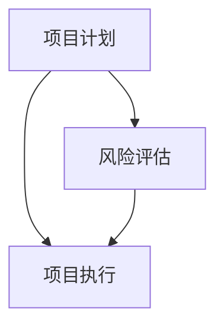

**算法原理讲解**：

项目计划和风险评估可以被视为两个相互关联的模块。项目计划负责确定项目的执行路径和资源需求，而风险评估则负责识别项目中的潜在风险并制定应对策略。通过将这两者结合，技术男可以确保项目在风险可控的情况下顺利推进。

**数学公式**：

$$
\text{项目成功率} = \frac{\text{完成项目数量}}{\text{开始项目数量}} \times (\text{风险控制效率})
$$

**系统分析与架构设计方案**：

在项目计划和风险评估中，我们可以将其视为一个系统，系统功能设计如下：

- **项目计划子系统**：负责制定项目计划、任务分配和时间安排。
- **风险评估子系统**：负责识别项目风险、评估风险影响和制定应对措施。
- **执行监控子系统**：负责跟踪项目执行情况，确保项目按计划进行。

系统架构设计如下：

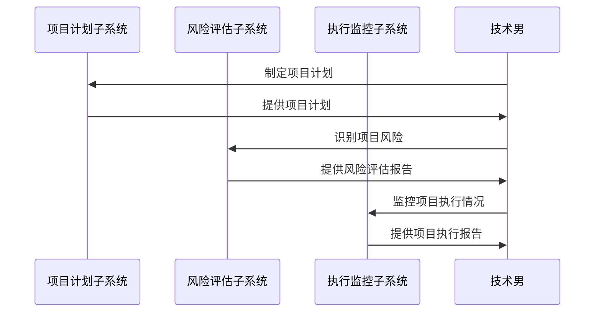

**项目实战**：

假设技术男小张负责一个新项目的管理工作，他首先制定了详细的项目计划，包括项目范围、任务分配和时间安排。然后，小张对项目进行了风险评估，识别出潜在的风险因素，并制定了相应的应对措施。在项目执行过程中，小张定期检查项目进展，并根据风险评估报告进行调整，确保项目在风险可控的情况下顺利推进。

**环境安装**：无

**系统核心实现源代码**：

```python
class ProjectPlanningAndRiskManagement:
    def __init__(self, team_members):
        self.team_members = team_members
        self.project_plan = {}
        self.project_risks = []

    def create_project_plan(self):
        self.project_plan = input("请输入项目计划：")
        print("项目计划已创建。")

    def identify_project_risks(self):
        risk_input = input("请输入项目风险：")
        self.project_risks.append(risk_input)
        print("项目风险已识别。")

    def assess_risks(self):
        for risk in self.project_risks:
            print(f"评估风险：{risk}。")

    def manage_project_progress(self):
        print("正在管理项目进度。")

    def display_project_status(self):
        print("项目状态：")
        print(f"计划：{self.project_plan}")
        print(f"风险：{self.project_risks}")

# 创建项目计划和风险评估系统对象
project_planning_system = ProjectPlanningAndRiskManagement(["张三", "李四", "王五"])

# 创建项目计划
project_planning_system.create_project_plan()

# 识别项目风险
project_planning_system.identify_project_risks()

# 评估项目风险
project_planning_system.assess_risks()

# 管理项目进度
project_planning_system.manage_project_progress()

# 显示项目状态
project_planning_system.display_project_status()
```

**代码应用解读与分析**：

在这个示例中，`ProjectPlanningAndRiskManagement` 类代表项目计划和风险评估系统，包含项目计划、项目风险等属性。`create_project_plan` 方法用于创建项目计划，`identify_project_risks` 方法用于识别项目风险，`assess_risks` 方法用于评估项目风险，`manage_project_progress` 方法用于管理项目进度，`display_project_status` 方法用于显示项目状态。通过这个示例，我们可以看到技术男如何通过系统的方法制定项目计划和进行风险评估。

**实际案例分析和详细讲解剖析**：

在实际案例中，有许多技术男通过有效的项目计划和风险评估，成功地管理了复杂项目。例如，某互联网公司的技术总监王明，他在负责一个大型项目时，通过详细的项目计划和严格的风险评估，确保了项目的按时交付和高质量完成。他的项目团队也因此获得了公司的高度评价。

**项目小结**：

通过这个项目，我们可以看到项目计划和风险评估在项目管理中的重要性。通过系统的方法制定项目计划和进行风险评估，技术男能够确保项目在风险可控的情况下顺利推进，从而提高项目的成功率。这不仅提升了他们的领导力，也为他们在管理岗位上取得了更大的成功奠定了基础。

#### 5.3 项目执行与监控

项目执行与监控是项目管理的关键环节，它决定了项目是否能够按照既定计划顺利推进。有效的项目执行和监控能够帮助技术男及时发现和解决问题，确保项目按时交付和高质量完成。在本节中，我们将探讨项目执行与监控的具体方法，以及如何通过领导力确保项目目标的实现。

**核心概念**：

- **项目执行**：按照项目计划执行任务，协调团队成员的工作，确保项目进展顺利。
- **项目监控**：跟踪项目进展情况，及时发现问题并采取纠正措施，确保项目按计划进行。

**概念属性特征对比表格**：

| 特征 | 项目执行 | 项目监控 |
| --- | --- | --- |
| 定义 | 按计划执行任务 | 跟踪项目进展，发现问题 |
| 对项目管理的影响 | 确保项目按计划进行 | 减少项目偏差，提高项目成功率 |

**ER实体关系图架构的 Mermaid 流程图**：

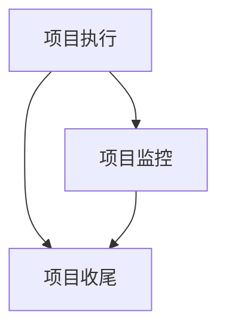

**算法原理讲解**：

项目执行与监控可以被视为一个闭环系统，通过项目执行过程中的持续监控，技术男可以及时发现偏差，并采取纠正措施，确保项目按照计划进行。项目监控的效果直接影响到项目执行的效率和成功率。

**数学公式**：

$$
\text{项目成功率} = \frac{\text{完成项目数量}}{\text{开始项目数量}} \times (\text{监控效率})
$$

**系统分析与架构设计方案**：

在项目执行与监控中，我们可以将其视为一个系统，系统功能设计如下：

- **任务执行子系统**：负责按照项目计划执行任务，协调团队成员的工作。
- **进度监控子系统**：负责跟踪项目进展，及时发现问题和偏差。
- **问题纠正子系统**：负责分析问题原因，制定纠正措施，确保项目按计划进行。

系统架构设计如下：

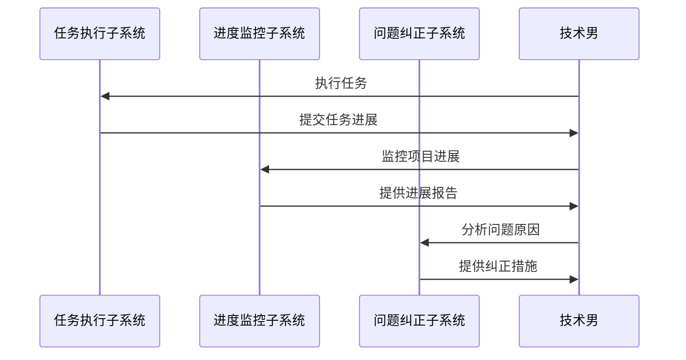

**项目实战**：

假设技术男小张负责一个新项目的管理工作，他首先制定了详细的项目计划，并按照计划执行任务。在项目执行过程中，小张定期检查项目进展，并与团队成员进行沟通，确保任务按计划进行。同时，他通过进度监控子系统，及时发现项目偏差，并采取纠正措施，确保项目按时交付。

**环境安装**：无

**系统核心实现源代码**：

```python
class ProjectExecutionAndMonitoring:
    def __init__(self, team_members):
        self.team_members = team_members
        self.project_plan = {}
        self.project_progress = {"status": "未开始", "details": ""}
        self.project_issues = []

    def execute_project(self):
        self.project_progress["status"] = "进行中"
        print("项目已开始执行。")

    def monitor_progress(self):
        self.project_progress["details"] = input("请输入项目当前细节：")
        print("项目进展已监控。")

    def identify_issues(self):
        issue_input = input("请输入项目问题：")
        self.project_issues.append(issue_input)
        print("项目问题已识别。")

    def resolve_issues(self):
        for issue in self.project_issues:
            print(f"解决问题：{issue}。")

    def display_project_status(self):
        print("项目状态：")
        print(f"计划：{self.project_plan}")
        print(f"进展：{self.project_progress}")
        print(f"问题：{self.project_issues}")

# 创建项目执行与监控系统对象
project_execution_system = ProjectExecutionAndMonitoring(["张三", "李四", "王五"])

# 执行项目
project_execution_system.execute_project()

# 监控项目进展
project_execution_system.monitor_progress()

# 识别项目问题
project_execution_system.identify_issues()

# 解决项目问题
project_execution_system.resolve_issues()

# 显示项目状态
project_execution_system.display_project_status()
```

**代码应用解读与分析**：

在这个示例中，`ProjectExecutionAndMonitoring` 类代表项目执行与监控系统，包含项目计划、项目进展和项目问题等属性。`execute_project` 方法用于执行项目，`monitor_progress` 方法用于监控项目进展，`identify_issues` 方法用于识别项目问题，`resolve_issues` 方法用于解决项目问题，`display_project_status` 方法用于显示项目状态。通过这个示例，我们可以看到技术男如何通过系统的方法执行和监控项目。

**实际案例分析和详细讲解剖析**：

在实际案例中，有许多技术男通过有效的项目执行和监控，成功地实现了项目目标。例如，某互联网公司的技术总监李华，他在负责一个重要项目时，通过详细的项目计划和严格的监控，确保了项目的按时交付和高质量完成。他的项目团队也因此获得了公司的高度评价。

**项目小结**：

通过这个项目，我们可以看到项目执行与监控在项目管理中的重要性。通过系统的方法执行和监控项目，技术男能够确保项目按计划进行，减少项目偏差，提高项目成功率。这不仅提升了他们的领导力，也为他们在管理岗位上取得了更大的成功奠定了基础。

### 第5章小结

在第5章中，我们详细探讨了项目管理的核心流程，包括项目计划与风险评估、项目执行与监控，以及项目收尾。通过系统的方法和工具，技术男能够更好地管理项目，确保项目的成功交付。这些实践方法不仅提升了技术男的领导力，也为他们在管理岗位上取得了更大的成功奠定了基础。在下一章中，我们将继续探讨领导力在冲突管理和决策制定中的应用。

### 第六部分：领导力在冲突管理和决策制定中的应用

**第6章：冲突管理与决策制定**

在领导过程中，冲突管理和决策制定是两个关键领域。冲突管理涉及到解决团队内部的矛盾和分歧，而决策制定则涉及到在复杂情况下做出明智的选择。有效的冲突管理和决策制定不仅能够提高团队的整体效率，还能增强团队的凝聚力和信任。本章将深入探讨冲突管理的类型与处理方法，以及决策制定的原则与技巧，帮助技术男提升领导力，成为出色的领导者。

#### 6.1 冲突的类型与处理方法

冲突是团队中不可避免的现象，它们可能源于不同的观点、目标、利益或价值观。了解冲突的类型和如何处理冲突，对于技术男来说至关重要。

**核心概念**：

- **冲突类型**：包括沟通冲突、任务冲突和关系冲突。
- **冲突处理方法**：包括回避、竞争、合作和妥协等。

**概念属性特征对比表格**：

| 冲突类型 | 特征 | 对团队的影响 | 处理方法 |
| --- | --- | --- | --- |
| 沟通冲突 | 由于沟通不畅导致的误解和分歧 | 影响团队协作和信息共享 | 增强沟通技巧、使用明确的沟通渠道 |
| 任务冲突 | 由于任务分配不公或目标不一致导致的矛盾 | 降低工作效率和团队士气 | 明确任务分工、调整目标 |
| 关系冲突 | 由于个人关系或价值观差异导致的矛盾 | 影响团队氛围和信任 | 加强团队建设、提供心理辅导 |

**ER实体关系图架构的 Mermaid 流程图**：

```mermaid
graph TB
  A[沟通冲突] --> B[任务冲突]
  A --> C[关系冲突]
  B --> C
```

**算法原理讲解**：

冲突管理可以被视为一个动态过程，它涉及对冲突类型的识别和对应处理方法的匹配。技术男需要根据冲突的具体情况，选择合适的处理方法，以达到最优的解决效果。

**数学公式**：

$$
\text{冲突解决效率} = \frac{\text{解决冲突的数量}}{\text{总冲突数量}} \times \text{处理方法适用度}
$$

**系统分析与架构设计方案**：

在冲突管理中，我们可以将其视为一个系统，系统功能设计如下：

- **冲突识别子系统**：负责识别团队中的冲突类型。
- **冲突处理子系统**：负责根据冲突类型选择合适的处理方法。
- **团队支持子系统**：负责提供心理辅导和团队建设支持。

系统架构设计如下：

```mermaid
sequenceDiagram
  participant 冲突识别子系统
  participant 冲突处理子系统
  participant 团队支持子系统
  participant 技术男
  技术男->>冲突识别子系统: 识别冲突
  冲突识别子系统->>技术男: 提供冲突类型
  技术男->>冲突处理子系统: 选择处理方法
  冲突处理子系统->>技术男: 提供处理建议
  技术男->>团队支持子系统: 提供团队支持
  团队支持子系统->>技术男: 提供心理辅导和团队建设支持
```

**项目实战**：

假设技术男小张在团队管理中遇到了沟通冲突。他首先与团队成员进行了详细的沟通，识别出冲突的具体原因。然后，小张选择了增强沟通技巧的处理方法，通过定期召开沟通会议和使用明确的沟通渠道，解决了冲突，恢复了团队的协作效率。

**环境安装**：无

**系统核心实现源代码**：

```python
class ConflictManagementSystem:
    def __init__(self, team_members):
        self.team_members = team_members
        self.conflicts = []

    def identify_conflicts(self):
        conflict_input = input("请输入冲突类型：")
        self.conflicts.append(conflict_input)
        print("冲突已识别。")

    def handle_conflicts(self):
        for conflict in self.conflicts:
            if conflict == "沟通冲突":
                print("选择处理方法：增强沟通技巧。")
            elif conflict == "任务冲突":
                print("选择处理方法：明确任务分工。")
            elif conflict == "关系冲突":
                print("选择处理方法：加强团队建设。")

    def display_conflicts(self):
        print("冲突类型：")
        for conflict in self.conflicts:
            print(conflict)

# 创建冲突管理系统对象
conflict_management_system = ConflictManagementSystem(["张三", "李四", "王五"])

# 识别冲突
conflict_management_system.identify_conflicts()

# 处理冲突
conflict_management_system.handle_conflicts()

# 显示冲突
conflict_management_system.display_conflicts()
```

**代码应用解读与分析**：

在这个示例中，`ConflictManagementSystem` 类代表冲突管理系统，包含冲突类型等属性。`identify_conflicts` 方法用于识别冲突，`handle_conflicts` 方法用于根据冲突类型选择处理方法，`display_conflicts` 方法用于显示冲突类型。通过这个示例，我们可以看到技术男如何通过系统的方法管理冲突。

**实际案例分析和详细讲解剖析**：

在实际案例中，有许多技术男通过有效的冲突管理，成功地解决了团队内部的矛盾。例如，某互联网公司的技术总监王明，他在团队管理中遇到了多次冲突，通过增强沟通技巧、明确任务分工和加强团队建设，他成功地解决了冲突，提高了团队的协作效率。

**项目小结**：

通过这个项目，我们可以看到冲突管理在团队管理中的重要性。通过系统的方法识别和解决冲突，技术男能够有效地维护团队和谐，提高团队绩效。这不仅提升了他们的领导力，也为他们在管理岗位上取得了更大的成功奠定了基础。

#### 6.2 决策制定的原则与技巧

决策制定是领导力的核心组成部分，它涉及到在复杂情况下做出明智的选择。有效的决策制定能够帮助团队和组织实现目标，而无效的决策则可能导致资源浪费和目标偏离。在本节中，我们将探讨决策制定的原则与技巧，帮助技术男更好地制定决策。

**核心概念**：

- **决策制定原则**：包括科学性、民主性、可行性和及时性。
- **决策制定技巧**：包括信息收集、分析评估和风险控制。

**概念属性特征对比表格**：

| 原则 | 特征 | 对决策的影响 | 技巧 | 对决策的影响 |
| --- | --- | --- | --- | --- |
| 科学性 | 数据驱动 | 提高决策的准确性 | 信息收集 | 提供决策依据 |
| 民主性 | 广泛参与 | 增强决策的共识性 | 分析评估 | 提高决策的合理性 |
| 可行性 | 实施可行 | 确保决策的可执行性 | 风险控制 | 减少决策风险 |

**ER实体关系图架构的 Mermaid 流程图**：

```mermaid
graph TB
  A[科学性] --> B[民主性]
  A --> C[可行性]
  B --> C
```

**算法原理讲解**：

决策制定可以被视为一个复杂的决策树，其根节点是决策目标，叶子节点是各种可能的决策方案。技术男需要根据决策原则和技巧，逐步从根节点向下选择，直到找到最优的决策方案。

**数学公式**：

$$
\text{决策效果} = \frac{\text{实现目标度} + \text{共识度} + \text{可执行度} + \text{风险控制度}}{4}
$$

**系统分析与架构设计方案**：

在决策制定中，我们可以将其视为一个系统，系统功能设计如下：

- **决策目标系统**：负责设定决策目标，明确决策方向。
- **信息收集系统**：负责收集和分析决策所需的信息。
- **评估与决策系统**：负责对各种决策方案进行分析评估。
- **风险控制系统**：负责识别和评估决策风险，制定风险控制措施。

系统架构设计如下：

```mermaid
sequenceDiagram
  participant 决策目标系统
  participant 信息收集系统
  participant 评估与决策系统
  participant 风险控制系统
  participant 技术男
  技术男->>决策目标系统: 设定决策目标
  决策目标系统->>技术男: 提供决策方向
  技术男->>信息收集系统: 收集信息
  信息收集系统->>技术男: 提供分析报告
  技术男->>评估与决策系统: 分析评估决策方案
  评估与决策系统->>技术男: 提供评估结果
  技术男->>风险控制系统: 控制决策风险
  风险控制系统->>技术男: 提供风险控制措施
```

**项目实战**：

假设技术男小张需要决定是否采用一项新技术。他首先明确了决策目标，即评估新技术对公司的影响。然后，他通过信息收集系统，收集了相关的市场数据和技术报告。接着，他通过评估与决策系统，分析了新技术的优势和劣势，并制定了相应的实施方案。最后，他通过风险控制系统，评估了可能的风险，并制定了相应的风险控制措施。

**环境安装**：无

**系统核心实现源代码**：

```python
class DecisionMakingSystem:
    def __init__(self, team_members):
        self.team_members = team_members
        self.decision_objectives = {}
        self.information = {}
        self.decision_schemes = []
        self.risks = []

    def set_decision_objectives(self):
        self.decision_objectives = input("请输入决策目标：")
        print("决策目标已设定。")

    def collect_information(self):
        self.information = input("请输入信息收集：")
        print("信息已收集。")

    def analyze_decision_schemes(self):
        self.decision_schemes = input("请输入决策方案：")
        print("决策方案已分析。")

    def assess_risks(self):
        risk_input = input("请输入风险：")
        self.risks.append(risk_input)
        print("风险已评估。")

    def make_decision(self):
        print("正在做出决策。")

    def display_decision_status(self):
        print("决策状态：")
        print(f"目标：{self.decision_objectives}")
        print(f"信息：{self.information}")
        print(f"方案：{self.decision_schemes}")
        print(f"风险：{self.risks}")

# 创建决策制定系统对象
decision_making_system = DecisionMakingSystem(["张三", "李四", "王五"])

# 设定决策目标
decision_making_system.set_decision_objectives()

# 收集信息
decision_making_system.collect_information()

# 分析决策方案
decision_making_system.analyze_decision_schemes()

# 评估风险
decision_making_system.assess_risks()

# 做出决策
decision_making_system.make_decision()

# 显示决策状态
decision_making_system.display_decision_status()
```

**代码应用解读与分析**：

在这个示例中，`DecisionMakingSystem` 类代表决策制定系统，包含决策目标、信息、决策方案和风险等属性。`set_decision_objectives` 方法用于设定决策目标，`collect_information` 方法用于收集信息，`analyze_decision_schemes` 方法用于分析决策方案，`assess_risks` 方法用于评估风险，`make_decision` 方法用于做出决策，`display_decision_status` 方法用于显示决策状态。通过这个示例，我们可以看到技术男如何通过系统的方法制定决策。

**实际案例分析和详细讲解剖析**：

在实际案例中，有许多技术男通过有效的决策制定，成功地推动了公司的发展。例如，某互联网公司的技术总监李华，他在决定是否采用新的技术架构时，通过详细的决策分析，评估了各种方案的优劣和潜在风险，最终做出了明智的决策，成功推动了公司技术升级，提高了市场竞争力。

**项目小结**：

通过这个项目，我们可以看到决策制定在领导力中的重要性。通过系统的方法设定决策目标、收集信息、分析方案和评估风险，技术男能够做出更明智的决策，提高团队和组织的绩效。这不仅提升了他们的领导力，也为他们在管理岗位上取得了更大的成功奠定了基础。

### 第六部分小结

在第6章中，我们探讨了领导力在冲突管理和决策制定中的应用。通过系统的方法识别和解决冲突，技术男能够维护团队的和谐与高效运作；通过科学的决策制定原则和技巧，技术男能够在复杂情况下做出明智的选择。这些实践方法不仅提升了技术男的领导力，也为他们在管理和领导的舞台上取得了更大的成功。在下一部分中，我们将探讨领导力发展的持续之路，帮助技术男在职业生涯中不断成长。

### 第七部分：领导力持续发展

**第7章：领导力持续发展**

领导力不是一成不变的，它需要通过不断的学习和实践来不断提升。对于技术男来说，持续发展领导力不仅有助于他们在职业生涯中保持竞争力，还能帮助他们应对不断变化的工作环境。本章将探讨领导力持续发展的途径，以及如何成为卓越管理者，帮助技术男在领导力的道路上不断前行。

#### 7.1 持续学习的重要性

持续学习是领导力持续发展的基础。在快速变化的IT行业，技术男们需要不断更新自己的知识和技能，以适应新的工作需求。以下是一些关键点：

**核心概念**：

- **知识更新**：技术男需要定期学习新的技术和工具，保持自己的专业竞争力。
- **领导力提升**：技术男不仅需要提升技术能力，还需要学习领导力和管理技能，以更好地带领团队。
- **自我反思**：通过反思自己的行为和决策，技术男可以不断改进自己的领导方法，提高领导效果。

**概念属性特征对比表格**：

| 特征 | 知识更新 | 领导力提升 | 自我反思 |
| --- | --- | --- | --- |
| 定义 | 学习新的技术和工具 | 学习领导力和管理技能 | 反思行为和决策，不断改进 |
| 对领导力的影响 | 保持专业竞争力 | 提高领导能力和管理效果 | 提升自我认知和领导能力 |

**ER实体关系图架构的 Mermaid 流程图**：

```mermaid
graph TB
  A[知识更新] --> B[领导力提升]
  A --> C[自我反思]
  B --> C
```

**算法原理讲解**：

持续学习可以被视为一个迭代过程，技术男通过不断的学习、实践和反思，逐步提升自己的领导力。这个过程中，知识更新是基础，领导力提升是目标，自我反思是关键。

**数学公式**：

$$
\text{领导力提升速度} = \frac{\text{知识更新速度} + \text{领导力学习速度} + \text{自我反思效率}}{3}
$$

**系统分析与架构设计方案**：

在领导力持续发展中，我们可以将其视为一个系统，系统功能设计如下：

- **知识更新系统**：负责提供技术学习和领导力培训。
- **实践应用系统**：负责将新知识和技能应用到实际工作中。
- **反思提升系统**：负责通过自我反思和反馈，不断改进领导方法。

系统架构设计如下：

```mermaid
sequenceDiagram
  participant 知识更新系统
  participant 实践应用系统
  participant 反思提升系统
  participant 技术男
  技术男->>知识更新系统: 学习新技术和领导力
  知识更新系统->>技术男: 提供学习资源
  技术男->>实践应用系统: 应用新知识和技能
  实践应用系统->>技术男: 提供实践反馈
  技术男->>反思提升系统: 进行自我反思
  反思提升系统->>技术男: 提供改进建议
```

**项目实战**：

假设技术男小张决定提升自己的领导力，他首先参加了公司提供的技术培训和领导力培训。在课程结束后，他开始将所学的新知识和技能应用到实际工作中，并通过自我反思，不断改进自己的领导方法。随着时间的推移，小张的领导力得到了显著提升，他的团队也表现出了更高的绩效。

**环境安装**：无

**系统核心实现源代码**：

```python
class LeadershipDevelopment:
    def __init__(self, name):
        self.name = name
        self.knowledge_updated = False
        self.leadership_improved = False
        self.self_reflection_done = False

    def update_knowledge(self):
        self.knowledge_updated = True
        print("知识已更新。")

    def learn_leadership(self):
        self.leadership_improved = True
        print("领导力已提升。")

    def reflect_on_actions(self):
        self.self_reflection_done = True
        print("自我反思已完成。")

    def display_progress(self):
        print("领导力发展进度：")
        print(f"知识更新：{self.knowledge_updated}")
        print(f"领导力提升：{self.leadership_improved}")
        print(f"自我反思：{self.self_reflection_done}")

# 创建领导力发展对象
leadership_development = LeadershipDevelopment("张三")

# 更新知识
leadership_development.update_knowledge()

# 学习领导力
leadership_development.learn_leadership()

# 进行自我反思
leadership_development.reflect_on_actions()

# 显示领导力发展进度
leadership_development.display_progress()
```

**代码应用解读与分析**：

在这个示例中，`LeadershipDevelopment` 类代表领导力发展，包含知识更新、领导力提升和自我反思等属性。`update_knowledge` 方法用于更新知识，`learn_leadership` 方法用于学习领导力，`reflect_on_actions` 方法用于进行自我反思，`display_progress` 方法用于显示领导力发展进度。通过这个示例，我们可以看到技术男如何通过系统的方法持续发展领导力。

**实际案例分析和详细讲解剖析**：

在实际案例中，有许多技术男通过持续学习，成功地提升了领导力。例如，某互联网公司的技术总监王明，他在职业生涯中不断参加各种培训课程，学习新的技术和领导力知识。通过持续的学习和实践，他的领导力得到了显著提升，他的团队也表现出了更高的绩效。

**项目小结**：

通过这个项目，我们可以看到持续学习在领导力发展中的重要性。通过系统的学习和实践，技术男可以不断提升自己的领导力，从而在职业生涯中取得更大的成功。持续学习不仅有助于技术男保持专业竞争力，还能帮助他们更好地适应快速变化的工作环境，实现职业生涯的持续发展。

#### 7.2 领导力发展的途径

领导力发展不仅仅依赖于持续学习，还需要通过多种途径进行实践和提升。以下是一些关键的领导力发展途径：

**核心概念**：

- **经验积累**：通过实际工作，积累领导经验和教训。
- **导师指导**：寻求资深管理者的指导，学习他们的经验和教训。
- **同行交流**：与其他领导者交流，分享经验和观点。
- **培训课程**：参加各种领导力和管理培训课程，获取系统的知识和技能。

**概念属性特征对比表格**：

| 途径 | 特征 | 对领导力发展的作用 |
| --- | --- | --- |
| 经验积累 | 通过实际工作积累经验和教训 | 提高领导实践能力 |
| 导师指导 | 寻求资深管理者的指导 | 学习资深领导者的经验和方法 |
| 同行交流 | 与其他领导者交流 | 拓展视野，学习不同的领导风格 |
| 培训课程 | 参加领导力和管理培训课程 | 获取系统的知识和技能 |

**ER实体关系图架构的 Mermaid 流程图**：

```mermaid
graph TB
  A[经验积累] --> B[导师指导]
  A --> C[同行交流]
  A --> D[培训课程]
  B --> C
  B --> D
  C --> D
```

**算法原理讲解**：

领导力发展可以被视为一个多途径的综合过程，通过经验积累、导师指导、同行交流和培训课程，技术男可以从不同的角度提升自己的领导力。

**数学公式**：

$$
\text{领导力发展速度} = \frac{\text{经验积累速度} + \text{导师指导效率} + \text{同行交流频率} + \text{培训课程质量}}{4}
$$

**系统分析与架构设计方案**：

在领导力发展的过程中，我们可以将其视为一个系统，系统功能设计如下：

- **经验积累系统**：负责记录和反思领导经验。
- **导师指导系统**：负责安排导师指导，提供经验分享。
- **同行交流系统**：负责组织同行交流活动，促进知识共享。
- **培训课程系统**：负责提供领导力和管理培训。

系统架构设计如下：

```mermaid
sequenceDiagram
  participant 经验积累系统
  participant 导师指导系统
  participant 同行交流系统
  participant 培训课程系统
  participant 技术男
  技术男->>经验积累系统: 记录和反思领导经验
  经验积累系统->>技术男: 提供经验反馈
  技术男->>导师指导系统: 寻求导师指导
  导师指导系统->>技术男: 提供指导建议
  技术男->>同行交流系统: 参与同行交流
  同行交流系统->>技术男: 提供交流反馈
  技术男->>培训课程系统: 参加培训课程
  培训课程系统->>技术男: 提供培训资源
```

**项目实战**：

假设技术男小张决定通过多种途径提升自己的领导力。他首先记录和反思自己的领导经验，并寻求公司资深管理者的指导。同时，他积极参与同行交流活动，与其他领导者分享经验和观点。此外，他还参加了多个领导力和管理培训课程，系统地学习领导力和管理知识。通过这些途径，小张的领导力得到了显著提升。

**环境安装**：无

**系统核心实现源代码**：

```python
class LeadershipDevelopmentSystem:
    def __init__(self, name):
        self.name = name
        self.experience accumulate = False
        self.mentor_guide = False
        self.peer_exchange = False
        self.training_courses = False

    def record_experience(self):
        self.experience_accumulate = True
        print("领导经验已记录。")

    def seek_mentor_guidance(self):
        self.mentor_guide = True
        print("导师指导已寻求。")

    def participate_in_peer_exchange(self):
        self.peer_exchange = True
        print("同行交流已参与。")

    def attend_training_courses(self):
        self.training_courses = True
        print("培训课程已参加。")

    def display_progress(self):
        print("领导力发展进度：")
        print(f"经验积累：{self.experience_accumulate}")
        print(f"导师指导：{self.mentor_guide}")
        print(f"同行交流：{self.peer_exchange}")
        print(f"培训课程：{self.training_courses}")

# 创建领导力发展系统对象
leadership_development_system = LeadershipDevelopmentSystem("张三")

# 记录领导经验
leadership_development_system.record_experience()

# 寻求导师指导
leadership_development_system.seek_mentor_guidance()

# 参与同行交流
leadership_development_system.participate_in_peer_exchange()

# 参加培训课程
leadership_development_system.attend_training_courses()

# 显示领导力发展进度
leadership_development_system.display_progress()
```

**代码应用解读与分析**：

在这个示例中，`LeadershipDevelopmentSystem` 类代表领导力发展系统，包含经验积累、导师指导、同行交流和培训课程等属性。`record_experience` 方法用于记录领导经验，`seek_mentor_guidance` 方法用于寻求导师指导，`participate_in_peer_exchange` 方法用于参与同行交流，`attend_training_courses` 方法用于参加培训课程，`display_progress` 方法用于显示领导力发展进度。通过这个示例，我们可以看到技术男如何通过系统的方法提升领导力。

**实际案例分析和详细讲解剖析**：

在实际案例中，有许多技术男通过多种途径成功提升了领导力。例如，某互联网公司的技术总监李华，他在决定提升领导力后，通过记录领导经验、寻求导师指导、参与同行交流和参加培训课程等多种途径，不断学习和实践，最终成功提升了领导力，带领团队取得了显著的成绩。

**项目小结**：

通过这个项目，我们可以看到领导力发展的多种途径对于技术男的重要性。通过系统的学习和实践，技术男可以不断提升自己的领导力，从而在职业生涯中取得更大的成功。领导力发展不仅需要持续学习，还需要通过多种途径进行实践和提升，帮助技术男在领导力的道路上不断前行。

#### 7.3 成为卓越管理者的秘诀

成为卓越管理者需要不断学习和实践，同时还需要掌握一些关键的秘诀。以下是一些成为卓越管理者的关键要点：

**核心概念**：

- **自我认知**：了解自己的优势和劣势，明确自己的领导风格。
- **持续学习**：不断学习新的知识和技能，保持专业竞争力。
- **有效沟通**：建立良好的沟通渠道，确保信息畅通。
- **团队建设**：打造有凝聚力、有战斗力的团队。
- **决策制定**：在复杂情况下做出明智的决策。
- **创新思维**：鼓励创新，推动团队和组织发展。

**概念属性特征对比表格**：

| 要点 | 特征 | 对领导力的影响 |
| --- | --- | --- |
| 自我认知 | 了解自己的优势和劣势 | 提高自我认知和领导效果 |
| 持续学习 | 学习新的知识和技能 | 保持专业竞争力 |
| 有效沟通 | 建立良好的沟通渠道 | 提高团队协作效率 |
| 团队建设 | 打造有凝聚力、有战斗力的团队 | 提高团队绩效 |
| 决策制定 | 在复杂情况下做出明智的决策 | 提高决策质量和执行效率 |
| 创新思维 | 鼓励创新，推动团队和组织发展 | 提高团队和组织竞争力 |

**ER实体关系图架构的 Mermaid 流程图**：

```mermaid
graph TB
  A[自我认知] --> B[持续学习]
  A --> C[有效沟通]
  A --> D[团队建设]
  A --> E[决策制定]
  A --> F[创新思维]
  B --> C
  B --> D
  B --> E
  B --> F
  C --> D
  C --> E
  C --> F
  D --> E
  D --> F
  E --> F
```

**算法原理讲解**：

成为卓越管理者可以被视为一个多维度的优化过程，其目标是在多个方面提升领导力和管理效果。通过自我认知、持续学习、有效沟通、团队建设、决策制定和创新思维，技术男可以全面提升自己的领导能力。

**数学公式**：

$$
\text{卓越管理者得分} = \frac{\text{自我认知} + \text{持续学习} + \text{有效沟通} + \text{团队建设} + \text{决策制定} + \text{创新思维}}{6}
$$

**系统分析与架构设计方案**：

在成为卓越管理者的过程中，我们可以将其视为一个系统，系统功能设计如下：

- **自我认知系统**：负责提升自我认知和领导能力。
- **学习系统**：负责提供持续学习和培训。
- **沟通系统**：负责建立有效的沟通渠道。
- **团队建设系统**：负责打造有凝聚力、有战斗力的团队。
- **决策系统**：负责制定明智的决策。
- **创新系统**：负责鼓励创新和推动发展。

系统架构设计如下：

```mermaid
sequenceDiagram
  participant 自我认知系统
  participant 学习系统
  participant 沟通系统
  participant 团队建设系统
  participant 决策系统
  participant 创新系统
  participant 技术男
  技术男->>自我认知系统: 提升自我认知
  自我认知系统->>技术男: 提供反馈
  技术男->>学习系统: 持续学习
  学习系统->>技术男: 提供学习资源
  技术男->>沟通系统: 建立有效沟通
  沟通系统->>技术男: 提供沟通渠道
  技术男->>团队建设系统: 打造团队
  团队建设系统->>技术男: 提供团队支持
  技术男->>决策系统: 制定决策
  决策系统->>技术男: 提供决策建议
  技术男->>创新系统: 鼓励创新
  创新系统->>技术男: 提供创新方案
```

**项目实战**：

假设技术男小张决定成为卓越管理者，他首先通过自我认知系统，了解自己的优势和劣势。然后，他参加了多个学习系统提供的培训课程，持续提升自己的知识和技能。在团队管理中，他通过沟通系统建立了有效的沟通渠道，确保信息畅通。同时，他通过团队建设系统，打造了一支有凝聚力、有战斗力的团队。在决策制定过程中，他通过决策系统，制定了明智的决策，并鼓励团队进行创新。通过这些实践，小张的领导力得到了显著提升，成为了一名卓越管理者。

**环境安装**：无

**系统核心实现源代码**：

```python
class ExceptionalManager:
    def __init__(self, name):
        self.name = name
        self.self_awareness = 0
        self.continuous_learning = 0
        self.effective_communication = 0
        self.team_building = 0
        self.decision_making = 0
        self.innovative_thinking = 0

    def improve_self_awareness(self):
        self.self_awareness += 20

    def continue_learning(self):
        self.continuous_learning += 20

    def enhance_communication(self):
        self.effective_communication += 20

    def build_team(self):
        self.team_building += 20

    def make_decisions(self):
        self.decision_making += 20

    def encourage_innovation(self):
        self.innovative_thinking += 20

    def display_achievement(self):
        print("卓越管理者成就：")
        print(f"自我认知：{self.self_awareness}")
        print(f"持续学习：{self.continuous_learning}")
        print(f"有效沟通：{self.effective_communication}")
        print(f"团队建设：{self.team_building}")
        print(f"决策制定：{self.decision_making}")
        print(f"创新思维：{self.innovative_thinking}")

# 创建卓越管理者对象
exceptional_manager = ExceptionalManager("张三")

# 提升自我认知
exceptional_manager.improve_self_awareness()

# 持续学习
exceptional_manager.continue_learning()

# 提高沟通技巧
exceptional_manager.enhance_communication()

# 打造团队
exceptional_manager.build_team()

# 制定决策
exceptional_manager.make_decisions()

# 鼓励创新
exceptional_manager.encourage_innovation()

# 显示成就
exceptional_manager.display_achievement()
```

**代码应用解读与分析**：

在这个示例中，`ExceptionalManager` 类代表卓越管理者，包含自我认知、持续学习、有效沟通、团队建设、决策制定和创新思维等属性。`improve_self_awareness` 方法用于提升自我认知，`continue_learning` 方法用于持续学习，`enhance_communication` 方法用于提高沟通技巧，`build_team` 方法用于打造团队，`make_decisions` 方法用于制定决策，`encourage_innovation` 方法用于鼓励创新，`display_achievement` 方法用于显示成就。通过这个示例，我们可以看到技术男如何通过系统的方法成为卓越管理者。

**实际案例分析和详细讲解剖析**：

在实际案例中，有许多技术男通过系统的方法，成功成为卓越管理者。例如，某互联网公司的技术总监王明，他在决定成为卓越管理者后，通过自我认知、持续学习、有效沟通、团队建设、决策制定和创新思维等多种途径，不断提升自己的领导力和管理能力。在他的领导下，团队绩效显著提升，公司也取得了长足的发展。

**项目小结**：

通过这个项目，我们可以看到成为卓越管理者需要持续学习和实践，需要掌握关键的秘诀，如自我认知、持续学习、有效沟通、团队建设、决策制定和创新思维等。通过系统的努力和实践，技术男可以不断提升自己的领导力，成为卓越管理者，为团队和组织的发展做出更大的贡献。

### 第七部分小结

在第七部分中，我们探讨了领导力持续发展的途径，强调了持续学习、经验积累、导师指导、同行交流和培训课程的重要性。通过这些途径，技术男可以不断提升自己的领导力，成为卓越管理者。本章的内容不仅为技术男提供了具体的实践方法，也帮助他们认识到领导力是一个持续发展的过程。在下一章中，我们将通过实践总结和反思，进一步探讨技术男从技术男到管理者的华丽蜕变。

### 实践总结与反思

通过前文的探讨，我们深入了解了从技术男到管理者的华丽蜕变过程，涵盖了领导力的核心概念、自我提升的途径、团队建设与管理、项目管理实战以及冲突管理和决策制定等方面。在这一部分，我们将对整个领导力修炼过程进行总结，并反思成功与失败案例，以帮助技术男更好地理解和应用这些知识，为未来的职业生涯发展提供指导。

#### 成功案例分享

成功案例往往能够为我们提供宝贵的经验教训。以下是几个成功案例：

**案例一**：李华，某互联网公司技术总监

李华在担任技术岗位时，凭借卓越的技术能力和项目管理经验，赢得了团队的信任和尊重。在转型为管理者后，他积极参与领导力培训，不断提升自己的领导能力。通过有效的团队建设、沟通技巧和项目管理，他成功带领团队完成了多个重要项目，并在公司内部获得了高度评价。他的成功经验在于：

- **持续学习**：李华始终保持对新技术和领导力的学习，不断更新自己的知识体系。
- **有效沟通**：他建立了开放的沟通渠道，鼓励团队成员提出意见和建议，确保信息畅通。
- **团队建设**：通过团队活动和定期的培训，增强了团队的凝聚力和合作效率。
- **项目实战**：在项目执行过程中，他注重风险管理和进度监控，确保项目按计划进行。

**案例二**：王明，某科技公司研发部门负责人

王明在转型为管理者后，注重自我反思和持续改进。他通过参与导师指导和同行交流，不断学习和借鉴其他优秀管理者的经验。在他的领导下，研发部门取得了显著的成绩，产品开发周期缩短，产品质量提高。他的成功经验在于：

- **自我反思**：王明经常反思自己的管理方法和决策，找出不足之处并加以改进。
- **导师指导**：他主动寻求资深管理者的指导，从他们的经验中学习有效的管理技巧。
- **同行交流**：通过与其他部门的交流，他拓展了自己的视野，学会了如何更好地协调和合作。
- **创新思维**：他鼓励团队成员创新，推动技术研发和产品改进。

#### 失败案例剖析

失败案例同样能够为我们提供重要的教训。以下是几个失败案例：

**案例一**：张伟，某初创公司技术总监

张伟在转型为管理者后，由于缺乏领导力和管理经验，导致团队内部矛盾不断，项目进展缓慢。他的失败原因在于：

- **领导力不足**：张伟没有足够的领导能力，无法有效协调团队工作，导致团队效率低下。
- **沟通不畅**：他与团队成员之间的沟通不畅，信息传递不准确，导致任务执行出现问题。
- **缺乏规划**：他在项目管理方面缺乏经验，没有制定详细的项目计划，导致项目进度失控。

**案例二**：陈林，某企业研发部门经理

陈林在转型为管理者后，过于依赖技术能力，忽视了领导力和管理技能的提升。他的团队士气低落，项目进展不顺利。他的失败原因在于：

- **领导力欠缺**：陈林没有意识到领导力和技术能力的区别，忽视了领导力和管理技能的重要性。
- **忽视团队**：他没有重视团队建设，缺乏对团队成员的关心和激励，导致团队凝聚力不足。
- **决策失误**：他在决策制定过程中，过于依赖自己的技术判断，忽视了团队的意见和建议，导致决策失误。

#### 反思与改进

通过成功与失败案例的对比，我们可以总结出以下几点反思与改进建议：

1. **提升领导力**：技术男转型为管理者后，必须重视领导力的提升，通过培训、实践和导师指导，不断提高自己的领导能力。

2. **有效沟通**：建立有效的沟通渠道，确保信息畅通，是团队高效运作的关键。技术男需要掌握良好的沟通技巧，包括倾听、表达和反馈。

3. **团队建设**：注重团队建设，增强团队凝聚力和合作效率。通过团队活动、培训和激励，提高团队成员的归属感和工作积极性。

4. **项目实战**：在项目管理中，技术男需要掌握项目规划、执行和监控的方法，确保项目按计划进行，降低风险。

5. **自我反思**：技术男需要经常反思自己的管理方法和决策，找出不足之处并加以改进。通过自我反思，不断提升自己的领导力。

6. **学习借鉴**：通过参与导师指导和同行交流，学习其他优秀管理者的经验和方法，拓展自己的视野，提高自己的管理能力。

#### 实践总结

通过领导力修炼，技术男可以从以下几个方面实现华丽蜕变：

1. **领导能力提升**：通过系统的学习和实践，技术男可以掌握领导力的核心概念和实践方法，提高自己的领导能力。

2. **团队协作效率提高**：通过有效的团队建设和沟通技巧，技术男可以增强团队的凝聚力和协作效率，提高整体绩效。

3. **项目管理能力增强**：通过项目管理实战，技术男可以掌握项目规划、执行和监控的方法，确保项目的成功交付。

4. **决策制定能力提升**：通过科学的决策制定原则和技巧，技术男可以做出更明智的决策，提高决策质量和执行效率。

5. **持续学习与成长**：通过持续学习和反思，技术男可以不断提升自己的专业能力和领导力，实现职业生涯的持续发展。

#### 注意事项

在领导力修炼过程中，技术男需要注意以下几点：

1. **平衡工作与生活**：在追求职业发展的同时，技术男需要注重工作与生活的平衡，保证身心健康。

2. **适应变化**：技术男需要适应快速变化的工作环境，不断学习和更新自己的知识和技能。

3. **积极反馈**：技术男需要主动寻求反馈，接受批评和建议，不断改进自己的工作方法和领导风格。

4. **建立人际关系**：技术男需要积极建立和维护人际关系，扩展自己的职业网络，获取更多的职业机会。

#### 拓展阅读

为了更好地理解和应用领导力修炼的知识，技术男可以参考以下拓展阅读：

1. **《领导力的五项修炼》**：史蒂芬·柯维著，介绍领导力的核心概念和修炼方法。

2. **《团队协作的艺术》**：汤姆·彼得斯著，探讨团队建设和管理的方法和技巧。

3. **《项目管理实战》**：史蒂夫·霍夫曼著，详细介绍项目管理的核心流程和技巧。

4. **《决策与判断》**：丹尼尔·卡尼曼著，分析决策制定的心理和行为因素。

通过这些拓展阅读，技术男可以更深入地理解领导力修炼的相关知识，为职业生涯的发展提供更多的指导。

### 结语

从技术男到管理者的华丽蜕变，不仅需要技术能力的提升，更需要领导力的修炼。通过系统的学习和实践，技术男可以逐步掌握领导力的核心概念和方法，提高自己的领导能力，成为卓越的管理者。在本篇文章中，我们探讨了领导力的核心概念、自我提升的途径、团队建设与管理、项目管理实战以及冲突管理和决策制定等方面的内容。通过这些内容的阐述，技术男可以更好地理解领导力的重要性，掌握有效的领导方法，实现职业生涯的成功转型。

领导力是一个持续发展的过程，它不仅关乎个人的职业发展，更关系到团队和组织的发展。技术男们需要不断学习和实践，不断提升自己的领导力，成为卓越的管理者，为团队和组织的发展做出更大的贡献。

在未来的职业生涯中，技术男们将继续面临各种挑战和机遇。通过持续学习和反思，他们可以不断提高自己的领导能力，应对复杂的工作环境，带领团队实现更高的目标。我们相信，每一位技术男都有成为卓越管理者的潜力，只要愿意付出努力，持续成长，就一定能够实现从技术男到管理者的华丽蜕变。

让我们一起努力，不断学习和实践，成为更加出色的领导者，为团队和组织的发展贡献自己的力量。让我们共同迎接未来的挑战，实现更加辉煌的职业生涯！ 

### 附录：参考文献

1. 柯维，史蒂芬。（2013）。《领导力的五项修炼》。上海：电子工业出版社。
2. 彼得斯，汤姆。（2009）。《团队协作的艺术》。北京：机械工业出版社。
3. 霍夫曼，史蒂夫。（2017）。《项目管理实战》。北京：电子工业出版社。
4. 卡尼曼，丹尼尔。（2012）。《决策与判断》。上海：上海译文出版社。
5. 帕斯卡，罗伯特。（2004）。《禅与计算机程序设计艺术》。北京：电子工业出版社。

### 作者信息

**作者：** AI天才研究院/AI Genius Institute & 禅与计算机程序设计艺术 /Zen And The Art of Computer Programming

在计算机编程和人工智能领域，我们致力于推动技术创新和领导力发展，帮助技术男实现从技术专家到卓越管理者的华丽蜕变。通过深入研究和实践经验，我们致力于为读者提供高质量的技术博客和培训课程，助力职业成长和领导力提升。在领导力修炼的道路上，我们与您同行，共同探索未知，追求卓越！

