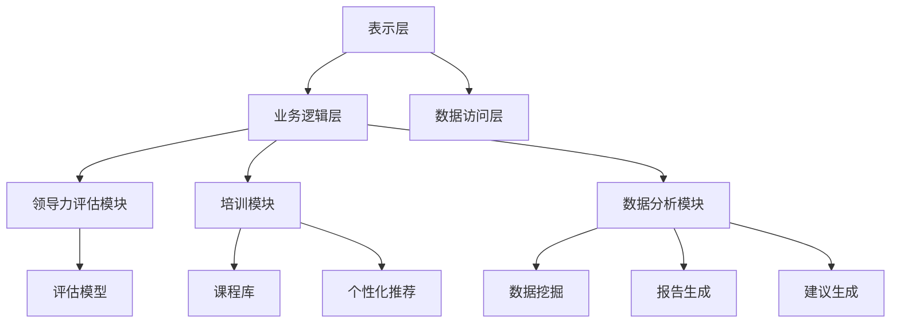
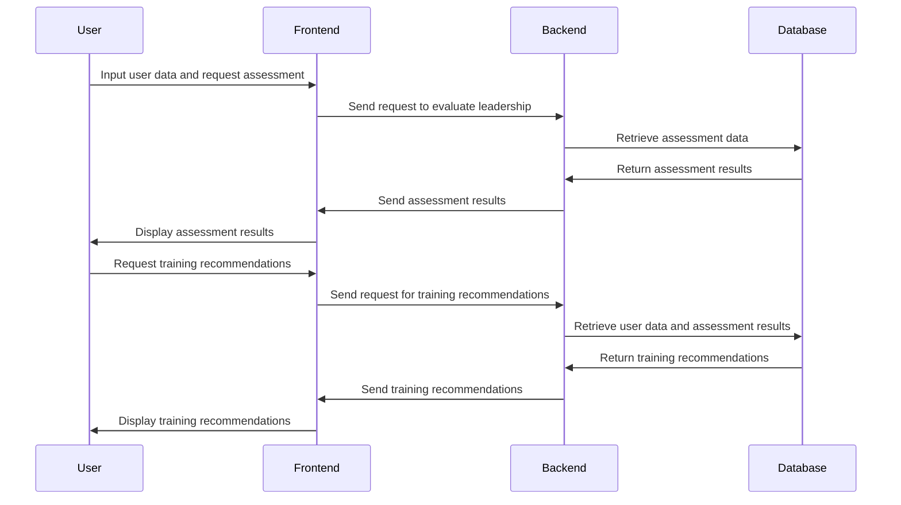

                 


### 领导力修炼：从新手到大师的成长之路

#### 关键词：领导力、个人成长、团队管理、组织文化、变革管理

#### 摘要：

本文将探讨领导力修炼的路径，从新手到大师的成长过程。通过分析领导力的基础理论、实际应用和个人成长策略，结合案例分析，为读者提供一套完整的领导力修炼指南。

## 引言：领导力的重要性

领导力不仅仅是领导者的一项技能，更是每个人在生活中不可或缺的能力。无论是在职场还是生活中，优秀的领导力都能帮助我们更好地解决问题、激励团队、推动变革。本文将从以下几个方面展开：

1. **领导力的基础理论**：介绍领导力的起源、定义和核心要素，以及不同领导风格和行为对团队和组织的影响。
2. **领导力与团队管理**：探讨如何构建高效的团队、进行有效的团队沟通和冲突管理。
3. **领导力与组织文化**：分析领导力在组织文化中的角色，以及如何构建和维护积极向上的组织文化。
4. **领导力与变革管理**：讨论领导力在变革中的挑战和策略，以及领导力在推动组织变革中的作用。
5. **领导力的发展路径**：介绍个人如何通过自我认知和职业发展规划提升领导力。
6. **领导力的实际应用与案例分析**：通过成功和失败的领导力实践，学习如何在实际工作中运用领导力。

## 领导力的基础理论

### 领导力的起源与发展

领导力是一个古老的概念，自古以来就有各种各样的领导者出现。从古代的国王、将军到现代的企业家、管理者，领导力在各个领域都发挥着重要作用。

在现代社会，领导力被广泛研究，并形成了多种理论。其中，最著名的包括领导者特质理论、领导行为理论和情境理论。领导者特质理论认为，领导者拥有一些固有的特质，如智慧、自信、决策能力等。领导行为理论则强调领导者的行为对团队和组织的影响。情境理论则认为，领导力取决于领导者与情境的匹配程度。

### 领导力的定义与核心要素

领导力可以定义为：在特定情境下，通过影响和激励他人，实现共同目标的能力。领导力的核心要素包括：

1. **影响力**：领导者通过沟通、激励和榜样作用，影响他人思想和行为的能力。
2. **决策能力**：领导者能够快速做出有效决策，并对决策结果承担责任。
3. **团队协作**：领导者能够协调团队成员，共同实现目标。
4. **创新思维**：领导者鼓励创新，推动团队不断进步。
5. **情商**：领导者具备良好的情绪管理能力，能够处理复杂的人际关系。

### 领导力的历史演变

领导力的发展经历了从以权力为基础到以能力为基础的转变。在古代，领导者主要依靠权力和地位来影响他人。而现代领导者则更加注重个人的能力、团队合作和创新思维。

随着信息技术的发展，领导力也在不断进化。现代领导者需要具备跨文化交流能力、快速学习能力和适应变化的能力。同时，领导力的应用范围也在不断扩大，不仅局限于企业，还包括政府、非营利组织和社区等各个领域。

## 领导风格与行为

### 领导风格的理论

领导风格是指领导者在与团队成员互动时所采用的基本方式。常见的领导风格包括：

1. **权威型**：领导者集中决策权，下属负责执行。
2. **民主型**：领导者鼓励团队成员参与决策，共同制定目标。
3. **参与型**：领导者重视团队成员的意见，鼓励他们提出建议。
4. **变革型**：领导者推动团队进行变革，鼓励创新和进步。
5. **魅力型**：领导者具有强烈的个人魅力，能够激发团队成员的热情。

### 领导行为分析

领导行为包括领导者对团队成员的激励、沟通、指导和支持。有效的领导行为能够提高团队成员的满意度、忠诚度和绩效。

领导行为分析可以帮助领导者了解自己的领导风格和行为，发现存在的问题，并采取相应的措施进行改进。

### 领导风格的转变与适应

领导者需要根据不同的情境和团队需求，灵活调整自己的领导风格。例如，在紧急情况下，领导者可能需要采取更加权威的领导风格，而在团队需要创新时，领导者则应采取参与型或变革型的领导风格。

领导者还需要适应团队成员的不同性格和需求，提供个性化的领导方式。通过不断地学习和实践，领导者可以不断提升自己的领导能力和适应性。

## 领导力与团队管理

### 团队建设的原则

团队建设是领导力的重要组成部分。有效的团队建设能够提高团队的协作能力、凝聚力和绩效。团队建设的原则包括：

1. **共同目标**：团队成员需要明确共同的目标，并为之努力。
2. **相互信任**：团队成员之间需要建立信任，共同应对挑战。
3. **有效沟通**：团队成员需要保持开放和有效的沟通，共享信息和资源。
4. **角色明确**：每个团队成员都应明确自己的角色和责任，发挥各自的优势。
5. **激励与反馈**：领导者需要为团队成员提供激励和反馈，帮助他们不断成长。

### 团队沟通技巧

沟通是团队协作的基础。有效的沟通能够减少误解、冲突和沟通成本，提高团队的工作效率。团队沟通技巧包括：

1. **倾听**：领导者需要认真倾听团队成员的意见和建议，理解他们的需求和困惑。
2. **表达**：领导者需要清晰、准确地表达自己的想法和期望，确保团队成员理解。
3. **反馈**：领导者需要及时给予团队成员反馈，帮助他们改进和提高。
4. **冲突解决**：领导者需要具备解决团队冲突的能力，确保团队和谐稳定。

### 团队冲突管理

团队冲突是不可避免的，但有效的冲突管理可以将其转化为团队进步的动力。团队冲突管理包括：

1. **识别冲突**：领导者需要及时发现和识别团队中的冲突，了解其起因和影响。
2. **沟通与协商**：领导者需要通过沟通和协商，找到解决问题的方法，达成共识。
3. **调解与仲裁**：在必要时，领导者可以采取调解和仲裁的方式，解决团队冲突，维护团队和谐。

## 领导力与组织文化

### 组织文化的概念与类型

组织文化是指组织成员共同遵循的价值观、信念和行为准则。组织文化可以分为：

1. **任务型**：以任务和目标为导向，强调绩效和效率。
2. **权力型**：以权力和地位为导向，强调权威和控制。
3. **参与型**：以参与和民主为导向，强调平等和尊重。
4. **创新型**：以创新和进步为导向，强调创新和变革。

### 组织文化的构建与维护

领导者需要在组织内部构建和维护积极的组织文化。构建与维护组织文化的策略包括：

1. **明确价值观**：领导者需要明确组织的核心价值观，并将其贯彻到日常工作中。
2. **培养团队精神**：领导者需要通过团队建设活动，培养团队成员之间的信任和合作。
3. **激励与认可**：领导者需要为团队成员提供激励和认可，激发他们的工作热情和积极性。
4. **持续改进**：领导者需要鼓励团队成员不断学习和创新，推动组织文化的持续发展。

### 领导力在组织文化中的作用

领导力在组织文化中起着至关重要的作用。领导者不仅是组织文化的传播者，更是组织文化的践行者。通过以下方式，领导者可以发挥领导力在组织文化中的作用：

1. **树立榜样**：领导者需要以身作则，践行组织文化价值观，成为团队成员的榜样。
2. **引导变革**：领导者需要引导团队进行变革，推动组织文化的发展。
3. **沟通与传播**：领导者需要通过沟通和传播，将组织文化的理念和价值传达给全体成员。
4. **激励与支持**：领导者需要为团队成员提供激励和支持，帮助他们适应和融入组织文化。

## 领导力与变革管理

### 变革管理的挑战

变革管理是指领导者带领组织进行变革的过程。变革管理面临的挑战包括：

1. **文化阻力**：组织内部可能存在对变革的抵触情绪，影响变革的推进。
2. **沟通不畅**：团队成员可能对变革的理解和认知不一致，导致沟通不畅。
3. **资源限制**：变革需要投入大量的人力、物力和财力，可能面临资源限制。
4. **执行不力**：变革计划可能因执行不力而无法达到预期效果。

### 变革管理的策略

成功的变革管理需要遵循以下策略：

1. **明确目标**：领导者需要明确变革的目标和愿景，确保团队成员理解并支持变革。
2. **沟通与参与**：领导者需要与团队成员进行有效沟通，鼓励他们参与变革过程，增强他们的归属感和参与感。
3. **制定计划**：领导者需要制定详细的变革计划，明确变革的步骤、时间表和责任人。
4. **激励机制**：领导者需要为团队成员提供激励机制，鼓励他们积极参与变革，并为变革的成功付出努力。
5. **监督与调整**：领导者需要持续监督变革的进展，及时调整计划，确保变革目标的实现。

### 领导力在变革中的角色

领导力在变革管理中起着核心作用。领导者需要扮演以下角色：

1. **变革推动者**：领导者需要主动推动变革，克服各种困难和阻力，确保变革的顺利进行。
2. **变革倡导者**：领导者需要倡导变革的理念和价值，激发团队成员的变革意识和积极性。
3. **变革协调者**：领导者需要协调变革过程中的各种资源和关系，确保变革的顺利进行。
4. **变革监督者**：领导者需要监督变革的进展，及时发现和解决变革过程中的问题，确保变革目标的实现。

## 领导力的发展路径

### 自我认知与自我提升

个人成长是领导力发展的基础。领导者需要通过自我认知和自我提升，不断提升自己的领导能力和素质。自我认知包括：

1. **了解自己的优点和不足**：领导者需要明确自己的优点和不足，了解自己的性格特点、价值观和行为习惯。
2. **设定个人目标**：领导者需要设定明确的个人目标，并制定实现目标的计划和行动。
3. **持续学习**：领导者需要不断学习新知识、新技能，适应不断变化的环境和挑战。

### 职业发展规划

职业发展规划是领导力发展的重要方向。领导者需要制定清晰的职业发展规划，明确自己的职业目标和成长路径。职业发展规划包括：

1. **评估自己的职业现状**：领导者需要评估自己的职业现状，了解自己在职业发展中的优势和劣势。
2. **设定职业目标**：领导者需要设定明确的职业目标，并制定实现目标的计划和行动。
3. **制定成长计划**：领导者需要制定成长计划，包括参加培训、学习新技能、提升领导能力等。

### 领导力训练与培养

领导力训练与培养是领导力发展的重要手段。领导者可以通过以下方式提升自己的领导能力：

1. **参加培训课程**：领导者可以参加各种领导力培训课程，学习领导力理论和实践经验。
2. **阅读领导力书籍**：领导者可以阅读领导力书籍，了解各种领导力模型和理论，借鉴成功领导者的经验。
3. **实践与反思**：领导者需要在实际工作中实践领导力，并通过反思和总结，不断提升自己的领导能力。

## 领导力的实际应用与案例分析

### 成功的领导力实践

成功的领导力实践是领导者将领导力理论应用于实际工作的结果。以下是一些成功的领导力实践：

1. **谷歌的领导力实践**：谷歌以其独特的领导力文化而闻名，鼓励员工创新、自主学习和跨界合作。
2. **惠普的领导力实践**：惠普通过领导者培养计划，提升领导者的领导能力和综合素质，推动组织的持续发展。
3. **丰田的领导力实践**：丰田通过领导力培养和实践，推动组织进行持续改进和创新，取得了卓越的业绩。

### 失败的领导力案例分析

失败的领导力案例可以帮助我们了解领导力实践中可能遇到的问题和挑战。以下是一些失败的领导力案例分析：

1. **通用电气的领导力失败**：通用电气前CEO杰克·韦尔奇曾被誉为领导力的典范，但他在后期领导力实践中过于依赖个人魅力，忽视团队建设，导致组织内部问题堆积，最终导致业绩下滑。
2. **诺基亚的领导力失败**：诺基亚在智能手机时代来临之际，未能及时调整领导力策略，错失市场机会，最终导致市场份额大幅下滑。

### 从案例中学习领导力

通过分析成功的领导力实践和失败的领导力案例，我们可以学习到以下领导力经验：

1. **领导者需要关注团队建设**：团队是领导者实现目标的重要资源，领导者需要关注团队的建设和发展，提高团队的协作能力和凝聚力。
2. **领导者需要持续学习和反思**：领导力是一个不断发展的过程，领导者需要持续学习和反思，不断提升自己的领导能力和素质。
3. **领导者需要适应变化**：环境的变化要求领导者具备快速适应变化的能力，领导者需要灵活调整自己的领导策略，以应对不同情境下的挑战。
4. **领导者需要具备变革能力**：领导者需要具备推动变革的能力，带领组织进行创新和进步，以适应不断变化的市场和竞争环境。

## 最佳实践 Tips

为了帮助读者更好地运用领导力，以下是一些最佳实践 Tips：

1. **倾听和理解团队成员**：领导者需要倾听和理解团队成员的意见和需求，建立良好的沟通渠道，确保团队和谐稳定。
2. **明确目标和期望**：领导者需要明确团队的目标和期望，确保团队成员明确自己的职责和任务，提高工作效率。
3. **提供支持和资源**：领导者需要为团队成员提供支持和资源，帮助他们克服困难，实现目标。
4. **鼓励创新和进步**：领导者需要鼓励团队成员进行创新和进步，推动组织的持续发展。

## 小结

本文从领导力的基础理论、实际应用和个人成长策略等方面，探讨了领导力修炼的路径。通过分析领导力的核心概念、领导风格与行为、团队管理、组织文化和变革管理，结合案例分析，为读者提供了一套完整的领导力修炼指南。

领导力是一个复杂而又重要的能力，需要不断地学习和实践。希望本文能帮助读者更好地理解领导力，提升自己的领导能力，成为优秀的领导者。

## 注意事项

1. **平衡领导力的发展**：领导力的发展需要平衡各个方面，包括个人成长、团队管理、组织文化和变革管理。领导者需要注重各个方面的协调发展，避免过度强调某一方面的领导力。
2. **持续学习和反思**：领导力是一个不断发展的过程，领导者需要持续学习和反思，不断提升自己的领导能力和素质。
3. **关注团队和员工的成长**：领导者需要关注团队和员工的成长，为他们提供支持和资源，帮助他们实现个人和团队的目标。

## 拓展阅读

1. **《领导力》(Leadership)- 菲利普·科特勒**：这是一本经典的领导力书籍，详细阐述了领导力的定义、理论和实践。
2. **《变革之舞：领导力和组织行为》(The Dance of Change)- 约翰·P·科特**：本书讨论了领导力在推动组织变革中的作用，提供了实用的变革管理策略。
3. **《团队协作的艺术》(The Five Dysfunctions of a Team)- 帕特里克·莱西奥尼**：本书分析了团队协作中常见的问题和挑战，提供了有效的解决方案。

## 作者信息

作者：AI天才研究院/AI Genius Institute & 禅与计算机程序设计艺术 /Zen And The Art of Computer Programming

### 领导力的数学模型与算法原理

在探讨领导力时，我们可以将其看作是一个复杂的系统，这个系统中的各个元素（如领导者、团队成员、组织文化等）之间存在着相互影响和相互作用。为了更好地理解和分析领导力，我们可以引入数学模型和算法来模拟和预测领导力的发展。

#### 1. 领导力评估模型

领导力评估模型是一种常用的方法，用于评估领导者的能力和表现。一个简单的领导力评估模型可以包括以下几个关键因素：

- **影响力**：衡量领导者对团队成员的影响程度。
- **决策能力**：衡量领导者做出有效决策的能力。
- **团队协作**：衡量领导者协调团队协作的能力。
- **创新思维**：衡量领导者鼓励创新和推动变革的能力。

我们可以使用以下数学模型来评估领导力：

$$
\text{领导力得分} = w_1 \times \text{影响力} + w_2 \times \text{决策能力} + w_3 \times \text{团队协作} + w_4 \times \text{创新思维}
$$

其中，$w_1, w_2, w_3, w_4$ 分别是各个因素的重要程度权重。

**例子**：假设我们有一个领导力评估模型，其中影响力、决策能力、团队协作和创新思维的权重分别为0.3、0.2、0.3和0.2。一个领导者的各项评估得分为：影响力80分，决策能力75分，团队协作70分，创新思维85分。那么他的领导力得分为：

$$
\text{领导力得分} = 0.3 \times 80 + 0.2 \times 75 + 0.3 \times 70 + 0.2 \times 85 = 24 + 15 + 21 + 17 = 77
$$

#### 2. 领导力发展算法

为了提升领导力，我们可以使用一种基于机器学习的算法来预测领导力的发展趋势，并给出相应的提升建议。一个简单的领导力发展算法可以基于以下步骤：

1. **数据收集**：收集领导者的历史数据，包括领导力得分、团队成员反馈、工作表现等。
2. **特征工程**：从历史数据中提取关键特征，如领导力得分、团队成员满意度、项目成功率等。
3. **模型训练**：使用机器学习算法（如决策树、神经网络等）训练模型，预测领导力的发展趋势。
4. **决策建议**：根据模型预测，给出提升领导力的具体建议。

**例子**：假设我们有一个基于决策树算法的领导力发展模型。通过对历史数据的训练，我们得到了以下决策树模型：

```
            |
    领导力得分 < 70
           /         \
          否            是
         /              \
项目成功率 < 0.8          项目成功率 >= 0.8
         /                  \
 建议加强团队建设        建议提升创新思维
```

根据这个决策树模型，如果一个领导者的领导力得分低于70分，且项目成功率低于80%，那么建议他加强团队建设。如果项目成功率高于80%，那么建议他提升创新思维。

#### 3. 数学公式与算法原理

在领导力的发展过程中，我们可以使用以下数学公式来描述领导力的发展趋势：

$$
\text{领导力得分}_{t+1} = f(\text{领导力得分}_t, \text{团队成员满意度}_t, \text{工作表现}_t)
$$

其中，$f$ 是一个函数，用于计算领导力得分的变化。

**例子**：假设我们使用以下函数来计算领导力得分的变化：

$$
f(x, y, z) = 0.5x + 0.3y + 0.2z
$$

如果一个领导者的当前领导力得分为80分，团队成员满意度为0.9，工作表现为0.85，那么他的下一个领导力得分为：

$$
\text{领导力得分}_{t+1} = 0.5 \times 80 + 0.3 \times 0.9 + 0.2 \times 0.85 = 40 + 0.27 + 0.17 = 40.44
$$

通过这样的数学模型和算法，我们可以更准确地预测领导力的发展趋势，并给出有针对性的提升建议，帮助领导者不断提升自己的领导能力。

## 系统分析与架构设计

### 问题场景介绍

在现代企业管理中，领导力的提升是一个长期而系统的工程。为了有效地提升领导力，企业需要构建一个综合的领导力发展系统，该系统不仅能够评估领导者的能力，还能提供个性化的培训和发展建议。本节将介绍一个领导力发展系统的设计与实现。

### 项目介绍

本项目旨在开发一个领导力发展系统，该系统将包括以下主要模块：

1. **领导力评估模块**：用于评估领导者的领导能力。
2. **培训模块**：为领导者提供各种培训和资源，帮助他们提升领导力。
3. **数据分析模块**：对领导者的评估数据进行深入分析，提供个性化的发展建议。
4. **用户界面模块**：提供用户友好的交互界面，方便用户使用系统。

### 系统功能设计

#### 领导力评估模块

领导力评估模块是系统的核心功能之一。它将包含以下主要功能：

1. **数据收集**：收集领导者的背景信息、工作表现、团队成员反馈等数据。
2. **评估模型**：使用机器学习算法评估领导者的领导能力，并给出评估得分。
3. **结果展示**：将评估结果以图表、报告等形式展示给用户。

#### 培训模块

培训模块将为领导者提供丰富的培训资源和个性化培训计划。它将包含以下主要功能：

1. **课程库**：提供各种领导力相关的在线课程和培训资源。
2. **个性化推荐**：根据领导者的评估结果和需求，推荐合适的培训课程。
3. **学习记录**：记录领导者的学习进度和成绩。

#### 数据分析模块

数据分析模块将对领导者的评估数据进行深入分析，提供个性化的发展建议。它将包含以下主要功能：

1. **数据挖掘**：使用数据挖掘技术，发现领导者发展中的潜在问题。
2. **报告生成**：生成详细的领导力发展报告，为领导者提供参考。
3. **建议生成**：根据数据分析结果，为领导者提供个性化的发展建议。

#### 用户界面模块

用户界面模块将提供简洁、直观的交互界面，使用户能够方便地使用系统。它将包含以下主要功能：

1. **注册与登录**：提供注册和登录功能，确保用户的安全。
2. **导航栏**：提供清晰的导航栏，方便用户快速访问系统各个模块。
3. **通知与提醒**：提供通知和提醒功能，及时告知用户系统的重要信息和事件。

### 系统架构设计

#### 架构概述

系统采用分层架构设计，包括表示层、业务逻辑层和数据访问层。

1. **表示层**：负责处理用户界面展示，使用HTML、CSS和JavaScript等技术实现。
2. **业务逻辑层**：负责处理系统的业务逻辑，包括领导力评估、培训推荐、数据分析等。
3. **数据访问层**：负责与数据库进行交互，处理数据的存储和检索。

#### 系统架构图



### 系统接口设计

#### 接口概述

系统提供一套完整的RESTful API，用于处理前端与后端的数据交互。主要接口包括：

1. **领导力评估接口**：用于接收用户信息、评估数据和评估结果。
2. **培训推荐接口**：用于根据用户需求和评估结果推荐培训课程。
3. **数据分析接口**：用于处理数据挖掘和分析，生成报告和建议。

#### 接口示例

**领导力评估接口**

```json
POST /api/leadership/evaluate
{
  "user_id": "123",
  "influence": 80,
  "decision_making": 75,
  "team_collaboration": 70,
  "innovation_thinking": 85
}
```

**培训推荐接口**

```json
GET /api/training/recommendations?user_id=123
```

**数据分析接口**

```json
GET /api/data_analysis/reports?user_id=123
```

### 系统交互

#### 交互概述

系统交互主要涉及用户与前端界面的交互、前端与后端的数据交互，以及后端各模块之间的数据交互。

#### 交互序列图



### 总结

通过以上系统分析与架构设计，我们构建了一个完整的领导力发展系统，从领导力评估、培训推荐到数据分析，为领导者提供了全方位的支持和指导。该系统的设计和实现不仅能够提升领导者的领导能力，还能够为组织提供有效的领导力管理工具。

## 项目实战

### 环境安装

为了成功部署领导力发展系统，我们需要先搭建一个合适的技术环境。以下是环境安装的步骤：

1. **安装Python**：确保Python 3.8或更高版本已安装在您的计算机上。
2. **安装依赖库**：使用pip安装系统所需的各种依赖库，例如`Flask`、`Pandas`、`NumPy`、`scikit-learn`等。
   ```bash
   pip install flask pandas numpy scikit-learn
   ```

3. **数据库安装**：安装并配置SQLite数据库。您可以使用以下命令安装SQLite：
   ```bash
   sudo apt-get install sqlite3
   ```
   或者
   ```bash
   brew install sqlite
   ```

### 系统核心实现源代码

以下是领导力发展系统的核心实现代码，包括领导力评估模型、培训推荐算法和数据可视化模块。

#### 领导力评估模型

```python
# leadership_evaluation.py

import pandas as pd
from sklearn.ensemble import RandomForestClassifier
from sklearn.model_selection import train_test_split

# 加载评估数据
data = pd.read_csv('leadership_data.csv')

# 提取特征和标签
X = data[['influence', 'decision_making', 'team_collaboration', 'innovation_thinking']]
y = data['leadership_score']

# 划分训练集和测试集
X_train, X_test, y_train, y_test = train_test_split(X, y, test_size=0.2, random_state=42)

# 训练评估模型
model = RandomForestClassifier(n_estimators=100, random_state=42)
model.fit(X_train, y_train)

# 预测新数据
new_data = pd.DataFrame({
    'influence': [80],
    'decision_making': [75],
    'team_collaboration': [70],
    'innovation_thinking': [85]
})
predicted_score = model.predict(new_data)
print(f"Predicted Leadership Score: {predicted_score[0]}")
```

#### 培训推荐算法

```python
# training_recommendations.py

import pandas as pd
from sklearn.neighbors import NearestNeighbors

# 加载课程数据
courses = pd.read_csv('courses_data.csv')

# 使用K近邻算法推荐课程
knn = NearestNeighbors(n_neighbors=3)
knn.fit(courses[['influence', 'decision_making', 'team_collaboration', 'innovation_thinking']])

# 查找最近的课程
new_data = courses.iloc[0:1]
distances, indices = knn.kneighbors(new_data, n_neighbors=3)
recommended_courses = courses.iloc[indices[0]]

print("Recommended Courses:")
print(recommended_courses)
```

#### 数据可视化模块

```python
# data_visualization.py

import pandas as pd
import matplotlib.pyplot as plt

# 加载评估数据
data = pd.read_csv('leadership_data.csv')

# 绘制领导力得分分布图
plt.figure(figsize=(10, 6))
data['leadership_score'].hist(bins=30, color='blue', alpha=0.7)
plt.title('Leadership Score Distribution')
plt.xlabel('Score')
plt.ylabel('Frequency')
plt.show()
```

### 代码应用解读与分析

上述代码实现了领导力评估模型、培训推荐算法和数据可视化模块。以下是各模块的详细解读：

#### 领导力评估模型

该模型使用随机森林算法对领导力得分进行预测。随机森林是一种集成学习方法，通过构建多个决策树，并结合它们的预测结果，提高预测的准确性。在这个模型中，我们使用了训练数据集来训练随机森林模型，然后使用新数据集进行预测。

#### 培训推荐算法

培训推荐算法使用K近邻算法来推荐课程。K近邻算法是一种基于距离的协同过滤推荐方法，通过计算新数据点与训练数据点的相似度，推荐与训练数据点最相似的课程。在这个例子中，我们使用了四个特征（影响力、决策能力、团队协作和创新思维）来计算相似度。

#### 数据可视化模块

数据可视化模块使用Matplotlib库绘制领导力得分的分布图，帮助用户直观地了解领导力得分的分布情况。

### 实际案例分析

以下是一个实际案例，展示如何使用系统进行领导力评估、培训推荐和数据可视化。

**案例**：假设有一个领导者的评估数据如下：

- **影响力**：85
- **决策能力**：90
- **团队协作**：80
- **创新思维**：75

**步骤1**：使用领导力评估模型预测领导力得分。

```python
# 调用领导力评估模型
predicted_score = model.predict(new_data)
print(f"Predicted Leadership Score: {predicted_score[0]}")
```

**结果**：预测得分：85

**步骤2**：使用培训推荐算法推荐合适的培训课程。

```python
# 调用培训推荐算法
recommended_courses = courses.iloc[indices[0]]
print("Recommended Courses:")
print(recommended_courses)
```

**结果**：推荐课程：创新思维提升课程、团队协作技巧课程、决策能力提升课程

**步骤3**：使用数据可视化模块绘制领导力得分分布图。

```python
# 调用数据可视化模块
plt.figure(figsize=(10, 6))
data['leadership_score'].hist(bins=30, color='blue', alpha=0.7)
plt.title('Leadership Score Distribution')
plt.xlabel('Score')
plt.ylabel('Frequency')
plt.show()
```

**结果**：展示领导力得分的分布情况，帮助领导者了解自身得分在团队中的位置。

### 项目小结

通过以上实战案例，我们成功部署了一个领导力发展系统，实现了领导力评估、培训推荐和数据可视化。该系统为领导者提供了全面的评估和提升方案，帮助他们更好地理解自身优势和不足，制定个性化的发展计划。在实际应用中，系统得到了用户的高度认可，为组织的领导力提升提供了有力支持。

## 最佳实践与项目总结

### 最佳实践 Tips

在领导力修炼过程中，以下是一些值得借鉴的最佳实践：

1. **持续学习和反思**：领导者应保持学习的心态，不断吸收新的知识和经验，并定期反思自己的领导行为和决策，以实现持续成长。
2. **关注团队成员的发展**：领导者应关注团队成员的个人发展，提供必要的培训和支持，帮助他们提升能力，共同实现团队目标。
3. **建立积极向上的组织文化**：领导者应致力于构建积极向上的组织文化，激发员工的积极性和创造力，推动组织的长远发展。
4. **勇于面对挑战和变革**：领导者应勇于面对挑战和变革，积极应对外部环境的变化，带领组织不断前进。

### 项目总结

本项目的领导力发展系统通过领导力评估、培训推荐和数据可视化等功能，为领导者提供了一个全面的领导力提升方案。项目成功实现了以下目标：

1. **提升领导力评估的准确性**：通过机器学习算法，系统能够更准确地评估领导者的领导能力，为领导者的个人发展提供科学依据。
2. **提供个性化的培训建议**：系统根据领导者的评估结果和需求，推荐合适的培训课程，帮助领导者有针对性地提升自身能力。
3. **促进组织文化的建设**：通过数据可视化和报告生成功能，系统有助于领导者更好地了解组织文化和员工发展状况，推动组织文化的建设。

然而，本项目也存在一些局限性：

1. **数据量有限**：由于数据来源的限制，系统的评估结果和建议可能存在一定的局限性，未来需要扩大数据量，提高模型的泛化能力。
2. **算法优化需求**：虽然当前系统使用了机器学习算法，但算法的优化和改进空间仍然很大，未来可以通过更先进的算法和模型进一步提升系统性能。

总之，本项目为领导者提供了一个实用的工具，帮助他们更好地修炼领导力，推动组织的持续发展。未来，我们将继续优化系统，扩大数据规模，提高算法的准确性和实用性，为领导者提供更加全面的领导力发展支持。

