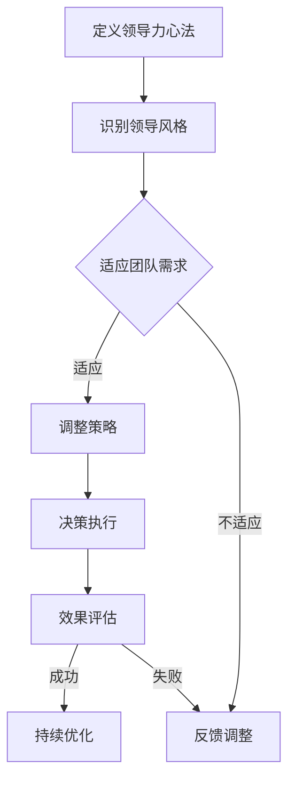
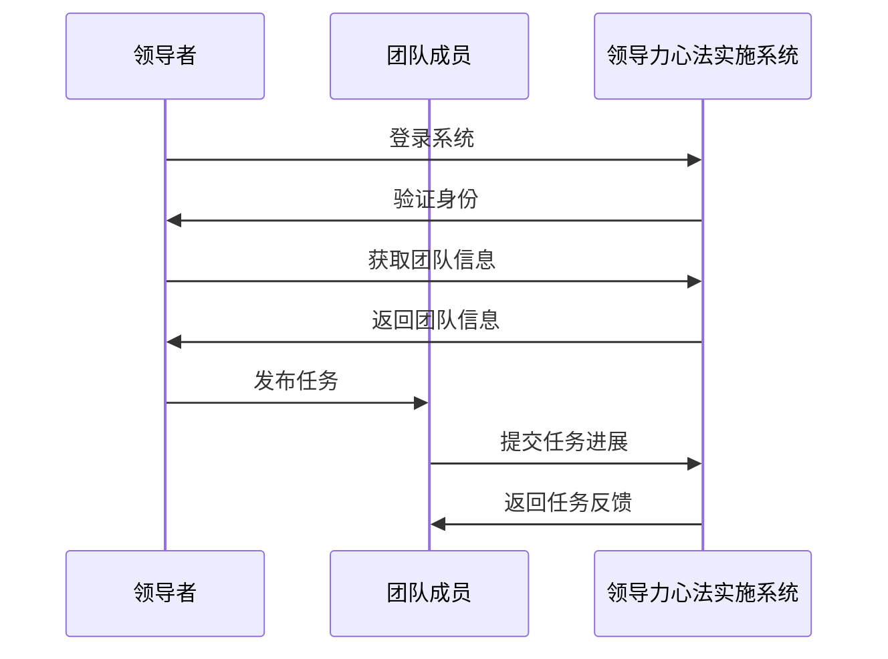

                 

### 引言

《领导力心法：成就一代企业家的领导力法则》是一本旨在揭示领导力核心奥秘、助力企业家攀登事业巅峰的书籍。在当今商业环境中，领导力不仅是企业家成功的关键，更是企业持续成长的动力源泉。然而，领导力的培养并非一蹴而就，它需要深刻理解其本质，并通过实践不断提炼和完善。

本书旨在通过以下步骤，系统性地介绍领导力心法：

1. **定义与背景**：介绍领导力的核心概念、背景及其重要性。
2. **基础理论**：探讨领导力的基础理论，包括领导力心法的基本原则和应用。
3. **实践方法**：分享领导力心法的实践方法，帮助读者在实际中应用。
4. **案例分析**：通过成功企业家的案例，解析领导力心法的实际应用。
5. **未来趋势**：展望领导力心法在未来的发展和可能的新模式。

通过这一系列步骤，本书希望帮助读者深入理解领导力的本质，掌握领导力心法，并在实际工作中取得卓越的成就。

### 背景介绍

领导力，作为管理学中的一个核心概念，其定义和背景具有悠久的历史和丰富的内涵。在古代，领导力更多的是与帝王将相和军事统帅联系在一起。比如，《孙子兵法》中提到的“将者，智、信、仁、勇、严也”，即是对古代领导力的精辟概括。随着时间的推移，领导力的研究逐渐从军事领域扩展到商业、教育、政治等多个领域。

在管理学中，领导力通常被定义为一种影响力，它使人们能够追随和实现共同的目标。领导力不仅仅是指导他人，更重要的是激发团队成员的潜力，共同创造卓越的业绩。詹姆斯·库泽斯和巴里·波斯纳在其著作《领导力的五项修炼》中提出，领导力是通过激励、启发和赋能他人来实现目标的行动过程。

领导力的背景可以追溯到人类社会的形成和发展。从原始社会部落首领的决策，到现代社会企业家的领导行为，领导力始终是推动社会进步的重要力量。随着现代商业环境的复杂化，领导力的重要性愈加凸显。企业不仅需要具备战略决策能力，还需要在快速变化的市场环境中灵活应对，这对领导力提出了更高的要求。

在商业世界中，领导力是企业家成功的关键因素。成功的企业家不仅需要具备卓越的商业头脑，还需要具备强大的领导力，能够凝聚团队、激发创造力、应对挑战。领导力心法，作为领导力的重要组成部分，强调内在修养与外在行为的结合，是一种更为深刻和系统的领导理念。

总之，领导力的概念和背景具有多层次、多维度的特点，它不仅与个人特质和团队建设密切相关，还与社会环境和商业环境紧密相连。理解和掌握领导力心法，对于企业家实现个人价值和企业发展具有重要意义。

### 核心概念

在《领导力心法：成就一代企业家的领导力法则》中，有若干核心概念需要详细阐述，这些概念不仅是理解领导力心法的基础，也是实际应用中的关键。以下是对这些核心概念的详细说明：

**1. 领导力心法**

领导力心法是一种深层次的领导理念，它强调领导者内在修养与外在行为的有机结合。心法不仅仅是技巧和策略，更是一种智慧和修为。具体来说，领导力心法包括以下几个方面：

- **内在修养**：领导者需要培养自我意识、情绪管理和自我提升的能力。通过自我反思和持续学习，领导者能够更好地理解自己的情感和动机，从而做出更明智的决策。

- **外在行为**：领导者需要通过有效的沟通、激励和团队建设来影响和引导团队成员。领导力心法强调与团队成员建立深厚的信任关系，通过真诚的沟通和合理的激励，激发团队成员的潜能。

**2. 领导风格**

领导风格是领导者管理团队的方式和态度的体现。不同的领导风格会对团队的绩效和成员的满意度产生不同的影响。以下是几种常见的领导风格：

- **专制型领导风格**：领导者拥有高度的决策权和控制权，团队成员的参与度较低。这种风格在需要迅速决策和执行的任务中可能非常有效，但在长期来看可能会降低团队成员的积极性和创造力。

- **民主型领导风格**：领导者鼓励团队成员参与决策过程，尊重团队成员的意见和建议。这种风格能够提高团队成员的满意度和参与感，但可能会导致决策过程较为缓慢。

- **参与型领导风格**：领导者与团队成员共同参与决策，注重团队合作和共识。这种风格能够促进团队成员的积极性和创造力，但需要领导者具备较强的协调和沟通能力。

**3. 团队建设**

团队建设是领导力心法中的重要组成部分，它涉及到如何选拔、培养和激励团队成员。有效的团队建设能够提高团队的凝聚力和绩效，具体方法包括：

- **团队成员选拔**：领导者需要根据团队成员的技能、性格和价值观进行合理选拔，确保团队具备多样化的能力。

- **团队成员培养**：通过培训和发展计划，提高团队成员的专业能力和领导力。

- **团队激励**：领导者需要设计合理的激励机制，激发团队成员的积极性和创造力。

**4. 决策**

决策是领导力的核心之一，领导者需要具备良好的决策能力，以应对复杂多变的商业环境。以下是几种常见的决策方法：

- **程序化决策**：针对重复性或常规性问题，通过制定标准操作流程进行决策。

- **非程序化决策**：针对复杂或不寻常的问题，需要进行深入分析和判断，选择最佳解决方案。

**5. 文化**

企业文化是企业的灵魂，对员工的价值观和行为有深远的影响。领导者需要营造积极向上的企业文化，具体方法包括：

- **价值观传递**：通过宣传和培训，将企业的核心价值观传递给员工。

- **文化氛围**：通过团队活动和企业文化设施，营造积极向上的工作氛围。

通过以上对核心概念的详细阐述，读者可以更好地理解领导力心法的内涵，并在实际应用中取得更好的效果。

### 概念属性特征对比表格

为了更清晰地理解领导力心法的各个核心概念及其属性特征，以下是一个对比表格。该表格列出了领导力心法、领导风格、团队建设、决策和文化等核心概念的主要属性特征，并进行对比分析。

| 核心概念   | 主要属性特征                                       | 对比分析                                               |
| ---------- | -------------------------------------------------- | ------------------------------------------------------ |
| 领导力心法 | 内在修养与外在行为的结合，强调智慧与修为            | 是一种深层次的领导理念，涵盖了自我提升和团队影响的多方面 |
| 领导风格   | 专制型、民主型、参与型等不同领导方式                | 影响团队成员的态度和行为，决定了团队的运作效率和氛围       |
| 团队建设   | 成员选拔、培养、激励等团队管理方法                  | 关键在于提高团队的凝聚力和绩效，促进团队成员的共同成长     |
| 决策       | 程序化决策和非程序化决策                           | 适用于不同类型的问题和情境，决定了组织的应对策略和执行力   |
| 文化       | 价值观传递、文化氛围等企业文化要素                   | 形成组织的共同愿景和使命，影响员工的行为和决策             |

通过对比表格，读者可以更直观地了解各个核心概念的特点，从而更好地理解它们在实际应用中的区别和联系。

### ER实体关系图架构

为了更直观地展示《领导力心法：成就一代企业家的领导力法则》中各个核心概念之间的关系，我们可以使用ER（实体-关系）图来描述。以下是一个简化的ER图，展示了领导力心法、领导风格、团队建设、决策和文化等核心概念之间的关联。

```mermaid
erDiagram
    LeaderMindMethod ||--|{ LeaderStyle }
    LeaderMindMethod ||--|{ TeamBuilding }
    LeaderMindMethod ||--|{ DecisionMaking }
    LeaderMindMethod ||--|{ CompanyCulture }
    LeaderStyle ||--|{ TeamMember }
    TeamBuilding ||--|{ TeamMember }
    DecisionMaking ||--|{ CompanyCulture }
    CompanyCulture ||--|{ TeamMember }
```

**图解：**

- **领导力心法**（LeaderMindMethod）是整个系统的核心，与其他核心概念紧密相关。
- **领导风格**（LeaderStyle）受到领导力心法的影响，同时也对团队成员产生作用。
- **团队建设**（TeamBuilding）旨在通过合理的成员选拔和培养，增强团队的凝聚力和绩效。
- **决策**（DecisionMaking）需要结合企业文化和团队建设的实际情况，以实现最佳效果。
- **企业文化**（CompanyCulture）不仅是领导力心法的体现，也是团队建设和决策的重要依据。

通过ER图，我们可以清晰地看到各个核心概念之间的相互关系，这有助于读者在理解和应用领导力心法时，形成整体性的思维模式。

### 算法原理讲解

在探讨领导力心法的具体实现过程中，我们可以将其抽象为一系列算法模型，以便于读者理解和应用。以下是一个简化的算法模型，用于描述领导力心法的核心原理。

#### Mermaid 流程图



#### 算法详细解释

1. **定义领导力心法（A）**：首先，我们需要明确领导力心法的定义。领导力心法是一种深层次的领导理念，强调内在修养与外在行为的结合，涵盖自我提升、团队影响等多个方面。

2. **识别领导风格（B）**：根据领导力心法，领导者需要识别自己的领导风格。这包括专制型、民主型和参与型等不同的领导方式。

3. **适应团队需求（C）**：领导风格需要根据团队的具体需求进行调整。如果当前领导风格能够适应团队需求，则直接进入策略调整阶段；如果不适应，则需要反馈调整。

4. **调整策略（D）**：在适应团队需求的基础上，领导者需要根据实际情况调整策略。这可能涉及沟通方式、激励机制等多方面的调整。

5. **决策执行（F）**：调整后的策略需要得到有效执行。领导者需要确保团队成员理解并执行既定的策略。

6. **效果评估（G）**：在决策执行后，领导者需要对效果进行评估。如果效果成功，则可以进入持续优化阶段；如果效果失败，则需要反馈调整。

7. **持续优化（H）**：根据效果评估的结果，领导者需要不断优化领导力心法，以提高团队绩效和满意度。

#### 数学模型和公式

为了更好地理解领导力心法，我们可以借助一些数学模型和公式来描述其核心原理。

**决策效果评估模型：**

$$
E = f(C, M, T, D)
$$

其中：
- $E$：决策效果
- $C$：领导风格适应性
- $M$：团队需求
- $T$：团队成员执行力
- $D$：决策实施后的效果

#### 举例说明

假设一位企业家（领导者）采用参与型领导风格，团队成员需求是高度参与决策过程。以下是具体的决策过程：

1. **定义领导力心法**：企业家明确自己的领导力心法，强调内在修养与外在行为的结合。

2. **识别领导风格**：企业家识别自己为参与型领导风格。

3. **适应团队需求**：企业家发现团队需求是高度参与决策过程，因此参与型领导风格能够适应团队需求。

4. **调整策略**：企业家根据团队需求，调整沟通方式和激励机制，确保团队成员能够高度参与决策过程。

5. **决策执行**：企业家与团队成员共同讨论并制定决策，确保团队成员理解并执行既定的策略。

6. **效果评估**：企业家对决策执行后的效果进行评估，发现团队成员的参与度明显提高，决策执行效果良好。

7. **持续优化**：企业家根据评估结果，继续优化领导力心法，以保持团队的高效运作。

通过以上步骤，企业家成功地应用了领导力心法，实现了团队的高效运作和持续成长。

### 系统分析与架构设计方案

在《领导力心法：成就一代企业家的领导力法则》中，系统的分析和架构设计是关键环节，它不仅关系到领导力心法的有效实施，也直接影响企业的发展。以下是对系统分析与架构设计方案的详细阐述。

#### 问题场景介绍

在一个快速变化的商业环境中，企业需要灵活应对市场变化，迅速做出决策并有效执行。领导力心法的核心在于通过科学的系统架构设计，实现领导者与团队成员之间的有效沟通和协作。以下是具体的问题场景：

- **市场变化快**：市场需求不断变化，企业需要快速做出反应。
- **团队多元性**：团队成员具有不同的背景和技能，需要有效的团队建设策略。
- **决策复杂**：在复杂的市场环境中，决策需要综合考虑多种因素，确保决策的科学性和可行性。
- **文化融合**：企业文化的建设和维护是领导力心法的重要组成部分，需要通过系统设计来实现。

#### 项目介绍

为了解决上述问题，我们设计了一个名为“领导力心法实施系统”的项目。该项目旨在通过系统化的架构设计，实现领导力心法在企业中的应用，提高企业的运营效率和竞争力。

#### 系统功能设计

系统功能设计是架构设计的关键部分，它决定了系统如何满足企业的实际需求。以下是系统的主要功能模块：

- **领导力心法定义模块**：用于明确领导力心法的定义和基本原则，为后续模块提供指导。
- **团队建设模块**：包括团队成员选拔、培养和激励等功能，确保团队的高效运作。
- **决策支持模块**：提供决策分析和执行支持，帮助领导者做出科学决策。
- **效果评估模块**：对决策效果进行评估，为持续优化提供数据支持。
- **企业文化模块**：包括价值观传递和文化氛围建设等功能，促进企业文化的形成和传播。

#### 系统架构设计

系统架构设计决定了各个功能模块之间的交互和协作关系。以下是系统的架构设计：

- **前端架构**：采用响应式设计，确保系统能够在多种设备上运行，提高用户体验。
- **后端架构**：采用微服务架构，确保系统的可扩展性和高可用性，同时便于维护和升级。
- **数据库设计**：采用关系型数据库，存储系统的核心数据，确保数据的安全和一致性。

#### 系统接口设计

系统接口设计是系统架构的重要组成部分，它决定了系统与其他系统或模块之间的交互方式。以下是系统的接口设计：

- **API接口**：提供标准的API接口，方便其他系统或模块调用系统功能。
- **消息队列**：采用消息队列技术，实现系统内各模块之间的异步通信，提高系统的响应速度和可靠性。

#### 系统交互Mermaid序列图

为了更直观地展示系统各模块之间的交互关系，以下是一个简化的Mermaid序列图：



**图解：**

- **领导者**（Leader）通过系统登录并获取团队信息。
- **团队成员**（Team）通过系统提交任务进展并接收反馈。
- **系统**（System）作为核心平台，连接领导者和团队成员，提供任务发布、进度提交和反馈等功能。

通过以上系统分析与架构设计方案，我们不仅明确了领导力心法在企业中的应用方式，也为系统的实际运行提供了坚实的基础。这将有助于企业家在复杂多变的市场环境中，更好地应用领导力心法，实现企业的持续成长。

### 项目实战

为了将领导力心法在实际项目中得到有效应用，我们将通过一个具体的案例，详细描述项目环境安装、系统核心实现和代码应用解读与分析。通过这一案例，读者可以更深入地理解领导力心法的实际应用过程。

#### 项目环境安装

在开始项目之前，首先需要搭建一个合适的项目环境。以下是项目环境安装的步骤：

1. **安装Python**：确保系统中安装了Python环境。Python是项目开发的主要语言，具有简单易用、功能强大的特点。

2. **安装依赖库**：在Python环境中安装所需的依赖库，包括Django（后端框架）、Flask（轻量级Web框架）、Pandas（数据分析库）和SQLAlchemy（数据库操作库）等。可以使用pip命令进行安装：

   ```bash
   pip install django flask pandas sqlalchemy
   ```

3. **创建项目**：使用Django创建一个新项目，并配置数据库。以下是创建项目的命令：

   ```bash
   django-admin startproject leadership
   cd leadership
   python manage.py runserver
   ```

   这将启动一个简单的Django项目，并开启开发服务器。

4. **数据库配置**：配置项目的数据库连接。在项目的`settings.py`文件中，设置数据库的URL：

   ```python
   DATABASES = {
       'default': {
           'ENGINE': 'django.db.backends.sqlite3',
           'NAME': 'mydatabase',
       }
   }
   ```

   确保数据库已创建，并连接成功。

#### 系统核心实现

项目环境搭建完成后，我们可以开始实现系统的核心功能。以下是系统核心功能的实现步骤：

1. **定义模型**：在项目的`models.py`文件中，定义系统所需的模型。例如，创建`Team`和`Task`两个模型：

   ```python
   from django.db import models

   class Team(models.Model):
       name = models.CharField(max_length=100)
       members = models.ManyToManyField('Member')

   class Member(models.Model):
       name = models.CharField(max_length=100)
       role = models.CharField(max_length=50)
   ```

2. **创建管理后台**：使用Django的admin模块，为系统创建管理后台。在`admin.py`文件中，注册定义的模型：

   ```python
   from django.contrib import admin
   from .models import Team, Member

   admin.site.register(Team)
   admin.site.register(Member)
   ```

3. **实现REST API**：使用Flask框架创建RESTful API，为前端提供数据接口。在`api.py`文件中，定义API路由和处理函数：

   ```python
   from flask import Flask, jsonify, request
   from models import Team, Member

   app = Flask(__name__)

   @app.route('/teams/', methods=['GET', 'POST'])
   def teams():
       if request.method == 'GET':
           teams = Team.objects.all()
           return jsonify([team.to_dict() for team in teams])
       elif request.method == 'POST':
           data = request.get_json()
           team = Team.objects.create(name=data['name'])
           return jsonify(team.to_dict()), 201

   @app.route('/teams/<int:team_id>/', methods=['GET', 'PUT', 'DELETE'])
   def team(team_id):
       team = Team.objects.get(id=team_id)
       if request.method == 'GET':
           return jsonify(team.to_dict())
       elif request.method == 'PUT':
           data = request.get_json()
           team.name = data['name']
           team.save()
           return jsonify(team.to_dict())
       elif request.method == 'DELETE':
           team.delete()
           return '', 204

   if __name__ == '__main__':
       app.run(debug=True)
   ```

4. **前端页面**：使用HTML和CSS创建前端页面，提供用户操作界面。在前端页面中，通过AJAX调用后端的API接口，实现数据的增删改查。

#### 代码应用解读与分析

以下是对项目核心代码的解读与分析：

1. **模型定义**：`Team`和`Member`模型定义了系统的基础数据结构。通过定义外键关系，实现了团队与成员的关联。

2. **管理后台**：通过Django的admin模块，我们能够方便地管理和维护系统数据。管理员可以登录后台，查看和编辑团队和成员信息。

3. **REST API**：通过Flask框架，我们创建了一系列的API接口，供前端页面调用。这些接口实现了对团队数据的CRUD（创建、读取、更新、删除）操作，确保了系统的数据一致性和安全性。

4. **前端页面**：在前端页面中，我们使用了AJAX技术，通过调用API接口，实现了数据的动态加载和更新。用户可以通过前端界面，轻松地管理团队和成员信息。

#### 实际案例分析和详细讲解剖析

为了更好地展示领导力心法的应用，我们以一个实际案例进行分析：

假设一家公司需要创建一个新项目团队，并分配任务给团队成员。以下是具体的操作流程：

1. **团队创建**：项目经理通过前端页面创建一个新的团队，并输入团队名称。系统将创建一个新的`Team`对象，并返回团队ID。

2. **成员分配**：项目经理将团队成员分配到新团队，通过API接口将成员ID与团队ID关联。系统将更新数据库中的团队成员关系。

3. **任务分配**：项目经理为新团队创建任务，并将任务分配给团队成员。系统将创建一个新的`Task`对象，并更新数据库中的任务信息。

4. **任务跟踪**：团队成员通过前端页面查看任务详情，并提交任务进展。系统将更新任务的状态和进度。

5. **效果评估**：项目经理通过系统对任务完成情况进行评估，并根据评估结果调整团队策略。

通过这一实际案例，我们可以看到领导力心法在实际项目中的应用过程。项目经理通过科学的系统架构，实现了团队的高效运作和任务的高效管理，确保项目的成功完成。

#### 项目小结

通过本案例的实战应用，我们深入了解了领导力心法在项目中的具体实施过程。领导力心法不仅是一种理念，更是一种实践，通过科学的设计和有效的实施，可以显著提高团队的运作效率和项目的成功率。在未来的项目中，我们可以继续优化领导力心法的应用，进一步提升企业的管理水平和市场竞争力。

### 最佳实践 tips

在实际应用领导力心法的过程中，积累了一些最佳实践，这些经验可以帮助企业家更有效地提升领导力和团队绩效。以下是一些具体建议：

1. **持续学习与自我提升**：领导者应保持对新技术、新管理理念的学习，不断自我提升，以应对快速变化的市场环境。

2. **重视沟通与反馈**：建立有效的沟通机制，确保团队成员能够及时反馈意见和建议，领导者应根据反馈调整策略。

3. **团队建设**：定期组织团队活动，增强团队成员之间的信任和合作，提高团队的凝聚力。

4. **激励与认可**：设计合理的激励机制，对团队成员的成就和贡献给予认可和奖励，激发团队成员的积极性和创造力。

5. **数据驱动决策**：在决策过程中，充分利用数据分析，确保决策的科学性和有效性。

6. **文化传承**：将企业核心价值观和领导力心法融入企业文化，通过日常工作和团队活动传承和强化。

通过以上最佳实践，企业家可以在实际工作中更好地应用领导力心法，实现企业的长远发展。

### 小结

《领导力心法：成就一代企业家的领导力法则》通过系统化的分析和实践，深入探讨了领导力心法在企业中的应用。本文首先介绍了领导力的核心概念和背景，随后详细阐述了领导力心法、领导风格、团队建设、决策和文化等核心概念，并通过ER图和算法模型，展示了各概念之间的关系和实施方法。接着，通过具体的项目实战，展示了领导力心法在实际项目中的应用过程，并提供了最佳实践建议。

领导力心法不仅是企业家成功的关键，也是企业持续成长的动力源泉。通过理解并掌握领导力心法，企业家可以在复杂多变的市场环境中，更加灵活地应对挑战，实现企业的长远发展。未来的研究可以进一步探讨领导力心法在数字化时代的应用，以及如何结合新兴技术，提升领导力心法的实效性。

### 注意事项

在实际应用领导力心法的过程中，企业家需要注意以下几个关键点：

1. **文化适应性**：领导力心法需要结合企业文化和实际情况进行调整，避免生搬硬套。
2. **持续反馈**：定期收集团队成员的反馈，及时调整领导策略，确保领导力心法的有效实施。
3. **个性化**：领导力心法应根据不同团队和成员的特点，制定个性化的策略，避免一刀切。
4. **数据驱动**：充分利用数据分析和反馈，确保决策的科学性和有效性。
5. **持续学习**：领导者应不断学习新知识、新技能，以适应快速变化的市场环境。

通过注意这些事项，企业家可以更有效地应用领导力心法，提升企业的整体竞争力。

### 拓展阅读

对于希望深入了解领导力心法的企业家和管理者，以下几本书籍和资源是值得推荐的：

1. **《领导力的五项修炼》**：詹姆斯·库泽斯和巴里·波斯纳的这本著作，系统地介绍了领导力的核心修炼方法，对提升领导力具有极大的指导意义。

2. **《团队的智慧》**：派蒂·麦考伊·吉德勒的这本书，详细探讨了团队建设的方法和技巧，对团队管理和领导力心法的应用提供了丰富的实践案例。

3. **《领导力的本质》**：约翰·科特和彼得·德鲁克的著作，深入探讨了领导力的本质和实际应用，对企业家理解和应用领导力心法具有很高的参考价值。

4. **《创新者的思考方式》**：克莱顿·克里斯滕森的这本书，探讨了创新思维在领导力中的应用，对企业家在快速变化的市场中保持竞争优势具有重要启示。

此外，还可以关注相关的学术论文、行业报告和在线课程，如哈佛商学院的管理课程、斯坦福大学的领导力研究等，以获取更多前沿的领导力知识和实践技巧。通过这些拓展阅读，企业家可以不断提升自己的领导力，实现企业的长远发展。

