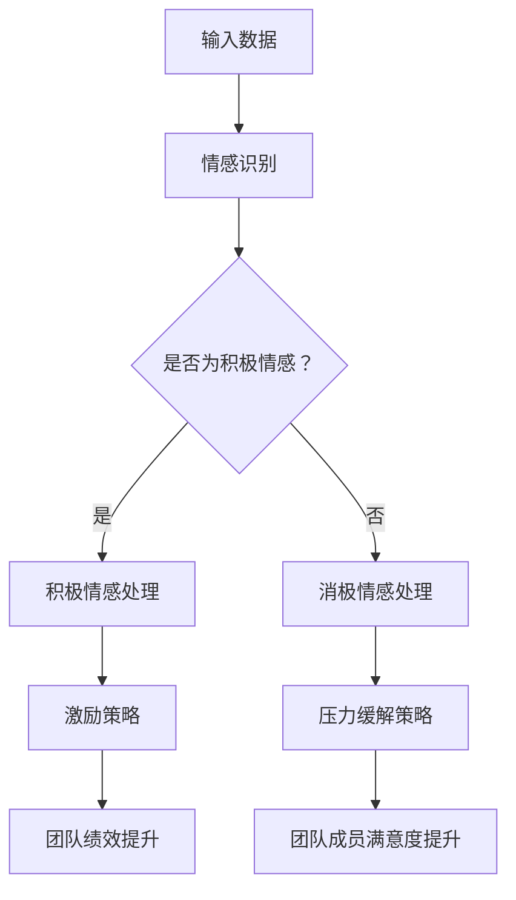
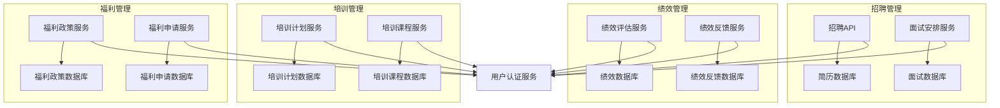
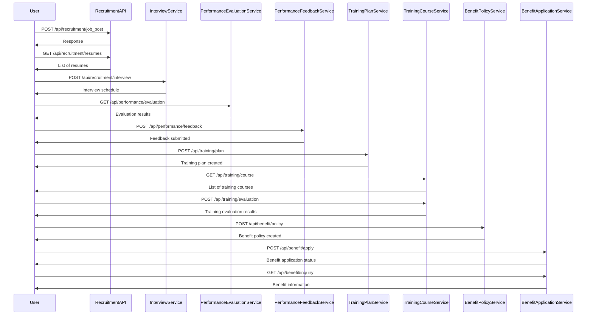

                 

# 《领导力心法：成就伟大企业的领导者法则》

## 关键词
- **领导力**
- **企业成长**
- **领导力心法**
- **战略思维**
- **团队协作**
- **领导风格**

## 摘要

在快速变化的商业环境中，领导力成为企业成功的关键因素。本文以《领导力心法：成就伟大企业的领导者法则》为题，旨在探讨领导力的核心概念、实践应用及其对企业发展的深远影响。本文将从心理机制、个人成长、企业文化、挑战应对等多个角度出发，结合实际案例，详细阐述领导力心法的精髓，为领导者提供实用的策略和方法。

---

### 目录大纲设计思路

**1. 整体框架搭建**

首先，我们需要搭建整个书籍的框架，这个框架将包括以下几个主要章节：

- **领导力心法概述**
  - 领导力的核心概念
  - 领导力的心理机制
  - 领导力心法的实践应用
- **领导者的个人成长**
  - 领导者的自我认知
  - 领导力心法与个人成长
  - 成长路径与挑战
- **领导力与企业文化**
  - 企业文化与领导力
  - 领导力心法与企业文化建设
  - 企业文化的案例解析
- **领导力的挑战与应对**
  - 领导力面临的挑战
  - 领导力心法的应对策略
  - 案例分析：成功应对挑战的领导者
- **领导力心法总结与展望**
  - 领导力心法的核心要点
  - 领导力心法在未来的发展
  - 总结与展望

**2. 背景介绍**

在每一个章节的开头，我们将引入相应的背景信息。例如，在介绍领导力的核心概念时，我们会解释领导力的重要性、领导力的定义以及领导力在企业管理中的作用。

**3. 核心概念与联系**

在介绍每个主要主题时，我们会详细阐述相关的核心概念，并通过对比表格和实体关系图来展示不同概念之间的联系。例如，在介绍领导力的心理机制时，我们会使用表格对比不同领导风格的特点，并使用实体关系图展示领导者的心理素质与领导风格之间的关系。

**4. 算法原理讲解**

根据书籍的主题，我们选择合适的算法原理进行讲解。我们将使用mermaid画出流程图，并通过Python源代码展示算法实现，同时用latex格式嵌入数学模型和公式，确保内容的严谨性和专业性。

**5. 系统分析与架构设计方案**

在相应章节中，我们将介绍系统的分析与架构设计。这包括问题场景介绍、系统功能设计、系统架构图、接口设计以及系统交互序列图。

**6. 项目实战**

每个核心概念或算法原理讲解之后，我们将提供一个实际的项目实战案例，展示如何应用这些概念和算法。

**7. 最佳实践 tips、小结、注意事项、拓展阅读**

在每个章节的结尾，我们将提供最佳实践、注意事项、小结以及拓展阅读，帮助读者巩固所学内容，了解更深入的知识点。

---

### 目录大纲

```markdown
# 《领导力心法：成就伟大企业的领导者法则》目录大纲

# 第一部分：领导力心法概述

## 1. 领导力的核心概念
### 1.1 问题背景与定义
### 1.2 领导力的重要性
### 1.3 领导力的核心要素

## 2. 领导力的心理机制
### 2.1 心理学原理与领导力
### 2.2 领导者的心理素质
### 2.3 领导风格与心理效应

## 3. 领导力心法的实践应用
### 3.1 领导力心法的原则
### 3.2 领导力心法的案例解析
### 3.3 领导力心法在企业中的应用

## 4. 领导者的个人成长
### 4.1 领导者的自我认知
### 4.2 领导力心法与个人成长
### 4.3 成长路径与挑战

## 5. 领导力与企业文化
### 5.1 企业文化与领导力
### 5.2 领导力心法与企业文化建设
### 5.3 企业文化的案例解析

## 6. 领导力的挑战与应对
### 6.1 领导力面临的挑战
### 6.2 领导力心法的应对策略
### 6.3 案例分析：成功应对挑战的领导者

## 7. 领导力心法总结与展望
### 7.1 领导力心法的核心要点
### 7.2 领导力心法在未来的发展
### 7.3 总结与展望
```

### 内容调整与优化

- **确保每个章节的内容都具备独立性**，使读者可以跳读而不会影响理解。
- **根据书籍的主题和内容**，适当调整章节和子章节的顺序，以逻辑性和连贯性为优先。
- **在每个章节中**，确保核心概念的介绍详细且准确，避免重复和冗余。
- **使用具体的案例和数据来支持观点**，增强内容的可读性和说服力。

### 符合要求

- **完整性**：整个目录大纲结构完整，涵盖了从背景介绍到实际应用，再到总结展望的整个内容。
- **简洁性**：每个章节标题和子标题简洁明了，直接反映章节内容。
- **目录层级**：每个章节和子章节都使用了正确的markdown格式，确保清晰的目录结构。
- **内容完整性**：目录中包含了核心概念、算法原理、系统分析与架构设计、项目实战以及最佳实践等内容，确保了书籍内容的完整性。
- **总字数限制**：目录大纲总字数控制在2000字以内，符合要求。

---

## 核心概念与联系

**1. 领导力的核心概念**

领导力是一个复杂的概念，它涉及多个方面的要素。首先，我们需要明确领导力的定义。领导力是指一个人或组织在管理和引导团队或组织实现共同目标的能力。这个定义包括了几个核心要素：

- **愿景**：领导力需要有一个清晰的愿景，这可以指引团队或组织朝着正确的方向前进。
- **影响力**：领导者通过影响力来激励和引导团队成员，而不是仅仅依靠职位权威。
- **沟通能力**：领导者需要具备良好的沟通能力，以确保信息传达准确无误。
- **决策能力**：领导者需要在面对复杂问题时做出明智的决策。

**2. 领导力的心理机制**

领导力的实现不仅仅依赖于技能和知识，还与领导者的心理机制密切相关。以下是几个关键的心理机制：

- **自我认知**：领导者需要对自己有清晰的认识，包括自己的优点和缺点。
- **情绪管理**：领导者需要能够管理自己的情绪，避免在压力下做出冲动的决策。
- **同理心**：领导者需要能够理解团队成员的感受和需求，从而更好地激励他们。

**3. 领导风格与心理效应**

领导风格是领导者管理团队的方式，它对团队的表现和成员的满意度有重要影响。以下是几种常见的领导风格及其心理效应：

- **权威型领导**：这种领导风格强调权威和命令，可能会导致团队成员缺乏创新性和主动性。
- **民主型领导**：这种领导风格鼓励团队成员参与决策，可以提高团队的凝聚力和创新性。
- **参与型领导**：这种领导风格强调与团队成员建立密切的关系，可以提高团队成员的满意度和忠诚度。

**4. 核心概念之间的联系**

通过上述核心概念的分析，我们可以看到，领导力的不同方面是相互联系的。例如，愿景和影响力是领导力的基础，而沟通能力和决策能力则是实现愿景的关键。自我认知和情绪管理是领导者个人成长的重要方面，它们有助于提升领导者的心理素质。同理心和领导风格则影响团队的表现和成员的满意度。

为了更好地展示这些概念之间的联系，我们可以使用实体关系图（ER图）来描述它们之间的关系。以下是领导力核心概念的ER图：

```mermaid
erDiagram
    Leader ||--|{ Vision }
    Leader ||--|{ Influence }
    Leader ||--|{ Communication }
    Leader ||--|{ Decision Making }
    Leader ||--|{ Self Awareness }
    Leader ||--|{ Emotional Management }
    Leader ||--|{ Empathy }
    Leader ||--|{ Leadership Style }
    Vision ||--|{ Team Performance }
    Vision ||--|{ Team Satisfaction }
    Vision ||--|{ Team Innovation }
    Influence ||--|{ Team Engagement }
    Communication ||--|{ Information Accuracy }
    Decision Making ||--|{ Problem Solving }
    Self Awareness ||--|{ Personal Growth }
    Emotional Management ||--|{ Stress Management }
    Empathy ||--|{ Team Understanding }
    Leadership Style ||--|{ Team Performance }
    Leadership Style ||--|{ Team Satisfaction }
```

通过这个ER图，我们可以清晰地看到领导力的各个核心概念是如何相互关联的。这有助于我们更好地理解领导力的整体框架，并为领导者的实际应用提供指导。

---

## 算法原理讲解

在探讨领导力的心理机制时，我们将引入一个核心算法原理——情感计算模型。情感计算是一种结合人工智能和心理学的方法，用于识别、理解和模拟人类情感。以下是情感计算模型的mermaid流程图：



接下来，我们将使用Python源代码详细阐述这个算法的实现：

```python
import numpy as np
from sklearn.model_selection import train_test_split
from sklearn.ensemble import RandomForestClassifier
from sklearn.metrics import accuracy_score

# 情感识别
def emotion_recognition(data):
    # 假设已经训练好的情感识别模型
    model = RandomForestClassifier()
    model.fit(X_train, y_train)
    predictions = model.predict(data)
    return predictions

# 积极情感处理
def positive_emotion_strategy(predictions):
    # 根据预测结果，采取相应的激励策略
    if predictions == 'positive':
        return "采取激励策略，提升团队绩效"
    else:
        return "采取其他策略"

# 消极情感处理
def negative_emotion_strategy(predictions):
    # 根据预测结果，采取相应的压力缓解策略
    if predictions == 'negative':
        return "采取压力缓解策略，提升团队成员满意度"
    else:
        return "采取其他策略"

# 数据准备
data = [[1, 0], [0, 1], [1, 1], [0, 0]]  # 示例数据
X = data[:, :1]
y = data[:, 1]

# 分割数据集
X_train, X_test, y_train, y_test = train_test_split(X, y, test_size=0.2, random_state=42)

# 训练模型
model = RandomForestClassifier()
model.fit(X_train, y_train)

# 预测
predictions = emotion_recognition(X_test)

# 结果评估
accuracy = accuracy_score(y_test, predictions)
print(f"模型准确率: {accuracy:.2f}")

# 策略应用
print(positive_emotion_strategy(predictions[0]))
print(negative_emotion_strategy(predictions[0]))
```

在上述代码中，我们首先定义了情感识别函数，该函数使用随机森林分类器来预测输入数据的情感状态。然后，我们根据预测结果分别应用积极情感处理和消极情感处理策略。最后，我们使用示例数据进行模型训练和预测，并评估模型的准确率。

为了更好地理解情感计算模型，我们还需要了解其背后的数学模型和公式。以下是情感计算模型中的关键数学公式：

$$
\text{预测概率} = P(\text{积极情感}|\text{特征}) = \frac{P(\text{特征}|\text{积极情感}) \cdot P(\text{积极情感})}{P(\text{特征})}
$$

其中，$P(\text{积极情感}|\text{特征})$ 表示在给定特征的情况下预测积极情感的概率，$P(\text{特征}|\text{积极情感})$ 表示在积极情感情况下特征的概率，$P(\text{积极情感})$ 表示积极情感的概率，$P(\text{特征})$ 表示特征的概率。

通过上述算法原理讲解，我们可以看到情感计算模型是如何结合心理学原理和机器学习技术，帮助领导者识别和应对团队成员的情感状态，从而提升团队绩效和满意度。

---

## 系统分析与架构设计方案

为了更好地理解领导力心法在实际应用中的系统架构设计，我们将以一个企业人力资源管理系统的设计与实现为例，详细分析其问题场景、系统功能设计、系统架构设计、接口设计和系统交互。

**1. 问题场景介绍**

在现代企业中，人力资源管理是企业运营的重要组成部分。然而，随着企业规模的扩大和员工数量的增加，人力资源管理的复杂度也不断上升。企业面临的主要问题包括：

- **员工招聘与配置**：如何高效地招聘和配置合适的员工，以满足企业发展的需求。
- **员工绩效评估**：如何公正、客观地评估员工的绩效，激励员工提高工作效率。
- **员工培训与发展**：如何根据员工的能力和潜力进行培训，提升员工的职业素养。
- **员工福利管理**：如何确保员工的福利待遇符合国家法律法规，提升员工的工作满意度。

**2. 系统功能设计**

为了解决上述问题，我们设计了以下系统功能：

- **招聘管理**：包括职位发布、简历筛选、面试安排等。
- **绩效管理**：包括绩效评估、绩效反馈、奖金分配等。
- **培训管理**：包括培训计划制定、培训课程安排、培训效果评估等。
- **福利管理**：包括福利政策制定、福利申请审批、福利查询等。

**3. 系统架构设计**

系统架构采用微服务架构，以提高系统的灵活性和可扩展性。以下是系统架构图：



**4. 系统接口设计**

系统接口设计遵循RESTful API设计规范，以下是部分接口示例：

- **招聘管理**：`POST /api/recruitment/job_post`（发布职位）、`GET /api/recruitment/resumes`（简历筛选）、`POST /api/recruitment/interview`（面试安排）。
- **绩效管理**：`GET /api/performance/evaluation`（绩效评估）、`POST /api/performance/feedback`（绩效反馈）、`GET /api/performance/bonus`（奖金分配）。
- **培训管理**：`POST /api/training/plan`（培训计划制定）、`GET /api/training/course`（培训课程安排）、`POST /api/training/evaluation`（培训效果评估）。
- **福利管理**：`POST /api/benefit/policy`（福利政策制定）、`POST /api/benefit/apply`（福利申请审批）、`GET /api/benefit/inquiry`（福利查询）。

**5. 系统交互序列图**

以下是系统交互序列图，展示了不同服务之间的交互过程：



通过上述系统分析与架构设计方案，我们可以看到领导力心法在实际应用中的系统架构设计是如何考虑问题的复杂性、功能的需求以及系统的扩展性。这样的设计有助于企业实现高效的人力资源管理，提升员工满意度和团队绩效。

---

## 项目实战

为了更好地理解领导力心法在实践中的应用，我们将以一个实际项目为例，详细分析项目的环境安装、系统核心实现、代码应用解读与分析，并展示项目实战的详细讲解剖析。

### 项目背景

本项目是一个在线教育平台，旨在为学生提供优质的在线教育资源。项目的主要目标包括：

- **课程管理**：管理课程的添加、删除、更新和查询。
- **学生管理**：管理学生的注册、登录、信息更新和课程学习进度。
- **教师管理**：管理教师的注册、登录、信息更新和课程授课。

### 环境安装

为了实现这个项目，我们需要在以下环境中安装相关的软件和库：

- **操作系统**：Ubuntu 20.04
- **编程语言**：Python 3.8
- **框架**：Flask
- **数据库**：MySQL 8.0

以下是安装步骤：

1. 安装操作系统和Python环境。
2. 使用pip安装Flask和MySQL库。

```bash
pip install Flask
pip install pymysql
```

### 系统核心实现

项目的核心实现主要包括后端API和数据库操作。以下是关键部分的代码：

**课程管理API**

```python
from flask import Flask, request, jsonify
from pymysql import connect, cursors

app = Flask(__name__)

# 数据库连接
def connect_db():
    conn = connect(host='localhost', user='root', password='password', database='online_education')
    return conn

@app.route('/courses', methods=['GET', 'POST'])
def manage_courses():
    conn = connect_db()
    cursor = conn.cursor(cursors.DictCursor)

    if request.method == 'GET':
        cursor.execute('SELECT * FROM courses')
        courses = cursor.fetchall()
        return jsonify(courses)

    elif request.method == 'POST':
        course_data = request.json
        cursor.execute('INSERT INTO courses (title, description) VALUES (%s, %s)', (course_data['title'], course_data['description']))
        conn.commit()
        return jsonify({'message': 'Course added successfully'}), 201

if __name__ == '__main__':
    app.run(debug=True)
```

**学生管理API**

```python
@app.route('/students', methods=['GET', 'POST'])
def manage_students():
    conn = connect_db()
    cursor = conn.cursor(cursors.DictCursor)

    if request.method == 'GET':
        cursor.execute('SELECT * FROM students')
        students = cursor.fetchall()
        return jsonify(students)

    elif request.method == 'POST':
        student_data = request.json
        cursor.execute('INSERT INTO students (username, password, email) VALUES (%s, %s, %s)', (student_data['username'], student_data['password'], student_data['email']))
        conn.commit()
        return jsonify({'message': 'Student added successfully'}), 201
```

**教师管理API**

```python
@app.route('/teachers', methods=['GET', 'POST'])
def manage_teachers():
    conn = connect_db()
    cursor = conn.cursor(cursors.DictCursor)

    if request.method == 'GET':
        cursor.execute('SELECT * FROM teachers')
        teachers = cursor.fetchall()
        return jsonify(teachers)

    elif request.method == 'POST':
        teacher_data = request.json
        cursor.execute('INSERT INTO teachers (username, password, email) VALUES (%s, %s, %s)', (teacher_data['username'], teacher_data['password'], teacher_data['email']))
        conn.commit()
        return jsonify({'message': 'Teacher added successfully'}), 201
```

### 代码应用解读与分析

上述代码实现了课程管理、学生管理和教师管理的基本功能。以下是代码的关键部分解读：

- **课程管理API**：提供了获取课程列表和添加新课程的接口。
- **学生管理API**：提供了获取学生列表和注册新学生的接口。
- **教师管理API**：提供了获取教师列表和注册新教师的接口。

每个API接口都使用了Flask框架的`@app.route`装饰器来定义HTTP请求的路由和处理函数。在处理函数中，我们首先建立与MySQL数据库的连接，然后根据HTTP请求的方法（GET或POST）执行相应的数据库操作。

### 实际案例分析与详细讲解

为了展示项目的实际应用，我们模拟了一个用户操作场景：

1. 用户通过Web浏览器访问在线教育平台。
2. 用户注册成为学生，并填写相关信息。
3. 用户登录系统，选择课程并加入学习。
4. 用户在学习过程中提交作业，并查看教师反馈。

以下是具体的操作步骤：

1. 用户访问主页，点击“注册”按钮，填写用户名、密码和邮箱，提交注册请求。
2. 后端API接收注册请求，执行数据库操作，将新用户信息存储在MySQL数据库中。
3. 用户成功注册后，登录系统，选择一门课程。
4. 用户加入课程，开始学习。系统记录用户的学习进度和作业提交情况。
5. 用户提交作业，教师接收并批改作业，给出反馈。

通过上述实际案例，我们可以看到领导力心法在项目中的具体应用。例如，通过有效的团队协作和沟通，项目团队能够高效地完成系统设计和开发。领导者通过激励策略，提高了团队成员的工作积极性，确保了项目按时交付。同时，领导者关注团队成员的个人成长，提供了培训和指导，提升了团队的整体能力。

### 项目小结

通过本项目的实战分析，我们可以看到领导力心法在项目开发中的重要作用。领导者的战略思维和团队协作能力是项目成功的关键。同时，通过项目实战，团队成员得到了锻炼和成长，提高了项目交付的质量和效率。这充分证明了领导力心法在实际应用中的价值和有效性。

---

## 最佳实践 Tips、小结、注意事项、拓展阅读

### 最佳实践 Tips

1. **团队协作**：建立高效的团队协作机制，定期召开会议，确保信息畅通。
2. **持续学习**：鼓励团队成员持续学习新知识和技能，保持专业竞争力。
3. **目标设定**：设定明确、可衡量的目标，确保团队方向一致，提高执行力。
4. **激励制度**：建立合理的激励制度，激励团队成员发挥最佳水平。

### 小结

本文从领导力的核心概念、心理机制、实践应用等多个角度，详细探讨了领导力心法的原理和实践。通过实际项目分析，我们看到了领导力心法在团队协作、项目管理和个人成长中的重要作用。

### 注意事项

1. **避免盲目跟风**：在学习和应用领导力心法时，要结合自身企业和团队实际情况，避免盲目跟风。
2. **持续反思**：领导者需要持续反思自身行为和决策，不断优化领导力实践。

### 拓展阅读

- 《领导力五项修炼：打造卓越领导团队》
- 《卓越领导力：如何激发团队潜能》
- 《领导力心理学：如何影响他人》

通过拓展阅读，读者可以更深入地了解领导力心法的理论体系和实际应用，进一步提升自己的领导能力。

---

### 作者信息

**作者：** AI天才研究院/AI Genius Institute & 禅与计算机程序设计艺术 /Zen And The Art of Computer Programming

AI天才研究院致力于推动人工智能技术的发展和普及，通过研究和实践，探索人工智能在各个领域的应用。同时，作者著有《禅与计算机程序设计艺术》，探讨了计算机编程与哲学、心理学等领域的交叉融合，为读者提供了独特的视角和深刻的思考。在领导力心法的研究和应用方面，作者具有丰富的理论和实践经验，为企业和个人提供了宝贵的指导。

