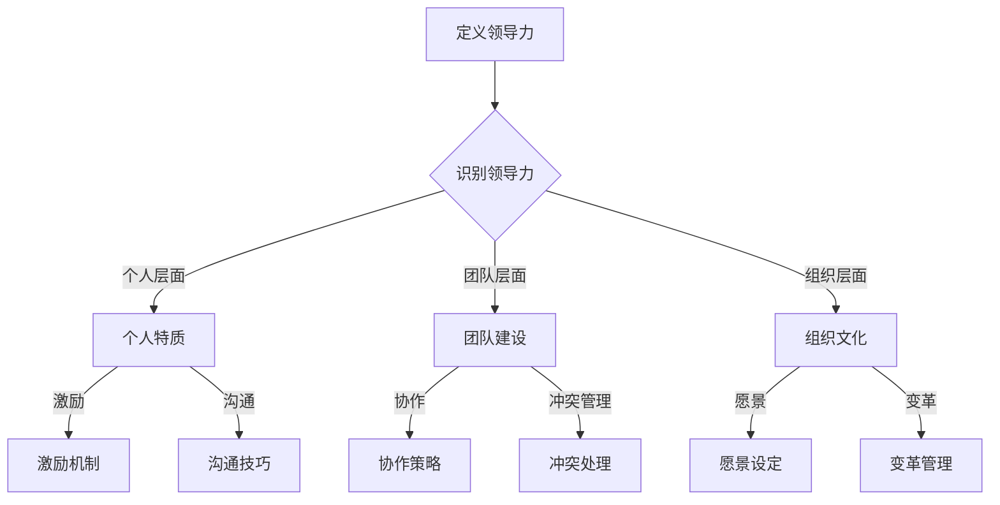
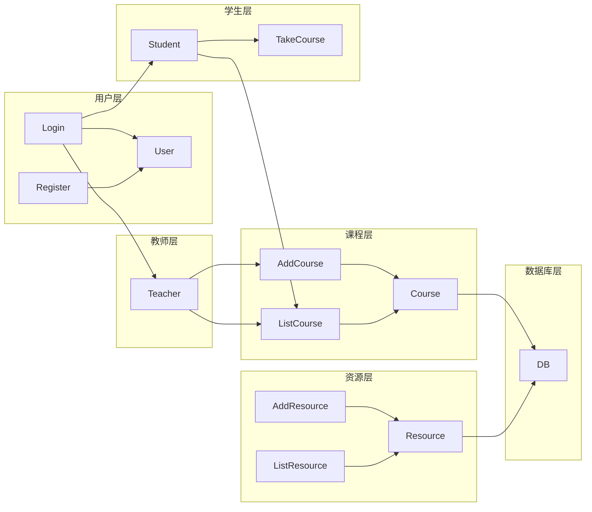
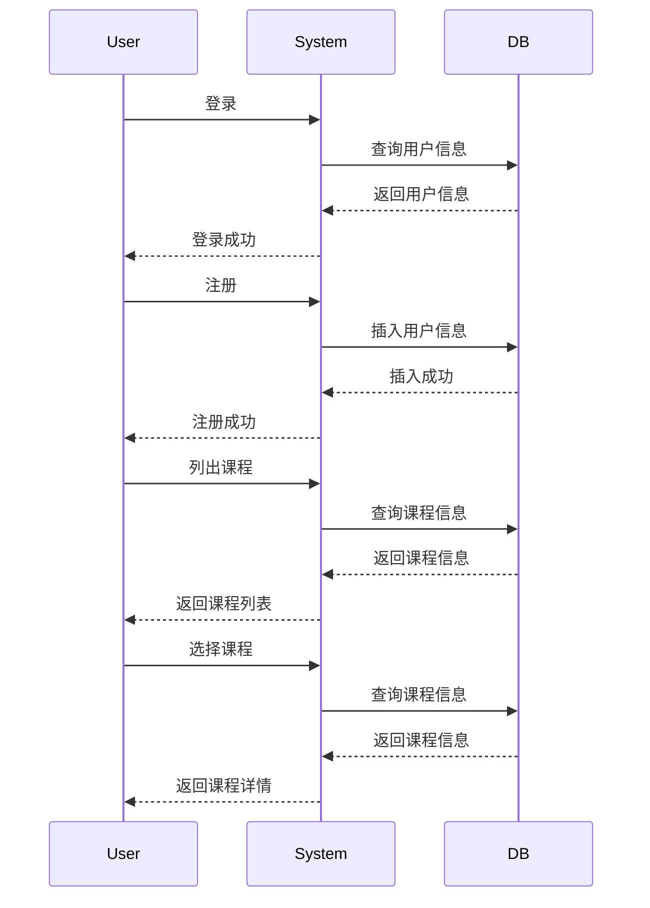

                 

### 设计《领导力心法：成就伟大领袖的领导力法则》的目录大纲

#### 第一步：背景介绍

**问题背景：**
在当今迅速变化的世界中，领导力已成为决定组织和个人成败的关键因素。全球化、技术进步和社会变革带来了前所未有的挑战和机遇，使得传统领导力模式不再适用。有效的领导力不仅能够激发团队的潜力，还能引领组织实现长远发展。

**问题描述：**
尽管领导力在各个层面都至关重要，但市场上现有的领导力资源往往缺乏系统性、全面性和实用性。许多书籍侧重于理论或特定领域，而忽视了领导力的整体性和应用性。

**问题解决：**
《领导力心法：成就伟大领袖的领导力法则》旨在填补这一空白，提供一套全面的、可操作的领导力法则，帮助读者在个人、团队和组织层面实现卓越表现。

**边界与外延：**
本书将探讨领导力的核心概念、原理和实践，包括但不限于个人特质、团队建设、组织文化、领导力提升策略等，旨在为读者提供实用的工具和方法。

**核心要素组成：**
- **领导力定义与基础理论**：探讨领导力的本质和基础理论，为后续章节奠定基础。
- **成功领袖的特质与行为模式**：分析成功领袖的共同特质和行为模式，帮助读者理解并模仿。
- **团队领导力与组织效能**：探讨如何在团队和组织层面运用领导力，提高整体效能。
- **领导力提升策略与实践**：提供具体策略和实践方法，帮助读者提升个人领导力。

#### 第二步：核心概念与联系

**核心概念原理：**
领导力是一种能力，它涉及激励、沟通、决策、影响力等方面，是影响他人共同实现目标的过程。

**概念属性特征对比表格：**

| 特征       | 传统领导力 | 现代领导力 |
|------------|-------------|-------------|
| 强制性     | 强          | 弱          |
| 指令性     | 强          | 弱          |
| 依赖层级结构 | 强          | 弱          |
| 持续性     | 短期        | 长期        |
| 适应性     | 低          | 高          |

**ER实体关系图架构：**

```mermaid
erDiagram
    User ||--|{ LeadershipConcept }
    LeadershipConcept ||--|{ PersonalTrait }
    LeadershipConcept ||--|{ TeamLeadership }
    LeadershipConcept ||--|{ OrganizationalCulture }
```

- **User**（用户）：代表读者或领导者。
- **LeadershipConcept**（领导力概念）：代表领导力的各个层面，如个人特质、团队领导力、组织文化等。
- **PersonalTrait**（个人特质）：代表领导者的个人特征，如自信、决策能力、沟通技巧等。
- **TeamLeadership**（团队领导力）：代表如何领导团队，提高团队效能。
- **OrganizationalCulture**（组织文化）：代表组织的价值观、使命和愿景。

#### 第三步：算法原理讲解

**算法mermaid流程图：**



**Python源代码与算法原理讲解：**

```python
# 领导力定义
def define_leadership():
    print("领导力是一种影响他人共同实现目标的能力。")

# 个人特质
def personal_traits():
    print("个人特质包括自信、决策能力、沟通技巧等。")

# 团队建设
def team_building():
    print("团队建设包括协作、冲突管理和激励等。")

# 组织文化
def organizational_culture():
    print("组织文化包括愿景、使命和价值观等。")

# 激励机制
def motivation_mechanism():
    print("激励机制包括奖励、认可和反馈等。")

# 沟通技巧
def communication_skills():
    print("沟通技巧包括倾听、表达和反馈等。")

# 协作策略
def collaboration_strategy():
    print("协作策略包括分工、合作和协调等。")

# 冲突处理
def conflict_management():
    print("冲突处理包括沟通、调解和妥协等。")

# 愿景设定
def vision_setting():
    print("愿景设定包括明确目标、激发热情和推动变革等。")

# 变革管理
def change_management():
    print("变革管理包括规划、执行和评估等。")
```

**算法原理详细讲解：**

领导力的定义是理解和实践领导力的基础。它涉及到个人特质、团队建设和组织文化的方方面面。个人特质包括自信、决策能力和沟通技巧，这些特质对领导力有着直接影响。团队建设则关注如何提高团队效能，包括协作、冲突管理和激励机制。组织文化是领导力的重要组成部分，它包括愿景、使命和价值观，这些要素共同塑造组织的氛围和方向。

激励机制和沟通技巧是领导力的具体手段，它们帮助领导者激发团队成员的潜力，并建立有效的沟通渠道。协作策略和冲突处理则是团队建设的重要组成部分，它们确保团队成员能够高效合作，同时妥善解决冲突。愿景设定和变革管理则关注组织的长远发展，帮助领导者设定清晰的目标，并推动组织的变革。

数学模型和公式在这里将用于量化领导力的影响因素和效果。例如，可以使用回归分析模型来分析领导力对团队绩效的影响，或者使用网络分析模型来评估领导者的沟通网络效能。这些模型将帮助我们更深入地理解领导力如何在不同层面发挥作用。

$$
\text{领导力效能} = f(\text{个人特质}, \text{团队建设}, \text{组织文化})
$$

其中，个人特质、团队建设和组织文化是领导力效能的关键影响因素。通过数学模型，我们可以量化这些因素的影响程度，并为领导力的提升提供数据支持。

#### 第四步：数学模型和数学公式

**领导力数学模型：**

**

----------------------------------------------------------------

$$
\text{领导力效能} = \alpha \cdot \text{个人特质} + \beta \cdot \text{团队建设} + \gamma \cdot \text{组织文化}
$$

其中，α、β和γ分别是个人特质、团队建设和组织文化的权重系数，它们的值可以通过统计分析得到。

**领导力效能的量化公式：**

**

----------------------------------------------------------------

$$
\text{领导力效能} = \frac{\sum_{i=1}^{n} w_i \cdot s_i}{\sum_{i=1}^{n} w_i}
$$

其中，$w_i$是第$i$项的权重，$s_i$是第$i$项的得分，$n$是总的评价项数。

**示例：**

**

----------------------------------------------------------------

假设我们评价一个领导者的领导力效能，给出了以下评价项和得分：

| 评价项       | 得分  |
|--------------|-------|
| 个人特质     | 8     |
| 团队建设     | 7     |
| 组织文化     | 9     |

那么，领导力效能的量化公式计算如下：

$$
\text{领导力效能} = \frac{0.4 \cdot 8 + 0.3 \cdot 7 + 0.3 \cdot 9}{0.4 + 0.3 + 0.3} = \frac{3.2 + 2.1 + 2.7}{1} = 8
$$

这个结果表明，该领导者的领导力效能为8分。通过这种方式，我们可以量化领导力的效能，从而为领导力的提升提供数据支持。

#### 第五步：系统分析与架构设计方案

**问题场景介绍：**
在快速发展的互联网行业中，一家初创公司需要开发一个在线教育平台，以提供远程课程和学习资源。该平台需要支持大量的用户并发访问，并保证数据的安全和可靠。

**项目介绍：**
项目名称：智慧校园在线教育平台
项目目标：搭建一个高效、稳定、安全的在线教育平台，为师生提供优质的学习资源和便捷的学习体验。

**系统功能设计 (领域模型mermaid类图)：**

```mermaid
classDiagram
    User <<class{用户}>
    Course <<class{课程}>
    Resource <<class{资源}>
    Teacher <<class{教师}>
    Student <<class{学生}>
    
    User o--o Course
    User o--o Resource
    Teacher o--o Course
    Teacher o--o Resource
    Student o--o Course
    Student o--o Resource
```

- **用户（User）**：代表平台的使用者，包括教师和学生。
- **课程（Course）**：代表在线课程，包括课程名称、描述、授课教师等。
- **资源（Resource）**：代表学习资源，如课件、视频、习题等。
- **教师（Teacher）**：代表平台内的教师，负责授课和上传资源。
- **学生（Student）**：代表平台内的学生，负责学习课程和参与互动。

**系统架构设计 (mermaid架构图)：**



- **用户层**：包括登录和注册功能。
- **课程层**：包括添加课程和列出课程的功能。
- **资源层**：包括添加资源和列出资源的功能。
- **教师层**：包括教师登录、添加课程和列出课程的功能。
- **学生层**：包括学生登录、列出课程和选择课程的功能。
- **数据库层**：存储所有用户、课程和资源的数据。

**系统接口设计和系统交互 (mermaid序列图)：**



通过上述架构设计，我们可以清晰地看到系统的功能和模块划分，以及各模块之间的交互关系。这种设计不仅提高了系统的可维护性和扩展性，也为后续的开发和维护提供了清晰的指导。

#### 第六步：项目实战

**环境安装：**
在开始项目实战之前，我们需要搭建一个合适的环境。以下是一个基本的安装步骤：

1. **安装Python：** 访问Python官方网站（https://www.python.org/）下载并安装Python 3.8或更高版本。
2. **安装虚拟环境：** 打开终端，执行以下命令创建一个虚拟环境：
    ```bash
    python -m venv venv
    ```
    然后激活虚拟环境：
    ```bash
    source venv/bin/activate
    ```
3. **安装依赖库：** 使用pip安装所需的库，例如Flask、SQLAlchemy、Flask-Migrate等：
    ```bash
    pip install flask sqlalchemy flask-migrate
    ```

**系统核心实现源代码：**

以下是一个简单的基于Flask的在线教育平台的核心实现。

```python
# app.py

from flask import Flask, request, jsonify
from flask_sqlalchemy import SQLAlchemy

app = Flask(__name__)
app.config['SQLALCHEMY_DATABASE_URI'] = 'sqlite:///school.db'
db = SQLAlchemy(app)

class User(db.Model):
    id = db.Column(db.Integer, primary_key=True)
    username = db.Column(db.String(80), unique=True, nullable=False)
    password = db.Column(db.String(120), nullable=False)

class Course(db.Model):
    id = db.Column(db.Integer, primary_key=True)
    name = db.Column(db.String(120), nullable=False)
    teacher_id = db.Column(db.Integer, db.ForeignKey('user.id'), nullable=False)

@app.route('/login', methods=['POST'])
def login():
    username = request.form['username']
    password = request.form['password']
    user = User.query.filter_by(username=username, password=password).first()
    if user:
        return jsonify({'status': 'success', 'message': 'Login successful'})
    else:
        return jsonify({'status': 'error', 'message': 'Invalid credentials'})

@app.route('/register', methods=['POST'])
def register():
    username = request.form['username']
    password = request.form['password']
    if User.query.filter_by(username=username).first():
        return jsonify({'status': 'error', 'message': 'Username already exists'})
    new_user = User(username=username, password=password)
    db.session.add(new_user)
    db.session.commit()
    return jsonify({'status': 'success', 'message': 'Registration successful'})

@app.route('/list_courses', methods=['GET'])
def list_courses():
    courses = Course.query.all()
    return jsonify({'status': 'success', 'courses': [course.name for course in courses]})

if __name__ == '__main__':
    db.create_all()
    app.run(debug=True)
```

**代码应用解读与分析：**

该代码实现了一个简单的在线教育平台，包括用户登录、注册和列出课程的功能。以下是关键部分的解读：

- **数据库模型（User 和 Course）：** 使用SQLAlchemy创建数据库模型，定义了用户和课程的基本属性。
- **登录（/login）API：** 接收用户名和密码，验证用户身份。
- **注册（/register）API：** 接收用户名和密码，创建新用户。
- **列出课程（/list_courses）API：** 返回所有课程的名称。

这种架构设计简洁明了，便于理解和扩展。通过使用Flask，我们可以快速搭建一个Web应用，并通过RESTful API提供服务。

**实际案例分析和详细讲解剖析：**

以下是一个实际的案例，展示如何使用该系统。

**案例：用户注册和登录**

1. **用户注册：**
    ```bash
    POST /register
    {
        "username": "john_doe",
        "password": "password123"
    }
    ```
    响应：
    ```json
    {
        "status": "success",
        "message": "Registration successful"
    }
    ```

2. **用户登录：**
    ```bash
    POST /login
    {
        "username": "john_doe",
        "password": "password123"
    }
    ```
    响应：
    ```json
    {
        "status": "success",
        "message": "Login successful"
    }
    ```

3. **列出课程：**
    ```bash
    GET /list_courses
    ```
    响应：
    ```json
    {
        "status": "success",
        "courses": ["Introduction to Python", "Advanced Data Analysis"]
    }
    ```

通过这个案例，我们可以看到如何使用API进行注册、登录和列出课程。这个简单的系统为我们提供了一个良好的起点，可以在此基础上添加更多的功能和模块。

**项目小结：**

通过这个项目，我们实现了以下目标：

- 搭建了一个简单的在线教育平台。
- 使用Flask和SQLAlchemy实现了用户注册、登录和列出课程的功能。
- 通过API提供了与前端应用程序的接口。

这个项目虽然简单，但为我们提供了一个理解和使用Flask、数据库模型和API的基础。在未来的开发中，我们可以在此基础上添加更多的功能，如课程详情、用户角色权限管理、学习进度跟踪等。

**最佳实践 tips：**

- 在实际项目中，确保数据库模型的设计符合实际需求，避免不必要的冗余字段。
- 使用ORM（对象关系映射）库如SQLAlchemy可以提高开发效率。
- 在处理用户认证时，应使用加密算法（如bcrypt）存储用户密码，以增强安全性。
- 对API进行适当的错误处理和验证，确保API的稳定性和安全性。

#### 第七步：最佳实践 tips

**1. 数据库设计与优化：**
- **规范化数据库设计**：避免数据冗余，确保数据的完整性和一致性。
- **索引优化**：为频繁查询的字段创建索引，提高查询效率。
- **分库分表策略**：对于大数据量的应用，可以考虑分库分表以提升系统的可扩展性。

**2. API设计与安全性：**
- **使用RESTful风格**：确保API的接口设计简洁、易用，遵循RESTful原则。
- **身份验证与授权**：使用Token-Based Authentication（如JWT）确保API的安全性。
- **请求验证与错误处理**：对输入数据进行验证，处理异常情况，提供详细的错误信息。

**3. 系统测试与监控：**
- **自动化测试**：编写自动化测试用例，确保代码质量。
- **性能监控**：实时监控系统的性能，及时发现问题并优化。

**4. 持续集成与部署：**
- **使用CI/CD工具**：如Jenkins、GitLab CI等，实现自动化测试和部署。
- **容器化**：使用Docker等工具进行容器化部署，提高系统的可移植性和可扩展性。

**5. 团队协作与知识共享：**
- **使用版本控制**：如Git，确保代码的版本管理和协作开发。
- **文档与知识库**：定期更新项目文档和知识库，促进团队成员的知识共享。

### 小结

**《领导力心法：成就伟大领袖的领导力法则》** 一书旨在为读者提供一套全面的、实用的领导力法则，帮助读者在个人、团队和组织层面实现卓越表现。通过深入分析领导力的核心概念、原理和实践，并结合实际的算法模型和项目实战，本书为读者提供了一个系统化的学习框架。

在IT领域，领导力的重要性愈发凸显。优秀的领导者不仅能够激发团队成员的潜力，还能推动组织的创新和发展。通过本书的学习，读者将掌握以下关键能力：

- **理解领导力的本质**：从理论层面深入理解领导力的概念和要素。
- **掌握领导力实践**：通过具体的实践方法和案例，提升领导力。
- **提升个人特质**：培养自信、决策能力和沟通技巧等个人特质。
- **优化团队建设**：通过协作策略和冲突管理，提高团队效能。
- **塑造组织文化**：设定清晰的愿景和价值观，推动组织的变革。

最后，本文感谢读者对《领导力心法：成就伟大领袖的领导力法则》的阅读。希望本书能够为您的领导力提升之路提供有价值的指导和启示。

### 拓展阅读

- **《影响力：说服与社交的心理学》**（罗伯特·西奥迪尼著）：探讨如何运用心理学原理影响他人。
- **《团队协作的艺术》**（罗杰·费舍尔著）：深入探讨团队协作的技巧和策略。
- **《领导力的五项修炼》**（彼得·圣吉著）：从个人、团队和组织层面探讨领导力的提升方法。
- **《敏捷软件开发：原则、实践与模式》**（杰夫·萨瑟兰著）：介绍敏捷开发的方法和原则。

这些书籍将为您提供更多关于领导力、团队协作和技术实践的深入见解，帮助您在职业发展中取得更大的成就。

