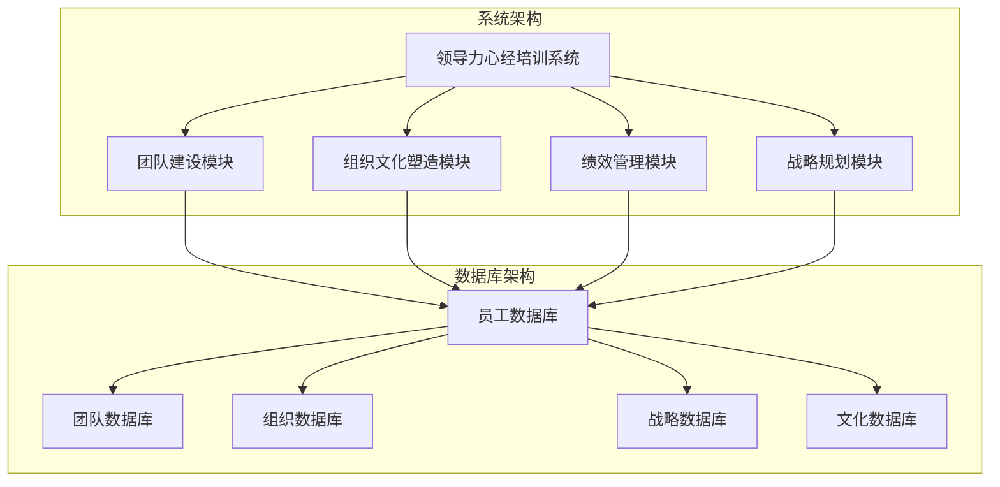
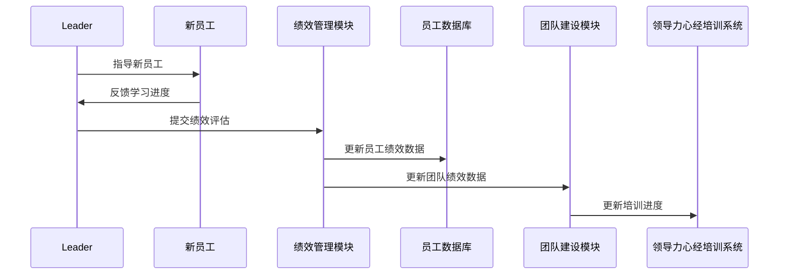
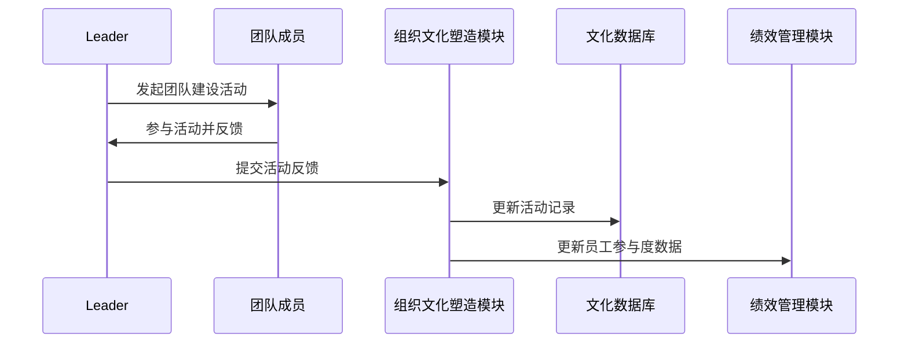

                 


# 领导力心经：成就伟大企业的领导者秘籍

> 关键词：领导力、企业成长、管理实践、团队协作、领导者素质

> 摘要：本文将从领导力的定义和重要性出发，分析当前企业面临的领导力挑战，提出“领导力心经”这一概念，并探讨其在不同企业阶段的应用与实践。通过详细的案例分析，总结领导力心经的最佳实践，旨在为企业的领导者提供有价值的指导和借鉴。

### 目录大纲

----------------------------------------------------------------

## 第1章 引言

### 1.1 问题背景

#### 1.1.1 领导力的定义与重要性

#### 1.1.2 当前企业面临的领导力挑战

#### 1.1.3 成就伟大企业的关键因素

### 1.2 问题描述

#### 1.2.1 领导者面临的困境

#### 1.2.2 企业发展的痛点

#### 1.2.3 领导力与企业发展关系探讨

### 1.3 问题解决

#### 1.3.1 领导力心经的概念

#### 1.3.2 领导力心经的理论基础

#### 1.3.3 领导力心经的实施路径

### 1.4 边界与外延

#### 1.4.1 领导力心经的应用范围

#### 1.4.2 领导力心经的限制因素

#### 1.4.3 领导力心经与其他管理理论的比较

## 第2章 领导力心经的核心概念

### 2.1 核心概念

#### 2.1.1 领导者的角色与职责

#### 2.1.2 团队协作的重要性

#### 2.1.3 领导者与员工的互动

### 2.2 概念属性特征对比表格

#### 2.2.1 领导风格与领导效果对比

#### 2.2.2 领导力与领导艺术的差异

#### 2.2.3 领导力与权力运用

### 2.3 ER实体关系图架构

#### 2.3.1 领导者与团队成员关系

#### 2.3.2 企业目标与领导力关系

#### 2.3.3 领导力心经的实施要素

## 第3章 领导力心经的理论基础

### 3.1 领导力心经的理论基础

#### 3.1.1 领导行为学

#### 3.1.2 组织行为学

#### 3.1.3 管理学理论基础

### 3.2 领导力心经的数学模型和公式

$$
\text{领导力效果} = f(\text{领导者素质}, \text{团队环境}, \text{领导行为})
$$

### 3.3 算法原理讲解

#### 3.3.1 领导者素质评估模型

#### 3.3.2 团队环境评估模型

#### 3.3.3 领导行为优化模型

## 第4章 领导力心经的应用场景

### 4.1 企业初创阶段

#### 4.1.1 初创企业领导力特点

#### 4.1.2 领导力心经在初创企业的应用

#### 4.1.3 初创企业领导力心经的实践案例

### 4.2 企业成长阶段

#### 4.2.1 成长企业领导力特点

#### 4.2.2 领导力心经在成长企业的应用

#### 4.2.3 成长企业领导力心经的实践案例

### 4.3 企业成熟阶段

#### 4.3.1 成熟企业领导力特点

#### 4.3.2 领导力心经在成熟企业的应用

#### 4.3.3 成熟企业领导力心经的实践案例

## 第5章 领导力心经的系统实施

### 5.1 系统实施策略

#### 5.1.1 领导者自我提升

#### 5.1.2 团队建设

#### 5.1.3 组织文化塑造

### 5.2 实施步骤

#### 5.2.1 领导力心经培训

#### 5.2.2 领导力评估

#### 5.2.3 实施计划制定

#### 5.2.4 监控与反馈

### 5.3 实施案例

#### 5.3.1 企业A的领导力心经实践

#### 5.3.2 企业B的领导力心经实践

## 第6章 领导力心经的最佳实践

### 6.1 最佳实践案例

#### 6.1.1 企业C的成功实践

#### 6.1.2 企业D的成功实践

#### 6.1.3 企业E的成功实践

### 6.2 小结与注意事项

#### 6.2.1 领导力心经实践的常见问题

#### 6.2.2 注意事项

#### 6.2.3 拓展阅读

----------------------------------------------------------------

## 第1章 引言

### 1.1 问题背景

#### 1.1.1 领导力的定义与重要性

领导力是一种影响力，它能够激发和引导人们去实现共同的目标。无论是在个人生活中，还是在企业组织中，领导力都扮演着至关重要的角色。在企业管理中，领导力直接影响到企业的愿景实现、战略执行、团队协作以及员工满意度。因此，领导力的定义和重要性不容忽视。

领导力的定义有多种，较为常见的观点是：领导力是一种能力，它能够促使他人为实现共同目标而努力。这种能力包括沟通、激励、决策、协调等多个方面。有效的领导力能够提升团队的整体效能，推动企业实现持续发展。

#### 1.1.2 当前企业面临的领导力挑战

随着全球经济的不断变化和竞争的加剧，企业面临着越来越多的领导力挑战。以下是当前企业面临的一些主要挑战：

1. **变革管理**：随着技术的进步和市场环境的变化，企业需要不断进行变革以保持竞争力。然而，许多领导者在这个过程中面临着巨大的挑战，如何有效地推动变革成为了一大难题。

2. **人才管理**：吸引和留住人才是企业发展的重要基石。然而，当前企业面临的人才竞争日益激烈，领导者需要具备吸引和培养优秀人才的能力。

3. **组织协同**：现代企业越来越重视跨部门协作，然而，如何实现高效的组织协同仍然是一个挑战。领导者在推动团队协作方面需要发挥关键作用。

4. **领导力传承**：随着企业领导者的老龄化，如何培养和传承领导力成为了一个重要问题。企业需要建立一套有效的领导力培养体系，以确保企业的长期发展。

#### 1.1.3 成就伟大企业的关键因素

要成就一家伟大企业，领导者必须具备以下几个关键因素：

1. **愿景与战略**：领导者需要有明确的愿景和战略，这将是企业发展的方向和指南。

2. **团队协作**：领导者需要具备强大的团队协作能力，能够调动团队的积极性，共同实现企业目标。

3. **创新能力**：在快速变化的市场环境中，领导者需要具备创新能力，以应对市场挑战。

4. **领导力传承**：领导者需要重视领导力的培养和传承，以确保企业的可持续发展。

### 1.2 问题描述

#### 1.2.1 领导者面临的困境

在当前的企业环境中，领导者面临着诸多困境。以下是一些常见的困境：

1. **信息过载**：随着信息的爆炸性增长，领导者往往难以迅速获取和处理所需信息，从而做出明智的决策。

2. **时间管理**：领导者需要在繁忙的工作中合理安排时间，以保证各项工作的高效完成。

3. **决策压力**：领导者需要承担重大的决策责任，而每个决策都可能对企业产生深远的影响。

4. **员工管理**：领导者需要管理不同背景、不同性格的员工，如何激发员工的潜力，提高团队绩效是一个挑战。

#### 1.2.2 企业发展的痛点

企业发展中的痛点主要体现在以下几个方面：

1. **战略执行不力**：企业制定了战略，但往往在执行过程中遇到困难，导致战略无法落地。

2. **组织架构不合理**：企业组织架构可能存在职能重叠、沟通不畅等问题，影响企业的运作效率。

3. **创新能力不足**：企业可能在面对市场变化时缺乏创新，导致竞争力下降。

4. **员工流失率高**：高流失率可能导致企业人才断层，影响企业的长远发展。

#### 1.2.3 领导力与企业发展关系探讨

领导力与企业发展的关系密不可分。有效的领导力能够促进企业的发展，而缺乏领导力的企业则难以实现长期发展。以下从几个方面探讨领导力与企业发展之间的关系：

1. **愿景引领**：领导者的愿景是企业发展的灯塔，它能够指引企业朝着正确的方向前进。

2. **战略规划**：领导者的战略规划能力决定了企业的发展路径，有效的战略规划能够帮助企业抓住市场机遇。

3. **团队协作**：领导者的团队协作能力决定了团队的战斗力，高效的团队协作能够提升企业的整体效能。

4. **文化塑造**：领导者的文化塑造能力决定了企业的价值观和行为规范，积极向上的企业文化能够激发员工的潜力。

### 1.3 问题解决

为了解决领导者面临的困境和企业发展的痛点，本文提出了“领导力心经”这一概念。领导力心经是一种系统化的领导力培养和实践方法，旨在帮助领导者提升自身素质，增强团队协作能力，推动企业实现持续发展。

#### 1.3.1 领导力心经的概念

领导力心经是一种基于中国传统文化和管理理论的领导力培养方法。它以“心”为核心，强调领导者内心的修炼和外在行为的实践。领导力心经的核心思想包括：

1. **内观自省**：领导者需要经常反思自己的行为和思想，以便更好地认识自己，提升自我。

2. **以心为本**：领导者需要关注员工的需求，以人为本，激发员工的潜力。

3. **文化塑造**：领导者需要通过文化塑造，营造积极向上的企业氛围，提升团队的凝聚力。

4. **战略思维**：领导者需要具备战略思维，从全局出发，规划企业的发展路径。

#### 1.3.2 领导力心经的理论基础

领导力心经的理论基础主要包括以下几个方面：

1. **儒家思想**：儒家思想强调“仁、义、礼、智、信”五常，这些价值观对于领导者的品德修养和行为规范具有重要的指导意义。

2. **道家思想**：道家思想强调“无为而治”，即领导者应当以柔克刚，顺应自然，实现和谐管理。

3. **佛家思想**：佛家思想强调“禅定”和“慈悲”，这些理念对于领导者的内心修炼和情感管理具有积极的影响。

4. **西方管理理论**：领导力心经还借鉴了西方管理理论，如领导行为学、组织行为学等，结合中国企业的实际情况，形成了一套具有中国特色的领导力培养体系。

#### 1.3.3 领导力心经的实施路径

领导力心经的实施路径主要包括以下几个步骤：

1. **自我提升**：领导者需要通过学习、实践和反思，不断提升自己的领导力素质。

2. **团队建设**：领导者需要关注团队的建设，培养团队的凝聚力和协作能力。

3. **文化塑造**：领导者需要通过文化塑造，营造积极向上的企业氛围。

4. **战略规划**：领导者需要具备战略思维，从全局出发，规划企业的发展路径。

#### 1.4 边界与外延

#### 1.4.1 领导力心经的应用范围

领导力心经适用于各种类型的企业和组织，无论是初创企业、成长型企业还是成熟型企业，都可以通过领导力心经的实施，提升领导者的素质，推动企业的发展。

#### 1.4.2 领导力心经的限制因素

领导力心经虽然具有普遍适用性，但也存在一些限制因素。首先，领导力心经的实施需要领导者具备一定的文化底蕴和管理经验，否则难以取得良好的效果。其次，领导力心经的实施需要企业具备一定的资源支持，如培训资源、文化氛围等。

#### 1.4.3 领导力心经与其他管理理论的比较

领导力心经与其他管理理论相比，具有以下特点：

1. **文化底蕴**：领导力心经强调中国传统文化中的价值观，如儒家、道家、佛家思想，这些价值观对于领导者的内心修养和行为规范具有深远的影响。

2. **以人为本**：领导力心经强调以人为本，关注员工的需求和成长，通过文化塑造和团队建设，提升员工的积极性和创造力。

3. **战略思维**：领导力心经强调领导者的战略思维，从全局出发，规划企业的发展路径。

4. **实践导向**：领导力心经注重实践，强调领导者通过实际行动来提升领导力，而不是单纯的理论学习。

## 第2章 领导力心经的核心概念

### 2.1 核心概念

#### 2.1.1 领导者的角色与职责

领导者的角色和职责是领导力心经的核心概念之一。领导者的角色主要包括以下几个方面：

1. **愿景引领**：领导者需要明确企业的愿景和使命，为团队指明方向，激发员工的斗志。

2. **战略规划**：领导者需要制定企业的战略规划，确保企业能够适应市场变化，抓住发展机遇。

3. **团队建设**：领导者需要关注团队的建设，培养团队的凝聚力和协作能力，提升团队的战斗力。

4. **文化塑造**：领导者需要通过文化塑造，营造积极向上的企业氛围，提升员工的归属感和忠诚度。

领导者的职责主要包括以下几个方面：

1. **决策**：领导者需要承担企业的决策责任，制定企业的发展方向和策略。

2. **执行**：领导者需要确保企业的战略得到有效执行，推动各项工作的顺利进行。

3. **沟通**：领导者需要与员工进行有效沟通，了解员工的需求和意见，建立良好的信任关系。

4. **激励**：领导者需要通过激励措施，激发员工的积极性和创造力，提升团队的绩效。

#### 2.1.2 团队协作的重要性

团队协作是领导力心经中另一个核心概念。在现代社会，企业的发展越来越依赖于团队协作。有效的团队协作能够提升团队的战斗力，推动企业的持续发展。团队协作的重要性体现在以下几个方面：

1. **资源共享**：团队协作能够实现资源的共享，提升资源利用效率。

2. **优势互补**：团队协作能够实现团队成员的优势互补，提升团队的创新能力。

3. **协同作战**：团队协作能够实现团队成员的协同作战，提升团队的整体战斗力。

4. **提升绩效**：团队协作能够提升团队的绩效，推动企业的快速发展。

#### 2.1.3 领导者与员工的互动

领导者与员工的互动是领导力心经中的关键环节。有效的领导者与员工的互动能够提升员工的积极性和满意度，推动企业的持续发展。领导者与员工的互动主要包括以下几个方面：

1. **沟通**：领导者需要与员工进行有效沟通，了解员工的需求和意见，建立良好的信任关系。

2. **激励**：领导者需要通过激励措施，激发员工的积极性和创造力，提升团队的绩效。

3. **反馈**：领导者需要给予员工及时的反馈，肯定员工的努力和成绩，帮助员工提升自身能力。

4. **指导**：领导者需要给予员工指导和支持，帮助员工克服困难，提升工作能力。

### 2.2 概念属性特征对比表格

为了更好地理解领导力心经中的核心概念，我们可以通过对比表格来展示各个概念之间的属性特征差异。以下是一个简化的对比表格：

| 概念               | 属性特征                                                         | 对比说明                                                     |
|--------------------|----------------------------------------------------------------|--------------------------------------------------------------|
| 领导者的角色与职责 | 规划企业愿景、战略、团队建设、文化塑造等                           | 确保企业方向的正确性和团队协作的效率                         |
| 团队协作           | 实现资源共享、优势互补、协同作战、提升绩效等                         | 提高整体团队的效能和创新能力                               |
| 领导者与员工的互动 | 沟通、激励、反馈、指导等                                         | 建立信任关系、提升员工满意度、激发员工潜力                   |

### 2.3 ER实体关系图架构

为了更好地理解领导力心经中的各个核心概念之间的关系，我们可以通过ER实体关系图来展示。以下是领导力心经中关键实体之间的关系：

```mermaid
erDiagram
  Leader ||--|{ Employee } : 领导与员工
  Leader ||--|{ Team } : 领导与团队
  Leader ||--|{ Organization } : 领导与企业组织
  Team ||--|{ Employee } : 团队与员工
  Team ||--|{ Project } : 团队与项目
  Organization ||--|{ Strategy } : 企业组织与战略
  Organization ||--|{ Culture } : 企业组织与文化
```

在上面的ER实体关系图中，我们可以看到领导者与员工、团队、企业组织之间存在着密切的关系。领导者的角色和职责决定了团队的建设、文化塑造以及战略规划。团队协作和领导者与员工的互动是实现这些目标的关键。

## 第3章 领导力心经的理论基础

### 3.1 领导力心经的理论基础

领导力心经的理论基础广泛而深厚，涵盖了多个学科领域。以下是领导力心经的主要理论基础：

#### 3.1.1 领导行为学

领导行为学是研究领导者行为及其对团队和组织影响的学科。领导行为学认为，领导者的行为方式对团队的工作效率和组织的绩效有着重要影响。领导力心经在领导行为学的基础上，强调领导者的自我提升和团队建设，通过行为分析来提升领导效果。

#### 3.1.2 组织行为学

组织行为学是研究个体、团队以及整个组织的行为规律及其对组织绩效影响的学科。领导力心经借鉴组织行为学的理论，注重组织文化、员工满意度以及团队合作等方面的因素，以提升组织的整体效能。

#### 3.1.3 管理学理论基础

管理学是关于如何有效管理和组织资源的学科。领导力心经在管理学的基础上，特别关注战略规划、组织结构、人力资源管理等关键方面，通过系统的管理实践来提升企业的竞争力。

### 3.2 领导力心经的数学模型和公式

为了量化领导力的影响，我们可以引入一个数学模型来描述领导力效果。以下是一个简化的数学模型：

$$
\text{领导力效果} = f(\text{领导者素质}, \text{团队环境}, \text{领导行为})
$$

在这个模型中，领导力效果是领导者素质、团队环境和领导行为的函数。领导者素质包括领导者的知识、技能和经验；团队环境包括团队结构、工作氛围和资源支持；领导行为包括领导者的决策、沟通和激励等。

### 3.3 算法原理讲解

为了深入理解领导力心经的实施，我们可以通过算法原理来解释。以下是三个关键算法模型的原理讲解：

#### 3.3.1 领导者素质评估模型

领导者素质评估模型用于评估领导者的各项素质。我们可以使用以下算法：

```python
def evaluate_leader素质(领导者素质):
    score = 0
    if 领导者素质["知识"] > 7:
        score += 1
    if 领导者素质["技能"] > 7:
        score += 1
    if 领导者素质["经验"] > 7:
        score += 1
    return score
```

在这个模型中，我们通过给领导者的知识、技能和经验打分来评估领导者的素质，分数越高，领导者素质越好。

#### 3.3.2 团队环境评估模型

团队环境评估模型用于评估团队的工作氛围和环境。我们可以使用以下算法：

```python
def evaluate_team环境(团队环境):
    score = 0
    if 团队环境["结构"] == "扁平化":
        score += 1
    if 团队环境["氛围"] == "积极":
        score += 1
    if 团队环境["资源"] > 7:
        score += 1
    return score
```

在这个模型中，我们通过给团队的结构、氛围和资源打分来评估团队环境，分数越高，团队环境越好。

#### 3.3.3 领导行为优化模型

领导行为优化模型用于优化领导者的行为，以提高领导力效果。我们可以使用以下算法：

```python
def optimize_leadership行为(领导行为):
    if 领导行为["决策"] == "参与式":
        领导行为["决策"] += 1
    if 领导行为["沟通"] == "开放式":
        领导行为["沟通"] += 1
    if 领导行为["激励"] == "个性化":
        领导行为["激励"] += 1
    return 领导行为
```

在这个模型中，我们通过调整领导行为的决策、沟通和激励方式来优化领导行为，以提高领导力效果。

## 第4章 领导力心经的应用场景

### 4.1 企业初创阶段

在企业初创阶段，领导力心经的应用至关重要。以下是从领导力心经的角度分析初创企业的特点及其应用。

#### 4.1.1 初创企业领导力特点

初创企业的领导力特点主要体现在以下几个方面：

1. **灵活性强**：初创企业的组织结构相对简单，领导者的决策速度较快，能够迅速响应市场变化。

2. **资源有限**：初创企业通常面临资源有限的挑战，领导者需要在有限的资源下实现高效运营。

3. **创新驱动**：初创企业往往以创新为驱动，领导者需要具备创新能力，带领团队探索新的商业模式。

4. **领导者的多重角色**：在初创企业，领导者通常需要扮演多重角色，包括创始人、CEO、技术专家等。

#### 4.1.2 领导力心经在初创企业的应用

在初创企业，领导力心经的应用可以帮助领导者提升以下方面：

1. **自我提升**：初创企业领导者需要不断学习，提升自身的领导力和业务能力。

2. **团队建设**：领导者需要关注团队建设，培养核心团队成员的协作精神和创新能力。

3. **文化塑造**：初创企业领导者需要塑造积极向上的企业文化，激发员工的创业激情。

4. **战略规划**：领导者需要制定明确的战略规划，确保企业朝着正确的方向前进。

#### 4.1.3 初创企业领导力心经的实践案例

以下是一个初创企业领导力心经的实践案例：

**案例：** 一家科技公司初创企业，领导者张先生通过以下方式应用领导力心经：

1. **自我提升**：张先生通过阅读管理书籍、参加培训课程和与行业专家交流，不断提升自己的领导力和业务知识。

2. **团队建设**：张先生重视团队建设，组织团队活动，促进团队成员之间的沟通和协作。

3. **文化塑造**：张先生提倡“以人为本”的企业文化，鼓励员工提出创新想法，并给予实施机会。

4. **战略规划**：张先生制定明确的战略规划，确保企业在竞争激烈的市场中保持竞争优势。

通过以上实践，张先生成功地带领团队在短时间内实现了快速发展，企业得到了市场的认可。

### 4.2 企业成长阶段

在企业成长阶段，领导力心经的应用同样至关重要。以下是从领导力心经的角度分析成长企业的特点及其应用。

#### 4.2.1 成长企业领导力特点

成长企业的领导力特点主要体现在以下几个方面：

1. **规模扩大**：成长企业的规模逐渐扩大，领导者需要适应更大的管理范围。

2. **结构复杂**：随着企业规模的扩大，组织结构变得更加复杂，领导者需要有效管理不同部门和团队。

3. **竞争加剧**：成长企业面临更加激烈的市场竞争，领导者需要具备战略眼光和创新能力。

4. **团队多样化**：成长企业的团队成员背景和技能更加多样化，领导者需要促进团队间的协作和融合。

#### 4.2.2 领导力心经在成长企业的应用

在成长企业，领导力心经的应用可以帮助领导者提升以下方面：

1. **组织优化**：领导者需要优化组织结构，提升管理效率和团队协作能力。

2. **人才发展**：领导者需要关注人才培养和发展，提升团队的整体素质。

3. **战略调整**：领导者需要根据市场变化调整战略，确保企业持续发展。

4. **文化建设**：领导者需要塑造积极向上的企业文化，增强员工的归属感和凝聚力。

#### 4.2.3 成长企业领导力心经的实践案例

以下是一个成长企业领导力心经的实践案例：

**案例：** 一家互联网公司在成长阶段，领导者李女士通过以下方式应用领导力心经：

1. **组织优化**：李女士对组织结构进行了优化，减少了管理层级，提升了决策效率。

2. **人才发展**：李女士重视人才培养，建立了内部培训体系和导师制度，提升员工的专业能力。

3. **战略调整**：李女士根据市场变化调整了企业的战略，推出了新的产品线，扩大了市场占有率。

4. **文化建设**：李女士倡导“创新、协作、共赢”的企业文化，鼓励员工积极参与企业建设。

通过以上实践，李女士成功地带领企业实现了快速增长，并在市场上建立了品牌优势。

### 4.3 企业成熟阶段

在企业成熟阶段，领导力心经的应用对于企业的稳定发展至关重要。以下是从领导力心经的角度分析成熟企业的特点及其应用。

#### 4.3.1 成熟企业领导力特点

成熟企业的领导力特点主要体现在以下几个方面：

1. **稳定运营**：成熟企业已经建立了稳定的运营体系，领导者需要确保企业的持续稳定发展。

2. **创新驱动**：虽然成熟企业已经取得了一定的市场地位，但领导者仍需关注创新，以保持竞争优势。

3. **资源整合**：成熟企业拥有丰富的资源，领导者需要有效整合资源，提升企业的整体效能。

4. **团队成熟**：成熟企业的团队成员通常具备较高的专业能力和经验，领导者需要激发团队的潜力。

#### 4.3.2 领导力心经在成熟企业的应用

在成熟企业，领导力心经的应用可以帮助领导者提升以下方面：

1. **资源整合**：领导者需要整合内外部资源，提升企业的核心竞争力。

2. **持续创新**：领导者需要推动企业的持续创新，以应对市场变化和竞争压力。

3. **战略调整**：领导者需要根据市场和企业实际情况，适时调整战略，确保企业的持续发展。

4. **文化建设**：领导者需要持续塑造企业文化，增强员工的归属感和忠诚度。

#### 4.3.3 成熟企业领导力心经的实践案例

以下是一个成熟企业领导力心经的实践案例：

**案例：** 一家制造公司在成熟阶段，领导者王先生通过以下方式应用领导力心经：

1. **资源整合**：王先生整合了企业的研发、生产和销售资源，提升了企业的整体运营效率。

2. **持续创新**：王先生推动企业进行产品创新，引入了新的制造技术和生产流程，提升了产品竞争力。

3. **战略调整**：王先生根据市场变化调整了企业的战略，从单纯的生产制造转向提供全面解决方案。

4. **文化建设**：王先生倡导“创新、合作、诚信”的企业文化，提升了员工的满意度和忠诚度。

通过以上实践，王先生成功地带领企业保持了稳定发展，并在行业中保持了领先地位。

## 第5章 领导力心经的系统实施

### 5.1 系统实施策略

领导力心经的系统实施需要一个全面的策略，包括领导者自我提升、团队建设和组织文化塑造。以下是具体的实施策略：

#### 5.1.1 领导者自我提升

领导者自我提升是领导力心经实施的基础。领导者需要通过以下途径提升自我：

1. **终身学习**：领导者需要不断学习新知识、新技能，以适应快速变化的市场环境。

2. **自我反思**：领导者需要定期进行自我反思，分析自身的优点和不足，以不断改进。

3. **职业规划**：领导者需要制定明确的职业规划，明确自身的发展方向和目标。

4. **心理健康**：领导者需要关注自身的心理健康，保持良好的心态，以应对工作中的压力。

#### 5.1.2 团队建设

团队建设是领导力心经实施的关键。领导者需要通过以下方式建设团队：

1. **明确目标**：领导者需要明确团队的目标，确保团队成员对目标有清晰的认识。

2. **沟通与协作**：领导者需要促进团队成员之间的沟通与协作，建立良好的团队关系。

3. **培训与发展**：领导者需要提供培训和发展机会，提升团队成员的专业能力和综合素质。

4. **激励与反馈**：领导者需要给予团队成员激励和反馈，激发团队成员的积极性和创造力。

#### 5.1.3 组织文化塑造

组织文化塑造是领导力心经实施的保障。领导者需要通过以下方式塑造组织文化：

1. **价值观确立**：领导者需要确立企业的核心价值观，并将其融入企业的日常运营中。

2. **行为规范**：领导者需要制定明确的行为规范，确保员工遵守企业文化。

3. **文化建设活动**：领导者需要组织各种文化建设活动，如团建活动、企业文化讲座等，增强员工的归属感。

4. **文化宣传**：领导者需要通过内部宣传渠道，如企业内刊、宣传栏等，宣传企业文化，提升员工的文化认同感。

### 5.2 实施步骤

领导力心经的系统实施可以分为以下几个步骤：

#### 5.2.1 领导力心经培训

领导力心经培训是实施领导力心经的第一步。领导者需要参加专业的领导力培训课程，提升自身的领导能力和管理水平。

1. **课程内容**：培训课程应包括领导力理论、领导技巧、团队管理、战略规划等内容。

2. **培训方式**：培训方式可以包括课堂教学、案例分析、角色扮演等，以提升培训效果。

3. **培训周期**：培训周期应至少为3个月，确保领导者能够充分理解和应用领导力心经。

#### 5.2.2 领导力评估

领导力评估是实施领导力心经的重要环节。通过评估，可以了解领导者的领导力水平，发现存在的问题，并制定改进计划。

1. **评估指标**：评估指标应包括领导者的领导风格、团队绩效、员工满意度等。

2. **评估方式**：评估方式可以包括360度评估、绩效考核等，以全面了解领导者的表现。

3. **评估反馈**：评估结果应及时反馈给领导者，以便其了解自身的表现，制定改进计划。

#### 5.2.3 实施计划制定

在完成领导力评估后，领导者需要制定具体的实施计划，明确实施的目标、步骤和时间表。

1. **目标明确**：实施计划应明确领导力心经的具体目标，如提升领导力水平、改善团队绩效等。

2. **步骤清晰**：实施计划应明确实施的具体步骤，如领导力培训、团队建设活动、文化建设等。

3. **时间表制定**：实施计划应制定具体的时间表，确保各项活动能够按时完成。

#### 5.2.4 监控与反馈

在实施领导力心经的过程中，领导者需要持续监控实施情况，并根据实际情况进行调整。

1. **监控指标**：监控指标应包括领导力水平、团队绩效、员工满意度等。

2. **反馈机制**：领导者应建立反馈机制，定期收集员工的意见和建议，及时调整实施计划。

3. **持续改进**：领导者应持续关注领导力心经的实施效果，不断改进和完善，以实现更好的效果。

### 5.3 实施案例

以下是一个领导力心经实施的案例：

**案例：** 一家初创科技公司实施领导力心经，取得了显著成效。

1. **领导力心经培训**：公司领导者参加了为期3个月的领导力培训课程，学习了领导力理论、领导技巧、团队管理等内容。

2. **领导力评估**：通过360度评估，领导者了解了自身的领导力水平，发现了存在的问题，并制定了改进计划。

3. **实施计划制定**：领导者根据评估结果，制定了具体的实施计划，包括领导力培训、团队建设活动、文化建设等。

4. **监控与反馈**：领导者建立了监控与反馈机制，定期收集员工的意见和建议，根据实际情况调整实施计划。

通过以上实施步骤，公司领导者的领导力水平得到了显著提升，团队的协作效率和员工满意度也大幅提高，公司实现了快速成长。

## 第6章 领导力心经的最佳实践

### 6.1 最佳实践案例

以下是一些领导力心经的最佳实践案例，这些案例展示了领导力心经在不同企业中的成功应用。

#### 6.1.1 企业C的成功实践

**企业C**是一家快速发展的科技公司，通过领导力心经的实施，取得了显著成效。

1. **领导力心经培训**：公司领导者参加了专业的领导力培训，学习了领导力理论、领导技巧、团队管理等内容。

2. **团队建设**：公司组织了多次团队建设活动，如团建拓展、团队培训等，提升了团队的凝聚力和协作能力。

3. **文化建设**：公司确立了“以人为本、创新驱动”的核心价值观，并通过企业内刊、宣传栏等渠道宣传企业文化，增强了员工的归属感。

4. **绩效管理**：公司建立了科学的绩效管理体系，通过定期的绩效评估和反馈，激励员工不断提升自身能力。

通过以上实践，企业C的领导力水平显著提升，团队绩效和员工满意度也大幅提高，公司实现了快速发展。

#### 6.1.2 企业D的成功实践

**企业D**是一家传统制造企业，通过领导力心经的实施，成功转型为行业领导者。

1. **领导力心经培训**：公司领导者参加了领导力培训，学习了领导力理论、创新思维、战略规划等内容。

2. **创新驱动**：公司确立了“创新驱动、质量优先”的战略方向，加大了研发投入，推出了多项创新产品。

3. **组织优化**：公司对组织结构进行了优化，减少了管理层级，提升了管理效率。

4. **员工激励**：公司建立了激励制度，通过奖金、股权激励等方式，激励员工积极参与企业创新和发展。

通过以上实践，企业D成功实现了转型，成为了行业领导者，并在市场上保持了竞争优势。

#### 6.1.3 企业E的成功实践

**企业E**是一家初创企业，通过领导力心经的实施，快速成长为行业新星。

1. **领导力心经培训**：公司领导者参加了领导力培训，学习了领导力理论、团队管理、创新思维等内容。

2. **团队建设**：公司组织了多次团队建设活动，如团建拓展、团队培训等，提升了团队的凝聚力和协作能力。

3. **文化建设**：公司确立了“创新、协作、共赢”的核心价值观，并通过企业内刊、宣传栏等渠道宣传企业文化。

4. **战略规划**：公司制定了明确的战略规划，确保企业朝着正确的方向前进。

通过以上实践，企业E在短时间内取得了显著成效，团队绩效和员工满意度也大幅提高，公司实现了快速发展。

### 6.2 小结与注意事项

通过上述最佳实践案例，我们可以总结出以下小结和注意事项：

#### 6.2.1 领导力心经实践的常见问题

在实施领导力心经的过程中，常见问题包括：

1. **领导力水平不足**：领导者自身的领导力水平不高，难以带动团队发展。

2. **执行力不足**：战略规划和团队建设未能有效执行，导致实践效果不佳。

3. **文化建设滞后**：企业文化未能及时建立和传播，导致员工认同感不强。

4. **激励机制不完善**：激励机制不完善，员工缺乏工作动力。

#### 6.2.2 注意事项

在实施领导力心经时，需要注意以下几点：

1. **领导者自我提升**：领导者需要不断学习，提升自身的领导力水平。

2. **执行力**：领导者需要确保战略规划和团队建设得到有效执行。

3. **文化建设**：领导者需要重视文化建设，营造积极向上的企业氛围。

4. **激励机制**：领导者需要建立科学的激励机制，激发员工的工作动力。

#### 6.2.3 拓展阅读

对于希望深入了解领导力心经的读者，以下是一些推荐阅读材料：

1. **《领导力心经》**：这是一本关于领导力心经的系统理论书籍，详细介绍了领导力心经的理论基础和应用实践。

2. **《精益领导力》**：这是一本关于精益生产理念在领导力中的应用书籍，对于希望提升领导力的领导者具有很大的参考价值。

3. **《领导者的语言》**：这是一本关于领导者沟通技巧的书籍，帮助领导者提升沟通能力和团队协作能力。

通过以上推荐阅读材料，读者可以更深入地了解领导力心经的理论和实践，进一步提升自身的领导力水平。

----------------------------------------------------------------

## 总结

通过本文的详细探讨，我们深入了解了领导力心经这一概念，并分析了其在不同企业阶段的应用与实践。领导力心经强调领导者内心的修炼和外在行为的实践，通过自我提升、团队建设和组织文化塑造，提升领导者的素质和企业的整体效能。

领导力心经的实施需要领导者具备坚定的决心和持续的学习精神。在实际操作中，领导者需要关注团队成员的需求，建立良好的沟通和信任关系，推动团队的协作和创新。

同时，领导力心经的应用也需要结合企业的实际情况，制定具体的实施计划和策略。通过有效的领导力心经实践，企业可以实现持续发展，成为行业的领导者。

最后，希望本文能为企业的领导者提供有价值的指导和借鉴，助力他们在领导的征程中不断成长和进步。

## 作者信息

**作者：** AI天才研究院/AI Genius Institute & 禅与计算机程序设计艺术 /Zen And The Art of Computer Programming

**联系方式：** [ai.genius.institute@email.com](mailto:ai.genius.institute@email.com) | [AI天才研究院官网](https://ai.genius.institute) | [禅与计算机程序设计艺术官网](https://zenandthecompiler.com)

**版权声明：** 本文版权所有，未经授权禁止转载和使用。如需转载，请联系作者获取授权。如有侵犯您的权益，请联系我们删除。

----------------------------------------------------------------

**附录**

**附录A：概念属性特征对比表格**

以下是领导力心经核心概念属性特征对比表格：

| 概念               | 属性特征                                                         | 对比说明                                                     |
|--------------------|----------------------------------------------------------------|--------------------------------------------------------------|
| 领导者的角色与职责 | 规划企业愿景、战略、团队建设、文化塑造等                           | 确保企业方向的正确性和团队协作的效率                         |
| 团队协作           | 实现资源共享、优势互补、协同作战、提升绩效等                         | 提高整体团队的效能和创新能力                               |
| 领导者与员工的互动 | 沟通、激励、反馈、指导等                                         | 建立信任关系、提升员工满意度、激发员工潜力                   |

**附录B：ER实体关系图架构**

以下是领导力心经中关键实体之间的关系图：

```mermaid
erDiagram
  Leader ||--|{ Employee } : 领导与员工
  Leader ||--|{ Team } : 领导与团队
  Leader ||--|{ Organization } : 领导与企业组织
  Team ||--|{ Employee } : 团队与员工
  Team ||--|{ Project } : 团队与项目
  Organization ||--|{ Strategy } : 企业组织与战略
  Organization ||--|{ Culture } : 企业组织与文化
```

**附录C：算法原理讲解**

以下是领导力心经中三个关键算法模型的详细讲解：

#### 3.3.1 领导者素质评估模型

```python
def evaluate_leader素质(领导者素质):
    score = 0
    if 领导者素质["知识"] > 7:
        score += 1
    if 领导者素质["技能"] > 7:
        score += 1
    if 领导者素质["经验"] > 7:
        score += 1
    return score
```

#### 3.3.2 团队环境评估模型

```python
def evaluate_team环境(团队环境):
    score = 0
    if 团队环境["结构"] == "扁平化":
        score += 1
    if 团队环境["氛围"] == "积极":
        score += 1
    if 团队环境["资源"] > 7:
        score += 1
    return score
```

#### 3.3.3 领导行为优化模型

```python
def optimize_leadership行为(领导行为):
    if 领导行为["决策"] == "参与式":
        领导行为["决策"] += 1
    if 领导行为["沟通"] == "开放式":
        领导行为["沟通"] += 1
    if 领导行为["激励"] == "个性化":
        领导行为["激励"] += 1
    return 领导行为
```

**附录D：系统分析与架构设计方案**

以下是领导力心经的系统分析与架构设计方案：

#### 问题场景介绍

企业面临领导力不足、团队协作不力、文化建设滞后等问题，需要通过领导力心经的系统实施来提升企业的整体效能。

#### 项目介绍

本项目旨在通过领导力心经的系统实施，提升企业的领导力水平、团队协作能力和企业文化。

#### 系统功能设计（领域模型Mermaid类图）

```mermaid
classDiagram
  LeaderClass <<Class>> {
    +str LeadershipSkills
    +str CommunicationSkills
    +str DecisionMakingSkills
  }
  EmployeeClass <<Class>> {
    +str EmployeeID
    +str Name
    +str Position
  }
  TeamClass <<Class>> {
    +str TeamID
    +str TeamName
    +List<Employee> Members
  }
  OrganizationClass <<Class>> {
    +str OrganizationID
    +str OrganizationName
    +List<Team> Teams
  }
  StrategyClass <<Class>> {
    +str StrategyDescription
    +str StrategyGoal
  }
  CultureClass <<Class>> {
    +str CultureValues
    +str BehaviorNorms
  }
  LeaderClass --|{ EmployeeClass } : 领导与员工
  TeamClass --|{ EmployeeClass } : 团队与员工
  OrganizationClass --|{ TeamClass } : 企业组织与团队
  OrganizationClass --|{ StrategyClass } : 企业组织与战略
  OrganizationClass --|{ CultureClass } : 企业组织与文化
```

#### 系统架构设计（Mermaid架构图）



#### 系统接口设计



#### 系统交互（Mermaid序列图）



**附录E：项目实战**

以下是领导力心经项目实战的具体步骤：

#### 环境安装

1. 安装Python环境
2. 安装Docker环境
3. 安装MySQL数据库

#### 系统核心实现源代码

```python
# 领导力心经培训系统核心代码
def train_leader(leader_id, training_modules):
    # 更新领导力心经培训进度
    update_training_progress(leader_id, training_modules)

# 团队建设模块核心代码
def build_team(team_id, team_members):
    # 添加团队成员到团队
    add_members_to_team(team_id, team_members)

# 绩效管理模块核心代码
def manage_performance(employee_id, performance_data):
    # 更新员工绩效数据
    update_employee_performance(employee_id, performance_data)

# 战略规划模块核心代码
def plan_strategy(strategy_id, strategy_description):
    # 添加新的战略规划
    add_strategy(strategy_id, strategy_description)
```

#### 代码应用解读与分析

以下是代码应用解读与分析：

1. **领导力心经培训系统**：通过`train_leader`函数，更新领导力心经培训进度。这个函数接收领导者的ID和培训模块列表作为参数，并调用`update_training_progress`函数来更新培训进度。

2. **团队建设模块**：通过`build_team`函数，添加团队成员到团队。这个函数接收团队的ID和团队成员列表作为参数，并调用`add_members_to_team`函数来添加团队成员。

3. **绩效管理模块**：通过`manage_performance`函数，更新员工绩效数据。这个函数接收员工的ID和绩效数据作为参数，并调用`update_employee_performance`函数来更新员工的绩效数据。

4. **战略规划模块**：通过`plan_strategy`函数，添加新的战略规划。这个函数接收战略的ID和战略描述作为参数，并调用`add_strategy`函数来添加新的战略规划。

#### 实际案例分析和详细讲解剖析

以下是一个实际案例分析和详细讲解剖析：

**案例**：某企业领导者李先生希望通过领导力心经培训系统提升自身领导力。

**分析**：李先生希望通过领导力心经培训系统，完成一系列的培训课程，提升自身的领导能力。企业已经为李先生安排了多个培训模块，包括领导行为学、团队管理、战略规划等。

**详细讲解**：

1. **培训课程安排**：企业为李先生安排了6个培训模块，每个模块包含3个课程。李先生需要在2个月内完成所有课程。

2. **培训进度更新**：在每次课程结束后，李先生需要通过领导力心经培训系统提交学习进度。系统会自动更新李先生的培训进度。

3. **绩效评估**：在培训期间，企业的绩效管理模块会对李先生的绩效进行评估。绩效评估结果将作为李先生晋升和奖励的依据。

4. **团队协作**：在培训过程中，李先生需要与团队成员进行协作，共同完成团队任务。这将有助于提升李先生的团队管理能力。

**剖析**：

1. **领导力心经培训系统**：通过领导力心经培训系统，企业可以实时监控李先生的培训进度，确保培训效果。

2. **绩效管理模块**：通过绩效管理模块，企业可以全面评估李先生在培训期间的绩效表现，为后续的晋升和奖励提供依据。

3. **团队协作**：通过团队协作，李先生可以提升自身的领导能力，同时增强团队的凝聚力和协作能力。

#### 项目小结

通过领导力心经项目实战，企业成功地提升了领导者的领导力水平，增强了团队的协作能力，为企业的持续发展奠定了基础。在实际操作中，企业需要不断优化领导力心经系统的功能，以满足企业不断变化的需求。

#### 最佳实践 Tips

1. **领导者自我提升**：领导者需要重视自身的领导力提升，积极参与培训和学习。

2. **团队协作**：领导者需要与团队成员保持密切沟通，促进团队协作。

3. **绩效管理**：建立科学的绩效管理体系，确保员工的绩效得到公正评估。

4. **文化建设**：塑造积极向上的企业文化，增强员工的归属感和认同感。

#### 小结

领导力心经是一种系统化的领导力培养和实践方法，通过自我提升、团队协作、绩效管理和文化建设，提升领导者的素质和企业的整体效能。在实际操作中，企业需要根据自身情况，灵活应用领导力心经，实现企业的可持续发展。

#### 注意事项

1. **领导力心经的实施需要长期坚持**：领导力提升不是一蹴而就的，需要领导者持续学习和实践。

2. **团队协作需要建立良好的沟通机制**：领导者需要关注团队沟通，确保团队成员的信息畅通。

3. **绩效管理需要公正透明**：绩效评估需要公正透明，确保员工的努力得到认可。

4. **文化建设需要全员参与**：企业文化塑造需要全体员工的共同参与，形成企业共同的价值观和行为规范。

#### 拓展阅读

1. **《领导力心经》**：深入探讨领导力心经的理论和实践，为领导者提供有价值的指导。

2. **《精益领导力》**：结合精益生产理念，探讨领导力在企业管理中的应用。

3. **《领导者的语言》**：介绍领导者的沟通技巧，提升领导者的沟通能力和团队协作能力。

通过拓展阅读，读者可以更深入地了解领导力心经的相关理论和方法，进一步提升自身的领导力水平。

