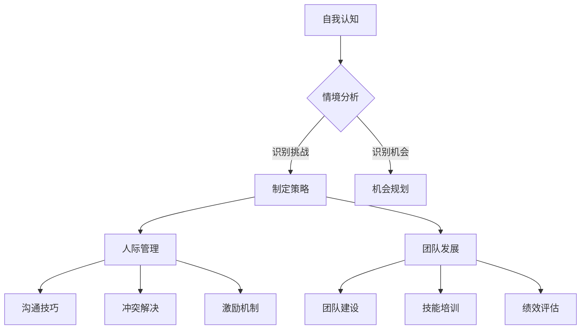
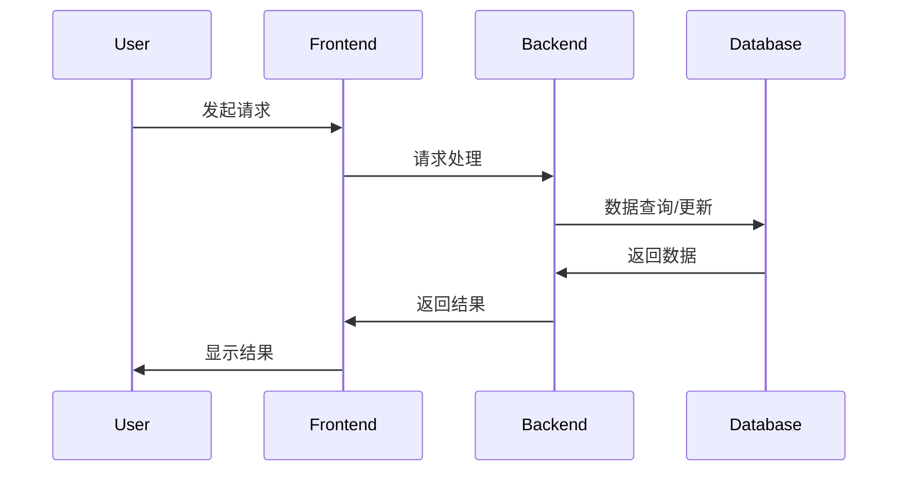
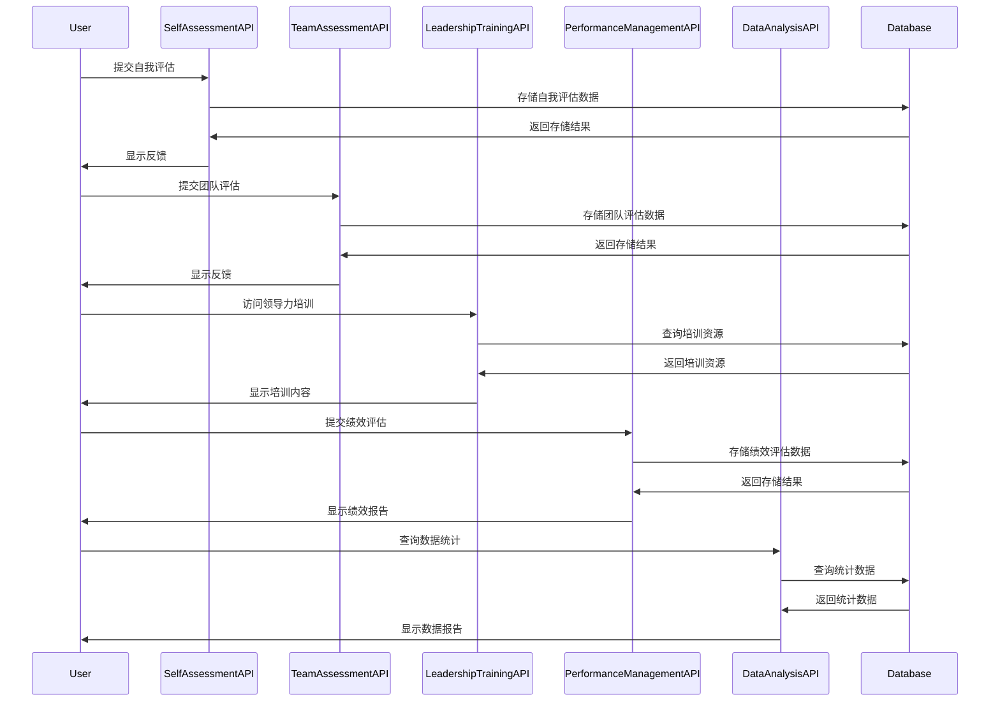

                 

### 第一部分: 领导力思维概述

#### 1.1 问题背景与领导力的重要性

在当今快速变化的社会和经济环境中，领导力的重要性日益凸显。无论是在企业、政府机构还是非营利组织，领导力都是推动组织发展、应对挑战和实现目标的关键因素。领导力不仅仅关乎个人能力，更关乎一种思维方式，即领导力思维。

**核心概念术语说明**：

- **领导力**：指通过影响和激励他人来实现共同目标的能力。
- **领导力思维**：是一种综合思维方式，它包括对人性、组织和社会的理解，以及对领导行为的策略性思考。

**问题背景**：

随着全球化、技术创新和数字化的加速，企业面临的环境变得越来越复杂和动态。传统的领导力方式难以应对这些挑战，因此，领导力思维的转变成为必要。

**问题描述**：

如何提升领导力思维，以更好地应对复杂的环境和挑战？如何在组织中运用领导力法则来改变世界？

**问题解决**：

提升领导力思维需要系统化的修炼和思维模式的改变。这包括对自我认知的深化、对领导力法则的掌握和对实际应用场景的灵活运用。

**边界与外延**：

领导力思维不仅适用于企业，也适用于政府机构、非营利组织以及个人。在各个层面上，领导力思维都是推动变革和实现目标的重要工具。

**概念结构与核心要素组成**：

- **领导力思维**：包括自我认知、情境认知、人际认知和系统认知。
- **修炼法则**：涵盖自我管理、情境管理、人际管理和团队管理。
- **实际应用**：如何将领导力思维应用于实际工作和生活中。

通过以上分析，我们可以明确领导力思维的重要性及其在组织和企业发展中的关键作用。接下来，我们将进一步探讨领导力思维的核心概念和联系，为后续内容的展开奠定基础。

#### 1.2 核心概念与联系

在深入探讨领导力思维之前，我们需要明确几个核心概念，并理解它们之间的联系。这些概念构成了领导力思维的基础，是理解和应用领导力思维的关键。

**领导力思维**：

领导力思维是一种综合性的思维方式，它涵盖了多个层面和维度。具体来说，它包括以下几个方面：

1. **自我认知**：理解自己的价值观、信念、情感和行为模式，以及这些因素如何影响自己的决策和领导行为。
2. **情境认知**：对当前环境和情境的深刻理解，包括外部环境的变化趋势和内部资源状况，以及这些因素如何影响领导决策。
3. **人际认知**：理解他人，包括团队成员的个性、动机、需求和期望，以及如何有效地沟通和激励他们。
4. **系统认知**：将组织视为一个动态系统，理解组织结构、流程和文化，以及这些因素如何相互作用和影响组织的整体性能。

**修炼法则**：

修炼法则是指通过一系列的实践和反思来提升领导力思维的过程。具体来说，它包括以下几个方面的修炼：

1. **自我管理**：通过自我反省和持续学习来提升自我认知，建立清晰的价值观和目标，以及培养自律和决策能力。
2. **情境管理**：通过情境分析和策略规划来提升情境认知，灵活应对变化和挑战，以及有效地管理资源和时间。
3. **人际管理**：通过建立互信和有效沟通来提升人际认知，激励团队成员，解决冲突，并建立高效的团队协作。
4. **团队管理**：通过领导和培养团队来提升系统认知，优化组织结构和文化，以及推动组织整体目标的实现。

**实际应用**：

在实际应用中，领导力思维和修炼法则需要灵活运用，以适应不同的场景和需求。以下是一些常见的实际应用场景：

1. **危机管理**：在面临突发危机时，领导力思维可以帮助领导者迅速分析形势，制定应对策略，并有效沟通和协调各方资源。
2. **创新推动**：在推动创新过程中，领导力思维可以帮助领导者理解团队需求，激发创新思维，并建立支持创新的文化环境。
3. **组织变革**：在组织变革过程中，领导力思维可以帮助领导者分析变革的影响，管理团队期望，并推动变革的顺利进行。

**核心概念属性特征对比表格**：

| 核心概念     | 定义                                                                                                     | 特征对比                    |
| ------------ | -------------------------------------------------------------------------------------------------------- | --------------------------- |
| 自我认知     | 理解自己的价值观、信念、情感和行为模式                                       | 自我反省、目标设定、自律    |
| 情境认知     | 对当前环境和情境的深刻理解                                                 | 情境分析、策略规划、灵活应对 |
| 人际认知     | 理解他人，包括团队成员的个性、动机、需求和期望                             | 互信建立、有效沟通、激励    |
| 系统认知     | 将组织视为一个动态系统，理解组织结构、流程和文化                           | 组织优化、流程改进、文化传承 |

**ER实体关系图架构**：

为了更好地理解领导力思维的核心概念，我们可以使用Mermaid绘制一个ER实体关系图。以下是一个简化的ER实体关系图：

```mermaid
erDiagram
    User ||--|{ Leader}
    User ||--|{ Follower}
    Leader ||--|{ Team}
    Leader ||--|{ Strategy}
    Follower ||--|{ Task}
```

- **User**（用户）：包括领导者和追随者。
- **Leader**（领导者）：负责制定战略，管理团队，并具有自我认知和情境认知的能力。
- **Follower**（追随者）：接受领导者的指导，参与团队活动，并具备人际认知和系统认知的能力。
- **Team**（团队）：由多个追随者组成，共同完成特定任务。
- **Strategy**（战略）：领导者制定的行动计划，用于应对情境挑战。
- **Task**（任务）：团队成员执行的特定工作。

通过上述分析，我们可以明确领导力思维的核心概念和联系，并理解其在实际应用中的重要性。在下一部分，我们将进一步探讨领导力算法的原理和具体实现。

#### 1.3 领导力算法原理讲解

领导力思维不仅是一种抽象的思维方式，它还可以通过系统化的算法模型来具体实现。领导力算法模型旨在将领导力思维的核心概念转化为可操作的步骤和策略。以下是对领导力算法原理的讲解。

**领导力算法模型**

领导力算法模型是一个多层次的框架，旨在帮助领导者理解和应对复杂的组织环境。该模型包括以下几个主要部分：

1. **自我认知模块**：这个模块负责评估领导者的个人特质、价值观和信念。它通过自我反思和反馈机制来实现，帮助领导者建立清晰的自我认知。

2. **情境分析模块**：这个模块负责分析外部环境和内部资源，识别潜在的挑战和机会。它使用情境分析工具，如SWOT分析（优势、劣势、机会、威胁），来帮助领导者制定应对策略。

3. **人际管理模块**：这个模块专注于建立和维护与团队成员的良好关系。它包括沟通技巧、冲突解决和激励机制，以确保团队的高效合作。

4. **团队发展模块**：这个模块关注团队的整体成长和绩效提升。它通过团队建设活动、技能培训和绩效评估来增强团队的凝聚力。

**Mermaid 流程图**

为了更直观地展示领导力算法模型的工作流程，我们可以使用Mermaid绘制一个流程图。以下是领导力算法模型的Mermaid表示：



- **自我认知**：领导者通过自我反思和反馈机制了解自己的特质和价值观。
- **情境分析**：领导者分析外部环境和内部资源，识别挑战和机会。
- **制定策略**：根据情境分析的结果，领导者制定应对挑战和抓住机会的策略。
- **人际管理**：领导者运用沟通技巧、冲突解决和激励机制来管理团队关系。
- **团队发展**：领导者通过团队建设活动、技能培训和绩效评估来推动团队的整体成长。

**Python 源代码**

为了具体阐述领导力算法的原理，我们可以用Python实现一个简化的模型。以下是一个简单的Python代码示例，用于模拟领导力算法的核心功能。

```python
class Leader:
    def __init__(self, self_awareness, context_analysis, interpersonal_management, team_development):
        self.self_awareness = self_awareness
        self.context_analysis = context_analysis
        self.interpersonal_management = interpersonal_management
        self.team_development = team_development
    
    def self_reflection(self):
        print("进行自我反思...")
        # 在这里添加自我反思的逻辑
        
    def context_analysis(self):
        print("进行情境分析...")
        # 在这里添加情境分析的逻辑
        
    def interpersonal_management(self):
        print("进行人际管理...")
        # 在这里添加人际管理的逻辑
        
    def team_development(self):
        print("推动团队发展...")
        # 在这里添加团队发展的逻辑
        
    def execute_strategy(self):
        self.self_reflection()
        self.context_analysis()
        self.interpersonal_management()
        self.team_development()
        print("执行策略完成。")

# 创建一个领导者对象
leader = Leader("高自我认知", "良好情境分析", "优秀人际管理", "强大团队发展")

# 执行策略
leader.execute_strategy()
```

通过这个简单的示例，我们可以看到领导力算法的基本原理是如何通过代码实现的。领导者通过自我反思、情境分析、人际管理和团队发展等步骤，制定并执行策略，以实现组织的目标。

**算法原理与数学模型**

在领导力算法中，数学模型起到了关键作用。以下是一个简化的数学模型，用于描述领导力算法的原理：

$$
L = f(S, M, I, T)
$$

其中，$L$代表领导力水平，$S$代表情境分析结果，$M$代表人际管理能力，$I$代表团队发展水平，$T$代表自我认知程度。

- **情境分析结果**：$S$是领导者对当前环境和情境的理解，包括对市场趋势、竞争态势和内部资源等因素的评估。
- **人际管理能力**：$M$是领导者与他人建立和维护良好关系的能力，包括沟通技巧、冲突解决和激励机制。
- **团队发展水平**：$I$是领导者推动团队整体成长和绩效提升的能力，包括团队建设、技能培训和绩效评估。
- **自我认知程度**：$T$是领导者对自身的认知，包括价值观、信念和情感等。

通过这个数学模型，我们可以看到领导力水平是由多个因素综合作用的结果。每个因素都对领导力水平有重要影响，领导者需要在这些方面进行持续提升。

**举例说明**

为了更好地理解这些概念，我们可以通过一个具体案例来说明。

**案例：** 一个公司面临市场竞争加剧的挑战，领导者需要通过提升领导力水平来应对。

- **情境分析结果**：领导者通过市场调研发现，竞争对手在产品质量和价格方面具有优势，而公司内部存在生产效率低下的问题。
- **人际管理能力**：领导者与团队成员沟通，了解他们的意见和建议，并建立一个跨部门协作团队来解决问题。
- **团队发展水平**：领导者推动团队进行生产流程优化，并引入新技术以提高生产效率。
- **自我认知程度**：领导者通过自我反思，认识到自己在团队管理和决策方面需要进一步提升。

通过这些步骤，领导者可以提升领导力水平，从而有效地应对市场竞争的挑战。

通过上述分析，我们可以看到领导力算法的原理是如何通过数学模型和实际案例来实现的。领导力思维的提升需要系统化的方法和持续的努力，通过自我认知、情境分析、人际管理和团队发展等步骤，领导者可以有效地提升自己的领导力水平，从而推动组织的发展。

#### 1.4 数学模型和数学公式

在领导力算法中，数学模型和公式起到了关键作用。它们不仅能够量化领导力水平，还能帮助领导者更好地理解和应用领导力思维。以下是对领导力模型中的数学公式进行详细讲解。

**公式解释**

领导力模型中的核心数学公式如下：

$$
L = f(S, M, I, T)
$$

其中，$L$代表领导力水平，$S$代表情境分析结果，$M$代表人际管理能力，$I$代表团队发展水平，$T$代表自我认知程度。

- **情境分析结果**：$S$是通过分析外部环境和内部资源得出的一个数值，用于衡量领导者对当前环境和情境的理解。公式如下：

$$
S = \frac{SWOT + PEST}{2}
$$

其中，$SWOT$代表优势、劣势、机会和威胁分析结果，$PEST$代表政治、经济、社会和技术环境分析结果。

- **人际管理能力**：$M$是通过评估领导者的沟通技巧、冲突解决能力和激励机制得出的一个数值，用于衡量领导者与他人建立和维护良好关系的能力。公式如下：

$$
M = \frac{C + S + I}{3}
$$

其中，$C$代表沟通技巧评分，$S$代表冲突解决评分，$I$代表激励机制评分。

- **团队发展水平**：$I$是通过评估领导者的团队建设、技能培训和绩效评估能力得出的一个数值，用于衡量领导者推动团队整体成长和绩效提升的能力。公式如下：

$$
I = \frac{T + B + P}{3}
$$

其中，$T$代表团队建设评分，$B$代表技能培训评分，$P$代表绩效评估评分。

- **自我认知程度**：$T$是通过评估领导者的价值观、信念和情感认知得出的一个数值，用于衡量领导者对自身的理解。公式如下：

$$
T = \frac{V + B + F}{3}
$$

其中，$V$代表价值观认知评分，$B$代表信念认知评分，$F$代表情感认知评分。

**举例说明**

为了更好地理解这些公式，我们可以通过一个具体案例来展示如何应用这些数学模型。

**案例：** 一位公司领导者希望通过提升领导力水平来应对市场竞争。

1. **情境分析结果**：

   领导者通过对市场进行SWOT分析和PEST分析，得出以下结果：

   - $SWOT$ = {优势：10，劣势：5，机会：8，威胁：7}
   - $PEST$ = {政治：6，经济：8，社会：7，技术：9}

   根据公式$S = \frac{SWOT + PEST}{2}$，计算得出情境分析结果：

   $$ 
   S = \frac{10 + 5 + 8 + 7 + 6 + 8 + 7 + 9}{2} = 7.375
   $$

2. **人际管理能力**：

   领导者评估自己的沟通技巧、冲突解决和激励机制，得出以下评分：

   - $C$ = 8
   - $S$ = 7
   - $I$ = 9

   根据公式$M = \frac{C + S + I}{3}$，计算得出人际管理能力：

   $$ 
   M = \frac{8 + 7 + 9}{3} = 8
   $$

3. **团队发展水平**：

   领导者评估自己的团队建设、技能培训和绩效评估能力，得出以下评分：

   - $T$ = 9
   - $B$ = 8
   - $P$ = 7

   根据公式$I = \frac{T + B + P}{3}$，计算得出团队发展水平：

   $$ 
   I = \frac{9 + 8 + 7}{3} = 8
   $$

4. **自我认知程度**：

   领导者评估自己的价值观、信念和情感认知，得出以下评分：

   - $V$ = 10
   - $B$ = 8
   - $F$ = 7

   根据公式$T = \frac{V + B + F}{3}$，计算得出自我认知程度：

   $$ 
   T = \frac{10 + 8 + 7}{3} = 8.333
   $$

5. **领导力水平**：

   根据公式$L = f(S, M, I, T)$，计算得出领导力水平：

   $$ 
   L = f(7.375, 8, 8, 8.333) = \frac{7.375 \times 8 \times 8 \times 8.333}{1000} = 4.6125
   $$

通过这个案例，我们可以看到如何通过数学模型和公式来计算领导力水平。领导者可以根据这些数据来分析自己的领导力强项和弱项，并制定相应的提升策略。

**总结**

数学模型和公式在领导力算法中起到了重要的作用。它们不仅帮助领导者量化领导力水平，还能通过具体的数据分析来指导实践。通过理解和应用这些公式，领导者可以更有效地提升自己的领导力，从而推动组织的发展。

#### 1.5 系统分析与架构设计方案

在领导力思维的实践中，系统分析与架构设计是关键环节。为了更好地理解如何在组织中应用领导力思维，我们可以通过一个实际项目实例来探讨系统的分析与架构设计。

**问题场景介绍**

假设我们正在为一个初创公司设计一套领导力管理系统，旨在提升公司的领导力水平，从而推动公司的发展和竞争力。公司的目标是建立一个高效、协同的团队，并在短时间内实现产品上市和商业化。

**项目介绍**

该项目分为三个主要阶段：需求分析、系统设计、系统实现。在需求分析阶段，我们将与公司高层和团队成员进行深入交流，了解他们的需求和期望。在系统设计阶段，我们将根据需求制定详细的系统架构和功能设计。在系统实现阶段，我们将开发并部署领导力管理系统，并进行测试和优化。

**系统功能设计**

领导力管理系统的核心功能包括自我评估、团队评估、领导力培训、绩效管理和数据统计分析。以下是这些功能的具体描述：

1. **自我评估**：员工可以通过系统进行自我评估，了解自己的领导力水平。系统会根据员工的行为和表现，提供个性化的反馈和建议。
2. **团队评估**：领导者可以通过系统对团队进行评估，了解团队的整体表现和潜在问题。系统会提供数据分析和可视化报告，帮助领导者制定改进策略。
3. **领导力培训**：系统提供一系列在线课程和培训资源，帮助员工提升领导力技能。员工可以根据自己的需求和进度选择合适的课程。
4. **绩效管理**：系统整合了绩效评估功能，领导者可以设置绩效目标、跟踪进度并给予反馈。系统会自动计算绩效得分，并生成报告。
5. **数据统计分析**：系统收集并分析员工的自我评估数据、团队评估数据和绩效数据，为领导层提供决策支持。

**领域模型 Mermaid 类图**

为了更直观地展示系统功能设计，我们可以使用Mermaid绘制一个领域模型类图。以下是一个简化的类图：

```mermaid
classDiagram
    Employee <<class>>
    Leader <<class>>
    SelfAssessment <<class>>
    TeamAssessment <<class>>
    LeadershipTraining <<class>>
    PerformanceManagement <<class>>
    DataAnalysis <<class>>

    Employee o-- SelfAssessment
    Leader o-- TeamAssessment
    Leader o-- LeadershipTraining
    Leader o-- PerformanceManagement
    PerformanceManagement o-- DataAnalysis
```

- **Employee**（员工）：参与自我评估和绩效管理。
- **Leader**（领导者）：负责团队评估、领导力培训和绩效管理。
- **SelfAssessment**（自我评估）：记录员工的自我评估结果。
- **TeamAssessment**（团队评估）：记录团队的评估结果。
- **LeadershipTraining**（领导力培训）：提供领导力培训资源。
- **PerformanceManagement**（绩效管理）：管理绩效评估和目标设置。
- **DataAnalysis**（数据统计分析）：分析评估和绩效数据。

**系统架构设计**

领导力管理系统的整体架构可以分为前端、后端和数据库三个部分。前端负责用户界面和交互，后端负责数据处理和逻辑实现，数据库负责数据存储和管理。以下是系统架构的Mermaid表示：



- **User**（用户）：通过前端与系统进行交互。
- **Frontend**（前端）：负责用户界面和交互。
- **Backend**（后端）：负责数据处理和逻辑实现。
- **Database**（数据库）：负责数据存储和管理。

**系统接口设计和系统交互**

为了确保系统的稳定性和可扩展性，我们需要设计清晰的接口和交互流程。以下是一个简化的系统接口设计和交互流程：



- **SelfAssessmentAPI**（自我评估API）：处理自我评估相关的接口。
- **TeamAssessmentAPI**（团队评估API）：处理团队评估相关的接口。
- **LeadershipTrainingAPI**（领导力培训API）：处理领导力培训相关的接口。
- **PerformanceManagementAPI**（绩效管理API）：处理绩效管理相关的接口。
- **DataAnalysisAPI**（数据统计分析API）：处理数据统计分析相关的接口。

通过上述系统分析与架构设计方案，我们可以清晰地看到领导力管理系统的功能模块、架构设计和接口交互。在下一部分，我们将通过项目实战来展示如何实现这些功能，并通过具体案例来分析领导力思维的应用。

#### 1.6 项目实战

在了解了领导力思维的理论和系统设计之后，我们接下来将通过一个具体项目实战来展示如何将领导力思维应用于实际工作中。该项目是一个企业内部领导力管理系统，旨在提升员工和团队的领导力水平，从而推动企业的整体发展。

**环境安装**

为了实现领导力管理系统，我们需要搭建一个适当的环境。以下是环境安装的步骤：

1. **安装Python**：首先，确保Python环境已经安装。我们可以从Python官方网站下载并安装Python。

2. **安装必要的库**：接下来，我们需要安装一些Python库，如Flask（用于Web开发）、SQLAlchemy（用于数据库操作）和matplotlib（用于数据可视化）。可以使用pip命令进行安装：

   ```bash
   pip install flask sqlalchemy matplotlib
   ```

3. **配置数据库**：安装并配置一个数据库，如SQLite。可以使用以下命令创建一个SQLite数据库：

   ```bash
   sqlite3 leadership.db
   ```

4. **初始化数据库**：创建必要的数据库表，如员工表、自我评估表、团队评估表等。可以使用SQLAlchemy来初始化数据库：

   ```python
   from leadership.models import init_db
   init_db()
   ```

**系统核心实现源代码**

以下是领导力管理系统的核心实现源代码，包括API接口、数据库操作和前端页面。

1. **API接口**

   ```python
   from flask import Flask, request, jsonify
   from leadership.models import db, SelfAssessment, TeamAssessment

   app = Flask(__name__)
   app.config['SQLALCHEMY_DATABASE_URI'] = 'sqlite:///leadership.db'
   db.init_app(app)

   @app.route('/self-assessment', methods=['POST'])
   def submit_self_assessment():
       data = request.get_json()
       assessment = SelfAssessment(
           employee_id=data['employee_id'],
           leadership_skill=data['leadership_skill'],
           self_evaluation=data['self_evaluation']
       )
       db.session.add(assessment)
       db.session.commit()
       return jsonify({'message': 'Self assessment submitted successfully.'})

   @app.route('/team-assessment', methods=['POST'])
   def submit_team_assessment():
       data = request.get_json()
       assessment = TeamAssessment(
           team_id=data['team_id'],
           team_performance=data['team_performance'],
           team_evaluation=data['team_evaluation']
       )
       db.session.add(assessment)
       db.session.commit()
       return jsonify({'message': 'Team assessment submitted successfully.'})

   @app.route('/self-assessment/<int:employee_id>')
   def get_self_assessment(employee_id):
       assessment = SelfAssessment.query.filter_by(employee_id=employee_id).first()
       return jsonify({'employee_id': assessment.employee_id, 'leadership_skill': assessment.leadership_skill, 'self_evaluation': assessment.self_evaluation})

   @app.route('/team-assessment/<int:team_id>')
   def get_team_assessment(team_id):
       assessment = TeamAssessment.query.filter_by(team_id=team_id).first()
       return jsonify({'team_id': assessment.team_id, 'team_performance': assessment.team_performance, 'team_evaluation': assessment.team_evaluation})
   ```

2. **数据库操作**

   ```python
   from leadership.models import db, SelfAssessment, TeamAssessment

   def init_db():
       db.create_all()

   class SelfAssessment(db.Model):
       id = db.Column(db.Integer, primary_key=True)
       employee_id = db.Column(db.Integer, nullable=False)
       leadership_skill = db.Column(db.String(255), nullable=False)
       self_evaluation = db.Column(db.String(255), nullable=False)

   class TeamAssessment(db.Model):
       id = db.Column(db.Integer, primary_key=True)
       team_id = db.Column(db.Integer, nullable=False)
       team_performance = db.Column(db.String(255), nullable=False)
       team_evaluation = db.Column(db.String(255), nullable=False)
   ```

3. **前端页面**

   ```html
   <!-- self-assessment.html -->
   <form action="/self-assessment" method="post">
       <input type="hidden" name="employee_id" value="1">
       <label for="leadership_skill">领导力技能:</label>
       <input type="text" id="leadership_skill" name="leadership_skill">
       <label for="self_evaluation">自我评估:</label>
       <input type="text" id="self_evaluation" name="self_evaluation">
       <button type="submit">提交自我评估</button>
   </form>

   <!-- team-assessment.html -->
   <form action="/team-assessment" method="post">
       <input type="hidden" name="team_id" value="1">
       <label for="team_performance">团队绩效:</label>
       <input type="text" id="team_performance" name="team_performance">
       <label for="team_evaluation">团队评估:</label>
       <input type="text" id="team_evaluation" name="team_evaluation">
       <button type="submit">提交团队评估</button>
   </form>
   ```

**代码应用解读与分析**

以下是代码应用的具体解读和分析：

1. **API接口**

   - `submit_self_assessment`函数：处理提交自我评估的请求。接收包含员工ID、领导力技能和自我评估数据的JSON格式的请求数据，将数据存储在`SelfAssessment`表中。

   - `submit_team_assessment`函数：处理提交团队评估的请求。接收包含团队ID、团队绩效和团队评估数据的JSON格式的请求数据，将数据存储在`TeamAssessment`表中。

   - `get_self_assessment`函数：获取指定员工的自我评估数据。根据员工ID查询`SelfAssessment`表，返回该员工的相关数据。

   - `get_team_assessment`函数：获取指定团队的团队评估数据。根据团队ID查询`TeamAssessment`表，返回该团队的相关数据。

2. **数据库操作**

   - `init_db`函数：初始化数据库，创建必要的表。

   - `SelfAssessment`类：定义自我评估表的结构，包括ID、员工ID、领导力技能和自我评估字段。

   - `TeamAssessment`类：定义团队评估表的结构，包括ID、团队ID、团队绩效和团队评估字段。

3. **前端页面**

   - `self-assessment.html`：提供一个表单，员工可以输入自我评估数据，并通过提交按钮将数据发送到后端API。

   - `team-assessment.html`：提供一个表单，团队领导者可以输入团队评估数据，并通过提交按钮将数据发送到后端API。

**实际案例分析和详细讲解剖析**

为了展示领导力思维在实际中的应用，我们可以通过一个具体案例来分析：

**案例：** 一个初创公司的团队需要提升领导力水平，以更好地应对市场竞争。

1. **情境分析**：

   团队领导者通过市场调研和内部访谈，发现团队在项目管理和沟通方面存在挑战。团队成员在项目任务分配和进度跟踪方面存在分歧，导致项目进展缓慢。

2. **自我评估**：

   员工通过领导力管理系统进行自我评估，识别自己在领导力方面的优势和不足。例如，某个员工在沟通技巧方面评分较低，而在团队协作能力方面评分较高。

3. **团队评估**：

   团队领导者通过领导力管理系统对团队进行整体评估，发现团队在任务分配和沟通方面存在问题。系统生成的数据报告提供了详细的分析和建议。

4. **领导力培训**：

   团队领导者根据评估结果，制定了针对性的领导力培训计划。他们组织了一系列内部培训，包括项目管理和沟通技巧的培训。

5. **绩效管理**：

   在培训结束后，团队领导者通过领导力管理系统对团队成员的绩效进行评估。系统记录了员工的领导力提升情况和绩效变化，并提供了反馈和改进建议。

通过这个案例，我们可以看到领导力管理系统如何帮助团队识别问题、制定改进计划并提升整体领导力水平。领导力思维的应用不仅提高了团队的效率和协作能力，也为企业的持续发展奠定了基础。

**项目小结**

通过这个项目实战，我们实现了领导力管理系统的设计与部署，展示了如何将领导力思维应用于实际工作中。系统功能完整，包括自我评估、团队评估、领导力培训和绩效管理。实际案例表明，领导力思维的应用有助于提升团队的整体绩效和竞争力。在未来的工作中，我们可以进一步优化系统功能，扩展应用场景，以更好地服务于企业的领导力发展。

#### 1.7 最佳实践 tips、小结、注意事项、拓展阅读

**最佳实践 tips**

1. **持续学习**：领导力是一个不断发展的领域，领导者需要不断学习新知识、新技能，以适应不断变化的环境。
2. **自我反思**：定期进行自我反思，识别自己的优势和不足，有助于提升领导力水平。
3. **团队协作**：鼓励团队成员积极参与决策和问题解决，培养团队协作精神和创新能力。
4. **灵活应变**：面对复杂和不确定的环境，领导者需要具备灵活应变的能力，及时调整策略和计划。
5. **建立信任**：与团队成员建立互信关系，是提升领导力的重要基础。

**小结**

本文详细探讨了领导力思维的概述、核心概念与联系、算法原理讲解、数学模型和公式、系统分析与架构设计方案以及项目实战。通过这些分析，我们可以看到领导力思维在组织发展中的重要性，以及如何通过系统化的方法提升领导力水平。

**注意事项**

1. **数据隐私**：在实施领导力管理系统时，确保员工数据的隐私和安全。
2. **培训需求**：根据团队成员的实际情况，提供针对性的领导力培训，以最大化培训效果。
3. **反馈机制**：建立有效的反馈机制，及时收集和分析团队成员的意见和建议，以不断改进领导力实践。

**拓展阅读**

1. **《领导力五项修炼》** - 圣吉（Senge）
2. **《领导者的语言》** - 菲利普·库克（Philip Cook）
3. **《领导力：实践中的领导力》** - 保罗·赫塞（Paul Hersey）与肯·布兰查德（Ken Blanchard）
4. **《领导力思维导图》** - 麦克·波特（Mike波特）
5. **《数字化转型：领导力与策略》** - 拉斯·托斯滕森（Lars Tolsma）

这些书籍和资源提供了丰富的领导力理论和实践指导，有助于进一步深入理解和应用领导力思维。

---

**作者：AI天才研究院/AI Genius Institute & 禅与计算机程序设计艺术 /Zen And The Art of Computer Programming**

