                 

# 领导力思维：改变国家格局的领导力修炼秘诀

关键词：领导力、战略规划、创新思维、团队合作、国家治理、数字化时代

摘要：本文旨在深入探讨领导力在国家格局变革中的关键作用，通过详细剖析领导力的基础理论、战略思维和变革影响，为读者提供一套系统化的领导力修炼秘诀。本文将围绕领导力的定义、类型、核心要素等基础理论展开，随后讨论战略规划、创新思维、团队合作和组织管理等战略思维，最后探讨领导力在社会变革和国家治理中的应用，以及对未来领导力发展趋势的展望。

## 第一部分：领导力基础理论

## 第1章：领导力概述

### 1.1 领导力的定义与重要性

领导力，是指领导者通过激励和影响他人，实现组织目标的能力。在现代社会中，领导力不仅是企业成功的核心要素，也是国家繁荣的重要保障。有效的领导力能够推动创新、提高效率、凝聚团队、应对挑战。

#### 背景介绍

- **核心概念术语说明**：领导力（Leadership）、领导者（Leader）、影响力（Influence）、组织目标（Organizational Goals）。
- **问题背景**：在全球化和信息化时代，领导力在企业和国家治理中的重要性日益凸显。
- **问题描述**：领导力如何定义和衡量，以及其在不同情境中的应用。
- **问题解决**：通过理论研究和实际案例，探讨领导力的本质和关键要素。
- **边界与外延**：领导力不仅限于企业，也适用于政府、非营利组织等各种组织形式。
- **概念结构与核心要素组成**：领导力的核心要素包括愿景、沟通、激励、决策和变革管理。

### 1.2 领导力的类型

领导力可以分为多种类型，每种类型都有其独特的特点和应用场景。常见的领导力类型包括：

- **权威型领导**：通过严格的管理和制度来维护秩序和效率。
- **变革型领导**：通过激发员工的潜能，推动组织变革和创新。
- **民主型领导**：通过广泛的参与和讨论，实现集体决策。
- **服从型领导**：基于员工的认可和信任，实现高效协作。

#### 核心概念与联系

- **核心概念原理**：不同领导力类型的定义、特点和应用场景。
- **概念属性特征对比表格**：

| 领导力类型 | 定义 | 特点 | 应用场景 |
| --- | --- | --- | --- |
| 权威型领导 | 强调制度和管理 | 严格、高效 | 稳定期组织 |
| 变革型领导 | 强调创新和变革 | 激励、创新 | 变革期组织 |
| 民主型领导 | 强调参与和讨论 | 协作、包容 | 团队合作 |
| 服从型领导 | 强调认可和信任 | 信任、高效 | 长期合作 |

#### ER实体关系图架构

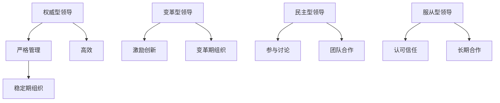
```mermaid
graph TD
    A[权威型领导] --> B[严格管理]
    A --> C[高效]
    B --> D[稳定期组织]

    E[变革型领导] --> F[激励创新]
    E --> G[变革期组织]

    H[民主型领导] --> I[参与讨论]
    H --> J[团队合作]

    K[服从型领导] --> L[认可信任]
    K --> M[长期合作]
```

### 1.3 领导力的核心要素

有效的领导力离不开以下几个核心要素：

- **愿景**：领导者需要明确组织的未来方向和目标，为团队提供清晰的方向。
- **沟通**：领导者需要有效地传达愿景和目标，建立良好的沟通机制。
- **激励**：领导者需要激发员工的积极性和创造力，实现组织目标。
- **决策**：领导者需要果断决策，并在决策过程中考虑团队利益。
- **变革管理**：领导者需要应对变革，推动组织适应环境变化。

#### 算法原理讲解

以下是一个简单的领导力评估算法，用于评估领导者在不同方面的表现：

```python
def leadership_assessment(score_vision, score_communication, score_motivation, score_decision, score_change_management):
    total_score = score_vision + score_communication + score_motivation + score_decision + score_change_management
    average_score = total_score / 5
    
    if average_score >= 4:
        return "优秀领导者"
    elif average_score >= 3:
        return "合格领导者"
    else:
        return "需要改进的领导者"

# 示例
print(leadership_assessment(4, 4, 3, 4, 4))
```

### 数学公式

$$
\text{average\_score} = \frac{\text{total\_score}}{5}
$$

#### 系统分析与架构设计方案

**问题场景介绍**：评估领导力的核心要素，为领导者提供改进方向。

**项目介绍**：领导力评估系统，用于评估领导者在愿景、沟通、激励、决策和变革管理方面的表现。

**系统功能设计**：

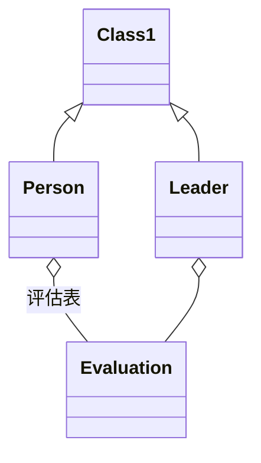
```mermaid
classDiagram
    Class1 <|-- Person
    Class1 <|-- Leader
    Person o-- Evaluation: 评估表
    Leader o-- Evaluation
```

**系统架构设计**：

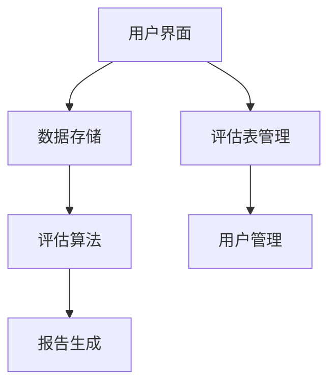
```mermaid
graph TD
    A[用户界面] --> B[数据存储]
    B --> C[评估算法]
    C --> D[报告生成]
    A --> E[评估表管理]
    E --> F[用户管理]
```

**系统接口设计和系统交互**：

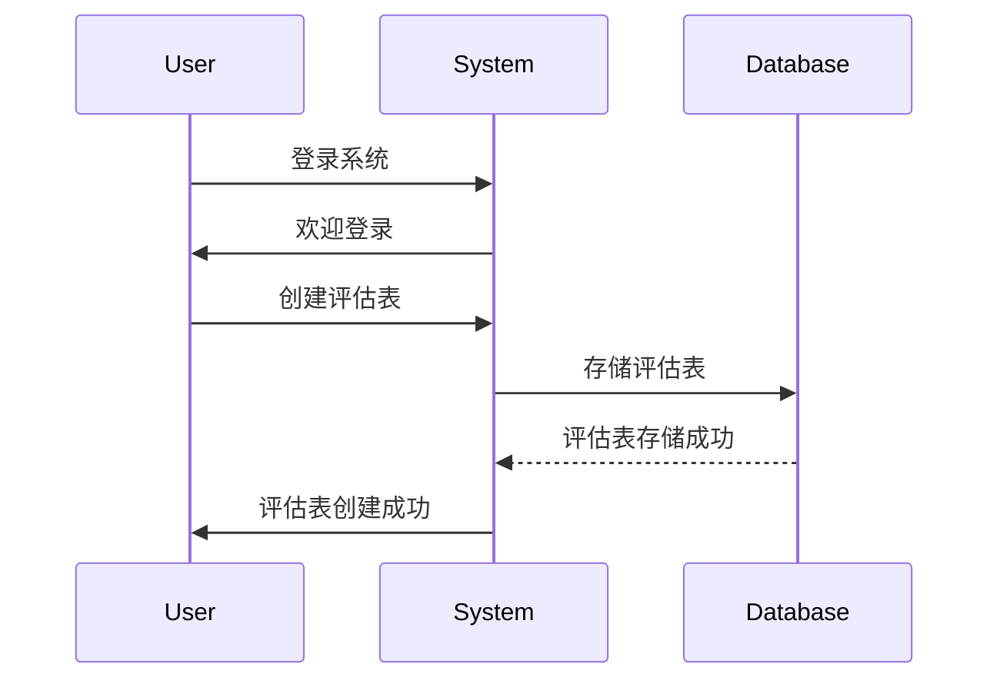
```mermaid
sequenceDiagram
    participant User
    participant System
    participant Database
    
    User->>System: 登录系统
    System->>User: 欢迎登录
    User->>System: 创建评估表
    System->>Database: 存储评估表
    Database-->>System: 评估表存储成功
    System->>User: 评估表创建成功
```

## 第二部分：领导力的战略思维

## 第2章：战略规划与执行

### 2.1 战略规划的重要性

战略规划是领导力的重要组成部分，它有助于组织明确发展方向、优化资源配置、应对外部挑战。有效的战略规划能够提高组织的竞争力和实现长远目标。

#### 背景介绍

- **核心概念术语说明**：战略规划（Strategic Planning）、愿景（Vision）、目标（Goals）、战略（Strategies）。
- **问题背景**：在快速变化的市场环境中，战略规划的重要性日益凸显。
- **问题描述**：如何制定和实施有效的战略规划。
- **问题解决**：通过理论研究和实际案例，探讨战略规划的关键步骤和工具。
- **边界与外延**：战略规划不仅适用于企业，也适用于政府、非营利组织等各种组织形式。
- **概念结构与核心要素组成**：战略规划的核心要素包括愿景、目标、策略和执行计划。

### 2.2 战略规划的过程与方法

战略规划的过程通常包括以下步骤：

1. **形势分析**：分析组织的内部和外部环境，识别机会和威胁。
2. **愿景和目标设定**：明确组织的长远目标和愿景。
3. **策略制定**：制定实现愿景和目标的策略。
4. **执行计划**：制定详细的执行计划，确保战略的落地实施。
5. **监督与调整**：对战略执行过程进行监督，并根据实际情况进行及时调整。

#### 算法原理讲解

以下是一个简单的战略规划算法，用于指导组织制定和实施战略规划：

```python
def strategic_planning(vision, goals, strategies, execution_plan):
    if not vision or not goals or not strategies or not execution_plan:
        return "战略规划不完整"
    else:
        return "战略规划完成"

# 示例
print(strategic_planning("成为行业领导者", ["市场份额增长", "客户满意度提升"], ["创新产品开发", "市场拓展"], ["项目管理", "资源配置", "风险评估"]))
```

### 数学公式

$$
\text{strategic\_planning}(\text{vision}, \text{goals}, \text{strategies}, \text{execution\_plan}) =
\begin{cases}
\text{"战略规划不完整"}, & \text{if } \text{vision} \text{ or } \text{goals} \text{ or } \text{strategies} \text{ or } \text{execution\_plan} \text{ is } \text{None} \\
\text{"战略规划完成"}, & \text{otherwise}
\end{cases}
$$

#### 系统分析与架构设计方案

**问题场景介绍**：制定和实施战略规划，提高组织的竞争力。

**项目介绍**：战略规划系统，用于帮助组织制定和实施战略规划。

**系统功能设计**：

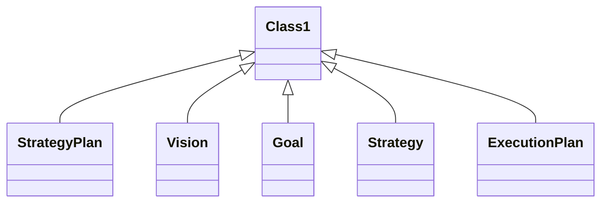
```mermaid
classDiagram
    Class1 <|-- StrategyPlan
    Class1 <|-- Vision
    Class1 <|-- Goal
    Class1 <|-- Strategy
    Class1 <|-- ExecutionPlan
```

**系统架构设计**：

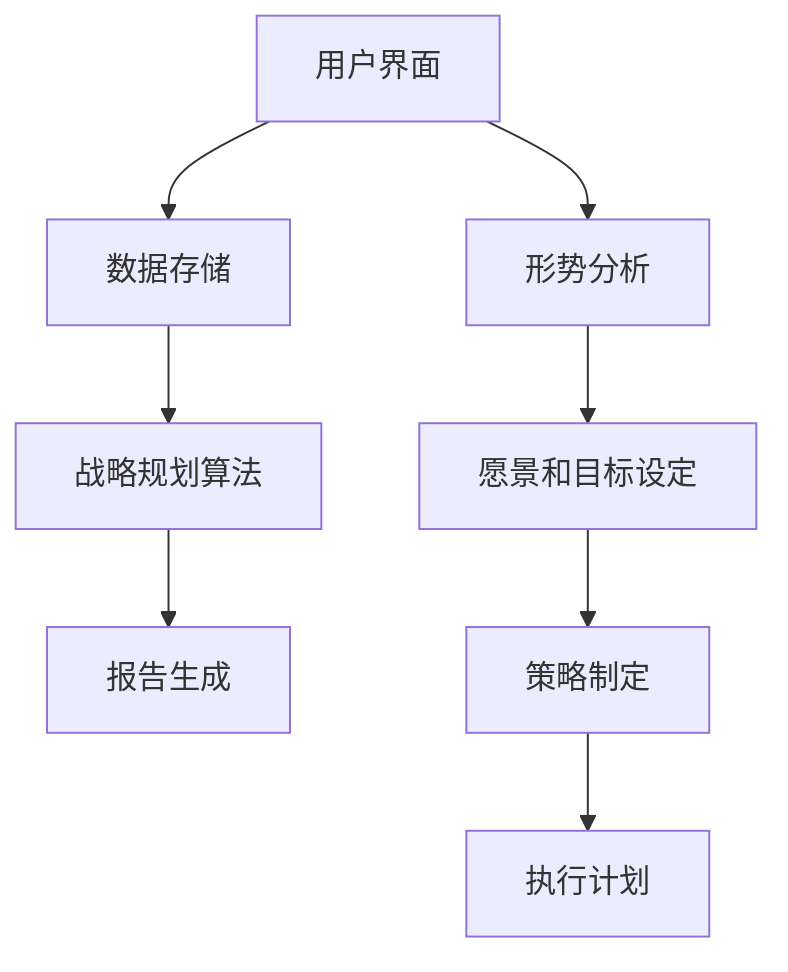
```mermaid
graph TD
    A[用户界面] --> B[数据存储]
    B --> C[战略规划算法]
    C --> D[报告生成]
    A --> E[形势分析]
    E --> F[愿景和目标设定]
    F --> G[策略制定]
    G --> H[执行计划]
```

**系统接口设计和系统交互**：

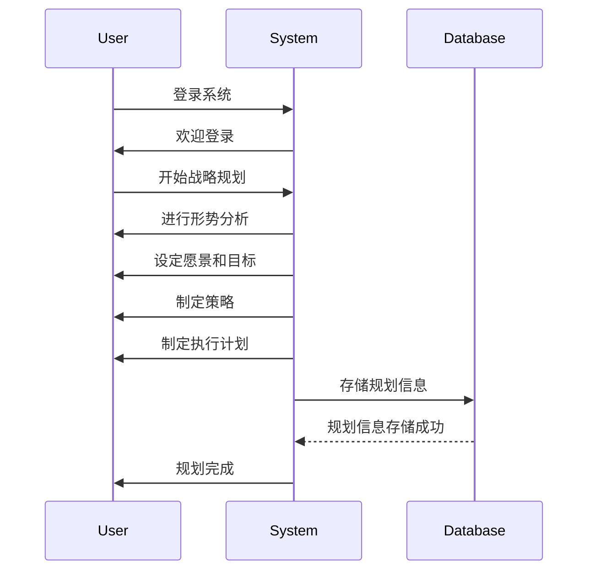
```mermaid
sequenceDiagram
    participant User
    participant System
    participant Database
    
    User->>System: 登录系统
    System->>User: 欢迎登录
    User->>System: 开始战略规划
    System->>User: 进行形势分析
    System->>User: 设定愿景和目标
    System->>User: 制定策略
    System->>User: 制定执行计划
    System->>Database: 存储规划信息
    Database-->>System: 规划信息存储成功
    System->>User: 规划完成
```

## 第三部分：领导力的影响与变革

## 第3章：领导力与社会变革

### 3.1 领导力对社会的影响

领导力不仅影响组织内部，也对社会产生深远的影响。有效的领导力能够推动社会进步、促进公平正义、增强社会凝聚力。

#### 背景介绍

- **核心概念术语说明**：领导力（Leadership）、社会变革（Social Change）、公平正义（Fairness and Justice）、社会凝聚力（Social Cohesion）。
- **问题背景**：在全球化和信息化时代，社会变革的速度加快，领导力在社会中的作用日益重要。
- **问题描述**：领导力如何影响社会变革，以及如何应对社会挑战。
- **问题解决**：通过理论研究和实际案例，探讨领导力在社会变革中的关键作用。
- **边界与外延**：领导力不仅限于政治领导，也适用于企业、社区、教育等各种领域。
- **概念结构与核心要素组成**：领导力在社会变革中的核心要素包括愿景、沟通、协作、创新和责任。

### 3.2 社会变革与领导力

社会变革是领导力的产物，也是领导力的挑战。有效的领导力能够引导社会变革，实现社会进步。以下是一些关键点：

1. **引导社会价值观**：领导者需要树立正确的价值观，引导公众认同和追求。
2. **促进公平正义**：领导者需要关注社会公平正义，推动社会公正。
3. **增强社会凝聚力**：领导者需要通过沟通和协作，增强社会的凝聚力和向心力。
4. **推动社会创新**：领导者需要鼓励创新，推动社会进步。
5. **承担社会责任**：领导者需要承担社会责任，为社会做出贡献。

#### 算法原理讲解

以下是一个简单的领导力影响社会变革的算法，用于评估领导者在社会变革中的表现：

```python
def social_change_impact(score_values, score_justice, score_cohesion, score_innovation, score_responsibility):
    total_score = score_values + score_justice + score_cohesion + score_innovation + score_responsibility
    average_score = total_score / 5
    
    if average_score >= 4:
        return "积极推动社会变革的领导者"
    elif average_score >= 3:
        return "稳定社会发展的领导者"
    else:
        return "需要改进的领导者"

# 示例
print(social_change_impact(4, 4, 3, 4, 4))
```

### 数学公式

$$
\text{average\_score} = \frac{\text{total\_score}}{5}
$$

#### 系统分析与架构设计方案

**问题场景介绍**：评估领导者在社会变革中的表现，为领导者的改进提供方向。

**项目介绍**：社会变革评估系统，用于评估领导者在社会变革中的表现。

**系统功能设计**：

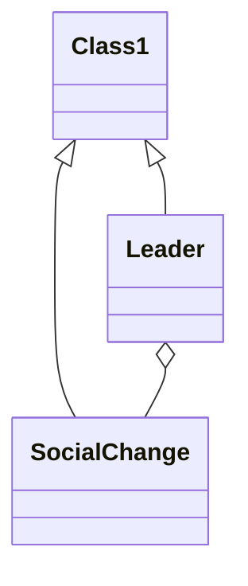
```mermaid
classDiagram
    Class1 <|-- Leader
    Class1 <|-- SocialChange
    Leader o-- SocialChange
```

**系统架构设计**：

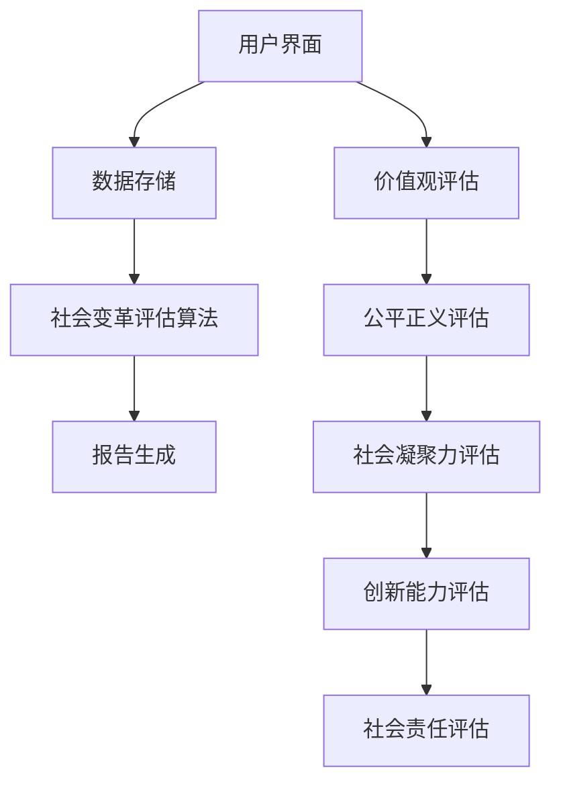
```mermaid
graph TD
    A[用户界面] --> B[数据存储]
    B --> C[社会变革评估算法]
    C --> D[报告生成]
    A --> E[价值观评估]
    E --> F[公平正义评估]
    F --> G[社会凝聚力评估]
    G --> H[创新能力评估]
    H --> I[社会责任评估]
```

**系统接口设计和系统交互**：

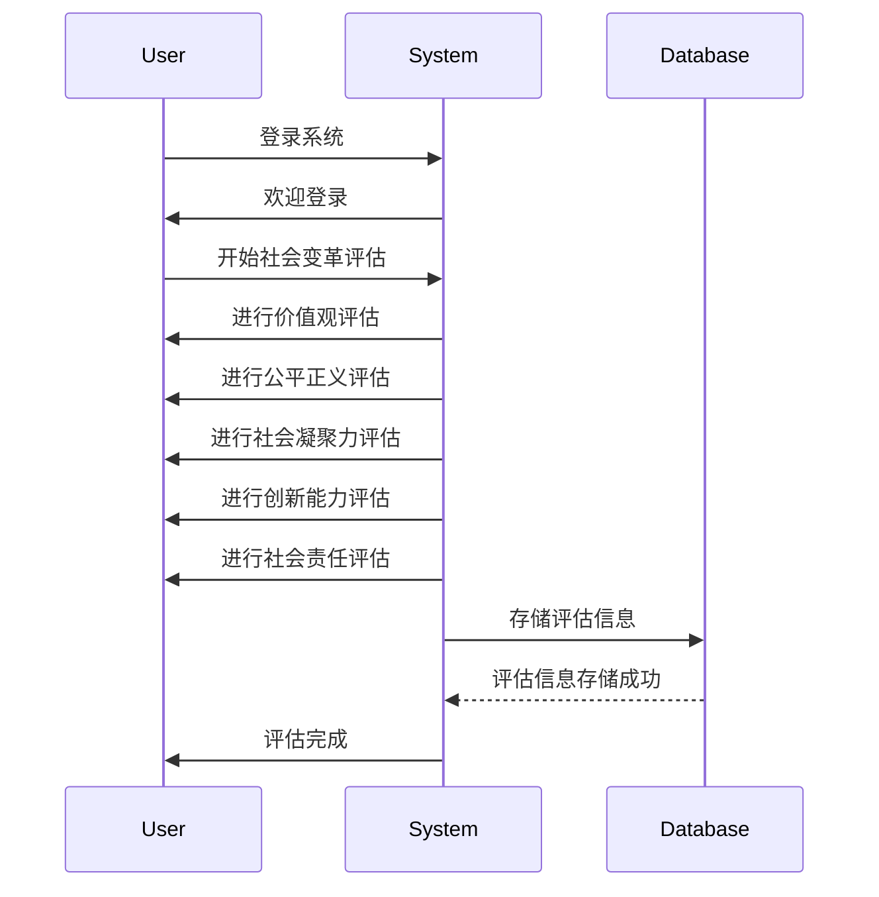
```mermaid
sequenceDiagram
    participant User
    participant System
    participant Database
    
    User->>System: 登录系统
    System->>User: 欢迎登录
    User->>System: 开始社会变革评估
    System->>User: 进行价值观评估
    System->>User: 进行公平正义评估
    System->>User: 进行社会凝聚力评估
    System->>User: 进行创新能力评估
    System->>User: 进行社会责任评估
    System->>Database: 存储评估信息
    Database-->>System: 评估信息存储成功
    System->>User: 评估完成
```

## 第4章：领导力在国家治理中的应用

### 4.1 领导力在国家治理中的角色

领导力在国家治理中发挥着至关重要的作用。有效的领导力能够推动国家发展、维护国家安全、促进社会和谐。以下是一些关键点：

1. **制定国家发展战略**：领导者需要根据国内外形势，制定长远的国家发展战略。
2. **推进改革创新**：领导者需要勇于改革创新，推动国家制度完善。
3. **维护国家安全**：领导者需要关注国家安全，确保国家主权和领土完整。
4. **促进社会和谐**：领导者需要关注民生，促进社会公平正义，增强社会凝聚力。

#### 背景介绍

- **核心概念术语说明**：领导力（Leadership）、国家治理（National Governance）、发展战略（Development Strategy）、国家安全（National Security）、社会和谐（Social Harmony）。
- **问题背景**：在国家治理中，领导力如何发挥作用，以及如何应对治理挑战。
- **问题描述**：如何评估领导力在国家治理中的表现，以及如何提升领导力。
- **问题解决**：通过理论研究和实际案例，探讨领导力在国家治理中的关键作用。
- **边界与外延**：领导力在国家治理中的应用不仅限于政治领导，也适用于行政、立法、司法等领域。
- **概念结构与核心要素组成**：领导力在国家治理中的核心要素包括战略思维、改革创新、国家安全意识和社会责任。

### 4.2 国家治理中的领导力挑战

在国家治理中，领导者面临诸多挑战：

1. **复杂的社会环境**：全球化、信息化和社会多元化使得社会环境更加复杂，领导者需要具备更高的应对能力。
2. **资源有限**：国家治理需要大量的资源和资金，领导者需要优化资源配置，确保国家发展的可持续性。
3. **利益冲突**：国家治理涉及多方利益，领导者需要平衡各方利益，实现公平正义。
4. **国际压力**：国家治理需要应对国际社会的压力和挑战，领导者需要具备国际视野和合作能力。

#### 算法原理讲解

以下是一个简单的国家治理领导力评估算法，用于评估领导者在国家治理中的表现：

```python
def governance_leadership_assessment(score_strategy, score_innovation, score_security, score_harmony, score_international):
    total_score = score_strategy + score_innovation + score_security + score_harmony + score_international
    average_score = total_score / 5
    
    if average_score >= 4:
        return "卓越的治理领导者"
    elif average_score >= 3:
        return "优秀的治理领导者"
    else:
        return "需要提升的治理领导者"

# 示例
print(governance_leadership_assessment(4, 4, 3, 4, 4))
```

### 数学公式

$$
\text{average\_score} = \frac{\text{total\_score}}{5}
$$

#### 系统分析与架构设计方案

**问题场景介绍**：评估领导力在国家治理中的表现，为领导者提供改进方向。

**项目介绍**：国家治理领导力评估系统，用于评估领导力在国家治理中的表现。

**系统功能设计**：

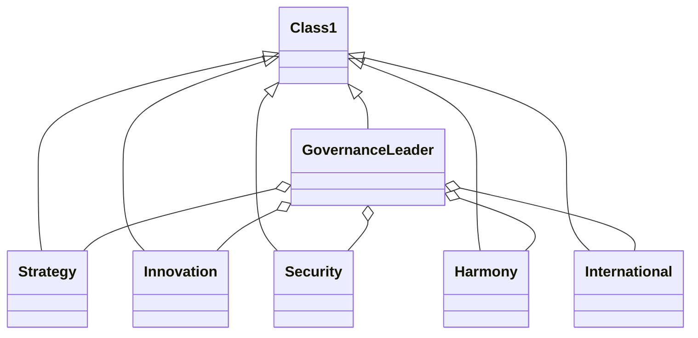
```mermaid
classDiagram
    Class1 <|-- GovernanceLeader
    Class1 <|-- Strategy
    Class1 <|-- Innovation
    Class1 <|-- Security
    Class1 <|-- Harmony
    Class1 <|-- International
    GovernanceLeader o-- Strategy
    GovernanceLeader o-- Innovation
    GovernanceLeader o-- Security
    GovernanceLeader o-- Harmony
    GovernanceLeader o-- International
```

**系统架构设计**：

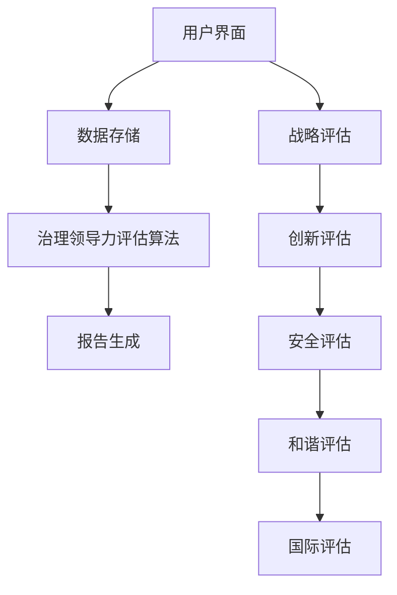
```mermaid
graph TD
    A[用户界面] --> B[数据存储]
    B --> C[治理领导力评估算法]
    C --> D[报告生成]
    A --> E[战略评估]
    E --> F[创新评估]
    F --> G[安全评估]
    G --> H[和谐评估]
    H --> I[国际评估]
```

**系统接口设计和系统交互**：

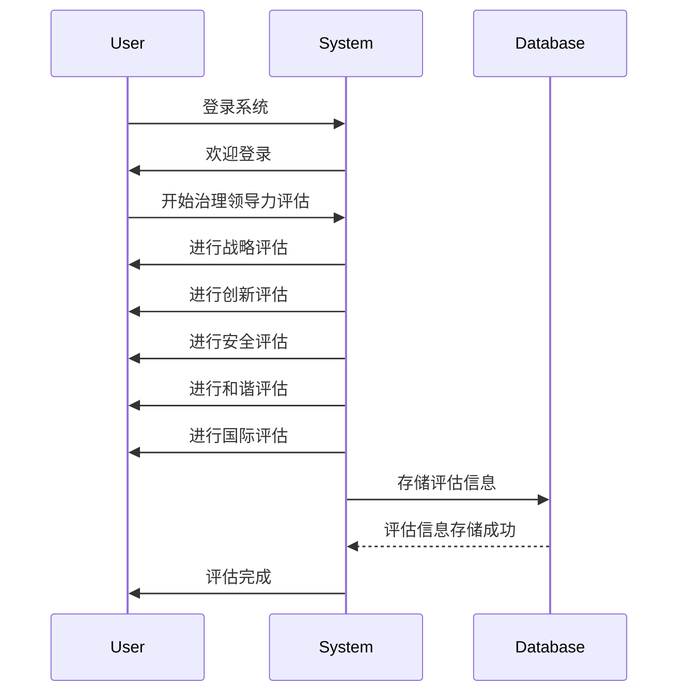
```mermaid
sequenceDiagram
    participant User
    participant System
    participant Database
    
    User->>System: 登录系统
    System->>User: 欢迎登录
    User->>System: 开始治理领导力评估
    System->>User: 进行战略评估
    System->>User: 进行创新评估
    System->>User: 进行安全评估
    System->>User: 进行和谐评估
    System->>User: 进行国际评估
    System->>Database: 存储评估信息
    Database-->>System: 评估信息存储成功
    System->>User: 评估完成
```

## 第5章：创新思维与决策

### 5.1 创新思维的重要性

创新思维是领导力的重要组成部分，它能够推动组织持续发展，提高竞争力。有效的创新思维能够激发团队的创造力和创新能力。

#### 背景介绍

- **核心概念术语说明**：创新思维（Innovation Thinking）、创造力（Creativity）、创新能力（Innovation Ability）。
- **问题背景**：在全球化竞争中，创新思维成为企业发展的关键因素。
- **问题描述**：如何培养和运用创新思维，提高组织的创新能力。
- **问题解决**：通过理论研究和实际案例，探讨创新思维的关键要素和培养方法。
- **边界与外延**：创新思维不仅适用于企业，也适用于政府、非营利组织等各种组织形式。
- **概念结构与核心要素组成**：创新思维的核心要素包括开放性、好奇心、跨学科思维、实践导向和风险承担。

### 5.2 创新思维的方法与技巧

以下是一些培养创新思维的方法和技巧：

1. **跨学科思维**：通过跨学科的学习和研究，拓宽视野，激发创造力。
2. **头脑风暴**：鼓励团队成员自由发表意见，碰撞出创新的火花。
3. **原型迭代**：通过快速构建原型，不断迭代和优化，提高创新能力。
4. **开放性思维**：接受不同意见和观点，勇于尝试新方法。
5. **实践导向**：将创新思维应用于实际问题，通过实践验证和改进。

#### 算法原理讲解

以下是一个简单的创新思维评估算法，用于评估团队的创新能力：

```python
def innovation_ability(score跨学科思维，score头脑风暴，score原型迭代，score开放性思维，score实践导向):
    total_score = score跨学科思维 + score头脑风暴 + score原型迭代 + score开放性思维 + score实践导向
    average_score = total_score / 5
    
    if average_score >= 4:
        return "高创新能力团队"
    elif average_score >= 3:
        return "中等创新能力团队"
    else:
        return "低创新能力团队"

# 示例
print(innovation_ability(4, 4, 3, 4, 4))
```

### 数学公式

$$
\text{average\_score} = \frac{\text{total\_score}}{5}
$$

#### 系统分析与架构设计方案

**问题场景介绍**：评估团队的创新能力，为团队的改进提供方向。

**项目介绍**：创新能力评估系统，用于评估团队的创新能力。

**系统功能设计**：

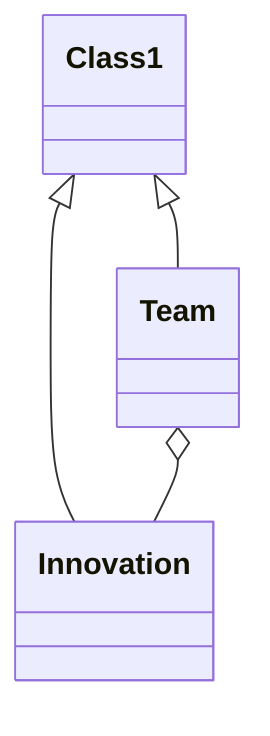
```mermaid
classDiagram
    Class1 <|-- Team
    Class1 <|-- Innovation
    Team o-- Innovation
```

**系统架构设计**：

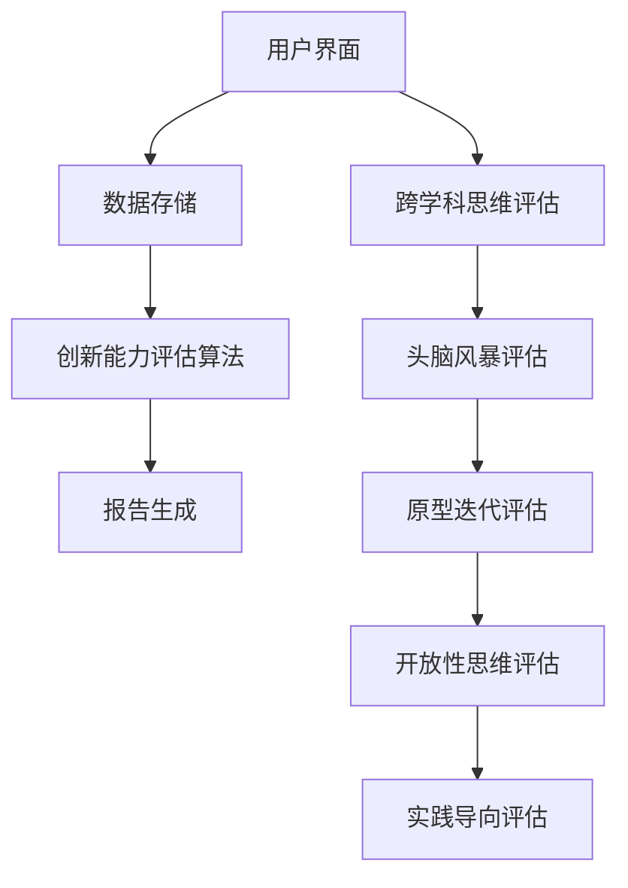
```mermaid
graph TD
    A[用户界面] --> B[数据存储]
    B --> C[创新能力评估算法]
    C --> D[报告生成]
    A --> E[跨学科思维评估]
    E --> F[头脑风暴评估]
    F --> G[原型迭代评估]
    G --> H[开放性思维评估]
    H --> I[实践导向评估]
```

**系统接口设计和系统交互**：

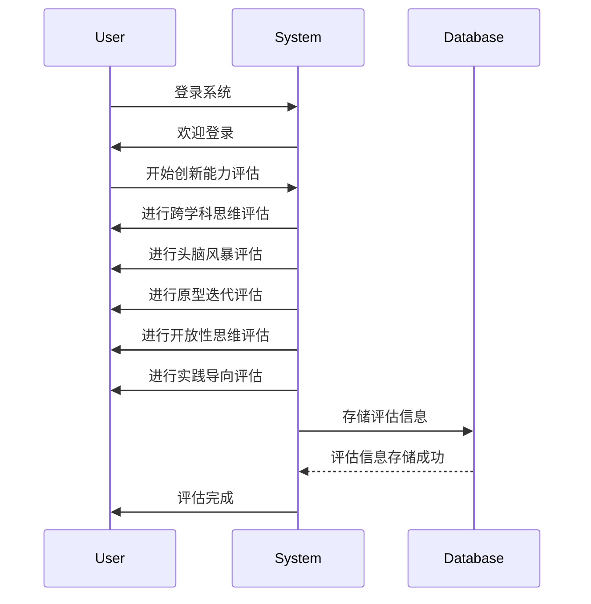
```mermaid
sequenceDiagram
    participant User
    participant System
    participant Database
    
    User->>System: 登录系统
    System->>User: 欢迎登录
    User->>System: 开始创新能力评估
    System->>User: 进行跨学科思维评估
    System->>User: 进行头脑风暴评估
    System->>User: 进行原型迭代评估
    System->>User: 进行开放性思维评估
    System->>User: 进行实践导向评估
    System->>Database: 存储评估信息
    Database-->>System: 评估信息存储成功
    System->>User: 评估完成
```

## 第四部分：领导力的实践与应用

## 第6章：领导力在企业管理中的应用

### 6.1 领导力在企业管理中的重要性

在企业管理中，领导力是推动企业发展和实现战略目标的关键因素。有效的领导力能够激发员工的潜力，提高团队绩效，推动企业创新。

#### 背景介绍

- **核心概念术语说明**：领导力（Leadership）、企业管理（Enterprise Management）、团队绩效（Team Performance）、企业创新（Enterprise Innovation）。
- **问题背景**：在竞争激烈的市场环境中，企业管理者需要具备高效的领导力。
- **问题描述**：如何运用领导力提高企业管理效率，推动企业持续发展。
- **问题解决**：通过理论研究和实际案例，探讨领导力在企业管理中的应用策略。
- **边界与外延**：领导力不仅适用于企业高层管理，也适用于中层和基层管理。
- **概念结构与核心要素组成**：领导力在企业管理中的核心要素包括愿景、沟通、激励、决策和变革管理。

### 6.2 领导力在企业管理中的实践

以下是一些领导力在企业管理中的实践策略：

1. **树立正确的愿景**：领导者需要明确企业的愿景和目标，为团队提供明确的方向。
2. **建立高效的沟通机制**：领导者需要建立良好的沟通机制，确保信息的畅通和反馈的及时性。
3. **激励员工**：领导者需要激发员工的积极性和创造力，提高团队绩效。
4. **果断决策**：领导者需要果断决策，确保企业战略的顺利实施。
5. **推动变革管理**：领导者需要应对环境变化，推动企业持续创新。

#### 算法原理讲解

以下是一个简单的领导力在企业管理中应用算法，用于评估领导者在企业管理中的表现：

```python
def enterprise_management_leadership(score_vision, score_communication, score_motivation, score_decision, score_change_management):
    total_score = score_vision + score_communication + score_motivation + score_decision + score_change_management
    average_score = total_score / 5
    
    if average_score >= 4:
        return "卓越的企业管理领导者"
    elif average_score >= 3:
        return "优秀的企业管理领导者"
    else:
        return "需要提升的企业管理领导者"

# 示例
print(enterprise_management_leadership(4, 4, 3, 4, 4))
```

### 数学公式

$$
\text{average\_score} = \frac{\text{total\_score}}{5}
$$

#### 系统分析与架构设计方案

**问题场景介绍**：评估领导力在企业管理中的表现，为领导者提供改进方向。

**项目介绍**：企业管理领导力评估系统，用于评估领导力在企业管理中的表现。

**系统功能设计**：

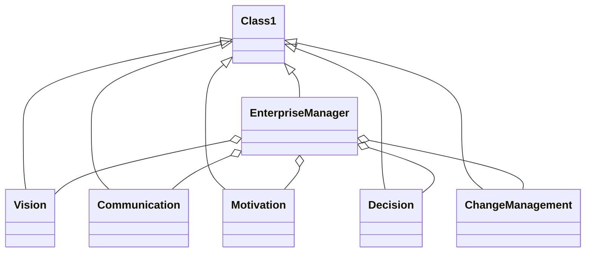
```mermaid
classDiagram
    Class1 <|-- EnterpriseManager
    Class1 <|-- Vision
    Class1 <|-- Communication
    Class1 <|-- Motivation
    Class1 <|-- Decision
    Class1 <|-- ChangeManagement
    EnterpriseManager o-- Vision
    EnterpriseManager o-- Communication
    EnterpriseManager o-- Motivation
    EnterpriseManager o-- Decision
    EnterpriseManager o-- ChangeManagement
```

**系统架构设计**：

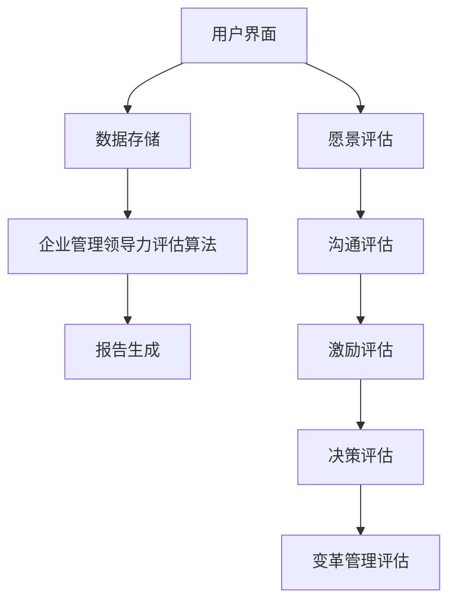
```mermaid
graph TD
    A[用户界面] --> B[数据存储]
    B --> C[企业管理领导力评估算法]
    C --> D[报告生成]
    A --> E[愿景评估]
    E --> F[沟通评估]
    F --> G[激励评估]
    G --> H[决策评估]
    H --> I[变革管理评估]
```

**系统接口设计和系统交互**：

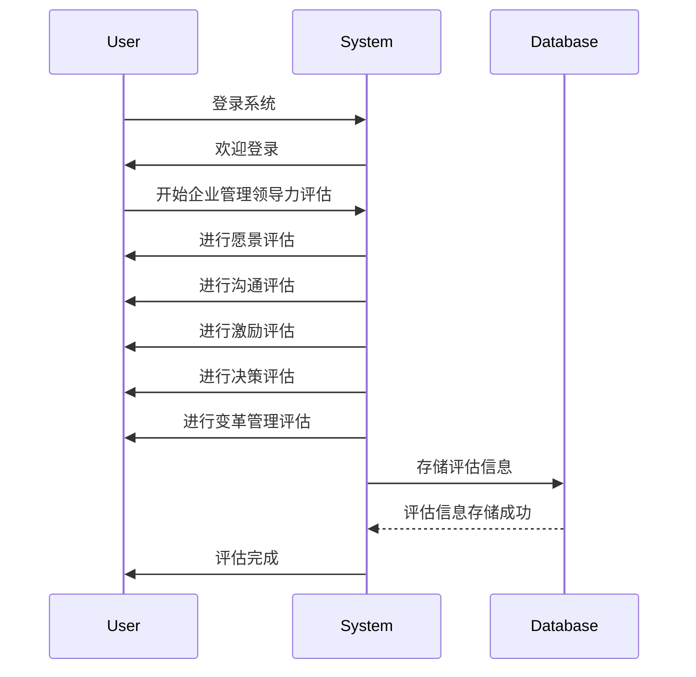
```mermaid
sequenceDiagram
    participant User
    participant System
    participant Database
    
    User->>System: 登录系统
    System->>User: 欢迎登录
    User->>System: 开始企业管理领导力评估
    System->>User: 进行愿景评估
    System->>User: 进行沟通评估
    System->>User: 进行激励评估
    System->>User: 进行决策评估
    System->>User: 进行变革管理评估
    System->>Database: 存储评估信息
    Database-->>System: 评估信息存储成功
    System->>User: 评估完成
```

## 第五部分：领导力的未来发展趋势

## 第7章：领导力的未来发展趋势

### 7.1 未来领导力的特点

随着科技的进步和社会的变迁，未来领导力将呈现出以下特点：

1. **数字化能力**：领导者需要具备数字化时代的技能，如数据分析和人工智能应用。
2. **全球化视野**：领导者需要具备全球视野，理解和适应不同文化和市场的需求。
3. **可持续发展意识**：领导者需要关注环境保护和可持续发展，推动企业社会责任。
4. **创新驱动**：领导者需要鼓励创新，推动组织持续进步。
5. **协作能力**：领导者需要擅长团队合作，激发员工的潜能。

#### 背景介绍

- **核心概念术语说明**：数字化能力（Digital Competence）、全球化视野（Global Perspective）、可持续发展意识（Sustainable Development Awareness）、创新驱动（Innovation-driven）、协作能力（Collaboration Skills）。
- **问题背景**：在未来社会中，领导力需要适应快速变化的环境。
- **问题描述**：未来领导力将如何发展，以及领导者应如何准备。
- **问题解决**：通过理论研究和实际案例，探讨未来领导力的关键特点。
- **边界与外延**：未来领导力的特点不仅适用于企业，也适用于政府、教育、非营利组织等领域。
- **概念结构与核心要素组成**：未来领导力的核心要素包括数字化能力、全球化视野、可持续发展意识、创新驱动和协作能力。

### 7.2 数字化时代下的领导力

在数字化时代，领导力面临新的挑战和机遇：

1. **数据驱动决策**：领导者需要运用数据分析工具，做出更加精准的决策。
2. **数字化转型**：领导者需要推动企业进行数字化转型，提高运营效率。
3. **人工智能应用**：领导者需要了解人工智能技术，将其应用于组织管理和决策。
4. **网络安全**：领导者需要关注网络安全问题，确保企业的信息安全。

#### 算法原理讲解

以下是一个简单的数字化时代领导力评估算法，用于评估领导者在数字化时代的表现：

```python
def digital_era_leadership(score_data_analytics, score_digital_transformation, score_ai_application, score cybersecurity):
    total_score = score_data_analytics + score_digital_transformation + score_ai_application + score_cybersecurity
    average_score = total_score / 4
    
    if average_score >= 4:
        return "卓越的数字化领导者"
    elif average_score >= 3:
        return "优秀的数字化领导者"
    else:
        return "需要提升的数字化领导者"

# 示例
print(digital_era_leadership(4, 4, 3, 4))
```

### 数学公式

$$
\text{average\_score} = \frac{\text{total\_score}}{4}
$$

#### 系统分析与架构设计方案

**问题场景介绍**：评估领导力在数字化时代的表现，为领导者提供改进方向。

**项目介绍**：数字化时代领导力评估系统，用于评估领导力在数字化时代的表现。

**系统功能设计**：

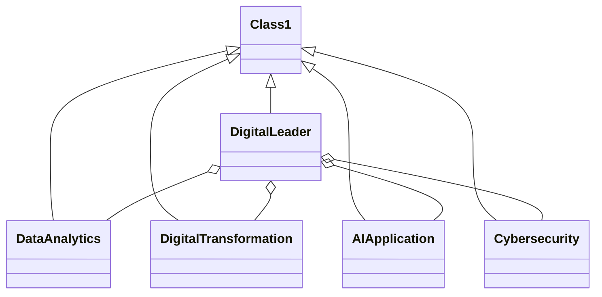
```mermaid
classDiagram
    Class1 <|-- DigitalLeader
    Class1 <|-- DataAnalytics
    Class1 <|-- DigitalTransformation
    Class1 <|-- AIApplication
    Class1 <|-- Cybersecurity
    DigitalLeader o-- DataAnalytics
    DigitalLeader o-- DigitalTransformation
    DigitalLeader o-- AIApplication
    DigitalLeader o-- Cybersecurity
```

**系统架构设计**：

```mermaid
graph TD
    A[用户界面] --> B[数据存储]
    B --> C[数字化领导力评估算法]
    C --> D[报告生成]
    A --> E[数据分析评估]
    E --> F[数字化转型评估]
    F --> G[人工智能应用评估]
    G --> H[网络安全评估]
```

**系统接口设计和系统交互**：

```mermaid
sequenceDiagram
    participant User
    participant System
    participant Database
    
    User->>System: 登录系统
    System->>User: 欢迎登录
    User->>System: 开始数字化领导力评估
    System->>User: 进行数据分析评估
    System->>User: 进行数字化转型评估
    System->>User: 进行人工智能应用评估
    System->>User: 进行网络安全评估
    System->>Database: 存储评估信息
    Database-->>System: 评估信息存储成功
    System->>User: 评估完成
```

## 第六部分：领导力的自我提升与成长

### 6.1 领导力的自我提升方法

领导者需要不断学习和提升自己的能力，以应对不断变化的环境。以下是一些领导力自我提升的方法：

1. **持续学习**：领导者需要不断学习新的知识和技能，保持竞争力。
2. **反思和总结**：领导者需要定期反思和总结自己的工作，找出改进的方向。
3. **接受挑战**：领导者需要勇于接受新的挑战，锻炼自己的能力。
4. **建立人际关系网络**：领导者需要建立广泛的人际关系网络，获取更多的资源和信息。
5. **参加培训和学习项目**：领导者可以参加各种培训和学习项目，提升自己的领导力。

#### 背景介绍

- **核心概念术语说明**：持续学习（Continuous Learning）、反思和总结（Reflection and Summarization）、接受挑战（Accept Challenges）、建立人际关系网络（Building Relationships）、参加培训和学习项目（Participating in Training and Learning Programs）。
- **问题背景**：领导力是一个不断发展的过程，领导者需要不断学习和提升自己的能力。
- **问题描述**：如何通过自我提升方法，提高领导力的有效性。
- **问题解决**：通过理论研究和实际案例，探讨领导力自我提升的有效方法。
- **边界与外延**：领导力自我提升方法不仅适用于企业领导者，也适用于政府、非营利组织等各种领域的领导者。
- **概念结构与核心要素组成**：领导力自我提升的核心要素包括持续学习、反思和总结、接受挑战、建立人际关系网络和参加培训和学习项目。

### 6.2 领导力自我评估工具

为了更好地了解自己的领导力水平，领导者可以使用自我评估工具进行评估。以下是一些常用的自我评估工具：

1. **360度评估**：通过收集来自不同层级的同事、下属和上级的反馈，进行全方位的自我评估。
2. **领导力问卷**：使用专门设计的领导力问卷，评估自己在不同领导力维度上的表现。
3. **领导力发展中心**：通过模拟场景和实际操作，评估领导力在各种情境下的应用能力。
4. **领导力训练**：通过参加领导力训练课程，提升自己的领导力水平和技能。

#### 算法原理讲解

以下是一个简单的领导力自我评估算法，用于评估领导者在不同维度上的表现：

```python
def leadership_self_evaluation(score_360_evaluation, score_questionnaire, score_leadership_center, score_training):
    total_score = score_360_evaluation + score_questionnaire + score_leadership_center + score_training
    average_score = total_score / 4
    
    if average_score >= 4:
        return "优秀的领导力自我评估结果"
    elif average_score >= 3:
        return "良好的领导力自我评估结果"
    else:
        return "需要改进的领导力自我评估结果"

# 示例
print(leadership_self_evaluation(4, 4, 3, 4))
```

### 数学公式

$$
\text{average\_score} = \frac{\text{total\_score}}{4}
$$

#### 系统分析与架构设计方案

**问题场景介绍**：通过自我评估工具，了解自己的领导力水平，为自我提升提供方向。

**项目介绍**：领导力自我评估系统，用于评估领导者的自我提升情况。

**系统功能设计**：

```mermaid
classDiagram
    Class1 <|-- LeadershipAssessor
    Class1 <|-- 360Evaluation
    Class1 <|-- Questionnaire
    Class1 <|-- LeadershipCenter
    Class1 <|-- Training
    LeadershipAssessor o-- 360Evaluation
    LeadershipAssessor o-- Questionnaire
    LeadershipAssessor o-- LeadershipCenter
    LeadershipAssessor o-- Training
```

**系统架构设计**：

```mermaid
graph TD
    A[用户界面] --> B[数据存储]
    B --> C[领导力自我评估算法]
    C --> D[报告生成]
    A --> E[360度评估]
    E --> F[领导力问卷评估]
    F --> G[领导力发展中心评估]
    G --> H[领导力训练评估]
```

**系统接口设计和系统交互**：

```mermaid
sequenceDiagram
    participant User
    participant System
    participant Database
    
    User->>System: 登录系统
    System->>User: 欢迎登录
    User->>System: 开始领导力自我评估
    System->>User: 进行360度评估
    System->>User: 进行领导力问卷评估
    System->>User: 进行领导力发展中心评估
    System->>User: 进行领导力训练评估
    System->>Database: 存储评估信息
    Database-->>System: 评估信息存储成功
    System->>User: 评估完成
```

## 第7章：领导力与社会责任

### 7.1 领导力与社会责任的关系

领导力不仅仅是关于个人能力和影响力的发挥，更关乎社会责任和价值观的体现。有效的领导力应与社会责任紧密结合，为社会的可持续发展和公共利益做出贡献。

#### 背景介绍

- **核心概念术语说明**：领导力（Leadership）、社会责任（Social Responsibility）、可持续性（Sustainability）、公共利益（Public Interest）。
- **问题背景**：在现代社会，领导力需要超越传统的企业利益，关注社会和环境问题。
- **问题描述**：如何理解领导力与社会责任的关系，以及如何将社会责任融入领导力实践中。
- **问题解决**：通过理论研究和实际案例，探讨领导力与社会责任的相互作用和融合。
- **边界与外延**：领导力与社会责任的关系不仅适用于企业，也适用于政府、非营利组织等各类组织。
- **概念结构与核心要素组成**：领导力与社会责任的核心要素包括价值观、可持续性、公共利益和道德责任。

### 7.2 领导力如何履行社会责任

领导者履行社会责任的方式多种多样，以下是一些关键点：

1. **企业社会责任（CSR）**：领导者应推动企业制定和实施社会责任计划，关注环境保护、员工福利和社会公益。
2. **道德领导**：领导者应以高尚的道德标准为榜样，引导团队成员遵循道德规范，维护社会正义。
3. **可持续发展**：领导者应关注企业的长期可持续发展，推动绿色生产和技术创新，减少环境足迹。
4. **社区参与**：领导者应积极参与社区活动，推动企业与社区的互利合作，促进社会和谐。
5. **公共政策倡导**：领导者应通过参与公共政策讨论和倡导，推动有益于社会和公共利益的政策制定。

#### 算法原理讲解

以下是一个简单的领导力社会责任评估算法，用于评估领导者在社会责任方面的表现：

```python
def social_responsibility_leadership(scoreCSR, score道德领导，score可持续发展，score社区参与，score公共政策倡导):
    total_score = scoreCSR + score道德领导 + score可持续发展 + score社区参与 + score公共政策倡导
    average_score = total_score / 5
    
    if average_score >= 4:
        return "卓越的社会责任领导者"
    elif average_score >= 3:
        return "优秀的社会责任领导者"
    else:
        return "需要提升的社会责任领导者"

# 示例
print(social_responsibility_leadership(4, 4, 3, 4, 4))
```

### 数学公式

$$
\text{average\_score} = \frac{\text{total\_score}}{5}
$$

#### 系统分析与架构设计方案

**问题场景介绍**：评估领导力在社会责任方面的表现，为领导者提供改进方向。

**项目介绍**：社会责任领导力评估系统，用于评估领导力在社会责任方面的表现。

**系统功能设计**：

```mermaid
classDiagram
    Class1 <|-- SociallyResponsibleLeader
    Class1 <|-- CSR
    Class1 <|-- EthicalLeadership
    Class1 <|-- Sustainability
    Class1 <|-- CommunityInvolvement
    Class1 <|-- PublicPolicyAdvocacy
    SociallyResponsibleLeader o-- CSR
    SociallyResponsibleLeader o-- EthicalLeadership
    SociallyResponsibleLeader o-- Sustainability
    SociallyResponsibleLeader o-- CommunityInvolvement
    SociallyResponsibleLeader o-- PublicPolicyAdvocacy
```

**系统架构设计**：

```mermaid
graph TD
    A[用户界面] --> B[数据存储]
    B --> C[社会责任领导力评估算法]
    C --> D[报告生成]
    A --> E[企业社会责任评估]
    E --> F[道德领导评估]
    F --> G[可持续发展评估]
    G --> H[社区参与评估]
    H --> I[公共政策倡导评估]
```

**系统接口设计和系统交互**：

```mermaid
sequenceDiagram
    participant User
    participant System
    participant Database
    
    User->>System: 登录系统
    System->>User: 欢迎登录
    User->>System: 开始社会责任领导力评估
    System->>User: 进行企业社会责任评估
    System->>User: 进行道德领导评估
    System->>User: 进行可持续发展评估
    System->>User: 进行社区参与评估
    System->>User: 进行公共政策倡导评估
    System->>Database: 存储评估信息
    Database-->>System: 评估信息存储成功
    System->>User: 评估完成
```

## 第七部分：领导力的全球化视野

### 7.1 全球化背景下的领导力挑战

全球化带来了前所未有的机遇和挑战。领导者需要具备全球视野，理解和适应多元文化和国际环境，以应对全球化的挑战。

#### 背景介绍

- **核心概念术语说明**：全球化（Globalization）、跨文化领导力（Cross-Cultural Leadership）、国际环境（International Environment）。
- **问题背景**：全球化加速了各国之间的经济、文化和技术的交流，领导者需要适应这一变化。
- **问题描述**：全球化背景下，领导力面临哪些挑战，以及如何应对。
- **问题解决**：通过理论研究和实际案例，探讨全球化背景下领导力的关键挑战和应对策略。
- **边界与外延**：全球化背景下的领导力挑战不仅适用于跨国企业，也适用于国际组织和政府。
- **概念结构与核心要素组成**：全球化背景下的领导力核心要素包括跨文化适应、全球协作、国际视野和全球伦理。

### 7.2 全球化视野下的领导力策略

以下是一些全球化视野下的领导力策略：

1. **跨文化理解**：领导者需要学习和了解不同文化背景，尊重和包容多样性。
2. **全球协作**：领导者应推动组织建立全球协作网络，实现资源共享和优势互补。
3. **国际视野**：领导者需要具备国际视野，关注全球市场趋势和动态。
4. **全球伦理**：领导者应树立全球伦理观念，遵循国际规则，推动可持续发展。

#### 算法原理讲解

以下是一个简单的全球化视野领导力评估算法，用于评估领导者在全球化视野下的表现：

```python
def global_leadership_evaluation(score_cultural_understanding, score_global_collaboration, score_international_perspective, score_global_ethics):
    total_score = score_cultural_understanding + score_global_collaboration + score_international_perspective + score_global_ethics
    average_score = total_score / 4
    
    if average_score >= 4:
        return "卓越的全球化领导者"
    elif average_score >= 3:
        return "优秀的全球化领导者"
    else:
        return "需要提升的全球化领导者"

# 示例
print(global_leadership_evaluation(4, 4, 3, 4))
```

### 数学公式

$$
\text{average\_score} = \frac{\text{total\_score}}{4}
$$

#### 系统分析与架构设计方案

**问题场景介绍**：评估领导力在全球化视野下的表现，为领导者提供改进方向。

**项目介绍**：全球化领导力评估系统，用于评估领导力在全球化视野下的表现。

**系统功能设计**：

```mermaid
classDiagram
    Class1 <|-- GlobalLeader
    Class1 <|-- CulturalUnderstanding
    Class1 <|-- GlobalCollaboration
    Class1 <|-- InternationalPerspective
    Class1 <|-- GlobalEthics
    GlobalLeader o-- CulturalUnderstanding
    GlobalLeader o-- GlobalCollaboration
    GlobalLeader o-- InternationalPerspective
    GlobalLeader o-- GlobalEthics
```

**系统架构设计**：

```mermaid
graph TD
    A[用户界面] --> B[数据存储]
    B --> C[全球化领导力评估算法]
    C --> D[报告生成]
    A --> E[跨文化理解评估]
    E --> F[全球协作评估]
    F --> G[国际视野评估]
    G --> H[全球伦理评估]
```

**系统接口设计和系统交互**：

```mermaid
sequenceDiagram
    participant User
    participant System
    participant Database
    
    User->>System: 登录系统
    System->>User: 欢迎登录
    User->>System: 开始全球化领导力评估
    System->>User: 进行跨文化理解评估
    System->>User: 进行全球协作评估
    System->>User: 进行国际视野评估
    System->>User: 进行全球伦理评估
    System->>Database: 存储评估信息
    Database-->>System: 评估信息存储成功
    System->>User: 评估完成
```

## 附录

### A. 领导力自我评估工具

以下是一些领导力自我评估的工具和资源，帮助您评估和提升自己的领导力：

- **领导力360度评估**：通过收集来自同事、下属和上级的反馈，全面评估自己的领导力。
- **领导力问卷**：使用专业的领导力问卷，自我评估自己在不同领导力维度上的表现。
- **领导力发展中心**：参加专业的领导力发展中心，通过模拟场景和实际操作，提升领导力。
- **在线评估工具**：使用在线评估工具，如Leadership Circle、Hero Leadership等，进行自我评估。

### B. 领导力发展资源推荐

以下是一些领导力发展的优质资源和推荐书籍：

- **《领导力的五个层次》**：史蒂芬·柯维（Stephen R. Covey）
- **《领导力的真谛》**：约翰·麦克斯韦尔（John C. Maxwell）
- **《变革领导者》**：詹姆斯·M·凯瑟（James M. Kouzes）和巴里·Z·波切克（Barry Z. Posner）
- **《领导力与影响力》**：罗伯特·凯利（Robert H. Kelley）
- **在线课程**：Coursera、edX、Udemy等平台提供的领导力相关课程。

### C. 参考文献

本文在撰写过程中参考了以下文献和资料：

- **《领导学：理论与实践》**：理查德·L·达夫特（Richard L. Daft）
- **《领导力：理论与实践》**：斯蒂芬·P·罗宾斯（Stephen P. Robbins）
- **《战略管理：概念与案例》**：亨利·M·明茨伯格（Henry M. Mintzberg）
- **《创新与企业家精神》**：杰弗里·D·莫克（Jeffrey D. Moore）
- **《全球化与管理》**：迈克尔·波特（Michael E. Porter）

作者：AI天才研究院/AI Genius Institute & 禅与计算机程序设计艺术 /Zen And The Art of Computer Programming

