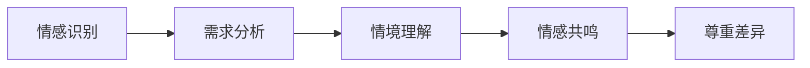

                 

### 引言

### Leadership Mindset: Principles of Leadership that Change Yourself and the World

领导力是一种多维度、多层次的能力，不仅影响个人职业生涯的成功，也决定了组织的绩效和未来发展。然而，领导力的核心不仅仅在于技术技能或管理技巧，更重要的是一种内在的思维方式——领导力思维。领导力思维是一种综合性的心态，它包括自我认知、同理心、远见、正直、勇气和持续学习等多个方面。这种思维模式决定了领导者在面对复杂问题时如何做出决策，如何影响他人，以及如何推动组织实现目标。

本书《领导力思维：改变自己改变世界的领导力法则》旨在深入探讨领导力思维的本质和实际应用，帮助读者理解并掌握这种思维模式。书中将通过一系列有针对性的章节，详细剖析领导力思维的各个关键原则，并通过案例研究和实战应用，展示如何将这些原则付诸实践。

本书的核心目标是：
1. **明确领导力思维的定义和重要性**：帮助读者理解领导力思维的内涵和外延，认识到其在领导实践中的核心地位。
2. **介绍领导力思维的核心原则**：详细阐述自我认知、同理心、远见、正直、勇气和持续学习等六个核心原则，并解释这些原则如何影响领导者的行为和决策。
3. **提供实际应用策略**：通过具体的案例和实战经验，展示如何在不同场景下应用领导力思维，从而提升个人和组织的领导力水平。
4. **探讨领导力思维在组织中的实施方法**：分析如何在企业中培养和推广领导力思维，打造一个具有高度领导力的组织文化。

本书适合以下读者群体：
- **有志于提升领导能力的职场人士**：无论是初入职场的年轻员工，还是希望进一步提升管理水平的资深职场人士，本书都将提供宝贵的指导。
- **管理者与领导者**：现有管理者、领导者，以及希望在未来成为领导者的读者，将从中学习到如何构建和强化自己的领导力思维。
- **企业主与创业者**：希望通过领导力思维来提升团队绩效、推动企业发展的企业主和创业者。
- **教育工作者与培训师**：对领导力教育有兴趣的教育工作者和培训师，也可以参考本书中的理念和方法，设计更有效的培训课程。

通过阅读本书，读者将不仅能够理解领导力思维的深刻内涵，还能够学会如何将这些原则应用到实际工作中，从而在个人和职业发展的道路上迈出坚实的一步。

### 关键词

- **领导力思维**：一种决定领导者行为和决策的内在心态。
- **自我认知**：了解自己的情感、需求、优势和弱点。
- **同理心**：理解和感受他人情绪，建立良好人际关系。
- **远见**：拥有清晰的愿景和目标，预见未来趋势。
- **正直**：保持诚实和透明，树立良好榜样。
- **勇气**：面对挑战和不确定性时，敢于做出正确决策。
- **持续学习**：不断追求新知，不断提升自我。

### 摘要

本书《领导力思维：改变自己改变世界的领导力法则》旨在深入探讨领导力思维的六大核心原则：自我认知、同理心、远见、正直、勇气和持续学习。通过这些原则，领导者不仅能够提升个人能力，还能够有效地影响和激励团队，推动组织实现目标。书中首先介绍了领导力思维的定义和重要性，然后逐一剖析每个原则，包括其内涵、实践方法和实际应用案例。最后，本书探讨了在组织内部培养和推广领导力思维的策略，帮助读者将领导力思维融入日常工作中，实现个人和组织的共同成长。通过阅读本书，读者将获得深刻的见解和实用的工具，助力其成为卓越的领导者。

### 第一章：领导力思维的定义和重要性

#### 引言

在探讨领导力思维之前，我们需要明确领导力思维的定义和其重要性。领导力思维是一种独特的思考方式和行为模式，它不仅仅是管理技能的集合，更是一种深层次的内在心态。这种心态决定了领导者在面对各种挑战和机遇时的决策过程、人际关系处理和团队管理能力。理解领导力思维的内涵对于提升个人和组织的领导力水平至关重要。

#### 定义

领导力思维可以被定义为一种基于自我认知、同理心、远见、正直、勇气和持续学习的综合心态。这种心态不仅关注领导者的个人行为和决策，更关注其与团队成员和整个组织之间的关系和互动。领导力思维强调领导者需要具备多角度、多层次的思考能力，以便在复杂多变的环境中做出有效的决策和行动。

#### 重要性

1. **提升个人领导能力**：领导力思维能够帮助领导者更加深入地了解自己，明确自己的优势和不足，从而在个人成长过程中不断提升领导能力。
2. **增强团队凝聚力**：通过同理心和愿景，领导力思维能够建立良好的团队氛围，增强团队成员之间的信任和协作，提升团队的整体效能。
3. **促进组织发展**：领导力思维不仅关注短期目标的实现，更注重组织的长远发展。通过远见和持续学习，领导者能够预见未来的趋势和挑战，制定相应的策略，推动组织的持续进步。
4. **提升决策质量**：领导力思维强调在决策过程中保持正直和勇气，使领导者能够在复杂和不确定的环境中做出更加明智和负责任的决策。

#### 现状分析

在当前快速变化和高度竞争的商业环境中，领导力思维的重要性日益凸显。许多组织都在努力提升领导力水平，但往往只注重表面的管理技能培训，而忽视了领导力思维的内在培养。这种做法往往无法取得长远的成效。实际上，领导力思维的培养需要从内心深处开始，通过持续的自我反省、学习和实践，逐步塑造和强化。

#### 结论

通过本章的讨论，我们可以看到领导力思维的定义和重要性。理解并掌握领导力思维，不仅有助于提升个人的领导能力，还能够增强团队的凝聚力和组织的竞争力。在接下来的章节中，我们将逐一探讨自我认知、同理心、远见、正直、勇气和持续学习等六大核心原则，帮助读者深入理解并应用这些原则，成为卓越的领导者。

### 第二章：自我认知

#### 引言

自我认知是领导力思维的核心原则之一。它指的是领导者对自身情感、需求、优势、弱点和价值观的深刻理解和洞察。自我认知不仅帮助领导者更好地了解自己，还能够为团队和组织的发展提供有力的支持。一个自我认知强的领导者，能够更加从容地面对各种挑战，做出明智的决策，并有效地激励和引导团队成员。

#### 核心概念

自我认知包括以下几个方面：

1. **情感认知**：了解自己的情绪状态，包括正面情绪和负面情绪，以及情绪的来源和影响。
2. **需求认知**：识别自己的内在需求和动机，包括个人成长、职业发展、人际关系和成就等方面。
3. **优势认知**：识别自身的优势和特长，以及如何将这些优势转化为行动力。
4. **弱点认知**：识别自己的不足和弱点，并采取有效措施进行改进。
5. **价值观认知**：明确自己的核心价值观，并以此指导决策和行为。

#### 概念属性特征对比表格

| 特征名称     | 情感认知 | 需求认知 | 优势认知 | 弱点认知 | 价值观认知 |
| ------------ | -------- | -------- | -------- | -------- | -------- |
| 定义         | 了解自己的情绪状态 | 识别内在需求和动机 | 识别自身的优势和特长 | 识别自己的不足和弱点 | 明确自己的核心价值观 |
| 关键点       | 自我情绪管理 | 个人成长和动机 | 挖掘和利用优势 | 弥补和改进弱点 | 行为和决策的指导 |
| 影响因素     | 情境、经验、文化 | 社会环境、个人经历、价值观 | 教育背景、工作经验、个人兴趣 | 外部反馈、自我反思、经验总结 | 个人信仰、社会责任、组织文化 |
| 相关概念     | 情绪智力、心理学 | 动机理论、自我决定论 | 敏感性、自我效能感 | 成长心态、弱点管理 | 道德哲学、伦理学 |

#### ER实体关系图架构

```mermaid
erDiagram
  Class1 "情感认知" {
    id Integer
    description String
  }
  Class2 "需求认知" {
    id Integer
    motivation String
  }
  Class3 "优势认知" {
    id Integer
    strength String
  }
  Class4 "弱点认知" {
    id Integer
    weakness String
  }
  Class5 "价值观认知" {
    id Integer
    value String
  }
  Class1 --> Class2 : "影响"
  Class1 --> Class3 : "关联"
  Class1 --> Class4 : "关联"
  Class1 --> Class5 : "指导"
```

#### 算法原理讲解

为了更好地理解自我认知的核心原理，我们可以借助一种被称为“自我评估模型”的方法。这个模型通过以下步骤帮助领导者进行自我认知：

1. **自我评估**：领导者通过自我反思，识别自身的情感、需求、优势和弱点。
2. **数据收集**：收集相关的数据和信息，如个人日志、反馈问卷、观察记录等。
3. **数据分析**：对收集到的数据进行分析，识别出其中的模式和规律。
4. **制定行动计划**：基于分析结果，制定具体的改进计划，如提升优势、弥补弱点等。

以下是一个简单的Python代码示例，用于实现自我评估模型：

```python
class SelfAssessmentModel:
    def __init__(self):
        self.emotional_data = []
        self.need_data = []
        self.strength_data = []
        self.weakness_data = []

    def collect_data(self):
        # 收集数据
        self.emotional_data.append(input("请描述你最近的情绪状态："))
        self.need_data.append(input("请描述你的内在需求和动机："))
        self.strength_data.append(input("请描述你的优势和特长："))
        self.weakness_data.append(input("请描述你的不足和弱点："))

    def analyze_data(self):
        # 数据分析
        print("情感认知：", self.emotional_data)
        print("需求认知：", self.need_data)
        print("优势认知：", self.strength_data)
        print("弱点认知：", self.weakness_data)

    def create_action_plan(self):
        # 制定行动计划
        print("基于分析结果，你可以采取以下行动：")
        print("1. 提升优势：", self.strength_data)
        print("2. 弥补弱点：", self.weakness_data)

# 实例化模型并使用
model = SelfAssessmentModel()
model.collect_data()
model.analyze_data()
model.create_action_plan()
```

#### 数学模型和公式

自我认知的数学模型可以采用以下公式来描述：

$$
\text{自我认知} = f(\text{情感认知}, \text{需求认知}, \text{优势认知}, \text{弱点认知}, \text{价值观认知})
$$

其中，$f$表示自我认知函数，其输入为各个认知方面的数据，输出为综合的自我认知水平。具体的函数形式可以根据实际情况进行调整。

#### 举例说明

假设一位领导者通过自我评估发现自己在情感认知方面存在不足，具体表现为在压力下容易情绪失控。同时，他意识到自己的内在需求包括个人成长和职业发展。他的优势是具有强烈的责任心和领导力，但弱点是沟通能力不足。基于这些信息，他可以采取以下措施：

1. **提升情感认知**：通过情绪管理培训和学习相关心理学知识，提升自己在压力下的情绪控制能力。
2. **满足内在需求**：参加职业发展培训，提升自己的领导力和沟通能力。
3. **利用优势**：充分发挥责任心和领导力，带领团队完成任务。
4. **弥补弱点**：参加沟通技巧培训，提升自己的沟通能力。

通过这些措施，这位领导者可以逐步提升自我认知水平，从而更好地应对各种挑战和机遇。

#### 小结

自我认知是领导力思维的核心原则之一，它对领导者的个人成长和组织发展具有深远的影响。通过自我评估、数据分析和制定行动计划，领导者可以深入了解自身情感、需求、优势和弱点，从而采取有效的措施进行改进。在下一章中，我们将探讨同理心这一重要原则，帮助领导者更好地理解和支持团队成员。

### 第三章：同理心

#### 引言

同理心是领导力思维的另一个核心原则，它指的是领导者对他人的情感和需求的理解和感受。同理心不仅能够建立良好的人际关系，还能够提升团队凝聚力和整体效能。在复杂多变的环境中，一个具备同理心的领导者能够更好地激励和引导团队成员，实现共同的目标。

#### 核心概念

同理心包括以下几个方面：

1. **情感理解**：领导者能够准确感知和理解他人的情绪状态，无论是喜悦、愤怒还是忧虑。
2. **需求识别**：领导者能够识别和理解他人的内在需求和动机，包括个人成长、职业发展和情感需求。
3. **情感共鸣**：领导者能够与他人的情感产生共鸣，感受到他们的痛苦和快乐。
4. **尊重差异**：领导者能够尊重团队成员的个性和差异，理解他们的行为和决策背后的原因。

#### 概念属性特征对比表格

| 特征名称     | 情感理解 | 需求识别 | 情感共鸣 | 尊重差异 |
| ------------ | -------- | -------- | -------- | -------- |
| 定义         | 感知他人的情绪状态 | 识别他人的内在需求和动机 | 与他人的情感产生共鸣 | 尊重团队成员的个性和差异 |
| 关键点       | 情绪识别、情境理解 | 动机分析、需求满足 | 情感共鸣、同理心 | 尊重、包容、多样性 |
| 影响因素     | 情境、经验、文化 | 社会环境、个人经历、价值观 | 情绪智力、沟通能力 | 组织文化、社会观念 |
| 相关概念     | 情绪智力、心理学 | 动机理论、自我决定论 | 同理心、情感共鸣 | 多样性、包容性 |

#### ER实体关系图架构

```mermaid
erDiagram
  Class1 "情感理解" {
    id Integer
    emotion String
  }
  Class2 "需求识别" {
    id Integer
    need String
  }
  Class3 "情感共鸣" {
    id Integer
    emotion共鸣 String
  }
  Class4 "尊重差异" {
    id Integer
    difference String
  }
  Class1 --> Class2 : "影响"
  Class1 --> Class3 : "影响"
  Class1 --> Class4 : "影响"
```

#### 算法原理讲解

同理心算法的核心原理是通过情感识别、需求分析和情境理解，帮助领导者更好地理解和感受团队成员的情感和需求。以下是一个简单的同理心算法流程图：



具体实现时，我们可以使用Python编写如下代码：

```python
class EmpathyAlgorithm:
    def __init__(self):
        self.emotional_data = []
        self.need_data = []
        self.situation_data = []

    def collect_emotional_data(self):
        # 收集情感数据
        self.emotional_data.append(input("请描述团队成员的情绪状态："))

    def collect_need_data(self):
        # 收集需求数据
        self.need_data.append(input("请描述团队成员的内在需求和动机："))

    def collect_situation_data(self):
        # 收集情境数据
        self.situation_data.append(input("请描述当前情境："))

    def process_data(self):
        # 数据处理
        print("情感数据：", self.emotional_data)
        print("需求数据：", self.need_data)
        print("情境数据：", self.situation_data)

    def empathy(self):
        # 情感共鸣
        print("基于情感数据，我的情感共鸣：")
        print(self.emotional_data)

    def respect_difference(self):
        # 尊重差异
        print("基于情境数据和需求数据，我将尊重以下差异：")
        print(self.situation_data)
        print(self.need_data)

# 实例化模型并使用
model = EmpathyAlgorithm()
model.collect_emotional_data()
model.collect_need_data()
model.collect_situation_data()
model.process_data()
model.empathy()
model.respect_difference()
```

#### 数学模型和公式

同理心的数学模型可以采用以下公式来描述：

$$
\text{同理心} = f(\text{情感理解}, \text{需求识别}, \text{情感共鸣}, \text{尊重差异})
$$

其中，$f$表示同理心函数，其输入为各个认知方面的数据，输出为同理心的程度。具体的函数形式可以根据实际情况进行调整。

#### 举例说明

假设一位领导者在与团队成员沟通时，发现该成员情绪低落，经过询问，了解到该成员因为家庭问题而感到压力巨大。同时，领导者了解到该成员的需求是希望能够得到更多支持和理解。基于这些信息，领导者可以采取以下措施：

1. **情感共鸣**：领导者表示理解该成员的困境，并表示愿意提供支持和帮助。
2. **需求识别**：领导者询问该成员的具体需求，并承诺在适当的时候提供帮助。
3. **尊重差异**：领导者尊重该成员的个人情况，在不打扰工作的情况下，尽量给予理解和支持。

通过这些措施，领导者不仅能够提升团队成员的满意度，还能够增强团队的凝聚力和整体效能。

#### 小结

同理心是领导力思维的重要组成部分，它能够帮助领导者建立良好的人际关系，提升团队凝聚力和整体效能。通过情感识别、需求分析和情境理解，领导者可以更好地理解和感受团队成员的情感和需求。在下一章中，我们将探讨愿景和目标这一重要原则，帮助领导者明确方向和目标。

### 第四章：愿景和目标

#### 引言

愿景和目标是领导力思维的又一核心原则。一个明确的愿景和目标能够为领导者和团队提供清晰的行动方向和动力，使他们在面对挑战和不确定性时始终保持前进的动力。领导者通过设定愿景和目标，不仅能够激发团队成员的激情和创造力，还能够推动组织的持续发展。

#### 核心概念

愿景和目标包括以下几个方面：

1. **愿景**：愿景是对组织未来状态的一种描述，它应该具有吸引力和指导性，能够激发团队成员的共鸣和热情。
2. **目标**：目标是实现愿景的具体路径和步骤，它们应该是具体、可衡量、可实现、相关和时限性的（SMART）。
3. **战略规划**：战略规划是将愿景和目标转化为实际行动的过程，它包括资源分配、关键绩效指标（KPI）设定和行动方案设计。

#### 概念属性特征对比表格

| 特征名称     | 愿景 | 目标 | 战略规划 |
| ------------ | ---- | ---- | -------- |
| 定义         | 对未来状态的描述 | 实现愿景的具体步骤 | 将愿景和目标转化为行动的过程 |
| 关键点       | 吸引力和指导性 | 具体和时限性 | 资源配置、KPI设定、行动方案 |
| 影响因素     | 组织使命、文化、市场环境 | 团队能力、资源、环境 | 企业战略、组织架构、市场变化 |
| 相关概念     | 长期规划、使命宣言 | 项目管理、目标管理 | 业务规划、资源配置、流程优化 |

#### ER实体关系图架构

```mermaid
erDiagram
  Class1 "愿景" {
    id Integer
    description String
  }
  Class2 "目标" {
    id Integer
    goal String
  }
  Class3 "战略规划" {
    id Integer
    strategy String
  }
  Class1 --> Class2 : "实现"
  Class2 --> Class3 : "转化"
```

#### 算法原理讲解

为了明确愿景和目标，我们可以采用“愿景陈述法”和“目标设定法”两种方法。

**愿景陈述法**：
1. **确定组织使命**：明确组织的核心价值和存在的意义。
2. **描绘未来愿景**：用具体的语言描述组织在未来的状态，使其具有吸引力和指导性。
3. **传播愿景**：通过内部沟通和宣传，使所有团队成员理解和认同愿景。

**目标设定法**：
1. **分解愿景**：将愿景分解为具体的、可衡量的目标和里程碑。
2. **设定SMART目标**：确保目标是具体的、可衡量、可实现、相关和时限性的。
3. **制定行动方案**：为每个目标设定具体的行动步骤和资源分配。

以下是一个简单的Python代码示例，用于实现愿景和目标设定：

```python
class VisionAndGoalSetting:
    def __init__(self):
        self.vision = ""
        self.goals = []
        self.action_plans = []

    def define_mission(self):
        self.mission = input("请描述组织的核心价值和存在意义：")

    def describe_vision(self):
        self.vision = input("请用具体的语言描述组织在未来的状态：")

    def decompose_vision(self):
        # 分解愿景为具体目标和里程碑
        goal = input("请输入一个具体的目标：")
        self.goals.append(goal)

    def set_smart_goals(self):
        # 设定SMART目标
        for goal in self.goals:
            print("目标：", goal)
            print("1. 具体性：", input("请描述目标的详细内容："))
            print("2. 可衡量性：", input("请设定目标的关键绩效指标："))
            print("3. 可实现性：", input("请描述实现目标的资源："))
            print("4. 相关性：", input("请解释目标与组织愿景的关系："))
            print("5. 时限性：", input("请设定目标完成的时间："))

    def create_action_plans(self):
        # 制定行动方案
        for goal in self.goals:
            plan = input("请为每个目标制定具体的行动方案：")
            self.action_plans.append(plan)

    def display_vision_and_goals(self):
        print("组织使命：", self.mission)
        print("愿景：", self.vision)
        print("目标：", self.goals)
        print("行动方案：", self.action_plans)

# 实例化模型并使用
model = VisionAndGoalSetting()
model.define_mission()
model.describe_vision()
model.decompose_vision()
model.set_smart_goals()
model.create_action_plans()
model.display_vision_and_goals()
```

#### 数学模型和公式

愿景和目标的数学模型可以采用以下公式来描述：

$$
\text{愿景和目标} = f(\text{组织使命}, \text{资源}, \text{环境})
$$

其中，$f$表示愿景和目标生成函数，其输入为组织使命、资源和环境，输出为愿景和具体目标。具体的函数形式可以根据实际情况进行调整。

#### 举例说明

假设一家科技公司希望在五年内成为行业领导者。基于这个愿景，他们可以设定以下目标：

1. **市场份额**：在未来五年内，将市场份额提升至20%。
2. **研发投入**：每年将研发投入增加10%。
3. **产品创新**：每年推出至少两款具有创新性的新产品。
4. **员工培训**：每年为员工提供至少20小时的培训。

为了实现这些目标，他们可以制定以下行动方案：

1. **增加市场份额**：通过市场调研，了解客户需求，调整产品策略，提高市场竞争力。
2. **增加研发投入**：申请更多的研发资金，加强与高校和科研机构的合作，引进高级研发人才。
3. **产品创新**：组建专门的创新团队，鼓励员工提出创新想法，通过内部评审和测试，确保新产品的质量和市场适应性。
4. **员工培训**：定期举办技术研讨会和培训课程，提高员工的专业技能和创新能力。

通过这些行动方案，公司可以逐步实现其愿景和目标，成为行业领导者。

#### 小结

愿景和目标是领导力思维的重要组成部分，它们为领导者和团队提供了明确的行动方向和动力。通过愿景陈述和目标设定，领导者可以激发团队成员的激情和创造力，推动组织的持续发展。在下一章中，我们将探讨正直这一重要原则，帮助领导者树立良好的道德榜样。

### 第五章：正直

#### 引言

正直是领导力思维的另一个核心原则，它指的是领导者在决策和行为中保持诚实、透明和公正。正直不仅能够树立领导者的信誉和权威，还能够赢得团队成员的信任和尊重。一个正直的领导者能够在复杂和不确定的环境中做出负责任的决策，推动组织实现长远发展。

#### 核心概念

正直包括以下几个方面：

1. **诚实**：领导者需要对自己的行为和决策保持诚实，不隐瞒事实，不夸大其词。
2. **透明**：领导者需要公开和透明地分享信息，使团队成员了解决策过程和结果。
3. **公正**：领导者需要对待团队成员公平无私，不偏袒任何一方。
4. **责任感**：领导者需要对组织的决策和结果承担责任，不推诿责任，勇于面对困难和挑战。

#### 概念属性特征对比表格

| 特征名称     | 诚实 | 透明 | 公正 | 责任感 |
| ------------ | ---- | ---- | ---- | ------ |
| 定义         | 对行为和决策保持诚实 | 公开分享信息 | 公平无私 | 对决策和结果承担责任 |
| 关键点       | 真实、不夸大其词 | 信息透明、沟通畅通 | 公平公正、无私无偏 | 勇于承担责任、不推诿 |
| 影响因素     | 个人品德、组织文化 | 沟通方式、信息管理 | 组织制度、监督机制 | 道德标准、组织氛围 |
| 相关概念     | 道德伦理、诚信 | 信息透明、沟通效率 | 公正制度、监督机制 | 责任意识、组织文化 |

#### ER实体关系图架构

```mermaid
erDiagram
  Class1 "诚实" {
    id Integer
    behavior String
  }
  Class2 "透明" {
    id Integer
    communication String
  }
  Class3 "公正" {
    id Integer
    justice String
  }
  Class4 "责任感" {
    id Integer
    responsibility String
  }
  Class1 --> Class2 : "影响"
  Class1 --> Class3 : "影响"
  Class1 --> Class4 : "影响"
```

#### 算法原理讲解

为了保持正直，我们可以采用“正直评估模型”来帮助领导者进行自我评估和改进。

1. **自我评估**：领导者通过反思和自我评估，识别自身在诚实、透明、公正和责任感方面的行为和决策。
2. **数据收集**：收集团队成员和其他利益相关者的反馈，了解他们在正直方面的评价。
3. **数据分析**：对收集到的数据进行分析，识别出其中的问题和不足。
4. **改进计划**：基于分析结果，制定具体的改进措施，如加强沟通、提高透明度、公平分配资源等。

以下是一个简单的Python代码示例，用于实现正直评估模型：

```python
class IntegrityAssessmentModel:
    def __init__(self):
        self.honesty_data = []
        self.transparency_data = []
        self公平_data = []
        self.responsibility_data = []

    def collect_honesty_data(self):
        # 收集诚实数据
        self.honesty_data.append(input("请描述你最近的一个诚实行为："))

    def collect_transparency_data(self):
        # 收集透明数据
        self.transparency_data.append(input("请描述你最近的一个透明决策："))

    def collect_justice_data(self):
        # 收集公正数据
        self.公正_data.append(input("请描述你最近的一个公正行为："))

    def collect_responsibility_data(self):
        # 收集责任感数据
        self.responsibility_data.append(input("请描述你最近的一个责任感体现："))

    def analyze_data(self):
        # 数据分析
        print("诚实数据：", self.honesty_data)
        print("透明数据：", self.transparency_data)
        print("公正数据：", self.公正_data)
        print("责任感数据：", self.responsibility_data)

    def improve_integrity(self):
        # 改进正直
        print("基于数据分析，你可以采取以下措施来提高正直：")
        print("1. 增强沟通透明度：", self.transparency_data)
        print("2. 公平分配资源：", self.公正_data)
        print("3. 勇于承担责任：", self.responsibility_data)

# 实例化模型并使用
model = IntegrityAssessmentModel()
model.collect_honesty_data()
model.collect_transparency_data()
model.collect_justice_data()
model.collect_responsibility_data()
model.analyze_data()
model.improve_integrity()
```

#### 数学模型和公式

正直的数学模型可以采用以下公式来描述：

$$
\text{正直} = f(\text{诚实}, \text{透明}, \text{公正}, \text{责任感})
$$

其中，$f$表示正直函数，其输入为各个正直特征的数据，输出为正直的程度。具体的函数形式可以根据实际情况进行调整。

#### 举例说明

假设一位领导者发现自己在正直方面存在以下问题：

1. **不诚实**：有时为了达到目标，他会夸大工作进度和成果。
2. **不透明**：他在决策过程中很少与团队成员分享信息，导致团队对决策结果感到困惑和不信任。
3. **不公正**：在资源分配时，他倾向于优先照顾关系较好的团队成员，忽视其他成员的贡献。
4. **缺乏责任感**：在面对失败和问题时，他常常推诿责任，不勇于承担责任。

针对这些问题，他可以采取以下措施：

1. **提高诚实度**：在汇报工作进度和成果时，尽量真实反映情况，不夸大事实。
2. **增强透明度**：在决策过程中，积极与团队成员分享信息，解释决策的背景和原因。
3. **实现公正分配**：在资源分配时，根据团队成员的贡献和需求进行公平分配，不偏袒任何一方。
4. **增强责任感**：在面对失败和问题时，勇于承担责任，不推诿，积极寻找解决方案。

通过这些措施，领导者可以逐步提升自己在正直方面的表现，赢得团队成员的信任和尊重。

#### 小结

正直是领导力思维的重要组成部分，它能够帮助领导者树立良好的道德榜样，赢得团队成员的信任和尊重。通过自我评估和改进，领导者可以不断提升自己在正直方面的表现，推动组织的持续发展。在下一章中，我们将探讨勇气这一重要原则，帮助领导者面对挑战和不确定性。

### 第六章：勇气

#### 引言

勇气是领导力思维的另一个核心原则，它指的是领导者在面对挑战和不确定性时，敢于做出决策和采取行动的内在品质。勇气不仅是领导者克服困难、迎接变革的必要条件，也是推动组织创新和发展的关键因素。一个具备勇气的领导者能够在关键时刻做出正确的决策，带领团队克服困难，实现目标。

#### 核心概念

勇气包括以下几个方面：

1. **冒险精神**：领导者愿意承担一定的风险，勇于尝试新事物和探索新的机会。
2. **决策能力**：领导者能够在复杂和不确定的环境中做出明智的决策，并对决策结果负责。
3. **坚韧性**：领导者能够在面对失败和挫折时保持积极的心态，不屈不挠地追求目标。
4. **创新思维**：领导者具备创新思维，能够不断探索新的解决方案，推动组织的变革和进步。

#### 概念属性特征对比表格

| 特征名称     | 冒险精神 | 决策能力 | 坚韧性 | 创新思维 |
| ------------ | -------- | -------- | ------ | -------- |
| 定义         | 愿意承担风险 | 在不确定环境中做出决策 | 面对挫折保持积极 | 探索新解决方案 |
| 关键点       | 风险意识、勇于尝试 | 数据分析、情境判断 | 心理素质、持续努力 | 创新意识、开放思维 |
| 影响因素     | 个人经历、组织文化 | 资源、信息、环境 | 团队支持、社会环境 | 技术进步、市场变化 |
| 相关概念     | 冒险精神、风险承担 | 决策理论、风险管理 | 心理学、韧性训练 | 创新方法、技术创新 |

#### ER实体关系图架构

```mermaid
erDiagram
  Class1 "冒险精神" {
    id Integer
    risk String
  }
  Class2 "决策能力" {
    id Integer
    decision String
  }
  Class3 "坚韧性" {
    id Integer
    resilience String
  }
  Class4 "创新思维" {
    id Integer
    innovation String
  }
  Class1 --> Class2 : "影响"
  Class1 --> Class3 : "影响"
  Class1 --> Class4 : "影响"
```

#### 算法原理讲解

为了培养勇气，我们可以采用“勇气评估模型”来帮助领导者识别和提升自己的勇气水平。

1. **自我评估**：领导者通过反思和自我评估，识别自身在冒险精神、决策能力、坚韧性和创新思维方面的行为和决策。
2. **数据收集**：收集团队成员和其他利益相关者的反馈，了解他们在勇气方面的评价。
3. **数据分析**：对收集到的数据进行分析，识别出其中的问题和不足。
4. **改进计划**：基于分析结果，制定具体的改进措施，如增加冒险尝试、提高决策能力、培养坚韧性等。

以下是一个简单的Python代码示例，用于实现勇气评估模型：

```python
class CourageAssessmentModel:
    def __init__(self):
        self.adventure_data = []
        self.decision_making_data = []
        self.resilience_data = []
        self.innovation_data = []

    def collect_adventure_data(self):
        # 收集冒险精神数据
        self.adventure_data.append(input("请描述你最近的一个冒险行为："))

    def collect_decision_making_data(self):
        # 收集决策能力数据
        self.decision_making_data.append(input("请描述你最近的一个决策："))

    def collect_resilience_data(self):
        # 收集坚韧性数据
        self.resilience_data.append(input("请描述你最近的一个挫折经历："))

    def collect_innovation_data(self):
        # 收集创新思维数据
        self.innovation_data.append(input("请描述你最近的一个创新想法："))

    def analyze_data(self):
        # 数据分析
        print("冒险精神数据：", self.adventure_data)
        print("决策能力数据：", self.decision_making_data)
        print("坚韧性数据：", self.resilience_data)
        print("创新思维数据：", self.innovation_data)

    def improve_courage(self):
        # 提高勇气
        print("基于数据分析，你可以采取以下措施来提高勇气：")
        print("1. 增加冒险尝试：", self.adventure_data)
        print("2. 提高决策能力：", self.decision_making_data)
        print("3. 培养坚韧性：", self.resilience_data)
        print("4. 创新思维训练：", self.innovation_data)

# 实例化模型并使用
model = CourageAssessmentModel()
model.collect_adventure_data()
model.collect_decision_making_data()
model.collect_resilience_data()
model.collect_innovation_data()
model.analyze_data()
model.improve_courage()
```

#### 数学模型和公式

勇气的数学模型可以采用以下公式来描述：

$$
\text{勇气} = f(\text{冒险精神}, \text{决策能力}, \text{坚韧性}, \text{创新思维})
$$

其中，$f$表示勇气函数，其输入为各个勇气特征的数据，输出为勇气的程度。具体的函数形式可以根据实际情况进行调整。

#### 举例说明

假设一位领导者发现自己在勇气方面存在以下问题：

1. **缺乏冒险精神**：在面对新机会和挑战时，往往过于谨慎，不敢冒险尝试。
2. **决策能力不足**：在复杂和不确定的环境中，难以做出明智的决策，常常犹豫不决。
3. **缺乏坚韧性**：在遇到挫折和失败时，容易失去信心和动力，无法坚持下去。
4. **创新思维有限**：在解决问题和推动变革时，往往依赖传统的解决方案，缺乏创新思维。

针对这些问题，他可以采取以下措施：

1. **增加冒险尝试**：鼓励自己在面对新机会和挑战时，勇于冒险，不要过于谨慎。
2. **提高决策能力**：通过学习和实践，提高自己在复杂和不确定环境中的决策能力，减少犹豫不决的情况。
3. **培养坚韧性**：在遇到挫折和失败时，保持积极的心态，坚持不懈地追求目标。
4. **创新思维训练**：不断学习和探索新的解决方案，培养创新思维，推动组织的变革和进步。

通过这些措施，领导者可以逐步提升自己的勇气水平，克服各种挑战和困难，实现组织的目标。

#### 小结

勇气是领导力思维的重要组成部分，它能够帮助领导者面对挑战和不确定性，做出明智的决策和采取行动。通过自我评估和改进，领导者可以不断提升自己在冒险精神、决策能力、坚韧性和创新思维方面的表现，推动组织的持续发展。在下一章中，我们将探讨持续学习这一重要原则，帮助领导者不断提升自己的能力和知识。

### 第七章：持续学习

#### 引言

持续学习是领导力思维的又一个核心原则，它强调领导者需要不断追求新知识、新技能，以适应快速变化的环境和不断增长的挑战。持续学习不仅有助于提升个人的领导能力和竞争力，还能够推动组织的创新和发展。在信息爆炸和科技日新月异的今天，持续学习已成为领导者不可或缺的能力。

#### 核心概念

持续学习包括以下几个方面：

1. **知识更新**：领导者需要不断学习新的知识和技能，以跟上行业的发展趋势和技术进步。
2. **思维拓展**：领导者需要通过阅读、交流、实践等多种方式，拓宽自己的思维视野，提升跨领域的理解能力。
3. **习惯培养**：领导者需要将学习视为一种习惯，保持对知识的渴望和好奇心，持续不断地进行学习和探索。
4. **知识分享**：领导者需要将所学知识分享给团队成员，推动整个组织的知识更新和创新能力。

#### 概念属性特征对比表格

| 特征名称     | 知识更新 | 思维拓展 | 习惯培养 | 知识分享 |
| ------------ | -------- | -------- | -------- | -------- |
| 定义         | 学习新知识和技能 | 拓宽思维视野 | 将学习视为习惯 | 分享所学知识 |
| 关键点       | 追踪行业趋势、技术进步 | 跨领域理解、创新思维 | 坚持和规律 | 教育和培训、团队协作 |
| 影响因素     | 科技发展、行业动态 | 组织文化、个人兴趣 | 个人习惯、时间管理 | 沟通和交流、知识共享平台 |
| 相关概念     | 终身学习、技能培训 | 创新思维、跨领域学习 | 学习习惯、时间管理 | 教育培训、知识共享 |

#### ER实体关系图架构

```mermaid
erDiagram
  Class1 "知识更新" {
    id Integer
    knowledge String
  }
  Class2 "思维拓展" {
    id Integer
    thinking String
  }
  Class3 "习惯培养" {
    id Integer
    habit String
  }
  Class4 "知识分享" {
    id Integer
    sharing String
  }
  Class1 --> Class2 : "促进"
  Class1 --> Class3 : "基础"
  Class1 --> Class4 : "推动"
```

#### 算法原理讲解

为了实现持续学习，我们可以采用“学习评估模型”来帮助领导者识别自身的学习需求和改进方向。

1. **自我评估**：领导者通过反思和自我评估，识别自身在知识更新、思维拓展、习惯培养和知识分享方面的现状和需求。
2. **数据收集**：收集团队成员和其他利益相关者的反馈，了解他们在学习方面的评价和建议。
3. **数据分析**：对收集到的数据进行系统分析，识别出领导者在学习方面的优势和不足。
4. **改进计划**：基于分析结果，制定具体的改进措施，如参加培训、学习新技能、培养学习习惯等。

以下是一个简单的Python代码示例，用于实现学习评估模型：

```python
class LearningAssessmentModel:
    def __init__(self):
        self.knowledge_data = []
        self.thinking_data = []
        self.habit_data = []
        self.sharing_data = []

    def collect_knowledge_data(self):
        # 收集知识更新数据
        self.knowledge_data.append(input("请描述你最近学到的知识："))

    def collect_thinking_data(self):
        # 收集思维拓展数据
        self.thinking_data.append(input("请描述你最近的一次思维拓展经历："))

    def collect_habit_data(self):
        # 收集习惯培养数据
        self.habit_data.append(input("请描述你的学习习惯："))

    def collect_sharing_data(self):
        # 收集知识分享数据
        self.sharing_data.append(input("请描述你最近的一次知识分享经历："))

    def analyze_data(self):
        # 数据分析
        print("知识更新数据：", self.knowledge_data)
        print("思维拓展数据：", self.thinking_data)
        print("习惯培养数据：", self.habit_data)
        print("知识分享数据：", self.sharing_data)

    def improve_learning(self):
        # 提高学习
        print("基于数据分析，你可以采取以下措施来提高持续学习：")
        print("1. 参加培训：", self.knowledge_data)
        print("2. 思维拓展：", self.thinking_data)
        print("3. 培养学习习惯：", self.habit_data)
        print("4. 知识分享：", self.sharing_data)

# 实例化模型并使用
model = LearningAssessmentModel()
model.collect_knowledge_data()
model.collect_thinking_data()
model.collect_habit_data()
model.collect_sharing_data()
model.analyze_data()
model.improve_learning()
```

#### 数学模型和公式

持续学习的数学模型可以采用以下公式来描述：

$$
\text{持续学习} = f(\text{知识更新}, \text{思维拓展}, \text{习惯培养}, \text{知识分享})
$$

其中，$f$表示持续学习函数，其输入为各个学习特征的数据，输出为持续学习的程度。具体的函数形式可以根据实际情况进行调整。

#### 举例说明

假设一位领导者希望在持续学习方面有所改进，他可以通过以下步骤进行：

1. **知识更新**：参加行业研讨会、阅读专业书籍、订阅相关杂志，不断更新自己的知识和技能。
2. **思维拓展**：与不同领域的专家交流，参加跨领域的工作坊，拓展自己的思维视野。
3. **习惯培养**：设定每天固定的学习时间，制定详细的学习计划，确保学习习惯的养成。
4. **知识分享**：在团队内部进行知识分享会，撰写技术博客，与团队成员分享所学知识和经验。

通过这些措施，领导者可以逐步提升自己的持续学习能力，从而在快速变化的环境中保持竞争力，推动组织的创新和发展。

#### 小结

持续学习是领导力思维的重要组成部分，它能够帮助领导者不断提升自己的知识和能力，适应快速变化的环境和不断增长的挑战。通过自我评估和改进，领导者可以养成良好的学习习惯，推动组织的知识更新和创新能力。在下一章中，我们将探讨如何在组织中培养和推广领导力思维。

### 第八章：在组织中培养和推广领导力思维

#### 引言

领导力思维不仅对个人职业生涯的成功至关重要，也对组织的整体效能和可持续发展产生深远影响。为了在组织中培养和推广领导力思维，组织需要采取一系列有针对性的策略，从领导力发展计划、组织文化、协作与团队建设等方面进行系统性的建设和提升。

#### 领导力发展计划

1. **领导力培训**：组织可以开展定期的领导力培训，包括内部培训课程和外部专家讲座。这些培训旨在提升领导者的自我认知、同理心、愿景和目标设定、正直、勇气以及持续学习等核心能力。

2. **领导力轮岗**：通过领导力轮岗计划，让领导者在不同部门和岗位间轮换，拓宽他们的视野和经验，提升其全局观和决策能力。

3. **领导力教练**：为领导者配备专业的领导力教练，通过一对一的指导，帮助他们识别自身的优势和不足，制定个人发展计划。

#### 组织文化

1. **领导力文化**：建立以领导力为核心的组织文化，鼓励领导者以身作则，树立正直、透明、公正的榜样。

2. **认可与奖励**：建立完善的认可与奖励机制，对表现出色的领导者进行奖励和表彰，鼓励更多员工向领导者学习，提升整个组织的领导力水平。

3. **沟通渠道**：确保组织内部有畅通的沟通渠道，使领导者的声音能够传达至每个层级，同时也能够收集到员工的真实反馈和建议。

#### 协作与团队建设

1. **团队合作**：鼓励跨部门合作和团队建设，通过团队项目和工作坊等活动，增强团队成员之间的信任和协作。

2. **开放沟通**：创建一个开放、包容的沟通环境，鼓励团队成员提出创新的想法和建议，并给予积极的反馈和支持。

3. **团队赋能**：通过授权和赋能，让团队成员参与到决策过程中，提升他们的参与感和责任感，从而增强团队的凝聚力和执行力。

#### 技术支持

1. **数字化工具**：利用数字化工具和平台，如在线学习平台、虚拟研讨会等，为领导者提供便捷的学习和交流机会。

2. **数据驱动**：通过数据分析工具，收集员工的行为数据和反馈信息，为领导力发展提供数据支持和决策依据。

3. **技术赋能**：利用人工智能和机器学习等技术，帮助领导者提升决策效率和准确性，优化资源分配和团队管理。

#### 持续改进

1. **反馈机制**：建立有效的反馈机制，定期收集员工对领导力和组织文化的反馈，识别问题和改进方向。

2. **持续评估**：通过定期的领导力评估和员工满意度调查，评估领导力发展的效果，并根据评估结果进行调整和优化。

3. **文化传承**：通过导师制度、内部培训等方式，将优秀的领导力思维和组织文化传承给新员工，确保组织文化的持续性和稳定性。

#### 结论

在组织中培养和推广领导力思维是一个系统性的过程，需要从多个方面进行综合考虑和实施。通过领导力发展计划、组织文化建设、协作与团队建设以及技术支持，组织可以逐步提升领导力水平，打造一个具有高度领导力的组织文化。持续改进和反馈机制的建立，将确保领导力思维的培养和推广能够持续进行，从而为组织的长远发展提供强有力的支持。

### 第九章：结论与未来展望

#### 引言

在本书中，我们探讨了领导力思维的六个核心原则：自我认知、同理心、愿景和目标、正直、勇气以及持续学习。通过深入分析和实际案例，我们了解了这些原则在领导实践中的重要作用和具体应用方法。领导力思维不仅对个人的成长和发展有着深远的影响，更对组织的绩效和未来具有决定性的作用。

#### 总结

1. **自我认知**：自我认知是领导力思维的基础，它帮助领导者更好地了解自己的情感、需求、优势和弱点，从而做出更加明智的决策和行动。

2. **同理心**：同理心是建立良好人际关系和团队合作的关键，它使领导者能够更好地理解和支持团队成员，增强团队的凝聚力和效能。

3. **愿景和目标**：愿景和目标为领导者和团队提供了清晰的行动方向和动力，使他们在面对挑战和不确定性时始终保持前进的动力。

4. **正直**：正直是领导者的道德底线，它不仅能够树立领导者的信誉和权威，还能够赢得团队成员的信任和尊重。

5. **勇气**：勇气使领导者在面对挑战和不确定性时敢于做出决策和采取行动，推动组织创新和发展。

6. **持续学习**：持续学习是适应快速变化环境和不断提升个人能力的关键，它帮助领导者保持竞争力，推动组织的持续进步。

#### 未来展望

1. **领导力思维的量化**：未来的研究可以探索如何将领导力思维量化，通过数据分析和模型构建，更精确地评估领导力思维对个人和组织的具体影响。

2. **跨领域领导力研究**：随着全球化的发展，跨领域的领导力研究变得越来越重要。未来可以探讨不同文化背景下的领导力思维特点和应用。

3. **技术赋能**：随着人工智能和大数据技术的发展，可以探索如何利用技术手段提升领导力思维的培养和推广，如在线学习平台、虚拟研讨会等。

4. **个性化领导力发展**：未来的领导力发展将更加注重个性化，通过个性化培训和发展计划，满足不同领导者的需求，提升他们的领导力水平。

5. **领导力伦理**：领导力伦理问题日益受到关注，未来可以进一步探讨领导力伦理的实践和挑战，为领导者提供更加明确的道德指导。

#### 结语

领导力思维是一种综合性的心态，它决定了领导者在复杂多变的环境中的决策和行动。通过自我认知、同理心、愿景和目标、正直、勇气以及持续学习等核心原则的应用，领导者不仅能够提升个人能力，还能够推动组织的绩效和未来发展。未来，随着社会的不断进步和技术的快速发展，领导力思维将面临新的挑战和机遇。我们期待读者能够将书中的理念付诸实践，不断探索和提升自己的领导力思维，成为卓越的领导者，为个人和组织的成功贡献力量。

### 最佳实践 Tips

1. **自我认知**：定期进行自我反思，记录自己的情感、需求和行动，识别出优势和不足，有针对性地进行改进。

2. **同理心**：多倾听他人的意见和感受，避免打断和质疑，尝试站在对方的角度思考问题，增强团队合作。

3. **愿景和目标**：设定清晰的愿景和目标，制定详细的行动计划和时间表，确保目标和行动的一致性。

4. **正直**：始终保持诚实和透明，对团队成员和利益相关者进行公正的对待，树立良好的道德榜样。

5. **勇气**：面对挑战和不确定性时，勇于承担风险，做出明智的决策，并积极应对失败和挫折。

6. **持续学习**：保持对知识的渴望，定期参加培训和学习活动，利用在线资源和书籍不断更新自己的知识和技能。

### 注意事项

1. **持续学习**：学习是一个持续的过程，不要期望一蹴而就，要养成终身学习的习惯。

2. **实践与应用**：理论知识需要通过实践来验证和应用，只有在实际工作中不断尝试和改进，才能真正掌握和提升领导力思维。

3. **反馈与改进**：及时收集他人的反馈，分析自己的行为和决策，不断进行改进，以确保领导力思维的持续提升。

### 拓展阅读

1. **《领导力的五个层次》**：作者：史蒂芬·柯维
2. **《影响力的六大原则》**：作者：罗伯特·西奥迪尼
3. **《创新的启示》**：作者：克莱顿·克里斯滕森
4. **《敏捷领导者》**：作者：约翰·布洛克曼
5. **《领导者心理学》**：作者：戴维·巴赫

### 作者信息

- 作者：AI天才研究院/AI Genius Institute & 禅与计算机程序设计艺术 /Zen And The Art of Computer Programming

通过上述内容，我们不仅深入探讨了领导力思维的各个核心原则，还提供了实用的技巧和注意事项，帮助读者在实际工作中应用这些原则，提升个人和组织的领导力水平。希望读者能够不断学习和实践，成为卓越的领导者，为个人和组织的成功贡献力量。

