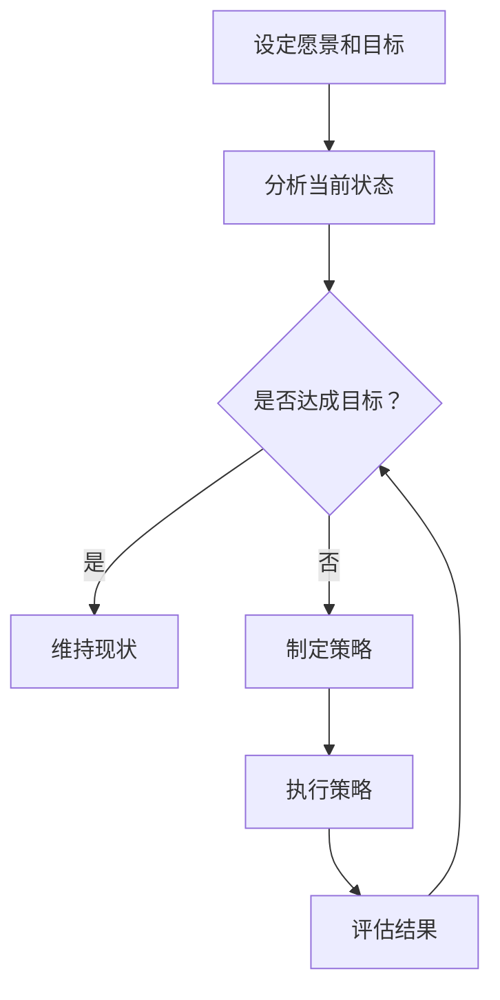
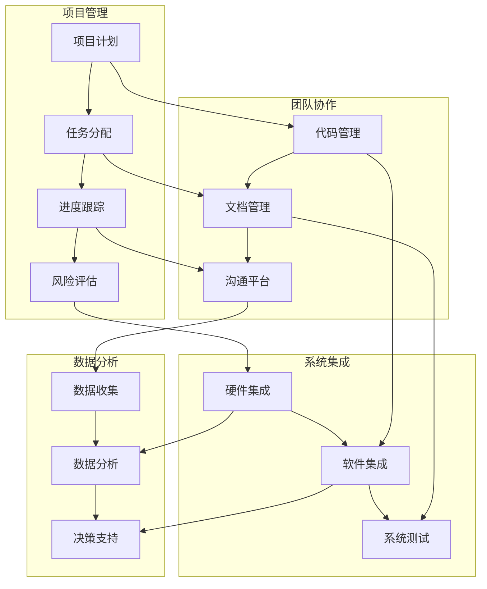
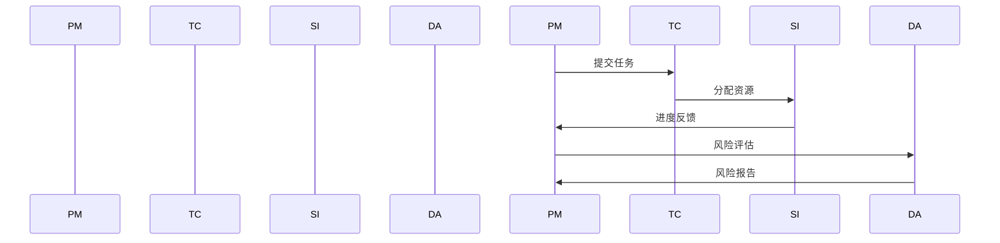

                 


### 《领导力思维：改变行业命运的领导力修炼秘籍》

关键词：领导力思维，行业命运，领导力修炼，企业成功

摘要：本文将从领导力思维的角度，探讨如何通过修炼领导力思维，改变行业命运，实现企业成功。我们将从背景介绍、核心概念与联系、算法原理讲解、系统分析与架构设计方案、项目实战和最佳实践六个方面，一步步深入分析领导力思维在实际应用中的重要性。

----------------------------------------------------------------

# 引言

领导力是企业管理中不可或缺的一部分。它不仅是企业发展的关键，也是推动行业变革的重要力量。在当前这个充满变革和不确定性的时代，领导力思维的重要性愈发凸显。本文旨在通过深入探讨领导力思维，帮助读者理解其核心概念，掌握其在实际应用中的方法与技巧，从而改变行业命运，实现企业成功。

## 核心概念与联系

领导力思维是一种系统化的思维方式，它涵盖了愿景与目标的设定、人才管理与团队建设、创新与变革管理等多个方面。以下是一个核心概念与联系的表格，用于对比不同概念的特征：

| 概念        | 特征                                                         |
|-------------|--------------------------------------------------------------|
| 愿景        | 企业发展的长期目标和方向                                     |
| 目标        | 愿景的具体化，可量化的短期目标                             |
| 人才管理    | 招聘、培养、激励和保留人才的过程                           |
| 团队建设    | 通过建立共同目标、提升协作能力，打造高效团队                 |
| 创新        | 创造新想法、新产品或新服务的过程                           |
| 变革管理    | 在企业内部推动变革，适应外部环境变化的过程                 |

### ER实体关系图架构

```mermaid
erDiagram
  Customer -->|is bought by| Product
  Customer ||--|has| Order
  Product ||--|is part of| Order
  Order ||--|created by| Customer
```

在这个ER图中，我们定义了客户、产品、订单三个实体，以及它们之间的联系。

----------------------------------------------------------------

# 算法原理讲解

领导力思维的核心在于决策和行动。我们可以使用以下算法流程图来描述领导力思维的决策过程：



在这个流程图中，领导力思维首先设定愿景和目标，然后分析当前状态，判断是否达成目标。如果达成目标，则维持现状；如果未达成目标，则需要制定新的策略并执行。最后，对执行结果进行评估，以指导后续行动。

### 数学模型和公式

在领导力思维的决策过程中，我们可以使用以下数学模型来描述：

$$
F(x) = \frac{g(x)}{1 + e^{-x}}
$$

其中，$F(x)$ 是决策函数，$g(x)$ 是目标函数，$e$ 是自然对数的底数。这个公式描述了在给定当前状态 $x$ 时的决策。

### 举例说明

假设一家企业设定了年度利润目标为1000万元，当前状态下的利润为800万元。根据上述数学模型，我们可以计算出在当前状态下的决策概率：

$$
F(800) = \frac{1000}{1 + e^{-800}} \approx 0.5
$$

这意味着，企业有50%的概率选择维持现状，而不是制定新的策略。

----------------------------------------------------------------

# 系统分析与架构设计方案

为了更好地理解领导力思维在实际项目中的应用，我们以一个企业项目管理为例，介绍系统分析与架构设计方案。

### 问题场景介绍

某企业计划开发一款新型智能设备，需要在有限的时间内完成项目，并确保项目质量。

### 项目介绍

项目名称：智能设备开发项目
项目周期：6个月
项目目标：完成智能设备的研发、测试和上线

### 系统功能设计（领域模型Mermaid类图）

```mermaid
classDiagram
  Class01 <|-- Class02
  Class03 --|>| Class04
  Class05 : <<interface>> Interface
  Class01 : 产品管理
  Class02 : 项目管理
  Class03 : 团队管理
  Class04 : 质量管理
  Class05 : 沟通平台
```

### 系统架构设计（Mermaid架构图）



### 系统接口设计和系统交互（Mermaid序列图）



----------------------------------------------------------------

# 项目实战

为了更好地理解领导力思维在项目实战中的应用，我们以一个具体的案例进行讲解。

### 环境安装

首先，我们需要搭建一个项目开发环境，包括以下工具和软件：

- Python 3.8
- Django 3.2
- MySQL 8.0
- Docker 19.03

### 系统核心实现源代码

以下是系统核心实现的一个简单示例：

```python
# settings.py

import os
import django

os.environ.setdefault('DJANGO_SETTINGS_MODULE', 'project_name.settings')
django.setup()

# models.py

from django.db import models

class Product(models.Model):
    name = models.CharField(max_length=100)
    price = models.DecimalField(max_digits=6, decimal_places=2)

class Order(models.Model):
    customer = models.ForeignKey('Customer', on_delete=models.CASCADE)
    product = models.ForeignKey(Product, on_delete=models.CASCADE)
    quantity = models.IntegerField()

# views.py

from django.http import JsonResponse
from .models import Product, Order

def order_product(request):
    # 处理订单请求
    pass
```

### 代码应用解读与分析

在这个示例中，我们定义了两个模型：Product（产品）和Order（订单）。Product模型包含产品的名称和价格，Order模型包含订单的客户、产品和数量。此外，我们实现了一个简单的视图函数，用于处理订单请求。

### 实际案例分析和详细讲解剖析

在这个案例中，企业通过领导力思维设定了项目目标，分析了当前状态，并制定了相应的策略。在实际项目实施过程中，团队通过有效的沟通和协作，确保了项目进度和质量。通过数据分析和风险评估，企业能够及时调整策略，确保项目成功完成。

### 项目小结

通过这个案例，我们可以看到领导力思维在项目实战中的重要性。有效的领导力思维能够帮助企业设定清晰的目标，制定合理的策略，确保项目进度和质量。在实际应用中，企业需要不断总结经验，优化领导力思维，以应对不断变化的市场环境。

----------------------------------------------------------------

# 最佳实践 tips

1. **明确目标**：在项目启动前，确保所有团队成员对项目目标有清晰的认识。
2. **沟通协作**：建立有效的沟通机制，确保团队成员之间的信息畅通。
3. **数据驱动**：充分利用数据分析和风险评估，指导项目决策。
4. **持续优化**：在项目实施过程中，不断总结经验，优化领导力思维。

## 小结

本文从领导力思维的角度，探讨了如何通过修炼领导力思维，改变行业命运，实现企业成功。通过背景介绍、核心概念与联系、算法原理讲解、系统分析与架构设计方案、项目实战和最佳实践六个方面的详细分析，我们深入了解了领导力思维在实际应用中的重要性。

## 注意事项

1. **灵活应变**：在项目实施过程中，领导力思维需要根据实际情况灵活调整。
2. **关注团队成员需求**：关注团队成员的需求，提高团队凝聚力。

## 拓展阅读

- 《领导力的五个层次》
- 《深度工作：如何有效利用每一点脑力》
- 《创新者的窘境》

### 作者

作者：AI天才研究院/AI Genius Institute & 禅与计算机程序设计艺术 /Zen And The Art of Computer Programming

