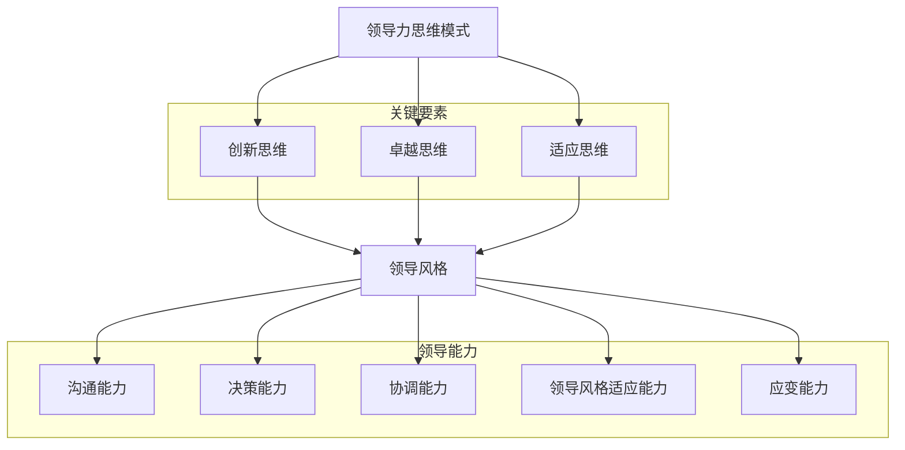
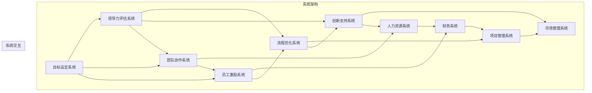

                 

### 第一部分：领导力的定义与背景

## 第1章：领导力的起源与演变

### 1.1 领导力的定义

领导力，作为一种社会现象，其定义因不同的文化和学科背景而有所不同。简单来说，领导力是指一种能够影响和激励他人，实现共同目标的能力。在组织管理中，领导力被认为是推动团队进步、达成目标的关键因素。

在历史的长河中，领导力一直是各领域关注的焦点。从古至今，无论是政治、军事、商业还是科技领域，领导力都发挥了至关重要的作用。在中国古代，领导力被理解为“德、才、功”的结合；在西方，领导力则强调“愿景、沟通、决策”的能力。

### 1.2 领导力在不同历史时期的演变

领导力的发展经历了从传统到现代的演变过程。在农业社会，领导力主要依赖于个人权威和家族势力；在工业社会，领导力则强调制度化和规范化；而在信息社会，领导力更注重创新和变革能力。

- **农业社会**：领导力以家族和传统为基础，领导者的权威主要来源于血缘关系和长期积累的威望。
- **工业社会**：领导力强调效率和专业性，领导者需要具备管理技能和组织能力。
- **信息社会**：领导力更加注重创新和适应性，领导者需要具备变革思维和跨领域整合能力。

### 1.3 领导力的重要性

领导力在组织中的作用不可小觑。首先，领导力能够塑造组织文化，形成共同的价值观和行为规范。其次，领导力能够激发员工的潜力，提高团队的工作效率。最后，领导力还能够帮助组织应对外部挑战，实现可持续发展。

在个人层面，领导力也是成功的关键因素。具备领导力的人往往能够更好地处理复杂问题，发挥团队优势，实现个人和组织的共同目标。

### 总结

领导力，作为一种能力，在不同历史时期、不同文化背景下有着不同的表现和定义。然而，其核心价值——影响和激励他人，始终未变。在当今信息社会，领导力的重要性更加凸显，它不仅是组织成功的基石，也是个人发展的关键。

----------------------------------------------------------------

## 第2章：领导力的重要性

### 2.1 领导力对企业的影响

领导力在企业中的作用是多方面的。首先，领导力能够塑造企业的文化和价值观，形成统一的团队理念，提高员工的凝聚力和归属感。这种文化氛围有助于企业长期稳定发展。

其次，领导力能够激发员工的潜能，提高工作效率。一个有领导力的领导者能够了解员工的优缺点，合理分配工作任务，激发员工的积极性和创造力。这不仅有助于企业完成短期目标，也为企业的长远发展打下坚实基础。

最后，领导力能够帮助企业应对外部挑战。在市场竞争日益激烈的今天，企业需要具备快速反应和创新能力。一个有领导力的领导者能够准确把握市场趋势，调整企业战略，带领团队迎接挑战，实现可持续发展。

### 2.2 领导力对社会的影响

领导力不仅仅对单个企业产生影响，它对社会也具有深远的影响。首先，领导力能够推动社会进步。一个有领导力的人，能够提出创新的观念，引领社会向前发展。例如，在科技领域，领导力推动了互联网、人工智能等新兴技术的发展，极大地改变了人们的生活方式。

其次，领导力能够促进社会和谐。一个有领导力的人，能够理解不同群体的需求，协调各方利益，实现社会的公平正义。例如，在政治领域，领导力帮助国家实现民族团结，推动社会进步。

最后，领导力能够培养下一代。一个有领导力的人，不仅自身具备卓越的能力，还能够通过言传身教，培养下一代人的领导力。这有助于形成良好的社会风气，推动社会的可持续发展。

### 2.3 领导力对个人职业发展的作用

领导力对个人职业发展具有重要作用。首先，具备领导力的人更容易获得晋升机会。在职场中，领导者往往承担更多的责任和挑战，因此具备领导力的人更容易被公司重视和提拔。

其次，领导力能够提升个人能力。领导力不仅包括管理能力和沟通能力，还包括决策能力、创新能力和应变能力。通过不断提升领导力，个人能够在多个方面得到锻炼，提升自身的综合素质。

最后，领导力有助于建立个人品牌。在当今社会，个人品牌已经成为一种重要的竞争力。具备领导力的人，往往能够更好地塑造个人形象，提升个人影响力。

### 总结

领导力在企业、社会和个人层面都具有重要的影响。它不仅是组织成功的基石，也是个人发展的关键。在当今社会，领导力的重要性愈发凸显。因此，无论是企业领导者还是普通员工，都应重视领导力的培养和实践。

----------------------------------------------------------------

# 第二部分：领导力的核心概念

## 第3章：领导力思维模式

领导力思维模式是领导力的核心组成部分，它决定了领导者如何思考、决策和行动。领导力思维模式包括创新思维、卓越思维和适应思维。

### 3.1 创新思维

创新思维是领导力思维模式的重要组成部分。创新思维是指领导者能够从不同角度审视问题，寻找新的解决方案，推动组织不断创新和发展。

#### 创新思维的特点

1. **开放性**：创新思维鼓励领导者拥抱新观念、新方法，勇于尝试。
2. **前瞻性**：创新思维使领导者能够预见未来的趋势和机遇，提前布局。
3. **系统性**：创新思维要求领导者从整体出发，系统思考，确保创新方案的可行性和可持续性。

#### 创新思维的应用

在企业管理中，创新思维可以帮助企业开拓新市场、推出新产品、提升服务质量。例如，苹果公司的创始人史蒂夫·乔布斯就是一个具有创新思维的领导者，他通过不断创新，推动了苹果公司的发展，使苹果成为全球最具价值的品牌之一。

### 3.2 卓越思维

卓越思维是领导力思维模式的另一个重要组成部分。卓越思维是指领导者追求卓越，不断提高自身的领导能力和管理水平。

#### 卓越思维的特点

1. **目标导向**：卓越思维使领导者明确目标，制定清晰的战略规划。
2. **持续学习**：卓越思维要求领导者不断学习新知识、新技能，提升自身素质。
3. **自我反省**：卓越思维鼓励领导者进行自我反省，从成功和失败中吸取经验教训。

#### 卓越思维的应用

在企业管理中，卓越思维可以帮助企业建立高效的管理体系，提升组织绩效。例如，微软公司创始人比尔·盖茨就是一个具有卓越思维的领导者，他通过不断学习和自我反省，推动了微软公司的发展，使其成为全球领先的软件企业。

### 3.3 适应思维

适应思维是领导力思维模式的最后一个重要组成部分。适应思维是指领导者能够灵活应对变化，调整策略，确保组织的稳定和发展。

#### 适应思维的特点

1. **灵活性**：适应思维使领导者能够迅速调整思路，应对突发状况。
2. **前瞻性**：适应思维要求领导者预见未来的变化，提前做好准备。
3. **系统性**：适应思维要求领导者从整体出发，全面考虑问题。

#### 适应思维的应用

在企业管理中，适应思维可以帮助企业应对市场变化，保持竞争优势。例如，华为公司的领导者任正非就是一个具有适应思维的领导者，他通过不断调整战略，带领华为在全球市场上取得了巨大成功。

### 总结

领导力思维模式是领导力的核心组成部分，包括创新思维、卓越思维和适应思维。这些思维模式决定了领导者的思考方式、决策方式和行动方式，对组织的成功和发展具有重要意义。领导者应不断培养和提升自己的思维模式，以应对不断变化的环境和挑战。

----------------------------------------------------------------

## 第4章：领导风格与领导能力

领导风格和领导能力是领导力的两个核心组成部分，它们相互影响，共同决定了领导者的领导效果。了解并掌握不同的领导风格和领导能力，有助于领导者更好地发挥自己的作用，实现组织目标。

### 4.1 领导风格

领导风格是指领导者对待下属、处理问题和实现目标的方式。不同的领导风格会对下属的动机、行为和组织绩效产生不同的影响。常见的领导风格包括权威型、民主型、参与型和教练型。

#### 权威型领导风格

权威型领导风格是指领导者对下属具有较高的权力和控制力，决策过程主要由领导者单独制定。这种风格通常适用于紧急情况和需要迅速做出决策的情境。

#### 民主型领导风格

民主型领导风格是指领导者鼓励下属参与决策过程，尊重下属的意见和建议。这种风格有助于提高下属的参与度和满意度，促进团队的合作与沟通。

#### 参与型领导风格

参与型领导风格是指领导者与下属共同参与决策过程，充分听取各方意见，共同制定决策。这种风格强调团队的协作和共同成长，适用于需要集体智慧和长期战略的情境。

#### 教练型领导风格

教练型领导风格是指领导者像教练一样，关注下属的成长和发展，提供指导和支持。这种风格有助于提高下属的能力和信心，培养未来的领导者。

### 4.2 领导能力

领导能力是指领导者具备的与领导职位相关的能力和素质。领导能力包括沟通能力、决策能力、协调能力、领导风格适应能力和应变能力等。

#### 沟通能力

沟通能力是领导能力的重要组成部分。领导者需要具备有效的沟通技巧，能够清晰、准确地传达信息，理解下属的需求和意见，建立良好的沟通渠道。

#### 决策能力

决策能力是指领导者能够在复杂、不确定的情况下做出合理、有效的决策。领导者需要具备分析问题、评估风险、权衡利弊的能力，确保决策的正确性和可行性。

#### 协调能力

协调能力是指领导者能够协调不同部门、不同团队之间的工作，确保组织目标的实现。领导者需要具备协调各方利益、处理冲突的能力，建立良好的团队关系。

#### 领导风格适应能力

领导风格适应能力是指领导者能够根据不同的情境和下属特点，灵活调整自己的领导风格，以实现最佳领导效果。领导者需要具备自我认知和情境感知能力，能够适应不同的领导环境。

#### 应变能力

应变能力是指领导者能够在突发状况下迅速做出反应，调整策略，确保组织的稳定和发展。领导者需要具备快速思考、灵活应变的能力，能够在压力下保持冷静和理智。

### 4.3 领导风格与领导能力的相互作用

领导风格和领导能力是相辅相成的。领导风格决定了领导者如何影响下属，而领导能力则决定了领导者如何有效地实施领导。一个优秀的领导者需要在不同的情境下，灵活运用不同的领导风格和领导能力，以达到最佳领导效果。

例如，在需要快速做出决策的紧急情况下，领导者可以采用权威型领导风格，迅速做出决策；而在需要团队合作和创新的情境下，领导者可以采用民主型或参与型领导风格，鼓励下属参与决策，激发团队创造力。

### 总结

领导风格和领导能力是领导力的两个核心组成部分，它们共同决定了领导者的领导效果。领导者需要了解并掌握不同的领导风格和领导能力，根据不同的情境和下属特点，灵活运用和调整自己的领导方式，以实现组织目标。

----------------------------------------------------------------

## 第5章：领导力核心概念关系图

为了更清晰地理解领导力的核心概念及其相互关系，我们可以使用Mermaid流程图来展示这些概念之间的联系。以下是领导力核心概念的Mermaid流程图：

### 5.1 领导力概念关系图

在这张关系图中，我们可以看到：

1. **领导力思维模式**是领导力的核心，包括**创新思维**、**卓越思维**和**适应思维**。
2. **领导风格**与**领导能力**密切相关，领导风格决定了领导者如何影响下属，而领导能力则决定了领导者如何有效地实施领导。
3. **沟通能力**、**决策能力**、**协调能力**、**领导风格适应能力**和**应变能力**是领导能力的具体体现。

### 5.2 领导力要素关联分析

通过关系图，我们可以更直观地理解领导力各要素之间的关联：

- **创新思维**和**卓越思维**强调领导者的思维方式和战略规划能力，它们直接影响领导风格和领导能力。
- **适应思维**使领导者能够灵活应对外部环境的变化，适应不同的领导情境。
- **领导风格**和**领导能力**相互影响，领导风格决定了领导者的行为方式，而领导能力则决定了领导者如何有效地实施领导。
- **沟通能力**、**决策能力**、**协调能力**、**领导风格适应能力**和**应变能力**是领导能力的具体体现，它们共同构成了领导者的综合素质。

### 总结

领导力核心概念关系图为我们提供了一个直观的视角，帮助我们理解领导力的各个组成部分及其相互关系。通过这张图，我们可以更好地把握领导力的本质，提升自己的领导能力，实现组织目标。

----------------------------------------------------------------

# 第三部分：领导力原理解析

## 第6章：领导力算法原理

领导力虽然不是一门精确的科学，但我们可以尝试将其视为一种算法，通过逻辑推理和数据分析来理解和应用。在这一章中，我们将探讨领导力的算法原理，并使用一个简单的案例来展示其应用。

### 6.1 领导力算法模型

领导力算法模型可以看作是一个包含输入、处理和输出的系统。其输入包括领导者的个人特质、团队特征和环境因素；处理过程包括决策、沟通和激励；输出则是领导效果，即团队绩效、员工满意度和组织目标实现情况。

#### 领导力算法模型的组成部分：

1. **输入**：领导者的个人特质（如领导风格、价值观、知识水平）、团队特征（如技能、态度、文化背景）和环境因素（如竞争压力、市场变化）。
2. **处理过程**：领导者的决策过程（如问题分析、方案评估、决策实施）、沟通过程（如信息传递、反馈收集、意见协调）和激励过程（如目标设定、奖励机制、情感关怀）。
3. **输出**：领导效果（如团队绩效、员工满意度、组织目标实现情况）。

#### 领导力算法模型的特点：

1. **动态性**：领导力算法模型是一个动态系统，其输入、处理和输出会随着时间和环境的变化而不断调整。
2. **适应性**：领导力算法模型能够根据不同的情境和团队特征，灵活调整领导策略和方式。
3. **综合性**：领导力算法模型综合考虑了领导者的个人特质、团队特征和环境因素，实现全面、系统的领导。

### 6.2 领导力算法应用

为了更好地理解领导力算法的应用，我们可以通过一个简单的案例来进行分析。

#### 案例背景

某公司是一家新兴科技公司，正处于快速发展的阶段。公司创始人兼CEO李明是一位富有创新精神的领导者，他希望通过有效的领导力策略，推动公司持续创新，保持市场竞争力。

#### 领导力算法应用步骤：

1. **输入分析**：
   - **个人特质**：李明具有创新思维、卓越决策能力和强烈的使命感。
   - **团队特征**：团队由一群年轻、有激情的工程师组成，但缺乏经验，需要李明的指导和激励。
   - **环境因素**：市场竞争激烈，公司需要在技术创新和产品开发上取得突破。

2. **处理过程**：
   - **决策**：李明通过深入分析市场趋势和公司资源，制定了以技术创新为核心的发展战略。
   - **沟通**：李明定期与团队成员沟通，了解他们的需求和意见，同时分享公司的战略目标和愿景。
   - **激励**：李明通过设立激励机制，鼓励团队成员提出创新想法，并为优秀员工提供奖励和晋升机会。

3. **输出评估**：
   - **领导效果**：通过李明的领导力策略，公司实现了多次技术创新，产品开发周期缩短，市场竞争力显著提升。
   - **团队绩效**：团队成员的积极性和创造力得到大幅提高，团队凝聚力增强。
   - **组织目标**：公司实现了快速发展，市场份额不断扩大，实现了李明设定的组织目标。

### 6.3 领导力算法案例解析

通过上述案例，我们可以看到领导力算法的应用过程：

1. **输入分析**：领导者需要了解自身特质、团队特征和环境因素，为领导策略的制定提供基础。
2. **处理过程**：领导者需要根据输入信息，进行决策、沟通和激励，确保团队目标的实现。
3. **输出评估**：领导者需要不断评估领导效果，调整领导策略，实现组织目标。

### 总结

领导力算法原理为我们提供了一种理解和应用领导力的方法。通过输入分析、处理过程和输出评估，领导者可以更有效地发挥领导作用，推动团队和组织的发展。在实际应用中，领导者需要不断学习和实践，结合具体情境，灵活运用领导力算法，以实现最佳领导效果。

----------------------------------------------------------------

## 第7章：领导力案例解析

为了更好地理解领导力在实际中的应用，我们可以通过两个典型的案例来分析领导力的成功与失败，并从中汲取启示。

### 7.1 企业领导力成功案例

**案例一：苹果公司的领导力**

苹果公司作为全球科技领域的领导者，其成功离不开史蒂夫·乔布斯这位卓越的领导者。乔布斯以其独特的产品设计理念和创新思维，引领苹果公司取得了辉煌的成就。

**成功因素分析**：

1. **创新思维**：乔布斯具备强烈的创新意识，他不仅关注产品的技术性能，更注重用户体验。这种创新思维推动了苹果公司推出了一系列革命性产品，如iPhone、iPad等。

2. **愿景与使命**：乔布斯始终坚守苹果公司的愿景和使命，致力于创造卓越的产品和服务，这种坚定的愿景激发了员工的积极性和创造力。

3. **领导风格**：乔布斯采用了参与型领导风格，他鼓励员工提出创新想法，并通过团队协作来实现公司目标。这种领导风格促进了员工的参与感和归属感。

4. **沟通能力**：乔布斯擅长与团队成员沟通，他能够清晰传达公司的战略方向和目标，同时倾听员工的意见和建议，形成有效的沟通渠道。

**启示**：

1. **注重创新**：领导者应具备创新思维，不断探索新的发展方向和机会。

2. **明确愿景与使命**：领导者需要明确公司的愿景和使命，并将其作为指导团队行动的准则。

3. **采用参与型领导风格**：领导者应鼓励员工参与决策过程，激发团队的创造力和积极性。

4. **提升沟通能力**：领导者需要建立有效的沟通机制，确保信息流畅，增强团队的凝聚力和执行力。

### 7.2 领导力失败案例分析

**案例二：诺基亚的领导力失败**

诺基亚曾是全球手机市场的领导者，但由于领导力的失败，导致公司最终被苹果和安卓系统超越。诺基亚的领导力失败主要表现在以下几个方面：

**失败原因分析**：

1. **保守的领导风格**：诺基亚的领导者过于保守，缺乏创新精神，未能及时应对市场变化和消费者需求。

2. **忽视新兴技术**：诺基亚在智能手机兴起时，未能及时调整战略，忽视了对新兴技术的投资和研发，导致在市场中被竞争对手超越。

3. **缺乏有效的激励机制**：诺基亚缺乏对员工的激励机制，未能充分调动员工的积极性和创造力。

4. **沟通不畅**：诺基亚内部沟通不畅，领导者未能及时了解市场动态和员工需求，导致决策滞后。

**启示**：

1. **避免保守的领导风格**：领导者应具备开放和创新的精神，勇于接受新观念和新技术。

2. **重视新兴技术**：领导者需要关注新兴技术的发展趋势，及时调整战略，抓住市场机遇。

3. **建立有效的激励机制**：领导者应通过激励措施，激发员工的积极性和创造力。

4. **提升沟通能力**：领导者需要建立高效的沟通机制，确保信息流畅，增强团队的凝聚力和执行力。

### 7.3 案例启示与借鉴

通过以上两个案例，我们可以得出以下启示：

1. **成功领导力的关键在于创新思维、明确的愿景和使命、参与型领导风格以及有效的沟通能力**。

2. **失败领导力的主要原因是保守的领导风格、忽视新兴技术、缺乏有效的激励机制和沟通不畅**。

3. **领导者应不断学习和实践，结合具体情境，灵活运用领导力，以实现最佳领导效果**。

通过这些案例，我们可以更好地理解领导力在实际中的应用，从而在个人和组织层面提升领导力，实现更好的发展。

### 总结

领导力案例解析为我们提供了宝贵的实践经验。通过分析成功和失败的领导力案例，我们可以汲取经验教训，提升自己的领导能力。在实际应用中，领导者应注重创新思维、明确愿景和使命、采用参与型领导风格，并建立有效的沟通机制，以实现组织的长期稳定发展。

----------------------------------------------------------------

# 第四部分：领导力数学模型

## 第8章：绩效模型与领导力评分

在领导力研究领域，绩效模型和领导力评分模型是常用的工具，用于评估领导效果和改进领导策略。本章将介绍这些模型的基本概念、构建方法以及在实际应用中的使用。

### 8.1 绩效模型概述

绩效模型是用于衡量组织和个人绩效的一种方法。它包括一系列指标和测量方法，用于评估领导者的绩效和团队的整体表现。绩效模型通常包括以下组成部分：

1. **目标设定**：明确组织和个人在特定时间段内需要达成的目标。
2. **关键绩效指标（KPIs）**：衡量目标达成度的关键指标。
3. **数据收集**：收集与绩效相关的数据，如销售额、客户满意度、项目完成进度等。
4. **评估与反馈**：对绩效进行评估，并提供反馈，以帮助领导者改进。

### 8.2 领导力评分模型

领导力评分模型是用于评估领导者能力的一种方法。它通过一系列标准化的指标，对领导者的绩效进行定量评估。领导力评分模型通常包括以下组成部分：

1. **指标设定**：确定评估领导力的关键指标，如沟通能力、决策能力、团队协作等。
2. **评分标准**：为每个指标设定评分标准，通常采用1到5或0到10的评分等级。
3. **评分方法**：根据领导者的表现，为其各项指标评分，并计算总分。
4. **评估与反馈**：对领导力评分进行分析，提供反馈，以帮助领导者了解自身的优势和不足。

### 8.3 绩效与领导力的关系分析

绩效模型和领导力评分模型之间存在紧密的联系。绩效模型可以衡量领导者的绩效，而领导力评分模型则可以评估领导者的能力。以下是对它们之间关系的分析：

1. **领导力对绩效的影响**：领导力对组织的绩效有直接和间接的影响。直接影响体现在领导者的决策、沟通和激励等方面，这些行为会影响团队的绩效。例如，一个具备良好沟通能力的领导者能够更好地传达目标，提高团队的执行力。间接影响则体现在领导者的领导风格和价值观，这些因素会塑造组织的文化和氛围，进而影响组织的整体绩效。

2. **绩效对领导力的反作用**：绩效模型的反馈可以帮助领导者了解自身的能力和不足，从而改进领导策略。一个高绩效的团队通常需要一个高绩效的领导者。因此，领导者的绩效直接影响团队的表现。同时，团队的绩效也会反过来影响领导者的声誉和地位，从而影响其领导力的发展。

### 绩效模型与领导力评分模型的应用示例

为了更好地理解绩效模型和领导力评分模型的应用，我们可以通过以下示例来进行分析：

**示例一：某公司的绩效模型**

某公司采用关键绩效指标（KPIs）来衡量领导者的绩效。关键绩效指标包括以下方面：

- 销售额：衡量领导者的市场开拓能力。
- 客户满意度：衡量领导者对客户服务的质量。
- 项目完成进度：衡量领导者的项目管理能力。

每个关键绩效指标都有具体的评分标准和权重。例如，销售额占40%的权重，客户满意度占30%，项目完成进度占30%。

**示例二：某公司的领导力评分模型**

某公司采用领导力评分模型来评估领导者的能力。领导力评分模型包括以下关键指标：

- 沟通能力：评估领导者与团队成员的沟通效果。
- 决策能力：评估领导者在复杂情境下的决策能力。
- 团队协作：评估领导者促进团队协作的能力。

每个关键指标都有具体的评分标准，例如：

- 沟通能力：1-5分，5分为最高。
- 决策能力：1-5分，5分为最高。
- 团队协作：1-5分，5分为最高。

领导力的总分通过对每个指标的评分进行加权平均计算得出。

### 总结

绩效模型和领导力评分模型是评估领导效果的重要工具。它们可以帮助领导者了解自身的绩效和能力，提供改进的方向。在实际应用中，领导者需要根据具体情况，灵活运用这些模型，以实现组织的长期稳定发展。

----------------------------------------------------------------

## 第9章：领导力与组织效能

领导力对组织效能有着重要的影响。组织效能是指组织在实现其目标过程中的有效性和效率。本章将探讨领导力与组织效能之间的关系，分析领导力对组织效能的具体影响，并介绍一些提升组织效能的领导力策略。

### 9.1 组织效能模型

要理解领导力如何影响组织效能，首先需要了解组织效能的模型。组织效能模型通常包括以下关键组成部分：

1. **目标明确性**：组织能否明确其目标，并确保所有成员都清楚组织的方向。
2. **资源利用**：组织是否能够有效地利用人力资源、财务资源和技术资源等。
3. **流程优化**：组织是否建立了有效的流程，确保工作的高效和高效。
4. **员工激励**：组织是否能够激励员工，提高员工的工作积极性和创造力。
5. **创新能力**：组织是否具备创新能力，能够在市场竞争中保持竞争优势。

### 9.2 领导力对组织效能的影响

领导力对组织效能的影响体现在以下几个方面：

1. **目标设定与实现**：领导力能够帮助组织设定明确的目标，并制定实现目标的战略。一个具备领导力的领导者能够引导团队朝着共同的目标努力，提高组织的整体绩效。

2. **资源整合**：领导力能够促进资源的有效整合。一个有领导力的领导者能够了解组织的资源需求，合理配置人力资源、财务资源和技术资源等，确保资源的最大化利用。

3. **流程优化**：领导力能够推动组织流程的优化。一个具备领导力的领导者能够识别组织中的瓶颈和问题，提出改进方案，并推动实施，从而提高组织的工作效率和效能。

4. **员工激励**：领导力能够激发员工的潜力，提高员工的工作积极性和创造力。一个有领导力的领导者能够关注员工的需求，提供适当的激励措施，帮助员工实现个人和职业发展。

5. **创新能力**：领导力能够推动组织的创新能力。一个具备领导力的领导者能够鼓励员工提出创新想法，支持创新项目，推动组织在市场竞争中保持领先地位。

### 9.3 领导力与组织效能的关系

领导力与组织效能之间存在密切的关系。一个有效的领导力能够提高组织的效能，而低效的领导力则会降低组织的效能。以下是一些领导力对组织效能的影响实例：

1. **创新思维**：领导者的创新思维能够推动组织在产品研发、市场开拓等方面取得突破，从而提高组织的市场竞争力。

2. **沟通能力**：领导者的沟通能力能够促进组织内部的信息流通，提高决策效率，减少误解和冲突。

3. **团队协作**：领导者的团队协作能力能够推动团队成员之间的合作，形成合力，提高组织的工作效率和效能。

4. **领导风格**：领导者的领导风格对组织效能有重要影响。例如，参与型领导风格能够激发员工的积极性和创造力，提高组织效能。

5. **应变能力**：领导者的应变能力能够帮助组织应对外部环境的变化，保持组织的稳定和发展。

### 提升组织效能的领导力策略

为了提升组织效能，领导者可以采取以下策略：

1. **明确目标**：领导者需要明确组织的短期和长期目标，并确保所有成员都清楚组织的方向。

2. **培养团队协作**：领导者需要推动团队协作，建立信任和合作的文化，提高团队的执行力。

3. **激励员工**：领导者需要关注员工的需求，提供适当的激励措施，激发员工的工作积极性和创造力。

4. **优化流程**：领导者需要识别组织中的瓶颈和问题，提出改进方案，并推动实施，提高组织的工作效率和效能。

5. **鼓励创新**：领导者需要鼓励员工提出创新想法，支持创新项目，推动组织在市场竞争中保持领先地位。

### 总结

领导力对组织效能有着重要的影响。一个有效的领导力能够提高组织的效能，推动组织实现其目标。领导者需要通过明确目标、培养团队协作、激励员工、优化流程和鼓励创新等策略，提升组织效能，实现组织的长期稳定发展。

----------------------------------------------------------------

## 第10章：领导力系统架构设计

在设计领导力系统时，我们需要考虑系统的整体架构，以确保领导力能够有效地应用于组织中。以下是一个简单的领导力系统架构设计，包括系统功能设计、系统架构设计、系统接口设计和系统交互。

### 10.1 系统功能设计

领导力系统的功能设计包括以下几个方面：

1. **目标设定**：帮助领导者明确组织的短期和长期目标，确保团队朝着共同的方向努力。
2. **领导力评估**：通过绩效模型和领导力评分模型，评估领导者的能力，提供改进建议。
3. **团队协作**：促进团队成员之间的沟通与合作，提高团队的执行力。
4. **员工激励**：提供激励机制，激发员工的工作积极性和创造力。
5. **流程优化**：识别组织中的瓶颈和问题，提出改进方案，优化工作流程。
6. **创新支持**：鼓励员工提出创新想法，支持创新项目，推动组织持续发展。

### 10.2 系统架构设计

领导力系统的架构设计需要考虑以下几个方面：

1. **技术架构**：选择合适的技术栈，如Java、Python、Spring框架等，确保系统的稳定性和扩展性。
2. **数据架构**：设计合理的数据模型，存储领导力评估数据、团队协作数据和员工激励数据等。
3. **安全架构**：确保系统的安全性，包括用户认证、数据加密和访问控制等。

### 10.3 系统接口设计

领导力系统需要与其他系统进行交互，如人力资源系统、财务系统和项目管理系统等。接口设计需要考虑以下几个方面：

1. **API设计**：设计清晰、简洁的API接口，方便其他系统调用。
2. **数据格式**：选择合适的数据格式，如JSON、XML等，确保数据传输的效率和安全性。
3. **协议选择**：选择合适的网络协议，如HTTP、HTTPS等，确保数据传输的可靠性和安全性。

### 10.4 系统交互

领导力系统与其他系统的交互包括以下几个方面：

1. **数据同步**：领导力系统需要与其他系统同步数据，如员工信息、绩效数据和项目进度数据等。
2. **任务调度**：领导力系统需要根据任务调度需求，与其他系统进行协调，如绩效评估任务的执行和反馈等。
3. **事件触发**：领导力系统需要根据特定事件触发其他系统，如员工激励事件的触发和通知等。

### 10.5 设计示例

以下是一个简单的领导力系统架构设计示例，使用Mermaid流程图展示：

在这个示例中，领导力系统包括目标设定、领导力评估、团队协作、员工激励、流程优化和创新支持等子系统。这些子系统与其他系统（如人力资源系统、财务系统、项目管理系统和市场管理系统）进行数据同步和任务调度。

### 总结

领导力系统架构设计是一个复杂的过程，需要综合考虑系统功能、技术架构、数据架构、接口设计和系统交互。通过合理的设计，领导力系统能够有效地应用于组织中，提高领导效果和团队绩效，推动组织的长期稳定发展。

----------------------------------------------------------------

## 第11章：领导力系统实施与评估

在领导力系统设计完成后，我们需要进行系统的实施和评估，以确保系统能够顺利运行并达到预期效果。以下是领导力系统实施与评估的详细步骤和关键点。

### 11.1 系统实施步骤

1. **前期准备**：
   - **需求分析**：明确领导力系统的功能需求和性能要求，确保系统设计符合实际需求。
   - **技术选型**：选择合适的技术栈和开发工具，确保系统的稳定性和可扩展性。
   - **团队组建**：组建一个专业的开发团队，负责领导力系统的开发和实施。

2. **系统开发**：
   - **模块开发**：根据系统架构设计，分模块进行开发，确保每个模块的功能和性能满足需求。
   - **集成测试**：将各个模块进行集成测试，确保系统各部分的协同工作。

3. **系统部署**：
   - **环境配置**：搭建开发、测试和生产环境，确保系统在各个环境中都能正常运行。
   - **部署上线**：将开发完成的领导力系统部署到生产环境，确保系统正式上线。

4. **用户培训**：
   - **操作手册**：编写详细的操作手册，帮助用户了解系统的功能和操作方法。
   - **培训课程**：组织培训课程，对用户进行系统操作培训，确保用户能够熟练使用系统。

### 11.2 系统评估方法

1. **功能测试**：
   - **自动化测试**：使用自动化测试工具进行功能测试，确保系统的每个功能都能正常运行。
   - **手动测试**：模拟用户操作，对系统的功能进行手动测试，发现潜在的问题。

2. **性能测试**：
   - **负载测试**：模拟高并发场景，测试系统的性能和稳定性。
   - **压力测试**：测试系统在极端条件下的性能表现，确保系统能够应对突发情况。

3. **用户体验测试**：
   - **可用性测试**：评估系统的易用性，确保用户能够轻松操作系统。
   - **界面美观性测试**：评估系统的界面设计和用户体验，确保系统美观且易于操作。

4. **数据分析**：
   - **用户行为分析**：收集用户操作数据，分析用户的使用习惯和需求。
   - **系统性能分析**：分析系统的性能指标，发现潜在的瓶颈和优化点。

### 11.3 评估结果与应用

1. **问题诊断**：
   - 根据评估结果，诊断系统存在的问题和不足，制定优化方案。

2. **优化改进**：
   - 根据诊断结果，对系统进行优化改进，提高系统的性能和用户体验。

3. **反馈与调整**：
   - 收集用户的反馈，结合评估结果，对系统进行调整和改进，确保系统能够满足用户需求。

### 总结

领导力系统的实施与评估是一个关键环节，它关系到系统的成功运行和实际效果。通过系统的实施和评估，我们可以发现系统的问题和不足，进行优化改进，确保领导力系统能够有效支持组织的管理和发展。

----------------------------------------------------------------

## 第12章：领导力提升项目规划

为了提升组织领导力，制定一个明确的领导力提升项目规划至关重要。本章节将详细介绍领导力提升项目的背景、目标、范围和关键里程碑，帮助组织有计划地推进领导力提升工作。

### 12.1 项目背景

当前，随着市场竞争的加剧和组织的不断发展，领导力问题逐渐成为影响组织绩效和发展的关键因素。许多组织发现，领导者缺乏创新思维、团队协作能力和应变能力等问题制约了组织的发展。因此，提升领导力已成为组织亟待解决的重要课题。

### 12.2 项目目标

领导力提升项目的目标主要包括：

1. **提高领导者的创新思维能力**：通过培训和实践，帮助领导者培养创新思维，推动组织创新。
2. **提升领导者的团队协作能力**：通过团队建设活动，增强领导者与团队成员之间的合作，提高团队执行力。
3. **增强领导者的应变能力**：通过情境模拟和案例分析，提高领导者应对突发情况和变化的能力。
4. **提升领导者的整体领导力水平**：通过系统性的培训和辅导，全面提升领导者的领导力素质。

### 12.3 项目范围

领导力提升项目应涵盖以下范围：

1. **领导者培训**：包括创新思维培训、团队协作培训、领导力发展培训和应变能力培训等。
2. **领导力评估**：通过领导力评分模型，对领导者的领导力进行评估，识别优势和不足。
3. **领导力发展计划**：根据评估结果，为每位领导者制定个性化的领导力发展计划，并提供持续的辅导和支持。
4. **团队建设活动**：通过团队拓展训练、团队协作竞赛等活动，增强团队凝聚力和执行力。

### 12.4 关键里程碑

领导力提升项目应设定以下关键里程碑：

1. **需求调研**：通过问卷调查、访谈等方式，了解组织的领导力现状和需求，为项目规划提供依据。
2. **项目启动**：召开项目启动会议，明确项目目标、范围和里程碑，确定项目团队成员和责任分配。
3. **培训与辅导**：组织领导者培训，进行领导力评估，并根据评估结果制定领导力发展计划。
4. **评估与反馈**：定期评估领导力提升项目的效果，收集反馈意见，进行项目调整和优化。
5. **项目总结**：在项目结束后，进行总结和评估，总结项目成果和经验教训，为未来领导力提升工作提供参考。

### 12.5 项目计划

为了确保领导力提升项目的顺利进行，需要制定详细的项目计划。以下是一个简单的项目计划示例：

1. **需求调研（1个月）**：
   - 开展问卷调查和访谈，收集领导力现状和需求。
   - 分析调研数据，确定领导力提升的重点方向。

2. **项目启动（1周）**：
   - 召开项目启动会议，明确项目目标、范围和里程碑。
   - 确定项目团队成员和责任分配。

3. **领导者培训（3个月）**：
   - 组织创新思维培训、团队协作培训、领导力发展培训和应变能力培训。
   - 为每位领导者提供个性化的领导力发展计划。

4. **领导力评估（2个月）**：
   - 使用领导力评分模型，对领导者的领导力进行评估。
   - 根据评估结果，为每位领导者制定领导力发展计划。

5. **团队建设活动（2个月）**：
   - 组织团队拓展训练、团队协作竞赛等活动，增强团队凝聚力和执行力。

6. **评估与反馈（1个月）**：
   - 定期评估领导力提升项目的效果，收集反馈意见。
   - 根据反馈意见，进行项目调整和优化。

7. **项目总结（1周）**：
   - 进行项目总结和评估，总结项目成果和经验教训。
   - 为未来领导力提升工作提供参考。

### 总结

领导力提升项目规划是一个系统的过程，需要明确项目背景、目标、范围和关键里程碑，制定详细的项目计划。通过科学的规划和管理，领导力提升项目能够有效地提升领导者的领导力，推动组织的持续发展。

----------------------------------------------------------------

## 第13章：领导力项目实施

领导力提升项目规划完成后，关键的下一步是实施。有效的实施是项目成功的关键，确保所有计划和预期目标得以实现。以下是领导力项目实施的具体步骤和注意事项。

### 13.1 实施步骤

1. **启动会议**：
   - 召开启动会议，介绍项目背景、目标、范围和里程碑，确保所有项目团队成员对项目有清晰的认识。
   - 明确项目团队成员的角色和职责，确保每个人了解自己的任务和期望成果。

2. **培训与辅导**：
   - 根据项目规划，组织领导者参加相应的培训课程，包括创新思维、团队协作、领导力发展和应变能力等。
   - 安排一对一的领导力辅导，帮助领导者理解和应用培训内容，解决实际工作中的问题。

3. **领导力评估**：
   - 使用领导力评分模型，对领导者的领导力进行评估，收集反馈，识别优势和不足。
   - 将评估结果与领导者进行沟通，制定改进计划，确保领导者能够针对评估结果采取具体行动。

4. **团队建设活动**：
   - 安排团队拓展训练和团队协作竞赛等活动，增强团队成员之间的沟通与合作，提升团队凝聚力和执行力。

5. **持续监控与调整**：
   - 定期检查项目进度，确保项目按照计划进行，及时发现和解决问题。
   - 根据项目实施过程中收集到的反馈，及时调整项目计划和行动方案，确保项目目标的实现。

6. **项目总结**：
   - 在项目结束时，组织总结会议，回顾项目实施过程，总结经验和教训。
   - 对项目成果进行评估，确保所有项目目标和预期成果得以实现。

### 13.2 实施注意事项

1. **明确目标**：
   - 在项目启动阶段，确保所有团队成员对项目目标有清晰的认识，明确项目的重要性和紧迫性。

2. **资源保障**：
   - 确保项目所需的人力、财务和技术资源充足，避免资源不足导致项目进度延误。

3. **沟通与协作**：
   - 建立有效的沟通机制，确保项目团队成员之间的信息畅通，促进协作和合作。

4. **灵活调整**：
   - 项目实施过程中，可能会遇到各种意外情况，领导者需要具备灵活调整计划的能力，确保项目目标的实现。

5. **持续反馈**：
   - 定期收集项目团队成员的反馈，了解项目的进展和问题，及时调整和优化项目计划。

6. **持续支持**：
   - 在项目实施过程中，为领导者提供持续的支持和辅导，帮助他们克服困难，实现领导力提升目标。

### 总结

领导力提升项目的实施是一个复杂的过程，需要精心规划和管理。通过明确的实施步骤、充分的资源保障、有效的沟通与协作、灵活的调整和持续的反馈支持，领导力提升项目能够顺利实施，达成预期目标，为组织的长期发展奠定坚实基础。

----------------------------------------------------------------

## 第14章：领导力项目评估

在领导力提升项目实施完成后，对项目进行全面的评估至关重要。这不仅能够验证项目目标的实现情况，还能为未来的领导力提升工作提供宝贵的经验和数据支持。以下是领导力项目评估的步骤、方法和标准。

### 14.1 评估步骤

1. **收集数据**：
   - 收集项目实施过程中产生的各种数据，包括领导力评估结果、培训记录、团队协作数据、员工反馈等。

2. **数据分析**：
   - 对收集到的数据进行整理和分析，识别项目实施过程中取得的成绩和存在的问题。

3. **评估会议**：
   - 召开项目评估会议，邀请项目团队成员、领导和外部专家参与，共同讨论项目评估结果。

4. **总结报告**：
   - 根据评估会议的讨论结果，撰写项目评估报告，总结项目成果、经验教训和改进建议。

5. **反馈与改进**：
   - 将评估报告中的反馈和建议反馈给项目团队成员和领导，制定改进计划，确保项目成果的持续优化。

### 14.2 评估方法

1. **定量评估**：
   - 使用领导力评分模型等定量工具，对领导者的领导力进行量化评估，分析领导力提升的效果。

2. **定性评估**：
   - 通过访谈、观察和问卷调查等定性方法，收集员工和领导对项目实施过程的反馈，了解项目对团队和组织的影响。

3. **对比分析**：
   - 将项目实施前后的数据进行分析对比，评估项目对组织绩效和领导力的具体影响。

4. **标杆对比**：
   - 与其他类似项目的评估结果进行对比，分析项目实施过程中的优势和不足。

### 14.3 评估标准

1. **目标达成度**：
   - 评估项目是否实现了预定的目标，如领导力提升、团队协作能力提高、员工满意度提升等。

2. **项目执行效果**：
   - 评估项目实施过程中的执行效果，包括计划执行、资源利用、风险控制等。

3. **员工反馈**：
   - 收集员工对项目实施过程的反馈，了解员工对项目内容和形式的满意度。

4. **领导力提升效果**：
   - 评估领导者的领导力水平是否得到提升，包括领导能力、决策能力、沟通能力和团队管理能力等。

5. **组织绩效**：
   - 评估项目对组织绩效的影响，包括销售额、客户满意度、项目完成率等关键绩效指标。

### 14.4 评估结果与应用

1. **总结成果**：
   - 对项目实施过程中取得的成绩进行总结，为未来的领导力提升项目提供参考。

2. **分析问题**：
   - 对项目实施过程中出现的问题进行深入分析，找出根本原因，制定改进措施。

3. **优化计划**：
   - 根据评估结果和反馈，对未来的领导力提升项目进行优化，确保项目目标的实现。

4. **培训与发展**：
   - 针对评估中发现的问题，为领导者提供针对性的培训和辅导，提高他们的领导能力。

5. **持续监控**：
   - 在项目结束后，持续监控领导力提升的效果，确保项目成果的长期稳定。

### 总结

领导力项目评估是一个系统性的过程，通过对项目实施结果进行全面、细致的评估，组织能够准确了解领导力提升项目的效果，为未来的领导力发展工作提供有力支持。通过科学的评估方法和严格的评估标准，组织能够持续提升领导力，推动组织的长期稳定发展。

----------------------------------------------------------------

## 第15章：领导力最佳实践

在领导力提升过程中，借鉴和实践最佳实践是非常重要的。以下是一些领导力最佳实践，帮助领导者提升领导力，推动组织发展。

### 15.1 定期反馈

领导者应定期与团队成员进行一对一的反馈会议，了解他们的工作进展、困惑和需求。通过这些反馈，领导者可以及时发现问题，提供指导和支持，确保团队成员能够充分发挥潜力。

### 15.2 培养团队精神

团队精神是领导力的核心之一。领导者应通过团队建设活动、共同目标设定等方式，培养团队成员的归属感和责任感，增强团队的凝聚力。

### 15.3 透明沟通

领导者应建立透明的沟通机制，确保团队内部的信息畅通。通过定期的团队会议、公开的邮件和通知等方式，领导者可以分享公司战略、项目进展和重要决策，让团队成员了解组织的全貌。

### 15.4 鼓励创新

领导者应鼓励员工提出创新想法，并为创新项目提供支持。通过设立创新奖项、鼓励内部创业等方式，领导者可以激发员工的创造力，推动组织的持续创新。

### 15.5 激励与奖励

领导者应根据员工的表现，提供适当的激励和奖励。这包括晋升、奖金、荣誉等，让员工感受到自己的价值和成就，提高工作积极性。

### 15.6 个人成长

领导者应关注自身的成长，不断学习新知识、新技能，提升领导能力。通过参加培训课程、阅读专业书籍等方式，领导者可以不断丰富自己的知识体系，为组织的发展提供有力支持。

### 总结

领导力最佳实践是领导者提升领导力和推动组织发展的关键。通过定期反馈、培养团队精神、透明沟通、鼓励创新、激励与奖励以及个人成长，领导者可以有效地提升领导力，推动组织的长期稳定发展。

----------------------------------------------------------------

## 第16章：小结与展望

通过对领导力核心概念、原理和最佳实践的分析，我们可以得出以下结论：

1. **领导力的重要性**：领导力不仅是组织成功的基石，也是个人职业发展的关键。领导者通过创新思维、卓越思维和适应思维，能够有效地影响和激励他人，推动团队和组织的发展。

2. **领导力模型**：领导力模型包括领导力思维模式、领导风格和领导能力。这些模型帮助我们理解领导力的本质，掌握提升领导力的方法。

3. **领导力应用**：领导力在绩效管理、团队协作、创新支持等方面发挥着重要作用。通过科学的绩效模型和领导力评分模型，领导者可以更准确地评估和提升自身的领导力。

4. **最佳实践**：借鉴最佳实践，如定期反馈、透明沟通、鼓励创新等，领导者可以更好地发挥领导作用，推动组织的持续发展。

展望未来，领导力将继续在组织和个人发展中发挥重要作用。随着科技的进步和社会的变化，领导力也将不断发展和进化。领导者需要不断学习和实践，适应新的挑战和机遇，成为引领组织发展的卓越领导者。

### 总结

领导力是一种重要的能力，它对组织和个人都具有深远的影响。通过理解领导力的核心概念、原理和最佳实践，领导者可以更好地发挥自己的作用，推动组织的持续发展。未来，领导者需要具备前瞻性和创新性，不断适应变化，成为引领组织前进的卓越领导者。

----------------------------------------------------------------

## 第17章：注意事项

在领导力提升和实践过程中，领导者需要关注以下几个方面，以确保领导力提升项目的顺利进行和预期目标的实现。

1. **持续学习与反思**：领导者应保持持续学习的态度，不断更新自己的知识和技能。同时，定期进行反思，从成功和失败中吸取经验教训，不断提升领导能力。

2. **适应变革**：领导力提升是一个动态的过程，领导者需要适应外部环境的变化，及时调整领导策略和方法。面对不确定性和挑战，领导者应具备快速应变的能力。

3. **关注员工需求**：领导者应关注员工的需求和感受，建立良好的沟通机制，确保员工能够积极参与组织的目标实现。同时，领导者应关注员工的职业发展，提供成长机会。

4. **建立信任**：领导者需要建立与团队成员之间的信任关系，通过透明、公正和诚信的行为赢得员工的信任。信任是领导力的基础，有助于提升团队的凝聚力和执行力。

5. **合理分配资源**：领导者应合理分配资源，确保领导力提升项目有足够的支持。这包括人力资源、财务资源和技术资源等，确保项目能够顺利实施。

6. **持续改进**：领导力提升是一个持续改进的过程。领导者应定期评估项目效果，根据评估结果调整项目计划，不断优化领导力提升策略。

7. **关注长期目标**：领导者应关注组织的长期目标，将领导力提升与组织战略相结合，确保领导力提升能够支持组织的长期发展。

### 总结

在领导力提升过程中，领导者需要关注持续学习、适应变革、关注员工需求、建立信任、合理分配资源和持续改进等方面。通过关注这些注意事项，领导者可以更好地发挥领导作用，推动组织的持续发展和成功。

----------------------------------------------------------------

## 第18章：拓展阅读

为了更深入地了解领导力的各个方面，以下是一些建议的拓展阅读资源，涵盖了领导力理论、实践案例、相关研究等，适合不同层次和需求的读者。

1. **领导力经典著作**：
   - 《领导力五项修炼》（作者：约翰·科特）
   - 《领导者的语言》（作者：约瑟夫·M·马奇）
   - 《变革之舞》（作者：约翰·P·科里）

2. **领导力研究论文**：
   - 《哈佛商业评论》：定期发布关于领导力的研究文章和案例分析。
   - 《管理学报》：收录了大量的领导力研究成果，适合对领导力理论有兴趣的读者。

3. **领导力实践指南**：
   - 《领导力：如何成为高效的领导者》（作者：安妮·杜克）
   - 《领导力的艺术》（作者：詹姆斯·马奇）
   - 《领导力实践指南：从新手到卓越领导者的转型》（作者：丹尼斯·雷恩哈特）

4. **领导力案例研究**：
   - 《领导力案例集》：收录了不同行业、不同情境下的领导力案例，适合案例分析。
   - 《领导力故事》（作者：斯蒂芬·罗宾斯）：通过真实案例，讲述了领导力在不同情境中的应用。

5. **领导力在线课程**：
   - Coursera、edX等在线教育平台提供了多种领导力课程，包括基础理论、领导风格、团队管理等方面。

### 总结

通过阅读这些拓展资源，读者可以更全面地了解领导力的理论、实践和研究动态，提升自己的领导力水平，为组织的成功发展提供有力支持。

---

# 作者信息

作者：AI天才研究院/AI Genius Institute & 禅与计算机程序设计艺术 /Zen And The Art of Computer Programming

