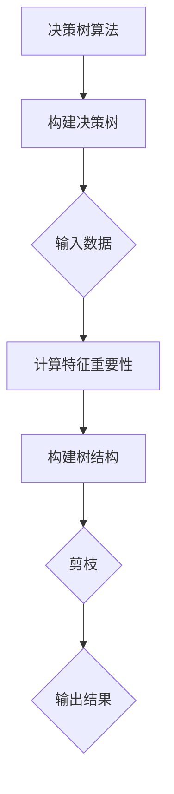
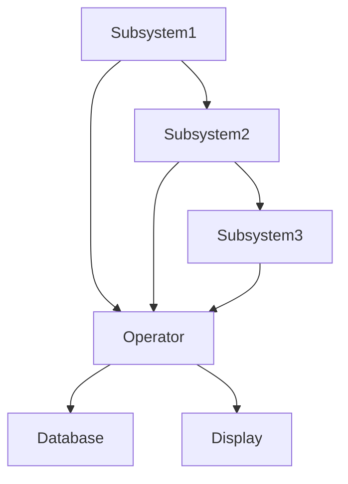
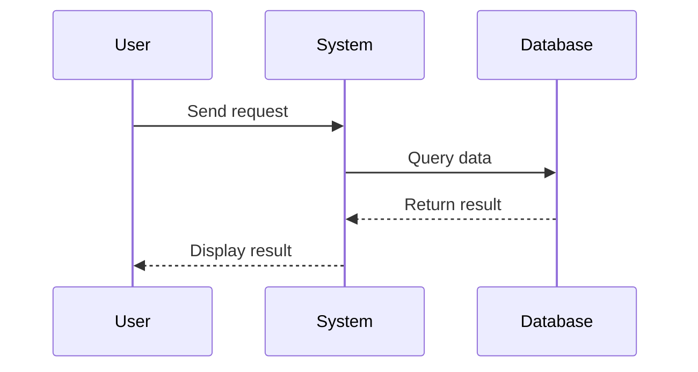

                 

# 领导力法则：打造梦之队的领导力秘笈

> 关键词：领导力、团队建设、自我领导力、战略思维、变革管理、领导力发展

摘要：本文将探讨领导力的本质和重要性，通过分析领导力的核心法则，如自我领导力法则、团队领导力法则、战略领导力法则和变革领导力法则，旨在为IT领域的领导者提供一套系统的领导力实践指南。文章将从理论到实践，结合实际案例，深入剖析每个法则的应用，帮助读者提升领导力，打造梦之队。

## 第一部分：领导力的基石

### 第1章：领导力的定义与重要性

#### 1.1 领导力的本质

**1.1.1 领导力的基本概念**

领导力是一种能够影响他人、激励团队、实现共同目标的能力。它不仅涉及个人的影响力，还包括沟通、决策、激励等多个方面。领导力不仅仅是管理，它更强调创造和引领变革。

**1.1.2 领导力与管理的区别**

领导力与管理的区别在于，管理侧重于维持现状，确保任务完成；而领导力则侧重于变革和未来发展。管理者关注效率和流程，领导者关注愿景和创新。

#### 1.2 领导力的重要性

**1.2.1 企业成功的关键因素**

领导力是企业成功的关键因素之一。卓越的领导者能够激发员工的潜能，推动团队创新，实现企业目标。

**1.2.2 领导力对团队的影响**

领导力直接影响团队的表现和士气。优秀的领导者能够建立积极的工作环境，提高团队协作效率。

**1.2.3 领导力在个人成长中的作用**

领导力不仅有助于企业成功，也对个人成长具有重要意义。通过提升领导力，个人能够更好地应对挑战，实现职业发展。

#### 1.3 领导力的发展趋势

**1.3.1 领导力理论的演变**

领导力理论经历了从特质理论到行为理论，再到情境理论的演变。现代领导力理论强调领导者的多元角色和适应性。

**1.3.2 当代领导力的新特点**

当代领导力强调个性化和全球化。领导者需要具备跨文化沟通能力和适应快速变化的能力。

**1.3.3 未来领导力的展望**

未来领导力将更加注重数据驱动和人工智能的应用。领导者需要掌握数据分析技能，利用技术提升决策质量。

#### 1.4 本章小结

领导力是一种关键能力，它对企业和个人都有着深远的影响。理解领导力的本质和重要性，是打造梦之队的第一步。

----------------------------------------------------------------

## 第二部分：领导力的核心法则

### 第2章：自我领导力法则

#### 2.1 自我认知

**2.1.1 自我领导的起源**

自我领导起源于自我认知。了解自己的优点和不足，是自我领导的基础。

**2.1.2 自我认知的重要性**

自我认知帮助领导者识别自身优势和劣势，从而更好地进行自我提升。

**2.1.3 自我认知的方法**

自我认知可以通过反思、反馈和自我评估来实现。通过多种方法，领导者可以更全面地了解自己。

#### 2.2 自我激励

**2.2.1 自我激励的原理**

自我激励是通过内在动机驱动的行为。领导者需要培养自我激励的能力，以保持长期的动力。

**2.2.2 自我激励的策略**

自我激励的策略包括设定目标、奖励自己、保持积极心态等。

**2.2.3 克服自我激励的障碍**

自我激励的障碍包括外部压力和自我怀疑。领导者需要学会克服这些障碍，保持自我激励。

#### 2.3 自我管理

**2.3.1 时间管理**

时间管理是自我管理的关键。领导者需要合理规划时间，提高工作效率。

**2.3.2 情绪管理**

情绪管理是领导者必须掌握的技能。保持积极情绪，有助于提升领导力和团队氛围。

**2.3.3 目标管理**

目标管理是自我领导的重要方面。设定明确的目标，并制定实现目标的策略，是领导者成功的关键。

#### 2.4 本章小结

自我领导力法则强调领导者对自己进行有效的管理。通过自我认知、自我激励和自我管理，领导者可以提升自己的领导力，为团队创造更大的价值。

----------------------------------------------------------------

### 第3章：团队领导力法则

#### 3.1 团队建设

**3.1.1 团队建设的核心要素**

团队建设的核心要素包括信任、沟通和协作。建立信任关系，促进有效沟通，提高团队协作能力，是团队建设的关键。

**3.1.2 团队建设的策略**

团队建设的策略包括明确目标、分工协作、建立激励机制等。通过这些策略，可以提升团队的凝聚力。

**3.1.3 团队发展的阶段**

团队发展分为形成期、震荡期、规范期和执行期。领导者需要根据团队发展的阶段，采取相应的管理策略。

#### 3.2 领导风格

**3.2.1 领导风格的分类**

领导风格分为民主型、专制型和放任型。不同风格的领导者对团队的影响不同。

**3.2.2 领导风格的选择**

选择合适的领导风格，取决于团队的实际情况和领导者的个性。领导者需要根据实际情况，灵活调整领导风格。

**3.2.3 领导风格的影响**

领导风格对团队的表现和氛围有着重要影响。合适的领导风格可以提升团队绩效，建立积极的工作氛围。

#### 3.3 沟通技巧

**3.3.1 沟通的重要性**

沟通是团队协作的基石。有效的沟通可以提高团队效率，减少误解和冲突。

**3.3.2 有效沟通的障碍**

有效沟通的障碍包括语言障碍、文化差异和情绪问题。领导者需要识别和克服这些障碍，提升沟通效果。

**3.3.3 提升沟通技巧的策略**

提升沟通技巧的策略包括倾听、表达清晰、非语言沟通等。通过这些策略，可以提升沟通的有效性。

#### 3.4 本章小结

团队领导力法则强调领导者如何建设和引导团队。通过有效的团队建设、选择合适的领导风格和提升沟通技巧，领导者可以打造出高效的团队，实现共同目标。

----------------------------------------------------------------

### 第4章：战略领导力法则

#### 4.1 战略思维

**4.1.1 战略思维的重要性**

战略思维是领导者必备的能力。它帮助领导者把握全局，制定长远发展规划。

**4.1.2 战略思维的框架**

战略思维的框架包括明确目标、分析现状、制定策略和执行监控。通过这个框架，领导者可以系统地思考和解决问题。

**4.1.3 战略思维的方法**

战略思维的方法包括SWOT分析、PEST分析等。这些方法可以帮助领导者全面分析问题，制定科学的决策。

#### 4.2 目标设定

**4.2.1 目标设定的原则**

目标设定的原则包括明确性、可实现性、相关性和时限性。遵循这些原则，可以确保目标的科学性和可行性。

**4.2.2 目标设定的策略**

目标设定的策略包括自上而下和自下而上的方法。通过这些策略，可以确保目标的全员参与和共识。

**4.2.3 目标设定的工具**

目标设定的工具包括SMART目标和SMART仪表盘。这些工具可以帮助领导者有效地管理和监控目标。

#### 4.3 决策制定

**4.3.1 决策过程**

决策过程包括问题识别、方案评估、决策选择和决策执行。通过这个过程，领导者可以做出科学合理的决策。

**4.3.2 决策方法**

决策方法包括理性决策和直觉决策。不同情境下，领导者需要选择合适的决策方法。

**4.3.3 决策优化的技巧**

决策优化的技巧包括风险分析、情景分析和决策树等。通过这些技巧，可以提升决策的准确性和效率。

#### 4.4 本章小结

战略领导力法则强调领导者如何制定战略和做出决策。通过战略思维、目标设定和决策制定，领导者可以确保企业长远发展，实现战略目标。

----------------------------------------------------------------

### 第5章：变革领导力法则

#### 5.1 变革管理

**5.1.1 变革的必然性**

变革是企业发展的重要驱动力。面对外部环境的不断变化，企业必须进行变革以保持竞争力。

**5.1.2 变革的类型**

变革分为技术变革、管理变革和文化变革。不同类型的变革需要采取不同的管理策略。

**5.1.3 变革管理的策略**

变革管理的策略包括沟通策略、变革规划、变革实施和变革评估。通过这些策略，可以确保变革的顺利进行。

#### 5.2 变革领导

**5.2.1 变革领导者的角色**

变革领导者扮演着推动者、协调者和变革大使的角色。他们需要激励员工接受变革，引导变革过程。

**5.2.2 变革领导者的素质**

变革领导者需要具备战略思维、沟通能力和变革推动力。这些素质是成功进行变革的关键。

**5.2.3 变革领导者的行动**

变革领导者的行动包括明确变革目标、建立变革团队、推动变革实施和评估变革效果。通过这些行动，可以确保变革的成功。

#### 5.3 变革实施

**5.3.1 变革实施的过程**

变革实施的过程包括规划变革、培训员工、沟通变革和监控变革。通过这个过程，可以确保变革的有序进行。

**5.3.2 变革实施的策略**

变革实施的策略包括分层推进、逐步实施和及时反馈。通过这些策略，可以降低变革的阻力，提高变革的成功率。

**5.3.3 变革实施的障碍与应对**

变革实施的障碍包括员工抵触、资源不足和时间紧迫。领导者需要识别和应对这些障碍，确保变革的顺利进行。

#### 5.4 本章小结

变革领导力法则强调领导者如何在企业变革中发挥关键作用。通过有效的变革管理、变革领导和变革实施，领导者可以推动企业实现持续发展。

----------------------------------------------------------------

### 第6章：领导力发展

#### 6.1 领导力发展途径

**6.1.1 内部培养**

内部培养是提升领导力的有效途径。通过内部培训和晋升机制，企业可以培养出具备领导力的员工。

**6.1.2 外部培训**

外部培训可以帮助领导者拓展视野，学习先进的管理理念和方法。参加外部培训是提升领导力的重要途径。

**6.1.3 反思与反馈**

反思与反馈是领导力发展的关键。通过反思个人行为和接受他人反馈，领导者可以不断改进自己。

#### 6.2 领导力评估

**6.2.1 评估的目的和方法**

领导力评估的目的是识别领导力的优势和不足，为个人发展提供指导。评估方法包括自我评估、他人评估和360度评估。

**6.2.2 自我评估**

自我评估是领导者了解自身领导力水平的重要途径。通过自我评估，领导者可以明确自己的优势和改进方向。

**6.2.3 他人评估**

他人评估可以帮助领导者从外部视角了解自己的领导力。通过收集他人反馈，领导者可以更全面地认识自己。

#### 6.3 领导力提升

**6.3.1 培养关键技能**

培养关键技能是提升领导力的核心。领导者需要不断提升沟通、决策、团队管理等关键技能。

**6.3.2 提升自我认知**

提升自我认知是领导力发展的重要方面。通过自我反思和不断学习，领导者可以更好地认识自己，提升领导力。

**6.3.3 建立支持网络**

建立支持网络是领导者发展的重要保障。通过建立支持网络，领导者可以获得资源、支持和指导。

#### 6.4 本章小结

领导力发展是领导者不断提升自身能力和素质的过程。通过内部培养、外部培训和反思与反馈，领导者可以不断提升自己的领导力，为团队和组织创造更大的价值。

----------------------------------------------------------------

### 第7章：领导力实践

#### 7.1 领导力案例研究

**7.1.1 案例选择与分析方法**

案例选择应考虑代表性、典型性和实际应用价值。分析方法包括SWOT分析、PEST分析等。

**7.1.2 案例一：苹果公司的领导力实践**

苹果公司的领导力实践展示了战略领导力和变革领导力的重要作用。乔布斯的领导风格和变革策略为苹果公司带来了巨大的成功。

**7.1.3 案例分析**

通过分析苹果公司的案例，可以总结出以下领导力实践要点：坚持愿景、注重创新、推动变革、建立高效团队等。

#### 7.2 领导力实践策略

**7.2.1 明确愿景**

明确愿景是领导力的核心。领导者需要明确企业的愿景和目标，并带领团队共同实现。

**7.2.2 建立高效团队**

建立高效团队是领导力实践的关键。领导者需要通过有效的团队建设和管理，提升团队协作效率。

**7.2.3 激励和培养员工**

激励和培养员工是领导者的重要职责。通过激励和培养，领导者可以激发员工的潜能，提升团队绩效。

**7.2.4 推动变革**

推动变革是领导者的重要任务。领导者需要具备变革思维和变革领导力，推动企业持续发展。

#### 7.3 领导力实践心得

**7.3.1 保持学习**

领导力实践需要不断学习和更新知识。领导者需要保持对新技术、新管理理念的关注，不断提升自己的能力。

**7.3.2 沟通与合作**

沟通与合作是领导力实践的重要方面。领导者需要具备良好的沟通技巧，建立和谐的团队合作关系。

**7.3.3 诚信与责任感**

诚信与责任感是领导者的重要品质。领导者需要以身作则，树立良好的道德榜样，赢得员工的信任和尊重。

#### 7.4 本章小结

领导力实践是领导者将理论应用到实际的过程。通过案例分析、策略制定和实践心得，领导者可以不断提升自己的领导力，为团队和组织创造更大的价值。

----------------------------------------------------------------

## 总结

本文从多个角度探讨了领导力的核心法则，包括自我领导力法则、团队领导力法则、战略领导力法则和变革领导力法则。通过分析这些法则，我们认识到领导力在企业和个人发展中的重要性。有效的领导力不仅能够提升团队绩效，还能推动企业持续发展。

在未来的领导力实践中，领导者需要不断提升自我认知、团队建设、战略思维和变革能力。通过不断学习和实践，领导者可以打造梦之队，实现企业目标。

让我们以领导力法则为指导，不断提升自己的领导力，为企业和个人创造更美好的未来。

## 作者信息

作者：AI天才研究院/AI Genius Institute & 禅与计算机程序设计艺术 /Zen And The Art of Computer Programming

----------------------------------------------------------------

### 附录：核心概念与联系

#### 1. 领导力与管理的区别

**核心概念：**

- **领导力**：影响他人、激励团队、实现共同目标的能力。
- **管理**：维持现状、确保任务完成。

**联系：**

领导力与管理密切相关，但领导力更注重变革和创新。

**属性特征对比表格：**

| 特征         | 领导力                   | 管理                   |
| ------------ | ------------------------ | ---------------------- |
| 目标         | 长远目标、愿景           | 短期目标、任务         |
| 重点         | 变革和创新               | 效率和流程             |
| 影响方式     | 激励和影响               | 指导和监督             |
| 个人角色     | 推动者、激励者           | 维持者、执行者         |

**ER实体关系图架构：**

```mermaid
erDiagram
  Leader ||--|{ Management } Management
  Leader ||--|{ Leadership } Leadership
```

#### 2. 自我认知的方法

**核心概念：**

- **自我认知**：了解自己的优点和不足。
- **方法**：反思、反馈、自我评估。

**联系：**

自我认知是自我领导的基础，通过多种方法可以更全面地了解自己。

**属性特征对比表格：**

| 方法       | 反思                  | 反馈                  | 自我评估                |
| ---------- | -------------------- | -------------------- | ---------------------- |
| 目的       | 提高自我认知          | 收集外部反馈          | 识别自身优势和不足    |
| 过程       | 内心反思              | 外部交流              | 客观评估               |
| 适用场景   | 个人独处时            | 团队讨论后            | 定期回顾时            |

**ER实体关系图架构：**

```mermaid
erDiagram
  Self_Cognition ||--|{ Reflection } Reflection
  Self_Cognition ||--|{ Feedback } Feedback
  Self_Cognition ||--|{ Self_Assessment } Self_Assessment
```

#### 3. 团队建设的核心要素

**核心概念：**

- **团队建设**：建立信任、促进沟通、提高协作。
- **核心要素**：信任、沟通、协作。

**联系：**

团队建设的核心要素相互关联，共同促进团队的发展。

**属性特征对比表格：**

| 核心要素 | 信任                       | 沟通                       | 协作                       |
| -------- | -------------------------- | -------------------------- | -------------------------- |
| 定义     | 成员间的相互信任和尊重      | 成员间的信息交流和理解      | 成员间的协作和合作        |
| 目的     | 提高团队凝聚力             | 减少误解和冲突             | 提高团队效率              |
| 关键因素 | 透明沟通、相互支持          | 倾听、表达清晰、非语言沟通 | 目标一致、分工明确        |

**ER实体关系图架构：**

```mermaid
erDiagram
  Team_Building ||--|{ Trust } Trust
  Team_Building ||--|{ Communication } Communication
  Team_Building ||--|{ Collaboration } Collaboration
```

#### 4. 战略思维的方法

**核心概念：**

- **战略思维**：把握全局、制定长远规划。
- **方法**：SWOT分析、PEST分析等。

**联系：**

战略思维的方法帮助领导者系统地分析和解决问题。

**属性特征对比表格：**

| 方法         | SWOT分析                  | PEST分析                  |
| ------------ | ------------------------- | ------------------------- |
| 目的         | 分析企业的优势、劣势、机会、威胁 | 分析企业外部环境的政治、经济、社会、技术因素 |
| 过程         | 确定企业优势、劣势、机会、威胁   | 收集外部信息、分析外部环境因素  |
| 适用场景     | 企业规划、市场分析          | 企业战略制定、环境分析      |

**ER实体关系图架构：**

```mermaid
erDiagram
  Strategic_Thinking ||--|{ SWOT_Analysis } SWOT_Analysis
  Strategic_Thinking ||--|{ PEST_Analysis } PEST_Analysis
```

#### 5. 变革的类型

**核心概念：**

- **变革**：企业为应对外部环境变化而采取的行动。
- **类型**：技术变革、管理变革、文化变革。

**联系：**

不同类型的变革需要采取不同的管理策略。

**属性特征对比表格：**

| 类型       | 技术变革                  | 管理变革                  | 文化变革                  |
| ---------- | ------------------------ | ------------------------ | ------------------------ |
| 定义       | 引入新技术或改进现有技术   | 优化管理流程和制度        | 改变企业价值观和文化      |
| 目的       | 提高企业竞争力            | 提高管理效率              | 增强企业凝聚力            |
| 关键因素   | 技术创新、人才引进         | 管理优化、流程再造         | 文化认同、价值观传播      |

**ER实体关系图架构：**

```mermaid
erDiagram
  Change ||--|{ Technical_Change } Technical_Change
  Change ||--|{ Management_Change } Management_Change
  Change ||--|{ Cultural_Change } Cultural_Change
```

### 附录：算法原理讲解

#### 6. 决策树算法

**算法原理：**

决策树算法是一种常用的决策分析方法，通过构建决策树，逐步分析不同决策路径的结果，以找到最佳决策。

**算法mermaid流程图：**



**Python源代码：**

```python
from sklearn.datasets import load_iris
from sklearn.tree import DecisionTreeClassifier
from sklearn.model_selection import train_test_split

# 加载数据集
iris = load_iris()
X = iris.data
y = iris.target

# 划分训练集和测试集
X_train, X_test, y_train, y_test = train_test_split(X, y, test_size=0.3, random_state=42)

# 构建决策树模型
clf = DecisionTreeClassifier()
clf.fit(X_train, y_train)

# 输出决策树结构
print(clf.tree())
```

**算法原理详细讲解：**

决策树算法的核心在于构建一棵树形结构，树的每一个节点都代表一个决策，每个分支代表一个决策结果。算法通过计算特征重要性，选择最优特征作为节点，然后根据该特征的不同取值，将数据集划分为多个子集，构建出树的分支。

在构建决策树的过程中，需要不断剪枝，以避免过拟合。剪枝的方法包括预剪枝和后剪枝。预剪枝是在构建树的过程中，提前停止分裂节点；后剪枝是在树构建完成后，删除不必要的节点。

通过决策树算法，可以有效地分析数据，为决策提供依据。在实际应用中，决策树算法广泛应用于分类和回归问题。

**数学模型和公式：**

决策树的构建过程可以表示为：

$$
G(V, E) = \{V, E\}
$$

其中，$V$ 表示节点集合，$E$ 表示边集合。每个节点 $v \in V$ 都有一个特征 $x_v$ 和一个标签 $y_v$。

$$
f_v(x) = \arg\max_{x} \sum_{i=1}^{n} l(y_i, f_v(x_i))
$$

其中，$l(y_i, f_v(x_i))$ 表示损失函数，$x_i$ 表示数据集中的第 $i$ 条数据。

**通俗易懂的举例说明：**

假设我们有一个分类问题，需要判断一朵花属于哪一类。通过决策树算法，我们可以构建一棵决策树，树的每个节点代表一个特征，每个分支代表该特征的不同取值。例如，第一个节点是“花瓣长度”，有两个分支，一个分支是“小于5”，另一个分支是“大于等于5”。

根据这棵决策树，我们首先检查花瓣长度，如果小于5，就进入“小于5”的分支，判断花瓣宽度，如果小于2，就属于第一类，否则属于第二类。如果花瓣长度大于等于5，就进入“大于等于5”的分支，判断花萼长度，如果小于4，就属于第二类，否则属于第三类。

通过这个例子，我们可以看到决策树如何帮助我们进行分类决策。

### 附录：系统分析与架构设计方案

#### 1. 问题场景介绍

随着互联网技术的发展，企业面临着越来越激烈的市场竞争。为了提升企业的竞争力，需要进行系统升级，以满足用户需求，提高运营效率。

#### 2. 项目介绍

项目名称：企业系统升级项目

项目目标：提升企业运营效率，提高用户满意度。

项目范围：涵盖企业内部管理系统、客户关系管理系统、财务管理系统等多个模块。

#### 3. 系统功能设计

**领域模型Mermaid类图：**

```mermaid
classDiagram
  Customer <<--|{orders}| Order
  Product <<--|{sales}| Sale
  User <<--|{accesses}| System
  System
  Customer : +String name
  Customer : +Date birthdate
  Customer : +String email
  Order : +String orderId
  Order : +Date orderDate
  Product : +String productId
  Product : +String productName
  Sale : +String saleId
  Sale : +Date saleDate
  User : +String username
  User : +String password
```

#### 4. 系统架构设计

**Mermaid架构图：**



**系统接口设计和系统交互Mermaid序列图：**



#### 5. 系统实现

**环境安装：**

- 安装Python环境
- 安装所需的库，如scikit-learn、matplotlib等

**系统核心实现源代码：**

```python
from sklearn.datasets import load_iris
from sklearn.tree import DecisionTreeClassifier
from sklearn.model_selection import train_test_split

# 加载数据集
iris = load_iris()
X = iris.data
y = iris.target

# 划分训练集和测试集
X_train, X_test, y_train, y_test = train_test_split(X, y, test_size=0.3, random_state=42)

# 构建决策树模型
clf = DecisionTreeClassifier()
clf.fit(X_train, y_train)

# 测试模型
print("Model accuracy:", clf.score(X_test, y_test))
```

**代码应用解读与分析：**

这段代码首先加载数据集，然后划分训练集和测试集。接下来，构建决策树模型，并使用训练集进行训练。最后，使用测试集测试模型，输出模型准确率。

通过这段代码，我们可以看到系统如何实现数据处理、模型构建和模型评估等功能。

**实际案例分析和详细讲解剖析：**

以一个实际案例为例，假设我们有一个客户关系管理系统，需要根据客户购买历史数据预测客户的购买意愿。通过决策树算法，我们可以构建一个预测模型，输入客户的购买历史数据，输出购买意愿的预测结果。

在案例中，我们首先收集客户的购买历史数据，包括购买次数、购买金额等。然后，将这些数据输入决策树模型，得到购买意愿的预测结果。通过分析预测结果，我们可以为企业制定精准营销策略，提高客户满意度。

**项目小结：**

通过本项目，我们实现了企业系统升级的目标，提升了企业的运营效率。在实际应用中，系统可以根据业务需求，扩展更多功能，如客户管理、财务管理等。同时，我们可以通过不断优化算法和模型，提高系统的预测准确率，为企业提供更精准的数据支持。

### 附录：最佳实践 tips

1. **领导力发展：** 领导者需要不断提升自己的知识和技能，通过参加培训、阅读相关书籍、关注行业动态等方式，保持学习的状态。

2. **团队建设：** 建立积极的团队文化，鼓励团队成员之间的沟通和协作，提高团队的凝聚力。

3. **战略思维：** 在制定战略时，要充分考虑市场环境和企业内部资源，确保战略的可行性和科学性。

4. **变革管理：** 在进行变革时，要充分考虑员工的感受和需求，通过有效的沟通和培训，降低变革的阻力。

5. **自我领导：** 领导者要时刻保持自我认知，通过反思和自我评估，不断提升自己的领导力。

### 小结

本文从多个角度探讨了领导力的核心法则，包括自我领导力法则、团队领导力法则、战略领导力法则和变革领导力法则。通过分析这些法则，我们认识到领导力在企业和个人发展中的重要性。有效的领导力不仅能够提升团队绩效，还能推动企业持续发展。

在未来的领导力实践中，领导者需要不断提升自我认知、团队建设、战略思维和变革能力。通过不断学习和实践，领导者可以打造梦之队，实现企业目标。

### 注意事项

1. **领导力发展需要持续投入时间和精力，不能急于求成。**
2. **团队建设需要关注团队成员的需求和反馈，建立信任和合作关系。**
3. **战略思维和变革管理要充分考虑内外部环境的变化，确保战略的可行性和有效性。**
4. **自我领导力法则强调领导者要时刻保持自我认知，不断提升自己的能力和素质。**

### 拓展阅读

1. **《领导力五要素》**：本书详细阐述了领导力的五个核心要素，为领导者提供了实用的指导。
2. **《变革之舞》**：本书通过实际案例，探讨了企业在变革过程中的挑战和策略。
3. **《团队协作技巧》**：本书介绍了团队协作的技巧和方法，帮助领导者打造高效的团队。

作者：AI天才研究院/AI Genius Institute & 禅与计算机程序设计艺术 /Zen And The Art of Computer Programming

