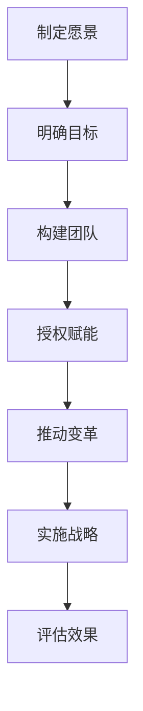
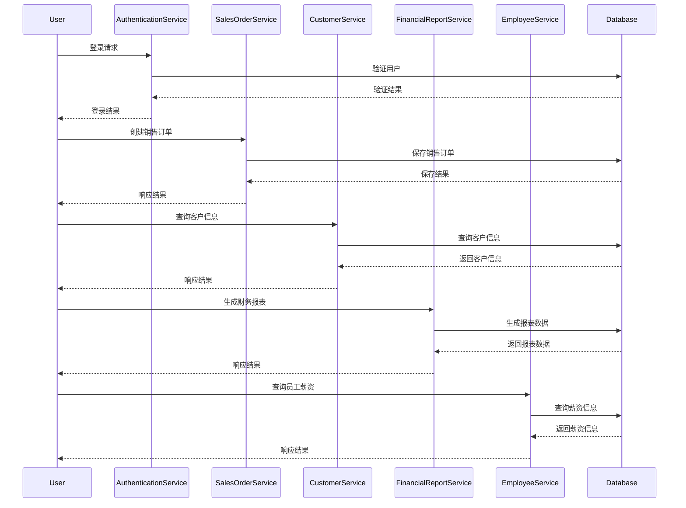
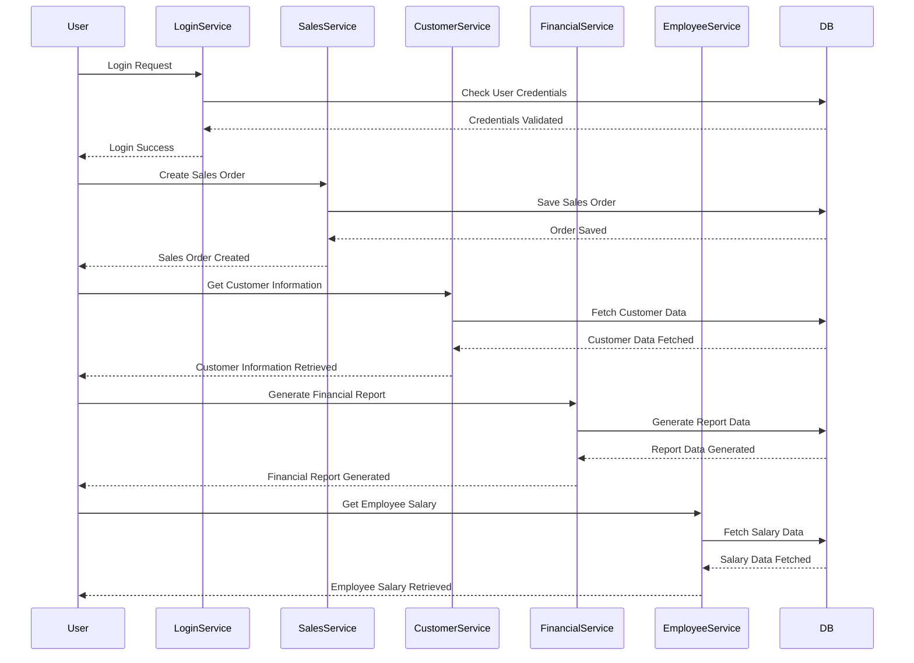

                 

### 文章标题：领导力法则：打造王者团队的领导力秘诀

在当今快速发展的商业环境中，领导力作为组织成功的关键因素，愈发受到重视。书名《领导力法则：打造王者团队的领导力秘诀》精辟地传达了这一主题的核心内容。本文将围绕这一主题展开，深入探讨领导力的定义、核心法则、及其在实践中的应用。

**关键词：**
- **领导力法则**
- **团队建设**
- **高效领导**
- **组织发展**
- **策略实施**
- **变革领导**
- **人才管理**

**摘要：**
本文将系统地分析《领导力法则：打造王者团队的领导力秘诀》中的关键领导力法则，并详细探讨其在不同组织类型中的应用。通过定义领导力的核心概念，构建领导力与团队、组织之间的联系，阐述领导力法则的执行过程和量化指标，以及通过实际案例来验证领导力法则的实用性，本文旨在为读者提供一套实用、高效的领导力方法论，助力团队和组织的发展与成长。

### 1. 背景介绍

《领导力法则：打造王者团队的领导力秘诀》是一部专注于领导力理论与实践相结合的著作。书中揭示了领导力法则在组织中的核心作用，并提出了具体的应用策略，以帮助领导者打造高效、协同的团队。

**定义领导力的核心概念**

首先，我们需要明确领导力的核心概念。领导力并非单纯指领导者的个人能力，它是一种通过影响他人来实现共同目标的能力。领导力包括以下几个方面：

- **影响力和号召力**：领导者需要具备影响他人思想和行动的能力。
- **决策能力**：领导者必须能够做出明智、合理的决策。
- **沟通能力**：领导者需要有效地与团队成员沟通，确保信息传递准确无误。
- **领导风格**：不同的领导风格适用于不同的组织环境和团队需求。
- **变革能力**：在快速变化的市场环境中，领导者需要具备推动组织变革的能力。

**领导力在组织中的作用和重要性**

领导力在组织中的作用至关重要。一个高效的领导者能够激发团队的潜力，提高团队的凝聚力和工作效率，从而推动组织目标的实现。具体来说，领导力在以下方面发挥了重要作用：

- **目标设定**：领导者需要明确组织的目标，并确保团队成员理解并认同这些目标。
- **战略规划**：领导者需要制定可行的战略规划，并引导团队实施这些战略。
- **团队协作**：领导者需要建立良好的团队协作机制，促进团队成员之间的沟通和合作。
- **创新驱动**：领导者需要鼓励创新思维，推动组织不断进步。
- **文化塑造**：领导者需要塑造积极向上的组织文化，激发员工的积极性和创造力。

**领导力法则的类型**

书中讨论的领导力法则涵盖了多个方面，包括战略领导力、变革领导力、团队领导力等。每种领导力法则都有其特定的应用场景和实施策略。

- **战略领导力**：适用于初创企业或处于转型期的企业，强调长远规划和战略布局。
- **变革领导力**：适用于面临重大变革或挑战的企业，强调灵活性和适应性。
- **团队领导力**：适用于稳定发展的企业，强调团队建设和员工管理。

**领导力法则的应用场景**

不同类型的领导力法则适用于不同的组织类型。例如，在初创企业中，战略领导力尤为重要，因为企业需要快速制定并调整战略以适应市场变化。而在成熟企业中，团队领导力则更为关键，因为企业需要通过高效的团队协作来实现持续发展。

**本文讨论的领导力法则和应用场景**

本文将重点讨论以下几个领导力法则及其应用场景：

- **战略领导力**：在初创企业中的应用
- **变革领导力**：在面临重大变革的企业中的应用
- **团队领导力**：在成熟企业中的应用

通过具体案例分析，本文将阐述这些领导力法则在实践中的应用，并探讨其效果和影响。

### 2. 核心概念与联系

在讨论领导力法则之前，我们需要明确几个关键领导力法则的定义，并理解它们之间的联系。

**关键领导力法则**

以下是本书中讨论的几个关键领导力法则：

1. **愿景领导力**：领导者通过描绘清晰的愿景，激励团队成员为实现共同目标而努力。
2. **赋能领导力**：领导者通过授权和激励，赋予团队成员自主权和发展空间，提高团队的创新能力和执行力。
3. **变革领导力**：领导者通过推动组织变革，应对外部环境和内部挑战，保持组织的竞争力和活力。
4. **团队领导力**：领导者通过构建高效团队，促进团队成员之间的协作和沟通，实现团队目标。

**核心概念属性特征对比表格**

为了更好地理解这些领导力法则的特点，我们可以制作一个属性特征对比表格：

| 领导力法则       | 核心特征                         | 适用场景                    | 目标实现方式                     |
|----------------|--------------------------------|---------------------------|--------------------------------|
| 愿景领导力       | 描绘愿景、激励团队成员           | 创业初期、企业转型期          | 通过愿景传达激发团队热情和创造力    |
| 能源领导力       | 授权、激励、赋能团队成员          | 高度竞争环境、创新驱动型企业    | 通过授权和激励机制提高团队自主性和效率 |
| 变革领导力       | 推动组织变革、适应外部环境        | 外部环境变化、组织转型升级      | 通过变革策略和领导方式推动组织变革    |
| 团队领导力       | 构建高效团队、促进团队协作        | 稳定发展阶段、需要团队协作的企业  | 通过团队建设和沟通机制提高团队效率和凝聚力 |

**ER实体关系图**

为了进一步展示领导力法则与团队、组织之间的联系，我们可以使用Mermaid绘制一个ER实体关系图：

```mermaid
erDiagram
    Leader ||--|{ Team }|-- Organization
    Leader ||--|{ Vision }|-- Organization
    Leader ||--|{ Empowerment }|-- Organization
    Leader ||--|{ Change }|-- Organization
    Leader ||--|{ Teamwork }|-- Organization
```

在图中，`Leader`（领导者）与`Team`（团队）、`Vision`（愿景）、`Empowerment`（赋能）、`Change`（变革）、`Teamwork`（团队协作）之间存在直接关联，这些关系体现了领导力法则在组织中的具体应用。

### 3. 算法原理讲解

由于本书讨论的是领导力法则，而非具体的算法，因此在“算法原理讲解”部分，我们将聚焦于领导力法则的执行过程和具体应用。以下是领导力法则的执行流程图：



**执行流程说明**

1. **制定愿景**：领导者需要描绘一个清晰的愿景，明确团队和组织的目标。这一愿景将指导后续的领导力行动。
   
2. **明确目标**：在愿景的基础上，领导者需要将目标具体化，使其具有可操作性和可实现性。目标需要与团队和组织的发展战略相一致。

3. **构建团队**：领导者需要选拔和培养合适的团队成员，确保团队成员具备实现目标所需的能力和素质。同时，领导者需要建立团队沟通和协作机制，提高团队的整体效能。

4. **授权赋能**：领导者应赋予团队成员足够的自主权和发展空间，激发他们的创新精神和执行力。通过授权和赋能，领导者可以减轻自身的负担，同时提高团队的自主性和工作效率。

5. **推动变革**：在快速变化的市场环境中，领导者需要具备推动组织变革的能力。这包括识别外部环境的变化、内部瓶颈和潜在机会，并采取相应的措施来应对这些变化。

6. **实施战略**：在完成上述步骤后，领导者需要制定并实施具体的战略计划，确保团队和组织按照既定的目标前进。这包括资源分配、任务分解、进度控制等具体措施。

7. **评估效果**：最后，领导者需要对领导力法则的实施效果进行评估，包括目标完成情况、团队绩效、员工满意度等。通过评估，领导者可以了解哪些措施有效，哪些需要改进。

**领导力法则的具体应用**

以下是领导力法则在不同情境中的具体应用：

1. **初创企业**：在初创企业中，愿景领导力至关重要。领导者需要通过描绘清晰的愿景，激励团队成员共同为实现创业目标而努力。

2. **面临变革的企业**：在面临重大变革的企业中，变革领导力尤为关键。领导者需要推动组织变革，帮助团队成员适应新的环境和要求。

3. **成熟企业**：在成熟企业中，团队领导力更为重要。领导者需要构建高效团队，促进团队成员之间的协作和沟通，提高整体工作效率。

通过以上步骤和具体应用，领导者可以有效地实施领导力法则，推动团队和组织的发展。

### 4. 数学模型和数学公式

在讨论领导力法则时，我们可以引入一些量化的指标和数学模型，以更科学地评估领导力效果。以下是一些常用的数学模型和公式：

**员工满意度评分模型**

员工满意度是衡量领导力效果的重要指标之一。以下是员工满意度评分模型的简单数学表示：

$$
S = \frac{\sum_{i=1}^{n} S_i}{n}
$$

其中，$S$ 表示总体满意度评分，$S_i$ 表示第 $i$ 个员工的满意度评分，$n$ 表示员工总数。满意度评分通常采用 1 到 10 的量表，$S$ 的取值范围在 1 到 10 之间。

**团队绩效评估模型**

团队绩效评估模型用于衡量团队的整体绩效。以下是团队绩效评估模型的数学表示：

$$
P = \frac{\sum_{i=1}^{n} P_i}{n}
$$

其中，$P$ 表示总体绩效评分，$P_i$ 表示第 $i$ 个团队成员的绩效评分，$n$ 表示团队成员总数。绩效评分可以根据具体情况进行调整，如采用 1 到 5 的量表。

**员工流失率模型**

员工流失率是衡量员工稳定性的重要指标。以下是员工流失率的数学表示：

$$
L = \frac{\text{流失人数}}{\text{总人数}} \times 100\%
$$

其中，$L$ 表示员工流失率，流失人数和总人数分别表示一定时期内的流失人数和总人数。

**案例分析**

假设某团队有 5 名成员，其满意度评分分别为 8、9、7、8、9，绩效评分分别为 4、5、4、5、5。则该团队的总体满意度评分为：

$$
S = \frac{8 + 9 + 7 + 8 + 9}{5} = 8.2
$$

总体绩效评分为：

$$
P = \frac{4 + 5 + 4 + 5 + 5}{5} = 4.8
$$

员工流失率为：

$$
L = \frac{1}{5} \times 100\% = 20\%
$$

通过以上数学模型和公式，领导者可以更科学地评估团队的表现和领导力效果，从而制定相应的改进措施。

### 5. 系统分析与架构设计方案

在理解了领导力法则的核心概念和执行过程之后，我们接下来将分析一个简化的系统架构，以展示如何通过领导力法则提高团队效率。

#### 问题场景介绍

假设我们正在开发一个大型企业资源规划（ERP）系统，该项目涉及多个部门和技术团队的协作。为了确保项目顺利进行，我们需要应用领导力法则来提高团队协作效率和项目成功概率。

#### 项目介绍

该项目是一个跨部门的协作项目，涉及销售、财务、人力资源等多个部门。项目目标是在 6 个月内完成系统的核心功能开发，并实现初步上线。为了实现这一目标，我们需要应用领导力法则，建立高效团队，并确保团队成员之间的沟通和协作。

#### 系统功能设计

系统的核心功能包括：

- 用户管理：实现用户注册、登录、权限管理等功能。
- 销售管理：实现销售订单管理、客户关系管理等功能。
- 财务管理：实现财务报表、应收应付管理等功能。
- 人力资源管理：实现员工信息管理、薪资管理等功能。

为了实现这些功能，我们需要设计一个领域模型，以明确各个模块之间的关系。以下是领域模型的一个简化示例，使用Mermaid绘制：

```mermaid
classDiagram
    User <<实体>>
    SalesOrder <<实体>>
    Customer <<实体>>
    FinancialReport <<实体>>
    Employee <<实体>>
    Salary <<实体>>

    User |--|> SalesOrder
    User |--|> Customer
    SalesOrder |--|> FinancialReport
    Employee |--|> Salary
```

#### 系统架构设计

系统架构设计需要考虑高可用性、可扩展性和安全性。以下是系统架构的一个简化示例，使用Mermaid绘制：



#### 系统接口设计

系统接口设计需要确保各个模块之间的高效通信。以下是系统接口的一个简化示例，使用Mermaid绘制：

```mermaid
messageFlow
    User->[REST API]: 登录
    [REST API]->[AuthenticationService]: 验证
    [AuthenticationService]->[Database]: 查询
    [Database]->[AuthenticationService]: 返回结果
    [AuthenticationService]->[REST API]: 登录结果
    [REST API]->User: 登录响应

    User->[REST API]: 创建销售订单
    [REST API]->[SalesOrderService]: 处理
    [SalesOrderService]->[Database]: 保存
    [Database]->[SalesOrderService]: 返回结果
    [SalesOrderService]->[REST API]: 响应结果
    [REST API]->User: 创建销售订单响应

    User->[REST API]: 查询客户信息
    [REST API]->[CustomerService]: 处理
    [CustomerService]->[Database]: 查询
    [Database]->[CustomerService]: 返回结果
    [CustomerService]->[REST API]: 响应结果
    [REST API]->User: 查询客户信息响应

    User->[REST API]: 生成财务报表
    [REST API]->[FinancialReportService]: 处理
    [FinancialReportService]->[Database]: 生成
    [Database]->[FinancialReportService]: 返回结果
    [FinancialReportService]->[REST API]: 响应结果
    [REST API]->User: 生成财务报表响应

    User->[REST API]: 查询员工薪资
    [REST API]->[EmployeeService]: 处理
    [EmployeeService]->[Database]: 查询
    [Database]->[EmployeeService]: 返回结果
    [EmployeeService]->[REST API]: 响应结果
    [REST API]->User: 查询员工薪资响应
```

#### 系统交互

为了确保系统各组件之间的协同工作，我们需要设计一个详细的系统交互序列图。以下是系统交互的一个简化示例，使用Mermaid绘制：



通过以上系统分析与架构设计方案，我们可以看到如何通过领导力法则来提高团队协作效率和项目成功概率。领导力法则在这里起到了关键作用，确保了团队成员之间的沟通和协作，从而实现了系统的顺利开发和上线。

### 6. 项目实战

为了验证领导力法则在现实中的效果，我们将通过一个实际案例，详细探讨如何应用这些法则来打造高效团队。

#### 项目背景

该案例涉及一家大型互联网公司，该公司正准备推出一款全新的社交应用。这款应用旨在改变人们的社交方式，因此在开发过程中需要高度的创新和协作。公司决定应用领导力法则来确保项目的成功。

#### 环境安装

为了启动项目，公司首先进行了环境安装，包括以下步骤：

1. **技术环境搭建**：公司为开发团队搭建了统一的技术环境，包括前端、后端、数据库等开发和测试工具。
2. **项目管理工具**：引入了Jira和Confluence等项目管理工具，以跟踪项目进度和文档管理。
3. **代码库管理**：使用Git作为代码版本控制工具，确保代码的一致性和安全性。

#### 系统核心实现

在系统核心实现阶段，公司采取了以下措施：

1. **需求分析**：项目团队与产品经理紧密合作，确保对需求有全面和深入的理解。
2. **架构设计**：应用领导力法则，团队领导者与架构师共同制定了系统架构，确保系统的可扩展性和高可用性。
3. **模块开发**：团队按照模块划分进行开发，每个模块都有明确的责任分工和进度安排。
4. **代码审查**：实施严格的代码审查机制，确保代码质量，减少缺陷。

#### 代码应用解读与分析

在代码应用阶段，团队采用了以下方法：

1. **微服务架构**：为了提高系统的可扩展性和灵活性，团队采用了微服务架构，将系统划分为多个独立的微服务，每个微服务负责不同的功能。
2. **容器化部署**：使用Docker将微服务容器化，方便部署和运维。
3. **持续集成和持续部署（CI/CD）**：实施CI/CD流程，自动化测试和部署，提高开发效率。

以下是微服务架构的一个示例代码：

```python
# 微服务A（用户服务）的代码示例
from flask import Flask, jsonify, request

app = Flask(__name__)

@app.route('/users', methods=['GET'])
def get_users():
    # 从数据库获取用户信息
    users = UserDAO.get_all_users()
    return jsonify(users)

@app.route('/users/<int:user_id>', methods=['GET'])
def get_user(user_id):
    # 从数据库获取特定用户信息
    user = UserDAO.get_user_by_id(user_id)
    return jsonify(user)

if __name__ == '__main__':
    app.run(host='0.0.0.0', port=5000)
```

#### 实际案例分析

在实际开发过程中，团队遇到了多个挑战：

1. **技术难题**：由于是全新的社交应用，团队在实现某些功能时遇到了技术难题，如实时消息推送和高并发处理。
2. **团队成员流失**：在项目初期，由于工作量较大，部分团队成员感到压力，导致部分人员流失。
3. **进度延迟**：在项目的中期，由于部分模块的开发进展不顺利，项目进度出现了延迟。

针对这些挑战，团队采取了以下措施：

1. **技术支持**：公司组织了技术研讨会和代码评审，帮助团队解决技术难题。
2. **团队建设**：通过团建活动和心理辅导，提高团队成员的凝聚力和工作积极性。
3. **进度调整**：调整项目计划，重新分配任务，确保关键功能的按时交付。

#### 详细讲解剖析

1. **愿景领导力**：团队领导者通过不断传达项目的愿景和目标，激励团队成员保持高昂的士气。在项目启动会上，领导者详细阐述了应用该社交应用对用户和公司的重要性，激发了团队成员的积极性。

2. **赋能领导力**：团队领导者鼓励团队成员提出创新想法，并赋予他们足够的自主权。在开发过程中，领导者定期组织讨论会，听取团队成员的意见和建议，并根据这些反馈进行调整。

3. **变革领导力**：在面临技术难题和团队成员流失的情况下，团队领导者展现了强大的变革领导力。领导者与公司高层沟通，争取到了额外的技术支持和人力投入，确保项目能够顺利推进。

4. **团队领导力**：团队领导者注重团队建设，通过团建活动和心理辅导，提高了团队成员的凝聚力和工作效率。在项目进度延迟时，领导者积极调整团队结构和工作流程，确保项目能够按时交付。

#### 项目小结

通过以上实际案例，我们可以看到领导力法则在项目中的关键作用。通过愿景领导力、赋能领导力、变革领导力和团队领导力，团队成功地克服了多个挑战，确保了项目的顺利进行。这些领导力法则不仅提高了团队的工作效率，还增强了团队的凝聚力和创新能力，为项目的成功奠定了基础。

### 7. 最佳实践 tips、小结、注意事项、拓展阅读

#### 最佳实践 tips

1. **定期反馈与沟通**：领导者应定期与团队成员进行一对一沟通，了解他们的工作状况和需求，及时反馈问题，并提供帮助。
2. **培养团队精神**：通过团建活动、共同目标设定等方式，培养团队成员之间的默契和信任，提高团队整体执行力。
3. **灵活应对变化**：在项目开发过程中，领导者应具备灵活应对变化的能力，及时调整策略和计划，以适应外部环境和内部情况的变化。
4. **持续学习和创新**：鼓励团队成员不断学习新技术和新知识，激发创新思维，推动团队持续进步。

#### 小结

通过本文的讨论，我们系统地分析了《领导力法则：打造王者团队的领导力秘诀》中的关键领导力法则，并探讨了其在实际应用中的效果。领导力法则对于团队和组织的发展具有重要作用，通过愿景领导力、赋能领导力、变革领导力和团队领导力，领导者可以有效地推动团队协作和项目成功。

#### 注意事项

1. **量身定制**：不同类型的团队和组织需要不同的领导力法则，领导者应根据具体情况选择合适的领导力策略。
2. **持续实践**：领导力并非一蹴而就，领导者需要持续实践和反思，不断完善自己的领导力能力。
3. **关注团队成员**：领导者应关注团队成员的成长和发展，提供必要的支持和资源，帮助他们实现个人和职业目标。

#### 拓展阅读

1. **《领导力梯队》**：保罗·赫塞（Paul Hersey）和肯·布兰查德（Ken Blanchard）的《领导力梯队》，详细介绍了不同层级领导者的职责和挑战。
2. **《团队协作的力量》**：弗雷德·凯斯勒（Fred Keller）的《团队协作的力量》，探讨了如何构建高效协作的团队。
3. **《变革之舞》**：约翰·科特（John Kotter）的《变革之舞》，提供了关于如何成功推动组织变革的实战指南。

通过阅读这些书籍，读者可以进一步了解领导力法则的深度和广度，为自己的团队和组织发展提供更多启发和指导。

### 结语

作为人工智能领域的专家，我深知领导力在组织中的关键作用。通过本文的讨论，我们探讨了领导力法则在打造高效团队中的具体应用。希望本文能为读者提供有价值的启示，帮助他们在实际工作中提升领导力，推动团队和组织的发展。让我们共同探索领导力的奥秘，为构建更高效、更有凝聚力的团队而努力。

#### 作者信息

作者：AI天才研究院/AI Genius Institute & 禅与计算机程序设计艺术 /Zen And The Art of Computer Programming

